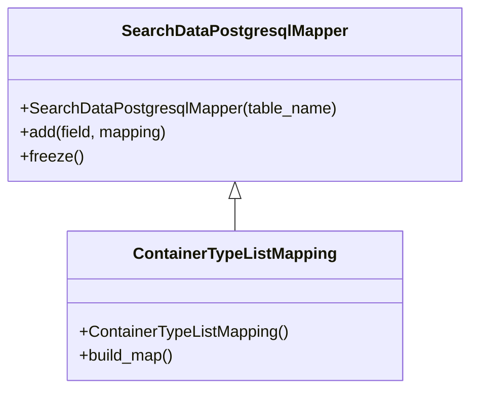

# Diagram: application_service/container_tracking_app_service/persistance_adapter/postgresql/ContainerTypeListMapping.py


> Auto-generated by Obscura crawlers

## Diagram 1



### SVG

<svg id="container" width="464.3984375" xmlns="http://www.w3.org/2000/svg" class="classDiagram" height="390" viewBox="0 0 464.3984375 390" role="graphics-document document" aria-roledescription="class"><style>#container{font-family:"trebuchet ms",verdana,arial,sans-serif;font-size:16px;fill:#333;}@keyframes edge-animation-frame{from{stroke-dashoffset:0;}}@keyframes dash{to{stroke-dashoffset:0;}}#container .edge-animation-slow{stroke-dasharray:9,5!important;stroke-dashoffset:900;animation:dash 50s linear infinite;stroke-linecap:round;}#container .edge-animation-fast{stroke-dasharray:9,5!important;stroke-dashoffset:900;animation:dash 20s linear infinite;stroke-linecap:round;}#container .error-icon{fill:#552222;}#container .error-text{fill:#552222;stroke:#552222;}#container .edge-thickness-normal{stroke-width:1px;}#container .edge-thickness-thick{stroke-width:3.5px;}#container .edge-pattern-solid{stroke-dasharray:0;}#container .edge-thickness-invisible{stroke-width:0;fill:none;}#container .edge-pattern-dashed{stroke-dasharray:3;}#container .edge-pattern-dotted{stroke-dasharray:2;}#container .marker{fill:#333333;stroke:#333333;}#container .marker.cross{stroke:#333333;}#container svg{font-family:"trebuchet ms",verdana,arial,sans-serif;font-size:16px;}#container p{margin:0;}#container g.classGroup text{fill:#9370DB;stroke:none;font-family:"trebuchet ms",verdana,arial,sans-serif;font-size:10px;}#container g.classGroup text .title{font-weight:bolder;}#container .nodeLabel,#container .edgeLabel{color:#131300;}#container .edgeLabel .label rect{fill:#ECECFF;}#container .label text{fill:#131300;}#container .labelBkg{background:#ECECFF;}#container .edgeLabel .label span{background:#ECECFF;}#container .classTitle{font-weight:bolder;}#container .node rect,#container .node circle,#container .node ellipse,#container .node polygon,#container .node path{fill:#ECECFF;stroke:#9370DB;stroke-width:1px;}#container .divider{stroke:#9370DB;stroke-width:1;}#container g.clickable{cursor:pointer;}#container g.classGroup rect{fill:#ECECFF;stroke:#9370DB;}#container g.classGroup line{stroke:#9370DB;stroke-width:1;}#container .classLabel .box{stroke:none;stroke-width:0;fill:#ECECFF;opacity:0.5;}#container .classLabel .label{fill:#9370DB;font-size:10px;}#container .relation{stroke:#333333;stroke-width:1;fill:none;}#container .dashed-line{stroke-dasharray:3;}#container .dotted-line{stroke-dasharray:1 2;}#container #compositionStart,#container .composition{fill:#333333!important;stroke:#333333!important;stroke-width:1;}#container #compositionEnd,#container .composition{fill:#333333!important;stroke:#333333!important;stroke-width:1;}#container #dependencyStart,#container .dependency{fill:#333333!important;stroke:#333333!important;stroke-width:1;}#container #dependencyStart,#container .dependency{fill:#333333!important;stroke:#333333!important;stroke-width:1;}#container #extensionStart,#container .extension{fill:transparent!important;stroke:#333333!important;stroke-width:1;}#container #extensionEnd,#container .extension{fill:transparent!important;stroke:#333333!important;stroke-width:1;}#container #aggregationStart,#container .aggregation{fill:transparent!important;stroke:#333333!important;stroke-width:1;}#container #aggregationEnd,#container .aggregation{fill:transparent!important;stroke:#333333!important;stroke-width:1;}#container #lollipopStart,#container .lollipop{fill:#ECECFF!important;stroke:#333333!important;stroke-width:1;}#container #lollipopEnd,#container .lollipop{fill:#ECECFF!important;stroke:#333333!important;stroke-width:1;}#container .edgeTerminals{font-size:11px;line-height:initial;}#container .classTitleText{text-anchor:middle;font-size:18px;fill:#333;}#container .label-icon{display:inline-block;height:1em;overflow:visible;vertical-align:-0.125em;}#container .node .label-icon path{fill:currentColor;stroke:revert;stroke-width:revert;}#container :root{--mermaid-font-family:"trebuchet ms",verdana,arial,sans-serif;}</style><g><defs><marker id="container_class-aggregationStart" class="marker aggregation class" refX="18" refY="7" markerWidth="190" markerHeight="240" orient="auto"><path d="M 18,7 L9,13 L1,7 L9,1 Z"></path></marker></defs><defs><marker id="container_class-aggregationEnd" class="marker aggregation class" refX="1" refY="7" markerWidth="20" markerHeight="28" orient="auto"><path d="M 18,7 L9,13 L1,7 L9,1 Z"></path></marker></defs><defs><marker id="container_class-extensionStart" class="marker extension class" refX="18" refY="7" markerWidth="190" markerHeight="240" orient="auto"><path d="M 1,7 L18,13 V 1 Z"></path></marker></defs><defs><marker id="container_class-extensionEnd" class="marker extension class" refX="1" refY="7" markerWidth="20" markerHeight="28" orient="auto"><path d="M 1,1 V 13 L18,7 Z"></path></marker></defs><defs><marker id="container_class-compositionStart" class="marker composition class" refX="18" refY="7" markerWidth="190" markerHeight="240" orient="auto"><path d="M 18,7 L9,13 L1,7 L9,1 Z"></path></marker></defs><defs><marker id="container_class-compositionEnd" class="marker composition class" refX="1" refY="7" markerWidth="20" markerHeight="28" orient="auto"><path d="M 18,7 L9,13 L1,7 L9,1 Z"></path></marker></defs><defs><marker id="container_class-dependencyStart" class="marker dependency class" refX="6" refY="7" markerWidth="190" markerHeight="240" orient="auto"><path d="M 5,7 L9,13 L1,7 L9,1 Z"></path></marker></defs><defs><marker id="container_class-dependencyEnd" class="marker dependency class" refX="13" refY="7" markerWidth="20" markerHeight="28" orient="auto"><path d="M 18,7 L9,13 L14,7 L9,1 Z"></path></marker></defs><defs><marker id="container_class-lollipopStart" class="marker lollipop class" refX="13" refY="7" markerWidth="190" markerHeight="240" orient="auto"><circle stroke="black" fill="transparent" cx="7" cy="7" r="6"></circle></marker></defs><defs><marker id="container_class-lollipopEnd" class="marker lollipop class" refX="1" refY="7" markerWidth="190" markerHeight="240" orient="auto"><circle stroke="black" fill="transparent" cx="7" cy="7" r="6"></circle></marker></defs><g class="root"><g class="clusters"></g><g class="edgePaths"><path d="M232.199,199.25L232.199,200.542C232.199,201.833,232.199,204.417,232.199,209.875C232.199,215.333,232.199,223.667,232.199,227.833L232.199,232" id="id_SearchDataPostgresqlMapper_ContainerTypeListMapping_1" class="edge-thickness-normal edge-pattern-solid relation" style=";;;" data-edge="true" data-et="edge" data-id="id_SearchDataPostgresqlMapper_ContainerTypeListMapping_1" data-points="W3sieCI6MjMyLjE5OTIxODc1LCJ5IjoxODJ9LHsieCI6MjMyLjE5OTIxODc1LCJ5IjoyMDd9LHsieCI6MjMyLjE5OTIxODc1LCJ5IjoyMzJ9XQ==" marker-start="url(#container_class-extensionStart)"></path></g><g class="edgeLabels"><g class="edgeLabel"><g class="label" data-id="id_SearchDataPostgresqlMapper_ContainerTypeListMapping_1" transform="translate(0, 0)"><foreignObject width="0" height="0"><div xmlns="http://www.w3.org/1999/xhtml" class="labelBkg" style="display: table-cell; white-space: nowrap; line-height: 1.5; max-width: 200px; text-align: center;"><span class="edgeLabel"></span></div></foreignObject></g></g></g><g class="nodes"><g class="node default" id="classId-SearchDataPostgresqlMapper-0" transform="translate(232.19921875, 95)"><g class="basic label-container"><path d="M-224.19921875 -87 L224.19921875 -87 L224.19921875 87 L-224.19921875 87" stroke="none" stroke-width="0" fill="#ECECFF" style=""></path><path d="M-224.19921875 -87 C-112.27559612429317 -87, -0.3519734985863465 -87, 224.19921875 -87 M-224.19921875 -87 C-99.5769369915445 -87, 25.045344766911 -87, 224.19921875 -87 M224.19921875 -87 C224.19921875 -36.7915908430764, 224.19921875 13.416818313847202, 224.19921875 87 M224.19921875 -87 C224.19921875 -51.53290382165026, 224.19921875 -16.065807643300516, 224.19921875 87 M224.19921875 87 C82.44368053660338 87, -59.31185767679324 87, -224.19921875 87 M224.19921875 87 C102.31993137521316 87, -19.559355999573683 87, -224.19921875 87 M-224.19921875 87 C-224.19921875 47.77379802438581, -224.19921875 8.547596048771624, -224.19921875 -87 M-224.19921875 87 C-224.19921875 25.68574963359145, -224.19921875 -35.6285007328171, -224.19921875 -87" stroke="#9370DB" stroke-width="1.3" fill="none" stroke-dasharray="0 0" style=""></path></g><g class="annotation-group text" transform="translate(0, -63)"></g><g class="label-group text" transform="translate(-108.3515625, -63)"><g class="label" style="font-weight: bolder" transform="translate(0,-12)"><foreignObject width="216.703125" height="24"><div xmlns="http://www.w3.org/1999/xhtml" style="display: table-cell; white-space: nowrap; line-height: 1.5; max-width: 263px; text-align: center;"><span class="nodeLabel markdown-node-label" style=""><p>SearchDataPostgresqlMapper</p></span></div></foreignObject></g></g><g class="members-group text" transform="translate(-212.19921875, -15)"></g><g class="methods-group text" transform="translate(-212.19921875, 15)"><g class="label" style="" transform="translate(0,-12)"><foreignObject width="316.046875" height="24"><div xmlns="http://www.w3.org/1999/xhtml" style="display: table-cell; white-space: nowrap; line-height: 1.5; max-width: 373px; text-align: center;"><span class="nodeLabel markdown-node-label" style=""><p>+SearchDataPostgresqlMapper(table_name)</p></span></div></foreignObject></g><g class="label" style="" transform="translate(0,12)"><foreignObject width="149.765625" height="24"><div xmlns="http://www.w3.org/1999/xhtml" style="display: table-cell; white-space: nowrap; line-height: 1.5; max-width: 207px; text-align: center;"><span class="nodeLabel markdown-node-label" style=""><p>+add(field, mapping)</p></span></div></foreignObject></g><g class="label" style="" transform="translate(0,36)"><foreignObject width="62.109375" height="24"><div xmlns="http://www.w3.org/1999/xhtml" style="display: table-cell; white-space: nowrap; line-height: 1.5; max-width: 119px; text-align: center;"><span class="nodeLabel markdown-node-label" style=""><p>+freeze()</p></span></div></foreignObject></g></g><g class="divider" style=""><path d="M-224.19921875 -39 C-55.38471064212601 -39, 113.42979746574798 -39, 224.19921875 -39 M-224.19921875 -39 C-107.57211727392455 -39, 9.054984202150905 -39, 224.19921875 -39" stroke="#9370DB" stroke-width="1.3" fill="none" stroke-dasharray="0 0" style=""></path></g><g class="divider" style=""><path d="M-224.19921875 -15 C-126.55425937192358 -15, -28.909299993847156 -15, 224.19921875 -15 M-224.19921875 -15 C-89.96094839340924 -15, 44.27732196318152 -15, 224.19921875 -15" stroke="#9370DB" stroke-width="1.3" fill="none" stroke-dasharray="0 0" style=""></path></g></g><g class="node default" id="classId-ContainerTypeListMapping-1" transform="translate(232.19921875, 307)"><g class="basic label-container"><path d="M-166.23046875 -75 L166.23046875 -75 L166.23046875 75 L-166.23046875 75" stroke="none" stroke-width="0" fill="#ECECFF" style=""></path><path d="M-166.23046875 -75 C-47.91164124462023 -75, 70.40718626075954 -75, 166.23046875 -75 M-166.23046875 -75 C-81.08158510764304 -75, 4.067298534713927 -75, 166.23046875 -75 M166.23046875 -75 C166.23046875 -15.880583014848199, 166.23046875 43.2388339703036, 166.23046875 75 M166.23046875 -75 C166.23046875 -35.23949524836561, 166.23046875 4.521009503268786, 166.23046875 75 M166.23046875 75 C92.15346611342531 75, 18.07646347685062 75, -166.23046875 75 M166.23046875 75 C34.89019673862896 75, -96.45007527274208 75, -166.23046875 75 M-166.23046875 75 C-166.23046875 34.66880261521423, -166.23046875 -5.662394769571534, -166.23046875 -75 M-166.23046875 75 C-166.23046875 32.20793843324221, -166.23046875 -10.584123133515575, -166.23046875 -75" stroke="#9370DB" stroke-width="1.3" fill="none" stroke-dasharray="0 0" style=""></path></g><g class="annotation-group text" transform="translate(0, -51)"></g><g class="label-group text" transform="translate(-97.7578125, -51)"><g class="label" style="font-weight: bolder" transform="translate(0,-12)"><foreignObject width="195.515625" height="24"><div xmlns="http://www.w3.org/1999/xhtml" style="display: table-cell; white-space: nowrap; line-height: 1.5; max-width: 243px; text-align: center;"><span class="nodeLabel markdown-node-label" style=""><p>ContainerTypeListMapping</p></span></div></foreignObject></g></g><g class="members-group text" transform="translate(-154.23046875, -3)"></g><g class="methods-group text" transform="translate(-154.23046875, 27)"><g class="label" style="" transform="translate(0,-12)"><foreignObject width="210.703125" height="24"><div xmlns="http://www.w3.org/1999/xhtml" style="display: table-cell; white-space: nowrap; line-height: 1.5; max-width: 268px; text-align: center;"><span class="nodeLabel markdown-node-label" style=""><p>+ContainerTypeListMapping()</p></span></div></foreignObject></g><g class="label" style="" transform="translate(0,12)"><foreignObject width="96.109375" height="24"><div xmlns="http://www.w3.org/1999/xhtml" style="display: table-cell; white-space: nowrap; line-height: 1.5; max-width: 153px; text-align: center;"><span class="nodeLabel markdown-node-label" style=""><p>+build_map()</p></span></div></foreignObject></g></g><g class="divider" style=""><path d="M-166.23046875 -27 C-54.144818691236026 -27, 57.94083136752795 -27, 166.23046875 -27 M-166.23046875 -27 C-95.08022156992361 -27, -23.929974389847217 -27, 166.23046875 -27" stroke="#9370DB" stroke-width="1.3" fill="none" stroke-dasharray="0 0" style=""></path></g><g class="divider" style=""><path d="M-166.23046875 -3 C-74.26122797890334 -3, 17.70801279219333 -3, 166.23046875 -3 M-166.23046875 -3 C-63.018243975396985 -3, 40.19398079920603 -3, 166.23046875 -3" stroke="#9370DB" stroke-width="1.3" fill="none" stroke-dasharray="0 0" style=""></path></g></g></g></g></g></svg>

## Diagram 2

```mermaid
flowchart TD
    Init[ContainerTypeListMapping.__init__()] --> SuperInit[SearchDataPostgresqlMapper.__init__('reuse_trip_container_type_mapping')]
    SuperInit --> Freeze[freeze()]
    Freeze --> Build[build_map()]
    Build --> A[add(type : type)]
    A --> B[add(solution_id : solution_id)]
    B --> C[add(status : status)]
    C --> D[add(full_count : full_count)]
    D --> End[Mapping complete]
```

> SVG rendering failed for this diagram.
