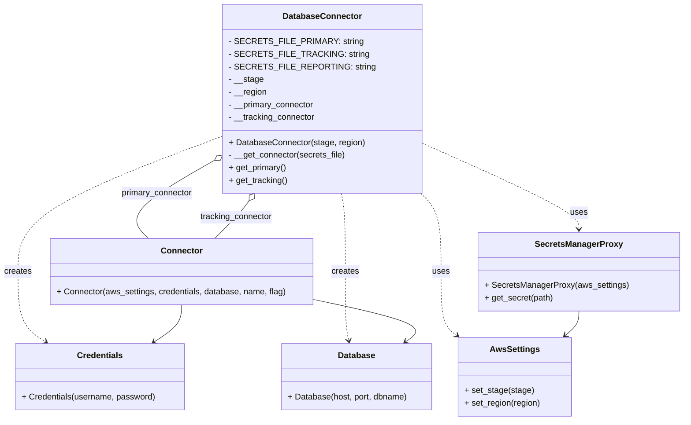

# Diagram: application_service/container_tracking_app_service/persistance_adapter/postgresql/DatabaseConnector.py

> Auto-generated by Obscura crawlers

## Mermaid

### SVG

<svg id="container" width="1288.76171875" xmlns="http://www.w3.org/2000/svg" class="classDiagram" height="800" viewBox="0 0 1288.76171875 800" role="graphics-document document" aria-roledescription="class"><g><defs><marker id="container_class-aggregationStart" class="marker aggregation class" refX="18" refY="7" markerWidth="190" markerHeight="240" orient="auto"><path d="M 18,7 L9,13 L1,7 L9,1 Z"></path></marker></defs><defs><marker id="container_class-aggregationEnd" class="marker aggregation class" refX="1" refY="7" markerWidth="20" markerHeight="28" orient="auto"><path d="M 18,7 L9,13 L1,7 L9,1 Z"></path></marker></defs><defs><marker id="container_class-extensionStart" class="marker extension class" refX="18" refY="7" markerWidth="190" markerHeight="240" orient="auto"><path d="M 1,7 L18,13 V 1 Z"></path></marker></defs><defs><marker id="container_class-extensionEnd" class="marker extension class" refX="1" refY="7" markerWidth="20" markerHeight="28" orient="auto"><path d="M 1,1 V 13 L18,7 Z"></path></marker></defs><defs><marker id="container_class-compositionStart" class="marker composition class" refX="18" refY="7" markerWidth="190" markerHeight="240" orient="auto"><path d="M 18,7 L9,13 L1,7 L9,1 Z"></path></marker></defs><defs><marker id="container_class-compositionEnd" class="marker composition class" refX="1" refY="7" markerWidth="20" markerHeight="28" orient="auto"><path d="M 18,7 L9,13 L1,7 L9,1 Z"></path></marker></defs><defs><marker id="container_class-dependencyStart" class="marker dependency class" refX="6" refY="7" markerWidth="190" markerHeight="240" orient="auto"><path d="M 5,7 L9,13 L1,7 L9,1 Z"></path></marker></defs><defs><marker id="container_class-dependencyEnd" class="marker dependency class" refX="13" refY="7" markerWidth="20" markerHeight="28" orient="auto"><path d="M 18,7 L9,13 L14,7 L9,1 Z"></path></marker></defs><defs><marker id="container_class-lollipopStart" class="marker lollipop class" refX="13" refY="7" markerWidth="190" markerHeight="240" orient="auto"><circle stroke="black" fill="transparent" cx="7" cy="7" r="6"></circle></marker></defs><defs><marker id="container_class-lollipopEnd" class="marker lollipop class" refX="1" refY="7" markerWidth="190" markerHeight="240" orient="auto"><circle stroke="black" fill="transparent" cx="7" cy="7" r="6"></circle></marker></defs><g class="root"><g class="clusters"></g><g class="edgePaths"><path d="M418.082,298.286L387.291,316.071C356.499,333.857,294.915,369.429,272.192,395.381C249.468,421.333,265.603,437.667,273.671,445.833L281.739,454" id="id_DatabaseConnector_Connector_1" class="edge-thickness-normal edge-pattern-solid relation" style=";;;" data-edge="true" data-et="edge" data-id="id_DatabaseConnector_Connector_1" data-points="W3sieCI6NDMzLjAxOTUzMTI1LCJ5IjoyODkuNjU3NzU5MjkyOTU1Nn0seyJ4IjoyMzMuMzMyMDMxMjUsInkiOjQwNX0seyJ4IjoyODEuNzM5MDEzNjcxODc1LCJ5Ijo0NTR9XQ==" marker-start="url(#container_class-aggregationStart)"></path><path d="M470.503,382.04L467.771,385.867C465.04,389.693,459.577,397.347,448.814,409.34C438.052,421.333,421.99,437.667,413.959,445.833L405.928,454" id="id_DatabaseConnector_Connector_2" class="edge-thickness-normal edge-pattern-solid relation" style=";;;" data-edge="true" data-et="edge" data-id="id_DatabaseConnector_Connector_2" data-points="W3sieCI6NDgwLjUyNTIwMTYxMjkwMzIzLCJ5IjozNjh9LHsieCI6NDU0LjExMzI4MTI1LCJ5Ijo0MDV9LHsieCI6NDA1LjkyODQ2Njc5Njg3NSwieSI6NDU0fV0=" marker-start="url(#container_class-aggregationStart)"></path><path d="M785.012,356.753L793.398,364.794C801.785,372.835,818.557,388.918,826.944,415.625C835.33,442.333,835.33,479.667,835.33,515C835.33,550.333,835.33,583.667,840.353,603.919C845.376,624.171,855.422,631.343,860.446,634.928L865.469,638.514" id="id_DatabaseConnector_AwsSettings_3" class="edge-thickness-normal edge-pattern-dashed relation" style=";;;" data-edge="true" data-et="edge" data-id="id_DatabaseConnector_AwsSettings_3" data-points="W3sieCI6Nzg1LjAxMTcxODc1LCJ5IjozNTYuNzUyNTk5ODI5MTIzMjZ9LHsieCI6ODM1LjMzMDA3ODEyNSwieSI6NDA1fSx7IngiOjgzNS4zMzAwNzgxMjUsInkiOjUxN30seyJ4Ijo4MzUuMzMwMDc4MTI1LCJ5Ijo2MTd9LHsieCI6ODcwLjM1MjA1MDc4MTI1LCJ5Ijo2NDJ9XQ==" marker-end="url(#container_class-dependencyEnd)"></path><path d="M785.012,266.688L836.57,289.74C888.129,312.792,991.246,358.896,1042.805,387.115C1094.363,415.333,1094.363,425.667,1094.363,430.833L1094.363,436" id="id_DatabaseConnector_SecretsManagerProxy_4" class="edge-thickness-normal edge-pattern-dashed relation" style=";;;" data-edge="true" data-et="edge" data-id="id_DatabaseConnector_SecretsManagerProxy_4" data-points="W3sieCI6Nzg1LjAxMTcxODc1LCJ5IjoyNjYuNjg4MjM4OTM5NTQ4OH0seyJ4IjoxMDk0LjM2MzI4MTI1LCJ5Ijo0MDV9LHsieCI6MTA5NC4zNjMyODEyNSwieSI6NDQyfV0=" marker-end="url(#container_class-dependencyEnd)"></path><path d="M433.02,254.437L366.545,279.531C300.07,304.625,167.121,354.812,100.646,398.573C34.172,442.333,34.172,479.667,34.172,515C34.172,550.333,34.172,583.667,42.884,605.958C51.596,628.249,69.021,639.497,77.733,645.121L86.445,650.746" id="id_DatabaseConnector_Credentials_5" class="edge-thickness-normal edge-pattern-dashed relation" style=";;;" data-edge="true" data-et="edge" data-id="id_DatabaseConnector_Credentials_5" data-points="W3sieCI6NDMzLjAxOTUzMTI1LCJ5IjoyNTQuNDM3NDQ5MDM1MDYzODh9LHsieCI6MzQuMTcxODc1LCJ5Ijo0MDV9LHsieCI6MzQuMTcxODc1LCJ5Ijo1MTd9LHsieCI6MzQuMTcxODc1LCJ5Ijo2MTd9LHsieCI6OTEuNDg1NzQyMTg3NSwieSI6NjU0fV0=" marker-end="url(#container_class-dependencyEnd)"></path><path d="M646.148,368L647.421,374.167C648.693,380.333,651.237,392.667,652.509,417.5C653.781,442.333,653.781,479.667,653.781,515C653.781,550.333,653.781,583.667,654.895,605.522C656.008,627.378,658.236,637.756,659.349,642.945L660.463,648.134" id="id_DatabaseConnector_Database_6" class="edge-thickness-normal edge-pattern-dashed relation" style=";;;" data-edge="true" data-et="edge" data-id="id_DatabaseConnector_Database_6" data-points="W3sieCI6NjQ2LjE0ODQwMTQ5NzY5NTksInkiOjM2OH0seyJ4Ijo2NTMuNzgxMjUsInkiOjQwNX0seyJ4Ijo2NTMuNzgxMjUsInkiOjUxN30seyJ4Ijo2NTMuNzgxMjUsInkiOjYxN30seyJ4Ijo2NjEuNzIxNzk2ODc1LCJ5Ijo2NTR9XQ==" marker-end="url(#container_class-dependencyEnd)"></path><path d="M1094.363,592L1094.363,596.167C1094.363,600.333,1094.363,608.667,1090.173,616.356C1085.982,624.046,1077.601,631.093,1073.41,634.616L1069.22,638.139" id="id_SecretsManagerProxy_AwsSettings_7" class="edge-thickness-normal edge-pattern-solid relation" style=";;;" data-edge="true" data-et="edge" data-id="id_SecretsManagerProxy_AwsSettings_7" data-points="W3sieCI6MTA5NC4zNjMyODEyNSwieSI6NTkyfSx7IngiOjEwOTQuMzYzMjgxMjUsInkiOjYxN30seyJ4IjoxMDY0LjYyNjk1MzEyNSwieSI6NjQyfV0=" marker-end="url(#container_class-dependencyEnd)"></path><path d="M343.977,580L343.977,586.167C343.977,592.333,343.977,604.667,335.264,616.458C326.552,628.249,309.128,639.497,300.416,645.121L291.704,650.746" id="id_Connector_Credentials_8" class="edge-thickness-normal edge-pattern-solid relation" style=";;;" data-edge="true" data-et="edge" data-id="id_Connector_Credentials_8" data-points="W3sieCI6MzQzLjk3NjU2MjUsInkiOjU4MH0seyJ4IjozNDMuOTc2NTYyNSwieSI6NjE3fSx7IngiOjI4Ni42NjI2OTUzMTI1LCJ5Ijo2NTR9XQ==" marker-end="url(#container_class-dependencyEnd)"></path><path d="M592.609,569.749L629.729,577.624C666.85,585.499,741.09,601.25,770.385,614.71C799.68,628.171,784.031,639.343,776.206,644.928L768.381,650.514" id="id_Connector_Database_9" class="edge-thickness-normal edge-pattern-solid relation" style=";;;" data-edge="true" data-et="edge" data-id="id_Connector_Database_9" data-points="W3sieCI6NTkyLjYwOTM3NSwieSI6NTY5Ljc0ODY5MTY0MTgzOTN9LHsieCI6ODE1LjMzMDA3ODEyNSwieSI6NjE3fSx7IngiOjc2My40OTc1NTg1OTM3NSwieSI6NjU0fV0=" marker-end="url(#container_class-dependencyEnd)"></path></g><g class="edgeLabels"><g class="edgeLabel" transform="translate(303.35396, 364.55438)"><g class="label" data-id="id_DatabaseConnector_Connector_1" transform="translate(-68.515625, -12)"><foreignObject width="137.03125" height="24">

primary_connector

</foreignObject></g></g><g class="edgeLabel" transform="translate(454.11328125, 405)"><g class="label" data-id="id_DatabaseConnector_Connector_2" transform="translate(-69.53125, -12)"><foreignObject width="139.0625" height="24">

tracking_connector

</foreignObject></g></g><g class="edgeLabel" transform="translate(835.330078125, 517)"><g class="label" data-id="id_DatabaseConnector_AwsSettings_3" transform="translate(-16.4921875, -12)"><foreignObject width="32.984375" height="24">

uses

</foreignObject></g></g><g class="edgeLabel" transform="translate(1094.36328125, 405)"><g class="label" data-id="id_DatabaseConnector_SecretsManagerProxy_4" transform="translate(-16.4921875, -12)"><foreignObject width="32.984375" height="24">

uses

</foreignObject></g></g><g class="edgeLabel" transform="translate(34.171875, 517)"><g class="label" data-id="id_DatabaseConnector_Credentials_5" transform="translate(-26.171875, -12)"><foreignObject width="52.34375" height="24">

creates

</foreignObject></g></g><g class="edgeLabel" transform="translate(653.78125, 517)"><g class="label" data-id="id_DatabaseConnector_Database_6" transform="translate(-26.171875, -12)"><foreignObject width="52.34375" height="24">

creates

</foreignObject></g></g><g class="edgeLabel"><g class="label" data-id="id_SecretsManagerProxy_AwsSettings_7" transform="translate(0, 0)"><foreignObject width="0" height="0">

</foreignObject></g></g><g class="edgeLabel"><g class="label" data-id="id_Connector_Credentials_8" transform="translate(0, 0)"><foreignObject width="0" height="0">

</foreignObject></g></g><g class="edgeLabel"><g class="label" data-id="id_Connector_Database_9" transform="translate(0, 0)"><foreignObject width="0" height="0">

</foreignObject></g></g></g><g class="nodes"><g class="node default" id="classId-DatabaseConnector-0" transform="translate(609.015625, 188)"><g class="basic label-container"><path d="M-175.99609375 -180 L175.99609375 -180 L175.99609375 180 L-175.99609375 180" stroke="none" stroke-width="0" fill="#ECECFF" style=""></path><path d="M-175.99609375 -180 C-48.893690995845404 -180, 78.20871175830919 -180, 175.99609375 -180 M-175.99609375 -180 C-39.548955161786125 -180, 96.89818342642775 -180, 175.99609375 -180 M175.99609375 -180 C175.99609375 -56.51422913630719, 175.99609375 66.97154172738561, 175.99609375 180 M175.99609375 -180 C175.99609375 -65.92517426043462, 175.99609375 48.14965147913077, 175.99609375 180 M175.99609375 180 C101.31782882361854 180, 26.639563897237082 180, -175.99609375 180 M175.99609375 180 C84.6355735715334 180, -6.724946606933202 180, -175.99609375 180 M-175.99609375 180 C-175.99609375 49.75993507278275, -175.99609375 -80.4801298544345, -175.99609375 -180 M-175.99609375 180 C-175.99609375 89.20278452756772, -175.99609375 -1.5944309448645697, -175.99609375 -180" stroke="#9370DB" stroke-width="1.3" fill="none" stroke-dasharray="0 0" style=""></path></g><g class="annotation-group text" transform="translate(0, -156)"></g><g class="label-group text" transform="translate(-71.5859375, -156)"><g class="label" style="font-weight: bolder" transform="translate(0,-12)"><foreignObject width="143.171875" height="24">

DatabaseConnector

</foreignObject></g></g><g class="members-group text" transform="translate(-163.99609375, -108)"><g class="label" style="" transform="translate(0,-12)"><foreignObject width="229.140625" height="24">

- SECRETS_FILE_PRIMARY: string

</foreignObject></g><g class="label" style="" transform="translate(0,12)"><foreignObject width="236.921875" height="24">

- SECRETS_FILE_TRACKING: string

</foreignObject></g><g class="label" style="" transform="translate(0,36)"><foreignObject width="248.609375" height="24">

- SECRETS_FILE_REPORTING: string

</foreignObject></g><g class="label" style="" transform="translate(0,60)"><foreignObject width="65.640625" height="24">

- __stage

</foreignObject></g><g class="label" style="" transform="translate(0,84)"><foreignObject width="73.140625" height="24">

- __region

</foreignObject></g><g class="label" style="" transform="translate(0,108)"><foreignObject width="164.203125" height="24">

- __primary_connector

</foreignObject></g><g class="label" style="" transform="translate(0,132)"><foreignObject width="165.90625" height="24">

- __tracking_connector

</foreignObject></g></g><g class="methods-group text" transform="translate(-163.99609375, 84)"><g class="label" style="" transform="translate(0,-12)"><foreignObject width="256.40625" height="24">

+ DatabaseConnector(stage, region)

</foreignObject></g><g class="label" style="" transform="translate(0,12)"><foreignObject width="222.8125" height="24">

- __get_connector(secrets_file)

</foreignObject></g><g class="label" style="" transform="translate(0,36)"><foreignObject width="110.140625" height="24">

+ get_primary()

</foreignObject></g><g class="label" style="" transform="translate(0,60)"><foreignObject width="111.296875" height="24">

+ get_tracking()

</foreignObject></g></g><g class="divider" style=""><path d="M-175.99609375 -132 C-48.94387433012966 -132, 78.10834508974068 -132, 175.99609375 -132 M-175.99609375 -132 C-97.38943221119175 -132, -18.782770672383492 -132, 175.99609375 -132" stroke="#9370DB" stroke-width="1.3" fill="none" stroke-dasharray="0 0" style=""></path></g><g class="divider" style=""><path d="M-175.99609375 60 C-43.320701894232855 60, 89.35468996153429 60, 175.99609375 60 M-175.99609375 60 C-42.40942241926882 60, 91.17724891146236 60, 175.99609375 60" stroke="#9370DB" stroke-width="1.3" fill="none" stroke-dasharray="0 0" style=""></path></g></g><g class="node default" id="classId-AwsSettings-1" transform="translate(975.41796875, 717)"><g class="basic label-container"><path d="M-106.82421875 -75 L106.82421875 -75 L106.82421875 75 L-106.82421875 75" stroke="none" stroke-width="0" fill="#ECECFF" style=""></path><path d="M-106.82421875 -75 C-54.45181748876207 -75, -2.079416227524135 -75, 106.82421875 -75 M-106.82421875 -75 C-61.12676965775116 -75, -15.429320565502323 -75, 106.82421875 -75 M106.82421875 -75 C106.82421875 -43.433452627714374, 106.82421875 -11.866905255428748, 106.82421875 75 M106.82421875 -75 C106.82421875 -29.743831114800884, 106.82421875 15.512337770398233, 106.82421875 75 M106.82421875 75 C31.107634005189084 75, -44.60895073962183 75, -106.82421875 75 M106.82421875 75 C45.77997946935111 75, -15.264259811297777 75, -106.82421875 75 M-106.82421875 75 C-106.82421875 29.01942613398323, -106.82421875 -16.961147732033538, -106.82421875 -75 M-106.82421875 75 C-106.82421875 29.103117687664607, -106.82421875 -16.793764624670786, -106.82421875 -75" stroke="#9370DB" stroke-width="1.3" fill="none" stroke-dasharray="0 0" style=""></path></g><g class="annotation-group text" transform="translate(0, -51)"></g><g class="label-group text" transform="translate(-44.8203125, -51)"><g class="label" style="font-weight: bolder" transform="translate(0,-12)"><foreignObject width="89.640625" height="24">

AwsSettings

</foreignObject></g></g><g class="members-group text" transform="translate(-94.82421875, -3)"></g><g class="methods-group text" transform="translate(-94.82421875, 27)"><g class="label" style="" transform="translate(0,-12)"><foreignObject width="129.8125" height="24">

+ set_stage(stage)

</foreignObject></g><g class="label" style="" transform="translate(0,12)"><foreignObject width="144.828125" height="24">

+ set_region(region)

</foreignObject></g></g><g class="divider" style=""><path d="M-106.82421875 -27 C-23.327155997171474 -27, 60.16990675565705 -27, 106.82421875 -27 M-106.82421875 -27 C-45.07101929040918 -27, 16.682180169181635 -27, 106.82421875 -27" stroke="#9370DB" stroke-width="1.3" fill="none" stroke-dasharray="0 0" style=""></path></g><g class="divider" style=""><path d="M-106.82421875 -3 C-59.565787941999666 -3, -12.307357133999332 -3, 106.82421875 -3 M-106.82421875 -3 C-28.17106802931977 -3, 50.48208269136046 -3, 106.82421875 -3" stroke="#9370DB" stroke-width="1.3" fill="none" stroke-dasharray="0 0" style=""></path></g></g><g class="node default" id="classId-SecretsManagerProxy-2" transform="translate(1094.36328125, 517)"><g class="basic label-container"><path d="M-186.3984375 -75 L186.3984375 -75 L186.3984375 75 L-186.3984375 75" stroke="none" stroke-width="0" fill="#ECECFF" style=""></path><path d="M-186.3984375 -75 C-110.76659776333388 -75, -35.134758026667754 -75, 186.3984375 -75 M-186.3984375 -75 C-79.62475761047139 -75, 27.148922279057217 -75, 186.3984375 -75 M186.3984375 -75 C186.3984375 -22.018137521767947, 186.3984375 30.963724956464105, 186.3984375 75 M186.3984375 -75 C186.3984375 -19.263128695479644, 186.3984375 36.47374260904071, 186.3984375 75 M186.3984375 75 C56.40615841640738 75, -73.58612066718524 75, -186.3984375 75 M186.3984375 75 C79.61481735490177 75, -27.16880279019645 75, -186.3984375 75 M-186.3984375 75 C-186.3984375 44.20358117890112, -186.3984375 13.407162357802235, -186.3984375 -75 M-186.3984375 75 C-186.3984375 24.670405663951456, -186.3984375 -25.659188672097088, -186.3984375 -75" stroke="#9370DB" stroke-width="1.3" fill="none" stroke-dasharray="0 0" style=""></path></g><g class="annotation-group text" transform="translate(0, -51)"></g><g class="label-group text" transform="translate(-79.03125, -51)"><g class="label" style="font-weight: bolder" transform="translate(0,-12)"><foreignObject width="158.0625" height="24">

SecretsManagerProxy

</foreignObject></g></g><g class="members-group text" transform="translate(-174.3984375, -3)"></g><g class="methods-group text" transform="translate(-174.3984375, 27)"><g class="label" style="" transform="translate(0,-12)"><foreignObject width="269.765625" height="24">

+ SecretsManagerProxy(aws_settings)

</foreignObject></g><g class="label" style="" transform="translate(0,12)"><foreignObject width="130.71875" height="24">

+ get_secret(path)

</foreignObject></g></g><g class="divider" style=""><path d="M-186.3984375 -27 C-68.08392721797686 -27, 50.23058306404627 -27, 186.3984375 -27 M-186.3984375 -27 C-52.81851401197514 -27, 80.76140947604972 -27, 186.3984375 -27" stroke="#9370DB" stroke-width="1.3" fill="none" stroke-dasharray="0 0" style=""></path></g><g class="divider" style=""><path d="M-186.3984375 -3 C-56.71453532407841 -3, 72.96936685184318 -3, 186.3984375 -3 M-186.3984375 -3 C-43.69183992164906 -3, 99.01475765670187 -3, 186.3984375 -3" stroke="#9370DB" stroke-width="1.3" fill="none" stroke-dasharray="0 0" style=""></path></g></g><g class="node default" id="classId-Credentials-3" transform="translate(189.07421875, 717)"><g class="basic label-container"><path d="M-159.375 -63 L159.375 -63 L159.375 63 L-159.375 63" stroke="none" stroke-width="0" fill="#ECECFF" style=""></path><path d="M-159.375 -63 C-95.58618300863903 -63, -31.79736601727805 -63, 159.375 -63 M-159.375 -63 C-80.30093333914085 -63, -1.2268666782817093 -63, 159.375 -63 M159.375 -63 C159.375 -37.15297703190848, 159.375 -11.305954063816955, 159.375 63 M159.375 -63 C159.375 -13.5638699101495, 159.375 35.872260179701, 159.375 63 M159.375 63 C35.71220807325511 63, -87.95058385348977 63, -159.375 63 M159.375 63 C87.5199472179976 63, 15.664894435995194 63, -159.375 63 M-159.375 63 C-159.375 33.14129293297392, -159.375 3.282585865947837, -159.375 -63 M-159.375 63 C-159.375 32.45801593631123, -159.375 1.9160318726224475, -159.375 -63" stroke="#9370DB" stroke-width="1.3" fill="none" stroke-dasharray="0 0" style=""></path></g><g class="annotation-group text" transform="translate(0, -39)"></g><g class="label-group text" transform="translate(-41.609375, -39)"><g class="label" style="font-weight: bolder" transform="translate(0,-12)"><foreignObject width="83.21875" height="24">

Credentials

</foreignObject></g></g><g class="members-group text" transform="translate(-147.375, 9)"></g><g class="methods-group text" transform="translate(-147.375, 39)"><g class="label" style="" transform="translate(0,-12)"><foreignObject width="253.140625" height="24">

+ Credentials(username, password)

</foreignObject></g></g><g class="divider" style=""><path d="M-159.375 -15 C-80.60507921531061 -15, -1.8351584306212203 -15, 159.375 -15 M-159.375 -15 C-62.148767160075536 -15, 35.07746567984893 -15, 159.375 -15" stroke="#9370DB" stroke-width="1.3" fill="none" stroke-dasharray="0 0" style=""></path></g><g class="divider" style=""><path d="M-159.375 9 C-68.83496013737408 9, 21.705079725251835 9, 159.375 9 M-159.375 9 C-47.697567560879094 9, 63.97986487824181 9, 159.375 9" stroke="#9370DB" stroke-width="1.3" fill="none" stroke-dasharray="0 0" style=""></path></g></g><g class="node default" id="classId-Database-4" transform="translate(675.2421875, 717)"><g class="basic label-container"><path d="M-143.3515625 -63 L143.3515625 -63 L143.3515625 63 L-143.3515625 63" stroke="none" stroke-width="0" fill="#ECECFF" style=""></path><path d="M-143.3515625 -63 C-81.75638526370471 -63, -20.161208027409444 -63, 143.3515625 -63 M-143.3515625 -63 C-28.80228073849588 -63, 85.74700102300824 -63, 143.3515625 -63 M143.3515625 -63 C143.3515625 -36.453635069739576, 143.3515625 -9.90727013947916, 143.3515625 63 M143.3515625 -63 C143.3515625 -24.047418874136632, 143.3515625 14.905162251726736, 143.3515625 63 M143.3515625 63 C32.66437330942898 63, -78.02281588114204 63, -143.3515625 63 M143.3515625 63 C47.03760092739259 63, -49.27636064521482 63, -143.3515625 63 M-143.3515625 63 C-143.3515625 19.872789417434596, -143.3515625 -23.254421165130807, -143.3515625 -63 M-143.3515625 63 C-143.3515625 28.400181919655154, -143.3515625 -6.199636160689693, -143.3515625 -63" stroke="#9370DB" stroke-width="1.3" fill="none" stroke-dasharray="0 0" style=""></path></g><g class="annotation-group text" transform="translate(0, -39)"></g><g class="label-group text" transform="translate(-34.171875, -39)"><g class="label" style="font-weight: bolder" transform="translate(0,-12)"><foreignObject width="68.34375" height="24">

Database

</foreignObject></g></g><g class="members-group text" transform="translate(-131.3515625, 9)"></g><g class="methods-group text" transform="translate(-131.3515625, 39)"><g class="label" style="" transform="translate(0,-12)"><foreignObject width="228.53125" height="24">

+ Database(host, port, dbname)

</foreignObject></g></g><g class="divider" style=""><path d="M-143.3515625 -15 C-82.94746352619302 -15, -22.543364552386038 -15, 143.3515625 -15 M-143.3515625 -15 C-67.2989526198793 -15, 8.753657260241397 -15, 143.3515625 -15" stroke="#9370DB" stroke-width="1.3" fill="none" stroke-dasharray="0 0" style=""></path></g><g class="divider" style=""><path d="M-143.3515625 9 C-60.23358466799745 9, 22.884393164005104 9, 143.3515625 9 M-143.3515625 9 C-69.7378120141512 9, 3.8759384716975944 9, 143.3515625 9" stroke="#9370DB" stroke-width="1.3" fill="none" stroke-dasharray="0 0" style=""></path></g></g><g class="node default" id="classId-Connector-5" transform="translate(343.9765625, 517)"><g class="basic label-container"><path d="M-248.6328125 -63 L248.6328125 -63 L248.6328125 63 L-248.6328125 63" stroke="none" stroke-width="0" fill="#ECECFF" style=""></path><path d="M-248.6328125 -63 C-106.9675473382002 -63, 34.69771782359959 -63, 248.6328125 -63 M-248.6328125 -63 C-134.92173404551505 -63, -21.210655591030132 -63, 248.6328125 -63 M248.6328125 -63 C248.6328125 -33.993941578985144, 248.6328125 -4.987883157970288, 248.6328125 63 M248.6328125 -63 C248.6328125 -31.06800576312301, 248.6328125 0.8639884737539774, 248.6328125 63 M248.6328125 63 C144.41179497821133 63, 40.19077745642264 63, -248.6328125 63 M248.6328125 63 C84.68165959025026 63, -79.26949331949947 63, -248.6328125 63 M-248.6328125 63 C-248.6328125 30.260703867171628, -248.6328125 -2.4785922656567436, -248.6328125 -63 M-248.6328125 63 C-248.6328125 14.539263644463183, -248.6328125 -33.92147271107363, -248.6328125 -63" stroke="#9370DB" stroke-width="1.3" fill="none" stroke-dasharray="0 0" style=""></path></g><g class="annotation-group text" transform="translate(0, -39)"></g><g class="label-group text" transform="translate(-37.421875, -39)"><g class="label" style="font-weight: bolder" transform="translate(0,-12)"><foreignObject width="74.84375" height="24">

Connector

</foreignObject></g></g><g class="members-group text" transform="translate(-236.6328125, 9)"></g><g class="methods-group text" transform="translate(-236.6328125, 39)"><g class="label" style="" transform="translate(0,-12)"><foreignObject width="435.84375" height="24">

+ Connector(aws_settings, credentials, database, name, flag)

</foreignObject></g></g><g class="divider" style=""><path d="M-248.6328125 -15 C-110.83213292325169 -15, 26.968546653496617 -15, 248.6328125 -15 M-248.6328125 -15 C-111.48573921577929 -15, 25.66133406844142 -15, 248.6328125 -15" stroke="#9370DB" stroke-width="1.3" fill="none" stroke-dasharray="0 0" style=""></path></g><g class="divider" style=""><path d="M-248.6328125 9 C-117.49841609904519 9, 13.635980301909626 9, 248.6328125 9 M-248.6328125 9 C-111.8294577106461 9, 24.973897078707807 9, 248.6328125 9" stroke="#9370DB" stroke-width="1.3" fill="none" stroke-dasharray="0 0" style=""></path></g></g></g></g></g></svg>
