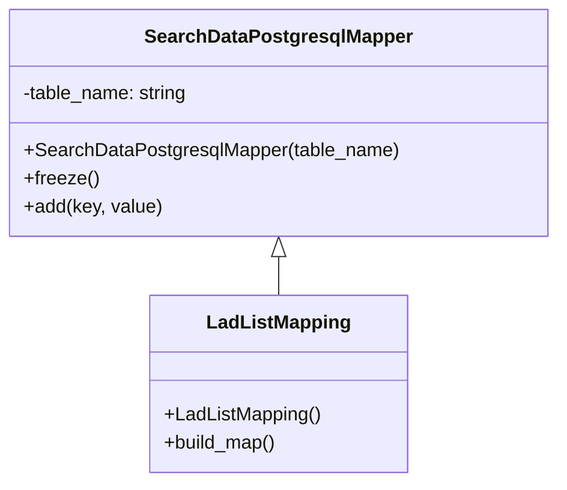

# Diagram: application_service/container_tracking_app_service/persistance_adapter/postgresql/LadListMapping.py

> Auto-generated by Obscura crawlers

## Mermaid

### SVG

<svg id="container" width="464.3984375" xmlns="http://www.w3.org/2000/svg" class="classDiagram" height="408" viewBox="0 0 464.3984375 408" role="graphics-document document" aria-roledescription="class"><g><defs><marker id="container_class-aggregationStart" class="marker aggregation class" refX="18" refY="7" markerWidth="190" markerHeight="240" orient="auto"><path d="M 18,7 L9,13 L1,7 L9,1 Z"></path></marker></defs><defs><marker id="container_class-aggregationEnd" class="marker aggregation class" refX="1" refY="7" markerWidth="20" markerHeight="28" orient="auto"><path d="M 18,7 L9,13 L1,7 L9,1 Z"></path></marker></defs><defs><marker id="container_class-extensionStart" class="marker extension class" refX="18" refY="7" markerWidth="190" markerHeight="240" orient="auto"><path d="M 1,7 L18,13 V 1 Z"></path></marker></defs><defs><marker id="container_class-extensionEnd" class="marker extension class" refX="1" refY="7" markerWidth="20" markerHeight="28" orient="auto"><path d="M 1,1 V 13 L18,7 Z"></path></marker></defs><defs><marker id="container_class-compositionStart" class="marker composition class" refX="18" refY="7" markerWidth="190" markerHeight="240" orient="auto"><path d="M 18,7 L9,13 L1,7 L9,1 Z"></path></marker></defs><defs><marker id="container_class-compositionEnd" class="marker composition class" refX="1" refY="7" markerWidth="20" markerHeight="28" orient="auto"><path d="M 18,7 L9,13 L1,7 L9,1 Z"></path></marker></defs><defs><marker id="container_class-dependencyStart" class="marker dependency class" refX="6" refY="7" markerWidth="190" markerHeight="240" orient="auto"><path d="M 5,7 L9,13 L1,7 L9,1 Z"></path></marker></defs><defs><marker id="container_class-dependencyEnd" class="marker dependency class" refX="13" refY="7" markerWidth="20" markerHeight="28" orient="auto"><path d="M 18,7 L9,13 L14,7 L9,1 Z"></path></marker></defs><defs><marker id="container_class-lollipopStart" class="marker lollipop class" refX="13" refY="7" markerWidth="190" markerHeight="240" orient="auto"><circle stroke="black" fill="transparent" cx="7" cy="7" r="6"></circle></marker></defs><defs><marker id="container_class-lollipopEnd" class="marker lollipop class" refX="1" refY="7" markerWidth="190" markerHeight="240" orient="auto"><circle stroke="black" fill="transparent" cx="7" cy="7" r="6"></circle></marker></defs><g class="root"><g class="clusters"></g><g class="edgePaths"><path d="M232.199,217.25L232.199,218.542C232.199,219.833,232.199,222.417,232.199,227.875C232.199,233.333,232.199,241.667,232.199,245.833L232.199,250" id="id_SearchDataPostgresqlMapper_LadListMapping_1" class="edge-thickness-normal edge-pattern-solid relation" style=";;;" data-edge="true" data-et="edge" data-id="id_SearchDataPostgresqlMapper_LadListMapping_1" data-points="W3sieCI6MjMyLjE5OTIxODc1LCJ5IjoyMDB9LHsieCI6MjMyLjE5OTIxODc1LCJ5IjoyMjV9LHsieCI6MjMyLjE5OTIxODc1LCJ5IjoyNTB9XQ==" marker-start="url(#container_class-extensionStart)"></path></g><g class="edgeLabels"><g class="edgeLabel"><g class="label" data-id="id_SearchDataPostgresqlMapper_LadListMapping_1" transform="translate(0, 0)"><foreignObject width="0" height="0">

</foreignObject></g></g></g><g class="nodes"><g class="node default" id="classId-SearchDataPostgresqlMapper-0" transform="translate(232.19921875, 104)"><g class="basic label-container"><path d="M-224.19921875 -96 L224.19921875 -96 L224.19921875 96 L-224.19921875 96" stroke="none" stroke-width="0" fill="#ECECFF" style=""></path><path d="M-224.19921875 -96 C-88.18447443089906 -96, 47.83026988820188 -96, 224.19921875 -96 M-224.19921875 -96 C-130.7493498814498 -96, -37.29948101289963 -96, 224.19921875 -96 M224.19921875 -96 C224.19921875 -51.87851867990939, 224.19921875 -7.757037359818781, 224.19921875 96 M224.19921875 -96 C224.19921875 -39.70662514305968, 224.19921875 16.586749713880636, 224.19921875 96 M224.19921875 96 C76.43817392599894 96, -71.32287089800212 96, -224.19921875 96 M224.19921875 96 C63.914929484592506 96, -96.36935978081499 96, -224.19921875 96 M-224.19921875 96 C-224.19921875 30.033409154283518, -224.19921875 -35.933181691432964, -224.19921875 -96 M-224.19921875 96 C-224.19921875 41.10541910905708, -224.19921875 -13.789161781885838, -224.19921875 -96" stroke="#9370DB" stroke-width="1.3" fill="none" stroke-dasharray="0 0" style=""></path></g><g class="annotation-group text" transform="translate(0, -72)"></g><g class="label-group text" transform="translate(-108.3515625, -72)"><g class="label" style="font-weight: bolder" transform="translate(0,-12)"><foreignObject width="216.703125" height="24">

SearchDataPostgresqlMapper

</foreignObject></g></g><g class="members-group text" transform="translate(-212.19921875, -24)"><g class="label" style="" transform="translate(0,-12)"><foreignObject width="141.796875" height="24">

-table_name: string

</foreignObject></g></g><g class="methods-group text" transform="translate(-212.19921875, 24)"><g class="label" style="" transform="translate(0,-12)"><foreignObject width="316.046875" height="24">

+SearchDataPostgresqlMapper(table_name)

</foreignObject></g><g class="label" style="" transform="translate(0,12)"><foreignObject width="62.109375" height="24">

+freeze()

</foreignObject></g><g class="label" style="" transform="translate(0,36)"><foreignObject width="116.859375" height="24">

+add(key, value)

</foreignObject></g></g><g class="divider" style=""><path d="M-224.19921875 -48 C-75.11465929232813 -48, 73.96990016534374 -48, 224.19921875 -48 M-224.19921875 -48 C-67.28717173436198 -48, 89.62487528127605 -48, 224.19921875 -48" stroke="#9370DB" stroke-width="1.3" fill="none" stroke-dasharray="0 0" style=""></path></g><g class="divider" style=""><path d="M-224.19921875 0 C-86.72577526284675 0, 50.747668224306494 0, 224.19921875 0 M-224.19921875 0 C-97.30559965294555 0, 29.58801944410891 0, 224.19921875 0" stroke="#9370DB" stroke-width="1.3" fill="none" stroke-dasharray="0 0" style=""></path></g></g><g class="node default" id="classId-LadListMapping-1" transform="translate(232.19921875, 325)"><g class="basic label-container"><path d="M-107.28125 -75 L107.28125 -75 L107.28125 75 L-107.28125 75" stroke="none" stroke-width="0" fill="#ECECFF" style=""></path><path d="M-107.28125 -75 C-43.579119019908056 -75, 20.123011960183888 -75, 107.28125 -75 M-107.28125 -75 C-30.44916559910152 -75, 46.38291880179696 -75, 107.28125 -75 M107.28125 -75 C107.28125 -43.16061173958701, 107.28125 -11.321223479174023, 107.28125 75 M107.28125 -75 C107.28125 -42.97040634066986, 107.28125 -10.940812681339722, 107.28125 75 M107.28125 75 C24.090557565438516 75, -59.10013486912297 75, -107.28125 75 M107.28125 75 C30.181595335697835 75, -46.91805932860433 75, -107.28125 75 M-107.28125 75 C-107.28125 43.90016708673614, -107.28125 12.80033417347228, -107.28125 -75 M-107.28125 75 C-107.28125 40.14007760440962, -107.28125 5.280155208819238, -107.28125 -75" stroke="#9370DB" stroke-width="1.3" fill="none" stroke-dasharray="0 0" style=""></path></g><g class="annotation-group text" transform="translate(0, -51)"></g><g class="label-group text" transform="translate(-58.03125, -51)"><g class="label" style="font-weight: bolder" transform="translate(0,-12)"><foreignObject width="116.0625" height="24">

LadListMapping

</foreignObject></g></g><g class="members-group text" transform="translate(-95.28125, -3)"></g><g class="methods-group text" transform="translate(-95.28125, 27)"><g class="label" style="" transform="translate(0,-12)"><foreignObject width="132.53125" height="24">

+LadListMapping()

</foreignObject></g><g class="label" style="" transform="translate(0,12)"><foreignObject width="96.109375" height="24">

+build_map()

</foreignObject></g></g><g class="divider" style=""><path d="M-107.28125 -27 C-56.07633512173041 -27, -4.871420243460818 -27, 107.28125 -27 M-107.28125 -27 C-29.25637137838936 -27, 48.76850724322128 -27, 107.28125 -27" stroke="#9370DB" stroke-width="1.3" fill="none" stroke-dasharray="0 0" style=""></path></g><g class="divider" style=""><path d="M-107.28125 -3 C-30.147636109446026 -3, 46.98597778110795 -3, 107.28125 -3 M-107.28125 -3 C-59.00338026987212 -3, -10.725510539744235 -3, 107.28125 -3" stroke="#9370DB" stroke-width="1.3" fill="none" stroke-dasharray="0 0" style=""></path></g></g></g></g></g></svg>
