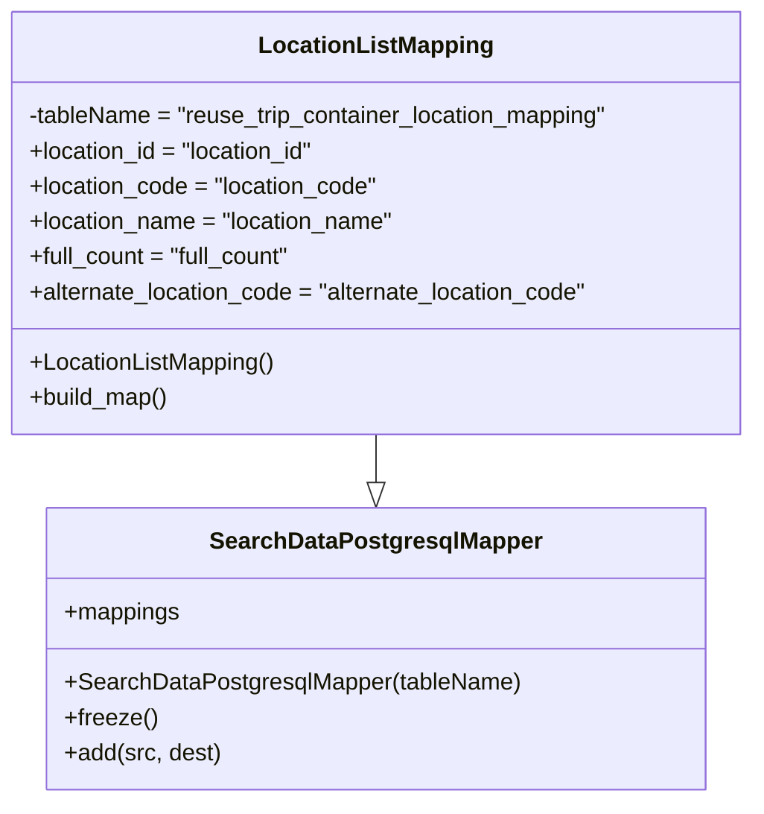

# Diagram: application_service/container_tracking_app_service/persistance_adapter/postgresql/LocationListMapping.py

> Auto-generated by Obscura crawlers

## Mermaid

### SVG

<svg id="container" width="519.4921875" xmlns="http://www.w3.org/2000/svg" class="classDiagram" height="546" viewBox="0 0 519.4921875 546" role="graphics-document document" aria-roledescription="class"><g><defs><marker id="container_class-aggregationStart" class="marker aggregation class" refX="18" refY="7" markerWidth="190" markerHeight="240" orient="auto"><path d="M 18,7 L9,13 L1,7 L9,1 Z"></path></marker></defs><defs><marker id="container_class-aggregationEnd" class="marker aggregation class" refX="1" refY="7" markerWidth="20" markerHeight="28" orient="auto"><path d="M 18,7 L9,13 L1,7 L9,1 Z"></path></marker></defs><defs><marker id="container_class-extensionStart" class="marker extension class" refX="18" refY="7" markerWidth="190" markerHeight="240" orient="auto"><path d="M 1,7 L18,13 V 1 Z"></path></marker></defs><defs><marker id="container_class-extensionEnd" class="marker extension class" refX="1" refY="7" markerWidth="20" markerHeight="28" orient="auto"><path d="M 1,1 V 13 L18,7 Z"></path></marker></defs><defs><marker id="container_class-compositionStart" class="marker composition class" refX="18" refY="7" markerWidth="190" markerHeight="240" orient="auto"><path d="M 18,7 L9,13 L1,7 L9,1 Z"></path></marker></defs><defs><marker id="container_class-compositionEnd" class="marker composition class" refX="1" refY="7" markerWidth="20" markerHeight="28" orient="auto"><path d="M 18,7 L9,13 L1,7 L9,1 Z"></path></marker></defs><defs><marker id="container_class-dependencyStart" class="marker dependency class" refX="6" refY="7" markerWidth="190" markerHeight="240" orient="auto"><path d="M 5,7 L9,13 L1,7 L9,1 Z"></path></marker></defs><defs><marker id="container_class-dependencyEnd" class="marker dependency class" refX="13" refY="7" markerWidth="20" markerHeight="28" orient="auto"><path d="M 18,7 L9,13 L14,7 L9,1 Z"></path></marker></defs><defs><marker id="container_class-lollipopStart" class="marker lollipop class" refX="13" refY="7" markerWidth="190" markerHeight="240" orient="auto"><circle stroke="black" fill="transparent" cx="7" cy="7" r="6"></circle></marker></defs><defs><marker id="container_class-lollipopEnd" class="marker lollipop class" refX="1" refY="7" markerWidth="190" markerHeight="240" orient="auto"><circle stroke="black" fill="transparent" cx="7" cy="7" r="6"></circle></marker></defs><g class="root"><g class="clusters"></g><g class="edgePaths"><path d="M259.746,296L259.746,300.167C259.746,304.333,259.746,312.667,259.746,318.125C259.746,323.583,259.746,326.167,259.746,327.458L259.746,328.75" id="id_LocationListMapping_SearchDataPostgresqlMapper_1" class="edge-thickness-normal edge-pattern-solid relation" style=";;;" data-edge="true" data-et="edge" data-id="id_LocationListMapping_SearchDataPostgresqlMapper_1" data-points="W3sieCI6MjU5Ljc0NjA5Mzc1LCJ5IjoyOTZ9LHsieCI6MjU5Ljc0NjA5Mzc1LCJ5IjozMjF9LHsieCI6MjU5Ljc0NjA5Mzc1LCJ5IjozNDZ9XQ==" marker-end="url(#container_class-extensionEnd)"></path></g><g class="edgeLabels"><g class="edgeLabel"><g class="label" data-id="id_LocationListMapping_SearchDataPostgresqlMapper_1" transform="translate(0, 0)"><foreignObject width="0" height="0">

</foreignObject></g></g></g><g class="nodes"><g class="node default" id="classId-SearchDataPostgresqlMapper-0" transform="translate(259.74609375, 442)"><g class="basic label-container"><path d="M-220.97265625 -96 L220.97265625 -96 L220.97265625 96 L-220.97265625 96" stroke="none" stroke-width="0" fill="#ECECFF" style=""></path><path d="M-220.97265625 -96 C-119.72924523286235 -96, -18.485834215724708 -96, 220.97265625 -96 M-220.97265625 -96 C-86.87260565936018 -96, 47.22744493127965 -96, 220.97265625 -96 M220.97265625 -96 C220.97265625 -33.34851454006986, 220.97265625 29.302970919860286, 220.97265625 96 M220.97265625 -96 C220.97265625 -44.484393853313776, 220.97265625 7.031212293372448, 220.97265625 96 M220.97265625 96 C96.2282582049925 96, -28.516139840015 96, -220.97265625 96 M220.97265625 96 C110.11610876756383 96, -0.7404387148723401 96, -220.97265625 96 M-220.97265625 96 C-220.97265625 38.22914139311474, -220.97265625 -19.541717213770525, -220.97265625 -96 M-220.97265625 96 C-220.97265625 34.70137017660943, -220.97265625 -26.59725964678114, -220.97265625 -96" stroke="#9370DB" stroke-width="1.3" fill="none" stroke-dasharray="0 0" style=""></path></g><g class="annotation-group text" transform="translate(0, -72)"></g><g class="label-group text" transform="translate(-108.3515625, -72)"><g class="label" style="font-weight: bolder" transform="translate(0,-12)"><foreignObject width="216.703125" height="24">

SearchDataPostgresqlMapper

</foreignObject></g></g><g class="members-group text" transform="translate(-208.97265625, -24)"><g class="label" style="" transform="translate(0,-12)"><foreignObject width="78.984375" height="24">

+mappings

</foreignObject></g></g><g class="methods-group text" transform="translate(-208.97265625, 24)"><g class="label" style="" transform="translate(0,-12)"><foreignObject width="309.59375" height="24">

+SearchDataPostgresqlMapper(tableName)

</foreignObject></g><g class="label" style="" transform="translate(0,12)"><foreignObject width="62.109375" height="24">

+freeze()

</foreignObject></g><g class="label" style="" transform="translate(0,36)"><foreignObject width="106.546875" height="24">

+add(src, dest)

</foreignObject></g></g><g class="divider" style=""><path d="M-220.97265625 -48 C-75.1778963069344 -48, 70.6168636361312 -48, 220.97265625 -48 M-220.97265625 -48 C-126.68307820764123 -48, -32.39350016528246 -48, 220.97265625 -48" stroke="#9370DB" stroke-width="1.3" fill="none" stroke-dasharray="0 0" style=""></path></g><g class="divider" style=""><path d="M-220.97265625 0 C-92.52608546330157 0, 35.92048532339686 0, 220.97265625 0 M-220.97265625 0 C-57.518093750869184 0, 105.93646874826163 0, 220.97265625 0" stroke="#9370DB" stroke-width="1.3" fill="none" stroke-dasharray="0 0" style=""></path></g></g><g class="node default" id="classId-LocationListMapping-1" transform="translate(259.74609375, 152)"><g class="basic label-container"><path d="M-251.74609375 -144 L251.74609375 -144 L251.74609375 144 L-251.74609375 144" stroke="none" stroke-width="0" fill="#ECECFF" style=""></path><path d="M-251.74609375 -144 C-136.70034327875703 -144, -21.654592807514035 -144, 251.74609375 -144 M-251.74609375 -144 C-115.39304012214848 -144, 20.960013505703046 -144, 251.74609375 -144 M251.74609375 -144 C251.74609375 -55.46647186331043, 251.74609375 33.06705627337914, 251.74609375 144 M251.74609375 -144 C251.74609375 -40.56551384463475, 251.74609375 62.8689723107305, 251.74609375 144 M251.74609375 144 C88.57831712806009 144, -74.58945949387981 144, -251.74609375 144 M251.74609375 144 C105.81950546116136 144, -40.10708282767729 144, -251.74609375 144 M-251.74609375 144 C-251.74609375 79.84363883566382, -251.74609375 15.68727767132765, -251.74609375 -144 M-251.74609375 144 C-251.74609375 61.20500119708203, -251.74609375 -21.589997605835947, -251.74609375 -144" stroke="#9370DB" stroke-width="1.3" fill="none" stroke-dasharray="0 0" style=""></path></g><g class="annotation-group text" transform="translate(0, -120)"></g><g class="label-group text" transform="translate(-76.1640625, -120)"><g class="label" style="font-weight: bolder" transform="translate(0,-12)"><foreignObject width="152.328125" height="24">

LocationListMapping

</foreignObject></g></g><g class="members-group text" transform="translate(-239.74609375, -72)"><g class="label" style="" transform="translate(0,-12)"><foreignObject width="403.328125" height="24">

-tableName = "reuse_trip_container_location_mapping"

</foreignObject></g><g class="label" style="" transform="translate(0,12)"><foreignObject width="200.34375" height="24">

+location_id = "location_id"

</foreignObject></g><g class="label" style="" transform="translate(0,36)"><foreignObject width="241.296875" height="24">

+location_code = "location_code"

</foreignObject></g><g class="label" style="" transform="translate(0,60)"><foreignObject width="253.046875" height="24">

+location_name = "location_name"

</foreignObject></g><g class="label" style="" transform="translate(0,84)"><foreignObject width="183.125" height="24">

+full_count = "full_count"

</foreignObject></g><g class="label" style="" transform="translate(0,108)"><foreignObject width="388.5" height="24">

+alternate_location_code = "alternate_location_code"

</foreignObject></g></g><g class="methods-group text" transform="translate(-239.74609375, 96)"><g class="label" style="" transform="translate(0,-12)"><foreignObject width="168.5625" height="24">

+LocationListMapping()

</foreignObject></g><g class="label" style="" transform="translate(0,12)"><foreignObject width="96.109375" height="24">

+build_map()

</foreignObject></g></g><g class="divider" style=""><path d="M-251.74609375 -96 C-121.23926309391618 -96, 9.267567562167642 -96, 251.74609375 -96 M-251.74609375 -96 C-60.485973159522985 -96, 130.77414743095403 -96, 251.74609375 -96" stroke="#9370DB" stroke-width="1.3" fill="none" stroke-dasharray="0 0" style=""></path></g><g class="divider" style=""><path d="M-251.74609375 72 C-66.68634638799676 72, 118.37340097400647 72, 251.74609375 72 M-251.74609375 72 C-99.12656062981998 72, 53.492972490360046 72, 251.74609375 72" stroke="#9370DB" stroke-width="1.3" fill="none" stroke-dasharray="0 0" style=""></path></g></g></g></g></g></svg>
