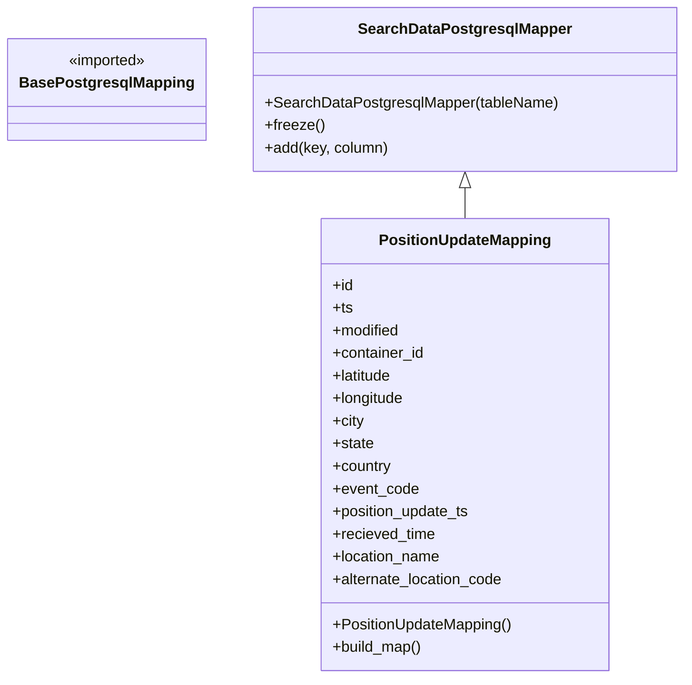

# Diagram: application_service/container_tracking_app_service/persistance_adapter/postgresql/PositionUpdateMapping.py

> Auto-generated by Obscura crawlers

## Mermaid

### SVG

<svg id="container" width="707.7890625" xmlns="http://www.w3.org/2000/svg" class="classDiagram" height="720" viewBox="0 0 707.7890625 720" role="graphics-document document" aria-roledescription="class"><g><defs><marker id="container_class-aggregationStart" class="marker aggregation class" refX="18" refY="7" markerWidth="190" markerHeight="240" orient="auto"><path d="M 18,7 L9,13 L1,7 L9,1 Z"></path></marker></defs><defs><marker id="container_class-aggregationEnd" class="marker aggregation class" refX="1" refY="7" markerWidth="20" markerHeight="28" orient="auto"><path d="M 18,7 L9,13 L1,7 L9,1 Z"></path></marker></defs><defs><marker id="container_class-extensionStart" class="marker extension class" refX="18" refY="7" markerWidth="190" markerHeight="240" orient="auto"><path d="M 1,7 L18,13 V 1 Z"></path></marker></defs><defs><marker id="container_class-extensionEnd" class="marker extension class" refX="1" refY="7" markerWidth="20" markerHeight="28" orient="auto"><path d="M 1,1 V 13 L18,7 Z"></path></marker></defs><defs><marker id="container_class-compositionStart" class="marker composition class" refX="18" refY="7" markerWidth="190" markerHeight="240" orient="auto"><path d="M 18,7 L9,13 L1,7 L9,1 Z"></path></marker></defs><defs><marker id="container_class-compositionEnd" class="marker composition class" refX="1" refY="7" markerWidth="20" markerHeight="28" orient="auto"><path d="M 18,7 L9,13 L1,7 L9,1 Z"></path></marker></defs><defs><marker id="container_class-dependencyStart" class="marker dependency class" refX="6" refY="7" markerWidth="190" markerHeight="240" orient="auto"><path d="M 5,7 L9,13 L1,7 L9,1 Z"></path></marker></defs><defs><marker id="container_class-dependencyEnd" class="marker dependency class" refX="13" refY="7" markerWidth="20" markerHeight="28" orient="auto"><path d="M 18,7 L9,13 L14,7 L9,1 Z"></path></marker></defs><defs><marker id="container_class-lollipopStart" class="marker lollipop class" refX="13" refY="7" markerWidth="190" markerHeight="240" orient="auto"><circle stroke="black" fill="transparent" cx="7" cy="7" r="6"></circle></marker></defs><defs><marker id="container_class-lollipopEnd" class="marker lollipop class" refX="1" refY="7" markerWidth="190" markerHeight="240" orient="auto"><circle stroke="black" fill="transparent" cx="7" cy="7" r="6"></circle></marker></defs><g class="root"><g class="clusters"></g><g class="edgePaths"><path d="M478.816,199.25L478.816,200.542C478.816,201.833,478.816,204.417,478.816,209.875C478.816,215.333,478.816,223.667,478.816,227.833L478.816,232" id="id_SearchDataPostgresqlMapper_PositionUpdateMapping_1" class="edge-thickness-normal edge-pattern-solid relation" style=";;;" data-edge="true" data-et="edge" data-id="id_SearchDataPostgresqlMapper_PositionUpdateMapping_1" data-points="W3sieCI6NDc4LjgxNjQwNjI1LCJ5IjoxODJ9LHsieCI6NDc4LjgxNjQwNjI1LCJ5IjoyMDd9LHsieCI6NDc4LjgxNjQwNjI1LCJ5IjoyMzJ9XQ==" marker-start="url(#container_class-extensionStart)"></path></g><g class="edgeLabels"><g class="edgeLabel"><g class="label" data-id="id_SearchDataPostgresqlMapper_PositionUpdateMapping_1" transform="translate(0, 0)"><foreignObject width="0" height="0">

</foreignObject></g></g></g><g class="nodes"><g class="node default" id="classId-BasePostgresqlMapping-0" transform="translate(107.921875, 95)"><g class="basic label-container"><path d="M-99.921875 -54 L99.921875 -54 L99.921875 54 L-99.921875 54" stroke="none" stroke-width="0" fill="#ECECFF" style=""></path><path d="M-99.921875 -54 C-47.27558019671942 -54, 5.370714606561165 -54, 99.921875 -54 M-99.921875 -54 C-26.92092966735862 -54, 46.08001566528276 -54, 99.921875 -54 M99.921875 -54 C99.921875 -17.089947374050723, 99.921875 19.820105251898553, 99.921875 54 M99.921875 -54 C99.921875 -13.608676079643189, 99.921875 26.782647840713622, 99.921875 54 M99.921875 54 C48.74752035895671 54, -2.426834282086574 54, -99.921875 54 M99.921875 54 C31.090485712188723 54, -37.74090357562255 54, -99.921875 54 M-99.921875 54 C-99.921875 19.548899232697167, -99.921875 -14.902201534605666, -99.921875 -54 M-99.921875 54 C-99.921875 27.88079704482351, -99.921875 1.7615940896470192, -99.921875 -54" stroke="#9370DB" stroke-width="1.3" fill="none" stroke-dasharray="0 0" style=""></path></g><g class="annotation-group text" transform="translate(-42.671875, -30)"><g class="label" style="" transform="translate(0,-12)"><foreignObject width="85.34375" height="24">

«imported»

</foreignObject></g></g><g class="label-group text" transform="translate(-87.921875, -6)"><g class="label" style="font-weight: bolder" transform="translate(0,-12)"><foreignObject width="175.84375" height="24">

BasePostgresqlMapping

</foreignObject></g></g><g class="members-group text" transform="translate(-87.921875, 42)"></g><g class="methods-group text" transform="translate(-87.921875, 72)"></g><g class="divider" style=""><path d="M-99.921875 18 C-53.8872123907181 18, -7.8525497814361955 18, 99.921875 18 M-99.921875 18 C-54.85217071967881 18, -9.78246643935762 18, 99.921875 18" stroke="#9370DB" stroke-width="1.3" fill="none" stroke-dasharray="0 0" style=""></path></g><g class="divider" style=""><path d="M-99.921875 36 C-29.899682242826273 36, 40.122510514347454 36, 99.921875 36 M-99.921875 36 C-58.18807935684952 36, -16.45428371369904 36, 99.921875 36" stroke="#9370DB" stroke-width="1.3" fill="none" stroke-dasharray="0 0" style=""></path></g></g><g class="node default" id="classId-SearchDataPostgresqlMapper-1" transform="translate(478.81640625, 95)"><g class="basic label-container"><path d="M-220.97265625 -87 L220.97265625 -87 L220.97265625 87 L-220.97265625 87" stroke="none" stroke-width="0" fill="#ECECFF" style=""></path><path d="M-220.97265625 -87 C-110.29016387996127 -87, 0.3923284900774604 -87, 220.97265625 -87 M-220.97265625 -87 C-115.13434687283093 -87, -9.296037495661864 -87, 220.97265625 -87 M220.97265625 -87 C220.97265625 -44.41759296462438, 220.97265625 -1.835185929248766, 220.97265625 87 M220.97265625 -87 C220.97265625 -43.34458980539935, 220.97265625 0.3108203892012966, 220.97265625 87 M220.97265625 87 C76.66545904126158 87, -67.64173816747683 87, -220.97265625 87 M220.97265625 87 C48.59566511235221 87, -123.78132602529558 87, -220.97265625 87 M-220.97265625 87 C-220.97265625 38.014452696126234, -220.97265625 -10.971094607747531, -220.97265625 -87 M-220.97265625 87 C-220.97265625 33.38271833856921, -220.97265625 -20.234563322861575, -220.97265625 -87" stroke="#9370DB" stroke-width="1.3" fill="none" stroke-dasharray="0 0" style=""></path></g><g class="annotation-group text" transform="translate(0, -63)"></g><g class="label-group text" transform="translate(-108.3515625, -63)"><g class="label" style="font-weight: bolder" transform="translate(0,-12)"><foreignObject width="216.703125" height="24">

SearchDataPostgresqlMapper

</foreignObject></g></g><g class="members-group text" transform="translate(-208.97265625, -15)"></g><g class="methods-group text" transform="translate(-208.97265625, 15)"><g class="label" style="" transform="translate(0,-12)"><foreignObject width="309.59375" height="24">

+SearchDataPostgresqlMapper(tableName)

</foreignObject></g><g class="label" style="" transform="translate(0,12)"><foreignObject width="62.109375" height="24">

+freeze()

</foreignObject></g><g class="label" style="" transform="translate(0,36)"><foreignObject width="131.734375" height="24">

+add(key, column)

</foreignObject></g></g><g class="divider" style=""><path d="M-220.97265625 -39 C-76.96735250608342 -39, 67.03795123783317 -39, 220.97265625 -39 M-220.97265625 -39 C-103.02626445180589 -39, 14.920127346388227 -39, 220.97265625 -39" stroke="#9370DB" stroke-width="1.3" fill="none" stroke-dasharray="0 0" style=""></path></g><g class="divider" style=""><path d="M-220.97265625 -15 C-98.49757895472399 -15, 23.977498340552017 -15, 220.97265625 -15 M-220.97265625 -15 C-100.38674792429684 -15, 20.199160401406317 -15, 220.97265625 -15" stroke="#9370DB" stroke-width="1.3" fill="none" stroke-dasharray="0 0" style=""></path></g></g><g class="node default" id="classId-PositionUpdateMapping-2" transform="translate(478.81640625, 472)"><g class="basic label-container"><path d="M-152.26171875 -240 L152.26171875 -240 L152.26171875 240 L-152.26171875 240" stroke="none" stroke-width="0" fill="#ECECFF" style=""></path><path d="M-152.26171875 -240 C-78.75999024174878 -240, -5.258261733497562 -240, 152.26171875 -240 M-152.26171875 -240 C-32.062829678257344 -240, 88.13605939348531 -240, 152.26171875 -240 M152.26171875 -240 C152.26171875 -75.81973480490865, 152.26171875 88.3605303901827, 152.26171875 240 M152.26171875 -240 C152.26171875 -78.16625532686663, 152.26171875 83.66748934626673, 152.26171875 240 M152.26171875 240 C75.11089066129875 240, -2.039937427402492 240, -152.26171875 240 M152.26171875 240 C36.09418314381247 240, -80.07335246237506 240, -152.26171875 240 M-152.26171875 240 C-152.26171875 63.37302265234817, -152.26171875 -113.25395469530366, -152.26171875 -240 M-152.26171875 240 C-152.26171875 75.80762876803641, -152.26171875 -88.38474246392718, -152.26171875 -240" stroke="#9370DB" stroke-width="1.3" fill="none" stroke-dasharray="0 0" style=""></path></g><g class="annotation-group text" transform="translate(0, -216)"></g><g class="label-group text" transform="translate(-88.0234375, -216)"><g class="label" style="font-weight: bolder" transform="translate(0,-12)"><foreignObject width="176.046875" height="24">

PositionUpdateMapping

</foreignObject></g></g><g class="members-group text" transform="translate(-140.26171875, -168)"><g class="label" style="" transform="translate(0,-12)"><foreignObject width="22.078125" height="24">

+id

</foreignObject></g><g class="label" style="" transform="translate(0,12)"><foreignObject width="21.15625" height="24">

+ts

</foreignObject></g><g class="label" style="" transform="translate(0,36)"><foreignObject width="72.609375" height="24">

+modified

</foreignObject></g><g class="label" style="" transform="translate(0,60)"><foreignObject width="98.3125" height="24">

+container_id

</foreignObject></g><g class="label" style="" transform="translate(0,84)"><foreignObject width="64.96875" height="24">

+latitude

</foreignObject></g><g class="label" style="" transform="translate(0,108)"><foreignObject width="77.53125" height="24">

+longitude

</foreignObject></g><g class="label" style="" transform="translate(0,132)"><foreignObject width="33.71875" height="24">

+city

</foreignObject></g><g class="label" style="" transform="translate(0,156)"><foreignObject width="44.09375" height="24">

+state

</foreignObject></g><g class="label" style="" transform="translate(0,180)"><foreignObject width="63.171875" height="24">

+country

</foreignObject></g><g class="label" style="" transform="translate(0,204)"><foreignObject width="91.28125" height="24">

+event_code

</foreignObject></g><g class="label" style="" transform="translate(0,228)"><foreignObject width="148.109375" height="24">

+position_update_ts

</foreignObject></g><g class="label" style="" transform="translate(0,252)"><foreignObject width="110.046875" height="24">

+recieved_time

</foreignObject></g><g class="label" style="" transform="translate(0,276)"><foreignObject width="115.96875" height="24">

+location_name

</foreignObject></g><g class="label" style="" transform="translate(0,300)"><foreignObject width="183.703125" height="24">

+alternate_location_code

</foreignObject></g></g><g class="methods-group text" transform="translate(-140.26171875, 192)"><g class="label" style="" transform="translate(0,-12)"><foreignObject width="192.5" height="24">

+PositionUpdateMapping()

</foreignObject></g><g class="label" style="" transform="translate(0,12)"><foreignObject width="96.109375" height="24">

+build_map()

</foreignObject></g></g><g class="divider" style=""><path d="M-152.26171875 -192 C-87.03895975842474 -192, -21.816200766849477 -192, 152.26171875 -192 M-152.26171875 -192 C-39.488687231610285 -192, 73.28434428677943 -192, 152.26171875 -192" stroke="#9370DB" stroke-width="1.3" fill="none" stroke-dasharray="0 0" style=""></path></g><g class="divider" style=""><path d="M-152.26171875 168 C-75.7869719040915 168, 0.6877749418169969 168, 152.26171875 168 M-152.26171875 168 C-73.58965800621249 168, 5.082402737575023 168, 152.26171875 168" stroke="#9370DB" stroke-width="1.3" fill="none" stroke-dasharray="0 0" style=""></path></g></g></g></g></g></svg>
