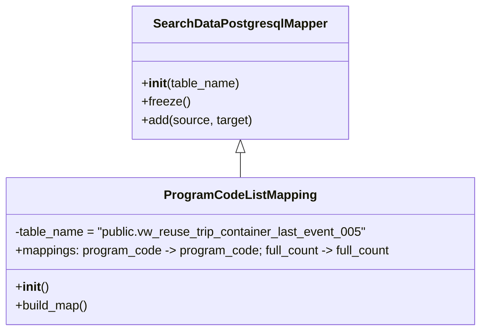

# Diagram: application_service/container_tracking_app_service/persistance_adapter/postgresql/ProgramCodeListMapping.py

> Auto-generated by Obscura crawlers

## Mermaid

### SVG

<svg id="container" width="628.984375" xmlns="http://www.w3.org/2000/svg" class="classDiagram" height="432" viewBox="0 0 628.984375 432" role="graphics-document document" aria-roledescription="class"><g><defs><marker id="container_class-aggregationStart" class="marker aggregation class" refX="18" refY="7" markerWidth="190" markerHeight="240" orient="auto"><path d="M 18,7 L9,13 L1,7 L9,1 Z"></path></marker></defs><defs><marker id="container_class-aggregationEnd" class="marker aggregation class" refX="1" refY="7" markerWidth="20" markerHeight="28" orient="auto"><path d="M 18,7 L9,13 L1,7 L9,1 Z"></path></marker></defs><defs><marker id="container_class-extensionStart" class="marker extension class" refX="18" refY="7" markerWidth="190" markerHeight="240" orient="auto"><path d="M 1,7 L18,13 V 1 Z"></path></marker></defs><defs><marker id="container_class-extensionEnd" class="marker extension class" refX="1" refY="7" markerWidth="20" markerHeight="28" orient="auto"><path d="M 1,1 V 13 L18,7 Z"></path></marker></defs><defs><marker id="container_class-compositionStart" class="marker composition class" refX="18" refY="7" markerWidth="190" markerHeight="240" orient="auto"><path d="M 18,7 L9,13 L1,7 L9,1 Z"></path></marker></defs><defs><marker id="container_class-compositionEnd" class="marker composition class" refX="1" refY="7" markerWidth="20" markerHeight="28" orient="auto"><path d="M 18,7 L9,13 L1,7 L9,1 Z"></path></marker></defs><defs><marker id="container_class-dependencyStart" class="marker dependency class" refX="6" refY="7" markerWidth="190" markerHeight="240" orient="auto"><path d="M 5,7 L9,13 L1,7 L9,1 Z"></path></marker></defs><defs><marker id="container_class-dependencyEnd" class="marker dependency class" refX="13" refY="7" markerWidth="20" markerHeight="28" orient="auto"><path d="M 18,7 L9,13 L14,7 L9,1 Z"></path></marker></defs><defs><marker id="container_class-lollipopStart" class="marker lollipop class" refX="13" refY="7" markerWidth="190" markerHeight="240" orient="auto"><circle stroke="black" fill="transparent" cx="7" cy="7" r="6"></circle></marker></defs><defs><marker id="container_class-lollipopEnd" class="marker lollipop class" refX="1" refY="7" markerWidth="190" markerHeight="240" orient="auto"><circle stroke="black" fill="transparent" cx="7" cy="7" r="6"></circle></marker></defs><g class="root"><g class="clusters"></g><g class="edgePaths"><path d="M314.492,199.25L314.492,200.542C314.492,201.833,314.492,204.417,314.492,209.875C314.492,215.333,314.492,223.667,314.492,227.833L314.492,232" id="id_SearchDataPostgresqlMapper_ProgramCodeListMapping_1" class="edge-thickness-normal edge-pattern-solid relation" style=";;;" data-edge="true" data-et="edge" data-id="id_SearchDataPostgresqlMapper_ProgramCodeListMapping_1" data-points="W3sieCI6MzE0LjQ5MjE4NzUsInkiOjE4Mn0seyJ4IjozMTQuNDkyMTg3NSwieSI6MjA3fSx7IngiOjMxNC40OTIxODc1LCJ5IjoyMzJ9XQ==" marker-start="url(#container_class-extensionStart)"></path></g><g class="edgeLabels"><g class="edgeLabel"><g class="label" data-id="id_SearchDataPostgresqlMapper_ProgramCodeListMapping_1" transform="translate(0, 0)"><foreignObject width="0" height="0">

</foreignObject></g></g></g><g class="nodes"><g class="node default" id="classId-SearchDataPostgresqlMapper-0" transform="translate(314.4921875, 95)"><g class="basic label-container"><path d="M-138.48046875 -87 L138.48046875 -87 L138.48046875 87 L-138.48046875 87" stroke="none" stroke-width="0" fill="#ECECFF" style=""></path><path d="M-138.48046875 -87 C-66.33576740139274 -87, 5.808933947214513 -87, 138.48046875 -87 M-138.48046875 -87 C-69.18112746697408 -87, 0.11821381605184911 -87, 138.48046875 -87 M138.48046875 -87 C138.48046875 -42.846087588091684, 138.48046875 1.307824823816631, 138.48046875 87 M138.48046875 -87 C138.48046875 -39.77547616532005, 138.48046875 7.449047669359899, 138.48046875 87 M138.48046875 87 C28.902233907489077 87, -80.67600093502185 87, -138.48046875 87 M138.48046875 87 C52.22772157822551 87, -34.025025593548975 87, -138.48046875 87 M-138.48046875 87 C-138.48046875 38.08731808594672, -138.48046875 -10.82536382810656, -138.48046875 -87 M-138.48046875 87 C-138.48046875 39.26608198790861, -138.48046875 -8.467836024182773, -138.48046875 -87" stroke="#9370DB" stroke-width="1.3" fill="none" stroke-dasharray="0 0" style=""></path></g><g class="annotation-group text" transform="translate(0, -63)"></g><g class="label-group text" transform="translate(-108.3515625, -63)"><g class="label" style="font-weight: bolder" transform="translate(0,-12)"><foreignObject width="216.703125" height="24">

SearchDataPostgresqlMapper

</foreignObject></g></g><g class="members-group text" transform="translate(-126.48046875, -15)"></g><g class="methods-group text" transform="translate(-126.48046875, 15)"><g class="label" style="" transform="translate(0,-12)"><foreignObject width="128.515625" height="24">

+<strong>init</strong>(table_name)

</foreignObject></g><g class="label" style="" transform="translate(0,12)"><foreignObject width="62.109375" height="24">

+freeze()

</foreignObject></g><g class="label" style="" transform="translate(0,36)"><foreignObject width="144.609375" height="24">

+add(source, target)

</foreignObject></g></g><g class="divider" style=""><path d="M-138.48046875 -39 C-41.5222365234858 -39, 55.4359957030284 -39, 138.48046875 -39 M-138.48046875 -39 C-58.525919208148125 -39, 21.42863033370375 -39, 138.48046875 -39" stroke="#9370DB" stroke-width="1.3" fill="none" stroke-dasharray="0 0" style=""></path></g><g class="divider" style=""><path d="M-138.48046875 -15 C-42.830868344160606 -15, 52.81873206167879 -15, 138.48046875 -15 M-138.48046875 -15 C-46.494403722621726 -15, 45.49166130475655 -15, 138.48046875 -15" stroke="#9370DB" stroke-width="1.3" fill="none" stroke-dasharray="0 0" style=""></path></g></g><g class="node default" id="classId-ProgramCodeListMapping-1" transform="translate(314.4921875, 328)"><g class="basic label-container"><path d="M-306.4921875 -96 L306.4921875 -96 L306.4921875 96 L-306.4921875 96" stroke="none" stroke-width="0" fill="#ECECFF" style=""></path><path d="M-306.4921875 -96 C-183.40948125548715 -96, -60.32677501097427 -96, 306.4921875 -96 M-306.4921875 -96 C-143.19898392893347 -96, 20.094219642133055 -96, 306.4921875 -96 M306.4921875 -96 C306.4921875 -49.77177673988842, 306.4921875 -3.543553479776847, 306.4921875 96 M306.4921875 -96 C306.4921875 -24.990672123467306, 306.4921875 46.01865575306539, 306.4921875 96 M306.4921875 96 C169.03735245430917 96, 31.582517408618344 96, -306.4921875 96 M306.4921875 96 C85.65446912425185 96, -135.1832492514963 96, -306.4921875 96 M-306.4921875 96 C-306.4921875 21.441380734097777, -306.4921875 -53.117238531804446, -306.4921875 -96 M-306.4921875 96 C-306.4921875 41.73903462013261, -306.4921875 -12.521930759734786, -306.4921875 -96" stroke="#9370DB" stroke-width="1.3" fill="none" stroke-dasharray="0 0" style=""></path></g><g class="annotation-group text" transform="translate(0, -72)"></g><g class="label-group text" transform="translate(-93.90625, -72)"><g class="label" style="font-weight: bolder" transform="translate(0,-12)"><foreignObject width="187.8125" height="24">

ProgramCodeListMapping

</foreignObject></g></g><g class="members-group text" transform="translate(-294.4921875, -24)"><g class="label" style="" transform="translate(0,-12)"><foreignObject width="462.5" height="24">

-table_name = "public.vw_reuse_trip_container_last_event_005"

</foreignObject></g><g class="label" style="" transform="translate(0,12)"><foreignObject width="495.078125" height="24">

+mappings: program_code -&gt; program_code; full_count -&gt; full_count

</foreignObject></g></g><g class="methods-group text" transform="translate(-294.4921875, 48)"><g class="label" style="" transform="translate(0,-12)"><foreignObject width="42.796875" height="24">

+<strong>init</strong>()

</foreignObject></g><g class="label" style="" transform="translate(0,12)"><foreignObject width="96.109375" height="24">

+build_map()

</foreignObject></g></g><g class="divider" style=""><path d="M-306.4921875 -48 C-91.09136829408644 -48, 124.30945091182713 -48, 306.4921875 -48 M-306.4921875 -48 C-130.53010803958668 -48, 45.43197142082664 -48, 306.4921875 -48" stroke="#9370DB" stroke-width="1.3" fill="none" stroke-dasharray="0 0" style=""></path></g><g class="divider" style=""><path d="M-306.4921875 24 C-85.11007505482519 24, 136.27203739034962 24, 306.4921875 24 M-306.4921875 24 C-87.60416035069713 24, 131.28386679860574 24, 306.4921875 24" stroke="#9370DB" stroke-width="1.3" fill="none" stroke-dasharray="0 0" style=""></path></g></g></g></g></g></svg>
