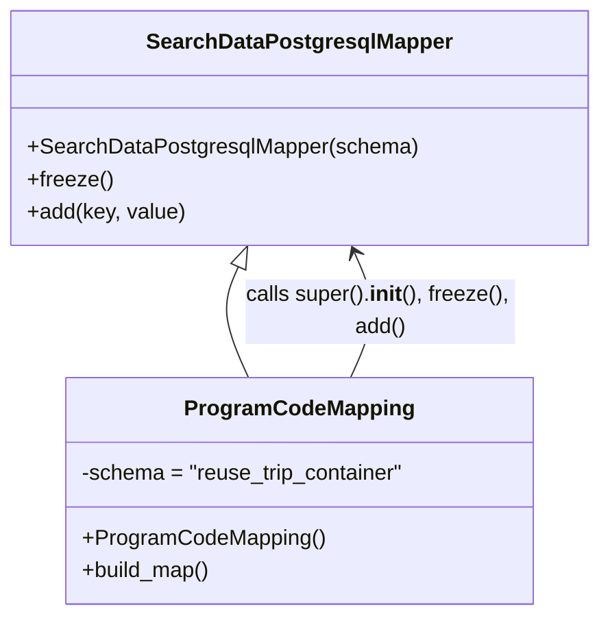

# Diagram: application_service/container_tracking_app_service/persistance_adapter/postgresql/ProgramCodeMapping.py

> Auto-generated by Obscura crawlers

## Mermaid

### SVG

<svg id="container" width="434.3046875" xmlns="http://www.w3.org/2000/svg" class="classDiagram" height="456" viewBox="0 0 434.3046875 456" role="graphics-document document" aria-roledescription="class"><g><defs><marker id="container_class-aggregationStart" class="marker aggregation class" refX="18" refY="7" markerWidth="190" markerHeight="240" orient="auto"><path d="M 18,7 L9,13 L1,7 L9,1 Z"></path></marker></defs><defs><marker id="container_class-aggregationEnd" class="marker aggregation class" refX="1" refY="7" markerWidth="20" markerHeight="28" orient="auto"><path d="M 18,7 L9,13 L1,7 L9,1 Z"></path></marker></defs><defs><marker id="container_class-extensionStart" class="marker extension class" refX="18" refY="7" markerWidth="190" markerHeight="240" orient="auto"><path d="M 1,7 L18,13 V 1 Z"></path></marker></defs><defs><marker id="container_class-extensionEnd" class="marker extension class" refX="1" refY="7" markerWidth="20" markerHeight="28" orient="auto"><path d="M 1,1 V 13 L18,7 Z"></path></marker></defs><defs><marker id="container_class-compositionStart" class="marker composition class" refX="18" refY="7" markerWidth="190" markerHeight="240" orient="auto"><path d="M 18,7 L9,13 L1,7 L9,1 Z"></path></marker></defs><defs><marker id="container_class-compositionEnd" class="marker composition class" refX="1" refY="7" markerWidth="20" markerHeight="28" orient="auto"><path d="M 18,7 L9,13 L1,7 L9,1 Z"></path></marker></defs><defs><marker id="container_class-dependencyStart" class="marker dependency class" refX="6" refY="7" markerWidth="190" markerHeight="240" orient="auto"><path d="M 5,7 L9,13 L1,7 L9,1 Z"></path></marker></defs><defs><marker id="container_class-dependencyEnd" class="marker dependency class" refX="13" refY="7" markerWidth="20" markerHeight="28" orient="auto"><path d="M 18,7 L9,13 L14,7 L9,1 Z"></path></marker></defs><defs><marker id="container_class-lollipopStart" class="marker lollipop class" refX="13" refY="7" markerWidth="190" markerHeight="240" orient="auto"><circle stroke="black" fill="transparent" cx="7" cy="7" r="6"></circle></marker></defs><defs><marker id="container_class-lollipopEnd" class="marker lollipop class" refX="1" refY="7" markerWidth="190" markerHeight="240" orient="auto"><circle stroke="black" fill="transparent" cx="7" cy="7" r="6"></circle></marker></defs><g class="root"><g class="clusters"></g><g class="edgePaths"><path d="M171.807,197.782L169.365,203.319C166.922,208.855,162.037,219.927,163.279,233.63C164.521,247.333,171.889,263.667,175.573,271.833L179.258,280" id="id_SearchDataPostgresqlMapper_ProgramCodeMapping_1" class="edge-thickness-normal edge-pattern-solid relation" style=";;;" data-edge="true" data-et="edge" data-id="id_SearchDataPostgresqlMapper_ProgramCodeMapping_1" data-points="W3sieCI6MTc4Ljc2OTk5MDgwODgyMzU0LCJ5IjoxODJ9LHsieCI6MTU3LjE1MjM0Mzc1LCJ5IjoyMzF9LHsieCI6MTc5LjI1NzYwNjkwNzg5NDc0LCJ5IjoyODB9XQ==" marker-start="url(#container_class-extensionStart)"></path><path d="M255.047,280L258.731,271.833C262.416,263.667,269.784,247.333,270.269,231.915C270.754,216.497,264.355,201.993,261.156,194.741L257.957,187.49" id="id_ProgramCodeMapping_SearchDataPostgresqlMapper_2" class="edge-thickness-normal edge-pattern-solid relation" style=";;;" data-edge="true" data-et="edge" data-id="id_ProgramCodeMapping_SearchDataPostgresqlMapper_2" data-points="W3sieCI6MjU1LjA0NzA4MDU5MjEwNTI2LCJ5IjoyODB9LHsieCI6Mjc3LjE1MjM0Mzc1LCJ5IjoyMzF9LHsieCI6MjU1LjUzNDY5NjY5MTE3NjQ2LCJ5IjoxODJ9XQ==" marker-end="url(#container_class-dependencyEnd)"></path></g><g class="edgeLabels"><g class="edgeLabel"><g class="label" data-id="id_SearchDataPostgresqlMapper_ProgramCodeMapping_1" transform="translate(0, 0)"><foreignObject width="0" height="0">

</foreignObject></g></g><g class="edgeLabel" transform="translate(277.11149, 231.09055)"><g class="label" data-id="id_ProgramCodeMapping_SearchDataPostgresqlMapper_2" transform="translate(-100, -24)"><foreignObject width="200" height="48">

calls super().<strong>init</strong>(), freeze(), add()

</foreignObject></g></g></g><g class="nodes"><g class="node default" id="classId-SearchDataPostgresqlMapper-0" transform="translate(217.15234375, 95)"><g class="basic label-container"><path d="M-209.15234375 -87 L209.15234375 -87 L209.15234375 87 L-209.15234375 87" stroke="none" stroke-width="0" fill="#ECECFF" style=""></path><path d="M-209.15234375 -87 C-66.29886732883719 -87, 76.55460909232562 -87, 209.15234375 -87 M-209.15234375 -87 C-116.34188953725545 -87, -23.53143532451091 -87, 209.15234375 -87 M209.15234375 -87 C209.15234375 -32.12261605272008, 209.15234375 22.754767894559834, 209.15234375 87 M209.15234375 -87 C209.15234375 -24.614922036336687, 209.15234375 37.77015592732663, 209.15234375 87 M209.15234375 87 C70.05211636635099 87, -69.04811101729803 87, -209.15234375 87 M209.15234375 87 C58.4977534454722 87, -92.1568368590556 87, -209.15234375 87 M-209.15234375 87 C-209.15234375 45.57354827335251, -209.15234375 4.147096546705015, -209.15234375 -87 M-209.15234375 87 C-209.15234375 17.68289206235589, -209.15234375 -51.63421587528822, -209.15234375 -87" stroke="#9370DB" stroke-width="1.3" fill="none" stroke-dasharray="0 0" style=""></path></g><g class="annotation-group text" transform="translate(0, -63)"></g><g class="label-group text" transform="translate(-108.3515625, -63)"><g class="label" style="font-weight: bolder" transform="translate(0,-12)"><foreignObject width="216.703125" height="24">

SearchDataPostgresqlMapper

</foreignObject></g></g><g class="members-group text" transform="translate(-197.15234375, -15)"></g><g class="methods-group text" transform="translate(-197.15234375, 15)"><g class="label" style="" transform="translate(0,-12)"><foreignObject width="285.953125" height="24">

+SearchDataPostgresqlMapper(schema)

</foreignObject></g><g class="label" style="" transform="translate(0,12)"><foreignObject width="62.109375" height="24">

+freeze()

</foreignObject></g><g class="label" style="" transform="translate(0,36)"><foreignObject width="116.859375" height="24">

+add(key, value)

</foreignObject></g></g><g class="divider" style=""><path d="M-209.15234375 -39 C-59.624061204786955 -39, 89.90422134042609 -39, 209.15234375 -39 M-209.15234375 -39 C-43.56989586000063 -39, 122.01255202999874 -39, 209.15234375 -39" stroke="#9370DB" stroke-width="1.3" fill="none" stroke-dasharray="0 0" style=""></path></g><g class="divider" style=""><path d="M-209.15234375 -15 C-101.88827991721267 -15, 5.375783915574658 -15, 209.15234375 -15 M-209.15234375 -15 C-60.29085244024034 -15, 88.57063886951931 -15, 209.15234375 -15" stroke="#9370DB" stroke-width="1.3" fill="none" stroke-dasharray="0 0" style=""></path></g></g><g class="node default" id="classId-ProgramCodeMapping-1" transform="translate(217.15234375, 364)"><g class="basic label-container"><path d="M-173.21875 -84 L173.21875 -84 L173.21875 84 L-173.21875 84" stroke="none" stroke-width="0" fill="#ECECFF" style=""></path><path d="M-173.21875 -84 C-102.85250262332613 -84, -32.48625524665226 -84, 173.21875 -84 M-173.21875 -84 C-84.46795357852812 -84, 4.282842842943751 -84, 173.21875 -84 M173.21875 -84 C173.21875 -24.576115399350883, 173.21875 34.847769201298235, 173.21875 84 M173.21875 -84 C173.21875 -41.002390055716866, 173.21875 1.9952198885662682, 173.21875 84 M173.21875 84 C51.11877578891672 84, -70.98119842216656 84, -173.21875 84 M173.21875 84 C77.59424759446281 84, -18.03025481107437 84, -173.21875 84 M-173.21875 84 C-173.21875 23.13911771537761, -173.21875 -37.72176456924478, -173.21875 -84 M-173.21875 84 C-173.21875 24.268897208378746, -173.21875 -35.46220558324251, -173.21875 -84" stroke="#9370DB" stroke-width="1.3" fill="none" stroke-dasharray="0 0" style=""></path></g><g class="annotation-group text" transform="translate(0, -60)"></g><g class="label-group text" transform="translate(-80.59375, -60)"><g class="label" style="font-weight: bolder" transform="translate(0,-12)"><foreignObject width="161.1875" height="24">

ProgramCodeMapping

</foreignObject></g></g><g class="members-group text" transform="translate(-161.21875, -12)"><g class="label" style="" transform="translate(0,-12)"><foreignObject width="241.84375" height="24">

-schema = "reuse_trip_container"

</foreignObject></g></g><g class="methods-group text" transform="translate(-161.21875, 36)"><g class="label" style="" transform="translate(0,-12)"><foreignObject width="177.375" height="24">

+ProgramCodeMapping()

</foreignObject></g><g class="label" style="" transform="translate(0,12)"><foreignObject width="96.109375" height="24">

+build_map()

</foreignObject></g></g><g class="divider" style=""><path d="M-173.21875 -36 C-102.36698431656094 -36, -31.51521863312189 -36, 173.21875 -36 M-173.21875 -36 C-39.41827639938637 -36, 94.38219720122726 -36, 173.21875 -36" stroke="#9370DB" stroke-width="1.3" fill="none" stroke-dasharray="0 0" style=""></path></g><g class="divider" style=""><path d="M-173.21875 12 C-59.34038490945683 12, 54.53798018108634 12, 173.21875 12 M-173.21875 12 C-93.10444942918471 12, -12.990148858369423 12, 173.21875 12" stroke="#9370DB" stroke-width="1.3" fill="none" stroke-dasharray="0 0" style=""></path></g></g></g></g></g></svg>
