# Diagram: application_service/container_tracking_app_service/persistance_adapter/postgresql/ReuseTripContainerMapping.py

> Auto-generated by Obscura crawlers

## Mermaid

```mermaid
classDiagram
    class SearchDataPostgresqlMapper

    class ReuseTripContainerMapping {
        +tableName : String = "reuse_trip_container"
        +build_map()
        +id : String
        +container_identifier : String
        +solution_id : String
        +lifecycle_state : String
        +status : String
        +location_id : String
        +sensor_identifier : String
        +most_recent_scan_ts : String
        +location : String
        +created_ts : String
        +sensor_type : String
        +last_modified_ts : String
        +last_reported_latitude : String
        +last_reported_longitude : String
        +battery_charge : String
        +presence_status : String
        +supplier_code : String
        +process_type : String
        +arrival_ts : String
        +rack_code : String
        +sequence_number : String
        +manufacturing_ts : String
        +gateway_serial_number : String
        +fleet_type : String
        +program_code : String
        +ownership : String
        +gps_accuracy : String
        +gps_device_id : String
        +route_number : String
        +class_identifier : String
        +serial_number : String
        +type : String
        +alternate_location_code : String
        +tag_identifier : String
        +event_ts : String
        +location_name : String
        +device_name : String
        +watched : String
        +destination_eta : String
        +origin_planned_trip_leg_id : String
        +destination_planned_trip_leg_id : String
        +origin_actual_trip_leg_id : String
        +destination_actual_trip_leg_id : String
        +origin_location_details : String
        +destination_location_details : String
        +origin_scheduled_origin_pickup_window : String
        +origin_scheduled_destination_delivery_window : String
        +destination_scheduled_origin_pickup_window : String
        +destination_scheduled_destination_delivery_window : String
        +tripleg_sequence_number : String
        +shipment_number : String
        +origin_creator_shipment_id : String
        +parent_creator_shipment_id : String
        +mode_of_transport : String
        +tripleg_type : String
        +origin_location_name : String
        +origin_location_zip : String
        +origin_location_state : String
        +origin_location_country : String
        +origin_location_address : String
        +origin_location_city : String
        +destination_location_name : String
        +destination_location_zip : String
        +destination_location_state : String
        +destination_location_country : String
        +destination_location_address : String
        +destination_location_city : String
        +scac : String
        +origin_latitude : String
        +origin_longitude : String
        +origin_lad : String
        +destination_latitude : String
        +destination_longitude : String
        +destination_lad : String
        +location_type : String
    }

    SearchDataPostgresqlMapper <|-- ReuseTripContainerMapping
```

### SVG

<svg id="container" width="593.625" xmlns="http://www.w3.org/2000/svg" class="classDiagram" height="2094" viewBox="0 0 593.625 2094" role="graphics-document document" aria-roledescription="class"><g><defs><marker id="container_class-aggregationStart" class="marker aggregation class" refX="18" refY="7" markerWidth="190" markerHeight="240" orient="auto"><path d="M 18,7 L9,13 L1,7 L9,1 Z"></path></marker></defs><defs><marker id="container_class-aggregationEnd" class="marker aggregation class" refX="1" refY="7" markerWidth="20" markerHeight="28" orient="auto"><path d="M 18,7 L9,13 L1,7 L9,1 Z"></path></marker></defs><defs><marker id="container_class-extensionStart" class="marker extension class" refX="18" refY="7" markerWidth="190" markerHeight="240" orient="auto"><path d="M 1,7 L18,13 V 1 Z"></path></marker></defs><defs><marker id="container_class-extensionEnd" class="marker extension class" refX="1" refY="7" markerWidth="20" markerHeight="28" orient="auto"><path d="M 1,1 V 13 L18,7 Z"></path></marker></defs><defs><marker id="container_class-compositionStart" class="marker composition class" refX="18" refY="7" markerWidth="190" markerHeight="240" orient="auto"><path d="M 18,7 L9,13 L1,7 L9,1 Z"></path></marker></defs><defs><marker id="container_class-compositionEnd" class="marker composition class" refX="1" refY="7" markerWidth="20" markerHeight="28" orient="auto"><path d="M 18,7 L9,13 L1,7 L9,1 Z"></path></marker></defs><defs><marker id="container_class-dependencyStart" class="marker dependency class" refX="6" refY="7" markerWidth="190" markerHeight="240" orient="auto"><path d="M 5,7 L9,13 L1,7 L9,1 Z"></path></marker></defs><defs><marker id="container_class-dependencyEnd" class="marker dependency class" refX="13" refY="7" markerWidth="20" markerHeight="28" orient="auto"><path d="M 18,7 L9,13 L14,7 L9,1 Z"></path></marker></defs><defs><marker id="container_class-lollipopStart" class="marker lollipop class" refX="13" refY="7" markerWidth="190" markerHeight="240" orient="auto"><circle stroke="black" fill="transparent" cx="7" cy="7" r="6"></circle></marker></defs><defs><marker id="container_class-lollipopEnd" class="marker lollipop class" refX="1" refY="7" markerWidth="190" markerHeight="240" orient="auto"><circle stroke="black" fill="transparent" cx="7" cy="7" r="6"></circle></marker></defs><g class="root"><g class="clusters"></g><g class="edgePaths"><path d="M296.813,109.25L296.813,110.542C296.813,111.833,296.813,114.417,296.813,119.875C296.813,125.333,296.813,133.667,296.813,137.833L296.813,142" id="id_SearchDataPostgresqlMapper_ReuseTripContainerMapping_1" class="edge-thickness-normal edge-pattern-solid relation" style=";;;" data-edge="true" data-et="edge" data-id="id_SearchDataPostgresqlMapper_ReuseTripContainerMapping_1" data-points="W3sieCI6Mjk2LjgxMjUsInkiOjkyfSx7IngiOjI5Ni44MTI1LCJ5IjoxMTd9LHsieCI6Mjk2LjgxMjUsInkiOjE0Mn1d" marker-start="url(#container_class-extensionStart)"></path></g><g class="edgeLabels"><g class="edgeLabel"><g class="label" data-id="id_SearchDataPostgresqlMapper_ReuseTripContainerMapping_1" transform="translate(0, 0)"><foreignObject width="0" height="0">

</foreignObject></g></g></g><g class="nodes"><g class="node default" id="classId-SearchDataPostgresqlMapper-0" transform="translate(296.8125, 50)"><g class="basic label-container"><path d="M-120.3515625 -42 L120.3515625 -42 L120.3515625 42 L-120.3515625 42" stroke="none" stroke-width="0" fill="#ECECFF" style=""></path><path d="M-120.3515625 -42 C-58.76684270085058 -42, 2.817877098298837 -42, 120.3515625 -42 M-120.3515625 -42 C-33.71463949523371 -42, 52.922283509532576 -42, 120.3515625 -42 M120.3515625 -42 C120.3515625 -15.67059233366923, 120.3515625 10.65881533266154, 120.3515625 42 M120.3515625 -42 C120.3515625 -12.074120306046204, 120.3515625 17.85175938790759, 120.3515625 42 M120.3515625 42 C56.05414828607694 42, -8.243265927846124 42, -120.3515625 42 M120.3515625 42 C27.736140095883158 42, -64.87928230823368 42, -120.3515625 42 M-120.3515625 42 C-120.3515625 22.332181807890578, -120.3515625 2.6643636157811557, -120.3515625 -42 M-120.3515625 42 C-120.3515625 15.443060854898427, -120.3515625 -11.113878290203147, -120.3515625 -42" stroke="#9370DB" stroke-width="1.3" fill="none" stroke-dasharray="0 0" style=""></path></g><g class="annotation-group text" transform="translate(0, -18)"></g><g class="label-group text" transform="translate(-108.3515625, -18)"><g class="label" style="font-weight: bolder" transform="translate(0,-12)"><foreignObject width="216.703125" height="24">

SearchDataPostgresqlMapper

</foreignObject></g></g><g class="members-group text" transform="translate(-108.3515625, 30)"></g><g class="methods-group text" transform="translate(-108.3515625, 60)"></g><g class="divider" style=""><path d="M-120.3515625 6 C-32.02710992656014 6, 56.29734264687971 6, 120.3515625 6 M-120.3515625 6 C-24.729196946497268 6, 70.89316860700546 6, 120.3515625 6" stroke="#9370DB" stroke-width="1.3" fill="none" stroke-dasharray="0 0" style=""></path></g><g class="divider" style=""><path d="M-120.3515625 24 C-55.24720155640499 24, 9.857159387190023 24, 120.3515625 24 M-120.3515625 24 C-69.86879264728358 24, -19.386022794567182 24, 120.3515625 24" stroke="#9370DB" stroke-width="1.3" fill="none" stroke-dasharray="0 0" style=""></path></g></g><g class="node default" id="classId-ReuseTripContainerMapping-1" transform="translate(296.8125, 1114)"><g class="basic label-container"><path d="M-288.8125 -972 L288.8125 -972 L288.8125 972 L-288.8125 972" stroke="none" stroke-width="0" fill="#ECECFF" style=""></path><path d="M-288.8125 -972 C-148.02824551163275 -972, -7.243991023265494 -972, 288.8125 -972 M-288.8125 -972 C-70.93352427601599 -972, 146.94545144796803 -972, 288.8125 -972 M288.8125 -972 C288.8125 -334.56227044923935, 288.8125 302.8754591015213, 288.8125 972 M288.8125 -972 C288.8125 -477.88880726980483, 288.8125 16.222385460390342, 288.8125 972 M288.8125 972 C162.1681724026878 972, 35.523844805375546 972, -288.8125 972 M288.8125 972 C123.43520356956307 972, -41.942092860873856 972, -288.8125 972 M-288.8125 972 C-288.8125 471.96343807767664, -288.8125 -28.073123844646716, -288.8125 -972 M-288.8125 972 C-288.8125 242.17943743417868, -288.8125 -487.64112513164264, -288.8125 -972" stroke="#9370DB" stroke-width="1.3" fill="none" stroke-dasharray="0 0" style=""></path></g><g class="annotation-group text" transform="translate(0, -948)"></g><g class="label-group text" transform="translate(-103.515625, -948)"><g class="label" style="font-weight: bolder" transform="translate(0,-12)"><foreignObject width="207.03125" height="24">

ReuseTripContainerMapping

</foreignObject></g></g><g class="members-group text" transform="translate(-276.8125, -900)"><g class="label" style="" transform="translate(0,-12)"><foreignObject width="322.140625" height="24">

+tableName : String = "reuse_trip_container"

</foreignObject></g><g class="label" style="" transform="translate(0,12)"><foreignObject width="77.265625" height="24">

+id : String

</foreignObject></g><g class="label" style="" transform="translate(0,36)"><foreignObject width="206" height="24">

+container_identifier : String

</foreignObject></g><g class="label" style="" transform="translate(0,60)"><foreignObject width="145.421875" height="24">

+solution_id : String

</foreignObject></g><g class="label" style="" transform="translate(0,84)"><foreignObject width="166.84375" height="24">

+lifecycle_state : String

</foreignObject></g><g class="label" style="" transform="translate(0,108)"><foreignObject width="107.59375" height="24">

+status : String

</foreignObject></g><g class="label" style="" transform="translate(0,132)"><foreignObject width="144.75" height="24">

+location_id : String

</foreignObject></g><g class="label" style="" transform="translate(0,156)"><foreignObject width="185.359375" height="24">

+sensor_identifier : String

</foreignObject></g><g class="label" style="" transform="translate(0,180)"><foreignObject width="216.046875" height="24">

+most_recent_scan_ts : String

</foreignObject></g><g class="label" style="" transform="translate(0,204)"><foreignObject width="122.34375" height="24">

+location : String

</foreignObject></g><g class="label" style="" transform="translate(0,228)"><foreignObject width="138.875" height="24">

+created_ts : String

</foreignObject></g><g class="label" style="" transform="translate(0,252)"><foreignObject width="150.265625" height="24">

+sensor_type : String

</foreignObject></g><g class="label" style="" transform="translate(0,276)"><foreignObject width="183.78125" height="24">

+last_modified_ts : String

</foreignObject></g><g class="label" style="" transform="translate(0,300)"><foreignObject width="226.3125" height="24">

+last_reported_latitude : String

</foreignObject></g><g class="label" style="" transform="translate(0,324)"><foreignObject width="238.875" height="24">

+last_reported_longitude : String

</foreignObject></g><g class="label" style="" transform="translate(0,348)"><foreignObject width="171.28125" height="24">

+battery_charge : String

</foreignObject></g><g class="label" style="" transform="translate(0,372)"><foreignObject width="181.125" height="24">

+presence_status : String

</foreignObject></g><g class="label" style="" transform="translate(0,396)"><foreignObject width="164.765625" height="24">

+supplier_code : String

</foreignObject></g><g class="label" style="" transform="translate(0,420)"><foreignObject width="158.046875" height="24">

+process_type : String

</foreignObject></g><g class="label" style="" transform="translate(0,444)"><foreignObject width="130.609375" height="24">

+arrival_ts : String

</foreignObject></g><g class="label" style="" transform="translate(0,468)"><foreignObject width="136.3125" height="24">

+rack_code : String

</foreignObject></g><g class="label" style="" transform="translate(0,492)"><foreignObject width="197.203125" height="24">

+sequence_number : String

</foreignObject></g><g class="label" style="" transform="translate(0,516)"><foreignObject width="190.4375" height="24">

+manufacturing_ts : String

</foreignObject></g><g class="label" style="" transform="translate(0,540)"><foreignObject width="234.859375" height="24">

+gateway_serial_number : String

</foreignObject></g><g class="label" style="" transform="translate(0,564)"><foreignObject width="135.359375" height="24">

+fleet_type : String

</foreignObject></g><g class="label" style="" transform="translate(0,588)"><foreignObject width="167.046875" height="24">

+program_code : String

</foreignObject></g><g class="label" style="" transform="translate(0,612)"><foreignObject width="138.90625" height="24">

+ownership : String

</foreignObject></g><g class="label" style="" transform="translate(0,636)"><foreignObject width="158.84375" height="24">

+gps_accuracy : String

</foreignObject></g><g class="label" style="" transform="translate(0,660)"><foreignObject width="164.90625" height="24">

+gps_device_id : String

</foreignObject></g><g class="label" style="" transform="translate(0,684)"><foreignObject width="166.59375" height="24">

+route_number : String

</foreignObject></g><g class="label" style="" transform="translate(0,708)"><foreignObject width="173.34375" height="24">

+class_identifier : String

</foreignObject></g><g class="label" style="" transform="translate(0,732)"><foreignObject width="168.421875" height="24">

+serial_number : String

</foreignObject></g><g class="label" style="" transform="translate(0,756)"><foreignObject width="94.90625" height="24">

+type : String

</foreignObject></g><g class="label" style="" transform="translate(0,780)"><foreignObject width="238.90625" height="24">

+alternate_location_code : String

</foreignObject></g><g class="label" style="" transform="translate(0,804)"><foreignObject width="160.578125" height="24">

+tag_identifier : String

</foreignObject></g><g class="label" style="" transform="translate(0,828)"><foreignObject width="124.78125" height="24">

+event_ts : String

</foreignObject></g><g class="label" style="" transform="translate(0,852)"><foreignObject width="171.171875" height="24">

+location_name : String

</foreignObject></g><g class="label" style="" transform="translate(0,876)"><foreignObject width="158.359375" height="24">

+device_name : String

</foreignObject></g><g class="label" style="" transform="translate(0,900)"><foreignObject width="124.03125" height="24">

+watched : String

</foreignObject></g><g class="label" style="" transform="translate(0,924)"><foreignObject width="177.421875" height="24">

+destination_eta : String

</foreignObject></g><g class="label" style="" transform="translate(0,948)"><foreignObject width="259.53125" height="24">

+origin_planned_trip_leg_id : String

</foreignObject></g><g class="label" style="" transform="translate(0,972)"><foreignObject width="300.421875" height="24">

+destination_planned_trip_leg_id : String

</foreignObject></g><g class="label" style="" transform="translate(0,996)"><foreignObject width="244.03125" height="24">

+origin_actual_trip_leg_id : String

</foreignObject></g><g class="label" style="" transform="translate(0,1020)"><foreignObject width="284.921875" height="24">

+destination_actual_trip_leg_id : String

</foreignObject></g><g class="label" style="" transform="translate(0,1044)"><foreignObject width="230.078125" height="24">

+origin_location_details : String

</foreignObject></g><g class="label" style="" transform="translate(0,1068)"><foreignObject width="270.96875" height="24">

+destination_location_details : String

</foreignObject></g><g class="label" style="" transform="translate(0,1092)"><foreignObject width="359.28125" height="24">

+origin_scheduled_origin_pickup_window : String

</foreignObject></g><g class="label" style="" transform="translate(0,1116)"><foreignObject width="409.203125" height="24">

+origin_scheduled_destination_delivery_window : String

</foreignObject></g><g class="label" style="" transform="translate(0,1140)"><foreignObject width="400.1875" height="24">

+destination_scheduled_origin_pickup_window : String

</foreignObject></g><g class="label" style="" transform="translate(0,1164)"><foreignObject width="450.109375" height="24">

+destination_scheduled_destination_delivery_window : String

</foreignObject></g><g class="label" style="" transform="translate(0,1188)"><foreignObject width="253.125" height="24">

+tripleg_sequence_number : String

</foreignObject></g><g class="label" style="" transform="translate(0,1212)"><foreignObject width="196.765625" height="24">

+shipment_number : String

</foreignObject></g><g class="label" style="" transform="translate(0,1236)"><foreignObject width="262.984375" height="24">

+origin_creator_shipment_id : String

</foreignObject></g><g class="label" style="" transform="translate(0,1260)"><foreignObject width="268.359375" height="24">

+parent_creator_shipment_id : String

</foreignObject></g><g class="label" style="" transform="translate(0,1284)"><foreignObject width="202.1875" height="24">

+mode_of_transport : String

</foreignObject></g><g class="label" style="" transform="translate(0,1308)"><foreignObject width="150.578125" height="24">

+tripleg_type : String

</foreignObject></g><g class="label" style="" transform="translate(0,1332)"><foreignObject width="221.578125" height="24">

+origin_location_name : String

</foreignObject></g><g class="label" style="" transform="translate(0,1356)"><foreignObject width="202.078125" height="24">

+origin_location_zip : String

</foreignObject></g><g class="label" style="" transform="translate(0,1380)"><foreignObject width="217.15625" height="24">

+origin_location_state : String

</foreignObject></g><g class="label" style="" transform="translate(0,1404)"><foreignObject width="235.921875" height="24">

+origin_location_country : String

</foreignObject></g><g class="label" style="" transform="translate(0,1428)"><foreignObject width="237.78125" height="24">

+origin_location_address : String

</foreignObject></g><g class="label" style="" transform="translate(0,1452)"><foreignObject width="206.46875" height="24">

+origin_location_city : String

</foreignObject></g><g class="label" style="" transform="translate(0,1476)"><foreignObject width="262.46875" height="24">

+destination_location_name : String

</foreignObject></g><g class="label" style="" transform="translate(0,1500)"><foreignObject width="242.96875" height="24">

+destination_location_zip : String

</foreignObject></g><g class="label" style="" transform="translate(0,1524)"><foreignObject width="258.0625" height="24">

+destination_location_state : String

</foreignObject></g><g class="label" style="" transform="translate(0,1548)"><foreignObject width="276.828125" height="24">

+destination_location_country : String

</foreignObject></g><g class="label" style="" transform="translate(0,1572)"><foreignObject width="278.6875" height="24">

+destination_location_address : String

</foreignObject></g><g class="label" style="" transform="translate(0,1596)"><foreignObject width="247.375" height="24">

+destination_location_city : String

</foreignObject></g><g class="label" style="" transform="translate(0,1620)"><foreignObject width="94.5" height="24">

+scac : String

</foreignObject></g><g class="label" style="" transform="translate(0,1644)"><foreignObject width="170.5625" height="24">

+origin_latitude : String

</foreignObject></g><g class="label" style="" transform="translate(0,1668)"><foreignObject width="183.125" height="24">

+origin_longitude : String

</foreignObject></g><g class="label" style="" transform="translate(0,1692)"><foreignObject width="136.46875" height="24">

+origin_lad : String

</foreignObject></g><g class="label" style="" transform="translate(0,1716)"><foreignObject width="211.46875" height="24">

+destination_latitude : String

</foreignObject></g><g class="label" style="" transform="translate(0,1740)"><foreignObject width="224.03125" height="24">

+destination_longitude : String

</foreignObject></g><g class="label" style="" transform="translate(0,1764)"><foreignObject width="177.375" height="24">

+destination_lad : String

</foreignObject></g><g class="label" style="" transform="translate(0,1788)"><foreignObject width="162.140625" height="24">

+location_type : String

</foreignObject></g></g><g class="methods-group text" transform="translate(-276.8125, 948)"><g class="label" style="" transform="translate(0,-12)"><foreignObject width="96.109375" height="24">

+build_map()

</foreignObject></g></g><g class="divider" style=""><path d="M-288.8125 -924 C-70.05653304775961 -924, 148.69943390448077 -924, 288.8125 -924 M-288.8125 -924 C-96.38184565684907 -924, 96.04880868630187 -924, 288.8125 -924" stroke="#9370DB" stroke-width="1.3" fill="none" stroke-dasharray="0 0" style=""></path></g><g class="divider" style=""><path d="M-288.8125 924 C-153.38262416935365 924, -17.952748338707295 924, 288.8125 924 M-288.8125 924 C-141.82876486014362 924, 5.154970279712757 924, 288.8125 924" stroke="#9370DB" stroke-width="1.3" fill="none" stroke-dasharray="0 0" style=""></path></g></g></g></g></g></svg>
