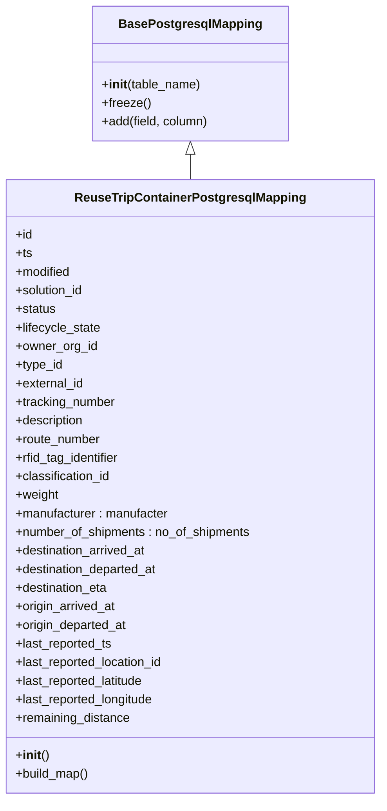
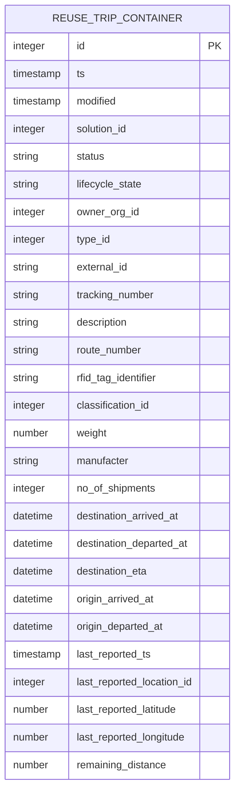

# Diagram: application_service/container_tracking_app_service/persistance_adapter/postgresql/ReuseTripContainerPostgresqlMapping.py

> Auto-generated by Obscura crawlers

## Diagram 1

### SVG

<svg id="container" width="489.5703125" xmlns="http://www.w3.org/2000/svg" class="classDiagram" height="1032" viewBox="0 0 489.5703125 1032" role="graphics-document document" aria-roledescription="class"><g><defs><marker id="container_class-aggregationStart" class="marker aggregation class" refX="18" refY="7" markerWidth="190" markerHeight="240" orient="auto"><path d="M 18,7 L9,13 L1,7 L9,1 Z"></path></marker></defs><defs><marker id="container_class-aggregationEnd" class="marker aggregation class" refX="1" refY="7" markerWidth="20" markerHeight="28" orient="auto"><path d="M 18,7 L9,13 L1,7 L9,1 Z"></path></marker></defs><defs><marker id="container_class-extensionStart" class="marker extension class" refX="18" refY="7" markerWidth="190" markerHeight="240" orient="auto"><path d="M 1,7 L18,13 V 1 Z"></path></marker></defs><defs><marker id="container_class-extensionEnd" class="marker extension class" refX="1" refY="7" markerWidth="20" markerHeight="28" orient="auto"><path d="M 1,1 V 13 L18,7 Z"></path></marker></defs><defs><marker id="container_class-compositionStart" class="marker composition class" refX="18" refY="7" markerWidth="190" markerHeight="240" orient="auto"><path d="M 18,7 L9,13 L1,7 L9,1 Z"></path></marker></defs><defs><marker id="container_class-compositionEnd" class="marker composition class" refX="1" refY="7" markerWidth="20" markerHeight="28" orient="auto"><path d="M 18,7 L9,13 L1,7 L9,1 Z"></path></marker></defs><defs><marker id="container_class-dependencyStart" class="marker dependency class" refX="6" refY="7" markerWidth="190" markerHeight="240" orient="auto"><path d="M 5,7 L9,13 L1,7 L9,1 Z"></path></marker></defs><defs><marker id="container_class-dependencyEnd" class="marker dependency class" refX="13" refY="7" markerWidth="20" markerHeight="28" orient="auto"><path d="M 18,7 L9,13 L14,7 L9,1 Z"></path></marker></defs><defs><marker id="container_class-lollipopStart" class="marker lollipop class" refX="13" refY="7" markerWidth="190" markerHeight="240" orient="auto"><circle stroke="black" fill="transparent" cx="7" cy="7" r="6"></circle></marker></defs><defs><marker id="container_class-lollipopEnd" class="marker lollipop class" refX="1" refY="7" markerWidth="190" markerHeight="240" orient="auto"><circle stroke="black" fill="transparent" cx="7" cy="7" r="6"></circle></marker></defs><g class="root"><g class="clusters"></g><g class="edgePaths"><path d="M244.785,199.25L244.785,200.542C244.785,201.833,244.785,204.417,244.785,209.875C244.785,215.333,244.785,223.667,244.785,227.833L244.785,232" id="id_BasePostgresqlMapping_ReuseTripContainerPostgresqlMapping_1" class="edge-thickness-normal edge-pattern-solid relation" style=";;;" data-edge="true" data-et="edge" data-id="id_BasePostgresqlMapping_ReuseTripContainerPostgresqlMapping_1" data-points="W3sieCI6MjQ0Ljc4NTE1NjI1LCJ5IjoxODJ9LHsieCI6MjQ0Ljc4NTE1NjI1LCJ5IjoyMDd9LHsieCI6MjQ0Ljc4NTE1NjI1LCJ5IjoyMzJ9XQ==" marker-start="url(#container_class-extensionStart)"></path></g><g class="edgeLabels"><g class="edgeLabel"><g class="label" data-id="id_BasePostgresqlMapping_ReuseTripContainerPostgresqlMapping_1" transform="translate(0, 0)"><foreignObject width="0" height="0">

</foreignObject></g></g></g><g class="nodes"><g class="node default" id="classId-BasePostgresqlMapping-0" transform="translate(244.78515625, 95)"><g class="basic label-container"><path d="M-125.90625 -87 L125.90625 -87 L125.90625 87 L-125.90625 87" stroke="none" stroke-width="0" fill="#ECECFF" style=""></path><path d="M-125.90625 -87 C-72.91363494849726 -87, -19.921019896994522 -87, 125.90625 -87 M-125.90625 -87 C-65.7051227785305 -87, -5.503995557060989 -87, 125.90625 -87 M125.90625 -87 C125.90625 -40.55589478265491, 125.90625 5.88821043469018, 125.90625 87 M125.90625 -87 C125.90625 -20.314689942885494, 125.90625 46.37062011422901, 125.90625 87 M125.90625 87 C51.63508917890006 87, -22.63607164219988 87, -125.90625 87 M125.90625 87 C26.453074136466853 87, -73.0001017270663 87, -125.90625 87 M-125.90625 87 C-125.90625 33.09518220888176, -125.90625 -20.80963558223648, -125.90625 -87 M-125.90625 87 C-125.90625 47.32811238762898, -125.90625 7.656224775257954, -125.90625 -87" stroke="#9370DB" stroke-width="1.3" fill="none" stroke-dasharray="0 0" style=""></path></g><g class="annotation-group text" transform="translate(0, -63)"></g><g class="label-group text" transform="translate(-87.921875, -63)"><g class="label" style="font-weight: bolder" transform="translate(0,-12)"><foreignObject width="175.84375" height="24">

BasePostgresqlMapping

</foreignObject></g></g><g class="members-group text" transform="translate(-113.90625, -15)"></g><g class="methods-group text" transform="translate(-113.90625, 15)"><g class="label" style="" transform="translate(0,-12)"><foreignObject width="128.515625" height="24">

+<strong>init</strong>(table_name)

</foreignObject></g><g class="label" style="" transform="translate(0,12)"><foreignObject width="62.109375" height="24">

+freeze()

</foreignObject></g><g class="label" style="" transform="translate(0,36)"><foreignObject width="139.890625" height="24">

+add(field, column)

</foreignObject></g></g><g class="divider" style=""><path d="M-125.90625 -39 C-29.532319670175596 -39, 66.84161065964881 -39, 125.90625 -39 M-125.90625 -39 C-53.63686416361885 -39, 18.632521672762294 -39, 125.90625 -39" stroke="#9370DB" stroke-width="1.3" fill="none" stroke-dasharray="0 0" style=""></path></g><g class="divider" style=""><path d="M-125.90625 -15 C-64.00297146373133 -15, -2.0996929274626552 -15, 125.90625 -15 M-125.90625 -15 C-73.40511693050408 -15, -20.903983861008157 -15, 125.90625 -15" stroke="#9370DB" stroke-width="1.3" fill="none" stroke-dasharray="0 0" style=""></path></g></g><g class="node default" id="classId-ReuseTripContainerPostgresqlMapping-1" transform="translate(244.78515625, 628)"><g class="basic label-container"><path d="M-236.78515625 -396 L236.78515625 -396 L236.78515625 396 L-236.78515625 396" stroke="none" stroke-width="0" fill="#ECECFF" style=""></path><path d="M-236.78515625 -396 C-123.70624762423783 -396, -10.627338998475665 -396, 236.78515625 -396 M-236.78515625 -396 C-120.15283379460797 -396, -3.5205113392159433 -396, 236.78515625 -396 M236.78515625 -396 C236.78515625 -164.63702403818277, 236.78515625 66.72595192363445, 236.78515625 396 M236.78515625 -396 C236.78515625 -107.36850864340079, 236.78515625 181.26298271319843, 236.78515625 396 M236.78515625 396 C86.85970302602655 396, -63.0657501979469 396, -236.78515625 396 M236.78515625 396 C74.6232260848191 396, -87.53870408036181 396, -236.78515625 396 M-236.78515625 396 C-236.78515625 215.22444451086284, -236.78515625 34.44888902172568, -236.78515625 -396 M-236.78515625 396 C-236.78515625 221.9889196757132, -236.78515625 47.97783935142638, -236.78515625 -396" stroke="#9370DB" stroke-width="1.3" fill="none" stroke-dasharray="0 0" style=""></path></g><g class="annotation-group text" transform="translate(0, -372)"></g><g class="label-group text" transform="translate(-142.4140625, -372)"><g class="label" style="font-weight: bolder" transform="translate(0,-12)"><foreignObject width="284.828125" height="24">

ReuseTripContainerPostgresqlMapping

</foreignObject></g></g><g class="members-group text" transform="translate(-224.78515625, -324)"><g class="label" style="" transform="translate(0,-12)"><foreignObject width="22.078125" height="24">

+id

</foreignObject></g><g class="label" style="" transform="translate(0,12)"><foreignObject width="21.15625" height="24">

+ts

</foreignObject></g><g class="label" style="" transform="translate(0,36)"><foreignObject width="72.609375" height="24">

+modified

</foreignObject></g><g class="label" style="" transform="translate(0,60)"><foreignObject width="90.21875" height="24">

+solution_id

</foreignObject></g><g class="label" style="" transform="translate(0,84)"><foreignObject width="52.390625" height="24">

+status

</foreignObject></g><g class="label" style="" transform="translate(0,108)"><foreignObject width="111.640625" height="24">

+lifecycle_state

</foreignObject></g><g class="label" style="" transform="translate(0,132)"><foreignObject width="105.859375" height="24">

+owner_org_id

</foreignObject></g><g class="label" style="" transform="translate(0,156)"><foreignObject width="61.78125" height="24">

+type_id

</foreignObject></g><g class="label" style="" transform="translate(0,180)"><foreignObject width="89.765625" height="24">

+external_id

</foreignObject></g><g class="label" style="" transform="translate(0,204)"><foreignObject width="131.234375" height="24">

+tracking_number

</foreignObject></g><g class="label" style="" transform="translate(0,228)"><foreignObject width="90.59375" height="24">

+description

</foreignObject></g><g class="label" style="" transform="translate(0,252)"><foreignObject width="111.40625" height="24">

+route_number

</foreignObject></g><g class="label" style="" transform="translate(0,276)"><foreignObject width="138.40625" height="24">

+rfid_tag_identifier

</foreignObject></g><g class="label" style="" transform="translate(0,300)"><foreignObject width="124.890625" height="24">

+classification_id

</foreignObject></g><g class="label" style="" transform="translate(0,324)"><foreignObject width="56.171875" height="24">

+weight

</foreignObject></g><g class="label" style="" transform="translate(0,348)"><foreignObject width="201.359375" height="24">

+manufacturer : manufacter

</foreignObject></g><g class="label" style="" transform="translate(0,372)"><foreignObject width="307.15625" height="24">

+number_of_shipments : no_of_shipments

</foreignObject></g><g class="label" style="" transform="translate(0,396)"><foreignObject width="173.265625" height="24">

+destination_arrived_at

</foreignObject></g><g class="label" style="" transform="translate(0,420)"><foreignObject width="187.9375" height="24">

+destination_departed_at

</foreignObject></g><g class="label" style="" transform="translate(0,444)"><foreignObject width="122.21875" height="24">

+destination_eta

</foreignObject></g><g class="label" style="" transform="translate(0,468)"><foreignObject width="132.375" height="24">

+origin_arrived_at

</foreignObject></g><g class="label" style="" transform="translate(0,492)"><foreignObject width="147.046875" height="24">

+origin_departed_at

</foreignObject></g><g class="label" style="" transform="translate(0,516)"><foreignObject width="127.21875" height="24">

+last_reported_ts

</foreignObject></g><g class="label" style="" transform="translate(0,540)"><foreignObject width="195.6875" height="24">

+last_reported_location_id

</foreignObject></g><g class="label" style="" transform="translate(0,564)"><foreignObject width="171.109375" height="24">

+last_reported_latitude

</foreignObject></g><g class="label" style="" transform="translate(0,588)"><foreignObject width="183.671875" height="24">

+last_reported_longitude

</foreignObject></g><g class="label" style="" transform="translate(0,612)"><foreignObject width="150.328125" height="24">

+remaining_distance

</foreignObject></g></g><g class="methods-group text" transform="translate(-224.78515625, 348)"><g class="label" style="" transform="translate(0,-12)"><foreignObject width="42.796875" height="24">

+<strong>init</strong>()

</foreignObject></g><g class="label" style="" transform="translate(0,12)"><foreignObject width="96.109375" height="24">

+build_map()

</foreignObject></g></g><g class="divider" style=""><path d="M-236.78515625 -348 C-59.472742313844634 -348, 117.83967162231073 -348, 236.78515625 -348 M-236.78515625 -348 C-52.24692307245337 -348, 132.29131010509326 -348, 236.78515625 -348" stroke="#9370DB" stroke-width="1.3" fill="none" stroke-dasharray="0 0" style=""></path></g><g class="divider" style=""><path d="M-236.78515625 324 C-74.44987916758544 324, 87.88539791482913 324, 236.78515625 324 M-236.78515625 324 C-96.61310482030643 324, 43.558946609387135 324, 236.78515625 324" stroke="#9370DB" stroke-width="1.3" fill="none" stroke-dasharray="0 0" style=""></path></g></g></g></g></g></svg>

## Diagram 2

### SVG

<svg id="container" width="375.21875" xmlns="http://www.w3.org/2000/svg" class="erDiagram" height="1213" viewBox="0 0 375.21875 1213" role="graphics-document document" aria-roledescription="er"><g><defs><marker id="container_er-onlyOneStart" class="marker onlyOne er" refX="0" refY="9" markerWidth="18" markerHeight="18" orient="auto"><path d="M9,0 L9,18 M15,0 L15,18"></path></marker></defs><defs><marker id="container_er-onlyOneEnd" class="marker onlyOne er" refX="18" refY="9" markerWidth="18" markerHeight="18" orient="auto"><path d="M3,0 L3,18 M9,0 L9,18"></path></marker></defs><defs><marker id="container_er-zeroOrOneStart" class="marker zeroOrOne er" refX="0" refY="9" markerWidth="30" markerHeight="18" orient="auto"><circle fill="white" cx="21" cy="9" r="6"></circle><path d="M9,0 L9,18"></path></marker></defs><defs><marker id="container_er-zeroOrOneEnd" class="marker zeroOrOne er" refX="30" refY="9" markerWidth="30" markerHeight="18" orient="auto"><circle fill="white" cx="9" cy="9" r="6"></circle><path d="M21,0 L21,18"></path></marker></defs><defs><marker id="container_er-oneOrMoreStart" class="marker oneOrMore er" refX="18" refY="18" markerWidth="45" markerHeight="36" orient="auto"><path d="M0,18 Q 18,0 36,18 Q 18,36 0,18 M42,9 L42,27"></path></marker></defs><defs><marker id="container_er-oneOrMoreEnd" class="marker oneOrMore er" refX="27" refY="18" markerWidth="45" markerHeight="36" orient="auto"><path d="M3,9 L3,27 M9,18 Q27,0 45,18 Q27,36 9,18"></path></marker></defs><defs><marker id="container_er-zeroOrMoreStart" class="marker zeroOrMore er" refX="18" refY="18" markerWidth="57" markerHeight="36" orient="auto"><circle fill="white" cx="48" cy="18" r="6"></circle><path d="M0,18 Q18,0 36,18 Q18,36 0,18"></path></marker></defs><defs><marker id="container_er-zeroOrMoreEnd" class="marker zeroOrMore er" refX="39" refY="18" markerWidth="57" markerHeight="36" orient="auto"><circle fill="white" cx="9" cy="18" r="6"></circle><path d="M21,18 Q39,0 57,18 Q39,36 21,18"></path></marker></defs><g class="root"><g class="clusters"></g><g class="edgePaths"></g><g class="edgeLabels"></g><g class="nodes"><g class="node default" id="entity-REUSE_TRIP_CONTAINER-0" transform="translate(187.609375, 606.5)"><g style=""><path d="M-179.609375 -598.5 L179.609375 -598.5 L179.609375 598.5 L-179.609375 598.5" stroke="none" stroke-width="0" fill="#ECECFF"></path><path d="M-179.609375 -598.5 C-91.41405746984655 -598.5, -3.2187399396931085 -598.5, 179.609375 -598.5 M-179.609375 -598.5 C-70.79615194206245 -598.5, 38.0170711158751 -598.5, 179.609375 -598.5 M179.609375 -598.5 C179.609375 -276.71617717696876, 179.609375 45.06764564606249, 179.609375 598.5 M179.609375 -598.5 C179.609375 -181.59318980749083, 179.609375 235.31362038501834, 179.609375 598.5 M179.609375 598.5 C38.32612350803234 598.5, -102.95712798393532 598.5, -179.609375 598.5 M179.609375 598.5 C55.01916959883836 598.5, -69.57103580232328 598.5, -179.609375 598.5 M-179.609375 598.5 C-179.609375 275.4047298895802, -179.609375 -47.69054022083958, -179.609375 -598.5 M-179.609375 598.5 C-179.609375 141.40384016278279, -179.609375 -315.69231967443443, -179.609375 -598.5" stroke="#9370DB" stroke-width="1.3" fill="none" stroke-dasharray="0 0"></path></g><g style="" class="row-rect-odd"><path d="M-179.609375 -555.75 L179.609375 -555.75 L179.609375 -513 L-179.609375 -513" stroke="none" stroke-width="0" fill="hsl(240, 100%, 100%)"></path><path d="M-179.609375 -555.75 C-104.30504309965625 -555.75, -29.00071119931249 -555.75, 179.609375 -555.75 M-179.609375 -555.75 C-90.19161943029857 -555.75, -0.773863860597146 -555.75, 179.609375 -555.75 M179.609375 -555.75 C179.609375 -545.8807516186102, 179.609375 -536.0115032372205, 179.609375 -513 M179.609375 -555.75 C179.609375 -542.5412775704045, 179.609375 -529.3325551408091, 179.609375 -513 M179.609375 -513 C89.92520667565094 -513, 0.24103835130188145 -513, -179.609375 -513 M179.609375 -513 C79.06848290862659 -513, -21.472409182746816 -513, -179.609375 -513 M-179.609375 -513 C-179.609375 -523.3966101253554, -179.609375 -533.7932202507109, -179.609375 -555.75 M-179.609375 -513 C-179.609375 -523.843169820498, -179.609375 -534.6863396409959, -179.609375 -555.75" stroke="#9370DB" stroke-width="1.3" fill="none" stroke-dasharray="0 0"></path></g><g style="" class="row-rect-even"><path d="M-179.609375 -513 L179.609375 -513 L179.609375 -470.25 L-179.609375 -470.25" stroke="none" stroke-width="0" fill="hsl(240, 100%, 97.2745098039%)"></path><path d="M-179.609375 -513 C-71.64711136467703 -513, 36.31515227064594 -513, 179.609375 -513 M-179.609375 -513 C-65.49243583342945 -513, 48.62450333314109 -513, 179.609375 -513 M179.609375 -513 C179.609375 -500.8429348212249, 179.609375 -488.6858696424498, 179.609375 -470.25 M179.609375 -513 C179.609375 -503.24345634841956, 179.609375 -493.48691269683917, 179.609375 -470.25 M179.609375 -470.25 C81.13704669675028 -470.25, -17.33528160649945 -470.25, -179.609375 -470.25 M179.609375 -470.25 C60.0751046936205 -470.25, -59.459165612758994 -470.25, -179.609375 -470.25 M-179.609375 -470.25 C-179.609375 -486.60125760517576, -179.609375 -502.95251521035146, -179.609375 -513 M-179.609375 -470.25 C-179.609375 -478.87627075384216, -179.609375 -487.5025415076844, -179.609375 -513" stroke="#9370DB" stroke-width="1.3" fill="none" stroke-dasharray="0 0"></path></g><g style="" class="row-rect-odd"><path d="M-179.609375 -470.25 L179.609375 -470.25 L179.609375 -427.5 L-179.609375 -427.5" stroke="none" stroke-width="0" fill="hsl(240, 100%, 100%)"></path><path d="M-179.609375 -470.25 C-101.17740055964379 -470.25, -22.745426119287572 -470.25, 179.609375 -470.25 M-179.609375 -470.25 C-46.558255652896804 -470.25, 86.49286369420639 -470.25, 179.609375 -470.25 M179.609375 -470.25 C179.609375 -458.5781624141587, 179.609375 -446.9063248283175, 179.609375 -427.5 M179.609375 -470.25 C179.609375 -459.1198538348439, 179.609375 -447.9897076696879, 179.609375 -427.5 M179.609375 -427.5 C97.07108915941207 -427.5, 14.532803318824136 -427.5, -179.609375 -427.5 M179.609375 -427.5 C102.53204543616607 -427.5, 25.454715872332144 -427.5, -179.609375 -427.5 M-179.609375 -427.5 C-179.609375 -437.00233048300265, -179.609375 -446.5046609660053, -179.609375 -470.25 M-179.609375 -427.5 C-179.609375 -440.57094720192714, -179.609375 -453.6418944038543, -179.609375 -470.25" stroke="#9370DB" stroke-width="1.3" fill="none" stroke-dasharray="0 0"></path></g><g style="" class="row-rect-even"><path d="M-179.609375 -427.5 L179.609375 -427.5 L179.609375 -384.75 L-179.609375 -384.75" stroke="none" stroke-width="0" fill="hsl(240, 100%, 97.2745098039%)"></path><path d="M-179.609375 -427.5 C-53.66016564236446 -427.5, 72.28904371527108 -427.5, 179.609375 -427.5 M-179.609375 -427.5 C-98.60435267742288 -427.5, -17.599330354845762 -427.5, 179.609375 -427.5 M179.609375 -427.5 C179.609375 -418.5536522766479, 179.609375 -409.60730455329576, 179.609375 -384.75 M179.609375 -427.5 C179.609375 -417.04927126772196, 179.609375 -406.5985425354439, 179.609375 -384.75 M179.609375 -384.75 C37.29480808336615 -384.75, -105.0197588332677 -384.75, -179.609375 -384.75 M179.609375 -384.75 C89.60776442672856 -384.75, -0.3938461465428702 -384.75, -179.609375 -384.75 M-179.609375 -384.75 C-179.609375 -401.04506379607983, -179.609375 -417.3401275921596, -179.609375 -427.5 M-179.609375 -384.75 C-179.609375 -397.9193149440551, -179.609375 -411.08862988811023, -179.609375 -427.5" stroke="#9370DB" stroke-width="1.3" fill="none" stroke-dasharray="0 0"></path></g><g style="" class="row-rect-odd"><path d="M-179.609375 -384.75 L179.609375 -384.75 L179.609375 -342 L-179.609375 -342" stroke="none" stroke-width="0" fill="hsl(240, 100%, 100%)"></path><path d="M-179.609375 -384.75 C-103.40622457872941 -384.75, -27.203074157458815 -384.75, 179.609375 -384.75 M-179.609375 -384.75 C-86.16984407234219 -384.75, 7.269686855315626 -384.75, 179.609375 -384.75 M179.609375 -384.75 C179.609375 -370.1387405866234, 179.609375 -355.5274811732467, 179.609375 -342 M179.609375 -384.75 C179.609375 -368.45909088223556, 179.609375 -352.1681817644711, 179.609375 -342 M179.609375 -342 C46.674404118430715 -342, -86.26056676313857 -342, -179.609375 -342 M179.609375 -342 C79.8397803331167 -342, -19.929814333766586 -342, -179.609375 -342 M-179.609375 -342 C-179.609375 -353.59121165826355, -179.609375 -365.18242331652715, -179.609375 -384.75 M-179.609375 -342 C-179.609375 -352.34002864144605, -179.609375 -362.68005728289216, -179.609375 -384.75" stroke="#9370DB" stroke-width="1.3" fill="none" stroke-dasharray="0 0"></path></g><g style="" class="row-rect-even"><path d="M-179.609375 -342 L179.609375 -342 L179.609375 -299.25 L-179.609375 -299.25" stroke="none" stroke-width="0" fill="hsl(240, 100%, 97.2745098039%)"></path><path d="M-179.609375 -342 C-99.34456402213966 -342, -19.07975304427933 -342, 179.609375 -342 M-179.609375 -342 C-79.9337493825222 -342, 19.741876234955612 -342, 179.609375 -342 M179.609375 -342 C179.609375 -326.63837999084865, 179.609375 -311.27675998169735, 179.609375 -299.25 M179.609375 -342 C179.609375 -327.5626050384701, 179.609375 -313.1252100769402, 179.609375 -299.25 M179.609375 -299.25 C47.146814975494266 -299.25, -85.31574504901147 -299.25, -179.609375 -299.25 M179.609375 -299.25 C53.96628510599771 -299.25, -71.67680478800457 -299.25, -179.609375 -299.25 M-179.609375 -299.25 C-179.609375 -310.89999641518386, -179.609375 -322.5499928303677, -179.609375 -342 M-179.609375 -299.25 C-179.609375 -309.4044399382217, -179.609375 -319.5588798764434, -179.609375 -342" stroke="#9370DB" stroke-width="1.3" fill="none" stroke-dasharray="0 0"></path></g><g style="" class="row-rect-odd"><path d="M-179.609375 -299.25 L179.609375 -299.25 L179.609375 -256.5 L-179.609375 -256.5" stroke="none" stroke-width="0" fill="hsl(240, 100%, 100%)"></path><path d="M-179.609375 -299.25 C-71.97594352033553 -299.25, 35.65748795932893 -299.25, 179.609375 -299.25 M-179.609375 -299.25 C-52.23270804007454 -299.25, 75.14395891985092 -299.25, 179.609375 -299.25 M179.609375 -299.25 C179.609375 -286.3131685987671, 179.609375 -273.3763371975342, 179.609375 -256.5 M179.609375 -299.25 C179.609375 -283.61311577091317, 179.609375 -267.9762315418264, 179.609375 -256.5 M179.609375 -256.5 C73.7192291349282 -256.5, -32.1709167301436 -256.5, -179.609375 -256.5 M179.609375 -256.5 C55.04518693145394 -256.5, -69.51900113709212 -256.5, -179.609375 -256.5 M-179.609375 -256.5 C-179.609375 -268.4632767142826, -179.609375 -280.42655342856517, -179.609375 -299.25 M-179.609375 -256.5 C-179.609375 -265.6177549419328, -179.609375 -274.7355098838656, -179.609375 -299.25" stroke="#9370DB" stroke-width="1.3" fill="none" stroke-dasharray="0 0"></path></g><g style="" class="row-rect-even"><path d="M-179.609375 -256.5 L179.609375 -256.5 L179.609375 -213.75 L-179.609375 -213.75" stroke="none" stroke-width="0" fill="hsl(240, 100%, 97.2745098039%)"></path><path d="M-179.609375 -256.5 C-92.51551802025747 -256.5, -5.421661040514948 -256.5, 179.609375 -256.5 M-179.609375 -256.5 C-106.66974321697275 -256.5, -33.730111433945495 -256.5, 179.609375 -256.5 M179.609375 -256.5 C179.609375 -245.05276246654836, 179.609375 -233.6055249330967, 179.609375 -213.75 M179.609375 -256.5 C179.609375 -240.92711981644433, 179.609375 -225.35423963288864, 179.609375 -213.75 M179.609375 -213.75 C94.05601600557696 -213.75, 8.502657011153929 -213.75, -179.609375 -213.75 M179.609375 -213.75 C52.198637389628004 -213.75, -75.21210022074399 -213.75, -179.609375 -213.75 M-179.609375 -213.75 C-179.609375 -226.5259378450284, -179.609375 -239.30187569005682, -179.609375 -256.5 M-179.609375 -213.75 C-179.609375 -230.81766599335964, -179.609375 -247.88533198671928, -179.609375 -256.5" stroke="#9370DB" stroke-width="1.3" fill="none" stroke-dasharray="0 0"></path></g><g style="" class="row-rect-odd"><path d="M-179.609375 -213.75 L179.609375 -213.75 L179.609375 -171 L-179.609375 -171" stroke="none" stroke-width="0" fill="hsl(240, 100%, 100%)"></path><path d="M-179.609375 -213.75 C-94.9657313294525 -213.75, -10.32208765890499 -213.75, 179.609375 -213.75 M-179.609375 -213.75 C-42.43290384153218 -213.75, 94.74356731693564 -213.75, 179.609375 -213.75 M179.609375 -213.75 C179.609375 -203.94647227735243, 179.609375 -194.14294455470485, 179.609375 -171 M179.609375 -213.75 C179.609375 -205.01319212687423, 179.609375 -196.2763842537485, 179.609375 -171 M179.609375 -171 C46.6997389812129 -171, -86.2098970375742 -171, -179.609375 -171 M179.609375 -171 C82.42250072373247 -171, -14.764373552535062 -171, -179.609375 -171 M-179.609375 -171 C-179.609375 -184.43197278581135, -179.609375 -197.86394557162274, -179.609375 -213.75 M-179.609375 -171 C-179.609375 -184.60616201986838, -179.609375 -198.21232403973679, -179.609375 -213.75" stroke="#9370DB" stroke-width="1.3" fill="none" stroke-dasharray="0 0"></path></g><g style="" class="row-rect-even"><path d="M-179.609375 -171 L179.609375 -171 L179.609375 -128.25 L-179.609375 -128.25" stroke="none" stroke-width="0" fill="hsl(240, 100%, 97.2745098039%)"></path><path d="M-179.609375 -171 C-101.58412409226956 -171, -23.558873184539124 -171, 179.609375 -171 M-179.609375 -171 C-81.0036911403441 -171, 17.601992719311795 -171, 179.609375 -171 M179.609375 -171 C179.609375 -158.44402888342978, 179.609375 -145.88805776685956, 179.609375 -128.25 M179.609375 -171 C179.609375 -155.71699899900662, 179.609375 -140.43399799801324, 179.609375 -128.25 M179.609375 -128.25 C96.7295246777945 -128.25, 13.849674355589002 -128.25, -179.609375 -128.25 M179.609375 -128.25 C61.05743478820382 -128.25, -57.49450542359236 -128.25, -179.609375 -128.25 M-179.609375 -128.25 C-179.609375 -139.60436947828484, -179.609375 -150.95873895656965, -179.609375 -171 M-179.609375 -128.25 C-179.609375 -137.02538124646028, -179.609375 -145.80076249292057, -179.609375 -171" stroke="#9370DB" stroke-width="1.3" fill="none" stroke-dasharray="0 0"></path></g><g style="" class="row-rect-odd"><path d="M-179.609375 -128.25 L179.609375 -128.25 L179.609375 -85.5 L-179.609375 -85.5" stroke="none" stroke-width="0" fill="hsl(240, 100%, 100%)"></path><path d="M-179.609375 -128.25 C-65.45894606744945 -128.25, 48.69148286510111 -128.25, 179.609375 -128.25 M-179.609375 -128.25 C-37.42664323029237 -128.25, 104.75608853941526 -128.25, 179.609375 -128.25 M179.609375 -128.25 C179.609375 -112.40350639441898, 179.609375 -96.55701278883795, 179.609375 -85.5 M179.609375 -128.25 C179.609375 -114.87487089879174, 179.609375 -101.49974179758348, 179.609375 -85.5 M179.609375 -85.5 C66.88989678679985 -85.5, -45.829581426400296 -85.5, -179.609375 -85.5 M179.609375 -85.5 C73.36775856805181 -85.5, -32.873857863896376 -85.5, -179.609375 -85.5 M-179.609375 -85.5 C-179.609375 -94.50667857970573, -179.609375 -103.51335715941147, -179.609375 -128.25 M-179.609375 -85.5 C-179.609375 -98.0825193027726, -179.609375 -110.66503860554519, -179.609375 -128.25" stroke="#9370DB" stroke-width="1.3" fill="none" stroke-dasharray="0 0"></path></g><g style="" class="row-rect-even"><path d="M-179.609375 -85.5 L179.609375 -85.5 L179.609375 -42.75 L-179.609375 -42.75" stroke="none" stroke-width="0" fill="hsl(240, 100%, 97.2745098039%)"></path><path d="M-179.609375 -85.5 C-59.42161689706967 -85.5, 60.76614120586066 -85.5, 179.609375 -85.5 M-179.609375 -85.5 C-82.12489049771624 -85.5, 15.359594004567526 -85.5, 179.609375 -85.5 M179.609375 -85.5 C179.609375 -68.5527438936521, 179.609375 -51.60548778730422, 179.609375 -42.75 M179.609375 -85.5 C179.609375 -72.34338467392519, 179.609375 -59.18676934785036, 179.609375 -42.75 M179.609375 -42.75 C48.215793864284166 -42.75, -83.17778727143167 -42.75, -179.609375 -42.75 M179.609375 -42.75 C39.75352830983283 -42.75, -100.10231838033434 -42.75, -179.609375 -42.75 M-179.609375 -42.75 C-179.609375 -59.133295471090975, -179.609375 -75.51659094218195, -179.609375 -85.5 M-179.609375 -42.75 C-179.609375 -58.12646177747737, -179.609375 -73.50292355495473, -179.609375 -85.5" stroke="#9370DB" stroke-width="1.3" fill="none" stroke-dasharray="0 0"></path></g><g style="" class="row-rect-odd"><path d="M-179.609375 -42.75 L179.609375 -42.75 L179.609375 0 L-179.609375 0" stroke="none" stroke-width="0" fill="hsl(240, 100%, 100%)"></path><path d="M-179.609375 -42.75 C-58.107487009951555 -42.75, 63.39440098009689 -42.75, 179.609375 -42.75 M-179.609375 -42.75 C-78.66830037018222 -42.75, 22.272774259635554 -42.75, 179.609375 -42.75 M179.609375 -42.75 C179.609375 -30.642522881518122, 179.609375 -18.535045763036244, 179.609375 0 M179.609375 -42.75 C179.609375 -27.78016968715226, 179.609375 -12.810339374304519, 179.609375 0 M179.609375 0 C76.17135489419594 0, -27.266665211608114 0, -179.609375 0 M179.609375 0 C68.76635762174831 0, -42.076659756503375 0, -179.609375 0 M-179.609375 0 C-179.609375 -11.93716735591688, -179.609375 -23.87433471183376, -179.609375 -42.75 M-179.609375 0 C-179.609375 -13.391888338518328, -179.609375 -26.783776677036656, -179.609375 -42.75" stroke="#9370DB" stroke-width="1.3" fill="none" stroke-dasharray="0 0"></path></g><g style="" class="row-rect-even"><path d="M-179.609375 0 L179.609375 0 L179.609375 42.75 L-179.609375 42.75" stroke="none" stroke-width="0" fill="hsl(240, 100%, 97.2745098039%)"></path><path d="M-179.609375 0 C-43.521672987719484 0, 92.56602902456103 0, 179.609375 0 M-179.609375 0 C-101.52273488282468 0, -23.436094765649358 0, 179.609375 0 M179.609375 0 C179.609375 12.627357483277839, 179.609375 25.254714966555678, 179.609375 42.75 M179.609375 0 C179.609375 9.098943839991371, 179.609375 18.197887679982742, 179.609375 42.75 M179.609375 42.75 C64.01685924466783 42.75, -51.575656510664345 42.75, -179.609375 42.75 M179.609375 42.75 C84.70554808934104 42.75, -10.198278821317928 42.75, -179.609375 42.75 M-179.609375 42.75 C-179.609375 30.520010064642594, -179.609375 18.29002012928519, -179.609375 0 M-179.609375 42.75 C-179.609375 29.98092780240893, -179.609375 17.211855604817863, -179.609375 0" stroke="#9370DB" stroke-width="1.3" fill="none" stroke-dasharray="0 0"></path></g><g style="" class="row-rect-odd"><path d="M-179.609375 42.75 L179.609375 42.75 L179.609375 85.5 L-179.609375 85.5" stroke="none" stroke-width="0" fill="hsl(240, 100%, 100%)"></path><path d="M-179.609375 42.75 C-63.39609486025114 42.75, 52.81718527949772 42.75, 179.609375 42.75 M-179.609375 42.75 C-84.94419405450185 42.75, 9.7209868909963 42.75, 179.609375 42.75 M179.609375 42.75 C179.609375 57.43685885986617, 179.609375 72.12371771973234, 179.609375 85.5 M179.609375 42.75 C179.609375 51.4157078100255, 179.609375 60.081415620051004, 179.609375 85.5 M179.609375 85.5 C39.18641521422842 85.5, -101.23654457154316 85.5, -179.609375 85.5 M179.609375 85.5 C81.75970139341518 85.5, -16.08997221316963 85.5, -179.609375 85.5 M-179.609375 85.5 C-179.609375 72.59614280967611, -179.609375 59.692285619352226, -179.609375 42.75 M-179.609375 85.5 C-179.609375 74.42184198855308, -179.609375 63.34368397710615, -179.609375 42.75" stroke="#9370DB" stroke-width="1.3" fill="none" stroke-dasharray="0 0"></path></g><g style="" class="row-rect-even"><path d="M-179.609375 85.5 L179.609375 85.5 L179.609375 128.25 L-179.609375 128.25" stroke="none" stroke-width="0" fill="hsl(240, 100%, 97.2745098039%)"></path><path d="M-179.609375 85.5 C-42.15481308572211 85.5, 95.29974882855578 85.5, 179.609375 85.5 M-179.609375 85.5 C-45.47580137337809 85.5, 88.65777225324382 85.5, 179.609375 85.5 M179.609375 85.5 C179.609375 96.94079152602626, 179.609375 108.3815830520525, 179.609375 128.25 M179.609375 85.5 C179.609375 95.37140922699328, 179.609375 105.24281845398656, 179.609375 128.25 M179.609375 128.25 C72.69840065543134 128.25, -34.212573689137315 128.25, -179.609375 128.25 M179.609375 128.25 C36.61762667477552 128.25, -106.37412165044896 128.25, -179.609375 128.25 M-179.609375 128.25 C-179.609375 115.59485999830967, -179.609375 102.93971999661935, -179.609375 85.5 M-179.609375 128.25 C-179.609375 117.9253469103156, -179.609375 107.60069382063121, -179.609375 85.5" stroke="#9370DB" stroke-width="1.3" fill="none" stroke-dasharray="0 0"></path></g><g style="" class="row-rect-odd"><path d="M-179.609375 128.25 L179.609375 128.25 L179.609375 171 L-179.609375 171" stroke="none" stroke-width="0" fill="hsl(240, 100%, 100%)"></path><path d="M-179.609375 128.25 C-87.64068347518828 128.25, 4.328008049623435 128.25, 179.609375 128.25 M-179.609375 128.25 C-62.42480213627192 128.25, 54.75977072745616 128.25, 179.609375 128.25 M179.609375 128.25 C179.609375 143.81319260922035, 179.609375 159.3763852184407, 179.609375 171 M179.609375 128.25 C179.609375 143.6353379684036, 179.609375 159.0206759368072, 179.609375 171 M179.609375 171 C69.03444956510572 171, -41.540475869788565 171, -179.609375 171 M179.609375 171 C75.19370074100023 171, -29.221973517999544 171, -179.609375 171 M-179.609375 171 C-179.609375 162.23786511545373, -179.609375 153.47573023090743, -179.609375 128.25 M-179.609375 171 C-179.609375 156.2842309366346, -179.609375 141.56846187326923, -179.609375 128.25" stroke="#9370DB" stroke-width="1.3" fill="none" stroke-dasharray="0 0"></path></g><g style="" class="row-rect-even"><path d="M-179.609375 171 L179.609375 171 L179.609375 213.75 L-179.609375 213.75" stroke="none" stroke-width="0" fill="hsl(240, 100%, 97.2745098039%)"></path><path d="M-179.609375 171 C-40.324721616522936 171, 98.95993176695413 171, 179.609375 171 M-179.609375 171 C-92.31672753521657 171, -5.024080070433143 171, 179.609375 171 M179.609375 171 C179.609375 184.41351111792534, 179.609375 197.8270222358507, 179.609375 213.75 M179.609375 171 C179.609375 182.46576793459434, 179.609375 193.93153586918868, 179.609375 213.75 M179.609375 213.75 C69.29415385443359 213.75, -41.02106729113282 213.75, -179.609375 213.75 M179.609375 213.75 C77.73397289993115 213.75, -24.141429200137708 213.75, -179.609375 213.75 M-179.609375 213.75 C-179.609375 203.52095930145333, -179.609375 193.29191860290666, -179.609375 171 M-179.609375 213.75 C-179.609375 201.0345824567644, -179.609375 188.3191649135288, -179.609375 171" stroke="#9370DB" stroke-width="1.3" fill="none" stroke-dasharray="0 0"></path></g><g style="" class="row-rect-odd"><path d="M-179.609375 213.75 L179.609375 213.75 L179.609375 256.5 L-179.609375 256.5" stroke="none" stroke-width="0" fill="hsl(240, 100%, 100%)"></path><path d="M-179.609375 213.75 C-42.49704955588982 213.75, 94.61527588822037 213.75, 179.609375 213.75 M-179.609375 213.75 C-66.1589422676766 213.75, 47.29149046464681 213.75, 179.609375 213.75 M179.609375 213.75 C179.609375 227.78252604468727, 179.609375 241.81505208937457, 179.609375 256.5 M179.609375 213.75 C179.609375 222.32943337504454, 179.609375 230.9088667500891, 179.609375 256.5 M179.609375 256.5 C90.80065661905385 256.5, 1.991938238107707 256.5, -179.609375 256.5 M179.609375 256.5 C66.7222249283453 256.5, -46.164925143309404 256.5, -179.609375 256.5 M-179.609375 256.5 C-179.609375 247.07483343442365, -179.609375 237.6496668688473, -179.609375 213.75 M-179.609375 256.5 C-179.609375 247.74509364686972, -179.609375 238.9901872937394, -179.609375 213.75" stroke="#9370DB" stroke-width="1.3" fill="none" stroke-dasharray="0 0"></path></g><g style="" class="row-rect-even"><path d="M-179.609375 256.5 L179.609375 256.5 L179.609375 299.25 L-179.609375 299.25" stroke="none" stroke-width="0" fill="hsl(240, 100%, 97.2745098039%)"></path><path d="M-179.609375 256.5 C-66.98498212122895 256.5, 45.639410757542095 256.5, 179.609375 256.5 M-179.609375 256.5 C-62.050884987054786 256.5, 55.50760502589043 256.5, 179.609375 256.5 M179.609375 256.5 C179.609375 273.4770394562897, 179.609375 290.4540789125793, 179.609375 299.25 M179.609375 256.5 C179.609375 270.5800345754218, 179.609375 284.66006915084364, 179.609375 299.25 M179.609375 299.25 C74.6825861087433 299.25, -30.244202782513412 299.25, -179.609375 299.25 M179.609375 299.25 C83.5039713356108 299.25, -12.601432328778401 299.25, -179.609375 299.25 M-179.609375 299.25 C-179.609375 284.6756651533836, -179.609375 270.1013303067672, -179.609375 256.5 M-179.609375 299.25 C-179.609375 284.9677069528938, -179.609375 270.68541390578764, -179.609375 256.5" stroke="#9370DB" stroke-width="1.3" fill="none" stroke-dasharray="0 0"></path></g><g style="" class="row-rect-odd"><path d="M-179.609375 299.25 L179.609375 299.25 L179.609375 342 L-179.609375 342" stroke="none" stroke-width="0" fill="hsl(240, 100%, 100%)"></path><path d="M-179.609375 299.25 C-49.669494310415416 299.25, 80.27038637916917 299.25, 179.609375 299.25 M-179.609375 299.25 C-96.35486667230445 299.25, -13.100358344608907 299.25, 179.609375 299.25 M179.609375 299.25 C179.609375 314.0850871508128, 179.609375 328.9201743016256, 179.609375 342 M179.609375 299.25 C179.609375 315.8916496932191, 179.609375 332.5332993864382, 179.609375 342 M179.609375 342 C67.31688921349922 342, -44.97559657300155 342, -179.609375 342 M179.609375 342 C78.69595950836124 342, -22.217455983277517 342, -179.609375 342 M-179.609375 342 C-179.609375 332.60096954571765, -179.609375 323.2019390914353, -179.609375 299.25 M-179.609375 342 C-179.609375 330.1350293405369, -179.609375 318.27005868107375, -179.609375 299.25" stroke="#9370DB" stroke-width="1.3" fill="none" stroke-dasharray="0 0"></path></g><g style="" class="row-rect-even"><path d="M-179.609375 342 L179.609375 342 L179.609375 384.75 L-179.609375 384.75" stroke="none" stroke-width="0" fill="hsl(240, 100%, 97.2745098039%)"></path><path d="M-179.609375 342 C-68.93902898762929 342, 41.73131702474143 342, 179.609375 342 M-179.609375 342 C-58.66313207366687 342, 62.283110852666255 342, 179.609375 342 M179.609375 342 C179.609375 353.7800151192977, 179.609375 365.56003023859535, 179.609375 384.75 M179.609375 342 C179.609375 356.66934019452947, 179.609375 371.3386803890589, 179.609375 384.75 M179.609375 384.75 C57.799719416751074 384.75, -64.00993616649785 384.75, -179.609375 384.75 M179.609375 384.75 C79.16812205212166 384.75, -21.27313089575668 384.75, -179.609375 384.75 M-179.609375 384.75 C-179.609375 370.50587681936355, -179.609375 356.26175363872716, -179.609375 342 M-179.609375 384.75 C-179.609375 368.74253743664985, -179.609375 352.7350748732997, -179.609375 342" stroke="#9370DB" stroke-width="1.3" fill="none" stroke-dasharray="0 0"></path></g><g style="" class="row-rect-odd"><path d="M-179.609375 384.75 L179.609375 384.75 L179.609375 427.5 L-179.609375 427.5" stroke="none" stroke-width="0" fill="hsl(240, 100%, 100%)"></path><path d="M-179.609375 384.75 C-61.526572637315866 384.75, 56.55622972536827 384.75, 179.609375 384.75 M-179.609375 384.75 C-46.61442923961792 384.75, 86.38051652076416 384.75, 179.609375 384.75 M179.609375 384.75 C179.609375 395.83553121740897, 179.609375 406.92106243481794, 179.609375 427.5 M179.609375 384.75 C179.609375 401.05578974960616, 179.609375 417.3615794992123, 179.609375 427.5 M179.609375 427.5 C42.10293622096364 427.5, -95.40350255807272 427.5, -179.609375 427.5 M179.609375 427.5 C66.76310342198215 427.5, -46.0831681560357 427.5, -179.609375 427.5 M-179.609375 427.5 C-179.609375 410.44569360907406, -179.609375 393.39138721814805, -179.609375 384.75 M-179.609375 427.5 C-179.609375 413.1192782242063, -179.609375 398.7385564484126, -179.609375 384.75" stroke="#9370DB" stroke-width="1.3" fill="none" stroke-dasharray="0 0"></path></g><g style="" class="row-rect-even"><path d="M-179.609375 427.5 L179.609375 427.5 L179.609375 470.25 L-179.609375 470.25" stroke="none" stroke-width="0" fill="hsl(240, 100%, 97.2745098039%)"></path><path d="M-179.609375 427.5 C-48.05703553093787 427.5, 83.49530393812427 427.5, 179.609375 427.5 M-179.609375 427.5 C-55.71290199273922 427.5, 68.18357101452156 427.5, 179.609375 427.5 M179.609375 427.5 C179.609375 443.0735619661118, 179.609375 458.6471239322236, 179.609375 470.25 M179.609375 427.5 C179.609375 437.30920784878987, 179.609375 447.1184156975798, 179.609375 470.25 M179.609375 470.25 C95.03996353479661 470.25, 10.470552069593225 470.25, -179.609375 470.25 M179.609375 470.25 C105.28382269053115 470.25, 30.958270381062306 470.25, -179.609375 470.25 M-179.609375 470.25 C-179.609375 453.87143922786026, -179.609375 437.49287845572053, -179.609375 427.5 M-179.609375 470.25 C-179.609375 454.61363482908644, -179.609375 438.97726965817293, -179.609375 427.5" stroke="#9370DB" stroke-width="1.3" fill="none" stroke-dasharray="0 0"></path></g><g style="" class="row-rect-odd"><path d="M-179.609375 470.25 L179.609375 470.25 L179.609375 513 L-179.609375 513" stroke="none" stroke-width="0" fill="hsl(240, 100%, 100%)"></path><path d="M-179.609375 470.25 C-60.992829547889556 470.25, 57.62371590422089 470.25, 179.609375 470.25 M-179.609375 470.25 C-90.55047311663591 470.25, -1.4915712332718272 470.25, 179.609375 470.25 M179.609375 470.25 C179.609375 486.461498130078, 179.609375 502.6729962601559, 179.609375 513 M179.609375 470.25 C179.609375 482.51819764260625, 179.609375 494.78639528521256, 179.609375 513 M179.609375 513 C85.66326370475976 513, -8.282847590480486 513, -179.609375 513 M179.609375 513 C40.36001571488953 513, -98.88934357022094 513, -179.609375 513 M-179.609375 513 C-179.609375 501.7160751415712, -179.609375 490.43215028314233, -179.609375 470.25 M-179.609375 513 C-179.609375 502.3892883072911, -179.609375 491.7785766145823, -179.609375 470.25" stroke="#9370DB" stroke-width="1.3" fill="none" stroke-dasharray="0 0"></path></g><g style="" class="row-rect-even"><path d="M-179.609375 513 L179.609375 513 L179.609375 555.75 L-179.609375 555.75" stroke="none" stroke-width="0" fill="hsl(240, 100%, 97.2745098039%)"></path><path d="M-179.609375 513 C-36.65815484119702 513, 106.29306531760596 513, 179.609375 513 M-179.609375 513 C-42.00874124085456 513, 95.59189251829088 513, 179.609375 513 M179.609375 513 C179.609375 527.6436315180922, 179.609375 542.2872630361845, 179.609375 555.75 M179.609375 513 C179.609375 522.4090785529437, 179.609375 531.8181571058874, 179.609375 555.75 M179.609375 555.75 C40.310133800958965 555.75, -98.98910739808207 555.75, -179.609375 555.75 M179.609375 555.75 C76.47621364226494 555.75, -26.656947715470125 555.75, -179.609375 555.75 M-179.609375 555.75 C-179.609375 539.9657220817289, -179.609375 524.1814441634579, -179.609375 513 M-179.609375 555.75 C-179.609375 542.2726691429849, -179.609375 528.7953382859699, -179.609375 513" stroke="#9370DB" stroke-width="1.3" fill="none" stroke-dasharray="0 0"></path></g><g style="" class="row-rect-odd"><path d="M-179.609375 555.75 L179.609375 555.75 L179.609375 598.5 L-179.609375 598.5" stroke="none" stroke-width="0" fill="hsl(240, 100%, 100%)"></path><path d="M-179.609375 555.75 C-71.29095834785363 555.75, 37.027458304292736 555.75, 179.609375 555.75 M-179.609375 555.75 C-49.04002053118876 555.75, 81.52933393762248 555.75, 179.609375 555.75 M179.609375 555.75 C179.609375 570.2715273820141, 179.609375 584.7930547640283, 179.609375 598.5 M179.609375 555.75 C179.609375 565.1415551874987, 179.609375 574.5331103749974, 179.609375 598.5 M179.609375 598.5 C75.7987662513671 598.5, -28.011842497265803 598.5, -179.609375 598.5 M179.609375 598.5 C53.19636857699652 598.5, -73.21663784600696 598.5, -179.609375 598.5 M-179.609375 598.5 C-179.609375 585.313002470818, -179.609375 572.1260049416359, -179.609375 555.75 M-179.609375 598.5 C-179.609375 582.5570966693183, -179.609375 566.6141933386366, -179.609375 555.75" stroke="#9370DB" stroke-width="1.3" fill="none" stroke-dasharray="0 0"></path></g><g class="label name" transform="translate(-86.375, -589.125)" style=""><foreignObject width="172.75" height="24">

REUSE_TRIP_CONTAINER

</foreignObject></g><g class="label attribute-type" transform="translate(-167.109375, -546.375)" style=""><foreignObject width="51.109375" height="24">

integer

</foreignObject></g><g class="label attribute-name" transform="translate(-64.328125, -546.375)" style=""><foreignObject width="14.09375" height="24">

id

</foreignObject></g><g class="label attribute-keys" transform="translate(148.375, -546.375)" style=""><foreignObject width="18.734375" height="24">

PK

</foreignObject></g><g class="label attribute-comment" transform="translate(192.109375, -546.375)" style=""><foreignObject width="0" height="0">

</foreignObject></g><g class="label attribute-type" transform="translate(-167.109375, -503.625)" style=""><foreignObject width="77.78125" height="24">

timestamp

</foreignObject></g><g class="label attribute-name" transform="translate(-64.328125, -503.625)" style=""><foreignObject width="13.25" height="24">

ts

</foreignObject></g><g class="label attribute-keys" transform="translate(148.375, -503.625)" style=""><foreignObject width="0" height="0">

</foreignObject></g><g class="label attribute-comment" transform="translate(192.109375, -503.625)" style=""><foreignObject width="0" height="0">

</foreignObject></g><g class="label attribute-type" transform="translate(-167.109375, -460.875)" style=""><foreignObject width="77.78125" height="24">

timestamp

</foreignObject></g><g class="label attribute-name" transform="translate(-64.328125, -460.875)" style=""><foreignObject width="64.625" height="24">

modified

</foreignObject></g><g class="label attribute-keys" transform="translate(148.375, -460.875)" style=""><foreignObject width="0" height="0">

</foreignObject></g><g class="label attribute-comment" transform="translate(192.109375, -460.875)" style=""><foreignObject width="0" height="0">

</foreignObject></g><g class="label attribute-type" transform="translate(-167.109375, -418.125)" style=""><foreignObject width="51.109375" height="24">

integer

</foreignObject></g><g class="label attribute-name" transform="translate(-64.328125, -418.125)" style=""><foreignObject width="82.234375" height="24">

solution_id

</foreignObject></g><g class="label attribute-keys" transform="translate(148.375, -418.125)" style=""><foreignObject width="0" height="0">

</foreignObject></g><g class="label attribute-comment" transform="translate(192.109375, -418.125)" style=""><foreignObject width="0" height="0">

</foreignObject></g><g class="label attribute-type" transform="translate(-167.109375, -375.375)" style=""><foreignObject width="41.640625" height="24">

string

</foreignObject></g><g class="label attribute-name" transform="translate(-64.328125, -375.375)" style=""><foreignObject width="44.40625" height="24">

status

</foreignObject></g><g class="label attribute-keys" transform="translate(148.375, -375.375)" style=""><foreignObject width="0" height="0">

</foreignObject></g><g class="label attribute-comment" transform="translate(192.109375, -375.375)" style=""><foreignObject width="0" height="0">

</foreignObject></g><g class="label attribute-type" transform="translate(-167.109375, -332.625)" style=""><foreignObject width="41.640625" height="24">

string

</foreignObject></g><g class="label attribute-name" transform="translate(-64.328125, -332.625)" style=""><foreignObject width="103.65625" height="24">

lifecycle_state

</foreignObject></g><g class="label attribute-keys" transform="translate(148.375, -332.625)" style=""><foreignObject width="0" height="0">

</foreignObject></g><g class="label attribute-comment" transform="translate(192.109375, -332.625)" style=""><foreignObject width="0" height="0">

</foreignObject></g><g class="label attribute-type" transform="translate(-167.109375, -289.875)" style=""><foreignObject width="51.109375" height="24">

integer

</foreignObject></g><g class="label attribute-name" transform="translate(-64.328125, -289.875)" style=""><foreignObject width="97.875" height="24">

owner_org_id

</foreignObject></g><g class="label attribute-keys" transform="translate(148.375, -289.875)" style=""><foreignObject width="0" height="0">

</foreignObject></g><g class="label attribute-comment" transform="translate(192.109375, -289.875)" style=""><foreignObject width="0" height="0">

</foreignObject></g><g class="label attribute-type" transform="translate(-167.109375, -247.125)" style=""><foreignObject width="51.109375" height="24">

integer

</foreignObject></g><g class="label attribute-name" transform="translate(-64.328125, -247.125)" style=""><foreignObject width="53.875" height="24">

type_id

</foreignObject></g><g class="label attribute-keys" transform="translate(148.375, -247.125)" style=""><foreignObject width="0" height="0">

</foreignObject></g><g class="label attribute-comment" transform="translate(192.109375, -247.125)" style=""><foreignObject width="0" height="0">

</foreignObject></g><g class="label attribute-type" transform="translate(-167.109375, -204.375)" style=""><foreignObject width="41.640625" height="24">

string

</foreignObject></g><g class="label attribute-name" transform="translate(-64.328125, -204.375)" style=""><foreignObject width="81.78125" height="24">

external_id

</foreignObject></g><g class="label attribute-keys" transform="translate(148.375, -204.375)" style=""><foreignObject width="0" height="0">

</foreignObject></g><g class="label attribute-comment" transform="translate(192.109375, -204.375)" style=""><foreignObject width="0" height="0">

</foreignObject></g><g class="label attribute-type" transform="translate(-167.109375, -161.625)" style=""><foreignObject width="41.640625" height="24">

string

</foreignObject></g><g class="label attribute-name" transform="translate(-64.328125, -161.625)" style=""><foreignObject width="123.34375" height="24">

tracking_number

</foreignObject></g><g class="label attribute-keys" transform="translate(148.375, -161.625)" style=""><foreignObject width="0" height="0">

</foreignObject></g><g class="label attribute-comment" transform="translate(192.109375, -161.625)" style=""><foreignObject width="0" height="0">

</foreignObject></g><g class="label attribute-type" transform="translate(-167.109375, -118.875)" style=""><foreignObject width="41.640625" height="24">

string

</foreignObject></g><g class="label attribute-name" transform="translate(-64.328125, -118.875)" style=""><foreignObject width="82.609375" height="24">

description

</foreignObject></g><g class="label attribute-keys" transform="translate(148.375, -118.875)" style=""><foreignObject width="0" height="0">

</foreignObject></g><g class="label attribute-comment" transform="translate(192.109375, -118.875)" style=""><foreignObject width="0" height="0">

</foreignObject></g><g class="label attribute-type" transform="translate(-167.109375, -76.125)" style=""><foreignObject width="41.640625" height="24">

string

</foreignObject></g><g class="label attribute-name" transform="translate(-64.328125, -76.125)" style=""><foreignObject width="103.421875" height="24">

route_number

</foreignObject></g><g class="label attribute-keys" transform="translate(148.375, -76.125)" style=""><foreignObject width="0" height="0">

</foreignObject></g><g class="label attribute-comment" transform="translate(192.109375, -76.125)" style=""><foreignObject width="0" height="0">

</foreignObject></g><g class="label attribute-type" transform="translate(-167.109375, -33.375)" style=""><foreignObject width="41.640625" height="24">

string

</foreignObject></g><g class="label attribute-name" transform="translate(-64.328125, -33.375)" style=""><foreignObject width="130.421875" height="24">

rfid_tag_identifier

</foreignObject></g><g class="label attribute-keys" transform="translate(148.375, -33.375)" style=""><foreignObject width="0" height="0">

</foreignObject></g><g class="label attribute-comment" transform="translate(192.109375, -33.375)" style=""><foreignObject width="0" height="0">

</foreignObject></g><g class="label attribute-type" transform="translate(-167.109375, 9.375)" style=""><foreignObject width="51.109375" height="24">

integer

</foreignObject></g><g class="label attribute-name" transform="translate(-64.328125, 9.375)" style=""><foreignObject width="116.90625" height="24">

classification_id

</foreignObject></g><g class="label attribute-keys" transform="translate(148.375, 9.375)" style=""><foreignObject width="0" height="0">

</foreignObject></g><g class="label attribute-comment" transform="translate(192.109375, 9.375)" style=""><foreignObject width="0" height="0">

</foreignObject></g><g class="label attribute-type" transform="translate(-167.109375, 52.125)" style=""><foreignObject width="56.8125" height="24">

number

</foreignObject></g><g class="label attribute-name" transform="translate(-64.328125, 52.125)" style=""><foreignObject width="48.1875" height="24">

weight

</foreignObject></g><g class="label attribute-keys" transform="translate(148.375, 52.125)" style=""><foreignObject width="0" height="0">

</foreignObject></g><g class="label attribute-comment" transform="translate(192.109375, 52.125)" style=""><foreignObject width="0" height="0">

</foreignObject></g><g class="label attribute-type" transform="translate(-167.109375, 94.875)" style=""><foreignObject width="41.640625" height="24">

string

</foreignObject></g><g class="label attribute-name" transform="translate(-64.328125, 94.875)" style=""><foreignObject width="82.90625" height="24">

manufacter

</foreignObject></g><g class="label attribute-keys" transform="translate(148.375, 94.875)" style=""><foreignObject width="0" height="0">

</foreignObject></g><g class="label attribute-comment" transform="translate(192.109375, 94.875)" style=""><foreignObject width="0" height="0">

</foreignObject></g><g class="label attribute-type" transform="translate(-167.109375, 137.625)" style=""><foreignObject width="51.109375" height="24">

integer

</foreignObject></g><g class="label attribute-name" transform="translate(-64.328125, 137.625)" style=""><foreignObject width="124.875" height="24">

no_of_shipments

</foreignObject></g><g class="label attribute-keys" transform="translate(148.375, 137.625)" style=""><foreignObject width="0" height="0">

</foreignObject></g><g class="label attribute-comment" transform="translate(192.109375, 137.625)" style=""><foreignObject width="0" height="0">

</foreignObject></g><g class="label attribute-type" transform="translate(-167.109375, 180.375)" style=""><foreignObject width="65.25" height="24">

datetime

</foreignObject></g><g class="label attribute-name" transform="translate(-64.328125, 180.375)" style=""><foreignObject width="165.28125" height="24">

destination_arrived_at

</foreignObject></g><g class="label attribute-keys" transform="translate(148.375, 180.375)" style=""><foreignObject width="0" height="0">

</foreignObject></g><g class="label attribute-comment" transform="translate(192.109375, 180.375)" style=""><foreignObject width="0" height="0">

</foreignObject></g><g class="label attribute-type" transform="translate(-167.109375, 223.125)" style=""><foreignObject width="65.25" height="24">

datetime

</foreignObject></g><g class="label attribute-name" transform="translate(-64.328125, 223.125)" style=""><foreignObject width="179.953125" height="24">

destination_departed_at

</foreignObject></g><g class="label attribute-keys" transform="translate(148.375, 223.125)" style=""><foreignObject width="0" height="0">

</foreignObject></g><g class="label attribute-comment" transform="translate(192.109375, 223.125)" style=""><foreignObject width="0" height="0">

</foreignObject></g><g class="label attribute-type" transform="translate(-167.109375, 265.875)" style=""><foreignObject width="65.25" height="24">

datetime

</foreignObject></g><g class="label attribute-name" transform="translate(-64.328125, 265.875)" style=""><foreignObject width="114.234375" height="24">

destination_eta

</foreignObject></g><g class="label attribute-keys" transform="translate(148.375, 265.875)" style=""><foreignObject width="0" height="0">

</foreignObject></g><g class="label attribute-comment" transform="translate(192.109375, 265.875)" style=""><foreignObject width="0" height="0">

</foreignObject></g><g class="label attribute-type" transform="translate(-167.109375, 308.625)" style=""><foreignObject width="65.25" height="24">

datetime

</foreignObject></g><g class="label attribute-name" transform="translate(-64.328125, 308.625)" style=""><foreignObject width="124.390625" height="24">

origin_arrived_at

</foreignObject></g><g class="label attribute-keys" transform="translate(148.375, 308.625)" style=""><foreignObject width="0" height="0">

</foreignObject></g><g class="label attribute-comment" transform="translate(192.109375, 308.625)" style=""><foreignObject width="0" height="0">

</foreignObject></g><g class="label attribute-type" transform="translate(-167.109375, 351.375)" style=""><foreignObject width="65.25" height="24">

datetime

</foreignObject></g><g class="label attribute-name" transform="translate(-64.328125, 351.375)" style=""><foreignObject width="139.0625" height="24">

origin_departed_at

</foreignObject></g><g class="label attribute-keys" transform="translate(148.375, 351.375)" style=""><foreignObject width="0" height="0">

</foreignObject></g><g class="label attribute-comment" transform="translate(192.109375, 351.375)" style=""><foreignObject width="0" height="0">

</foreignObject></g><g class="label attribute-type" transform="translate(-167.109375, 394.125)" style=""><foreignObject width="77.78125" height="24">

timestamp

</foreignObject></g><g class="label attribute-name" transform="translate(-64.328125, 394.125)" style=""><foreignObject width="119.234375" height="24">

last_reported_ts

</foreignObject></g><g class="label attribute-keys" transform="translate(148.375, 394.125)" style=""><foreignObject width="0" height="0">

</foreignObject></g><g class="label attribute-comment" transform="translate(192.109375, 394.125)" style=""><foreignObject width="0" height="0">

</foreignObject></g><g class="label attribute-type" transform="translate(-167.109375, 436.875)" style=""><foreignObject width="51.109375" height="24">

integer

</foreignObject></g><g class="label attribute-name" transform="translate(-64.328125, 436.875)" style=""><foreignObject width="187.703125" height="24">

last_reported_location_id

</foreignObject></g><g class="label attribute-keys" transform="translate(148.375, 436.875)" style=""><foreignObject width="0" height="0">

</foreignObject></g><g class="label attribute-comment" transform="translate(192.109375, 436.875)" style=""><foreignObject width="0" height="0">

</foreignObject></g><g class="label attribute-type" transform="translate(-167.109375, 479.625)" style=""><foreignObject width="56.8125" height="24">

number

</foreignObject></g><g class="label attribute-name" transform="translate(-64.328125, 479.625)" style=""><foreignObject width="163.125" height="24">

last_reported_latitude

</foreignObject></g><g class="label attribute-keys" transform="translate(148.375, 479.625)" style=""><foreignObject width="0" height="0">

</foreignObject></g><g class="label attribute-comment" transform="translate(192.109375, 479.625)" style=""><foreignObject width="0" height="0">

</foreignObject></g><g class="label attribute-type" transform="translate(-167.109375, 522.375)" style=""><foreignObject width="56.8125" height="24">

number

</foreignObject></g><g class="label attribute-name" transform="translate(-64.328125, 522.375)" style=""><foreignObject width="175.6875" height="24">

last_reported_longitude

</foreignObject></g><g class="label attribute-keys" transform="translate(148.375, 522.375)" style=""><foreignObject width="0" height="0">

</foreignObject></g><g class="label attribute-comment" transform="translate(192.109375, 522.375)" style=""><foreignObject width="0" height="0">

</foreignObject></g><g class="label attribute-type" transform="translate(-167.109375, 565.125)" style=""><foreignObject width="56.8125" height="24">

number

</foreignObject></g><g class="label attribute-name" transform="translate(-64.328125, 565.125)" style=""><foreignObject width="142.34375" height="24">

remaining_distance

</foreignObject></g><g class="label attribute-keys" transform="translate(148.375, 565.125)" style=""><foreignObject width="0" height="0">

</foreignObject></g><g class="label attribute-comment" transform="translate(192.109375, 565.125)" style=""><foreignObject width="0" height="0">

</foreignObject></g><g class="divider"><path d="M-179.609375 -555.75 C-49.61514854950161 -555.75, 80.37907790099678 -555.75, 179.609375 -555.75 M-179.609375 -555.75 C-75.26029062724666 -555.75, 29.088793745506678 -555.75, 179.609375 -555.75" stroke="#9370DB" stroke-width="1.3" fill="none" stroke-dasharray="0 0"></path></g><g class="divider"><path d="M-76.828125 -555.75 C-76.828125 -287.3400764643488, -76.828125 -18.930152928697566, -76.828125 598.5 M-76.828125 -555.75 C-76.828125 -157.391816006105, -76.828125 240.96636798779002, -76.828125 598.5" stroke="#9370DB" stroke-width="1.3" fill="none" stroke-dasharray="0 0"></path></g><g class="divider"><path d="M135.875 -555.75 C135.875 -217.82916506546542, 135.875 120.09166986906916, 135.875 598.5 M135.875 -555.75 C135.875 -279.1816882875943, 135.875 -2.6133765751885676, 135.875 598.5" stroke="#9370DB" stroke-width="1.3" fill="none" stroke-dasharray="0 0"></path></g><g class="divider"><path d="M-179.609375 -555.75 C-73.45795005278627 -555.75, 32.69347489442745 -555.75, 179.609375 -555.75 M-179.609375 -555.75 C-69.19905326635055 -555.75, 41.21126846729891 -555.75, 179.609375 -555.75" stroke="#9370DB" stroke-width="1.3" fill="none" stroke-dasharray="0 0"></path></g></g></g></g></g></svg>
