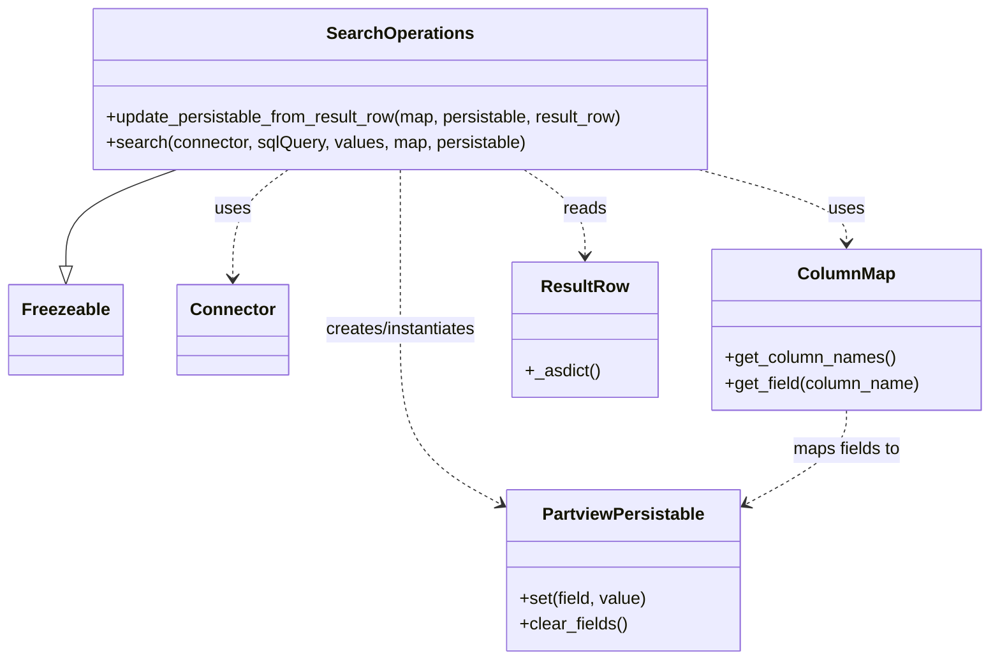

# Diagram: application_service/container_tracking_app_service/persistance_adapter/postgresql/SearchOperations.py


> Auto-generated by Obscura crawlers

## Diagram 1



### SVG

<svg id="container" width="915.4296875" xmlns="http://www.w3.org/2000/svg" class="classDiagram" height="614" viewBox="0 0 915.4296875 614" role="graphics-document document" aria-roledescription="class"><style>#container{font-family:"trebuchet ms",verdana,arial,sans-serif;font-size:16px;fill:#333;}@keyframes edge-animation-frame{from{stroke-dashoffset:0;}}@keyframes dash{to{stroke-dashoffset:0;}}#container .edge-animation-slow{stroke-dasharray:9,5!important;stroke-dashoffset:900;animation:dash 50s linear infinite;stroke-linecap:round;}#container .edge-animation-fast{stroke-dasharray:9,5!important;stroke-dashoffset:900;animation:dash 20s linear infinite;stroke-linecap:round;}#container .error-icon{fill:#552222;}#container .error-text{fill:#552222;stroke:#552222;}#container .edge-thickness-normal{stroke-width:1px;}#container .edge-thickness-thick{stroke-width:3.5px;}#container .edge-pattern-solid{stroke-dasharray:0;}#container .edge-thickness-invisible{stroke-width:0;fill:none;}#container .edge-pattern-dashed{stroke-dasharray:3;}#container .edge-pattern-dotted{stroke-dasharray:2;}#container .marker{fill:#333333;stroke:#333333;}#container .marker.cross{stroke:#333333;}#container svg{font-family:"trebuchet ms",verdana,arial,sans-serif;font-size:16px;}#container p{margin:0;}#container g.classGroup text{fill:#9370DB;stroke:none;font-family:"trebuchet ms",verdana,arial,sans-serif;font-size:10px;}#container g.classGroup text .title{font-weight:bolder;}#container .nodeLabel,#container .edgeLabel{color:#131300;}#container .edgeLabel .label rect{fill:#ECECFF;}#container .label text{fill:#131300;}#container .labelBkg{background:#ECECFF;}#container .edgeLabel .label span{background:#ECECFF;}#container .classTitle{font-weight:bolder;}#container .node rect,#container .node circle,#container .node ellipse,#container .node polygon,#container .node path{fill:#ECECFF;stroke:#9370DB;stroke-width:1px;}#container .divider{stroke:#9370DB;stroke-width:1;}#container g.clickable{cursor:pointer;}#container g.classGroup rect{fill:#ECECFF;stroke:#9370DB;}#container g.classGroup line{stroke:#9370DB;stroke-width:1;}#container .classLabel .box{stroke:none;stroke-width:0;fill:#ECECFF;opacity:0.5;}#container .classLabel .label{fill:#9370DB;font-size:10px;}#container .relation{stroke:#333333;stroke-width:1;fill:none;}#container .dashed-line{stroke-dasharray:3;}#container .dotted-line{stroke-dasharray:1 2;}#container #compositionStart,#container .composition{fill:#333333!important;stroke:#333333!important;stroke-width:1;}#container #compositionEnd,#container .composition{fill:#333333!important;stroke:#333333!important;stroke-width:1;}#container #dependencyStart,#container .dependency{fill:#333333!important;stroke:#333333!important;stroke-width:1;}#container #dependencyStart,#container .dependency{fill:#333333!important;stroke:#333333!important;stroke-width:1;}#container #extensionStart,#container .extension{fill:transparent!important;stroke:#333333!important;stroke-width:1;}#container #extensionEnd,#container .extension{fill:transparent!important;stroke:#333333!important;stroke-width:1;}#container #aggregationStart,#container .aggregation{fill:transparent!important;stroke:#333333!important;stroke-width:1;}#container #aggregationEnd,#container .aggregation{fill:transparent!important;stroke:#333333!important;stroke-width:1;}#container #lollipopStart,#container .lollipop{fill:#ECECFF!important;stroke:#333333!important;stroke-width:1;}#container #lollipopEnd,#container .lollipop{fill:#ECECFF!important;stroke:#333333!important;stroke-width:1;}#container .edgeTerminals{font-size:11px;line-height:initial;}#container .classTitleText{text-anchor:middle;font-size:18px;fill:#333;}#container .label-icon{display:inline-block;height:1em;overflow:visible;vertical-align:-0.125em;}#container .node .label-icon path{fill:currentColor;stroke:revert;stroke-width:revert;}#container :root{--mermaid-font-family:"trebuchet ms",verdana,arial,sans-serif;}</style><g><defs><marker id="container_class-aggregationStart" class="marker aggregation class" refX="18" refY="7" markerWidth="190" markerHeight="240" orient="auto"><path d="M 18,7 L9,13 L1,7 L9,1 Z"></path></marker></defs><defs><marker id="container_class-aggregationEnd" class="marker aggregation class" refX="1" refY="7" markerWidth="20" markerHeight="28" orient="auto"><path d="M 18,7 L9,13 L1,7 L9,1 Z"></path></marker></defs><defs><marker id="container_class-extensionStart" class="marker extension class" refX="18" refY="7" markerWidth="190" markerHeight="240" orient="auto"><path d="M 1,7 L18,13 V 1 Z"></path></marker></defs><defs><marker id="container_class-extensionEnd" class="marker extension class" refX="1" refY="7" markerWidth="20" markerHeight="28" orient="auto"><path d="M 1,1 V 13 L18,7 Z"></path></marker></defs><defs><marker id="container_class-compositionStart" class="marker composition class" refX="18" refY="7" markerWidth="190" markerHeight="240" orient="auto"><path d="M 18,7 L9,13 L1,7 L9,1 Z"></path></marker></defs><defs><marker id="container_class-compositionEnd" class="marker composition class" refX="1" refY="7" markerWidth="20" markerHeight="28" orient="auto"><path d="M 18,7 L9,13 L1,7 L9,1 Z"></path></marker></defs><defs><marker id="container_class-dependencyStart" class="marker dependency class" refX="6" refY="7" markerWidth="190" markerHeight="240" orient="auto"><path d="M 5,7 L9,13 L1,7 L9,1 Z"></path></marker></defs><defs><marker id="container_class-dependencyEnd" class="marker dependency class" refX="13" refY="7" markerWidth="20" markerHeight="28" orient="auto"><path d="M 18,7 L9,13 L14,7 L9,1 Z"></path></marker></defs><defs><marker id="container_class-lollipopStart" class="marker lollipop class" refX="13" refY="7" markerWidth="190" markerHeight="240" orient="auto"><circle stroke="black" fill="transparent" cx="7" cy="7" r="6"></circle></marker></defs><defs><marker id="container_class-lollipopEnd" class="marker lollipop class" refX="1" refY="7" markerWidth="190" markerHeight="240" orient="auto"><circle stroke="black" fill="transparent" cx="7" cy="7" r="6"></circle></marker></defs><g class="root"><g class="clusters"></g><g class="edgePaths"><path d="M161.038,158L144.064,164.167C127.091,170.333,93.143,182.667,76.169,197.625C59.195,212.583,59.195,230.167,59.195,238.958L59.195,247.75" id="id_SearchOperations_Freezeable_1" class="edge-thickness-normal edge-pattern-solid relation" style=";;;" data-edge="true" data-et="edge" data-id="id_SearchOperations_Freezeable_1" data-points="W3sieCI6MTYxLjAzODIyNTQ0NjQyODU4LCJ5IjoxNTh9LHsieCI6NTkuMTk1MzEyNSwieSI6MTk1fSx7IngiOjU5LjE5NTMxMjUsInkiOjI2NX1d" marker-end="url(#container_class-extensionEnd)"></path><path d="M261.898,158L253.217,164.167C244.536,170.333,227.174,182.667,218.493,199.5C209.813,216.333,209.813,237.667,209.813,248.333L209.813,259" id="id_SearchOperations_Connector_2" class="edge-thickness-normal edge-pattern-dashed relation" style=";;;" data-edge="true" data-et="edge" data-id="id_SearchOperations_Connector_2" data-points="W3sieCI6MjYxLjg5Nzk0OTIxODc1LCJ5IjoxNTh9LHsieCI6MjA5LjgxMjUsInkiOjE5NX0seyJ4IjoyMDkuODEyNSwieSI6MjY1fV0=" marker-end="url(#container_class-dependencyEnd)"></path><path d="M645.18,158L668.013,164.167C690.846,170.333,736.513,182.667,759.346,194C782.18,205.333,782.18,215.667,782.18,220.833L782.18,226" id="id_SearchOperations_ColumnMap_3" class="edge-thickness-normal edge-pattern-dashed relation" style=";;;" data-edge="true" data-et="edge" data-id="id_SearchOperations_ColumnMap_3" data-points="W3sieCI6NjQ1LjE3OTU0Nzk5MTA3MTQsInkiOjE1OH0seyJ4Ijo3ODIuMTc5Njg3NSwieSI6MTk1fSx7IngiOjc4Mi4xNzk2ODc1LCJ5IjoyMzJ9XQ==" marker-end="url(#container_class-dependencyEnd)"></path><path d="M367.477,158L367.477,164.167C367.477,170.333,367.477,182.667,367.477,207.5C367.477,232.333,367.477,269.667,367.477,307C367.477,344.333,367.477,381.667,383.142,408.795C398.807,435.923,430.137,452.846,445.802,461.307L461.467,469.768" id="id_SearchOperations_PartviewPersistable_4" class="edge-thickness-normal edge-pattern-dashed relation" style=";;;" data-edge="true" data-et="edge" data-id="id_SearchOperations_PartviewPersistable_4" data-points="W3sieCI6MzY3LjQ3NjU2MjUsInkiOjE1OH0seyJ4IjozNjcuNDc2NTYyNSwieSI6MTk1fSx7IngiOjM2Ny40NzY1NjI1LCJ5IjozMDd9LHsieCI6MzY3LjQ3NjU2MjUsInkiOjQxOX0seyJ4Ijo0NjYuNzQ2MDkzNzUsInkiOjQ3Mi42MTk5ODQxNzU0MjY3fV0=" marker-end="url(#container_class-dependencyEnd)"></path><path d="M483.892,158L493.464,164.167C503.036,170.333,522.18,182.667,531.752,196C541.324,209.333,541.324,223.667,541.324,230.833L541.324,238" id="id_SearchOperations_ResultRow_5" class="edge-thickness-normal edge-pattern-dashed relation" style=";;;" data-edge="true" data-et="edge" data-id="id_SearchOperations_ResultRow_5" data-points="W3sieCI6NDgzLjg5MjQwMzczODgzOTMsInkiOjE1OH0seyJ4Ijo1NDEuMzI0MjE4NzUsInkiOjE5NX0seyJ4Ijo1NDEuMzI0MjE4NzUsInkiOjI0NH1d" marker-end="url(#container_class-dependencyEnd)"></path><path d="M782.18,382L782.18,388.167C782.18,394.333,782.18,406.667,766.515,421.295C750.85,435.923,719.519,452.846,703.854,461.307L688.189,469.768" id="id_ColumnMap_PartviewPersistable_6" class="edge-thickness-normal edge-pattern-dashed relation" style=";;;" data-edge="true" data-et="edge" data-id="id_ColumnMap_PartviewPersistable_6" data-points="W3sieCI6NzgyLjE3OTY4NzUsInkiOjM4Mn0seyJ4Ijo3ODIuMTc5Njg3NSwieSI6NDE5fSx7IngiOjY4Mi45MTAxNTYyNSwieSI6NDcyLjYxOTk4NDE3NTQyNjd9XQ==" marker-end="url(#container_class-dependencyEnd)"></path></g><g class="edgeLabels"><g class="edgeLabel"><g class="label" data-id="id_SearchOperations_Freezeable_1" transform="translate(0, 0)"><foreignObject width="0" height="0"><div xmlns="http://www.w3.org/1999/xhtml" class="labelBkg" style="display: table-cell; white-space: nowrap; line-height: 1.5; max-width: 200px; text-align: center;"><span class="edgeLabel"></span></div></foreignObject></g></g><g class="edgeLabel" transform="translate(209.8125, 195)"><g class="label" data-id="id_SearchOperations_Connector_2" transform="translate(-16.4921875, -12)"><foreignObject width="32.984375" height="24"><div xmlns="http://www.w3.org/1999/xhtml" class="labelBkg" style="display: table-cell; white-space: nowrap; line-height: 1.5; max-width: 200px; text-align: center;"><span class="edgeLabel"><p>uses</p></span></div></foreignObject></g></g><g class="edgeLabel" transform="translate(782.1796875, 195)"><g class="label" data-id="id_SearchOperations_ColumnMap_3" transform="translate(-16.4921875, -12)"><foreignObject width="32.984375" height="24"><div xmlns="http://www.w3.org/1999/xhtml" class="labelBkg" style="display: table-cell; white-space: nowrap; line-height: 1.5; max-width: 200px; text-align: center;"><span class="edgeLabel"><p>uses</p></span></div></foreignObject></g></g><g class="edgeLabel" transform="translate(367.4765625, 307)"><g class="label" data-id="id_SearchOperations_PartviewPersistable_4" transform="translate(-73.2421875, -12)"><foreignObject width="146.484375" height="24"><div xmlns="http://www.w3.org/1999/xhtml" class="labelBkg" style="display: table-cell; white-space: nowrap; line-height: 1.5; max-width: 200px; text-align: center;"><span class="edgeLabel"><p>creates/instantiates</p></span></div></foreignObject></g></g><g class="edgeLabel" transform="translate(541.32421875, 195)"><g class="label" data-id="id_SearchOperations_ResultRow_5" transform="translate(-20.0078125, -12)"><foreignObject width="40.015625" height="24"><div xmlns="http://www.w3.org/1999/xhtml" class="labelBkg" style="display: table-cell; white-space: nowrap; line-height: 1.5; max-width: 200px; text-align: center;"><span class="edgeLabel"><p>reads</p></span></div></foreignObject></g></g><g class="edgeLabel" transform="translate(782.1796875, 419)"><g class="label" data-id="id_ColumnMap_PartviewPersistable_6" transform="translate(-51.1640625, -12)"><foreignObject width="102.328125" height="24"><div xmlns="http://www.w3.org/1999/xhtml" class="labelBkg" style="display: table-cell; white-space: nowrap; line-height: 1.5; max-width: 200px; text-align: center;"><span class="edgeLabel"><p>maps fields to</p></span></div></foreignObject></g></g></g><g class="nodes"><g class="node default" id="classId-Freezeable-0" transform="translate(59.1953125, 307)"><g class="basic label-container"><path d="M-51.1953125 -42 L51.1953125 -42 L51.1953125 42 L-51.1953125 42" stroke="none" stroke-width="0" fill="#ECECFF" style=""></path><path d="M-51.1953125 -42 C-22.672043488259362 -42, 5.851225523481276 -42, 51.1953125 -42 M-51.1953125 -42 C-10.697776665705511 -42, 29.799759168588977 -42, 51.1953125 -42 M51.1953125 -42 C51.1953125 -14.41415130493094, 51.1953125 13.171697390138121, 51.1953125 42 M51.1953125 -42 C51.1953125 -17.905542764607578, 51.1953125 6.1889144707848445, 51.1953125 42 M51.1953125 42 C12.77971647320927 42, -25.63587955358146 42, -51.1953125 42 M51.1953125 42 C20.476644100747563 42, -10.242024298504873 42, -51.1953125 42 M-51.1953125 42 C-51.1953125 10.279037834485898, -51.1953125 -21.441924331028204, -51.1953125 -42 M-51.1953125 42 C-51.1953125 13.101425668183946, -51.1953125 -15.797148663632107, -51.1953125 -42" stroke="#9370DB" stroke-width="1.3" fill="none" stroke-dasharray="0 0" style=""></path></g><g class="annotation-group text" transform="translate(0, -18)"></g><g class="label-group text" transform="translate(-39.1953125, -18)"><g class="label" style="font-weight: bolder" transform="translate(0,-12)"><foreignObject width="78.390625" height="24"><div xmlns="http://www.w3.org/1999/xhtml" style="display: table-cell; white-space: nowrap; line-height: 1.5; max-width: 127px; text-align: center;"><span class="nodeLabel markdown-node-label" style=""><p>Freezeable</p></span></div></foreignObject></g></g><g class="members-group text" transform="translate(-39.1953125, 30)"></g><g class="methods-group text" transform="translate(-39.1953125, 60)"></g><g class="divider" style=""><path d="M-51.1953125 6 C-15.786776650854229 6, 19.621759198291542 6, 51.1953125 6 M-51.1953125 6 C-22.83533561625596 6, 5.524641267488079 6, 51.1953125 6" stroke="#9370DB" stroke-width="1.3" fill="none" stroke-dasharray="0 0" style=""></path></g><g class="divider" style=""><path d="M-51.1953125 24 C-11.868675249557917 24, 27.457962000884166 24, 51.1953125 24 M-51.1953125 24 C-24.098088313626643 24, 2.999135872746713 24, 51.1953125 24" stroke="#9370DB" stroke-width="1.3" fill="none" stroke-dasharray="0 0" style=""></path></g></g><g class="node default" id="classId-SearchOperations-1" transform="translate(367.4765625, 83)"><g class="basic label-container"><path d="M-289.72265625 -75 L289.72265625 -75 L289.72265625 75 L-289.72265625 75" stroke="none" stroke-width="0" fill="#ECECFF" style=""></path><path d="M-289.72265625 -75 C-105.0987302997651 -75, 79.52519565046981 -75, 289.72265625 -75 M-289.72265625 -75 C-90.20004612569019 -75, 109.32256399861961 -75, 289.72265625 -75 M289.72265625 -75 C289.72265625 -35.894732013381564, 289.72265625 3.2105359732368726, 289.72265625 75 M289.72265625 -75 C289.72265625 -35.949410573297776, 289.72265625 3.1011788534044484, 289.72265625 75 M289.72265625 75 C113.91354761424972 75, -61.895561021500555 75, -289.72265625 75 M289.72265625 75 C98.4855792774461 75, -92.75149769510779 75, -289.72265625 75 M-289.72265625 75 C-289.72265625 15.849825231227285, -289.72265625 -43.30034953754543, -289.72265625 -75 M-289.72265625 75 C-289.72265625 31.241128087881236, -289.72265625 -12.517743824237527, -289.72265625 -75" stroke="#9370DB" stroke-width="1.3" fill="none" stroke-dasharray="0 0" style=""></path></g><g class="annotation-group text" transform="translate(0, -51)"></g><g class="label-group text" transform="translate(-65.2421875, -51)"><g class="label" style="font-weight: bolder" transform="translate(0,-12)"><foreignObject width="130.484375" height="24"><div xmlns="http://www.w3.org/1999/xhtml" style="display: table-cell; white-space: nowrap; line-height: 1.5; max-width: 179px; text-align: center;"><span class="nodeLabel markdown-node-label" style=""><p>SearchOperations</p></span></div></foreignObject></g></g><g class="members-group text" transform="translate(-277.72265625, -3)"></g><g class="methods-group text" transform="translate(-277.72265625, 27)"><g class="label" style="" transform="translate(0,-12)"><foreignObject width="490.203125" height="24"><div xmlns="http://www.w3.org/1999/xhtml" style="display: table-cell; white-space: nowrap; line-height: 1.5; max-width: 548px; text-align: center;"><span class="nodeLabel markdown-node-label" style=""><p>+update_persistable_from_result_row(map, persistable, result_row)</p></span></div></foreignObject></g><g class="label" style="" transform="translate(0,12)"><foreignObject width="392.859375" height="24"><div xmlns="http://www.w3.org/1999/xhtml" style="display: table-cell; white-space: nowrap; line-height: 1.5; max-width: 450px; text-align: center;"><span class="nodeLabel markdown-node-label" style=""><p>+search(connector, sqlQuery, values, map, persistable)</p></span></div></foreignObject></g></g><g class="divider" style=""><path d="M-289.72265625 -27 C-60.782602518128954 -27, 168.1574512137421 -27, 289.72265625 -27 M-289.72265625 -27 C-89.36921551082605 -27, 110.9842252283479 -27, 289.72265625 -27" stroke="#9370DB" stroke-width="1.3" fill="none" stroke-dasharray="0 0" style=""></path></g><g class="divider" style=""><path d="M-289.72265625 -3 C-107.10345532468841 -3, 75.51574560062318 -3, 289.72265625 -3 M-289.72265625 -3 C-132.95840858593814 -3, 23.80583907812371 -3, 289.72265625 -3" stroke="#9370DB" stroke-width="1.3" fill="none" stroke-dasharray="0 0" style=""></path></g></g><g class="node default" id="classId-Connector-2" transform="translate(209.8125, 307)"><g class="basic label-container"><path d="M-49.421875 -42 L49.421875 -42 L49.421875 42 L-49.421875 42" stroke="none" stroke-width="0" fill="#ECECFF" style=""></path><path d="M-49.421875 -42 C-11.485847780031207 -42, 26.450179439937585 -42, 49.421875 -42 M-49.421875 -42 C-28.767132581575563 -42, -8.112390163151126 -42, 49.421875 -42 M49.421875 -42 C49.421875 -23.702821932907863, 49.421875 -5.405643865815726, 49.421875 42 M49.421875 -42 C49.421875 -17.255360156426857, 49.421875 7.489279687146286, 49.421875 42 M49.421875 42 C10.140578037121536 42, -29.14071892575693 42, -49.421875 42 M49.421875 42 C19.45582548971273 42, -10.51022402057454 42, -49.421875 42 M-49.421875 42 C-49.421875 14.660177203702233, -49.421875 -12.679645592595534, -49.421875 -42 M-49.421875 42 C-49.421875 14.250502301704987, -49.421875 -13.498995396590026, -49.421875 -42" stroke="#9370DB" stroke-width="1.3" fill="none" stroke-dasharray="0 0" style=""></path></g><g class="annotation-group text" transform="translate(0, -18)"></g><g class="label-group text" transform="translate(-37.421875, -18)"><g class="label" style="font-weight: bolder" transform="translate(0,-12)"><foreignObject width="74.84375" height="24"><div xmlns="http://www.w3.org/1999/xhtml" style="display: table-cell; white-space: nowrap; line-height: 1.5; max-width: 125px; text-align: center;"><span class="nodeLabel markdown-node-label" style=""><p>Connector</p></span></div></foreignObject></g></g><g class="members-group text" transform="translate(-37.421875, 30)"></g><g class="methods-group text" transform="translate(-37.421875, 60)"></g><g class="divider" style=""><path d="M-49.421875 6 C-27.42081430339449 6, -5.41975360678898 6, 49.421875 6 M-49.421875 6 C-19.393142034514234 6, 10.635590930971532 6, 49.421875 6" stroke="#9370DB" stroke-width="1.3" fill="none" stroke-dasharray="0 0" style=""></path></g><g class="divider" style=""><path d="M-49.421875 24 C-13.675214069118567 24, 22.071446861762865 24, 49.421875 24 M-49.421875 24 C-16.912957120392292 24, 15.595960759215416 24, 49.421875 24" stroke="#9370DB" stroke-width="1.3" fill="none" stroke-dasharray="0 0" style=""></path></g></g><g class="node default" id="classId-ColumnMap-3" transform="translate(782.1796875, 307)"><g class="basic label-container"><path d="M-125.25 -75 L125.25 -75 L125.25 75 L-125.25 75" stroke="none" stroke-width="0" fill="#ECECFF" style=""></path><path d="M-125.25 -75 C-35.14548687445807 -75, 54.959026251083856 -75, 125.25 -75 M-125.25 -75 C-61.991085569484305 -75, 1.26782886103139 -75, 125.25 -75 M125.25 -75 C125.25 -44.199890844112886, 125.25 -13.399781688225772, 125.25 75 M125.25 -75 C125.25 -27.48659459317843, 125.25 20.026810813643138, 125.25 75 M125.25 75 C41.09482813467588 75, -43.06034373064824 75, -125.25 75 M125.25 75 C25.1781569902179 75, -74.8936860195642 75, -125.25 75 M-125.25 75 C-125.25 27.171600714217, -125.25 -20.656798571566, -125.25 -75 M-125.25 75 C-125.25 31.312519424009864, -125.25 -12.374961151980273, -125.25 -75" stroke="#9370DB" stroke-width="1.3" fill="none" stroke-dasharray="0 0" style=""></path></g><g class="annotation-group text" transform="translate(0, -51)"></g><g class="label-group text" transform="translate(-42.890625, -51)"><g class="label" style="font-weight: bolder" transform="translate(0,-12)"><foreignObject width="85.78125" height="24"><div xmlns="http://www.w3.org/1999/xhtml" style="display: table-cell; white-space: nowrap; line-height: 1.5; max-width: 136px; text-align: center;"><span class="nodeLabel markdown-node-label" style=""><p>ColumnMap</p></span></div></foreignObject></g></g><g class="members-group text" transform="translate(-113.25, -3)"></g><g class="methods-group text" transform="translate(-113.25, 27)"><g class="label" style="" transform="translate(0,-12)"><foreignObject width="158.984375" height="24"><div xmlns="http://www.w3.org/1999/xhtml" style="display: table-cell; white-space: nowrap; line-height: 1.5; max-width: 216px; text-align: center;"><span class="nodeLabel markdown-node-label" style=""><p>+get_column_names()</p></span></div></foreignObject></g><g class="label" style="" transform="translate(0,12)"><foreignObject width="183.609375" height="24"><div xmlns="http://www.w3.org/1999/xhtml" style="display: table-cell; white-space: nowrap; line-height: 1.5; max-width: 241px; text-align: center;"><span class="nodeLabel markdown-node-label" style=""><p>+get_field(column_name)</p></span></div></foreignObject></g></g><g class="divider" style=""><path d="M-125.25 -27 C-56.12683515830493 -27, 12.996329683390144 -27, 125.25 -27 M-125.25 -27 C-52.14434110549281 -27, 20.961317789014373 -27, 125.25 -27" stroke="#9370DB" stroke-width="1.3" fill="none" stroke-dasharray="0 0" style=""></path></g><g class="divider" style=""><path d="M-125.25 -3 C-38.852980615572676 -3, 47.54403876885465 -3, 125.25 -3 M-125.25 -3 C-45.49649330281065 -3, 34.2570133943787 -3, 125.25 -3" stroke="#9370DB" stroke-width="1.3" fill="none" stroke-dasharray="0 0" style=""></path></g></g><g class="node default" id="classId-PartviewPersistable-4" transform="translate(574.828125, 531)"><g class="basic label-container"><path d="M-108.08203125 -75 L108.08203125 -75 L108.08203125 75 L-108.08203125 75" stroke="none" stroke-width="0" fill="#ECECFF" style=""></path><path d="M-108.08203125 -75 C-55.6886436603355 -75, -3.2952560706710017 -75, 108.08203125 -75 M-108.08203125 -75 C-61.223145828185444 -75, -14.364260406370889 -75, 108.08203125 -75 M108.08203125 -75 C108.08203125 -39.329440659672024, 108.08203125 -3.6588813193440473, 108.08203125 75 M108.08203125 -75 C108.08203125 -38.28952420926822, 108.08203125 -1.5790484185364448, 108.08203125 75 M108.08203125 75 C58.22324206580889 75, 8.36445288161778 75, -108.08203125 75 M108.08203125 75 C55.375125475872395 75, 2.668219701744789 75, -108.08203125 75 M-108.08203125 75 C-108.08203125 36.31603589345783, -108.08203125 -2.3679282130843404, -108.08203125 -75 M-108.08203125 75 C-108.08203125 22.370419257846365, -108.08203125 -30.25916148430727, -108.08203125 -75" stroke="#9370DB" stroke-width="1.3" fill="none" stroke-dasharray="0 0" style=""></path></g><g class="annotation-group text" transform="translate(0, -51)"></g><g class="label-group text" transform="translate(-72.7734375, -51)"><g class="label" style="font-weight: bolder" transform="translate(0,-12)"><foreignObject width="145.546875" height="24"><div xmlns="http://www.w3.org/1999/xhtml" style="display: table-cell; white-space: nowrap; line-height: 1.5; max-width: 192px; text-align: center;"><span class="nodeLabel markdown-node-label" style=""><p>PartviewPersistable</p></span></div></foreignObject></g></g><g class="members-group text" transform="translate(-96.08203125, -3)"></g><g class="methods-group text" transform="translate(-96.08203125, 27)"><g class="label" style="" transform="translate(0,-12)"><foreignObject width="119.390625" height="24"><div xmlns="http://www.w3.org/1999/xhtml" style="display: table-cell; white-space: nowrap; line-height: 1.5; max-width: 177px; text-align: center;"><span class="nodeLabel markdown-node-label" style=""><p>+set(field, value)</p></span></div></foreignObject></g><g class="label" style="" transform="translate(0,12)"><foreignObject width="100.34375" height="24"><div xmlns="http://www.w3.org/1999/xhtml" style="display: table-cell; white-space: nowrap; line-height: 1.5; max-width: 158px; text-align: center;"><span class="nodeLabel markdown-node-label" style=""><p>+clear_fields()</p></span></div></foreignObject></g></g><g class="divider" style=""><path d="M-108.08203125 -27 C-48.2098191770546 -27, 11.662392895890804 -27, 108.08203125 -27 M-108.08203125 -27 C-30.250312838529524 -27, 47.58140557294095 -27, 108.08203125 -27" stroke="#9370DB" stroke-width="1.3" fill="none" stroke-dasharray="0 0" style=""></path></g><g class="divider" style=""><path d="M-108.08203125 -3 C-54.24826162038371 -3, -0.4144919907674165 -3, 108.08203125 -3 M-108.08203125 -3 C-34.72162816362409 -3, 38.63877492275182 -3, 108.08203125 -3" stroke="#9370DB" stroke-width="1.3" fill="none" stroke-dasharray="0 0" style=""></path></g></g><g class="node default" id="classId-ResultRow-5" transform="translate(541.32421875, 307)"><g class="basic label-container"><path d="M-65.60546875 -63 L65.60546875 -63 L65.60546875 63 L-65.60546875 63" stroke="none" stroke-width="0" fill="#ECECFF" style=""></path><path d="M-65.60546875 -63 C-27.714475672343767 -63, 10.176517405312467 -63, 65.60546875 -63 M-65.60546875 -63 C-33.370240518034635 -63, -1.1350122860692693 -63, 65.60546875 -63 M65.60546875 -63 C65.60546875 -34.791568990966134, 65.60546875 -6.583137981932268, 65.60546875 63 M65.60546875 -63 C65.60546875 -31.79678127332115, 65.60546875 -0.5935625466423033, 65.60546875 63 M65.60546875 63 C34.820553828775665 63, 4.035638907551331 63, -65.60546875 63 M65.60546875 63 C20.010944847590274 63, -25.583579054819452 63, -65.60546875 63 M-65.60546875 63 C-65.60546875 22.158315449648008, -65.60546875 -18.683369100703985, -65.60546875 -63 M-65.60546875 63 C-65.60546875 21.211357138925138, -65.60546875 -20.577285722149725, -65.60546875 -63" stroke="#9370DB" stroke-width="1.3" fill="none" stroke-dasharray="0 0" style=""></path></g><g class="annotation-group text" transform="translate(0, -39)"></g><g class="label-group text" transform="translate(-38.6171875, -39)"><g class="label" style="font-weight: bolder" transform="translate(0,-12)"><foreignObject width="77.234375" height="24"><div xmlns="http://www.w3.org/1999/xhtml" style="display: table-cell; white-space: nowrap; line-height: 1.5; max-width: 126px; text-align: center;"><span class="nodeLabel markdown-node-label" style=""><p>ResultRow</p></span></div></foreignObject></g></g><g class="members-group text" transform="translate(-53.60546875, 9)"></g><g class="methods-group text" transform="translate(-53.60546875, 39)"><g class="label" style="" transform="translate(0,-12)"><foreignObject width="68.59375" height="24"><div xmlns="http://www.w3.org/1999/xhtml" style="display: table-cell; white-space: nowrap; line-height: 1.5; max-width: 126px; text-align: center;"><span class="nodeLabel markdown-node-label" style=""><p>+_asdict()</p></span></div></foreignObject></g></g><g class="divider" style=""><path d="M-65.60546875 -15 C-23.95684116156255 -15, 17.6917864268749 -15, 65.60546875 -15 M-65.60546875 -15 C-16.410383895979713 -15, 32.784700958040574 -15, 65.60546875 -15" stroke="#9370DB" stroke-width="1.3" fill="none" stroke-dasharray="0 0" style=""></path></g><g class="divider" style=""><path d="M-65.60546875 9 C-18.609678776862538 9, 28.386111196274925 9, 65.60546875 9 M-65.60546875 9 C-38.89997576743436 9, -12.194482784868725 9, 65.60546875 9" stroke="#9370DB" stroke-width="1.3" fill="none" stroke-dasharray="0 0" style=""></path></g></g></g></g></g></svg>

## Diagram 2

```mermaid
flowchart TD
    Start([Start search]) --> Establish[Establish connection via connector.establish_connection()]
    Establish --> Mogrify[Mogrify SQL query with values (cursor.mogrify)]
    Mogrify --> Execute[Execute mogrified query (cursor.execute)]
    Execute --> Fetch[Fetch all results (cursor.fetchall)]
    Fetch --> Check{Any results?}
    Check -- No --> ReturnEmpty[Return []]
    Check -- Yes --> Iterate[Iterate over results]
    Iterate --> CreateNew[Create new persistable instance (persistable.__class__())]
    CreateNew --> UpdateCall[Call update_persistable_from_result_row(map, new, result)]
    UpdateCall --> Append[Append returned persistable to records]
    Append --> More{More results?}
    More -- Yes --> Iterate
    More -- No --> ReturnRecords[Return records]

    subgraph Update [update_persistable_from_result_row(map, persistable, result_row)]
        U1[Convert result_row to dict via result_row._asdict()]
        U2[Iterate column_name in map.get_column_names()]
        U3[Get value = result_dict.get(column_name)]
        U4[Set persistable = persistable.set(map.get_field(column_name), value)]
        U5[After loop call persistable.clear_fields() and return persistable]
        U1 --> U2
        U2 --> U3
        U3 --> U4
        U4 --> U2
        U2 --> U5
    end

    UpdateCall --> U1
```

> SVG rendering failed for this diagram.
