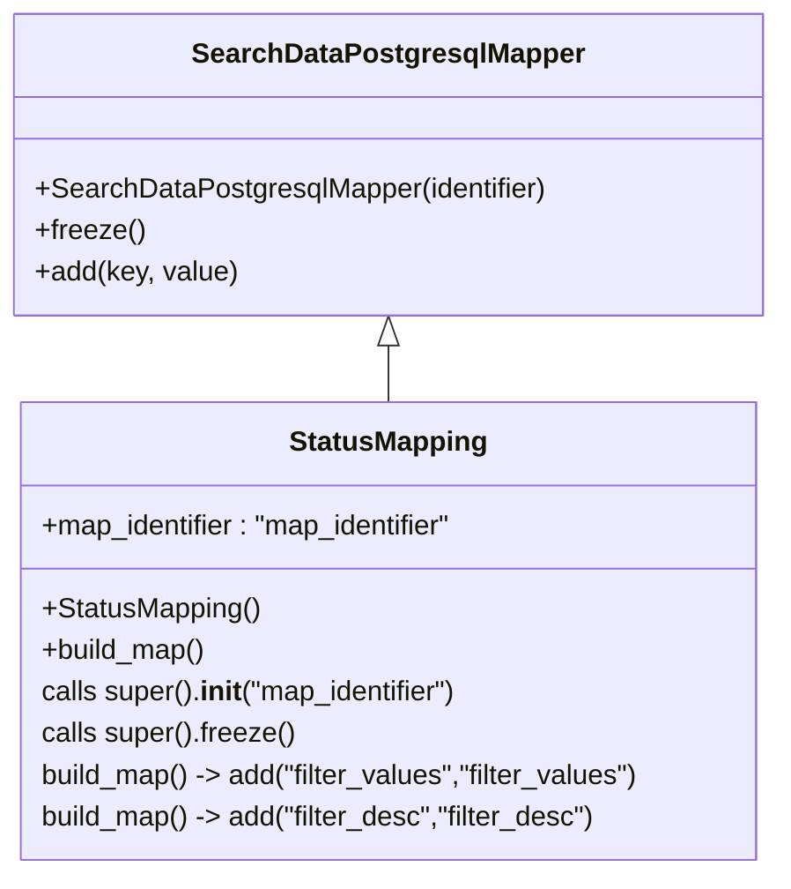

# Diagram: application_service/container_tracking_app_service/persistance_adapter/postgresql/StatusMapping.py

> Auto-generated by Obscura crawlers

## Mermaid

### SVG

<svg id="container" width="445.2421875" xmlns="http://www.w3.org/2000/svg" class="classDiagram" height="504" viewBox="0 0 445.2421875 504" role="graphics-document document" aria-roledescription="class"><g><defs><marker id="container_class-aggregationStart" class="marker aggregation class" refX="18" refY="7" markerWidth="190" markerHeight="240" orient="auto"><path d="M 18,7 L9,13 L1,7 L9,1 Z"></path></marker></defs><defs><marker id="container_class-aggregationEnd" class="marker aggregation class" refX="1" refY="7" markerWidth="20" markerHeight="28" orient="auto"><path d="M 18,7 L9,13 L1,7 L9,1 Z"></path></marker></defs><defs><marker id="container_class-extensionStart" class="marker extension class" refX="18" refY="7" markerWidth="190" markerHeight="240" orient="auto"><path d="M 1,7 L18,13 V 1 Z"></path></marker></defs><defs><marker id="container_class-extensionEnd" class="marker extension class" refX="1" refY="7" markerWidth="20" markerHeight="28" orient="auto"><path d="M 1,1 V 13 L18,7 Z"></path></marker></defs><defs><marker id="container_class-compositionStart" class="marker composition class" refX="18" refY="7" markerWidth="190" markerHeight="240" orient="auto"><path d="M 18,7 L9,13 L1,7 L9,1 Z"></path></marker></defs><defs><marker id="container_class-compositionEnd" class="marker composition class" refX="1" refY="7" markerWidth="20" markerHeight="28" orient="auto"><path d="M 18,7 L9,13 L1,7 L9,1 Z"></path></marker></defs><defs><marker id="container_class-dependencyStart" class="marker dependency class" refX="6" refY="7" markerWidth="190" markerHeight="240" orient="auto"><path d="M 5,7 L9,13 L1,7 L9,1 Z"></path></marker></defs><defs><marker id="container_class-dependencyEnd" class="marker dependency class" refX="13" refY="7" markerWidth="20" markerHeight="28" orient="auto"><path d="M 18,7 L9,13 L14,7 L9,1 Z"></path></marker></defs><defs><marker id="container_class-lollipopStart" class="marker lollipop class" refX="13" refY="7" markerWidth="190" markerHeight="240" orient="auto"><circle stroke="black" fill="transparent" cx="7" cy="7" r="6"></circle></marker></defs><defs><marker id="container_class-lollipopEnd" class="marker lollipop class" refX="1" refY="7" markerWidth="190" markerHeight="240" orient="auto"><circle stroke="black" fill="transparent" cx="7" cy="7" r="6"></circle></marker></defs><g class="root"><g class="clusters"></g><g class="edgePaths"><path d="M222.621,199.25L222.621,200.542C222.621,201.833,222.621,204.417,222.621,209.875C222.621,215.333,222.621,223.667,222.621,227.833L222.621,232" id="id_SearchDataPostgresqlMapper_StatusMapping_1" class="edge-thickness-normal edge-pattern-solid relation" style=";;;" data-edge="true" data-et="edge" data-id="id_SearchDataPostgresqlMapper_StatusMapping_1" data-points="W3sieCI6MjIyLjYyMTA5Mzc1LCJ5IjoxODJ9LHsieCI6MjIyLjYyMTA5Mzc1LCJ5IjoyMDd9LHsieCI6MjIyLjYyMTA5Mzc1LCJ5IjoyMzJ9XQ==" marker-start="url(#container_class-extensionStart)"></path></g><g class="edgeLabels"><g class="edgeLabel"><g class="label" data-id="id_SearchDataPostgresqlMapper_StatusMapping_1" transform="translate(0, 0)"><foreignObject width="0" height="0">

</foreignObject></g></g></g><g class="nodes"><g class="node default" id="classId-SearchDataPostgresqlMapper-0" transform="translate(222.62109375, 95)"><g class="basic label-container"><path d="M-214.62109375 -87 L214.62109375 -87 L214.62109375 87 L-214.62109375 87" stroke="none" stroke-width="0" fill="#ECECFF" style=""></path><path d="M-214.62109375 -87 C-73.3686965201176 -87, 67.88370070976481 -87, 214.62109375 -87 M-214.62109375 -87 C-58.39825335361192 -87, 97.82458704277616 -87, 214.62109375 -87 M214.62109375 -87 C214.62109375 -39.86853555480787, 214.62109375 7.262928890384259, 214.62109375 87 M214.62109375 -87 C214.62109375 -28.40436629827611, 214.62109375 30.19126740344778, 214.62109375 87 M214.62109375 87 C105.44882344405825 87, -3.7234468618835024 87, -214.62109375 87 M214.62109375 87 C122.08582082916199 87, 29.550547908323978 87, -214.62109375 87 M-214.62109375 87 C-214.62109375 50.0306538342013, -214.62109375 13.061307668402605, -214.62109375 -87 M-214.62109375 87 C-214.62109375 48.82050198613519, -214.62109375 10.641003972270383, -214.62109375 -87" stroke="#9370DB" stroke-width="1.3" fill="none" stroke-dasharray="0 0" style=""></path></g><g class="annotation-group text" transform="translate(0, -63)"></g><g class="label-group text" transform="translate(-108.3515625, -63)"><g class="label" style="font-weight: bolder" transform="translate(0,-12)"><foreignObject width="216.703125" height="24">

SearchDataPostgresqlMapper

</foreignObject></g></g><g class="members-group text" transform="translate(-202.62109375, -15)"></g><g class="methods-group text" transform="translate(-202.62109375, 15)"><g class="label" style="" transform="translate(0,-12)"><foreignObject width="296.890625" height="24">

+SearchDataPostgresqlMapper(identifier)

</foreignObject></g><g class="label" style="" transform="translate(0,12)"><foreignObject width="62.109375" height="24">

+freeze()

</foreignObject></g><g class="label" style="" transform="translate(0,36)"><foreignObject width="116.859375" height="24">

+add(key, value)

</foreignObject></g></g><g class="divider" style=""><path d="M-214.62109375 -39 C-108.96028702059725 -39, -3.2994802911944987 -39, 214.62109375 -39 M-214.62109375 -39 C-63.979490218224214 -39, 86.66211331355157 -39, 214.62109375 -39" stroke="#9370DB" stroke-width="1.3" fill="none" stroke-dasharray="0 0" style=""></path></g><g class="divider" style=""><path d="M-214.62109375 -15 C-100.37969463847449 -15, 13.86170447305102 -15, 214.62109375 -15 M-214.62109375 -15 C-92.97199132996379 -15, 28.67711109007243 -15, 214.62109375 -15" stroke="#9370DB" stroke-width="1.3" fill="none" stroke-dasharray="0 0" style=""></path></g></g><g class="node default" id="classId-StatusMapping-1" transform="translate(222.62109375, 364)"><g class="basic label-container"><path d="M-214.203125 -132 L214.203125 -132 L214.203125 132 L-214.203125 132" stroke="none" stroke-width="0" fill="#ECECFF" style=""></path><path d="M-214.203125 -132 C-88.02953765828293 -132, 38.14404968343413 -132, 214.203125 -132 M-214.203125 -132 C-44.79178198252694 -132, 124.61956103494612 -132, 214.203125 -132 M214.203125 -132 C214.203125 -33.11845975223419, 214.203125 65.76308049553163, 214.203125 132 M214.203125 -132 C214.203125 -53.787207446298126, 214.203125 24.425585107403748, 214.203125 132 M214.203125 132 C115.022768499423 132, 15.84241199884599 132, -214.203125 132 M214.203125 132 C56.516124601723334 132, -101.17087579655333 132, -214.203125 132 M-214.203125 132 C-214.203125 41.39279261914449, -214.203125 -49.214414761711026, -214.203125 -132 M-214.203125 132 C-214.203125 51.10221523927497, -214.203125 -29.795569521450062, -214.203125 -132" stroke="#9370DB" stroke-width="1.3" fill="none" stroke-dasharray="0 0" style=""></path></g><g class="annotation-group text" transform="translate(0, -108)"></g><g class="label-group text" transform="translate(-54.984375, -108)"><g class="label" style="font-weight: bolder" transform="translate(0,-12)"><foreignObject width="109.96875" height="24">

StatusMapping

</foreignObject></g></g><g class="members-group text" transform="translate(-202.203125, -60)"><g class="label" style="" transform="translate(0,-12)"><foreignObject width="246.109375" height="24">

+map_identifier : "map_identifier"

</foreignObject></g></g><g class="methods-group text" transform="translate(-202.203125, -12)"><g class="label" style="" transform="translate(0,-12)"><foreignObject width="125.734375" height="24">

+StatusMapping()

</foreignObject></g><g class="label" style="" transform="translate(0,12)"><foreignObject width="96.109375" height="24">

+build_map()

</foreignObject></g><g class="label" style="" transform="translate(0,36)"><foreignObject width="246.640625" height="24">

calls super().<strong>init</strong>("map_identifier")

</foreignObject></g><g class="label" style="" transform="translate(0,60)"><foreignObject width="146.640625" height="24">

calls super().freeze()

</foreignObject></g><g class="label" style="" transform="translate(0,84)"><foreignObject width="349.421875" height="24">

build_map() -&gt; add("filter_values","filter_values")

</foreignObject></g><g class="label" style="" transform="translate(0,108)"><foreignObject width="324.328125" height="24">

build_map() -&gt; add("filter_desc","filter_desc")

</foreignObject></g></g><g class="divider" style=""><path d="M-214.203125 -84 C-65.90085341208012 -84, 82.40141817583975 -84, 214.203125 -84 M-214.203125 -84 C-123.1507211880651 -84, -32.09831737613021 -84, 214.203125 -84" stroke="#9370DB" stroke-width="1.3" fill="none" stroke-dasharray="0 0" style=""></path></g><g class="divider" style=""><path d="M-214.203125 -36 C-63.47213932086839 -36, 87.25884635826321 -36, 214.203125 -36 M-214.203125 -36 C-95.55155378296018 -36, 23.100017434079632 -36, 214.203125 -36" stroke="#9370DB" stroke-width="1.3" fill="none" stroke-dasharray="0 0" style=""></path></g></g></g></g></g></svg>
