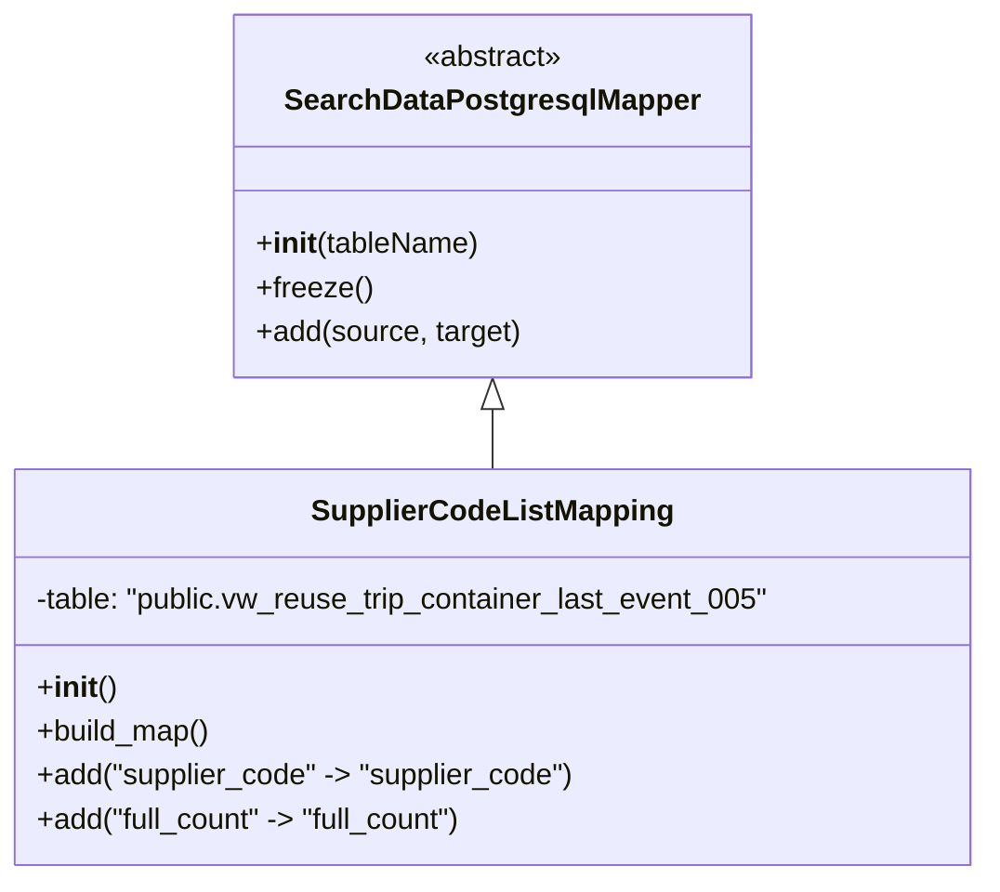

# Diagram: application_service/container_tracking_app_service/persistance_adapter/postgresql/SupplierCodeListMapping.py

> Auto-generated by Obscura crawlers

## Mermaid

### SVG

<svg id="container" width="539.703125" xmlns="http://www.w3.org/2000/svg" class="classDiagram" height="480" viewBox="0 0 539.703125 480" role="graphics-document document" aria-roledescription="class"><g><defs><marker id="container_class-aggregationStart" class="marker aggregation class" refX="18" refY="7" markerWidth="190" markerHeight="240" orient="auto"><path d="M 18,7 L9,13 L1,7 L9,1 Z"></path></marker></defs><defs><marker id="container_class-aggregationEnd" class="marker aggregation class" refX="1" refY="7" markerWidth="20" markerHeight="28" orient="auto"><path d="M 18,7 L9,13 L1,7 L9,1 Z"></path></marker></defs><defs><marker id="container_class-extensionStart" class="marker extension class" refX="18" refY="7" markerWidth="190" markerHeight="240" orient="auto"><path d="M 1,7 L18,13 V 1 Z"></path></marker></defs><defs><marker id="container_class-extensionEnd" class="marker extension class" refX="1" refY="7" markerWidth="20" markerHeight="28" orient="auto"><path d="M 1,1 V 13 L18,7 Z"></path></marker></defs><defs><marker id="container_class-compositionStart" class="marker composition class" refX="18" refY="7" markerWidth="190" markerHeight="240" orient="auto"><path d="M 18,7 L9,13 L1,7 L9,1 Z"></path></marker></defs><defs><marker id="container_class-compositionEnd" class="marker composition class" refX="1" refY="7" markerWidth="20" markerHeight="28" orient="auto"><path d="M 18,7 L9,13 L1,7 L9,1 Z"></path></marker></defs><defs><marker id="container_class-dependencyStart" class="marker dependency class" refX="6" refY="7" markerWidth="190" markerHeight="240" orient="auto"><path d="M 5,7 L9,13 L1,7 L9,1 Z"></path></marker></defs><defs><marker id="container_class-dependencyEnd" class="marker dependency class" refX="13" refY="7" markerWidth="20" markerHeight="28" orient="auto"><path d="M 18,7 L9,13 L14,7 L9,1 Z"></path></marker></defs><defs><marker id="container_class-lollipopStart" class="marker lollipop class" refX="13" refY="7" markerWidth="190" markerHeight="240" orient="auto"><circle stroke="black" fill="transparent" cx="7" cy="7" r="6"></circle></marker></defs><defs><marker id="container_class-lollipopEnd" class="marker lollipop class" refX="1" refY="7" markerWidth="190" markerHeight="240" orient="auto"><circle stroke="black" fill="transparent" cx="7" cy="7" r="6"></circle></marker></defs><g class="root"><g class="clusters"></g><g class="edgePaths"><path d="M269.852,223.25L269.852,224.542C269.852,225.833,269.852,228.417,269.852,233.875C269.852,239.333,269.852,247.667,269.852,251.833L269.852,256" id="id_SearchDataPostgresqlMapper_SupplierCodeListMapping_1" class="edge-thickness-normal edge-pattern-solid relation" style=";;;" data-edge="true" data-et="edge" data-id="id_SearchDataPostgresqlMapper_SupplierCodeListMapping_1" data-points="W3sieCI6MjY5Ljg1MTU2MjUsInkiOjIwNn0seyJ4IjoyNjkuODUxNTYyNSwieSI6MjMxfSx7IngiOjI2OS44NTE1NjI1LCJ5IjoyNTZ9XQ==" marker-start="url(#container_class-extensionStart)"></path></g><g class="edgeLabels"><g class="edgeLabel"><g class="label" data-id="id_SearchDataPostgresqlMapper_SupplierCodeListMapping_1" transform="translate(0, 0)"><foreignObject width="0" height="0">

</foreignObject></g></g></g><g class="nodes"><g class="node default" id="classId-SearchDataPostgresqlMapper-0" transform="translate(269.8515625, 107)"><g class="basic label-container"><path d="M-138.48046875 -99 L138.48046875 -99 L138.48046875 99 L-138.48046875 99" stroke="none" stroke-width="0" fill="#ECECFF" style=""></path><path d="M-138.48046875 -99 C-31.87146030001547 -99, 74.73754814996906 -99, 138.48046875 -99 M-138.48046875 -99 C-69.4065260122972 -99, -0.3325832745944126 -99, 138.48046875 -99 M138.48046875 -99 C138.48046875 -26.890280994922918, 138.48046875 45.219438010154164, 138.48046875 99 M138.48046875 -99 C138.48046875 -25.56159197517499, 138.48046875 47.87681604965002, 138.48046875 99 M138.48046875 99 C51.29542474842995 99, -35.8896192531401 99, -138.48046875 99 M138.48046875 99 C82.65453777492476 99, 26.828606799849524 99, -138.48046875 99 M-138.48046875 99 C-138.48046875 43.78580913427051, -138.48046875 -11.428381731458984, -138.48046875 -99 M-138.48046875 99 C-138.48046875 51.03848349695157, -138.48046875 3.0769669939031417, -138.48046875 -99" stroke="#9370DB" stroke-width="1.3" fill="none" stroke-dasharray="0 0" style=""></path></g><g class="annotation-group text" transform="translate(-38.609375, -75)"><g class="label" style="" transform="translate(0,-12)"><foreignObject width="77.21875" height="24">

«abstract»

</foreignObject></g></g><g class="label-group text" transform="translate(-108.3515625, -51)"><g class="label" style="font-weight: bolder" transform="translate(0,-12)"><foreignObject width="216.703125" height="24">

SearchDataPostgresqlMapper

</foreignObject></g></g><g class="members-group text" transform="translate(-126.48046875, -3)"></g><g class="methods-group text" transform="translate(-126.48046875, 27)"><g class="label" style="" transform="translate(0,-12)"><foreignObject width="122.0625" height="24">

+<strong>init</strong>(tableName)

</foreignObject></g><g class="label" style="" transform="translate(0,12)"><foreignObject width="62.109375" height="24">

+freeze()

</foreignObject></g><g class="label" style="" transform="translate(0,36)"><foreignObject width="144.609375" height="24">

+add(source, target)

</foreignObject></g></g><g class="divider" style=""><path d="M-138.48046875 -27 C-59.09560138964318 -27, 20.289265970713643 -27, 138.48046875 -27 M-138.48046875 -27 C-73.6601832329486 -27, -8.839897715897195 -27, 138.48046875 -27" stroke="#9370DB" stroke-width="1.3" fill="none" stroke-dasharray="0 0" style=""></path></g><g class="divider" style=""><path d="M-138.48046875 -3 C-43.558531020621004 -3, 51.36340670875799 -3, 138.48046875 -3 M-138.48046875 -3 C-36.95931238188716 -3, 64.56184398622568 -3, 138.48046875 -3" stroke="#9370DB" stroke-width="1.3" fill="none" stroke-dasharray="0 0" style=""></path></g></g><g class="node default" id="classId-SupplierCodeListMapping-1" transform="translate(269.8515625, 364)"><g class="basic label-container"><path d="M-261.8515625 -108 L261.8515625 -108 L261.8515625 108 L-261.8515625 108" stroke="none" stroke-width="0" fill="#ECECFF" style=""></path><path d="M-261.8515625 -108 C-142.2173874403535 -108, -22.583212380706954 -108, 261.8515625 -108 M-261.8515625 -108 C-60.928933255462766 -108, 139.99369598907447 -108, 261.8515625 -108 M261.8515625 -108 C261.8515625 -22.507277449576478, 261.8515625 62.985445100847045, 261.8515625 108 M261.8515625 -108 C261.8515625 -64.44035604989833, 261.8515625 -20.880712099796668, 261.8515625 108 M261.8515625 108 C68.14720657274438 108, -125.55714935451124 108, -261.8515625 108 M261.8515625 108 C154.44493910478607 108, 47.038315709572146 108, -261.8515625 108 M-261.8515625 108 C-261.8515625 35.97611904910072, -261.8515625 -36.047761901798566, -261.8515625 -108 M-261.8515625 108 C-261.8515625 30.645961847861372, -261.8515625 -46.708076304277256, -261.8515625 -108" stroke="#9370DB" stroke-width="1.3" fill="none" stroke-dasharray="0 0" style=""></path></g><g class="annotation-group text" transform="translate(0, -84)"></g><g class="label-group text" transform="translate(-94.109375, -84)"><g class="label" style="font-weight: bolder" transform="translate(0,-12)"><foreignObject width="188.21875" height="24">

SupplierCodeListMapping

</foreignObject></g></g><g class="members-group text" transform="translate(-249.8515625, -36)"><g class="label" style="" transform="translate(0,-12)"><foreignObject width="405.59375" height="24">

-table: "public.vw_reuse_trip_container_last_event_005"

</foreignObject></g></g><g class="methods-group text" transform="translate(-249.8515625, 12)"><g class="label" style="" transform="translate(0,-12)"><foreignObject width="42.796875" height="24">

+<strong>init</strong>()

</foreignObject></g><g class="label" style="" transform="translate(0,12)"><foreignObject width="96.109375" height="24">

+build_map()

</foreignObject></g><g class="label" style="" transform="translate(0,36)"><foreignObject width="296.921875" height="24">

+add("supplier_code" -&gt; "supplier_code")

</foreignObject></g><g class="label" style="" transform="translate(0,60)"><foreignObject width="240.3125" height="24">

+add("full_count" -&gt; "full_count")

</foreignObject></g></g><g class="divider" style=""><path d="M-261.8515625 -60 C-131.62052970889573 -60, -1.3894969177914618 -60, 261.8515625 -60 M-261.8515625 -60 C-104.01974554566902 -60, 53.81207140866195 -60, 261.8515625 -60" stroke="#9370DB" stroke-width="1.3" fill="none" stroke-dasharray="0 0" style=""></path></g><g class="divider" style=""><path d="M-261.8515625 -12 C-119.77415248094692 -12, 22.303257538106152 -12, 261.8515625 -12 M-261.8515625 -12 C-62.481915935771696 -12, 136.8877306284566 -12, 261.8515625 -12" stroke="#9370DB" stroke-width="1.3" fill="none" stroke-dasharray="0 0" style=""></path></g></g></g></g></g></svg>
