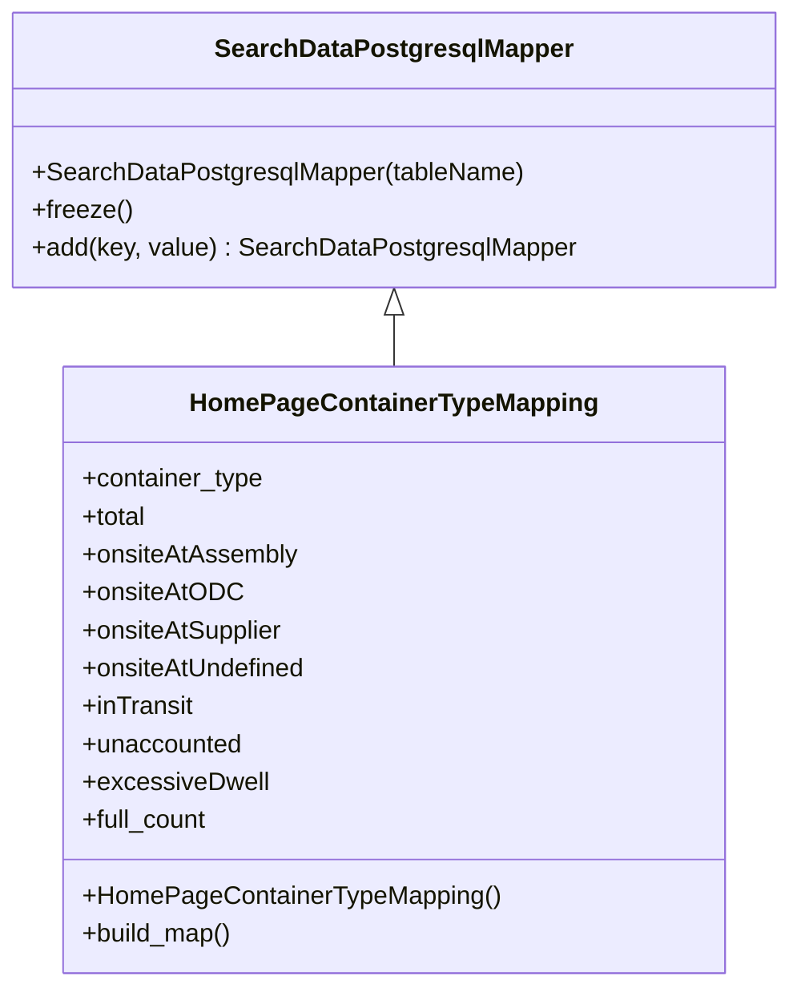

# Diagram: application_service/container_tracking_app_service/persistance_adapter/postgresql/container_type_in_homepage/HomePageContainerTypeMapping.py

> Auto-generated by Obscura crawlers

## Mermaid

### SVG

<svg id="container" width="490.1328125" xmlns="http://www.w3.org/2000/svg" class="classDiagram" height="624" viewBox="0 0 490.1328125 624" role="graphics-document document" aria-roledescription="class"><g><defs><marker id="container_class-aggregationStart" class="marker aggregation class" refX="18" refY="7" markerWidth="190" markerHeight="240" orient="auto"><path d="M 18,7 L9,13 L1,7 L9,1 Z"></path></marker></defs><defs><marker id="container_class-aggregationEnd" class="marker aggregation class" refX="1" refY="7" markerWidth="20" markerHeight="28" orient="auto"><path d="M 18,7 L9,13 L1,7 L9,1 Z"></path></marker></defs><defs><marker id="container_class-extensionStart" class="marker extension class" refX="18" refY="7" markerWidth="190" markerHeight="240" orient="auto"><path d="M 1,7 L18,13 V 1 Z"></path></marker></defs><defs><marker id="container_class-extensionEnd" class="marker extension class" refX="1" refY="7" markerWidth="20" markerHeight="28" orient="auto"><path d="M 1,1 V 13 L18,7 Z"></path></marker></defs><defs><marker id="container_class-compositionStart" class="marker composition class" refX="18" refY="7" markerWidth="190" markerHeight="240" orient="auto"><path d="M 18,7 L9,13 L1,7 L9,1 Z"></path></marker></defs><defs><marker id="container_class-compositionEnd" class="marker composition class" refX="1" refY="7" markerWidth="20" markerHeight="28" orient="auto"><path d="M 18,7 L9,13 L1,7 L9,1 Z"></path></marker></defs><defs><marker id="container_class-dependencyStart" class="marker dependency class" refX="6" refY="7" markerWidth="190" markerHeight="240" orient="auto"><path d="M 5,7 L9,13 L1,7 L9,1 Z"></path></marker></defs><defs><marker id="container_class-dependencyEnd" class="marker dependency class" refX="13" refY="7" markerWidth="20" markerHeight="28" orient="auto"><path d="M 18,7 L9,13 L14,7 L9,1 Z"></path></marker></defs><defs><marker id="container_class-lollipopStart" class="marker lollipop class" refX="13" refY="7" markerWidth="190" markerHeight="240" orient="auto"><circle stroke="black" fill="transparent" cx="7" cy="7" r="6"></circle></marker></defs><defs><marker id="container_class-lollipopEnd" class="marker lollipop class" refX="1" refY="7" markerWidth="190" markerHeight="240" orient="auto"><circle stroke="black" fill="transparent" cx="7" cy="7" r="6"></circle></marker></defs><g class="root"><g class="clusters"></g><g class="edgePaths"><path d="M245.066,199.25L245.066,200.542C245.066,201.833,245.066,204.417,245.066,209.875C245.066,215.333,245.066,223.667,245.066,227.833L245.066,232" id="id_SearchDataPostgresqlMapper_HomePageContainerTypeMapping_1" class="edge-thickness-normal edge-pattern-solid relation" style=";;;" data-edge="true" data-et="edge" data-id="id_SearchDataPostgresqlMapper_HomePageContainerTypeMapping_1" data-points="W3sieCI6MjQ1LjA2NjQwNjI1LCJ5IjoxODJ9LHsieCI6MjQ1LjA2NjQwNjI1LCJ5IjoyMDd9LHsieCI6MjQ1LjA2NjQwNjI1LCJ5IjoyMzJ9XQ==" marker-start="url(#container_class-extensionStart)"></path></g><g class="edgeLabels"><g class="edgeLabel"><g class="label" data-id="id_SearchDataPostgresqlMapper_HomePageContainerTypeMapping_1" transform="translate(0, 0)"><foreignObject width="0" height="0">

</foreignObject></g></g></g><g class="nodes"><g class="node default" id="classId-SearchDataPostgresqlMapper-0" transform="translate(245.06640625, 95)"><g class="basic label-container"><path d="M-237.06640625 -87 L237.06640625 -87 L237.06640625 87 L-237.06640625 87" stroke="none" stroke-width="0" fill="#ECECFF" style=""></path><path d="M-237.06640625 -87 C-126.80728642098389 -87, -16.54816659196777 -87, 237.06640625 -87 M-237.06640625 -87 C-136.18010134693046 -87, -35.29379644386091 -87, 237.06640625 -87 M237.06640625 -87 C237.06640625 -29.393980583651995, 237.06640625 28.21203883269601, 237.06640625 87 M237.06640625 -87 C237.06640625 -32.558589624467004, 237.06640625 21.882820751065992, 237.06640625 87 M237.06640625 87 C107.10563753796569 87, -22.855131174068617 87, -237.06640625 87 M237.06640625 87 C66.04249184707024 87, -104.98142255585952 87, -237.06640625 87 M-237.06640625 87 C-237.06640625 44.602409741682735, -237.06640625 2.204819483365469, -237.06640625 -87 M-237.06640625 87 C-237.06640625 17.92300105333935, -237.06640625 -51.1539978933213, -237.06640625 -87" stroke="#9370DB" stroke-width="1.3" fill="none" stroke-dasharray="0 0" style=""></path></g><g class="annotation-group text" transform="translate(0, -63)"></g><g class="label-group text" transform="translate(-108.3515625, -63)"><g class="label" style="font-weight: bolder" transform="translate(0,-12)"><foreignObject width="216.703125" height="24">

SearchDataPostgresqlMapper

</foreignObject></g></g><g class="members-group text" transform="translate(-225.06640625, -15)"></g><g class="methods-group text" transform="translate(-225.06640625, 15)"><g class="label" style="" transform="translate(0,-12)"><foreignObject width="309.59375" height="24">

+SearchDataPostgresqlMapper(tableName)

</foreignObject></g><g class="label" style="" transform="translate(0,12)"><foreignObject width="62.109375" height="24">

+freeze()

</foreignObject></g><g class="label" style="" transform="translate(0,36)"><foreignObject width="341.78125" height="24">

+add(key, value) : SearchDataPostgresqlMapper

</foreignObject></g></g><g class="divider" style=""><path d="M-237.06640625 -39 C-80.13658722411574 -39, 76.79323180176851 -39, 237.06640625 -39 M-237.06640625 -39 C-127.89951680962888 -39, -18.732627369257756 -39, 237.06640625 -39" stroke="#9370DB" stroke-width="1.3" fill="none" stroke-dasharray="0 0" style=""></path></g><g class="divider" style=""><path d="M-237.06640625 -15 C-84.628520385863 -15, 67.809365478274 -15, 237.06640625 -15 M-237.06640625 -15 C-96.11310788794799 -15, 44.84019047410402 -15, 237.06640625 -15" stroke="#9370DB" stroke-width="1.3" fill="none" stroke-dasharray="0 0" style=""></path></g></g><g class="node default" id="classId-HomePageContainerTypeMapping-1" transform="translate(245.06640625, 424)"><g class="basic label-container"><path d="M-204.1640625 -192 L204.1640625 -192 L204.1640625 192 L-204.1640625 192" stroke="none" stroke-width="0" fill="#ECECFF" style=""></path><path d="M-204.1640625 -192 C-109.38638581352113 -192, -14.60870912704226 -192, 204.1640625 -192 M-204.1640625 -192 C-57.20106527699818 -192, 89.76193194600364 -192, 204.1640625 -192 M204.1640625 -192 C204.1640625 -99.30103444932541, 204.1640625 -6.602068898650828, 204.1640625 192 M204.1640625 -192 C204.1640625 -104.35814853383049, 204.1640625 -16.716297067660975, 204.1640625 192 M204.1640625 192 C102.08040913226428 192, -0.0032442354714419253 192, -204.1640625 192 M204.1640625 192 C51.94479537085206 192, -100.27447175829587 192, -204.1640625 192 M-204.1640625 192 C-204.1640625 57.93498695841683, -204.1640625 -76.13002608316634, -204.1640625 -192 M-204.1640625 192 C-204.1640625 102.58285027111742, -204.1640625 13.165700542234845, -204.1640625 -192" stroke="#9370DB" stroke-width="1.3" fill="none" stroke-dasharray="0 0" style=""></path></g><g class="annotation-group text" transform="translate(0, -168)"></g><g class="label-group text" transform="translate(-122.953125, -168)"><g class="label" style="font-weight: bolder" transform="translate(0,-12)"><foreignObject width="245.90625" height="24">

HomePageContainerTypeMapping

</foreignObject></g></g><g class="members-group text" transform="translate(-192.1640625, -120)"><g class="label" style="" transform="translate(0,-12)"><foreignObject width="115.703125" height="24">

+container_type

</foreignObject></g><g class="label" style="" transform="translate(0,12)"><foreignObject width="41.6875" height="24">

+total

</foreignObject></g><g class="label" style="" transform="translate(0,36)"><foreignObject width="136.1875" height="24">

+onsiteAtAssembly

</foreignObject></g><g class="label" style="" transform="translate(0,60)"><foreignObject width="98.234375" height="24">

+onsiteAtODC

</foreignObject></g><g class="label" style="" transform="translate(0,84)"><foreignObject width="129.03125" height="24">

+onsiteAtSupplier

</foreignObject></g><g class="label" style="" transform="translate(0,108)"><foreignObject width="143.015625" height="24">

+onsiteAtUndefined

</foreignObject></g><g class="label" style="" transform="translate(0,132)"><foreignObject width="71.125" height="24">

+inTransit

</foreignObject></g><g class="label" style="" transform="translate(0,156)"><foreignObject width="101.890625" height="24">

+unaccounted

</foreignObject></g><g class="label" style="" transform="translate(0,180)"><foreignObject width="115.921875" height="24">

+excessiveDwell

</foreignObject></g><g class="label" style="" transform="translate(0,204)"><foreignObject width="80.9375" height="24">

+full_count

</foreignObject></g></g><g class="methods-group text" transform="translate(-192.1640625, 144)"><g class="label" style="" transform="translate(0,-12)"><foreignObject width="261.375" height="24">

+HomePageContainerTypeMapping()

</foreignObject></g><g class="label" style="" transform="translate(0,12)"><foreignObject width="96.109375" height="24">

+build_map()

</foreignObject></g></g><g class="divider" style=""><path d="M-204.1640625 -144 C-109.97768773006159 -144, -15.791312960123179 -144, 204.1640625 -144 M-204.1640625 -144 C-121.38479830332624 -144, -38.60553410665247 -144, 204.1640625 -144" stroke="#9370DB" stroke-width="1.3" fill="none" stroke-dasharray="0 0" style=""></path></g><g class="divider" style=""><path d="M-204.1640625 120 C-72.2760603243689 120, 59.6119418512622 120, 204.1640625 120 M-204.1640625 120 C-56.55460107539463 120, 91.05486034921074 120, 204.1640625 120" stroke="#9370DB" stroke-width="1.3" fill="none" stroke-dasharray="0 0" style=""></path></g></g></g></g></g></svg>
