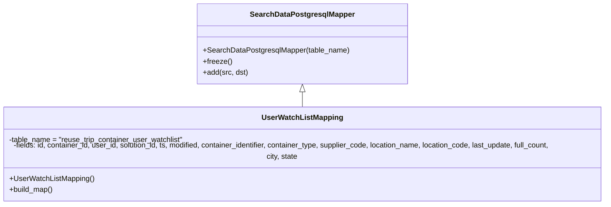

# Diagram: application_service/container_tracking_app_service/persistance_adapter/postgresql/watched_list/UserWatchListMapping.py

> Auto-generated by Obscura crawlers

## Mermaid

### SVG

<svg id="container" width="1388.3359375" xmlns="http://www.w3.org/2000/svg" class="classDiagram" height="432" viewBox="0 0 1388.3359375 432" role="graphics-document document" aria-roledescription="class"><g><defs><marker id="container_class-aggregationStart" class="marker aggregation class" refX="18" refY="7" markerWidth="190" markerHeight="240" orient="auto"><path d="M 18,7 L9,13 L1,7 L9,1 Z"></path></marker></defs><defs><marker id="container_class-aggregationEnd" class="marker aggregation class" refX="1" refY="7" markerWidth="20" markerHeight="28" orient="auto"><path d="M 18,7 L9,13 L1,7 L9,1 Z"></path></marker></defs><defs><marker id="container_class-extensionStart" class="marker extension class" refX="18" refY="7" markerWidth="190" markerHeight="240" orient="auto"><path d="M 1,7 L18,13 V 1 Z"></path></marker></defs><defs><marker id="container_class-extensionEnd" class="marker extension class" refX="1" refY="7" markerWidth="20" markerHeight="28" orient="auto"><path d="M 1,1 V 13 L18,7 Z"></path></marker></defs><defs><marker id="container_class-compositionStart" class="marker composition class" refX="18" refY="7" markerWidth="190" markerHeight="240" orient="auto"><path d="M 18,7 L9,13 L1,7 L9,1 Z"></path></marker></defs><defs><marker id="container_class-compositionEnd" class="marker composition class" refX="1" refY="7" markerWidth="20" markerHeight="28" orient="auto"><path d="M 18,7 L9,13 L1,7 L9,1 Z"></path></marker></defs><defs><marker id="container_class-dependencyStart" class="marker dependency class" refX="6" refY="7" markerWidth="190" markerHeight="240" orient="auto"><path d="M 5,7 L9,13 L1,7 L9,1 Z"></path></marker></defs><defs><marker id="container_class-dependencyEnd" class="marker dependency class" refX="13" refY="7" markerWidth="20" markerHeight="28" orient="auto"><path d="M 18,7 L9,13 L14,7 L9,1 Z"></path></marker></defs><defs><marker id="container_class-lollipopStart" class="marker lollipop class" refX="13" refY="7" markerWidth="190" markerHeight="240" orient="auto"><circle stroke="black" fill="transparent" cx="7" cy="7" r="6"></circle></marker></defs><defs><marker id="container_class-lollipopEnd" class="marker lollipop class" refX="1" refY="7" markerWidth="190" markerHeight="240" orient="auto"><circle stroke="black" fill="transparent" cx="7" cy="7" r="6"></circle></marker></defs><g class="root"><g class="clusters"></g><g class="edgePaths"><path d="M694.168,199.25L694.168,200.542C694.168,201.833,694.168,204.417,694.168,209.875C694.168,215.333,694.168,223.667,694.168,227.833L694.168,232" id="id_SearchDataPostgresqlMapper_UserWatchListMapping_1" class="edge-thickness-normal edge-pattern-solid relation" style=";;;" data-edge="true" data-et="edge" data-id="id_SearchDataPostgresqlMapper_UserWatchListMapping_1" data-points="W3sieCI6Njk0LjE2Nzk2ODc1LCJ5IjoxODJ9LHsieCI6Njk0LjE2Nzk2ODc1LCJ5IjoyMDd9LHsieCI6Njk0LjE2Nzk2ODc1LCJ5IjoyMzJ9XQ==" marker-start="url(#container_class-extensionStart)"></path></g><g class="edgeLabels"><g class="edgeLabel"><g class="label" data-id="id_SearchDataPostgresqlMapper_UserWatchListMapping_1" transform="translate(0, 0)"><foreignObject width="0" height="0">

</foreignObject></g></g></g><g class="nodes"><g class="node default" id="classId-SearchDataPostgresqlMapper-0" transform="translate(694.16796875, 95)"><g class="basic label-container"><path d="M-224.19921875 -87 L224.19921875 -87 L224.19921875 87 L-224.19921875 87" stroke="none" stroke-width="0" fill="#ECECFF" style=""></path><path d="M-224.19921875 -87 C-91.76872254512506 -87, 40.66177365974988 -87, 224.19921875 -87 M-224.19921875 -87 C-81.53738540528408 -87, 61.12444793943183 -87, 224.19921875 -87 M224.19921875 -87 C224.19921875 -27.821718545026812, 224.19921875 31.356562909946376, 224.19921875 87 M224.19921875 -87 C224.19921875 -20.552917576031604, 224.19921875 45.89416484793679, 224.19921875 87 M224.19921875 87 C120.8041233693281 87, 17.40902798865619 87, -224.19921875 87 M224.19921875 87 C64.71458384021773 87, -94.77005106956454 87, -224.19921875 87 M-224.19921875 87 C-224.19921875 44.22141481503999, -224.19921875 1.4428296300799843, -224.19921875 -87 M-224.19921875 87 C-224.19921875 24.53105918740492, -224.19921875 -37.93788162519016, -224.19921875 -87" stroke="#9370DB" stroke-width="1.3" fill="none" stroke-dasharray="0 0" style=""></path></g><g class="annotation-group text" transform="translate(0, -63)"></g><g class="label-group text" transform="translate(-108.3515625, -63)"><g class="label" style="font-weight: bolder" transform="translate(0,-12)"><foreignObject width="216.703125" height="24">

SearchDataPostgresqlMapper

</foreignObject></g></g><g class="members-group text" transform="translate(-212.19921875, -15)"></g><g class="methods-group text" transform="translate(-212.19921875, 15)"><g class="label" style="" transform="translate(0,-12)"><foreignObject width="316.046875" height="24">

+SearchDataPostgresqlMapper(table_name)

</foreignObject></g><g class="label" style="" transform="translate(0,12)"><foreignObject width="62.109375" height="24">

+freeze()

</foreignObject></g><g class="label" style="" transform="translate(0,36)"><foreignObject width="97.828125" height="24">

+add(src, dst)

</foreignObject></g></g><g class="divider" style=""><path d="M-224.19921875 -39 C-88.44169681725401 -39, 47.315825115491975 -39, 224.19921875 -39 M-224.19921875 -39 C-57.68896334172982 -39, 108.82129206654037 -39, 224.19921875 -39" stroke="#9370DB" stroke-width="1.3" fill="none" stroke-dasharray="0 0" style=""></path></g><g class="divider" style=""><path d="M-224.19921875 -15 C-125.502948704685 -15, -26.806678659369993 -15, 224.19921875 -15 M-224.19921875 -15 C-79.6908293839775 -15, 64.817559982045 -15, 224.19921875 -15" stroke="#9370DB" stroke-width="1.3" fill="none" stroke-dasharray="0 0" style=""></path></g></g><g class="node default" id="classId-UserWatchListMapping-1" transform="translate(694.16796875, 328)"><g class="basic label-container"><path d="M-686.16796875 -96 L686.16796875 -96 L686.16796875 96 L-686.16796875 96" stroke="none" stroke-width="0" fill="#ECECFF" style=""></path><path d="M-686.16796875 -96 C-150.15483158155473 -96, 385.85830558689054 -96, 686.16796875 -96 M-686.16796875 -96 C-202.41939680105094 -96, 281.3291751478981 -96, 686.16796875 -96 M686.16796875 -96 C686.16796875 -28.73561790842453, 686.16796875 38.52876418315094, 686.16796875 96 M686.16796875 -96 C686.16796875 -33.751695301020945, 686.16796875 28.49660939795811, 686.16796875 96 M686.16796875 96 C326.08022145695 96, -34.007525836099944 96, -686.16796875 96 M686.16796875 96 C209.74990194655646 96, -266.6681648568871 96, -686.16796875 96 M-686.16796875 96 C-686.16796875 44.09470540147505, -686.16796875 -7.810589197049893, -686.16796875 -96 M-686.16796875 96 C-686.16796875 31.545789589836573, -686.16796875 -32.90842082032685, -686.16796875 -96" stroke="#9370DB" stroke-width="1.3" fill="none" stroke-dasharray="0 0" style=""></path></g><g class="annotation-group text" transform="translate(0, -72)"></g><g class="label-group text" transform="translate(-83.7890625, -72)"><g class="label" style="font-weight: bolder" transform="translate(0,-12)"><foreignObject width="167.578125" height="24">

UserWatchListMapping

</foreignObject></g></g><g class="members-group text" transform="translate(-674.16796875, -24)"><g class="label" style="" transform="translate(0,-12)"><foreignObject width="381.65625" height="24">

-table_name = "reuse_trip_container_user_watchlist"

</foreignObject></g><g class="label" style="" transform="translate(0,12)"><foreignObject width="1264.546875" height="24">

-fields: id, container_id, user_id, solution_id, ts, modified, container_identifier, container_type, supplier_code, location_name, location_code, last_update, full_count, city, state

</foreignObject></g></g><g class="methods-group text" transform="translate(-674.16796875, 48)"><g class="label" style="" transform="translate(0,-12)"><foreignObject width="183.34375" height="24">

+UserWatchListMapping()

</foreignObject></g><g class="label" style="" transform="translate(0,12)"><foreignObject width="96.109375" height="24">

+build_map()

</foreignObject></g></g><g class="divider" style=""><path d="M-686.16796875 -48 C-349.3687124205634 -48, -12.569456091126767 -48, 686.16796875 -48 M-686.16796875 -48 C-275.934245566771 -48, 134.29947761645803 -48, 686.16796875 -48" stroke="#9370DB" stroke-width="1.3" fill="none" stroke-dasharray="0 0" style=""></path></g><g class="divider" style=""><path d="M-686.16796875 24 C-377.00675916222445 24, -67.84554957444891 24, 686.16796875 24 M-686.16796875 24 C-402.9549520716244 24, -119.74193539324881 24, 686.16796875 24" stroke="#9370DB" stroke-width="1.3" fill="none" stroke-dasharray="0 0" style=""></path></g></g></g></g></g></svg>
