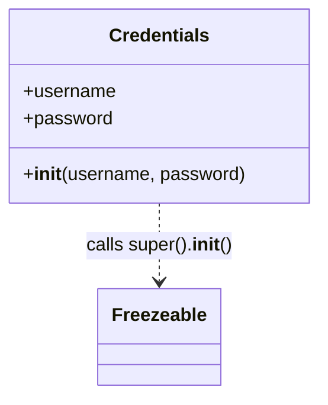

# Diagram: application_service/container_tracking_app_service/persistence/Credentials.py

> Auto-generated by Obscura crawlers

## Mermaid

### SVG

<svg id="container" width="273.15625" xmlns="http://www.w3.org/2000/svg" class="classDiagram" height="342" viewBox="0 0 273.15625 342" role="graphics-document document" aria-roledescription="class"><g><defs><marker id="container_class-aggregationStart" class="marker aggregation class" refX="18" refY="7" markerWidth="190" markerHeight="240" orient="auto"><path d="M 18,7 L9,13 L1,7 L9,1 Z"></path></marker></defs><defs><marker id="container_class-aggregationEnd" class="marker aggregation class" refX="1" refY="7" markerWidth="20" markerHeight="28" orient="auto"><path d="M 18,7 L9,13 L1,7 L9,1 Z"></path></marker></defs><defs><marker id="container_class-extensionStart" class="marker extension class" refX="18" refY="7" markerWidth="190" markerHeight="240" orient="auto"><path d="M 1,7 L18,13 V 1 Z"></path></marker></defs><defs><marker id="container_class-extensionEnd" class="marker extension class" refX="1" refY="7" markerWidth="20" markerHeight="28" orient="auto"><path d="M 1,1 V 13 L18,7 Z"></path></marker></defs><defs><marker id="container_class-compositionStart" class="marker composition class" refX="18" refY="7" markerWidth="190" markerHeight="240" orient="auto"><path d="M 18,7 L9,13 L1,7 L9,1 Z"></path></marker></defs><defs><marker id="container_class-compositionEnd" class="marker composition class" refX="1" refY="7" markerWidth="20" markerHeight="28" orient="auto"><path d="M 18,7 L9,13 L1,7 L9,1 Z"></path></marker></defs><defs><marker id="container_class-dependencyStart" class="marker dependency class" refX="6" refY="7" markerWidth="190" markerHeight="240" orient="auto"><path d="M 5,7 L9,13 L1,7 L9,1 Z"></path></marker></defs><defs><marker id="container_class-dependencyEnd" class="marker dependency class" refX="13" refY="7" markerWidth="20" markerHeight="28" orient="auto"><path d="M 18,7 L9,13 L14,7 L9,1 Z"></path></marker></defs><defs><marker id="container_class-lollipopStart" class="marker lollipop class" refX="13" refY="7" markerWidth="190" markerHeight="240" orient="auto"><circle stroke="black" fill="transparent" cx="7" cy="7" r="6"></circle></marker></defs><defs><marker id="container_class-lollipopEnd" class="marker lollipop class" refX="1" refY="7" markerWidth="190" markerHeight="240" orient="auto"><circle stroke="black" fill="transparent" cx="7" cy="7" r="6"></circle></marker></defs><g class="root"><g class="clusters"></g><g class="edgePaths"><path d="M136.578,176L136.578,182.167C136.578,188.333,136.578,200.667,136.578,212C136.578,223.333,136.578,233.667,136.578,238.833L136.578,244" id="id_Credentials_Freezeable_1" class="edge-thickness-normal edge-pattern-dashed relation" style=";;;" data-edge="true" data-et="edge" data-id="id_Credentials_Freezeable_1" data-points="W3sieCI6MTM2LjU3ODEyNSwieSI6MTc2fSx7IngiOjEzNi41NzgxMjUsInkiOjIxM30seyJ4IjoxMzYuNTc4MTI1LCJ5IjoyNTB9XQ==" marker-end="url(#container_class-dependencyEnd)"></path></g><g class="edgeLabels"><g class="edgeLabel" transform="translate(136.578125, 213)"><g class="label" data-id="id_Credentials_Freezeable_1" transform="translate(-63.6640625, -12)"><foreignObject width="127.328125" height="24">

calls super().<strong>init</strong>()

</foreignObject></g></g></g><g class="nodes"><g class="node default" id="classId-Freezeable-0" transform="translate(136.578125, 292)"><g class="basic label-container"><path d="M-51.1953125 -42 L51.1953125 -42 L51.1953125 42 L-51.1953125 42" stroke="none" stroke-width="0" fill="#ECECFF" style=""></path><path d="M-51.1953125 -42 C-10.509657241257138 -42, 30.175998017485725 -42, 51.1953125 -42 M-51.1953125 -42 C-25.550118928388947 -42, 0.09507464322210524 -42, 51.1953125 -42 M51.1953125 -42 C51.1953125 -17.629547442901078, 51.1953125 6.740905114197844, 51.1953125 42 M51.1953125 -42 C51.1953125 -21.70351647823118, 51.1953125 -1.4070329564623592, 51.1953125 42 M51.1953125 42 C25.12909279401466 42, -0.9371269119706795 42, -51.1953125 42 M51.1953125 42 C13.569728278472859 42, -24.055855943054283 42, -51.1953125 42 M-51.1953125 42 C-51.1953125 16.275529460331253, -51.1953125 -9.448941079337494, -51.1953125 -42 M-51.1953125 42 C-51.1953125 14.830860519311607, -51.1953125 -12.338278961376787, -51.1953125 -42" stroke="#9370DB" stroke-width="1.3" fill="none" stroke-dasharray="0 0" style=""></path></g><g class="annotation-group text" transform="translate(0, -18)"></g><g class="label-group text" transform="translate(-39.1953125, -18)"><g class="label" style="font-weight: bolder" transform="translate(0,-12)"><foreignObject width="78.390625" height="24">

Freezeable

</foreignObject></g></g><g class="members-group text" transform="translate(-39.1953125, 30)"></g><g class="methods-group text" transform="translate(-39.1953125, 60)"></g><g class="divider" style=""><path d="M-51.1953125 6 C-20.24624713291001 6, 10.70281823417998 6, 51.1953125 6 M-51.1953125 6 C-30.546308831988707 6, -9.897305163977414 6, 51.1953125 6" stroke="#9370DB" stroke-width="1.3" fill="none" stroke-dasharray="0 0" style=""></path></g><g class="divider" style=""><path d="M-51.1953125 24 C-28.450813279307916 24, -5.706314058615831 24, 51.1953125 24 M-51.1953125 24 C-17.30896066533451 24, 16.57739116933098 24, 51.1953125 24" stroke="#9370DB" stroke-width="1.3" fill="none" stroke-dasharray="0 0" style=""></path></g></g><g class="node default" id="classId-Credentials-1" transform="translate(136.578125, 92)"><g class="basic label-container"><path d="M-128.578125 -84 L128.578125 -84 L128.578125 84 L-128.578125 84" stroke="none" stroke-width="0" fill="#ECECFF" style=""></path><path d="M-128.578125 -84 C-62.20028550420551 -84, 4.177553991588979 -84, 128.578125 -84 M-128.578125 -84 C-72.72283578279536 -84, -16.867546565590715 -84, 128.578125 -84 M128.578125 -84 C128.578125 -33.304092081954295, 128.578125 17.39181583609141, 128.578125 84 M128.578125 -84 C128.578125 -46.30428154986385, 128.578125 -8.608563099727704, 128.578125 84 M128.578125 84 C62.48847158915807 84, -3.6011818216838662 84, -128.578125 84 M128.578125 84 C38.34651993232001 84, -51.88508513535999 84, -128.578125 84 M-128.578125 84 C-128.578125 47.41567726639209, -128.578125 10.831354532784175, -128.578125 -84 M-128.578125 84 C-128.578125 22.75964304762242, -128.578125 -38.48071390475516, -128.578125 -84" stroke="#9370DB" stroke-width="1.3" fill="none" stroke-dasharray="0 0" style=""></path></g><g class="annotation-group text" transform="translate(0, -60)"></g><g class="label-group text" transform="translate(-41.609375, -60)"><g class="label" style="font-weight: bolder" transform="translate(0,-12)"><foreignObject width="83.21875" height="24">

Credentials

</foreignObject></g></g><g class="members-group text" transform="translate(-116.578125, -12)"><g class="label" style="" transform="translate(0,-12)"><foreignObject width="80.1875" height="24">

+username

</foreignObject></g><g class="label" style="" transform="translate(0,12)"><foreignObject width="76.625" height="24">

+password

</foreignObject></g></g><g class="methods-group text" transform="translate(-116.578125, 60)"><g class="label" style="" transform="translate(0,-12)"><foreignObject width="191.546875" height="24">

+<strong>init</strong>(username, password)

</foreignObject></g></g><g class="divider" style=""><path d="M-128.578125 -36 C-69.77110526449331 -36, -10.96408552898663 -36, 128.578125 -36 M-128.578125 -36 C-51.39093576012539 -36, 25.796253479749225 -36, 128.578125 -36" stroke="#9370DB" stroke-width="1.3" fill="none" stroke-dasharray="0 0" style=""></path></g><g class="divider" style=""><path d="M-128.578125 36 C-71.0270376026379 36, -13.475950205275822 36, 128.578125 36 M-128.578125 36 C-45.918403664849464 36, 36.74131767030107 36, 128.578125 36" stroke="#9370DB" stroke-width="1.3" fill="none" stroke-dasharray="0 0" style=""></path></g></g></g></g></g></svg>
