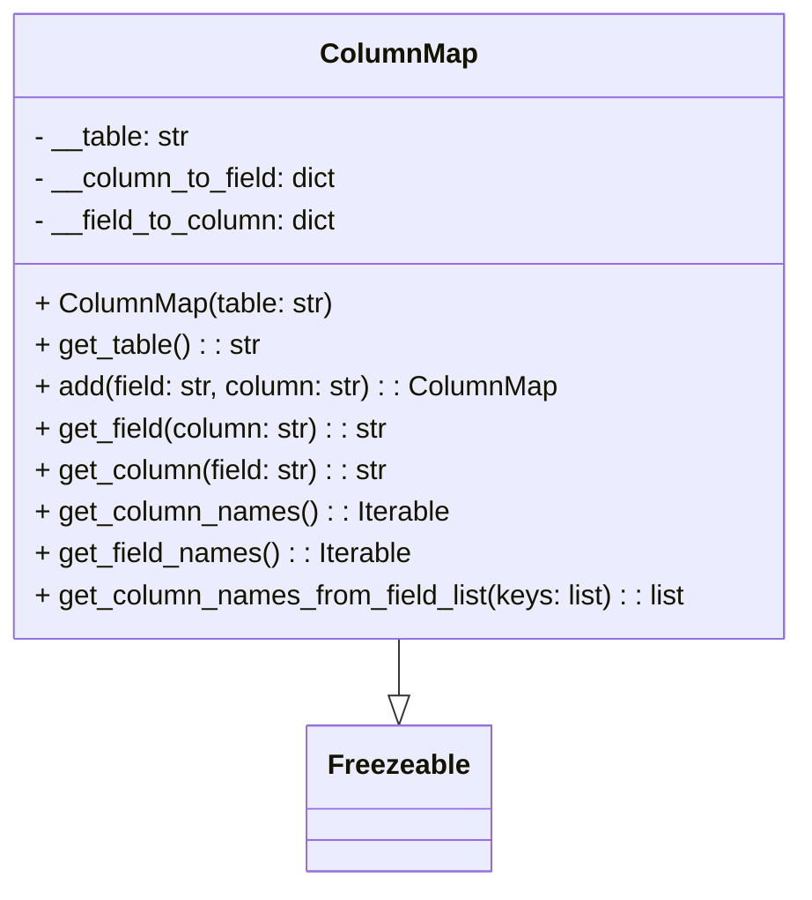

# Diagram: application_service/container_tracking_app_service/persistence/sql/ColumnMap.py


> Auto-generated by Obscura crawlers

## Diagram 1



### SVG

<svg id="container" width="463.921875" xmlns="http://www.w3.org/2000/svg" class="classDiagram" height="510" viewBox="0 0 463.921875 510" role="graphics-document document" aria-roledescription="class"><style>#container{font-family:"trebuchet ms",verdana,arial,sans-serif;font-size:16px;fill:#333;}@keyframes edge-animation-frame{from{stroke-dashoffset:0;}}@keyframes dash{to{stroke-dashoffset:0;}}#container .edge-animation-slow{stroke-dasharray:9,5!important;stroke-dashoffset:900;animation:dash 50s linear infinite;stroke-linecap:round;}#container .edge-animation-fast{stroke-dasharray:9,5!important;stroke-dashoffset:900;animation:dash 20s linear infinite;stroke-linecap:round;}#container .error-icon{fill:#552222;}#container .error-text{fill:#552222;stroke:#552222;}#container .edge-thickness-normal{stroke-width:1px;}#container .edge-thickness-thick{stroke-width:3.5px;}#container .edge-pattern-solid{stroke-dasharray:0;}#container .edge-thickness-invisible{stroke-width:0;fill:none;}#container .edge-pattern-dashed{stroke-dasharray:3;}#container .edge-pattern-dotted{stroke-dasharray:2;}#container .marker{fill:#333333;stroke:#333333;}#container .marker.cross{stroke:#333333;}#container svg{font-family:"trebuchet ms",verdana,arial,sans-serif;font-size:16px;}#container p{margin:0;}#container g.classGroup text{fill:#9370DB;stroke:none;font-family:"trebuchet ms",verdana,arial,sans-serif;font-size:10px;}#container g.classGroup text .title{font-weight:bolder;}#container .nodeLabel,#container .edgeLabel{color:#131300;}#container .edgeLabel .label rect{fill:#ECECFF;}#container .label text{fill:#131300;}#container .labelBkg{background:#ECECFF;}#container .edgeLabel .label span{background:#ECECFF;}#container .classTitle{font-weight:bolder;}#container .node rect,#container .node circle,#container .node ellipse,#container .node polygon,#container .node path{fill:#ECECFF;stroke:#9370DB;stroke-width:1px;}#container .divider{stroke:#9370DB;stroke-width:1;}#container g.clickable{cursor:pointer;}#container g.classGroup rect{fill:#ECECFF;stroke:#9370DB;}#container g.classGroup line{stroke:#9370DB;stroke-width:1;}#container .classLabel .box{stroke:none;stroke-width:0;fill:#ECECFF;opacity:0.5;}#container .classLabel .label{fill:#9370DB;font-size:10px;}#container .relation{stroke:#333333;stroke-width:1;fill:none;}#container .dashed-line{stroke-dasharray:3;}#container .dotted-line{stroke-dasharray:1 2;}#container #compositionStart,#container .composition{fill:#333333!important;stroke:#333333!important;stroke-width:1;}#container #compositionEnd,#container .composition{fill:#333333!important;stroke:#333333!important;stroke-width:1;}#container #dependencyStart,#container .dependency{fill:#333333!important;stroke:#333333!important;stroke-width:1;}#container #dependencyStart,#container .dependency{fill:#333333!important;stroke:#333333!important;stroke-width:1;}#container #extensionStart,#container .extension{fill:transparent!important;stroke:#333333!important;stroke-width:1;}#container #extensionEnd,#container .extension{fill:transparent!important;stroke:#333333!important;stroke-width:1;}#container #aggregationStart,#container .aggregation{fill:transparent!important;stroke:#333333!important;stroke-width:1;}#container #aggregationEnd,#container .aggregation{fill:transparent!important;stroke:#333333!important;stroke-width:1;}#container #lollipopStart,#container .lollipop{fill:#ECECFF!important;stroke:#333333!important;stroke-width:1;}#container #lollipopEnd,#container .lollipop{fill:#ECECFF!important;stroke:#333333!important;stroke-width:1;}#container .edgeTerminals{font-size:11px;line-height:initial;}#container .classTitleText{text-anchor:middle;font-size:18px;fill:#333;}#container .label-icon{display:inline-block;height:1em;overflow:visible;vertical-align:-0.125em;}#container .node .label-icon path{fill:currentColor;stroke:revert;stroke-width:revert;}#container :root{--mermaid-font-family:"trebuchet ms",verdana,arial,sans-serif;}</style><g><defs><marker id="container_class-aggregationStart" class="marker aggregation class" refX="18" refY="7" markerWidth="190" markerHeight="240" orient="auto"><path d="M 18,7 L9,13 L1,7 L9,1 Z"></path></marker></defs><defs><marker id="container_class-aggregationEnd" class="marker aggregation class" refX="1" refY="7" markerWidth="20" markerHeight="28" orient="auto"><path d="M 18,7 L9,13 L1,7 L9,1 Z"></path></marker></defs><defs><marker id="container_class-extensionStart" class="marker extension class" refX="18" refY="7" markerWidth="190" markerHeight="240" orient="auto"><path d="M 1,7 L18,13 V 1 Z"></path></marker></defs><defs><marker id="container_class-extensionEnd" class="marker extension class" refX="1" refY="7" markerWidth="20" markerHeight="28" orient="auto"><path d="M 1,1 V 13 L18,7 Z"></path></marker></defs><defs><marker id="container_class-compositionStart" class="marker composition class" refX="18" refY="7" markerWidth="190" markerHeight="240" orient="auto"><path d="M 18,7 L9,13 L1,7 L9,1 Z"></path></marker></defs><defs><marker id="container_class-compositionEnd" class="marker composition class" refX="1" refY="7" markerWidth="20" markerHeight="28" orient="auto"><path d="M 18,7 L9,13 L1,7 L9,1 Z"></path></marker></defs><defs><marker id="container_class-dependencyStart" class="marker dependency class" refX="6" refY="7" markerWidth="190" markerHeight="240" orient="auto"><path d="M 5,7 L9,13 L1,7 L9,1 Z"></path></marker></defs><defs><marker id="container_class-dependencyEnd" class="marker dependency class" refX="13" refY="7" markerWidth="20" markerHeight="28" orient="auto"><path d="M 18,7 L9,13 L14,7 L9,1 Z"></path></marker></defs><defs><marker id="container_class-lollipopStart" class="marker lollipop class" refX="13" refY="7" markerWidth="190" markerHeight="240" orient="auto"><circle stroke="black" fill="transparent" cx="7" cy="7" r="6"></circle></marker></defs><defs><marker id="container_class-lollipopEnd" class="marker lollipop class" refX="1" refY="7" markerWidth="190" markerHeight="240" orient="auto"><circle stroke="black" fill="transparent" cx="7" cy="7" r="6"></circle></marker></defs><g class="root"><g class="clusters"></g><g class="edgePaths"><path d="M231.961,368L231.961,372.167C231.961,376.333,231.961,384.667,231.961,390.125C231.961,395.583,231.961,398.167,231.961,399.458L231.961,400.75" id="id_ColumnMap_Freezeable_1" class="edge-thickness-normal edge-pattern-solid relation" style=";;;" data-edge="true" data-et="edge" data-id="id_ColumnMap_Freezeable_1" data-points="W3sieCI6MjMxLjk2MDkzNzUsInkiOjM2OH0seyJ4IjoyMzEuOTYwOTM3NSwieSI6MzkzfSx7IngiOjIzMS45NjA5Mzc1LCJ5Ijo0MTh9XQ==" marker-end="url(#container_class-extensionEnd)"></path></g><g class="edgeLabels"><g class="edgeLabel"><g class="label" data-id="id_ColumnMap_Freezeable_1" transform="translate(0, 0)"><foreignObject width="0" height="0"><div xmlns="http://www.w3.org/1999/xhtml" class="labelBkg" style="display: table-cell; white-space: nowrap; line-height: 1.5; max-width: 200px; text-align: center;"><span class="edgeLabel"></span></div></foreignObject></g></g></g><g class="nodes"><g class="node default" id="classId-Freezeable-0" transform="translate(231.9609375, 460)"><g class="basic label-container"><path d="M-51.1953125 -42 L51.1953125 -42 L51.1953125 42 L-51.1953125 42" stroke="none" stroke-width="0" fill="#ECECFF" style=""></path><path d="M-51.1953125 -42 C-15.718092129961747 -42, 19.759128240076507 -42, 51.1953125 -42 M-51.1953125 -42 C-24.204942983359693 -42, 2.7854265332806136 -42, 51.1953125 -42 M51.1953125 -42 C51.1953125 -14.485143368930945, 51.1953125 13.02971326213811, 51.1953125 42 M51.1953125 -42 C51.1953125 -23.610517342591404, 51.1953125 -5.221034685182808, 51.1953125 42 M51.1953125 42 C10.825208743317106 42, -29.54489501336579 42, -51.1953125 42 M51.1953125 42 C28.525599623331363 42, 5.855886746662726 42, -51.1953125 42 M-51.1953125 42 C-51.1953125 13.687440061184713, -51.1953125 -14.625119877630574, -51.1953125 -42 M-51.1953125 42 C-51.1953125 20.691305758597174, -51.1953125 -0.6173884828056515, -51.1953125 -42" stroke="#9370DB" stroke-width="1.3" fill="none" stroke-dasharray="0 0" style=""></path></g><g class="annotation-group text" transform="translate(0, -18)"></g><g class="label-group text" transform="translate(-39.1953125, -18)"><g class="label" style="font-weight: bolder" transform="translate(0,-12)"><foreignObject width="78.390625" height="24"><div xmlns="http://www.w3.org/1999/xhtml" style="display: table-cell; white-space: nowrap; line-height: 1.5; max-width: 127px; text-align: center;"><span class="nodeLabel markdown-node-label" style=""><p>Freezeable</p></span></div></foreignObject></g></g><g class="members-group text" transform="translate(-39.1953125, 30)"></g><g class="methods-group text" transform="translate(-39.1953125, 60)"></g><g class="divider" style=""><path d="M-51.1953125 6 C-14.39483098610819 6, 22.40565052778362 6, 51.1953125 6 M-51.1953125 6 C-11.133606805995093 6, 28.928098888009814 6, 51.1953125 6" stroke="#9370DB" stroke-width="1.3" fill="none" stroke-dasharray="0 0" style=""></path></g><g class="divider" style=""><path d="M-51.1953125 24 C-19.314690882924538 24, 12.565930734150925 24, 51.1953125 24 M-51.1953125 24 C-22.936575723289618 24, 5.322161053420764 24, 51.1953125 24" stroke="#9370DB" stroke-width="1.3" fill="none" stroke-dasharray="0 0" style=""></path></g></g><g class="node default" id="classId-ColumnMap-1" transform="translate(231.9609375, 188)"><g class="basic label-container"><path d="M-223.9609375 -180 L223.9609375 -180 L223.9609375 180 L-223.9609375 180" stroke="none" stroke-width="0" fill="#ECECFF" style=""></path><path d="M-223.9609375 -180 C-115.51737668016891 -180, -7.073815860337817 -180, 223.9609375 -180 M-223.9609375 -180 C-133.95436622472332 -180, -43.94779494944663 -180, 223.9609375 -180 M223.9609375 -180 C223.9609375 -45.6889897408262, 223.9609375 88.6220205183476, 223.9609375 180 M223.9609375 -180 C223.9609375 -40.08588787067836, 223.9609375 99.82822425864327, 223.9609375 180 M223.9609375 180 C87.65131498848922 180, -48.65830752302156 180, -223.9609375 180 M223.9609375 180 C88.50993735481316 180, -46.94106279037368 180, -223.9609375 180 M-223.9609375 180 C-223.9609375 53.03421322734876, -223.9609375 -73.93157354530248, -223.9609375 -180 M-223.9609375 180 C-223.9609375 47.210486331323295, -223.9609375 -85.57902733735341, -223.9609375 -180" stroke="#9370DB" stroke-width="1.3" fill="none" stroke-dasharray="0 0" style=""></path></g><g class="annotation-group text" transform="translate(0, -156)"></g><g class="label-group text" transform="translate(-42.890625, -156)"><g class="label" style="font-weight: bolder" transform="translate(0,-12)"><foreignObject width="85.78125" height="24"><div xmlns="http://www.w3.org/1999/xhtml" style="display: table-cell; white-space: nowrap; line-height: 1.5; max-width: 136px; text-align: center;"><span class="nodeLabel markdown-node-label" style=""><p>ColumnMap</p></span></div></foreignObject></g></g><g class="members-group text" transform="translate(-211.9609375, -108)"><g class="label" style="" transform="translate(0,-12)"><foreignObject width="91.5625" height="24"><div xmlns="http://www.w3.org/1999/xhtml" style="display: table-cell; white-space: nowrap; line-height: 1.5; max-width: 150px; text-align: center;"><span class="nodeLabel markdown-node-label" style=""><p>- __table: str</p></span></div></foreignObject></g><g class="label" style="" transform="translate(0,12)"><foreignObject width="178.859375" height="24"><div xmlns="http://www.w3.org/1999/xhtml" style="display: table-cell; white-space: nowrap; line-height: 1.5; max-width: 236px; text-align: center;"><span class="nodeLabel markdown-node-label" style=""><p>- __column_to_field: dict</p></span></div></foreignObject></g><g class="label" style="" transform="translate(0,36)"><foreignObject width="178.859375" height="24"><div xmlns="http://www.w3.org/1999/xhtml" style="display: table-cell; white-space: nowrap; line-height: 1.5; max-width: 236px; text-align: center;"><span class="nodeLabel markdown-node-label" style=""><p>- __field_to_column: dict</p></span></div></foreignObject></g></g><g class="methods-group text" transform="translate(-211.9609375, -12)"><g class="label" style="" transform="translate(0,-12)"><foreignObject width="173.03125" height="24"><div xmlns="http://www.w3.org/1999/xhtml" style="display: table-cell; white-space: nowrap; line-height: 1.5; max-width: 230px; text-align: center;"><span class="nodeLabel markdown-node-label" style=""><p>+ ColumnMap(table: str)</p></span></div></foreignObject></g><g class="label" style="" transform="translate(0,12)"><foreignObject width="130.1875" height="24"><div xmlns="http://www.w3.org/1999/xhtml" style="display: table-cell; white-space: nowrap; line-height: 1.5; max-width: 188px; text-align: center;"><span class="nodeLabel markdown-node-label" style=""><p>+ get_table() : : str</p></span></div></foreignObject></g><g class="label" style="" transform="translate(0,36)"><foreignObject width="304.234375" height="24"><div xmlns="http://www.w3.org/1999/xhtml" style="display: table-cell; white-space: nowrap; line-height: 1.5; max-width: 362px; text-align: center;"><span class="nodeLabel markdown-node-label" style=""><p>+ add(field: str, column: str) : : ColumnMap</p></span></div></foreignObject></g><g class="label" style="" transform="translate(0,60)"><foreignObject width="206.34375" height="24"><div xmlns="http://www.w3.org/1999/xhtml" style="display: table-cell; white-space: nowrap; line-height: 1.5; max-width: 265px; text-align: center;"><span class="nodeLabel markdown-node-label" style=""><p>+ get_field(column: str) : : str</p></span></div></foreignObject></g><g class="label" style="" transform="translate(0,84)"><foreignObject width="206.34375" height="24"><div xmlns="http://www.w3.org/1999/xhtml" style="display: table-cell; white-space: nowrap; line-height: 1.5; max-width: 265px; text-align: center;"><span class="nodeLabel markdown-node-label" style=""><p>+ get_column(field: str) : : str</p></span></div></foreignObject></g><g class="label" style="" transform="translate(0,108)"><foreignObject width="239.75" height="24"><div xmlns="http://www.w3.org/1999/xhtml" style="display: table-cell; white-space: nowrap; line-height: 1.5; max-width: 297px; text-align: center;"><span class="nodeLabel markdown-node-label" style=""><p>+ get_column_names() : : Iterable</p></span></div></foreignObject></g><g class="label" style="" transform="translate(0,132)"><foreignObject width="218.09375" height="24"><div xmlns="http://www.w3.org/1999/xhtml" style="display: table-cell; white-space: nowrap; line-height: 1.5; max-width: 275px; text-align: center;"><span class="nodeLabel markdown-node-label" style=""><p>+ get_field_names() : : Iterable</p></span></div></foreignObject></g><g class="label" style="" transform="translate(0,156)"><foreignObject width="381.03125" height="24"><div xmlns="http://www.w3.org/1999/xhtml" style="display: table-cell; white-space: nowrap; line-height: 1.5; max-width: 439px; text-align: center;"><span class="nodeLabel markdown-node-label" style=""><p>+ get_column_names_from_field_list(keys: list) : : list</p></span></div></foreignObject></g></g><g class="divider" style=""><path d="M-223.9609375 -132 C-44.933669714355034 -132, 134.09359807128993 -132, 223.9609375 -132 M-223.9609375 -132 C-63.313559730578675 -132, 97.33381803884265 -132, 223.9609375 -132" stroke="#9370DB" stroke-width="1.3" fill="none" stroke-dasharray="0 0" style=""></path></g><g class="divider" style=""><path d="M-223.9609375 -36 C-125.17311072285855 -36, -26.385283945717106 -36, 223.9609375 -36 M-223.9609375 -36 C-71.8220128927747 -36, 80.31691171445061 -36, 223.9609375 -36" stroke="#9370DB" stroke-width="1.3" fill="none" stroke-dasharray="0 0" style=""></path></g></g></g></g></g></svg>

## Diagram 2

```mermaid
flowchart TD
Start((start)) --> CheckKeys{keys present?}
CheckKeys -->|no| ReturnNone[return None]
CheckKeys -->|yes| Init[retval = None]
Init --> ForLoop[iterate keys]
ForLoop --> GetCol[get_column(key)]
GetCol --> ColExists{column exists?}
ColExists -->|no| Continue[continue to next key]
Continue --> ForLoop
ColExists -->|yes| RetvalInit{retval is None?}
RetvalInit -->|yes| MakeList[retval = []]
MakeList --> Append[retval.append(column)]
RetvalInit -->|no| Append
Append --> ForLoop
ForLoop --> End[after loop]
End --> ReturnList[return retval]
```

> SVG rendering failed for this diagram.
