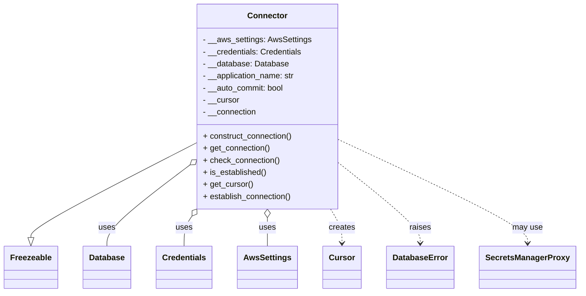

# Diagram: application_service/container_tracking_app_service/persistence/sql/postgresql/Connector.py


> Auto-generated by Obscura crawlers

## Diagram 1



### SVG

<svg id="container" width="1114.1875" xmlns="http://www.w3.org/2000/svg" class="classDiagram" height="582" viewBox="0 0 1114.1875 582" role="graphics-document document" aria-roledescription="class"><style>#container{font-family:"trebuchet ms",verdana,arial,sans-serif;font-size:16px;fill:#333;}@keyframes edge-animation-frame{from{stroke-dashoffset:0;}}@keyframes dash{to{stroke-dashoffset:0;}}#container .edge-animation-slow{stroke-dasharray:9,5!important;stroke-dashoffset:900;animation:dash 50s linear infinite;stroke-linecap:round;}#container .edge-animation-fast{stroke-dasharray:9,5!important;stroke-dashoffset:900;animation:dash 20s linear infinite;stroke-linecap:round;}#container .error-icon{fill:#552222;}#container .error-text{fill:#552222;stroke:#552222;}#container .edge-thickness-normal{stroke-width:1px;}#container .edge-thickness-thick{stroke-width:3.5px;}#container .edge-pattern-solid{stroke-dasharray:0;}#container .edge-thickness-invisible{stroke-width:0;fill:none;}#container .edge-pattern-dashed{stroke-dasharray:3;}#container .edge-pattern-dotted{stroke-dasharray:2;}#container .marker{fill:#333333;stroke:#333333;}#container .marker.cross{stroke:#333333;}#container svg{font-family:"trebuchet ms",verdana,arial,sans-serif;font-size:16px;}#container p{margin:0;}#container g.classGroup text{fill:#9370DB;stroke:none;font-family:"trebuchet ms",verdana,arial,sans-serif;font-size:10px;}#container g.classGroup text .title{font-weight:bolder;}#container .nodeLabel,#container .edgeLabel{color:#131300;}#container .edgeLabel .label rect{fill:#ECECFF;}#container .label text{fill:#131300;}#container .labelBkg{background:#ECECFF;}#container .edgeLabel .label span{background:#ECECFF;}#container .classTitle{font-weight:bolder;}#container .node rect,#container .node circle,#container .node ellipse,#container .node polygon,#container .node path{fill:#ECECFF;stroke:#9370DB;stroke-width:1px;}#container .divider{stroke:#9370DB;stroke-width:1;}#container g.clickable{cursor:pointer;}#container g.classGroup rect{fill:#ECECFF;stroke:#9370DB;}#container g.classGroup line{stroke:#9370DB;stroke-width:1;}#container .classLabel .box{stroke:none;stroke-width:0;fill:#ECECFF;opacity:0.5;}#container .classLabel .label{fill:#9370DB;font-size:10px;}#container .relation{stroke:#333333;stroke-width:1;fill:none;}#container .dashed-line{stroke-dasharray:3;}#container .dotted-line{stroke-dasharray:1 2;}#container #compositionStart,#container .composition{fill:#333333!important;stroke:#333333!important;stroke-width:1;}#container #compositionEnd,#container .composition{fill:#333333!important;stroke:#333333!important;stroke-width:1;}#container #dependencyStart,#container .dependency{fill:#333333!important;stroke:#333333!important;stroke-width:1;}#container #dependencyStart,#container .dependency{fill:#333333!important;stroke:#333333!important;stroke-width:1;}#container #extensionStart,#container .extension{fill:transparent!important;stroke:#333333!important;stroke-width:1;}#container #extensionEnd,#container .extension{fill:transparent!important;stroke:#333333!important;stroke-width:1;}#container #aggregationStart,#container .aggregation{fill:transparent!important;stroke:#333333!important;stroke-width:1;}#container #aggregationEnd,#container .aggregation{fill:transparent!important;stroke:#333333!important;stroke-width:1;}#container #lollipopStart,#container .lollipop{fill:#ECECFF!important;stroke:#333333!important;stroke-width:1;}#container #lollipopEnd,#container .lollipop{fill:#ECECFF!important;stroke:#333333!important;stroke-width:1;}#container .edgeTerminals{font-size:11px;line-height:initial;}#container .classTitleText{text-anchor:middle;font-size:18px;fill:#333;}#container .label-icon{display:inline-block;height:1em;overflow:visible;vertical-align:-0.125em;}#container .node .label-icon path{fill:currentColor;stroke:revert;stroke-width:revert;}#container :root{--mermaid-font-family:"trebuchet ms",verdana,arial,sans-serif;}</style><g><defs><marker id="container_class-aggregationStart" class="marker aggregation class" refX="18" refY="7" markerWidth="190" markerHeight="240" orient="auto"><path d="M 18,7 L9,13 L1,7 L9,1 Z"></path></marker></defs><defs><marker id="container_class-aggregationEnd" class="marker aggregation class" refX="1" refY="7" markerWidth="20" markerHeight="28" orient="auto"><path d="M 18,7 L9,13 L1,7 L9,1 Z"></path></marker></defs><defs><marker id="container_class-extensionStart" class="marker extension class" refX="18" refY="7" markerWidth="190" markerHeight="240" orient="auto"><path d="M 1,7 L18,13 V 1 Z"></path></marker></defs><defs><marker id="container_class-extensionEnd" class="marker extension class" refX="1" refY="7" markerWidth="20" markerHeight="28" orient="auto"><path d="M 1,1 V 13 L18,7 Z"></path></marker></defs><defs><marker id="container_class-compositionStart" class="marker composition class" refX="18" refY="7" markerWidth="190" markerHeight="240" orient="auto"><path d="M 18,7 L9,13 L1,7 L9,1 Z"></path></marker></defs><defs><marker id="container_class-compositionEnd" class="marker composition class" refX="1" refY="7" markerWidth="20" markerHeight="28" orient="auto"><path d="M 18,7 L9,13 L1,7 L9,1 Z"></path></marker></defs><defs><marker id="container_class-dependencyStart" class="marker dependency class" refX="6" refY="7" markerWidth="190" markerHeight="240" orient="auto"><path d="M 5,7 L9,13 L1,7 L9,1 Z"></path></marker></defs><defs><marker id="container_class-dependencyEnd" class="marker dependency class" refX="13" refY="7" markerWidth="20" markerHeight="28" orient="auto"><path d="M 18,7 L9,13 L14,7 L9,1 Z"></path></marker></defs><defs><marker id="container_class-lollipopStart" class="marker lollipop class" refX="13" refY="7" markerWidth="190" markerHeight="240" orient="auto"><circle stroke="black" fill="transparent" cx="7" cy="7" r="6"></circle></marker></defs><defs><marker id="container_class-lollipopEnd" class="marker lollipop class" refX="1" refY="7" markerWidth="190" markerHeight="240" orient="auto"><circle stroke="black" fill="transparent" cx="7" cy="7" r="6"></circle></marker></defs><g class="root"><g class="clusters"></g><g class="edgePaths"><path d="M378.82,284.658L325.549,312.715C272.279,340.772,165.737,396.886,112.466,428.235C59.195,459.583,59.195,466.167,59.195,469.458L59.195,472.75" id="id_Connector_Freezeable_1" class="edge-thickness-normal edge-pattern-solid relation" style=";;;" data-edge="true" data-et="edge" data-id="id_Connector_Freezeable_1" data-points="W3sieCI6Mzc4LjgyMDMxMjUsInkiOjI4NC42NTc5ODE5MDE5OTc2M30seyJ4Ijo1OS4xOTUzMTI1LCJ5Ijo0NTN9LHsieCI6NTkuMTk1MzEyNSwieSI6NDkwfV0=" marker-end="url(#container_class-extensionEnd)"></path><path d="M365.198,329.757L338.759,350.298C312.32,370.838,259.441,411.919,233.002,438.626C206.563,465.333,206.563,477.667,206.563,483.833L206.563,490" id="id_Connector_Database_2" class="edge-thickness-normal edge-pattern-solid relation" style=";;;" data-edge="true" data-et="edge" data-id="id_Connector_Database_2" data-points="W3sieCI6Mzc4LjgyMDMxMjUsInkiOjMxOS4xNzQ1MDMyMzYyMDUxN30seyJ4IjoyMDYuNTYyNSwieSI6NDUzfSx7IngiOjIwNi41NjI1LCJ5Ijo0OTB9XQ==" marker-start="url(#container_class-aggregationStart)"></path><path d="M371.415,430.359L368.903,434.133C366.391,437.906,361.368,445.453,358.856,455.393C356.344,465.333,356.344,477.667,356.344,483.833L356.344,490" id="id_Connector_Credentials_3" class="edge-thickness-normal edge-pattern-solid relation" style=";;;" data-edge="true" data-et="edge" data-id="id_Connector_Credentials_3" data-points="W3sieCI6MzgwLjk3NDAzMzk3MzAyOSwieSI6NDE2fSx7IngiOjM1Ni4zNDM3NSwieSI6NDUzfSx7IngiOjM1Ni4zNDM3NSwieSI6NDkwfV0=" marker-start="url(#container_class-aggregationStart)"></path><path d="M516.773,433.25L516.773,436.542C516.773,439.833,516.773,446.417,516.773,455.875C516.773,465.333,516.773,477.667,516.773,483.833L516.773,490" id="id_Connector_AwsSettings_4" class="edge-thickness-normal edge-pattern-solid relation" style=";;;" data-edge="true" data-et="edge" data-id="id_Connector_AwsSettings_4" data-points="W3sieCI6NTE2Ljc3MzQzNzUsInkiOjQxNn0seyJ4Ijo1MTYuNzczNDM3NSwieSI6NDUzfSx7IngiOjUxNi43NzM0Mzc1LCJ5Ijo0OTB9XQ==" marker-start="url(#container_class-aggregationStart)"></path><path d="M637.588,416L641.24,422.167C644.892,428.333,652.196,440.667,655.848,452C659.5,463.333,659.5,473.667,659.5,478.833L659.5,484" id="id_Connector_Cursor_5" class="edge-thickness-normal edge-pattern-dashed relation" style=";;;" data-edge="true" data-et="edge" data-id="id_Connector_Cursor_5" data-points="W3sieCI6NjM3LjU4NzYyMzE4NDY0NzMsInkiOjQxNn0seyJ4Ijo2NTkuNSwieSI6NDUzfSx7IngiOjY1OS41LCJ5Ijo0OTB9XQ==" marker-end="url(#container_class-dependencyEnd)"></path><path d="M654.727,325.473L680.566,346.728C706.406,367.982,758.086,410.491,783.926,436.912C809.766,463.333,809.766,473.667,809.766,478.833L809.766,484" id="id_Connector_DatabaseError_6" class="edge-thickness-normal edge-pattern-dashed relation" style=";;;" data-edge="true" data-et="edge" data-id="id_Connector_DatabaseError_6" data-points="W3sieCI6NjU0LjcyNjU2MjUsInkiOjMyNS40NzMwMDIxNTk4MjcyfSx7IngiOjgwOS43NjU2MjUsInkiOjQ1M30seyJ4Ijo4MDkuNzY1NjI1LCJ5Ijo0OTB9XQ==" marker-end="url(#container_class-dependencyEnd)"></path><path d="M654.727,278.709L714.798,307.758C774.87,336.806,895.013,394.903,955.085,429.118C1015.156,463.333,1015.156,473.667,1015.156,478.833L1015.156,484" id="id_Connector_SecretsManagerProxy_7" class="edge-thickness-normal edge-pattern-dashed relation" style=";;;" data-edge="true" data-et="edge" data-id="id_Connector_SecretsManagerProxy_7" data-points="W3sieCI6NjU0LjcyNjU2MjUsInkiOjI3OC43MDkxNjg3MTc1NzA5fSx7IngiOjEwMTUuMTU2MjUsInkiOjQ1M30seyJ4IjoxMDE1LjE1NjI1LCJ5Ijo0OTB9XQ==" marker-end="url(#container_class-dependencyEnd)"></path></g><g class="edgeLabels"><g class="edgeLabel"><g class="label" data-id="id_Connector_Freezeable_1" transform="translate(0, 0)"><foreignObject width="0" height="0"><div xmlns="http://www.w3.org/1999/xhtml" class="labelBkg" style="display: table-cell; white-space: nowrap; line-height: 1.5; max-width: 200px; text-align: center;"><span class="edgeLabel"></span></div></foreignObject></g></g><g class="edgeLabel" transform="translate(206.5625, 453)"><g class="label" data-id="id_Connector_Database_2" transform="translate(-16.4921875, -12)"><foreignObject width="32.984375" height="24"><div xmlns="http://www.w3.org/1999/xhtml" class="labelBkg" style="display: table-cell; white-space: nowrap; line-height: 1.5; max-width: 200px; text-align: center;"><span class="edgeLabel"><p>uses</p></span></div></foreignObject></g></g><g class="edgeLabel" transform="translate(356.34375, 453)"><g class="label" data-id="id_Connector_Credentials_3" transform="translate(-16.4921875, -12)"><foreignObject width="32.984375" height="24"><div xmlns="http://www.w3.org/1999/xhtml" class="labelBkg" style="display: table-cell; white-space: nowrap; line-height: 1.5; max-width: 200px; text-align: center;"><span class="edgeLabel"><p>uses</p></span></div></foreignObject></g></g><g class="edgeLabel" transform="translate(516.7734375, 453)"><g class="label" data-id="id_Connector_AwsSettings_4" transform="translate(-16.4921875, -12)"><foreignObject width="32.984375" height="24"><div xmlns="http://www.w3.org/1999/xhtml" class="labelBkg" style="display: table-cell; white-space: nowrap; line-height: 1.5; max-width: 200px; text-align: center;"><span class="edgeLabel"><p>uses</p></span></div></foreignObject></g></g><g class="edgeLabel" transform="translate(659.5, 453)"><g class="label" data-id="id_Connector_Cursor_5" transform="translate(-26.171875, -12)"><foreignObject width="52.34375" height="24"><div xmlns="http://www.w3.org/1999/xhtml" class="labelBkg" style="display: table-cell; white-space: nowrap; line-height: 1.5; max-width: 200px; text-align: center;"><span class="edgeLabel"><p>creates</p></span></div></foreignObject></g></g><g class="edgeLabel" transform="translate(809.765625, 453)"><g class="label" data-id="id_Connector_DatabaseError_6" transform="translate(-21.25, -12)"><foreignObject width="42.5" height="24"><div xmlns="http://www.w3.org/1999/xhtml" class="labelBkg" style="display: table-cell; white-space: nowrap; line-height: 1.5; max-width: 200px; text-align: center;"><span class="edgeLabel"><p>raises</p></span></div></foreignObject></g></g><g class="edgeLabel" transform="translate(1015.15625, 453)"><g class="label" data-id="id_Connector_SecretsManagerProxy_7" transform="translate(-29.8984375, -12)"><foreignObject width="59.796875" height="24"><div xmlns="http://www.w3.org/1999/xhtml" class="labelBkg" style="display: table-cell; white-space: nowrap; line-height: 1.5; max-width: 200px; text-align: center;"><span class="edgeLabel"><p>may use</p></span></div></foreignObject></g></g></g><g class="nodes"><g class="node default" id="classId-Connector-0" transform="translate(516.7734375, 212)"><g class="basic label-container"><path d="M-137.953125 -204 L137.953125 -204 L137.953125 204 L-137.953125 204" stroke="none" stroke-width="0" fill="#ECECFF" style=""></path><path d="M-137.953125 -204 C-74.49633395296789 -204, -11.039542905935761 -204, 137.953125 -204 M-137.953125 -204 C-43.991719127591935 -204, 49.96968674481613 -204, 137.953125 -204 M137.953125 -204 C137.953125 -58.41973714556036, 137.953125 87.16052570887928, 137.953125 204 M137.953125 -204 C137.953125 -82.34530658073525, 137.953125 39.30938683852949, 137.953125 204 M137.953125 204 C50.195033454682445 204, -37.56305809063511 204, -137.953125 204 M137.953125 204 C64.19649944326919 204, -9.560126113461621 204, -137.953125 204 M-137.953125 204 C-137.953125 103.63263602438019, -137.953125 3.26527204876038, -137.953125 -204 M-137.953125 204 C-137.953125 43.30329538658643, -137.953125 -117.39340922682715, -137.953125 -204" stroke="#9370DB" stroke-width="1.3" fill="none" stroke-dasharray="0 0" style=""></path></g><g class="annotation-group text" transform="translate(0, -180)"></g><g class="label-group text" transform="translate(-37.421875, -180)"><g class="label" style="font-weight: bolder" transform="translate(0,-12)"><foreignObject width="74.84375" height="24"><div xmlns="http://www.w3.org/1999/xhtml" style="display: table-cell; white-space: nowrap; line-height: 1.5; max-width: 125px; text-align: center;"><span class="nodeLabel markdown-node-label" style=""><p>Connector</p></span></div></foreignObject></g></g><g class="members-group text" transform="translate(-125.953125, -132)"><g class="label" style="" transform="translate(0,-12)"><foreignObject width="214.484375" height="24"><div xmlns="http://www.w3.org/1999/xhtml" style="display: table-cell; white-space: nowrap; line-height: 1.5; max-width: 272px; text-align: center;"><span class="nodeLabel markdown-node-label" style=""><p>- __aws_settings: AwsSettings</p></span></div></foreignObject></g><g class="label" style="" transform="translate(0,12)"><foreignObject width="197.453125" height="24"><div xmlns="http://www.w3.org/1999/xhtml" style="display: table-cell; white-space: nowrap; line-height: 1.5; max-width: 255px; text-align: center;"><span class="nodeLabel markdown-node-label" style=""><p>- __credentials: Credentials</p></span></div></foreignObject></g><g class="label" style="" transform="translate(0,36)"><foreignObject width="168.953125" height="24"><div xmlns="http://www.w3.org/1999/xhtml" style="display: table-cell; white-space: nowrap; line-height: 1.5; max-width: 226px; text-align: center;"><span class="nodeLabel markdown-node-label" style=""><p>- __database: Database</p></span></div></foreignObject></g><g class="label" style="" transform="translate(0,60)"><foreignObject width="185.296875" height="24"><div xmlns="http://www.w3.org/1999/xhtml" style="display: table-cell; white-space: nowrap; line-height: 1.5; max-width: 243px; text-align: center;"><span class="nodeLabel markdown-node-label" style=""><p>- __application_name: str</p></span></div></foreignObject></g><g class="label" style="" transform="translate(0,84)"><foreignObject width="162.84375" height="24"><div xmlns="http://www.w3.org/1999/xhtml" style="display: table-cell; white-space: nowrap; line-height: 1.5; max-width: 221px; text-align: center;"><span class="nodeLabel markdown-node-label" style=""><p>- __auto_commit: bool</p></span></div></foreignObject></g><g class="label" style="" transform="translate(0,108)"><foreignObject width="72.578125" height="24"><div xmlns="http://www.w3.org/1999/xhtml" style="display: table-cell; white-space: nowrap; line-height: 1.5; max-width: 131px; text-align: center;"><span class="nodeLabel markdown-node-label" style=""><p>- __cursor</p></span></div></foreignObject></g><g class="label" style="" transform="translate(0,132)"><foreignObject width="107.65625" height="24"><div xmlns="http://www.w3.org/1999/xhtml" style="display: table-cell; white-space: nowrap; line-height: 1.5; max-width: 165px; text-align: center;"><span class="nodeLabel markdown-node-label" style=""><p>- __connection</p></span></div></foreignObject></g></g><g class="methods-group text" transform="translate(-125.953125, 60)"><g class="label" style="" transform="translate(0,-12)"><foreignObject width="179.609375" height="24"><div xmlns="http://www.w3.org/1999/xhtml" style="display: table-cell; white-space: nowrap; line-height: 1.5; max-width: 237px; text-align: center;"><span class="nodeLabel markdown-node-label" style=""><p>+ construct_connection()</p></span></div></foreignObject></g><g class="label" style="" transform="translate(0,12)"><foreignObject width="133.953125" height="24"><div xmlns="http://www.w3.org/1999/xhtml" style="display: table-cell; white-space: nowrap; line-height: 1.5; max-width: 191px; text-align: center;"><span class="nodeLabel markdown-node-label" style=""><p>+ get_connection()</p></span></div></foreignObject></g><g class="label" style="" transform="translate(0,36)"><foreignObject width="152.984375" height="24"><div xmlns="http://www.w3.org/1999/xhtml" style="display: table-cell; white-space: nowrap; line-height: 1.5; max-width: 210px; text-align: center;"><span class="nodeLabel markdown-node-label" style=""><p>+ check_connection()</p></span></div></foreignObject></g><g class="label" style="" transform="translate(0,60)"><foreignObject width="126.65625" height="24"><div xmlns="http://www.w3.org/1999/xhtml" style="display: table-cell; white-space: nowrap; line-height: 1.5; max-width: 184px; text-align: center;"><span class="nodeLabel markdown-node-label" style=""><p>+ is_established()</p></span></div></foreignObject></g><g class="label" style="" transform="translate(0,84)"><foreignObject width="98.890625" height="24"><div xmlns="http://www.w3.org/1999/xhtml" style="display: table-cell; white-space: nowrap; line-height: 1.5; max-width: 156px; text-align: center;"><span class="nodeLabel markdown-node-label" style=""><p>+ get_cursor()</p></span></div></foreignObject></g><g class="label" style="" transform="translate(0,108)"><foreignObject width="177.515625" height="24"><div xmlns="http://www.w3.org/1999/xhtml" style="display: table-cell; white-space: nowrap; line-height: 1.5; max-width: 235px; text-align: center;"><span class="nodeLabel markdown-node-label" style=""><p>+ establish_connection()</p></span></div></foreignObject></g></g><g class="divider" style=""><path d="M-137.953125 -156 C-81.5503489971248 -156, -25.1475729942496 -156, 137.953125 -156 M-137.953125 -156 C-76.05139847639694 -156, -14.149671952793895 -156, 137.953125 -156" stroke="#9370DB" stroke-width="1.3" fill="none" stroke-dasharray="0 0" style=""></path></g><g class="divider" style=""><path d="M-137.953125 36 C-70.13591241744815 36, -2.3186998348963073 36, 137.953125 36 M-137.953125 36 C-45.830320683736005 36, 46.29248363252799 36, 137.953125 36" stroke="#9370DB" stroke-width="1.3" fill="none" stroke-dasharray="0 0" style=""></path></g></g><g class="node default" id="classId-Freezeable-1" transform="translate(59.1953125, 532)"><g class="basic label-container"><path d="M-51.1953125 -42 L51.1953125 -42 L51.1953125 42 L-51.1953125 42" stroke="none" stroke-width="0" fill="#ECECFF" style=""></path><path d="M-51.1953125 -42 C-25.26492778199618 -42, 0.6654569360076366 -42, 51.1953125 -42 M-51.1953125 -42 C-10.312521053991006 -42, 30.57027039201799 -42, 51.1953125 -42 M51.1953125 -42 C51.1953125 -15.915271973462389, 51.1953125 10.169456053075223, 51.1953125 42 M51.1953125 -42 C51.1953125 -13.953241270590386, 51.1953125 14.093517458819228, 51.1953125 42 M51.1953125 42 C27.857205519154576 42, 4.5190985383091515 42, -51.1953125 42 M51.1953125 42 C11.663676980091452 42, -27.867958539817096 42, -51.1953125 42 M-51.1953125 42 C-51.1953125 13.143872940847146, -51.1953125 -15.712254118305708, -51.1953125 -42 M-51.1953125 42 C-51.1953125 12.553686008374669, -51.1953125 -16.892627983250662, -51.1953125 -42" stroke="#9370DB" stroke-width="1.3" fill="none" stroke-dasharray="0 0" style=""></path></g><g class="annotation-group text" transform="translate(0, -18)"></g><g class="label-group text" transform="translate(-39.1953125, -18)"><g class="label" style="font-weight: bolder" transform="translate(0,-12)"><foreignObject width="78.390625" height="24"><div xmlns="http://www.w3.org/1999/xhtml" style="display: table-cell; white-space: nowrap; line-height: 1.5; max-width: 127px; text-align: center;"><span class="nodeLabel markdown-node-label" style=""><p>Freezeable</p></span></div></foreignObject></g></g><g class="members-group text" transform="translate(-39.1953125, 30)"></g><g class="methods-group text" transform="translate(-39.1953125, 60)"></g><g class="divider" style=""><path d="M-51.1953125 6 C-16.06972923174507 6, 19.055854036509857 6, 51.1953125 6 M-51.1953125 6 C-28.13779015030149 6, -5.080267800602982 6, 51.1953125 6" stroke="#9370DB" stroke-width="1.3" fill="none" stroke-dasharray="0 0" style=""></path></g><g class="divider" style=""><path d="M-51.1953125 24 C-27.363241607604895 24, -3.5311707152097895 24, 51.1953125 24 M-51.1953125 24 C-27.302091799107775 24, -3.408871098215549 24, 51.1953125 24" stroke="#9370DB" stroke-width="1.3" fill="none" stroke-dasharray="0 0" style=""></path></g></g><g class="node default" id="classId-Database-2" transform="translate(206.5625, 532)"><g class="basic label-container"><path d="M-46.171875 -42 L46.171875 -42 L46.171875 42 L-46.171875 42" stroke="none" stroke-width="0" fill="#ECECFF" style=""></path><path d="M-46.171875 -42 C-21.105816712971087 -42, 3.960241574057825 -42, 46.171875 -42 M-46.171875 -42 C-17.379298702279307 -42, 11.413277595441386 -42, 46.171875 -42 M46.171875 -42 C46.171875 -23.73221631464133, 46.171875 -5.464432629282662, 46.171875 42 M46.171875 -42 C46.171875 -9.831738817475077, 46.171875 22.336522365049845, 46.171875 42 M46.171875 42 C16.79366003814618 42, -12.584554923707643 42, -46.171875 42 M46.171875 42 C19.99891424135409 42, -6.174046517291821 42, -46.171875 42 M-46.171875 42 C-46.171875 21.38412772768487, -46.171875 0.76825545536974, -46.171875 -42 M-46.171875 42 C-46.171875 21.885557592405824, -46.171875 1.7711151848116486, -46.171875 -42" stroke="#9370DB" stroke-width="1.3" fill="none" stroke-dasharray="0 0" style=""></path></g><g class="annotation-group text" transform="translate(0, -18)"></g><g class="label-group text" transform="translate(-34.171875, -18)"><g class="label" style="font-weight: bolder" transform="translate(0,-12)"><foreignObject width="68.34375" height="24"><div xmlns="http://www.w3.org/1999/xhtml" style="display: table-cell; white-space: nowrap; line-height: 1.5; max-width: 117px; text-align: center;"><span class="nodeLabel markdown-node-label" style=""><p>Database</p></span></div></foreignObject></g></g><g class="members-group text" transform="translate(-34.171875, 30)"></g><g class="methods-group text" transform="translate(-34.171875, 60)"></g><g class="divider" style=""><path d="M-46.171875 6 C-19.00217720976494 6, 8.167520580470118 6, 46.171875 6 M-46.171875 6 C-17.072666849123628 6, 12.026541301752744 6, 46.171875 6" stroke="#9370DB" stroke-width="1.3" fill="none" stroke-dasharray="0 0" style=""></path></g><g class="divider" style=""><path d="M-46.171875 24 C-13.936593707723482 24, 18.298687584553036 24, 46.171875 24 M-46.171875 24 C-18.02928225610079 24, 10.113310487798422 24, 46.171875 24" stroke="#9370DB" stroke-width="1.3" fill="none" stroke-dasharray="0 0" style=""></path></g></g><g class="node default" id="classId-Credentials-3" transform="translate(356.34375, 532)"><g class="basic label-container"><path d="M-53.609375 -42 L53.609375 -42 L53.609375 42 L-53.609375 42" stroke="none" stroke-width="0" fill="#ECECFF" style=""></path><path d="M-53.609375 -42 C-16.581421775048184 -42, 20.44653144990363 -42, 53.609375 -42 M-53.609375 -42 C-29.897024924955364 -42, -6.184674849910728 -42, 53.609375 -42 M53.609375 -42 C53.609375 -18.270643995212076, 53.609375 5.458712009575848, 53.609375 42 M53.609375 -42 C53.609375 -9.118836224507078, 53.609375 23.762327550985844, 53.609375 42 M53.609375 42 C30.56919327131073 42, 7.529011542621461 42, -53.609375 42 M53.609375 42 C17.761554311894386 42, -18.086266376211228 42, -53.609375 42 M-53.609375 42 C-53.609375 16.654244391361388, -53.609375 -8.691511217277224, -53.609375 -42 M-53.609375 42 C-53.609375 18.23847955529137, -53.609375 -5.52304088941726, -53.609375 -42" stroke="#9370DB" stroke-width="1.3" fill="none" stroke-dasharray="0 0" style=""></path></g><g class="annotation-group text" transform="translate(0, -18)"></g><g class="label-group text" transform="translate(-41.609375, -18)"><g class="label" style="font-weight: bolder" transform="translate(0,-12)"><foreignObject width="83.21875" height="24"><div xmlns="http://www.w3.org/1999/xhtml" style="display: table-cell; white-space: nowrap; line-height: 1.5; max-width: 132px; text-align: center;"><span class="nodeLabel markdown-node-label" style=""><p>Credentials</p></span></div></foreignObject></g></g><g class="members-group text" transform="translate(-41.609375, 30)"></g><g class="methods-group text" transform="translate(-41.609375, 60)"></g><g class="divider" style=""><path d="M-53.609375 6 C-28.310127302690464 6, -3.0108796053809286 6, 53.609375 6 M-53.609375 6 C-22.077151201800564 6, 9.455072596398871 6, 53.609375 6" stroke="#9370DB" stroke-width="1.3" fill="none" stroke-dasharray="0 0" style=""></path></g><g class="divider" style=""><path d="M-53.609375 24 C-31.818339516805512 24, -10.027304033611024 24, 53.609375 24 M-53.609375 24 C-31.944905547643042 24, -10.280436095286085 24, 53.609375 24" stroke="#9370DB" stroke-width="1.3" fill="none" stroke-dasharray="0 0" style=""></path></g></g><g class="node default" id="classId-AwsSettings-4" transform="translate(516.7734375, 532)"><g class="basic label-container"><path d="M-56.8203125 -42 L56.8203125 -42 L56.8203125 42 L-56.8203125 42" stroke="none" stroke-width="0" fill="#ECECFF" style=""></path><path d="M-56.8203125 -42 C-19.26936845010747 -42, 18.281575599785057 -42, 56.8203125 -42 M-56.8203125 -42 C-30.747432422762003 -42, -4.674552345524006 -42, 56.8203125 -42 M56.8203125 -42 C56.8203125 -8.467149241202826, 56.8203125 25.06570151759435, 56.8203125 42 M56.8203125 -42 C56.8203125 -8.561387295534857, 56.8203125 24.877225408930286, 56.8203125 42 M56.8203125 42 C21.575379387749187 42, -13.669553724501625 42, -56.8203125 42 M56.8203125 42 C23.857633950752252 42, -9.105044598495496 42, -56.8203125 42 M-56.8203125 42 C-56.8203125 9.32259494596731, -56.8203125 -23.35481010806538, -56.8203125 -42 M-56.8203125 42 C-56.8203125 22.19162525393415, -56.8203125 2.383250507868297, -56.8203125 -42" stroke="#9370DB" stroke-width="1.3" fill="none" stroke-dasharray="0 0" style=""></path></g><g class="annotation-group text" transform="translate(0, -18)"></g><g class="label-group text" transform="translate(-44.8203125, -18)"><g class="label" style="font-weight: bolder" transform="translate(0,-12)"><foreignObject width="89.640625" height="24"><div xmlns="http://www.w3.org/1999/xhtml" style="display: table-cell; white-space: nowrap; line-height: 1.5; max-width: 137px; text-align: center;"><span class="nodeLabel markdown-node-label" style=""><p>AwsSettings</p></span></div></foreignObject></g></g><g class="members-group text" transform="translate(-44.8203125, 30)"></g><g class="methods-group text" transform="translate(-44.8203125, 60)"></g><g class="divider" style=""><path d="M-56.8203125 6 C-13.741940471436266 6, 29.33643155712747 6, 56.8203125 6 M-56.8203125 6 C-26.10070758885933 6, 4.618897322281342 6, 56.8203125 6" stroke="#9370DB" stroke-width="1.3" fill="none" stroke-dasharray="0 0" style=""></path></g><g class="divider" style=""><path d="M-56.8203125 24 C-19.012547385492745 24, 18.79521772901451 24, 56.8203125 24 M-56.8203125 24 C-21.189481215129547 24, 14.441350069740906 24, 56.8203125 24" stroke="#9370DB" stroke-width="1.3" fill="none" stroke-dasharray="0 0" style=""></path></g></g><g class="node default" id="classId-Cursor-5" transform="translate(659.5, 532)"><g class="basic label-container"><path d="M-35.90625 -42 L35.90625 -42 L35.90625 42 L-35.90625 42" stroke="none" stroke-width="0" fill="#ECECFF" style=""></path><path d="M-35.90625 -42 C-11.9734627332323 -42, 11.959324533535401 -42, 35.90625 -42 M-35.90625 -42 C-18.249687324820115 -42, -0.5931246496402309 -42, 35.90625 -42 M35.90625 -42 C35.90625 -20.932587462007984, 35.90625 0.1348250759840326, 35.90625 42 M35.90625 -42 C35.90625 -17.796620105437583, 35.90625 6.406759789124834, 35.90625 42 M35.90625 42 C15.332849719292895 42, -5.24055056141421 42, -35.90625 42 M35.90625 42 C16.937703210967957 42, -2.0308435780640863 42, -35.90625 42 M-35.90625 42 C-35.90625 14.06934447633338, -35.90625 -13.861311047333238, -35.90625 -42 M-35.90625 42 C-35.90625 14.784219695264113, -35.90625 -12.431560609471774, -35.90625 -42" stroke="#9370DB" stroke-width="1.3" fill="none" stroke-dasharray="0 0" style=""></path></g><g class="annotation-group text" transform="translate(0, -18)"></g><g class="label-group text" transform="translate(-23.90625, -18)"><g class="label" style="font-weight: bolder" transform="translate(0,-12)"><foreignObject width="47.8125" height="24"><div xmlns="http://www.w3.org/1999/xhtml" style="display: table-cell; white-space: nowrap; line-height: 1.5; max-width: 98px; text-align: center;"><span class="nodeLabel markdown-node-label" style=""><p>Cursor</p></span></div></foreignObject></g></g><g class="members-group text" transform="translate(-23.90625, 30)"></g><g class="methods-group text" transform="translate(-23.90625, 60)"></g><g class="divider" style=""><path d="M-35.90625 6 C-15.594359208822073 6, 4.7175315823558535 6, 35.90625 6 M-35.90625 6 C-18.731887466693053 6, -1.5575249333861052 6, 35.90625 6" stroke="#9370DB" stroke-width="1.3" fill="none" stroke-dasharray="0 0" style=""></path></g><g class="divider" style=""><path d="M-35.90625 24 C-19.3888459362022 24, -2.8714418724043966 24, 35.90625 24 M-35.90625 24 C-10.94131998950396 24, 14.02361002099208 24, 35.90625 24" stroke="#9370DB" stroke-width="1.3" fill="none" stroke-dasharray="0 0" style=""></path></g></g><g class="node default" id="classId-DatabaseError-6" transform="translate(809.765625, 532)"><g class="basic label-container"><path d="M-64.359375 -42 L64.359375 -42 L64.359375 42 L-64.359375 42" stroke="none" stroke-width="0" fill="#ECECFF" style=""></path><path d="M-64.359375 -42 C-19.262881077092842 -42, 25.833612845814315 -42, 64.359375 -42 M-64.359375 -42 C-15.969644835225914 -42, 32.42008532954817 -42, 64.359375 -42 M64.359375 -42 C64.359375 -13.257980652099441, 64.359375 15.484038695801118, 64.359375 42 M64.359375 -42 C64.359375 -9.94096997475441, 64.359375 22.11806005049118, 64.359375 42 M64.359375 42 C26.60516153867001 42, -11.149051922659979 42, -64.359375 42 M64.359375 42 C16.222451311489003 42, -31.914472377021994 42, -64.359375 42 M-64.359375 42 C-64.359375 13.802630859363571, -64.359375 -14.394738281272858, -64.359375 -42 M-64.359375 42 C-64.359375 11.60305580130801, -64.359375 -18.79388839738398, -64.359375 -42" stroke="#9370DB" stroke-width="1.3" fill="none" stroke-dasharray="0 0" style=""></path></g><g class="annotation-group text" transform="translate(0, -18)"></g><g class="label-group text" transform="translate(-52.359375, -18)"><g class="label" style="font-weight: bolder" transform="translate(0,-12)"><foreignObject width="104.71875" height="24"><div xmlns="http://www.w3.org/1999/xhtml" style="display: table-cell; white-space: nowrap; line-height: 1.5; max-width: 154px; text-align: center;"><span class="nodeLabel markdown-node-label" style=""><p>DatabaseError</p></span></div></foreignObject></g></g><g class="members-group text" transform="translate(-52.359375, 30)"></g><g class="methods-group text" transform="translate(-52.359375, 60)"></g><g class="divider" style=""><path d="M-64.359375 6 C-37.71095356626947 6, -11.062532132538934 6, 64.359375 6 M-64.359375 6 C-33.249115164924696 6, -2.1388553298493918 6, 64.359375 6" stroke="#9370DB" stroke-width="1.3" fill="none" stroke-dasharray="0 0" style=""></path></g><g class="divider" style=""><path d="M-64.359375 24 C-25.340083917191087 24, 13.679207165617825 24, 64.359375 24 M-64.359375 24 C-16.35804448886978 24, 31.64328602226044 24, 64.359375 24" stroke="#9370DB" stroke-width="1.3" fill="none" stroke-dasharray="0 0" style=""></path></g></g><g class="node default" id="classId-SecretsManagerProxy-7" transform="translate(1015.15625, 532)"><g class="basic label-container"><path d="M-91.03125 -42 L91.03125 -42 L91.03125 42 L-91.03125 42" stroke="none" stroke-width="0" fill="#ECECFF" style=""></path><path d="M-91.03125 -42 C-31.5532638421032 -42, 27.924722315793602 -42, 91.03125 -42 M-91.03125 -42 C-19.15680323645269 -42, 52.71764352709462 -42, 91.03125 -42 M91.03125 -42 C91.03125 -21.087813919275796, 91.03125 -0.17562783855159125, 91.03125 42 M91.03125 -42 C91.03125 -21.30760235652908, 91.03125 -0.6152047130581622, 91.03125 42 M91.03125 42 C23.408244036966465 42, -44.21476192606707 42, -91.03125 42 M91.03125 42 C34.21921010728787 42, -22.592829785424257 42, -91.03125 42 M-91.03125 42 C-91.03125 16.47867868139581, -91.03125 -9.042642637208381, -91.03125 -42 M-91.03125 42 C-91.03125 23.405539308473127, -91.03125 4.811078616946254, -91.03125 -42" stroke="#9370DB" stroke-width="1.3" fill="none" stroke-dasharray="0 0" style=""></path></g><g class="annotation-group text" transform="translate(0, -18)"></g><g class="label-group text" transform="translate(-79.03125, -18)"><g class="label" style="font-weight: bolder" transform="translate(0,-12)"><foreignObject width="158.0625" height="24"><div xmlns="http://www.w3.org/1999/xhtml" style="display: table-cell; white-space: nowrap; line-height: 1.5; max-width: 204px; text-align: center;"><span class="nodeLabel markdown-node-label" style=""><p>SecretsManagerProxy</p></span></div></foreignObject></g></g><g class="members-group text" transform="translate(-79.03125, 30)"></g><g class="methods-group text" transform="translate(-79.03125, 60)"></g><g class="divider" style=""><path d="M-91.03125 6 C-24.074593505118088 6, 42.882062989763824 6, 91.03125 6 M-91.03125 6 C-38.48567109152648 6, 14.059907816947046 6, 91.03125 6" stroke="#9370DB" stroke-width="1.3" fill="none" stroke-dasharray="0 0" style=""></path></g><g class="divider" style=""><path d="M-91.03125 24 C-48.57203117491358 24, -6.112812349827166 24, 91.03125 24 M-91.03125 24 C-34.03269799756017 24, 22.96585400487966 24, 91.03125 24" stroke="#9370DB" stroke-width="1.3" fill="none" stroke-dasharray="0 0" style=""></path></g></g></g></g></g></svg>

## Diagram 2

```mermaid
sequenceDiagram
    participant Caller
    participant Connector
    participant psycopg2
    participant Cursor

    Caller->>Connector: establish_connection()
    Connector->>Connector: is_established()
    alt connection not established
        Connector->>psycopg2: construct_connection(host,port,dbname,user,password,app_name)
        psycopg2-->>Connector: connection or Error
        alt Error
            Connector-->>Caller: raise DatabaseError
            return
        end
    end
    Connector->>Connector: get_cursor()
    Connector->>Cursor: Cursor(self)
    Connector->>Connector: check_connection() ("SELECT 1")
    Connector-->>Caller: return connection/cursor
```

> SVG rendering failed for this diagram.
