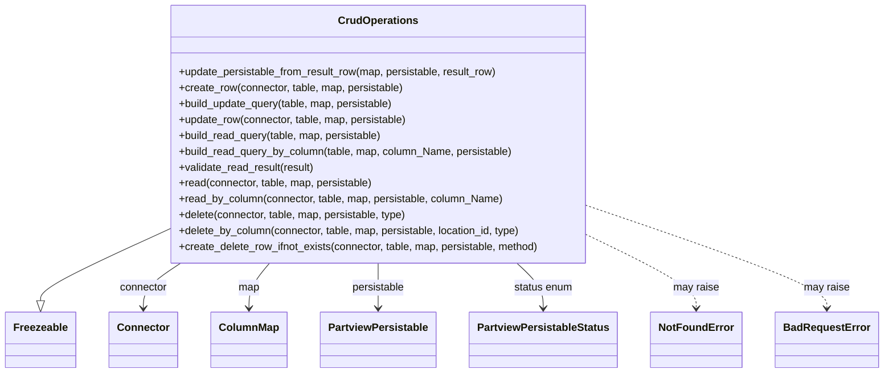

# Diagram: application_service/container_tracking_app_service/persistence/sql/postgresql/CrudOperations.py


> Auto-generated by Obscura crawlers

## Diagram 1



### SVG

<svg id="container" width="1292.6875" xmlns="http://www.w3.org/2000/svg" class="classDiagram" height="564" viewBox="0 0 1292.6875 564" role="graphics-document document" aria-roledescription="class"><style>#container{font-family:"trebuchet ms",verdana,arial,sans-serif;font-size:16px;fill:#333;}@keyframes edge-animation-frame{from{stroke-dashoffset:0;}}@keyframes dash{to{stroke-dashoffset:0;}}#container .edge-animation-slow{stroke-dasharray:9,5!important;stroke-dashoffset:900;animation:dash 50s linear infinite;stroke-linecap:round;}#container .edge-animation-fast{stroke-dasharray:9,5!important;stroke-dashoffset:900;animation:dash 20s linear infinite;stroke-linecap:round;}#container .error-icon{fill:#552222;}#container .error-text{fill:#552222;stroke:#552222;}#container .edge-thickness-normal{stroke-width:1px;}#container .edge-thickness-thick{stroke-width:3.5px;}#container .edge-pattern-solid{stroke-dasharray:0;}#container .edge-thickness-invisible{stroke-width:0;fill:none;}#container .edge-pattern-dashed{stroke-dasharray:3;}#container .edge-pattern-dotted{stroke-dasharray:2;}#container .marker{fill:#333333;stroke:#333333;}#container .marker.cross{stroke:#333333;}#container svg{font-family:"trebuchet ms",verdana,arial,sans-serif;font-size:16px;}#container p{margin:0;}#container g.classGroup text{fill:#9370DB;stroke:none;font-family:"trebuchet ms",verdana,arial,sans-serif;font-size:10px;}#container g.classGroup text .title{font-weight:bolder;}#container .nodeLabel,#container .edgeLabel{color:#131300;}#container .edgeLabel .label rect{fill:#ECECFF;}#container .label text{fill:#131300;}#container .labelBkg{background:#ECECFF;}#container .edgeLabel .label span{background:#ECECFF;}#container .classTitle{font-weight:bolder;}#container .node rect,#container .node circle,#container .node ellipse,#container .node polygon,#container .node path{fill:#ECECFF;stroke:#9370DB;stroke-width:1px;}#container .divider{stroke:#9370DB;stroke-width:1;}#container g.clickable{cursor:pointer;}#container g.classGroup rect{fill:#ECECFF;stroke:#9370DB;}#container g.classGroup line{stroke:#9370DB;stroke-width:1;}#container .classLabel .box{stroke:none;stroke-width:0;fill:#ECECFF;opacity:0.5;}#container .classLabel .label{fill:#9370DB;font-size:10px;}#container .relation{stroke:#333333;stroke-width:1;fill:none;}#container .dashed-line{stroke-dasharray:3;}#container .dotted-line{stroke-dasharray:1 2;}#container #compositionStart,#container .composition{fill:#333333!important;stroke:#333333!important;stroke-width:1;}#container #compositionEnd,#container .composition{fill:#333333!important;stroke:#333333!important;stroke-width:1;}#container #dependencyStart,#container .dependency{fill:#333333!important;stroke:#333333!important;stroke-width:1;}#container #dependencyStart,#container .dependency{fill:#333333!important;stroke:#333333!important;stroke-width:1;}#container #extensionStart,#container .extension{fill:transparent!important;stroke:#333333!important;stroke-width:1;}#container #extensionEnd,#container .extension{fill:transparent!important;stroke:#333333!important;stroke-width:1;}#container #aggregationStart,#container .aggregation{fill:transparent!important;stroke:#333333!important;stroke-width:1;}#container #aggregationEnd,#container .aggregation{fill:transparent!important;stroke:#333333!important;stroke-width:1;}#container #lollipopStart,#container .lollipop{fill:#ECECFF!important;stroke:#333333!important;stroke-width:1;}#container #lollipopEnd,#container .lollipop{fill:#ECECFF!important;stroke:#333333!important;stroke-width:1;}#container .edgeTerminals{font-size:11px;line-height:initial;}#container .classTitleText{text-anchor:middle;font-size:18px;fill:#333;}#container .label-icon{display:inline-block;height:1em;overflow:visible;vertical-align:-0.125em;}#container .node .label-icon path{fill:currentColor;stroke:revert;stroke-width:revert;}#container :root{--mermaid-font-family:"trebuchet ms",verdana,arial,sans-serif;}</style><g><defs><marker id="container_class-aggregationStart" class="marker aggregation class" refX="18" refY="7" markerWidth="190" markerHeight="240" orient="auto"><path d="M 18,7 L9,13 L1,7 L9,1 Z"></path></marker></defs><defs><marker id="container_class-aggregationEnd" class="marker aggregation class" refX="1" refY="7" markerWidth="20" markerHeight="28" orient="auto"><path d="M 18,7 L9,13 L1,7 L9,1 Z"></path></marker></defs><defs><marker id="container_class-extensionStart" class="marker extension class" refX="18" refY="7" markerWidth="190" markerHeight="240" orient="auto"><path d="M 1,7 L18,13 V 1 Z"></path></marker></defs><defs><marker id="container_class-extensionEnd" class="marker extension class" refX="1" refY="7" markerWidth="20" markerHeight="28" orient="auto"><path d="M 1,1 V 13 L18,7 Z"></path></marker></defs><defs><marker id="container_class-compositionStart" class="marker composition class" refX="18" refY="7" markerWidth="190" markerHeight="240" orient="auto"><path d="M 18,7 L9,13 L1,7 L9,1 Z"></path></marker></defs><defs><marker id="container_class-compositionEnd" class="marker composition class" refX="1" refY="7" markerWidth="20" markerHeight="28" orient="auto"><path d="M 18,7 L9,13 L1,7 L9,1 Z"></path></marker></defs><defs><marker id="container_class-dependencyStart" class="marker dependency class" refX="6" refY="7" markerWidth="190" markerHeight="240" orient="auto"><path d="M 5,7 L9,13 L1,7 L9,1 Z"></path></marker></defs><defs><marker id="container_class-dependencyEnd" class="marker dependency class" refX="13" refY="7" markerWidth="20" markerHeight="28" orient="auto"><path d="M 18,7 L9,13 L14,7 L9,1 Z"></path></marker></defs><defs><marker id="container_class-lollipopStart" class="marker lollipop class" refX="13" refY="7" markerWidth="190" markerHeight="240" orient="auto"><circle stroke="black" fill="transparent" cx="7" cy="7" r="6"></circle></marker></defs><defs><marker id="container_class-lollipopEnd" class="marker lollipop class" refX="1" refY="7" markerWidth="190" markerHeight="240" orient="auto"><circle stroke="black" fill="transparent" cx="7" cy="7" r="6"></circle></marker></defs><g class="root"><g class="clusters"></g><g class="edgePaths"><path d="M236.449,351.855L206.907,365.713C177.365,379.57,118.28,407.285,88.738,424.434C59.195,441.583,59.195,448.167,59.195,451.458L59.195,454.75" id="id_CrudOperations_Freezeable_1" class="edge-thickness-normal edge-pattern-solid relation" style=";;;" data-edge="true" data-et="edge" data-id="id_CrudOperations_Freezeable_1" data-points="W3sieCI6MjM2LjQ0OTIxODc1LCJ5IjozNTEuODU1MTg0MTc4OTM0NzN9LHsieCI6NTkuMTk1MzEyNSwieSI6NDM1fSx7IngiOjU5LjE5NTMxMjUsInkiOjQ3Mn1d" marker-end="url(#container_class-extensionEnd)"></path><path d="M264.671,398L255.528,404.167C246.385,410.333,228.099,422.667,218.956,434C209.813,445.333,209.813,455.667,209.813,460.833L209.813,466" id="id_CrudOperations_Connector_2" class="edge-thickness-normal edge-pattern-solid relation" style=";;;" data-edge="true" data-et="edge" data-id="id_CrudOperations_Connector_2" data-points="W3sieCI6MjY0LjY3MDgzMTA4ODM2MjEsInkiOjM5OH0seyJ4IjoyMDkuODEyNSwieSI6NDM1fSx7IngiOjIwOS44MTI1LCJ5Ijo0NzJ9XQ==" marker-end="url(#container_class-dependencyEnd)"></path><path d="M394.373,398L389.332,404.167C384.29,410.333,374.208,422.667,369.166,434C364.125,445.333,364.125,455.667,364.125,460.833L364.125,466" id="id_CrudOperations_ColumnMap_3" class="edge-thickness-normal edge-pattern-solid relation" style=";;;" data-edge="true" data-et="edge" data-id="id_CrudOperations_ColumnMap_3" data-points="W3sieCI6Mzk0LjM3MzE0Nzg5ODcwNjg2LCJ5IjozOTh9LHsieCI6MzY0LjEyNSwieSI6NDM1fSx7IngiOjM2NC4xMjUsInkiOjQ3Mn1d" marker-end="url(#container_class-dependencyEnd)"></path><path d="M553.789,398L553.789,404.167C553.789,410.333,553.789,422.667,553.789,434C553.789,445.333,553.789,455.667,553.789,460.833L553.789,466" id="id_CrudOperations_PartviewPersistable_4" class="edge-thickness-normal edge-pattern-solid relation" style=";;;" data-edge="true" data-et="edge" data-id="id_CrudOperations_PartviewPersistable_4" data-points="W3sieCI6NTUzLjc4OTA2MjUsInkiOjM5OH0seyJ4Ijo1NTMuNzg5MDYyNSwieSI6NDM1fSx7IngiOjU1My43ODkwNjI1LCJ5Ijo0NzJ9XQ==" marker-end="url(#container_class-dependencyEnd)"></path><path d="M758.054,398L764.514,404.167C770.974,410.333,783.893,422.667,790.353,434C796.813,445.333,796.813,455.667,796.813,460.833L796.813,466" id="id_CrudOperations_PartviewPersistableStatus_5" class="edge-thickness-normal edge-pattern-solid relation" style=";;;" data-edge="true" data-et="edge" data-id="id_CrudOperations_PartviewPersistableStatus_5" data-points="W3sieCI6NzU4LjA1NDQ1MTc3ODAxNzIsInkiOjM5OH0seyJ4Ijo3OTYuODEyNSwieSI6NDM1fSx7IngiOjc5Ni44MTI1LCJ5Ijo0NzJ9XQ==" marker-end="url(#container_class-dependencyEnd)"></path><path d="M871.129,360.717L896.04,373.097C920.951,385.478,970.772,410.239,995.683,427.786C1020.594,445.333,1020.594,455.667,1020.594,460.833L1020.594,466" id="id_CrudOperations_NotFoundError_6" class="edge-thickness-normal edge-pattern-dashed relation" style=";;;" data-edge="true" data-et="edge" data-id="id_CrudOperations_NotFoundError_6" data-points="W3sieCI6ODcxLjEyODkwNjI1LCJ5IjozNjAuNzE2NTkwNTE3MzEzNTN9LHsieCI6MTAyMC41OTM3NSwieSI6NDM1fSx7IngiOjEwMjAuNTkzNzUsInkiOjQ3Mn1d" marker-end="url(#container_class-dependencyEnd)"></path><path d="M871.129,315.124L927.675,335.104C984.221,355.083,1097.314,395.041,1153.86,420.187C1210.406,445.333,1210.406,455.667,1210.406,460.833L1210.406,466" id="id_CrudOperations_BadRequestError_7" class="edge-thickness-normal edge-pattern-dashed relation" style=";;;" data-edge="true" data-et="edge" data-id="id_CrudOperations_BadRequestError_7" data-points="W3sieCI6ODcxLjEyODkwNjI1LCJ5IjozMTUuMTI0NDU0MTc0NDV9LHsieCI6MTIxMC40MDYyNSwieSI6NDM1fSx7IngiOjEyMTAuNDA2MjUsInkiOjQ3Mn1d" marker-end="url(#container_class-dependencyEnd)"></path></g><g class="edgeLabels"><g class="edgeLabel"><g class="label" data-id="id_CrudOperations_Freezeable_1" transform="translate(0, 0)"><foreignObject width="0" height="0"><div xmlns="http://www.w3.org/1999/xhtml" class="labelBkg" style="display: table-cell; white-space: nowrap; line-height: 1.5; max-width: 200px; text-align: center;"><span class="edgeLabel"></span></div></foreignObject></g></g><g class="edgeLabel" transform="translate(209.8125, 435)"><g class="label" data-id="id_CrudOperations_Connector_2" transform="translate(-36.4296875, -12)"><foreignObject width="72.859375" height="24"><div xmlns="http://www.w3.org/1999/xhtml" class="labelBkg" style="display: table-cell; white-space: nowrap; line-height: 1.5; max-width: 200px; text-align: center;"><span class="edgeLabel"><p>connector</p></span></div></foreignObject></g></g><g class="edgeLabel" transform="translate(364.125, 435)"><g class="label" data-id="id_CrudOperations_ColumnMap_3" transform="translate(-15.9609375, -12)"><foreignObject width="31.921875" height="24"><div xmlns="http://www.w3.org/1999/xhtml" class="labelBkg" style="display: table-cell; white-space: nowrap; line-height: 1.5; max-width: 200px; text-align: center;"><span class="edgeLabel"><p>map</p></span></div></foreignObject></g></g><g class="edgeLabel" transform="translate(553.7890625, 435)"><g class="label" data-id="id_CrudOperations_PartviewPersistable_4" transform="translate(-40.4140625, -12)"><foreignObject width="80.828125" height="24"><div xmlns="http://www.w3.org/1999/xhtml" class="labelBkg" style="display: table-cell; white-space: nowrap; line-height: 1.5; max-width: 200px; text-align: center;"><span class="edgeLabel"><p>persistable</p></span></div></foreignObject></g></g><g class="edgeLabel" transform="translate(796.8125, 435)"><g class="label" data-id="id_CrudOperations_PartviewPersistableStatus_5" transform="translate(-44.8828125, -12)"><foreignObject width="89.765625" height="24"><div xmlns="http://www.w3.org/1999/xhtml" class="labelBkg" style="display: table-cell; white-space: nowrap; line-height: 1.5; max-width: 200px; text-align: center;"><span class="edgeLabel"><p>status enum</p></span></div></foreignObject></g></g><g class="edgeLabel" transform="translate(1020.59375, 435)"><g class="label" data-id="id_CrudOperations_NotFoundError_6" transform="translate(-34.65625, -12)"><foreignObject width="69.3125" height="24"><div xmlns="http://www.w3.org/1999/xhtml" class="labelBkg" style="display: table-cell; white-space: nowrap; line-height: 1.5; max-width: 200px; text-align: center;"><span class="edgeLabel"><p>may raise</p></span></div></foreignObject></g></g><g class="edgeLabel" transform="translate(1210.40625, 435)"><g class="label" data-id="id_CrudOperations_BadRequestError_7" transform="translate(-34.65625, -12)"><foreignObject width="69.3125" height="24"><div xmlns="http://www.w3.org/1999/xhtml" class="labelBkg" style="display: table-cell; white-space: nowrap; line-height: 1.5; max-width: 200px; text-align: center;"><span class="edgeLabel"><p>may raise</p></span></div></foreignObject></g></g></g><g class="nodes"><g class="node default" id="classId-CrudOperations-0" transform="translate(553.7890625, 203)"><g class="basic label-container"><path d="M-317.33984375 -195 L317.33984375 -195 L317.33984375 195 L-317.33984375 195" stroke="none" stroke-width="0" fill="#ECECFF" style=""></path><path d="M-317.33984375 -195 C-141.70583916621774 -195, 33.928165417564514 -195, 317.33984375 -195 M-317.33984375 -195 C-162.8662121906194 -195, -8.392580631238786 -195, 317.33984375 -195 M317.33984375 -195 C317.33984375 -74.61202159390207, 317.33984375 45.77595681219586, 317.33984375 195 M317.33984375 -195 C317.33984375 -93.8307709297028, 317.33984375 7.338458140594412, 317.33984375 195 M317.33984375 195 C122.14379098747585 195, -73.0522617750483 195, -317.33984375 195 M317.33984375 195 C79.241125189234 195, -158.857593371532 195, -317.33984375 195 M-317.33984375 195 C-317.33984375 61.96049300022321, -317.33984375 -71.07901399955358, -317.33984375 -195 M-317.33984375 195 C-317.33984375 66.95807126979199, -317.33984375 -61.08385746041603, -317.33984375 -195" stroke="#9370DB" stroke-width="1.3" fill="none" stroke-dasharray="0 0" style=""></path></g><g class="annotation-group text" transform="translate(0, -171)"></g><g class="label-group text" transform="translate(-57.6171875, -171)"><g class="label" style="font-weight: bolder" transform="translate(0,-12)"><foreignObject width="115.234375" height="24"><div xmlns="http://www.w3.org/1999/xhtml" style="display: table-cell; white-space: nowrap; line-height: 1.5; max-width: 164px; text-align: center;"><span class="nodeLabel markdown-node-label" style=""><p>CrudOperations</p></span></div></foreignObject></g></g><g class="members-group text" transform="translate(-305.33984375, -123)"></g><g class="methods-group text" transform="translate(-305.33984375, -93)"><g class="label" style="" transform="translate(0,-12)"><foreignObject width="490.203125" height="24"><div xmlns="http://www.w3.org/1999/xhtml" style="display: table-cell; white-space: nowrap; line-height: 1.5; max-width: 548px; text-align: center;"><span class="nodeLabel markdown-node-label" style=""><p>+update_persistable_from_result_row(map, persistable, result_row)</p></span></div></foreignObject></g><g class="label" style="" transform="translate(0,12)"><foreignObject width="343.15625" height="24"><div xmlns="http://www.w3.org/1999/xhtml" style="display: table-cell; white-space: nowrap; line-height: 1.5; max-width: 401px; text-align: center;"><span class="nodeLabel markdown-node-label" style=""><p>+create_row(connector, table, map, persistable)</p></span></div></foreignObject></g><g class="label" style="" transform="translate(0,36)"><foreignObject width="330.3125" height="24"><div xmlns="http://www.w3.org/1999/xhtml" style="display: table-cell; white-space: nowrap; line-height: 1.5; max-width: 388px; text-align: center;"><span class="nodeLabel markdown-node-label" style=""><p>+build_update_query(table, map, persistable)</p></span></div></foreignObject></g><g class="label" style="" transform="translate(0,60)"><foreignObject width="349.640625" height="24"><div xmlns="http://www.w3.org/1999/xhtml" style="display: table-cell; white-space: nowrap; line-height: 1.5; max-width: 407px; text-align: center;"><span class="nodeLabel markdown-node-label" style=""><p>+update_row(connector, table, map, persistable)</p></span></div></foreignObject></g><g class="label" style="" transform="translate(0,84)"><foreignObject width="312.140625" height="24"><div xmlns="http://www.w3.org/1999/xhtml" style="display: table-cell; white-space: nowrap; line-height: 1.5; max-width: 370px; text-align: center;"><span class="nodeLabel markdown-node-label" style=""><p>+build_read_query(table, map, persistable)</p></span></div></foreignObject></g><g class="label" style="" transform="translate(0,108)"><foreignObject width="510.625" height="24"><div xmlns="http://www.w3.org/1999/xhtml" style="display: table-cell; white-space: nowrap; line-height: 1.5; max-width: 568px; text-align: center;"><span class="nodeLabel markdown-node-label" style=""><p>+build_read_query_by_column(table, map, column_Name, persistable)</p></span></div></foreignObject></g><g class="label" style="" transform="translate(0,132)"><foreignObject width="208.265625" height="24"><div xmlns="http://www.w3.org/1999/xhtml" style="display: table-cell; white-space: nowrap; line-height: 1.5; max-width: 266px; text-align: center;"><span class="nodeLabel markdown-node-label" style=""><p>+validate_read_result(result)</p></span></div></foreignObject></g><g class="label" style="" transform="translate(0,156)"><foreignObject width="296.3125" height="24"><div xmlns="http://www.w3.org/1999/xhtml" style="display: table-cell; white-space: nowrap; line-height: 1.5; max-width: 354px; text-align: center;"><span class="nodeLabel markdown-node-label" style=""><p>+read(connector, table, map, persistable)</p></span></div></foreignObject></g><g class="label" style="" transform="translate(0,180)"><foreignObject width="495.28125" height="24"><div xmlns="http://www.w3.org/1999/xhtml" style="display: table-cell; white-space: nowrap; line-height: 1.5; max-width: 553px; text-align: center;"><span class="nodeLabel markdown-node-label" style=""><p>+read_by_column(connector, table, map, persistable, column_Name)</p></span></div></foreignObject></g><g class="label" style="" transform="translate(0,204)"><foreignObject width="349.375" height="24"><div xmlns="http://www.w3.org/1999/xhtml" style="display: table-cell; white-space: nowrap; line-height: 1.5; max-width: 407px; text-align: center;"><span class="nodeLabel markdown-node-label" style=""><p>+delete(connector, table, map, persistable, type)</p></span></div></foreignObject></g><g class="label" style="" transform="translate(0,228)"><foreignObject width="525.59375" height="24"><div xmlns="http://www.w3.org/1999/xhtml" style="display: table-cell; white-space: nowrap; line-height: 1.5; max-width: 583px; text-align: center;"><span class="nodeLabel markdown-node-label" style=""><p>+delete_by_column(connector, table, map, persistable, location_id, type)</p></span></div></foreignObject></g><g class="label" style="" transform="translate(0,252)"><foreignObject width="553.0625" height="24"><div xmlns="http://www.w3.org/1999/xhtml" style="display: table-cell; white-space: nowrap; line-height: 1.5; max-width: 610px; text-align: center;"><span class="nodeLabel markdown-node-label" style=""><p>+create_delete_row_ifnot_exists(connector, table, map, persistable, method)</p></span></div></foreignObject></g></g><g class="divider" style=""><path d="M-317.33984375 -147 C-93.77641391004218 -147, 129.78701592991564 -147, 317.33984375 -147 M-317.33984375 -147 C-99.01374582159968 -147, 119.31235210680063 -147, 317.33984375 -147" stroke="#9370DB" stroke-width="1.3" fill="none" stroke-dasharray="0 0" style=""></path></g><g class="divider" style=""><path d="M-317.33984375 -123 C-112.75905720859791 -123, 91.82172933280418 -123, 317.33984375 -123 M-317.33984375 -123 C-127.1914397390967 -123, 62.95696427180661 -123, 317.33984375 -123" stroke="#9370DB" stroke-width="1.3" fill="none" stroke-dasharray="0 0" style=""></path></g></g><g class="node default" id="classId-Freezeable-1" transform="translate(59.1953125, 514)"><g class="basic label-container"><path d="M-51.1953125 -42 L51.1953125 -42 L51.1953125 42 L-51.1953125 42" stroke="none" stroke-width="0" fill="#ECECFF" style=""></path><path d="M-51.1953125 -42 C-11.275131508852006 -42, 28.64504948229599 -42, 51.1953125 -42 M-51.1953125 -42 C-11.725220097632047 -42, 27.744872304735907 -42, 51.1953125 -42 M51.1953125 -42 C51.1953125 -22.528408875547147, 51.1953125 -3.056817751094293, 51.1953125 42 M51.1953125 -42 C51.1953125 -18.56421110149696, 51.1953125 4.871577797006083, 51.1953125 42 M51.1953125 42 C26.13332122143764 42, 1.0713299428752805 42, -51.1953125 42 M51.1953125 42 C30.661454152608506 42, 10.127595805217013 42, -51.1953125 42 M-51.1953125 42 C-51.1953125 17.397377249640872, -51.1953125 -7.205245500718256, -51.1953125 -42 M-51.1953125 42 C-51.1953125 12.259424878411984, -51.1953125 -17.48115024317603, -51.1953125 -42" stroke="#9370DB" stroke-width="1.3" fill="none" stroke-dasharray="0 0" style=""></path></g><g class="annotation-group text" transform="translate(0, -18)"></g><g class="label-group text" transform="translate(-39.1953125, -18)"><g class="label" style="font-weight: bolder" transform="translate(0,-12)"><foreignObject width="78.390625" height="24"><div xmlns="http://www.w3.org/1999/xhtml" style="display: table-cell; white-space: nowrap; line-height: 1.5; max-width: 127px; text-align: center;"><span class="nodeLabel markdown-node-label" style=""><p>Freezeable</p></span></div></foreignObject></g></g><g class="members-group text" transform="translate(-39.1953125, 30)"></g><g class="methods-group text" transform="translate(-39.1953125, 60)"></g><g class="divider" style=""><path d="M-51.1953125 6 C-11.057606590982687 6, 29.080099318034627 6, 51.1953125 6 M-51.1953125 6 C-20.481610717499557 6, 10.232091065000887 6, 51.1953125 6" stroke="#9370DB" stroke-width="1.3" fill="none" stroke-dasharray="0 0" style=""></path></g><g class="divider" style=""><path d="M-51.1953125 24 C-11.79870972087955 24, 27.5978930582409 24, 51.1953125 24 M-51.1953125 24 C-28.365732718495472 24, -5.536152936990945 24, 51.1953125 24" stroke="#9370DB" stroke-width="1.3" fill="none" stroke-dasharray="0 0" style=""></path></g></g><g class="node default" id="classId-Connector-2" transform="translate(209.8125, 514)"><g class="basic label-container"><path d="M-49.421875 -42 L49.421875 -42 L49.421875 42 L-49.421875 42" stroke="none" stroke-width="0" fill="#ECECFF" style=""></path><path d="M-49.421875 -42 C-19.90158453418973 -42, 9.61870593162054 -42, 49.421875 -42 M-49.421875 -42 C-26.794781648136922 -42, -4.167688296273845 -42, 49.421875 -42 M49.421875 -42 C49.421875 -25.121506914481284, 49.421875 -8.243013828962567, 49.421875 42 M49.421875 -42 C49.421875 -14.247487803504661, 49.421875 13.505024392990677, 49.421875 42 M49.421875 42 C12.872615544303116 42, -23.676643911393768 42, -49.421875 42 M49.421875 42 C29.090580880799287 42, 8.759286761598574 42, -49.421875 42 M-49.421875 42 C-49.421875 9.351962579532689, -49.421875 -23.296074840934622, -49.421875 -42 M-49.421875 42 C-49.421875 16.43629974501415, -49.421875 -9.1274005099717, -49.421875 -42" stroke="#9370DB" stroke-width="1.3" fill="none" stroke-dasharray="0 0" style=""></path></g><g class="annotation-group text" transform="translate(0, -18)"></g><g class="label-group text" transform="translate(-37.421875, -18)"><g class="label" style="font-weight: bolder" transform="translate(0,-12)"><foreignObject width="74.84375" height="24"><div xmlns="http://www.w3.org/1999/xhtml" style="display: table-cell; white-space: nowrap; line-height: 1.5; max-width: 125px; text-align: center;"><span class="nodeLabel markdown-node-label" style=""><p>Connector</p></span></div></foreignObject></g></g><g class="members-group text" transform="translate(-37.421875, 30)"></g><g class="methods-group text" transform="translate(-37.421875, 60)"></g><g class="divider" style=""><path d="M-49.421875 6 C-11.09701738494941 6, 27.22784023010118 6, 49.421875 6 M-49.421875 6 C-23.75472699811864 6, 1.9124210037627165 6, 49.421875 6" stroke="#9370DB" stroke-width="1.3" fill="none" stroke-dasharray="0 0" style=""></path></g><g class="divider" style=""><path d="M-49.421875 24 C-25.039968315276713 24, -0.6580616305534264 24, 49.421875 24 M-49.421875 24 C-11.483694184976741 24, 26.454486630046517 24, 49.421875 24" stroke="#9370DB" stroke-width="1.3" fill="none" stroke-dasharray="0 0" style=""></path></g></g><g class="node default" id="classId-ColumnMap-3" transform="translate(364.125, 514)"><g class="basic label-container"><path d="M-54.890625 -42 L54.890625 -42 L54.890625 42 L-54.890625 42" stroke="none" stroke-width="0" fill="#ECECFF" style=""></path><path d="M-54.890625 -42 C-27.086008967065702 -42, 0.7186070658685964 -42, 54.890625 -42 M-54.890625 -42 C-31.378440092649374 -42, -7.866255185298748 -42, 54.890625 -42 M54.890625 -42 C54.890625 -9.752236918271606, 54.890625 22.495526163456788, 54.890625 42 M54.890625 -42 C54.890625 -9.935488598066158, 54.890625 22.129022803867684, 54.890625 42 M54.890625 42 C20.032333616400827 42, -14.825957767198346 42, -54.890625 42 M54.890625 42 C23.638760827926017 42, -7.613103344147966 42, -54.890625 42 M-54.890625 42 C-54.890625 24.318428250211152, -54.890625 6.636856500422304, -54.890625 -42 M-54.890625 42 C-54.890625 20.555726746114356, -54.890625 -0.888546507771288, -54.890625 -42" stroke="#9370DB" stroke-width="1.3" fill="none" stroke-dasharray="0 0" style=""></path></g><g class="annotation-group text" transform="translate(0, -18)"></g><g class="label-group text" transform="translate(-42.890625, -18)"><g class="label" style="font-weight: bolder" transform="translate(0,-12)"><foreignObject width="85.78125" height="24"><div xmlns="http://www.w3.org/1999/xhtml" style="display: table-cell; white-space: nowrap; line-height: 1.5; max-width: 136px; text-align: center;"><span class="nodeLabel markdown-node-label" style=""><p>ColumnMap</p></span></div></foreignObject></g></g><g class="members-group text" transform="translate(-42.890625, 30)"></g><g class="methods-group text" transform="translate(-42.890625, 60)"></g><g class="divider" style=""><path d="M-54.890625 6 C-17.052703700258178 6, 20.785217599483644 6, 54.890625 6 M-54.890625 6 C-22.641843663758173 6, 9.606937672483653 6, 54.890625 6" stroke="#9370DB" stroke-width="1.3" fill="none" stroke-dasharray="0 0" style=""></path></g><g class="divider" style=""><path d="M-54.890625 24 C-14.209549780415891 24, 26.471525439168218 24, 54.890625 24 M-54.890625 24 C-21.44131969280668 24, 12.00798561438664 24, 54.890625 24" stroke="#9370DB" stroke-width="1.3" fill="none" stroke-dasharray="0 0" style=""></path></g></g><g class="node default" id="classId-PartviewPersistable-4" transform="translate(553.7890625, 514)"><g class="basic label-container"><path d="M-84.7734375 -42 L84.7734375 -42 L84.7734375 42 L-84.7734375 42" stroke="none" stroke-width="0" fill="#ECECFF" style=""></path><path d="M-84.7734375 -42 C-21.688474121529552 -42, 41.396489256940896 -42, 84.7734375 -42 M-84.7734375 -42 C-43.31817513148892 -42, -1.8629127629778424 -42, 84.7734375 -42 M84.7734375 -42 C84.7734375 -15.698799012672346, 84.7734375 10.602401974655308, 84.7734375 42 M84.7734375 -42 C84.7734375 -13.77662250217518, 84.7734375 14.446754995649641, 84.7734375 42 M84.7734375 42 C23.321979856615393 42, -38.129477786769215 42, -84.7734375 42 M84.7734375 42 C19.762747183214927 42, -45.247943133570146 42, -84.7734375 42 M-84.7734375 42 C-84.7734375 20.93253894191172, -84.7734375 -0.13492211617656125, -84.7734375 -42 M-84.7734375 42 C-84.7734375 15.941987997154612, -84.7734375 -10.116024005690775, -84.7734375 -42" stroke="#9370DB" stroke-width="1.3" fill="none" stroke-dasharray="0 0" style=""></path></g><g class="annotation-group text" transform="translate(0, -18)"></g><g class="label-group text" transform="translate(-72.7734375, -18)"><g class="label" style="font-weight: bolder" transform="translate(0,-12)"><foreignObject width="145.546875" height="24"><div xmlns="http://www.w3.org/1999/xhtml" style="display: table-cell; white-space: nowrap; line-height: 1.5; max-width: 192px; text-align: center;"><span class="nodeLabel markdown-node-label" style=""><p>PartviewPersistable</p></span></div></foreignObject></g></g><g class="members-group text" transform="translate(-72.7734375, 30)"></g><g class="methods-group text" transform="translate(-72.7734375, 60)"></g><g class="divider" style=""><path d="M-84.7734375 6 C-33.5145149212475 6, 17.744407657504993 6, 84.7734375 6 M-84.7734375 6 C-29.761527545370974 6, 25.25038240925805 6, 84.7734375 6" stroke="#9370DB" stroke-width="1.3" fill="none" stroke-dasharray="0 0" style=""></path></g><g class="divider" style=""><path d="M-84.7734375 24 C-49.20479871556013 24, -13.636159931120261 24, 84.7734375 24 M-84.7734375 24 C-23.931472481800128 24, 36.910492536399744 24, 84.7734375 24" stroke="#9370DB" stroke-width="1.3" fill="none" stroke-dasharray="0 0" style=""></path></g></g><g class="node default" id="classId-PartviewPersistableStatus-5" transform="translate(796.8125, 514)"><g class="basic label-container"><path d="M-108.25 -42 L108.25 -42 L108.25 42 L-108.25 42" stroke="none" stroke-width="0" fill="#ECECFF" style=""></path><path d="M-108.25 -42 C-43.81637910122919 -42, 20.617241797541624 -42, 108.25 -42 M-108.25 -42 C-44.12447274320773 -42, 20.001054513584535 -42, 108.25 -42 M108.25 -42 C108.25 -15.221527384059147, 108.25 11.556945231881706, 108.25 42 M108.25 -42 C108.25 -20.97539460648724, 108.25 0.04921078702552251, 108.25 42 M108.25 42 C41.62715097591733 42, -24.995698048165337 42, -108.25 42 M108.25 42 C54.62405587093458 42, 0.9981117418691667 42, -108.25 42 M-108.25 42 C-108.25 20.20516783810349, -108.25 -1.5896643237930235, -108.25 -42 M-108.25 42 C-108.25 19.06550439400496, -108.25 -3.8689912119900782, -108.25 -42" stroke="#9370DB" stroke-width="1.3" fill="none" stroke-dasharray="0 0" style=""></path></g><g class="annotation-group text" transform="translate(0, -18)"></g><g class="label-group text" transform="translate(-96.25, -18)"><g class="label" style="font-weight: bolder" transform="translate(0,-12)"><foreignObject width="192.5" height="24"><div xmlns="http://www.w3.org/1999/xhtml" style="display: table-cell; white-space: nowrap; line-height: 1.5; max-width: 237px; text-align: center;"><span class="nodeLabel markdown-node-label" style=""><p>PartviewPersistableStatus</p></span></div></foreignObject></g></g><g class="members-group text" transform="translate(-96.25, 30)"></g><g class="methods-group text" transform="translate(-96.25, 60)"></g><g class="divider" style=""><path d="M-108.25 6 C-28.372873129784438 6, 51.504253740431125 6, 108.25 6 M-108.25 6 C-62.590149405285004 6, -16.930298810570008 6, 108.25 6" stroke="#9370DB" stroke-width="1.3" fill="none" stroke-dasharray="0 0" style=""></path></g><g class="divider" style=""><path d="M-108.25 24 C-39.470125462024384 24, 29.30974907595123 24, 108.25 24 M-108.25 24 C-26.818827224377998 24, 54.612345551244005 24, 108.25 24" stroke="#9370DB" stroke-width="1.3" fill="none" stroke-dasharray="0 0" style=""></path></g></g><g class="node default" id="classId-NotFoundError-6" transform="translate(1020.59375, 514)"><g class="basic label-container"><path d="M-65.53125 -42 L65.53125 -42 L65.53125 42 L-65.53125 42" stroke="none" stroke-width="0" fill="#ECECFF" style=""></path><path d="M-65.53125 -42 C-15.60761563083117 -42, 34.31601873833766 -42, 65.53125 -42 M-65.53125 -42 C-15.787134703957506 -42, 33.95698059208499 -42, 65.53125 -42 M65.53125 -42 C65.53125 -21.985777207247068, 65.53125 -1.9715544144941362, 65.53125 42 M65.53125 -42 C65.53125 -9.182490621936253, 65.53125 23.635018756127494, 65.53125 42 M65.53125 42 C36.76350911105433 42, 7.995768222108673 42, -65.53125 42 M65.53125 42 C23.92599739613192 42, -17.679255207736162 42, -65.53125 42 M-65.53125 42 C-65.53125 15.403891715425704, -65.53125 -11.192216569148592, -65.53125 -42 M-65.53125 42 C-65.53125 19.91129862808443, -65.53125 -2.177402743831138, -65.53125 -42" stroke="#9370DB" stroke-width="1.3" fill="none" stroke-dasharray="0 0" style=""></path></g><g class="annotation-group text" transform="translate(0, -18)"></g><g class="label-group text" transform="translate(-53.53125, -18)"><g class="label" style="font-weight: bolder" transform="translate(0,-12)"><foreignObject width="107.0625" height="24"><div xmlns="http://www.w3.org/1999/xhtml" style="display: table-cell; white-space: nowrap; line-height: 1.5; max-width: 158px; text-align: center;"><span class="nodeLabel markdown-node-label" style=""><p>NotFoundError</p></span></div></foreignObject></g></g><g class="members-group text" transform="translate(-53.53125, 30)"></g><g class="methods-group text" transform="translate(-53.53125, 60)"></g><g class="divider" style=""><path d="M-65.53125 6 C-20.81129150323575 6, 23.9086669935285 6, 65.53125 6 M-65.53125 6 C-38.037646855495666 6, -10.544043710991332 6, 65.53125 6" stroke="#9370DB" stroke-width="1.3" fill="none" stroke-dasharray="0 0" style=""></path></g><g class="divider" style=""><path d="M-65.53125 24 C-23.283578579553982 24, 18.964092840892036 24, 65.53125 24 M-65.53125 24 C-27.42083097610061 24, 10.689588047798779 24, 65.53125 24" stroke="#9370DB" stroke-width="1.3" fill="none" stroke-dasharray="0 0" style=""></path></g></g><g class="node default" id="classId-BadRequestError-7" transform="translate(1210.40625, 514)"><g class="basic label-container"><path d="M-74.28125 -42 L74.28125 -42 L74.28125 42 L-74.28125 42" stroke="none" stroke-width="0" fill="#ECECFF" style=""></path><path d="M-74.28125 -42 C-28.427431550380348 -42, 17.426386899239304 -42, 74.28125 -42 M-74.28125 -42 C-38.37404789520301 -42, -2.466845790406026 -42, 74.28125 -42 M74.28125 -42 C74.28125 -12.843989191861333, 74.28125 16.312021616277335, 74.28125 42 M74.28125 -42 C74.28125 -24.45727653510287, 74.28125 -6.914553070205741, 74.28125 42 M74.28125 42 C20.78807817795896 42, -32.70509364408208 42, -74.28125 42 M74.28125 42 C17.130805155527717 42, -40.019639688944565 42, -74.28125 42 M-74.28125 42 C-74.28125 22.05186534451138, -74.28125 2.103730689022761, -74.28125 -42 M-74.28125 42 C-74.28125 23.374936842626045, -74.28125 4.749873685252091, -74.28125 -42" stroke="#9370DB" stroke-width="1.3" fill="none" stroke-dasharray="0 0" style=""></path></g><g class="annotation-group text" transform="translate(0, -18)"></g><g class="label-group text" transform="translate(-62.28125, -18)"><g class="label" style="font-weight: bolder" transform="translate(0,-12)"><foreignObject width="124.5625" height="24"><div xmlns="http://www.w3.org/1999/xhtml" style="display: table-cell; white-space: nowrap; line-height: 1.5; max-width: 174px; text-align: center;"><span class="nodeLabel markdown-node-label" style=""><p>BadRequestError</p></span></div></foreignObject></g></g><g class="members-group text" transform="translate(-62.28125, 30)"></g><g class="methods-group text" transform="translate(-62.28125, 60)"></g><g class="divider" style=""><path d="M-74.28125 6 C-37.13868540288631 6, 0.003879194227380367 6, 74.28125 6 M-74.28125 6 C-40.74387535311326 6, -7.206500706226521 6, 74.28125 6" stroke="#9370DB" stroke-width="1.3" fill="none" stroke-dasharray="0 0" style=""></path></g><g class="divider" style=""><path d="M-74.28125 24 C-31.109597240098964 24, 12.062055519802072 24, 74.28125 24 M-74.28125 24 C-31.46255419499778 24, 11.356141610004443 24, 74.28125 24" stroke="#9370DB" stroke-width="1.3" fill="none" stroke-dasharray="0 0" style=""></path></g></g></g></g></g></svg>

## Diagram 2

```mermaid
flowchart TD
    Start[Start] --> Op{Operation Type}
    Op -->|CREATE| GetDirty[Get dirty fields]
    Op -->|UPDATE| CheckId[Check id not null]
    Op -->|READ| CheckId
    Op -->|READ_BY_COLUMN| CheckIdColumn[Check id not null for column]
    Op -->|DELETE| GetKey[Get key field]
    GetDirty --> BuildInsert[Build INSERT query with columns and values]
    CheckId --> BuildRead[Build SELECT query]
    CheckIdColumn --> BuildReadByColumn[Build SELECT by column query]
    GetKey --> BuildDelete[Build UPDATE (soft) or DELETE (hard) query]
    BuildInsert --> Mogrify[Mogrify query with params]
    BuildRead --> Mogrify
    BuildReadByColumn --> Mogrify
    BuildDelete --> Mogrify
    Mogrify --> Execute[Execute query]
    Execute --> Fetch[Fetch result rows]
    Fetch --> Validate{Row count}
    Validate -->|0 rows| RaiseNotFound[Raise NotFoundError]
    Validate -->|>1 rows| RaiseBadRequest[Raise BadRequestError]
    Validate -->|1 row| UpdatePersistable[update_persistable_from_result_row -> return persistable]
    RaiseNotFound --> End[End]
    RaiseBadRequest --> End
    UpdatePersistable --> End
```

> SVG rendering failed for this diagram.
