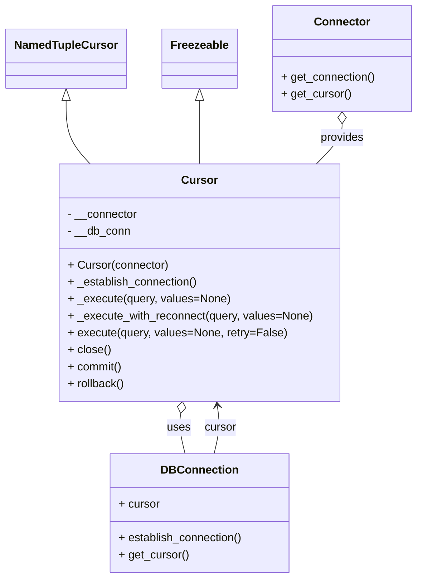
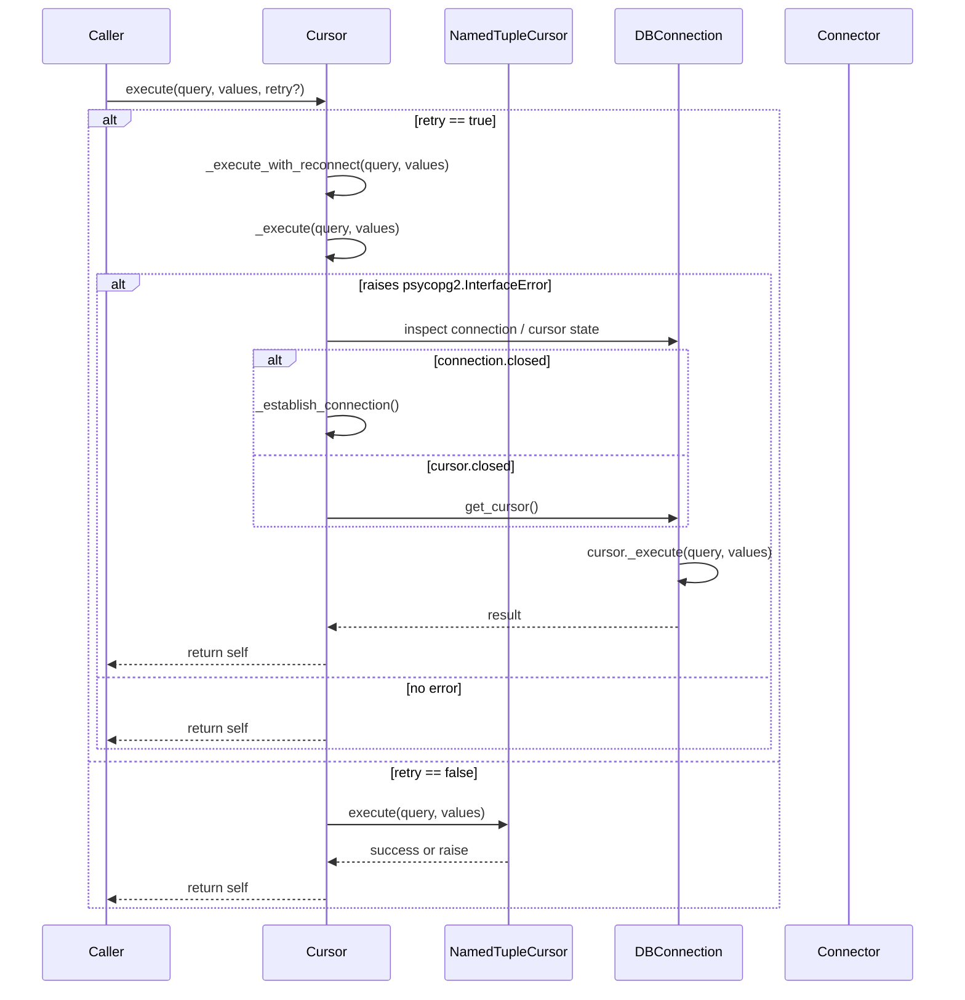

# Diagram: application_service/container_tracking_app_service/persistence/sql/postgresql/Cursor.py

> Auto-generated by Obscura crawlers

## Diagram 1

### SVG

<svg id="container" width="577.125" xmlns="http://www.w3.org/2000/svg" class="classDiagram" height="818" viewBox="0 0 577.125 818" role="graphics-document document" aria-roledescription="class"><g><defs><marker id="container_class-aggregationStart" class="marker aggregation class" refX="18" refY="7" markerWidth="190" markerHeight="240" orient="auto"><path d="M 18,7 L9,13 L1,7 L9,1 Z"></path></marker></defs><defs><marker id="container_class-aggregationEnd" class="marker aggregation class" refX="1" refY="7" markerWidth="20" markerHeight="28" orient="auto"><path d="M 18,7 L9,13 L1,7 L9,1 Z"></path></marker></defs><defs><marker id="container_class-extensionStart" class="marker extension class" refX="18" refY="7" markerWidth="190" markerHeight="240" orient="auto"><path d="M 1,7 L18,13 V 1 Z"></path></marker></defs><defs><marker id="container_class-extensionEnd" class="marker extension class" refX="1" refY="7" markerWidth="20" markerHeight="28" orient="auto"><path d="M 1,1 V 13 L18,7 Z"></path></marker></defs><defs><marker id="container_class-compositionStart" class="marker composition class" refX="18" refY="7" markerWidth="190" markerHeight="240" orient="auto"><path d="M 18,7 L9,13 L1,7 L9,1 Z"></path></marker></defs><defs><marker id="container_class-compositionEnd" class="marker composition class" refX="1" refY="7" markerWidth="20" markerHeight="28" orient="auto"><path d="M 18,7 L9,13 L1,7 L9,1 Z"></path></marker></defs><defs><marker id="container_class-dependencyStart" class="marker dependency class" refX="6" refY="7" markerWidth="190" markerHeight="240" orient="auto"><path d="M 5,7 L9,13 L1,7 L9,1 Z"></path></marker></defs><defs><marker id="container_class-dependencyEnd" class="marker dependency class" refX="13" refY="7" markerWidth="20" markerHeight="28" orient="auto"><path d="M 18,7 L9,13 L14,7 L9,1 Z"></path></marker></defs><defs><marker id="container_class-lollipopStart" class="marker lollipop class" refX="13" refY="7" markerWidth="190" markerHeight="240" orient="auto"><circle stroke="black" fill="transparent" cx="7" cy="7" r="6"></circle></marker></defs><defs><marker id="container_class-lollipopEnd" class="marker lollipop class" refX="1" refY="7" markerWidth="190" markerHeight="240" orient="auto"><circle stroke="black" fill="transparent" cx="7" cy="7" r="6"></circle></marker></defs><g class="root"><g class="clusters"></g><g class="edgePaths"><path d="M89.68,142.25L89.68,151.042C89.68,159.833,89.68,177.417,95.181,192.375C100.682,207.333,111.684,219.667,117.185,225.833L122.686,232" id="id_NamedTupleCursor_Cursor_1" class="edge-thickness-normal edge-pattern-solid relation" style=";;;" data-edge="true" data-et="edge" data-id="id_NamedTupleCursor_Cursor_1" data-points="W3sieCI6ODkuNjc5Njg3NSwieSI6MTI1fSx7IngiOjg5LjY3OTY4NzUsInkiOjE5NX0seyJ4IjoxMjIuNjg2Mzk0ODE3MDczMTYsInkiOjIzMn1d" marker-start="url(#container_class-extensionStart)"></path><path d="M272.555,142.25L272.555,151.042C272.555,159.833,272.555,177.417,272.555,192.375C272.555,207.333,272.555,219.667,272.555,225.833L272.555,232" id="id_Freezeable_Cursor_2" class="edge-thickness-normal edge-pattern-solid relation" style=";;;" data-edge="true" data-et="edge" data-id="id_Freezeable_Cursor_2" data-points="W3sieCI6MjcyLjU1NDY4NzUsInkiOjEyNX0seyJ4IjoyNzIuNTU0Njg3NSwieSI6MTk1fSx7IngiOjI3Mi41NTQ2ODc1LCJ5IjoyMzJ9XQ==" marker-start="url(#container_class-extensionStart)"></path><path d="M471.438,175.25L471.438,178.542C471.438,181.833,471.438,188.417,465.455,197.875C459.472,207.333,447.507,219.667,441.524,225.833L435.542,232" id="id_Connector_Cursor_3" class="edge-thickness-normal edge-pattern-solid relation" style=";;;" data-edge="true" data-et="edge" data-id="id_Connector_Cursor_3" data-points="W3sieCI6NDcxLjQzNzUsInkiOjE1OH0seyJ4Ijo0NzEuNDM3NSwieSI6MTk1fSx7IngiOjQzNS41NDE1Nzc3NDM5MDI0NSwieSI6MjMyfV0=" marker-start="url(#container_class-aggregationStart)"></path><path d="M245.76,585.072L245.279,588.393C244.798,591.715,243.837,598.357,244.868,607.845C245.9,617.333,248.925,629.667,250.438,635.833L251.951,642" id="id_Cursor_DBConnection_4" class="edge-thickness-normal edge-pattern-solid relation" style=";;;" data-edge="true" data-et="edge" data-id="id_Cursor_DBConnection_4" data-points="W3sieCI6MjQ4LjIzMTgyMTY0NjM0MTQ3LCJ5Ijo1Njh9LHsieCI6MjQyLjg3NSwieSI6NjA1fSx7IngiOjI1MS45NTA2MDY5MjE0ODc2LCJ5Ijo2NDJ9XQ==" marker-start="url(#container_class-aggregationStart)"></path><path d="M293.159,642L294.671,635.833C296.184,629.667,299.209,617.333,299.972,605.99C300.735,594.646,299.236,584.292,298.487,579.115L297.737,573.938" id="id_DBConnection_Cursor_5" class="edge-thickness-normal edge-pattern-solid relation" style=";;;" data-edge="true" data-et="edge" data-id="id_DBConnection_Cursor_5" data-points="W3sieCI6MjkzLjE1ODc2ODA3ODUxMjM3LCJ5Ijo2NDJ9LHsieCI6MzAyLjIzNDM3NSwieSI6NjA1fSx7IngiOjI5Ni44Nzc1NTMzNTM2NTg1LCJ5Ijo1Njh9XQ==" marker-end="url(#container_class-dependencyEnd)"></path></g><g class="edgeLabels"><g class="edgeLabel"><g class="label" data-id="id_NamedTupleCursor_Cursor_1" transform="translate(0, 0)"><foreignObject width="0" height="0">

</foreignObject></g></g><g class="edgeLabel"><g class="label" data-id="id_Freezeable_Cursor_2" transform="translate(0, 0)"><foreignObject width="0" height="0">

</foreignObject></g></g><g class="edgeLabel" transform="translate(471.4375, 195)"><g class="label" data-id="id_Connector_Cursor_3" transform="translate(-31.3125, -12)"><foreignObject width="62.625" height="24">

provides

</foreignObject></g></g><g class="edgeLabel" transform="translate(242.95969, 605.34528)"><g class="label" data-id="id_Cursor_DBConnection_4" transform="translate(-16.4921875, -12)"><foreignObject width="32.984375" height="24">

uses

</foreignObject></g></g><g class="edgeLabel" transform="translate(302.14968, 605.34528)"><g class="label" data-id="id_DBConnection_Cursor_5" transform="translate(-22.8671875, -12)"><foreignObject width="45.734375" height="24">

cursor

</foreignObject></g></g></g><g class="nodes"><g class="node default" id="classId-NamedTupleCursor-0" transform="translate(89.6796875, 83)"><g class="basic label-container"><path d="M-81.6796875 -42 L81.6796875 -42 L81.6796875 42 L-81.6796875 42" stroke="none" stroke-width="0" fill="#ECECFF" style=""></path><path d="M-81.6796875 -42 C-46.320504758412014 -42, -10.961322016824028 -42, 81.6796875 -42 M-81.6796875 -42 C-25.9657631834761 -42, 29.7481611330478 -42, 81.6796875 -42 M81.6796875 -42 C81.6796875 -21.336802886362005, 81.6796875 -0.6736057727240095, 81.6796875 42 M81.6796875 -42 C81.6796875 -21.640086304347125, 81.6796875 -1.2801726086942509, 81.6796875 42 M81.6796875 42 C37.826148927740874 42, -6.0273896445182515 42, -81.6796875 42 M81.6796875 42 C28.38198600109974 42, -24.91571549780052 42, -81.6796875 42 M-81.6796875 42 C-81.6796875 9.047617451486538, -81.6796875 -23.904765097026925, -81.6796875 -42 M-81.6796875 42 C-81.6796875 19.329029626890446, -81.6796875 -3.341940746219109, -81.6796875 -42" stroke="#9370DB" stroke-width="1.3" fill="none" stroke-dasharray="0 0" style=""></path></g><g class="annotation-group text" transform="translate(0, -18)"></g><g class="label-group text" transform="translate(-69.6796875, -18)"><g class="label" style="font-weight: bolder" transform="translate(0,-12)"><foreignObject width="139.359375" height="24">

NamedTupleCursor

</foreignObject></g></g><g class="members-group text" transform="translate(-69.6796875, 30)"></g><g class="methods-group text" transform="translate(-69.6796875, 60)"></g><g class="divider" style=""><path d="M-81.6796875 6 C-33.152147913062414 6, 15.375391673875171 6, 81.6796875 6 M-81.6796875 6 C-44.02567396736005 6, -6.3716604347200985 6, 81.6796875 6" stroke="#9370DB" stroke-width="1.3" fill="none" stroke-dasharray="0 0" style=""></path></g><g class="divider" style=""><path d="M-81.6796875 24 C-23.753846621702998 24, 34.171994256594004 24, 81.6796875 24 M-81.6796875 24 C-41.279150273244184 24, -0.8786130464883684 24, 81.6796875 24" stroke="#9370DB" stroke-width="1.3" fill="none" stroke-dasharray="0 0" style=""></path></g></g><g class="node default" id="classId-Freezeable-1" transform="translate(272.5546875, 83)"><g class="basic label-container"><path d="M-51.1953125 -42 L51.1953125 -42 L51.1953125 42 L-51.1953125 42" stroke="none" stroke-width="0" fill="#ECECFF" style=""></path><path d="M-51.1953125 -42 C-17.489986055099365 -42, 16.21534038980127 -42, 51.1953125 -42 M-51.1953125 -42 C-29.74647456190383 -42, -8.297636623807662 -42, 51.1953125 -42 M51.1953125 -42 C51.1953125 -8.40454912611375, 51.1953125 25.1909017477725, 51.1953125 42 M51.1953125 -42 C51.1953125 -17.432434766519002, 51.1953125 7.135130466961996, 51.1953125 42 M51.1953125 42 C30.11274358435775 42, 9.030174668715503 42, -51.1953125 42 M51.1953125 42 C13.709526839929453 42, -23.776258820141095 42, -51.1953125 42 M-51.1953125 42 C-51.1953125 8.948729431057359, -51.1953125 -24.102541137885282, -51.1953125 -42 M-51.1953125 42 C-51.1953125 18.85362429961735, -51.1953125 -4.292751400765297, -51.1953125 -42" stroke="#9370DB" stroke-width="1.3" fill="none" stroke-dasharray="0 0" style=""></path></g><g class="annotation-group text" transform="translate(0, -18)"></g><g class="label-group text" transform="translate(-39.1953125, -18)"><g class="label" style="font-weight: bolder" transform="translate(0,-12)"><foreignObject width="78.390625" height="24">

Freezeable

</foreignObject></g></g><g class="members-group text" transform="translate(-39.1953125, 30)"></g><g class="methods-group text" transform="translate(-39.1953125, 60)"></g><g class="divider" style=""><path d="M-51.1953125 6 C-15.833875304385224 6, 19.527561891229553 6, 51.1953125 6 M-51.1953125 6 C-27.8986337817823 6, -4.601955063564603 6, 51.1953125 6" stroke="#9370DB" stroke-width="1.3" fill="none" stroke-dasharray="0 0" style=""></path></g><g class="divider" style=""><path d="M-51.1953125 24 C-22.497135788611658 24, 6.201040922776684 24, 51.1953125 24 M-51.1953125 24 C-23.14962749529615 24, 4.896057509407697 24, 51.1953125 24" stroke="#9370DB" stroke-width="1.3" fill="none" stroke-dasharray="0 0" style=""></path></g></g><g class="node default" id="classId-Connector-2" transform="translate(471.4375, 83)"><g class="basic label-container"><path d="M-97.6875 -75 L97.6875 -75 L97.6875 75 L-97.6875 75" stroke="none" stroke-width="0" fill="#ECECFF" style=""></path><path d="M-97.6875 -75 C-28.198525507587576 -75, 41.29044898482485 -75, 97.6875 -75 M-97.6875 -75 C-21.192786564642844 -75, 55.30192687071431 -75, 97.6875 -75 M97.6875 -75 C97.6875 -31.123007479568187, 97.6875 12.753985040863625, 97.6875 75 M97.6875 -75 C97.6875 -40.088348331149675, 97.6875 -5.176696662299349, 97.6875 75 M97.6875 75 C54.13397144064327 75, 10.580442881286544 75, -97.6875 75 M97.6875 75 C53.041126053991505 75, 8.39475210798301 75, -97.6875 75 M-97.6875 75 C-97.6875 34.53527550207315, -97.6875 -5.929448995853704, -97.6875 -75 M-97.6875 75 C-97.6875 39.799494333252824, -97.6875 4.598988666505647, -97.6875 -75" stroke="#9370DB" stroke-width="1.3" fill="none" stroke-dasharray="0 0" style=""></path></g><g class="annotation-group text" transform="translate(0, -51)"></g><g class="label-group text" transform="translate(-37.421875, -51)"><g class="label" style="font-weight: bolder" transform="translate(0,-12)"><foreignObject width="74.84375" height="24">

Connector

</foreignObject></g></g><g class="members-group text" transform="translate(-85.6875, -3)"></g><g class="methods-group text" transform="translate(-85.6875, 27)"><g class="label" style="" transform="translate(0,-12)"><foreignObject width="133.953125" height="24">

+ get_connection()

</foreignObject></g><g class="label" style="" transform="translate(0,12)"><foreignObject width="98.890625" height="24">

+ get_cursor()

</foreignObject></g></g><g class="divider" style=""><path d="M-97.6875 -27 C-25.65623339944152 -27, 46.37503320111696 -27, 97.6875 -27 M-97.6875 -27 C-58.20942656776952 -27, -18.731353135539038 -27, 97.6875 -27" stroke="#9370DB" stroke-width="1.3" fill="none" stroke-dasharray="0 0" style=""></path></g><g class="divider" style=""><path d="M-97.6875 -3 C-20.123414259391723 -3, 57.440671481216555 -3, 97.6875 -3 M-97.6875 -3 C-41.41392725927027 -3, 14.859645481459467 -3, 97.6875 -3" stroke="#9370DB" stroke-width="1.3" fill="none" stroke-dasharray="0 0" style=""></path></g></g><g class="node default" id="classId-DBConnection-3" transform="translate(272.5546875, 726)"><g class="basic label-container"><path d="M-126.4453125 -84 L126.4453125 -84 L126.4453125 84 L-126.4453125 84" stroke="none" stroke-width="0" fill="#ECECFF" style=""></path><path d="M-126.4453125 -84 C-36.19438247433777 -84, 54.056547551324456 -84, 126.4453125 -84 M-126.4453125 -84 C-47.542975015254626 -84, 31.359362469490748 -84, 126.4453125 -84 M126.4453125 -84 C126.4453125 -33.54520163617383, 126.4453125 16.909596727652342, 126.4453125 84 M126.4453125 -84 C126.4453125 -49.92823662830538, 126.4453125 -15.856473256610755, 126.4453125 84 M126.4453125 84 C61.437065330479896 84, -3.5711818390402073 84, -126.4453125 84 M126.4453125 84 C47.55869577831075 84, -31.3279209433785 84, -126.4453125 84 M-126.4453125 84 C-126.4453125 33.05804523823844, -126.4453125 -17.883909523523116, -126.4453125 -84 M-126.4453125 84 C-126.4453125 44.92331301600841, -126.4453125 5.846626032016815, -126.4453125 -84" stroke="#9370DB" stroke-width="1.3" fill="none" stroke-dasharray="0 0" style=""></path></g><g class="annotation-group text" transform="translate(0, -60)"></g><g class="label-group text" transform="translate(-51.375, -60)"><g class="label" style="font-weight: bolder" transform="translate(0,-12)"><foreignObject width="102.75" height="24">

DBConnection

</foreignObject></g></g><g class="members-group text" transform="translate(-114.4453125, -12)"><g class="label" style="" transform="translate(0,-12)"><foreignObject width="57.953125" height="24">

+ cursor

</foreignObject></g></g><g class="methods-group text" transform="translate(-114.4453125, 36)"><g class="label" style="" transform="translate(0,-12)"><foreignObject width="177.515625" height="24">

+ establish_connection()

</foreignObject></g><g class="label" style="" transform="translate(0,12)"><foreignObject width="98.890625" height="24">

+ get_cursor()

</foreignObject></g></g><g class="divider" style=""><path d="M-126.4453125 -36 C-60.741915157218514 -36, 4.961482185562971 -36, 126.4453125 -36 M-126.4453125 -36 C-32.499780205567575 -36, 61.44575208886485 -36, 126.4453125 -36" stroke="#9370DB" stroke-width="1.3" fill="none" stroke-dasharray="0 0" style=""></path></g><g class="divider" style=""><path d="M-126.4453125 12 C-74.98156410975542 12, -23.51781571951085 12, 126.4453125 12 M-126.4453125 12 C-64.56193331559844 12, -2.6785541311968757 12, 126.4453125 12" stroke="#9370DB" stroke-width="1.3" fill="none" stroke-dasharray="0 0" style=""></path></g></g><g class="node default" id="classId-Cursor-4" transform="translate(272.5546875, 400)"><g class="basic label-container"><path d="M-197.703125 -168 L197.703125 -168 L197.703125 168 L-197.703125 168" stroke="none" stroke-width="0" fill="#ECECFF" style=""></path><path d="M-197.703125 -168 C-68.39537297550271 -168, 60.91237904899458 -168, 197.703125 -168 M-197.703125 -168 C-89.14534433400783 -168, 19.41243633198434 -168, 197.703125 -168 M197.703125 -168 C197.703125 -74.3709540613818, 197.703125 19.25809187723641, 197.703125 168 M197.703125 -168 C197.703125 -66.15672186335101, 197.703125 35.68655627329798, 197.703125 168 M197.703125 168 C61.30771300082927 168, -75.08769899834147 168, -197.703125 168 M197.703125 168 C118.43171805801877 168, 39.16031111603755 168, -197.703125 168 M-197.703125 168 C-197.703125 58.47571880458635, -197.703125 -51.0485623908273, -197.703125 -168 M-197.703125 168 C-197.703125 96.88921709416293, -197.703125 25.77843418832586, -197.703125 -168" stroke="#9370DB" stroke-width="1.3" fill="none" stroke-dasharray="0 0" style=""></path></g><g class="annotation-group text" transform="translate(0, -144)"></g><g class="label-group text" transform="translate(-23.90625, -144)"><g class="label" style="font-weight: bolder" transform="translate(0,-12)"><foreignObject width="47.8125" height="24">

Cursor

</foreignObject></g></g><g class="members-group text" transform="translate(-185.703125, -96)"><g class="label" style="" transform="translate(0,-12)"><foreignObject width="99.703125" height="24">

- __connector

</foreignObject></g><g class="label" style="" transform="translate(0,12)"><foreignObject width="89.03125" height="24">

- __db_conn

</foreignObject></g></g><g class="methods-group text" transform="translate(-185.703125, -24)"><g class="label" style="" transform="translate(0,-12)"><foreignObject width="142.375" height="24">

+ Cursor(connector)

</foreignObject></g><g class="label" style="" transform="translate(0,12)"><foreignObject width="185.515625" height="24">

+ _establish_connection()

</foreignObject></g><g class="label" style="" transform="translate(0,36)"><foreignObject width="228.375" height="24">

+ _execute(query, values=None)

</foreignObject></g><g class="label" style="" transform="translate(0,60)"><foreignObject width="347.5" height="24">

+ _execute_with_reconnect(query, values=None)

</foreignObject></g><g class="label" style="" transform="translate(0,84)"><foreignObject width="306.859375" height="24">

+ execute(query, values=None, retry=False)

</foreignObject></g><g class="label" style="" transform="translate(0,108)"><foreignObject width="60.390625" height="24">

+ close()

</foreignObject></g><g class="label" style="" transform="translate(0,132)"><foreignObject width="76.984375" height="24">

+ commit()

</foreignObject></g><g class="label" style="" transform="translate(0,156)"><foreignObject width="80.90625" height="24">

+ rollback()

</foreignObject></g></g><g class="divider" style=""><path d="M-197.703125 -120 C-93.0657584354276 -120, 11.571608129144806 -120, 197.703125 -120 M-197.703125 -120 C-53.59228057909999 -120, 90.51856384180002 -120, 197.703125 -120" stroke="#9370DB" stroke-width="1.3" fill="none" stroke-dasharray="0 0" style=""></path></g><g class="divider" style=""><path d="M-197.703125 -48 C-50.93615717808032 -48, 95.83081064383936 -48, 197.703125 -48 M-197.703125 -48 C-118.55365366614488 -48, -39.404182332289764 -48, 197.703125 -48" stroke="#9370DB" stroke-width="1.3" fill="none" stroke-dasharray="0 0" style=""></path></g></g></g></g></g></svg>

## Diagram 2

### SVG

<svg id="container" width="1167.5" xmlns="http://www.w3.org/2000/svg" height="1215" viewBox="-50 -10 1167.5 1215" role="graphics-document document" aria-roledescription="sequence"><g><rect x="917.5" y="1129" fill="#eaeaea" stroke="#666" width="150" height="65" name="Connector" rx="3" ry="3" class="actor actor-bottom"></rect><text x="992.5" y="1161.5" dominant-baseline="central" alignment-baseline="central" class="actor actor-box" style="text-anchor: middle; font-size: 16px; font-weight: 400;"><tspan x="992.5" dy="0">Connector</tspan></text></g><g><rect x="717.5" y="1129" fill="#eaeaea" stroke="#666" width="150" height="65" name="DBConnection" rx="3" ry="3" class="actor actor-bottom"></rect><text x="792.5" y="1161.5" dominant-baseline="central" alignment-baseline="central" class="actor actor-box" style="text-anchor: middle; font-size: 16px; font-weight: 400;"><tspan x="792.5" dy="0">DBConnection</tspan></text></g><g><rect x="508.5" y="1129" fill="#eaeaea" stroke="#666" width="159" height="65" name="NamedTupleCursor" rx="3" ry="3" class="actor actor-bottom"></rect><text x="588" y="1161.5" dominant-baseline="central" alignment-baseline="central" class="actor actor-box" style="text-anchor: middle; font-size: 16px; font-weight: 400;"><tspan x="588" dy="0">NamedTupleCursor</tspan></text></g><g><rect x="281" y="1129" fill="#eaeaea" stroke="#666" width="150" height="65" name="Cursor" rx="3" ry="3" class="actor actor-bottom"></rect><text x="356" y="1161.5" dominant-baseline="central" alignment-baseline="central" class="actor actor-box" style="text-anchor: middle; font-size: 16px; font-weight: 400;"><tspan x="356" dy="0">Cursor</tspan></text></g><g><rect x="0" y="1129" fill="#eaeaea" stroke="#666" width="150" height="65" name="Caller" rx="3" ry="3" class="actor actor-bottom"></rect><text x="75" y="1161.5" dominant-baseline="central" alignment-baseline="central" class="actor actor-box" style="text-anchor: middle; font-size: 16px; font-weight: 400;"><tspan x="75" dy="0">Caller</tspan></text></g><g><line id="actor4" x1="992.5" y1="65" x2="992.5" y2="1129" class="actor-line 200" stroke-width="0.5px" stroke="#999" name="Connector"></line><g id="root-4"><rect x="917.5" y="0" fill="#eaeaea" stroke="#666" width="150" height="65" name="Connector" rx="3" ry="3" class="actor actor-top"></rect><text x="992.5" y="32.5" dominant-baseline="central" alignment-baseline="central" class="actor actor-box" style="text-anchor: middle; font-size: 16px; font-weight: 400;"><tspan x="992.5" dy="0">Connector</tspan></text></g></g><g><line id="actor3" x1="792.5" y1="65" x2="792.5" y2="1129" class="actor-line 200" stroke-width="0.5px" stroke="#999" name="DBConnection"></line><g id="root-3"><rect x="717.5" y="0" fill="#eaeaea" stroke="#666" width="150" height="65" name="DBConnection" rx="3" ry="3" class="actor actor-top"></rect><text x="792.5" y="32.5" dominant-baseline="central" alignment-baseline="central" class="actor actor-box" style="text-anchor: middle; font-size: 16px; font-weight: 400;"><tspan x="792.5" dy="0">DBConnection</tspan></text></g></g><g><line id="actor2" x1="588" y1="65" x2="588" y2="1129" class="actor-line 200" stroke-width="0.5px" stroke="#999" name="NamedTupleCursor"></line><g id="root-2"><rect x="508.5" y="0" fill="#eaeaea" stroke="#666" width="159" height="65" name="NamedTupleCursor" rx="3" ry="3" class="actor actor-top"></rect><text x="588" y="32.5" dominant-baseline="central" alignment-baseline="central" class="actor actor-box" style="text-anchor: middle; font-size: 16px; font-weight: 400;"><tspan x="588" dy="0">NamedTupleCursor</tspan></text></g></g><g><line id="actor1" x1="356" y1="65" x2="356" y2="1129" class="actor-line 200" stroke-width="0.5px" stroke="#999" name="Cursor"></line><g id="root-1"><rect x="281" y="0" fill="#eaeaea" stroke="#666" width="150" height="65" name="Cursor" rx="3" ry="3" class="actor actor-top"></rect><text x="356" y="32.5" dominant-baseline="central" alignment-baseline="central" class="actor actor-box" style="text-anchor: middle; font-size: 16px; font-weight: 400;"><tspan x="356" dy="0">Cursor</tspan></text></g></g><g><line id="actor0" x1="75" y1="65" x2="75" y2="1129" class="actor-line 200" stroke-width="0.5px" stroke="#999" name="Caller"></line><g id="root-0"><rect x="0" y="0" fill="#eaeaea" stroke="#666" width="150" height="65" name="Caller" rx="3" ry="3" class="actor actor-top"></rect><text x="75" y="32.5" dominant-baseline="central" alignment-baseline="central" class="actor actor-box" style="text-anchor: middle; font-size: 16px; font-weight: 400;"><tspan x="75" dy="0">Caller</tspan></text></g></g><g></g><defs><symbol id="computer" width="24" height="24"><path transform="scale(.5)" d="M2 2v13h20v-13h-20zm18 11h-16v-9h16v9zm-10.228 6l.466-1h3.524l.467 1h-4.457zm14.228 3h-24l2-6h2.104l-1.33 4h18.45l-1.297-4h2.073l2 6zm-5-10h-14v-7h14v7z"></path></symbol></defs><defs><symbol id="database" fill-rule="evenodd" clip-rule="evenodd"><path transform="scale(.5)" d="M12.258.001l.256.004.255.005.253.008.251.01.249.012.247.015.246.016.242.019.241.02.239.023.236.024.233.027.231.028.229.031.225.032.223.034.22.036.217.038.214.04.211.041.208.043.205.045.201.046.198.048.194.05.191.051.187.053.183.054.18.056.175.057.172.059.168.06.163.061.16.063.155.064.15.066.074.033.073.033.071.034.07.034.069.035.068.035.067.035.066.035.064.036.064.036.062.036.06.036.06.037.058.037.058.037.055.038.055.038.053.038.052.038.051.039.05.039.048.039.047.039.045.04.044.04.043.04.041.04.04.041.039.041.037.041.036.041.034.041.033.042.032.042.03.042.029.042.027.042.026.043.024.043.023.043.021.043.02.043.018.044.017.043.015.044.013.044.012.044.011.045.009.044.007.045.006.045.004.045.002.045.001.045v17l-.001.045-.002.045-.004.045-.006.045-.007.045-.009.044-.011.045-.012.044-.013.044-.015.044-.017.043-.018.044-.02.043-.021.043-.023.043-.024.043-.026.043-.027.042-.029.042-.03.042-.032.042-.033.042-.034.041-.036.041-.037.041-.039.041-.04.041-.041.04-.043.04-.044.04-.045.04-.047.039-.048.039-.05.039-.051.039-.052.038-.053.038-.055.038-.055.038-.058.037-.058.037-.06.037-.06.036-.062.036-.064.036-.064.036-.066.035-.067.035-.068.035-.069.035-.07.034-.071.034-.073.033-.074.033-.15.066-.155.064-.16.063-.163.061-.168.06-.172.059-.175.057-.18.056-.183.054-.187.053-.191.051-.194.05-.198.048-.201.046-.205.045-.208.043-.211.041-.214.04-.217.038-.22.036-.223.034-.225.032-.229.031-.231.028-.233.027-.236.024-.239.023-.241.02-.242.019-.246.016-.247.015-.249.012-.251.01-.253.008-.255.005-.256.004-.258.001-.258-.001-.256-.004-.255-.005-.253-.008-.251-.01-.249-.012-.247-.015-.245-.016-.243-.019-.241-.02-.238-.023-.236-.024-.234-.027-.231-.028-.228-.031-.226-.032-.223-.034-.22-.036-.217-.038-.214-.04-.211-.041-.208-.043-.204-.045-.201-.046-.198-.048-.195-.05-.19-.051-.187-.053-.184-.054-.179-.056-.176-.057-.172-.059-.167-.06-.164-.061-.159-.063-.155-.064-.151-.066-.074-.033-.072-.033-.072-.034-.07-.034-.069-.035-.068-.035-.067-.035-.066-.035-.064-.036-.063-.036-.062-.036-.061-.036-.06-.037-.058-.037-.057-.037-.056-.038-.055-.038-.053-.038-.052-.038-.051-.039-.049-.039-.049-.039-.046-.039-.046-.04-.044-.04-.043-.04-.041-.04-.04-.041-.039-.041-.037-.041-.036-.041-.034-.041-.033-.042-.032-.042-.03-.042-.029-.042-.027-.042-.026-.043-.024-.043-.023-.043-.021-.043-.02-.043-.018-.044-.017-.043-.015-.044-.013-.044-.012-.044-.011-.045-.009-.044-.007-.045-.006-.045-.004-.045-.002-.045-.001-.045v-17l.001-.045.002-.045.004-.045.006-.045.007-.045.009-.044.011-.045.012-.044.013-.044.015-.044.017-.043.018-.044.02-.043.021-.043.023-.043.024-.043.026-.043.027-.042.029-.042.03-.042.032-.042.033-.042.034-.041.036-.041.037-.041.039-.041.04-.041.041-.04.043-.04.044-.04.046-.04.046-.039.049-.039.049-.039.051-.039.052-.038.053-.038.055-.038.056-.038.057-.037.058-.037.06-.037.061-.036.062-.036.063-.036.064-.036.066-.035.067-.035.068-.035.069-.035.07-.034.072-.034.072-.033.074-.033.151-.066.155-.064.159-.063.164-.061.167-.06.172-.059.176-.057.179-.056.184-.054.187-.053.19-.051.195-.05.198-.048.201-.046.204-.045.208-.043.211-.041.214-.04.217-.038.22-.036.223-.034.226-.032.228-.031.231-.028.234-.027.236-.024.238-.023.241-.02.243-.019.245-.016.247-.015.249-.012.251-.01.253-.008.255-.005.256-.004.258-.001.258.001zm-9.258 20.499v.01l.001.021.003.021.004.022.005.021.006.022.007.022.009.023.01.022.011.023.012.023.013.023.015.023.016.024.017.023.018.024.019.024.021.024.022.025.023.024.024.025.052.049.056.05.061.051.066.051.07.051.075.051.079.052.084.052.088.052.092.052.097.052.102.051.105.052.11.052.114.051.119.051.123.051.127.05.131.05.135.05.139.048.144.049.147.047.152.047.155.047.16.045.163.045.167.043.171.043.176.041.178.041.183.039.187.039.19.037.194.035.197.035.202.033.204.031.209.03.212.029.216.027.219.025.222.024.226.021.23.02.233.018.236.016.24.015.243.012.246.01.249.008.253.005.256.004.259.001.26-.001.257-.004.254-.005.25-.008.247-.011.244-.012.241-.014.237-.016.233-.018.231-.021.226-.021.224-.024.22-.026.216-.027.212-.028.21-.031.205-.031.202-.034.198-.034.194-.036.191-.037.187-.039.183-.04.179-.04.175-.042.172-.043.168-.044.163-.045.16-.046.155-.046.152-.047.148-.048.143-.049.139-.049.136-.05.131-.05.126-.05.123-.051.118-.052.114-.051.11-.052.106-.052.101-.052.096-.052.092-.052.088-.053.083-.051.079-.052.074-.052.07-.051.065-.051.06-.051.056-.05.051-.05.023-.024.023-.025.021-.024.02-.024.019-.024.018-.024.017-.024.015-.023.014-.024.013-.023.012-.023.01-.023.01-.022.008-.022.006-.022.006-.022.004-.022.004-.021.001-.021.001-.021v-4.127l-.077.055-.08.053-.083.054-.085.053-.087.052-.09.052-.093.051-.095.05-.097.05-.1.049-.102.049-.105.048-.106.047-.109.047-.111.046-.114.045-.115.045-.118.044-.12.043-.122.042-.124.042-.126.041-.128.04-.13.04-.132.038-.134.038-.135.037-.138.037-.139.035-.142.035-.143.034-.144.033-.147.032-.148.031-.15.03-.151.03-.153.029-.154.027-.156.027-.158.026-.159.025-.161.024-.162.023-.163.022-.165.021-.166.02-.167.019-.169.018-.169.017-.171.016-.173.015-.173.014-.175.013-.175.012-.177.011-.178.01-.179.008-.179.008-.181.006-.182.005-.182.004-.184.003-.184.002h-.37l-.184-.002-.184-.003-.182-.004-.182-.005-.181-.006-.179-.008-.179-.008-.178-.01-.176-.011-.176-.012-.175-.013-.173-.014-.172-.015-.171-.016-.17-.017-.169-.018-.167-.019-.166-.02-.165-.021-.163-.022-.162-.023-.161-.024-.159-.025-.157-.026-.156-.027-.155-.027-.153-.029-.151-.03-.15-.03-.148-.031-.146-.032-.145-.033-.143-.034-.141-.035-.14-.035-.137-.037-.136-.037-.134-.038-.132-.038-.13-.04-.128-.04-.126-.041-.124-.042-.122-.042-.12-.044-.117-.043-.116-.045-.113-.045-.112-.046-.109-.047-.106-.047-.105-.048-.102-.049-.1-.049-.097-.05-.095-.05-.093-.052-.09-.051-.087-.052-.085-.053-.083-.054-.08-.054-.077-.054v4.127zm0-5.654v.011l.001.021.003.021.004.021.005.022.006.022.007.022.009.022.01.022.011.023.012.023.013.023.015.024.016.023.017.024.018.024.019.024.021.024.022.024.023.025.024.024.052.05.056.05.061.05.066.051.07.051.075.052.079.051.084.052.088.052.092.052.097.052.102.052.105.052.11.051.114.051.119.052.123.05.127.051.131.05.135.049.139.049.144.048.147.048.152.047.155.046.16.045.163.045.167.044.171.042.176.042.178.04.183.04.187.038.19.037.194.036.197.034.202.033.204.032.209.03.212.028.216.027.219.025.222.024.226.022.23.02.233.018.236.016.24.014.243.012.246.01.249.008.253.006.256.003.259.001.26-.001.257-.003.254-.006.25-.008.247-.01.244-.012.241-.015.237-.016.233-.018.231-.02.226-.022.224-.024.22-.025.216-.027.212-.029.21-.03.205-.032.202-.033.198-.035.194-.036.191-.037.187-.039.183-.039.179-.041.175-.042.172-.043.168-.044.163-.045.16-.045.155-.047.152-.047.148-.048.143-.048.139-.05.136-.049.131-.05.126-.051.123-.051.118-.051.114-.052.11-.052.106-.052.101-.052.096-.052.092-.052.088-.052.083-.052.079-.052.074-.051.07-.052.065-.051.06-.05.056-.051.051-.049.023-.025.023-.024.021-.025.02-.024.019-.024.018-.024.017-.024.015-.023.014-.023.013-.024.012-.022.01-.023.01-.023.008-.022.006-.022.006-.022.004-.021.004-.022.001-.021.001-.021v-4.139l-.077.054-.08.054-.083.054-.085.052-.087.053-.09.051-.093.051-.095.051-.097.05-.1.049-.102.049-.105.048-.106.047-.109.047-.111.046-.114.045-.115.044-.118.044-.12.044-.122.042-.124.042-.126.041-.128.04-.13.039-.132.039-.134.038-.135.037-.138.036-.139.036-.142.035-.143.033-.144.033-.147.033-.148.031-.15.03-.151.03-.153.028-.154.028-.156.027-.158.026-.159.025-.161.024-.162.023-.163.022-.165.021-.166.02-.167.019-.169.018-.169.017-.171.016-.173.015-.173.014-.175.013-.175.012-.177.011-.178.009-.179.009-.179.007-.181.007-.182.005-.182.004-.184.003-.184.002h-.37l-.184-.002-.184-.003-.182-.004-.182-.005-.181-.007-.179-.007-.179-.009-.178-.009-.176-.011-.176-.012-.175-.013-.173-.014-.172-.015-.171-.016-.17-.017-.169-.018-.167-.019-.166-.02-.165-.021-.163-.022-.162-.023-.161-.024-.159-.025-.157-.026-.156-.027-.155-.028-.153-.028-.151-.03-.15-.03-.148-.031-.146-.033-.145-.033-.143-.033-.141-.035-.14-.036-.137-.036-.136-.037-.134-.038-.132-.039-.13-.039-.128-.04-.126-.041-.124-.042-.122-.043-.12-.043-.117-.044-.116-.044-.113-.046-.112-.046-.109-.046-.106-.047-.105-.048-.102-.049-.1-.049-.097-.05-.095-.051-.093-.051-.09-.051-.087-.053-.085-.052-.083-.054-.08-.054-.077-.054v4.139zm0-5.666v.011l.001.02.003.022.004.021.005.022.006.021.007.022.009.023.01.022.011.023.012.023.013.023.015.023.016.024.017.024.018.023.019.024.021.025.022.024.023.024.024.025.052.05.056.05.061.05.066.051.07.051.075.052.079.051.084.052.088.052.092.052.097.052.102.052.105.051.11.052.114.051.119.051.123.051.127.05.131.05.135.05.139.049.144.048.147.048.152.047.155.046.16.045.163.045.167.043.171.043.176.042.178.04.183.04.187.038.19.037.194.036.197.034.202.033.204.032.209.03.212.028.216.027.219.025.222.024.226.021.23.02.233.018.236.017.24.014.243.012.246.01.249.008.253.006.256.003.259.001.26-.001.257-.003.254-.006.25-.008.247-.01.244-.013.241-.014.237-.016.233-.018.231-.02.226-.022.224-.024.22-.025.216-.027.212-.029.21-.03.205-.032.202-.033.198-.035.194-.036.191-.037.187-.039.183-.039.179-.041.175-.042.172-.043.168-.044.163-.045.16-.045.155-.047.152-.047.148-.048.143-.049.139-.049.136-.049.131-.051.126-.05.123-.051.118-.052.114-.051.11-.052.106-.052.101-.052.096-.052.092-.052.088-.052.083-.052.079-.052.074-.052.07-.051.065-.051.06-.051.056-.05.051-.049.023-.025.023-.025.021-.024.02-.024.019-.024.018-.024.017-.024.015-.023.014-.024.013-.023.012-.023.01-.022.01-.023.008-.022.006-.022.006-.022.004-.022.004-.021.001-.021.001-.021v-4.153l-.077.054-.08.054-.083.053-.085.053-.087.053-.09.051-.093.051-.095.051-.097.05-.1.049-.102.048-.105.048-.106.048-.109.046-.111.046-.114.046-.115.044-.118.044-.12.043-.122.043-.124.042-.126.041-.128.04-.13.039-.132.039-.134.038-.135.037-.138.036-.139.036-.142.034-.143.034-.144.033-.147.032-.148.032-.15.03-.151.03-.153.028-.154.028-.156.027-.158.026-.159.024-.161.024-.162.023-.163.023-.165.021-.166.02-.167.019-.169.018-.169.017-.171.016-.173.015-.173.014-.175.013-.175.012-.177.01-.178.01-.179.009-.179.007-.181.006-.182.006-.182.004-.184.003-.184.001-.185.001-.185-.001-.184-.001-.184-.003-.182-.004-.182-.006-.181-.006-.179-.007-.179-.009-.178-.01-.176-.01-.176-.012-.175-.013-.173-.014-.172-.015-.171-.016-.17-.017-.169-.018-.167-.019-.166-.02-.165-.021-.163-.023-.162-.023-.161-.024-.159-.024-.157-.026-.156-.027-.155-.028-.153-.028-.151-.03-.15-.03-.148-.032-.146-.032-.145-.033-.143-.034-.141-.034-.14-.036-.137-.036-.136-.037-.134-.038-.132-.039-.13-.039-.128-.041-.126-.041-.124-.041-.122-.043-.12-.043-.117-.044-.116-.044-.113-.046-.112-.046-.109-.046-.106-.048-.105-.048-.102-.048-.1-.05-.097-.049-.095-.051-.093-.051-.09-.052-.087-.052-.085-.053-.083-.053-.08-.054-.077-.054v4.153zm8.74-8.179l-.257.004-.254.005-.25.008-.247.011-.244.012-.241.014-.237.016-.233.018-.231.021-.226.022-.224.023-.22.026-.216.027-.212.028-.21.031-.205.032-.202.033-.198.034-.194.036-.191.038-.187.038-.183.04-.179.041-.175.042-.172.043-.168.043-.163.045-.16.046-.155.046-.152.048-.148.048-.143.048-.139.049-.136.05-.131.05-.126.051-.123.051-.118.051-.114.052-.11.052-.106.052-.101.052-.096.052-.092.052-.088.052-.083.052-.079.052-.074.051-.07.052-.065.051-.06.05-.056.05-.051.05-.023.025-.023.024-.021.024-.02.025-.019.024-.018.024-.017.023-.015.024-.014.023-.013.023-.012.023-.01.023-.01.022-.008.022-.006.023-.006.021-.004.022-.004.021-.001.021-.001.021.001.021.001.021.004.021.004.022.006.021.006.023.008.022.01.022.01.023.012.023.013.023.014.023.015.024.017.023.018.024.019.024.02.025.021.024.023.024.023.025.051.05.056.05.06.05.065.051.07.052.074.051.079.052.083.052.088.052.092.052.096.052.101.052.106.052.11.052.114.052.118.051.123.051.126.051.131.05.136.05.139.049.143.048.148.048.152.048.155.046.16.046.163.045.168.043.172.043.175.042.179.041.183.04.187.038.191.038.194.036.198.034.202.033.205.032.21.031.212.028.216.027.22.026.224.023.226.022.231.021.233.018.237.016.241.014.244.012.247.011.25.008.254.005.257.004.26.001.26-.001.257-.004.254-.005.25-.008.247-.011.244-.012.241-.014.237-.016.233-.018.231-.021.226-.022.224-.023.22-.026.216-.027.212-.028.21-.031.205-.032.202-.033.198-.034.194-.036.191-.038.187-.038.183-.04.179-.041.175-.042.172-.043.168-.043.163-.045.16-.046.155-.046.152-.048.148-.048.143-.048.139-.049.136-.05.131-.05.126-.051.123-.051.118-.051.114-.052.11-.052.106-.052.101-.052.096-.052.092-.052.088-.052.083-.052.079-.052.074-.051.07-.052.065-.051.06-.05.056-.05.051-.05.023-.025.023-.024.021-.024.02-.025.019-.024.018-.024.017-.023.015-.024.014-.023.013-.023.012-.023.01-.023.01-.022.008-.022.006-.023.006-.021.004-.022.004-.021.001-.021.001-.021-.001-.021-.001-.021-.004-.021-.004-.022-.006-.021-.006-.023-.008-.022-.01-.022-.01-.023-.012-.023-.013-.023-.014-.023-.015-.024-.017-.023-.018-.024-.019-.024-.02-.025-.021-.024-.023-.024-.023-.025-.051-.05-.056-.05-.06-.05-.065-.051-.07-.052-.074-.051-.079-.052-.083-.052-.088-.052-.092-.052-.096-.052-.101-.052-.106-.052-.11-.052-.114-.052-.118-.051-.123-.051-.126-.051-.131-.05-.136-.05-.139-.049-.143-.048-.148-.048-.152-.048-.155-.046-.16-.046-.163-.045-.168-.043-.172-.043-.175-.042-.179-.041-.183-.04-.187-.038-.191-.038-.194-.036-.198-.034-.202-.033-.205-.032-.21-.031-.212-.028-.216-.027-.22-.026-.224-.023-.226-.022-.231-.021-.233-.018-.237-.016-.241-.014-.244-.012-.247-.011-.25-.008-.254-.005-.257-.004-.26-.001-.26.001z"></path></symbol></defs><defs><symbol id="clock" width="24" height="24"><path transform="scale(.5)" d="M12 2c5.514 0 10 4.486 10 10s-4.486 10-10 10-10-4.486-10-10 4.486-10 10-10zm0-2c-6.627 0-12 5.373-12 12s5.373 12 12 12 12-5.373 12-12-5.373-12-12-12zm5.848 12.459c.202.038.202.333.001.372-1.907.361-6.045 1.111-6.547 1.111-.719 0-1.301-.582-1.301-1.301 0-.512.77-5.447 1.125-7.445.034-.192.312-.181.343.014l.985 6.238 5.394 1.011z"></path></symbol></defs><defs><marker id="arrowhead" refX="7.9" refY="5" markerUnits="userSpaceOnUse" markerWidth="12" markerHeight="12" orient="auto-start-reverse"><path d="M -1 0 L 10 5 L 0 10 z"></path></marker></defs><defs><marker id="crosshead" markerWidth="15" markerHeight="8" orient="auto" refX="4" refY="4.5"><path fill="none" stroke="#000000" stroke-width="1pt" d="M 1,2 L 6,7 M 6,2 L 1,7" style="stroke-dasharray: 0, 0;"></path></marker></defs><defs><marker id="filled-head" refX="15.5" refY="7" markerWidth="20" markerHeight="28" orient="auto"><path d="M 18,7 L9,13 L14,7 L9,1 Z"></path></marker></defs><defs><marker id="sequencenumber" refX="15" refY="15" markerWidth="60" markerHeight="40" orient="auto"><circle cx="15" cy="15" r="6"></circle></marker></defs><g><line x1="260.5" y1="417" x2="803.5" y2="417" class="loopLine"></line><line x1="803.5" y1="417" x2="803.5" y2="633" class="loopLine"></line><line x1="260.5" y1="633" x2="803.5" y2="633" class="loopLine"></line><line x1="260.5" y1="417" x2="260.5" y2="633" class="loopLine"></line><line x1="260.5" y1="545" x2="803.5" y2="545" class="loopLine" style="stroke-dasharray: 3, 3;"></line><polygon points="260.5,417 310.5,417 310.5,430 302.1,437 260.5,437" class="labelBox"></polygon><text x="286" y="430" text-anchor="middle" dominant-baseline="middle" alignment-baseline="middle" class="labelText" style="font-size: 16px; font-weight: 400;">alt</text><text x="557" y="435" text-anchor="middle" class="loopText" style="font-size: 16px; font-weight: 400;"><tspan x="557">[connection.closed]</tspan></text><text x="532" y="563" text-anchor="middle" class="loopText" style="font-size: 16px; font-weight: 400;">[cursor.closed]</text></g><g><line x1="64" y1="324" x2="912.5" y2="324" class="loopLine"></line><line x1="912.5" y1="324" x2="912.5" y2="910" class="loopLine"></line><line x1="64" y1="910" x2="912.5" y2="910" class="loopLine"></line><line x1="64" y1="324" x2="64" y2="910" class="loopLine"></line><line x1="64" y1="822" x2="912.5" y2="822" class="loopLine" style="stroke-dasharray: 3, 3;"></line><polygon points="64,324 114,324 114,337 105.6,344 64,344" class="labelBox"></polygon><text x="89" y="337" text-anchor="middle" dominant-baseline="middle" alignment-baseline="middle" class="labelText" style="font-size: 16px; font-weight: 400;">alt</text><text x="513.25" y="342" text-anchor="middle" class="loopText" style="font-size: 16px; font-weight: 400;"><tspan x="513.25">[raises psycopg2.InterfaceError]</tspan></text><text x="488.25" y="840" text-anchor="middle" class="loopText" style="font-size: 16px; font-weight: 400;">[no error]</text></g><g><line x1="54" y1="123" x2="922.5" y2="123" class="loopLine"></line><line x1="922.5" y1="123" x2="922.5" y2="1109" class="loopLine"></line><line x1="54" y1="1109" x2="922.5" y2="1109" class="loopLine"></line><line x1="54" y1="123" x2="54" y2="1109" class="loopLine"></line><line x1="54" y1="925" x2="922.5" y2="925" class="loopLine" style="stroke-dasharray: 3, 3;"></line><polygon points="54,123 104,123 104,136 95.6,143 54,143" class="labelBox"></polygon><text x="79" y="136" text-anchor="middle" dominant-baseline="middle" alignment-baseline="middle" class="labelText" style="font-size: 16px; font-weight: 400;">alt</text><text x="513.25" y="141" text-anchor="middle" class="loopText" style="font-size: 16px; font-weight: 400;"><tspan x="513.25">[retry == true]</tspan></text><text x="488.25" y="943" text-anchor="middle" class="loopText" style="font-size: 16px; font-weight: 400;">[retry == false]</text></g><text x="214" y="80" text-anchor="middle" dominant-baseline="middle" alignment-baseline="middle" class="messageText" dy="1em" style="font-size: 16px; font-weight: 400;">execute(query, values, retry?)</text><line x1="76" y1="113" x2="352" y2="113" class="messageLine0" stroke-width="2" stroke="none" marker-end="url(#arrowhead)" style="fill: none;"></line><text x="357" y="173" text-anchor="middle" dominant-baseline="middle" alignment-baseline="middle" class="messageText" dy="1em" style="font-size: 16px; font-weight: 400;">_execute_with_reconnect(query, values)</text><path d="M 357,206 C 417,196 417,236 357,226" class="messageLine0" stroke-width="2" stroke="none" marker-end="url(#arrowhead)" style="fill: none;"></path><text x="357" y="251" text-anchor="middle" dominant-baseline="middle" alignment-baseline="middle" class="messageText" dy="1em" style="font-size: 16px; font-weight: 400;">_execute(query, values)</text><path d="M 357,284 C 417,274 417,314 357,304" class="messageLine0" stroke-width="2" stroke="none" marker-end="url(#arrowhead)" style="fill: none;"></path><text x="573" y="374" text-anchor="middle" dominant-baseline="middle" alignment-baseline="middle" class="messageText" dy="1em" style="font-size: 16px; font-weight: 400;">inspect connection / cursor state</text><line x1="357" y1="407" x2="788.5" y2="407" class="messageLine0" stroke-width="2" stroke="none" marker-end="url(#arrowhead)" style="fill: none;"></line><text x="357" y="467" text-anchor="middle" dominant-baseline="middle" alignment-baseline="middle" class="messageText" dy="1em" style="font-size: 16px; font-weight: 400;">_establish_connection()</text><path d="M 357,500 C 417,490 417,530 357,520" class="messageLine0" stroke-width="2" stroke="none" marker-end="url(#arrowhead)" style="fill: none;"></path><text x="573" y="590" text-anchor="middle" dominant-baseline="middle" alignment-baseline="middle" class="messageText" dy="1em" style="font-size: 16px; font-weight: 400;">get_cursor()</text><line x1="357" y1="623" x2="788.5" y2="623" class="messageLine0" stroke-width="2" stroke="none" marker-end="url(#arrowhead)" style="fill: none;"></line><text x="794" y="648" text-anchor="middle" dominant-baseline="middle" alignment-baseline="middle" class="messageText" dy="1em" style="font-size: 16px; font-weight: 400;">cursor._execute(query, values)</text><path d="M 793.5,681 C 853.5,671 853.5,711 793.5,701" class="messageLine0" stroke-width="2" stroke="none" marker-end="url(#arrowhead)" style="fill: none;"></path><text x="576" y="726" text-anchor="middle" dominant-baseline="middle" alignment-baseline="middle" class="messageText" dy="1em" style="font-size: 16px; font-weight: 400;">result</text><line x1="791.5" y1="759" x2="360" y2="759" class="messageLine1" stroke-width="2" stroke="none" marker-end="url(#arrowhead)" style="stroke-dasharray: 3, 3; fill: none;"></line><text x="217" y="774" text-anchor="middle" dominant-baseline="middle" alignment-baseline="middle" class="messageText" dy="1em" style="font-size: 16px; font-weight: 400;">return self</text><line x1="355" y1="807" x2="79" y2="807" class="messageLine1" stroke-width="2" stroke="none" marker-end="url(#arrowhead)" style="stroke-dasharray: 3, 3; fill: none;"></line><text x="217" y="867" text-anchor="middle" dominant-baseline="middle" alignment-baseline="middle" class="messageText" dy="1em" style="font-size: 16px; font-weight: 400;">return self</text><line x1="355" y1="900" x2="79" y2="900" class="messageLine1" stroke-width="2" stroke="none" marker-end="url(#arrowhead)" style="stroke-dasharray: 3, 3; fill: none;"></line><text x="471" y="970" text-anchor="middle" dominant-baseline="middle" alignment-baseline="middle" class="messageText" dy="1em" style="font-size: 16px; font-weight: 400;">execute(query, values)</text><line x1="357" y1="1003" x2="584" y2="1003" class="messageLine0" stroke-width="2" stroke="none" marker-end="url(#arrowhead)" style="fill: none;"></line><text x="474" y="1018" text-anchor="middle" dominant-baseline="middle" alignment-baseline="middle" class="messageText" dy="1em" style="font-size: 16px; font-weight: 400;">success or raise</text><line x1="587" y1="1051" x2="360" y2="1051" class="messageLine1" stroke-width="2" stroke="none" marker-end="url(#arrowhead)" style="stroke-dasharray: 3, 3; fill: none;"></line><text x="217" y="1066" text-anchor="middle" dominant-baseline="middle" alignment-baseline="middle" class="messageText" dy="1em" style="font-size: 16px; font-weight: 400;">return self</text><line x1="355" y1="1099" x2="79" y2="1099" class="messageLine1" stroke-width="2" stroke="none" marker-end="url(#arrowhead)" style="stroke-dasharray: 3, 3; fill: none;"></line></svg>
