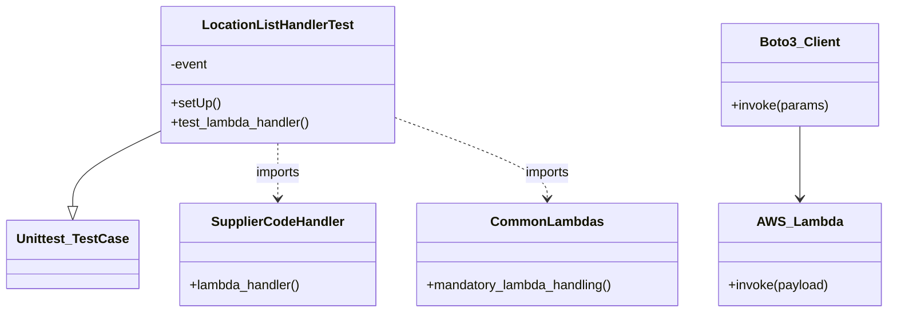
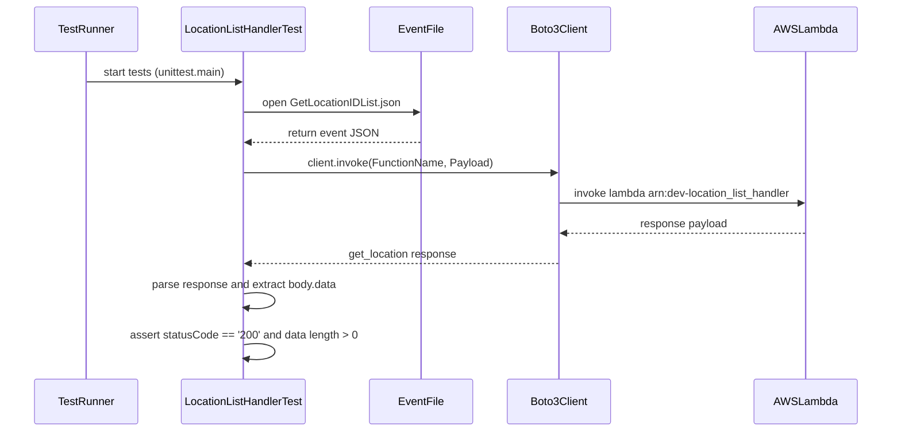
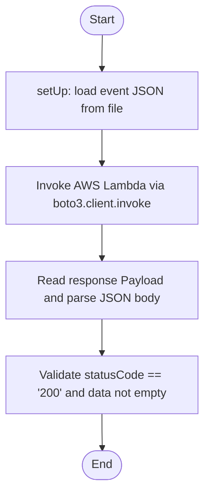

# Diagram: application_service/container_tracking_app_service/tests/test_location_list_handler.py

> Auto-generated by Obscura crawlers

## Diagram 1

### SVG

<svg id="container" width="1079.34375" xmlns="http://www.w3.org/2000/svg" class="classDiagram" height="384" viewBox="0 0 1079.34375 384" role="graphics-document document" aria-roledescription="class"><g><defs><marker id="container_class-aggregationStart" class="marker aggregation class" refX="18" refY="7" markerWidth="190" markerHeight="240" orient="auto"><path d="M 18,7 L9,13 L1,7 L9,1 Z"></path></marker></defs><defs><marker id="container_class-aggregationEnd" class="marker aggregation class" refX="1" refY="7" markerWidth="20" markerHeight="28" orient="auto"><path d="M 18,7 L9,13 L1,7 L9,1 Z"></path></marker></defs><defs><marker id="container_class-extensionStart" class="marker extension class" refX="18" refY="7" markerWidth="190" markerHeight="240" orient="auto"><path d="M 1,7 L18,13 V 1 Z"></path></marker></defs><defs><marker id="container_class-extensionEnd" class="marker extension class" refX="1" refY="7" markerWidth="20" markerHeight="28" orient="auto"><path d="M 1,1 V 13 L18,7 Z"></path></marker></defs><defs><marker id="container_class-compositionStart" class="marker composition class" refX="18" refY="7" markerWidth="190" markerHeight="240" orient="auto"><path d="M 18,7 L9,13 L1,7 L9,1 Z"></path></marker></defs><defs><marker id="container_class-compositionEnd" class="marker composition class" refX="1" refY="7" markerWidth="20" markerHeight="28" orient="auto"><path d="M 18,7 L9,13 L1,7 L9,1 Z"></path></marker></defs><defs><marker id="container_class-dependencyStart" class="marker dependency class" refX="6" refY="7" markerWidth="190" markerHeight="240" orient="auto"><path d="M 5,7 L9,13 L1,7 L9,1 Z"></path></marker></defs><defs><marker id="container_class-dependencyEnd" class="marker dependency class" refX="13" refY="7" markerWidth="20" markerHeight="28" orient="auto"><path d="M 18,7 L9,13 L14,7 L9,1 Z"></path></marker></defs><defs><marker id="container_class-lollipopStart" class="marker lollipop class" refX="13" refY="7" markerWidth="190" markerHeight="240" orient="auto"><circle stroke="black" fill="transparent" cx="7" cy="7" r="6"></circle></marker></defs><defs><marker id="container_class-lollipopEnd" class="marker lollipop class" refX="1" refY="7" markerWidth="190" markerHeight="240" orient="auto"><circle stroke="black" fill="transparent" cx="7" cy="7" r="6"></circle></marker></defs><g class="root"><g class="clusters"></g><g class="edgePaths"><path d="M190.09,161.973L172.674,170.478C155.258,178.982,120.426,195.991,103.01,211.287C85.594,226.583,85.594,240.167,85.594,246.958L85.594,253.75" id="id_LocationListHandlerTest_Unittest_TestCase_1" class="edge-thickness-normal edge-pattern-solid relation" style=";;;" data-edge="true" data-et="edge" data-id="id_LocationListHandlerTest_Unittest_TestCase_1" data-points="W3sieCI6MTkwLjA4OTg0Mzc1LCJ5IjoxNjEuOTczNDIxNjEyNjc0Mzd9LHsieCI6ODUuNTkzNzUsInkiOjIxM30seyJ4Ijo4NS41OTM3NSwieSI6MjcxfV0=" marker-end="url(#container_class-extensionEnd)"></path><path d="M972.922,155L972.922,164.667C972.922,174.333,972.922,193.667,972.922,208.5C972.922,223.333,972.922,233.667,972.922,238.833L972.922,244" id="id_Boto3_Client_AWS_Lambda_2" class="edge-thickness-normal edge-pattern-solid relation" style=";;;" data-edge="true" data-et="edge" data-id="id_Boto3_Client_AWS_Lambda_2" data-points="W3sieCI6OTcyLjkyMTg3NSwieSI6MTU1fSx7IngiOjk3Mi45MjE4NzUsInkiOjIxM30seyJ4Ijo5NzIuOTIxODc1LCJ5IjoyNTB9XQ==" marker-end="url(#container_class-dependencyEnd)"></path><path d="M333.387,176L333.387,182.167C333.387,188.333,333.387,200.667,333.387,212C333.387,223.333,333.387,233.667,333.387,238.833L333.387,244" id="id_LocationListHandlerTest_SupplierCodeHandler_3" class="edge-thickness-normal edge-pattern-dashed relation" style=";;;" data-edge="true" data-et="edge" data-id="id_LocationListHandlerTest_SupplierCodeHandler_3" data-points="W3sieCI6MzMzLjM4NjcxODc1LCJ5IjoxNzZ9LHsieCI6MzMzLjM4NjcxODc1LCJ5IjoyMTN9LHsieCI6MzMzLjM4NjcxODc1LCJ5IjoyNTB9XQ==" marker-end="url(#container_class-dependencyEnd)"></path><path d="M476.684,144.438L507.91,155.865C539.137,167.292,601.59,190.146,632.816,206.74C664.043,223.333,664.043,233.667,664.043,238.833L664.043,244" id="id_LocationListHandlerTest_CommonLambdas_4" class="edge-thickness-normal edge-pattern-dashed relation" style=";;;" data-edge="true" data-et="edge" data-id="id_LocationListHandlerTest_CommonLambdas_4" data-points="W3sieCI6NDc2LjY4MzU5Mzc1LCJ5IjoxNDQuNDM3OTA3NTcwMTcyOTd9LHsieCI6NjY0LjA0Mjk2ODc1LCJ5IjoyMTN9LHsieCI6NjY0LjA0Mjk2ODc1LCJ5IjoyNTB9XQ==" marker-end="url(#container_class-dependencyEnd)"></path></g><g class="edgeLabels"><g class="edgeLabel"><g class="label" data-id="id_LocationListHandlerTest_Unittest_TestCase_1" transform="translate(0, 0)"><foreignObject width="0" height="0">

</foreignObject></g></g><g class="edgeLabel"><g class="label" data-id="id_Boto3_Client_AWS_Lambda_2" transform="translate(0, 0)"><foreignObject width="0" height="0">

</foreignObject></g></g><g class="edgeLabel" transform="translate(333.38671875, 213)"><g class="label" data-id="id_LocationListHandlerTest_SupplierCodeHandler_3" transform="translate(-28.25, -12)"><foreignObject width="56.5" height="24">

imports

</foreignObject></g></g><g class="edgeLabel" transform="translate(664.04296875, 213)"><g class="label" data-id="id_LocationListHandlerTest_CommonLambdas_4" transform="translate(-28.25, -12)"><foreignObject width="56.5" height="24">

imports

</foreignObject></g></g></g><g class="nodes"><g class="node default" id="classId-LocationListHandlerTest-0" transform="translate(333.38671875, 92)"><g class="basic label-container"><path d="M-143.296875 -84 L143.296875 -84 L143.296875 84 L-143.296875 84" stroke="none" stroke-width="0" fill="#ECECFF" style=""></path><path d="M-143.296875 -84 C-41.30162675809282 -84, 60.693621483814354 -84, 143.296875 -84 M-143.296875 -84 C-61.91408184117857 -84, 19.468711317642857 -84, 143.296875 -84 M143.296875 -84 C143.296875 -20.580372527464306, 143.296875 42.83925494507139, 143.296875 84 M143.296875 -84 C143.296875 -27.896395493507626, 143.296875 28.207209012984748, 143.296875 84 M143.296875 84 C46.218284040448864 84, -50.86030691910227 84, -143.296875 84 M143.296875 84 C60.2215091226677 84, -22.853856754664605 84, -143.296875 84 M-143.296875 84 C-143.296875 18.683644915168685, -143.296875 -46.63271016966263, -143.296875 -84 M-143.296875 84 C-143.296875 28.38927827049939, -143.296875 -27.22144345900122, -143.296875 -84" stroke="#9370DB" stroke-width="1.3" fill="none" stroke-dasharray="0 0" style=""></path></g><g class="annotation-group text" transform="translate(0, -60)"></g><g class="label-group text" transform="translate(-89, -60)"><g class="label" style="font-weight: bolder" transform="translate(0,-12)"><foreignObject width="178" height="24">

LocationListHandlerTest

</foreignObject></g></g><g class="members-group text" transform="translate(-131.296875, -12)"><g class="label" style="" transform="translate(0,-12)"><foreignObject width="46.796875" height="24">

-event

</foreignObject></g></g><g class="methods-group text" transform="translate(-131.296875, 36)"><g class="label" style="" transform="translate(0,-12)"><foreignObject width="60.421875" height="24">

+setUp()

</foreignObject></g><g class="label" style="" transform="translate(0,12)"><foreignObject width="173.59375" height="24">

+test_lambda_handler()

</foreignObject></g></g><g class="divider" style=""><path d="M-143.296875 -36 C-66.81381066747774 -36, 9.669253665044522 -36, 143.296875 -36 M-143.296875 -36 C-56.71790413643774 -36, 29.861066727124523 -36, 143.296875 -36" stroke="#9370DB" stroke-width="1.3" fill="none" stroke-dasharray="0 0" style=""></path></g><g class="divider" style=""><path d="M-143.296875 12 C-53.28931593355118 12, 36.71824313289764 12, 143.296875 12 M-143.296875 12 C-41.35623823122394 12, 60.58439853755212 12, 143.296875 12" stroke="#9370DB" stroke-width="1.3" fill="none" stroke-dasharray="0 0" style=""></path></g></g><g class="node default" id="classId-Unittest_TestCase-1" transform="translate(85.59375, 313)"><g class="basic label-container"><path d="M-77.59375 -42 L77.59375 -42 L77.59375 42 L-77.59375 42" stroke="none" stroke-width="0" fill="#ECECFF" style=""></path><path d="M-77.59375 -42 C-38.9000707492309 -42, -0.20639149846179805 -42, 77.59375 -42 M-77.59375 -42 C-24.13110147867829 -42, 29.33154704264342 -42, 77.59375 -42 M77.59375 -42 C77.59375 -16.538931878615298, 77.59375 8.922136242769405, 77.59375 42 M77.59375 -42 C77.59375 -16.696770688670803, 77.59375 8.606458622658394, 77.59375 42 M77.59375 42 C39.97098146235866 42, 2.3482129247173162 42, -77.59375 42 M77.59375 42 C32.21679248529207 42, -13.160165029415865 42, -77.59375 42 M-77.59375 42 C-77.59375 14.198164957342684, -77.59375 -13.603670085314633, -77.59375 -42 M-77.59375 42 C-77.59375 15.752425708728197, -77.59375 -10.495148582543607, -77.59375 -42" stroke="#9370DB" stroke-width="1.3" fill="none" stroke-dasharray="0 0" style=""></path></g><g class="annotation-group text" transform="translate(0, -18)"></g><g class="label-group text" transform="translate(-65.59375, -18)"><g class="label" style="font-weight: bolder" transform="translate(0,-12)"><foreignObject width="131.1875" height="24">

Unittest_TestCase

</foreignObject></g></g><g class="members-group text" transform="translate(-65.59375, 30)"></g><g class="methods-group text" transform="translate(-65.59375, 60)"></g><g class="divider" style=""><path d="M-77.59375 6 C-16.043913116087765 6, 45.50592376782447 6, 77.59375 6 M-77.59375 6 C-31.331993311009242 6, 14.929763377981516 6, 77.59375 6" stroke="#9370DB" stroke-width="1.3" fill="none" stroke-dasharray="0 0" style=""></path></g><g class="divider" style=""><path d="M-77.59375 24 C-39.78357551115943 24, -1.9734010223188534 24, 77.59375 24 M-77.59375 24 C-37.672499480570806 24, 2.248751038858387 24, 77.59375 24" stroke="#9370DB" stroke-width="1.3" fill="none" stroke-dasharray="0 0" style=""></path></g></g><g class="node default" id="classId-Boto3_Client-2" transform="translate(972.921875, 92)"><g class="basic label-container"><path d="M-94.89453125 -63 L94.89453125 -63 L94.89453125 63 L-94.89453125 63" stroke="none" stroke-width="0" fill="#ECECFF" style=""></path><path d="M-94.89453125 -63 C-42.954607186796075 -63, 8.98531687640785 -63, 94.89453125 -63 M-94.89453125 -63 C-23.760248315274396 -63, 47.37403461945121 -63, 94.89453125 -63 M94.89453125 -63 C94.89453125 -16.03478583329928, 94.89453125 30.930428333401437, 94.89453125 63 M94.89453125 -63 C94.89453125 -31.551893253191366, 94.89453125 -0.10378650638273257, 94.89453125 63 M94.89453125 63 C45.45964821664266 63, -3.975234816714675 63, -94.89453125 63 M94.89453125 63 C51.418410098884465 63, 7.94228894776893 63, -94.89453125 63 M-94.89453125 63 C-94.89453125 36.9257517598071, -94.89453125 10.851503519614205, -94.89453125 -63 M-94.89453125 63 C-94.89453125 27.649010009205007, -94.89453125 -7.701979981589986, -94.89453125 -63" stroke="#9370DB" stroke-width="1.3" fill="none" stroke-dasharray="0 0" style=""></path></g><g class="annotation-group text" transform="translate(0, -39)"></g><g class="label-group text" transform="translate(-46.1796875, -39)"><g class="label" style="font-weight: bolder" transform="translate(0,-12)"><foreignObject width="92.359375" height="24">

Boto3_Client

</foreignObject></g></g><g class="members-group text" transform="translate(-82.89453125, 9)"></g><g class="methods-group text" transform="translate(-82.89453125, 39)"><g class="label" style="" transform="translate(0,-12)"><foreignObject width="119.609375" height="24">

+invoke(params)

</foreignObject></g></g><g class="divider" style=""><path d="M-94.89453125 -15 C-55.25312928334644 -15, -15.611727316692878 -15, 94.89453125 -15 M-94.89453125 -15 C-55.409484912834955 -15, -15.92443857566991 -15, 94.89453125 -15" stroke="#9370DB" stroke-width="1.3" fill="none" stroke-dasharray="0 0" style=""></path></g><g class="divider" style=""><path d="M-94.89453125 9 C-31.77694549129786 9, 31.340640267404282 9, 94.89453125 9 M-94.89453125 9 C-26.572741995382742 9, 41.749047259234516 9, 94.89453125 9" stroke="#9370DB" stroke-width="1.3" fill="none" stroke-dasharray="0 0" style=""></path></g></g><g class="node default" id="classId-AWS_Lambda-3" transform="translate(972.921875, 313)"><g class="basic label-container"><path d="M-98.421875 -63 L98.421875 -63 L98.421875 63 L-98.421875 63" stroke="none" stroke-width="0" fill="#ECECFF" style=""></path><path d="M-98.421875 -63 C-45.08878304826734 -63, 8.244308903465324 -63, 98.421875 -63 M-98.421875 -63 C-51.842534551482736 -63, -5.263194102965471 -63, 98.421875 -63 M98.421875 -63 C98.421875 -19.775295825194448, 98.421875 23.449408349611105, 98.421875 63 M98.421875 -63 C98.421875 -26.083626244266007, 98.421875 10.832747511467986, 98.421875 63 M98.421875 63 C51.04385734546332 63, 3.6658396909266457 63, -98.421875 63 M98.421875 63 C57.58910212532339 63, 16.756329250646786 63, -98.421875 63 M-98.421875 63 C-98.421875 31.41928017185954, -98.421875 -0.16143965628091905, -98.421875 -63 M-98.421875 63 C-98.421875 23.996968591338216, -98.421875 -15.006062817323567, -98.421875 -63" stroke="#9370DB" stroke-width="1.3" fill="none" stroke-dasharray="0 0" style=""></path></g><g class="annotation-group text" transform="translate(0, -39)"></g><g class="label-group text" transform="translate(-49.046875, -39)"><g class="label" style="font-weight: bolder" transform="translate(0,-12)"><foreignObject width="98.09375" height="24">

AWS_Lambda

</foreignObject></g></g><g class="members-group text" transform="translate(-86.421875, 9)"></g><g class="methods-group text" transform="translate(-86.421875, 39)"><g class="label" style="" transform="translate(0,-12)"><foreignObject width="123.796875" height="24">

+invoke(payload)

</foreignObject></g></g><g class="divider" style=""><path d="M-98.421875 -15 C-21.51020894634685 -15, 55.4014571073063 -15, 98.421875 -15 M-98.421875 -15 C-53.99430391762448 -15, -9.566732835248956 -15, 98.421875 -15" stroke="#9370DB" stroke-width="1.3" fill="none" stroke-dasharray="0 0" style=""></path></g><g class="divider" style=""><path d="M-98.421875 9 C-22.057716632560314 9, 54.30644173487937 9, 98.421875 9 M-98.421875 9 C-50.09503132619946 9, -1.7681876523989217 9, 98.421875 9" stroke="#9370DB" stroke-width="1.3" fill="none" stroke-dasharray="0 0" style=""></path></g></g><g class="node default" id="classId-SupplierCodeHandler-4" transform="translate(333.38671875, 313)"><g class="basic label-container"><path d="M-120.19921875 -63 L120.19921875 -63 L120.19921875 63 L-120.19921875 63" stroke="none" stroke-width="0" fill="#ECECFF" style=""></path><path d="M-120.19921875 -63 C-72.03145724752378 -63, -23.863695745047565 -63, 120.19921875 -63 M-120.19921875 -63 C-49.619104712623226 -63, 20.961009324753547 -63, 120.19921875 -63 M120.19921875 -63 C120.19921875 -13.748917449078647, 120.19921875 35.50216510184271, 120.19921875 63 M120.19921875 -63 C120.19921875 -13.880945068402468, 120.19921875 35.238109863195064, 120.19921875 63 M120.19921875 63 C40.32252735038077 63, -39.554164049238466 63, -120.19921875 63 M120.19921875 63 C42.61384390128289 63, -34.97153094743422 63, -120.19921875 63 M-120.19921875 63 C-120.19921875 27.206462237296613, -120.19921875 -8.587075525406775, -120.19921875 -63 M-120.19921875 63 C-120.19921875 15.252791254188033, -120.19921875 -32.494417491623935, -120.19921875 -63" stroke="#9370DB" stroke-width="1.3" fill="none" stroke-dasharray="0 0" style=""></path></g><g class="annotation-group text" transform="translate(0, -39)"></g><g class="label-group text" transform="translate(-78.3828125, -39)"><g class="label" style="font-weight: bolder" transform="translate(0,-12)"><foreignObject width="156.765625" height="24">

SupplierCodeHandler

</foreignObject></g></g><g class="members-group text" transform="translate(-108.19921875, 9)"></g><g class="methods-group text" transform="translate(-108.19921875, 39)"><g class="label" style="" transform="translate(0,-12)"><foreignObject width="138.015625" height="24">

+lambda_handler()

</foreignObject></g></g><g class="divider" style=""><path d="M-120.19921875 -15 C-67.7107282077165 -15, -15.222237665433 -15, 120.19921875 -15 M-120.19921875 -15 C-32.43875858071681 -15, 55.321701588566384 -15, 120.19921875 -15" stroke="#9370DB" stroke-width="1.3" fill="none" stroke-dasharray="0 0" style=""></path></g><g class="divider" style=""><path d="M-120.19921875 9 C-28.979332989841325 9, 62.24055277031735 9, 120.19921875 9 M-120.19921875 9 C-66.78258700587946 9, -13.365955261758941 9, 120.19921875 9" stroke="#9370DB" stroke-width="1.3" fill="none" stroke-dasharray="0 0" style=""></path></g></g><g class="node default" id="classId-CommonLambdas-5" transform="translate(664.04296875, 313)"><g class="basic label-container"><path d="M-160.45703125 -63 L160.45703125 -63 L160.45703125 63 L-160.45703125 63" stroke="none" stroke-width="0" fill="#ECECFF" style=""></path><path d="M-160.45703125 -63 C-83.68044759473523 -63, -6.903863939470455 -63, 160.45703125 -63 M-160.45703125 -63 C-57.54338391190059 -63, 45.37026342619882 -63, 160.45703125 -63 M160.45703125 -63 C160.45703125 -19.055443833702924, 160.45703125 24.889112332594152, 160.45703125 63 M160.45703125 -63 C160.45703125 -36.198478133971065, 160.45703125 -9.39695626794213, 160.45703125 63 M160.45703125 63 C79.33927448316305 63, -1.7784822836738954 63, -160.45703125 63 M160.45703125 63 C83.00084979965426 63, 5.544668349308523 63, -160.45703125 63 M-160.45703125 63 C-160.45703125 36.47107118364991, -160.45703125 9.942142367299816, -160.45703125 -63 M-160.45703125 63 C-160.45703125 30.474952122979815, -160.45703125 -2.0500957540403704, -160.45703125 -63" stroke="#9370DB" stroke-width="1.3" fill="none" stroke-dasharray="0 0" style=""></path></g><g class="annotation-group text" transform="translate(0, -39)"></g><g class="label-group text" transform="translate(-64.8359375, -39)"><g class="label" style="font-weight: bolder" transform="translate(0,-12)"><foreignObject width="129.671875" height="24">

CommonLambdas

</foreignObject></g></g><g class="members-group text" transform="translate(-148.45703125, 9)"></g><g class="methods-group text" transform="translate(-148.45703125, 39)"><g class="label" style="" transform="translate(0,-12)"><foreignObject width="232.078125" height="24">

+mandatory_lambda_handling()

</foreignObject></g></g><g class="divider" style=""><path d="M-160.45703125 -15 C-67.19030929330839 -15, 26.076412663383223 -15, 160.45703125 -15 M-160.45703125 -15 C-34.28632037849468 -15, 91.88439049301064 -15, 160.45703125 -15" stroke="#9370DB" stroke-width="1.3" fill="none" stroke-dasharray="0 0" style=""></path></g><g class="divider" style=""><path d="M-160.45703125 9 C-78.3495975666337 9, 3.757836116732591 9, 160.45703125 9 M-160.45703125 9 C-35.8246418979096 9, 88.8077474541808 9, 160.45703125 9" stroke="#9370DB" stroke-width="1.3" fill="none" stroke-dasharray="0 0" style=""></path></g></g></g></g></g></svg>

## Diagram 2

### SVG

<svg id="container" width="1374" xmlns="http://www.w3.org/2000/svg" height="663" viewBox="-50 -10 1374 663" role="graphics-document document" aria-roledescription="sequence"><g><rect x="1124" y="577" fill="#eaeaea" stroke="#666" width="150" height="65" name="AWS" rx="3" ry="3" class="actor actor-bottom"></rect><text x="1199" y="609.5" dominant-baseline="central" alignment-baseline="central" class="actor actor-box" style="text-anchor: middle; font-size: 16px; font-weight: 400;"><tspan x="1199" dy="0">AWSLambda</tspan></text></g><g><rect x="727" y="577" fill="#eaeaea" stroke="#666" width="150" height="65" name="Client" rx="3" ry="3" class="actor actor-bottom"></rect><text x="802" y="609.5" dominant-baseline="central" alignment-baseline="central" class="actor actor-box" style="text-anchor: middle; font-size: 16px; font-weight: 400;"><tspan x="802" dy="0">Boto3Client</tspan></text></g><g><rect x="527" y="577" fill="#eaeaea" stroke="#666" width="150" height="65" name="File" rx="3" ry="3" class="actor actor-bottom"></rect><text x="602" y="609.5" dominant-baseline="central" alignment-baseline="central" class="actor actor-box" style="text-anchor: middle; font-size: 16px; font-weight: 400;"><tspan x="602" dy="0">EventFile</tspan></text></g><g><rect x="231.5" y="577" fill="#eaeaea" stroke="#666" width="195" height="65" name="Test" rx="3" ry="3" class="actor actor-bottom"></rect><text x="329" y="609.5" dominant-baseline="central" alignment-baseline="central" class="actor actor-box" style="text-anchor: middle; font-size: 16px; font-weight: 400;"><tspan x="329" dy="0">LocationListHandlerTest</tspan></text></g><g><rect x="0" y="577" fill="#eaeaea" stroke="#666" width="150" height="65" name="TR" rx="3" ry="3" class="actor actor-bottom"></rect><text x="75" y="609.5" dominant-baseline="central" alignment-baseline="central" class="actor actor-box" style="text-anchor: middle; font-size: 16px; font-weight: 400;"><tspan x="75" dy="0">TestRunner</tspan></text></g><g><line id="actor4" x1="1199" y1="65" x2="1199" y2="577" class="actor-line 200" stroke-width="0.5px" stroke="#999" name="AWS"></line><g id="root-4"><rect x="1124" y="0" fill="#eaeaea" stroke="#666" width="150" height="65" name="AWS" rx="3" ry="3" class="actor actor-top"></rect><text x="1199" y="32.5" dominant-baseline="central" alignment-baseline="central" class="actor actor-box" style="text-anchor: middle; font-size: 16px; font-weight: 400;"><tspan x="1199" dy="0">AWSLambda</tspan></text></g></g><g><line id="actor3" x1="802" y1="65" x2="802" y2="577" class="actor-line 200" stroke-width="0.5px" stroke="#999" name="Client"></line><g id="root-3"><rect x="727" y="0" fill="#eaeaea" stroke="#666" width="150" height="65" name="Client" rx="3" ry="3" class="actor actor-top"></rect><text x="802" y="32.5" dominant-baseline="central" alignment-baseline="central" class="actor actor-box" style="text-anchor: middle; font-size: 16px; font-weight: 400;"><tspan x="802" dy="0">Boto3Client</tspan></text></g></g><g><line id="actor2" x1="602" y1="65" x2="602" y2="577" class="actor-line 200" stroke-width="0.5px" stroke="#999" name="File"></line><g id="root-2"><rect x="527" y="0" fill="#eaeaea" stroke="#666" width="150" height="65" name="File" rx="3" ry="3" class="actor actor-top"></rect><text x="602" y="32.5" dominant-baseline="central" alignment-baseline="central" class="actor actor-box" style="text-anchor: middle; font-size: 16px; font-weight: 400;"><tspan x="602" dy="0">EventFile</tspan></text></g></g><g><line id="actor1" x1="329" y1="65" x2="329" y2="577" class="actor-line 200" stroke-width="0.5px" stroke="#999" name="Test"></line><g id="root-1"><rect x="231.5" y="0" fill="#eaeaea" stroke="#666" width="195" height="65" name="Test" rx="3" ry="3" class="actor actor-top"></rect><text x="329" y="32.5" dominant-baseline="central" alignment-baseline="central" class="actor actor-box" style="text-anchor: middle; font-size: 16px; font-weight: 400;"><tspan x="329" dy="0">LocationListHandlerTest</tspan></text></g></g><g><line id="actor0" x1="75" y1="65" x2="75" y2="577" class="actor-line 200" stroke-width="0.5px" stroke="#999" name="TR"></line><g id="root-0"><rect x="0" y="0" fill="#eaeaea" stroke="#666" width="150" height="65" name="TR" rx="3" ry="3" class="actor actor-top"></rect><text x="75" y="32.5" dominant-baseline="central" alignment-baseline="central" class="actor actor-box" style="text-anchor: middle; font-size: 16px; font-weight: 400;"><tspan x="75" dy="0">TestRunner</tspan></text></g></g><g></g><defs><symbol id="computer" width="24" height="24"><path transform="scale(.5)" d="M2 2v13h20v-13h-20zm18 11h-16v-9h16v9zm-10.228 6l.466-1h3.524l.467 1h-4.457zm14.228 3h-24l2-6h2.104l-1.33 4h18.45l-1.297-4h2.073l2 6zm-5-10h-14v-7h14v7z"></path></symbol></defs><defs><symbol id="database" fill-rule="evenodd" clip-rule="evenodd"><path transform="scale(.5)" d="M12.258.001l.256.004.255.005.253.008.251.01.249.012.247.015.246.016.242.019.241.02.239.023.236.024.233.027.231.028.229.031.225.032.223.034.22.036.217.038.214.04.211.041.208.043.205.045.201.046.198.048.194.05.191.051.187.053.183.054.18.056.175.057.172.059.168.06.163.061.16.063.155.064.15.066.074.033.073.033.071.034.07.034.069.035.068.035.067.035.066.035.064.036.064.036.062.036.06.036.06.037.058.037.058.037.055.038.055.038.053.038.052.038.051.039.05.039.048.039.047.039.045.04.044.04.043.04.041.04.04.041.039.041.037.041.036.041.034.041.033.042.032.042.03.042.029.042.027.042.026.043.024.043.023.043.021.043.02.043.018.044.017.043.015.044.013.044.012.044.011.045.009.044.007.045.006.045.004.045.002.045.001.045v17l-.001.045-.002.045-.004.045-.006.045-.007.045-.009.044-.011.045-.012.044-.013.044-.015.044-.017.043-.018.044-.02.043-.021.043-.023.043-.024.043-.026.043-.027.042-.029.042-.03.042-.032.042-.033.042-.034.041-.036.041-.037.041-.039.041-.04.041-.041.04-.043.04-.044.04-.045.04-.047.039-.048.039-.05.039-.051.039-.052.038-.053.038-.055.038-.055.038-.058.037-.058.037-.06.037-.06.036-.062.036-.064.036-.064.036-.066.035-.067.035-.068.035-.069.035-.07.034-.071.034-.073.033-.074.033-.15.066-.155.064-.16.063-.163.061-.168.06-.172.059-.175.057-.18.056-.183.054-.187.053-.191.051-.194.05-.198.048-.201.046-.205.045-.208.043-.211.041-.214.04-.217.038-.22.036-.223.034-.225.032-.229.031-.231.028-.233.027-.236.024-.239.023-.241.02-.242.019-.246.016-.247.015-.249.012-.251.01-.253.008-.255.005-.256.004-.258.001-.258-.001-.256-.004-.255-.005-.253-.008-.251-.01-.249-.012-.247-.015-.245-.016-.243-.019-.241-.02-.238-.023-.236-.024-.234-.027-.231-.028-.228-.031-.226-.032-.223-.034-.22-.036-.217-.038-.214-.04-.211-.041-.208-.043-.204-.045-.201-.046-.198-.048-.195-.05-.19-.051-.187-.053-.184-.054-.179-.056-.176-.057-.172-.059-.167-.06-.164-.061-.159-.063-.155-.064-.151-.066-.074-.033-.072-.033-.072-.034-.07-.034-.069-.035-.068-.035-.067-.035-.066-.035-.064-.036-.063-.036-.062-.036-.061-.036-.06-.037-.058-.037-.057-.037-.056-.038-.055-.038-.053-.038-.052-.038-.051-.039-.049-.039-.049-.039-.046-.039-.046-.04-.044-.04-.043-.04-.041-.04-.04-.041-.039-.041-.037-.041-.036-.041-.034-.041-.033-.042-.032-.042-.03-.042-.029-.042-.027-.042-.026-.043-.024-.043-.023-.043-.021-.043-.02-.043-.018-.044-.017-.043-.015-.044-.013-.044-.012-.044-.011-.045-.009-.044-.007-.045-.006-.045-.004-.045-.002-.045-.001-.045v-17l.001-.045.002-.045.004-.045.006-.045.007-.045.009-.044.011-.045.012-.044.013-.044.015-.044.017-.043.018-.044.02-.043.021-.043.023-.043.024-.043.026-.043.027-.042.029-.042.03-.042.032-.042.033-.042.034-.041.036-.041.037-.041.039-.041.04-.041.041-.04.043-.04.044-.04.046-.04.046-.039.049-.039.049-.039.051-.039.052-.038.053-.038.055-.038.056-.038.057-.037.058-.037.06-.037.061-.036.062-.036.063-.036.064-.036.066-.035.067-.035.068-.035.069-.035.07-.034.072-.034.072-.033.074-.033.151-.066.155-.064.159-.063.164-.061.167-.06.172-.059.176-.057.179-.056.184-.054.187-.053.19-.051.195-.05.198-.048.201-.046.204-.045.208-.043.211-.041.214-.04.217-.038.22-.036.223-.034.226-.032.228-.031.231-.028.234-.027.236-.024.238-.023.241-.02.243-.019.245-.016.247-.015.249-.012.251-.01.253-.008.255-.005.256-.004.258-.001.258.001zm-9.258 20.499v.01l.001.021.003.021.004.022.005.021.006.022.007.022.009.023.01.022.011.023.012.023.013.023.015.023.016.024.017.023.018.024.019.024.021.024.022.025.023.024.024.025.052.049.056.05.061.051.066.051.07.051.075.051.079.052.084.052.088.052.092.052.097.052.102.051.105.052.11.052.114.051.119.051.123.051.127.05.131.05.135.05.139.048.144.049.147.047.152.047.155.047.16.045.163.045.167.043.171.043.176.041.178.041.183.039.187.039.19.037.194.035.197.035.202.033.204.031.209.03.212.029.216.027.219.025.222.024.226.021.23.02.233.018.236.016.24.015.243.012.246.01.249.008.253.005.256.004.259.001.26-.001.257-.004.254-.005.25-.008.247-.011.244-.012.241-.014.237-.016.233-.018.231-.021.226-.021.224-.024.22-.026.216-.027.212-.028.21-.031.205-.031.202-.034.198-.034.194-.036.191-.037.187-.039.183-.04.179-.04.175-.042.172-.043.168-.044.163-.045.16-.046.155-.046.152-.047.148-.048.143-.049.139-.049.136-.05.131-.05.126-.05.123-.051.118-.052.114-.051.11-.052.106-.052.101-.052.096-.052.092-.052.088-.053.083-.051.079-.052.074-.052.07-.051.065-.051.06-.051.056-.05.051-.05.023-.024.023-.025.021-.024.02-.024.019-.024.018-.024.017-.024.015-.023.014-.024.013-.023.012-.023.01-.023.01-.022.008-.022.006-.022.006-.022.004-.022.004-.021.001-.021.001-.021v-4.127l-.077.055-.08.053-.083.054-.085.053-.087.052-.09.052-.093.051-.095.05-.097.05-.1.049-.102.049-.105.048-.106.047-.109.047-.111.046-.114.045-.115.045-.118.044-.12.043-.122.042-.124.042-.126.041-.128.04-.13.04-.132.038-.134.038-.135.037-.138.037-.139.035-.142.035-.143.034-.144.033-.147.032-.148.031-.15.03-.151.03-.153.029-.154.027-.156.027-.158.026-.159.025-.161.024-.162.023-.163.022-.165.021-.166.02-.167.019-.169.018-.169.017-.171.016-.173.015-.173.014-.175.013-.175.012-.177.011-.178.01-.179.008-.179.008-.181.006-.182.005-.182.004-.184.003-.184.002h-.37l-.184-.002-.184-.003-.182-.004-.182-.005-.181-.006-.179-.008-.179-.008-.178-.01-.176-.011-.176-.012-.175-.013-.173-.014-.172-.015-.171-.016-.17-.017-.169-.018-.167-.019-.166-.02-.165-.021-.163-.022-.162-.023-.161-.024-.159-.025-.157-.026-.156-.027-.155-.027-.153-.029-.151-.03-.15-.03-.148-.031-.146-.032-.145-.033-.143-.034-.141-.035-.14-.035-.137-.037-.136-.037-.134-.038-.132-.038-.13-.04-.128-.04-.126-.041-.124-.042-.122-.042-.12-.044-.117-.043-.116-.045-.113-.045-.112-.046-.109-.047-.106-.047-.105-.048-.102-.049-.1-.049-.097-.05-.095-.05-.093-.052-.09-.051-.087-.052-.085-.053-.083-.054-.08-.054-.077-.054v4.127zm0-5.654v.011l.001.021.003.021.004.021.005.022.006.022.007.022.009.022.01.022.011.023.012.023.013.023.015.024.016.023.017.024.018.024.019.024.021.024.022.024.023.025.024.024.052.05.056.05.061.05.066.051.07.051.075.052.079.051.084.052.088.052.092.052.097.052.102.052.105.052.11.051.114.051.119.052.123.05.127.051.131.05.135.049.139.049.144.048.147.048.152.047.155.046.16.045.163.045.167.044.171.042.176.042.178.04.183.04.187.038.19.037.194.036.197.034.202.033.204.032.209.03.212.028.216.027.219.025.222.024.226.022.23.02.233.018.236.016.24.014.243.012.246.01.249.008.253.006.256.003.259.001.26-.001.257-.003.254-.006.25-.008.247-.01.244-.012.241-.015.237-.016.233-.018.231-.02.226-.022.224-.024.22-.025.216-.027.212-.029.21-.03.205-.032.202-.033.198-.035.194-.036.191-.037.187-.039.183-.039.179-.041.175-.042.172-.043.168-.044.163-.045.16-.045.155-.047.152-.047.148-.048.143-.048.139-.05.136-.049.131-.05.126-.051.123-.051.118-.051.114-.052.11-.052.106-.052.101-.052.096-.052.092-.052.088-.052.083-.052.079-.052.074-.051.07-.052.065-.051.06-.05.056-.051.051-.049.023-.025.023-.024.021-.025.02-.024.019-.024.018-.024.017-.024.015-.023.014-.023.013-.024.012-.022.01-.023.01-.023.008-.022.006-.022.006-.022.004-.021.004-.022.001-.021.001-.021v-4.139l-.077.054-.08.054-.083.054-.085.052-.087.053-.09.051-.093.051-.095.051-.097.05-.1.049-.102.049-.105.048-.106.047-.109.047-.111.046-.114.045-.115.044-.118.044-.12.044-.122.042-.124.042-.126.041-.128.04-.13.039-.132.039-.134.038-.135.037-.138.036-.139.036-.142.035-.143.033-.144.033-.147.033-.148.031-.15.03-.151.03-.153.028-.154.028-.156.027-.158.026-.159.025-.161.024-.162.023-.163.022-.165.021-.166.02-.167.019-.169.018-.169.017-.171.016-.173.015-.173.014-.175.013-.175.012-.177.011-.178.009-.179.009-.179.007-.181.007-.182.005-.182.004-.184.003-.184.002h-.37l-.184-.002-.184-.003-.182-.004-.182-.005-.181-.007-.179-.007-.179-.009-.178-.009-.176-.011-.176-.012-.175-.013-.173-.014-.172-.015-.171-.016-.17-.017-.169-.018-.167-.019-.166-.02-.165-.021-.163-.022-.162-.023-.161-.024-.159-.025-.157-.026-.156-.027-.155-.028-.153-.028-.151-.03-.15-.03-.148-.031-.146-.033-.145-.033-.143-.033-.141-.035-.14-.036-.137-.036-.136-.037-.134-.038-.132-.039-.13-.039-.128-.04-.126-.041-.124-.042-.122-.043-.12-.043-.117-.044-.116-.044-.113-.046-.112-.046-.109-.046-.106-.047-.105-.048-.102-.049-.1-.049-.097-.05-.095-.051-.093-.051-.09-.051-.087-.053-.085-.052-.083-.054-.08-.054-.077-.054v4.139zm0-5.666v.011l.001.02.003.022.004.021.005.022.006.021.007.022.009.023.01.022.011.023.012.023.013.023.015.023.016.024.017.024.018.023.019.024.021.025.022.024.023.024.024.025.052.05.056.05.061.05.066.051.07.051.075.052.079.051.084.052.088.052.092.052.097.052.102.052.105.051.11.052.114.051.119.051.123.051.127.05.131.05.135.05.139.049.144.048.147.048.152.047.155.046.16.045.163.045.167.043.171.043.176.042.178.04.183.04.187.038.19.037.194.036.197.034.202.033.204.032.209.03.212.028.216.027.219.025.222.024.226.021.23.02.233.018.236.017.24.014.243.012.246.01.249.008.253.006.256.003.259.001.26-.001.257-.003.254-.006.25-.008.247-.01.244-.013.241-.014.237-.016.233-.018.231-.02.226-.022.224-.024.22-.025.216-.027.212-.029.21-.03.205-.032.202-.033.198-.035.194-.036.191-.037.187-.039.183-.039.179-.041.175-.042.172-.043.168-.044.163-.045.16-.045.155-.047.152-.047.148-.048.143-.049.139-.049.136-.049.131-.051.126-.05.123-.051.118-.052.114-.051.11-.052.106-.052.101-.052.096-.052.092-.052.088-.052.083-.052.079-.052.074-.052.07-.051.065-.051.06-.051.056-.05.051-.049.023-.025.023-.025.021-.024.02-.024.019-.024.018-.024.017-.024.015-.023.014-.024.013-.023.012-.023.01-.022.01-.023.008-.022.006-.022.006-.022.004-.022.004-.021.001-.021.001-.021v-4.153l-.077.054-.08.054-.083.053-.085.053-.087.053-.09.051-.093.051-.095.051-.097.05-.1.049-.102.048-.105.048-.106.048-.109.046-.111.046-.114.046-.115.044-.118.044-.12.043-.122.043-.124.042-.126.041-.128.04-.13.039-.132.039-.134.038-.135.037-.138.036-.139.036-.142.034-.143.034-.144.033-.147.032-.148.032-.15.03-.151.03-.153.028-.154.028-.156.027-.158.026-.159.024-.161.024-.162.023-.163.023-.165.021-.166.02-.167.019-.169.018-.169.017-.171.016-.173.015-.173.014-.175.013-.175.012-.177.01-.178.01-.179.009-.179.007-.181.006-.182.006-.182.004-.184.003-.184.001-.185.001-.185-.001-.184-.001-.184-.003-.182-.004-.182-.006-.181-.006-.179-.007-.179-.009-.178-.01-.176-.01-.176-.012-.175-.013-.173-.014-.172-.015-.171-.016-.17-.017-.169-.018-.167-.019-.166-.02-.165-.021-.163-.023-.162-.023-.161-.024-.159-.024-.157-.026-.156-.027-.155-.028-.153-.028-.151-.03-.15-.03-.148-.032-.146-.032-.145-.033-.143-.034-.141-.034-.14-.036-.137-.036-.136-.037-.134-.038-.132-.039-.13-.039-.128-.041-.126-.041-.124-.041-.122-.043-.12-.043-.117-.044-.116-.044-.113-.046-.112-.046-.109-.046-.106-.048-.105-.048-.102-.048-.1-.05-.097-.049-.095-.051-.093-.051-.09-.052-.087-.052-.085-.053-.083-.053-.08-.054-.077-.054v4.153zm8.74-8.179l-.257.004-.254.005-.25.008-.247.011-.244.012-.241.014-.237.016-.233.018-.231.021-.226.022-.224.023-.22.026-.216.027-.212.028-.21.031-.205.032-.202.033-.198.034-.194.036-.191.038-.187.038-.183.04-.179.041-.175.042-.172.043-.168.043-.163.045-.16.046-.155.046-.152.048-.148.048-.143.048-.139.049-.136.05-.131.05-.126.051-.123.051-.118.051-.114.052-.11.052-.106.052-.101.052-.096.052-.092.052-.088.052-.083.052-.079.052-.074.051-.07.052-.065.051-.06.05-.056.05-.051.05-.023.025-.023.024-.021.024-.02.025-.019.024-.018.024-.017.023-.015.024-.014.023-.013.023-.012.023-.01.023-.01.022-.008.022-.006.023-.006.021-.004.022-.004.021-.001.021-.001.021.001.021.001.021.004.021.004.022.006.021.006.023.008.022.01.022.01.023.012.023.013.023.014.023.015.024.017.023.018.024.019.024.02.025.021.024.023.024.023.025.051.05.056.05.06.05.065.051.07.052.074.051.079.052.083.052.088.052.092.052.096.052.101.052.106.052.11.052.114.052.118.051.123.051.126.051.131.05.136.05.139.049.143.048.148.048.152.048.155.046.16.046.163.045.168.043.172.043.175.042.179.041.183.04.187.038.191.038.194.036.198.034.202.033.205.032.21.031.212.028.216.027.22.026.224.023.226.022.231.021.233.018.237.016.241.014.244.012.247.011.25.008.254.005.257.004.26.001.26-.001.257-.004.254-.005.25-.008.247-.011.244-.012.241-.014.237-.016.233-.018.231-.021.226-.022.224-.023.22-.026.216-.027.212-.028.21-.031.205-.032.202-.033.198-.034.194-.036.191-.038.187-.038.183-.04.179-.041.175-.042.172-.043.168-.043.163-.045.16-.046.155-.046.152-.048.148-.048.143-.048.139-.049.136-.05.131-.05.126-.051.123-.051.118-.051.114-.052.11-.052.106-.052.101-.052.096-.052.092-.052.088-.052.083-.052.079-.052.074-.051.07-.052.065-.051.06-.05.056-.05.051-.05.023-.025.023-.024.021-.024.02-.025.019-.024.018-.024.017-.023.015-.024.014-.023.013-.023.012-.023.01-.023.01-.022.008-.022.006-.023.006-.021.004-.022.004-.021.001-.021.001-.021-.001-.021-.001-.021-.004-.021-.004-.022-.006-.021-.006-.023-.008-.022-.01-.022-.01-.023-.012-.023-.013-.023-.014-.023-.015-.024-.017-.023-.018-.024-.019-.024-.02-.025-.021-.024-.023-.024-.023-.025-.051-.05-.056-.05-.06-.05-.065-.051-.07-.052-.074-.051-.079-.052-.083-.052-.088-.052-.092-.052-.096-.052-.101-.052-.106-.052-.11-.052-.114-.052-.118-.051-.123-.051-.126-.051-.131-.05-.136-.05-.139-.049-.143-.048-.148-.048-.152-.048-.155-.046-.16-.046-.163-.045-.168-.043-.172-.043-.175-.042-.179-.041-.183-.04-.187-.038-.191-.038-.194-.036-.198-.034-.202-.033-.205-.032-.21-.031-.212-.028-.216-.027-.22-.026-.224-.023-.226-.022-.231-.021-.233-.018-.237-.016-.241-.014-.244-.012-.247-.011-.25-.008-.254-.005-.257-.004-.26-.001-.26.001z"></path></symbol></defs><defs><symbol id="clock" width="24" height="24"><path transform="scale(.5)" d="M12 2c5.514 0 10 4.486 10 10s-4.486 10-10 10-10-4.486-10-10 4.486-10 10-10zm0-2c-6.627 0-12 5.373-12 12s5.373 12 12 12 12-5.373 12-12-5.373-12-12-12zm5.848 12.459c.202.038.202.333.001.372-1.907.361-6.045 1.111-6.547 1.111-.719 0-1.301-.582-1.301-1.301 0-.512.77-5.447 1.125-7.445.034-.192.312-.181.343.014l.985 6.238 5.394 1.011z"></path></symbol></defs><defs><marker id="arrowhead" refX="7.9" refY="5" markerUnits="userSpaceOnUse" markerWidth="12" markerHeight="12" orient="auto-start-reverse"><path d="M -1 0 L 10 5 L 0 10 z"></path></marker></defs><defs><marker id="crosshead" markerWidth="15" markerHeight="8" orient="auto" refX="4" refY="4.5"><path fill="none" stroke="#000000" stroke-width="1pt" d="M 1,2 L 6,7 M 6,2 L 1,7" style="stroke-dasharray: 0, 0;"></path></marker></defs><defs><marker id="filled-head" refX="15.5" refY="7" markerWidth="20" markerHeight="28" orient="auto"><path d="M 18,7 L9,13 L14,7 L9,1 Z"></path></marker></defs><defs><marker id="sequencenumber" refX="15" refY="15" markerWidth="60" markerHeight="40" orient="auto"><circle cx="15" cy="15" r="6"></circle></marker></defs><text x="201" y="80" text-anchor="middle" dominant-baseline="middle" alignment-baseline="middle" class="messageText" dy="1em" style="font-size: 16px; font-weight: 400;">start tests (unittest.main)</text><line x1="76" y1="113" x2="325" y2="113" class="messageLine0" stroke-width="2" stroke="none" marker-end="url(#arrowhead)" style="fill: none;"></line><text x="464" y="128" text-anchor="middle" dominant-baseline="middle" alignment-baseline="middle" class="messageText" dy="1em" style="font-size: 16px; font-weight: 400;">open GetLocationIDList.json</text><line x1="330" y1="161" x2="598" y2="161" class="messageLine0" stroke-width="2" stroke="none" marker-end="url(#arrowhead)" style="fill: none;"></line><text x="467" y="176" text-anchor="middle" dominant-baseline="middle" alignment-baseline="middle" class="messageText" dy="1em" style="font-size: 16px; font-weight: 400;">return event JSON</text><line x1="601" y1="209" x2="333" y2="209" class="messageLine1" stroke-width="2" stroke="none" marker-end="url(#arrowhead)" style="stroke-dasharray: 3, 3; fill: none;"></line><text x="564" y="224" text-anchor="middle" dominant-baseline="middle" alignment-baseline="middle" class="messageText" dy="1em" style="font-size: 16px; font-weight: 400;">client.invoke(FunctionName, Payload)</text><line x1="330" y1="257" x2="798" y2="257" class="messageLine0" stroke-width="2" stroke="none" marker-end="url(#arrowhead)" style="fill: none;"></line><text x="999" y="272" text-anchor="middle" dominant-baseline="middle" alignment-baseline="middle" class="messageText" dy="1em" style="font-size: 16px; font-weight: 400;">invoke lambda arn:dev-location_list_handler</text><line x1="803" y1="305" x2="1195" y2="305" class="messageLine0" stroke-width="2" stroke="none" marker-end="url(#arrowhead)" style="fill: none;"></line><text x="1002" y="320" text-anchor="middle" dominant-baseline="middle" alignment-baseline="middle" class="messageText" dy="1em" style="font-size: 16px; font-weight: 400;">response payload</text><line x1="1198" y1="353" x2="806" y2="353" class="messageLine1" stroke-width="2" stroke="none" marker-end="url(#arrowhead)" style="stroke-dasharray: 3, 3; fill: none;"></line><text x="567" y="368" text-anchor="middle" dominant-baseline="middle" alignment-baseline="middle" class="messageText" dy="1em" style="font-size: 16px; font-weight: 400;">get_location response</text><line x1="801" y1="401" x2="333" y2="401" class="messageLine1" stroke-width="2" stroke="none" marker-end="url(#arrowhead)" style="stroke-dasharray: 3, 3; fill: none;"></line><text x="330" y="416" text-anchor="middle" dominant-baseline="middle" alignment-baseline="middle" class="messageText" dy="1em" style="font-size: 16px; font-weight: 400;">parse response and extract body.data</text><path d="M 330,449 C 390,439 390,479 330,469" class="messageLine0" stroke-width="2" stroke="none" marker-end="url(#arrowhead)" style="fill: none;"></path><text x="330" y="494" text-anchor="middle" dominant-baseline="middle" alignment-baseline="middle" class="messageText" dy="1em" style="font-size: 16px; font-weight: 400;">assert statusCode == '200' and data length &gt; 0</text><path d="M 330,527 C 390,517 390,557 330,547" class="messageLine0" stroke-width="2" stroke="none" marker-end="url(#arrowhead)" style="fill: none;"></path></svg>

## Diagram 3

### SVG

<svg id="container" width="276" xmlns="http://www.w3.org/2000/svg" class="flowchart" height="656" viewBox="0 0 276 656" role="graphics-document document" aria-roledescription="flowchart-v2"><g><marker id="container_flowchart-v2-pointEnd" class="marker flowchart-v2" viewBox="0 0 10 10" refX="5" refY="5" markerUnits="userSpaceOnUse" markerWidth="8" markerHeight="8" orient="auto"><path d="M 0 0 L 10 5 L 0 10 z" class="arrowMarkerPath" style="stroke-width: 1; stroke-dasharray: 1, 0;"></path></marker><marker id="container_flowchart-v2-pointStart" class="marker flowchart-v2" viewBox="0 0 10 10" refX="4.5" refY="5" markerUnits="userSpaceOnUse" markerWidth="8" markerHeight="8" orient="auto"><path d="M 0 5 L 10 10 L 10 0 z" class="arrowMarkerPath" style="stroke-width: 1; stroke-dasharray: 1, 0;"></path></marker><marker id="container_flowchart-v2-circleEnd" class="marker flowchart-v2" viewBox="0 0 10 10" refX="11" refY="5" markerUnits="userSpaceOnUse" markerWidth="11" markerHeight="11" orient="auto"><circle cx="5" cy="5" r="5" class="arrowMarkerPath" style="stroke-width: 1; stroke-dasharray: 1, 0;"></circle></marker><marker id="container_flowchart-v2-circleStart" class="marker flowchart-v2" viewBox="0 0 10 10" refX="-1" refY="5" markerUnits="userSpaceOnUse" markerWidth="11" markerHeight="11" orient="auto"><circle cx="5" cy="5" r="5" class="arrowMarkerPath" style="stroke-width: 1; stroke-dasharray: 1, 0;"></circle></marker><marker id="container_flowchart-v2-crossEnd" class="marker cross flowchart-v2" viewBox="0 0 11 11" refX="12" refY="5.2" markerUnits="userSpaceOnUse" markerWidth="11" markerHeight="11" orient="auto"><path d="M 1,1 l 9,9 M 10,1 l -9,9" class="arrowMarkerPath" style="stroke-width: 2; stroke-dasharray: 1, 0;"></path></marker><marker id="container_flowchart-v2-crossStart" class="marker cross flowchart-v2" viewBox="0 0 11 11" refX="-1" refY="5.2" markerUnits="userSpaceOnUse" markerWidth="11" markerHeight="11" orient="auto"><path d="M 1,1 l 9,9 M 10,1 l -9,9" class="arrowMarkerPath" style="stroke-width: 2; stroke-dasharray: 1, 0;"></path></marker><g class="root"><g class="clusters"></g><g class="edgePaths"><path d="M138.5,47.5L138.417,51.583C138.333,55.667,138.167,63.833,138.083,71.417C138,79,138,86,138,89.5L138,93" id="L_Start_Setup_0" class="edge-thickness-normal edge-pattern-solid edge-thickness-normal edge-pattern-solid flowchart-link" style=";" data-edge="true" data-et="edge" data-id="L_Start_Setup_0" data-points="W3sieCI6MTM4LjUsInkiOjQ3LjV9LHsieCI6MTM4LCJ5Ijo3Mn0seyJ4IjoxMzgsInkiOjk3fV0=" marker-end="url(#container_flowchart-v2-pointEnd)"></path><path d="M138,175L138,179.167C138,183.333,138,191.667,138,199.333C138,207,138,214,138,217.5L138,221" id="L_Setup_Invoke_0" class="edge-thickness-normal edge-pattern-solid edge-thickness-normal edge-pattern-solid flowchart-link" style=";" data-edge="true" data-et="edge" data-id="L_Setup_Invoke_0" data-points="W3sieCI6MTM4LCJ5IjoxNzV9LHsieCI6MTM4LCJ5IjoyMDB9LHsieCI6MTM4LCJ5IjoyMjV9XQ==" marker-end="url(#container_flowchart-v2-pointEnd)"></path><path d="M138,303L138,307.167C138,311.333,138,319.667,138,327.333C138,335,138,342,138,345.5L138,349" id="L_Invoke_Parse_0" class="edge-thickness-normal edge-pattern-solid edge-thickness-normal edge-pattern-solid flowchart-link" style=";" data-edge="true" data-et="edge" data-id="L_Invoke_Parse_0" data-points="W3sieCI6MTM4LCJ5IjozMDN9LHsieCI6MTM4LCJ5IjozMjh9LHsieCI6MTM4LCJ5IjozNTN9XQ==" marker-end="url(#container_flowchart-v2-pointEnd)"></path><path d="M138,431L138,435.167C138,439.333,138,447.667,138,455.333C138,463,138,470,138,473.5L138,477" id="L_Parse_Validate_0" class="edge-thickness-normal edge-pattern-solid edge-thickness-normal edge-pattern-solid flowchart-link" style=";" data-edge="true" data-et="edge" data-id="L_Parse_Validate_0" data-points="W3sieCI6MTM4LCJ5Ijo0MzF9LHsieCI6MTM4LCJ5Ijo0NTZ9LHsieCI6MTM4LCJ5Ijo0ODF9XQ==" marker-end="url(#container_flowchart-v2-pointEnd)"></path><path d="M138,559L138,563.167C138,567.333,138,575.667,138.07,583.417C138.141,591.167,138.281,598.334,138.351,601.917L138.422,605.501" id="L_Validate_End_0" class="edge-thickness-normal edge-pattern-solid edge-thickness-normal edge-pattern-solid flowchart-link" style=";" data-edge="true" data-et="edge" data-id="L_Validate_End_0" data-points="W3sieCI6MTM4LCJ5Ijo1NTl9LHsieCI6MTM4LCJ5Ijo1ODR9LHsieCI6MTM4LjUsInkiOjYwOS41fV0=" marker-end="url(#container_flowchart-v2-pointEnd)"></path></g><g class="edgeLabels"><g class="edgeLabel"><g class="label" data-id="L_Start_Setup_0" transform="translate(0, 0)"><foreignObject width="0" height="0">

</foreignObject></g></g><g class="edgeLabel"><g class="label" data-id="L_Setup_Invoke_0" transform="translate(0, 0)"><foreignObject width="0" height="0">

</foreignObject></g></g><g class="edgeLabel"><g class="label" data-id="L_Invoke_Parse_0" transform="translate(0, 0)"><foreignObject width="0" height="0">

</foreignObject></g></g><g class="edgeLabel"><g class="label" data-id="L_Parse_Validate_0" transform="translate(0, 0)"><foreignObject width="0" height="0">

</foreignObject></g></g><g class="edgeLabel"><g class="label" data-id="L_Validate_End_0" transform="translate(0, 0)"><foreignObject width="0" height="0">

</foreignObject></g></g></g><g class="nodes"><g class="node default" id="flowchart-Start-0" transform="translate(138, 27.5)"><g class="basic label-container outer-path"><path d="M-10.3984375 -19.5 C-4.396706372626634 -19.5, 1.6050247547467311 -19.5, 10.3984375 -19.5 C10.3984375 -19.5, 10.398437499999998 -19.5, 10.398437499999998 -19.5 C10.879514115986963 -19.484572809284124, 11.360590731973927 -19.469145618568252, 11.6478067896239 -19.45993515863156 C11.983045406174748 -19.427595092476324, 12.318284022725594 -19.395255026321085, 12.892042152847864 -19.3399052695533 C13.278203445143152 -19.277473706540544, 13.664364737438438 -19.215042143527793, 14.126030759676757 -19.140403561325776 C14.428539478903835 -19.071357920216073, 14.731048198130914 -19.00231227910637, 15.34470188623539 -18.862249829261074 C15.721550953682799 -18.750403004163804, 16.098400021130207 -18.638556179066534, 16.543047751460602 -18.50658706670804 C16.985014802350637 -18.343939106481873, 17.426981853240672 -18.18129114625571, 17.716144095147794 -18.074876768247425 C18.002834759779997 -17.947967315391153, 18.289525424412197 -17.821057862534882, 18.85917041279238 -17.568892924097174 C19.12104502821588 -17.43227310496943, 19.382919643639383 -17.295653285841688, 19.967429764076783 -16.990714730406097 C20.182652284872088 -16.86024557351206, 20.397874805667392 -16.729776416618027, 21.036368073605697 -16.342718045390892 C21.35760442866984 -16.118637470195832, 21.678840783733982 -15.894556895000768, 22.061592844578712 -15.627565626425154 C22.451728664086975 -15.316442692317485, 22.841864483595238 -15.005319758209817, 23.03889120850187 -14.848196188198123 C23.298087032297257 -14.612801398972847, 23.557282856092645 -14.377406609747572, 23.964247236767985 -14.007812326905688 C24.213052583107228 -13.750900379511592, 24.461857929446467 -13.493988432117494, 24.833858442968648 -13.10986736009568 C25.110579647005135 -12.784814887951853, 25.387300851041623 -12.459762415808024, 25.644151408126582 -12.158051136245305 C25.937955731068108 -11.764380109628108, 26.231760054009634 -11.370709083010913, 26.391796464640635 -11.156274872382312 C26.659435324570556 -10.745109712433162, 26.927074184500473 -10.333944552484013, 27.073721378604247 -10.108655082055241 C27.204074123950797 -9.877200583045653, 27.33442686929735 -9.645746084036066, 27.6871239742735 -9.019496659696287 C27.814734216305787 -8.754511261694473, 27.94234445833807 -8.48952586369266, 28.22948364880834 -7.893275190886684 C28.32562775481089 -7.655797390240556, 28.421771860813436 -7.418319589594427, 28.698571729970325 -6.734618561215508 C28.785086547711757 -6.474049714442582, 28.871601365453188 -6.213480867669656, 29.09246063421488 -5.548287939305138 C29.181271978877746 -5.209611791025381, 29.270083323540607 -4.870935642745624, 29.40953178754556 -4.339158212148133 C29.45991995979006 -4.080425597216612, 29.510308132034556 -3.8216929822850916, 29.648482276581777 -3.1121979531509023 C29.698581717323165 -2.7236365840142787, 29.748681158064553 -2.3350752148776555, 29.808330202509367 -1.872449005199798 C29.827823487114628 -1.5688253627767228, 29.84731677171989 -1.2652017203536476, 29.888418715913414 -0.6250057626472757 C29.888418715913414 -0.27319059566334725, 29.888418715913414 0.0786245713205812, 29.888418715913414 0.625005762647271 C29.863837974633334 1.0078706493017369, 29.83925723335326 1.3907355359562028, 29.808330202509367 1.8724490051997846 C29.772990166310983 2.1465393472749623, 29.7376501301126 2.4206296893501396, 29.648482276581777 3.1121979531508885 C29.58261318435025 3.4504218203222043, 29.516744092118724 3.7886456874935206, 29.40953178754556 4.339158212148129 C29.284314231936676 4.8166670213166976, 29.159096676327792 5.294175830485266, 29.092460634214884 5.548287939305125 C28.984980248019593 5.872001737851384, 28.877499861824298 6.195715536397642, 28.69857172997033 6.734618561215495 C28.55871231976205 7.080074008427684, 28.418852909553777 7.425529455639873, 28.229483648808344 7.893275190886679 C28.07605513250359 8.211872787837846, 27.922626616198837 8.530470384789014, 27.687123974273504 9.019496659696284 C27.53593552849676 9.287947054663132, 27.384747082720015 9.55639744962998, 27.07372137860425 10.108655082055236 C26.91507967444113 10.352371340912093, 26.756437970278014 10.59608759976895, 26.39179646464064 11.156274872382301 C26.23724480546248 11.363360015735235, 26.082693146284317 11.57044515908817, 25.644151408126582 12.158051136245302 C25.468433907411043 12.364458911194815, 25.2927164066955 12.570866686144328, 24.83385844296866 13.10986736009567 C24.63644402293781 13.313713956802836, 24.439029602906956 13.517560553510004, 23.96424723676799 14.007812326905684 C23.59939542734292 14.339161086775649, 23.234543617917847 14.670509846645615, 23.038891208501887 14.848196188198111 C22.836305867263693 15.009752606813233, 22.633720526025495 15.171309025428355, 22.061592844578715 15.627565626425152 C21.7594993723036 15.838292955268628, 21.45740590002849 16.049020284112103, 21.036368073605708 16.34271804539089 C20.759103112371672 16.510797694280733, 20.481838151137637 16.678877343170576, 19.967429764076787 16.990714730406093 C19.624197270583917 17.169778902410417, 19.280964777091047 17.348843074414745, 18.859170412792388 17.56889292409717 C18.468126660462598 17.7419963933528, 18.07708290813281 17.915099862608432, 17.716144095147804 18.07487676824742 C17.419248369969 18.184137139587218, 17.122352644790197 18.293397510927015, 16.543047751460616 18.506587066708033 C16.06966243566728 18.647085343585267, 15.59627711987394 18.787583620462502, 15.344701886235413 18.86224982926107 C14.996326500860706 18.941764237611, 14.647951115485998 19.02127864596093, 14.126030759676766 19.140403561325773 C13.832792947069514 19.187811976774913, 13.539555134462264 19.235220392224054, 12.892042152847878 19.3399052695533 C12.462735658838982 19.38131995071374, 12.033429164830086 19.422734631874178, 11.6478067896239 19.45993515863156 C11.154769168725556 19.475745915494258, 10.661731547827213 19.491556672356957, 10.398437500000004 19.5 C10.398437500000004 19.5, 10.398437500000002 19.5, 10.3984375 19.5 C4.951820564540017 19.5, -0.49479637091996587 19.5, -10.398437499999996 19.5 C-10.870828134281831 19.484851351811173, -11.343218768563665 19.469702703622342, -11.647806789623893 19.45993515863156 C-12.122652495369772 19.414127364483768, -12.597498201115652 19.368319570335977, -12.892042152847871 19.3399052695533 C-13.287037421119503 19.276045497813197, -13.682032689391136 19.21218572607309, -14.126030759676759 19.140403561325773 C-14.51750490470731 19.051052142330086, -14.908979049737864 18.9617007233344, -15.344701886235388 18.862249829261074 C-15.650288113387452 18.771553441097183, -15.955874340539518 18.680857052933288, -16.54304775146059 18.506587066708043 C-16.95249548598832 18.355906515508472, -17.36194322051605 18.2052259643089, -17.716144095147797 18.074876768247425 C-18.087843568352596 17.910336437532777, -18.459543041557396 17.745796106818126, -18.85917041279238 17.568892924097174 C-19.173405911838884 17.404956465522055, -19.487641410885388 17.24102000694694, -19.96742976407678 16.990714730406097 C-20.206686512090887 16.845675883731225, -20.445943260104997 16.700637037056357, -21.036368073605686 16.3427180453909 C-21.391438776930475 16.09503609351454, -21.746509480255266 15.847354141638183, -22.061592844578712 15.627565626425156 C-22.370060027825925 15.38157125644199, -22.67852721107314 15.135576886458827, -23.03889120850187 14.848196188198125 C-23.322319855170484 14.59079379040474, -23.6057485018391 14.333391392611356, -23.964247236767974 14.007812326905697 C-24.26703007001829 13.695164192641826, -24.569812903268602 13.382516058377956, -24.833858442968655 13.109867360095677 C-25.039019890739727 12.86887304952669, -25.244181338510796 12.6278787389577, -25.64415140812658 12.158051136245307 C-25.92712099645572 11.778897666944081, -26.21009058478486 11.399744197642853, -26.391796464640635 11.156274872382316 C-26.660181850017263 10.743962848876873, -26.92856723539389 10.331650825371428, -27.073721378604244 10.108655082055249 C-27.20706249204038 9.871894432897525, -27.34040360547651 9.635133783739802, -27.6871239742735 9.019496659696289 C-27.839288292270115 8.703524197581483, -27.991452610266727 8.38755173546668, -28.22948364880834 7.893275190886686 C-28.40206078816796 7.467006320116418, -28.574637927527583 7.0407374493461505, -28.698571729970325 6.73461856121551 C-28.828400633417093 6.343594589460474, -28.958229536863858 5.952570617705438, -29.09246063421488 5.5482879393051325 C-29.21825797196163 5.068568169565717, -29.344055309708377 4.588848399826302, -29.409531787545557 4.339158212148136 C-29.48948827433664 3.9285985512853925, -29.569444761127727 3.5180388904226496, -29.648482276581777 3.112197953150904 C-29.705114660836358 2.6729683642015507, -29.761747045090942 2.2337387752521973, -29.808330202509364 1.872449005199809 C-29.834278356467536 1.4682855623283875, -29.860226510425708 1.0641221194569659, -29.888418715913414 0.6250057626472781 C-29.888418715913414 0.27879143702584175, -29.888418715913414 -0.06742288859559464, -29.888418715913414 -0.6250057626472687 C-29.868751385650746 -0.93134030667159, -29.849084055388076 -1.2376748506959112, -29.808330202509367 -1.8724490051997822 C-29.767805488158853 -2.1867506871923754, -29.72728077380834 -2.501052369184969, -29.648482276581777 -3.112197953150895 C-29.566525384550165 -3.5330292721379544, -29.484568492518555 -3.9538605911250135, -29.40953178754556 -4.339158212148126 C-29.32994425465732 -4.642659968505929, -29.250356721769084 -4.946161724863731, -29.092460634214884 -5.548287939305123 C-28.98356839620024 -5.876254010583223, -28.8746761581856 -6.2042200818613225, -28.698571729970332 -6.734618561215485 C-28.559055178775765 -7.079227140035088, -28.419538627581193 -7.423835718854691, -28.229483648808344 -7.893275190886676 C-28.046732251875174 -8.27276237687189, -27.863980854942003 -8.652249562857103, -27.687123974273504 -9.019496659696282 C-27.45760461679456 -9.427031520255298, -27.228085259315616 -9.834566380814314, -27.073721378604247 -10.108655082055243 C-26.869062146144948 -10.423066621811584, -26.664402913685652 -10.737478161567926, -26.39179646464064 -11.156274872382308 C-26.178920863242304 -11.441508784889832, -25.96604526184397 -11.726742697397356, -25.644151408126586 -12.158051136245302 C-25.46897693123469 -12.363821044512633, -25.29380245434279 -12.569590952779965, -24.833858442968662 -13.10986736009567 C-24.613561063033266 -13.337342491630226, -24.39326368309787 -13.56481762316478, -23.964247236767996 -14.007812326905677 C-23.641944928056745 -14.300518756025449, -23.31964261934549 -14.59322518514522, -23.038891208501887 -14.848196188198107 C-22.820945038860685 -15.022002458695816, -22.602998869219487 -15.195808729193525, -22.06159284457872 -15.627565626425149 C-21.846200022639795 -15.777814334804761, -21.63080720070087 -15.928063043184373, -21.03636807360571 -16.342718045390885 C-20.683914637376656 -16.556377389679234, -20.3314612011476 -16.770036733967583, -19.96742976407679 -16.99071473040609 C-19.640160713189587 -17.161450784628112, -19.31289166230238 -17.332186838850138, -18.859170412792388 -17.56889292409717 C-18.482245132881047 -17.735746564422758, -18.105319852969703 -17.902600204748346, -17.716144095147804 -18.07487676824742 C-17.469099780351502 -18.16579135974507, -17.222055465555197 -18.256705951242726, -16.54304775146062 -18.506587066708033 C-16.14738874533615 -18.62401658286927, -15.75172973921168 -18.741446099030508, -15.344701886235413 -18.862249829261067 C-14.977369596712725 -18.946091027277415, -14.610037307190037 -19.029932225293763, -14.126030759676768 -19.140403561325773 C-13.692271852869998 -19.21053033752773, -13.25851294606323 -19.28065711372969, -12.89204215284788 -19.3399052695533 C-12.436206998817017 -19.383879138640676, -11.980371844786154 -19.427853007728054, -11.647806789623903 -19.45993515863156 C-11.303286586640693 -19.470983250973337, -10.958766383657485 -19.482031343315114, -10.398437500000005 -19.5 C-10.398437500000004 -19.5, -10.398437500000002 -19.5, -10.3984375 -19.5" stroke="none" stroke-width="0" fill="#ECECFF" style=""></path><path d="M-10.3984375 -19.5 C-5.866127861931926 -19.5, -1.3338182238638527 -19.5, 10.3984375 -19.5 M-10.3984375 -19.5 C-2.429531038609219 -19.5, 5.539375422781562 -19.5, 10.3984375 -19.5 M10.3984375 -19.5 C10.3984375 -19.5, 10.398437499999998 -19.5, 10.398437499999998 -19.5 M10.3984375 -19.5 C10.3984375 -19.5, 10.398437499999998 -19.5, 10.398437499999998 -19.5 M10.398437499999998 -19.5 C10.89597553006877 -19.48404492377472, 11.393513560137539 -19.468089847549443, 11.6478067896239 -19.45993515863156 M10.398437499999998 -19.5 C10.831553418524692 -19.486110815501906, 11.264669337049385 -19.472221631003812, 11.6478067896239 -19.45993515863156 M11.6478067896239 -19.45993515863156 C11.953656144824855 -19.43043023917299, 12.259505500025808 -19.400925319714418, 12.892042152847864 -19.3399052695533 M11.6478067896239 -19.45993515863156 C12.017516949646534 -19.424269664135696, 12.38722710966917 -19.388604169639834, 12.892042152847864 -19.3399052695533 M12.892042152847864 -19.3399052695533 C13.167878843152067 -19.295310132610396, 13.443715533456272 -19.250714995667497, 14.126030759676757 -19.140403561325776 M12.892042152847864 -19.3399052695533 C13.174536896571684 -19.29423371016749, 13.457031640295504 -19.24856215078168, 14.126030759676757 -19.140403561325776 M14.126030759676757 -19.140403561325776 C14.492224474581281 -19.05682223553613, 14.858418189485807 -18.973240909746487, 15.34470188623539 -18.862249829261074 M14.126030759676757 -19.140403561325776 C14.611250620417412 -19.029655294467226, 15.096470481158065 -18.91890702760867, 15.34470188623539 -18.862249829261074 M15.34470188623539 -18.862249829261074 C15.7412069585062 -18.744569205108693, 16.13771203077701 -18.626888580956315, 16.543047751460602 -18.50658706670804 M15.34470188623539 -18.862249829261074 C15.623858574496134 -18.779397589508644, 15.90301526275688 -18.696545349756214, 16.543047751460602 -18.50658706670804 M16.543047751460602 -18.50658706670804 C16.94854028586125 -18.357362065716703, 17.354032820261892 -18.208137064725367, 17.716144095147794 -18.074876768247425 M16.543047751460602 -18.50658706670804 C16.950849057584406 -18.35651241638053, 17.358650363708207 -18.20643776605302, 17.716144095147794 -18.074876768247425 M17.716144095147794 -18.074876768247425 C17.99785259007842 -17.95017277412723, 18.279561085009043 -17.825468780007036, 18.85917041279238 -17.568892924097174 M17.716144095147794 -18.074876768247425 C18.034052626283533 -17.934148091935146, 18.351961157419268 -17.793419415622868, 18.85917041279238 -17.568892924097174 M18.85917041279238 -17.568892924097174 C19.23320405880832 -17.373759810550645, 19.607237704824257 -17.178626697004113, 19.967429764076783 -16.990714730406097 M18.85917041279238 -17.568892924097174 C19.241211017159593 -17.369582585507487, 19.623251621526805 -17.170272246917797, 19.967429764076783 -16.990714730406097 M19.967429764076783 -16.990714730406097 C20.20714262296492 -16.845399386638984, 20.446855481853056 -16.70008404287187, 21.036368073605697 -16.342718045390892 M19.967429764076783 -16.990714730406097 C20.305238241380405 -16.785933246281676, 20.643046718684023 -16.58115176215726, 21.036368073605697 -16.342718045390892 M21.036368073605697 -16.342718045390892 C21.4148233805672 -16.078724006320737, 21.7932786875287 -15.814729967250585, 22.061592844578712 -15.627565626425154 M21.036368073605697 -16.342718045390892 C21.317466686687222 -16.146635821468056, 21.59856529976875 -15.950553597545223, 22.061592844578712 -15.627565626425154 M22.061592844578712 -15.627565626425154 C22.280075724183305 -15.453331344014092, 22.498558603787902 -15.279097061603029, 23.03889120850187 -14.848196188198123 M22.061592844578712 -15.627565626425154 C22.4492494044091 -15.31841983593472, 22.836905964239488 -15.009274045444284, 23.03889120850187 -14.848196188198123 M23.03889120850187 -14.848196188198123 C23.30164512649045 -14.609570031968602, 23.564399044479032 -14.370943875739082, 23.964247236767985 -14.007812326905688 M23.03889120850187 -14.848196188198123 C23.314740315019563 -14.597677328226164, 23.590589421537256 -14.347158468254204, 23.964247236767985 -14.007812326905688 M23.964247236767985 -14.007812326905688 C24.26433932142985 -13.697942611473955, 24.564431406091714 -13.388072896042225, 24.833858442968648 -13.10986736009568 M23.964247236767985 -14.007812326905688 C24.2758843767306 -13.686021394009266, 24.58752151669321 -13.364230461112843, 24.833858442968648 -13.10986736009568 M24.833858442968648 -13.10986736009568 C25.01703094817879 -12.894702512665038, 25.20020345338893 -12.679537665234395, 25.644151408126582 -12.158051136245305 M24.833858442968648 -13.10986736009568 C25.076014005607767 -12.825417657177915, 25.318169568246887 -12.54096795426015, 25.644151408126582 -12.158051136245305 M25.644151408126582 -12.158051136245305 C25.896637364378915 -11.819742956810986, 26.149123320631247 -11.481434777376668, 26.391796464640635 -11.156274872382312 M25.644151408126582 -12.158051136245305 C25.820002342898363 -11.922426904000847, 25.995853277670143 -11.686802671756388, 26.391796464640635 -11.156274872382312 M26.391796464640635 -11.156274872382312 C26.547670929676475 -10.916809835932703, 26.703545394712318 -10.677344799483095, 27.073721378604247 -10.108655082055241 M26.391796464640635 -11.156274872382312 C26.660430372327788 -10.743581051870315, 26.929064280014945 -10.330887231358318, 27.073721378604247 -10.108655082055241 M27.073721378604247 -10.108655082055241 C27.279181283097227 -9.743840216556602, 27.484641187590206 -9.379025351057964, 27.6871239742735 -9.019496659696287 M27.073721378604247 -10.108655082055241 C27.243102121480977 -9.807902421417527, 27.41248286435771 -9.507149760779813, 27.6871239742735 -9.019496659696287 M27.6871239742735 -9.019496659696287 C27.87991917730215 -8.619153295450793, 28.072714380330794 -8.2188099312053, 28.22948364880834 -7.893275190886684 M27.6871239742735 -9.019496659696287 C27.86440658493373 -8.651365525420118, 28.041689195593957 -8.283234391143951, 28.22948364880834 -7.893275190886684 M28.22948364880834 -7.893275190886684 C28.358657633505604 -7.574212951275344, 28.487831618202872 -7.255150711664004, 28.698571729970325 -6.734618561215508 M28.22948364880834 -7.893275190886684 C28.33363789944269 -7.636012178134398, 28.437792150077037 -7.378749165382111, 28.698571729970325 -6.734618561215508 M28.698571729970325 -6.734618561215508 C28.822636324046144 -6.360955770867798, 28.946700918121962 -5.987292980520087, 29.09246063421488 -5.548287939305138 M28.698571729970325 -6.734618561215508 C28.819298644677293 -6.371008329339791, 28.940025559384257 -6.007398097464074, 29.09246063421488 -5.548287939305138 M29.09246063421488 -5.548287939305138 C29.193124880823124 -5.164411538827449, 29.293789127431367 -4.7805351383497605, 29.40953178754556 -4.339158212148133 M29.09246063421488 -5.548287939305138 C29.16930127563352 -5.255261270631222, 29.246141917052153 -4.962234601957308, 29.40953178754556 -4.339158212148133 M29.40953178754556 -4.339158212148133 C29.496383936752167 -3.8931907821804415, 29.583236085958774 -3.44722335221275, 29.648482276581777 -3.1121979531509023 M29.40953178754556 -4.339158212148133 C29.482469146932306 -3.9646402870135606, 29.555406506319052 -3.5901223618789886, 29.648482276581777 -3.1121979531509023 M29.648482276581777 -3.1121979531509023 C29.711330241794926 -2.6247615456922087, 29.774178207008074 -2.137325138233515, 29.808330202509367 -1.872449005199798 M29.648482276581777 -3.1121979531509023 C29.692134819918 -2.7736374472048566, 29.73578736325422 -2.435076941258811, 29.808330202509367 -1.872449005199798 M29.808330202509367 -1.872449005199798 C29.837388634497646 -1.4198404714382176, 29.866447066485925 -0.9672319376766374, 29.888418715913414 -0.6250057626472757 M29.808330202509367 -1.872449005199798 C29.834724501216137 -1.4613364977473775, 29.86111879992291 -1.050223990294957, 29.888418715913414 -0.6250057626472757 M29.888418715913414 -0.6250057626472757 C29.888418715913414 -0.13454986586639345, 29.888418715913414 0.3559060309144888, 29.888418715913414 0.625005762647271 M29.888418715913414 -0.6250057626472757 C29.888418715913414 -0.23736873255470303, 29.888418715913414 0.15026829753786963, 29.888418715913414 0.625005762647271 M29.888418715913414 0.625005762647271 C29.86011145398822 1.0659142163427258, 29.83180419206303 1.5068226700381806, 29.808330202509367 1.8724490051997846 M29.888418715913414 0.625005762647271 C29.86404210780339 1.00469111040483, 29.839665499693364 1.384376458162389, 29.808330202509367 1.8724490051997846 M29.808330202509367 1.8724490051997846 C29.775161864414745 2.1296960856324803, 29.741993526320122 2.3869431660651754, 29.648482276581777 3.1121979531508885 M29.808330202509367 1.8724490051997846 C29.76394576739534 2.216685919246108, 29.719561332281312 2.5609228332924316, 29.648482276581777 3.1121979531508885 M29.648482276581777 3.1121979531508885 C29.588230987499976 3.4215755884714807, 29.527979698418175 3.7309532237920733, 29.40953178754556 4.339158212148129 M29.648482276581777 3.1121979531508885 C29.59063081564395 3.4092529781560215, 29.53277935470613 3.7063080031611544, 29.40953178754556 4.339158212148129 M29.40953178754556 4.339158212148129 C29.30026241177654 4.755849699602436, 29.190993036007516 5.172541187056744, 29.092460634214884 5.548287939305125 M29.40953178754556 4.339158212148129 C29.312654211568923 4.708594396354078, 29.21577663559228 5.078030580560028, 29.092460634214884 5.548287939305125 M29.092460634214884 5.548287939305125 C28.974837406662516 5.902550359976583, 28.85721417911015 6.2568127806480405, 28.69857172997033 6.734618561215495 M29.092460634214884 5.548287939305125 C28.970276558232644 5.916286908774849, 28.848092482250404 6.284285878244573, 28.69857172997033 6.734618561215495 M28.69857172997033 6.734618561215495 C28.581000963745208 7.025020626867672, 28.463430197520086 7.31542269251985, 28.229483648808344 7.893275190886679 M28.69857172997033 6.734618561215495 C28.59678740980427 6.986027799891617, 28.495003089638214 7.23743703856774, 28.229483648808344 7.893275190886679 M28.229483648808344 7.893275190886679 C28.055080009620344 8.255428079300641, 27.880676370432347 8.617580967714602, 27.687123974273504 9.019496659696284 M28.229483648808344 7.893275190886679 C28.023252584429322 8.321518408707606, 27.8170215200503 8.749761626528533, 27.687123974273504 9.019496659696284 M27.687123974273504 9.019496659696284 C27.468325032904012 9.40799633589312, 27.249526091534523 9.796496012089957, 27.07372137860425 10.108655082055236 M27.687123974273504 9.019496659696284 C27.449663277278262 9.441132172714308, 27.212202580283023 9.862767685732335, 27.07372137860425 10.108655082055236 M27.07372137860425 10.108655082055236 C26.882379071998844 10.402608247604705, 26.691036765393438 10.696561413154175, 26.39179646464064 11.156274872382301 M27.07372137860425 10.108655082055236 C26.92933505318607 10.330471251054695, 26.784948727767883 10.552287420054153, 26.39179646464064 11.156274872382301 M26.39179646464064 11.156274872382301 C26.207090679610044 11.403763797280122, 26.022384894579446 11.651252722177945, 25.644151408126582 12.158051136245302 M26.39179646464064 11.156274872382301 C26.108602401868552 11.53572911698704, 25.82540833909646 11.91518336159178, 25.644151408126582 12.158051136245302 M25.644151408126582 12.158051136245302 C25.33068684325779 12.526264450779214, 25.017222278389 12.894477765313127, 24.83385844296866 13.10986736009567 M25.644151408126582 12.158051136245302 C25.46139167776138 12.372731114855526, 25.27863194739618 12.587411093465748, 24.83385844296866 13.10986736009567 M24.83385844296866 13.10986736009567 C24.592511598177282 13.359077792287232, 24.351164753385905 13.608288224478793, 23.96424723676799 14.007812326905684 M24.83385844296866 13.10986736009567 C24.531522399031495 13.422054147711629, 24.229186355094335 13.734240935327588, 23.96424723676799 14.007812326905684 M23.96424723676799 14.007812326905684 C23.677561919044702 14.268172347184128, 23.390876601321416 14.52853236746257, 23.038891208501887 14.848196188198111 M23.96424723676799 14.007812326905684 C23.604317081929526 14.334691370299938, 23.24438692709106 14.661570413694193, 23.038891208501887 14.848196188198111 M23.038891208501887 14.848196188198111 C22.768412676084658 15.06389562006482, 22.497934143667425 15.279595051931528, 22.061592844578715 15.627565626425152 M23.038891208501887 14.848196188198111 C22.80894640985945 15.031571046027379, 22.57900161121701 15.214945903856648, 22.061592844578715 15.627565626425152 M22.061592844578715 15.627565626425152 C21.706311610156288 15.87539443568148, 21.35103037573386 16.123223244937808, 21.036368073605708 16.34271804539089 M22.061592844578715 15.627565626425152 C21.7264615791157 15.861338689613492, 21.391330313652684 16.09511175280183, 21.036368073605708 16.34271804539089 M21.036368073605708 16.34271804539089 C20.81826854944514 16.474931258632097, 20.60016902528457 16.6071444718733, 19.967429764076787 16.990714730406093 M21.036368073605708 16.34271804539089 C20.615049071579374 16.598124100364533, 20.193730069553038 16.85353015533818, 19.967429764076787 16.990714730406093 M19.967429764076787 16.990714730406093 C19.57100271823143 17.197530466299973, 19.174575672386073 17.404346202193857, 18.859170412792388 17.56889292409717 M19.967429764076787 16.990714730406093 C19.64026212554959 17.161397877864857, 19.313094487022394 17.33208102532362, 18.859170412792388 17.56889292409717 M18.859170412792388 17.56889292409717 C18.433812769559243 17.757186134970308, 18.0084551263261 17.945479345843445, 17.716144095147804 18.07487676824742 M18.859170412792388 17.56889292409717 C18.487495318060827 17.73342246318488, 18.115820223329266 17.897952002272586, 17.716144095147804 18.07487676824742 M17.716144095147804 18.07487676824742 C17.32250774958754 18.21973858214809, 16.928871404027277 18.364600396048754, 16.543047751460616 18.506587066708033 M17.716144095147804 18.07487676824742 C17.27287072931236 18.23800546444894, 16.829597363476914 18.401134160650457, 16.543047751460616 18.506587066708033 M16.543047751460616 18.506587066708033 C16.117369205401438 18.632926224746114, 15.691690659342258 18.759265382784196, 15.344701886235413 18.86224982926107 M16.543047751460616 18.506587066708033 C16.21091251461366 18.605163061590776, 15.878777277766702 18.70373905647352, 15.344701886235413 18.86224982926107 M15.344701886235413 18.86224982926107 C15.099349630399587 18.9182498805825, 14.853997374563763 18.97424993190393, 14.126030759676766 19.140403561325773 M15.344701886235413 18.86224982926107 C14.974150313149377 18.94682580774296, 14.60359874006334 19.031401786224855, 14.126030759676766 19.140403561325773 M14.126030759676766 19.140403561325773 C13.862873845213995 19.182948730443762, 13.599716930751224 19.22549389956175, 12.892042152847878 19.3399052695533 M14.126030759676766 19.140403561325773 C13.75219396087816 19.20084259580786, 13.378357162079553 19.261281630289943, 12.892042152847878 19.3399052695533 M12.892042152847878 19.3399052695533 C12.398047466220213 19.387560342856737, 11.904052779592545 19.435215416160176, 11.6478067896239 19.45993515863156 M12.892042152847878 19.3399052695533 C12.52411943854725 19.375398331310077, 12.156196724246625 19.410891393066855, 11.6478067896239 19.45993515863156 M11.6478067896239 19.45993515863156 C11.242741259853428 19.472924821759076, 10.837675730082958 19.48591448488659, 10.398437500000004 19.5 M11.6478067896239 19.45993515863156 C11.24001258819546 19.473012324948108, 10.832218386767021 19.486089491264657, 10.398437500000004 19.5 M10.398437500000004 19.5 C10.398437500000002 19.5, 10.398437500000002 19.5, 10.3984375 19.5 M10.398437500000004 19.5 C10.398437500000002 19.5, 10.398437500000002 19.5, 10.3984375 19.5 M10.3984375 19.5 C2.902344528371817 19.5, -4.593748443256366 19.5, -10.398437499999996 19.5 M10.3984375 19.5 C4.686126179056176 19.5, -1.0261851418876482 19.5, -10.398437499999996 19.5 M-10.398437499999996 19.5 C-10.826185202188217 19.48628296375122, -11.253932904376438 19.472565927502437, -11.647806789623893 19.45993515863156 M-10.398437499999996 19.5 C-10.888588974041387 19.48428179624946, -11.378740448082777 19.46856359249892, -11.647806789623893 19.45993515863156 M-11.647806789623893 19.45993515863156 C-11.95438812517987 19.430359625908476, -12.260969460735847 19.40078409318539, -12.892042152847871 19.3399052695533 M-11.647806789623893 19.45993515863156 C-11.97913492557008 19.427972331837214, -12.310463061516266 19.39600950504287, -12.892042152847871 19.3399052695533 M-12.892042152847871 19.3399052695533 C-13.298929327295253 19.27412290664581, -13.705816501742635 19.20834054373832, -14.126030759676759 19.140403561325773 M-12.892042152847871 19.3399052695533 C-13.180809549139122 19.293219596345534, -13.469576945430372 19.24653392313777, -14.126030759676759 19.140403561325773 M-14.126030759676759 19.140403561325773 C-14.602439063572492 19.031666474816294, -15.078847367468224 18.922929388306812, -15.344701886235388 18.862249829261074 M-14.126030759676759 19.140403561325773 C-14.408017538730457 19.07604191914247, -14.690004317784155 19.011680276959165, -15.344701886235388 18.862249829261074 M-15.344701886235388 18.862249829261074 C-15.68798186826583 18.760366132507837, -16.03126185029627 18.658482435754596, -16.54304775146059 18.506587066708043 M-15.344701886235388 18.862249829261074 C-15.647866473765095 18.77227217102565, -15.9510310612948 18.68229451279023, -16.54304775146059 18.506587066708043 M-16.54304775146059 18.506587066708043 C-17.011747979207087 18.334101050279923, -17.480448206953586 18.161615033851803, -17.716144095147797 18.074876768247425 M-16.54304775146059 18.506587066708043 C-16.91519260610098 18.369634320131055, -17.287337460741373 18.232681573554064, -17.716144095147797 18.074876768247425 M-17.716144095147797 18.074876768247425 C-18.102608559835357 17.903800413791267, -18.489073024522916 17.732724059335112, -18.85917041279238 17.568892924097174 M-17.716144095147797 18.074876768247425 C-17.948089151403583 17.972201572248622, -18.180034207659364 17.86952637624982, -18.85917041279238 17.568892924097174 M-18.85917041279238 17.568892924097174 C-19.08134649479925 17.452983804424765, -19.303522576806117 17.337074684752352, -19.96742976407678 16.990714730406097 M-18.85917041279238 17.568892924097174 C-19.121721706764493 17.43192008220405, -19.384273000736606 17.294947240310933, -19.96742976407678 16.990714730406097 M-19.96742976407678 16.990714730406097 C-20.24828206297375 16.820460416343444, -20.52913436187072 16.650206102280794, -21.036368073605686 16.3427180453909 M-19.96742976407678 16.990714730406097 C-20.246278086001343 16.821675238960793, -20.52512640792591 16.65263574751549, -21.036368073605686 16.3427180453909 M-21.036368073605686 16.3427180453909 C-21.24514756578828 16.197082509562875, -21.45392705797087 16.05144697373485, -22.061592844578712 15.627565626425156 M-21.036368073605686 16.3427180453909 C-21.43267772857911 16.0662695860499, -21.82898738355254 15.789821126708894, -22.061592844578712 15.627565626425156 M-22.061592844578712 15.627565626425156 C-22.264967812059133 15.465379501894695, -22.468342779539554 15.303193377364234, -23.03889120850187 14.848196188198125 M-22.061592844578712 15.627565626425156 C-22.375830171728154 15.376969720229942, -22.690067498877596 15.126373814034727, -23.03889120850187 14.848196188198125 M-23.03889120850187 14.848196188198125 C-23.261208168348144 14.646293807450162, -23.483525128194422 14.444391426702197, -23.964247236767974 14.007812326905697 M-23.03889120850187 14.848196188198125 C-23.398786399335055 14.52134889818837, -23.75868159016824 14.194501608178612, -23.964247236767974 14.007812326905697 M-23.964247236767974 14.007812326905697 C-24.31094923325985 13.649814050764553, -24.657651229751725 13.291815774623407, -24.833858442968655 13.109867360095677 M-23.964247236767974 14.007812326905697 C-24.278143944055596 13.683688205232276, -24.592040651343222 13.359564083558855, -24.833858442968655 13.109867360095677 M-24.833858442968655 13.109867360095677 C-25.063630629965985 12.83996387484079, -25.29340281696332 12.570060389585901, -25.64415140812658 12.158051136245307 M-24.833858442968655 13.109867360095677 C-25.11749645407968 12.776690012784622, -25.401134465190708 12.443512665473564, -25.64415140812658 12.158051136245307 M-25.64415140812658 12.158051136245307 C-25.88992441589672 11.828737696214942, -26.13569742366686 11.499424256184577, -26.391796464640635 11.156274872382316 M-25.64415140812658 12.158051136245307 C-25.7967222641618 11.953620088649036, -25.949293120197023 11.749189041052762, -26.391796464640635 11.156274872382316 M-26.391796464640635 11.156274872382316 C-26.55141276288073 10.911061375308071, -26.711029061120822 10.665847878233826, -27.073721378604244 10.108655082055249 M-26.391796464640635 11.156274872382316 C-26.609132068835574 10.822389021557601, -26.826467673030514 10.488503170732887, -27.073721378604244 10.108655082055249 M-27.073721378604244 10.108655082055249 C-27.279888854105018 9.74258385258294, -27.486056329605788 9.37651262311063, -27.6871239742735 9.019496659696289 M-27.073721378604244 10.108655082055249 C-27.229456321226092 9.83213192155719, -27.38519126384794 9.555608761059132, -27.6871239742735 9.019496659696289 M-27.6871239742735 9.019496659696289 C-27.86551505808247 8.649063757209241, -28.043906141891433 8.278630854722193, -28.22948364880834 7.893275190886686 M-27.6871239742735 9.019496659696289 C-27.882277665249962 8.614255844763601, -28.077431356226423 8.209015029830914, -28.22948364880834 7.893275190886686 M-28.22948364880834 7.893275190886686 C-28.41298578722859 7.440021361216184, -28.596487925648834 6.986767531545681, -28.698571729970325 6.73461856121551 M-28.22948364880834 7.893275190886686 C-28.336646600385194 7.628580628637137, -28.443809551962048 7.363886066387589, -28.698571729970325 6.73461856121551 M-28.698571729970325 6.73461856121551 C-28.81557829183845 6.382213439332654, -28.932584853706576 6.029808317449798, -29.09246063421488 5.5482879393051325 M-28.698571729970325 6.73461856121551 C-28.800911370626583 6.426387869166255, -28.90325101128284 6.1181571771169985, -29.09246063421488 5.5482879393051325 M-29.09246063421488 5.5482879393051325 C-29.187368365873095 5.186363625221268, -29.28227609753131 4.824439311137403, -29.409531787545557 4.339158212148136 M-29.09246063421488 5.5482879393051325 C-29.183688113863326 5.200398021165825, -29.27491559351177 4.852508103026517, -29.409531787545557 4.339158212148136 M-29.409531787545557 4.339158212148136 C-29.458432580273 4.088062976678907, -29.50733337300045 3.836967741209678, -29.648482276581777 3.112197953150904 M-29.409531787545557 4.339158212148136 C-29.463543409688317 4.061819947805457, -29.517555031831073 3.784481683462779, -29.648482276581777 3.112197953150904 M-29.648482276581777 3.112197953150904 C-29.695800104631548 2.7452102227588977, -29.74311793268132 2.3782224923668913, -29.808330202509364 1.872449005199809 M-29.648482276581777 3.112197953150904 C-29.707050123196304 2.6579573003380847, -29.765617969810833 2.2037166475252654, -29.808330202509364 1.872449005199809 M-29.808330202509364 1.872449005199809 C-29.831001407831206 1.5193266824445653, -29.853672613153048 1.1662043596893215, -29.888418715913414 0.6250057626472781 M-29.808330202509364 1.872449005199809 C-29.838719374594447 1.399113120276434, -29.86910854667953 0.925777235353059, -29.888418715913414 0.6250057626472781 M-29.888418715913414 0.6250057626472781 C-29.888418715913414 0.15925711563281275, -29.888418715913414 -0.30649153138165264, -29.888418715913414 -0.6250057626472687 M-29.888418715913414 0.6250057626472781 C-29.888418715913414 0.1636939303501021, -29.888418715913414 -0.29761790194707394, -29.888418715913414 -0.6250057626472687 M-29.888418715913414 -0.6250057626472687 C-29.858127268449614 -1.0968195077122886, -29.82783582098581 -1.5686332527773084, -29.808330202509367 -1.8724490051997822 M-29.888418715913414 -0.6250057626472687 C-29.86382383508783 -1.0080908841362723, -29.83922895426224 -1.391176005625276, -29.808330202509367 -1.8724490051997822 M-29.808330202509367 -1.8724490051997822 C-29.762923713349036 -2.224612768601841, -29.717517224188708 -2.5767765320038993, -29.648482276581777 -3.112197953150895 M-29.808330202509367 -1.8724490051997822 C-29.759109569369862 -2.254194516116397, -29.709888936230357 -2.635940027033012, -29.648482276581777 -3.112197953150895 M-29.648482276581777 -3.112197953150895 C-29.59480854780072 -3.387801206495023, -29.541134819019664 -3.6634044598391506, -29.40953178754556 -4.339158212148126 M-29.648482276581777 -3.112197953150895 C-29.58419526034093 -3.4422981944819484, -29.519908244100083 -3.7723984358130016, -29.40953178754556 -4.339158212148126 M-29.40953178754556 -4.339158212148126 C-29.311727433456674 -4.712128602964247, -29.213923079367788 -5.0850989937803694, -29.092460634214884 -5.548287939305123 M-29.40953178754556 -4.339158212148126 C-29.336390672260716 -4.618076984289129, -29.263249556975868 -4.896995756430131, -29.092460634214884 -5.548287939305123 M-29.092460634214884 -5.548287939305123 C-28.943084982228466 -5.998183603310148, -28.793709330242045 -6.448079267315172, -28.698571729970332 -6.734618561215485 M-29.092460634214884 -5.548287939305123 C-28.961160262376303 -5.943743739409654, -28.829859890537723 -6.339199539514185, -28.698571729970332 -6.734618561215485 M-28.698571729970332 -6.734618561215485 C-28.576064645438418 -7.037213428522668, -28.4535575609065 -7.339808295829852, -28.229483648808344 -7.893275190886676 M-28.698571729970332 -6.734618561215485 C-28.51784835231236 -7.181008798079489, -28.337124974654387 -7.627399034943493, -28.229483648808344 -7.893275190886676 M-28.229483648808344 -7.893275190886676 C-28.051636912087154 -8.262577744998792, -27.87379017536597 -8.631880299110906, -27.687123974273504 -9.019496659696282 M-28.229483648808344 -7.893275190886676 C-28.039411099948616 -8.287964905494944, -27.849338551088888 -8.68265462010321, -27.687123974273504 -9.019496659696282 M-27.687123974273504 -9.019496659696282 C-27.467516694767692 -9.409431622107268, -27.24790941526188 -9.799366584518255, -27.073721378604247 -10.108655082055243 M-27.687123974273504 -9.019496659696282 C-27.543599853747757 -9.274338269082898, -27.400075733222007 -9.529179878469513, -27.073721378604247 -10.108655082055243 M-27.073721378604247 -10.108655082055243 C-26.82412395989352 -10.49210374348641, -26.574526541182795 -10.875552404917576, -26.39179646464064 -11.156274872382308 M-27.073721378604247 -10.108655082055243 C-26.910438852875743 -10.359500889071613, -26.747156327147238 -10.610346696087984, -26.39179646464064 -11.156274872382308 M-26.39179646464064 -11.156274872382308 C-26.107867868514948 -11.536713324763511, -25.82393927238925 -11.917151777144714, -25.644151408126586 -12.158051136245302 M-26.39179646464064 -11.156274872382308 C-26.138915770778784 -11.495111964252054, -25.886035076916926 -11.8339490561218, -25.644151408126586 -12.158051136245302 M-25.644151408126586 -12.158051136245302 C-25.42229285113456 -12.418658821397651, -25.20043429414254 -12.67926650655, -24.833858442968662 -13.10986736009567 M-25.644151408126586 -12.158051136245302 C-25.41874665610565 -12.422824383862823, -25.19334190408472 -12.687597631480344, -24.833858442968662 -13.10986736009567 M-24.833858442968662 -13.10986736009567 C-24.518195222736324 -13.43581555141792, -24.202532002503986 -13.76176374274017, -23.964247236767996 -14.007812326905677 M-24.833858442968662 -13.10986736009567 C-24.565230714326706 -13.387247544665172, -24.29660298568475 -13.664627729234674, -23.964247236767996 -14.007812326905677 M-23.964247236767996 -14.007812326905677 C-23.645420944537463 -14.297361929828014, -23.326594652306934 -14.586911532750351, -23.038891208501887 -14.848196188198107 M-23.964247236767996 -14.007812326905677 C-23.657938555668316 -14.285993766596818, -23.351629874568633 -14.564175206287958, -23.038891208501887 -14.848196188198107 M-23.038891208501887 -14.848196188198107 C-22.833846196734132 -15.011714128605972, -22.62880118496638 -15.175232069013834, -22.06159284457872 -15.627565626425149 M-23.038891208501887 -14.848196188198107 C-22.752473141444074 -15.07660697477185, -22.46605507438626 -15.305017761345594, -22.06159284457872 -15.627565626425149 M-22.06159284457872 -15.627565626425149 C-21.666807899275504 -15.902950514303832, -21.27202295397229 -16.178335402182515, -21.03636807360571 -16.342718045390885 M-22.06159284457872 -15.627565626425149 C-21.7723892489599 -15.82930153530696, -21.483185653341078 -16.031037444188772, -21.03636807360571 -16.342718045390885 M-21.03636807360571 -16.342718045390885 C-20.719869853053403 -16.53458112663969, -20.403371632501095 -16.726444207888495, -19.96742976407679 -16.99071473040609 M-21.03636807360571 -16.342718045390885 C-20.677344139728067 -16.56036046396634, -20.318320205850423 -16.77800288254179, -19.96742976407679 -16.99071473040609 M-19.96742976407679 -16.99071473040609 C-19.6113697757489 -17.176470998249442, -19.255309787421012 -17.362227266092795, -18.859170412792388 -17.56889292409717 M-19.96742976407679 -16.99071473040609 C-19.54728140979316 -17.209905857717995, -19.127133055509532 -17.4290969850299, -18.859170412792388 -17.56889292409717 M-18.859170412792388 -17.56889292409717 C-18.52582541320818 -17.71645486708502, -18.192480413623976 -17.864016810072865, -17.716144095147804 -18.07487676824742 M-18.859170412792388 -17.56889292409717 C-18.43090691783698 -17.758472469328723, -18.002643422881576 -17.94805201456028, -17.716144095147804 -18.07487676824742 M-17.716144095147804 -18.07487676824742 C-17.447237891413536 -18.17383673696333, -17.178331687679265 -18.27279670567924, -16.54304775146062 -18.506587066708033 M-17.716144095147804 -18.07487676824742 C-17.28396874440926 -18.233921292304355, -16.851793393670714 -18.392965816361286, -16.54304775146062 -18.506587066708033 M-16.54304775146062 -18.506587066708033 C-16.086081479233787 -18.642212257640047, -15.629115207006953 -18.77783744857206, -15.344701886235413 -18.862249829261067 M-16.54304775146062 -18.506587066708033 C-16.263942235229926 -18.58942411887055, -15.984836718999237 -18.672261171033067, -15.344701886235413 -18.862249829261067 M-15.344701886235413 -18.862249829261067 C-15.00078339341326 -18.94074698096982, -14.656864900591106 -19.019244132678573, -14.126030759676768 -19.140403561325773 M-15.344701886235413 -18.862249829261067 C-14.969668463266652 -18.947848760731887, -14.594635040297893 -19.03344769220271, -14.126030759676768 -19.140403561325773 M-14.126030759676768 -19.140403561325773 C-13.75178815867438 -19.200908202761124, -13.377545557671992 -19.26141284419647, -12.89204215284788 -19.3399052695533 M-14.126030759676768 -19.140403561325773 C-13.828177288741678 -19.18855820061839, -13.530323817806586 -19.236712839911014, -12.89204215284788 -19.3399052695533 M-12.89204215284788 -19.3399052695533 C-12.47384236245969 -19.380248500373213, -12.055642572071502 -19.42059173119313, -11.647806789623903 -19.45993515863156 M-12.89204215284788 -19.3399052695533 C-12.515967601582862 -19.376184729218014, -12.139893050317843 -19.41246418888273, -11.647806789623903 -19.45993515863156 M-11.647806789623903 -19.45993515863156 C-11.316122537845404 -19.470571627001863, -10.984438286066904 -19.48120809537217, -10.398437500000005 -19.5 M-11.647806789623903 -19.45993515863156 C-11.392205144208814 -19.4681318059016, -11.136603498793725 -19.47632845317164, -10.398437500000005 -19.5 M-10.398437500000005 -19.5 C-10.398437500000004 -19.5, -10.398437500000004 -19.5, -10.3984375 -19.5 M-10.398437500000005 -19.5 C-10.398437500000004 -19.5, -10.398437500000002 -19.5, -10.3984375 -19.5" stroke="#9370DB" stroke-width="1.3" fill="none" stroke-dasharray="0 0" style=""></path></g><g class="label" style="" transform="translate(-17.5234375, -12)"><rect></rect><foreignObject width="35.046875" height="24">

Start

</foreignObject></g></g><g class="node default" id="flowchart-Setup-1" transform="translate(138, 136)"><rect class="basic label-container" style="" x="-130" y="-39" width="260" height="78"></rect><g class="label" style="" transform="translate(-100, -24)"><rect></rect><foreignObject width="200" height="48">

setUp: load event JSON from file

</foreignObject></g></g><g class="node default" id="flowchart-Invoke-3" transform="translate(138, 264)"><rect class="basic label-container" style="" x="-130" y="-39" width="260" height="78"></rect><g class="label" style="" transform="translate(-100, -24)"><rect></rect><foreignObject width="200" height="48">

Invoke AWS Lambda via boto3.client.invoke

</foreignObject></g></g><g class="node default" id="flowchart-Parse-5" transform="translate(138, 392)"><rect class="basic label-container" style="" x="-130" y="-39" width="260" height="78"></rect><g class="label" style="" transform="translate(-100, -24)"><rect></rect><foreignObject width="200" height="48">

Read response Payload and parse JSON body

</foreignObject></g></g><g class="node default" id="flowchart-Validate-7" transform="translate(138, 520)"><rect class="basic label-container" style="" x="-130" y="-39" width="260" height="78"></rect><g class="label" style="" transform="translate(-100, -24)"><rect></rect><foreignObject width="200" height="48">

Validate statusCode == '200' and data not empty

</foreignObject></g></g><g class="node default" id="flowchart-End-9" transform="translate(138, 628.5)"><g class="basic label-container outer-path"><path d="M-6.5546875 -19.5 C-1.8506798977190027 -19.5, 2.8533277045619947 -19.5, 6.5546875 -19.5 C6.5546875 -19.5, 6.554687499999999 -19.5, 6.554687499999999 -19.5 C6.8290526728822485 -19.491201642925077, 7.103417845764498 -19.482403285850157, 7.8040567896239 -19.45993515863156 C8.29395482910218 -19.412675283951682, 8.78385286858046 -19.365415409271804, 9.048292152847864 -19.3399052695533 C9.468806913247565 -19.27191970423255, 9.889321673647265 -19.203934138911798, 10.282280759676757 -19.140403561325776 C10.720015018695843 -19.04049357318766, 11.157749277714927 -18.94058358504955, 11.50095188623539 -18.862249829261074 C11.844524902951308 -18.760279161351356, 12.188097919667227 -18.658308493441638, 12.699297751460602 -18.50658706670804 C12.977257597561362 -18.404295273910307, 13.255217443662124 -18.30200348111258, 13.872394095147794 -18.074876768247425 C14.120100187501123 -17.965224629102764, 14.36780627985445 -17.855572489958103, 15.015420412792382 -17.568892924097174 C15.274826315297908 -17.433561030917453, 15.534232217803435 -17.298229137737728, 16.123679764076783 -16.990714730406097 C16.46039510045171 -16.78659591473666, 16.797110436826635 -16.582477099067223, 17.192618073605697 -16.342718045390892 C17.4140618812796 -16.18824843130551, 17.635505688953508 -16.033778817220128, 18.217842844578712 -15.627565626425154 C18.48305552338455 -15.416065572683282, 18.74826820219039 -15.20456551894141, 19.19514120850187 -14.848196188198123 C19.498563054646212 -14.572636495631954, 19.801984900790554 -14.297076803065785, 20.120497236767985 -14.007812326905688 C20.398112674631633 -13.721151594660137, 20.67572811249528 -13.434490862414588, 20.990108442968648 -13.10986736009568 C21.182653233401243 -12.883693293144608, 21.375198023833835 -12.657519226193536, 21.800401408126582 -12.158051136245305 C21.950988955428283 -11.956277541668808, 22.101576502729984 -11.75450394709231, 22.548046464640635 -11.156274872382312 C22.75992148086141 -10.830777951059096, 22.971796497082188 -10.50528102973588, 23.229971378604247 -10.108655082055241 C23.473698279775178 -9.675893289001298, 23.717425180946112 -9.243131495947356, 23.8433739742735 -9.019496659696287 C24.05478661403941 -8.580493789716533, 24.266199253805322 -8.14149091973678, 24.38573364880834 -7.893275190886684 C24.552612601177486 -7.481080952149839, 24.719491553546632 -7.0688867134129945, 24.854821729970325 -6.734618561215508 C24.968518694131042 -6.392181420314577, 25.082215658291762 -6.049744279413646, 25.24871063421488 -5.548287939305138 C25.360501332463066 -5.121981556489704, 25.47229203071125 -4.695675173674271, 25.56578178754556 -4.339158212148133 C25.636275758659046 -3.977186569386455, 25.70676972977253 -3.6152149266247764, 25.804732276581777 -3.1121979531509023 C25.84985252444233 -2.762254220745201, 25.89497277230288 -2.4123104883395, 25.964580202509367 -1.872449005199798 C25.989352398961973 -1.4866020496933638, 26.01412459541458 -1.1007550941869297, 26.044668715913414 -0.6250057626472757 C26.044668715913414 -0.3654473985943386, 26.044668715913414 -0.10588903454140153, 26.044668715913414 0.625005762647271 C26.027250322728637 0.8963112963740951, 26.00983192954386 1.1676168301009193, 25.964580202509367 1.8724490051997846 C25.921549987739276 2.2061828536795876, 25.878519772969188 2.539916702159391, 25.804732276581777 3.1121979531508885 C25.716558108898397 3.5649536685881147, 25.628383941215017 4.017709384025341, 25.56578178754556 4.339158212148129 C25.46112871680824 4.7382457277973, 25.356475646070923 5.137333243446472, 25.248710634214884 5.548287939305125 C25.1289985707588 5.908841600907782, 25.00928650730271 6.269395262510438, 24.85482172997033 6.734618561215495 C24.67764192514174 7.172256104680605, 24.50046212031315 7.6098936481457145, 24.385733648808344 7.893275190886679 C24.219045785873277 8.239406104820267, 24.052357922938207 8.585537018753854, 23.843373974273504 9.019496659696284 C23.686178913571275 9.298612407699048, 23.528983852869043 9.577728155701813, 23.22997137860425 10.108655082055236 C22.95979200309798 10.523723156153613, 22.68961262759171 10.938791230251992, 22.54804646464064 11.156274872382301 C22.285517616092136 11.508039612567181, 22.022988767543627 11.859804352752063, 21.800401408126582 12.158051136245302 C21.583907398216116 12.412357319144277, 21.36741338830565 12.666663502043255, 20.99010844296866 13.10986736009567 C20.671683228583788 13.43866753714435, 20.353258014198914 13.767467714193028, 20.12049723676799 14.007812326905684 C19.90308232182553 14.205262800173005, 19.68566740688307 14.402713273440323, 19.195141208501887 14.848196188198111 C18.812345664410476 15.153465447993774, 18.429550120319064 15.458734707789436, 18.217842844578715 15.627565626425152 C18.009087535943628 15.773184292857328, 17.800332227308537 15.918802959289504, 17.192618073605708 16.34271804539089 C16.935020615363182 16.4988751383882, 16.67742315712066 16.655032231385515, 16.123679764076787 16.990714730406093 C15.877478440336269 17.11915780330205, 15.63127711659575 17.247600876198, 15.015420412792386 17.56889292409717 C14.638221961171 17.735867489435442, 14.261023509549615 17.902842054773718, 13.872394095147804 18.07487676824742 C13.46814953206536 18.223642504257537, 13.063904968982916 18.372408240267657, 12.699297751460616 18.506587066708033 C12.429625576989455 18.586624352552946, 12.159953402518292 18.66666163839786, 11.500951886235413 18.86224982926107 C11.231324804651923 18.923790451151362, 10.961697723068433 18.985331073041653, 10.282280759676766 19.140403561325773 C9.884715514063366 19.20467882707202, 9.487150268449966 19.26895409281827, 9.048292152847878 19.3399052695533 C8.5823445107734 19.3848546782002, 8.11639686869892 19.429804086847096, 7.804056789623901 19.45993515863156 C7.453699337133628 19.47117044020351, 7.103341884643355 19.482405721775464, 6.5546875000000036 19.5 C6.554687500000003 19.5, 6.554687500000001 19.5, 6.5546875 19.5 C3.010252897551777 19.5, -0.5341817048964463 19.5, -6.5546874999999964 19.5 C-6.833053848740604 19.49107333300312, -7.111420197481211 19.482146666006233, -7.8040567896238935 19.45993515863156 C-8.131150140095986 19.428380856498826, -8.45824349056808 19.39682655436609, -9.048292152847871 19.3399052695533 C-9.301071994903804 19.29903778502665, -9.553851836959737 19.258170300499998, -10.282280759676759 19.140403561325773 C-10.73691004746642 19.03663739312114, -11.191539335256081 18.93287122491651, -11.500951886235388 18.862249829261074 C-11.95653782343649 18.727034314519173, -12.412123760637591 18.591818799777272, -12.699297751460593 18.506587066708043 C-13.111005205000197 18.355074918023487, -13.5227126585398 18.203562769338934, -13.872394095147797 18.074876768247425 C-14.21012824256482 17.92537187971343, -14.547862389981846 17.775866991179438, -15.01542041279238 17.568892924097174 C-15.23921663872822 17.45213857637477, -15.463012864664059 17.335384228652366, -16.12367976407678 16.990714730406097 C-16.49405492668753 16.766191130265412, -16.864430089298274 16.541667530124727, -17.192618073605686 16.3427180453909 C-17.520616357664842 16.113920641248107, -17.848614641723998 15.885123237105313, -18.217842844578712 15.627565626425156 C-18.573432345324452 15.343992462214448, -18.929021846070192 15.06041929800374, -19.19514120850187 14.848196188198125 C-19.487866976276713 14.58235039100441, -19.780592744051557 14.316504593810691, -20.120497236767974 14.007812326905697 C-20.425523259893566 13.692847914926286, -20.730549283019162 13.377883502946876, -20.990108442968655 13.109867360095677 C-21.28344276309838 12.765300176475646, -21.576777083228105 12.420732992855616, -21.80040140812658 12.158051136245307 C-22.015565291990935 11.86975113370014, -22.230729175855288 11.58145113115497, -22.548046464640635 11.156274872382316 C-22.75484680797822 10.838574011348154, -22.961647151315805 10.52087315031399, -23.229971378604244 10.108655082055249 C-23.396899682224316 9.812256975654138, -23.563827985844387 9.515858869253027, -23.8433739742735 9.019496659696289 C-24.044179166700083 8.602520381079666, -24.244984359126665 8.185544102463043, -24.38573364880834 7.893275190886686 C-24.523737685449788 7.552402552255773, -24.661741722091236 7.211529913624861, -24.854821729970325 6.73461856121551 C-24.98219633921725 6.350986532551725, -25.10957094846417 5.96735450388794, -25.24871063421488 5.5482879393051325 C-25.33325155092408 5.225896783627884, -25.417792467633276 4.903505627950635, -25.565781787545557 4.339158212148136 C-25.65407868595478 3.885772300372877, -25.742375584364 3.4323863885976182, -25.804732276581777 3.112197953150904 C-25.852443169652553 2.7421616880754653, -25.900154062723324 2.3721254230000266, -25.964580202509364 1.872449005199809 C-25.985104656988494 1.5527640596459178, -26.00562911146762 1.2330791140920263, -26.044668715913414 0.6250057626472781 C-26.044668715913414 0.2501733526904228, -26.044668715913414 -0.12465905726643256, -26.044668715913414 -0.6250057626472687 C-26.01282694405649 -1.120967061534544, -25.98098517219956 -1.6169283604218192, -25.964580202509367 -1.8724490051997822 C-25.926239068482637 -2.1698152693978123, -25.887897934455907 -2.4671815335958422, -25.804732276581777 -3.112197953150895 C-25.72679661789209 -3.5123810888151388, -25.648860959202405 -3.9125642244793823, -25.56578178754556 -4.339158212148126 C-25.44700750050507 -4.792096045735153, -25.32823321346458 -5.245033879322181, -25.248710634214884 -5.548287939305123 C-25.141717310221125 -5.870534784103185, -25.034723986227366 -6.1927816289012485, -24.854821729970332 -6.734618561215485 C-24.67747734881568 -7.172662611387842, -24.50013296766102 -7.610706661560197, -24.385733648808344 -7.893275190886676 C-24.21686496148066 -8.2439346333337, -24.047996274152975 -8.594594075780721, -23.843373974273504 -9.019496659696282 C-23.66015090198808 -9.344827777886978, -23.476927829702653 -9.670158896077677, -23.229971378604247 -10.108655082055243 C-22.957284409089237 -10.527575493934322, -22.684597439574226 -10.9464959058134, -22.54804646464064 -11.156274872382308 C-22.363842373548582 -11.403091573107742, -22.179638282456526 -11.649908273833177, -21.800401408126586 -12.158051136245302 C-21.60731514940026 -12.38486124266461, -21.414228890673936 -12.611671349083919, -20.990108442968662 -13.10986736009567 C-20.789541041356504 -13.316969669150136, -20.588973639744346 -13.524071978204603, -20.120497236767996 -14.007812326905677 C-19.762168572443695 -14.333236938988085, -19.403839908119394 -14.658661551070491, -19.195141208501887 -14.848196188198107 C-18.924253698674196 -15.064221768666314, -18.6533661888465 -15.280247349134521, -18.21784284457872 -15.627565626425149 C-17.814445552110342 -15.908958114863749, -17.411048259641966 -16.19035060330235, -17.19261807360571 -16.342718045390885 C-16.94475921328984 -16.492971543094708, -16.696900352973962 -16.643225040798534, -16.12367976407679 -16.99071473040609 C-15.797972224943177 -17.160636144946462, -15.472264685809563 -17.33055755948683, -15.01542041279239 -17.56889292409717 C-14.768713705642217 -17.678102665058105, -14.522006998492042 -17.787312406019037, -13.872394095147806 -18.07487676824742 C-13.547950230302707 -18.194275109636628, -13.22350636545761 -18.31367345102583, -12.699297751460618 -18.506587066708033 C-12.373888847063808 -18.60316672142681, -12.048479942666999 -18.699746376145587, -11.500951886235413 -18.862249829261067 C-11.125120915534799 -18.948030795797198, -10.749289944834183 -19.03381176233333, -10.282280759676768 -19.140403561325773 C-9.87805064019134 -19.205756352192783, -9.473820520705914 -19.27110914305979, -9.04829215284788 -19.3399052695533 C-8.724185326029678 -19.37117146534096, -8.400078499211476 -19.402437661128626, -7.804056789623903 -19.45993515863156 C-7.383259297137399 -19.47342931518297, -6.962461804650894 -19.48692347173438, -6.554687500000006 -19.5 C-6.5546875000000036 -19.5, -6.554687500000001 -19.5, -6.5546875 -19.5" stroke="none" stroke-width="0" fill="#ECECFF" style=""></path><path d="M-6.5546875 -19.5 C-2.6063390505507082 -19.5, 1.3420093988985835 -19.5, 6.5546875 -19.5 M-6.5546875 -19.5 C-3.572778229179532 -19.5, -0.5908689583590636 -19.5, 6.5546875 -19.5 M6.5546875 -19.5 C6.5546875 -19.5, 6.5546875 -19.5, 6.554687499999999 -19.5 M6.5546875 -19.5 C6.5546875 -19.5, 6.554687499999999 -19.5, 6.554687499999999 -19.5 M6.554687499999999 -19.5 C6.957471670261297 -19.48708349563155, 7.360255840522596 -19.474166991263093, 7.8040567896239 -19.45993515863156 M6.554687499999999 -19.5 C6.808959808300182 -19.491845981983836, 7.063232116600365 -19.483691963967672, 7.8040567896239 -19.45993515863156 M7.8040567896239 -19.45993515863156 C8.129293583685982 -19.428559956262863, 8.454530377748066 -19.397184753894166, 9.048292152847864 -19.3399052695533 M7.8040567896239 -19.45993515863156 C8.112502735756763 -19.430179749168644, 8.420948681889628 -19.40042433970573, 9.048292152847864 -19.3399052695533 M9.048292152847864 -19.3399052695533 C9.446830129897169 -19.27547274013214, 9.845368106946474 -19.21104021071098, 10.282280759676757 -19.140403561325776 M9.048292152847864 -19.3399052695533 C9.392332177151218 -19.28428354649417, 9.73637220145457 -19.22866182343504, 10.282280759676757 -19.140403561325776 M10.282280759676757 -19.140403561325776 C10.681267791409788 -19.049337374966417, 11.08025482314282 -18.958271188607057, 11.50095188623539 -18.862249829261074 M10.282280759676757 -19.140403561325776 C10.689168499355663 -19.047534089934707, 11.096056239034569 -18.95466461854364, 11.50095188623539 -18.862249829261074 M11.50095188623539 -18.862249829261074 C11.793487833384974 -18.7754266956996, 12.086023780534559 -18.688603562138123, 12.699297751460602 -18.50658706670804 M11.50095188623539 -18.862249829261074 C11.869083546101441 -18.752990284975347, 12.237215205967491 -18.643730740689616, 12.699297751460602 -18.50658706670804 M12.699297751460602 -18.50658706670804 C13.09380432412463 -18.361405001188896, 13.488310896788658 -18.21622293566975, 13.872394095147794 -18.074876768247425 M12.699297751460602 -18.50658706670804 C13.122438044141154 -18.35086752753561, 13.545578336821706 -18.19514798836318, 13.872394095147794 -18.074876768247425 M13.872394095147794 -18.074876768247425 C14.12657495875332 -17.96235843993668, 14.380755822358848 -17.849840111625934, 15.015420412792382 -17.568892924097174 M13.872394095147794 -18.074876768247425 C14.320939431106462 -17.876319053643165, 14.769484767065128 -17.677761339038906, 15.015420412792382 -17.568892924097174 M15.015420412792382 -17.568892924097174 C15.373774631417517 -17.381939757777275, 15.73212885004265 -17.194986591457372, 16.123679764076783 -16.990714730406097 M15.015420412792382 -17.568892924097174 C15.355452592577276 -17.391498353704403, 15.69548477236217 -17.21410378331163, 16.123679764076783 -16.990714730406097 M16.123679764076783 -16.990714730406097 C16.38764014743864 -16.830700394808744, 16.651600530800497 -16.670686059211395, 17.192618073605697 -16.342718045390892 M16.123679764076783 -16.990714730406097 C16.488577728557388 -16.76951143995949, 16.853475693037996 -16.548308149512884, 17.192618073605697 -16.342718045390892 M17.192618073605697 -16.342718045390892 C17.408131209638505 -16.1923854111077, 17.62364434567131 -16.042052776824512, 18.217842844578712 -15.627565626425154 M17.192618073605697 -16.342718045390892 C17.48507336480912 -16.138713894432893, 17.777528656012546 -15.934709743474896, 18.217842844578712 -15.627565626425154 M18.217842844578712 -15.627565626425154 C18.58551731618802 -15.334355019545331, 18.95319178779733 -15.041144412665506, 19.19514120850187 -14.848196188198123 M18.217842844578712 -15.627565626425154 C18.563476716621476 -15.351931811174664, 18.90911058866424 -15.076297995924174, 19.19514120850187 -14.848196188198123 M19.19514120850187 -14.848196188198123 C19.41611541243991 -14.647513262838642, 19.637089616377956 -14.446830337479161, 20.120497236767985 -14.007812326905688 M19.19514120850187 -14.848196188198123 C19.399301149260932 -14.662783531776768, 19.603461090019994 -14.477370875355412, 20.120497236767985 -14.007812326905688 M20.120497236767985 -14.007812326905688 C20.32609361508788 -13.795517186513814, 20.531689993407777 -13.583222046121941, 20.990108442968648 -13.10986736009568 M20.120497236767985 -14.007812326905688 C20.38838003882461 -13.731201340195145, 20.65626284088124 -13.454590353484605, 20.990108442968648 -13.10986736009568 M20.990108442968648 -13.10986736009568 C21.244958773776336 -12.810505660134345, 21.49980910458402 -12.511143960173007, 21.800401408126582 -12.158051136245305 M20.990108442968648 -13.10986736009568 C21.21451562581451 -12.846265913994497, 21.43892280866037 -12.582664467893311, 21.800401408126582 -12.158051136245305 M21.800401408126582 -12.158051136245305 C22.095547575396512 -11.762582160472581, 22.390693742666443 -11.367113184699855, 22.548046464640635 -11.156274872382312 M21.800401408126582 -12.158051136245305 C21.99781713623731 -11.893532045519745, 22.19523286434804 -11.629012954794185, 22.548046464640635 -11.156274872382312 M22.548046464640635 -11.156274872382312 C22.781329004251088 -10.797890246407624, 23.014611543861545 -10.439505620432936, 23.229971378604247 -10.108655082055241 M22.548046464640635 -11.156274872382312 C22.698253212858518 -10.925516970960155, 22.848459961076397 -10.694759069537998, 23.229971378604247 -10.108655082055241 M23.229971378604247 -10.108655082055241 C23.410994422142224 -9.787230337682706, 23.5920174656802 -9.46580559331017, 23.8433739742735 -9.019496659696287 M23.229971378604247 -10.108655082055241 C23.395248129823365 -9.815189474179839, 23.560524881042483 -9.521723866304434, 23.8433739742735 -9.019496659696287 M23.8433739742735 -9.019496659696287 C24.04344487271306 -8.60404515825509, 24.24351577115262 -8.188593656813895, 24.38573364880834 -7.893275190886684 M23.8433739742735 -9.019496659696287 C24.004993816592094 -8.683889599011081, 24.166613658910688 -8.348282538325876, 24.38573364880834 -7.893275190886684 M24.38573364880834 -7.893275190886684 C24.504867924358503 -7.599011226973255, 24.624002199908666 -7.304747263059827, 24.854821729970325 -6.734618561215508 M24.38573364880834 -7.893275190886684 C24.513620044734402 -7.577393320434054, 24.64150644066046 -7.261511449981425, 24.854821729970325 -6.734618561215508 M24.854821729970325 -6.734618561215508 C24.93962703509565 -6.479198494068444, 25.02443234022098 -6.22377842692138, 25.24871063421488 -5.548287939305138 M24.854821729970325 -6.734618561215508 C24.93939970091493 -6.479883188400002, 25.02397767185953 -6.225147815584496, 25.24871063421488 -5.548287939305138 M25.24871063421488 -5.548287939305138 C25.31479160490989 -5.296292558371204, 25.3808725756049 -5.044297177437269, 25.56578178754556 -4.339158212148133 M25.24871063421488 -5.548287939305138 C25.362332186113413 -5.114999718023948, 25.475953738011942 -4.681711496742757, 25.56578178754556 -4.339158212148133 M25.56578178754556 -4.339158212148133 C25.646445072188495 -3.9249692936979055, 25.727108356831433 -3.510780375247678, 25.804732276581777 -3.1121979531509023 M25.56578178754556 -4.339158212148133 C25.635948541309553 -3.9788667613186903, 25.706115295073545 -3.6185753104892475, 25.804732276581777 -3.1121979531509023 M25.804732276581777 -3.1121979531509023 C25.852239313876204 -2.743742753220945, 25.89974635117063 -2.3752875532909874, 25.964580202509367 -1.872449005199798 M25.804732276581777 -3.1121979531509023 C25.850903454805028 -2.75410341238177, 25.89707463302828 -2.3960088716126373, 25.964580202509367 -1.872449005199798 M25.964580202509367 -1.872449005199798 C25.98188052756554 -1.6029824778788542, 25.999180852621713 -1.3335159505579106, 26.044668715913414 -0.6250057626472757 M25.964580202509367 -1.872449005199798 C25.986728078769488 -1.5274779550044688, 26.00887595502961 -1.1825069048091397, 26.044668715913414 -0.6250057626472757 M26.044668715913414 -0.6250057626472757 C26.044668715913414 -0.2933138795119813, 26.044668715913414 0.03837800362331312, 26.044668715913414 0.625005762647271 M26.044668715913414 -0.6250057626472757 C26.044668715913414 -0.25212230298033594, 26.044668715913414 0.12076115668660381, 26.044668715913414 0.625005762647271 M26.044668715913414 0.625005762647271 C26.014825209525284 1.089842463887177, 25.984981703137155 1.5546791651270833, 25.964580202509367 1.8724490051997846 M26.044668715913414 0.625005762647271 C26.018381178090657 1.0344553831553451, 25.9920936402679 1.443905003663419, 25.964580202509367 1.8724490051997846 M25.964580202509367 1.8724490051997846 C25.92937539978931 2.1454905031219265, 25.89417059706925 2.4185320010440683, 25.804732276581777 3.1121979531508885 M25.964580202509367 1.8724490051997846 C25.924747714838233 2.181381913762731, 25.8849152271671 2.4903148223256775, 25.804732276581777 3.1121979531508885 M25.804732276581777 3.1121979531508885 C25.748467978660795 3.401103231511562, 25.692203680739812 3.690008509872235, 25.56578178754556 4.339158212148129 M25.804732276581777 3.1121979531508885 C25.75095201733872 3.3883482179021875, 25.697171758095656 3.664498482653486, 25.56578178754556 4.339158212148129 M25.56578178754556 4.339158212148129 C25.484772999655966 4.648079829801914, 25.403764211766372 4.957001447455699, 25.248710634214884 5.548287939305125 M25.56578178754556 4.339158212148129 C25.44589239500754 4.796348426287011, 25.32600300246952 5.2535386404258935, 25.248710634214884 5.548287939305125 M25.248710634214884 5.548287939305125 C25.104659982804026 5.982145550000187, 24.960609331393165 6.416003160695248, 24.85482172997033 6.734618561215495 M25.248710634214884 5.548287939305125 C25.159029021502793 5.818394667969423, 25.069347408790698 6.088501396633721, 24.85482172997033 6.734618561215495 M24.85482172997033 6.734618561215495 C24.705870923119445 7.1025299339051235, 24.55692011626856 7.470441306594752, 24.385733648808344 7.893275190886679 M24.85482172997033 6.734618561215495 C24.71171535978681 7.08809406234223, 24.568608989603295 7.441569563468965, 24.385733648808344 7.893275190886679 M24.385733648808344 7.893275190886679 C24.2652098888984 8.143545357135022, 24.14468612898846 8.393815523383365, 23.843373974273504 9.019496659696284 M24.385733648808344 7.893275190886679 C24.193644093983277 8.292153261538987, 24.00155453915821 8.691031332191294, 23.843373974273504 9.019496659696284 M23.843373974273504 9.019496659696284 C23.715012066649297 9.247416224735671, 23.58665015902509 9.475335789775059, 23.22997137860425 10.108655082055236 M23.843373974273504 9.019496659696284 C23.63398005898654 9.39129675972143, 23.424586143699578 9.763096859746577, 23.22997137860425 10.108655082055236 M23.22997137860425 10.108655082055236 C23.08800391880576 10.326755223906481, 22.946036459007267 10.544855365757726, 22.54804646464064 11.156274872382301 M23.22997137860425 10.108655082055236 C23.033320431865928 10.41076374441834, 22.836669485127604 10.712872406781443, 22.54804646464064 11.156274872382301 M22.54804646464064 11.156274872382301 C22.283521288743756 11.510714509344847, 22.01899611284687 11.865154146307393, 21.800401408126582 12.158051136245302 M22.54804646464064 11.156274872382301 C22.293043028824822 11.497956245084584, 22.038039593009003 11.839637617786867, 21.800401408126582 12.158051136245302 M21.800401408126582 12.158051136245302 C21.60559714721841 12.386879305784499, 21.41079288631024 12.615707475323697, 20.99010844296866 13.10986736009567 M21.800401408126582 12.158051136245302 C21.586670325220272 12.409111827870193, 21.372939242313965 12.660172519495086, 20.99010844296866 13.10986736009567 M20.99010844296866 13.10986736009567 C20.747095199362946 13.360798485876922, 20.50408195575723 13.611729611658173, 20.12049723676799 14.007812326905684 M20.99010844296866 13.10986736009567 C20.807255811841472 13.2986777142147, 20.624403180714285 13.48748806833373, 20.12049723676799 14.007812326905684 M20.12049723676799 14.007812326905684 C19.787683877982186 14.310064613596017, 19.454870519196387 14.61231690028635, 19.195141208501887 14.848196188198111 M20.12049723676799 14.007812326905684 C19.855131405391326 14.248810553766821, 19.589765574014663 14.489808780627957, 19.195141208501887 14.848196188198111 M19.195141208501887 14.848196188198111 C18.96110553798183 15.034833407487108, 18.72706986746177 15.221470626776107, 18.217842844578715 15.627565626425152 M19.195141208501887 14.848196188198111 C18.895621397787192 15.087055266686175, 18.596101587072496 15.32591434517424, 18.217842844578715 15.627565626425152 M18.217842844578715 15.627565626425152 C17.947734061973215 15.815981820350006, 17.677625279367714 16.00439801427486, 17.192618073605708 16.34271804539089 M18.217842844578715 15.627565626425152 C17.955045418902028 15.810881734260006, 17.69224799322534 15.994197842094861, 17.192618073605708 16.34271804539089 M17.192618073605708 16.34271804539089 C16.919933531614635 16.508021017218116, 16.647248989623566 16.673323989045343, 16.123679764076787 16.990714730406093 M17.192618073605708 16.34271804539089 C16.889322096716814 16.526577848945934, 16.586026119827924 16.710437652500982, 16.123679764076787 16.990714730406093 M16.123679764076787 16.990714730406093 C15.770934251025148 17.17474183862085, 15.418188737973509 17.358768946835603, 15.015420412792386 17.56889292409717 M16.123679764076787 16.990714730406093 C15.87455868853136 17.12068103594848, 15.625437612985934 17.25064734149086, 15.015420412792386 17.56889292409717 M15.015420412792386 17.56889292409717 C14.715486018024153 17.701664983423367, 14.41555162325592 17.834437042749563, 13.872394095147804 18.07487676824742 M15.015420412792386 17.56889292409717 C14.75082122660217 17.6860231347676, 14.486222040411956 17.803153345438027, 13.872394095147804 18.07487676824742 M13.872394095147804 18.07487676824742 C13.634481289953229 18.162430879800887, 13.396568484758653 18.249984991354353, 12.699297751460616 18.506587066708033 M13.872394095147804 18.07487676824742 C13.452896331692783 18.229255822993686, 13.03339856823776 18.383634877739947, 12.699297751460616 18.506587066708033 M12.699297751460616 18.506587066708033 C12.328102565853744 18.616755849352863, 11.95690738024687 18.726924631997697, 11.500951886235413 18.86224982926107 M12.699297751460616 18.506587066708033 C12.405829724811323 18.593686836572438, 12.11236169816203 18.680786606436843, 11.500951886235413 18.86224982926107 M11.500951886235413 18.86224982926107 C11.10127199368371 18.953474156580953, 10.701592101132006 19.044698483900834, 10.282280759676766 19.140403561325773 M11.500951886235413 18.86224982926107 C11.218948440408948 18.926615275526498, 10.936944994582483 18.990980721791924, 10.282280759676766 19.140403561325773 M10.282280759676766 19.140403561325773 C10.00635867170337 19.18501250470156, 9.730436583729976 19.22962144807735, 9.048292152847878 19.3399052695533 M10.282280759676766 19.140403561325773 C9.83564664198747 19.212611901774466, 9.389012524298174 19.28482024222316, 9.048292152847878 19.3399052695533 M9.048292152847878 19.3399052695533 C8.65813289090214 19.37754346431804, 8.267973628956401 19.41518165908278, 7.804056789623901 19.45993515863156 M9.048292152847878 19.3399052695533 C8.748098224022645 19.368864616831047, 8.447904295197409 19.3978239641088, 7.804056789623901 19.45993515863156 M7.804056789623901 19.45993515863156 C7.495457800205632 19.46983132757071, 7.186858810787363 19.47972749650986, 6.5546875000000036 19.5 M7.804056789623901 19.45993515863156 C7.536755078331798 19.468507004241477, 7.269453367039696 19.4770788498514, 6.5546875000000036 19.5 M6.5546875000000036 19.5 C6.554687500000003 19.5, 6.554687500000001 19.5, 6.5546875 19.5 M6.5546875000000036 19.5 C6.554687500000003 19.5, 6.554687500000002 19.5, 6.5546875 19.5 M6.5546875 19.5 C1.3990021796849854 19.5, -3.756683140630029 19.5, -6.5546874999999964 19.5 M6.5546875 19.5 C1.3787854801675037 19.5, -3.7971165396649926 19.5, -6.5546874999999964 19.5 M-6.5546874999999964 19.5 C-6.916886940170156 19.488384968932184, -7.279086380340315 19.47676993786437, -7.8040567896238935 19.45993515863156 M-6.5546874999999964 19.5 C-6.90063230985462 19.488906223288687, -7.246577119709244 19.47781244657737, -7.8040567896238935 19.45993515863156 M-7.8040567896238935 19.45993515863156 C-8.23459840727032 19.41840132657926, -8.665140024916747 19.376867494526962, -9.048292152847871 19.3399052695533 M-7.8040567896238935 19.45993515863156 C-8.134293440498725 19.428077626089344, -8.464530091373557 19.39622009354713, -9.048292152847871 19.3399052695533 M-9.048292152847871 19.3399052695533 C-9.441110444136612 19.276397454569082, -9.833928735425353 19.212889639584862, -10.282280759676759 19.140403561325773 M-9.048292152847871 19.3399052695533 C-9.503386218532825 19.266329190320544, -9.958480284217778 19.19275311108779, -10.282280759676759 19.140403561325773 M-10.282280759676759 19.140403561325773 C-10.558372399849134 19.077387446122756, -10.83446404002151 19.014371330919737, -11.500951886235388 18.862249829261074 M-10.282280759676759 19.140403561325773 C-10.681514716041427 19.049281016030577, -11.080748672406097 18.958158470735377, -11.500951886235388 18.862249829261074 M-11.500951886235388 18.862249829261074 C-11.836830713931938 18.762562756264682, -12.17270954162849 18.66287568326829, -12.699297751460593 18.506587066708043 M-11.500951886235388 18.862249829261074 C-11.845346664716102 18.76003526677308, -12.189741443196816 18.657820704285086, -12.699297751460593 18.506587066708043 M-12.699297751460593 18.506587066708043 C-12.935126778680802 18.419799804711374, -13.170955805901011 18.33301254271471, -13.872394095147797 18.074876768247425 M-12.699297751460593 18.506587066708043 C-12.934773994907955 18.41992963240088, -13.170250238355315 18.33327219809372, -13.872394095147797 18.074876768247425 M-13.872394095147797 18.074876768247425 C-14.155859836773654 17.94939489314212, -14.43932557839951 17.823913018036816, -15.01542041279238 17.568892924097174 M-13.872394095147797 18.074876768247425 C-14.177418396213797 17.939851558389915, -14.482442697279797 17.8048263485324, -15.01542041279238 17.568892924097174 M-15.01542041279238 17.568892924097174 C-15.313375352352624 17.41345002297784, -15.61133029191287 17.25800712185851, -16.12367976407678 16.990714730406097 M-15.01542041279238 17.568892924097174 C-15.425849640631338 17.354772258826056, -15.836278868470295 17.140651593554942, -16.12367976407678 16.990714730406097 M-16.12367976407678 16.990714730406097 C-16.49158769004597 16.767686783616615, -16.85949561601516 16.544658836827132, -17.192618073605686 16.3427180453909 M-16.12367976407678 16.990714730406097 C-16.439773075489843 16.799097107457015, -16.755866386902902 16.60747948450793, -17.192618073605686 16.3427180453909 M-17.192618073605686 16.3427180453909 C-17.568617212514507 16.080437322828494, -17.944616351423328 15.818156600266093, -18.217842844578712 15.627565626425156 M-17.192618073605686 16.3427180453909 C-17.41894281323142 16.184843704468058, -17.64526755285716 16.026969363545216, -18.217842844578712 15.627565626425156 M-18.217842844578712 15.627565626425156 C-18.54846935532208 15.363899782448279, -18.879095866065445 15.1002339384714, -19.19514120850187 14.848196188198125 M-18.217842844578712 15.627565626425156 C-18.505389087019964 15.39825515000513, -18.792935329461212 15.168944673585104, -19.19514120850187 14.848196188198125 M-19.19514120850187 14.848196188198125 C-19.43578927423874 14.629645982094807, -19.67643733997561 14.411095775991487, -20.120497236767974 14.007812326905697 M-19.19514120850187 14.848196188198125 C-19.39175011675761 14.669641179706915, -19.58835902501335 14.491086171215704, -20.120497236767974 14.007812326905697 M-20.120497236767974 14.007812326905697 C-20.38378118095679 13.735950038516926, -20.647065125145605 13.464087750128153, -20.990108442968655 13.109867360095677 M-20.120497236767974 14.007812326905697 C-20.396341351098624 13.722980631636334, -20.672185465429276 13.438148936366971, -20.990108442968655 13.109867360095677 M-20.990108442968655 13.109867360095677 C-21.249906251574586 12.804694071193056, -21.50970406018052 12.499520782290436, -21.80040140812658 12.158051136245307 M-20.990108442968655 13.109867360095677 C-21.248048940165123 12.806875774858627, -21.505989437361592 12.503884189621576, -21.80040140812658 12.158051136245307 M-21.80040140812658 12.158051136245307 C-22.01598453952981 11.869189380192282, -22.231567670933043 11.580327624139256, -22.548046464640635 11.156274872382316 M-21.80040140812658 12.158051136245307 C-22.007057480123066 11.881150826525475, -22.213713552119554 11.604250516805644, -22.548046464640635 11.156274872382316 M-22.548046464640635 11.156274872382316 C-22.725018627427602 10.884398106661882, -22.90199079021457 10.61252134094145, -23.229971378604244 10.108655082055249 M-22.548046464640635 11.156274872382316 C-22.74211499947314 10.858133488181238, -22.93618353430565 10.55999210398016, -23.229971378604244 10.108655082055249 M-23.229971378604244 10.108655082055249 C-23.374258703930305 9.85245832526281, -23.518546029256367 9.596261568470373, -23.8433739742735 9.019496659696289 M-23.229971378604244 10.108655082055249 C-23.416699265668335 9.777100810324049, -23.603427152732426 9.445546538592849, -23.8433739742735 9.019496659696289 M-23.8433739742735 9.019496659696289 C-24.010432336137523 8.672596396809324, -24.177490698001545 8.32569613392236, -24.38573364880834 7.893275190886686 M-23.8433739742735 9.019496659696289 C-24.00188232601882 8.690350675761719, -24.160390677764138 8.361204691827151, -24.38573364880834 7.893275190886686 M-24.38573364880834 7.893275190886686 C-24.55069447597636 7.485818758481051, -24.71565530314438 7.078362326075416, -24.854821729970325 6.73461856121551 M-24.38573364880834 7.893275190886686 C-24.50491135947486 7.598903941396095, -24.62408907014138 7.304532691905505, -24.854821729970325 6.73461856121551 M-24.854821729970325 6.73461856121551 C-24.990191528886847 6.326906295127372, -25.12556132780337 5.919194029039232, -25.24871063421488 5.5482879393051325 M-24.854821729970325 6.73461856121551 C-24.95823786527809 6.423145638792046, -25.061654000585854 6.111672716368582, -25.24871063421488 5.5482879393051325 M-25.24871063421488 5.5482879393051325 C-25.34173454507771 5.193547450367162, -25.43475845594054 4.83880696142919, -25.565781787545557 4.339158212148136 M-25.24871063421488 5.5482879393051325 C-25.343701179706645 5.186047820182198, -25.438691725198407 4.8238077010592635, -25.565781787545557 4.339158212148136 M-25.565781787545557 4.339158212148136 C-25.636557209032695 3.975741381202325, -25.70733263051983 3.612324550256514, -25.804732276581777 3.112197953150904 M-25.565781787545557 4.339158212148136 C-25.61600625180937 4.081266203097733, -25.666230716073187 3.8233741940473296, -25.804732276581777 3.112197953150904 M-25.804732276581777 3.112197953150904 C-25.855951433058397 2.7149522898846903, -25.907170589535017 2.3177066266184765, -25.964580202509364 1.872449005199809 M-25.804732276581777 3.112197953150904 C-25.853001690290075 2.7378299123032033, -25.901271103998376 2.3634618714555025, -25.964580202509364 1.872449005199809 M-25.964580202509364 1.872449005199809 C-25.989156568006486 1.489652274896982, -26.013732933503604 1.1068555445941548, -26.044668715913414 0.6250057626472781 M-25.964580202509364 1.872449005199809 C-25.98868092203419 1.4970608448499694, -26.01278164155902 1.1216726845001297, -26.044668715913414 0.6250057626472781 M-26.044668715913414 0.6250057626472781 C-26.044668715913414 0.3380719699875855, -26.044668715913414 0.05113817732789283, -26.044668715913414 -0.6250057626472687 M-26.044668715913414 0.6250057626472781 C-26.044668715913414 0.2838023015919732, -26.044668715913414 -0.057401159463331686, -26.044668715913414 -0.6250057626472687 M-26.044668715913414 -0.6250057626472687 C-26.018064773943557 -1.0393836331432298, -25.9914608319737 -1.4537615036391909, -25.964580202509367 -1.8724490051997822 M-26.044668715913414 -0.6250057626472687 C-26.02044732917274 -1.0022734122847292, -25.99622594243207 -1.3795410619221897, -25.964580202509367 -1.8724490051997822 M-25.964580202509367 -1.8724490051997822 C-25.926385498697158 -2.168679585569906, -25.88819079488495 -2.4649101659400294, -25.804732276581777 -3.112197953150895 M-25.964580202509367 -1.8724490051997822 C-25.921086607201623 -2.209776741624796, -25.87759301189388 -2.5471044780498096, -25.804732276581777 -3.112197953150895 M-25.804732276581777 -3.112197953150895 C-25.726163738351296 -3.515630791497989, -25.64759520012081 -3.919063629845083, -25.56578178754556 -4.339158212148126 M-25.804732276581777 -3.112197953150895 C-25.727389625919358 -3.5093361179274147, -25.650046975256938 -3.906474282703934, -25.56578178754556 -4.339158212148126 M-25.56578178754556 -4.339158212148126 C-25.4640225584041 -4.727210255593404, -25.36226332926264 -5.115262299038682, -25.248710634214884 -5.548287939305123 M-25.56578178754556 -4.339158212148126 C-25.463811641686544 -4.728014572449329, -25.361841495827527 -5.1168709327505315, -25.248710634214884 -5.548287939305123 M-25.248710634214884 -5.548287939305123 C-25.096507109696056 -6.00670070481747, -24.944303585177224 -6.465113470329816, -24.854821729970332 -6.734618561215485 M-25.248710634214884 -5.548287939305123 C-25.12385259136126 -5.924340470952692, -24.998994548507635 -6.30039300260026, -24.854821729970332 -6.734618561215485 M-24.854821729970332 -6.734618561215485 C-24.710844778530713 -7.090244414876332, -24.566867827091098 -7.445870268537178, -24.385733648808344 -7.893275190886676 M-24.854821729970332 -6.734618561215485 C-24.7079323767065 -7.097438103689606, -24.561043023442664 -7.4602576461637256, -24.385733648808344 -7.893275190886676 M-24.385733648808344 -7.893275190886676 C-24.20601966294985 -8.266455127785136, -24.026305677091358 -8.639635064683596, -23.843373974273504 -9.019496659696282 M-24.385733648808344 -7.893275190886676 C-24.250949315321975 -8.173157743293862, -24.116164981835606 -8.453040295701049, -23.843373974273504 -9.019496659696282 M-23.843373974273504 -9.019496659696282 C-23.67651684265434 -9.31576839300284, -23.509659711035173 -9.612040126309395, -23.229971378604247 -10.108655082055243 M-23.843373974273504 -9.019496659696282 C-23.685978985238076 -9.298967400699576, -23.528583996202652 -9.578438141702868, -23.229971378604247 -10.108655082055243 M-23.229971378604247 -10.108655082055243 C-23.02261722480036 -10.427206744684582, -22.815263070996473 -10.74575840731392, -22.54804646464064 -11.156274872382308 M-23.229971378604247 -10.108655082055243 C-23.005095394984323 -10.454124980552121, -22.780219411364396 -10.799594879049, -22.54804646464064 -11.156274872382308 M-22.54804646464064 -11.156274872382308 C-22.39810008777131 -11.357189356991258, -22.24815371090198 -11.558103841600207, -21.800401408126586 -12.158051136245302 M-22.54804646464064 -11.156274872382308 C-22.360737311008922 -11.407252074033872, -22.173428157377202 -11.658229275685438, -21.800401408126586 -12.158051136245302 M-21.800401408126586 -12.158051136245302 C-21.622091614265806 -12.367503966228872, -21.443781820405025 -12.576956796212441, -20.990108442968662 -13.10986736009567 M-21.800401408126586 -12.158051136245302 C-21.626468599108506 -12.362362510775142, -21.452535790090426 -12.566673885304983, -20.990108442968662 -13.10986736009567 M-20.990108442968662 -13.10986736009567 C-20.80727712482013 -13.298655706814413, -20.62444580667159 -13.487444053533157, -20.120497236767996 -14.007812326905677 M-20.990108442968662 -13.10986736009567 C-20.70064433275454 -13.408762819337177, -20.411180222540416 -13.707658278578684, -20.120497236767996 -14.007812326905677 M-20.120497236767996 -14.007812326905677 C-19.8513351566257 -14.252258206452522, -19.582173076483407 -14.496704085999369, -19.195141208501887 -14.848196188198107 M-20.120497236767996 -14.007812326905677 C-19.914447643961065 -14.194941115319452, -19.708398051154138 -14.382069903733228, -19.195141208501887 -14.848196188198107 M-19.195141208501887 -14.848196188198107 C-18.902895016455275 -15.0812547493575, -18.61064882440866 -15.31431331051689, -18.21784284457872 -15.627565626425149 M-19.195141208501887 -14.848196188198107 C-18.884656835382355 -15.095799213424772, -18.57417246226282 -15.343402238651436, -18.21784284457872 -15.627565626425149 M-18.21784284457872 -15.627565626425149 C-17.917403023204155 -15.837139439985794, -17.61696320182959 -16.04671325354644, -17.19261807360571 -16.342718045390885 M-18.21784284457872 -15.627565626425149 C-17.997008779305972 -15.781609910606809, -17.776174714033225 -15.935654194788468, -17.19261807360571 -16.342718045390885 M-17.19261807360571 -16.342718045390885 C-16.93690040816218 -16.49773559694656, -16.68118274271865 -16.65275314850223, -16.12367976407679 -16.99071473040609 M-17.19261807360571 -16.342718045390885 C-16.91389378246004 -16.51168234864914, -16.635169491314368 -16.68064665190739, -16.12367976407679 -16.99071473040609 M-16.12367976407679 -16.99071473040609 C-15.770380608136238 -17.175030673761366, -15.417081452195683 -17.359346617116646, -15.01542041279239 -17.56889292409717 M-16.12367976407679 -16.99071473040609 C-15.686222216107451 -17.218936052976762, -15.248764668138111 -17.447157375547434, -15.01542041279239 -17.56889292409717 M-15.01542041279239 -17.56889292409717 C-14.589395004469711 -17.7574817347669, -14.163369596147033 -17.946070545436623, -13.872394095147806 -18.07487676824742 M-15.01542041279239 -17.56889292409717 C-14.577396741492398 -17.762793009871128, -14.13937307019241 -17.956693095645086, -13.872394095147806 -18.07487676824742 M-13.872394095147806 -18.07487676824742 C-13.577495184413491 -18.183402293413295, -13.282596273679177 -18.291927818579172, -12.699297751460618 -18.506587066708033 M-13.872394095147806 -18.07487676824742 C-13.417083182378443 -18.242435392994487, -12.961772269609078 -18.40999401774155, -12.699297751460618 -18.506587066708033 M-12.699297751460618 -18.506587066708033 C-12.367740463329474 -18.604991529445638, -12.03618317519833 -18.70339599218324, -11.500951886235413 -18.862249829261067 M-12.699297751460618 -18.506587066708033 C-12.275175948098799 -18.632464191685045, -11.85105414473698 -18.758341316662058, -11.500951886235413 -18.862249829261067 M-11.500951886235413 -18.862249829261067 C-11.094792094100155 -18.9549531513756, -10.688632301964898 -19.047656473490132, -10.282280759676768 -19.140403561325773 M-11.500951886235413 -18.862249829261067 C-11.197232847078327 -18.931571717996718, -10.89351380792124 -19.000893606732372, -10.282280759676768 -19.140403561325773 M-10.282280759676768 -19.140403561325773 C-10.023125315768644 -19.182301803716356, -9.763969871860521 -19.224200046106937, -9.04829215284788 -19.3399052695533 M-10.282280759676768 -19.140403561325773 C-9.96740864071086 -19.191309643650428, -9.65253652174495 -19.242215725975086, -9.04829215284788 -19.3399052695533 M-9.04829215284788 -19.3399052695533 C-8.789349277241977 -19.36488517733863, -8.530406401636071 -19.38986508512396, -7.804056789623903 -19.45993515863156 M-9.04829215284788 -19.3399052695533 C-8.680619013752624 -19.375374255090172, -8.31294587465737 -19.41084324062705, -7.804056789623903 -19.45993515863156 M-7.804056789623903 -19.45993515863156 C-7.548902765045689 -19.468117451572603, -7.293748740467476 -19.476299744513646, -6.554687500000006 -19.5 M-7.804056789623903 -19.45993515863156 C-7.373470202384514 -19.473743232398377, -6.942883615145124 -19.487551306165198, -6.554687500000006 -19.5 M-6.554687500000006 -19.5 C-6.5546875000000036 -19.5, -6.554687500000001 -19.5, -6.5546875 -19.5 M-6.554687500000006 -19.5 C-6.554687500000004 -19.5, -6.554687500000002 -19.5, -6.5546875 -19.5" stroke="#9370DB" stroke-width="1.3" fill="none" stroke-dasharray="0 0" style=""></path></g><g class="label" style="" transform="translate(-13.6796875, -12)"><rect></rect><foreignObject width="27.359375" height="24">

End

</foreignObject></g></g></g></g></g></svg>
