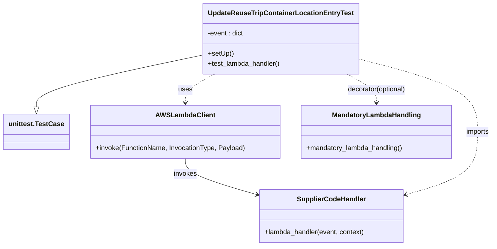

# Diagram: application_service/container_tracking_app_service/tests/test_update_reuse_trip_container_location_entry.py


> Auto-generated by Obscura crawlers

## Diagram 1

```mermaid
flowchart TD
    TR[Test Runner] --> SU[setUp()]
    SU --> LE[Load event JSON<br/>/event/update_location_entry.json]
    LE --> INV[Invoke Lambda<br/>dev-update_reuse_trip_container_location_entry]
    INV --> RESP[Read and parse response payload]
    RESP --> AS1[Assert statusCode == "200"]
    AS1 --> D{len(reuse_trip_container_location_mapping) > 1}
    D -->|Yes| M1[Assert message == "New Location ID found , insert made in the DB"]
    D -->|No| M2[Assert message == "location code already present in DB"]
```

> SVG rendering failed for this diagram.

## Diagram 2



### SVG

<svg id="container" width="1158.2109375" xmlns="http://www.w3.org/2000/svg" class="classDiagram" height="584" viewBox="0 0 1158.2109375 584" role="graphics-document document" aria-roledescription="class"><style>#container{font-family:"trebuchet ms",verdana,arial,sans-serif;font-size:16px;fill:#333;}@keyframes edge-animation-frame{from{stroke-dashoffset:0;}}@keyframes dash{to{stroke-dashoffset:0;}}#container .edge-animation-slow{stroke-dasharray:9,5!important;stroke-dashoffset:900;animation:dash 50s linear infinite;stroke-linecap:round;}#container .edge-animation-fast{stroke-dasharray:9,5!important;stroke-dashoffset:900;animation:dash 20s linear infinite;stroke-linecap:round;}#container .error-icon{fill:#552222;}#container .error-text{fill:#552222;stroke:#552222;}#container .edge-thickness-normal{stroke-width:1px;}#container .edge-thickness-thick{stroke-width:3.5px;}#container .edge-pattern-solid{stroke-dasharray:0;}#container .edge-thickness-invisible{stroke-width:0;fill:none;}#container .edge-pattern-dashed{stroke-dasharray:3;}#container .edge-pattern-dotted{stroke-dasharray:2;}#container .marker{fill:#333333;stroke:#333333;}#container .marker.cross{stroke:#333333;}#container svg{font-family:"trebuchet ms",verdana,arial,sans-serif;font-size:16px;}#container p{margin:0;}#container g.classGroup text{fill:#9370DB;stroke:none;font-family:"trebuchet ms",verdana,arial,sans-serif;font-size:10px;}#container g.classGroup text .title{font-weight:bolder;}#container .nodeLabel,#container .edgeLabel{color:#131300;}#container .edgeLabel .label rect{fill:#ECECFF;}#container .label text{fill:#131300;}#container .labelBkg{background:#ECECFF;}#container .edgeLabel .label span{background:#ECECFF;}#container .classTitle{font-weight:bolder;}#container .node rect,#container .node circle,#container .node ellipse,#container .node polygon,#container .node path{fill:#ECECFF;stroke:#9370DB;stroke-width:1px;}#container .divider{stroke:#9370DB;stroke-width:1;}#container g.clickable{cursor:pointer;}#container g.classGroup rect{fill:#ECECFF;stroke:#9370DB;}#container g.classGroup line{stroke:#9370DB;stroke-width:1;}#container .classLabel .box{stroke:none;stroke-width:0;fill:#ECECFF;opacity:0.5;}#container .classLabel .label{fill:#9370DB;font-size:10px;}#container .relation{stroke:#333333;stroke-width:1;fill:none;}#container .dashed-line{stroke-dasharray:3;}#container .dotted-line{stroke-dasharray:1 2;}#container #compositionStart,#container .composition{fill:#333333!important;stroke:#333333!important;stroke-width:1;}#container #compositionEnd,#container .composition{fill:#333333!important;stroke:#333333!important;stroke-width:1;}#container #dependencyStart,#container .dependency{fill:#333333!important;stroke:#333333!important;stroke-width:1;}#container #dependencyStart,#container .dependency{fill:#333333!important;stroke:#333333!important;stroke-width:1;}#container #extensionStart,#container .extension{fill:transparent!important;stroke:#333333!important;stroke-width:1;}#container #extensionEnd,#container .extension{fill:transparent!important;stroke:#333333!important;stroke-width:1;}#container #aggregationStart,#container .aggregation{fill:transparent!important;stroke:#333333!important;stroke-width:1;}#container #aggregationEnd,#container .aggregation{fill:transparent!important;stroke:#333333!important;stroke-width:1;}#container #lollipopStart,#container .lollipop{fill:#ECECFF!important;stroke:#333333!important;stroke-width:1;}#container #lollipopEnd,#container .lollipop{fill:#ECECFF!important;stroke:#333333!important;stroke-width:1;}#container .edgeTerminals{font-size:11px;line-height:initial;}#container .classTitleText{text-anchor:middle;font-size:18px;fill:#333;}#container .label-icon{display:inline-block;height:1em;overflow:visible;vertical-align:-0.125em;}#container .node .label-icon path{fill:currentColor;stroke:revert;stroke-width:revert;}#container :root{--mermaid-font-family:"trebuchet ms",verdana,arial,sans-serif;}</style><g><defs><marker id="container_class-aggregationStart" class="marker aggregation class" refX="18" refY="7" markerWidth="190" markerHeight="240" orient="auto"><path d="M 18,7 L9,13 L1,7 L9,1 Z"></path></marker></defs><defs><marker id="container_class-aggregationEnd" class="marker aggregation class" refX="1" refY="7" markerWidth="20" markerHeight="28" orient="auto"><path d="M 18,7 L9,13 L1,7 L9,1 Z"></path></marker></defs><defs><marker id="container_class-extensionStart" class="marker extension class" refX="18" refY="7" markerWidth="190" markerHeight="240" orient="auto"><path d="M 1,7 L18,13 V 1 Z"></path></marker></defs><defs><marker id="container_class-extensionEnd" class="marker extension class" refX="1" refY="7" markerWidth="20" markerHeight="28" orient="auto"><path d="M 1,1 V 13 L18,7 Z"></path></marker></defs><defs><marker id="container_class-compositionStart" class="marker composition class" refX="18" refY="7" markerWidth="190" markerHeight="240" orient="auto"><path d="M 18,7 L9,13 L1,7 L9,1 Z"></path></marker></defs><defs><marker id="container_class-compositionEnd" class="marker composition class" refX="1" refY="7" markerWidth="20" markerHeight="28" orient="auto"><path d="M 18,7 L9,13 L1,7 L9,1 Z"></path></marker></defs><defs><marker id="container_class-dependencyStart" class="marker dependency class" refX="6" refY="7" markerWidth="190" markerHeight="240" orient="auto"><path d="M 5,7 L9,13 L1,7 L9,1 Z"></path></marker></defs><defs><marker id="container_class-dependencyEnd" class="marker dependency class" refX="13" refY="7" markerWidth="20" markerHeight="28" orient="auto"><path d="M 18,7 L9,13 L14,7 L9,1 Z"></path></marker></defs><defs><marker id="container_class-lollipopStart" class="marker lollipop class" refX="13" refY="7" markerWidth="190" markerHeight="240" orient="auto"><circle stroke="black" fill="transparent" cx="7" cy="7" r="6"></circle></marker></defs><defs><marker id="container_class-lollipopEnd" class="marker lollipop class" refX="1" refY="7" markerWidth="190" markerHeight="240" orient="auto"><circle stroke="black" fill="transparent" cx="7" cy="7" r="6"></circle></marker></defs><g class="root"><g class="clusters"></g><g class="edgePaths"><path d="M473.717,130.281L408.549,144.068C343.382,157.854,213.046,185.427,147.879,206.005C82.711,226.583,82.711,240.167,82.711,246.958L82.711,253.75" id="id_UpdateReuseTripContainerLocationEntryTest_unittest.TestCase_1" class="edge-thickness-normal edge-pattern-solid relation" style=";;;" data-edge="true" data-et="edge" data-id="id_UpdateReuseTripContainerLocationEntryTest_unittest.TestCase_1" data-points="W3sieCI6NDczLjcxNjc5Njg3NSwieSI6MTMwLjI4MTI5MDY1NzQ1MTI4fSx7IngiOjgyLjcxMDkzNzUsInkiOjIxM30seyJ4Ijo4Mi43MTA5Mzc1LCJ5IjoyNzF9XQ==" marker-end="url(#container_class-extensionEnd)"></path><path d="M429.348,376L429.348,382.167C429.348,388.333,429.348,400.667,457.557,414.979C485.767,429.292,542.186,445.583,570.395,453.729L598.605,461.875" id="id_AWSLambdaClient_SupplierCodeHandler_2" class="edge-thickness-normal edge-pattern-solid relation" style=";;;" data-edge="true" data-et="edge" data-id="id_AWSLambdaClient_SupplierCodeHandler_2" data-points="W3sieCI6NDI5LjM0NzY1NjI1LCJ5IjozNzZ9LHsieCI6NDI5LjM0NzY1NjI1LCJ5Ijo0MTN9LHsieCI6NjA0LjM2OTE0MDYyNSwieSI6NDYzLjUzOTQ1MzcyMjAzMzN9XQ==" marker-end="url(#container_class-dependencyEnd)"></path><path d="M498.248,176L486.764,182.167C475.281,188.333,452.314,200.667,440.831,212C429.348,223.333,429.348,233.667,429.348,238.833L429.348,244" id="id_UpdateReuseTripContainerLocationEntryTest_AWSLambdaClient_3" class="edge-thickness-normal edge-pattern-dashed relation" style=";;;" data-edge="true" data-et="edge" data-id="id_UpdateReuseTripContainerLocationEntryTest_AWSLambdaClient_3" data-points="W3sieCI6NDk4LjI0Nzg1MzE3NjY1MjksInkiOjE3Nn0seyJ4Ijo0MjkuMzQ3NjU2MjUsInkiOjIxM30seyJ4Ijo0MjkuMzQ3NjU2MjUsInkiOjI1MH1d" marker-end="url(#container_class-dependencyEnd)"></path><path d="M835.623,138.856L883.346,151.213C931.069,163.571,1026.515,188.285,1074.238,217.309C1121.961,246.333,1121.961,279.667,1121.961,313C1121.961,346.333,1121.961,379.667,1093.751,404.479C1065.542,429.292,1009.123,445.583,980.913,453.729L952.704,461.875" id="id_UpdateReuseTripContainerLocationEntryTest_SupplierCodeHandler_4" class="edge-thickness-normal edge-pattern-dashed relation" style=";;;" data-edge="true" data-et="edge" data-id="id_UpdateReuseTripContainerLocationEntryTest_SupplierCodeHandler_4" data-points="W3sieCI6ODM1LjYyMzA0Njg3NSwieSI6MTM4Ljg1NTg3MjIzNTY2Njg1fSx7IngiOjExMjEuOTYwOTM3NSwieSI6MjEzfSx7IngiOjExMjEuOTYwOTM3NSwieSI6MzEzfSx7IngiOjExMjEuOTYwOTM3NSwieSI6NDEzfSx7IngiOjk0Ni45Mzk0NTMxMjUsInkiOjQ2My41Mzk0NTM3MjIwMzMzfV0=" marker-end="url(#container_class-dependencyEnd)"></path><path d="M811.092,176L822.575,182.167C834.059,188.333,857.025,200.667,868.509,212C879.992,223.333,879.992,233.667,879.992,238.833L879.992,244" id="id_UpdateReuseTripContainerLocationEntryTest_MandatoryLambdaHandling_5" class="edge-thickness-normal edge-pattern-dashed relation" style=";;;" data-edge="true" data-et="edge" data-id="id_UpdateReuseTripContainerLocationEntryTest_MandatoryLambdaHandling_5" data-points="W3sieCI6ODExLjA5MTk5MDU3MzM0NzIsInkiOjE3Nn0seyJ4Ijo4NzkuOTkyMTg3NSwieSI6MjEzfSx7IngiOjg3OS45OTIxODc1LCJ5IjoyNTB9XQ==" marker-end="url(#container_class-dependencyEnd)"></path></g><g class="edgeLabels"><g class="edgeLabel"><g class="label" data-id="id_UpdateReuseTripContainerLocationEntryTest_unittest.TestCase_1" transform="translate(0, 0)"><foreignObject width="0" height="0"><div xmlns="http://www.w3.org/1999/xhtml" class="labelBkg" style="display: table-cell; white-space: nowrap; line-height: 1.5; max-width: 200px; text-align: center;"><span class="edgeLabel"></span></div></foreignObject></g></g><g class="edgeLabel" transform="translate(429.34765625, 413)"><g class="label" data-id="id_AWSLambdaClient_SupplierCodeHandler_2" transform="translate(-27.5859375, -12)"><foreignObject width="55.171875" height="24"><div xmlns="http://www.w3.org/1999/xhtml" class="labelBkg" style="display: table-cell; white-space: nowrap; line-height: 1.5; max-width: 200px; text-align: center;"><span class="edgeLabel"><p>invokes</p></span></div></foreignObject></g></g><g class="edgeLabel" transform="translate(429.34765625, 213)"><g class="label" data-id="id_UpdateReuseTripContainerLocationEntryTest_AWSLambdaClient_3" transform="translate(-16.4921875, -12)"><foreignObject width="32.984375" height="24"><div xmlns="http://www.w3.org/1999/xhtml" class="labelBkg" style="display: table-cell; white-space: nowrap; line-height: 1.5; max-width: 200px; text-align: center;"><span class="edgeLabel"><p>uses</p></span></div></foreignObject></g></g><g class="edgeLabel" transform="translate(1121.9609375, 313)"><g class="label" data-id="id_UpdateReuseTripContainerLocationEntryTest_SupplierCodeHandler_4" transform="translate(-28.25, -12)"><foreignObject width="56.5" height="24"><div xmlns="http://www.w3.org/1999/xhtml" class="labelBkg" style="display: table-cell; white-space: nowrap; line-height: 1.5; max-width: 200px; text-align: center;"><span class="edgeLabel"><p>imports</p></span></div></foreignObject></g></g><g class="edgeLabel" transform="translate(879.9921875, 213)"><g class="label" data-id="id_UpdateReuseTripContainerLocationEntryTest_MandatoryLambdaHandling_5" transform="translate(-70.8984375, -12)"><foreignObject width="141.796875" height="24"><div xmlns="http://www.w3.org/1999/xhtml" class="labelBkg" style="display: table-cell; white-space: nowrap; line-height: 1.5; max-width: 200px; text-align: center;"><span class="edgeLabel"><p>decorator(optional)</p></span></div></foreignObject></g></g></g><g class="nodes"><g class="node default" id="classId-UpdateReuseTripContainerLocationEntryTest-0" transform="translate(654.669921875, 92)"><g class="basic label-container"><path d="M-180.953125 -84 L180.953125 -84 L180.953125 84 L-180.953125 84" stroke="none" stroke-width="0" fill="#ECECFF" style=""></path><path d="M-180.953125 -84 C-100.91061938769482 -84, -20.868113775389645 -84, 180.953125 -84 M-180.953125 -84 C-37.816194950983004 -84, 105.32073509803399 -84, 180.953125 -84 M180.953125 -84 C180.953125 -44.742978802318525, 180.953125 -5.485957604637051, 180.953125 84 M180.953125 -84 C180.953125 -31.16764026269044, 180.953125 21.66471947461912, 180.953125 84 M180.953125 84 C56.375232052241685 84, -68.20266089551663 84, -180.953125 84 M180.953125 84 C75.77030848476417 84, -29.412508030471656 84, -180.953125 84 M-180.953125 84 C-180.953125 38.28322666032423, -180.953125 -7.433546679351537, -180.953125 -84 M-180.953125 84 C-180.953125 28.499264276584086, -180.953125 -27.00147144683183, -180.953125 -84" stroke="#9370DB" stroke-width="1.3" fill="none" stroke-dasharray="0 0" style=""></path></g><g class="annotation-group text" transform="translate(0, -60)"></g><g class="label-group text" transform="translate(-164.3125, -60)"><g class="label" style="font-weight: bolder" transform="translate(0,-12)"><foreignObject width="328.625" height="24"><div xmlns="http://www.w3.org/1999/xhtml" style="display: table-cell; white-space: nowrap; line-height: 1.5; max-width: 374px; text-align: center;"><span class="nodeLabel markdown-node-label" style=""><p>UpdateReuseTripContainerLocationEntryTest</p></span></div></foreignObject></g></g><g class="members-group text" transform="translate(-168.953125, -12)"><g class="label" style="" transform="translate(0,-12)"><foreignObject width="86.609375" height="24"><div xmlns="http://www.w3.org/1999/xhtml" style="display: table-cell; white-space: nowrap; line-height: 1.5; max-width: 144px; text-align: center;"><span class="nodeLabel markdown-node-label" style=""><p>-event : dict</p></span></div></foreignObject></g></g><g class="methods-group text" transform="translate(-168.953125, 36)"><g class="label" style="" transform="translate(0,-12)"><foreignObject width="60.421875" height="24"><div xmlns="http://www.w3.org/1999/xhtml" style="display: table-cell; white-space: nowrap; line-height: 1.5; max-width: 118px; text-align: center;"><span class="nodeLabel markdown-node-label" style=""><p>+setUp()</p></span></div></foreignObject></g><g class="label" style="" transform="translate(0,12)"><foreignObject width="173.59375" height="24"><div xmlns="http://www.w3.org/1999/xhtml" style="display: table-cell; white-space: nowrap; line-height: 1.5; max-width: 231px; text-align: center;"><span class="nodeLabel markdown-node-label" style=""><p>+test_lambda_handler()</p></span></div></foreignObject></g></g><g class="divider" style=""><path d="M-180.953125 -36 C-76.49117539715287 -36, 27.970774205694255 -36, 180.953125 -36 M-180.953125 -36 C-101.01032066530753 -36, -21.067516330615064 -36, 180.953125 -36" stroke="#9370DB" stroke-width="1.3" fill="none" stroke-dasharray="0 0" style=""></path></g><g class="divider" style=""><path d="M-180.953125 12 C-100.13679391352318 12, -19.320462827046356 12, 180.953125 12 M-180.953125 12 C-59.41192939581863 12, 62.129266208362736 12, 180.953125 12" stroke="#9370DB" stroke-width="1.3" fill="none" stroke-dasharray="0 0" style=""></path></g></g><g class="node default" id="classId-unittest.TestCase-1" transform="translate(82.7109375, 313)"><g class="basic label-container"><path d="M-74.7109375 -42 L74.7109375 -42 L74.7109375 42 L-74.7109375 42" stroke="none" stroke-width="0" fill="#ECECFF" style=""></path><path d="M-74.7109375 -42 C-19.902907163535545 -42, 34.90512317292891 -42, 74.7109375 -42 M-74.7109375 -42 C-37.52892903218787 -42, -0.34692056437573626 -42, 74.7109375 -42 M74.7109375 -42 C74.7109375 -9.25101554298427, 74.7109375 23.49796891403146, 74.7109375 42 M74.7109375 -42 C74.7109375 -20.84498734527256, 74.7109375 0.31002530945487905, 74.7109375 42 M74.7109375 42 C20.01104065892551 42, -34.68885618214898 42, -74.7109375 42 M74.7109375 42 C26.560958977257258 42, -21.589019545485485 42, -74.7109375 42 M-74.7109375 42 C-74.7109375 12.742895386222575, -74.7109375 -16.51420922755485, -74.7109375 -42 M-74.7109375 42 C-74.7109375 23.478817593023756, -74.7109375 4.957635186047511, -74.7109375 -42" stroke="#9370DB" stroke-width="1.3" fill="none" stroke-dasharray="0 0" style=""></path></g><g class="annotation-group text" transform="translate(0, -18)"></g><g class="label-group text" transform="translate(-62.7109375, -18)"><g class="label" style="font-weight: bolder" transform="translate(0,-12)"><foreignObject width="125.421875" height="24"><div xmlns="http://www.w3.org/1999/xhtml" style="display: table-cell; white-space: nowrap; line-height: 1.5; max-width: 172px; text-align: center;"><span class="nodeLabel markdown-node-label" style=""><p>unittest.TestCase</p></span></div></foreignObject></g></g><g class="members-group text" transform="translate(-62.7109375, 30)"></g><g class="methods-group text" transform="translate(-62.7109375, 60)"></g><g class="divider" style=""><path d="M-74.7109375 6 C-34.35522138520853 6, 6.00049472958294 6, 74.7109375 6 M-74.7109375 6 C-28.325233266747134 6, 18.060470966505733 6, 74.7109375 6" stroke="#9370DB" stroke-width="1.3" fill="none" stroke-dasharray="0 0" style=""></path></g><g class="divider" style=""><path d="M-74.7109375 24 C-36.72301345949557 24, 1.2649105810088628 24, 74.7109375 24 M-74.7109375 24 C-31.23015252336183 24, 12.250632453276339 24, 74.7109375 24" stroke="#9370DB" stroke-width="1.3" fill="none" stroke-dasharray="0 0" style=""></path></g></g><g class="node default" id="classId-AWSLambdaClient-2" transform="translate(429.34765625, 313)"><g class="basic label-container"><path d="M-221.92578125 -63 L221.92578125 -63 L221.92578125 63 L-221.92578125 63" stroke="none" stroke-width="0" fill="#ECECFF" style=""></path><path d="M-221.92578125 -63 C-56.0156233636996 -63, 109.8945345226008 -63, 221.92578125 -63 M-221.92578125 -63 C-55.11008151198192 -63, 111.70561822603617 -63, 221.92578125 -63 M221.92578125 -63 C221.92578125 -13.167425925535255, 221.92578125 36.66514814892949, 221.92578125 63 M221.92578125 -63 C221.92578125 -17.78655169147448, 221.92578125 27.426896617051042, 221.92578125 63 M221.92578125 63 C53.01445996898087 63, -115.89686131203825 63, -221.92578125 63 M221.92578125 63 C78.44887512887004 63, -65.02803099225991 63, -221.92578125 63 M-221.92578125 63 C-221.92578125 25.701730980391858, -221.92578125 -11.596538039216284, -221.92578125 -63 M-221.92578125 63 C-221.92578125 30.999701826258317, -221.92578125 -1.0005963474833663, -221.92578125 -63" stroke="#9370DB" stroke-width="1.3" fill="none" stroke-dasharray="0 0" style=""></path></g><g class="annotation-group text" transform="translate(0, -39)"></g><g class="label-group text" transform="translate(-66.3984375, -39)"><g class="label" style="font-weight: bolder" transform="translate(0,-12)"><foreignObject width="132.796875" height="24"><div xmlns="http://www.w3.org/1999/xhtml" style="display: table-cell; white-space: nowrap; line-height: 1.5; max-width: 181px; text-align: center;"><span class="nodeLabel markdown-node-label" style=""><p>AWSLambdaClient</p></span></div></foreignObject></g></g><g class="members-group text" transform="translate(-209.92578125, 9)"></g><g class="methods-group text" transform="translate(-209.92578125, 39)"><g class="label" style="" transform="translate(0,-12)"><foreignObject width="353.453125" height="24"><div xmlns="http://www.w3.org/1999/xhtml" style="display: table-cell; white-space: nowrap; line-height: 1.5; max-width: 411px; text-align: center;"><span class="nodeLabel markdown-node-label" style=""><p>+invoke(FunctionName, InvocationType, Payload)</p></span></div></foreignObject></g></g><g class="divider" style=""><path d="M-221.92578125 -15 C-82.98185062449602 -15, 55.96208000100796 -15, 221.92578125 -15 M-221.92578125 -15 C-82.47909745615422 -15, 56.96758633769156 -15, 221.92578125 -15" stroke="#9370DB" stroke-width="1.3" fill="none" stroke-dasharray="0 0" style=""></path></g><g class="divider" style=""><path d="M-221.92578125 9 C-112.6532624880167 9, -3.380743726033387 9, 221.92578125 9 M-221.92578125 9 C-110.25567956829649 9, 1.4144221134070278 9, 221.92578125 9" stroke="#9370DB" stroke-width="1.3" fill="none" stroke-dasharray="0 0" style=""></path></g></g><g class="node default" id="classId-SupplierCodeHandler-3" transform="translate(775.654296875, 513)"><g class="basic label-container"><path d="M-171.28515625 -63 L171.28515625 -63 L171.28515625 63 L-171.28515625 63" stroke="none" stroke-width="0" fill="#ECECFF" style=""></path><path d="M-171.28515625 -63 C-40.75262324066489 -63, 89.77990976867022 -63, 171.28515625 -63 M-171.28515625 -63 C-63.106048615690085 -63, 45.07305901861983 -63, 171.28515625 -63 M171.28515625 -63 C171.28515625 -31.618789225493806, 171.28515625 -0.23757845098761265, 171.28515625 63 M171.28515625 -63 C171.28515625 -16.642479597884275, 171.28515625 29.71504080423145, 171.28515625 63 M171.28515625 63 C75.07315233828714 63, -21.13885157342571 63, -171.28515625 63 M171.28515625 63 C58.294466771842906 63, -54.69622270631419 63, -171.28515625 63 M-171.28515625 63 C-171.28515625 13.259531411522495, -171.28515625 -36.48093717695501, -171.28515625 -63 M-171.28515625 63 C-171.28515625 30.871937723518357, -171.28515625 -1.2561245529632856, -171.28515625 -63" stroke="#9370DB" stroke-width="1.3" fill="none" stroke-dasharray="0 0" style=""></path></g><g class="annotation-group text" transform="translate(0, -39)"></g><g class="label-group text" transform="translate(-78.3828125, -39)"><g class="label" style="font-weight: bolder" transform="translate(0,-12)"><foreignObject width="156.765625" height="24"><div xmlns="http://www.w3.org/1999/xhtml" style="display: table-cell; white-space: nowrap; line-height: 1.5; max-width: 206px; text-align: center;"><span class="nodeLabel markdown-node-label" style=""><p>SupplierCodeHandler</p></span></div></foreignObject></g></g><g class="members-group text" transform="translate(-159.28515625, 9)"></g><g class="methods-group text" transform="translate(-159.28515625, 39)"><g class="label" style="" transform="translate(0,-12)"><foreignObject width="240.1875" height="24"><div xmlns="http://www.w3.org/1999/xhtml" style="display: table-cell; white-space: nowrap; line-height: 1.5; max-width: 298px; text-align: center;"><span class="nodeLabel markdown-node-label" style=""><p>+lambda_handler(event, context)</p></span></div></foreignObject></g></g><g class="divider" style=""><path d="M-171.28515625 -15 C-34.912667914928846 -15, 101.45982042014231 -15, 171.28515625 -15 M-171.28515625 -15 C-56.02984472082383 -15, 59.22546680835234 -15, 171.28515625 -15" stroke="#9370DB" stroke-width="1.3" fill="none" stroke-dasharray="0 0" style=""></path></g><g class="divider" style=""><path d="M-171.28515625 9 C-37.93320159161672 9, 95.41875306676656 9, 171.28515625 9 M-171.28515625 9 C-57.3191405914868 9, 56.6468750670264 9, 171.28515625 9" stroke="#9370DB" stroke-width="1.3" fill="none" stroke-dasharray="0 0" style=""></path></g></g><g class="node default" id="classId-MandatoryLambdaHandling-4" transform="translate(879.9921875, 313)"><g class="basic label-container"><path d="M-178.71875 -63 L178.71875 -63 L178.71875 63 L-178.71875 63" stroke="none" stroke-width="0" fill="#ECECFF" style=""></path><path d="M-178.71875 -63 C-93.50636317187161 -63, -8.293976343743225 -63, 178.71875 -63 M-178.71875 -63 C-68.84871775085492 -63, 41.02131449829017 -63, 178.71875 -63 M178.71875 -63 C178.71875 -34.91712677335619, 178.71875 -6.834253546712375, 178.71875 63 M178.71875 -63 C178.71875 -20.347687088355258, 178.71875 22.304625823289484, 178.71875 63 M178.71875 63 C50.84803142800668 63, -77.02268714398664 63, -178.71875 63 M178.71875 63 C73.43554127959757 63, -31.847667440804855 63, -178.71875 63 M-178.71875 63 C-178.71875 31.899927989957977, -178.71875 0.7998559799159537, -178.71875 -63 M-178.71875 63 C-178.71875 15.024135311334831, -178.71875 -32.95172937733034, -178.71875 -63" stroke="#9370DB" stroke-width="1.3" fill="none" stroke-dasharray="0 0" style=""></path></g><g class="annotation-group text" transform="translate(0, -39)"></g><g class="label-group text" transform="translate(-101.359375, -39)"><g class="label" style="font-weight: bolder" transform="translate(0,-12)"><foreignObject width="202.71875" height="24"><div xmlns="http://www.w3.org/1999/xhtml" style="display: table-cell; white-space: nowrap; line-height: 1.5; max-width: 252px; text-align: center;"><span class="nodeLabel markdown-node-label" style=""><p>MandatoryLambdaHandling</p></span></div></foreignObject></g></g><g class="members-group text" transform="translate(-166.71875, 9)"></g><g class="methods-group text" transform="translate(-166.71875, 39)"><g class="label" style="" transform="translate(0,-12)"><foreignObject width="232.078125" height="24"><div xmlns="http://www.w3.org/1999/xhtml" style="display: table-cell; white-space: nowrap; line-height: 1.5; max-width: 289px; text-align: center;"><span class="nodeLabel markdown-node-label" style=""><p>+mandatory_lambda_handling()</p></span></div></foreignObject></g></g><g class="divider" style=""><path d="M-178.71875 -15 C-74.32174264775973 -15, 30.07526470448053 -15, 178.71875 -15 M-178.71875 -15 C-62.83177370169399 -15, 53.05520259661202 -15, 178.71875 -15" stroke="#9370DB" stroke-width="1.3" fill="none" stroke-dasharray="0 0" style=""></path></g><g class="divider" style=""><path d="M-178.71875 9 C-80.55758801980116 9, 17.603573960397682 9, 178.71875 9 M-178.71875 9 C-62.03682005850601 9, 54.64510988298798 9, 178.71875 9" stroke="#9370DB" stroke-width="1.3" fill="none" stroke-dasharray="0 0" style=""></path></g></g></g></g></g></svg>
