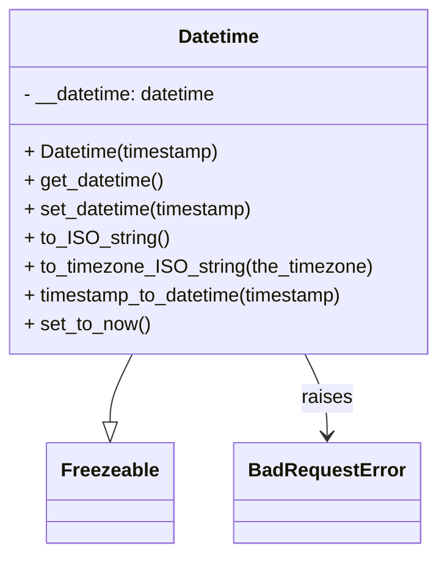

# Diagram: application_service/container_tracking_app_service/utility/Datetime.py


> Auto-generated by Obscura crawlers

## Diagram 1



### SVG

<svg id="container" width="365.7890625" xmlns="http://www.w3.org/2000/svg" class="classDiagram" height="462" viewBox="0 0 365.7890625 462" role="graphics-document document" aria-roledescription="class"><style>#container{font-family:"trebuchet ms",verdana,arial,sans-serif;font-size:16px;fill:#333;}@keyframes edge-animation-frame{from{stroke-dashoffset:0;}}@keyframes dash{to{stroke-dashoffset:0;}}#container .edge-animation-slow{stroke-dasharray:9,5!important;stroke-dashoffset:900;animation:dash 50s linear infinite;stroke-linecap:round;}#container .edge-animation-fast{stroke-dasharray:9,5!important;stroke-dashoffset:900;animation:dash 20s linear infinite;stroke-linecap:round;}#container .error-icon{fill:#552222;}#container .error-text{fill:#552222;stroke:#552222;}#container .edge-thickness-normal{stroke-width:1px;}#container .edge-thickness-thick{stroke-width:3.5px;}#container .edge-pattern-solid{stroke-dasharray:0;}#container .edge-thickness-invisible{stroke-width:0;fill:none;}#container .edge-pattern-dashed{stroke-dasharray:3;}#container .edge-pattern-dotted{stroke-dasharray:2;}#container .marker{fill:#333333;stroke:#333333;}#container .marker.cross{stroke:#333333;}#container svg{font-family:"trebuchet ms",verdana,arial,sans-serif;font-size:16px;}#container p{margin:0;}#container g.classGroup text{fill:#9370DB;stroke:none;font-family:"trebuchet ms",verdana,arial,sans-serif;font-size:10px;}#container g.classGroup text .title{font-weight:bolder;}#container .nodeLabel,#container .edgeLabel{color:#131300;}#container .edgeLabel .label rect{fill:#ECECFF;}#container .label text{fill:#131300;}#container .labelBkg{background:#ECECFF;}#container .edgeLabel .label span{background:#ECECFF;}#container .classTitle{font-weight:bolder;}#container .node rect,#container .node circle,#container .node ellipse,#container .node polygon,#container .node path{fill:#ECECFF;stroke:#9370DB;stroke-width:1px;}#container .divider{stroke:#9370DB;stroke-width:1;}#container g.clickable{cursor:pointer;}#container g.classGroup rect{fill:#ECECFF;stroke:#9370DB;}#container g.classGroup line{stroke:#9370DB;stroke-width:1;}#container .classLabel .box{stroke:none;stroke-width:0;fill:#ECECFF;opacity:0.5;}#container .classLabel .label{fill:#9370DB;font-size:10px;}#container .relation{stroke:#333333;stroke-width:1;fill:none;}#container .dashed-line{stroke-dasharray:3;}#container .dotted-line{stroke-dasharray:1 2;}#container #compositionStart,#container .composition{fill:#333333!important;stroke:#333333!important;stroke-width:1;}#container #compositionEnd,#container .composition{fill:#333333!important;stroke:#333333!important;stroke-width:1;}#container #dependencyStart,#container .dependency{fill:#333333!important;stroke:#333333!important;stroke-width:1;}#container #dependencyStart,#container .dependency{fill:#333333!important;stroke:#333333!important;stroke-width:1;}#container #extensionStart,#container .extension{fill:transparent!important;stroke:#333333!important;stroke-width:1;}#container #extensionEnd,#container .extension{fill:transparent!important;stroke:#333333!important;stroke-width:1;}#container #aggregationStart,#container .aggregation{fill:transparent!important;stroke:#333333!important;stroke-width:1;}#container #aggregationEnd,#container .aggregation{fill:transparent!important;stroke:#333333!important;stroke-width:1;}#container #lollipopStart,#container .lollipop{fill:#ECECFF!important;stroke:#333333!important;stroke-width:1;}#container #lollipopEnd,#container .lollipop{fill:#ECECFF!important;stroke:#333333!important;stroke-width:1;}#container .edgeTerminals{font-size:11px;line-height:initial;}#container .classTitleText{text-anchor:middle;font-size:18px;fill:#333;}#container .label-icon{display:inline-block;height:1em;overflow:visible;vertical-align:-0.125em;}#container .node .label-icon path{fill:currentColor;stroke:revert;stroke-width:revert;}#container :root{--mermaid-font-family:"trebuchet ms",verdana,arial,sans-serif;}</style><g><defs><marker id="container_class-aggregationStart" class="marker aggregation class" refX="18" refY="7" markerWidth="190" markerHeight="240" orient="auto"><path d="M 18,7 L9,13 L1,7 L9,1 Z"></path></marker></defs><defs><marker id="container_class-aggregationEnd" class="marker aggregation class" refX="1" refY="7" markerWidth="20" markerHeight="28" orient="auto"><path d="M 18,7 L9,13 L1,7 L9,1 Z"></path></marker></defs><defs><marker id="container_class-extensionStart" class="marker extension class" refX="18" refY="7" markerWidth="190" markerHeight="240" orient="auto"><path d="M 1,7 L18,13 V 1 Z"></path></marker></defs><defs><marker id="container_class-extensionEnd" class="marker extension class" refX="1" refY="7" markerWidth="20" markerHeight="28" orient="auto"><path d="M 1,1 V 13 L18,7 Z"></path></marker></defs><defs><marker id="container_class-compositionStart" class="marker composition class" refX="18" refY="7" markerWidth="190" markerHeight="240" orient="auto"><path d="M 18,7 L9,13 L1,7 L9,1 Z"></path></marker></defs><defs><marker id="container_class-compositionEnd" class="marker composition class" refX="1" refY="7" markerWidth="20" markerHeight="28" orient="auto"><path d="M 18,7 L9,13 L1,7 L9,1 Z"></path></marker></defs><defs><marker id="container_class-dependencyStart" class="marker dependency class" refX="6" refY="7" markerWidth="190" markerHeight="240" orient="auto"><path d="M 5,7 L9,13 L1,7 L9,1 Z"></path></marker></defs><defs><marker id="container_class-dependencyEnd" class="marker dependency class" refX="13" refY="7" markerWidth="20" markerHeight="28" orient="auto"><path d="M 18,7 L9,13 L14,7 L9,1 Z"></path></marker></defs><defs><marker id="container_class-lollipopStart" class="marker lollipop class" refX="13" refY="7" markerWidth="190" markerHeight="240" orient="auto"><circle stroke="black" fill="transparent" cx="7" cy="7" r="6"></circle></marker></defs><defs><marker id="container_class-lollipopEnd" class="marker lollipop class" refX="1" refY="7" markerWidth="190" markerHeight="240" orient="auto"><circle stroke="black" fill="transparent" cx="7" cy="7" r="6"></circle></marker></defs><g class="root"><g class="clusters"></g><g class="edgePaths"><path d="M113.092,296L110.102,302.167C107.113,308.333,101.135,320.667,98.145,330.125C95.156,339.583,95.156,346.167,95.156,349.458L95.156,352.75" id="id_Datetime_Freezeable_1" class="edge-thickness-normal edge-pattern-solid relation" style=";;;" data-edge="true" data-et="edge" data-id="id_Datetime_Freezeable_1" data-points="W3sieCI6MTEzLjA5MTY5OTc1ODI4NzI5LCJ5IjoyOTZ9LHsieCI6OTUuMTU2MjUsInkiOjMzM30seyJ4Ijo5NS4xNTYyNSwieSI6MzcwfV0=" marker-end="url(#container_class-extensionEnd)"></path><path d="M252.697,296L255.687,302.167C258.676,308.333,264.654,320.667,267.644,332C270.633,343.333,270.633,353.667,270.633,358.833L270.633,364" id="id_Datetime_BadRequestError_2" class="edge-thickness-normal edge-pattern-solid relation" style=";;;" data-edge="true" data-et="edge" data-id="id_Datetime_BadRequestError_2" data-points="W3sieCI6MjUyLjY5NzM2Mjc0MTcxMjcsInkiOjI5Nn0seyJ4IjoyNzAuNjMyODEyNSwieSI6MzMzfSx7IngiOjI3MC42MzI4MTI1LCJ5IjozNzB9XQ==" marker-end="url(#container_class-dependencyEnd)"></path></g><g class="edgeLabels"><g class="edgeLabel"><g class="label" data-id="id_Datetime_Freezeable_1" transform="translate(0, 0)"><foreignObject width="0" height="0"><div xmlns="http://www.w3.org/1999/xhtml" class="labelBkg" style="display: table-cell; white-space: nowrap; line-height: 1.5; max-width: 200px; text-align: center;"><span class="edgeLabel"></span></div></foreignObject></g></g><g class="edgeLabel" transform="translate(270.6328125, 333)"><g class="label" data-id="id_Datetime_BadRequestError_2" transform="translate(-21.25, -12)"><foreignObject width="42.5" height="24"><div xmlns="http://www.w3.org/1999/xhtml" class="labelBkg" style="display: table-cell; white-space: nowrap; line-height: 1.5; max-width: 200px; text-align: center;"><span class="edgeLabel"><p>raises</p></span></div></foreignObject></g></g></g><g class="nodes"><g class="node default" id="classId-Datetime-0" transform="translate(182.89453125, 152)"><g class="basic label-container"><path d="M-174.89453125 -144 L174.89453125 -144 L174.89453125 144 L-174.89453125 144" stroke="none" stroke-width="0" fill="#ECECFF" style=""></path><path d="M-174.89453125 -144 C-94.09875392463947 -144, -13.302976599278935 -144, 174.89453125 -144 M-174.89453125 -144 C-88.40522380230419 -144, -1.9159163546083846 -144, 174.89453125 -144 M174.89453125 -144 C174.89453125 -30.941034002191955, 174.89453125 82.11793199561609, 174.89453125 144 M174.89453125 -144 C174.89453125 -77.09734086722203, 174.89453125 -10.19468173444406, 174.89453125 144 M174.89453125 144 C71.20191179627615 144, -32.4907076574477 144, -174.89453125 144 M174.89453125 144 C96.78748083175782 144, 18.680430413515637 144, -174.89453125 144 M-174.89453125 144 C-174.89453125 39.07050594380415, -174.89453125 -65.8589881123917, -174.89453125 -144 M-174.89453125 144 C-174.89453125 32.58359007890719, -174.89453125 -78.83281984218561, -174.89453125 -144" stroke="#9370DB" stroke-width="1.3" fill="none" stroke-dasharray="0 0" style=""></path></g><g class="annotation-group text" transform="translate(0, -120)"></g><g class="label-group text" transform="translate(-33.3984375, -120)"><g class="label" style="font-weight: bolder" transform="translate(0,-12)"><foreignObject width="66.796875" height="24"><div xmlns="http://www.w3.org/1999/xhtml" style="display: table-cell; white-space: nowrap; line-height: 1.5; max-width: 116px; text-align: center;"><span class="nodeLabel markdown-node-label" style=""><p>Datetime</p></span></div></foreignObject></g></g><g class="members-group text" transform="translate(-162.89453125, -72)"><g class="label" style="" transform="translate(0,-12)"><foreignObject width="165.4375" height="24"><div xmlns="http://www.w3.org/1999/xhtml" style="display: table-cell; white-space: nowrap; line-height: 1.5; max-width: 223px; text-align: center;"><span class="nodeLabel markdown-node-label" style=""><p>- __datetime: datetime</p></span></div></foreignObject></g></g><g class="methods-group text" transform="translate(-162.89453125, -24)"><g class="label" style="" transform="translate(0,-12)"><foreignObject width="166.203125" height="24"><div xmlns="http://www.w3.org/1999/xhtml" style="display: table-cell; white-space: nowrap; line-height: 1.5; max-width: 224px; text-align: center;"><span class="nodeLabel markdown-node-label" style=""><p>+ Datetime(timestamp)</p></span></div></foreignObject></g><g class="label" style="" transform="translate(0,12)"><foreignObject width="118.40625" height="24"><div xmlns="http://www.w3.org/1999/xhtml" style="display: table-cell; white-space: nowrap; line-height: 1.5; max-width: 176px; text-align: center;"><span class="nodeLabel markdown-node-label" style=""><p>+ get_datetime()</p></span></div></foreignObject></g><g class="label" style="" transform="translate(0,36)"><foreignObject width="195.59375" height="24"><div xmlns="http://www.w3.org/1999/xhtml" style="display: table-cell; white-space: nowrap; line-height: 1.5; max-width: 253px; text-align: center;"><span class="nodeLabel markdown-node-label" style=""><p>+ set_datetime(timestamp)</p></span></div></foreignObject></g><g class="label" style="" transform="translate(0,60)"><foreignObject width="119.296875" height="24"><div xmlns="http://www.w3.org/1999/xhtml" style="display: table-cell; white-space: nowrap; line-height: 1.5; max-width: 177px; text-align: center;"><span class="nodeLabel markdown-node-label" style=""><p>+ to_ISO_string()</p></span></div></foreignObject></g><g class="label" style="" transform="translate(0,84)"><foreignObject width="292.390625" height="24"><div xmlns="http://www.w3.org/1999/xhtml" style="display: table-cell; white-space: nowrap; line-height: 1.5; max-width: 350px; text-align: center;"><span class="nodeLabel markdown-node-label" style=""><p>+ to_timezone_ISO_string(the_timezone)</p></span></div></foreignObject></g><g class="label" style="" transform="translate(0,108)"><foreignObject width="273.640625" height="24"><div xmlns="http://www.w3.org/1999/xhtml" style="display: table-cell; white-space: nowrap; line-height: 1.5; max-width: 331px; text-align: center;"><span class="nodeLabel markdown-node-label" style=""><p>+ timestamp_to_datetime(timestamp)</p></span></div></foreignObject></g><g class="label" style="" transform="translate(0,132)"><foreignObject width="105.640625" height="24"><div xmlns="http://www.w3.org/1999/xhtml" style="display: table-cell; white-space: nowrap; line-height: 1.5; max-width: 163px; text-align: center;"><span class="nodeLabel markdown-node-label" style=""><p>+ set_to_now()</p></span></div></foreignObject></g></g><g class="divider" style=""><path d="M-174.89453125 -96 C-43.445260548341366 -96, 88.00401015331727 -96, 174.89453125 -96 M-174.89453125 -96 C-37.50603838170693 -96, 99.88245448658614 -96, 174.89453125 -96" stroke="#9370DB" stroke-width="1.3" fill="none" stroke-dasharray="0 0" style=""></path></g><g class="divider" style=""><path d="M-174.89453125 -48 C-104.66889216303936 -48, -34.44325307607872 -48, 174.89453125 -48 M-174.89453125 -48 C-41.10636164941542 -48, 92.68180795116916 -48, 174.89453125 -48" stroke="#9370DB" stroke-width="1.3" fill="none" stroke-dasharray="0 0" style=""></path></g></g><g class="node default" id="classId-Freezeable-1" transform="translate(95.15625, 412)"><g class="basic label-container"><path d="M-51.1953125 -42 L51.1953125 -42 L51.1953125 42 L-51.1953125 42" stroke="none" stroke-width="0" fill="#ECECFF" style=""></path><path d="M-51.1953125 -42 C-13.33708312746122 -42, 24.52114624507756 -42, 51.1953125 -42 M-51.1953125 -42 C-20.828985951294186 -42, 9.537340597411628 -42, 51.1953125 -42 M51.1953125 -42 C51.1953125 -19.384866494068202, 51.1953125 3.230267011863596, 51.1953125 42 M51.1953125 -42 C51.1953125 -13.705656012960699, 51.1953125 14.588687974078603, 51.1953125 42 M51.1953125 42 C16.57839670642531 42, -18.038519087149382 42, -51.1953125 42 M51.1953125 42 C26.76238220764104 42, 2.3294519152820783 42, -51.1953125 42 M-51.1953125 42 C-51.1953125 21.265482777958866, -51.1953125 0.5309655559177315, -51.1953125 -42 M-51.1953125 42 C-51.1953125 12.182115304633804, -51.1953125 -17.635769390732392, -51.1953125 -42" stroke="#9370DB" stroke-width="1.3" fill="none" stroke-dasharray="0 0" style=""></path></g><g class="annotation-group text" transform="translate(0, -18)"></g><g class="label-group text" transform="translate(-39.1953125, -18)"><g class="label" style="font-weight: bolder" transform="translate(0,-12)"><foreignObject width="78.390625" height="24"><div xmlns="http://www.w3.org/1999/xhtml" style="display: table-cell; white-space: nowrap; line-height: 1.5; max-width: 127px; text-align: center;"><span class="nodeLabel markdown-node-label" style=""><p>Freezeable</p></span></div></foreignObject></g></g><g class="members-group text" transform="translate(-39.1953125, 30)"></g><g class="methods-group text" transform="translate(-39.1953125, 60)"></g><g class="divider" style=""><path d="M-51.1953125 6 C-21.96693561130781 6, 7.261441277384378 6, 51.1953125 6 M-51.1953125 6 C-19.02873707368036 6, 13.137838352639278 6, 51.1953125 6" stroke="#9370DB" stroke-width="1.3" fill="none" stroke-dasharray="0 0" style=""></path></g><g class="divider" style=""><path d="M-51.1953125 24 C-16.883203087993152 24, 17.428906324013695 24, 51.1953125 24 M-51.1953125 24 C-17.332448461594062 24, 16.530415576811876 24, 51.1953125 24" stroke="#9370DB" stroke-width="1.3" fill="none" stroke-dasharray="0 0" style=""></path></g></g><g class="node default" id="classId-BadRequestError-2" transform="translate(270.6328125, 412)"><g class="basic label-container"><path d="M-74.28125 -42 L74.28125 -42 L74.28125 42 L-74.28125 42" stroke="none" stroke-width="0" fill="#ECECFF" style=""></path><path d="M-74.28125 -42 C-36.946579239665084 -42, 0.3880915206698319 -42, 74.28125 -42 M-74.28125 -42 C-26.294553087056244 -42, 21.692143825887513 -42, 74.28125 -42 M74.28125 -42 C74.28125 -22.664187856647366, 74.28125 -3.328375713294733, 74.28125 42 M74.28125 -42 C74.28125 -13.205172797438816, 74.28125 15.589654405122367, 74.28125 42 M74.28125 42 C43.947962900418695 42, 13.61467580083739 42, -74.28125 42 M74.28125 42 C27.47475898041982 42, -19.331732039160357 42, -74.28125 42 M-74.28125 42 C-74.28125 13.55161577279144, -74.28125 -14.89676845441712, -74.28125 -42 M-74.28125 42 C-74.28125 13.500666196830306, -74.28125 -14.998667606339389, -74.28125 -42" stroke="#9370DB" stroke-width="1.3" fill="none" stroke-dasharray="0 0" style=""></path></g><g class="annotation-group text" transform="translate(0, -18)"></g><g class="label-group text" transform="translate(-62.28125, -18)"><g class="label" style="font-weight: bolder" transform="translate(0,-12)"><foreignObject width="124.5625" height="24"><div xmlns="http://www.w3.org/1999/xhtml" style="display: table-cell; white-space: nowrap; line-height: 1.5; max-width: 174px; text-align: center;"><span class="nodeLabel markdown-node-label" style=""><p>BadRequestError</p></span></div></foreignObject></g></g><g class="members-group text" transform="translate(-62.28125, 30)"></g><g class="methods-group text" transform="translate(-62.28125, 60)"></g><g class="divider" style=""><path d="M-74.28125 6 C-33.83715941267293 6, 6.606931174654136 6, 74.28125 6 M-74.28125 6 C-31.079983412078946 6, 12.121283175842109 6, 74.28125 6" stroke="#9370DB" stroke-width="1.3" fill="none" stroke-dasharray="0 0" style=""></path></g><g class="divider" style=""><path d="M-74.28125 24 C-41.716157917174904 24, -9.151065834349808 24, 74.28125 24 M-74.28125 24 C-27.05973022748224 24, 20.161789545035518 24, 74.28125 24" stroke="#9370DB" stroke-width="1.3" fill="none" stroke-dasharray="0 0" style=""></path></g></g></g></g></g></svg>

## Diagram 2

```mermaid
flowchart TD
Start([start]) --> Validate{timestamp not None\nand is str}
Validate --> RevReplaceZ[reverse string and replace "Z" -> "CTU"]
RevReplaceZ --> ReplaceTZ[replace TZ abbrevs using _TIMEZONES map]
ReplaceTZ --> CheckColon{matches regex [+-]HH:MM at end?}
CheckColon -->|yes| RemoveLastColon[remove last ":" from timezone]
CheckColon -->|no| SkipRemove
RemoveLastColon --> ReSub[re.sub to compact tz digits]
SkipRemove --> ReSub
ReSub --> TryParse[for pattern in _PATTERNS\ntry datetime.strptime]
TryParse --> Parsed{parsed?}
Parsed -->|yes| EnsureTZ[if no tzinfo then set tzinfo=UTC]
EnsureTZ --> ToUTC[astimezone UTC]
ToUTC --> SetDatetime[call set_datetime(new_datetime)]
SetDatetime --> ReturnSelf[return self]
Parsed -->|no| NextPattern[try next pattern]
NextPattern --> TryParse
Parsed -->|none matched| RaiseError[raise BadRequestError("Invalid timestamp format")]
RaiseError --> End([end])
```

> SVG rendering failed for this diagram.
