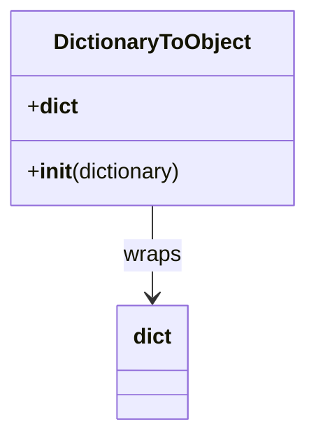

# Diagram: application_service/container_tracking_app_service/utility/DictionaryToObject.py

> Auto-generated by Obscura crawlers

## Mermaid

### SVG

<svg id="container" width="226.390625" xmlns="http://www.w3.org/2000/svg" class="classDiagram" height="318" viewBox="0 0 226.390625 318" role="graphics-document document" aria-roledescription="class"><g><defs><marker id="container_class-aggregationStart" class="marker aggregation class" refX="18" refY="7" markerWidth="190" markerHeight="240" orient="auto"><path d="M 18,7 L9,13 L1,7 L9,1 Z"></path></marker></defs><defs><marker id="container_class-aggregationEnd" class="marker aggregation class" refX="1" refY="7" markerWidth="20" markerHeight="28" orient="auto"><path d="M 18,7 L9,13 L1,7 L9,1 Z"></path></marker></defs><defs><marker id="container_class-extensionStart" class="marker extension class" refX="18" refY="7" markerWidth="190" markerHeight="240" orient="auto"><path d="M 1,7 L18,13 V 1 Z"></path></marker></defs><defs><marker id="container_class-extensionEnd" class="marker extension class" refX="1" refY="7" markerWidth="20" markerHeight="28" orient="auto"><path d="M 1,1 V 13 L18,7 Z"></path></marker></defs><defs><marker id="container_class-compositionStart" class="marker composition class" refX="18" refY="7" markerWidth="190" markerHeight="240" orient="auto"><path d="M 18,7 L9,13 L1,7 L9,1 Z"></path></marker></defs><defs><marker id="container_class-compositionEnd" class="marker composition class" refX="1" refY="7" markerWidth="20" markerHeight="28" orient="auto"><path d="M 18,7 L9,13 L1,7 L9,1 Z"></path></marker></defs><defs><marker id="container_class-dependencyStart" class="marker dependency class" refX="6" refY="7" markerWidth="190" markerHeight="240" orient="auto"><path d="M 5,7 L9,13 L1,7 L9,1 Z"></path></marker></defs><defs><marker id="container_class-dependencyEnd" class="marker dependency class" refX="13" refY="7" markerWidth="20" markerHeight="28" orient="auto"><path d="M 18,7 L9,13 L14,7 L9,1 Z"></path></marker></defs><defs><marker id="container_class-lollipopStart" class="marker lollipop class" refX="13" refY="7" markerWidth="190" markerHeight="240" orient="auto"><circle stroke="black" fill="transparent" cx="7" cy="7" r="6"></circle></marker></defs><defs><marker id="container_class-lollipopEnd" class="marker lollipop class" refX="1" refY="7" markerWidth="190" markerHeight="240" orient="auto"><circle stroke="black" fill="transparent" cx="7" cy="7" r="6"></circle></marker></defs><g class="root"><g class="clusters"></g><g class="edgePaths"><path d="M113.195,152L113.195,158.167C113.195,164.333,113.195,176.667,113.195,188C113.195,199.333,113.195,209.667,113.195,214.833L113.195,220" id="id_DictionaryToObject_dict_1" class="edge-thickness-normal edge-pattern-solid relation" style=";;;" data-edge="true" data-et="edge" data-id="id_DictionaryToObject_dict_1" data-points="W3sieCI6MTEzLjE5NTMxMjUsInkiOjE1Mn0seyJ4IjoxMTMuMTk1MzEyNSwieSI6MTg5fSx7IngiOjExMy4xOTUzMTI1LCJ5IjoyMjZ9XQ==" marker-end="url(#container_class-dependencyEnd)"></path></g><g class="edgeLabels"><g class="edgeLabel" transform="translate(113.1953125, 189)"><g class="label" data-id="id_DictionaryToObject_dict_1" transform="translate(-21.390625, -12)"><foreignObject width="42.78125" height="24">

wraps

</foreignObject></g></g></g><g class="nodes"><g class="node default" id="classId-DictionaryToObject-0" transform="translate(113.1953125, 80)"><g class="basic label-container"><path d="M-105.1953125 -72 L105.1953125 -72 L105.1953125 72 L-105.1953125 72" stroke="none" stroke-width="0" fill="#ECECFF" style=""></path><path d="M-105.1953125 -72 C-24.382571552587407 -72, 56.430169394825185 -72, 105.1953125 -72 M-105.1953125 -72 C-52.02113120232773 -72, 1.1530500953445397 -72, 105.1953125 -72 M105.1953125 -72 C105.1953125 -31.69309501726535, 105.1953125 8.6138099654693, 105.1953125 72 M105.1953125 -72 C105.1953125 -20.092194378788406, 105.1953125 31.815611242423188, 105.1953125 72 M105.1953125 72 C29.245774373950695 72, -46.70376375209861 72, -105.1953125 72 M105.1953125 72 C48.317468096099624 72, -8.560376307800752 72, -105.1953125 72 M-105.1953125 72 C-105.1953125 39.15830521077482, -105.1953125 6.31661042154964, -105.1953125 -72 M-105.1953125 72 C-105.1953125 34.18237071545348, -105.1953125 -3.6352585690930397, -105.1953125 -72" stroke="#9370DB" stroke-width="1.3" fill="none" stroke-dasharray="0 0" style=""></path></g><g class="annotation-group text" transform="translate(0, -48)"></g><g class="label-group text" transform="translate(-70.109375, -48)"><g class="label" style="font-weight: bolder" transform="translate(0,-12)"><foreignObject width="140.21875" height="24">

DictionaryToObject

</foreignObject></g></g><g class="members-group text" transform="translate(-93.1953125, 0)"><g class="label" style="" transform="translate(0,-12)"><foreignObject width="35.9375" height="24">

+<strong>dict</strong>

</foreignObject></g></g><g class="methods-group text" transform="translate(-93.1953125, 48)"><g class="label" style="" transform="translate(0,-12)"><foreignObject width="116.28125" height="24">

+<strong>init</strong>(dictionary)

</foreignObject></g></g><g class="divider" style=""><path d="M-105.1953125 -24 C-53.0341223720284 -24, -0.8729322440567984 -24, 105.1953125 -24 M-105.1953125 -24 C-23.804675065144053 -24, 57.58596236971189 -24, 105.1953125 -24" stroke="#9370DB" stroke-width="1.3" fill="none" stroke-dasharray="0 0" style=""></path></g><g class="divider" style=""><path d="M-105.1953125 24 C-29.92276714910956 24, 45.34977820178088 24, 105.1953125 24 M-105.1953125 24 C-33.857423321128124 24, 37.48046585774375 24, 105.1953125 24" stroke="#9370DB" stroke-width="1.3" fill="none" stroke-dasharray="0 0" style=""></path></g></g><g class="node default" id="classId-dict-1" transform="translate(113.1953125, 268)"><g class="basic label-container"><path d="M-25.9765625 -42 L25.9765625 -42 L25.9765625 42 L-25.9765625 42" stroke="none" stroke-width="0" fill="#ECECFF" style=""></path><path d="M-25.9765625 -42 C-6.389673901335737 -42, 13.197214697328526 -42, 25.9765625 -42 M-25.9765625 -42 C-10.58375656353062 -42, 4.809049372938759 -42, 25.9765625 -42 M25.9765625 -42 C25.9765625 -13.256787588509226, 25.9765625 15.486424822981547, 25.9765625 42 M25.9765625 -42 C25.9765625 -13.118702323235375, 25.9765625 15.76259535352925, 25.9765625 42 M25.9765625 42 C12.16947095366137 42, -1.6376205926772585 42, -25.9765625 42 M25.9765625 42 C6.832265709926524 42, -12.312031080146951 42, -25.9765625 42 M-25.9765625 42 C-25.9765625 8.805311287709273, -25.9765625 -24.389377424581454, -25.9765625 -42 M-25.9765625 42 C-25.9765625 10.023003680898192, -25.9765625 -21.953992638203616, -25.9765625 -42" stroke="#9370DB" stroke-width="1.3" fill="none" stroke-dasharray="0 0" style=""></path></g><g class="annotation-group text" transform="translate(0, -18)"></g><g class="label-group text" transform="translate(-13.9765625, -18)"><g class="label" style="font-weight: bolder" transform="translate(0,-12)"><foreignObject width="27.953125" height="24">

dict

</foreignObject></g></g><g class="members-group text" transform="translate(-13.9765625, 30)"></g><g class="methods-group text" transform="translate(-13.9765625, 60)"></g><g class="divider" style=""><path d="M-25.9765625 6 C-12.772504108624954 6, 0.431554282750092 6, 25.9765625 6 M-25.9765625 6 C-5.886209484366603 6, 14.204143531266794 6, 25.9765625 6" stroke="#9370DB" stroke-width="1.3" fill="none" stroke-dasharray="0 0" style=""></path></g><g class="divider" style=""><path d="M-25.9765625 24 C-15.210876411511885 24, -4.44519032302377 24, 25.9765625 24 M-25.9765625 24 C-13.979045046827087 24, -1.9815275936541745 24, 25.9765625 24" stroke="#9370DB" stroke-width="1.3" fill="none" stroke-dasharray="0 0" style=""></path></g></g></g></g></g></svg>
