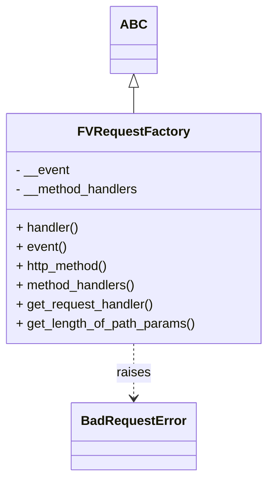

# Diagram: application_service/container_tracking_app_service/utility/FVRequestFactory.py


> Auto-generated by Obscura crawlers

## Diagram 1



### SVG

<svg id="container" width="330.1484375" xmlns="http://www.w3.org/2000/svg" class="classDiagram" height="596" viewBox="0 0 330.1484375 596" role="graphics-document document" aria-roledescription="class"><style>#container{font-family:"trebuchet ms",verdana,arial,sans-serif;font-size:16px;fill:#333;}@keyframes edge-animation-frame{from{stroke-dashoffset:0;}}@keyframes dash{to{stroke-dashoffset:0;}}#container .edge-animation-slow{stroke-dasharray:9,5!important;stroke-dashoffset:900;animation:dash 50s linear infinite;stroke-linecap:round;}#container .edge-animation-fast{stroke-dasharray:9,5!important;stroke-dashoffset:900;animation:dash 20s linear infinite;stroke-linecap:round;}#container .error-icon{fill:#552222;}#container .error-text{fill:#552222;stroke:#552222;}#container .edge-thickness-normal{stroke-width:1px;}#container .edge-thickness-thick{stroke-width:3.5px;}#container .edge-pattern-solid{stroke-dasharray:0;}#container .edge-thickness-invisible{stroke-width:0;fill:none;}#container .edge-pattern-dashed{stroke-dasharray:3;}#container .edge-pattern-dotted{stroke-dasharray:2;}#container .marker{fill:#333333;stroke:#333333;}#container .marker.cross{stroke:#333333;}#container svg{font-family:"trebuchet ms",verdana,arial,sans-serif;font-size:16px;}#container p{margin:0;}#container g.classGroup text{fill:#9370DB;stroke:none;font-family:"trebuchet ms",verdana,arial,sans-serif;font-size:10px;}#container g.classGroup text .title{font-weight:bolder;}#container .nodeLabel,#container .edgeLabel{color:#131300;}#container .edgeLabel .label rect{fill:#ECECFF;}#container .label text{fill:#131300;}#container .labelBkg{background:#ECECFF;}#container .edgeLabel .label span{background:#ECECFF;}#container .classTitle{font-weight:bolder;}#container .node rect,#container .node circle,#container .node ellipse,#container .node polygon,#container .node path{fill:#ECECFF;stroke:#9370DB;stroke-width:1px;}#container .divider{stroke:#9370DB;stroke-width:1;}#container g.clickable{cursor:pointer;}#container g.classGroup rect{fill:#ECECFF;stroke:#9370DB;}#container g.classGroup line{stroke:#9370DB;stroke-width:1;}#container .classLabel .box{stroke:none;stroke-width:0;fill:#ECECFF;opacity:0.5;}#container .classLabel .label{fill:#9370DB;font-size:10px;}#container .relation{stroke:#333333;stroke-width:1;fill:none;}#container .dashed-line{stroke-dasharray:3;}#container .dotted-line{stroke-dasharray:1 2;}#container #compositionStart,#container .composition{fill:#333333!important;stroke:#333333!important;stroke-width:1;}#container #compositionEnd,#container .composition{fill:#333333!important;stroke:#333333!important;stroke-width:1;}#container #dependencyStart,#container .dependency{fill:#333333!important;stroke:#333333!important;stroke-width:1;}#container #dependencyStart,#container .dependency{fill:#333333!important;stroke:#333333!important;stroke-width:1;}#container #extensionStart,#container .extension{fill:transparent!important;stroke:#333333!important;stroke-width:1;}#container #extensionEnd,#container .extension{fill:transparent!important;stroke:#333333!important;stroke-width:1;}#container #aggregationStart,#container .aggregation{fill:transparent!important;stroke:#333333!important;stroke-width:1;}#container #aggregationEnd,#container .aggregation{fill:transparent!important;stroke:#333333!important;stroke-width:1;}#container #lollipopStart,#container .lollipop{fill:#ECECFF!important;stroke:#333333!important;stroke-width:1;}#container #lollipopEnd,#container .lollipop{fill:#ECECFF!important;stroke:#333333!important;stroke-width:1;}#container .edgeTerminals{font-size:11px;line-height:initial;}#container .classTitleText{text-anchor:middle;font-size:18px;fill:#333;}#container .label-icon{display:inline-block;height:1em;overflow:visible;vertical-align:-0.125em;}#container .node .label-icon path{fill:currentColor;stroke:revert;stroke-width:revert;}#container :root{--mermaid-font-family:"trebuchet ms",verdana,arial,sans-serif;}</style><g><defs><marker id="container_class-aggregationStart" class="marker aggregation class" refX="18" refY="7" markerWidth="190" markerHeight="240" orient="auto"><path d="M 18,7 L9,13 L1,7 L9,1 Z"></path></marker></defs><defs><marker id="container_class-aggregationEnd" class="marker aggregation class" refX="1" refY="7" markerWidth="20" markerHeight="28" orient="auto"><path d="M 18,7 L9,13 L1,7 L9,1 Z"></path></marker></defs><defs><marker id="container_class-extensionStart" class="marker extension class" refX="18" refY="7" markerWidth="190" markerHeight="240" orient="auto"><path d="M 1,7 L18,13 V 1 Z"></path></marker></defs><defs><marker id="container_class-extensionEnd" class="marker extension class" refX="1" refY="7" markerWidth="20" markerHeight="28" orient="auto"><path d="M 1,1 V 13 L18,7 Z"></path></marker></defs><defs><marker id="container_class-compositionStart" class="marker composition class" refX="18" refY="7" markerWidth="190" markerHeight="240" orient="auto"><path d="M 18,7 L9,13 L1,7 L9,1 Z"></path></marker></defs><defs><marker id="container_class-compositionEnd" class="marker composition class" refX="1" refY="7" markerWidth="20" markerHeight="28" orient="auto"><path d="M 18,7 L9,13 L1,7 L9,1 Z"></path></marker></defs><defs><marker id="container_class-dependencyStart" class="marker dependency class" refX="6" refY="7" markerWidth="190" markerHeight="240" orient="auto"><path d="M 5,7 L9,13 L1,7 L9,1 Z"></path></marker></defs><defs><marker id="container_class-dependencyEnd" class="marker dependency class" refX="13" refY="7" markerWidth="20" markerHeight="28" orient="auto"><path d="M 18,7 L9,13 L14,7 L9,1 Z"></path></marker></defs><defs><marker id="container_class-lollipopStart" class="marker lollipop class" refX="13" refY="7" markerWidth="190" markerHeight="240" orient="auto"><circle stroke="black" fill="transparent" cx="7" cy="7" r="6"></circle></marker></defs><defs><marker id="container_class-lollipopEnd" class="marker lollipop class" refX="1" refY="7" markerWidth="190" markerHeight="240" orient="auto"><circle stroke="black" fill="transparent" cx="7" cy="7" r="6"></circle></marker></defs><g class="root"><g class="clusters"></g><g class="edgePaths"><path d="M165.074,109.25L165.074,110.542C165.074,111.833,165.074,114.417,165.074,119.875C165.074,125.333,165.074,133.667,165.074,137.833L165.074,142" id="id_ABC_FVRequestFactory_1" class="edge-thickness-normal edge-pattern-solid relation" style=";;;" data-edge="true" data-et="edge" data-id="id_ABC_FVRequestFactory_1" data-points="W3sieCI6MTY1LjA3NDIxODc1LCJ5Ijo5Mn0seyJ4IjoxNjUuMDc0MjE4NzUsInkiOjExN30seyJ4IjoxNjUuMDc0MjE4NzUsInkiOjE0Mn1d" marker-start="url(#container_class-extensionStart)"></path><path d="M165.074,430L165.074,436.167C165.074,442.333,165.074,454.667,165.074,466C165.074,477.333,165.074,487.667,165.074,492.833L165.074,498" id="id_FVRequestFactory_BadRequestError_2" class="edge-thickness-normal edge-pattern-dashed relation" style=";;;" data-edge="true" data-et="edge" data-id="id_FVRequestFactory_BadRequestError_2" data-points="W3sieCI6MTY1LjA3NDIxODc1LCJ5Ijo0MzB9LHsieCI6MTY1LjA3NDIxODc1LCJ5Ijo0Njd9LHsieCI6MTY1LjA3NDIxODc1LCJ5Ijo1MDR9XQ==" marker-end="url(#container_class-dependencyEnd)"></path></g><g class="edgeLabels"><g class="edgeLabel"><g class="label" data-id="id_ABC_FVRequestFactory_1" transform="translate(0, 0)"><foreignObject width="0" height="0"><div xmlns="http://www.w3.org/1999/xhtml" class="labelBkg" style="display: table-cell; white-space: nowrap; line-height: 1.5; max-width: 200px; text-align: center;"><span class="edgeLabel"></span></div></foreignObject></g></g><g class="edgeLabel" transform="translate(165.07421875, 467)"><g class="label" data-id="id_FVRequestFactory_BadRequestError_2" transform="translate(-21.25, -12)"><foreignObject width="42.5" height="24"><div xmlns="http://www.w3.org/1999/xhtml" class="labelBkg" style="display: table-cell; white-space: nowrap; line-height: 1.5; max-width: 200px; text-align: center;"><span class="edgeLabel"><p>raises</p></span></div></foreignObject></g></g></g><g class="nodes"><g class="node default" id="classId-ABC-0" transform="translate(165.07421875, 50)"><g class="basic label-container"><path d="M-26.2578125 -42 L26.2578125 -42 L26.2578125 42 L-26.2578125 42" stroke="none" stroke-width="0" fill="#ECECFF" style=""></path><path d="M-26.2578125 -42 C-6.584868835312591 -42, 13.088074829374818 -42, 26.2578125 -42 M-26.2578125 -42 C-7.875406050209985 -42, 10.50700039958003 -42, 26.2578125 -42 M26.2578125 -42 C26.2578125 -23.134747447581912, 26.2578125 -4.269494895163824, 26.2578125 42 M26.2578125 -42 C26.2578125 -15.601172213030715, 26.2578125 10.79765557393857, 26.2578125 42 M26.2578125 42 C10.945582410936769 42, -4.366647678126462 42, -26.2578125 42 M26.2578125 42 C13.256230312517731 42, 0.2546481250354624 42, -26.2578125 42 M-26.2578125 42 C-26.2578125 9.790410188317395, -26.2578125 -22.41917962336521, -26.2578125 -42 M-26.2578125 42 C-26.2578125 14.418136695019584, -26.2578125 -13.163726609960833, -26.2578125 -42" stroke="#9370DB" stroke-width="1.3" fill="none" stroke-dasharray="0 0" style=""></path></g><g class="annotation-group text" transform="translate(0, -18)"></g><g class="label-group text" transform="translate(-14.2578125, -18)"><g class="label" style="font-weight: bolder" transform="translate(0,-12)"><foreignObject width="28.515625" height="24"><div xmlns="http://www.w3.org/1999/xhtml" style="display: table-cell; white-space: nowrap; line-height: 1.5; max-width: 78px; text-align: center;"><span class="nodeLabel markdown-node-label" style=""><p>ABC</p></span></div></foreignObject></g></g><g class="members-group text" transform="translate(-14.2578125, 30)"></g><g class="methods-group text" transform="translate(-14.2578125, 60)"></g><g class="divider" style=""><path d="M-26.2578125 6 C-12.307668132821973 6, 1.642476234356053 6, 26.2578125 6 M-26.2578125 6 C-14.767547852715177 6, -3.2772832054303542 6, 26.2578125 6" stroke="#9370DB" stroke-width="1.3" fill="none" stroke-dasharray="0 0" style=""></path></g><g class="divider" style=""><path d="M-26.2578125 24 C-11.065886648005854 24, 4.126039203988292 24, 26.2578125 24 M-26.2578125 24 C-8.540374529592274 24, 9.177063440815452 24, 26.2578125 24" stroke="#9370DB" stroke-width="1.3" fill="none" stroke-dasharray="0 0" style=""></path></g></g><g class="node default" id="classId-BadRequestError-1" transform="translate(165.07421875, 546)"><g class="basic label-container"><path d="M-74.28125 -42 L74.28125 -42 L74.28125 42 L-74.28125 42" stroke="none" stroke-width="0" fill="#ECECFF" style=""></path><path d="M-74.28125 -42 C-37.50062513480464 -42, -0.7200002696092866 -42, 74.28125 -42 M-74.28125 -42 C-15.543834206176172 -42, 43.19358158764766 -42, 74.28125 -42 M74.28125 -42 C74.28125 -22.971433983367216, 74.28125 -3.9428679667344326, 74.28125 42 M74.28125 -42 C74.28125 -23.417933048096188, 74.28125 -4.835866096192376, 74.28125 42 M74.28125 42 C34.0797009225377 42, -6.121848154924606 42, -74.28125 42 M74.28125 42 C15.92558854581462 42, -42.43007290837076 42, -74.28125 42 M-74.28125 42 C-74.28125 16.029287457668207, -74.28125 -9.941425084663585, -74.28125 -42 M-74.28125 42 C-74.28125 11.285609774893452, -74.28125 -19.428780450213097, -74.28125 -42" stroke="#9370DB" stroke-width="1.3" fill="none" stroke-dasharray="0 0" style=""></path></g><g class="annotation-group text" transform="translate(0, -18)"></g><g class="label-group text" transform="translate(-62.28125, -18)"><g class="label" style="font-weight: bolder" transform="translate(0,-12)"><foreignObject width="124.5625" height="24"><div xmlns="http://www.w3.org/1999/xhtml" style="display: table-cell; white-space: nowrap; line-height: 1.5; max-width: 174px; text-align: center;"><span class="nodeLabel markdown-node-label" style=""><p>BadRequestError</p></span></div></foreignObject></g></g><g class="members-group text" transform="translate(-62.28125, 30)"></g><g class="methods-group text" transform="translate(-62.28125, 60)"></g><g class="divider" style=""><path d="M-74.28125 6 C-28.21995387072043 6, 17.841342258559138 6, 74.28125 6 M-74.28125 6 C-36.328070232385606 6, 1.6251095352287876 6, 74.28125 6" stroke="#9370DB" stroke-width="1.3" fill="none" stroke-dasharray="0 0" style=""></path></g><g class="divider" style=""><path d="M-74.28125 24 C-35.478932710307376 24, 3.323384579385248 24, 74.28125 24 M-74.28125 24 C-43.64130617587676 24, -13.001362351753514 24, 74.28125 24" stroke="#9370DB" stroke-width="1.3" fill="none" stroke-dasharray="0 0" style=""></path></g></g><g class="node default" id="classId-FVRequestFactory-2" transform="translate(165.07421875, 286)"><g class="basic label-container"><path d="M-157.07421875 -144 L157.07421875 -144 L157.07421875 144 L-157.07421875 144" stroke="none" stroke-width="0" fill="#ECECFF" style=""></path><path d="M-157.07421875 -144 C-83.16869037598379 -144, -9.263162001967572 -144, 157.07421875 -144 M-157.07421875 -144 C-44.04634381180318 -144, 68.98153112639363 -144, 157.07421875 -144 M157.07421875 -144 C157.07421875 -34.53170563333887, 157.07421875 74.93658873332225, 157.07421875 144 M157.07421875 -144 C157.07421875 -51.688852831056465, 157.07421875 40.62229433788707, 157.07421875 144 M157.07421875 144 C35.328892850243435 144, -86.41643304951313 144, -157.07421875 144 M157.07421875 144 C36.78926191586409 144, -83.49569491827182 144, -157.07421875 144 M-157.07421875 144 C-157.07421875 31.50749331588861, -157.07421875 -80.98501336822278, -157.07421875 -144 M-157.07421875 144 C-157.07421875 29.807083708299444, -157.07421875 -84.38583258340111, -157.07421875 -144" stroke="#9370DB" stroke-width="1.3" fill="none" stroke-dasharray="0 0" style=""></path></g><g class="annotation-group text" transform="translate(0, -120)"></g><g class="label-group text" transform="translate(-65.0390625, -120)"><g class="label" style="font-weight: bolder" transform="translate(0,-12)"><foreignObject width="130.078125" height="24"><div xmlns="http://www.w3.org/1999/xhtml" style="display: table-cell; white-space: nowrap; line-height: 1.5; max-width: 178px; text-align: center;"><span class="nodeLabel markdown-node-label" style=""><p>FVRequestFactory</p></span></div></foreignObject></g></g><g class="members-group text" transform="translate(-145.07421875, -72)"><g class="label" style="" transform="translate(0,-12)"><foreignObject width="67.1875" height="24"><div xmlns="http://www.w3.org/1999/xhtml" style="display: table-cell; white-space: nowrap; line-height: 1.5; max-width: 125px; text-align: center;"><span class="nodeLabel markdown-node-label" style=""><p>- __event</p></span></div></foreignObject></g><g class="label" style="" transform="translate(0,12)"><foreignObject width="155.75" height="24"><div xmlns="http://www.w3.org/1999/xhtml" style="display: table-cell; white-space: nowrap; line-height: 1.5; max-width: 213px; text-align: center;"><span class="nodeLabel markdown-node-label" style=""><p>- __method_handlers</p></span></div></foreignObject></g></g><g class="methods-group text" transform="translate(-145.07421875, 0)"><g class="label" style="" transform="translate(0,-12)"><foreignObject width="79.125" height="24"><div xmlns="http://www.w3.org/1999/xhtml" style="display: table-cell; white-space: nowrap; line-height: 1.5; max-width: 136px; text-align: center;"><span class="nodeLabel markdown-node-label" style=""><p>+ handler()</p></span></div></foreignObject></g><g class="label" style="" transform="translate(0,12)"><foreignObject width="62.9375" height="24"><div xmlns="http://www.w3.org/1999/xhtml" style="display: table-cell; white-space: nowrap; line-height: 1.5; max-width: 120px; text-align: center;"><span class="nodeLabel markdown-node-label" style=""><p>+ event()</p></span></div></foreignObject></g><g class="label" style="" transform="translate(0,36)"><foreignObject width="117.53125" height="24"><div xmlns="http://www.w3.org/1999/xhtml" style="display: table-cell; white-space: nowrap; line-height: 1.5; max-width: 175px; text-align: center;"><span class="nodeLabel markdown-node-label" style=""><p>+ http_method()</p></span></div></foreignObject></g><g class="label" style="" transform="translate(0,60)"><foreignObject width="151.171875" height="24"><div xmlns="http://www.w3.org/1999/xhtml" style="display: table-cell; white-space: nowrap; line-height: 1.5; max-width: 209px; text-align: center;"><span class="nodeLabel markdown-node-label" style=""><p>+ method_handlers()</p></span></div></foreignObject></g><g class="label" style="" transform="translate(0,84)"><foreignObject width="173.59375" height="24"><div xmlns="http://www.w3.org/1999/xhtml" style="display: table-cell; white-space: nowrap; line-height: 1.5; max-width: 231px; text-align: center;"><span class="nodeLabel markdown-node-label" style=""><p>+ get_request_handler()</p></span></div></foreignObject></g><g class="label" style="" transform="translate(0,108)"><foreignObject width="225.109375" height="24"><div xmlns="http://www.w3.org/1999/xhtml" style="display: table-cell; white-space: nowrap; line-height: 1.5; max-width: 282px; text-align: center;"><span class="nodeLabel markdown-node-label" style=""><p>+ get_length_of_path_params()</p></span></div></foreignObject></g></g><g class="divider" style=""><path d="M-157.07421875 -96 C-86.53719693090002 -96, -16.000175111800047 -96, 157.07421875 -96 M-157.07421875 -96 C-56.05198359572458 -96, 44.97025155855084 -96, 157.07421875 -96" stroke="#9370DB" stroke-width="1.3" fill="none" stroke-dasharray="0 0" style=""></path></g><g class="divider" style=""><path d="M-157.07421875 -24 C-73.11793588611233 -24, 10.83834697777533 -24, 157.07421875 -24 M-157.07421875 -24 C-52.169974485633276 -24, 52.73426977873345 -24, 157.07421875 -24" stroke="#9370DB" stroke-width="1.3" fill="none" stroke-dasharray="0 0" style=""></path></g></g></g></g></g></svg>

## Diagram 2

```mermaid
flowchart TD
    HandlerProp["handler property"] --> InitHandlers["__init_handlers()"]
    InitHandlers --> IsDict{"isinstance(self.handlers, dict)?"}
    IsDict -- yes --> SetHandlers["self.__method_handlers = self.handlers"]
    IsDict -- no --> RaiseValue["raise ValueError('Handlers dict of handlers with http methods as keys')"]
    SetHandlers --> ReturnSelf["return self"]
    ReturnSelf --> GetReq["get_request_handler()"]
    EventNode["self.event (dict)"] --> HTTPMethod["http_method = event.get('httpMethod','GET').upper()"]
    GetReq --> AssertNonEmpty["assert self.method_handlers.keys() (non-empty)"]
    AssertNonEmpty --> AssertUnique["assert len(set(keys)) == len(keys) (unique keys)"]
    AssertUnique --> Lookup["method_handler = self.method_handlers.get(self.http_method)"]
    Lookup --> Exists{"method_handler exists?"}
    Exists -- no --> RaiseBad["raise BadRequestError(f\"Unsuported method {self.http_method}\", message)"]
    Exists -- yes --> Instantiate["return method_handler(self.event)"]
    GetLength["get_length_of_path_params()"] --> TryLen["try: return len(self.event.get('pathParameters', {}))"]
    TryLen --> Except["except: return 0"]
```

> SVG rendering failed for this diagram.
