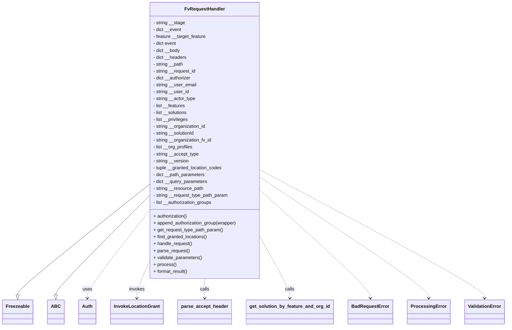
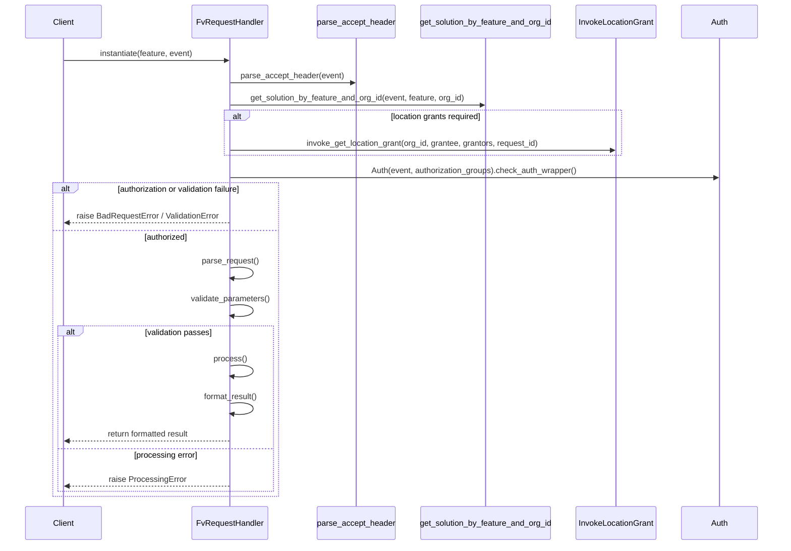

# Diagram: application_service/container_tracking_app_service/utility/FvRequestHandler.py

> Auto-generated by Obscura crawlers

## Diagram 1

### SVG

<svg id="container" width="1699.984375" xmlns="http://www.w3.org/2000/svg" class="classDiagram" height="1134" viewBox="0 0 1699.984375 1134" role="graphics-document document" aria-roledescription="class"><g><defs><marker id="container_class-aggregationStart" class="marker aggregation class" refX="18" refY="7" markerWidth="190" markerHeight="240" orient="auto"><path d="M 18,7 L9,13 L1,7 L9,1 Z"></path></marker></defs><defs><marker id="container_class-aggregationEnd" class="marker aggregation class" refX="1" refY="7" markerWidth="20" markerHeight="28" orient="auto"><path d="M 18,7 L9,13 L1,7 L9,1 Z"></path></marker></defs><defs><marker id="container_class-extensionStart" class="marker extension class" refX="18" refY="7" markerWidth="190" markerHeight="240" orient="auto"><path d="M 1,7 L18,13 V 1 Z"></path></marker></defs><defs><marker id="container_class-extensionEnd" class="marker extension class" refX="1" refY="7" markerWidth="20" markerHeight="28" orient="auto"><path d="M 1,1 V 13 L18,7 Z"></path></marker></defs><defs><marker id="container_class-compositionStart" class="marker composition class" refX="18" refY="7" markerWidth="190" markerHeight="240" orient="auto"><path d="M 18,7 L9,13 L1,7 L9,1 Z"></path></marker></defs><defs><marker id="container_class-compositionEnd" class="marker composition class" refX="1" refY="7" markerWidth="20" markerHeight="28" orient="auto"><path d="M 18,7 L9,13 L1,7 L9,1 Z"></path></marker></defs><defs><marker id="container_class-dependencyStart" class="marker dependency class" refX="6" refY="7" markerWidth="190" markerHeight="240" orient="auto"><path d="M 5,7 L9,13 L1,7 L9,1 Z"></path></marker></defs><defs><marker id="container_class-dependencyEnd" class="marker dependency class" refX="13" refY="7" markerWidth="20" markerHeight="28" orient="auto"><path d="M 18,7 L9,13 L14,7 L9,1 Z"></path></marker></defs><defs><marker id="container_class-lollipopStart" class="marker lollipop class" refX="13" refY="7" markerWidth="190" markerHeight="240" orient="auto"><circle stroke="black" fill="transparent" cx="7" cy="7" r="6"></circle></marker></defs><defs><marker id="container_class-lollipopEnd" class="marker lollipop class" refX="1" refY="7" markerWidth="190" markerHeight="240" orient="auto"><circle stroke="black" fill="transparent" cx="7" cy="7" r="6"></circle></marker></defs><g class="root"><g class="clusters"></g><g class="edgePaths"><path d="M494.535,646.447L421.979,706.205C349.422,765.964,204.309,885.482,131.752,948.533C59.195,1011.583,59.195,1018.167,59.195,1021.458L59.195,1024.75" id="id_FvRequestHandler_Freezeable_1" class="edge-thickness-normal edge-pattern-solid relation" style=";;;" data-edge="true" data-et="edge" data-id="id_FvRequestHandler_Freezeable_1" data-points="W3sieCI6NDk0LjUzNTE1NjI1LCJ5Ijo2NDYuNDQ2NTg4NTg5NjM1MX0seyJ4Ijo1OS4xOTUzMTI1LCJ5IjoxMDA1fSx7IngiOjU5LjE5NTMxMjUsInkiOjEwNDJ9XQ==" marker-end="url(#container_class-extensionEnd)"></path><path d="M494.535,686.814L443.221,739.845C391.906,792.876,289.277,898.938,237.963,955.261C186.648,1011.583,186.648,1018.167,186.648,1021.458L186.648,1024.75" id="id_FvRequestHandler_ABC_2" class="edge-thickness-normal edge-pattern-solid relation" style=";;;" data-edge="true" data-et="edge" data-id="id_FvRequestHandler_ABC_2" data-points="W3sieCI6NDk0LjUzNTE1NjI1LCJ5Ijo2ODYuODE0MTY5MDM1Mn0seyJ4IjoxODYuNjQ4NDM3NSwieSI6MTAwNX0seyJ4IjoxODYuNjQ4NDM3NSwieSI6MTA0Mn1d" marker-end="url(#container_class-extensionEnd)"></path><path d="M494.535,739.797L460.765,783.998C426.995,828.198,359.454,916.599,325.684,965.966C291.914,1015.333,291.914,1025.667,291.914,1030.833L291.914,1036" id="id_FvRequestHandler_Auth_3" class="edge-thickness-normal edge-pattern-dashed relation" style=";;;" data-edge="true" data-et="edge" data-id="id_FvRequestHandler_Auth_3" data-points="W3sieCI6NDk0LjUzNTE1NjI1LCJ5Ijo3MzkuNzk3MjAxMzQ0OTM2Nn0seyJ4IjoyOTEuOTE0MDYyNSwieSI6MTAwNX0seyJ4IjoyOTEuOTE0MDYyNSwieSI6MTA0Mn1d" marker-end="url(#container_class-dependencyEnd)"></path><path d="M494.535,924.004L488.579,937.503C482.622,951.002,470.71,978.001,464.753,996.667C458.797,1015.333,458.797,1025.667,458.797,1030.833L458.797,1036" id="id_FvRequestHandler_InvokeLocationGrant_4" class="edge-thickness-normal edge-pattern-dashed relation" style=";;;" data-edge="true" data-et="edge" data-id="id_FvRequestHandler_InvokeLocationGrant_4" data-points="W3sieCI6NDk0LjUzNTE1NjI1LCJ5Ijo5MjQuMDAzNTEwMzk0MTkxNn0seyJ4Ijo0NTguNzk2ODc1LCJ5IjoxMDA1fSx7IngiOjQ1OC43OTY4NzUsInkiOjEwNDJ9XQ==" marker-end="url(#container_class-dependencyEnd)"></path><path d="M686.914,968L686.914,974.167C686.914,980.333,686.914,992.667,686.914,1004C686.914,1015.333,686.914,1025.667,686.914,1030.833L686.914,1036" id="id_FvRequestHandler_parse_accept_header_5" class="edge-thickness-normal edge-pattern-dashed relation" style=";;;" data-edge="true" data-et="edge" data-id="id_FvRequestHandler_parse_accept_header_5" data-points="W3sieCI6Njg2LjkxNDA2MjUsInkiOjk2OH0seyJ4Ijo2ODYuOTE0MDYyNSwieSI6MTAwNX0seyJ4Ijo2ODYuOTE0MDYyNSwieSI6MTA0Mn1d" marker-end="url(#container_class-dependencyEnd)"></path><path d="M879.293,834.928L895.011,863.273C910.729,891.619,942.165,948.309,957.883,981.821C973.602,1015.333,973.602,1025.667,973.602,1030.833L973.602,1036" id="id_FvRequestHandler_get_solution_by_feature_and_org_id_6" class="edge-thickness-normal edge-pattern-dashed relation" style=";;;" data-edge="true" data-et="edge" data-id="id_FvRequestHandler_get_solution_by_feature_and_org_id_6" data-points="W3sieCI6ODc5LjI5Mjk2ODc1LCJ5Ijo4MzQuOTI3OTA3NjczODYwOX0seyJ4Ijo5NzMuNjAxNTYyNSwieSI6MTAwNX0seyJ4Ijo5NzMuNjAxNTYyNSwieSI6MTA0Mn1d" marker-end="url(#container_class-dependencyEnd)"></path><path d="M879.293,666.431L940.132,722.859C1000.971,779.287,1122.65,892.144,1183.489,953.738C1244.328,1015.333,1244.328,1025.667,1244.328,1030.833L1244.328,1036" id="id_FvRequestHandler_BadRequestError_7" class="edge-thickness-normal edge-pattern-dashed relation" style=";;;" data-edge="true" data-et="edge" data-id="id_FvRequestHandler_BadRequestError_7" data-points="W3sieCI6ODc5LjI5Mjk2ODc1LCJ5Ijo2NjYuNDMwOTAzMDI1OTcwOX0seyJ4IjoxMjQ0LjMyODEyNSwieSI6MTAwNX0seyJ4IjoxMjQ0LjMyODEyNSwieSI6MTA0Mn1d" marker-end="url(#container_class-dependencyEnd)"></path><path d="M879.293,620.401L972.43,684.501C1065.568,748.601,1251.842,876.8,1344.98,946.067C1438.117,1015.333,1438.117,1025.667,1438.117,1030.833L1438.117,1036" id="id_FvRequestHandler_ProcessingError_8" class="edge-thickness-normal edge-pattern-dashed relation" style=";;;" data-edge="true" data-et="edge" data-id="id_FvRequestHandler_ProcessingError_8" data-points="W3sieCI6ODc5LjI5Mjk2ODc1LCJ5Ijo2MjAuNDAwNzk5NzU4NzIwNH0seyJ4IjoxNDM4LjExNzE4NzUsInkiOjEwMDV9LHsieCI6MTQzOC4xMTcxODc1LCJ5IjoxMDQyfV0=" marker-end="url(#container_class-dependencyEnd)"></path><path d="M879.293,594.046L1003.545,662.539C1127.797,731.031,1376.301,868.015,1500.553,941.674C1624.805,1015.333,1624.805,1025.667,1624.805,1030.833L1624.805,1036" id="id_FvRequestHandler_ValidationError_9" class="edge-thickness-normal edge-pattern-dashed relation" style=";;;" data-edge="true" data-et="edge" data-id="id_FvRequestHandler_ValidationError_9" data-points="W3sieCI6ODc5LjI5Mjk2ODc1LCJ5Ijo1OTQuMDQ2MzY4MTc5OTI1fSx7IngiOjE2MjQuODA0Njg3NSwieSI6MTAwNX0seyJ4IjoxNjI0LjgwNDY4NzUsInkiOjEwNDJ9XQ==" marker-end="url(#container_class-dependencyEnd)"></path></g><g class="edgeLabels"><g class="edgeLabel"><g class="label" data-id="id_FvRequestHandler_Freezeable_1" transform="translate(0, 0)"><foreignObject width="0" height="0">

</foreignObject></g></g><g class="edgeLabel"><g class="label" data-id="id_FvRequestHandler_ABC_2" transform="translate(0, 0)"><foreignObject width="0" height="0">

</foreignObject></g></g><g class="edgeLabel" transform="translate(291.9140625, 1005)"><g class="label" data-id="id_FvRequestHandler_Auth_3" transform="translate(-16.4921875, -12)"><foreignObject width="32.984375" height="24">

uses

</foreignObject></g></g><g class="edgeLabel" transform="translate(458.796875, 1005)"><g class="label" data-id="id_FvRequestHandler_InvokeLocationGrant_4" transform="translate(-27.5859375, -12)"><foreignObject width="55.171875" height="24">

invokes

</foreignObject></g></g><g class="edgeLabel" transform="translate(686.9140625, 1005)"><g class="label" data-id="id_FvRequestHandler_parse_accept_header_5" transform="translate(-16.4453125, -12)"><foreignObject width="32.890625" height="24">

calls

</foreignObject></g></g><g class="edgeLabel" transform="translate(973.6015625, 1005)"><g class="label" data-id="id_FvRequestHandler_get_solution_by_feature_and_org_id_6" transform="translate(-16.4453125, -12)"><foreignObject width="32.890625" height="24">

calls

</foreignObject></g></g><g class="edgeLabel"><g class="label" data-id="id_FvRequestHandler_BadRequestError_7" transform="translate(0, 0)"><foreignObject width="0" height="0">

</foreignObject></g></g><g class="edgeLabel"><g class="label" data-id="id_FvRequestHandler_ProcessingError_8" transform="translate(0, 0)"><foreignObject width="0" height="0">

</foreignObject></g></g><g class="edgeLabel"><g class="label" data-id="id_FvRequestHandler_ValidationError_9" transform="translate(0, 0)"><foreignObject width="0" height="0">

</foreignObject></g></g></g><g class="nodes"><g class="node default" id="classId-Freezeable-0" transform="translate(59.1953125, 1084)"><g class="basic label-container"><path d="M-51.1953125 -42 L51.1953125 -42 L51.1953125 42 L-51.1953125 42" stroke="none" stroke-width="0" fill="#ECECFF" style=""></path><path d="M-51.1953125 -42 C-19.16980148547789 -42, 12.85570952904422 -42, 51.1953125 -42 M-51.1953125 -42 C-11.508601313722586 -42, 28.178109872554828 -42, 51.1953125 -42 M51.1953125 -42 C51.1953125 -20.027355079803957, 51.1953125 1.9452898403920855, 51.1953125 42 M51.1953125 -42 C51.1953125 -17.72723955318924, 51.1953125 6.5455208936215215, 51.1953125 42 M51.1953125 42 C17.066140475416326 42, -17.06303154916735 42, -51.1953125 42 M51.1953125 42 C24.210244543782434 42, -2.7748234124351328 42, -51.1953125 42 M-51.1953125 42 C-51.1953125 13.845693092587787, -51.1953125 -14.308613814824426, -51.1953125 -42 M-51.1953125 42 C-51.1953125 23.498599412342116, -51.1953125 4.997198824684233, -51.1953125 -42" stroke="#9370DB" stroke-width="1.3" fill="none" stroke-dasharray="0 0" style=""></path></g><g class="annotation-group text" transform="translate(0, -18)"></g><g class="label-group text" transform="translate(-39.1953125, -18)"><g class="label" style="font-weight: bolder" transform="translate(0,-12)"><foreignObject width="78.390625" height="24">

Freezeable

</foreignObject></g></g><g class="members-group text" transform="translate(-39.1953125, 30)"></g><g class="methods-group text" transform="translate(-39.1953125, 60)"></g><g class="divider" style=""><path d="M-51.1953125 6 C-16.718290546140885 6, 17.75873140771823 6, 51.1953125 6 M-51.1953125 6 C-19.08591520153673 6, 13.023482096926543 6, 51.1953125 6" stroke="#9370DB" stroke-width="1.3" fill="none" stroke-dasharray="0 0" style=""></path></g><g class="divider" style=""><path d="M-51.1953125 24 C-30.398466043978196 24, -9.601619587956392 24, 51.1953125 24 M-51.1953125 24 C-18.426024055080653 24, 14.343264389838694 24, 51.1953125 24" stroke="#9370DB" stroke-width="1.3" fill="none" stroke-dasharray="0 0" style=""></path></g></g><g class="node default" id="classId-ABC-1" transform="translate(186.6484375, 1084)"><g class="basic label-container"><path d="M-26.2578125 -42 L26.2578125 -42 L26.2578125 42 L-26.2578125 42" stroke="none" stroke-width="0" fill="#ECECFF" style=""></path><path d="M-26.2578125 -42 C-6.731392221311822 -42, 12.795028057376356 -42, 26.2578125 -42 M-26.2578125 -42 C-13.913758033086792 -42, -1.5697035661735832 -42, 26.2578125 -42 M26.2578125 -42 C26.2578125 -11.330591708750163, 26.2578125 19.338816582499675, 26.2578125 42 M26.2578125 -42 C26.2578125 -24.606021690241835, 26.2578125 -7.212043380483671, 26.2578125 42 M26.2578125 42 C5.327275647504862 42, -15.603261204990275 42, -26.2578125 42 M26.2578125 42 C13.913996680648076 42, 1.5701808612961514 42, -26.2578125 42 M-26.2578125 42 C-26.2578125 14.781269212484084, -26.2578125 -12.437461575031833, -26.2578125 -42 M-26.2578125 42 C-26.2578125 15.828962931350485, -26.2578125 -10.34207413729903, -26.2578125 -42" stroke="#9370DB" stroke-width="1.3" fill="none" stroke-dasharray="0 0" style=""></path></g><g class="annotation-group text" transform="translate(0, -18)"></g><g class="label-group text" transform="translate(-14.2578125, -18)"><g class="label" style="font-weight: bolder" transform="translate(0,-12)"><foreignObject width="28.515625" height="24">

ABC

</foreignObject></g></g><g class="members-group text" transform="translate(-14.2578125, 30)"></g><g class="methods-group text" transform="translate(-14.2578125, 60)"></g><g class="divider" style=""><path d="M-26.2578125 6 C-8.071875711366783 6, 10.114061077266435 6, 26.2578125 6 M-26.2578125 6 C-7.628946806767601 6, 10.999918886464798 6, 26.2578125 6" stroke="#9370DB" stroke-width="1.3" fill="none" stroke-dasharray="0 0" style=""></path></g><g class="divider" style=""><path d="M-26.2578125 24 C-9.264681806977332 24, 7.728448886045335 24, 26.2578125 24 M-26.2578125 24 C-13.906990151799732 24, -1.5561678035994646 24, 26.2578125 24" stroke="#9370DB" stroke-width="1.3" fill="none" stroke-dasharray="0 0" style=""></path></g></g><g class="node default" id="classId-FvRequestHandler-2" transform="translate(686.9140625, 488)"><g class="basic label-container"><path d="M-192.37890625 -480 L192.37890625 -480 L192.37890625 480 L-192.37890625 480" stroke="none" stroke-width="0" fill="#ECECFF" style=""></path><path d="M-192.37890625 -480 C-84.96344367414805 -480, 22.452018901703894 -480, 192.37890625 -480 M-192.37890625 -480 C-99.58558473471722 -480, -6.792263219434432 -480, 192.37890625 -480 M192.37890625 -480 C192.37890625 -267.1275784133305, 192.37890625 -54.25515682666105, 192.37890625 480 M192.37890625 -480 C192.37890625 -113.56249516797811, 192.37890625 252.87500966404377, 192.37890625 480 M192.37890625 480 C92.53496044672009 480, -7.308985356559816 480, -192.37890625 480 M192.37890625 480 C71.81176067027113 480, -48.755384909457746 480, -192.37890625 480 M-192.37890625 480 C-192.37890625 105.07212869546606, -192.37890625 -269.8557426090679, -192.37890625 -480 M-192.37890625 480 C-192.37890625 215.99054245560177, -192.37890625 -48.01891508879646, -192.37890625 -480" stroke="#9370DB" stroke-width="1.3" fill="none" stroke-dasharray="0 0" style=""></path></g><g class="annotation-group text" transform="translate(0, -456)"></g><g class="label-group text" transform="translate(-66.7890625, -456)"><g class="label" style="font-weight: bolder" transform="translate(0,-12)"><foreignObject width="133.578125" height="24">

FvRequestHandler

</foreignObject></g></g><g class="members-group text" transform="translate(-180.37890625, -408)"><g class="label" style="" transform="translate(0,-12)"><foreignObject width="111.515625" height="24">

- string __stage

</foreignObject></g><g class="label" style="" transform="translate(0,12)"><foreignObject width="98.9375" height="24">

- dict __event

</foreignObject></g><g class="label" style="" transform="translate(0,36)"><foreignObject width="185.890625" height="24">

- feature __target_feature

</foreignObject></g><g class="label" style="" transform="translate(0,60)"><foreignObject width="82.78125" height="24">

- dict event

</foreignObject></g><g class="label" style="" transform="translate(0,84)"><foreignObject width="95.203125" height="24">

- dict __body

</foreignObject></g><g class="label" style="" transform="translate(0,108)"><foreignObject width="117.25" height="24">

- dict __headers

</foreignObject></g><g class="label" style="" transform="translate(0,132)"><foreignObject width="106.25" height="24">

- string __path

</foreignObject></g><g class="label" style="" transform="translate(0,156)"><foreignObject width="150.71875" height="24">

- string __request_id

</foreignObject></g><g class="label" style="" transform="translate(0,180)"><foreignObject width="133.578125" height="24">

- dict __authorizer

</foreignObject></g><g class="label" style="" transform="translate(0,204)"><foreignObject width="151.46875" height="24">

- string __user_email

</foreignObject></g><g class="label" style="" transform="translate(0,228)"><foreignObject width="125.53125" height="24">

- string __user_id

</foreignObject></g><g class="label" style="" transform="translate(0,252)"><foreignObject width="148.640625" height="24">

- string __actor_type

</foreignObject></g><g class="label" style="" transform="translate(0,276)"><foreignObject width="112.984375" height="24">

- list __features

</foreignObject></g><g class="label" style="" transform="translate(0,300)"><foreignObject width="121.15625" height="24">

- list __solutions

</foreignObject></g><g class="label" style="" transform="translate(0,324)"><foreignObject width="124.03125" height="24">

- list __privileges

</foreignObject></g><g class="label" style="" transform="translate(0,348)"><foreignObject width="185.484375" height="24">

- string __organization_id

</foreignObject></g><g class="label" style="" transform="translate(0,372)"><foreignObject width="147.15625" height="24">

- string __solutionId

</foreignObject></g><g class="label" style="" transform="translate(0,396)"><foreignObject width="206.234375" height="24">

- string __organization_fv_id

</foreignObject></g><g class="label" style="" transform="translate(0,420)"><foreignObject width="140.078125" height="24">

- list __org_profiles

</foreignObject></g><g class="label" style="" transform="translate(0,444)"><foreignObject width="159.875" height="24">

- string __accept_type

</foreignObject></g><g class="label" style="" transform="translate(0,468)"><foreignObject width="125.734375" height="24">

- string __version

</foreignObject></g><g class="label" style="" transform="translate(0,492)"><foreignObject width="243.0625" height="24">

- tuple __granted_location_codes

</foreignObject></g><g class="label" style="" transform="translate(0,516)"><foreignObject width="182.90625" height="24">

- dict __path_parameters

</foreignObject></g><g class="label" style="" transform="translate(0,540)"><foreignObject width="190.546875" height="24">

- dict __query_parameters

</foreignObject></g><g class="label" style="" transform="translate(0,564)"><foreignObject width="176.53125" height="24">

- string __resource_path

</foreignObject></g><g class="label" style="" transform="translate(0,588)"><foreignObject width="263.703125" height="24">

- string __request_type_path_param

</foreignObject></g><g class="label" style="" transform="translate(0,612)"><foreignObject width="209.3125" height="24">

- list __authorization_groups

</foreignObject></g></g><g class="methods-group text" transform="translate(-180.37890625, 264)"><g class="label" style="" transform="translate(0,-12)"><foreignObject width="120.265625" height="24">

+ authorization()

</foreignObject></g><g class="label" style="" transform="translate(0,12)"><foreignObject width="293.96875" height="24">

+ append_authorization_group(wrapper)

</foreignObject></g><g class="label" style="" transform="translate(0,36)"><foreignObject width="244.140625" height="24">

+ get_request_type_path_param()

</foreignObject></g><g class="label" style="" transform="translate(0,60)"><foreignObject width="189.828125" height="24">

+ find_granted_locations()

</foreignObject></g><g class="label" style="" transform="translate(0,84)"><foreignObject width="136.21875" height="24">

+ handle_request()

</foreignObject></g><g class="label" style="" transform="translate(0,108)"><foreignObject width="126.046875" height="24">

+ parse_request()

</foreignObject></g><g class="label" style="" transform="translate(0,132)"><foreignObject width="170.953125" height="24">

+ validate_parameters()

</foreignObject></g><g class="label" style="" transform="translate(0,156)"><foreignObject width="77.96875" height="24">

+ process()

</foreignObject></g><g class="label" style="" transform="translate(0,180)"><foreignObject width="121.5" height="24">

+ format_result()

</foreignObject></g></g><g class="divider" style=""><path d="M-192.37890625 -432 C-77.54456544956324 -432, 37.289775350873526 -432, 192.37890625 -432 M-192.37890625 -432 C-68.17189274963694 -432, 56.03512075072612 -432, 192.37890625 -432" stroke="#9370DB" stroke-width="1.3" fill="none" stroke-dasharray="0 0" style=""></path></g><g class="divider" style=""><path d="M-192.37890625 240 C-57.43534675664313 240, 77.50821273671374 240, 192.37890625 240 M-192.37890625 240 C-100.53279003986482 240, -8.686673829729642 240, 192.37890625 240" stroke="#9370DB" stroke-width="1.3" fill="none" stroke-dasharray="0 0" style=""></path></g></g><g class="node default" id="classId-Auth-3" transform="translate(291.9140625, 1084)"><g class="basic label-container"><path d="M-29.0078125 -42 L29.0078125 -42 L29.0078125 42 L-29.0078125 42" stroke="none" stroke-width="0" fill="#ECECFF" style=""></path><path d="M-29.0078125 -42 C-6.421183377250117 -42, 16.165445745499767 -42, 29.0078125 -42 M-29.0078125 -42 C-7.8664157525828 -42, 13.2749809948344 -42, 29.0078125 -42 M29.0078125 -42 C29.0078125 -14.559277287210996, 29.0078125 12.881445425578008, 29.0078125 42 M29.0078125 -42 C29.0078125 -14.959730349085941, 29.0078125 12.080539301828118, 29.0078125 42 M29.0078125 42 C7.850127193380004 42, -13.307558113239992 42, -29.0078125 42 M29.0078125 42 C10.004566512948823 42, -8.998679474102353 42, -29.0078125 42 M-29.0078125 42 C-29.0078125 18.763756837027326, -29.0078125 -4.472486325945347, -29.0078125 -42 M-29.0078125 42 C-29.0078125 11.92382968927572, -29.0078125 -18.15234062144856, -29.0078125 -42" stroke="#9370DB" stroke-width="1.3" fill="none" stroke-dasharray="0 0" style=""></path></g><g class="annotation-group text" transform="translate(0, -18)"></g><g class="label-group text" transform="translate(-17.0078125, -18)"><g class="label" style="font-weight: bolder" transform="translate(0,-12)"><foreignObject width="34.015625" height="24">

Auth

</foreignObject></g></g><g class="members-group text" transform="translate(-17.0078125, 30)"></g><g class="methods-group text" transform="translate(-17.0078125, 60)"></g><g class="divider" style=""><path d="M-29.0078125 6 C-16.247295370156476 6, -3.486778240312951 6, 29.0078125 6 M-29.0078125 6 C-13.717625181340296 6, 1.5725621373194087 6, 29.0078125 6" stroke="#9370DB" stroke-width="1.3" fill="none" stroke-dasharray="0 0" style=""></path></g><g class="divider" style=""><path d="M-29.0078125 24 C-11.214394307854992 24, 6.579023884290017 24, 29.0078125 24 M-29.0078125 24 C-13.02294142739836 24, 2.9619296452032806 24, 29.0078125 24" stroke="#9370DB" stroke-width="1.3" fill="none" stroke-dasharray="0 0" style=""></path></g></g><g class="node default" id="classId-InvokeLocationGrant-4" transform="translate(458.796875, 1084)"><g class="basic label-container"><path d="M-87.875 -42 L87.875 -42 L87.875 42 L-87.875 42" stroke="none" stroke-width="0" fill="#ECECFF" style=""></path><path d="M-87.875 -42 C-25.108129454744216 -42, 37.65874109051157 -42, 87.875 -42 M-87.875 -42 C-21.22743193650105 -42, 45.4201361269979 -42, 87.875 -42 M87.875 -42 C87.875 -18.700955354882645, 87.875 4.598089290234711, 87.875 42 M87.875 -42 C87.875 -13.632042997901696, 87.875 14.735914004196609, 87.875 42 M87.875 42 C52.12581136359996 42, 16.376622727199916 42, -87.875 42 M87.875 42 C37.5208076187179 42, -12.833384762564194 42, -87.875 42 M-87.875 42 C-87.875 20.046641895346443, -87.875 -1.9067162093071133, -87.875 -42 M-87.875 42 C-87.875 14.509816659789116, -87.875 -12.980366680421767, -87.875 -42" stroke="#9370DB" stroke-width="1.3" fill="none" stroke-dasharray="0 0" style=""></path></g><g class="annotation-group text" transform="translate(0, -18)"></g><g class="label-group text" transform="translate(-75.875, -18)"><g class="label" style="font-weight: bolder" transform="translate(0,-12)"><foreignObject width="151.75" height="24">

InvokeLocationGrant

</foreignObject></g></g><g class="members-group text" transform="translate(-75.875, 30)"></g><g class="methods-group text" transform="translate(-75.875, 60)"></g><g class="divider" style=""><path d="M-87.875 6 C-51.10025430206973 6, -14.325508604139458 6, 87.875 6 M-87.875 6 C-45.108014573359405 6, -2.3410291467188102 6, 87.875 6" stroke="#9370DB" stroke-width="1.3" fill="none" stroke-dasharray="0 0" style=""></path></g><g class="divider" style=""><path d="M-87.875 24 C-35.8251369529585 24, 16.224726094082996 24, 87.875 24 M-87.875 24 C-36.102592399334945 24, 15.66981520133011 24, 87.875 24" stroke="#9370DB" stroke-width="1.3" fill="none" stroke-dasharray="0 0" style=""></path></g></g><g class="node default" id="classId-parse_accept_header-5" transform="translate(686.9140625, 1084)"><g class="basic label-container"><path d="M-90.2421875 -42 L90.2421875 -42 L90.2421875 42 L-90.2421875 42" stroke="none" stroke-width="0" fill="#ECECFF" style=""></path><path d="M-90.2421875 -42 C-47.85906881027301 -42, -5.475950120546017 -42, 90.2421875 -42 M-90.2421875 -42 C-53.769861666521265 -42, -17.29753583304253 -42, 90.2421875 -42 M90.2421875 -42 C90.2421875 -9.433956081297872, 90.2421875 23.132087837404256, 90.2421875 42 M90.2421875 -42 C90.2421875 -8.517490798363788, 90.2421875 24.965018403272424, 90.2421875 42 M90.2421875 42 C40.23960216705173 42, -9.762983165896543 42, -90.2421875 42 M90.2421875 42 C20.72872727982194 42, -48.78473294035612 42, -90.2421875 42 M-90.2421875 42 C-90.2421875 8.834734099836844, -90.2421875 -24.330531800326312, -90.2421875 -42 M-90.2421875 42 C-90.2421875 13.842065709923645, -90.2421875 -14.31586858015271, -90.2421875 -42" stroke="#9370DB" stroke-width="1.3" fill="none" stroke-dasharray="0 0" style=""></path></g><g class="annotation-group text" transform="translate(0, -18)"></g><g class="label-group text" transform="translate(-78.2421875, -18)"><g class="label" style="font-weight: bolder" transform="translate(0,-12)"><foreignObject width="156.484375" height="24">

parse_accept_header

</foreignObject></g></g><g class="members-group text" transform="translate(-78.2421875, 30)"></g><g class="methods-group text" transform="translate(-78.2421875, 60)"></g><g class="divider" style=""><path d="M-90.2421875 6 C-29.505237846453518 6, 31.231711807092964 6, 90.2421875 6 M-90.2421875 6 C-46.81276084056222 6, -3.3833341811244395 6, 90.2421875 6" stroke="#9370DB" stroke-width="1.3" fill="none" stroke-dasharray="0 0" style=""></path></g><g class="divider" style=""><path d="M-90.2421875 24 C-45.86429661676172 24, -1.4864057335234406 24, 90.2421875 24 M-90.2421875 24 C-20.340444503256833 24, 49.56129849348633 24, 90.2421875 24" stroke="#9370DB" stroke-width="1.3" fill="none" stroke-dasharray="0 0" style=""></path></g></g><g class="node default" id="classId-get_solution_by_feature_and_org_id-6" transform="translate(973.6015625, 1084)"><g class="basic label-container"><path d="M-146.4453125 -42 L146.4453125 -42 L146.4453125 42 L-146.4453125 42" stroke="none" stroke-width="0" fill="#ECECFF" style=""></path><path d="M-146.4453125 -42 C-44.284501657032266 -42, 57.87630918593547 -42, 146.4453125 -42 M-146.4453125 -42 C-37.38864711012283 -42, 71.66801827975434 -42, 146.4453125 -42 M146.4453125 -42 C146.4453125 -24.95304920037112, 146.4453125 -7.906098400742238, 146.4453125 42 M146.4453125 -42 C146.4453125 -13.547889564295708, 146.4453125 14.904220871408583, 146.4453125 42 M146.4453125 42 C64.96315498927541 42, -16.51900252144918 42, -146.4453125 42 M146.4453125 42 C57.12227352976147 42, -32.200765440477056 42, -146.4453125 42 M-146.4453125 42 C-146.4453125 19.080898401509213, -146.4453125 -3.838203196981574, -146.4453125 -42 M-146.4453125 42 C-146.4453125 19.72644522096204, -146.4453125 -2.547109558075917, -146.4453125 -42" stroke="#9370DB" stroke-width="1.3" fill="none" stroke-dasharray="0 0" style=""></path></g><g class="annotation-group text" transform="translate(0, -18)"></g><g class="label-group text" transform="translate(-134.4453125, -18)"><g class="label" style="font-weight: bolder" transform="translate(0,-12)"><foreignObject width="268.890625" height="24">

get_solution_by_feature_and_org_id

</foreignObject></g></g><g class="members-group text" transform="translate(-134.4453125, 30)"></g><g class="methods-group text" transform="translate(-134.4453125, 60)"></g><g class="divider" style=""><path d="M-146.4453125 6 C-52.206809011861196 6, 42.03169447627761 6, 146.4453125 6 M-146.4453125 6 C-36.34877346023653 6, 73.74776557952694 6, 146.4453125 6" stroke="#9370DB" stroke-width="1.3" fill="none" stroke-dasharray="0 0" style=""></path></g><g class="divider" style=""><path d="M-146.4453125 24 C-54.95378072042875 24, 36.537751059142494 24, 146.4453125 24 M-146.4453125 24 C-62.643142307536294 24, 21.15902788492741 24, 146.4453125 24" stroke="#9370DB" stroke-width="1.3" fill="none" stroke-dasharray="0 0" style=""></path></g></g><g class="node default" id="classId-BadRequestError-7" transform="translate(1244.328125, 1084)"><g class="basic label-container"><path d="M-74.28125 -42 L74.28125 -42 L74.28125 42 L-74.28125 42" stroke="none" stroke-width="0" fill="#ECECFF" style=""></path><path d="M-74.28125 -42 C-40.33453540359988 -42, -6.387820807199759 -42, 74.28125 -42 M-74.28125 -42 C-16.809480457560937 -42, 40.662289084878125 -42, 74.28125 -42 M74.28125 -42 C74.28125 -23.332202472467387, 74.28125 -4.664404944934773, 74.28125 42 M74.28125 -42 C74.28125 -9.474183570154707, 74.28125 23.051632859690585, 74.28125 42 M74.28125 42 C41.06480925915521 42, 7.848368518310423 42, -74.28125 42 M74.28125 42 C39.12937231695435 42, 3.977494633908705 42, -74.28125 42 M-74.28125 42 C-74.28125 18.733171714551055, -74.28125 -4.5336565708978895, -74.28125 -42 M-74.28125 42 C-74.28125 24.283814285138565, -74.28125 6.5676285702771295, -74.28125 -42" stroke="#9370DB" stroke-width="1.3" fill="none" stroke-dasharray="0 0" style=""></path></g><g class="annotation-group text" transform="translate(0, -18)"></g><g class="label-group text" transform="translate(-62.28125, -18)"><g class="label" style="font-weight: bolder" transform="translate(0,-12)"><foreignObject width="124.5625" height="24">

BadRequestError

</foreignObject></g></g><g class="members-group text" transform="translate(-62.28125, 30)"></g><g class="methods-group text" transform="translate(-62.28125, 60)"></g><g class="divider" style=""><path d="M-74.28125 6 C-40.00884752351015 6, -5.736445047020297 6, 74.28125 6 M-74.28125 6 C-28.13180919258447 6, 18.01763161483106 6, 74.28125 6" stroke="#9370DB" stroke-width="1.3" fill="none" stroke-dasharray="0 0" style=""></path></g><g class="divider" style=""><path d="M-74.28125 24 C-15.363824447747014 24, 43.55360110450597 24, 74.28125 24 M-74.28125 24 C-36.04505603881701 24, 2.191137922365982 24, 74.28125 24" stroke="#9370DB" stroke-width="1.3" fill="none" stroke-dasharray="0 0" style=""></path></g></g><g class="node default" id="classId-ProcessingError-8" transform="translate(1438.1171875, 1084)"><g class="basic label-container"><path d="M-69.5078125 -42 L69.5078125 -42 L69.5078125 42 L-69.5078125 42" stroke="none" stroke-width="0" fill="#ECECFF" style=""></path><path d="M-69.5078125 -42 C-34.99628661586366 -42, -0.48476073172732015 -42, 69.5078125 -42 M-69.5078125 -42 C-15.523696540341014 -42, 38.46041941931797 -42, 69.5078125 -42 M69.5078125 -42 C69.5078125 -21.899873424299553, 69.5078125 -1.7997468485991064, 69.5078125 42 M69.5078125 -42 C69.5078125 -15.011329662177186, 69.5078125 11.977340675645628, 69.5078125 42 M69.5078125 42 C37.481143061271716 42, 5.454473622543432 42, -69.5078125 42 M69.5078125 42 C22.484432544392632 42, -24.538947411214735 42, -69.5078125 42 M-69.5078125 42 C-69.5078125 12.187754846744753, -69.5078125 -17.624490306510495, -69.5078125 -42 M-69.5078125 42 C-69.5078125 21.16609681079192, -69.5078125 0.3321936215838406, -69.5078125 -42" stroke="#9370DB" stroke-width="1.3" fill="none" stroke-dasharray="0 0" style=""></path></g><g class="annotation-group text" transform="translate(0, -18)"></g><g class="label-group text" transform="translate(-57.5078125, -18)"><g class="label" style="font-weight: bolder" transform="translate(0,-12)"><foreignObject width="115.015625" height="24">

ProcessingError

</foreignObject></g></g><g class="members-group text" transform="translate(-57.5078125, 30)"></g><g class="methods-group text" transform="translate(-57.5078125, 60)"></g><g class="divider" style=""><path d="M-69.5078125 6 C-39.02069734607146 6, -8.533582192142923 6, 69.5078125 6 M-69.5078125 6 C-23.707974114333155 6, 22.09186427133369 6, 69.5078125 6" stroke="#9370DB" stroke-width="1.3" fill="none" stroke-dasharray="0 0" style=""></path></g><g class="divider" style=""><path d="M-69.5078125 24 C-17.691680615927837 24, 34.12445126814433 24, 69.5078125 24 M-69.5078125 24 C-24.45670976696431 24, 20.594392966071382 24, 69.5078125 24" stroke="#9370DB" stroke-width="1.3" fill="none" stroke-dasharray="0 0" style=""></path></g></g><g class="node default" id="classId-ValidationError-9" transform="translate(1624.8046875, 1084)"><g class="basic label-container"><path d="M-67.1796875 -42 L67.1796875 -42 L67.1796875 42 L-67.1796875 42" stroke="none" stroke-width="0" fill="#ECECFF" style=""></path><path d="M-67.1796875 -42 C-29.20544232198327 -42, 8.76880285603346 -42, 67.1796875 -42 M-67.1796875 -42 C-33.38879613055208 -42, 0.4020952388958392 -42, 67.1796875 -42 M67.1796875 -42 C67.1796875 -8.692157741697784, 67.1796875 24.615684516604432, 67.1796875 42 M67.1796875 -42 C67.1796875 -20.621358875651076, 67.1796875 0.7572822486978481, 67.1796875 42 M67.1796875 42 C27.139867435005094 42, -12.899952629989812 42, -67.1796875 42 M67.1796875 42 C15.001350541588515 42, -37.17698641682297 42, -67.1796875 42 M-67.1796875 42 C-67.1796875 22.414527364038946, -67.1796875 2.8290547280778924, -67.1796875 -42 M-67.1796875 42 C-67.1796875 24.749220313424424, -67.1796875 7.498440626848847, -67.1796875 -42" stroke="#9370DB" stroke-width="1.3" fill="none" stroke-dasharray="0 0" style=""></path></g><g class="annotation-group text" transform="translate(0, -18)"></g><g class="label-group text" transform="translate(-55.1796875, -18)"><g class="label" style="font-weight: bolder" transform="translate(0,-12)"><foreignObject width="110.359375" height="24">

ValidationError

</foreignObject></g></g><g class="members-group text" transform="translate(-55.1796875, 30)"></g><g class="methods-group text" transform="translate(-55.1796875, 60)"></g><g class="divider" style=""><path d="M-67.1796875 6 C-28.365005797499663 6, 10.449675905000674 6, 67.1796875 6 M-67.1796875 6 C-21.345177843958894 6, 24.489331812082213 6, 67.1796875 6" stroke="#9370DB" stroke-width="1.3" fill="none" stroke-dasharray="0 0" style=""></path></g><g class="divider" style=""><path d="M-67.1796875 24 C-23.652393961740856 24, 19.87489957651829 24, 67.1796875 24 M-67.1796875 24 C-36.98096825377305 24, -6.782249007546099 24, 67.1796875 24" stroke="#9370DB" stroke-width="1.3" fill="none" stroke-dasharray="0 0" style=""></path></g></g></g></g></g></svg>

## Diagram 2

### SVG

<svg id="container" width="1651.5" xmlns="http://www.w3.org/2000/svg" height="1122" viewBox="-50 -10 1651.5 1122" role="graphics-document document" aria-roledescription="sequence"><g><rect x="1401.5" y="1036" fill="#eaeaea" stroke="#666" width="150" height="65" name="Auth" rx="3" ry="3" class="actor actor-bottom"></rect><text x="1476.5" y="1068.5" dominant-baseline="central" alignment-baseline="central" class="actor actor-box" style="text-anchor: middle; font-size: 16px; font-weight: 400;"><tspan x="1476.5" dy="0">Auth</tspan></text></g><g><rect x="1181.5" y="1036" fill="#eaeaea" stroke="#666" width="170" height="65" name="InvokeLocationGrant" rx="3" ry="3" class="actor actor-bottom"></rect><text x="1266.5" y="1068.5" dominant-baseline="central" alignment-baseline="central" class="actor actor-box" style="text-anchor: middle; font-size: 16px; font-weight: 400;"><tspan x="1266.5" dy="0">InvokeLocationGrant</tspan></text></g><g><rect x="846.5" y="1036" fill="#eaeaea" stroke="#666" width="285" height="65" name="get_solution_by_feature_and_org_id" rx="3" ry="3" class="actor actor-bottom"></rect><text x="989" y="1068.5" dominant-baseline="central" alignment-baseline="central" class="actor actor-box" style="text-anchor: middle; font-size: 16px; font-weight: 400;"><tspan x="989" dy="0">get_solution_by_feature_and_org_id</tspan></text></g><g><rect x="621.5" y="1036" fill="#eaeaea" stroke="#666" width="175" height="65" name="parse_accept_header" rx="3" ry="3" class="actor actor-bottom"></rect><text x="709" y="1068.5" dominant-baseline="central" alignment-baseline="central" class="actor actor-box" style="text-anchor: middle; font-size: 16px; font-weight: 400;"><tspan x="709" dy="0">parse_accept_header</tspan></text></g><g><rect x="357.5" y="1036" fill="#eaeaea" stroke="#666" width="153" height="65" name="FvRequestHandler" rx="3" ry="3" class="actor actor-bottom"></rect><text x="434" y="1068.5" dominant-baseline="central" alignment-baseline="central" class="actor actor-box" style="text-anchor: middle; font-size: 16px; font-weight: 400;"><tspan x="434" dy="0">FvRequestHandler</tspan></text></g><g><rect x="0" y="1036" fill="#eaeaea" stroke="#666" width="150" height="65" name="Client" rx="3" ry="3" class="actor actor-bottom"></rect><text x="75" y="1068.5" dominant-baseline="central" alignment-baseline="central" class="actor actor-box" style="text-anchor: middle; font-size: 16px; font-weight: 400;"><tspan x="75" dy="0">Client</tspan></text></g><g><line id="actor5" x1="1476.5" y1="65" x2="1476.5" y2="1036" class="actor-line 200" stroke-width="0.5px" stroke="#999" name="Auth"></line><g id="root-5"><rect x="1401.5" y="0" fill="#eaeaea" stroke="#666" width="150" height="65" name="Auth" rx="3" ry="3" class="actor actor-top"></rect><text x="1476.5" y="32.5" dominant-baseline="central" alignment-baseline="central" class="actor actor-box" style="text-anchor: middle; font-size: 16px; font-weight: 400;"><tspan x="1476.5" dy="0">Auth</tspan></text></g></g><g><line id="actor4" x1="1266.5" y1="65" x2="1266.5" y2="1036" class="actor-line 200" stroke-width="0.5px" stroke="#999" name="InvokeLocationGrant"></line><g id="root-4"><rect x="1181.5" y="0" fill="#eaeaea" stroke="#666" width="170" height="65" name="InvokeLocationGrant" rx="3" ry="3" class="actor actor-top"></rect><text x="1266.5" y="32.5" dominant-baseline="central" alignment-baseline="central" class="actor actor-box" style="text-anchor: middle; font-size: 16px; font-weight: 400;"><tspan x="1266.5" dy="0">InvokeLocationGrant</tspan></text></g></g><g><line id="actor3" x1="989" y1="65" x2="989" y2="1036" class="actor-line 200" stroke-width="0.5px" stroke="#999" name="get_solution_by_feature_and_org_id"></line><g id="root-3"><rect x="846.5" y="0" fill="#eaeaea" stroke="#666" width="285" height="65" name="get_solution_by_feature_and_org_id" rx="3" ry="3" class="actor actor-top"></rect><text x="989" y="32.5" dominant-baseline="central" alignment-baseline="central" class="actor actor-box" style="text-anchor: middle; font-size: 16px; font-weight: 400;"><tspan x="989" dy="0">get_solution_by_feature_and_org_id</tspan></text></g></g><g><line id="actor2" x1="709" y1="65" x2="709" y2="1036" class="actor-line 200" stroke-width="0.5px" stroke="#999" name="parse_accept_header"></line><g id="root-2"><rect x="621.5" y="0" fill="#eaeaea" stroke="#666" width="175" height="65" name="parse_accept_header" rx="3" ry="3" class="actor actor-top"></rect><text x="709" y="32.5" dominant-baseline="central" alignment-baseline="central" class="actor actor-box" style="text-anchor: middle; font-size: 16px; font-weight: 400;"><tspan x="709" dy="0">parse_accept_header</tspan></text></g></g><g><line id="actor1" x1="434" y1="65" x2="434" y2="1036" class="actor-line 200" stroke-width="0.5px" stroke="#999" name="FvRequestHandler"></line><g id="root-1"><rect x="357.5" y="0" fill="#eaeaea" stroke="#666" width="153" height="65" name="FvRequestHandler" rx="3" ry="3" class="actor actor-top"></rect><text x="434" y="32.5" dominant-baseline="central" alignment-baseline="central" class="actor actor-box" style="text-anchor: middle; font-size: 16px; font-weight: 400;"><tspan x="434" dy="0">FvRequestHandler</tspan></text></g></g><g><line id="actor0" x1="75" y1="65" x2="75" y2="1036" class="actor-line 200" stroke-width="0.5px" stroke="#999" name="Client"></line><g id="root-0"><rect x="0" y="0" fill="#eaeaea" stroke="#666" width="150" height="65" name="Client" rx="3" ry="3" class="actor actor-top"></rect><text x="75" y="32.5" dominant-baseline="central" alignment-baseline="central" class="actor actor-box" style="text-anchor: middle; font-size: 16px; font-weight: 400;"><tspan x="75" dy="0">Client</tspan></text></g></g><g></g><defs><symbol id="computer" width="24" height="24"><path transform="scale(.5)" d="M2 2v13h20v-13h-20zm18 11h-16v-9h16v9zm-10.228 6l.466-1h3.524l.467 1h-4.457zm14.228 3h-24l2-6h2.104l-1.33 4h18.45l-1.297-4h2.073l2 6zm-5-10h-14v-7h14v7z"></path></symbol></defs><defs><symbol id="database" fill-rule="evenodd" clip-rule="evenodd"><path transform="scale(.5)" d="M12.258.001l.256.004.255.005.253.008.251.01.249.012.247.015.246.016.242.019.241.02.239.023.236.024.233.027.231.028.229.031.225.032.223.034.22.036.217.038.214.04.211.041.208.043.205.045.201.046.198.048.194.05.191.051.187.053.183.054.18.056.175.057.172.059.168.06.163.061.16.063.155.064.15.066.074.033.073.033.071.034.07.034.069.035.068.035.067.035.066.035.064.036.064.036.062.036.06.036.06.037.058.037.058.037.055.038.055.038.053.038.052.038.051.039.05.039.048.039.047.039.045.04.044.04.043.04.041.04.04.041.039.041.037.041.036.041.034.041.033.042.032.042.03.042.029.042.027.042.026.043.024.043.023.043.021.043.02.043.018.044.017.043.015.044.013.044.012.044.011.045.009.044.007.045.006.045.004.045.002.045.001.045v17l-.001.045-.002.045-.004.045-.006.045-.007.045-.009.044-.011.045-.012.044-.013.044-.015.044-.017.043-.018.044-.02.043-.021.043-.023.043-.024.043-.026.043-.027.042-.029.042-.03.042-.032.042-.033.042-.034.041-.036.041-.037.041-.039.041-.04.041-.041.04-.043.04-.044.04-.045.04-.047.039-.048.039-.05.039-.051.039-.052.038-.053.038-.055.038-.055.038-.058.037-.058.037-.06.037-.06.036-.062.036-.064.036-.064.036-.066.035-.067.035-.068.035-.069.035-.07.034-.071.034-.073.033-.074.033-.15.066-.155.064-.16.063-.163.061-.168.06-.172.059-.175.057-.18.056-.183.054-.187.053-.191.051-.194.05-.198.048-.201.046-.205.045-.208.043-.211.041-.214.04-.217.038-.22.036-.223.034-.225.032-.229.031-.231.028-.233.027-.236.024-.239.023-.241.02-.242.019-.246.016-.247.015-.249.012-.251.01-.253.008-.255.005-.256.004-.258.001-.258-.001-.256-.004-.255-.005-.253-.008-.251-.01-.249-.012-.247-.015-.245-.016-.243-.019-.241-.02-.238-.023-.236-.024-.234-.027-.231-.028-.228-.031-.226-.032-.223-.034-.22-.036-.217-.038-.214-.04-.211-.041-.208-.043-.204-.045-.201-.046-.198-.048-.195-.05-.19-.051-.187-.053-.184-.054-.179-.056-.176-.057-.172-.059-.167-.06-.164-.061-.159-.063-.155-.064-.151-.066-.074-.033-.072-.033-.072-.034-.07-.034-.069-.035-.068-.035-.067-.035-.066-.035-.064-.036-.063-.036-.062-.036-.061-.036-.06-.037-.058-.037-.057-.037-.056-.038-.055-.038-.053-.038-.052-.038-.051-.039-.049-.039-.049-.039-.046-.039-.046-.04-.044-.04-.043-.04-.041-.04-.04-.041-.039-.041-.037-.041-.036-.041-.034-.041-.033-.042-.032-.042-.03-.042-.029-.042-.027-.042-.026-.043-.024-.043-.023-.043-.021-.043-.02-.043-.018-.044-.017-.043-.015-.044-.013-.044-.012-.044-.011-.045-.009-.044-.007-.045-.006-.045-.004-.045-.002-.045-.001-.045v-17l.001-.045.002-.045.004-.045.006-.045.007-.045.009-.044.011-.045.012-.044.013-.044.015-.044.017-.043.018-.044.02-.043.021-.043.023-.043.024-.043.026-.043.027-.042.029-.042.03-.042.032-.042.033-.042.034-.041.036-.041.037-.041.039-.041.04-.041.041-.04.043-.04.044-.04.046-.04.046-.039.049-.039.049-.039.051-.039.052-.038.053-.038.055-.038.056-.038.057-.037.058-.037.06-.037.061-.036.062-.036.063-.036.064-.036.066-.035.067-.035.068-.035.069-.035.07-.034.072-.034.072-.033.074-.033.151-.066.155-.064.159-.063.164-.061.167-.06.172-.059.176-.057.179-.056.184-.054.187-.053.19-.051.195-.05.198-.048.201-.046.204-.045.208-.043.211-.041.214-.04.217-.038.22-.036.223-.034.226-.032.228-.031.231-.028.234-.027.236-.024.238-.023.241-.02.243-.019.245-.016.247-.015.249-.012.251-.01.253-.008.255-.005.256-.004.258-.001.258.001zm-9.258 20.499v.01l.001.021.003.021.004.022.005.021.006.022.007.022.009.023.01.022.011.023.012.023.013.023.015.023.016.024.017.023.018.024.019.024.021.024.022.025.023.024.024.025.052.049.056.05.061.051.066.051.07.051.075.051.079.052.084.052.088.052.092.052.097.052.102.051.105.052.11.052.114.051.119.051.123.051.127.05.131.05.135.05.139.048.144.049.147.047.152.047.155.047.16.045.163.045.167.043.171.043.176.041.178.041.183.039.187.039.19.037.194.035.197.035.202.033.204.031.209.03.212.029.216.027.219.025.222.024.226.021.23.02.233.018.236.016.24.015.243.012.246.01.249.008.253.005.256.004.259.001.26-.001.257-.004.254-.005.25-.008.247-.011.244-.012.241-.014.237-.016.233-.018.231-.021.226-.021.224-.024.22-.026.216-.027.212-.028.21-.031.205-.031.202-.034.198-.034.194-.036.191-.037.187-.039.183-.04.179-.04.175-.042.172-.043.168-.044.163-.045.16-.046.155-.046.152-.047.148-.048.143-.049.139-.049.136-.05.131-.05.126-.05.123-.051.118-.052.114-.051.11-.052.106-.052.101-.052.096-.052.092-.052.088-.053.083-.051.079-.052.074-.052.07-.051.065-.051.06-.051.056-.05.051-.05.023-.024.023-.025.021-.024.02-.024.019-.024.018-.024.017-.024.015-.023.014-.024.013-.023.012-.023.01-.023.01-.022.008-.022.006-.022.006-.022.004-.022.004-.021.001-.021.001-.021v-4.127l-.077.055-.08.053-.083.054-.085.053-.087.052-.09.052-.093.051-.095.05-.097.05-.1.049-.102.049-.105.048-.106.047-.109.047-.111.046-.114.045-.115.045-.118.044-.12.043-.122.042-.124.042-.126.041-.128.04-.13.04-.132.038-.134.038-.135.037-.138.037-.139.035-.142.035-.143.034-.144.033-.147.032-.148.031-.15.03-.151.03-.153.029-.154.027-.156.027-.158.026-.159.025-.161.024-.162.023-.163.022-.165.021-.166.02-.167.019-.169.018-.169.017-.171.016-.173.015-.173.014-.175.013-.175.012-.177.011-.178.01-.179.008-.179.008-.181.006-.182.005-.182.004-.184.003-.184.002h-.37l-.184-.002-.184-.003-.182-.004-.182-.005-.181-.006-.179-.008-.179-.008-.178-.01-.176-.011-.176-.012-.175-.013-.173-.014-.172-.015-.171-.016-.17-.017-.169-.018-.167-.019-.166-.02-.165-.021-.163-.022-.162-.023-.161-.024-.159-.025-.157-.026-.156-.027-.155-.027-.153-.029-.151-.03-.15-.03-.148-.031-.146-.032-.145-.033-.143-.034-.141-.035-.14-.035-.137-.037-.136-.037-.134-.038-.132-.038-.13-.04-.128-.04-.126-.041-.124-.042-.122-.042-.12-.044-.117-.043-.116-.045-.113-.045-.112-.046-.109-.047-.106-.047-.105-.048-.102-.049-.1-.049-.097-.05-.095-.05-.093-.052-.09-.051-.087-.052-.085-.053-.083-.054-.08-.054-.077-.054v4.127zm0-5.654v.011l.001.021.003.021.004.021.005.022.006.022.007.022.009.022.01.022.011.023.012.023.013.023.015.024.016.023.017.024.018.024.019.024.021.024.022.024.023.025.024.024.052.05.056.05.061.05.066.051.07.051.075.052.079.051.084.052.088.052.092.052.097.052.102.052.105.052.11.051.114.051.119.052.123.05.127.051.131.05.135.049.139.049.144.048.147.048.152.047.155.046.16.045.163.045.167.044.171.042.176.042.178.04.183.04.187.038.19.037.194.036.197.034.202.033.204.032.209.03.212.028.216.027.219.025.222.024.226.022.23.02.233.018.236.016.24.014.243.012.246.01.249.008.253.006.256.003.259.001.26-.001.257-.003.254-.006.25-.008.247-.01.244-.012.241-.015.237-.016.233-.018.231-.02.226-.022.224-.024.22-.025.216-.027.212-.029.21-.03.205-.032.202-.033.198-.035.194-.036.191-.037.187-.039.183-.039.179-.041.175-.042.172-.043.168-.044.163-.045.16-.045.155-.047.152-.047.148-.048.143-.048.139-.05.136-.049.131-.05.126-.051.123-.051.118-.051.114-.052.11-.052.106-.052.101-.052.096-.052.092-.052.088-.052.083-.052.079-.052.074-.051.07-.052.065-.051.06-.05.056-.051.051-.049.023-.025.023-.024.021-.025.02-.024.019-.024.018-.024.017-.024.015-.023.014-.023.013-.024.012-.022.01-.023.01-.023.008-.022.006-.022.006-.022.004-.021.004-.022.001-.021.001-.021v-4.139l-.077.054-.08.054-.083.054-.085.052-.087.053-.09.051-.093.051-.095.051-.097.05-.1.049-.102.049-.105.048-.106.047-.109.047-.111.046-.114.045-.115.044-.118.044-.12.044-.122.042-.124.042-.126.041-.128.04-.13.039-.132.039-.134.038-.135.037-.138.036-.139.036-.142.035-.143.033-.144.033-.147.033-.148.031-.15.03-.151.03-.153.028-.154.028-.156.027-.158.026-.159.025-.161.024-.162.023-.163.022-.165.021-.166.02-.167.019-.169.018-.169.017-.171.016-.173.015-.173.014-.175.013-.175.012-.177.011-.178.009-.179.009-.179.007-.181.007-.182.005-.182.004-.184.003-.184.002h-.37l-.184-.002-.184-.003-.182-.004-.182-.005-.181-.007-.179-.007-.179-.009-.178-.009-.176-.011-.176-.012-.175-.013-.173-.014-.172-.015-.171-.016-.17-.017-.169-.018-.167-.019-.166-.02-.165-.021-.163-.022-.162-.023-.161-.024-.159-.025-.157-.026-.156-.027-.155-.028-.153-.028-.151-.03-.15-.03-.148-.031-.146-.033-.145-.033-.143-.033-.141-.035-.14-.036-.137-.036-.136-.037-.134-.038-.132-.039-.13-.039-.128-.04-.126-.041-.124-.042-.122-.043-.12-.043-.117-.044-.116-.044-.113-.046-.112-.046-.109-.046-.106-.047-.105-.048-.102-.049-.1-.049-.097-.05-.095-.051-.093-.051-.09-.051-.087-.053-.085-.052-.083-.054-.08-.054-.077-.054v4.139zm0-5.666v.011l.001.02.003.022.004.021.005.022.006.021.007.022.009.023.01.022.011.023.012.023.013.023.015.023.016.024.017.024.018.023.019.024.021.025.022.024.023.024.024.025.052.05.056.05.061.05.066.051.07.051.075.052.079.051.084.052.088.052.092.052.097.052.102.052.105.051.11.052.114.051.119.051.123.051.127.05.131.05.135.05.139.049.144.048.147.048.152.047.155.046.16.045.163.045.167.043.171.043.176.042.178.04.183.04.187.038.19.037.194.036.197.034.202.033.204.032.209.03.212.028.216.027.219.025.222.024.226.021.23.02.233.018.236.017.24.014.243.012.246.01.249.008.253.006.256.003.259.001.26-.001.257-.003.254-.006.25-.008.247-.01.244-.013.241-.014.237-.016.233-.018.231-.02.226-.022.224-.024.22-.025.216-.027.212-.029.21-.03.205-.032.202-.033.198-.035.194-.036.191-.037.187-.039.183-.039.179-.041.175-.042.172-.043.168-.044.163-.045.16-.045.155-.047.152-.047.148-.048.143-.049.139-.049.136-.049.131-.051.126-.05.123-.051.118-.052.114-.051.11-.052.106-.052.101-.052.096-.052.092-.052.088-.052.083-.052.079-.052.074-.052.07-.051.065-.051.06-.051.056-.05.051-.049.023-.025.023-.025.021-.024.02-.024.019-.024.018-.024.017-.024.015-.023.014-.024.013-.023.012-.023.01-.022.01-.023.008-.022.006-.022.006-.022.004-.022.004-.021.001-.021.001-.021v-4.153l-.077.054-.08.054-.083.053-.085.053-.087.053-.09.051-.093.051-.095.051-.097.05-.1.049-.102.048-.105.048-.106.048-.109.046-.111.046-.114.046-.115.044-.118.044-.12.043-.122.043-.124.042-.126.041-.128.04-.13.039-.132.039-.134.038-.135.037-.138.036-.139.036-.142.034-.143.034-.144.033-.147.032-.148.032-.15.03-.151.03-.153.028-.154.028-.156.027-.158.026-.159.024-.161.024-.162.023-.163.023-.165.021-.166.02-.167.019-.169.018-.169.017-.171.016-.173.015-.173.014-.175.013-.175.012-.177.01-.178.01-.179.009-.179.007-.181.006-.182.006-.182.004-.184.003-.184.001-.185.001-.185-.001-.184-.001-.184-.003-.182-.004-.182-.006-.181-.006-.179-.007-.179-.009-.178-.01-.176-.01-.176-.012-.175-.013-.173-.014-.172-.015-.171-.016-.17-.017-.169-.018-.167-.019-.166-.02-.165-.021-.163-.023-.162-.023-.161-.024-.159-.024-.157-.026-.156-.027-.155-.028-.153-.028-.151-.03-.15-.03-.148-.032-.146-.032-.145-.033-.143-.034-.141-.034-.14-.036-.137-.036-.136-.037-.134-.038-.132-.039-.13-.039-.128-.041-.126-.041-.124-.041-.122-.043-.12-.043-.117-.044-.116-.044-.113-.046-.112-.046-.109-.046-.106-.048-.105-.048-.102-.048-.1-.05-.097-.049-.095-.051-.093-.051-.09-.052-.087-.052-.085-.053-.083-.053-.08-.054-.077-.054v4.153zm8.74-8.179l-.257.004-.254.005-.25.008-.247.011-.244.012-.241.014-.237.016-.233.018-.231.021-.226.022-.224.023-.22.026-.216.027-.212.028-.21.031-.205.032-.202.033-.198.034-.194.036-.191.038-.187.038-.183.04-.179.041-.175.042-.172.043-.168.043-.163.045-.16.046-.155.046-.152.048-.148.048-.143.048-.139.049-.136.05-.131.05-.126.051-.123.051-.118.051-.114.052-.11.052-.106.052-.101.052-.096.052-.092.052-.088.052-.083.052-.079.052-.074.051-.07.052-.065.051-.06.05-.056.05-.051.05-.023.025-.023.024-.021.024-.02.025-.019.024-.018.024-.017.023-.015.024-.014.023-.013.023-.012.023-.01.023-.01.022-.008.022-.006.023-.006.021-.004.022-.004.021-.001.021-.001.021.001.021.001.021.004.021.004.022.006.021.006.023.008.022.01.022.01.023.012.023.013.023.014.023.015.024.017.023.018.024.019.024.02.025.021.024.023.024.023.025.051.05.056.05.06.05.065.051.07.052.074.051.079.052.083.052.088.052.092.052.096.052.101.052.106.052.11.052.114.052.118.051.123.051.126.051.131.05.136.05.139.049.143.048.148.048.152.048.155.046.16.046.163.045.168.043.172.043.175.042.179.041.183.04.187.038.191.038.194.036.198.034.202.033.205.032.21.031.212.028.216.027.22.026.224.023.226.022.231.021.233.018.237.016.241.014.244.012.247.011.25.008.254.005.257.004.26.001.26-.001.257-.004.254-.005.25-.008.247-.011.244-.012.241-.014.237-.016.233-.018.231-.021.226-.022.224-.023.22-.026.216-.027.212-.028.21-.031.205-.032.202-.033.198-.034.194-.036.191-.038.187-.038.183-.04.179-.041.175-.042.172-.043.168-.043.163-.045.16-.046.155-.046.152-.048.148-.048.143-.048.139-.049.136-.05.131-.05.126-.051.123-.051.118-.051.114-.052.11-.052.106-.052.101-.052.096-.052.092-.052.088-.052.083-.052.079-.052.074-.051.07-.052.065-.051.06-.05.056-.05.051-.05.023-.025.023-.024.021-.024.02-.025.019-.024.018-.024.017-.023.015-.024.014-.023.013-.023.012-.023.01-.023.01-.022.008-.022.006-.023.006-.021.004-.022.004-.021.001-.021.001-.021-.001-.021-.001-.021-.004-.021-.004-.022-.006-.021-.006-.023-.008-.022-.01-.022-.01-.023-.012-.023-.013-.023-.014-.023-.015-.024-.017-.023-.018-.024-.019-.024-.02-.025-.021-.024-.023-.024-.023-.025-.051-.05-.056-.05-.06-.05-.065-.051-.07-.052-.074-.051-.079-.052-.083-.052-.088-.052-.092-.052-.096-.052-.101-.052-.106-.052-.11-.052-.114-.052-.118-.051-.123-.051-.126-.051-.131-.05-.136-.05-.139-.049-.143-.048-.148-.048-.152-.048-.155-.046-.16-.046-.163-.045-.168-.043-.172-.043-.175-.042-.179-.041-.183-.04-.187-.038-.191-.038-.194-.036-.198-.034-.202-.033-.205-.032-.21-.031-.212-.028-.216-.027-.22-.026-.224-.023-.226-.022-.231-.021-.233-.018-.237-.016-.241-.014-.244-.012-.247-.011-.25-.008-.254-.005-.257-.004-.26-.001-.26.001z"></path></symbol></defs><defs><symbol id="clock" width="24" height="24"><path transform="scale(.5)" d="M12 2c5.514 0 10 4.486 10 10s-4.486 10-10 10-10-4.486-10-10 4.486-10 10-10zm0-2c-6.627 0-12 5.373-12 12s5.373 12 12 12 12-5.373 12-12-5.373-12-12-12zm5.848 12.459c.202.038.202.333.001.372-1.907.361-6.045 1.111-6.547 1.111-.719 0-1.301-.582-1.301-1.301 0-.512.77-5.447 1.125-7.445.034-.192.312-.181.343.014l.985 6.238 5.394 1.011z"></path></symbol></defs><defs><marker id="arrowhead" refX="7.9" refY="5" markerUnits="userSpaceOnUse" markerWidth="12" markerHeight="12" orient="auto-start-reverse"><path d="M -1 0 L 10 5 L 0 10 z"></path></marker></defs><defs><marker id="crosshead" markerWidth="15" markerHeight="8" orient="auto" refX="4" refY="4.5"><path fill="none" stroke="#000000" stroke-width="1pt" d="M 1,2 L 6,7 M 6,2 L 1,7" style="stroke-dasharray: 0, 0;"></path></marker></defs><defs><marker id="filled-head" refX="15.5" refY="7" markerWidth="20" markerHeight="28" orient="auto"><path d="M 18,7 L9,13 L14,7 L9,1 Z"></path></marker></defs><defs><marker id="sequencenumber" refX="15" refY="15" markerWidth="60" markerHeight="40" orient="auto"><circle cx="15" cy="15" r="6"></circle></marker></defs><g><line x1="423" y1="219" x2="1277.5" y2="219" class="loopLine"></line><line x1="1277.5" y1="219" x2="1277.5" y2="312" class="loopLine"></line><line x1="423" y1="312" x2="1277.5" y2="312" class="loopLine"></line><line x1="423" y1="219" x2="423" y2="312" class="loopLine"></line><polygon points="423,219 473,219 473,232 464.6,239 423,239" class="labelBox"></polygon><text x="448" y="232" text-anchor="middle" dominant-baseline="middle" alignment-baseline="middle" class="labelText" style="font-size: 16px; font-weight: 400;">alt</text><text x="875.25" y="237" text-anchor="middle" class="loopText" style="font-size: 16px; font-weight: 400;"><tspan x="875.25">[location grants required]</tspan></text></g><g><line x1="64" y1="664" x2="520" y2="664" class="loopLine"></line><line x1="520" y1="664" x2="520" y2="1006" class="loopLine"></line><line x1="64" y1="1006" x2="520" y2="1006" class="loopLine"></line><line x1="64" y1="664" x2="64" y2="1006" class="loopLine"></line><line x1="64" y1="918" x2="520" y2="918" class="loopLine" style="stroke-dasharray: 3, 3;"></line><polygon points="64,664 114,664 114,677 105.6,684 64,684" class="labelBox"></polygon><text x="89" y="677" text-anchor="middle" dominant-baseline="middle" alignment-baseline="middle" class="labelText" style="font-size: 16px; font-weight: 400;">alt</text><text x="317" y="682" text-anchor="middle" class="loopText" style="font-size: 16px; font-weight: 400;"><tspan x="317">[validation passes]</tspan></text><text x="292" y="936" text-anchor="middle" class="loopText" style="font-size: 16px; font-weight: 400;">[processing error]</text></g><g><line x1="54" y1="370" x2="530" y2="370" class="loopLine"></line><line x1="530" y1="370" x2="530" y2="1016" class="loopLine"></line><line x1="54" y1="1016" x2="530" y2="1016" class="loopLine"></line><line x1="54" y1="370" x2="54" y2="1016" class="loopLine"></line><line x1="54" y1="468" x2="530" y2="468" class="loopLine" style="stroke-dasharray: 3, 3;"></line><polygon points="54,370 104,370 104,383 95.6,390 54,390" class="labelBox"></polygon><text x="79" y="383" text-anchor="middle" dominant-baseline="middle" alignment-baseline="middle" class="labelText" style="font-size: 16px; font-weight: 400;">alt</text><text x="317" y="388" text-anchor="middle" class="loopText" style="font-size: 16px; font-weight: 400;"><tspan x="317">[authorization or validation failure]</tspan></text><text x="292" y="486" text-anchor="middle" class="loopText" style="font-size: 16px; font-weight: 400;">[authorized]</text></g><text x="253" y="80" text-anchor="middle" dominant-baseline="middle" alignment-baseline="middle" class="messageText" dy="1em" style="font-size: 16px; font-weight: 400;">instantiate(feature, event)</text><line x1="76" y1="113" x2="430" y2="113" class="messageLine0" stroke-width="2" stroke="none" marker-end="url(#arrowhead)" style="fill: none;"></line><text x="570" y="128" text-anchor="middle" dominant-baseline="middle" alignment-baseline="middle" class="messageText" dy="1em" style="font-size: 16px; font-weight: 400;">parse_accept_header(event)</text><line x1="435" y1="161" x2="705" y2="161" class="messageLine0" stroke-width="2" stroke="none" marker-end="url(#arrowhead)" style="fill: none;"></line><text x="710" y="176" text-anchor="middle" dominant-baseline="middle" alignment-baseline="middle" class="messageText" dy="1em" style="font-size: 16px; font-weight: 400;">get_solution_by_feature_and_org_id(event, feature, org_id)</text><line x1="435" y1="209" x2="985" y2="209" class="messageLine0" stroke-width="2" stroke="none" marker-end="url(#arrowhead)" style="fill: none;"></line><text x="849" y="269" text-anchor="middle" dominant-baseline="middle" alignment-baseline="middle" class="messageText" dy="1em" style="font-size: 16px; font-weight: 400;">invoke_get_location_grant(org_id, grantee, grantors, request_id)</text><line x1="435" y1="302" x2="1262.5" y2="302" class="messageLine0" stroke-width="2" stroke="none" marker-end="url(#arrowhead)" style="fill: none;"></line><text x="954" y="327" text-anchor="middle" dominant-baseline="middle" alignment-baseline="middle" class="messageText" dy="1em" style="font-size: 16px; font-weight: 400;">Auth(event, authorization_groups).check_auth_wrapper()</text><line x1="435" y1="360" x2="1472.5" y2="360" class="messageLine0" stroke-width="2" stroke="none" marker-end="url(#arrowhead)" style="fill: none;"></line><text x="256" y="420" text-anchor="middle" dominant-baseline="middle" alignment-baseline="middle" class="messageText" dy="1em" style="font-size: 16px; font-weight: 400;">raise BadRequestError / ValidationError</text><line x1="433" y1="453" x2="79" y2="453" class="messageLine1" stroke-width="2" stroke="none" marker-end="url(#arrowhead)" style="stroke-dasharray: 3, 3; fill: none;"></line><text x="435" y="513" text-anchor="middle" dominant-baseline="middle" alignment-baseline="middle" class="messageText" dy="1em" style="font-size: 16px; font-weight: 400;">parse_request()</text><path d="M 435,546 C 495,536 495,576 435,566" class="messageLine0" stroke-width="2" stroke="none" marker-end="url(#arrowhead)" style="fill: none;"></path><text x="435" y="591" text-anchor="middle" dominant-baseline="middle" alignment-baseline="middle" class="messageText" dy="1em" style="font-size: 16px; font-weight: 400;">validate_parameters()</text><path d="M 435,624 C 495,614 495,654 435,644" class="messageLine0" stroke-width="2" stroke="none" marker-end="url(#arrowhead)" style="fill: none;"></path><text x="435" y="714" text-anchor="middle" dominant-baseline="middle" alignment-baseline="middle" class="messageText" dy="1em" style="font-size: 16px; font-weight: 400;">process()</text><path d="M 435,747 C 495,737 495,777 435,767" class="messageLine0" stroke-width="2" stroke="none" marker-end="url(#arrowhead)" style="fill: none;"></path><text x="435" y="792" text-anchor="middle" dominant-baseline="middle" alignment-baseline="middle" class="messageText" dy="1em" style="font-size: 16px; font-weight: 400;">format_result()</text><path d="M 435,825 C 495,815 495,855 435,845" class="messageLine0" stroke-width="2" stroke="none" marker-end="url(#arrowhead)" style="fill: none;"></path><text x="256" y="870" text-anchor="middle" dominant-baseline="middle" alignment-baseline="middle" class="messageText" dy="1em" style="font-size: 16px; font-weight: 400;">return formatted result</text><line x1="433" y1="903" x2="79" y2="903" class="messageLine1" stroke-width="2" stroke="none" marker-end="url(#arrowhead)" style="stroke-dasharray: 3, 3; fill: none;"></line><text x="256" y="963" text-anchor="middle" dominant-baseline="middle" alignment-baseline="middle" class="messageText" dy="1em" style="font-size: 16px; font-weight: 400;">raise ProcessingError</text><line x1="433" y1="996" x2="79" y2="996" class="messageLine1" stroke-width="2" stroke="none" marker-end="url(#arrowhead)" style="stroke-dasharray: 3, 3; fill: none;"></line></svg>
