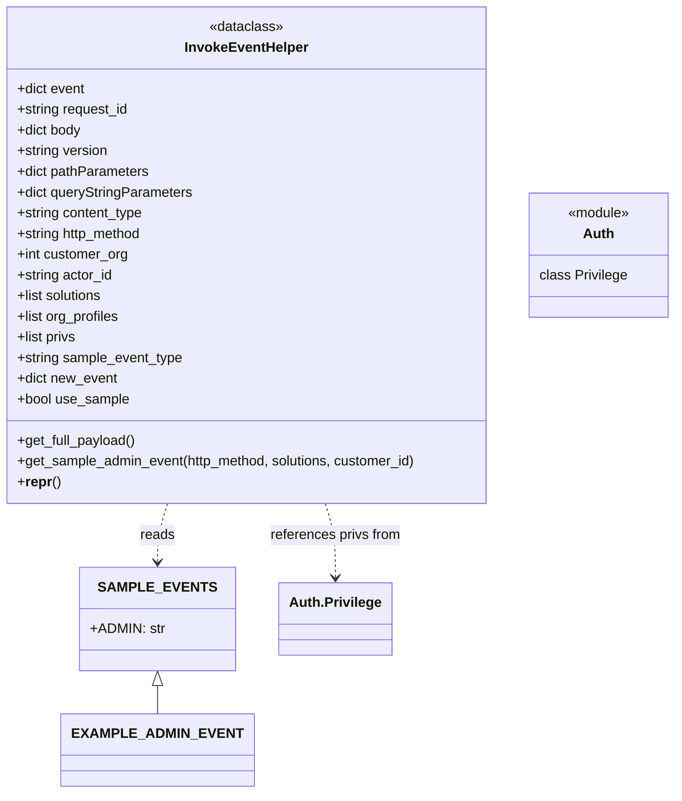

# Diagram: application_service/container_tracking_app_service/utility/InvokeEventHelper.py


> Auto-generated by Obscura crawlers

## Diagram 1



### SVG

<svg id="container" width="792.625" xmlns="http://www.w3.org/2000/svg" class="classDiagram" height="920" viewBox="0 0 792.625 920" role="graphics-document document" aria-roledescription="class"><style>#container{font-family:"trebuchet ms",verdana,arial,sans-serif;font-size:16px;fill:#333;}@keyframes edge-animation-frame{from{stroke-dashoffset:0;}}@keyframes dash{to{stroke-dashoffset:0;}}#container .edge-animation-slow{stroke-dasharray:9,5!important;stroke-dashoffset:900;animation:dash 50s linear infinite;stroke-linecap:round;}#container .edge-animation-fast{stroke-dasharray:9,5!important;stroke-dashoffset:900;animation:dash 20s linear infinite;stroke-linecap:round;}#container .error-icon{fill:#552222;}#container .error-text{fill:#552222;stroke:#552222;}#container .edge-thickness-normal{stroke-width:1px;}#container .edge-thickness-thick{stroke-width:3.5px;}#container .edge-pattern-solid{stroke-dasharray:0;}#container .edge-thickness-invisible{stroke-width:0;fill:none;}#container .edge-pattern-dashed{stroke-dasharray:3;}#container .edge-pattern-dotted{stroke-dasharray:2;}#container .marker{fill:#333333;stroke:#333333;}#container .marker.cross{stroke:#333333;}#container svg{font-family:"trebuchet ms",verdana,arial,sans-serif;font-size:16px;}#container p{margin:0;}#container g.classGroup text{fill:#9370DB;stroke:none;font-family:"trebuchet ms",verdana,arial,sans-serif;font-size:10px;}#container g.classGroup text .title{font-weight:bolder;}#container .nodeLabel,#container .edgeLabel{color:#131300;}#container .edgeLabel .label rect{fill:#ECECFF;}#container .label text{fill:#131300;}#container .labelBkg{background:#ECECFF;}#container .edgeLabel .label span{background:#ECECFF;}#container .classTitle{font-weight:bolder;}#container .node rect,#container .node circle,#container .node ellipse,#container .node polygon,#container .node path{fill:#ECECFF;stroke:#9370DB;stroke-width:1px;}#container .divider{stroke:#9370DB;stroke-width:1;}#container g.clickable{cursor:pointer;}#container g.classGroup rect{fill:#ECECFF;stroke:#9370DB;}#container g.classGroup line{stroke:#9370DB;stroke-width:1;}#container .classLabel .box{stroke:none;stroke-width:0;fill:#ECECFF;opacity:0.5;}#container .classLabel .label{fill:#9370DB;font-size:10px;}#container .relation{stroke:#333333;stroke-width:1;fill:none;}#container .dashed-line{stroke-dasharray:3;}#container .dotted-line{stroke-dasharray:1 2;}#container #compositionStart,#container .composition{fill:#333333!important;stroke:#333333!important;stroke-width:1;}#container #compositionEnd,#container .composition{fill:#333333!important;stroke:#333333!important;stroke-width:1;}#container #dependencyStart,#container .dependency{fill:#333333!important;stroke:#333333!important;stroke-width:1;}#container #dependencyStart,#container .dependency{fill:#333333!important;stroke:#333333!important;stroke-width:1;}#container #extensionStart,#container .extension{fill:transparent!important;stroke:#333333!important;stroke-width:1;}#container #extensionEnd,#container .extension{fill:transparent!important;stroke:#333333!important;stroke-width:1;}#container #aggregationStart,#container .aggregation{fill:transparent!important;stroke:#333333!important;stroke-width:1;}#container #aggregationEnd,#container .aggregation{fill:transparent!important;stroke:#333333!important;stroke-width:1;}#container #lollipopStart,#container .lollipop{fill:#ECECFF!important;stroke:#333333!important;stroke-width:1;}#container #lollipopEnd,#container .lollipop{fill:#ECECFF!important;stroke:#333333!important;stroke-width:1;}#container .edgeTerminals{font-size:11px;line-height:initial;}#container .classTitleText{text-anchor:middle;font-size:18px;fill:#333;}#container .label-icon{display:inline-block;height:1em;overflow:visible;vertical-align:-0.125em;}#container .node .label-icon path{fill:currentColor;stroke:revert;stroke-width:revert;}#container :root{--mermaid-font-family:"trebuchet ms",verdana,arial,sans-serif;}</style><g><defs><marker id="container_class-aggregationStart" class="marker aggregation class" refX="18" refY="7" markerWidth="190" markerHeight="240" orient="auto"><path d="M 18,7 L9,13 L1,7 L9,1 Z"></path></marker></defs><defs><marker id="container_class-aggregationEnd" class="marker aggregation class" refX="1" refY="7" markerWidth="20" markerHeight="28" orient="auto"><path d="M 18,7 L9,13 L1,7 L9,1 Z"></path></marker></defs><defs><marker id="container_class-extensionStart" class="marker extension class" refX="18" refY="7" markerWidth="190" markerHeight="240" orient="auto"><path d="M 1,7 L18,13 V 1 Z"></path></marker></defs><defs><marker id="container_class-extensionEnd" class="marker extension class" refX="1" refY="7" markerWidth="20" markerHeight="28" orient="auto"><path d="M 1,1 V 13 L18,7 Z"></path></marker></defs><defs><marker id="container_class-compositionStart" class="marker composition class" refX="18" refY="7" markerWidth="190" markerHeight="240" orient="auto"><path d="M 18,7 L9,13 L1,7 L9,1 Z"></path></marker></defs><defs><marker id="container_class-compositionEnd" class="marker composition class" refX="1" refY="7" markerWidth="20" markerHeight="28" orient="auto"><path d="M 18,7 L9,13 L1,7 L9,1 Z"></path></marker></defs><defs><marker id="container_class-dependencyStart" class="marker dependency class" refX="6" refY="7" markerWidth="190" markerHeight="240" orient="auto"><path d="M 5,7 L9,13 L1,7 L9,1 Z"></path></marker></defs><defs><marker id="container_class-dependencyEnd" class="marker dependency class" refX="13" refY="7" markerWidth="20" markerHeight="28" orient="auto"><path d="M 18,7 L9,13 L14,7 L9,1 Z"></path></marker></defs><defs><marker id="container_class-lollipopStart" class="marker lollipop class" refX="13" refY="7" markerWidth="190" markerHeight="240" orient="auto"><circle stroke="black" fill="transparent" cx="7" cy="7" r="6"></circle></marker></defs><defs><marker id="container_class-lollipopEnd" class="marker lollipop class" refX="1" refY="7" markerWidth="190" markerHeight="240" orient="auto"><circle stroke="black" fill="transparent" cx="7" cy="7" r="6"></circle></marker></defs><g class="root"><g class="clusters"></g><g class="edgePaths"><path d="M203.13,584L201.269,590.167C199.409,596.333,195.688,608.667,193.827,620C191.967,631.333,191.967,641.667,191.967,646.833L191.967,652" id="id_InvokeEventHelper_SAMPLE_EVENTS_1" class="edge-thickness-normal edge-pattern-dashed relation" style=";;;" data-edge="true" data-et="edge" data-id="id_InvokeEventHelper_SAMPLE_EVENTS_1" data-points="W3sieCI6MjAzLjEyOTcyMzU1NzY5MjMsInkiOjU4NH0seyJ4IjoxOTEuOTY2Nzk2ODc1LCJ5Ijo2MjF9LHsieCI6MTkxLjk2Njc5Njg3NSwieSI6NjU4fV0=" marker-end="url(#container_class-dependencyEnd)"></path><path d="M376.909,584L378.77,590.167C380.63,596.333,384.351,608.667,386.212,623C388.072,637.333,388.072,653.667,388.072,661.833L388.072,670" id="id_InvokeEventHelper_Auth.Privilege_2" class="edge-thickness-normal edge-pattern-dashed relation" style=";;;" data-edge="true" data-et="edge" data-id="id_InvokeEventHelper_Auth.Privilege_2" data-points="W3sieCI6Mzc2LjkwOTMzODk0MjMwNzcsInkiOjU4NH0seyJ4IjozODguMDcyMjY1NjI1LCJ5Ijo2MjF9LHsieCI6Mzg4LjA3MjI2NTYyNSwieSI6Njc2fV0=" marker-end="url(#container_class-dependencyEnd)"></path><path d="M191.967,795.25L191.967,796.542C191.967,797.833,191.967,800.417,191.967,805.875C191.967,811.333,191.967,819.667,191.967,823.833L191.967,828" id="id_SAMPLE_EVENTS_EXAMPLE_ADMIN_EVENT_3" class="edge-thickness-normal edge-pattern-solid relation" style=";;;" data-edge="true" data-et="edge" data-id="id_SAMPLE_EVENTS_EXAMPLE_ADMIN_EVENT_3" data-points="W3sieCI6MTkxLjk2Njc5Njg3NSwieSI6Nzc4fSx7IngiOjE5MS45NjY3OTY4NzUsInkiOjgwM30seyJ4IjoxOTEuOTY2Nzk2ODc1LCJ5Ijo4Mjh9XQ==" marker-start="url(#container_class-extensionStart)"></path></g><g class="edgeLabels"><g class="edgeLabel" transform="translate(191.966796875, 621)"><g class="label" data-id="id_InvokeEventHelper_SAMPLE_EVENTS_1" transform="translate(-20.0078125, -12)"><foreignObject width="40.015625" height="24"><div xmlns="http://www.w3.org/1999/xhtml" class="labelBkg" style="display: table-cell; white-space: nowrap; line-height: 1.5; max-width: 200px; text-align: center;"><span class="edgeLabel"><p>reads</p></span></div></foreignObject></g></g><g class="edgeLabel" transform="translate(388.072265625, 621)"><g class="label" data-id="id_InvokeEventHelper_Auth.Privilege_2" transform="translate(-76.8359375, -12)"><foreignObject width="153.671875" height="24"><div xmlns="http://www.w3.org/1999/xhtml" class="labelBkg" style="display: table-cell; white-space: nowrap; line-height: 1.5; max-width: 200px; text-align: center;"><span class="edgeLabel"><p>references privs from</p></span></div></foreignObject></g></g><g class="edgeLabel"><g class="label" data-id="id_SAMPLE_EVENTS_EXAMPLE_ADMIN_EVENT_3" transform="translate(0, 0)"><foreignObject width="0" height="0"><div xmlns="http://www.w3.org/1999/xhtml" class="labelBkg" style="display: table-cell; white-space: nowrap; line-height: 1.5; max-width: 200px; text-align: center;"><span class="edgeLabel"></span></div></foreignObject></g></g></g><g class="nodes"><g class="node default" id="classId-InvokeEventHelper-0" transform="translate(290.01953125, 296)"><g class="basic label-container"><path d="M-282.01953125 -288 L282.01953125 -288 L282.01953125 288 L-282.01953125 288" stroke="none" stroke-width="0" fill="#ECECFF" style=""></path><path d="M-282.01953125 -288 C-59.29820732182969 -288, 163.4231166063406 -288, 282.01953125 -288 M-282.01953125 -288 C-72.7438164749957 -288, 136.5318983000086 -288, 282.01953125 -288 M282.01953125 -288 C282.01953125 -100.04565203096425, 282.01953125 87.9086959380715, 282.01953125 288 M282.01953125 -288 C282.01953125 -163.84410049301215, 282.01953125 -39.68820098602433, 282.01953125 288 M282.01953125 288 C129.63844276802084 288, -22.742645713958325 288, -282.01953125 288 M282.01953125 288 C98.1643089829771 288, -85.69091328404579 288, -282.01953125 288 M-282.01953125 288 C-282.01953125 134.71815038365781, -282.01953125 -18.56369923268437, -282.01953125 -288 M-282.01953125 288 C-282.01953125 69.12885268285532, -282.01953125 -149.74229463428935, -282.01953125 -288" stroke="#9370DB" stroke-width="1.3" fill="none" stroke-dasharray="0 0" style=""></path></g><g class="annotation-group text" transform="translate(-43.0859375, -264)"><g class="label" style="" transform="translate(0,-12)"><foreignObject width="86.171875" height="24"><div xmlns="http://www.w3.org/1999/xhtml" style="display: table-cell; white-space: nowrap; line-height: 1.5; max-width: 136px; text-align: center;"><span class="nodeLabel markdown-node-label" style=""><p>«dataclass»</p></span></div></foreignObject></g></g><g class="label-group text" transform="translate(-69.0859375, -240)"><g class="label" style="font-weight: bolder" transform="translate(0,-12)"><foreignObject width="138.171875" height="24"><div xmlns="http://www.w3.org/1999/xhtml" style="display: table-cell; white-space: nowrap; line-height: 1.5; max-width: 187px; text-align: center;"><span class="nodeLabel markdown-node-label" style=""><p>InvokeEventHelper</p></span></div></foreignObject></g></g><g class="members-group text" transform="translate(-270.01953125, -192)"><g class="label" style="" transform="translate(0,-12)"><foreignObject width="80.078125" height="24"><div xmlns="http://www.w3.org/1999/xhtml" style="display: table-cell; white-space: nowrap; line-height: 1.5; max-width: 138px; text-align: center;"><span class="nodeLabel markdown-node-label" style=""><p>+dict event</p></span></div></foreignObject></g><g class="label" style="" transform="translate(0,12)"><foreignObject width="131.53125" height="24"><div xmlns="http://www.w3.org/1999/xhtml" style="display: table-cell; white-space: nowrap; line-height: 1.5; max-width: 189px; text-align: center;"><span class="nodeLabel markdown-node-label" style=""><p>+string request_id</p></span></div></foreignObject></g><g class="label" style="" transform="translate(0,36)"><foreignObject width="76.03125" height="24"><div xmlns="http://www.w3.org/1999/xhtml" style="display: table-cell; white-space: nowrap; line-height: 1.5; max-width: 134px; text-align: center;"><span class="nodeLabel markdown-node-label" style=""><p>+dict body</p></span></div></foreignObject></g><g class="label" style="" transform="translate(0,60)"><foreignObject width="107.03125" height="24"><div xmlns="http://www.w3.org/1999/xhtml" style="display: table-cell; white-space: nowrap; line-height: 1.5; max-width: 164px; text-align: center;"><span class="nodeLabel markdown-node-label" style=""><p>+string version</p></span></div></foreignObject></g><g class="label" style="" transform="translate(0,84)"><foreignObject width="154.46875" height="24"><div xmlns="http://www.w3.org/1999/xhtml" style="display: table-cell; white-space: nowrap; line-height: 1.5; max-width: 212px; text-align: center;"><span class="nodeLabel markdown-node-label" style=""><p>+dict pathParameters</p></span></div></foreignObject></g><g class="label" style="" transform="translate(0,108)"><foreignObject width="205.796875" height="24"><div xmlns="http://www.w3.org/1999/xhtml" style="display: table-cell; white-space: nowrap; line-height: 1.5; max-width: 263px; text-align: center;"><span class="nodeLabel markdown-node-label" style=""><p>+dict queryStringParameters</p></span></div></foreignObject></g><g class="label" style="" transform="translate(0,132)"><foreignObject width="149.109375" height="24"><div xmlns="http://www.w3.org/1999/xhtml" style="display: table-cell; white-space: nowrap; line-height: 1.5; max-width: 206px; text-align: center;"><span class="nodeLabel markdown-node-label" style=""><p>+string content_type</p></span></div></foreignObject></g><g class="label" style="" transform="translate(0,156)"><foreignObject width="148.796875" height="24"><div xmlns="http://www.w3.org/1999/xhtml" style="display: table-cell; white-space: nowrap; line-height: 1.5; max-width: 206px; text-align: center;"><span class="nodeLabel markdown-node-label" style=""><p>+string http_method</p></span></div></foreignObject></g><g class="label" style="" transform="translate(0,180)"><foreignObject width="129.96875" height="24"><div xmlns="http://www.w3.org/1999/xhtml" style="display: table-cell; white-space: nowrap; line-height: 1.5; max-width: 188px; text-align: center;"><span class="nodeLabel markdown-node-label" style=""><p>+int customer_org</p></span></div></foreignObject></g><g class="label" style="" transform="translate(0,204)"><foreignObject width="112.390625" height="24"><div xmlns="http://www.w3.org/1999/xhtml" style="display: table-cell; white-space: nowrap; line-height: 1.5; max-width: 170px; text-align: center;"><span class="nodeLabel markdown-node-label" style=""><p>+string actor_id</p></span></div></foreignObject></g><g class="label" style="" transform="translate(0,228)"><foreignObject width="101.96875" height="24"><div xmlns="http://www.w3.org/1999/xhtml" style="display: table-cell; white-space: nowrap; line-height: 1.5; max-width: 159px; text-align: center;"><span class="nodeLabel markdown-node-label" style=""><p>+list solutions</p></span></div></foreignObject></g><g class="label" style="" transform="translate(0,252)"><foreignObject width="121.203125" height="24"><div xmlns="http://www.w3.org/1999/xhtml" style="display: table-cell; white-space: nowrap; line-height: 1.5; max-width: 179px; text-align: center;"><span class="nodeLabel markdown-node-label" style=""><p>+list org_profiles</p></span></div></foreignObject></g><g class="label" style="" transform="translate(0,276)"><foreignObject width="70.109375" height="24"><div xmlns="http://www.w3.org/1999/xhtml" style="display: table-cell; white-space: nowrap; line-height: 1.5; max-width: 127px; text-align: center;"><span class="nodeLabel markdown-node-label" style=""><p>+list privs</p></span></div></foreignObject></g><g class="label" style="" transform="translate(0,300)"><foreignObject width="194.234375" height="24"><div xmlns="http://www.w3.org/1999/xhtml" style="display: table-cell; white-space: nowrap; line-height: 1.5; max-width: 252px; text-align: center;"><span class="nodeLabel markdown-node-label" style=""><p>+string sample_event_type</p></span></div></foreignObject></g><g class="label" style="" transform="translate(0,324)"><foreignObject width="117.3125" height="24"><div xmlns="http://www.w3.org/1999/xhtml" style="display: table-cell; white-space: nowrap; line-height: 1.5; max-width: 175px; text-align: center;"><span class="nodeLabel markdown-node-label" style=""><p>+dict new_event</p></span></div></foreignObject></g><g class="label" style="" transform="translate(0,348)"><foreignObject width="131.171875" height="24"><div xmlns="http://www.w3.org/1999/xhtml" style="display: table-cell; white-space: nowrap; line-height: 1.5; max-width: 189px; text-align: center;"><span class="nodeLabel markdown-node-label" style=""><p>+bool use_sample</p></span></div></foreignObject></g></g><g class="methods-group text" transform="translate(-270.01953125, 216)"><g class="label" style="" transform="translate(0,-12)"><foreignObject width="139.03125" height="24"><div xmlns="http://www.w3.org/1999/xhtml" style="display: table-cell; white-space: nowrap; line-height: 1.5; max-width: 196px; text-align: center;"><span class="nodeLabel markdown-node-label" style=""><p>+get_full_payload()</p></span></div></foreignObject></g><g class="label" style="" transform="translate(0,12)"><foreignObject width="470.953125" height="24"><div xmlns="http://www.w3.org/1999/xhtml" style="display: table-cell; white-space: nowrap; line-height: 1.5; max-width: 528px; text-align: center;"><span class="nodeLabel markdown-node-label" style=""><p>+get_sample_admin_event(http_method, solutions, customer_id)</p></span></div></foreignObject></g><g class="label" style="" transform="translate(0,36)"><foreignObject width="49.109375" height="24"><div xmlns="http://www.w3.org/1999/xhtml" style="display: table-cell; white-space: nowrap; line-height: 1.5; max-width: 136px; text-align: center;"><span class="nodeLabel markdown-node-label" style=""><p>+<strong>repr</strong>()</p></span></div></foreignObject></g></g><g class="divider" style=""><path d="M-282.01953125 -216 C-124.22386038916514 -216, 33.57181047166972 -216, 282.01953125 -216 M-282.01953125 -216 C-88.09564906648575 -216, 105.8282331170285 -216, 282.01953125 -216" stroke="#9370DB" stroke-width="1.3" fill="none" stroke-dasharray="0 0" style=""></path></g><g class="divider" style=""><path d="M-282.01953125 192 C-153.91364348060637 192, -25.807755711212735 192, 282.01953125 192 M-282.01953125 192 C-114.60141016635978 192, 52.81671091728043 192, 282.01953125 192" stroke="#9370DB" stroke-width="1.3" fill="none" stroke-dasharray="0 0" style=""></path></g></g><g class="node default" id="classId-SAMPLE_EVENTS-1" transform="translate(191.966796875, 718)"><g class="basic label-container"><path d="M-83.31640625 -60 L83.31640625 -60 L83.31640625 60 L-83.31640625 60" stroke="none" stroke-width="0" fill="#ECECFF" style=""></path><path d="M-83.31640625 -60 C-33.86815046394173 -60, 15.580105322116538 -60, 83.31640625 -60 M-83.31640625 -60 C-44.85791600334917 -60, -6.399425756698335 -60, 83.31640625 -60 M83.31640625 -60 C83.31640625 -29.07403746598378, 83.31640625 1.8519250680324433, 83.31640625 60 M83.31640625 -60 C83.31640625 -26.23371244273585, 83.31640625 7.532575114528299, 83.31640625 60 M83.31640625 60 C37.8066564799258 60, -7.703093290148402 60, -83.31640625 60 M83.31640625 60 C18.043989720470933 60, -47.228426809058135 60, -83.31640625 60 M-83.31640625 60 C-83.31640625 18.618925190563978, -83.31640625 -22.762149618872044, -83.31640625 -60 M-83.31640625 60 C-83.31640625 18.302853616706578, -83.31640625 -23.394292766586844, -83.31640625 -60" stroke="#9370DB" stroke-width="1.3" fill="none" stroke-dasharray="0 0" style=""></path></g><g class="annotation-group text" transform="translate(0, -36)"></g><g class="label-group text" transform="translate(-59.8359375, -36)"><g class="label" style="font-weight: bolder" transform="translate(0,-12)"><foreignObject width="119.671875" height="24"><div xmlns="http://www.w3.org/1999/xhtml" style="display: table-cell; white-space: nowrap; line-height: 1.5; max-width: 168px; text-align: center;"><span class="nodeLabel markdown-node-label" style=""><p>SAMPLE_EVENTS</p></span></div></foreignObject></g></g><g class="members-group text" transform="translate(-71.31640625, 12)"><g class="label" style="" transform="translate(0,-12)"><foreignObject width="82.796875" height="24"><div xmlns="http://www.w3.org/1999/xhtml" style="display: table-cell; white-space: nowrap; line-height: 1.5; max-width: 141px; text-align: center;"><span class="nodeLabel markdown-node-label" style=""><p>+ADMIN: str</p></span></div></foreignObject></g></g><g class="methods-group text" transform="translate(-71.31640625, 60)"></g><g class="divider" style=""><path d="M-83.31640625 -12 C-28.174357066167374 -12, 26.96769211766525 -12, 83.31640625 -12 M-83.31640625 -12 C-49.47979550567521 -12, -15.643184761350426 -12, 83.31640625 -12" stroke="#9370DB" stroke-width="1.3" fill="none" stroke-dasharray="0 0" style=""></path></g><g class="divider" style=""><path d="M-83.31640625 36 C-44.69978597472357 36, -6.083165699447136 36, 83.31640625 36 M-83.31640625 36 C-45.81418195552749 36, -8.311957661054976 36, 83.31640625 36" stroke="#9370DB" stroke-width="1.3" fill="none" stroke-dasharray="0 0" style=""></path></g></g><g class="node default" id="classId-Auth-2" transform="translate(703.33203125, 296)"><g class="basic label-container"><path d="M-81.29296875 -72 L81.29296875 -72 L81.29296875 72 L-81.29296875 72" stroke="none" stroke-width="0" fill="#ECECFF" style=""></path><path d="M-81.29296875 -72 C-39.036758057953406 -72, 3.2194526340931873 -72, 81.29296875 -72 M-81.29296875 -72 C-31.821953706052795 -72, 17.64906133789441 -72, 81.29296875 -72 M81.29296875 -72 C81.29296875 -16.04758663744422, 81.29296875 39.90482672511156, 81.29296875 72 M81.29296875 -72 C81.29296875 -28.679464782294957, 81.29296875 14.641070435410086, 81.29296875 72 M81.29296875 72 C37.489311059231085 72, -6.3143466315378305 72, -81.29296875 72 M81.29296875 72 C17.300265427160348 72, -46.692437895679305 72, -81.29296875 72 M-81.29296875 72 C-81.29296875 15.351252260904268, -81.29296875 -41.297495478191465, -81.29296875 -72 M-81.29296875 72 C-81.29296875 39.757299400345836, -81.29296875 7.514598800691672, -81.29296875 -72" stroke="#9370DB" stroke-width="1.3" fill="none" stroke-dasharray="0 0" style=""></path></g><g class="annotation-group text" transform="translate(-36.6015625, -48)"><g class="label" style="" transform="translate(0,-12)"><foreignObject width="73.203125" height="24"><div xmlns="http://www.w3.org/1999/xhtml" style="display: table-cell; white-space: nowrap; line-height: 1.5; max-width: 123px; text-align: center;"><span class="nodeLabel markdown-node-label" style=""><p>«module»</p></span></div></foreignObject></g></g><g class="label-group text" transform="translate(-17.0078125, -24)"><g class="label" style="font-weight: bolder" transform="translate(0,-12)"><foreignObject width="34.015625" height="24"><div xmlns="http://www.w3.org/1999/xhtml" style="display: table-cell; white-space: nowrap; line-height: 1.5; max-width: 84px; text-align: center;"><span class="nodeLabel markdown-node-label" style=""><p>Auth</p></span></div></foreignObject></g></g><g class="members-group text" transform="translate(-69.29296875, 24)"><g class="label" style="" transform="translate(0,-12)"><foreignObject width="101.984375" height="24"><div xmlns="http://www.w3.org/1999/xhtml" style="display: table-cell; white-space: nowrap; line-height: 1.5; max-width: 152px; text-align: center;"><span class="nodeLabel markdown-node-label" style=""><p>class Privilege</p></span></div></foreignObject></g></g><g class="methods-group text" transform="translate(-69.29296875, 72)"></g><g class="divider" style=""><path d="M-81.29296875 0 C-40.919772789360245 0, -0.5465768287204895 0, 81.29296875 0 M-81.29296875 0 C-23.202838784605667 0, 34.887291180788665 0, 81.29296875 0" stroke="#9370DB" stroke-width="1.3" fill="none" stroke-dasharray="0 0" style=""></path></g><g class="divider" style=""><path d="M-81.29296875 48 C-39.51576389236036 48, 2.2614409652792773 48, 81.29296875 48 M-81.29296875 48 C-21.792134203942823 48, 37.708700342114355 48, 81.29296875 48" stroke="#9370DB" stroke-width="1.3" fill="none" stroke-dasharray="0 0" style=""></path></g></g><g class="node default" id="classId-Auth.Privilege-3" transform="translate(388.072265625, 718)"><g class="basic label-container"><path d="M-62.7890625 -42 L62.7890625 -42 L62.7890625 42 L-62.7890625 42" stroke="none" stroke-width="0" fill="#ECECFF" style=""></path><path d="M-62.7890625 -42 C-35.583132499057285 -42, -8.377202498114563 -42, 62.7890625 -42 M-62.7890625 -42 C-31.164390340022255 -42, 0.46028181995549033 -42, 62.7890625 -42 M62.7890625 -42 C62.7890625 -11.140944280501408, 62.7890625 19.718111438997184, 62.7890625 42 M62.7890625 -42 C62.7890625 -13.67523133824059, 62.7890625 14.649537323518821, 62.7890625 42 M62.7890625 42 C33.591150207374305 42, 4.39323791474861 42, -62.7890625 42 M62.7890625 42 C26.939817495296083 42, -8.909427509407834 42, -62.7890625 42 M-62.7890625 42 C-62.7890625 15.601549742630002, -62.7890625 -10.796900514739995, -62.7890625 -42 M-62.7890625 42 C-62.7890625 23.82015122549816, -62.7890625 5.640302450996323, -62.7890625 -42" stroke="#9370DB" stroke-width="1.3" fill="none" stroke-dasharray="0 0" style=""></path></g><g class="annotation-group text" transform="translate(0, -18)"></g><g class="label-group text" transform="translate(-50.7890625, -18)"><g class="label" style="font-weight: bolder" transform="translate(0,-12)"><foreignObject width="101.578125" height="24"><div xmlns="http://www.w3.org/1999/xhtml" style="display: table-cell; white-space: nowrap; line-height: 1.5; max-width: 150px; text-align: center;"><span class="nodeLabel markdown-node-label" style=""><p>Auth.Privilege</p></span></div></foreignObject></g></g><g class="members-group text" transform="translate(-50.7890625, 30)"></g><g class="methods-group text" transform="translate(-50.7890625, 60)"></g><g class="divider" style=""><path d="M-62.7890625 6 C-34.72971273892861 6, -6.670362977857231 6, 62.7890625 6 M-62.7890625 6 C-37.45523704043074 6, -12.121411580861476 6, 62.7890625 6" stroke="#9370DB" stroke-width="1.3" fill="none" stroke-dasharray="0 0" style=""></path></g><g class="divider" style=""><path d="M-62.7890625 24 C-35.55773963063749 24, -8.326416761274984 24, 62.7890625 24 M-62.7890625 24 C-15.171320623332043 24, 32.44642125333591 24, 62.7890625 24" stroke="#9370DB" stroke-width="1.3" fill="none" stroke-dasharray="0 0" style=""></path></g></g><g class="node default" id="classId-EXAMPLE_ADMIN_EVENT-4" transform="translate(191.966796875, 870)"><g class="basic label-container"><path d="M-99.6953125 -42 L99.6953125 -42 L99.6953125 42 L-99.6953125 42" stroke="none" stroke-width="0" fill="#ECECFF" style=""></path><path d="M-99.6953125 -42 C-52.16821175144035 -42, -4.641111002880706 -42, 99.6953125 -42 M-99.6953125 -42 C-41.40063023011863 -42, 16.89405203976274 -42, 99.6953125 -42 M99.6953125 -42 C99.6953125 -11.836833552369889, 99.6953125 18.326332895260222, 99.6953125 42 M99.6953125 -42 C99.6953125 -24.14616425146115, 99.6953125 -6.292328502922302, 99.6953125 42 M99.6953125 42 C56.8520954577806 42, 14.008878415561199 42, -99.6953125 42 M99.6953125 42 C43.37637832403445 42, -12.942555851931104 42, -99.6953125 42 M-99.6953125 42 C-99.6953125 22.68071102866496, -99.6953125 3.361422057329918, -99.6953125 -42 M-99.6953125 42 C-99.6953125 14.177753126507476, -99.6953125 -13.644493746985049, -99.6953125 -42" stroke="#9370DB" stroke-width="1.3" fill="none" stroke-dasharray="0 0" style=""></path></g><g class="annotation-group text" transform="translate(0, -18)"></g><g class="label-group text" transform="translate(-87.6953125, -18)"><g class="label" style="font-weight: bolder" transform="translate(0,-12)"><foreignObject width="175.390625" height="24"><div xmlns="http://www.w3.org/1999/xhtml" style="display: table-cell; white-space: nowrap; line-height: 1.5; max-width: 225px; text-align: center;"><span class="nodeLabel markdown-node-label" style=""><p>EXAMPLE_ADMIN_EVENT</p></span></div></foreignObject></g></g><g class="members-group text" transform="translate(-87.6953125, 30)"></g><g class="methods-group text" transform="translate(-87.6953125, 60)"></g><g class="divider" style=""><path d="M-99.6953125 6 C-48.053548963356945 6, 3.588214573286109 6, 99.6953125 6 M-99.6953125 6 C-37.430137601541134 6, 24.835037296917733 6, 99.6953125 6" stroke="#9370DB" stroke-width="1.3" fill="none" stroke-dasharray="0 0" style=""></path></g><g class="divider" style=""><path d="M-99.6953125 24 C-29.44220017946924 24, 40.81091214106152 24, 99.6953125 24 M-99.6953125 24 C-32.45018221063796 24, 34.794948078724076 24, 99.6953125 24" stroke="#9370DB" stroke-width="1.3" fill="none" stroke-dasharray="0 0" style=""></path></g></g></g></g></g></svg>

## Diagram 2

```mermaid
flowchart LR
    Start([get_full_payload]) --> HasEvent{self.event is set?}
    HasEvent -- Yes --> CloneEvent[deepcopy(self.event) -> new_event]
    CloneEvent --> CheckMethod{self.http_method != "GET"?}
    CheckMethod -- Yes --> SetHttpMethod[new_event["httpMethod"] = self.http_method]
    CheckMethod -- No --> SkipMethod[no httpMethod change]
    SetHttpMethod --> EnsureVersion
    SkipMethod --> EnsureVersion
    HasEvent -- No --> CreateSample[example_event = get_sample_admin_event(self.http_method, solutions=False, customer_id=self.customer_org)]
    CreateSample --> SetActorEmail[example_event["requestContext"]["authorizer"]["email"] = self.actor_id]
    SetActorEmail --> EnsureVersion
    EnsureVersion{self.version present?} --> AddHeaders[ensure new_event["headers"]; update Accept header with version]
    AddHeaders --> SetBody
    SetBody[set new_event["body"] = self.body] --> SetPathParams
    SetPathParams[set new_event["pathParameters"] = self.pathParameters] --> SetQueryParams
    SetQueryParams[set new_event["queryStringParameters"] = self.queryStringParameters] --> ReturnEvent([return new_event])
```

> SVG rendering failed for this diagram.
