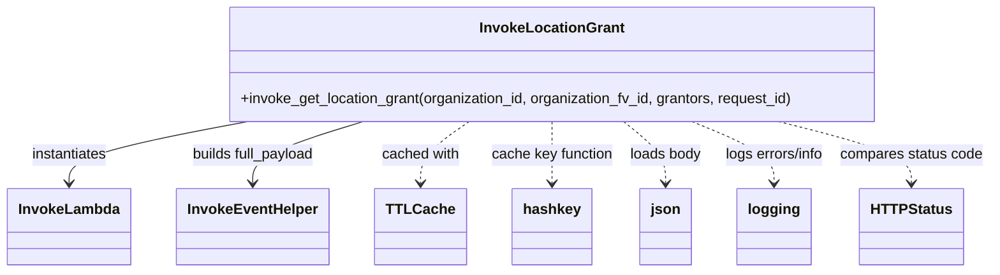

# Diagram: application_service/container_tracking_app_service/utility/InvokeLocationGrant.py


> Auto-generated by Obscura crawlers

## Diagram 1



### SVG

<svg id="container" width="1073.78125" xmlns="http://www.w3.org/2000/svg" class="classDiagram" height="300" viewBox="0 0 1073.78125 300" role="graphics-document document" aria-roledescription="class"><style>#container{font-family:"trebuchet ms",verdana,arial,sans-serif;font-size:16px;fill:#333;}@keyframes edge-animation-frame{from{stroke-dashoffset:0;}}@keyframes dash{to{stroke-dashoffset:0;}}#container .edge-animation-slow{stroke-dasharray:9,5!important;stroke-dashoffset:900;animation:dash 50s linear infinite;stroke-linecap:round;}#container .edge-animation-fast{stroke-dasharray:9,5!important;stroke-dashoffset:900;animation:dash 20s linear infinite;stroke-linecap:round;}#container .error-icon{fill:#552222;}#container .error-text{fill:#552222;stroke:#552222;}#container .edge-thickness-normal{stroke-width:1px;}#container .edge-thickness-thick{stroke-width:3.5px;}#container .edge-pattern-solid{stroke-dasharray:0;}#container .edge-thickness-invisible{stroke-width:0;fill:none;}#container .edge-pattern-dashed{stroke-dasharray:3;}#container .edge-pattern-dotted{stroke-dasharray:2;}#container .marker{fill:#333333;stroke:#333333;}#container .marker.cross{stroke:#333333;}#container svg{font-family:"trebuchet ms",verdana,arial,sans-serif;font-size:16px;}#container p{margin:0;}#container g.classGroup text{fill:#9370DB;stroke:none;font-family:"trebuchet ms",verdana,arial,sans-serif;font-size:10px;}#container g.classGroup text .title{font-weight:bolder;}#container .nodeLabel,#container .edgeLabel{color:#131300;}#container .edgeLabel .label rect{fill:#ECECFF;}#container .label text{fill:#131300;}#container .labelBkg{background:#ECECFF;}#container .edgeLabel .label span{background:#ECECFF;}#container .classTitle{font-weight:bolder;}#container .node rect,#container .node circle,#container .node ellipse,#container .node polygon,#container .node path{fill:#ECECFF;stroke:#9370DB;stroke-width:1px;}#container .divider{stroke:#9370DB;stroke-width:1;}#container g.clickable{cursor:pointer;}#container g.classGroup rect{fill:#ECECFF;stroke:#9370DB;}#container g.classGroup line{stroke:#9370DB;stroke-width:1;}#container .classLabel .box{stroke:none;stroke-width:0;fill:#ECECFF;opacity:0.5;}#container .classLabel .label{fill:#9370DB;font-size:10px;}#container .relation{stroke:#333333;stroke-width:1;fill:none;}#container .dashed-line{stroke-dasharray:3;}#container .dotted-line{stroke-dasharray:1 2;}#container #compositionStart,#container .composition{fill:#333333!important;stroke:#333333!important;stroke-width:1;}#container #compositionEnd,#container .composition{fill:#333333!important;stroke:#333333!important;stroke-width:1;}#container #dependencyStart,#container .dependency{fill:#333333!important;stroke:#333333!important;stroke-width:1;}#container #dependencyStart,#container .dependency{fill:#333333!important;stroke:#333333!important;stroke-width:1;}#container #extensionStart,#container .extension{fill:transparent!important;stroke:#333333!important;stroke-width:1;}#container #extensionEnd,#container .extension{fill:transparent!important;stroke:#333333!important;stroke-width:1;}#container #aggregationStart,#container .aggregation{fill:transparent!important;stroke:#333333!important;stroke-width:1;}#container #aggregationEnd,#container .aggregation{fill:transparent!important;stroke:#333333!important;stroke-width:1;}#container #lollipopStart,#container .lollipop{fill:#ECECFF!important;stroke:#333333!important;stroke-width:1;}#container #lollipopEnd,#container .lollipop{fill:#ECECFF!important;stroke:#333333!important;stroke-width:1;}#container .edgeTerminals{font-size:11px;line-height:initial;}#container .classTitleText{text-anchor:middle;font-size:18px;fill:#333;}#container .label-icon{display:inline-block;height:1em;overflow:visible;vertical-align:-0.125em;}#container .node .label-icon path{fill:currentColor;stroke:revert;stroke-width:revert;}#container :root{--mermaid-font-family:"trebuchet ms",verdana,arial,sans-serif;}</style><g><defs><marker id="container_class-aggregationStart" class="marker aggregation class" refX="18" refY="7" markerWidth="190" markerHeight="240" orient="auto"><path d="M 18,7 L9,13 L1,7 L9,1 Z"></path></marker></defs><defs><marker id="container_class-aggregationEnd" class="marker aggregation class" refX="1" refY="7" markerWidth="20" markerHeight="28" orient="auto"><path d="M 18,7 L9,13 L1,7 L9,1 Z"></path></marker></defs><defs><marker id="container_class-extensionStart" class="marker extension class" refX="18" refY="7" markerWidth="190" markerHeight="240" orient="auto"><path d="M 1,7 L18,13 V 1 Z"></path></marker></defs><defs><marker id="container_class-extensionEnd" class="marker extension class" refX="1" refY="7" markerWidth="20" markerHeight="28" orient="auto"><path d="M 1,1 V 13 L18,7 Z"></path></marker></defs><defs><marker id="container_class-compositionStart" class="marker composition class" refX="18" refY="7" markerWidth="190" markerHeight="240" orient="auto"><path d="M 18,7 L9,13 L1,7 L9,1 Z"></path></marker></defs><defs><marker id="container_class-compositionEnd" class="marker composition class" refX="1" refY="7" markerWidth="20" markerHeight="28" orient="auto"><path d="M 18,7 L9,13 L1,7 L9,1 Z"></path></marker></defs><defs><marker id="container_class-dependencyStart" class="marker dependency class" refX="6" refY="7" markerWidth="190" markerHeight="240" orient="auto"><path d="M 5,7 L9,13 L1,7 L9,1 Z"></path></marker></defs><defs><marker id="container_class-dependencyEnd" class="marker dependency class" refX="13" refY="7" markerWidth="20" markerHeight="28" orient="auto"><path d="M 18,7 L9,13 L14,7 L9,1 Z"></path></marker></defs><defs><marker id="container_class-lollipopStart" class="marker lollipop class" refX="13" refY="7" markerWidth="190" markerHeight="240" orient="auto"><circle stroke="black" fill="transparent" cx="7" cy="7" r="6"></circle></marker></defs><defs><marker id="container_class-lollipopEnd" class="marker lollipop class" refX="1" refY="7" markerWidth="190" markerHeight="240" orient="auto"><circle stroke="black" fill="transparent" cx="7" cy="7" r="6"></circle></marker></defs><g class="root"><g class="clusters"></g><g class="edgePaths"><path d="M263.008,134L231.421,140.167C199.834,146.333,136.659,158.667,105.072,170C73.484,181.333,73.484,191.667,73.484,196.833L73.484,202" id="id_InvokeLocationGrant_InvokeLambda_1" class="edge-thickness-normal edge-pattern-solid relation" style=";;;" data-edge="true" data-et="edge" data-id="id_InvokeLocationGrant_InvokeLambda_1" data-points="W3sieCI6MjYzLjAwODIwMzEyNSwieSI6MTM0fSx7IngiOjczLjQ4NDM3NSwieSI6MTcxfSx7IngiOjczLjQ4NDM3NSwieSI6MjA4fV0=" marker-end="url(#container_class-dependencyEnd)"></path><path d="M386.847,134L367.382,140.167C347.917,146.333,308.986,158.667,289.52,170C270.055,181.333,270.055,191.667,270.055,196.833L270.055,202" id="id_InvokeLocationGrant_InvokeEventHelper_2" class="edge-thickness-normal edge-pattern-solid relation" style=";;;" data-edge="true" data-et="edge" data-id="id_InvokeLocationGrant_InvokeEventHelper_2" data-points="W3sieCI6Mzg2Ljg0NzQ5OTk5OTk5OTk3LCJ5IjoxMzR9LHsieCI6MjcwLjA1NDY4NzUsInkiOjE3MX0seyJ4IjoyNzAuMDU0Njg3NSwieSI6MjA4fV0=" marker-end="url(#container_class-dependencyEnd)"></path><path d="M498.525,134L489.991,140.167C481.457,146.333,464.388,158.667,455.854,170C447.32,181.333,447.32,191.667,447.32,196.833L447.32,202" id="id_InvokeLocationGrant_TTLCache_3" class="edge-thickness-normal edge-pattern-dashed relation" style=";;;" data-edge="true" data-et="edge" data-id="id_InvokeLocationGrant_TTLCache_3" data-points="W3sieCI6NDk4LjUyNDg0Mzc1LCJ5IjoxMzR9LHsieCI6NDQ3LjMyMDMxMjUsInkiOjE3MX0seyJ4Ijo0NDcuMzIwMzEyNSwieSI6MjA4fV0=" marker-end="url(#container_class-dependencyEnd)"></path><path d="M585.711,134L585.711,140.167C585.711,146.333,585.711,158.667,585.711,170C585.711,181.333,585.711,191.667,585.711,196.833L585.711,202" id="id_InvokeLocationGrant_hashkey_4" class="edge-thickness-normal edge-pattern-dashed relation" style=";;;" data-edge="true" data-et="edge" data-id="id_InvokeLocationGrant_hashkey_4" data-points="W3sieCI6NTg1LjcxMDkzNzUsInkiOjEzNH0seyJ4Ijo1ODUuNzEwOTM3NSwieSI6MTcxfSx7IngiOjU4NS43MTA5Mzc1LCJ5IjoyMDh9XQ==" marker-end="url(#container_class-dependencyEnd)"></path><path d="M666.282,134L674.169,140.167C682.055,146.333,697.828,158.667,705.715,170C713.602,181.333,713.602,191.667,713.602,196.833L713.602,202" id="id_InvokeLocationGrant_json_5" class="edge-thickness-normal edge-pattern-dashed relation" style=";;;" data-edge="true" data-et="edge" data-id="id_InvokeLocationGrant_json_5" data-points="W3sieCI6NjY2LjI4MjAzMTI1LCJ5IjoxMzR9LHsieCI6NzEzLjYwMTU2MjUsInkiOjE3MX0seyJ4Ijo3MTMuNjAxNTYyNSwieSI6MjA4fV0=" marker-end="url(#container_class-dependencyEnd)"></path><path d="M740.007,134L755.11,140.167C770.213,146.333,800.419,158.667,815.522,170C830.625,181.333,830.625,191.667,830.625,196.833L830.625,202" id="id_InvokeLocationGrant_logging_6" class="edge-thickness-normal edge-pattern-dashed relation" style=";;;" data-edge="true" data-et="edge" data-id="id_InvokeLocationGrant_logging_6" data-points="W3sieCI6NzQwLjAwNjc5Njg3NSwieSI6MTM0fSx7IngiOjgzMC42MjUsInkiOjE3MX0seyJ4Ijo4MzAuNjI1LCJ5IjoyMDh9XQ==" marker-end="url(#container_class-dependencyEnd)"></path><path d="M838.331,134L863.058,140.167C887.786,146.333,937.241,158.667,961.968,170C986.695,181.333,986.695,191.667,986.695,196.833L986.695,202" id="id_InvokeLocationGrant_HTTPStatus_7" class="edge-thickness-normal edge-pattern-dashed relation" style=";;;" data-edge="true" data-et="edge" data-id="id_InvokeLocationGrant_HTTPStatus_7" data-points="W3sieCI6ODM4LjMzMTA5Mzc1LCJ5IjoxMzR9LHsieCI6OTg2LjY5NTMxMjUsInkiOjE3MX0seyJ4Ijo5ODYuNjk1MzEyNSwieSI6MjA4fV0=" marker-end="url(#container_class-dependencyEnd)"></path></g><g class="edgeLabels"><g class="edgeLabel" transform="translate(73.484375, 171)"><g class="label" data-id="id_InvokeLocationGrant_InvokeLambda_1" transform="translate(-42.9140625, -12)"><foreignObject width="85.828125" height="24"><div xmlns="http://www.w3.org/1999/xhtml" class="labelBkg" style="display: table-cell; white-space: nowrap; line-height: 1.5; max-width: 200px; text-align: center;"><span class="edgeLabel"><p>instantiates</p></span></div></foreignObject></g></g><g class="edgeLabel" transform="translate(270.0546875, 171)"><g class="label" data-id="id_InvokeLocationGrant_InvokeEventHelper_2" transform="translate(-69.671875, -12)"><foreignObject width="139.34375" height="24"><div xmlns="http://www.w3.org/1999/xhtml" class="labelBkg" style="display: table-cell; white-space: nowrap; line-height: 1.5; max-width: 200px; text-align: center;"><span class="edgeLabel"><p>builds full_payload</p></span></div></foreignObject></g></g><g class="edgeLabel" transform="translate(447.3203125, 171)"><g class="label" data-id="id_InvokeLocationGrant_TTLCache_3" transform="translate(-43.4453125, -12)"><foreignObject width="86.890625" height="24"><div xmlns="http://www.w3.org/1999/xhtml" class="labelBkg" style="display: table-cell; white-space: nowrap; line-height: 1.5; max-width: 200px; text-align: center;"><span class="edgeLabel"><p>cached with</p></span></div></foreignObject></g></g><g class="edgeLabel" transform="translate(585.7109375, 171)"><g class="label" data-id="id_InvokeLocationGrant_hashkey_4" transform="translate(-67.8515625, -12)"><foreignObject width="135.703125" height="24"><div xmlns="http://www.w3.org/1999/xhtml" class="labelBkg" style="display: table-cell; white-space: nowrap; line-height: 1.5; max-width: 200px; text-align: center;"><span class="edgeLabel"><p>cache key function</p></span></div></foreignObject></g></g><g class="edgeLabel" transform="translate(713.6015625, 171)"><g class="label" data-id="id_InvokeLocationGrant_json_5" transform="translate(-40.0390625, -12)"><foreignObject width="80.078125" height="24"><div xmlns="http://www.w3.org/1999/xhtml" class="labelBkg" style="display: table-cell; white-space: nowrap; line-height: 1.5; max-width: 200px; text-align: center;"><span class="edgeLabel"><p>loads body</p></span></div></foreignObject></g></g><g class="edgeLabel" transform="translate(830.625, 171)"><g class="label" data-id="id_InvokeLocationGrant_logging_6" transform="translate(-56.984375, -12)"><foreignObject width="113.96875" height="24"><div xmlns="http://www.w3.org/1999/xhtml" class="labelBkg" style="display: table-cell; white-space: nowrap; line-height: 1.5; max-width: 200px; text-align: center;"><span class="edgeLabel"><p>logs errors/info</p></span></div></foreignObject></g></g><g class="edgeLabel" transform="translate(986.6953125, 171)"><g class="label" data-id="id_InvokeLocationGrant_HTTPStatus_7" transform="translate(-79.0859375, -12)"><foreignObject width="158.171875" height="24"><div xmlns="http://www.w3.org/1999/xhtml" class="labelBkg" style="display: table-cell; white-space: nowrap; line-height: 1.5; max-width: 200px; text-align: center;"><span class="edgeLabel"><p>compares status code</p></span></div></foreignObject></g></g></g><g class="nodes"><g class="node default" id="classId-InvokeLocationGrant-0" transform="translate(585.7109375, 71)"><g class="basic label-container"><path d="M-359.3359375 -63 L359.3359375 -63 L359.3359375 63 L-359.3359375 63" stroke="none" stroke-width="0" fill="#ECECFF" style=""></path><path d="M-359.3359375 -63 C-211.2042584172858 -63, -63.07257933457163 -63, 359.3359375 -63 M-359.3359375 -63 C-199.99400179083156 -63, -40.65206608166312 -63, 359.3359375 -63 M359.3359375 -63 C359.3359375 -16.4805293199528, 359.3359375 30.038941360094398, 359.3359375 63 M359.3359375 -63 C359.3359375 -25.791298711117925, 359.3359375 11.41740257776415, 359.3359375 63 M359.3359375 63 C134.21973660172125 63, -90.8964642965575 63, -359.3359375 63 M359.3359375 63 C145.1811273474464 63, -68.97368280510722 63, -359.3359375 63 M-359.3359375 63 C-359.3359375 31.662053807460833, -359.3359375 0.3241076149216653, -359.3359375 -63 M-359.3359375 63 C-359.3359375 30.00978332762154, -359.3359375 -2.980433344756918, -359.3359375 -63" stroke="#9370DB" stroke-width="1.3" fill="none" stroke-dasharray="0 0" style=""></path></g><g class="annotation-group text" transform="translate(0, -39)"></g><g class="label-group text" transform="translate(-75.875, -39)"><g class="label" style="font-weight: bolder" transform="translate(0,-12)"><foreignObject width="151.75" height="24"><div xmlns="http://www.w3.org/1999/xhtml" style="display: table-cell; white-space: nowrap; line-height: 1.5; max-width: 200px; text-align: center;"><span class="nodeLabel markdown-node-label" style=""><p>InvokeLocationGrant</p></span></div></foreignObject></g></g><g class="members-group text" transform="translate(-347.3359375, 9)"></g><g class="methods-group text" transform="translate(-347.3359375, 39)"><g class="label" style="" transform="translate(0,-12)"><foreignObject width="618.796875" height="24"><div xmlns="http://www.w3.org/1999/xhtml" style="display: table-cell; white-space: nowrap; line-height: 1.5; max-width: 676px; text-align: center;"><span class="nodeLabel markdown-node-label" style=""><p>+invoke_get_location_grant(organization_id, organization_fv_id, grantors, request_id)</p></span></div></foreignObject></g></g><g class="divider" style=""><path d="M-359.3359375 -15 C-175.13162490737383 -15, 9.072687685252333 -15, 359.3359375 -15 M-359.3359375 -15 C-116.85540161932482 -15, 125.62513426135035 -15, 359.3359375 -15" stroke="#9370DB" stroke-width="1.3" fill="none" stroke-dasharray="0 0" style=""></path></g><g class="divider" style=""><path d="M-359.3359375 9 C-87.06268181694742 9, 185.21057386610516 9, 359.3359375 9 M-359.3359375 9 C-174.77031792850727 9, 9.795301642985464 9, 359.3359375 9" stroke="#9370DB" stroke-width="1.3" fill="none" stroke-dasharray="0 0" style=""></path></g></g><g class="node default" id="classId-InvokeLambda-1" transform="translate(73.484375, 250)"><g class="basic label-container"><path d="M-65.484375 -42 L65.484375 -42 L65.484375 42 L-65.484375 42" stroke="none" stroke-width="0" fill="#ECECFF" style=""></path><path d="M-65.484375 -42 C-37.4950770516766 -42, -9.505779103353198 -42, 65.484375 -42 M-65.484375 -42 C-20.75819303267457 -42, 23.96798893465086 -42, 65.484375 -42 M65.484375 -42 C65.484375 -13.253323678178326, 65.484375 15.493352643643348, 65.484375 42 M65.484375 -42 C65.484375 -13.801272438838048, 65.484375 14.397455122323905, 65.484375 42 M65.484375 42 C34.71002883353678 42, 3.9356826670735643 42, -65.484375 42 M65.484375 42 C16.451636422563517 42, -32.581102154872966 42, -65.484375 42 M-65.484375 42 C-65.484375 23.684311234846174, -65.484375 5.3686224696923475, -65.484375 -42 M-65.484375 42 C-65.484375 15.111556680822911, -65.484375 -11.776886638354178, -65.484375 -42" stroke="#9370DB" stroke-width="1.3" fill="none" stroke-dasharray="0 0" style=""></path></g><g class="annotation-group text" transform="translate(0, -18)"></g><g class="label-group text" transform="translate(-53.484375, -18)"><g class="label" style="font-weight: bolder" transform="translate(0,-12)"><foreignObject width="106.96875" height="24"><div xmlns="http://www.w3.org/1999/xhtml" style="display: table-cell; white-space: nowrap; line-height: 1.5; max-width: 156px; text-align: center;"><span class="nodeLabel markdown-node-label" style=""><p>InvokeLambda</p></span></div></foreignObject></g></g><g class="members-group text" transform="translate(-53.484375, 30)"></g><g class="methods-group text" transform="translate(-53.484375, 60)"></g><g class="divider" style=""><path d="M-65.484375 6 C-37.056927690079014 6, -8.629480380158029 6, 65.484375 6 M-65.484375 6 C-37.93892565810444 6, -10.393476316208876 6, 65.484375 6" stroke="#9370DB" stroke-width="1.3" fill="none" stroke-dasharray="0 0" style=""></path></g><g class="divider" style=""><path d="M-65.484375 24 C-38.906095312983595 24, -12.327815625967197 24, 65.484375 24 M-65.484375 24 C-38.111548975856124 24, -10.73872295171224 24, 65.484375 24" stroke="#9370DB" stroke-width="1.3" fill="none" stroke-dasharray="0 0" style=""></path></g></g><g class="node default" id="classId-InvokeEventHelper-2" transform="translate(270.0546875, 250)"><g class="basic label-container"><path d="M-81.0859375 -42 L81.0859375 -42 L81.0859375 42 L-81.0859375 42" stroke="none" stroke-width="0" fill="#ECECFF" style=""></path><path d="M-81.0859375 -42 C-36.427825419190576 -42, 8.230286661618848 -42, 81.0859375 -42 M-81.0859375 -42 C-18.542053559220697 -42, 44.001830381558605 -42, 81.0859375 -42 M81.0859375 -42 C81.0859375 -22.65316602151391, 81.0859375 -3.3063320430278225, 81.0859375 42 M81.0859375 -42 C81.0859375 -20.87631924524099, 81.0859375 0.24736150951802216, 81.0859375 42 M81.0859375 42 C24.12832564203096 42, -32.82928621593808 42, -81.0859375 42 M81.0859375 42 C33.742588365257745 42, -13.60076076948451 42, -81.0859375 42 M-81.0859375 42 C-81.0859375 13.046990288039279, -81.0859375 -15.906019423921443, -81.0859375 -42 M-81.0859375 42 C-81.0859375 14.004963349797471, -81.0859375 -13.990073300405058, -81.0859375 -42" stroke="#9370DB" stroke-width="1.3" fill="none" stroke-dasharray="0 0" style=""></path></g><g class="annotation-group text" transform="translate(0, -18)"></g><g class="label-group text" transform="translate(-69.0859375, -18)"><g class="label" style="font-weight: bolder" transform="translate(0,-12)"><foreignObject width="138.171875" height="24"><div xmlns="http://www.w3.org/1999/xhtml" style="display: table-cell; white-space: nowrap; line-height: 1.5; max-width: 187px; text-align: center;"><span class="nodeLabel markdown-node-label" style=""><p>InvokeEventHelper</p></span></div></foreignObject></g></g><g class="members-group text" transform="translate(-69.0859375, 30)"></g><g class="methods-group text" transform="translate(-69.0859375, 60)"></g><g class="divider" style=""><path d="M-81.0859375 6 C-40.48205460209502 6, 0.12182829580996213 6, 81.0859375 6 M-81.0859375 6 C-32.51711469761398 6, 16.051708104772047 6, 81.0859375 6" stroke="#9370DB" stroke-width="1.3" fill="none" stroke-dasharray="0 0" style=""></path></g><g class="divider" style=""><path d="M-81.0859375 24 C-18.243727138418215 24, 44.59848322316357 24, 81.0859375 24 M-81.0859375 24 C-24.42078702297197 24, 32.24436345405606 24, 81.0859375 24" stroke="#9370DB" stroke-width="1.3" fill="none" stroke-dasharray="0 0" style=""></path></g></g><g class="node default" id="classId-TTLCache-3" transform="translate(447.3203125, 250)"><g class="basic label-container"><path d="M-46.1796875 -42 L46.1796875 -42 L46.1796875 42 L-46.1796875 42" stroke="none" stroke-width="0" fill="#ECECFF" style=""></path><path d="M-46.1796875 -42 C-19.07003241805723 -42, 8.039622663885538 -42, 46.1796875 -42 M-46.1796875 -42 C-18.674941039749378 -42, 8.829805420501245 -42, 46.1796875 -42 M46.1796875 -42 C46.1796875 -11.390737109753022, 46.1796875 19.218525780493955, 46.1796875 42 M46.1796875 -42 C46.1796875 -11.704989641855178, 46.1796875 18.590020716289644, 46.1796875 42 M46.1796875 42 C20.161302471840116 42, -5.857082556319767 42, -46.1796875 42 M46.1796875 42 C21.041773547186942 42, -4.096140405626116 42, -46.1796875 42 M-46.1796875 42 C-46.1796875 23.438186241674682, -46.1796875 4.876372483349364, -46.1796875 -42 M-46.1796875 42 C-46.1796875 11.917661838042655, -46.1796875 -18.16467632391469, -46.1796875 -42" stroke="#9370DB" stroke-width="1.3" fill="none" stroke-dasharray="0 0" style=""></path></g><g class="annotation-group text" transform="translate(0, -18)"></g><g class="label-group text" transform="translate(-34.1796875, -18)"><g class="label" style="font-weight: bolder" transform="translate(0,-12)"><foreignObject width="68.359375" height="24"><div xmlns="http://www.w3.org/1999/xhtml" style="display: table-cell; white-space: nowrap; line-height: 1.5; max-width: 117px; text-align: center;"><span class="nodeLabel markdown-node-label" style=""><p>TTLCache</p></span></div></foreignObject></g></g><g class="members-group text" transform="translate(-34.1796875, 30)"></g><g class="methods-group text" transform="translate(-34.1796875, 60)"></g><g class="divider" style=""><path d="M-46.1796875 6 C-24.200076291325786 6, -2.2204650826515717 6, 46.1796875 6 M-46.1796875 6 C-24.618459202065885 6, -3.057230904131771 6, 46.1796875 6" stroke="#9370DB" stroke-width="1.3" fill="none" stroke-dasharray="0 0" style=""></path></g><g class="divider" style=""><path d="M-46.1796875 24 C-20.547892803771525 24, 5.08390189245695 24, 46.1796875 24 M-46.1796875 24 C-18.831069856616935 24, 8.51754778676613 24, 46.1796875 24" stroke="#9370DB" stroke-width="1.3" fill="none" stroke-dasharray="0 0" style=""></path></g></g><g class="node default" id="classId-hashkey-4" transform="translate(585.7109375, 250)"><g class="basic label-container"><path d="M-42.2109375 -42 L42.2109375 -42 L42.2109375 42 L-42.2109375 42" stroke="none" stroke-width="0" fill="#ECECFF" style=""></path><path d="M-42.2109375 -42 C-25.046408093326324 -42, -7.881878686652648 -42, 42.2109375 -42 M-42.2109375 -42 C-10.64886520280115 -42, 20.9132070943977 -42, 42.2109375 -42 M42.2109375 -42 C42.2109375 -11.314471106041808, 42.2109375 19.371057787916385, 42.2109375 42 M42.2109375 -42 C42.2109375 -19.751124766189502, 42.2109375 2.497750467620996, 42.2109375 42 M42.2109375 42 C14.7939687387398 42, -12.6230000225204 42, -42.2109375 42 M42.2109375 42 C9.175486094449106 42, -23.85996531110179 42, -42.2109375 42 M-42.2109375 42 C-42.2109375 17.411295418078275, -42.2109375 -7.17740916384345, -42.2109375 -42 M-42.2109375 42 C-42.2109375 15.521663191531296, -42.2109375 -10.956673616937408, -42.2109375 -42" stroke="#9370DB" stroke-width="1.3" fill="none" stroke-dasharray="0 0" style=""></path></g><g class="annotation-group text" transform="translate(0, -18)"></g><g class="label-group text" transform="translate(-30.2109375, -18)"><g class="label" style="font-weight: bolder" transform="translate(0,-12)"><foreignObject width="60.421875" height="24"><div xmlns="http://www.w3.org/1999/xhtml" style="display: table-cell; white-space: nowrap; line-height: 1.5; max-width: 109px; text-align: center;"><span class="nodeLabel markdown-node-label" style=""><p>hashkey</p></span></div></foreignObject></g></g><g class="members-group text" transform="translate(-30.2109375, 30)"></g><g class="methods-group text" transform="translate(-30.2109375, 60)"></g><g class="divider" style=""><path d="M-42.2109375 6 C-21.927860614811813 6, -1.6447837296236258 6, 42.2109375 6 M-42.2109375 6 C-24.53001032562679 6, -6.849083151253581 6, 42.2109375 6" stroke="#9370DB" stroke-width="1.3" fill="none" stroke-dasharray="0 0" style=""></path></g><g class="divider" style=""><path d="M-42.2109375 24 C-16.209747640437158 24, 9.791442219125685 24, 42.2109375 24 M-42.2109375 24 C-9.4036419254207 24, 23.4036536491586 24, 42.2109375 24" stroke="#9370DB" stroke-width="1.3" fill="none" stroke-dasharray="0 0" style=""></path></g></g><g class="node default" id="classId-json-5" transform="translate(713.6015625, 250)"><g class="basic label-container"><path d="M-27.40625 -42 L27.40625 -42 L27.40625 42 L-27.40625 42" stroke="none" stroke-width="0" fill="#ECECFF" style=""></path><path d="M-27.40625 -42 C-5.923759851811681 -42, 15.558730296376638 -42, 27.40625 -42 M-27.40625 -42 C-6.559203966173218 -42, 14.287842067653564 -42, 27.40625 -42 M27.40625 -42 C27.40625 -20.70311712556841, 27.40625 0.5937657488631771, 27.40625 42 M27.40625 -42 C27.40625 -13.972083064128192, 27.40625 14.055833871743616, 27.40625 42 M27.40625 42 C14.348708077021323 42, 1.2911661540426458 42, -27.40625 42 M27.40625 42 C12.905149468702058 42, -1.5959510625958835 42, -27.40625 42 M-27.40625 42 C-27.40625 13.184796156636466, -27.40625 -15.630407686727068, -27.40625 -42 M-27.40625 42 C-27.40625 12.491328004643737, -27.40625 -17.017343990712526, -27.40625 -42" stroke="#9370DB" stroke-width="1.3" fill="none" stroke-dasharray="0 0" style=""></path></g><g class="annotation-group text" transform="translate(0, -18)"></g><g class="label-group text" transform="translate(-15.40625, -18)"><g class="label" style="font-weight: bolder" transform="translate(0,-12)"><foreignObject width="30.8125" height="24"><div xmlns="http://www.w3.org/1999/xhtml" style="display: table-cell; white-space: nowrap; line-height: 1.5; max-width: 82px; text-align: center;"><span class="nodeLabel markdown-node-label" style=""><p>json</p></span></div></foreignObject></g></g><g class="members-group text" transform="translate(-15.40625, 30)"></g><g class="methods-group text" transform="translate(-15.40625, 60)"></g><g class="divider" style=""><path d="M-27.40625 6 C-9.769292763065629 6, 7.867664473868743 6, 27.40625 6 M-27.40625 6 C-5.729970451522185 6, 15.94630909695563 6, 27.40625 6" stroke="#9370DB" stroke-width="1.3" fill="none" stroke-dasharray="0 0" style=""></path></g><g class="divider" style=""><path d="M-27.40625 24 C-8.153518667244086 24, 11.099212665511828 24, 27.40625 24 M-27.40625 24 C-14.253053386803339 24, -1.0998567736066782 24, 27.40625 24" stroke="#9370DB" stroke-width="1.3" fill="none" stroke-dasharray="0 0" style=""></path></g></g><g class="node default" id="classId-logging-6" transform="translate(830.625, 250)"><g class="basic label-container"><path d="M-39.109375 -42 L39.109375 -42 L39.109375 42 L-39.109375 42" stroke="none" stroke-width="0" fill="#ECECFF" style=""></path><path d="M-39.109375 -42 C-22.658317877025688 -42, -6.207260754051376 -42, 39.109375 -42 M-39.109375 -42 C-9.269210320161672 -42, 20.570954359676655 -42, 39.109375 -42 M39.109375 -42 C39.109375 -10.384454127827606, 39.109375 21.231091744344788, 39.109375 42 M39.109375 -42 C39.109375 -22.985018450331253, 39.109375 -3.9700369006625067, 39.109375 42 M39.109375 42 C22.64648331037637 42, 6.183591620752743 42, -39.109375 42 M39.109375 42 C19.216711073214206 42, -0.6759528535715873 42, -39.109375 42 M-39.109375 42 C-39.109375 12.156381265183132, -39.109375 -17.687237469633736, -39.109375 -42 M-39.109375 42 C-39.109375 20.670332450067864, -39.109375 -0.659335099864272, -39.109375 -42" stroke="#9370DB" stroke-width="1.3" fill="none" stroke-dasharray="0 0" style=""></path></g><g class="annotation-group text" transform="translate(0, -18)"></g><g class="label-group text" transform="translate(-27.109375, -18)"><g class="label" style="font-weight: bolder" transform="translate(0,-12)"><foreignObject width="54.21875" height="24"><div xmlns="http://www.w3.org/1999/xhtml" style="display: table-cell; white-space: nowrap; line-height: 1.5; max-width: 103px; text-align: center;"><span class="nodeLabel markdown-node-label" style=""><p>logging</p></span></div></foreignObject></g></g><g class="members-group text" transform="translate(-27.109375, 30)"></g><g class="methods-group text" transform="translate(-27.109375, 60)"></g><g class="divider" style=""><path d="M-39.109375 6 C-14.22776148624137 6, 10.65385202751726 6, 39.109375 6 M-39.109375 6 C-22.938781788483723 6, -6.768188576967447 6, 39.109375 6" stroke="#9370DB" stroke-width="1.3" fill="none" stroke-dasharray="0 0" style=""></path></g><g class="divider" style=""><path d="M-39.109375 24 C-13.40417510507168 24, 12.30102478985664 24, 39.109375 24 M-39.109375 24 C-19.72634818770258 24, -0.3433213754051607 24, 39.109375 24" stroke="#9370DB" stroke-width="1.3" fill="none" stroke-dasharray="0 0" style=""></path></g></g><g class="node default" id="classId-HTTPStatus-7" transform="translate(986.6953125, 250)"><g class="basic label-container"><path d="M-54.1171875 -42 L54.1171875 -42 L54.1171875 42 L-54.1171875 42" stroke="none" stroke-width="0" fill="#ECECFF" style=""></path><path d="M-54.1171875 -42 C-20.402007190227145 -42, 13.31317311954571 -42, 54.1171875 -42 M-54.1171875 -42 C-29.834850015256134 -42, -5.552512530512267 -42, 54.1171875 -42 M54.1171875 -42 C54.1171875 -16.0365191302712, 54.1171875 9.926961739457603, 54.1171875 42 M54.1171875 -42 C54.1171875 -10.213592004647492, 54.1171875 21.572815990705017, 54.1171875 42 M54.1171875 42 C14.136218542775836 42, -25.844750414448328 42, -54.1171875 42 M54.1171875 42 C14.62347569948163 42, -24.87023610103674 42, -54.1171875 42 M-54.1171875 42 C-54.1171875 15.469397293586216, -54.1171875 -11.061205412827569, -54.1171875 -42 M-54.1171875 42 C-54.1171875 15.31458934124338, -54.1171875 -11.37082131751324, -54.1171875 -42" stroke="#9370DB" stroke-width="1.3" fill="none" stroke-dasharray="0 0" style=""></path></g><g class="annotation-group text" transform="translate(0, -18)"></g><g class="label-group text" transform="translate(-42.1171875, -18)"><g class="label" style="font-weight: bolder" transform="translate(0,-12)"><foreignObject width="84.234375" height="24"><div xmlns="http://www.w3.org/1999/xhtml" style="display: table-cell; white-space: nowrap; line-height: 1.5; max-width: 132px; text-align: center;"><span class="nodeLabel markdown-node-label" style=""><p>HTTPStatus</p></span></div></foreignObject></g></g><g class="members-group text" transform="translate(-42.1171875, 30)"></g><g class="methods-group text" transform="translate(-42.1171875, 60)"></g><g class="divider" style=""><path d="M-54.1171875 6 C-16.17647571925037 6, 21.76423606149926 6, 54.1171875 6 M-54.1171875 6 C-11.348690297783904 6, 31.419806904432193 6, 54.1171875 6" stroke="#9370DB" stroke-width="1.3" fill="none" stroke-dasharray="0 0" style=""></path></g><g class="divider" style=""><path d="M-54.1171875 24 C-28.220004945466034 24, -2.3228223909320675 24, 54.1171875 24 M-54.1171875 24 C-32.36533932426772 24, -10.613491148535452 24, 54.1171875 24" stroke="#9370DB" stroke-width="1.3" fill="none" stroke-dasharray="0 0" style=""></path></g></g></g></g></g></svg>

## Diagram 2

```mermaid
flowchart LR
Start([Start]) --> Cache{Cached result for organization_id?}
Cache -- yes --> ReturnCached[Return cached grants]
Cache -- no --> Init[Initialize grants = []]
Init --> BuildPayload[Create InvokeLambda with function_name="get-granted-locations" and full_payload from InvokeEventHelper.get_full_payload()]
BuildPayload --> Invoke[Call invoke.invoke_function()]
Invoke -->|exception| ErrorLog[logging.error(e) and logging.info("Error in get-granted-locations. May not be deployed") then return ()]
Invoke -->|success| Check{location_list.body exists AND status_code == HTTPStatus.OK?}
Check -- no --> EndNone[Return None]
Check -- yes --> Parse[location_list.body = json.loads(location_list.body)]
Parse --> Loop[For each location in location_list.body: grants.append(location[0].get("code"))]
Loop --> HasGrants{grants not empty?}
HasGrants -- yes --> ReturnTuple[Return tuple(grants)]
HasGrants -- no --> EndNone
```

> SVG rendering failed for this diagram.
