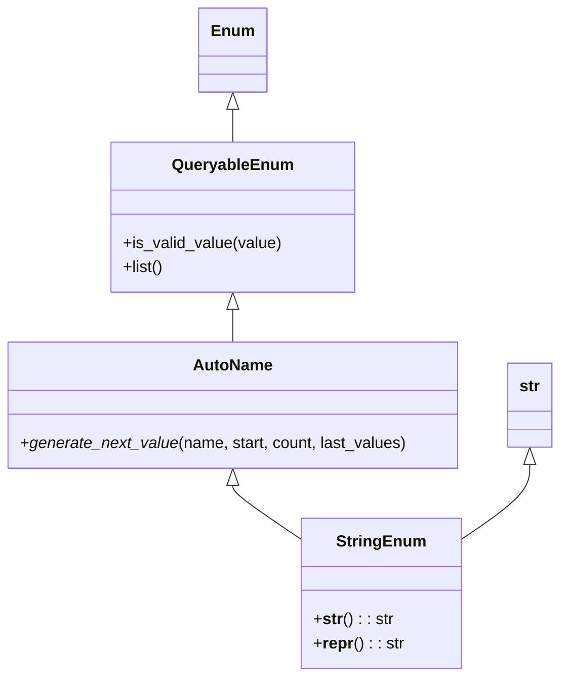

# Diagram: application_service/container_tracking_app_service/utility/QueryableEnum.py

> Auto-generated by Obscura crawlers

## Mermaid

### SVG

<svg id="container" width="559.890625" xmlns="http://www.w3.org/2000/svg" class="classDiagram" height="676" viewBox="0 0 559.890625 676" role="graphics-document document" aria-roledescription="class"><g><defs><marker id="container_class-aggregationStart" class="marker aggregation class" refX="18" refY="7" markerWidth="190" markerHeight="240" orient="auto"><path d="M 18,7 L9,13 L1,7 L9,1 Z"></path></marker></defs><defs><marker id="container_class-aggregationEnd" class="marker aggregation class" refX="1" refY="7" markerWidth="20" markerHeight="28" orient="auto"><path d="M 18,7 L9,13 L1,7 L9,1 Z"></path></marker></defs><defs><marker id="container_class-extensionStart" class="marker extension class" refX="18" refY="7" markerWidth="190" markerHeight="240" orient="auto"><path d="M 1,7 L18,13 V 1 Z"></path></marker></defs><defs><marker id="container_class-extensionEnd" class="marker extension class" refX="1" refY="7" markerWidth="20" markerHeight="28" orient="auto"><path d="M 1,1 V 13 L18,7 Z"></path></marker></defs><defs><marker id="container_class-compositionStart" class="marker composition class" refX="18" refY="7" markerWidth="190" markerHeight="240" orient="auto"><path d="M 18,7 L9,13 L1,7 L9,1 Z"></path></marker></defs><defs><marker id="container_class-compositionEnd" class="marker composition class" refX="1" refY="7" markerWidth="20" markerHeight="28" orient="auto"><path d="M 18,7 L9,13 L1,7 L9,1 Z"></path></marker></defs><defs><marker id="container_class-dependencyStart" class="marker dependency class" refX="6" refY="7" markerWidth="190" markerHeight="240" orient="auto"><path d="M 5,7 L9,13 L1,7 L9,1 Z"></path></marker></defs><defs><marker id="container_class-dependencyEnd" class="marker dependency class" refX="13" refY="7" markerWidth="20" markerHeight="28" orient="auto"><path d="M 18,7 L9,13 L14,7 L9,1 Z"></path></marker></defs><defs><marker id="container_class-lollipopStart" class="marker lollipop class" refX="13" refY="7" markerWidth="190" markerHeight="240" orient="auto"><circle stroke="black" fill="transparent" cx="7" cy="7" r="6"></circle></marker></defs><defs><marker id="container_class-lollipopEnd" class="marker lollipop class" refX="1" refY="7" markerWidth="190" markerHeight="240" orient="auto"><circle stroke="black" fill="transparent" cx="7" cy="7" r="6"></circle></marker></defs><g class="root"><g class="clusters"></g><g class="edgePaths"><path d="M232.781,109.25L232.781,110.542C232.781,111.833,232.781,114.417,232.781,119.875C232.781,125.333,232.781,133.667,232.781,137.833L232.781,142" id="id_Enum_QueryableEnum_1" class="edge-thickness-normal edge-pattern-solid relation" style=";;;" data-edge="true" data-et="edge" data-id="id_Enum_QueryableEnum_1" data-points="W3sieCI6MjMyLjc4MTI1LCJ5Ijo5Mn0seyJ4IjoyMzIuNzgxMjUsInkiOjExN30seyJ4IjoyMzIuNzgxMjUsInkiOjE0Mn1d" marker-start="url(#container_class-extensionStart)"></path><path d="M232.781,309.25L232.781,310.542C232.781,311.833,232.781,314.417,232.781,319.875C232.781,325.333,232.781,333.667,232.781,337.833L232.781,342" id="id_QueryableEnum_AutoName_2" class="edge-thickness-normal edge-pattern-solid relation" style=";;;" data-edge="true" data-et="edge" data-id="id_QueryableEnum_AutoName_2" data-points="W3sieCI6MjMyLjc4MTI1LCJ5IjoyOTJ9LHsieCI6MjMyLjc4MTI1LCJ5IjozMTd9LHsieCI6MjMyLjc4MTI1LCJ5IjozNDJ9XQ==" marker-start="url(#container_class-extensionStart)"></path><path d="M232.781,485.25L232.781,486.542C232.781,487.833,232.781,490.417,244.596,499.666C256.41,508.915,280.039,524.829,291.854,532.787L303.668,540.744" id="id_AutoName_StringEnum_3" class="edge-thickness-normal edge-pattern-solid relation" style=";;;" data-edge="true" data-et="edge" data-id="id_AutoName_StringEnum_3" data-points="W3sieCI6MjMyLjc4MTI1LCJ5Ijo0Njh9LHsieCI6MjMyLjc4MTI1LCJ5Ijo0OTN9LHsieCI6MzAzLjY2Nzk2ODc1LCJ5Ijo1NDAuNzQzOTU1Mzc4OTg5Mn1d" marker-start="url(#container_class-extensionStart)"></path><path d="M529.727,464.25L529.727,469.042C529.727,473.833,529.727,483.417,517.912,496.166C506.098,508.915,482.469,524.829,470.654,532.787L458.84,540.744" id="id_str_StringEnum_4" class="edge-thickness-normal edge-pattern-solid relation" style=";;;" data-edge="true" data-et="edge" data-id="id_str_StringEnum_4" data-points="W3sieCI6NTI5LjcyNjU2MjUsInkiOjQ0N30seyJ4Ijo1MjkuNzI2NTYyNSwieSI6NDkzfSx7IngiOjQ1OC44Mzk4NDM3NSwieSI6NTQwLjc0Mzk1NTM3ODk4OTJ9XQ==" marker-start="url(#container_class-extensionStart)"></path></g><g class="edgeLabels"><g class="edgeLabel"><g class="label" data-id="id_Enum_QueryableEnum_1" transform="translate(0, 0)"><foreignObject width="0" height="0">

</foreignObject></g></g><g class="edgeLabel"><g class="label" data-id="id_QueryableEnum_AutoName_2" transform="translate(0, 0)"><foreignObject width="0" height="0">

</foreignObject></g></g><g class="edgeLabel"><g class="label" data-id="id_AutoName_StringEnum_3" transform="translate(0, 0)"><foreignObject width="0" height="0">

</foreignObject></g></g><g class="edgeLabel"><g class="label" data-id="id_str_StringEnum_4" transform="translate(0, 0)"><foreignObject width="0" height="0">

</foreignObject></g></g></g><g class="nodes"><g class="node default" id="classId-Enum-0" transform="translate(232.78125, 50)"><g class="basic label-container"><path d="M-32.0859375 -42 L32.0859375 -42 L32.0859375 42 L-32.0859375 42" stroke="none" stroke-width="0" fill="#ECECFF" style=""></path><path d="M-32.0859375 -42 C-16.845242533538737 -42, -1.6045475670774714 -42, 32.0859375 -42 M-32.0859375 -42 C-11.230031469748528 -42, 9.625874560502943 -42, 32.0859375 -42 M32.0859375 -42 C32.0859375 -22.775397018333393, 32.0859375 -3.5507940366667867, 32.0859375 42 M32.0859375 -42 C32.0859375 -15.45663746759637, 32.0859375 11.086725064807261, 32.0859375 42 M32.0859375 42 C12.443635226666853 42, -7.198667046666294 42, -32.0859375 42 M32.0859375 42 C10.956004992815117 42, -10.173927514369765 42, -32.0859375 42 M-32.0859375 42 C-32.0859375 14.445696847007142, -32.0859375 -13.108606305985717, -32.0859375 -42 M-32.0859375 42 C-32.0859375 14.056987122013787, -32.0859375 -13.886025755972426, -32.0859375 -42" stroke="#9370DB" stroke-width="1.3" fill="none" stroke-dasharray="0 0" style=""></path></g><g class="annotation-group text" transform="translate(0, -18)"></g><g class="label-group text" transform="translate(-20.0859375, -18)"><g class="label" style="font-weight: bolder" transform="translate(0,-12)"><foreignObject width="40.171875" height="24">

Enum

</foreignObject></g></g><g class="members-group text" transform="translate(-20.0859375, 30)"></g><g class="methods-group text" transform="translate(-20.0859375, 60)"></g><g class="divider" style=""><path d="M-32.0859375 6 C-8.643236624175408 6, 14.799464251649184 6, 32.0859375 6 M-32.0859375 6 C-14.08118784261437 6, 3.9235618147712614 6, 32.0859375 6" stroke="#9370DB" stroke-width="1.3" fill="none" stroke-dasharray="0 0" style=""></path></g><g class="divider" style=""><path d="M-32.0859375 24 C-7.783514451863784 24, 16.518908596272432 24, 32.0859375 24 M-32.0859375 24 C-10.702415124448752 24, 10.681107251102496 24, 32.0859375 24" stroke="#9370DB" stroke-width="1.3" fill="none" stroke-dasharray="0 0" style=""></path></g></g><g class="node default" id="classId-str-1" transform="translate(529.7265625, 405)"><g class="basic label-container"><path d="M-22.1640625 -42 L22.1640625 -42 L22.1640625 42 L-22.1640625 42" stroke="none" stroke-width="0" fill="#ECECFF" style=""></path><path d="M-22.1640625 -42 C-8.022296790133932 -42, 6.119468919732135 -42, 22.1640625 -42 M-22.1640625 -42 C-11.250569863510467 -42, -0.33707722702093434 -42, 22.1640625 -42 M22.1640625 -42 C22.1640625 -20.349689581100144, 22.1640625 1.3006208377997126, 22.1640625 42 M22.1640625 -42 C22.1640625 -12.51159753718387, 22.1640625 16.97680492563226, 22.1640625 42 M22.1640625 42 C9.969899053099605 42, -2.224264393800791 42, -22.1640625 42 M22.1640625 42 C8.951138439090291 42, -4.261785621819417 42, -22.1640625 42 M-22.1640625 42 C-22.1640625 22.987002649099885, -22.1640625 3.9740052981997707, -22.1640625 -42 M-22.1640625 42 C-22.1640625 20.919315377161237, -22.1640625 -0.16136924567752686, -22.1640625 -42" stroke="#9370DB" stroke-width="1.3" fill="none" stroke-dasharray="0 0" style=""></path></g><g class="annotation-group text" transform="translate(0, -18)"></g><g class="label-group text" transform="translate(-10.1640625, -18)"><g class="label" style="font-weight: bolder" transform="translate(0,-12)"><foreignObject width="20.328125" height="24">

str

</foreignObject></g></g><g class="members-group text" transform="translate(-10.1640625, 30)"></g><g class="methods-group text" transform="translate(-10.1640625, 60)"></g><g class="divider" style=""><path d="M-22.1640625 6 C-9.42777497155601 6, 3.3085125568879796 6, 22.1640625 6 M-22.1640625 6 C-12.095561228716516 6, -2.027059957433032 6, 22.1640625 6" stroke="#9370DB" stroke-width="1.3" fill="none" stroke-dasharray="0 0" style=""></path></g><g class="divider" style=""><path d="M-22.1640625 24 C-12.210086590638799 24, -2.2561106812775975 24, 22.1640625 24 M-22.1640625 24 C-9.209038540547882 24, 3.7459854189042368 24, 22.1640625 24" stroke="#9370DB" stroke-width="1.3" fill="none" stroke-dasharray="0 0" style=""></path></g></g><g class="node default" id="classId-QueryableEnum-2" transform="translate(232.78125, 217)"><g class="basic label-container"><path d="M-120.0390625 -75 L120.0390625 -75 L120.0390625 75 L-120.0390625 75" stroke="none" stroke-width="0" fill="#ECECFF" style=""></path><path d="M-120.0390625 -75 C-49.80473289007769 -75, 20.429596719844625 -75, 120.0390625 -75 M-120.0390625 -75 C-50.71228371244743 -75, 18.61449507510514 -75, 120.0390625 -75 M120.0390625 -75 C120.0390625 -44.381448005002824, 120.0390625 -13.762896010005647, 120.0390625 75 M120.0390625 -75 C120.0390625 -18.96385168905202, 120.0390625 37.07229662189596, 120.0390625 75 M120.0390625 75 C50.22964852854659 75, -19.57976544290682 75, -120.0390625 75 M120.0390625 75 C45.95774814810814 75, -28.123566203783724 75, -120.0390625 75 M-120.0390625 75 C-120.0390625 31.157442252832332, -120.0390625 -12.685115494335335, -120.0390625 -75 M-120.0390625 75 C-120.0390625 20.130975544641018, -120.0390625 -34.738048910717964, -120.0390625 -75" stroke="#9370DB" stroke-width="1.3" fill="none" stroke-dasharray="0 0" style=""></path></g><g class="annotation-group text" transform="translate(0, -51)"></g><g class="label-group text" transform="translate(-57.6875, -51)"><g class="label" style="font-weight: bolder" transform="translate(0,-12)"><foreignObject width="115.375" height="24">

QueryableEnum

</foreignObject></g></g><g class="members-group text" transform="translate(-108.0390625, -3)"></g><g class="methods-group text" transform="translate(-108.0390625, 27)"><g class="label" style="" transform="translate(0,-12)"><foreignObject width="158.390625" height="24">

+is_valid_value(value)

</foreignObject></g><g class="label" style="" transform="translate(0,12)"><foreignObject width="40.8125" height="24">

+list()

</foreignObject></g></g><g class="divider" style=""><path d="M-120.0390625 -27 C-48.10814625020818 -27, 23.82276999958364 -27, 120.0390625 -27 M-120.0390625 -27 C-29.79927747437516 -27, 60.44050755124968 -27, 120.0390625 -27" stroke="#9370DB" stroke-width="1.3" fill="none" stroke-dasharray="0 0" style=""></path></g><g class="divider" style=""><path d="M-120.0390625 -3 C-52.943896158285725 -3, 14.15127018342855 -3, 120.0390625 -3 M-120.0390625 -3 C-35.770388966342 -3, 48.498284567316006 -3, 120.0390625 -3" stroke="#9370DB" stroke-width="1.3" fill="none" stroke-dasharray="0 0" style=""></path></g></g><g class="node default" id="classId-AutoName-3" transform="translate(232.78125, 405)"><g class="basic label-container"><path d="M-224.78125 -63 L224.78125 -63 L224.78125 63 L-224.78125 63" stroke="none" stroke-width="0" fill="#ECECFF" style=""></path><path d="M-224.78125 -63 C-90.86077280775072 -63, 43.05970438449856 -63, 224.78125 -63 M-224.78125 -63 C-105.21777606241777 -63, 14.345697875164461 -63, 224.78125 -63 M224.78125 -63 C224.78125 -30.921666310102466, 224.78125 1.156667379795067, 224.78125 63 M224.78125 -63 C224.78125 -16.83401099796589, 224.78125 29.33197800406822, 224.78125 63 M224.78125 63 C64.71475334725 63, -95.35174330550001 63, -224.78125 63 M224.78125 63 C125.44743049681543 63, 26.113610993630857 63, -224.78125 63 M-224.78125 63 C-224.78125 25.274278644600166, -224.78125 -12.451442710799668, -224.78125 -63 M-224.78125 63 C-224.78125 30.12572588087395, -224.78125 -2.7485482382520985, -224.78125 -63" stroke="#9370DB" stroke-width="1.3" fill="none" stroke-dasharray="0 0" style=""></path></g><g class="annotation-group text" transform="translate(0, -39)"></g><g class="label-group text" transform="translate(-37.78125, -39)"><g class="label" style="font-weight: bolder" transform="translate(0,-12)"><foreignObject width="75.5625" height="24">

AutoName

</foreignObject></g></g><g class="members-group text" transform="translate(-212.78125, 9)"></g><g class="methods-group text" transform="translate(-212.78125, 39)"><g class="label" style="" transform="translate(0,-12)"><foreignObject width="387.78125" height="24">

+<em>generate_next_value</em>(name, start, count, last_values)

</foreignObject></g></g><g class="divider" style=""><path d="M-224.78125 -15 C-97.64533262021105 -15, 29.4905847595779 -15, 224.78125 -15 M-224.78125 -15 C-84.23445984233456 -15, 56.31233031533088 -15, 224.78125 -15" stroke="#9370DB" stroke-width="1.3" fill="none" stroke-dasharray="0 0" style=""></path></g><g class="divider" style=""><path d="M-224.78125 9 C-100.21013966051483 9, 24.360970678970347 9, 224.78125 9 M-224.78125 9 C-49.688871198984884 9, 125.40350760203023 9, 224.78125 9" stroke="#9370DB" stroke-width="1.3" fill="none" stroke-dasharray="0 0" style=""></path></g></g><g class="node default" id="classId-StringEnum-4" transform="translate(381.25390625, 593)"><g class="basic label-container"><path d="M-77.5859375 -75 L77.5859375 -75 L77.5859375 75 L-77.5859375 75" stroke="none" stroke-width="0" fill="#ECECFF" style=""></path><path d="M-77.5859375 -75 C-40.94351806897182 -75, -4.301098637943639 -75, 77.5859375 -75 M-77.5859375 -75 C-23.43833831630932 -75, 30.70926086738136 -75, 77.5859375 -75 M77.5859375 -75 C77.5859375 -32.77297976284674, 77.5859375 9.454040474306524, 77.5859375 75 M77.5859375 -75 C77.5859375 -19.716102288349077, 77.5859375 35.567795423301845, 77.5859375 75 M77.5859375 75 C38.507675193578464 75, -0.5705871128430715 75, -77.5859375 75 M77.5859375 75 C38.751413739891525 75, -0.08311002021694947 75, -77.5859375 75 M-77.5859375 75 C-77.5859375 20.966036213017908, -77.5859375 -33.067927573964184, -77.5859375 -75 M-77.5859375 75 C-77.5859375 20.46649163076605, -77.5859375 -34.0670167384679, -77.5859375 -75" stroke="#9370DB" stroke-width="1.3" fill="none" stroke-dasharray="0 0" style=""></path></g><g class="annotation-group text" transform="translate(0, -51)"></g><g class="label-group text" transform="translate(-42.234375, -51)"><g class="label" style="font-weight: bolder" transform="translate(0,-12)"><foreignObject width="84.46875" height="24">

StringEnum

</foreignObject></g></g><g class="members-group text" transform="translate(-65.5859375, -3)"></g><g class="methods-group text" transform="translate(-65.5859375, 27)"><g class="label" style="" transform="translate(0,-12)"><foreignObject width="78.515625" height="24">

+<strong>str</strong>() : : str

</foreignObject></g><g class="label" style="" transform="translate(0,12)"><foreignObject width="88.9375" height="24">

+<strong>repr</strong>() : : str

</foreignObject></g></g><g class="divider" style=""><path d="M-77.5859375 -27 C-20.03724624499725 -27, 37.5114450100055 -27, 77.5859375 -27 M-77.5859375 -27 C-45.56836434307477 -27, -13.550791186149539 -27, 77.5859375 -27" stroke="#9370DB" stroke-width="1.3" fill="none" stroke-dasharray="0 0" style=""></path></g><g class="divider" style=""><path d="M-77.5859375 -3 C-45.31883508806632 -3, -13.051732676132644 -3, 77.5859375 -3 M-77.5859375 -3 C-18.945527252380188 -3, 39.694882995239624 -3, 77.5859375 -3" stroke="#9370DB" stroke-width="1.3" fill="none" stroke-dasharray="0 0" style=""></path></g></g></g></g></g></svg>
