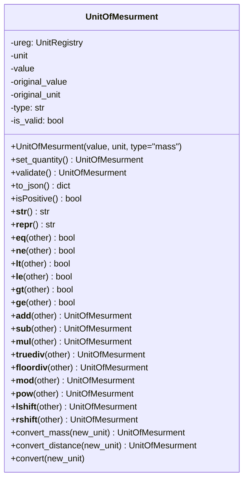

# Diagram: application_service/container_tracking_app_service/utility/UnitOfMesurement.py

> Auto-generated by Obscura crawlers

## Mermaid

### SVG

<svg id="container" width="453.84375" xmlns="http://www.w3.org/2000/svg" class="classDiagram" height="880" viewBox="0 0 453.84375 880" role="graphics-document document" aria-roledescription="class"><g><defs><marker id="container_class-aggregationStart" class="marker aggregation class" refX="18" refY="7" markerWidth="190" markerHeight="240" orient="auto"><path d="M 18,7 L9,13 L1,7 L9,1 Z"></path></marker></defs><defs><marker id="container_class-aggregationEnd" class="marker aggregation class" refX="1" refY="7" markerWidth="20" markerHeight="28" orient="auto"><path d="M 18,7 L9,13 L1,7 L9,1 Z"></path></marker></defs><defs><marker id="container_class-extensionStart" class="marker extension class" refX="18" refY="7" markerWidth="190" markerHeight="240" orient="auto"><path d="M 1,7 L18,13 V 1 Z"></path></marker></defs><defs><marker id="container_class-extensionEnd" class="marker extension class" refX="1" refY="7" markerWidth="20" markerHeight="28" orient="auto"><path d="M 1,1 V 13 L18,7 Z"></path></marker></defs><defs><marker id="container_class-compositionStart" class="marker composition class" refX="18" refY="7" markerWidth="190" markerHeight="240" orient="auto"><path d="M 18,7 L9,13 L1,7 L9,1 Z"></path></marker></defs><defs><marker id="container_class-compositionEnd" class="marker composition class" refX="1" refY="7" markerWidth="20" markerHeight="28" orient="auto"><path d="M 18,7 L9,13 L1,7 L9,1 Z"></path></marker></defs><defs><marker id="container_class-dependencyStart" class="marker dependency class" refX="6" refY="7" markerWidth="190" markerHeight="240" orient="auto"><path d="M 5,7 L9,13 L1,7 L9,1 Z"></path></marker></defs><defs><marker id="container_class-dependencyEnd" class="marker dependency class" refX="13" refY="7" markerWidth="20" markerHeight="28" orient="auto"><path d="M 18,7 L9,13 L14,7 L9,1 Z"></path></marker></defs><defs><marker id="container_class-lollipopStart" class="marker lollipop class" refX="13" refY="7" markerWidth="190" markerHeight="240" orient="auto"><circle stroke="black" fill="transparent" cx="7" cy="7" r="6"></circle></marker></defs><defs><marker id="container_class-lollipopEnd" class="marker lollipop class" refX="1" refY="7" markerWidth="190" markerHeight="240" orient="auto"><circle stroke="black" fill="transparent" cx="7" cy="7" r="6"></circle></marker></defs><g class="root"><g class="clusters"></g><g class="edgePaths"></g><g class="edgeLabels"></g><g class="nodes"><g class="node default" id="classId-UnitOfMesurment-0" transform="translate(226.921875, 440)"><g class="basic label-container"><path d="M-218.921875 -432 L218.921875 -432 L218.921875 432 L-218.921875 432" stroke="none" stroke-width="0" fill="#ECECFF" style=""></path><path d="M-218.921875 -432 C-99.39267293905837 -432, 20.136529121883257 -432, 218.921875 -432 M-218.921875 -432 C-81.97808843149161 -432, 54.96569813701677 -432, 218.921875 -432 M218.921875 -432 C218.921875 -209.3273940961793, 218.921875 13.34521180764142, 218.921875 432 M218.921875 -432 C218.921875 -238.78291091032477, 218.921875 -45.565821820649546, 218.921875 432 M218.921875 432 C82.36405436571536 432, -54.19376626856928 432, -218.921875 432 M218.921875 432 C94.76230213457137 432, -29.397270730857258 432, -218.921875 432 M-218.921875 432 C-218.921875 118.63592536417713, -218.921875 -194.72814927164575, -218.921875 -432 M-218.921875 432 C-218.921875 164.6824213607909, -218.921875 -102.6351572784182, -218.921875 -432" stroke="#9370DB" stroke-width="1.3" fill="none" stroke-dasharray="0 0" style=""></path></g><g class="annotation-group text" transform="translate(0, -408)"></g><g class="label-group text" transform="translate(-64.78125, -408)"><g class="label" style="font-weight: bolder" transform="translate(0,-12)"><foreignObject width="129.5625" height="24">

UnitOfMesurment

</foreignObject></g></g><g class="members-group text" transform="translate(-206.921875, -360)"><g class="label" style="" transform="translate(0,-12)"><foreignObject width="135.125" height="24">

-ureg: UnitRegistry

</foreignObject></g><g class="label" style="" transform="translate(0,12)"><foreignObject width="35.4375" height="24">

-unit

</foreignObject></g><g class="label" style="" transform="translate(0,36)"><foreignObject width="45.171875" height="24">

-value

</foreignObject></g><g class="label" style="" transform="translate(0,60)"><foreignObject width="108.640625" height="24">

-original_value

</foreignObject></g><g class="label" style="" transform="translate(0,84)"><foreignObject width="98.90625" height="24">

-original_unit

</foreignObject></g><g class="label" style="" transform="translate(0,108)"><foreignObject width="65.671875" height="24">

-type: str

</foreignObject></g><g class="label" style="" transform="translate(0,132)"><foreignObject width="101.84375" height="24">

-is_valid: bool

</foreignObject></g></g><g class="methods-group text" transform="translate(-206.921875, -168)"><g class="label" style="" transform="translate(0,-12)"><foreignObject width="320.046875" height="24">

+UnitOfMesurment(value, unit, type="mass")

</foreignObject></g><g class="label" style="" transform="translate(0,12)"><foreignObject width="249.859375" height="24">

+set_quantity() : UnitOfMesurment

</foreignObject></g><g class="label" style="" transform="translate(0,36)"><foreignObject width="216.8125" height="24">

+validate() : UnitOfMesurment

</foreignObject></g><g class="label" style="" transform="translate(0,60)"><foreignObject width="112.234375" height="24">

+to_json() : dict

</foreignObject></g><g class="label" style="" transform="translate(0,84)"><foreignObject width="132.5" height="24">

+isPositive() : bool

</foreignObject></g><g class="label" style="" transform="translate(0,108)"><foreignObject width="70.4375" height="24">

+<strong>str</strong>() : str

</foreignObject></g><g class="label" style="" transform="translate(0,132)"><foreignObject width="80.859375" height="24">

+<strong>repr</strong>() : str

</foreignObject></g><g class="label" style="" transform="translate(0,156)"><foreignObject width="121.390625" height="24">

+<strong>eq</strong>(other) : bool

</foreignObject></g><g class="label" style="" transform="translate(0,180)"><foreignObject width="121.03125" height="24">

+<strong>ne</strong>(other) : bool

</foreignObject></g><g class="label" style="" transform="translate(0,204)"><foreignObject width="113.890625" height="24">

+<strong>lt</strong>(other) : bool

</foreignObject></g><g class="label" style="" transform="translate(0,228)"><foreignObject width="116.46875" height="24">

+<strong>le</strong>(other) : bool

</foreignObject></g><g class="label" style="" transform="translate(0,252)"><foreignObject width="117.953125" height="24">

+<strong>gt</strong>(other) : bool

</foreignObject></g><g class="label" style="" transform="translate(0,276)"><foreignObject width="120.25" height="24">

+<strong>ge</strong>(other) : bool

</foreignObject></g><g class="label" style="" transform="translate(0,300)"><foreignObject width="226.4375" height="24">

+<strong>add</strong>(other) : UnitOfMesurment

</foreignObject></g><g class="label" style="" transform="translate(0,324)"><foreignObject width="224.90625" height="24">

+<strong>sub</strong>(other) : UnitOfMesurment

</foreignObject></g><g class="label" style="" transform="translate(0,348)"><foreignObject width="225.90625" height="24">

+<strong>mul</strong>(other) : UnitOfMesurment

</foreignObject></g><g class="label" style="" transform="translate(0,372)"><foreignObject width="251.375" height="24">

+<strong>truediv</strong>(other) : UnitOfMesurment

</foreignObject></g><g class="label" style="" transform="translate(0,396)"><foreignObject width="255.4375" height="24">

+<strong>floordiv</strong>(other) : UnitOfMesurment

</foreignObject></g><g class="label" style="" transform="translate(0,420)"><foreignObject width="230.9375" height="24">

+<strong>mod</strong>(other) : UnitOfMesurment

</foreignObject></g><g class="label" style="" transform="translate(0,444)"><foreignObject width="229.359375" height="24">

+<strong>pow</strong>(other) : UnitOfMesurment

</foreignObject></g><g class="label" style="" transform="translate(0,468)"><foreignObject width="236.578125" height="24">

+<strong>lshift</strong>(other) : UnitOfMesurment

</foreignObject></g><g class="label" style="" transform="translate(0,492)"><foreignObject width="238.046875" height="24">

+<strong>rshift</strong>(other) : UnitOfMesurment

</foreignObject></g><g class="label" style="" transform="translate(0,516)"><foreignObject width="325.078125" height="24">

+convert_mass(new_unit) : UnitOfMesurment

</foreignObject></g><g class="label" style="" transform="translate(0,540)"><foreignObject width="349.0625" height="24">

+convert_distance(new_unit) : UnitOfMesurment

</foreignObject></g><g class="label" style="" transform="translate(0,564)"><foreignObject width="139" height="24">

+convert(new_unit)

</foreignObject></g></g><g class="divider" style=""><path d="M-218.921875 -384 C-124.16899843625592 -384, -29.416121872511837 -384, 218.921875 -384 M-218.921875 -384 C-111.0937337246875 -384, -3.265592449374992 -384, 218.921875 -384" stroke="#9370DB" stroke-width="1.3" fill="none" stroke-dasharray="0 0" style=""></path></g><g class="divider" style=""><path d="M-218.921875 -192 C-107.33108776235555 -192, 4.2596994752888975 -192, 218.921875 -192 M-218.921875 -192 C-60.33765921915659 -192, 98.24655656168682 -192, 218.921875 -192" stroke="#9370DB" stroke-width="1.3" fill="none" stroke-dasharray="0 0" style=""></path></g></g></g></g></g></svg>
