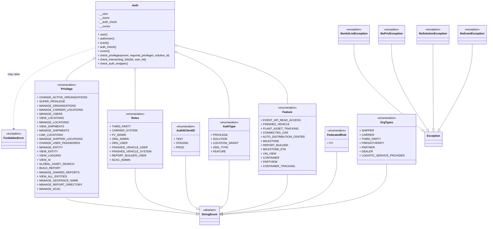

# Diagram: application_service/container_tracking_app_service/utility/auth.py


> Auto-generated by Obscura crawlers

## Diagram 1



> SVG rendering failed for this diagram.

## Diagram 2

```mermaid
flowchart TD
    Start([start]) --> Iterate[Iterate auth_check groups]
    Iterate --> SetUp[Get authorizer, user_org]
    SetUp --> CheckPrivilege{AuthType.PRIVILEGE in group?}
    CheckPrivilege -- Yes --> DoPrivilege[call check_privileges(event, privileges)]
    CheckPrivilege -- No --> SkipPriv[skip privilege check]
    DoPrivilege --> PrivResult{check_privileges succeeded?}
    PrivResult -- No --> AppendPrivError[append ForbiddenError to last_check_list]
    PrivResult -- Yes --> AfterPriv[continue]
    SkipPriv --> AfterPriv

    AfterPriv --> CheckOrg{AuthType.ORG_TYPE in group?}
    CheckOrg -- Yes --> DoOrg[call check_intersecting_lists(required_org_types, user_org_types)]
    CheckOrg -- No --> SkipOrg
    DoOrg --> OrgResult{org check succeeded?}
    OrgResult -- No --> AppendOrgError[append ForbiddenError to last_check_list]
    OrgResult -- Yes --> AfterOrg
    SkipOrg --> AfterOrg

    AfterOrg --> CheckFeature{AuthType.FEATURE in group?}
    CheckFeature -- Yes --> DoFeature[call check_intersecting_lists(required_features, user_features)]
    CheckFeature -- No --> SkipFeature
    DoFeature --> FeatureResult{feature check succeeded?}
    FeatureResult -- No --> AppendFeatureError[append ForbiddenError to last_check_list]
    FeatureResult -- Yes --> AfterFeature
    SkipFeature --> AfterFeature

    AfterFeature --> EvaluateGroup[Are all checks in last_check_list non-Exceptions or list empty?]
    EvaluateGroup -- Yes --> Success[authorization success] --> EndSuccess([end: authorized])
    EvaluateGroup -- No --> RecordFirst[record first Error if not set]
    RecordFirst --> NextGroup{more auth_groups?}
    NextGroup -- Yes --> Iterate
    NextGroup -- No --> RaiseError[raise first_error] --> EndFail([end: unauthorized])
```

> SVG rendering failed for this diagram.
