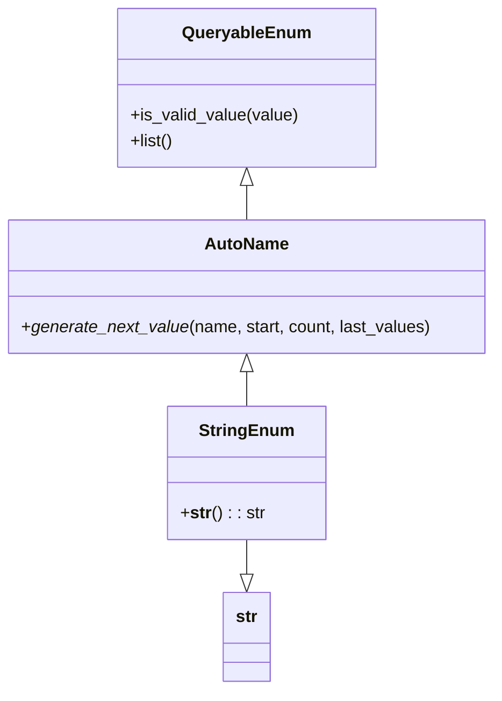

# Diagram: application_service/container_tracking_app_service/utility/enum.py

> Auto-generated by Obscura crawlers

## Mermaid

### SVG

<svg id="container" width="465.5625" xmlns="http://www.w3.org/2000/svg" class="classDiagram" height="652" viewBox="0 0 465.5625 652" role="graphics-document document" aria-roledescription="class"><g><defs><marker id="container_class-aggregationStart" class="marker aggregation class" refX="18" refY="7" markerWidth="190" markerHeight="240" orient="auto"><path d="M 18,7 L9,13 L1,7 L9,1 Z"></path></marker></defs><defs><marker id="container_class-aggregationEnd" class="marker aggregation class" refX="1" refY="7" markerWidth="20" markerHeight="28" orient="auto"><path d="M 18,7 L9,13 L1,7 L9,1 Z"></path></marker></defs><defs><marker id="container_class-extensionStart" class="marker extension class" refX="18" refY="7" markerWidth="190" markerHeight="240" orient="auto"><path d="M 1,7 L18,13 V 1 Z"></path></marker></defs><defs><marker id="container_class-extensionEnd" class="marker extension class" refX="1" refY="7" markerWidth="20" markerHeight="28" orient="auto"><path d="M 1,1 V 13 L18,7 Z"></path></marker></defs><defs><marker id="container_class-compositionStart" class="marker composition class" refX="18" refY="7" markerWidth="190" markerHeight="240" orient="auto"><path d="M 18,7 L9,13 L1,7 L9,1 Z"></path></marker></defs><defs><marker id="container_class-compositionEnd" class="marker composition class" refX="1" refY="7" markerWidth="20" markerHeight="28" orient="auto"><path d="M 18,7 L9,13 L1,7 L9,1 Z"></path></marker></defs><defs><marker id="container_class-dependencyStart" class="marker dependency class" refX="6" refY="7" markerWidth="190" markerHeight="240" orient="auto"><path d="M 5,7 L9,13 L1,7 L9,1 Z"></path></marker></defs><defs><marker id="container_class-dependencyEnd" class="marker dependency class" refX="13" refY="7" markerWidth="20" markerHeight="28" orient="auto"><path d="M 18,7 L9,13 L14,7 L9,1 Z"></path></marker></defs><defs><marker id="container_class-lollipopStart" class="marker lollipop class" refX="13" refY="7" markerWidth="190" markerHeight="240" orient="auto"><circle stroke="black" fill="transparent" cx="7" cy="7" r="6"></circle></marker></defs><defs><marker id="container_class-lollipopEnd" class="marker lollipop class" refX="1" refY="7" markerWidth="190" markerHeight="240" orient="auto"><circle stroke="black" fill="transparent" cx="7" cy="7" r="6"></circle></marker></defs><g class="root"><g class="clusters"></g><g class="edgePaths"><path d="M232.781,175.25L232.781,176.542C232.781,177.833,232.781,180.417,232.781,185.875C232.781,191.333,232.781,199.667,232.781,203.833L232.781,208" id="id_QueryableEnum_AutoName_1" class="edge-thickness-normal edge-pattern-solid relation" style=";;;" data-edge="true" data-et="edge" data-id="id_QueryableEnum_AutoName_1" data-points="W3sieCI6MjMyLjc4MTI1LCJ5IjoxNTh9LHsieCI6MjMyLjc4MTI1LCJ5IjoxODN9LHsieCI6MjMyLjc4MTI1LCJ5IjoyMDh9XQ==" marker-start="url(#container_class-extensionStart)"></path><path d="M232.781,351.25L232.781,352.542C232.781,353.833,232.781,356.417,232.781,361.875C232.781,367.333,232.781,375.667,232.781,379.833L232.781,384" id="id_AutoName_StringEnum_2" class="edge-thickness-normal edge-pattern-solid relation" style=";;;" data-edge="true" data-et="edge" data-id="id_AutoName_StringEnum_2" data-points="W3sieCI6MjMyLjc4MTI1LCJ5IjozMzR9LHsieCI6MjMyLjc4MTI1LCJ5IjozNTl9LHsieCI6MjMyLjc4MTI1LCJ5IjozODR9XQ==" marker-start="url(#container_class-extensionStart)"></path><path d="M232.781,510L232.781,514.167C232.781,518.333,232.781,526.667,232.781,532.125C232.781,537.583,232.781,540.167,232.781,541.458L232.781,542.75" id="id_StringEnum_str_3" class="edge-thickness-normal edge-pattern-solid relation" style=";;;" data-edge="true" data-et="edge" data-id="id_StringEnum_str_3" data-points="W3sieCI6MjMyLjc4MTI1LCJ5Ijo1MTB9LHsieCI6MjMyLjc4MTI1LCJ5Ijo1MzV9LHsieCI6MjMyLjc4MTI1LCJ5Ijo1NjB9XQ==" marker-end="url(#container_class-extensionEnd)"></path></g><g class="edgeLabels"><g class="edgeLabel"><g class="label" data-id="id_QueryableEnum_AutoName_1" transform="translate(0, 0)"><foreignObject width="0" height="0">

</foreignObject></g></g><g class="edgeLabel"><g class="label" data-id="id_AutoName_StringEnum_2" transform="translate(0, 0)"><foreignObject width="0" height="0">

</foreignObject></g></g><g class="edgeLabel"><g class="label" data-id="id_StringEnum_str_3" transform="translate(0, 0)"><foreignObject width="0" height="0">

</foreignObject></g></g></g><g class="nodes"><g class="node default" id="classId-QueryableEnum-0" transform="translate(232.78125, 83)"><g class="basic label-container"><path d="M-120.0390625 -75 L120.0390625 -75 L120.0390625 75 L-120.0390625 75" stroke="none" stroke-width="0" fill="#ECECFF" style=""></path><path d="M-120.0390625 -75 C-66.28682024420505 -75, -12.534577988410078 -75, 120.0390625 -75 M-120.0390625 -75 C-67.78314953381633 -75, -15.527236567632642 -75, 120.0390625 -75 M120.0390625 -75 C120.0390625 -16.081186262848185, 120.0390625 42.83762747430363, 120.0390625 75 M120.0390625 -75 C120.0390625 -20.926971787015944, 120.0390625 33.14605642596811, 120.0390625 75 M120.0390625 75 C46.868941981838134 75, -26.301178536323732 75, -120.0390625 75 M120.0390625 75 C39.71442334135459 75, -40.61021581729082 75, -120.0390625 75 M-120.0390625 75 C-120.0390625 26.49794384730029, -120.0390625 -22.004112305399417, -120.0390625 -75 M-120.0390625 75 C-120.0390625 15.348116851250552, -120.0390625 -44.303766297498896, -120.0390625 -75" stroke="#9370DB" stroke-width="1.3" fill="none" stroke-dasharray="0 0" style=""></path></g><g class="annotation-group text" transform="translate(0, -51)"></g><g class="label-group text" transform="translate(-57.6875, -51)"><g class="label" style="font-weight: bolder" transform="translate(0,-12)"><foreignObject width="115.375" height="24">

QueryableEnum

</foreignObject></g></g><g class="members-group text" transform="translate(-108.0390625, -3)"></g><g class="methods-group text" transform="translate(-108.0390625, 27)"><g class="label" style="" transform="translate(0,-12)"><foreignObject width="158.390625" height="24">

+is_valid_value(value)

</foreignObject></g><g class="label" style="" transform="translate(0,12)"><foreignObject width="40.8125" height="24">

+list()

</foreignObject></g></g><g class="divider" style=""><path d="M-120.0390625 -27 C-39.653143568623605 -27, 40.73277536275279 -27, 120.0390625 -27 M-120.0390625 -27 C-40.41121624697591 -27, 39.21663000604818 -27, 120.0390625 -27" stroke="#9370DB" stroke-width="1.3" fill="none" stroke-dasharray="0 0" style=""></path></g><g class="divider" style=""><path d="M-120.0390625 -3 C-53.33458058854616 -3, 13.36990132290768 -3, 120.0390625 -3 M-120.0390625 -3 C-65.03827522388094 -3, -10.037487947761889 -3, 120.0390625 -3" stroke="#9370DB" stroke-width="1.3" fill="none" stroke-dasharray="0 0" style=""></path></g></g><g class="node default" id="classId-AutoName-1" transform="translate(232.78125, 271)"><g class="basic label-container"><path d="M-224.78125 -63 L224.78125 -63 L224.78125 63 L-224.78125 63" stroke="none" stroke-width="0" fill="#ECECFF" style=""></path><path d="M-224.78125 -63 C-133.19215364871664 -63, -41.60305729743328 -63, 224.78125 -63 M-224.78125 -63 C-116.33561142612025 -63, -7.889972852240504 -63, 224.78125 -63 M224.78125 -63 C224.78125 -19.80453907727668, 224.78125 23.39092184544664, 224.78125 63 M224.78125 -63 C224.78125 -14.952191407513482, 224.78125 33.09561718497304, 224.78125 63 M224.78125 63 C124.14684840608777 63, 23.51244681217554 63, -224.78125 63 M224.78125 63 C88.39345353377769 63, -47.994342932444624 63, -224.78125 63 M-224.78125 63 C-224.78125 18.064724367587132, -224.78125 -26.870551264825735, -224.78125 -63 M-224.78125 63 C-224.78125 27.62077898362009, -224.78125 -7.758442032759817, -224.78125 -63" stroke="#9370DB" stroke-width="1.3" fill="none" stroke-dasharray="0 0" style=""></path></g><g class="annotation-group text" transform="translate(0, -39)"></g><g class="label-group text" transform="translate(-37.78125, -39)"><g class="label" style="font-weight: bolder" transform="translate(0,-12)"><foreignObject width="75.5625" height="24">

AutoName

</foreignObject></g></g><g class="members-group text" transform="translate(-212.78125, 9)"></g><g class="methods-group text" transform="translate(-212.78125, 39)"><g class="label" style="" transform="translate(0,-12)"><foreignObject width="387.78125" height="24">

+<em>generate_next_value</em>(name, start, count, last_values)

</foreignObject></g></g><g class="divider" style=""><path d="M-224.78125 -15 C-107.26191252440891 -15, 10.257424951182173 -15, 224.78125 -15 M-224.78125 -15 C-55.31818124548414 -15, 114.14488750903172 -15, 224.78125 -15" stroke="#9370DB" stroke-width="1.3" fill="none" stroke-dasharray="0 0" style=""></path></g><g class="divider" style=""><path d="M-224.78125 9 C-113.21392422586231 9, -1.6465984517246284 9, 224.78125 9 M-224.78125 9 C-51.45980842425533 9, 121.86163315148934 9, 224.78125 9" stroke="#9370DB" stroke-width="1.3" fill="none" stroke-dasharray="0 0" style=""></path></g></g><g class="node default" id="classId-StringEnum-2" transform="translate(232.78125, 447)"><g class="basic label-container"><path d="M-72.375 -63 L72.375 -63 L72.375 63 L-72.375 63" stroke="none" stroke-width="0" fill="#ECECFF" style=""></path><path d="M-72.375 -63 C-30.508940845942504 -63, 11.357118308114991 -63, 72.375 -63 M-72.375 -63 C-26.33869538657789 -63, 19.69760922684422 -63, 72.375 -63 M72.375 -63 C72.375 -13.382085824432387, 72.375 36.235828351135225, 72.375 63 M72.375 -63 C72.375 -30.679892898770433, 72.375 1.6402142024591342, 72.375 63 M72.375 63 C27.71788114111242 63, -16.939237717775157 63, -72.375 63 M72.375 63 C33.1100823660288 63, -6.154835267942403 63, -72.375 63 M-72.375 63 C-72.375 13.750466673710818, -72.375 -35.499066652578364, -72.375 -63 M-72.375 63 C-72.375 34.53397386769119, -72.375 6.067947735382383, -72.375 -63" stroke="#9370DB" stroke-width="1.3" fill="none" stroke-dasharray="0 0" style=""></path></g><g class="annotation-group text" transform="translate(0, -39)"></g><g class="label-group text" transform="translate(-42.234375, -39)"><g class="label" style="font-weight: bolder" transform="translate(0,-12)"><foreignObject width="84.46875" height="24">

StringEnum

</foreignObject></g></g><g class="members-group text" transform="translate(-60.375, 9)"></g><g class="methods-group text" transform="translate(-60.375, 39)"><g class="label" style="" transform="translate(0,-12)"><foreignObject width="78.515625" height="24">

+<strong>str</strong>() : : str

</foreignObject></g></g><g class="divider" style=""><path d="M-72.375 -15 C-39.19440780054116 -15, -6.013815601082314 -15, 72.375 -15 M-72.375 -15 C-42.57985751473983 -15, -12.784715029479656 -15, 72.375 -15" stroke="#9370DB" stroke-width="1.3" fill="none" stroke-dasharray="0 0" style=""></path></g><g class="divider" style=""><path d="M-72.375 9 C-36.33386658084425 9, -0.2927331616885027 9, 72.375 9 M-72.375 9 C-17.896642697952387 9, 36.581714604095225 9, 72.375 9" stroke="#9370DB" stroke-width="1.3" fill="none" stroke-dasharray="0 0" style=""></path></g></g><g class="node default" id="classId-str-3" transform="translate(232.78125, 602)"><g class="basic label-container"><path d="M-22.1640625 -42 L22.1640625 -42 L22.1640625 42 L-22.1640625 42" stroke="none" stroke-width="0" fill="#ECECFF" style=""></path><path d="M-22.1640625 -42 C-10.808465837804542 -42, 0.5471308243909156 -42, 22.1640625 -42 M-22.1640625 -42 C-9.369604797085223 -42, 3.424852905829553 -42, 22.1640625 -42 M22.1640625 -42 C22.1640625 -23.99506365970584, 22.1640625 -5.990127319411677, 22.1640625 42 M22.1640625 -42 C22.1640625 -24.461814948490606, 22.1640625 -6.923629896981211, 22.1640625 42 M22.1640625 42 C7.025560755219374 42, -8.112940989561253 42, -22.1640625 42 M22.1640625 42 C6.734820706336333 42, -8.694421087327335 42, -22.1640625 42 M-22.1640625 42 C-22.1640625 20.4507436263697, -22.1640625 -1.0985127472605996, -22.1640625 -42 M-22.1640625 42 C-22.1640625 9.621104554409875, -22.1640625 -22.75779089118025, -22.1640625 -42" stroke="#9370DB" stroke-width="1.3" fill="none" stroke-dasharray="0 0" style=""></path></g><g class="annotation-group text" transform="translate(0, -18)"></g><g class="label-group text" transform="translate(-10.1640625, -18)"><g class="label" style="font-weight: bolder" transform="translate(0,-12)"><foreignObject width="20.328125" height="24">

str

</foreignObject></g></g><g class="members-group text" transform="translate(-10.1640625, 30)"></g><g class="methods-group text" transform="translate(-10.1640625, 60)"></g><g class="divider" style=""><path d="M-22.1640625 6 C-12.519971597459435 6, -2.8758806949188696 6, 22.1640625 6 M-22.1640625 6 C-7.032674105713362 6, 8.098714288573277 6, 22.1640625 6" stroke="#9370DB" stroke-width="1.3" fill="none" stroke-dasharray="0 0" style=""></path></g><g class="divider" style=""><path d="M-22.1640625 24 C-9.018141820534959 24, 4.127778858930082 24, 22.1640625 24 M-22.1640625 24 C-8.214559238373601 24, 5.7349440232527975 24, 22.1640625 24" stroke="#9370DB" stroke-width="1.3" fill="none" stroke-dasharray="0 0" style=""></path></g></g></g></g></g></svg>
