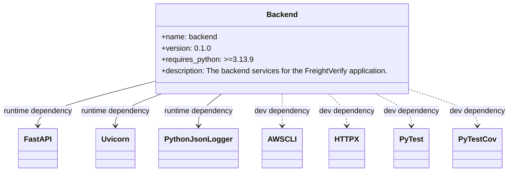

# Diagram: backend/pyproject.toml

> Auto-generated by Obscura crawlers

## Mermaid

### SVG

<svg id="container" width="1078.71875" xmlns="http://www.w3.org/2000/svg" class="classDiagram" height="366" viewBox="0 0 1078.71875 366" role="graphics-document document" aria-roledescription="class"><g><defs><marker id="container_class-aggregationStart" class="marker aggregation class" refX="18" refY="7" markerWidth="190" markerHeight="240" orient="auto"><path d="M 18,7 L9,13 L1,7 L9,1 Z"></path></marker></defs><defs><marker id="container_class-aggregationEnd" class="marker aggregation class" refX="1" refY="7" markerWidth="20" markerHeight="28" orient="auto"><path d="M 18,7 L9,13 L1,7 L9,1 Z"></path></marker></defs><defs><marker id="container_class-extensionStart" class="marker extension class" refX="18" refY="7" markerWidth="190" markerHeight="240" orient="auto"><path d="M 1,7 L18,13 V 1 Z"></path></marker></defs><defs><marker id="container_class-extensionEnd" class="marker extension class" refX="1" refY="7" markerWidth="20" markerHeight="28" orient="auto"><path d="M 1,1 V 13 L18,7 Z"></path></marker></defs><defs><marker id="container_class-compositionStart" class="marker composition class" refX="18" refY="7" markerWidth="190" markerHeight="240" orient="auto"><path d="M 18,7 L9,13 L1,7 L9,1 Z"></path></marker></defs><defs><marker id="container_class-compositionEnd" class="marker composition class" refX="1" refY="7" markerWidth="20" markerHeight="28" orient="auto"><path d="M 18,7 L9,13 L1,7 L9,1 Z"></path></marker></defs><defs><marker id="container_class-dependencyStart" class="marker dependency class" refX="6" refY="7" markerWidth="190" markerHeight="240" orient="auto"><path d="M 5,7 L9,13 L1,7 L9,1 Z"></path></marker></defs><defs><marker id="container_class-dependencyEnd" class="marker dependency class" refX="13" refY="7" markerWidth="20" markerHeight="28" orient="auto"><path d="M 18,7 L9,13 L14,7 L9,1 Z"></path></marker></defs><defs><marker id="container_class-lollipopStart" class="marker lollipop class" refX="13" refY="7" markerWidth="190" markerHeight="240" orient="auto"><circle stroke="black" fill="transparent" cx="7" cy="7" r="6"></circle></marker></defs><defs><marker id="container_class-lollipopEnd" class="marker lollipop class" refX="1" refY="7" markerWidth="190" markerHeight="240" orient="auto"><circle stroke="black" fill="transparent" cx="7" cy="7" r="6"></circle></marker></defs><g class="root"><g class="clusters"></g><g class="edgePaths"><path d="M319.32,175.404L280.009,185.67C240.698,195.936,162.076,216.468,122.764,231.901C83.453,247.333,83.453,257.667,83.453,262.833L83.453,268" id="id_Backend_FastAPI_1" class="edge-thickness-normal edge-pattern-solid relation" style=";;;" data-edge="true" data-et="edge" data-id="id_Backend_FastAPI_1" data-points="W3sieCI6MzE5LjMyMDMxMjUsInkiOjE3NS40MDM2NzIzOTg3MTc1Nn0seyJ4Ijo4My40NTMxMjUsInkiOjIzN30seyJ4Ijo4My40NTMxMjUsInkiOjI3NH1d" marker-end="url(#container_class-dependencyEnd)"></path><path d="M348.496,200L332.807,206.167C317.117,212.333,285.738,224.667,270.049,236C254.359,247.333,254.359,257.667,254.359,262.833L254.359,268" id="id_Backend_Uvicorn_2" class="edge-thickness-normal edge-pattern-solid relation" style=";;;" data-edge="true" data-et="edge" data-id="id_Backend_Uvicorn_2" data-points="W3sieCI6MzQ4LjQ5NTk0Njg5ODQ5NjI0LCJ5IjoyMDB9LHsieCI6MjU0LjM1OTM3NSwieSI6MjM3fSx7IngiOjI1NC4zNTkzNzUsInkiOjI3NH1d" marker-end="url(#container_class-dependencyEnd)"></path><path d="M471.857,200L464.092,206.167C456.326,212.333,440.796,224.667,433.031,236C425.266,247.333,425.266,257.667,425.266,262.833L425.266,268" id="id_Backend_PythonJsonLogger_3" class="edge-thickness-normal edge-pattern-solid relation" style=";;;" data-edge="true" data-et="edge" data-id="id_Backend_PythonJsonLogger_3" data-points="W3sieCI6NDcxLjg1Njg0OTE1NDEzNTMsInkiOjIwMH0seyJ4Ijo0MjUuMjY1NjI1LCJ5IjoyMzd9LHsieCI6NDI1LjI2NTYyNSwieSI6Mjc0fV0=" marker-end="url(#container_class-dependencyEnd)"></path><path d="M592.742,200L592.742,206.167C592.742,212.333,592.742,224.667,592.742,236C592.742,247.333,592.742,257.667,592.742,262.833L592.742,268" id="id_Backend_AWSCLI_4" class="edge-thickness-normal edge-pattern-dashed relation" style=";;;" data-edge="true" data-et="edge" data-id="id_Backend_AWSCLI_4" data-points="W3sieCI6NTkyLjc0MjE4NzUsInkiOjIwMH0seyJ4Ijo1OTIuNzQyMTg3NSwieSI6MjM3fSx7IngiOjU5Mi43NDIxODc1LCJ5IjoyNzR9XQ==" marker-end="url(#container_class-dependencyEnd)"></path><path d="M693.378,200L699.842,206.167C706.306,212.333,719.235,224.667,725.7,236C732.164,247.333,732.164,257.667,732.164,262.833L732.164,268" id="id_Backend_HTTPX_5" class="edge-thickness-normal edge-pattern-dashed relation" style=";;;" data-edge="true" data-et="edge" data-id="id_Backend_HTTPX_5" data-points="W3sieCI6NjkzLjM3NzUyNTg0NTg2NDYsInkiOjIwMH0seyJ4Ijo3MzIuMTY0MDYyNSwieSI6MjM3fSx7IngiOjczMi4xNjQwNjI1LCJ5IjoyNzR9XQ==" marker-end="url(#container_class-dependencyEnd)"></path><path d="M794.013,200L806.942,206.167C819.871,212.333,845.728,224.667,858.657,236C871.586,247.333,871.586,257.667,871.586,262.833L871.586,268" id="id_Backend_PyTest_6" class="edge-thickness-normal edge-pattern-dashed relation" style=";;;" data-edge="true" data-et="edge" data-id="id_Backend_PyTest_6" data-points="W3sieCI6Nzk0LjAxMjg2NDE5MTcyOTQsInkiOjIwMH0seyJ4Ijo4NzEuNTg1OTM3NSwieSI6MjM3fSx7IngiOjg3MS41ODU5Mzc1LCJ5IjoyNzR9XQ==" marker-end="url(#container_class-dependencyEnd)"></path><path d="M866.164,190.943L890.305,198.619C914.445,206.295,962.727,221.648,986.867,234.49C1011.008,247.333,1011.008,257.667,1011.008,262.833L1011.008,268" id="id_Backend_PyTestCov_7" class="edge-thickness-normal edge-pattern-dashed relation" style=";;;" data-edge="true" data-et="edge" data-id="id_Backend_PyTestCov_7" data-points="W3sieCI6ODY2LjE2NDA2MjUsInkiOjE5MC45NDI2MjAxOTUwMDE2N30seyJ4IjoxMDExLjAwNzgxMjUsInkiOjIzN30seyJ4IjoxMDExLjAwNzgxMjUsInkiOjI3NH1d" marker-end="url(#container_class-dependencyEnd)"></path></g><g class="edgeLabels"><g class="edgeLabel" transform="translate(83.453125, 237)"><g class="label" data-id="id_Backend_FastAPI_1" transform="translate(-75.453125, -12)"><foreignObject width="150.90625" height="24">

runtime dependency

</foreignObject></g></g><g class="edgeLabel" transform="translate(254.359375, 237)"><g class="label" data-id="id_Backend_Uvicorn_2" transform="translate(-75.453125, -12)"><foreignObject width="150.90625" height="24">

runtime dependency

</foreignObject></g></g><g class="edgeLabel" transform="translate(425.265625, 237)"><g class="label" data-id="id_Backend_PythonJsonLogger_3" transform="translate(-75.453125, -12)"><foreignObject width="150.90625" height="24">

runtime dependency

</foreignObject></g></g><g class="edgeLabel" transform="translate(592.7421875, 237)"><g class="label" data-id="id_Backend_AWSCLI_4" transform="translate(-59.7109375, -12)"><foreignObject width="119.421875" height="24">

dev dependency

</foreignObject></g></g><g class="edgeLabel" transform="translate(732.1640625, 237)"><g class="label" data-id="id_Backend_HTTPX_5" transform="translate(-59.7109375, -12)"><foreignObject width="119.421875" height="24">

dev dependency

</foreignObject></g></g><g class="edgeLabel" transform="translate(871.5859375, 237)"><g class="label" data-id="id_Backend_PyTest_6" transform="translate(-59.7109375, -12)"><foreignObject width="119.421875" height="24">

dev dependency

</foreignObject></g></g><g class="edgeLabel" transform="translate(1011.0078125, 237)"><g class="label" data-id="id_Backend_PyTestCov_7" transform="translate(-59.7109375, -12)"><foreignObject width="119.421875" height="24">

dev dependency

</foreignObject></g></g></g><g class="nodes"><g class="node default" id="classId-Backend-0" transform="translate(592.7421875, 104)"><g class="basic label-container"><path d="M-273.421875 -96 L273.421875 -96 L273.421875 96 L-273.421875 96" stroke="none" stroke-width="0" fill="#ECECFF" style=""></path><path d="M-273.421875 -96 C-103.70065277183355 -96, 66.02056945633291 -96, 273.421875 -96 M-273.421875 -96 C-127.75570739793824 -96, 17.910460204123524 -96, 273.421875 -96 M273.421875 -96 C273.421875 -40.54086397643074, 273.421875 14.918272047138515, 273.421875 96 M273.421875 -96 C273.421875 -43.490347361912555, 273.421875 9.01930527617489, 273.421875 96 M273.421875 96 C104.45164826420762 96, -64.51857847158476 96, -273.421875 96 M273.421875 96 C120.84009673714627 96, -31.741681525707463 96, -273.421875 96 M-273.421875 96 C-273.421875 33.41862397562871, -273.421875 -29.162752048742576, -273.421875 -96 M-273.421875 96 C-273.421875 26.394536763549183, -273.421875 -43.21092647290163, -273.421875 -96" stroke="#9370DB" stroke-width="1.3" fill="none" stroke-dasharray="0 0" style=""></path></g><g class="annotation-group text" transform="translate(0, -72)"></g><g class="label-group text" transform="translate(-31.296875, -72)"><g class="label" style="font-weight: bolder" transform="translate(0,-12)"><foreignObject width="62.59375" height="24">

Backend

</foreignObject></g></g><g class="members-group text" transform="translate(-261.421875, -24)"><g class="label" style="" transform="translate(0,-12)"><foreignObject width="117.984375" height="24">

+name: backend

</foreignObject></g><g class="label" style="" transform="translate(0,12)"><foreignObject width="99.5625" height="24">

+version: 0.1.0

</foreignObject></g><g class="label" style="" transform="translate(0,36)"><foreignObject width="187.375" height="24">

+requires_python: &gt;=3.13.9

</foreignObject></g><g class="label" style="" transform="translate(0,60)"><foreignObject width="491.546875" height="24">

+description: The backend services for the FreightVerify application.

</foreignObject></g></g><g class="methods-group text" transform="translate(-261.421875, 96)"></g><g class="divider" style=""><path d="M-273.421875 -48 C-117.29646624668175 -48, 38.82894250663651 -48, 273.421875 -48 M-273.421875 -48 C-161.8985084797303 -48, -50.37514195946062 -48, 273.421875 -48" stroke="#9370DB" stroke-width="1.3" fill="none" stroke-dasharray="0 0" style=""></path></g><g class="divider" style=""><path d="M-273.421875 72 C-58.97369162922078 72, 155.47449174155844 72, 273.421875 72 M-273.421875 72 C-92.57128292850828 72, 88.27930914298344 72, 273.421875 72" stroke="#9370DB" stroke-width="1.3" fill="none" stroke-dasharray="0 0" style=""></path></g></g><g class="node default" id="classId-FastAPI-1" transform="translate(83.453125, 316)"><g class="basic label-container"><path d="M-38.5390625 -42 L38.5390625 -42 L38.5390625 42 L-38.5390625 42" stroke="none" stroke-width="0" fill="#ECECFF" style=""></path><path d="M-38.5390625 -42 C-19.062444388119868 -42, 0.41417372376026407 -42, 38.5390625 -42 M-38.5390625 -42 C-16.766063430663298 -42, 5.006935638673404 -42, 38.5390625 -42 M38.5390625 -42 C38.5390625 -11.367389775666162, 38.5390625 19.265220448667677, 38.5390625 42 M38.5390625 -42 C38.5390625 -12.552881114945784, 38.5390625 16.894237770108433, 38.5390625 42 M38.5390625 42 C21.545919863101357 42, 4.552777226202714 42, -38.5390625 42 M38.5390625 42 C19.27247356214168 42, 0.005884624283361006 42, -38.5390625 42 M-38.5390625 42 C-38.5390625 24.933670306427636, -38.5390625 7.867340612855273, -38.5390625 -42 M-38.5390625 42 C-38.5390625 18.901577038930455, -38.5390625 -4.19684592213909, -38.5390625 -42" stroke="#9370DB" stroke-width="1.3" fill="none" stroke-dasharray="0 0" style=""></path></g><g class="annotation-group text" transform="translate(0, -18)"></g><g class="label-group text" transform="translate(-26.5390625, -18)"><g class="label" style="font-weight: bolder" transform="translate(0,-12)"><foreignObject width="53.078125" height="24">

FastAPI

</foreignObject></g></g><g class="members-group text" transform="translate(-26.5390625, 30)"></g><g class="methods-group text" transform="translate(-26.5390625, 60)"></g><g class="divider" style=""><path d="M-38.5390625 6 C-12.83403462647441 6, 12.870993247051182 6, 38.5390625 6 M-38.5390625 6 C-15.790234644057385 6, 6.95859321188523 6, 38.5390625 6" stroke="#9370DB" stroke-width="1.3" fill="none" stroke-dasharray="0 0" style=""></path></g><g class="divider" style=""><path d="M-38.5390625 24 C-21.51359971310407 24, -4.488136926208142 24, 38.5390625 24 M-38.5390625 24 C-20.88143716128543 24, -3.223811822570859 24, 38.5390625 24" stroke="#9370DB" stroke-width="1.3" fill="none" stroke-dasharray="0 0" style=""></path></g></g><g class="node default" id="classId-Uvicorn-2" transform="translate(254.359375, 316)"><g class="basic label-container"><path d="M-39.7421875 -42 L39.7421875 -42 L39.7421875 42 L-39.7421875 42" stroke="none" stroke-width="0" fill="#ECECFF" style=""></path><path d="M-39.7421875 -42 C-14.033455322306981 -42, 11.675276855386038 -42, 39.7421875 -42 M-39.7421875 -42 C-20.43280030825668 -42, -1.1234131165133618 -42, 39.7421875 -42 M39.7421875 -42 C39.7421875 -22.61874949178017, 39.7421875 -3.237498983560343, 39.7421875 42 M39.7421875 -42 C39.7421875 -8.492202414225048, 39.7421875 25.015595171549904, 39.7421875 42 M39.7421875 42 C14.372726954992185 42, -10.99673359001563 42, -39.7421875 42 M39.7421875 42 C10.631279450496013 42, -18.479628599007974 42, -39.7421875 42 M-39.7421875 42 C-39.7421875 11.229823435554874, -39.7421875 -19.540353128890253, -39.7421875 -42 M-39.7421875 42 C-39.7421875 15.349723761916437, -39.7421875 -11.300552476167127, -39.7421875 -42" stroke="#9370DB" stroke-width="1.3" fill="none" stroke-dasharray="0 0" style=""></path></g><g class="annotation-group text" transform="translate(0, -18)"></g><g class="label-group text" transform="translate(-27.7421875, -18)"><g class="label" style="font-weight: bolder" transform="translate(0,-12)"><foreignObject width="55.484375" height="24">

Uvicorn

</foreignObject></g></g><g class="members-group text" transform="translate(-27.7421875, 30)"></g><g class="methods-group text" transform="translate(-27.7421875, 60)"></g><g class="divider" style=""><path d="M-39.7421875 6 C-17.116657364861833 6, 5.508872770276334 6, 39.7421875 6 M-39.7421875 6 C-15.7368029575421 6, 8.2685815849158 6, 39.7421875 6" stroke="#9370DB" stroke-width="1.3" fill="none" stroke-dasharray="0 0" style=""></path></g><g class="divider" style=""><path d="M-39.7421875 24 C-22.92347391042981 24, -6.104760320859619 24, 39.7421875 24 M-39.7421875 24 C-13.23325968150695 24, 13.275668136986098 24, 39.7421875 24" stroke="#9370DB" stroke-width="1.3" fill="none" stroke-dasharray="0 0" style=""></path></g></g><g class="node default" id="classId-PythonJsonLogger-3" transform="translate(425.265625, 316)"><g class="basic label-container"><path d="M-78.4296875 -42 L78.4296875 -42 L78.4296875 42 L-78.4296875 42" stroke="none" stroke-width="0" fill="#ECECFF" style=""></path><path d="M-78.4296875 -42 C-20.434093918866516 -42, 37.56149966226697 -42, 78.4296875 -42 M-78.4296875 -42 C-22.598831991431446 -42, 33.23202351713711 -42, 78.4296875 -42 M78.4296875 -42 C78.4296875 -15.464058923180843, 78.4296875 11.071882153638313, 78.4296875 42 M78.4296875 -42 C78.4296875 -24.465389963515896, 78.4296875 -6.930779927031793, 78.4296875 42 M78.4296875 42 C31.443501003130287 42, -15.542685493739427 42, -78.4296875 42 M78.4296875 42 C33.867297278834585 42, -10.695092942330831 42, -78.4296875 42 M-78.4296875 42 C-78.4296875 22.01392725012257, -78.4296875 2.027854500245141, -78.4296875 -42 M-78.4296875 42 C-78.4296875 24.15584186442741, -78.4296875 6.311683728854817, -78.4296875 -42" stroke="#9370DB" stroke-width="1.3" fill="none" stroke-dasharray="0 0" style=""></path></g><g class="annotation-group text" transform="translate(0, -18)"></g><g class="label-group text" transform="translate(-66.4296875, -18)"><g class="label" style="font-weight: bolder" transform="translate(0,-12)"><foreignObject width="132.859375" height="24">

PythonJsonLogger

</foreignObject></g></g><g class="members-group text" transform="translate(-66.4296875, 30)"></g><g class="methods-group text" transform="translate(-66.4296875, 60)"></g><g class="divider" style=""><path d="M-78.4296875 6 C-15.723601495300557 6, 46.98248450939889 6, 78.4296875 6 M-78.4296875 6 C-44.69734546479165 6, -10.965003429583305 6, 78.4296875 6" stroke="#9370DB" stroke-width="1.3" fill="none" stroke-dasharray="0 0" style=""></path></g><g class="divider" style=""><path d="M-78.4296875 24 C-16.21698685408426 24, 45.99571379183148 24, 78.4296875 24 M-78.4296875 24 C-41.807785994666666 24, -5.185884489333333 24, 78.4296875 24" stroke="#9370DB" stroke-width="1.3" fill="none" stroke-dasharray="0 0" style=""></path></g></g><g class="node default" id="classId-AWSCLI-4" transform="translate(592.7421875, 316)"><g class="basic label-container"><path d="M-39.046875 -42 L39.046875 -42 L39.046875 42 L-39.046875 42" stroke="none" stroke-width="0" fill="#ECECFF" style=""></path><path d="M-39.046875 -42 C-7.870965887876871 -42, 23.30494322424626 -42, 39.046875 -42 M-39.046875 -42 C-11.667259988964172 -42, 15.712355022071655 -42, 39.046875 -42 M39.046875 -42 C39.046875 -13.460219083389251, 39.046875 15.079561833221497, 39.046875 42 M39.046875 -42 C39.046875 -9.618616468447009, 39.046875 22.762767063105983, 39.046875 42 M39.046875 42 C14.31085257243425 42, -10.4251698551315 42, -39.046875 42 M39.046875 42 C13.77962816999516 42, -11.48761866000968 42, -39.046875 42 M-39.046875 42 C-39.046875 20.513088542872534, -39.046875 -0.9738229142549315, -39.046875 -42 M-39.046875 42 C-39.046875 15.13894392806148, -39.046875 -11.722112143877041, -39.046875 -42" stroke="#9370DB" stroke-width="1.3" fill="none" stroke-dasharray="0 0" style=""></path></g><g class="annotation-group text" transform="translate(0, -18)"></g><g class="label-group text" transform="translate(-27.046875, -18)"><g class="label" style="font-weight: bolder" transform="translate(0,-12)"><foreignObject width="54.09375" height="24">

AWSCLI

</foreignObject></g></g><g class="members-group text" transform="translate(-27.046875, 30)"></g><g class="methods-group text" transform="translate(-27.046875, 60)"></g><g class="divider" style=""><path d="M-39.046875 6 C-14.91131648354552 6, 9.224242032908961 6, 39.046875 6 M-39.046875 6 C-15.849612093651945 6, 7.347650812696109 6, 39.046875 6" stroke="#9370DB" stroke-width="1.3" fill="none" stroke-dasharray="0 0" style=""></path></g><g class="divider" style=""><path d="M-39.046875 24 C-14.695147064306678 24, 9.656580871386645 24, 39.046875 24 M-39.046875 24 C-15.741886639596835 24, 7.56310172080633 24, 39.046875 24" stroke="#9370DB" stroke-width="1.3" fill="none" stroke-dasharray="0 0" style=""></path></g></g><g class="node default" id="classId-HTTPX-5" transform="translate(732.1640625, 316)"><g class="basic label-container"><path d="M-35.125 -42 L35.125 -42 L35.125 42 L-35.125 42" stroke="none" stroke-width="0" fill="#ECECFF" style=""></path><path d="M-35.125 -42 C-11.159551031131404 -42, 12.805897937737193 -42, 35.125 -42 M-35.125 -42 C-18.385892776376682 -42, -1.6467855527533644 -42, 35.125 -42 M35.125 -42 C35.125 -24.958940000822686, 35.125 -7.917880001645372, 35.125 42 M35.125 -42 C35.125 -11.59805000893045, 35.125 18.8038999821391, 35.125 42 M35.125 42 C16.826567864644073 42, -1.4718642707118548 42, -35.125 42 M35.125 42 C20.00129988771168 42, 4.877599775423363 42, -35.125 42 M-35.125 42 C-35.125 10.63182944863869, -35.125 -20.73634110272262, -35.125 -42 M-35.125 42 C-35.125 10.312079702684962, -35.125 -21.375840594630077, -35.125 -42" stroke="#9370DB" stroke-width="1.3" fill="none" stroke-dasharray="0 0" style=""></path></g><g class="annotation-group text" transform="translate(0, -18)"></g><g class="label-group text" transform="translate(-23.125, -18)"><g class="label" style="font-weight: bolder" transform="translate(0,-12)"><foreignObject width="46.25" height="24">

HTTPX

</foreignObject></g></g><g class="members-group text" transform="translate(-23.125, 30)"></g><g class="methods-group text" transform="translate(-23.125, 60)"></g><g class="divider" style=""><path d="M-35.125 6 C-13.237843609696831 6, 8.649312780606337 6, 35.125 6 M-35.125 6 C-18.238227208348395 6, -1.3514544166967895 6, 35.125 6" stroke="#9370DB" stroke-width="1.3" fill="none" stroke-dasharray="0 0" style=""></path></g><g class="divider" style=""><path d="M-35.125 24 C-7.85071436648051 24, 19.42357126703898 24, 35.125 24 M-35.125 24 C-7.025431833638599 24, 21.0741363327228 24, 35.125 24" stroke="#9370DB" stroke-width="1.3" fill="none" stroke-dasharray="0 0" style=""></path></g></g><g class="node default" id="classId-PyTest-6" transform="translate(871.5859375, 316)"><g class="basic label-container"><path d="M-36.15625 -42 L36.15625 -42 L36.15625 42 L-36.15625 42" stroke="none" stroke-width="0" fill="#ECECFF" style=""></path><path d="M-36.15625 -42 C-8.26115934132035 -42, 19.6339313173593 -42, 36.15625 -42 M-36.15625 -42 C-12.593042833064288 -42, 10.970164333871423 -42, 36.15625 -42 M36.15625 -42 C36.15625 -12.236294929440817, 36.15625 17.527410141118366, 36.15625 42 M36.15625 -42 C36.15625 -10.263610737854336, 36.15625 21.47277852429133, 36.15625 42 M36.15625 42 C12.217294672533683 42, -11.721660654932634 42, -36.15625 42 M36.15625 42 C11.10271638681689 42, -13.950817226366219 42, -36.15625 42 M-36.15625 42 C-36.15625 25.17820047665111, -36.15625 8.35640095330222, -36.15625 -42 M-36.15625 42 C-36.15625 21.922470988158313, -36.15625 1.8449419763166262, -36.15625 -42" stroke="#9370DB" stroke-width="1.3" fill="none" stroke-dasharray="0 0" style=""></path></g><g class="annotation-group text" transform="translate(0, -18)"></g><g class="label-group text" transform="translate(-24.15625, -18)"><g class="label" style="font-weight: bolder" transform="translate(0,-12)"><foreignObject width="48.3125" height="24">

PyTest

</foreignObject></g></g><g class="members-group text" transform="translate(-24.15625, 30)"></g><g class="methods-group text" transform="translate(-24.15625, 60)"></g><g class="divider" style=""><path d="M-36.15625 6 C-18.87340452188277 6, -1.5905590437655377 6, 36.15625 6 M-36.15625 6 C-19.032579738597793 6, -1.9089094771955857 6, 36.15625 6" stroke="#9370DB" stroke-width="1.3" fill="none" stroke-dasharray="0 0" style=""></path></g><g class="divider" style=""><path d="M-36.15625 24 C-18.497913585597203 24, -0.8395771711944064 24, 36.15625 24 M-36.15625 24 C-16.667182903769547 24, 2.8218841924609066 24, 36.15625 24" stroke="#9370DB" stroke-width="1.3" fill="none" stroke-dasharray="0 0" style=""></path></g></g><g class="node default" id="classId-PyTestCov-7" transform="translate(1011.0078125, 316)"><g class="basic label-container"><path d="M-49.3046875 -42 L49.3046875 -42 L49.3046875 42 L-49.3046875 42" stroke="none" stroke-width="0" fill="#ECECFF" style=""></path><path d="M-49.3046875 -42 C-24.512331759589767 -42, 0.28002398082046653 -42, 49.3046875 -42 M-49.3046875 -42 C-21.800007583978264 -42, 5.704672332043472 -42, 49.3046875 -42 M49.3046875 -42 C49.3046875 -11.466150009627146, 49.3046875 19.067699980745708, 49.3046875 42 M49.3046875 -42 C49.3046875 -23.564459396756156, 49.3046875 -5.128918793512312, 49.3046875 42 M49.3046875 42 C29.15241344365693 42, 9.000139387313858 42, -49.3046875 42 M49.3046875 42 C29.056852411391443 42, 8.809017322782886 42, -49.3046875 42 M-49.3046875 42 C-49.3046875 21.172886130761338, -49.3046875 0.3457722615226757, -49.3046875 -42 M-49.3046875 42 C-49.3046875 18.081832681498565, -49.3046875 -5.836334637002871, -49.3046875 -42" stroke="#9370DB" stroke-width="1.3" fill="none" stroke-dasharray="0 0" style=""></path></g><g class="annotation-group text" transform="translate(0, -18)"></g><g class="label-group text" transform="translate(-37.3046875, -18)"><g class="label" style="font-weight: bolder" transform="translate(0,-12)"><foreignObject width="74.609375" height="24">

PyTestCov

</foreignObject></g></g><g class="members-group text" transform="translate(-37.3046875, 30)"></g><g class="methods-group text" transform="translate(-37.3046875, 60)"></g><g class="divider" style=""><path d="M-49.3046875 6 C-24.394033790368702 6, 0.5166199192625953 6, 49.3046875 6 M-49.3046875 6 C-27.2367260285265 6, -5.168764557053002 6, 49.3046875 6" stroke="#9370DB" stroke-width="1.3" fill="none" stroke-dasharray="0 0" style=""></path></g><g class="divider" style=""><path d="M-49.3046875 24 C-18.396395946165804 24, 12.511895607668393 24, 49.3046875 24 M-49.3046875 24 C-11.51615821551762 24, 26.27237106896476 24, 49.3046875 24" stroke="#9370DB" stroke-width="1.3" fill="none" stroke-dasharray="0 0" style=""></path></g></g></g></g></g></svg>
