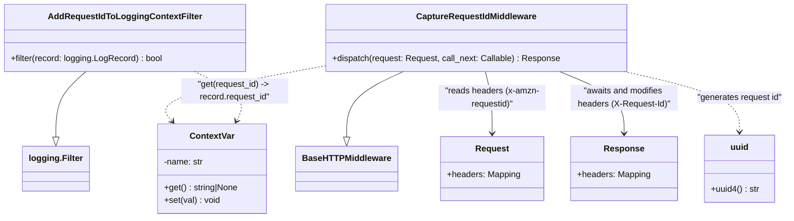

# Diagram: backend/src/log/request_id_context.py

> Auto-generated by Obscura crawlers

## Mermaid

### SVG

<svg id="container" width="1457.87890625" xmlns="http://www.w3.org/2000/svg" class="classDiagram" height="408" viewBox="0 0 1457.87890625 408" role="graphics-document document" aria-roledescription="class"><g><defs><marker id="container_class-aggregationStart" class="marker aggregation class" refX="18" refY="7" markerWidth="190" markerHeight="240" orient="auto"><path d="M 18,7 L9,13 L1,7 L9,1 Z"></path></marker></defs><defs><marker id="container_class-aggregationEnd" class="marker aggregation class" refX="1" refY="7" markerWidth="20" markerHeight="28" orient="auto"><path d="M 18,7 L9,13 L1,7 L9,1 Z"></path></marker></defs><defs><marker id="container_class-extensionStart" class="marker extension class" refX="18" refY="7" markerWidth="190" markerHeight="240" orient="auto"><path d="M 1,7 L18,13 V 1 Z"></path></marker></defs><defs><marker id="container_class-extensionEnd" class="marker extension class" refX="1" refY="7" markerWidth="20" markerHeight="28" orient="auto"><path d="M 1,1 V 13 L18,7 Z"></path></marker></defs><defs><marker id="container_class-compositionStart" class="marker composition class" refX="18" refY="7" markerWidth="190" markerHeight="240" orient="auto"><path d="M 18,7 L9,13 L1,7 L9,1 Z"></path></marker></defs><defs><marker id="container_class-compositionEnd" class="marker composition class" refX="1" refY="7" markerWidth="20" markerHeight="28" orient="auto"><path d="M 18,7 L9,13 L1,7 L9,1 Z"></path></marker></defs><defs><marker id="container_class-dependencyStart" class="marker dependency class" refX="6" refY="7" markerWidth="190" markerHeight="240" orient="auto"><path d="M 5,7 L9,13 L1,7 L9,1 Z"></path></marker></defs><defs><marker id="container_class-dependencyEnd" class="marker dependency class" refX="13" refY="7" markerWidth="20" markerHeight="28" orient="auto"><path d="M 18,7 L9,13 L14,7 L9,1 Z"></path></marker></defs><defs><marker id="container_class-lollipopStart" class="marker lollipop class" refX="13" refY="7" markerWidth="190" markerHeight="240" orient="auto"><circle stroke="black" fill="transparent" cx="7" cy="7" r="6"></circle></marker></defs><defs><marker id="container_class-lollipopEnd" class="marker lollipop class" refX="1" refY="7" markerWidth="190" markerHeight="240" orient="auto"><circle stroke="black" fill="transparent" cx="7" cy="7" r="6"></circle></marker></defs><g class="root"><g class="clusters"></g><g class="edgePaths"><path d="M156.016,134L146.442,142.167C136.868,150.333,117.719,166.667,108.145,187.125C98.57,207.583,98.57,232.167,98.57,244.458L98.57,256.75" id="id_AddRequestIdToLoggingContextFilter_logging.Filter_1" class="edge-thickness-normal edge-pattern-solid relation" style=";;;" data-edge="true" data-et="edge" data-id="id_AddRequestIdToLoggingContextFilter_logging.Filter_1" data-points="W3sieCI6MTU2LjAxNjExMzI4MTI1LCJ5IjoxMzR9LHsieCI6OTguNTcwMzEyNSwieSI6MTgzfSx7IngiOjk4LjU3MDMxMjUsInkiOjI3NH1d" marker-end="url(#container_class-extensionEnd)"></path><path d="M746.931,134L729.725,142.167C712.519,150.333,678.106,166.667,660.9,187.125C643.693,207.583,643.693,232.167,643.693,244.458L643.693,256.75" id="id_CaptureRequestIdMiddleware_BaseHTTPMiddleware_2" class="edge-thickness-normal edge-pattern-solid relation" style=";;;" data-edge="true" data-et="edge" data-id="id_CaptureRequestIdMiddleware_BaseHTTPMiddleware_2" data-points="W3sieCI6NzQ2LjkzMTM5NjQ4NDM3NSwieSI6MTM0fSx7IngiOjY0My42OTMzNTkzNzUsInkiOjE4M30seyJ4Ijo2NDMuNjkzMzU5Mzc1LCJ5IjoyNzR9XQ==" marker-end="url(#container_class-extensionEnd)"></path><path d="M897.711,134L900.05,142.167C902.389,150.333,907.068,166.667,909.407,186C911.746,205.333,911.746,227.667,911.746,238.833L911.746,250" id="id_CaptureRequestIdMiddleware_Request_3" class="edge-thickness-normal edge-pattern-solid relation" style=";;;" data-edge="true" data-et="edge" data-id="id_CaptureRequestIdMiddleware_Request_3" data-points="W3sieCI6ODk3LjcxMTA1OTU3MDMxMjUsInkiOjEzNH0seyJ4Ijo5MTEuNzQ2MDkzNzUsInkiOjE4M30seyJ4Ijo5MTEuNzQ2MDkzNzUsInkiOjI1Nn1d" marker-end="url(#container_class-dependencyEnd)"></path><path d="M1034.675,134L1054.769,142.167C1074.863,150.333,1115.051,166.667,1135.144,186C1155.238,205.333,1155.238,227.667,1155.238,238.833L1155.238,250" id="id_CaptureRequestIdMiddleware_Response_4" class="edge-thickness-normal edge-pattern-solid relation" style=";;;" data-edge="true" data-et="edge" data-id="id_CaptureRequestIdMiddleware_Response_4" data-points="W3sieCI6MTAzNC42NzU0MTUwMzkwNjI1LCJ5IjoxMzR9LHsieCI6MTE1NS4yMzgyODEyNSwieSI6MTgzfSx7IngiOjExNTUuMjM4MjgxMjUsInkiOjI1Nn1d" marker-end="url(#container_class-dependencyEnd)"></path><path d="M1154.98,134L1190.669,142.167C1226.358,150.333,1297.736,166.667,1333.424,185.5C1369.113,204.333,1369.113,225.667,1369.113,236.333L1369.113,247" id="id_CaptureRequestIdMiddleware_uuid_5" class="edge-thickness-normal edge-pattern-dashed relation" style=";;;" data-edge="true" data-et="edge" data-id="id_CaptureRequestIdMiddleware_uuid_5" data-points="W3sieCI6MTE1NC45ODAxMDI1MzkwNjI1LCJ5IjoxMzR9LHsieCI6MTM2OS4xMTMyODEyNSwieSI6MTgzfSx7IngiOjEzNjkuMTEzMjgxMjUsInkiOjI1M31d" marker-end="url(#container_class-dependencyEnd)"></path><path d="M600.975,123.153L547.674,133.127C494.372,143.102,387.77,163.051,340.94,180.439C294.109,197.827,307.05,212.653,313.521,220.066L319.992,227.48" id="id_CaptureRequestIdMiddleware_ContextVar_6" class="edge-thickness-normal edge-pattern-dashed relation" style=";;;" data-edge="true" data-et="edge" data-id="id_CaptureRequestIdMiddleware_ContextVar_6" data-points="W3sieCI6NjAwLjk3NDYwOTM3NSwieSI6MTIzLjE1Mjk0Nzk3MTk3NDExfSx7IngiOjI4MS4xNjc5Njg3NSwieSI6MTgzfSx7IngiOjMyMy45MzcxOTE2MTE4NDIxLCJ5IjoyMzJ9XQ==" marker-end="url(#container_class-dependencyEnd)"></path><path d="M360.711,134L377.671,142.167C394.632,150.333,428.552,166.667,441.948,182.102C455.344,197.538,448.216,212.075,444.651,219.344L441.087,226.613" id="id_AddRequestIdToLoggingContextFilter_ContextVar_7" class="edge-thickness-normal edge-pattern-dashed relation" style=";;;" data-edge="true" data-et="edge" data-id="id_AddRequestIdToLoggingContextFilter_ContextVar_7" data-points="W3sieCI6MzYwLjcxMTE4MTY0MDYyNSwieSI6MTM0fSx7IngiOjQ2Mi40NzI2NTYyNSwieSI6MTgzfSx7IngiOjQzOC40NDU0MTUyOTYwNTI2LCJ5IjoyMzJ9XQ==" marker-end="url(#container_class-dependencyEnd)"></path></g><g class="edgeLabels"><g class="edgeLabel"><g class="label" data-id="id_AddRequestIdToLoggingContextFilter_logging.Filter_1" transform="translate(0, 0)"><foreignObject width="0" height="0">

</foreignObject></g></g><g class="edgeLabel"><g class="label" data-id="id_CaptureRequestIdMiddleware_BaseHTTPMiddleware_2" transform="translate(0, 0)"><foreignObject width="0" height="0">

</foreignObject></g></g><g class="edgeLabel" transform="translate(911.74609375, 183)"><g class="label" data-id="id_CaptureRequestIdMiddleware_Request_3" transform="translate(-100, -24)"><foreignObject width="200" height="48">

"reads headers (x-amzn-requestid)"

</foreignObject></g></g><g class="edgeLabel" transform="translate(1155.23828125, 183)"><g class="label" data-id="id_CaptureRequestIdMiddleware_Response_4" transform="translate(-100, -24)"><foreignObject width="200" height="48">

"awaits and modifies headers (X-Request-Id)"

</foreignObject></g></g><g class="edgeLabel" transform="translate(1369.11328125, 183)"><g class="label" data-id="id_CaptureRequestIdMiddleware_uuid_5" transform="translate(-80.765625, -12)"><foreignObject width="161.53125" height="24">

"generates request id"

</foreignObject></g></g><g class="edgeLabel" transform="translate(409.10616, 159.05827)"><g class="label" data-id="id_CaptureRequestIdMiddleware_ContextVar_6" transform="translate(-61.3046875, -12)"><foreignObject width="122.609375" height="24">

"set(request_id)"

</foreignObject></g></g><g class="edgeLabel" transform="translate(436.17714, 170.33823)"><g class="label" data-id="id_AddRequestIdToLoggingContextFilter_ContextVar_7" transform="translate(-100, -24)"><foreignObject width="200" height="48">

"get(request_id) -&gt; record.request_id"

</foreignObject></g></g></g><g class="nodes"><g class="node default" id="classId-ContextVar-0" transform="translate(397.255859375, 316)"><g class="basic label-container"><path d="M-101.84765625 -84 L101.84765625 -84 L101.84765625 84 L-101.84765625 84" stroke="none" stroke-width="0" fill="#ECECFF" style=""></path><path d="M-101.84765625 -84 C-22.40287811568126 -84, 57.04190001863748 -84, 101.84765625 -84 M-101.84765625 -84 C-35.38739821454982 -84, 31.072859820900362 -84, 101.84765625 -84 M101.84765625 -84 C101.84765625 -42.78027472912392, 101.84765625 -1.5605494582478343, 101.84765625 84 M101.84765625 -84 C101.84765625 -50.262249536060104, 101.84765625 -16.524499072120207, 101.84765625 84 M101.84765625 84 C25.85229073791575 84, -50.1430747741685 84, -101.84765625 84 M101.84765625 84 C46.04539847196284 84, -9.756859306074318 84, -101.84765625 84 M-101.84765625 84 C-101.84765625 50.272851373836865, -101.84765625 16.54570274767373, -101.84765625 -84 M-101.84765625 84 C-101.84765625 41.07817498176491, -101.84765625 -1.84365003647018, -101.84765625 -84" stroke="#9370DB" stroke-width="1.3" fill="none" stroke-dasharray="0 0" style=""></path></g><g class="annotation-group text" transform="translate(0, -60)"></g><g class="label-group text" transform="translate(-40.0078125, -60)"><g class="label" style="font-weight: bolder" transform="translate(0,-12)"><foreignObject width="80.015625" height="24">

ContextVar

</foreignObject></g></g><g class="members-group text" transform="translate(-89.84765625, -12)"><g class="label" style="" transform="translate(0,-12)"><foreignObject width="74.46875" height="24">

-name: str

</foreignObject></g></g><g class="methods-group text" transform="translate(-89.84765625, 36)"><g class="label" style="" transform="translate(0,-12)"><foreignObject width="139.6875" height="24">

+get() : string|None

</foreignObject></g><g class="label" style="" transform="translate(0,12)"><foreignObject width="104.734375" height="24">

+set(val) : void

</foreignObject></g></g><g class="divider" style=""><path d="M-101.84765625 -36 C-21.39738467552658 -36, 59.05288689894684 -36, 101.84765625 -36 M-101.84765625 -36 C-26.326875666580378 -36, 49.193904916839244 -36, 101.84765625 -36" stroke="#9370DB" stroke-width="1.3" fill="none" stroke-dasharray="0 0" style=""></path></g><g class="divider" style=""><path d="M-101.84765625 12 C-47.30113839315719 12, 7.245379463685623 12, 101.84765625 12 M-101.84765625 12 C-32.81823847041309 12, 36.211179309173815 12, 101.84765625 12" stroke="#9370DB" stroke-width="1.3" fill="none" stroke-dasharray="0 0" style=""></path></g></g><g class="node default" id="classId-AddRequestIdToLoggingContextFilter-1" transform="translate(229.875, 71)"><g class="basic label-container"><path d="M-221.875 -63 L221.875 -63 L221.875 63 L-221.875 63" stroke="none" stroke-width="0" fill="#ECECFF" style=""></path><path d="M-221.875 -63 C-72.02748886961231 -63, 77.82002226077537 -63, 221.875 -63 M-221.875 -63 C-103.104492495367 -63, 15.666015009266005 -63, 221.875 -63 M221.875 -63 C221.875 -25.219751488758824, 221.875 12.560497022482352, 221.875 63 M221.875 -63 C221.875 -13.525096027798249, 221.875 35.9498079444035, 221.875 63 M221.875 63 C88.30041316077907 63, -45.274173678441855 63, -221.875 63 M221.875 63 C70.3233309403958 63, -81.22833811920839 63, -221.875 63 M-221.875 63 C-221.875 33.0892437797868, -221.875 3.1784875595735897, -221.875 -63 M-221.875 63 C-221.875 16.329628158349102, -221.875 -30.340743683301795, -221.875 -63" stroke="#9370DB" stroke-width="1.3" fill="none" stroke-dasharray="0 0" style=""></path></g><g class="annotation-group text" transform="translate(0, -39)"></g><g class="label-group text" transform="translate(-135.703125, -39)"><g class="label" style="font-weight: bolder" transform="translate(0,-12)"><foreignObject width="271.40625" height="24">

AddRequestIdToLoggingContextFilter

</foreignObject></g></g><g class="members-group text" transform="translate(-209.875, 9)"></g><g class="methods-group text" transform="translate(-209.875, 39)"><g class="label" style="" transform="translate(0,-12)"><foreignObject width="284.046875" height="24">

+filter(record: logging.LogRecord) : bool

</foreignObject></g></g><g class="divider" style=""><path d="M-221.875 -15 C-120.18156186737616 -15, -18.48812373475232 -15, 221.875 -15 M-221.875 -15 C-131.63180547039366 -15, -41.38861094078729 -15, 221.875 -15" stroke="#9370DB" stroke-width="1.3" fill="none" stroke-dasharray="0 0" style=""></path></g><g class="divider" style=""><path d="M-221.875 9 C-106.69280688832556 9, 8.489386223348873 9, 221.875 9 M-221.875 9 C-107.83604083742046 9, 6.202918325159089 9, 221.875 9" stroke="#9370DB" stroke-width="1.3" fill="none" stroke-dasharray="0 0" style=""></path></g></g><g class="node default" id="classId-CaptureRequestIdMiddleware-2" transform="translate(879.666015625, 71)"><g class="basic label-container"><path d="M-278.69140625 -63 L278.69140625 -63 L278.69140625 63 L-278.69140625 63" stroke="none" stroke-width="0" fill="#ECECFF" style=""></path><path d="M-278.69140625 -63 C-67.99288693662496 -63, 142.7056323767501 -63, 278.69140625 -63 M-278.69140625 -63 C-63.73298370238939 -63, 151.22543884522122 -63, 278.69140625 -63 M278.69140625 -63 C278.69140625 -31.92398478221573, 278.69140625 -0.8479695644314589, 278.69140625 63 M278.69140625 -63 C278.69140625 -37.42302682117932, 278.69140625 -11.846053642358648, 278.69140625 63 M278.69140625 63 C139.7184515854712 63, 0.7454969209424007 63, -278.69140625 63 M278.69140625 63 C142.69638319093806 63, 6.701360131876129 63, -278.69140625 63 M-278.69140625 63 C-278.69140625 13.253125171025545, -278.69140625 -36.49374965794891, -278.69140625 -63 M-278.69140625 63 C-278.69140625 22.46966227556846, -278.69140625 -18.06067544886308, -278.69140625 -63" stroke="#9370DB" stroke-width="1.3" fill="none" stroke-dasharray="0 0" style=""></path></g><g class="annotation-group text" transform="translate(0, -39)"></g><g class="label-group text" transform="translate(-108.3984375, -39)"><g class="label" style="font-weight: bolder" transform="translate(0,-12)"><foreignObject width="216.796875" height="24">

CaptureRequestIdMiddleware

</foreignObject></g></g><g class="members-group text" transform="translate(-266.69140625, 9)"></g><g class="methods-group text" transform="translate(-266.69140625, 39)"><g class="label" style="" transform="translate(0,-12)"><foreignObject width="424.984375" height="24">

+dispatch(request: Request, call_next: Callable) : Response

</foreignObject></g></g><g class="divider" style=""><path d="M-278.69140625 -15 C-87.45725532759127 -15, 103.77689559481746 -15, 278.69140625 -15 M-278.69140625 -15 C-162.29026674605427 -15, -45.88912724210854 -15, 278.69140625 -15" stroke="#9370DB" stroke-width="1.3" fill="none" stroke-dasharray="0 0" style=""></path></g><g class="divider" style=""><path d="M-278.69140625 9 C-159.1822754568106 9, -39.67314466362117 9, 278.69140625 9 M-278.69140625 9 C-137.2420729315323 9, 4.207260386935388 9, 278.69140625 9" stroke="#9370DB" stroke-width="1.3" fill="none" stroke-dasharray="0 0" style=""></path></g></g><g class="node default" id="classId-BaseHTTPMiddleware-3" transform="translate(643.693359375, 316)"><g class="basic label-container"><path d="M-90.59375 -42 L90.59375 -42 L90.59375 42 L-90.59375 42" stroke="none" stroke-width="0" fill="#ECECFF" style=""></path><path d="M-90.59375 -42 C-49.03830351542967 -42, -7.482857030859336 -42, 90.59375 -42 M-90.59375 -42 C-29.07625958301768 -42, 32.44123083396464 -42, 90.59375 -42 M90.59375 -42 C90.59375 -22.096511681204753, 90.59375 -2.1930233624095052, 90.59375 42 M90.59375 -42 C90.59375 -22.468134509000116, 90.59375 -2.9362690180002318, 90.59375 42 M90.59375 42 C39.90294939021954 42, -10.78785121956092 42, -90.59375 42 M90.59375 42 C33.01918315098159 42, -24.55538369803682 42, -90.59375 42 M-90.59375 42 C-90.59375 11.348348619866826, -90.59375 -19.303302760266348, -90.59375 -42 M-90.59375 42 C-90.59375 23.042738670643537, -90.59375 4.085477341287074, -90.59375 -42" stroke="#9370DB" stroke-width="1.3" fill="none" stroke-dasharray="0 0" style=""></path></g><g class="annotation-group text" transform="translate(0, -18)"></g><g class="label-group text" transform="translate(-78.59375, -18)"><g class="label" style="font-weight: bolder" transform="translate(0,-12)"><foreignObject width="157.1875" height="24">

BaseHTTPMiddleware

</foreignObject></g></g><g class="members-group text" transform="translate(-78.59375, 30)"></g><g class="methods-group text" transform="translate(-78.59375, 60)"></g><g class="divider" style=""><path d="M-90.59375 6 C-22.605292769811697 6, 45.383164460376605 6, 90.59375 6 M-90.59375 6 C-36.573079214164814 6, 17.447591571670372 6, 90.59375 6" stroke="#9370DB" stroke-width="1.3" fill="none" stroke-dasharray="0 0" style=""></path></g><g class="divider" style=""><path d="M-90.59375 24 C-28.71847353755144 24, 33.15680292489712 24, 90.59375 24 M-90.59375 24 C-28.67070685124024 24, 33.25233629751952 24, 90.59375 24" stroke="#9370DB" stroke-width="1.3" fill="none" stroke-dasharray="0 0" style=""></path></g></g><g class="node default" id="classId-Request-4" transform="translate(911.74609375, 316)"><g class="basic label-container"><path d="M-95.37890625 -60 L95.37890625 -60 L95.37890625 60 L-95.37890625 60" stroke="none" stroke-width="0" fill="#ECECFF" style=""></path><path d="M-95.37890625 -60 C-31.01120519697018 -60, 33.35649585605964 -60, 95.37890625 -60 M-95.37890625 -60 C-52.88265231151655 -60, -10.386398373033103 -60, 95.37890625 -60 M95.37890625 -60 C95.37890625 -31.585052522092745, 95.37890625 -3.1701050441854903, 95.37890625 60 M95.37890625 -60 C95.37890625 -16.70087584579737, 95.37890625 26.59824830840526, 95.37890625 60 M95.37890625 60 C40.69219739966902 60, -13.99451145066196 60, -95.37890625 60 M95.37890625 60 C47.118300851867694 60, -1.1423045462646115 60, -95.37890625 60 M-95.37890625 60 C-95.37890625 22.11988854723765, -95.37890625 -15.7602229055247, -95.37890625 -60 M-95.37890625 60 C-95.37890625 15.41329463767832, -95.37890625 -29.17341072464336, -95.37890625 -60" stroke="#9370DB" stroke-width="1.3" fill="none" stroke-dasharray="0 0" style=""></path></g><g class="annotation-group text" transform="translate(0, -36)"></g><g class="label-group text" transform="translate(-29.9765625, -36)"><g class="label" style="font-weight: bolder" transform="translate(0,-12)"><foreignObject width="59.953125" height="24">

Request

</foreignObject></g></g><g class="members-group text" transform="translate(-83.37890625, 12)"><g class="label" style="" transform="translate(0,-12)"><foreignObject width="136.78125" height="24">

+headers: Mapping

</foreignObject></g></g><g class="methods-group text" transform="translate(-83.37890625, 60)"></g><g class="divider" style=""><path d="M-95.37890625 -12 C-23.920961796876924 -12, 47.53698265624615 -12, 95.37890625 -12 M-95.37890625 -12 C-32.827051611118904 -12, 29.724803027762192 -12, 95.37890625 -12" stroke="#9370DB" stroke-width="1.3" fill="none" stroke-dasharray="0 0" style=""></path></g><g class="divider" style=""><path d="M-95.37890625 36 C-46.09823757443965 36, 3.1824311011206987 36, 95.37890625 36 M-95.37890625 36 C-31.654399874601594 36, 32.07010650079681 36, 95.37890625 36" stroke="#9370DB" stroke-width="1.3" fill="none" stroke-dasharray="0 0" style=""></path></g></g><g class="node default" id="classId-Response-5" transform="translate(1155.23828125, 316)"><g class="basic label-container"><path d="M-98.11328125 -60 L98.11328125 -60 L98.11328125 60 L-98.11328125 60" stroke="none" stroke-width="0" fill="#ECECFF" style=""></path><path d="M-98.11328125 -60 C-34.258782571928116 -60, 29.59571610614377 -60, 98.11328125 -60 M-98.11328125 -60 C-52.740650594702196 -60, -7.368019939404391 -60, 98.11328125 -60 M98.11328125 -60 C98.11328125 -14.377959650821552, 98.11328125 31.244080698356896, 98.11328125 60 M98.11328125 -60 C98.11328125 -25.397723755170936, 98.11328125 9.204552489658127, 98.11328125 60 M98.11328125 60 C58.381430688575925 60, 18.64958012715185 60, -98.11328125 60 M98.11328125 60 C23.896457388431813 60, -50.320366473136374 60, -98.11328125 60 M-98.11328125 60 C-98.11328125 29.79969538313285, -98.11328125 -0.4006092337343006, -98.11328125 -60 M-98.11328125 60 C-98.11328125 13.453493765274217, -98.11328125 -33.093012469451565, -98.11328125 -60" stroke="#9370DB" stroke-width="1.3" fill="none" stroke-dasharray="0 0" style=""></path></g><g class="annotation-group text" transform="translate(0, -36)"></g><g class="label-group text" transform="translate(-35.4453125, -36)"><g class="label" style="font-weight: bolder" transform="translate(0,-12)"><foreignObject width="70.890625" height="24">

Response

</foreignObject></g></g><g class="members-group text" transform="translate(-86.11328125, 12)"><g class="label" style="" transform="translate(0,-12)"><foreignObject width="136.78125" height="24">

+headers: Mapping

</foreignObject></g></g><g class="methods-group text" transform="translate(-86.11328125, 60)"></g><g class="divider" style=""><path d="M-98.11328125 -12 C-48.31653792924788 -12, 1.4802053915042421 -12, 98.11328125 -12 M-98.11328125 -12 C-56.49606539459143 -12, -14.878849539182866 -12, 98.11328125 -12" stroke="#9370DB" stroke-width="1.3" fill="none" stroke-dasharray="0 0" style=""></path></g><g class="divider" style=""><path d="M-98.11328125 36 C-22.772767933781367 36, 52.567745382437266 36, 98.11328125 36 M-98.11328125 36 C-29.553947700060164 36, 39.00538584987967 36, 98.11328125 36" stroke="#9370DB" stroke-width="1.3" fill="none" stroke-dasharray="0 0" style=""></path></g></g><g class="node default" id="classId-logging.Filter-6" transform="translate(98.5703125, 316)"><g class="basic label-container"><path d="M-59.890625 -42 L59.890625 -42 L59.890625 42 L-59.890625 42" stroke="none" stroke-width="0" fill="#ECECFF" style=""></path><path d="M-59.890625 -42 C-19.241194170828074 -42, 21.408236658343853 -42, 59.890625 -42 M-59.890625 -42 C-32.54215013641514 -42, -5.193675272830276 -42, 59.890625 -42 M59.890625 -42 C59.890625 -14.331904627923112, 59.890625 13.336190744153775, 59.890625 42 M59.890625 -42 C59.890625 -20.001554313268063, 59.890625 1.9968913734638747, 59.890625 42 M59.890625 42 C28.396427748618095 42, -3.0977695027638106 42, -59.890625 42 M59.890625 42 C21.92597408110118 42, -16.038676837797638 42, -59.890625 42 M-59.890625 42 C-59.890625 13.360941994762076, -59.890625 -15.278116010475848, -59.890625 -42 M-59.890625 42 C-59.890625 10.047328508488413, -59.890625 -21.905342983023175, -59.890625 -42" stroke="#9370DB" stroke-width="1.3" fill="none" stroke-dasharray="0 0" style=""></path></g><g class="annotation-group text" transform="translate(0, -18)"></g><g class="label-group text" transform="translate(-47.890625, -18)"><g class="label" style="font-weight: bolder" transform="translate(0,-12)"><foreignObject width="95.78125" height="24">

logging.Filter

</foreignObject></g></g><g class="members-group text" transform="translate(-47.890625, 30)"></g><g class="methods-group text" transform="translate(-47.890625, 60)"></g><g class="divider" style=""><path d="M-59.890625 6 C-23.559719247077297 6, 12.771186505845407 6, 59.890625 6 M-59.890625 6 C-29.276314340746048 6, 1.337996318507905 6, 59.890625 6" stroke="#9370DB" stroke-width="1.3" fill="none" stroke-dasharray="0 0" style=""></path></g><g class="divider" style=""><path d="M-59.890625 24 C-30.914238148475206 24, -1.937851296950413 24, 59.890625 24 M-59.890625 24 C-15.421530682714334 24, 29.047563634571333 24, 59.890625 24" stroke="#9370DB" stroke-width="1.3" fill="none" stroke-dasharray="0 0" style=""></path></g></g><g class="node default" id="classId-uuid-7" transform="translate(1369.11328125, 316)"><g class="basic label-container"><path d="M-65.76171875 -63 L65.76171875 -63 L65.76171875 63 L-65.76171875 63" stroke="none" stroke-width="0" fill="#ECECFF" style=""></path><path d="M-65.76171875 -63 C-32.05001067840199 -63, 1.6616973931960217 -63, 65.76171875 -63 M-65.76171875 -63 C-21.44083915709888 -63, 22.880040435802243 -63, 65.76171875 -63 M65.76171875 -63 C65.76171875 -36.21056467469278, 65.76171875 -9.421129349385566, 65.76171875 63 M65.76171875 -63 C65.76171875 -21.80772878187495, 65.76171875 19.3845424362501, 65.76171875 63 M65.76171875 63 C17.38906926717751 63, -30.983580215644977 63, -65.76171875 63 M65.76171875 63 C37.57047176676313 63, 9.379224783526254 63, -65.76171875 63 M-65.76171875 63 C-65.76171875 27.382044062135286, -65.76171875 -8.235911875729428, -65.76171875 -63 M-65.76171875 63 C-65.76171875 33.82029227914197, -65.76171875 4.640584558283926, -65.76171875 -63" stroke="#9370DB" stroke-width="1.3" fill="none" stroke-dasharray="0 0" style=""></path></g><g class="annotation-group text" transform="translate(0, -39)"></g><g class="label-group text" transform="translate(-16.2109375, -39)"><g class="label" style="font-weight: bolder" transform="translate(0,-12)"><foreignObject width="32.421875" height="24">

uuid

</foreignObject></g></g><g class="members-group text" transform="translate(-53.76171875, 9)"></g><g class="methods-group text" transform="translate(-53.76171875, 39)"><g class="label" style="" transform="translate(0,-12)"><foreignObject width="91.3125" height="24">

+uuid4() : str

</foreignObject></g></g><g class="divider" style=""><path d="M-65.76171875 -15 C-20.257741962336503 -15, 25.246234825326994 -15, 65.76171875 -15 M-65.76171875 -15 C-28.307077314024518 -15, 9.147564121950964 -15, 65.76171875 -15" stroke="#9370DB" stroke-width="1.3" fill="none" stroke-dasharray="0 0" style=""></path></g><g class="divider" style=""><path d="M-65.76171875 9 C-22.546860281122648 9, 20.667998187754705 9, 65.76171875 9 M-65.76171875 9 C-15.746209175361699 9, 34.2693003992766 9, 65.76171875 9" stroke="#9370DB" stroke-width="1.3" fill="none" stroke-dasharray="0 0" style=""></path></g></g></g></g></g></svg>
