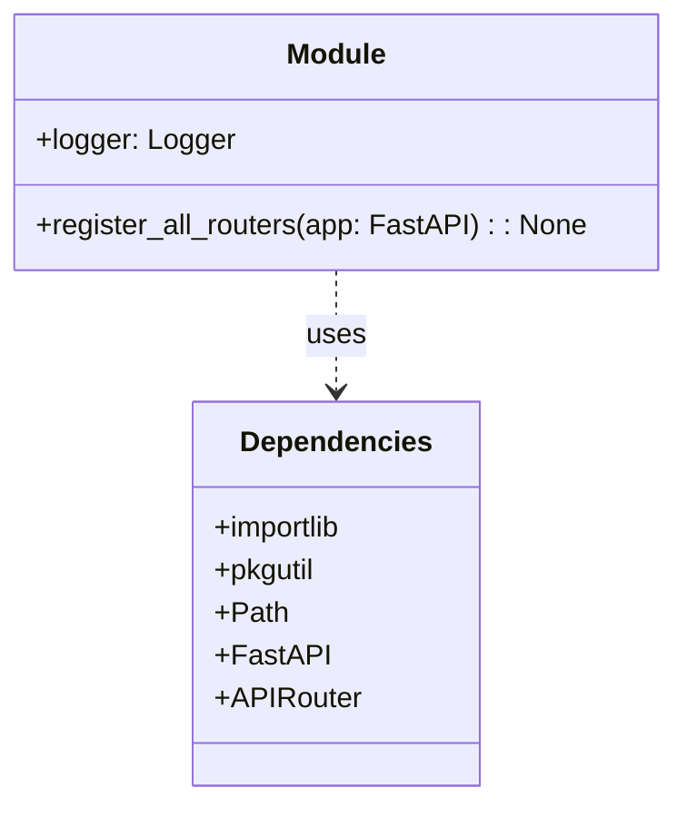

# Diagram: backend/src/routes/_loader.py


> Auto-generated by Obscura crawlers

## Diagram 1



### SVG

<svg id="container" width="372.015625" xmlns="http://www.w3.org/2000/svg" class="classDiagram" height="450" viewBox="0 0 372.015625 450" role="graphics-document document" aria-roledescription="class"><style>#container{font-family:"trebuchet ms",verdana,arial,sans-serif;font-size:16px;fill:#333;}@keyframes edge-animation-frame{from{stroke-dashoffset:0;}}@keyframes dash{to{stroke-dashoffset:0;}}#container .edge-animation-slow{stroke-dasharray:9,5!important;stroke-dashoffset:900;animation:dash 50s linear infinite;stroke-linecap:round;}#container .edge-animation-fast{stroke-dasharray:9,5!important;stroke-dashoffset:900;animation:dash 20s linear infinite;stroke-linecap:round;}#container .error-icon{fill:#552222;}#container .error-text{fill:#552222;stroke:#552222;}#container .edge-thickness-normal{stroke-width:1px;}#container .edge-thickness-thick{stroke-width:3.5px;}#container .edge-pattern-solid{stroke-dasharray:0;}#container .edge-thickness-invisible{stroke-width:0;fill:none;}#container .edge-pattern-dashed{stroke-dasharray:3;}#container .edge-pattern-dotted{stroke-dasharray:2;}#container .marker{fill:#333333;stroke:#333333;}#container .marker.cross{stroke:#333333;}#container svg{font-family:"trebuchet ms",verdana,arial,sans-serif;font-size:16px;}#container p{margin:0;}#container g.classGroup text{fill:#9370DB;stroke:none;font-family:"trebuchet ms",verdana,arial,sans-serif;font-size:10px;}#container g.classGroup text .title{font-weight:bolder;}#container .nodeLabel,#container .edgeLabel{color:#131300;}#container .edgeLabel .label rect{fill:#ECECFF;}#container .label text{fill:#131300;}#container .labelBkg{background:#ECECFF;}#container .edgeLabel .label span{background:#ECECFF;}#container .classTitle{font-weight:bolder;}#container .node rect,#container .node circle,#container .node ellipse,#container .node polygon,#container .node path{fill:#ECECFF;stroke:#9370DB;stroke-width:1px;}#container .divider{stroke:#9370DB;stroke-width:1;}#container g.clickable{cursor:pointer;}#container g.classGroup rect{fill:#ECECFF;stroke:#9370DB;}#container g.classGroup line{stroke:#9370DB;stroke-width:1;}#container .classLabel .box{stroke:none;stroke-width:0;fill:#ECECFF;opacity:0.5;}#container .classLabel .label{fill:#9370DB;font-size:10px;}#container .relation{stroke:#333333;stroke-width:1;fill:none;}#container .dashed-line{stroke-dasharray:3;}#container .dotted-line{stroke-dasharray:1 2;}#container #compositionStart,#container .composition{fill:#333333!important;stroke:#333333!important;stroke-width:1;}#container #compositionEnd,#container .composition{fill:#333333!important;stroke:#333333!important;stroke-width:1;}#container #dependencyStart,#container .dependency{fill:#333333!important;stroke:#333333!important;stroke-width:1;}#container #dependencyStart,#container .dependency{fill:#333333!important;stroke:#333333!important;stroke-width:1;}#container #extensionStart,#container .extension{fill:transparent!important;stroke:#333333!important;stroke-width:1;}#container #extensionEnd,#container .extension{fill:transparent!important;stroke:#333333!important;stroke-width:1;}#container #aggregationStart,#container .aggregation{fill:transparent!important;stroke:#333333!important;stroke-width:1;}#container #aggregationEnd,#container .aggregation{fill:transparent!important;stroke:#333333!important;stroke-width:1;}#container #lollipopStart,#container .lollipop{fill:#ECECFF!important;stroke:#333333!important;stroke-width:1;}#container #lollipopEnd,#container .lollipop{fill:#ECECFF!important;stroke:#333333!important;stroke-width:1;}#container .edgeTerminals{font-size:11px;line-height:initial;}#container .classTitleText{text-anchor:middle;font-size:18px;fill:#333;}#container .label-icon{display:inline-block;height:1em;overflow:visible;vertical-align:-0.125em;}#container .node .label-icon path{fill:currentColor;stroke:revert;stroke-width:revert;}#container :root{--mermaid-font-family:"trebuchet ms",verdana,arial,sans-serif;}</style><g><defs><marker id="container_class-aggregationStart" class="marker aggregation class" refX="18" refY="7" markerWidth="190" markerHeight="240" orient="auto"><path d="M 18,7 L9,13 L1,7 L9,1 Z"></path></marker></defs><defs><marker id="container_class-aggregationEnd" class="marker aggregation class" refX="1" refY="7" markerWidth="20" markerHeight="28" orient="auto"><path d="M 18,7 L9,13 L1,7 L9,1 Z"></path></marker></defs><defs><marker id="container_class-extensionStart" class="marker extension class" refX="18" refY="7" markerWidth="190" markerHeight="240" orient="auto"><path d="M 1,7 L18,13 V 1 Z"></path></marker></defs><defs><marker id="container_class-extensionEnd" class="marker extension class" refX="1" refY="7" markerWidth="20" markerHeight="28" orient="auto"><path d="M 1,1 V 13 L18,7 Z"></path></marker></defs><defs><marker id="container_class-compositionStart" class="marker composition class" refX="18" refY="7" markerWidth="190" markerHeight="240" orient="auto"><path d="M 18,7 L9,13 L1,7 L9,1 Z"></path></marker></defs><defs><marker id="container_class-compositionEnd" class="marker composition class" refX="1" refY="7" markerWidth="20" markerHeight="28" orient="auto"><path d="M 18,7 L9,13 L1,7 L9,1 Z"></path></marker></defs><defs><marker id="container_class-dependencyStart" class="marker dependency class" refX="6" refY="7" markerWidth="190" markerHeight="240" orient="auto"><path d="M 5,7 L9,13 L1,7 L9,1 Z"></path></marker></defs><defs><marker id="container_class-dependencyEnd" class="marker dependency class" refX="13" refY="7" markerWidth="20" markerHeight="28" orient="auto"><path d="M 18,7 L9,13 L14,7 L9,1 Z"></path></marker></defs><defs><marker id="container_class-lollipopStart" class="marker lollipop class" refX="13" refY="7" markerWidth="190" markerHeight="240" orient="auto"><circle stroke="black" fill="transparent" cx="7" cy="7" r="6"></circle></marker></defs><defs><marker id="container_class-lollipopEnd" class="marker lollipop class" refX="1" refY="7" markerWidth="190" markerHeight="240" orient="auto"><circle stroke="black" fill="transparent" cx="7" cy="7" r="6"></circle></marker></defs><g class="root"><g class="clusters"></g><g class="edgePaths"><path d="M186.008,152L186.008,158.167C186.008,164.333,186.008,176.667,186.008,188C186.008,199.333,186.008,209.667,186.008,214.833L186.008,220" id="id_Module_Dependencies_1" class="edge-thickness-normal edge-pattern-dashed relation" style=";;;" data-edge="true" data-et="edge" data-id="id_Module_Dependencies_1" data-points="W3sieCI6MTg2LjAwNzgxMjUsInkiOjE1Mn0seyJ4IjoxODYuMDA3ODEyNSwieSI6MTg5fSx7IngiOjE4Ni4wMDc4MTI1LCJ5IjoyMjZ9XQ==" marker-end="url(#container_class-dependencyEnd)"></path></g><g class="edgeLabels"><g class="edgeLabel" transform="translate(186.0078125, 189)"><g class="label" data-id="id_Module_Dependencies_1" transform="translate(-16.4921875, -12)"><foreignObject width="32.984375" height="24"><div xmlns="http://www.w3.org/1999/xhtml" class="labelBkg" style="display: table-cell; white-space: nowrap; line-height: 1.5; max-width: 200px; text-align: center;"><span class="edgeLabel"><p>uses</p></span></div></foreignObject></g></g></g><g class="nodes"><g class="node default" id="classId-Module-0" transform="translate(186.0078125, 80)"><g class="basic label-container"><path d="M-178.0078125 -72 L178.0078125 -72 L178.0078125 72 L-178.0078125 72" stroke="none" stroke-width="0" fill="#ECECFF" style=""></path><path d="M-178.0078125 -72 C-89.26837193538229 -72, -0.5289313707645817 -72, 178.0078125 -72 M-178.0078125 -72 C-79.4005089443622 -72, 19.206794611275598 -72, 178.0078125 -72 M178.0078125 -72 C178.0078125 -27.773996326218885, 178.0078125 16.45200734756223, 178.0078125 72 M178.0078125 -72 C178.0078125 -38.57722414953189, 178.0078125 -5.154448299063773, 178.0078125 72 M178.0078125 72 C56.69951709100103 72, -64.60877831799795 72, -178.0078125 72 M178.0078125 72 C95.93679508084259 72, 13.865777661685172 72, -178.0078125 72 M-178.0078125 72 C-178.0078125 32.778262314233615, -178.0078125 -6.44347537153277, -178.0078125 -72 M-178.0078125 72 C-178.0078125 40.13358087140976, -178.0078125 8.267161742819532, -178.0078125 -72" stroke="#9370DB" stroke-width="1.3" fill="none" stroke-dasharray="0 0" style=""></path></g><g class="annotation-group text" transform="translate(0, -48)"></g><g class="label-group text" transform="translate(-27.09375, -48)"><g class="label" style="font-weight: bolder" transform="translate(0,-12)"><foreignObject width="54.1875" height="24"><div xmlns="http://www.w3.org/1999/xhtml" style="display: table-cell; white-space: nowrap; line-height: 1.5; max-width: 104px; text-align: center;"><span class="nodeLabel markdown-node-label" style=""><p>Module</p></span></div></foreignObject></g></g><g class="members-group text" transform="translate(-166.0078125, 0)"><g class="label" style="" transform="translate(0,-12)"><foreignObject width="109.65625" height="24"><div xmlns="http://www.w3.org/1999/xhtml" style="display: table-cell; white-space: nowrap; line-height: 1.5; max-width: 168px; text-align: center;"><span class="nodeLabel markdown-node-label" style=""><p>+logger: Logger</p></span></div></foreignObject></g></g><g class="methods-group text" transform="translate(-166.0078125, 48)"><g class="label" style="" transform="translate(0,-12)"><foreignObject width="304.921875" height="24"><div xmlns="http://www.w3.org/1999/xhtml" style="display: table-cell; white-space: nowrap; line-height: 1.5; max-width: 362px; text-align: center;"><span class="nodeLabel markdown-node-label" style=""><p>+register_all_routers(app: FastAPI) : : None</p></span></div></foreignObject></g></g><g class="divider" style=""><path d="M-178.0078125 -24 C-37.54476967984027 -24, 102.91827314031946 -24, 178.0078125 -24 M-178.0078125 -24 C-85.97637679549572 -24, 6.055058909008551 -24, 178.0078125 -24" stroke="#9370DB" stroke-width="1.3" fill="none" stroke-dasharray="0 0" style=""></path></g><g class="divider" style=""><path d="M-178.0078125 24 C-53.324179240888355 24, 71.35945401822329 24, 178.0078125 24 M-178.0078125 24 C-42.59479846594118 24, 92.81821556811764 24, 178.0078125 24" stroke="#9370DB" stroke-width="1.3" fill="none" stroke-dasharray="0 0" style=""></path></g></g><g class="node default" id="classId-Dependencies-1" transform="translate(186.0078125, 334)"><g class="basic label-container"><path d="M-77.58984375 -108 L77.58984375 -108 L77.58984375 108 L-77.58984375 108" stroke="none" stroke-width="0" fill="#ECECFF" style=""></path><path d="M-77.58984375 -108 C-28.701878347448158 -108, 20.186087055103684 -108, 77.58984375 -108 M-77.58984375 -108 C-45.86985894165912 -108, -14.149874133318228 -108, 77.58984375 -108 M77.58984375 -108 C77.58984375 -36.40410915481553, 77.58984375 35.19178169036894, 77.58984375 108 M77.58984375 -108 C77.58984375 -57.56604071222253, 77.58984375 -7.132081424445062, 77.58984375 108 M77.58984375 108 C45.9397960823091 108, 14.28974841461821 108, -77.58984375 108 M77.58984375 108 C27.054609150777004 108, -23.48062544844599 108, -77.58984375 108 M-77.58984375 108 C-77.58984375 63.665109354264075, -77.58984375 19.33021870852815, -77.58984375 -108 M-77.58984375 108 C-77.58984375 25.355110993948443, -77.58984375 -57.28977801210311, -77.58984375 -108" stroke="#9370DB" stroke-width="1.3" fill="none" stroke-dasharray="0 0" style=""></path></g><g class="annotation-group text" transform="translate(0, -84)"></g><g class="label-group text" transform="translate(-51.6328125, -84)"><g class="label" style="font-weight: bolder" transform="translate(0,-12)"><foreignObject width="103.265625" height="24"><div xmlns="http://www.w3.org/1999/xhtml" style="display: table-cell; white-space: nowrap; line-height: 1.5; max-width: 153px; text-align: center;"><span class="nodeLabel markdown-node-label" style=""><p>Dependencies</p></span></div></foreignObject></g></g><g class="members-group text" transform="translate(-65.58984375, -36)"><g class="label" style="" transform="translate(0,-12)"><foreignObject width="75.5625" height="24"><div xmlns="http://www.w3.org/1999/xhtml" style="display: table-cell; white-space: nowrap; line-height: 1.5; max-width: 133px; text-align: center;"><span class="nodeLabel markdown-node-label" style=""><p>+importlib</p></span></div></foreignObject></g><g class="label" style="" transform="translate(0,12)"><foreignObject width="58.03125" height="24"><div xmlns="http://www.w3.org/1999/xhtml" style="display: table-cell; white-space: nowrap; line-height: 1.5; max-width: 116px; text-align: center;"><span class="nodeLabel markdown-node-label" style=""><p>+pkgutil</p></span></div></foreignObject></g><g class="label" style="" transform="translate(0,36)"><foreignObject width="40.265625" height="24"><div xmlns="http://www.w3.org/1999/xhtml" style="display: table-cell; white-space: nowrap; line-height: 1.5; max-width: 98px; text-align: center;"><span class="nodeLabel markdown-node-label" style=""><p>+Path</p></span></div></foreignObject></g><g class="label" style="" transform="translate(0,60)"><foreignObject width="59.859375" height="24"><div xmlns="http://www.w3.org/1999/xhtml" style="display: table-cell; white-space: nowrap; line-height: 1.5; max-width: 117px; text-align: center;"><span class="nodeLabel markdown-node-label" style=""><p>+FastAPI</p></span></div></foreignObject></g><g class="label" style="" transform="translate(0,84)"><foreignObject width="79.546875" height="24"><div xmlns="http://www.w3.org/1999/xhtml" style="display: table-cell; white-space: nowrap; line-height: 1.5; max-width: 138px; text-align: center;"><span class="nodeLabel markdown-node-label" style=""><p>+APIRouter</p></span></div></foreignObject></g></g><g class="methods-group text" transform="translate(-65.58984375, 108)"></g><g class="divider" style=""><path d="M-77.58984375 -60 C-30.891893977609506 -60, 15.806055794780988 -60, 77.58984375 -60 M-77.58984375 -60 C-45.178650572634695 -60, -12.767457395269389 -60, 77.58984375 -60" stroke="#9370DB" stroke-width="1.3" fill="none" stroke-dasharray="0 0" style=""></path></g><g class="divider" style=""><path d="M-77.58984375 84 C-23.795108833683727 84, 29.999626082632545 84, 77.58984375 84 M-77.58984375 84 C-19.938982729897674 84, 37.71187829020465 84, 77.58984375 84" stroke="#9370DB" stroke-width="1.3" fill="none" stroke-dasharray="0 0" style=""></path></g></g></g></g></g></svg>

## Diagram 2

```mermaid
flowchart TD
    A[Start] --> B[determine routes_path = Path(__file__).parent]
    B --> C[pkgutil.iter_modules([str(routes_path)])]
    C --> D{module_name startswith "_"?}
    D -- Yes --> E[skip module]
    D -- No --> F[import module: importlib.import_module(f"routes.{module_name}")]
    F --> G{hasattr(module, "router") and isinstance(router, APIRouter)?}
    G -- Yes --> H[app.include_router(module.router)]
    G -- No --> I[ignore module]
    H --> J[continue loop]
    I --> J
    E --> J
    J --> K[End]
```

> SVG rendering failed for this diagram.
