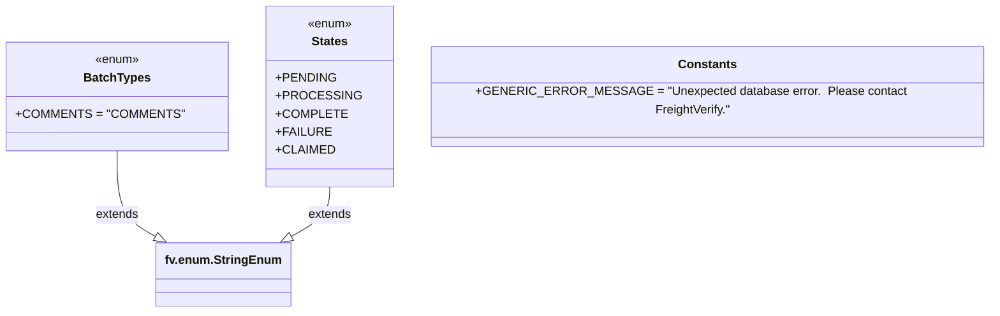

# Diagram: common/batch_service/batch_service/common/constants.py

> Auto-generated by Obscura crawlers

## Mermaid

### SVG

<svg id="container" width="1228.125" xmlns="http://www.w3.org/2000/svg" class="classDiagram" height="414" viewBox="0 0 1228.125 414" role="graphics-document document" aria-roledescription="class"><g><defs><marker id="container_class-aggregationStart" class="marker aggregation class" refX="18" refY="7" markerWidth="190" markerHeight="240" orient="auto"><path d="M 18,7 L9,13 L1,7 L9,1 Z"></path></marker></defs><defs><marker id="container_class-aggregationEnd" class="marker aggregation class" refX="1" refY="7" markerWidth="20" markerHeight="28" orient="auto"><path d="M 18,7 L9,13 L1,7 L9,1 Z"></path></marker></defs><defs><marker id="container_class-extensionStart" class="marker extension class" refX="18" refY="7" markerWidth="190" markerHeight="240" orient="auto"><path d="M 1,7 L18,13 V 1 Z"></path></marker></defs><defs><marker id="container_class-extensionEnd" class="marker extension class" refX="1" refY="7" markerWidth="20" markerHeight="28" orient="auto"><path d="M 1,1 V 13 L18,7 Z"></path></marker></defs><defs><marker id="container_class-compositionStart" class="marker composition class" refX="18" refY="7" markerWidth="190" markerHeight="240" orient="auto"><path d="M 18,7 L9,13 L1,7 L9,1 Z"></path></marker></defs><defs><marker id="container_class-compositionEnd" class="marker composition class" refX="1" refY="7" markerWidth="20" markerHeight="28" orient="auto"><path d="M 18,7 L9,13 L1,7 L9,1 Z"></path></marker></defs><defs><marker id="container_class-dependencyStart" class="marker dependency class" refX="6" refY="7" markerWidth="190" markerHeight="240" orient="auto"><path d="M 5,7 L9,13 L1,7 L9,1 Z"></path></marker></defs><defs><marker id="container_class-dependencyEnd" class="marker dependency class" refX="13" refY="7" markerWidth="20" markerHeight="28" orient="auto"><path d="M 18,7 L9,13 L14,7 L9,1 Z"></path></marker></defs><defs><marker id="container_class-lollipopStart" class="marker lollipop class" refX="13" refY="7" markerWidth="190" markerHeight="240" orient="auto"><circle stroke="black" fill="transparent" cx="7" cy="7" r="6"></circle></marker></defs><defs><marker id="container_class-lollipopEnd" class="marker lollipop class" refX="1" refY="7" markerWidth="190" markerHeight="240" orient="auto"><circle stroke="black" fill="transparent" cx="7" cy="7" r="6"></circle></marker></defs><g class="root"><g class="clusters"></g><g class="edgePaths"><path d="M140.152,200L140.152,214.167C140.152,228.333,140.152,256.667,147.772,275.499C155.391,294.331,170.63,303.661,178.249,308.327L185.869,312.992" id="id_BatchTypes_fv.enum.StringEnum_1" class="edge-thickness-normal edge-pattern-solid relation" style=";;;" data-edge="true" data-et="edge" data-id="id_BatchTypes_fv.enum.StringEnum_1" data-points="W3sieCI6MTQwLjE1MjM0Mzc1LCJ5IjoyMDB9LHsieCI6MTQwLjE1MjM0Mzc1LCJ5IjoyODV9LHsieCI6MjAwLjU4MDEyNzU3MTIwMjUyLCJ5IjozMjJ9XQ==" marker-end="url(#container_class-extensionEnd)"></path><path d="M398.195,248L398.195,254.167C398.195,260.333,398.195,272.667,390.576,283.499C382.956,294.331,367.718,303.661,360.098,308.327L352.479,312.992" id="id_States_fv.enum.StringEnum_2" class="edge-thickness-normal edge-pattern-solid relation" style=";;;" data-edge="true" data-et="edge" data-id="id_States_fv.enum.StringEnum_2" data-points="W3sieCI6Mzk4LjE5NTMxMjUsInkiOjI0OH0seyJ4IjozOTguMTk1MzEyNSwieSI6Mjg1fSx7IngiOjMzNy43Njc1Mjg2Nzg3OTc1LCJ5IjozMjJ9XQ==" marker-end="url(#container_class-extensionEnd)"></path></g><g class="edgeLabels"><g class="edgeLabel" transform="translate(140.15234375, 285)"><g class="label" data-id="id_BatchTypes_fv.enum.StringEnum_1" transform="translate(-28.5078125, -12)"><foreignObject width="57.015625" height="24">

extends

</foreignObject></g></g><g class="edgeLabel" transform="translate(398.1953125, 285)"><g class="label" data-id="id_States_fv.enum.StringEnum_2" transform="translate(-28.5078125, -12)"><foreignObject width="57.015625" height="24">

extends

</foreignObject></g></g></g><g class="nodes"><g class="node default" id="classId-BatchTypes-0" transform="translate(140.15234375, 128)"><g class="basic label-container"><path d="M-132.15234375 -72 L132.15234375 -72 L132.15234375 72 L-132.15234375 72" stroke="none" stroke-width="0" fill="#ECECFF" style=""></path><path d="M-132.15234375 -72 C-31.591121337695014 -72, 68.97010107460997 -72, 132.15234375 -72 M-132.15234375 -72 C-28.51405702951955 -72, 75.1242296909609 -72, 132.15234375 -72 M132.15234375 -72 C132.15234375 -37.97884731749966, 132.15234375 -3.9576946349993136, 132.15234375 72 M132.15234375 -72 C132.15234375 -36.77521732931934, 132.15234375 -1.5504346586386788, 132.15234375 72 M132.15234375 72 C53.930304613476025 72, -24.29173452304795 72, -132.15234375 72 M132.15234375 72 C68.92829131141869 72, 5.704238872837365 72, -132.15234375 72 M-132.15234375 72 C-132.15234375 39.29311448833395, -132.15234375 6.586228976667897, -132.15234375 -72 M-132.15234375 72 C-132.15234375 21.438141329213657, -132.15234375 -29.123717341572686, -132.15234375 -72" stroke="#9370DB" stroke-width="1.3" fill="none" stroke-dasharray="0 0" style=""></path></g><g class="annotation-group text" transform="translate(-29.53125, -48)"><g class="label" style="" transform="translate(0,-12)"><foreignObject width="59.0625" height="24">

«enum»

</foreignObject></g></g><g class="label-group text" transform="translate(-41.9140625, -24)"><g class="label" style="font-weight: bolder" transform="translate(0,-12)"><foreignObject width="83.828125" height="24">

BatchTypes

</foreignObject></g></g><g class="members-group text" transform="translate(-120.15234375, 24)"><g class="label" style="" transform="translate(0,-12)"><foreignObject width="198.390625" height="24">

+COMMENTS = "COMMENTS"

</foreignObject></g></g><g class="methods-group text" transform="translate(-120.15234375, 72)"></g><g class="divider" style=""><path d="M-132.15234375 0 C-48.15172406248949 0, 35.848895625021015 0, 132.15234375 0 M-132.15234375 0 C-31.612607123732957 0, 68.92712950253409 0, 132.15234375 0" stroke="#9370DB" stroke-width="1.3" fill="none" stroke-dasharray="0 0" style=""></path></g><g class="divider" style=""><path d="M-132.15234375 48 C-66.30305427592874 48, -0.45376480185748846 48, 132.15234375 48 M-132.15234375 48 C-67.914745567243 48, -3.6771473844860054 48, 132.15234375 48" stroke="#9370DB" stroke-width="1.3" fill="none" stroke-dasharray="0 0" style=""></path></g></g><g class="node default" id="classId-States-1" transform="translate(398.1953125, 128)"><g class="basic label-container"><path d="M-75.890625 -120 L75.890625 -120 L75.890625 120 L-75.890625 120" stroke="none" stroke-width="0" fill="#ECECFF" style=""></path><path d="M-75.890625 -120 C-16.77671931953833 -120, 42.33718636092334 -120, 75.890625 -120 M-75.890625 -120 C-38.43994966048455 -120, -0.989274320969102 -120, 75.890625 -120 M75.890625 -120 C75.890625 -46.68372735759783, 75.890625 26.632545284804337, 75.890625 120 M75.890625 -120 C75.890625 -71.94685357769983, 75.890625 -23.893707155399653, 75.890625 120 M75.890625 120 C34.15750543946736 120, -7.575614121065286 120, -75.890625 120 M75.890625 120 C31.651588789418746 120, -12.587447421162508 120, -75.890625 120 M-75.890625 120 C-75.890625 52.4461529052039, -75.890625 -15.107694189592195, -75.890625 -120 M-75.890625 120 C-75.890625 62.79284335759356, -75.890625 5.585686715187123, -75.890625 -120" stroke="#9370DB" stroke-width="1.3" fill="none" stroke-dasharray="0 0" style=""></path></g><g class="annotation-group text" transform="translate(-29.53125, -96)"><g class="label" style="" transform="translate(0,-12)"><foreignObject width="59.0625" height="24">

«enum»

</foreignObject></g></g><g class="label-group text" transform="translate(-23.1796875, -72)"><g class="label" style="font-weight: bolder" transform="translate(0,-12)"><foreignObject width="46.359375" height="24">

States

</foreignObject></g></g><g class="members-group text" transform="translate(-63.890625, -24)"><g class="label" style="" transform="translate(0,-12)"><foreignObject width="72.828125" height="24">

+PENDING

</foreignObject></g><g class="label" style="" transform="translate(0,12)"><foreignObject width="98.25" height="24">

+PROCESSING

</foreignObject></g><g class="label" style="" transform="translate(0,36)"><foreignObject width="82.703125" height="24">

+COMPLETE

</foreignObject></g><g class="label" style="" transform="translate(0,60)"><foreignObject width="65.34375" height="24">

+FAILURE

</foreignObject></g><g class="label" style="" transform="translate(0,84)"><foreignObject width="70.125" height="24">

+CLAIMED

</foreignObject></g></g><g class="methods-group text" transform="translate(-63.890625, 120)"></g><g class="divider" style=""><path d="M-75.890625 -48 C-39.80977978389434 -48, -3.7289345677886843 -48, 75.890625 -48 M-75.890625 -48 C-29.772128418421076 -48, 16.346368163157848 -48, 75.890625 -48" stroke="#9370DB" stroke-width="1.3" fill="none" stroke-dasharray="0 0" style=""></path></g><g class="divider" style=""><path d="M-75.890625 96 C-33.444843374509475 96, 9.00093825098105 96, 75.890625 96 M-75.890625 96 C-41.89214482424994 96, -7.893664648499879 96, 75.890625 96" stroke="#9370DB" stroke-width="1.3" fill="none" stroke-dasharray="0 0" style=""></path></g></g><g class="node default" id="classId-Constants-2" transform="translate(872.10546875, 128)"><g class="basic label-container"><path d="M-348.01953125 -60 L348.01953125 -60 L348.01953125 60 L-348.01953125 60" stroke="none" stroke-width="0" fill="#ECECFF" style=""></path><path d="M-348.01953125 -60 C-162.21976351730856 -60, 23.58000421538287 -60, 348.01953125 -60 M-348.01953125 -60 C-128.35414300084716 -60, 91.31124524830568 -60, 348.01953125 -60 M348.01953125 -60 C348.01953125 -31.923360169296004, 348.01953125 -3.8467203385920072, 348.01953125 60 M348.01953125 -60 C348.01953125 -23.85017200488521, 348.01953125 12.299655990229581, 348.01953125 60 M348.01953125 60 C169.86466051096457 60, -8.290210228070862 60, -348.01953125 60 M348.01953125 60 C81.33566037199085 60, -185.3482105060183 60, -348.01953125 60 M-348.01953125 60 C-348.01953125 33.04924715265625, -348.01953125 6.098494305312499, -348.01953125 -60 M-348.01953125 60 C-348.01953125 31.831251386638034, -348.01953125 3.662502773276067, -348.01953125 -60" stroke="#9370DB" stroke-width="1.3" fill="none" stroke-dasharray="0 0" style=""></path></g><g class="annotation-group text" transform="translate(0, -36)"></g><g class="label-group text" transform="translate(-36.5390625, -36)"><g class="label" style="font-weight: bolder" transform="translate(0,-12)"><foreignObject width="73.078125" height="24">

Constants

</foreignObject></g></g><g class="members-group text" transform="translate(-336.01953125, 12)"><g class="label" style="" transform="translate(0,-12)"><foreignObject width="635.5" height="24">

+GENERIC_ERROR_MESSAGE = "Unexpected database error.  Please contact FreightVerify."

</foreignObject></g></g><g class="methods-group text" transform="translate(-336.01953125, 60)"></g><g class="divider" style=""><path d="M-348.01953125 -12 C-86.34940105429195 -12, 175.3207291414161 -12, 348.01953125 -12 M-348.01953125 -12 C-84.38053580140797 -12, 179.25845964718405 -12, 348.01953125 -12" stroke="#9370DB" stroke-width="1.3" fill="none" stroke-dasharray="0 0" style=""></path></g><g class="divider" style=""><path d="M-348.01953125 36 C-91.18075054680548 36, 165.65803015638903 36, 348.01953125 36 M-348.01953125 36 C-143.44441452170275 36, 61.13070220659449 36, 348.01953125 36" stroke="#9370DB" stroke-width="1.3" fill="none" stroke-dasharray="0 0" style=""></path></g></g><g class="node default" id="classId-fv.enum.StringEnum-3" transform="translate(269.173828125, 364)"><g class="basic label-container"><path d="M-84.9921875 -42 L84.9921875 -42 L84.9921875 42 L-84.9921875 42" stroke="none" stroke-width="0" fill="#ECECFF" style=""></path><path d="M-84.9921875 -42 C-48.53428606105152 -42, -12.076384622103035 -42, 84.9921875 -42 M-84.9921875 -42 C-50.09692916235654 -42, -15.201670824713077 -42, 84.9921875 -42 M84.9921875 -42 C84.9921875 -12.215190945918597, 84.9921875 17.569618108162807, 84.9921875 42 M84.9921875 -42 C84.9921875 -18.249803990753566, 84.9921875 5.500392018492867, 84.9921875 42 M84.9921875 42 C49.29490576398064 42, 13.597624027961274 42, -84.9921875 42 M84.9921875 42 C20.374999719577957 42, -44.242188060844086 42, -84.9921875 42 M-84.9921875 42 C-84.9921875 21.9980804857572, -84.9921875 1.9961609715143993, -84.9921875 -42 M-84.9921875 42 C-84.9921875 10.76240749463544, -84.9921875 -20.47518501072912, -84.9921875 -42" stroke="#9370DB" stroke-width="1.3" fill="none" stroke-dasharray="0 0" style=""></path></g><g class="annotation-group text" transform="translate(0, -18)"></g><g class="label-group text" transform="translate(-72.9921875, -18)"><g class="label" style="font-weight: bolder" transform="translate(0,-12)"><foreignObject width="145.984375" height="24">

fv.enum.StringEnum

</foreignObject></g></g><g class="members-group text" transform="translate(-72.9921875, 30)"></g><g class="methods-group text" transform="translate(-72.9921875, 60)"></g><g class="divider" style=""><path d="M-84.9921875 6 C-49.51144362078451 6, -14.030699741569023 6, 84.9921875 6 M-84.9921875 6 C-26.582049718820628 6, 31.828088062358745 6, 84.9921875 6" stroke="#9370DB" stroke-width="1.3" fill="none" stroke-dasharray="0 0" style=""></path></g><g class="divider" style=""><path d="M-84.9921875 24 C-41.919104411361424 24, 1.153978677277152 24, 84.9921875 24 M-84.9921875 24 C-19.423803566435367 24, 46.144580367129265 24, 84.9921875 24" stroke="#9370DB" stroke-width="1.3" fill="none" stroke-dasharray="0 0" style=""></path></g></g></g></g></g></svg>
