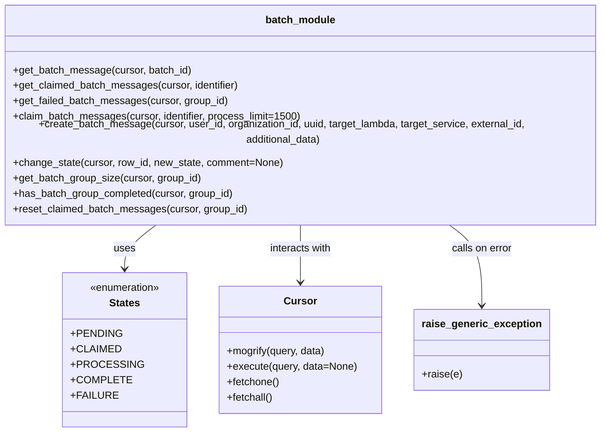
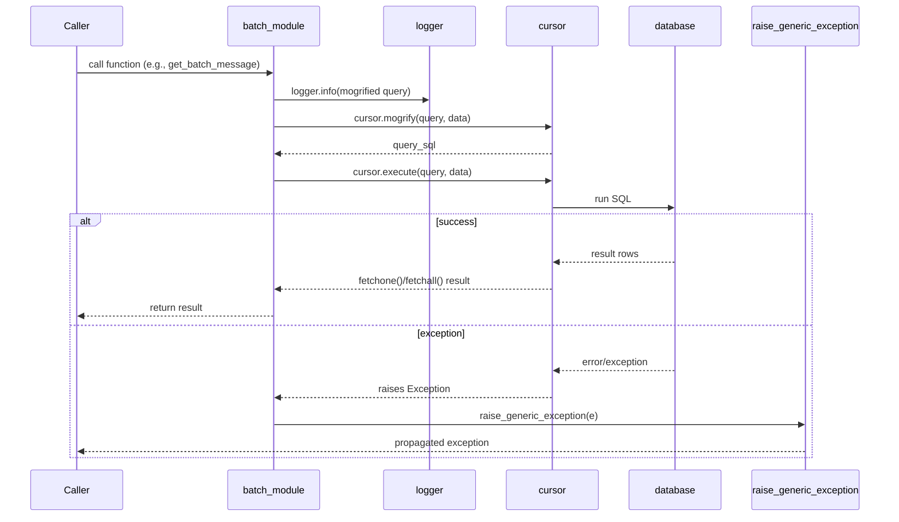

# Diagram: common/batch_service/batch_service/db/batch_request.py

> Auto-generated by Obscura crawlers

## Diagram 1

### SVG

<svg id="container" width="978.6484375" xmlns="http://www.w3.org/2000/svg" class="classDiagram" height="648" viewBox="0 0 978.6484375 648" role="graphics-document document" aria-roledescription="class"><g><defs><marker id="container_class-aggregationStart" class="marker aggregation class" refX="18" refY="7" markerWidth="190" markerHeight="240" orient="auto"><path d="M 18,7 L9,13 L1,7 L9,1 Z"></path></marker></defs><defs><marker id="container_class-aggregationEnd" class="marker aggregation class" refX="1" refY="7" markerWidth="20" markerHeight="28" orient="auto"><path d="M 18,7 L9,13 L1,7 L9,1 Z"></path></marker></defs><defs><marker id="container_class-extensionStart" class="marker extension class" refX="18" refY="7" markerWidth="190" markerHeight="240" orient="auto"><path d="M 1,7 L18,13 V 1 Z"></path></marker></defs><defs><marker id="container_class-extensionEnd" class="marker extension class" refX="1" refY="7" markerWidth="20" markerHeight="28" orient="auto"><path d="M 1,1 V 13 L18,7 Z"></path></marker></defs><defs><marker id="container_class-compositionStart" class="marker composition class" refX="18" refY="7" markerWidth="190" markerHeight="240" orient="auto"><path d="M 18,7 L9,13 L1,7 L9,1 Z"></path></marker></defs><defs><marker id="container_class-compositionEnd" class="marker composition class" refX="1" refY="7" markerWidth="20" markerHeight="28" orient="auto"><path d="M 18,7 L9,13 L1,7 L9,1 Z"></path></marker></defs><defs><marker id="container_class-dependencyStart" class="marker dependency class" refX="6" refY="7" markerWidth="190" markerHeight="240" orient="auto"><path d="M 5,7 L9,13 L1,7 L9,1 Z"></path></marker></defs><defs><marker id="container_class-dependencyEnd" class="marker dependency class" refX="13" refY="7" markerWidth="20" markerHeight="28" orient="auto"><path d="M 18,7 L9,13 L14,7 L9,1 Z"></path></marker></defs><defs><marker id="container_class-lollipopStart" class="marker lollipop class" refX="13" refY="7" markerWidth="190" markerHeight="240" orient="auto"><circle stroke="black" fill="transparent" cx="7" cy="7" r="6"></circle></marker></defs><defs><marker id="container_class-lollipopEnd" class="marker lollipop class" refX="1" refY="7" markerWidth="190" markerHeight="240" orient="auto"><circle stroke="black" fill="transparent" cx="7" cy="7" r="6"></circle></marker></defs><g class="root"><g class="clusters"></g><g class="edgePaths"><path d="M275.107,326L266.799,332.167C258.491,338.333,241.874,350.667,233.566,362C225.258,373.333,225.258,383.667,225.258,388.833L225.258,394" id="id_batch_module_States_1" class="edge-thickness-normal edge-pattern-solid relation" style=";;;" data-edge="true" data-et="edge" data-id="id_batch_module_States_1" data-points="W3sieCI6Mjc1LjEwNzA4MzA2NzYwMjA1LCJ5IjozMjZ9LHsieCI6MjI1LjI1NzgxMjUsInkiOjM2M30seyJ4IjoyMjUuMjU3ODEyNSwieSI6NDAwfV0=" marker-end="url(#container_class-dependencyEnd)"></path><path d="M489.324,326L489.324,332.167C489.324,338.333,489.324,350.667,489.324,365.5C489.324,380.333,489.324,397.667,489.324,406.333L489.324,415" id="id_batch_module_Cursor_2" class="edge-thickness-normal edge-pattern-solid relation" style=";;;" data-edge="true" data-et="edge" data-id="id_batch_module_Cursor_2" data-points="W3sieCI6NDg5LjMyNDIxODc1LCJ5IjozMjZ9LHsieCI6NDg5LjMyNDIxODc1LCJ5IjozNjN9LHsieCI6NDg5LjMyNDIxODc1LCJ5Ijo0MjF9XQ==" marker-end="url(#container_class-dependencyEnd)"></path><path d="M713.159,326L721.84,332.167C730.521,338.333,747.884,350.667,756.565,371.5C765.246,392.333,765.246,421.667,765.246,436.333L765.246,451" id="id_batch_module_raise_generic_exception_3" class="edge-thickness-normal edge-pattern-solid relation" style=";;;" data-edge="true" data-et="edge" data-id="id_batch_module_raise_generic_exception_3" data-points="W3sieCI6NzEzLjE1ODgwMTAyMDQwODIsInkiOjMyNn0seyJ4Ijo3NjUuMjQ2MDkzNzUsInkiOjM2M30seyJ4Ijo3NjUuMjQ2MDkzNzUsInkiOjQ1N31d" marker-end="url(#container_class-dependencyEnd)"></path></g><g class="edgeLabels"><g class="edgeLabel" transform="translate(225.2578125, 363)"><g class="label" data-id="id_batch_module_States_1" transform="translate(-16.4921875, -12)"><foreignObject width="32.984375" height="24">

uses

</foreignObject></g></g><g class="edgeLabel" transform="translate(489.32421875, 363)"><g class="label" data-id="id_batch_module_Cursor_2" transform="translate(-49.375, -12)"><foreignObject width="98.75" height="24">

interacts with

</foreignObject></g></g><g class="edgeLabel" transform="translate(765.24609375, 363)"><g class="label" data-id="id_batch_module_raise_generic_exception_3" transform="translate(-48.1015625, -12)"><foreignObject width="96.203125" height="24">

calls on error

</foreignObject></g></g></g><g class="nodes"><g class="node default" id="classId-batch_module-0" transform="translate(489.32421875, 167)"><g class="basic label-container"><path d="M-481.32421875 -159 L481.32421875 -159 L481.32421875 159 L-481.32421875 159" stroke="none" stroke-width="0" fill="#ECECFF" style=""></path><path d="M-481.32421875 -159 C-127.31118680558279 -159, 226.70184513883441 -159, 481.32421875 -159 M-481.32421875 -159 C-246.48400217645113 -159, -11.643785602902256 -159, 481.32421875 -159 M481.32421875 -159 C481.32421875 -62.23451495924195, 481.32421875 34.5309700815161, 481.32421875 159 M481.32421875 -159 C481.32421875 -94.70770628308617, 481.32421875 -30.415412566172336, 481.32421875 159 M481.32421875 159 C138.84391398768037 159, -203.63639077463927 159, -481.32421875 159 M481.32421875 159 C249.73017475336732 159, 18.136130756734644 159, -481.32421875 159 M-481.32421875 159 C-481.32421875 90.97241960230643, -481.32421875 22.94483920461286, -481.32421875 -159 M-481.32421875 159 C-481.32421875 53.79693847314688, -481.32421875 -51.40612305370624, -481.32421875 -159" stroke="#9370DB" stroke-width="1.3" fill="none" stroke-dasharray="0 0" style=""></path></g><g class="annotation-group text" transform="translate(0, -135)"></g><g class="label-group text" transform="translate(-52.1953125, -135)"><g class="label" style="font-weight: bolder" transform="translate(0,-12)"><foreignObject width="104.390625" height="24">

batch_module

</foreignObject></g></g><g class="members-group text" transform="translate(-469.32421875, -87)"></g><g class="methods-group text" transform="translate(-469.32421875, -57)"><g class="label" style="" transform="translate(0,-12)"><foreignObject width="276.09375" height="24">

+get_batch_message(cursor, batch_id)

</foreignObject></g><g class="label" style="" transform="translate(0,12)"><foreignObject width="352.578125" height="24">

+get_claimed_batch_messages(cursor, identifier)

</foreignObject></g><g class="label" style="" transform="translate(0,36)"><foreignObject width="333.921875" height="24">

+get_failed_batch_messages(cursor, group_id)

</foreignObject></g><g class="label" style="" transform="translate(0,60)"><foreignObject width="447.4375" height="24">

+claim_batch_messages(cursor, identifier, process_limit=1500)

</foreignObject></g><g class="label" style="" transform="translate(0,84)"><foreignObject width="886.453125" height="24">

+create_batch_message(cursor, user_id, organization_id, uuid, target_lambda, target_service, external_id, additional_data)

</foreignObject></g><g class="label" style="" transform="translate(0,108)"><foreignObject width="419.46875" height="24">

+change_state(cursor, row_id, new_state, comment=None)

</foreignObject></g><g class="label" style="" transform="translate(0,132)"><foreignObject width="292.859375" height="24">

+get_batch_group_size(cursor, group_id)

</foreignObject></g><g class="label" style="" transform="translate(0,156)"><foreignObject width="344.5" height="24">

+has_batch_group_completed(cursor, group_id)

</foreignObject></g><g class="label" style="" transform="translate(0,180)"><foreignObject width="364.109375" height="24">

+reset_claimed_batch_messages(cursor, group_id)

</foreignObject></g></g><g class="divider" style=""><path d="M-481.32421875 -111 C-143.9094671069211 -111, 193.50528453615777 -111, 481.32421875 -111 M-481.32421875 -111 C-136.64533366046538 -111, 208.03355142906923 -111, 481.32421875 -111" stroke="#9370DB" stroke-width="1.3" fill="none" stroke-dasharray="0 0" style=""></path></g><g class="divider" style=""><path d="M-481.32421875 -87 C-283.028335197529 -87, -84.73245164505795 -87, 481.32421875 -87 M-481.32421875 -87 C-143.97906167072267 -87, 193.36609540855466 -87, 481.32421875 -87" stroke="#9370DB" stroke-width="1.3" fill="none" stroke-dasharray="0 0" style=""></path></g></g><g class="node default" id="classId-States-1" transform="translate(225.2578125, 520)"><g class="basic label-container"><path d="M-88.90234375 -120 L88.90234375 -120 L88.90234375 120 L-88.90234375 120" stroke="none" stroke-width="0" fill="#ECECFF" style=""></path><path d="M-88.90234375 -120 C-22.36478955815315 -120, 44.1727646336937 -120, 88.90234375 -120 M-88.90234375 -120 C-42.04247512320631 -120, 4.8173935035873825 -120, 88.90234375 -120 M88.90234375 -120 C88.90234375 -33.09942917827763, 88.90234375 53.80114164344474, 88.90234375 120 M88.90234375 -120 C88.90234375 -47.35346378480841, 88.90234375 25.293072430383177, 88.90234375 120 M88.90234375 120 C19.276998601909824 120, -50.34834654618035 120, -88.90234375 120 M88.90234375 120 C23.960246116871815 120, -40.98185151625637 120, -88.90234375 120 M-88.90234375 120 C-88.90234375 70.6340589992956, -88.90234375 21.268117998591208, -88.90234375 -120 M-88.90234375 120 C-88.90234375 59.92095610785033, -88.90234375 -0.15808778429934023, -88.90234375 -120" stroke="#9370DB" stroke-width="1.3" fill="none" stroke-dasharray="0 0" style=""></path></g><g class="annotation-group text" transform="translate(-55.5546875, -96)"><g class="label" style="" transform="translate(0,-12)"><foreignObject width="111.109375" height="24">

«enumeration»

</foreignObject></g></g><g class="label-group text" transform="translate(-23.1796875, -72)"><g class="label" style="font-weight: bolder" transform="translate(0,-12)"><foreignObject width="46.359375" height="24">

States

</foreignObject></g></g><g class="members-group text" transform="translate(-76.90234375, -24)"><g class="label" style="" transform="translate(0,-12)"><foreignObject width="72.828125" height="24">

+PENDING

</foreignObject></g><g class="label" style="" transform="translate(0,12)"><foreignObject width="70.125" height="24">

+CLAIMED

</foreignObject></g><g class="label" style="" transform="translate(0,36)"><foreignObject width="98.25" height="24">

+PROCESSING

</foreignObject></g><g class="label" style="" transform="translate(0,60)"><foreignObject width="82.703125" height="24">

+COMPLETE

</foreignObject></g><g class="label" style="" transform="translate(0,84)"><foreignObject width="65.34375" height="24">

+FAILURE

</foreignObject></g></g><g class="methods-group text" transform="translate(-76.90234375, 120)"></g><g class="divider" style=""><path d="M-88.90234375 -48 C-21.730594041933585 -48, 45.44115566613283 -48, 88.90234375 -48 M-88.90234375 -48 C-43.05664867238423 -48, 2.789046405231545 -48, 88.90234375 -48" stroke="#9370DB" stroke-width="1.3" fill="none" stroke-dasharray="0 0" style=""></path></g><g class="divider" style=""><path d="M-88.90234375 96 C-23.17090038320093 96, 42.56054298359814 96, 88.90234375 96 M-88.90234375 96 C-27.637058375024978 96, 33.628226999950044 96, 88.90234375 96" stroke="#9370DB" stroke-width="1.3" fill="none" stroke-dasharray="0 0" style=""></path></g></g><g class="node default" id="classId-Cursor-2" transform="translate(489.32421875, 520)"><g class="basic label-container"><path d="M-125.1640625 -99 L125.1640625 -99 L125.1640625 99 L-125.1640625 99" stroke="none" stroke-width="0" fill="#ECECFF" style=""></path><path d="M-125.1640625 -99 C-71.20409533697185 -99, -17.244128173943707 -99, 125.1640625 -99 M-125.1640625 -99 C-66.17806610048437 -99, -7.192069700968744 -99, 125.1640625 -99 M125.1640625 -99 C125.1640625 -20.06645936324614, 125.1640625 58.86708127350772, 125.1640625 99 M125.1640625 -99 C125.1640625 -58.75080655970094, 125.1640625 -18.50161311940188, 125.1640625 99 M125.1640625 99 C54.70697413922639 99, -15.750114221547221 99, -125.1640625 99 M125.1640625 99 C71.64462056220411 99, 18.12517862440822 99, -125.1640625 99 M-125.1640625 99 C-125.1640625 44.33328442568083, -125.1640625 -10.33343114863834, -125.1640625 -99 M-125.1640625 99 C-125.1640625 27.992925026284723, -125.1640625 -43.01414994743055, -125.1640625 -99" stroke="#9370DB" stroke-width="1.3" fill="none" stroke-dasharray="0 0" style=""></path></g><g class="annotation-group text" transform="translate(0, -75)"></g><g class="label-group text" transform="translate(-23.90625, -75)"><g class="label" style="font-weight: bolder" transform="translate(0,-12)"><foreignObject width="47.8125" height="24">

Cursor

</foreignObject></g></g><g class="members-group text" transform="translate(-113.1640625, -27)"></g><g class="methods-group text" transform="translate(-113.1640625, 3)"><g class="label" style="" transform="translate(0,-12)"><foreignObject width="155.390625" height="24">

+mogrify(query, data)

</foreignObject></g><g class="label" style="" transform="translate(0,12)"><foreignObject width="202.421875" height="24">

+execute(query, data=None)

</foreignObject></g><g class="label" style="" transform="translate(0,36)"><foreignObject width="82.046875" height="24">

+fetchone()

</foreignObject></g><g class="label" style="" transform="translate(0,60)"><foreignObject width="72.515625" height="24">

+fetchall()

</foreignObject></g></g><g class="divider" style=""><path d="M-125.1640625 -51 C-41.46466523008962 -51, 42.234732039820756 -51, 125.1640625 -51 M-125.1640625 -51 C-43.611549940110464 -51, 37.94096261977907 -51, 125.1640625 -51" stroke="#9370DB" stroke-width="1.3" fill="none" stroke-dasharray="0 0" style=""></path></g><g class="divider" style=""><path d="M-125.1640625 -27 C-71.1962444573926 -27, -17.228426414785204 -27, 125.1640625 -27 M-125.1640625 -27 C-59.68829139776233 -27, 5.787479704475345 -27, 125.1640625 -27" stroke="#9370DB" stroke-width="1.3" fill="none" stroke-dasharray="0 0" style=""></path></g></g><g class="node default" id="classId-raise_generic_exception-3" transform="translate(765.24609375, 520)"><g class="basic label-container"><path d="M-100.7578125 -63 L100.7578125 -63 L100.7578125 63 L-100.7578125 63" stroke="none" stroke-width="0" fill="#ECECFF" style=""></path><path d="M-100.7578125 -63 C-52.86583611242799 -63, -4.973859724855984 -63, 100.7578125 -63 M-100.7578125 -63 C-44.40657121021474 -63, 11.944670079570514 -63, 100.7578125 -63 M100.7578125 -63 C100.7578125 -36.203104806672805, 100.7578125 -9.40620961334561, 100.7578125 63 M100.7578125 -63 C100.7578125 -28.7423950548866, 100.7578125 5.515209890226799, 100.7578125 63 M100.7578125 63 C50.415882396814176 63, 0.0739522936283521 63, -100.7578125 63 M100.7578125 63 C44.221946907723215 63, -12.31391868455357 63, -100.7578125 63 M-100.7578125 63 C-100.7578125 25.2758848418744, -100.7578125 -12.448230316251198, -100.7578125 -63 M-100.7578125 63 C-100.7578125 20.697071777797504, -100.7578125 -21.605856444404992, -100.7578125 -63" stroke="#9370DB" stroke-width="1.3" fill="none" stroke-dasharray="0 0" style=""></path></g><g class="annotation-group text" transform="translate(0, -39)"></g><g class="label-group text" transform="translate(-88.7578125, -39)"><g class="label" style="font-weight: bolder" transform="translate(0,-12)"><foreignObject width="177.515625" height="24">

raise_generic_exception

</foreignObject></g></g><g class="members-group text" transform="translate(-88.7578125, 9)"></g><g class="methods-group text" transform="translate(-88.7578125, 39)"><g class="label" style="" transform="translate(0,-12)"><foreignObject width="62.109375" height="24">

+raise(e)

</foreignObject></g></g><g class="divider" style=""><path d="M-100.7578125 -15 C-41.568797619589056 -15, 17.62021726082189 -15, 100.7578125 -15 M-100.7578125 -15 C-44.02509503865582 -15, 12.70762242268836 -15, 100.7578125 -15" stroke="#9370DB" stroke-width="1.3" fill="none" stroke-dasharray="0 0" style=""></path></g><g class="divider" style=""><path d="M-100.7578125 9 C-23.440647731170827 9, 53.876517037658346 9, 100.7578125 9 M-100.7578125 9 C-59.386377850136384 9, -18.014943200272768 9, 100.7578125 9" stroke="#9370DB" stroke-width="1.3" fill="none" stroke-dasharray="0 0" style=""></path></g></g></g></g></g></svg>

## Diagram 2

### SVG

<svg id="container" width="1517" xmlns="http://www.w3.org/2000/svg" height="895" viewBox="-50 -10 1517 895" role="graphics-document document" aria-roledescription="sequence"><g><rect x="1222" y="809" fill="#eaeaea" stroke="#666" width="195" height="65" name="ErrorHandler" rx="3" ry="3" class="actor actor-bottom"></rect><text x="1319.5" y="841.5" dominant-baseline="central" alignment-baseline="central" class="actor actor-box" style="text-anchor: middle; font-size: 16px; font-weight: 400;"><tspan x="1319.5" dy="0">raise_generic_exception</tspan></text></g><g><rect x="1022" y="809" fill="#eaeaea" stroke="#666" width="150" height="65" name="DB" rx="3" ry="3" class="actor actor-bottom"></rect><text x="1097" y="841.5" dominant-baseline="central" alignment-baseline="central" class="actor actor-box" style="text-anchor: middle; font-size: 16px; font-weight: 400;"><tspan x="1097" dy="0">database</tspan></text></g><g><rect x="822" y="809" fill="#eaeaea" stroke="#666" width="150" height="65" name="Cursor" rx="3" ry="3" class="actor actor-bottom"></rect><text x="897" y="841.5" dominant-baseline="central" alignment-baseline="central" class="actor actor-box" style="text-anchor: middle; font-size: 16px; font-weight: 400;"><tspan x="897" dy="0">cursor</tspan></text></g><g><rect x="622" y="809" fill="#eaeaea" stroke="#666" width="150" height="65" name="Logger" rx="3" ry="3" class="actor actor-bottom"></rect><text x="697" y="841.5" dominant-baseline="central" alignment-baseline="central" class="actor actor-box" style="text-anchor: middle; font-size: 16px; font-weight: 400;"><tspan x="697" dy="0">logger</tspan></text></g><g><rect x="350" y="809" fill="#eaeaea" stroke="#666" width="150" height="65" name="Module" rx="3" ry="3" class="actor actor-bottom"></rect><text x="425" y="841.5" dominant-baseline="central" alignment-baseline="central" class="actor actor-box" style="text-anchor: middle; font-size: 16px; font-weight: 400;"><tspan x="425" dy="0">batch_module</tspan></text></g><g><rect x="0" y="809" fill="#eaeaea" stroke="#666" width="150" height="65" name="Caller" rx="3" ry="3" class="actor actor-bottom"></rect><text x="75" y="841.5" dominant-baseline="central" alignment-baseline="central" class="actor actor-box" style="text-anchor: middle; font-size: 16px; font-weight: 400;"><tspan x="75" dy="0">Caller</tspan></text></g><g><line id="actor5" x1="1319.5" y1="65" x2="1319.5" y2="809" class="actor-line 200" stroke-width="0.5px" stroke="#999" name="ErrorHandler"></line><g id="root-5"><rect x="1222" y="0" fill="#eaeaea" stroke="#666" width="195" height="65" name="ErrorHandler" rx="3" ry="3" class="actor actor-top"></rect><text x="1319.5" y="32.5" dominant-baseline="central" alignment-baseline="central" class="actor actor-box" style="text-anchor: middle; font-size: 16px; font-weight: 400;"><tspan x="1319.5" dy="0">raise_generic_exception</tspan></text></g></g><g><line id="actor4" x1="1097" y1="65" x2="1097" y2="809" class="actor-line 200" stroke-width="0.5px" stroke="#999" name="DB"></line><g id="root-4"><rect x="1022" y="0" fill="#eaeaea" stroke="#666" width="150" height="65" name="DB" rx="3" ry="3" class="actor actor-top"></rect><text x="1097" y="32.5" dominant-baseline="central" alignment-baseline="central" class="actor actor-box" style="text-anchor: middle; font-size: 16px; font-weight: 400;"><tspan x="1097" dy="0">database</tspan></text></g></g><g><line id="actor3" x1="897" y1="65" x2="897" y2="809" class="actor-line 200" stroke-width="0.5px" stroke="#999" name="Cursor"></line><g id="root-3"><rect x="822" y="0" fill="#eaeaea" stroke="#666" width="150" height="65" name="Cursor" rx="3" ry="3" class="actor actor-top"></rect><text x="897" y="32.5" dominant-baseline="central" alignment-baseline="central" class="actor actor-box" style="text-anchor: middle; font-size: 16px; font-weight: 400;"><tspan x="897" dy="0">cursor</tspan></text></g></g><g><line id="actor2" x1="697" y1="65" x2="697" y2="809" class="actor-line 200" stroke-width="0.5px" stroke="#999" name="Logger"></line><g id="root-2"><rect x="622" y="0" fill="#eaeaea" stroke="#666" width="150" height="65" name="Logger" rx="3" ry="3" class="actor actor-top"></rect><text x="697" y="32.5" dominant-baseline="central" alignment-baseline="central" class="actor actor-box" style="text-anchor: middle; font-size: 16px; font-weight: 400;"><tspan x="697" dy="0">logger</tspan></text></g></g><g><line id="actor1" x1="425" y1="65" x2="425" y2="809" class="actor-line 200" stroke-width="0.5px" stroke="#999" name="Module"></line><g id="root-1"><rect x="350" y="0" fill="#eaeaea" stroke="#666" width="150" height="65" name="Module" rx="3" ry="3" class="actor actor-top"></rect><text x="425" y="32.5" dominant-baseline="central" alignment-baseline="central" class="actor actor-box" style="text-anchor: middle; font-size: 16px; font-weight: 400;"><tspan x="425" dy="0">batch_module</tspan></text></g></g><g><line id="actor0" x1="75" y1="65" x2="75" y2="809" class="actor-line 200" stroke-width="0.5px" stroke="#999" name="Caller"></line><g id="root-0"><rect x="0" y="0" fill="#eaeaea" stroke="#666" width="150" height="65" name="Caller" rx="3" ry="3" class="actor actor-top"></rect><text x="75" y="32.5" dominant-baseline="central" alignment-baseline="central" class="actor actor-box" style="text-anchor: middle; font-size: 16px; font-weight: 400;"><tspan x="75" dy="0">Caller</tspan></text></g></g><g></g><defs><symbol id="computer" width="24" height="24"><path transform="scale(.5)" d="M2 2v13h20v-13h-20zm18 11h-16v-9h16v9zm-10.228 6l.466-1h3.524l.467 1h-4.457zm14.228 3h-24l2-6h2.104l-1.33 4h18.45l-1.297-4h2.073l2 6zm-5-10h-14v-7h14v7z"></path></symbol></defs><defs><symbol id="database" fill-rule="evenodd" clip-rule="evenodd"><path transform="scale(.5)" d="M12.258.001l.256.004.255.005.253.008.251.01.249.012.247.015.246.016.242.019.241.02.239.023.236.024.233.027.231.028.229.031.225.032.223.034.22.036.217.038.214.04.211.041.208.043.205.045.201.046.198.048.194.05.191.051.187.053.183.054.18.056.175.057.172.059.168.06.163.061.16.063.155.064.15.066.074.033.073.033.071.034.07.034.069.035.068.035.067.035.066.035.064.036.064.036.062.036.06.036.06.037.058.037.058.037.055.038.055.038.053.038.052.038.051.039.05.039.048.039.047.039.045.04.044.04.043.04.041.04.04.041.039.041.037.041.036.041.034.041.033.042.032.042.03.042.029.042.027.042.026.043.024.043.023.043.021.043.02.043.018.044.017.043.015.044.013.044.012.044.011.045.009.044.007.045.006.045.004.045.002.045.001.045v17l-.001.045-.002.045-.004.045-.006.045-.007.045-.009.044-.011.045-.012.044-.013.044-.015.044-.017.043-.018.044-.02.043-.021.043-.023.043-.024.043-.026.043-.027.042-.029.042-.03.042-.032.042-.033.042-.034.041-.036.041-.037.041-.039.041-.04.041-.041.04-.043.04-.044.04-.045.04-.047.039-.048.039-.05.039-.051.039-.052.038-.053.038-.055.038-.055.038-.058.037-.058.037-.06.037-.06.036-.062.036-.064.036-.064.036-.066.035-.067.035-.068.035-.069.035-.07.034-.071.034-.073.033-.074.033-.15.066-.155.064-.16.063-.163.061-.168.06-.172.059-.175.057-.18.056-.183.054-.187.053-.191.051-.194.05-.198.048-.201.046-.205.045-.208.043-.211.041-.214.04-.217.038-.22.036-.223.034-.225.032-.229.031-.231.028-.233.027-.236.024-.239.023-.241.02-.242.019-.246.016-.247.015-.249.012-.251.01-.253.008-.255.005-.256.004-.258.001-.258-.001-.256-.004-.255-.005-.253-.008-.251-.01-.249-.012-.247-.015-.245-.016-.243-.019-.241-.02-.238-.023-.236-.024-.234-.027-.231-.028-.228-.031-.226-.032-.223-.034-.22-.036-.217-.038-.214-.04-.211-.041-.208-.043-.204-.045-.201-.046-.198-.048-.195-.05-.19-.051-.187-.053-.184-.054-.179-.056-.176-.057-.172-.059-.167-.06-.164-.061-.159-.063-.155-.064-.151-.066-.074-.033-.072-.033-.072-.034-.07-.034-.069-.035-.068-.035-.067-.035-.066-.035-.064-.036-.063-.036-.062-.036-.061-.036-.06-.037-.058-.037-.057-.037-.056-.038-.055-.038-.053-.038-.052-.038-.051-.039-.049-.039-.049-.039-.046-.039-.046-.04-.044-.04-.043-.04-.041-.04-.04-.041-.039-.041-.037-.041-.036-.041-.034-.041-.033-.042-.032-.042-.03-.042-.029-.042-.027-.042-.026-.043-.024-.043-.023-.043-.021-.043-.02-.043-.018-.044-.017-.043-.015-.044-.013-.044-.012-.044-.011-.045-.009-.044-.007-.045-.006-.045-.004-.045-.002-.045-.001-.045v-17l.001-.045.002-.045.004-.045.006-.045.007-.045.009-.044.011-.045.012-.044.013-.044.015-.044.017-.043.018-.044.02-.043.021-.043.023-.043.024-.043.026-.043.027-.042.029-.042.03-.042.032-.042.033-.042.034-.041.036-.041.037-.041.039-.041.04-.041.041-.04.043-.04.044-.04.046-.04.046-.039.049-.039.049-.039.051-.039.052-.038.053-.038.055-.038.056-.038.057-.037.058-.037.06-.037.061-.036.062-.036.063-.036.064-.036.066-.035.067-.035.068-.035.069-.035.07-.034.072-.034.072-.033.074-.033.151-.066.155-.064.159-.063.164-.061.167-.06.172-.059.176-.057.179-.056.184-.054.187-.053.19-.051.195-.05.198-.048.201-.046.204-.045.208-.043.211-.041.214-.04.217-.038.22-.036.223-.034.226-.032.228-.031.231-.028.234-.027.236-.024.238-.023.241-.02.243-.019.245-.016.247-.015.249-.012.251-.01.253-.008.255-.005.256-.004.258-.001.258.001zm-9.258 20.499v.01l.001.021.003.021.004.022.005.021.006.022.007.022.009.023.01.022.011.023.012.023.013.023.015.023.016.024.017.023.018.024.019.024.021.024.022.025.023.024.024.025.052.049.056.05.061.051.066.051.07.051.075.051.079.052.084.052.088.052.092.052.097.052.102.051.105.052.11.052.114.051.119.051.123.051.127.05.131.05.135.05.139.048.144.049.147.047.152.047.155.047.16.045.163.045.167.043.171.043.176.041.178.041.183.039.187.039.19.037.194.035.197.035.202.033.204.031.209.03.212.029.216.027.219.025.222.024.226.021.23.02.233.018.236.016.24.015.243.012.246.01.249.008.253.005.256.004.259.001.26-.001.257-.004.254-.005.25-.008.247-.011.244-.012.241-.014.237-.016.233-.018.231-.021.226-.021.224-.024.22-.026.216-.027.212-.028.21-.031.205-.031.202-.034.198-.034.194-.036.191-.037.187-.039.183-.04.179-.04.175-.042.172-.043.168-.044.163-.045.16-.046.155-.046.152-.047.148-.048.143-.049.139-.049.136-.05.131-.05.126-.05.123-.051.118-.052.114-.051.11-.052.106-.052.101-.052.096-.052.092-.052.088-.053.083-.051.079-.052.074-.052.07-.051.065-.051.06-.051.056-.05.051-.05.023-.024.023-.025.021-.024.02-.024.019-.024.018-.024.017-.024.015-.023.014-.024.013-.023.012-.023.01-.023.01-.022.008-.022.006-.022.006-.022.004-.022.004-.021.001-.021.001-.021v-4.127l-.077.055-.08.053-.083.054-.085.053-.087.052-.09.052-.093.051-.095.05-.097.05-.1.049-.102.049-.105.048-.106.047-.109.047-.111.046-.114.045-.115.045-.118.044-.12.043-.122.042-.124.042-.126.041-.128.04-.13.04-.132.038-.134.038-.135.037-.138.037-.139.035-.142.035-.143.034-.144.033-.147.032-.148.031-.15.03-.151.03-.153.029-.154.027-.156.027-.158.026-.159.025-.161.024-.162.023-.163.022-.165.021-.166.02-.167.019-.169.018-.169.017-.171.016-.173.015-.173.014-.175.013-.175.012-.177.011-.178.01-.179.008-.179.008-.181.006-.182.005-.182.004-.184.003-.184.002h-.37l-.184-.002-.184-.003-.182-.004-.182-.005-.181-.006-.179-.008-.179-.008-.178-.01-.176-.011-.176-.012-.175-.013-.173-.014-.172-.015-.171-.016-.17-.017-.169-.018-.167-.019-.166-.02-.165-.021-.163-.022-.162-.023-.161-.024-.159-.025-.157-.026-.156-.027-.155-.027-.153-.029-.151-.03-.15-.03-.148-.031-.146-.032-.145-.033-.143-.034-.141-.035-.14-.035-.137-.037-.136-.037-.134-.038-.132-.038-.13-.04-.128-.04-.126-.041-.124-.042-.122-.042-.12-.044-.117-.043-.116-.045-.113-.045-.112-.046-.109-.047-.106-.047-.105-.048-.102-.049-.1-.049-.097-.05-.095-.05-.093-.052-.09-.051-.087-.052-.085-.053-.083-.054-.08-.054-.077-.054v4.127zm0-5.654v.011l.001.021.003.021.004.021.005.022.006.022.007.022.009.022.01.022.011.023.012.023.013.023.015.024.016.023.017.024.018.024.019.024.021.024.022.024.023.025.024.024.052.05.056.05.061.05.066.051.07.051.075.052.079.051.084.052.088.052.092.052.097.052.102.052.105.052.11.051.114.051.119.052.123.05.127.051.131.05.135.049.139.049.144.048.147.048.152.047.155.046.16.045.163.045.167.044.171.042.176.042.178.04.183.04.187.038.19.037.194.036.197.034.202.033.204.032.209.03.212.028.216.027.219.025.222.024.226.022.23.02.233.018.236.016.24.014.243.012.246.01.249.008.253.006.256.003.259.001.26-.001.257-.003.254-.006.25-.008.247-.01.244-.012.241-.015.237-.016.233-.018.231-.02.226-.022.224-.024.22-.025.216-.027.212-.029.21-.03.205-.032.202-.033.198-.035.194-.036.191-.037.187-.039.183-.039.179-.041.175-.042.172-.043.168-.044.163-.045.16-.045.155-.047.152-.047.148-.048.143-.048.139-.05.136-.049.131-.05.126-.051.123-.051.118-.051.114-.052.11-.052.106-.052.101-.052.096-.052.092-.052.088-.052.083-.052.079-.052.074-.051.07-.052.065-.051.06-.05.056-.051.051-.049.023-.025.023-.024.021-.025.02-.024.019-.024.018-.024.017-.024.015-.023.014-.023.013-.024.012-.022.01-.023.01-.023.008-.022.006-.022.006-.022.004-.021.004-.022.001-.021.001-.021v-4.139l-.077.054-.08.054-.083.054-.085.052-.087.053-.09.051-.093.051-.095.051-.097.05-.1.049-.102.049-.105.048-.106.047-.109.047-.111.046-.114.045-.115.044-.118.044-.12.044-.122.042-.124.042-.126.041-.128.04-.13.039-.132.039-.134.038-.135.037-.138.036-.139.036-.142.035-.143.033-.144.033-.147.033-.148.031-.15.03-.151.03-.153.028-.154.028-.156.027-.158.026-.159.025-.161.024-.162.023-.163.022-.165.021-.166.02-.167.019-.169.018-.169.017-.171.016-.173.015-.173.014-.175.013-.175.012-.177.011-.178.009-.179.009-.179.007-.181.007-.182.005-.182.004-.184.003-.184.002h-.37l-.184-.002-.184-.003-.182-.004-.182-.005-.181-.007-.179-.007-.179-.009-.178-.009-.176-.011-.176-.012-.175-.013-.173-.014-.172-.015-.171-.016-.17-.017-.169-.018-.167-.019-.166-.02-.165-.021-.163-.022-.162-.023-.161-.024-.159-.025-.157-.026-.156-.027-.155-.028-.153-.028-.151-.03-.15-.03-.148-.031-.146-.033-.145-.033-.143-.033-.141-.035-.14-.036-.137-.036-.136-.037-.134-.038-.132-.039-.13-.039-.128-.04-.126-.041-.124-.042-.122-.043-.12-.043-.117-.044-.116-.044-.113-.046-.112-.046-.109-.046-.106-.047-.105-.048-.102-.049-.1-.049-.097-.05-.095-.051-.093-.051-.09-.051-.087-.053-.085-.052-.083-.054-.08-.054-.077-.054v4.139zm0-5.666v.011l.001.02.003.022.004.021.005.022.006.021.007.022.009.023.01.022.011.023.012.023.013.023.015.023.016.024.017.024.018.023.019.024.021.025.022.024.023.024.024.025.052.05.056.05.061.05.066.051.07.051.075.052.079.051.084.052.088.052.092.052.097.052.102.052.105.051.11.052.114.051.119.051.123.051.127.05.131.05.135.05.139.049.144.048.147.048.152.047.155.046.16.045.163.045.167.043.171.043.176.042.178.04.183.04.187.038.19.037.194.036.197.034.202.033.204.032.209.03.212.028.216.027.219.025.222.024.226.021.23.02.233.018.236.017.24.014.243.012.246.01.249.008.253.006.256.003.259.001.26-.001.257-.003.254-.006.25-.008.247-.01.244-.013.241-.014.237-.016.233-.018.231-.02.226-.022.224-.024.22-.025.216-.027.212-.029.21-.03.205-.032.202-.033.198-.035.194-.036.191-.037.187-.039.183-.039.179-.041.175-.042.172-.043.168-.044.163-.045.16-.045.155-.047.152-.047.148-.048.143-.049.139-.049.136-.049.131-.051.126-.05.123-.051.118-.052.114-.051.11-.052.106-.052.101-.052.096-.052.092-.052.088-.052.083-.052.079-.052.074-.052.07-.051.065-.051.06-.051.056-.05.051-.049.023-.025.023-.025.021-.024.02-.024.019-.024.018-.024.017-.024.015-.023.014-.024.013-.023.012-.023.01-.022.01-.023.008-.022.006-.022.006-.022.004-.022.004-.021.001-.021.001-.021v-4.153l-.077.054-.08.054-.083.053-.085.053-.087.053-.09.051-.093.051-.095.051-.097.05-.1.049-.102.048-.105.048-.106.048-.109.046-.111.046-.114.046-.115.044-.118.044-.12.043-.122.043-.124.042-.126.041-.128.04-.13.039-.132.039-.134.038-.135.037-.138.036-.139.036-.142.034-.143.034-.144.033-.147.032-.148.032-.15.03-.151.03-.153.028-.154.028-.156.027-.158.026-.159.024-.161.024-.162.023-.163.023-.165.021-.166.02-.167.019-.169.018-.169.017-.171.016-.173.015-.173.014-.175.013-.175.012-.177.01-.178.01-.179.009-.179.007-.181.006-.182.006-.182.004-.184.003-.184.001-.185.001-.185-.001-.184-.001-.184-.003-.182-.004-.182-.006-.181-.006-.179-.007-.179-.009-.178-.01-.176-.01-.176-.012-.175-.013-.173-.014-.172-.015-.171-.016-.17-.017-.169-.018-.167-.019-.166-.02-.165-.021-.163-.023-.162-.023-.161-.024-.159-.024-.157-.026-.156-.027-.155-.028-.153-.028-.151-.03-.15-.03-.148-.032-.146-.032-.145-.033-.143-.034-.141-.034-.14-.036-.137-.036-.136-.037-.134-.038-.132-.039-.13-.039-.128-.041-.126-.041-.124-.041-.122-.043-.12-.043-.117-.044-.116-.044-.113-.046-.112-.046-.109-.046-.106-.048-.105-.048-.102-.048-.1-.05-.097-.049-.095-.051-.093-.051-.09-.052-.087-.052-.085-.053-.083-.053-.08-.054-.077-.054v4.153zm8.74-8.179l-.257.004-.254.005-.25.008-.247.011-.244.012-.241.014-.237.016-.233.018-.231.021-.226.022-.224.023-.22.026-.216.027-.212.028-.21.031-.205.032-.202.033-.198.034-.194.036-.191.038-.187.038-.183.04-.179.041-.175.042-.172.043-.168.043-.163.045-.16.046-.155.046-.152.048-.148.048-.143.048-.139.049-.136.05-.131.05-.126.051-.123.051-.118.051-.114.052-.11.052-.106.052-.101.052-.096.052-.092.052-.088.052-.083.052-.079.052-.074.051-.07.052-.065.051-.06.05-.056.05-.051.05-.023.025-.023.024-.021.024-.02.025-.019.024-.018.024-.017.023-.015.024-.014.023-.013.023-.012.023-.01.023-.01.022-.008.022-.006.023-.006.021-.004.022-.004.021-.001.021-.001.021.001.021.001.021.004.021.004.022.006.021.006.023.008.022.01.022.01.023.012.023.013.023.014.023.015.024.017.023.018.024.019.024.02.025.021.024.023.024.023.025.051.05.056.05.06.05.065.051.07.052.074.051.079.052.083.052.088.052.092.052.096.052.101.052.106.052.11.052.114.052.118.051.123.051.126.051.131.05.136.05.139.049.143.048.148.048.152.048.155.046.16.046.163.045.168.043.172.043.175.042.179.041.183.04.187.038.191.038.194.036.198.034.202.033.205.032.21.031.212.028.216.027.22.026.224.023.226.022.231.021.233.018.237.016.241.014.244.012.247.011.25.008.254.005.257.004.26.001.26-.001.257-.004.254-.005.25-.008.247-.011.244-.012.241-.014.237-.016.233-.018.231-.021.226-.022.224-.023.22-.026.216-.027.212-.028.21-.031.205-.032.202-.033.198-.034.194-.036.191-.038.187-.038.183-.04.179-.041.175-.042.172-.043.168-.043.163-.045.16-.046.155-.046.152-.048.148-.048.143-.048.139-.049.136-.05.131-.05.126-.051.123-.051.118-.051.114-.052.11-.052.106-.052.101-.052.096-.052.092-.052.088-.052.083-.052.079-.052.074-.051.07-.052.065-.051.06-.05.056-.05.051-.05.023-.025.023-.024.021-.024.02-.025.019-.024.018-.024.017-.023.015-.024.014-.023.013-.023.012-.023.01-.023.01-.022.008-.022.006-.023.006-.021.004-.022.004-.021.001-.021.001-.021-.001-.021-.001-.021-.004-.021-.004-.022-.006-.021-.006-.023-.008-.022-.01-.022-.01-.023-.012-.023-.013-.023-.014-.023-.015-.024-.017-.023-.018-.024-.019-.024-.02-.025-.021-.024-.023-.024-.023-.025-.051-.05-.056-.05-.06-.05-.065-.051-.07-.052-.074-.051-.079-.052-.083-.052-.088-.052-.092-.052-.096-.052-.101-.052-.106-.052-.11-.052-.114-.052-.118-.051-.123-.051-.126-.051-.131-.05-.136-.05-.139-.049-.143-.048-.148-.048-.152-.048-.155-.046-.16-.046-.163-.045-.168-.043-.172-.043-.175-.042-.179-.041-.183-.04-.187-.038-.191-.038-.194-.036-.198-.034-.202-.033-.205-.032-.21-.031-.212-.028-.216-.027-.22-.026-.224-.023-.226-.022-.231-.021-.233-.018-.237-.016-.241-.014-.244-.012-.247-.011-.25-.008-.254-.005-.257-.004-.26-.001-.26.001z"></path></symbol></defs><defs><symbol id="clock" width="24" height="24"><path transform="scale(.5)" d="M12 2c5.514 0 10 4.486 10 10s-4.486 10-10 10-10-4.486-10-10 4.486-10 10-10zm0-2c-6.627 0-12 5.373-12 12s5.373 12 12 12 12-5.373 12-12-5.373-12-12-12zm5.848 12.459c.202.038.202.333.001.372-1.907.361-6.045 1.111-6.547 1.111-.719 0-1.301-.582-1.301-1.301 0-.512.77-5.447 1.125-7.445.034-.192.312-.181.343.014l.985 6.238 5.394 1.011z"></path></symbol></defs><defs><marker id="arrowhead" refX="7.9" refY="5" markerUnits="userSpaceOnUse" markerWidth="12" markerHeight="12" orient="auto-start-reverse"><path d="M -1 0 L 10 5 L 0 10 z"></path></marker></defs><defs><marker id="crosshead" markerWidth="15" markerHeight="8" orient="auto" refX="4" refY="4.5"><path fill="none" stroke="#000000" stroke-width="1pt" d="M 1,2 L 6,7 M 6,2 L 1,7" style="stroke-dasharray: 0, 0;"></path></marker></defs><defs><marker id="filled-head" refX="15.5" refY="7" markerWidth="20" markerHeight="28" orient="auto"><path d="M 18,7 L9,13 L14,7 L9,1 Z"></path></marker></defs><defs><marker id="sequencenumber" refX="15" refY="15" markerWidth="60" markerHeight="40" orient="auto"><circle cx="15" cy="15" r="6"></circle></marker></defs><g><line x1="64" y1="363" x2="1330.5" y2="363" class="loopLine"></line><line x1="1330.5" y1="363" x2="1330.5" y2="789" class="loopLine"></line><line x1="64" y1="789" x2="1330.5" y2="789" class="loopLine"></line><line x1="64" y1="363" x2="64" y2="789" class="loopLine"></line><line x1="64" y1="557" x2="1330.5" y2="557" class="loopLine" style="stroke-dasharray: 3, 3;"></line><polygon points="64,363 114,363 114,376 105.6,383 64,383" class="labelBox"></polygon><text x="89" y="376" text-anchor="middle" dominant-baseline="middle" alignment-baseline="middle" class="labelText" style="font-size: 16px; font-weight: 400;">alt</text><text x="722.25" y="381" text-anchor="middle" class="loopText" style="font-size: 16px; font-weight: 400;"><tspan x="722.25">[success]</tspan></text><text x="697.25" y="575" text-anchor="middle" class="loopText" style="font-size: 16px; font-weight: 400;">[exception]</text></g><text x="249" y="80" text-anchor="middle" dominant-baseline="middle" alignment-baseline="middle" class="messageText" dy="1em" style="font-size: 16px; font-weight: 400;">call function (e.g., get_batch_message)</text><line x1="76" y1="113" x2="421" y2="113" class="messageLine0" stroke-width="2" stroke="none" marker-end="url(#arrowhead)" style="fill: none;"></line><text x="560" y="128" text-anchor="middle" dominant-baseline="middle" alignment-baseline="middle" class="messageText" dy="1em" style="font-size: 16px; font-weight: 400;">logger.info(mogrified query)</text><line x1="426" y1="161" x2="693" y2="161" class="messageLine0" stroke-width="2" stroke="none" marker-end="url(#arrowhead)" style="fill: none;"></line><text x="660" y="176" text-anchor="middle" dominant-baseline="middle" alignment-baseline="middle" class="messageText" dy="1em" style="font-size: 16px; font-weight: 400;">cursor.mogrify(query, data)</text><line x1="426" y1="209" x2="893" y2="209" class="messageLine0" stroke-width="2" stroke="none" marker-end="url(#arrowhead)" style="fill: none;"></line><text x="663" y="224" text-anchor="middle" dominant-baseline="middle" alignment-baseline="middle" class="messageText" dy="1em" style="font-size: 16px; font-weight: 400;">query_sql</text><line x1="896" y1="257" x2="429" y2="257" class="messageLine1" stroke-width="2" stroke="none" marker-end="url(#arrowhead)" style="stroke-dasharray: 3, 3; fill: none;"></line><text x="660" y="272" text-anchor="middle" dominant-baseline="middle" alignment-baseline="middle" class="messageText" dy="1em" style="font-size: 16px; font-weight: 400;">cursor.execute(query, data)</text><line x1="426" y1="305" x2="893" y2="305" class="messageLine0" stroke-width="2" stroke="none" marker-end="url(#arrowhead)" style="fill: none;"></line><text x="996" y="320" text-anchor="middle" dominant-baseline="middle" alignment-baseline="middle" class="messageText" dy="1em" style="font-size: 16px; font-weight: 400;">run SQL</text><line x1="898" y1="353" x2="1093" y2="353" class="messageLine0" stroke-width="2" stroke="none" marker-end="url(#arrowhead)" style="fill: none;"></line><text x="999" y="413" text-anchor="middle" dominant-baseline="middle" alignment-baseline="middle" class="messageText" dy="1em" style="font-size: 16px; font-weight: 400;">result rows</text><line x1="1096" y1="446" x2="901" y2="446" class="messageLine1" stroke-width="2" stroke="none" marker-end="url(#arrowhead)" style="stroke-dasharray: 3, 3; fill: none;"></line><text x="663" y="461" text-anchor="middle" dominant-baseline="middle" alignment-baseline="middle" class="messageText" dy="1em" style="font-size: 16px; font-weight: 400;">fetchone()/fetchall() result</text><line x1="896" y1="494" x2="429" y2="494" class="messageLine1" stroke-width="2" stroke="none" marker-end="url(#arrowhead)" style="stroke-dasharray: 3, 3; fill: none;"></line><text x="252" y="509" text-anchor="middle" dominant-baseline="middle" alignment-baseline="middle" class="messageText" dy="1em" style="font-size: 16px; font-weight: 400;">return result</text><line x1="424" y1="542" x2="79" y2="542" class="messageLine1" stroke-width="2" stroke="none" marker-end="url(#arrowhead)" style="stroke-dasharray: 3, 3; fill: none;"></line><text x="999" y="602" text-anchor="middle" dominant-baseline="middle" alignment-baseline="middle" class="messageText" dy="1em" style="font-size: 16px; font-weight: 400;">error/exception</text><line x1="1096" y1="635" x2="901" y2="635" class="messageLine1" stroke-width="2" stroke="none" marker-end="url(#arrowhead)" style="stroke-dasharray: 3, 3; fill: none;"></line><text x="663" y="650" text-anchor="middle" dominant-baseline="middle" alignment-baseline="middle" class="messageText" dy="1em" style="font-size: 16px; font-weight: 400;">raises Exception</text><line x1="896" y1="683" x2="429" y2="683" class="messageLine1" stroke-width="2" stroke="none" marker-end="url(#arrowhead)" style="stroke-dasharray: 3, 3; fill: none;"></line><text x="871" y="698" text-anchor="middle" dominant-baseline="middle" alignment-baseline="middle" class="messageText" dy="1em" style="font-size: 16px; font-weight: 400;">raise_generic_exception(e)</text><line x1="426" y1="731" x2="1315.5" y2="731" class="messageLine0" stroke-width="2" stroke="none" marker-end="url(#arrowhead)" style="fill: none;"></line><text x="699" y="746" text-anchor="middle" dominant-baseline="middle" alignment-baseline="middle" class="messageText" dy="1em" style="font-size: 16px; font-weight: 400;">propagated exception</text><line x1="1318.5" y1="779" x2="79" y2="779" class="messageLine1" stroke-width="2" stroke="none" marker-end="url(#arrowhead)" style="stroke-dasharray: 3, 3; fill: none;"></line></svg>
