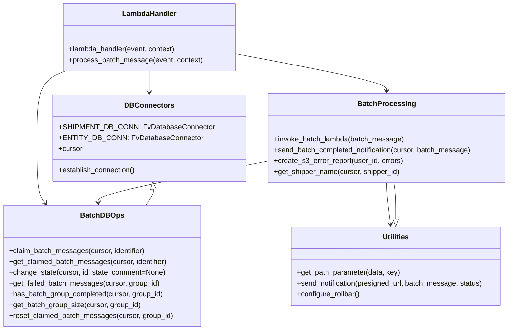

# Diagram: common/batch_service/batch_service/process_batch_messages.py


> Auto-generated by Obscura crawlers

## Diagram 1

```mermaid
flowchart TD
  A[lambda_handler] -->|calls| B[process_batch_message]
  B --> C[establish DB connection]
  B --> D[claim_batch_messages]
  D --> E[get_claimed_batch_messages]
  E --> F{for each batch_message}
  F --> G[change_state -> PROCESSING]
  G --> H[invoke_batch_lambda]
  H --> I{status_code}
  I -->|200/201| J[change_state -> COMPLETE]
  I -->|404| K[get_shipper_name -> compose comment]
  I -->|400| L[compose BAD_REQUEST comment]
  I -->|other| M[compose generic failure comment]
  K --> N[change_state -> FAILURE]
  L --> N
  M --> N
  J --> O[send_batch_completed_notification]
  N --> O
  O --> P{has_batch_group_completed?}
  P -->|yes| Q[get_failed_batch_messages]
  Q --> R[create errors list]
  R --> S{errors exist?}
  S -->|yes| T[create_s3_error_report -> presigned_url]
  T --> U[send_notification(presigned_url, status)]
  S -->|no| U
  P -->|no| V[no notification sent]
  B --> W[exception handling -> change_state failure & reset_claimed_batch_messages]
```

> SVG rendering failed for this diagram.

## Diagram 2



### SVG

<svg id="container" width="1105.04296875" xmlns="http://www.w3.org/2000/svg" class="classDiagram" height="734" viewBox="0 0 1105.04296875 734" role="graphics-document document" aria-roledescription="class"><style>#container{font-family:"trebuchet ms",verdana,arial,sans-serif;font-size:16px;fill:#333;}@keyframes edge-animation-frame{from{stroke-dashoffset:0;}}@keyframes dash{to{stroke-dashoffset:0;}}#container .edge-animation-slow{stroke-dasharray:9,5!important;stroke-dashoffset:900;animation:dash 50s linear infinite;stroke-linecap:round;}#container .edge-animation-fast{stroke-dasharray:9,5!important;stroke-dashoffset:900;animation:dash 20s linear infinite;stroke-linecap:round;}#container .error-icon{fill:#552222;}#container .error-text{fill:#552222;stroke:#552222;}#container .edge-thickness-normal{stroke-width:1px;}#container .edge-thickness-thick{stroke-width:3.5px;}#container .edge-pattern-solid{stroke-dasharray:0;}#container .edge-thickness-invisible{stroke-width:0;fill:none;}#container .edge-pattern-dashed{stroke-dasharray:3;}#container .edge-pattern-dotted{stroke-dasharray:2;}#container .marker{fill:#333333;stroke:#333333;}#container .marker.cross{stroke:#333333;}#container svg{font-family:"trebuchet ms",verdana,arial,sans-serif;font-size:16px;}#container p{margin:0;}#container g.classGroup text{fill:#9370DB;stroke:none;font-family:"trebuchet ms",verdana,arial,sans-serif;font-size:10px;}#container g.classGroup text .title{font-weight:bolder;}#container .nodeLabel,#container .edgeLabel{color:#131300;}#container .edgeLabel .label rect{fill:#ECECFF;}#container .label text{fill:#131300;}#container .labelBkg{background:#ECECFF;}#container .edgeLabel .label span{background:#ECECFF;}#container .classTitle{font-weight:bolder;}#container .node rect,#container .node circle,#container .node ellipse,#container .node polygon,#container .node path{fill:#ECECFF;stroke:#9370DB;stroke-width:1px;}#container .divider{stroke:#9370DB;stroke-width:1;}#container g.clickable{cursor:pointer;}#container g.classGroup rect{fill:#ECECFF;stroke:#9370DB;}#container g.classGroup line{stroke:#9370DB;stroke-width:1;}#container .classLabel .box{stroke:none;stroke-width:0;fill:#ECECFF;opacity:0.5;}#container .classLabel .label{fill:#9370DB;font-size:10px;}#container .relation{stroke:#333333;stroke-width:1;fill:none;}#container .dashed-line{stroke-dasharray:3;}#container .dotted-line{stroke-dasharray:1 2;}#container #compositionStart,#container .composition{fill:#333333!important;stroke:#333333!important;stroke-width:1;}#container #compositionEnd,#container .composition{fill:#333333!important;stroke:#333333!important;stroke-width:1;}#container #dependencyStart,#container .dependency{fill:#333333!important;stroke:#333333!important;stroke-width:1;}#container #dependencyStart,#container .dependency{fill:#333333!important;stroke:#333333!important;stroke-width:1;}#container #extensionStart,#container .extension{fill:transparent!important;stroke:#333333!important;stroke-width:1;}#container #extensionEnd,#container .extension{fill:transparent!important;stroke:#333333!important;stroke-width:1;}#container #aggregationStart,#container .aggregation{fill:transparent!important;stroke:#333333!important;stroke-width:1;}#container #aggregationEnd,#container .aggregation{fill:transparent!important;stroke:#333333!important;stroke-width:1;}#container #lollipopStart,#container .lollipop{fill:#ECECFF!important;stroke:#333333!important;stroke-width:1;}#container #lollipopEnd,#container .lollipop{fill:#ECECFF!important;stroke:#333333!important;stroke-width:1;}#container .edgeTerminals{font-size:11px;line-height:initial;}#container .classTitleText{text-anchor:middle;font-size:18px;fill:#333;}#container .label-icon{display:inline-block;height:1em;overflow:visible;vertical-align:-0.125em;}#container .node .label-icon path{fill:currentColor;stroke:revert;stroke-width:revert;}#container :root{--mermaid-font-family:"trebuchet ms",verdana,arial,sans-serif;}</style><g><defs><marker id="container_class-aggregationStart" class="marker aggregation class" refX="18" refY="7" markerWidth="190" markerHeight="240" orient="auto"><path d="M 18,7 L9,13 L1,7 L9,1 Z"></path></marker></defs><defs><marker id="container_class-aggregationEnd" class="marker aggregation class" refX="1" refY="7" markerWidth="20" markerHeight="28" orient="auto"><path d="M 18,7 L9,13 L1,7 L9,1 Z"></path></marker></defs><defs><marker id="container_class-extensionStart" class="marker extension class" refX="18" refY="7" markerWidth="190" markerHeight="240" orient="auto"><path d="M 1,7 L18,13 V 1 Z"></path></marker></defs><defs><marker id="container_class-extensionEnd" class="marker extension class" refX="1" refY="7" markerWidth="20" markerHeight="28" orient="auto"><path d="M 1,1 V 13 L18,7 Z"></path></marker></defs><defs><marker id="container_class-compositionStart" class="marker composition class" refX="18" refY="7" markerWidth="190" markerHeight="240" orient="auto"><path d="M 18,7 L9,13 L1,7 L9,1 Z"></path></marker></defs><defs><marker id="container_class-compositionEnd" class="marker composition class" refX="1" refY="7" markerWidth="20" markerHeight="28" orient="auto"><path d="M 18,7 L9,13 L1,7 L9,1 Z"></path></marker></defs><defs><marker id="container_class-dependencyStart" class="marker dependency class" refX="6" refY="7" markerWidth="190" markerHeight="240" orient="auto"><path d="M 5,7 L9,13 L1,7 L9,1 Z"></path></marker></defs><defs><marker id="container_class-dependencyEnd" class="marker dependency class" refX="13" refY="7" markerWidth="20" markerHeight="28" orient="auto"><path d="M 18,7 L9,13 L14,7 L9,1 Z"></path></marker></defs><defs><marker id="container_class-lollipopStart" class="marker lollipop class" refX="13" refY="7" markerWidth="190" markerHeight="240" orient="auto"><circle stroke="black" fill="transparent" cx="7" cy="7" r="6"></circle></marker></defs><defs><marker id="container_class-lollipopEnd" class="marker lollipop class" refX="1" refY="7" markerWidth="190" markerHeight="240" orient="auto"><circle stroke="black" fill="transparent" cx="7" cy="7" r="6"></circle></marker></defs><g class="root"><g class="clusters"></g><g class="edgePaths"><path d="M321.371,158L321.371,162.167C321.371,166.333,321.371,174.667,321.371,182.5C321.371,190.333,321.371,197.667,321.371,201.333L321.371,205" id="id_LambdaHandler_DBConnectors_1" class="edge-thickness-normal edge-pattern-solid relation" style=";;;" data-edge="true" data-et="edge" data-id="id_LambdaHandler_DBConnectors_1" data-points="W3sieCI6MzIxLjM3MTA5Mzc1LCJ5IjoxNTh9LHsieCI6MzIxLjM3MTA5Mzc1LCJ5IjoxODN9LHsieCI6MzIxLjM3MTA5Mzc1LCJ5IjoyMTF9XQ==" marker-end="url(#container_class-dependencyEnd)"></path><path d="M510.09,119.849L563.993,130.374C617.896,140.9,725.702,161.95,779.605,175.642C833.508,189.333,833.508,195.667,833.508,198.833L833.508,202" id="id_LambdaHandler_BatchProcessing_2" class="edge-thickness-normal edge-pattern-solid relation" style=";;;" data-edge="true" data-et="edge" data-id="id_LambdaHandler_BatchProcessing_2" data-points="W3sieCI6NTEwLjA4OTg0Mzc1LCJ5IjoxMTkuODQ5MjkxMDM3MDkxODN9LHsieCI6ODMzLjUwNzgxMjUsInkiOjE4M30seyJ4Ijo4MzMuNTA3ODEyNSwieSI6MjA4fV0=" marker-end="url(#container_class-dependencyEnd)"></path><path d="M146.17,158L136.437,162.167C126.703,166.333,107.236,174.667,97.503,199.5C87.77,224.333,87.77,265.667,87.77,307C87.77,348.333,87.77,389.667,90.682,413.74C93.595,437.813,99.42,444.626,102.333,448.033L105.246,451.44" id="id_LambdaHandler_BatchDBOps_3" class="edge-thickness-normal edge-pattern-solid relation" style=";;;" data-edge="true" data-et="edge" data-id="id_LambdaHandler_BatchDBOps_3" data-points="W3sieCI6MTQ2LjE2OTkyMTg3NSwieSI6MTU4fSx7IngiOjg3Ljc2OTUzMTI1LCJ5IjoxODN9LHsieCI6ODcuNzY5NTMxMjUsInkiOjMwN30seyJ4Ijo4Ny43Njk1MzEyNSwieSI6NDMxfSx7IngiOjEwOS4xNDQ2NTMzMjAzMTI1LCJ5Ijo0NTZ9XQ==" marker-end="url(#container_class-dependencyEnd)"></path><path d="M569.973,359.798L510.739,371.665C451.505,383.532,333.038,407.266,274.002,422.302C214.966,437.337,215.362,443.674,215.561,446.843L215.759,450.012" id="id_BatchProcessing_BatchDBOps_4" class="edge-thickness-normal edge-pattern-solid relation" style=";;;" data-edge="true" data-et="edge" data-id="id_BatchProcessing_BatchDBOps_4" data-points="W3sieCI6NTY5Ljk3MjY1NjI1LCJ5IjozNTkuNzk3NTEwODU1Mjk2Mzd9LHsieCI6MjE0LjU3MDMxMjUsInkiOjQzMX0seyJ4IjoyMTYuMTMyODEyNSwieSI6NDU2fV0=" marker-end="url(#container_class-dependencyEnd)"></path><path d="M833.508,406L833.508,410.167C833.508,414.333,833.508,422.667,834.905,438.008C836.301,453.349,839.095,475.698,840.492,486.872L841.889,498.046" id="id_BatchProcessing_Utilities_5" class="edge-thickness-normal edge-pattern-solid relation" style=";;;" data-edge="true" data-et="edge" data-id="id_BatchProcessing_Utilities_5" data-points="W3sieCI6ODMzLjUwNzgxMjUsInkiOjQwNn0seyJ4Ijo4MzMuNTA3ODEyNSwieSI6NDMxfSx7IngiOjg0Mi42MzI4MTI1LCJ5Ijo1MDR9XQ==" marker-end="url(#container_class-dependencyEnd)"></path><path d="M330.5,420.194L330.645,421.995C330.79,423.796,331.081,427.398,328.445,433.366C325.809,439.333,320.246,447.667,317.465,451.833L314.683,456" id="id_DBConnectors_BatchDBOps_6" class="edge-thickness-normal edge-pattern-solid relation" style=";;;" data-edge="true" data-et="edge" data-id="id_DBConnectors_BatchDBOps_6" data-points="W3sieCI6MzI5LjExMzAyOTIzMzg3MSwieSI6NDAzfSx7IngiOjMzMS4zNzEwOTM3NSwieSI6NDMxfSx7IngiOjMxNC42ODM0NzE2Nzk2ODc1LCJ5Ijo0NTZ9XQ==" marker-start="url(#container_class-extensionStart)"></path><path d="M853.508,486.75L853.508,477.458C853.508,468.167,853.508,449.583,852.836,436.125C852.164,422.667,850.82,414.333,850.148,410.167L849.476,406" id="id_Utilities_BatchProcessing_7" class="edge-thickness-normal edge-pattern-solid relation" style=";;;" data-edge="true" data-et="edge" data-id="id_Utilities_BatchProcessing_7" data-points="W3sieCI6ODUzLjUwNzgxMjUsInkiOjUwNH0seyJ4Ijo4NTMuNTA3ODEyNSwieSI6NDMxfSx7IngiOjg0OS40NzU1NTQ0MzU0ODM5LCJ5Ijo0MDZ9XQ==" marker-start="url(#container_class-extensionStart)"></path></g><g class="edgeLabels"><g class="edgeLabel"><g class="label" data-id="id_LambdaHandler_DBConnectors_1" transform="translate(0, 0)"><foreignObject width="0" height="0"><div xmlns="http://www.w3.org/1999/xhtml" class="labelBkg" style="display: table-cell; white-space: nowrap; line-height: 1.5; max-width: 200px; text-align: center;"><span class="edgeLabel"></span></div></foreignObject></g></g><g class="edgeLabel"><g class="label" data-id="id_LambdaHandler_BatchProcessing_2" transform="translate(0, 0)"><foreignObject width="0" height="0"><div xmlns="http://www.w3.org/1999/xhtml" class="labelBkg" style="display: table-cell; white-space: nowrap; line-height: 1.5; max-width: 200px; text-align: center;"><span class="edgeLabel"></span></div></foreignObject></g></g><g class="edgeLabel"><g class="label" data-id="id_LambdaHandler_BatchDBOps_3" transform="translate(0, 0)"><foreignObject width="0" height="0"><div xmlns="http://www.w3.org/1999/xhtml" class="labelBkg" style="display: table-cell; white-space: nowrap; line-height: 1.5; max-width: 200px; text-align: center;"><span class="edgeLabel"></span></div></foreignObject></g></g><g class="edgeLabel"><g class="label" data-id="id_BatchProcessing_BatchDBOps_4" transform="translate(0, 0)"><foreignObject width="0" height="0"><div xmlns="http://www.w3.org/1999/xhtml" class="labelBkg" style="display: table-cell; white-space: nowrap; line-height: 1.5; max-width: 200px; text-align: center;"><span class="edgeLabel"></span></div></foreignObject></g></g><g class="edgeLabel"><g class="label" data-id="id_BatchProcessing_Utilities_5" transform="translate(0, 0)"><foreignObject width="0" height="0"><div xmlns="http://www.w3.org/1999/xhtml" class="labelBkg" style="display: table-cell; white-space: nowrap; line-height: 1.5; max-width: 200px; text-align: center;"><span class="edgeLabel"></span></div></foreignObject></g></g><g class="edgeLabel"><g class="label" data-id="id_DBConnectors_BatchDBOps_6" transform="translate(0, 0)"><foreignObject width="0" height="0"><div xmlns="http://www.w3.org/1999/xhtml" class="labelBkg" style="display: table-cell; white-space: nowrap; line-height: 1.5; max-width: 200px; text-align: center;"><span class="edgeLabel"></span></div></foreignObject></g></g><g class="edgeLabel"><g class="label" data-id="id_Utilities_BatchProcessing_7" transform="translate(0, 0)"><foreignObject width="0" height="0"><div xmlns="http://www.w3.org/1999/xhtml" class="labelBkg" style="display: table-cell; white-space: nowrap; line-height: 1.5; max-width: 200px; text-align: center;"><span class="edgeLabel"></span></div></foreignObject></g></g></g><g class="nodes"><g class="node default" id="classId-LambdaHandler-0" transform="translate(321.37109375, 83)"><g class="basic label-container"><path d="M-188.71875 -75 L188.71875 -75 L188.71875 75 L-188.71875 75" stroke="none" stroke-width="0" fill="#ECECFF" style=""></path><path d="M-188.71875 -75 C-64.3272998001111 -75, 60.06415039977779 -75, 188.71875 -75 M-188.71875 -75 C-47.42817869601225 -75, 93.8623926079755 -75, 188.71875 -75 M188.71875 -75 C188.71875 -33.45108871184576, 188.71875 8.097822576308474, 188.71875 75 M188.71875 -75 C188.71875 -26.155697572742646, 188.71875 22.688604854514708, 188.71875 75 M188.71875 75 C86.3153633794211 75, -16.0880232411578 75, -188.71875 75 M188.71875 75 C99.02983146314364 75, 9.340912926287274 75, -188.71875 75 M-188.71875 75 C-188.71875 41.33330835723106, -188.71875 7.666616714462123, -188.71875 -75 M-188.71875 75 C-188.71875 24.064082549633525, -188.71875 -26.87183490073295, -188.71875 -75" stroke="#9370DB" stroke-width="1.3" fill="none" stroke-dasharray="0 0" style=""></path></g><g class="annotation-group text" transform="translate(0, -51)"></g><g class="label-group text" transform="translate(-58.21875, -51)"><g class="label" style="font-weight: bolder" transform="translate(0,-12)"><foreignObject width="116.4375" height="24"><div xmlns="http://www.w3.org/1999/xhtml" style="display: table-cell; white-space: nowrap; line-height: 1.5; max-width: 167px; text-align: center;"><span class="nodeLabel markdown-node-label" style=""><p>LambdaHandler</p></span></div></foreignObject></g></g><g class="members-group text" transform="translate(-176.71875, -3)"></g><g class="methods-group text" transform="translate(-176.71875, 27)"><g class="label" style="" transform="translate(0,-12)"><foreignObject width="240.1875" height="24"><div xmlns="http://www.w3.org/1999/xhtml" style="display: table-cell; white-space: nowrap; line-height: 1.5; max-width: 298px; text-align: center;"><span class="nodeLabel markdown-node-label" style=""><p>+lambda_handler(event, context)</p></span></div></foreignObject></g><g class="label" style="" transform="translate(0,12)"><foreignObject width="295.21875" height="24"><div xmlns="http://www.w3.org/1999/xhtml" style="display: table-cell; white-space: nowrap; line-height: 1.5; max-width: 353px; text-align: center;"><span class="nodeLabel markdown-node-label" style=""><p>+process_batch_message(event, context)</p></span></div></foreignObject></g></g><g class="divider" style=""><path d="M-188.71875 -27 C-76.96100263870147 -27, 34.796744722597055 -27, 188.71875 -27 M-188.71875 -27 C-101.40792591046097 -27, -14.09710182092195 -27, 188.71875 -27" stroke="#9370DB" stroke-width="1.3" fill="none" stroke-dasharray="0 0" style=""></path></g><g class="divider" style=""><path d="M-188.71875 -3 C-75.26382476071923 -3, 38.19110047856154 -3, 188.71875 -3 M-188.71875 -3 C-54.966652312822646 -3, 78.78544537435471 -3, 188.71875 -3" stroke="#9370DB" stroke-width="1.3" fill="none" stroke-dasharray="0 0" style=""></path></g></g><g class="node default" id="classId-DBConnectors-1" transform="translate(321.37109375, 307)"><g class="basic label-container"><path d="M-198.6015625 -96 L198.6015625 -96 L198.6015625 96 L-198.6015625 96" stroke="none" stroke-width="0" fill="#ECECFF" style=""></path><path d="M-198.6015625 -96 C-117.04256908521988 -96, -35.48357567043976 -96, 198.6015625 -96 M-198.6015625 -96 C-82.74637122951415 -96, 33.10882004097169 -96, 198.6015625 -96 M198.6015625 -96 C198.6015625 -51.316921021590616, 198.6015625 -6.633842043181232, 198.6015625 96 M198.6015625 -96 C198.6015625 -22.325057699152026, 198.6015625 51.34988460169595, 198.6015625 96 M198.6015625 96 C107.29148150162384 96, 15.98140050324767 96, -198.6015625 96 M198.6015625 96 C49.71951842688779 96, -99.16252564622442 96, -198.6015625 96 M-198.6015625 96 C-198.6015625 54.54382961168504, -198.6015625 13.087659223370082, -198.6015625 -96 M-198.6015625 96 C-198.6015625 21.294114316696238, -198.6015625 -53.411771366607525, -198.6015625 -96" stroke="#9370DB" stroke-width="1.3" fill="none" stroke-dasharray="0 0" style=""></path></g><g class="annotation-group text" transform="translate(0, -72)"></g><g class="label-group text" transform="translate(-51.328125, -72)"><g class="label" style="font-weight: bolder" transform="translate(0,-12)"><foreignObject width="102.65625" height="24"><div xmlns="http://www.w3.org/1999/xhtml" style="display: table-cell; white-space: nowrap; line-height: 1.5; max-width: 151px; text-align: center;"><span class="nodeLabel markdown-node-label" style=""><p>DBConnectors</p></span></div></foreignObject></g></g><g class="members-group text" transform="translate(-186.6015625, -24)"><g class="label" style="" transform="translate(0,-12)"><foreignObject width="321.875" height="24"><div xmlns="http://www.w3.org/1999/xhtml" style="display: table-cell; white-space: nowrap; line-height: 1.5; max-width: 380px; text-align: center;"><span class="nodeLabel markdown-node-label" style=""><p>+SHIPMENT_DB_CONN: FvDatabaseConnector</p></span></div></foreignObject></g><g class="label" style="" transform="translate(0,12)"><foreignObject width="298.25" height="24"><div xmlns="http://www.w3.org/1999/xhtml" style="display: table-cell; white-space: nowrap; line-height: 1.5; max-width: 356px; text-align: center;"><span class="nodeLabel markdown-node-label" style=""><p>+ENTITY_DB_CONN: FvDatabaseConnector</p></span></div></foreignObject></g><g class="label" style="" transform="translate(0,36)"><foreignObject width="53.71875" height="24"><div xmlns="http://www.w3.org/1999/xhtml" style="display: table-cell; white-space: nowrap; line-height: 1.5; max-width: 112px; text-align: center;"><span class="nodeLabel markdown-node-label" style=""><p>+cursor</p></span></div></foreignObject></g></g><g class="methods-group text" transform="translate(-186.6015625, 72)"><g class="label" style="" transform="translate(0,-12)"><foreignObject width="173.265625" height="24"><div xmlns="http://www.w3.org/1999/xhtml" style="display: table-cell; white-space: nowrap; line-height: 1.5; max-width: 231px; text-align: center;"><span class="nodeLabel markdown-node-label" style=""><p>+establish_connection()</p></span></div></foreignObject></g></g><g class="divider" style=""><path d="M-198.6015625 -48 C-73.94451271099759 -48, 50.71253707800483 -48, 198.6015625 -48 M-198.6015625 -48 C-96.81163089669892 -48, 4.97830070660217 -48, 198.6015625 -48" stroke="#9370DB" stroke-width="1.3" fill="none" stroke-dasharray="0 0" style=""></path></g><g class="divider" style=""><path d="M-198.6015625 48 C-90.88801660186415 48, 16.825529296271696 48, 198.6015625 48 M-198.6015625 48 C-59.325484917078995 48, 79.95059266584201 48, 198.6015625 48" stroke="#9370DB" stroke-width="1.3" fill="none" stroke-dasharray="0 0" style=""></path></g></g><g class="node default" id="classId-BatchDBOps-2" transform="translate(224.5703125, 591)"><g class="basic label-container"><path d="M-216.5703125 -135 L216.5703125 -135 L216.5703125 135 L-216.5703125 135" stroke="none" stroke-width="0" fill="#ECECFF" style=""></path><path d="M-216.5703125 -135 C-96.89612459683657 -135, 22.778063306326857 -135, 216.5703125 -135 M-216.5703125 -135 C-108.17910308672998 -135, 0.21210632654003803 -135, 216.5703125 -135 M216.5703125 -135 C216.5703125 -62.316414847179686, 216.5703125 10.367170305640627, 216.5703125 135 M216.5703125 -135 C216.5703125 -30.041358344209215, 216.5703125 74.91728331158157, 216.5703125 135 M216.5703125 135 C66.15662682244252 135, -84.25705885511496 135, -216.5703125 135 M216.5703125 135 C128.73593381225754 135, 40.901555124515085 135, -216.5703125 135 M-216.5703125 135 C-216.5703125 80.27700970141518, -216.5703125 25.55401940283035, -216.5703125 -135 M-216.5703125 135 C-216.5703125 64.74695547112631, -216.5703125 -5.506089057747374, -216.5703125 -135" stroke="#9370DB" stroke-width="1.3" fill="none" stroke-dasharray="0 0" style=""></path></g><g class="annotation-group text" transform="translate(0, -111)"></g><g class="label-group text" transform="translate(-45.03125, -111)"><g class="label" style="font-weight: bolder" transform="translate(0,-12)"><foreignObject width="90.0625" height="24"><div xmlns="http://www.w3.org/1999/xhtml" style="display: table-cell; white-space: nowrap; line-height: 1.5; max-width: 139px; text-align: center;"><span class="nodeLabel markdown-node-label" style=""><p>BatchDBOps</p></span></div></foreignObject></g></g><g class="members-group text" transform="translate(-204.5703125, -63)"></g><g class="methods-group text" transform="translate(-204.5703125, -33)"><g class="label" style="" transform="translate(0,-12)"><foreignObject width="303.734375" height="24"><div xmlns="http://www.w3.org/1999/xhtml" style="display: table-cell; white-space: nowrap; line-height: 1.5; max-width: 361px; text-align: center;"><span class="nodeLabel markdown-node-label" style=""><p>+claim_batch_messages(cursor, identifier)</p></span></div></foreignObject></g><g class="label" style="" transform="translate(0,12)"><foreignObject width="352.578125" height="24"><div xmlns="http://www.w3.org/1999/xhtml" style="display: table-cell; white-space: nowrap; line-height: 1.5; max-width: 410px; text-align: center;"><span class="nodeLabel markdown-node-label" style=""><p>+get_claimed_batch_messages(cursor, identifier)</p></span></div></foreignObject></g><g class="label" style="" transform="translate(0,36)"><foreignObject width="347.390625" height="24"><div xmlns="http://www.w3.org/1999/xhtml" style="display: table-cell; white-space: nowrap; line-height: 1.5; max-width: 405px; text-align: center;"><span class="nodeLabel markdown-node-label" style=""><p>+change_state(cursor, id, state, comment=None)</p></span></div></foreignObject></g><g class="label" style="" transform="translate(0,60)"><foreignObject width="333.921875" height="24"><div xmlns="http://www.w3.org/1999/xhtml" style="display: table-cell; white-space: nowrap; line-height: 1.5; max-width: 391px; text-align: center;"><span class="nodeLabel markdown-node-label" style=""><p>+get_failed_batch_messages(cursor, group_id)</p></span></div></foreignObject></g><g class="label" style="" transform="translate(0,84)"><foreignObject width="344.5" height="24"><div xmlns="http://www.w3.org/1999/xhtml" style="display: table-cell; white-space: nowrap; line-height: 1.5; max-width: 402px; text-align: center;"><span class="nodeLabel markdown-node-label" style=""><p>+has_batch_group_completed(cursor, group_id)</p></span></div></foreignObject></g><g class="label" style="" transform="translate(0,108)"><foreignObject width="292.859375" height="24"><div xmlns="http://www.w3.org/1999/xhtml" style="display: table-cell; white-space: nowrap; line-height: 1.5; max-width: 350px; text-align: center;"><span class="nodeLabel markdown-node-label" style=""><p>+get_batch_group_size(cursor, group_id)</p></span></div></foreignObject></g><g class="label" style="" transform="translate(0,132)"><foreignObject width="364.109375" height="24"><div xmlns="http://www.w3.org/1999/xhtml" style="display: table-cell; white-space: nowrap; line-height: 1.5; max-width: 421px; text-align: center;"><span class="nodeLabel markdown-node-label" style=""><p>+reset_claimed_batch_messages(cursor, group_id)</p></span></div></foreignObject></g></g><g class="divider" style=""><path d="M-216.5703125 -87 C-113.49701601163648 -87, -10.42371952327295 -87, 216.5703125 -87 M-216.5703125 -87 C-86.57003787762866 -87, 43.43023674474267 -87, 216.5703125 -87" stroke="#9370DB" stroke-width="1.3" fill="none" stroke-dasharray="0 0" style=""></path></g><g class="divider" style=""><path d="M-216.5703125 -63 C-74.23234944305025 -63, 68.1056136138995 -63, 216.5703125 -63 M-216.5703125 -63 C-120.68017886484967 -63, -24.79004522969933 -63, 216.5703125 -63" stroke="#9370DB" stroke-width="1.3" fill="none" stroke-dasharray="0 0" style=""></path></g></g><g class="node default" id="classId-BatchProcessing-3" transform="translate(833.5078125, 307)"><g class="basic label-container"><path d="M-263.53515625 -99 L263.53515625 -99 L263.53515625 99 L-263.53515625 99" stroke="none" stroke-width="0" fill="#ECECFF" style=""></path><path d="M-263.53515625 -99 C-121.58010313948526 -99, 20.37494997102948 -99, 263.53515625 -99 M-263.53515625 -99 C-107.72678664007475 -99, 48.0815829698505 -99, 263.53515625 -99 M263.53515625 -99 C263.53515625 -55.63886065851456, 263.53515625 -12.277721317029119, 263.53515625 99 M263.53515625 -99 C263.53515625 -46.21427827946137, 263.53515625 6.571443441077264, 263.53515625 99 M263.53515625 99 C110.22261801369817 99, -43.089920222603666 99, -263.53515625 99 M263.53515625 99 C141.84920177013694 99, 20.163247290273887 99, -263.53515625 99 M-263.53515625 99 C-263.53515625 41.91691879241568, -263.53515625 -15.166162415168642, -263.53515625 -99 M-263.53515625 99 C-263.53515625 31.66412223854087, -263.53515625 -35.67175552291826, -263.53515625 -99" stroke="#9370DB" stroke-width="1.3" fill="none" stroke-dasharray="0 0" style=""></path></g><g class="annotation-group text" transform="translate(0, -75)"></g><g class="label-group text" transform="translate(-60.0390625, -75)"><g class="label" style="font-weight: bolder" transform="translate(0,-12)"><foreignObject width="120.078125" height="24"><div xmlns="http://www.w3.org/1999/xhtml" style="display: table-cell; white-space: nowrap; line-height: 1.5; max-width: 169px; text-align: center;"><span class="nodeLabel markdown-node-label" style=""><p>BatchProcessing</p></span></div></foreignObject></g></g><g class="members-group text" transform="translate(-251.53515625, -27)"></g><g class="methods-group text" transform="translate(-251.53515625, 3)"><g class="label" style="" transform="translate(0,-12)"><foreignObject width="288.9375" height="24"><div xmlns="http://www.w3.org/1999/xhtml" style="display: table-cell; white-space: nowrap; line-height: 1.5; max-width: 346px; text-align: center;"><span class="nodeLabel markdown-node-label" style=""><p>+invoke_batch_lambda(batch_message)</p></span></div></foreignObject></g><g class="label" style="" transform="translate(0,12)"><foreignObject width="443.03125" height="24"><div xmlns="http://www.w3.org/1999/xhtml" style="display: table-cell; white-space: nowrap; line-height: 1.5; max-width: 500px; text-align: center;"><span class="nodeLabel markdown-node-label" style=""><p>+send_batch_completed_notification(cursor, batch_message)</p></span></div></foreignObject></g><g class="label" style="" transform="translate(0,36)"><foreignObject width="286.953125" height="24"><div xmlns="http://www.w3.org/1999/xhtml" style="display: table-cell; white-space: nowrap; line-height: 1.5; max-width: 344px; text-align: center;"><span class="nodeLabel markdown-node-label" style=""><p>+create_s3_error_report(user_id, errors)</p></span></div></foreignObject></g><g class="label" style="" transform="translate(0,60)"><foreignObject width="280.96875" height="24"><div xmlns="http://www.w3.org/1999/xhtml" style="display: table-cell; white-space: nowrap; line-height: 1.5; max-width: 338px; text-align: center;"><span class="nodeLabel markdown-node-label" style=""><p>+get_shipper_name(cursor, shipper_id)</p></span></div></foreignObject></g></g><g class="divider" style=""><path d="M-263.53515625 -51 C-58.45182870279507 -51, 146.63149884440986 -51, 263.53515625 -51 M-263.53515625 -51 C-85.44500134409375 -51, 92.64515356181249 -51, 263.53515625 -51" stroke="#9370DB" stroke-width="1.3" fill="none" stroke-dasharray="0 0" style=""></path></g><g class="divider" style=""><path d="M-263.53515625 -27 C-71.71560830182557 -27, 120.10393964634886 -27, 263.53515625 -27 M-263.53515625 -27 C-69.67488780649799 -27, 124.18538063700402 -27, 263.53515625 -27" stroke="#9370DB" stroke-width="1.3" fill="none" stroke-dasharray="0 0" style=""></path></g></g><g class="node default" id="classId-Utilities-4" transform="translate(853.5078125, 591)"><g class="basic label-container"><path d="M-234.9375 -87 L234.9375 -87 L234.9375 87 L-234.9375 87" stroke="none" stroke-width="0" fill="#ECECFF" style=""></path><path d="M-234.9375 -87 C-125.4506054603856 -87, -15.963710920771206 -87, 234.9375 -87 M-234.9375 -87 C-81.0135459127082 -87, 72.91040817458361 -87, 234.9375 -87 M234.9375 -87 C234.9375 -21.56219529224954, 234.9375 43.87560941550092, 234.9375 87 M234.9375 -87 C234.9375 -21.408749606307907, 234.9375 44.182500787384186, 234.9375 87 M234.9375 87 C53.835222655123346 87, -127.26705468975331 87, -234.9375 87 M234.9375 87 C93.5539729865124 87, -47.82955402697519 87, -234.9375 87 M-234.9375 87 C-234.9375 24.445025766031826, -234.9375 -38.10994846793635, -234.9375 -87 M-234.9375 87 C-234.9375 28.92269204588471, -234.9375 -29.154615908230582, -234.9375 -87" stroke="#9370DB" stroke-width="1.3" fill="none" stroke-dasharray="0 0" style=""></path></g><g class="annotation-group text" transform="translate(0, -63)"></g><g class="label-group text" transform="translate(-28.8125, -63)"><g class="label" style="font-weight: bolder" transform="translate(0,-12)"><foreignObject width="57.625" height="24"><div xmlns="http://www.w3.org/1999/xhtml" style="display: table-cell; white-space: nowrap; line-height: 1.5; max-width: 107px; text-align: center;"><span class="nodeLabel markdown-node-label" style=""><p>Utilities</p></span></div></foreignObject></g></g><g class="members-group text" transform="translate(-222.9375, -15)"></g><g class="methods-group text" transform="translate(-222.9375, 15)"><g class="label" style="" transform="translate(0,-12)"><foreignObject width="231.28125" height="24"><div xmlns="http://www.w3.org/1999/xhtml" style="display: table-cell; white-space: nowrap; line-height: 1.5; max-width: 289px; text-align: center;"><span class="nodeLabel markdown-node-label" style=""><p>+get_path_parameter(data, key)</p></span></div></foreignObject></g><g class="label" style="" transform="translate(0,12)"><foreignObject width="417.0625" height="24"><div xmlns="http://www.w3.org/1999/xhtml" style="display: table-cell; white-space: nowrap; line-height: 1.5; max-width: 474px; text-align: center;"><span class="nodeLabel markdown-node-label" style=""><p>+send_notification(presigned_url, batch_message, status)</p></span></div></foreignObject></g><g class="label" style="" transform="translate(0,36)"><foreignObject width="142.140625" height="24"><div xmlns="http://www.w3.org/1999/xhtml" style="display: table-cell; white-space: nowrap; line-height: 1.5; max-width: 200px; text-align: center;"><span class="nodeLabel markdown-node-label" style=""><p>+configure_rollbar()</p></span></div></foreignObject></g></g><g class="divider" style=""><path d="M-234.9375 -39 C-113.32727812874451 -39, 8.28294374251098 -39, 234.9375 -39 M-234.9375 -39 C-67.84671805438018 -39, 99.24406389123965 -39, 234.9375 -39" stroke="#9370DB" stroke-width="1.3" fill="none" stroke-dasharray="0 0" style=""></path></g><g class="divider" style=""><path d="M-234.9375 -15 C-74.43211915682699 -15, 86.07326168634603 -15, 234.9375 -15 M-234.9375 -15 C-122.3776454231416 -15, -9.817790846283202 -15, 234.9375 -15" stroke="#9370DB" stroke-width="1.3" fill="none" stroke-dasharray="0 0" style=""></path></g></g></g></g></g></svg>
