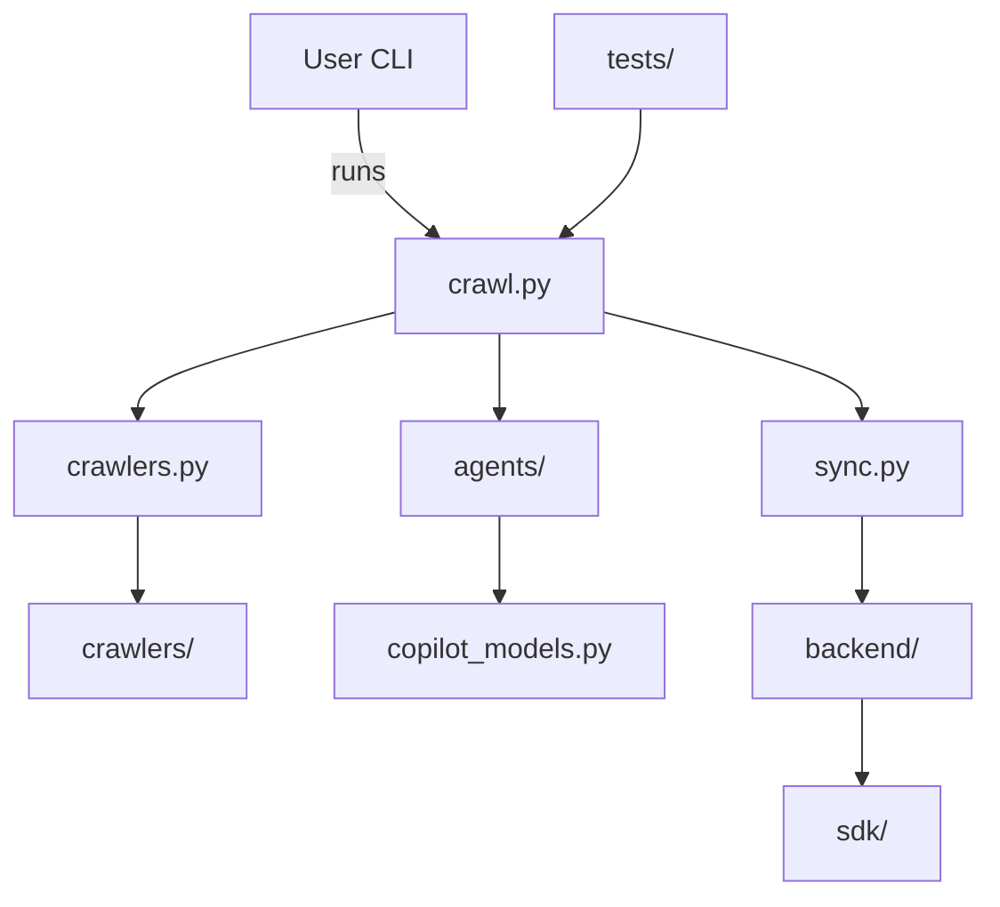
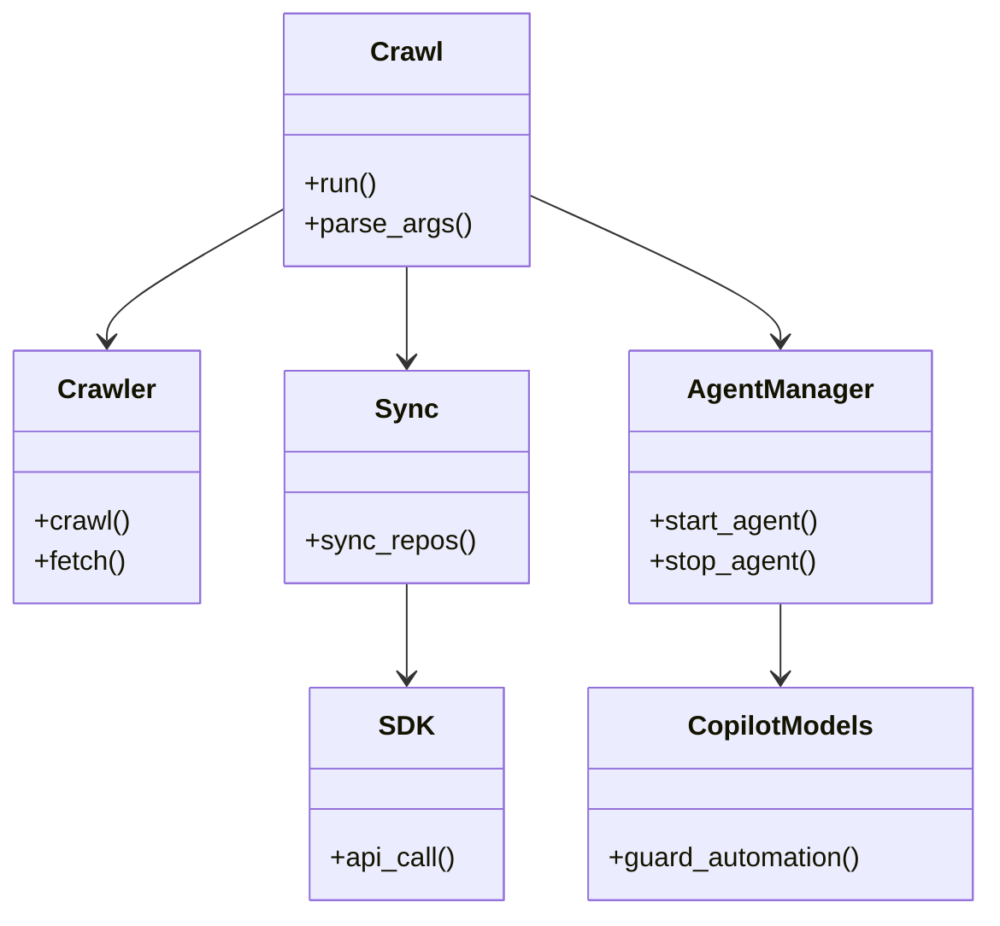

# Diagram: common/batch_service/config/config.dev.yml

> Auto-generated by Obscura crawlers

## Diagram 1

### SVG

<svg id="container" width="573.9765625" xmlns="http://www.w3.org/2000/svg" class="flowchart" height="510" viewBox="0 0 573.9765625 510" role="graphics-document document" aria-roledescription="flowchart-v2"><g><marker id="container_flowchart-v2-pointEnd" class="marker flowchart-v2" viewBox="0 0 10 10" refX="5" refY="5" markerUnits="userSpaceOnUse" markerWidth="8" markerHeight="8" orient="auto"><path d="M 0 0 L 10 5 L 0 10 z" class="arrowMarkerPath" style="stroke-width: 1; stroke-dasharray: 1, 0;"></path></marker><marker id="container_flowchart-v2-pointStart" class="marker flowchart-v2" viewBox="0 0 10 10" refX="4.5" refY="5" markerUnits="userSpaceOnUse" markerWidth="8" markerHeight="8" orient="auto"><path d="M 0 5 L 10 10 L 10 0 z" class="arrowMarkerPath" style="stroke-width: 1; stroke-dasharray: 1, 0;"></path></marker><marker id="container_flowchart-v2-circleEnd" class="marker flowchart-v2" viewBox="0 0 10 10" refX="11" refY="5" markerUnits="userSpaceOnUse" markerWidth="11" markerHeight="11" orient="auto"><circle cx="5" cy="5" r="5" class="arrowMarkerPath" style="stroke-width: 1; stroke-dasharray: 1, 0;"></circle></marker><marker id="container_flowchart-v2-circleStart" class="marker flowchart-v2" viewBox="0 0 10 10" refX="-1" refY="5" markerUnits="userSpaceOnUse" markerWidth="11" markerHeight="11" orient="auto"><circle cx="5" cy="5" r="5" class="arrowMarkerPath" style="stroke-width: 1; stroke-dasharray: 1, 0;"></circle></marker><marker id="container_flowchart-v2-crossEnd" class="marker cross flowchart-v2" viewBox="0 0 11 11" refX="12" refY="5.2" markerUnits="userSpaceOnUse" markerWidth="11" markerHeight="11" orient="auto"><path d="M 1,1 l 9,9 M 10,1 l -9,9" class="arrowMarkerPath" style="stroke-width: 2; stroke-dasharray: 1, 0;"></path></marker><marker id="container_flowchart-v2-crossStart" class="marker cross flowchart-v2" viewBox="0 0 11 11" refX="-1" refY="5.2" markerUnits="userSpaceOnUse" markerWidth="11" markerHeight="11" orient="auto"><path d="M 1,1 l 9,9 M 10,1 l -9,9" class="arrowMarkerPath" style="stroke-width: 2; stroke-dasharray: 1, 0;"></path></marker><g class="root"><g class="clusters"></g><g class="edgePaths"><path d="M209.02,62L209.02,68.167C209.02,74.333,209.02,86.667,216.256,98.585C223.493,110.504,237.966,122.007,245.202,127.759L252.439,133.511" id="L_A_B_0" class="edge-thickness-normal edge-pattern-solid edge-thickness-normal edge-pattern-solid flowchart-link" style=";" data-edge="true" data-et="edge" data-id="L_A_B_0" data-points="W3sieCI6MjA5LjAxOTUzMTI1LCJ5Ijo2Mn0seyJ4IjoyMDkuMDE5NTMxMjUsInkiOjk5fSx7IngiOjI1NS41Njk4ODUyNTM5MDYyNSwieSI6MTM2fV0=" marker-end="url(#container_flowchart-v2-pointEnd)"></path><path d="M229.906,177.702L204.693,183.919C179.479,190.135,129.052,202.567,103.839,212.284C78.625,222,78.625,229,78.625,232.5L78.625,236" id="L_B_C_0" class="edge-thickness-normal edge-pattern-solid edge-thickness-normal edge-pattern-solid flowchart-link" style=";" data-edge="true" data-et="edge" data-id="L_B_C_0" data-points="W3sieCI6MjI5LjkwNjI1LCJ5IjoxNzcuNzAyMjI2MTczMjc4NTJ9LHsieCI6NzguNjI1LCJ5IjoyMTV9LHsieCI6NzguNjI1LCJ5IjoyNDB9XQ==" marker-end="url(#container_flowchart-v2-pointEnd)"></path><path d="M349.172,177.657L374.495,183.881C399.818,190.104,450.464,202.552,475.786,212.276C501.109,222,501.109,229,501.109,232.5L501.109,236" id="L_B_D_0" class="edge-thickness-normal edge-pattern-solid edge-thickness-normal edge-pattern-solid flowchart-link" style=";" data-edge="true" data-et="edge" data-id="L_B_D_0" data-points="W3sieCI6MzQ5LjE3MTg3NSwieSI6MTc3LjY1NjYyMjcyNDQxOTMyfSx7IngiOjUwMS4xMDkzNzUsInkiOjIxNX0seyJ4Ijo1MDEuMTA5Mzc1LCJ5IjoyNDB9XQ==" marker-end="url(#container_flowchart-v2-pointEnd)"></path><path d="M289.539,190L289.539,194.167C289.539,198.333,289.539,206.667,289.539,214.333C289.539,222,289.539,229,289.539,232.5L289.539,236" id="L_B_E_0" class="edge-thickness-normal edge-pattern-solid edge-thickness-normal edge-pattern-solid flowchart-link" style=";" data-edge="true" data-et="edge" data-id="L_B_E_0" data-points="W3sieCI6Mjg5LjUzOTA2MjUsInkiOjE5MH0seyJ4IjoyODkuNTM5MDYyNSwieSI6MjE1fSx7IngiOjI4OS41MzkwNjI1LCJ5IjoyNDB9XQ==" marker-end="url(#container_flowchart-v2-pointEnd)"></path><path d="M78.625,294L78.625,298.167C78.625,302.333,78.625,310.667,78.625,318.333C78.625,326,78.625,333,78.625,336.5L78.625,340" id="L_C_F_0" class="edge-thickness-normal edge-pattern-solid edge-thickness-normal edge-pattern-solid flowchart-link" style=";" data-edge="true" data-et="edge" data-id="L_C_F_0" data-points="W3sieCI6NzguNjI1LCJ5IjoyOTR9LHsieCI6NzguNjI1LCJ5IjozMTl9LHsieCI6NzguNjI1LCJ5IjozNDR9XQ==" marker-end="url(#container_flowchart-v2-pointEnd)"></path><path d="M289.539,294L289.539,298.167C289.539,302.333,289.539,310.667,289.539,318.333C289.539,326,289.539,333,289.539,336.5L289.539,340" id="L_E_G_0" class="edge-thickness-normal edge-pattern-solid edge-thickness-normal edge-pattern-solid flowchart-link" style=";" data-edge="true" data-et="edge" data-id="L_E_G_0" data-points="W3sieCI6Mjg5LjUzOTA2MjUsInkiOjI5NH0seyJ4IjoyODkuNTM5MDYyNSwieSI6MzE5fSx7IngiOjI4OS41MzkwNjI1LCJ5IjozNDR9XQ==" marker-end="url(#container_flowchart-v2-pointEnd)"></path><path d="M501.109,398L501.109,402.167C501.109,406.333,501.109,414.667,501.109,422.333C501.109,430,501.109,437,501.109,440.5L501.109,444" id="L_H_I_0" class="edge-thickness-normal edge-pattern-solid edge-thickness-normal edge-pattern-solid flowchart-link" style=";" data-edge="true" data-et="edge" data-id="L_H_I_0" data-points="W3sieCI6NTAxLjEwOTM3NSwieSI6Mzk4fSx7IngiOjUwMS4xMDkzNzUsInkiOjQyM30seyJ4Ijo1MDEuMTA5Mzc1LCJ5Ijo0NDh9XQ==" marker-end="url(#container_flowchart-v2-pointEnd)"></path><path d="M501.109,294L501.109,298.167C501.109,302.333,501.109,310.667,501.109,318.333C501.109,326,501.109,333,501.109,336.5L501.109,340" id="L_D_H_0" class="edge-thickness-normal edge-pattern-solid edge-thickness-normal edge-pattern-solid flowchart-link" style=";" data-edge="true" data-et="edge" data-id="L_D_H_0" data-points="W3sieCI6NTAxLjEwOTM3NSwieSI6Mjk0fSx7IngiOjUwMS4xMDkzNzUsInkiOjMxOX0seyJ4Ijo1MDEuMTA5Mzc1LCJ5IjozNDR9XQ==" marker-end="url(#container_flowchart-v2-pointEnd)"></path><path d="M370.059,62L370.059,68.167C370.059,74.333,370.059,86.667,362.822,98.585C355.586,110.504,341.113,122.007,333.876,127.759L326.64,133.511" id="L_tests/_B_0" class="edge-thickness-normal edge-pattern-solid edge-thickness-normal edge-pattern-solid flowchart-link" style=";" data-edge="true" data-et="edge" data-id="L_tests/_B_0" data-points="W3sieCI6MzcwLjA1ODU5Mzc1LCJ5Ijo2Mn0seyJ4IjozNzAuMDU4NTkzNzUsInkiOjk5fSx7IngiOjMyMy41MDgyMzk3NDYwOTM3NSwieSI6MTM2fV0=" marker-end="url(#container_flowchart-v2-pointEnd)"></path></g><g class="edgeLabels"><g class="edgeLabel" transform="translate(209.01953125, 99)"><g class="label" data-id="L_A_B_0" transform="translate(-16.171875, -12)"><foreignObject width="32.34375" height="24">

runs

</foreignObject></g></g><g class="edgeLabel"><g class="label" data-id="L_B_C_0" transform="translate(0, 0)"><foreignObject width="0" height="0">

</foreignObject></g></g><g class="edgeLabel"><g class="label" data-id="L_B_D_0" transform="translate(0, 0)"><foreignObject width="0" height="0">

</foreignObject></g></g><g class="edgeLabel"><g class="label" data-id="L_B_E_0" transform="translate(0, 0)"><foreignObject width="0" height="0">

</foreignObject></g></g><g class="edgeLabel"><g class="label" data-id="L_C_F_0" transform="translate(0, 0)"><foreignObject width="0" height="0">

</foreignObject></g></g><g class="edgeLabel"><g class="label" data-id="L_E_G_0" transform="translate(0, 0)"><foreignObject width="0" height="0">

</foreignObject></g></g><g class="edgeLabel"><g class="label" data-id="L_H_I_0" transform="translate(0, 0)"><foreignObject width="0" height="0">

</foreignObject></g></g><g class="edgeLabel"><g class="label" data-id="L_D_H_0" transform="translate(0, 0)"><foreignObject width="0" height="0">

</foreignObject></g></g><g class="edgeLabel"><g class="label" data-id="L_tests/_B_0" transform="translate(0, 0)"><foreignObject width="0" height="0">

</foreignObject></g></g></g><g class="nodes"><g class="node default" id="flowchart-A-0" transform="translate(209.01953125, 35)"><rect class="basic label-container" style="" x="-59.390625" y="-27" width="118.78125" height="54"></rect><g class="label" style="" transform="translate(-29.390625, -12)"><rect></rect><foreignObject width="58.78125" height="24">

User CLI

</foreignObject></g></g><g class="node default" id="flowchart-B-1" transform="translate(289.5390625, 163)"><rect class="basic label-container" style="" x="-59.6328125" y="-27" width="119.265625" height="54"></rect><g class="label" style="" transform="translate(-29.6328125, -12)"><rect></rect><foreignObject width="59.265625" height="24">

crawl.py

</foreignObject></g></g><g class="node default" id="flowchart-C-3" transform="translate(78.625, 267)"><rect class="basic label-container" style="" x="-70.625" y="-27" width="141.25" height="54"></rect><g class="label" style="" transform="translate(-40.625, -12)"><rect></rect><foreignObject width="81.25" height="24">

crawlers.py

</foreignObject></g></g><g class="node default" id="flowchart-D-5" transform="translate(501.109375, 267)"><rect class="basic label-container" style="" x="-56.7109375" y="-27" width="113.421875" height="54"></rect><g class="label" style="" transform="translate(-26.7109375, -12)"><rect></rect><foreignObject width="53.421875" height="24">

sync.py

</foreignObject></g></g><g class="node default" id="flowchart-E-7" transform="translate(289.5390625, 267)"><rect class="basic label-container" style="" x="-58.140625" y="-27" width="116.28125" height="54"></rect><g class="label" style="" transform="translate(-28.140625, -12)"><rect></rect><foreignObject width="56.28125" height="24">

agents/

</foreignObject></g></g><g class="node default" id="flowchart-F-9" transform="translate(78.625, 371)"><rect class="basic label-container" style="" x="-64.2109375" y="-27" width="128.421875" height="54"></rect><g class="label" style="" transform="translate(-34.2109375, -12)"><rect></rect><foreignObject width="68.421875" height="24">

crawlers/

</foreignObject></g></g><g class="node default" id="flowchart-G-11" transform="translate(289.5390625, 371)"><rect class="basic label-container" style="" x="-96.703125" y="-27" width="193.40625" height="54"></rect><g class="label" style="" transform="translate(-66.703125, -12)"><rect></rect><foreignObject width="133.40625" height="24">

copilot_models.py

</foreignObject></g></g><g class="node default" id="flowchart-H-12" transform="translate(501.109375, 371)"><rect class="basic label-container" style="" x="-64.8671875" y="-27" width="129.734375" height="54"></rect><g class="label" style="" transform="translate(-34.8671875, -12)"><rect></rect><foreignObject width="69.734375" height="24">

backend/

</foreignObject></g></g><g class="node default" id="flowchart-I-13" transform="translate(501.109375, 475)"><rect class="basic label-container" style="" x="-46.78125" y="-27" width="93.5625" height="54"></rect><g class="label" style="" transform="translate(-16.78125, -12)"><rect></rect><foreignObject width="33.5625" height="24">

sdk/

</foreignObject></g></g><g class="node default" id="flowchart-tests/-16" transform="translate(370.05859375, 35)"><rect class="basic label-container" style="" x="-51.6484375" y="-27" width="103.296875" height="54"></rect><g class="label" style="" transform="translate(-21.6484375, -12)"><rect></rect><foreignObject width="43.296875" height="24">

tests/

</foreignObject></g></g></g></g></g></svg>

## Diagram 2

### SVG

<svg id="container" width="579.77734375" xmlns="http://www.w3.org/2000/svg" class="classDiagram" height="542" viewBox="0 0 579.77734375 542" role="graphics-document document" aria-roledescription="class"><g><defs><marker id="container_class-aggregationStart" class="marker aggregation class" refX="18" refY="7" markerWidth="190" markerHeight="240" orient="auto"><path d="M 18,7 L9,13 L1,7 L9,1 Z"></path></marker></defs><defs><marker id="container_class-aggregationEnd" class="marker aggregation class" refX="1" refY="7" markerWidth="20" markerHeight="28" orient="auto"><path d="M 18,7 L9,13 L1,7 L9,1 Z"></path></marker></defs><defs><marker id="container_class-extensionStart" class="marker extension class" refX="18" refY="7" markerWidth="190" markerHeight="240" orient="auto"><path d="M 1,7 L18,13 V 1 Z"></path></marker></defs><defs><marker id="container_class-extensionEnd" class="marker extension class" refX="1" refY="7" markerWidth="20" markerHeight="28" orient="auto"><path d="M 1,1 V 13 L18,7 Z"></path></marker></defs><defs><marker id="container_class-compositionStart" class="marker composition class" refX="18" refY="7" markerWidth="190" markerHeight="240" orient="auto"><path d="M 18,7 L9,13 L1,7 L9,1 Z"></path></marker></defs><defs><marker id="container_class-compositionEnd" class="marker composition class" refX="1" refY="7" markerWidth="20" markerHeight="28" orient="auto"><path d="M 18,7 L9,13 L1,7 L9,1 Z"></path></marker></defs><defs><marker id="container_class-dependencyStart" class="marker dependency class" refX="6" refY="7" markerWidth="190" markerHeight="240" orient="auto"><path d="M 5,7 L9,13 L1,7 L9,1 Z"></path></marker></defs><defs><marker id="container_class-dependencyEnd" class="marker dependency class" refX="13" refY="7" markerWidth="20" markerHeight="28" orient="auto"><path d="M 18,7 L9,13 L14,7 L9,1 Z"></path></marker></defs><defs><marker id="container_class-lollipopStart" class="marker lollipop class" refX="13" refY="7" markerWidth="190" markerHeight="240" orient="auto"><circle stroke="black" fill="transparent" cx="7" cy="7" r="6"></circle></marker></defs><defs><marker id="container_class-lollipopEnd" class="marker lollipop class" refX="1" refY="7" markerWidth="190" markerHeight="240" orient="auto"><circle stroke="black" fill="transparent" cx="7" cy="7" r="6"></circle></marker></defs><g class="root"><g class="clusters"></g><g class="edgePaths"><path d="M166.105,123.338L148.766,133.282C131.427,143.226,96.749,163.113,79.41,176.223C62.07,189.333,62.07,195.667,62.07,198.833L62.07,202" id="id_Crawl_Crawler_1" class="edge-thickness-normal edge-pattern-solid relation" style=";;;" data-edge="true" data-et="edge" data-id="id_Crawl_Crawler_1" data-points="W3sieCI6MTY2LjEwNTQ2ODc1LCJ5IjoxMjMuMzM4MjYxNjQ4NzQ1NTJ9LHsieCI6NjIuMDcwMzEyNSwieSI6MTgzfSx7IngiOjYyLjA3MDMxMjUsInkiOjIwOH1d" marker-end="url(#container_class-dependencyEnd)"></path><path d="M236.445,158L236.445,162.167C236.445,166.333,236.445,174.667,236.445,184C236.445,193.333,236.445,203.667,236.445,208.833L236.445,214" id="id_Crawl_Sync_2" class="edge-thickness-normal edge-pattern-solid relation" style=";;;" data-edge="true" data-et="edge" data-id="id_Crawl_Sync_2" data-points="W3sieCI6MjM2LjQ0NTMxMjUsInkiOjE1OH0seyJ4IjoyMzYuNDQ1MzEyNSwieSI6MTgzfSx7IngiOjIzNi40NDUzMTI1LCJ5IjoyMjB9XQ==" marker-end="url(#container_class-dependencyEnd)"></path><path d="M306.785,114.836L331.885,126.197C356.986,137.558,407.186,160.279,432.286,174.806C457.387,189.333,457.387,195.667,457.387,198.833L457.387,202" id="id_Crawl_AgentManager_3" class="edge-thickness-normal edge-pattern-solid relation" style=";;;" data-edge="true" data-et="edge" data-id="id_Crawl_AgentManager_3" data-points="W3sieCI6MzA2Ljc4NTE1NjI1LCJ5IjoxMTQuODM2NDI0MzkxMzY1MDd9LHsieCI6NDU3LjM4NjcxODc1LCJ5IjoxODN9LHsieCI6NDU3LjM4NjcxODc1LCJ5IjoyMDh9XQ==" marker-end="url(#container_class-dependencyEnd)"></path><path d="M457.387,358L457.387,362.167C457.387,366.333,457.387,374.667,457.387,382C457.387,389.333,457.387,395.667,457.387,398.833L457.387,402" id="id_AgentManager_CopilotModels_4" class="edge-thickness-normal edge-pattern-solid relation" style=";;;" data-edge="true" data-et="edge" data-id="id_AgentManager_CopilotModels_4" data-points="W3sieCI6NDU3LjM4NjcxODc1LCJ5IjozNTh9LHsieCI6NDU3LjM4NjcxODc1LCJ5IjozODN9LHsieCI6NDU3LjM4NjcxODc1LCJ5Ijo0MDh9XQ==" marker-end="url(#container_class-dependencyEnd)"></path><path d="M236.445,346L236.445,352.167C236.445,358.333,236.445,370.667,236.445,380C236.445,389.333,236.445,395.667,236.445,398.833L236.445,402" id="id_Sync_SDK_5" class="edge-thickness-normal edge-pattern-solid relation" style=";;;" data-edge="true" data-et="edge" data-id="id_Sync_SDK_5" data-points="W3sieCI6MjM2LjQ0NTMxMjUsInkiOjM0Nn0seyJ4IjoyMzYuNDQ1MzEyNSwieSI6MzgzfSx7IngiOjIzNi40NDUzMTI1LCJ5Ijo0MDh9XQ==" marker-end="url(#container_class-dependencyEnd)"></path></g><g class="edgeLabels"><g class="edgeLabel"><g class="label" data-id="id_Crawl_Crawler_1" transform="translate(0, 0)"><foreignObject width="0" height="0">

</foreignObject></g></g><g class="edgeLabel"><g class="label" data-id="id_Crawl_Sync_2" transform="translate(0, 0)"><foreignObject width="0" height="0">

</foreignObject></g></g><g class="edgeLabel"><g class="label" data-id="id_Crawl_AgentManager_3" transform="translate(0, 0)"><foreignObject width="0" height="0">

</foreignObject></g></g><g class="edgeLabel"><g class="label" data-id="id_AgentManager_CopilotModels_4" transform="translate(0, 0)"><foreignObject width="0" height="0">

</foreignObject></g></g><g class="edgeLabel"><g class="label" data-id="id_Sync_SDK_5" transform="translate(0, 0)"><foreignObject width="0" height="0">

</foreignObject></g></g></g><g class="nodes"><g class="node default" id="classId-Crawl-0" transform="translate(236.4453125, 83)"><g class="basic label-container"><path d="M-70.33984375 -75 L70.33984375 -75 L70.33984375 75 L-70.33984375 75" stroke="none" stroke-width="0" fill="#ECECFF" style=""></path><path d="M-70.33984375 -75 C-29.7397671762742 -75, 10.860309397451601 -75, 70.33984375 -75 M-70.33984375 -75 C-32.71400974843207 -75, 4.911824253135862 -75, 70.33984375 -75 M70.33984375 -75 C70.33984375 -27.119397140687404, 70.33984375 20.76120571862519, 70.33984375 75 M70.33984375 -75 C70.33984375 -25.42890186788769, 70.33984375 24.142196264224623, 70.33984375 75 M70.33984375 75 C37.441175332518185 75, 4.54250691503637 75, -70.33984375 75 M70.33984375 75 C14.096494334226982 75, -42.146855081546036 75, -70.33984375 75 M-70.33984375 75 C-70.33984375 31.825219014394072, -70.33984375 -11.349561971211855, -70.33984375 -75 M-70.33984375 75 C-70.33984375 38.58112391425439, -70.33984375 2.1622478285087823, -70.33984375 -75" stroke="#9370DB" stroke-width="1.3" fill="none" stroke-dasharray="0 0" style=""></path></g><g class="annotation-group text" transform="translate(0, -51)"></g><g class="label-group text" transform="translate(-20.1484375, -51)"><g class="label" style="font-weight: bolder" transform="translate(0,-12)"><foreignObject width="40.296875" height="24">

Crawl

</foreignObject></g></g><g class="members-group text" transform="translate(-58.33984375, -3)"></g><g class="methods-group text" transform="translate(-58.33984375, 27)"><g class="label" style="" transform="translate(0,-12)"><foreignObject width="43.21875" height="24">

+run()

</foreignObject></g><g class="label" style="" transform="translate(0,12)"><foreignObject width="96.53125" height="24">

+parse_args()

</foreignObject></g></g><g class="divider" style=""><path d="M-70.33984375 -27 C-32.29427600897686 -27, 5.751291732046283 -27, 70.33984375 -27 M-70.33984375 -27 C-14.999942151279463 -27, 40.339959447441075 -27, 70.33984375 -27" stroke="#9370DB" stroke-width="1.3" fill="none" stroke-dasharray="0 0" style=""></path></g><g class="divider" style=""><path d="M-70.33984375 -3 C-38.23568613998604 -3, -6.131528529972087 -3, 70.33984375 -3 M-70.33984375 -3 C-17.726117888288663 -3, 34.887607973422675 -3, 70.33984375 -3" stroke="#9370DB" stroke-width="1.3" fill="none" stroke-dasharray="0 0" style=""></path></g></g><g class="node default" id="classId-Crawler-1" transform="translate(62.0703125, 283)"><g class="basic label-container"><path d="M-54.0703125 -75 L54.0703125 -75 L54.0703125 75 L-54.0703125 75" stroke="none" stroke-width="0" fill="#ECECFF" style=""></path><path d="M-54.0703125 -75 C-22.521076111544083 -75, 9.028160276911834 -75, 54.0703125 -75 M-54.0703125 -75 C-14.330152133014792 -75, 25.410008233970416 -75, 54.0703125 -75 M54.0703125 -75 C54.0703125 -24.68348384624855, 54.0703125 25.6330323075029, 54.0703125 75 M54.0703125 -75 C54.0703125 -44.57938073318401, 54.0703125 -14.15876146636802, 54.0703125 75 M54.0703125 75 C12.024924541472686 75, -30.02046341705463 75, -54.0703125 75 M54.0703125 75 C21.447647109363928 75, -11.175018281272145 75, -54.0703125 75 M-54.0703125 75 C-54.0703125 16.68024540100346, -54.0703125 -41.63950919799308, -54.0703125 -75 M-54.0703125 75 C-54.0703125 19.600118828547345, -54.0703125 -35.79976234290531, -54.0703125 -75" stroke="#9370DB" stroke-width="1.3" fill="none" stroke-dasharray="0 0" style=""></path></g><g class="annotation-group text" transform="translate(0, -51)"></g><g class="label-group text" transform="translate(-27.734375, -51)"><g class="label" style="font-weight: bolder" transform="translate(0,-12)"><foreignObject width="55.46875" height="24">

Crawler

</foreignObject></g></g><g class="members-group text" transform="translate(-42.0703125, -3)"></g><g class="methods-group text" transform="translate(-42.0703125, 27)"><g class="label" style="" transform="translate(0,-12)"><foreignObject width="56.40625" height="24">

+crawl()

</foreignObject></g><g class="label" style="" transform="translate(0,12)"><foreignObject width="54.59375" height="24">

+fetch()

</foreignObject></g></g><g class="divider" style=""><path d="M-54.0703125 -27 C-19.955707849202575 -27, 14.15889680159485 -27, 54.0703125 -27 M-54.0703125 -27 C-11.06726576005832 -27, 31.93578097988336 -27, 54.0703125 -27" stroke="#9370DB" stroke-width="1.3" fill="none" stroke-dasharray="0 0" style=""></path></g><g class="divider" style=""><path d="M-54.0703125 -3 C-25.841215352537716 -3, 2.387881794924567 -3, 54.0703125 -3 M-54.0703125 -3 C-21.82345315287825 -3, 10.423406194243498 -3, 54.0703125 -3" stroke="#9370DB" stroke-width="1.3" fill="none" stroke-dasharray="0 0" style=""></path></g></g><g class="node default" id="classId-Sync-2" transform="translate(236.4453125, 283)"><g class="basic label-container"><path d="M-70.3046875 -63 L70.3046875 -63 L70.3046875 63 L-70.3046875 63" stroke="none" stroke-width="0" fill="#ECECFF" style=""></path><path d="M-70.3046875 -63 C-19.80558031847611 -63, 30.69352686304778 -63, 70.3046875 -63 M-70.3046875 -63 C-37.272745543479886 -63, -4.240803586959771 -63, 70.3046875 -63 M70.3046875 -63 C70.3046875 -31.62274781290876, 70.3046875 -0.24549562581751871, 70.3046875 63 M70.3046875 -63 C70.3046875 -36.73195390009725, 70.3046875 -10.463907800194498, 70.3046875 63 M70.3046875 63 C38.51900124315845 63, 6.733314986316898 63, -70.3046875 63 M70.3046875 63 C28.567313484689834 63, -13.170060530620333 63, -70.3046875 63 M-70.3046875 63 C-70.3046875 13.143949599873281, -70.3046875 -36.71210080025344, -70.3046875 -63 M-70.3046875 63 C-70.3046875 28.675586215450174, -70.3046875 -5.648827569099652, -70.3046875 -63" stroke="#9370DB" stroke-width="1.3" fill="none" stroke-dasharray="0 0" style=""></path></g><g class="annotation-group text" transform="translate(0, -39)"></g><g class="label-group text" transform="translate(-17.09375, -39)"><g class="label" style="font-weight: bolder" transform="translate(0,-12)"><foreignObject width="34.1875" height="24">

Sync

</foreignObject></g></g><g class="members-group text" transform="translate(-58.3046875, 9)"></g><g class="methods-group text" transform="translate(-58.3046875, 39)"><g class="label" style="" transform="translate(0,-12)"><foreignObject width="99.515625" height="24">

+sync_repos()

</foreignObject></g></g><g class="divider" style=""><path d="M-70.3046875 -15 C-21.03140707103806 -15, 28.24187335792388 -15, 70.3046875 -15 M-70.3046875 -15 C-24.511942708448558 -15, 21.280802083102884 -15, 70.3046875 -15" stroke="#9370DB" stroke-width="1.3" fill="none" stroke-dasharray="0 0" style=""></path></g><g class="divider" style=""><path d="M-70.3046875 9 C-35.513854821684134 9, -0.7230221433682686 9, 70.3046875 9 M-70.3046875 9 C-16.53180249747315 9, 37.2410825050537 9, 70.3046875 9" stroke="#9370DB" stroke-width="1.3" fill="none" stroke-dasharray="0 0" style=""></path></g></g><g class="node default" id="classId-AgentManager-3" transform="translate(457.38671875, 283)"><g class="basic label-container"><path d="M-88.57421875 -75 L88.57421875 -75 L88.57421875 75 L-88.57421875 75" stroke="none" stroke-width="0" fill="#ECECFF" style=""></path><path d="M-88.57421875 -75 C-31.36784468391459 -75, 25.83852938217082 -75, 88.57421875 -75 M-88.57421875 -75 C-48.224153760369965 -75, -7.874088770739931 -75, 88.57421875 -75 M88.57421875 -75 C88.57421875 -31.60258429532093, 88.57421875 11.794831409358139, 88.57421875 75 M88.57421875 -75 C88.57421875 -39.653192514446935, 88.57421875 -4.306385028893871, 88.57421875 75 M88.57421875 75 C47.7050754519234 75, 6.835932153846798 75, -88.57421875 75 M88.57421875 75 C22.999196728712306 75, -42.57582529257539 75, -88.57421875 75 M-88.57421875 75 C-88.57421875 42.332834319699195, -88.57421875 9.66566863939839, -88.57421875 -75 M-88.57421875 75 C-88.57421875 36.954402709934875, -88.57421875 -1.0911945801302494, -88.57421875 -75" stroke="#9370DB" stroke-width="1.3" fill="none" stroke-dasharray="0 0" style=""></path></g><g class="annotation-group text" transform="translate(0, -51)"></g><g class="label-group text" transform="translate(-52.5234375, -51)"><g class="label" style="font-weight: bolder" transform="translate(0,-12)"><foreignObject width="105.046875" height="24">

AgentManager

</foreignObject></g></g><g class="members-group text" transform="translate(-76.57421875, -3)"></g><g class="methods-group text" transform="translate(-76.57421875, 27)"><g class="label" style="" transform="translate(0,-12)"><foreignObject width="100.625" height="24">

+start_agent()

</foreignObject></g><g class="label" style="" transform="translate(0,12)"><foreignObject width="98.375" height="24">

+stop_agent()

</foreignObject></g></g><g class="divider" style=""><path d="M-88.57421875 -27 C-32.55751507851739 -27, 23.45918859296522 -27, 88.57421875 -27 M-88.57421875 -27 C-28.269824496759213 -27, 32.034569756481574 -27, 88.57421875 -27" stroke="#9370DB" stroke-width="1.3" fill="none" stroke-dasharray="0 0" style=""></path></g><g class="divider" style=""><path d="M-88.57421875 -3 C-42.90540307515237 -3, 2.7634125996952577 -3, 88.57421875 -3 M-88.57421875 -3 C-25.73415686215924 -3, 37.10590502568152 -3, 88.57421875 -3" stroke="#9370DB" stroke-width="1.3" fill="none" stroke-dasharray="0 0" style=""></path></g></g><g class="node default" id="classId-CopilotModels-4" transform="translate(457.38671875, 471)"><g class="basic label-container"><path d="M-114.390625 -63 L114.390625 -63 L114.390625 63 L-114.390625 63" stroke="none" stroke-width="0" fill="#ECECFF" style=""></path><path d="M-114.390625 -63 C-56.39714248316477 -63, 1.596340033670458 -63, 114.390625 -63 M-114.390625 -63 C-51.75520012755144 -63, 10.88022474489712 -63, 114.390625 -63 M114.390625 -63 C114.390625 -27.675234514706695, 114.390625 7.649530970586611, 114.390625 63 M114.390625 -63 C114.390625 -16.714626976353408, 114.390625 29.570746047293184, 114.390625 63 M114.390625 63 C38.51047619312469 63, -37.36967261375062 63, -114.390625 63 M114.390625 63 C27.061037818805573 63, -60.26854936238885 63, -114.390625 63 M-114.390625 63 C-114.390625 21.525871915000458, -114.390625 -19.948256169999084, -114.390625 -63 M-114.390625 63 C-114.390625 25.135862383921385, -114.390625 -12.72827523215723, -114.390625 -63" stroke="#9370DB" stroke-width="1.3" fill="none" stroke-dasharray="0 0" style=""></path></g><g class="annotation-group text" transform="translate(0, -39)"></g><g class="label-group text" transform="translate(-52.65625, -39)"><g class="label" style="font-weight: bolder" transform="translate(0,-12)"><foreignObject width="105.3125" height="24">

CopilotModels

</foreignObject></g></g><g class="members-group text" transform="translate(-102.390625, 9)"></g><g class="methods-group text" transform="translate(-102.390625, 39)"><g class="label" style="" transform="translate(0,-12)"><foreignObject width="152.125" height="24">

+guard_automation()

</foreignObject></g></g><g class="divider" style=""><path d="M-114.390625 -15 C-31.48893925536936 -15, 51.41274648926128 -15, 114.390625 -15 M-114.390625 -15 C-57.689116741555935 -15, -0.9876084831118703 -15, 114.390625 -15" stroke="#9370DB" stroke-width="1.3" fill="none" stroke-dasharray="0 0" style=""></path></g><g class="divider" style=""><path d="M-114.390625 9 C-41.08049949874878 9, 32.22962600250244 9, 114.390625 9 M-114.390625 9 C-59.82680057052856 9, -5.262976141057123 9, 114.390625 9" stroke="#9370DB" stroke-width="1.3" fill="none" stroke-dasharray="0 0" style=""></path></g></g><g class="node default" id="classId-SDK-5" transform="translate(236.4453125, 471)"><g class="basic label-container"><path d="M-56.55078125 -63 L56.55078125 -63 L56.55078125 63 L-56.55078125 63" stroke="none" stroke-width="0" fill="#ECECFF" style=""></path><path d="M-56.55078125 -63 C-31.86311276961351 -63, -7.175444289227023 -63, 56.55078125 -63 M-56.55078125 -63 C-11.72398905744226 -63, 33.10280313511548 -63, 56.55078125 -63 M56.55078125 -63 C56.55078125 -32.88533997552278, 56.55078125 -2.770679951045558, 56.55078125 63 M56.55078125 -63 C56.55078125 -27.304925555932243, 56.55078125 8.390148888135514, 56.55078125 63 M56.55078125 63 C29.590412233416778 63, 2.630043216833556 63, -56.55078125 63 M56.55078125 63 C31.39351145298136 63, 6.236241655962722 63, -56.55078125 63 M-56.55078125 63 C-56.55078125 34.37693447947417, -56.55078125 5.7538689589483525, -56.55078125 -63 M-56.55078125 63 C-56.55078125 25.74934561775322, -56.55078125 -11.501308764493558, -56.55078125 -63" stroke="#9370DB" stroke-width="1.3" fill="none" stroke-dasharray="0 0" style=""></path></g><g class="annotation-group text" transform="translate(0, -39)"></g><g class="label-group text" transform="translate(-14.8515625, -39)"><g class="label" style="font-weight: bolder" transform="translate(0,-12)"><foreignObject width="29.703125" height="24">

SDK

</foreignObject></g></g><g class="members-group text" transform="translate(-44.55078125, 9)"></g><g class="methods-group text" transform="translate(-44.55078125, 39)"><g class="label" style="" transform="translate(0,-12)"><foreignObject width="74.25" height="24">

+api_call()

</foreignObject></g></g><g class="divider" style=""><path d="M-56.55078125 -15 C-27.27492769382164 -15, 2.0009258623567234 -15, 56.55078125 -15 M-56.55078125 -15 C-12.763297627367713 -15, 31.024185995264574 -15, 56.55078125 -15" stroke="#9370DB" stroke-width="1.3" fill="none" stroke-dasharray="0 0" style=""></path></g><g class="divider" style=""><path d="M-56.55078125 9 C-17.928334671634182 9, 20.694111906731635 9, 56.55078125 9 M-56.55078125 9 C-26.103791071518284 9, 4.343199106963432 9, 56.55078125 9" stroke="#9370DB" stroke-width="1.3" fill="none" stroke-dasharray="0 0" style=""></path></g></g></g></g></g></svg>
