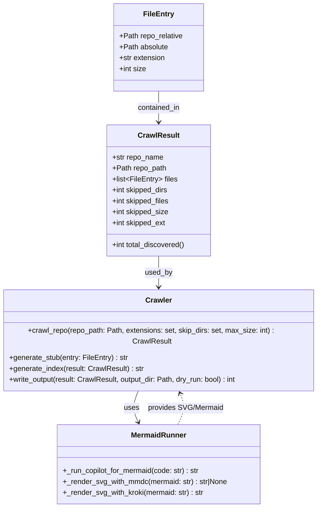
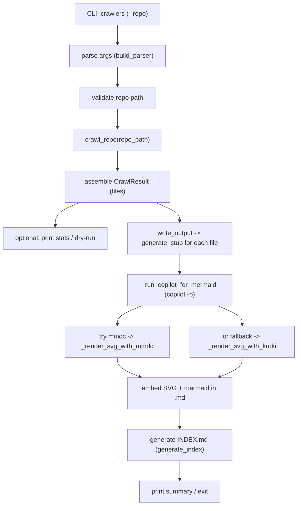

# Diagram: common/batch_service/config/config.dev2.yml

> Auto-generated by Obscura crawlers

## Diagram 1

### SVG

<svg id="container" width="698.671875" xmlns="http://www.w3.org/2000/svg" class="classDiagram" height="1090" viewBox="0 0 698.671875 1090" role="graphics-document document" aria-roledescription="class"><g><defs><marker id="container_class-aggregationStart" class="marker aggregation class" refX="18" refY="7" markerWidth="190" markerHeight="240" orient="auto"><path d="M 18,7 L9,13 L1,7 L9,1 Z"></path></marker></defs><defs><marker id="container_class-aggregationEnd" class="marker aggregation class" refX="1" refY="7" markerWidth="20" markerHeight="28" orient="auto"><path d="M 18,7 L9,13 L1,7 L9,1 Z"></path></marker></defs><defs><marker id="container_class-extensionStart" class="marker extension class" refX="18" refY="7" markerWidth="190" markerHeight="240" orient="auto"><path d="M 1,7 L18,13 V 1 Z"></path></marker></defs><defs><marker id="container_class-extensionEnd" class="marker extension class" refX="1" refY="7" markerWidth="20" markerHeight="28" orient="auto"><path d="M 1,1 V 13 L18,7 Z"></path></marker></defs><defs><marker id="container_class-compositionStart" class="marker composition class" refX="18" refY="7" markerWidth="190" markerHeight="240" orient="auto"><path d="M 18,7 L9,13 L1,7 L9,1 Z"></path></marker></defs><defs><marker id="container_class-compositionEnd" class="marker composition class" refX="1" refY="7" markerWidth="20" markerHeight="28" orient="auto"><path d="M 18,7 L9,13 L1,7 L9,1 Z"></path></marker></defs><defs><marker id="container_class-dependencyStart" class="marker dependency class" refX="6" refY="7" markerWidth="190" markerHeight="240" orient="auto"><path d="M 5,7 L9,13 L1,7 L9,1 Z"></path></marker></defs><defs><marker id="container_class-dependencyEnd" class="marker dependency class" refX="13" refY="7" markerWidth="20" markerHeight="28" orient="auto"><path d="M 18,7 L9,13 L14,7 L9,1 Z"></path></marker></defs><defs><marker id="container_class-lollipopStart" class="marker lollipop class" refX="13" refY="7" markerWidth="190" markerHeight="240" orient="auto"><circle stroke="black" fill="transparent" cx="7" cy="7" r="6"></circle></marker></defs><defs><marker id="container_class-lollipopEnd" class="marker lollipop class" refX="1" refY="7" markerWidth="190" markerHeight="240" orient="auto"><circle stroke="black" fill="transparent" cx="7" cy="7" r="6"></circle></marker></defs><g class="root"><g class="clusters"></g><g class="edgePaths"><path d="M349.336,200L349.336,206.167C349.336,212.333,349.336,224.667,349.336,236C349.336,247.333,349.336,257.667,349.336,262.833L349.336,268" id="id_FileEntry_CrawlResult_1" class="edge-thickness-normal edge-pattern-solid relation" style=";;;" data-edge="true" data-et="edge" data-id="id_FileEntry_CrawlResult_1" data-points="W3sieCI6MzQ5LjMzNTkzNzUsInkiOjIwMH0seyJ4IjozNDkuMzM1OTM3NSwieSI6MjM3fSx7IngiOjM0OS4zMzU5Mzc1LCJ5IjoyNzR9XQ==" marker-end="url(#container_class-dependencyEnd)"></path><path d="M349.336,562L349.336,568.167C349.336,574.333,349.336,586.667,349.336,598C349.336,609.333,349.336,619.667,349.336,624.833L349.336,630" id="id_CrawlResult_Crawler_2" class="edge-thickness-normal edge-pattern-solid relation" style=";;;" data-edge="true" data-et="edge" data-id="id_CrawlResult_Crawler_2" data-points="W3sieCI6MzQ5LjMzNTkzNzUsInkiOjU2Mn0seyJ4IjozNDkuMzM1OTM3NSwieSI6NTk5fSx7IngiOjM0OS4zMzU5Mzc1LCJ5Ijo2MzZ9XQ==" marker-end="url(#container_class-dependencyEnd)"></path><path d="M305.782,834L303.069,840.167C300.356,846.333,294.93,858.667,294.758,870.099C294.586,881.532,299.668,892.064,302.209,897.33L304.75,902.596" id="id_Crawler_MermaidRunner_3" class="edge-thickness-normal edge-pattern-solid relation" style=";;;" data-edge="true" data-et="edge" data-id="id_Crawler_MermaidRunner_3" data-points="W3sieCI6MzA1Ljc4MTczODI4MTI1LCJ5Ijo4MzR9LHsieCI6Mjg5LjUwMzkwNjI1LCJ5Ijo4NzF9LHsieCI6MzA3LjM1NzAxMjM0ODc5MDMsInkiOjkwOH1d" marker-end="url(#container_class-dependencyEnd)"></path><path d="M391.315,908L394.29,901.833C397.266,895.667,403.217,883.333,403.882,871.915C404.547,860.497,399.927,849.995,397.617,844.743L395.306,839.492" id="id_MermaidRunner_Crawler_4" class="edge-thickness-normal edge-pattern-dashed relation" style=";;;" data-edge="true" data-et="edge" data-id="id_MermaidRunner_Crawler_4" data-points="W3sieCI6MzkxLjMxNDg2MjY1MTIwOTcsInkiOjkwOH0seyJ4Ijo0MDkuMTY3OTY4NzUsInkiOjg3MX0seyJ4IjozOTIuODkwMTM2NzE4NzUsInkiOjgzNH1d" marker-end="url(#container_class-dependencyEnd)"></path></g><g class="edgeLabels"><g class="edgeLabel" transform="translate(349.3359375, 237)"><g class="label" data-id="id_FileEntry_CrawlResult_1" transform="translate(-47.40625, -12)"><foreignObject width="94.8125" height="24">

contained_in

</foreignObject></g></g><g class="edgeLabel" transform="translate(349.3359375, 599)"><g class="label" data-id="id_CrawlResult_Crawler_2" transform="translate(-30.359375, -12)"><foreignObject width="60.71875" height="24">

used_by

</foreignObject></g></g><g class="edgeLabel" transform="translate(289.64724, 871.29706)"><g class="label" data-id="id_Crawler_MermaidRunner_3" transform="translate(-16.4921875, -12)"><foreignObject width="32.984375" height="24">

uses

</foreignObject></g></g><g class="edgeLabel" transform="translate(409.02463, 871.29706)"><g class="label" data-id="id_MermaidRunner_Crawler_4" transform="translate(-83.171875, -12)"><foreignObject width="166.34375" height="24">

provides SVG/Mermaid

</foreignObject></g></g></g><g class="nodes"><g class="node default" id="classId-FileEntry-0" transform="translate(349.3359375, 104)"><g class="basic label-container"><path d="M-98.0859375 -96 L98.0859375 -96 L98.0859375 96 L-98.0859375 96" stroke="none" stroke-width="0" fill="#ECECFF" style=""></path><path d="M-98.0859375 -96 C-31.20818786150835 -96, 35.6695617769833 -96, 98.0859375 -96 M-98.0859375 -96 C-24.88220440794821 -96, 48.32152868410358 -96, 98.0859375 -96 M98.0859375 -96 C98.0859375 -32.9687339033225, 98.0859375 30.062532193354997, 98.0859375 96 M98.0859375 -96 C98.0859375 -24.120980392387168, 98.0859375 47.758039215225665, 98.0859375 96 M98.0859375 96 C22.91042476714182 96, -52.26508796571636 96, -98.0859375 96 M98.0859375 96 C58.494131598323484 96, 18.90232569664697 96, -98.0859375 96 M-98.0859375 96 C-98.0859375 23.41343084697104, -98.0859375 -49.17313830605792, -98.0859375 -96 M-98.0859375 96 C-98.0859375 33.79832650004178, -98.0859375 -28.403346999916437, -98.0859375 -96" stroke="#9370DB" stroke-width="1.3" fill="none" stroke-dasharray="0 0" style=""></path></g><g class="annotation-group text" transform="translate(0, -72)"></g><g class="label-group text" transform="translate(-31.859375, -72)"><g class="label" style="font-weight: bolder" transform="translate(0,-12)"><foreignObject width="63.71875" height="24">

FileEntry

</foreignObject></g></g><g class="members-group text" transform="translate(-86.0859375, -24)"><g class="label" style="" transform="translate(0,-12)"><foreignObject width="140.3125" height="24">

+Path repo_relative

</foreignObject></g><g class="label" style="" transform="translate(0,12)"><foreignObject width="107.78125" height="24">

+Path absolute

</foreignObject></g><g class="label" style="" transform="translate(0,36)"><foreignObject width="102.328125" height="24">

+str extension

</foreignObject></g><g class="label" style="" transform="translate(0,60)"><foreignObject width="59.484375" height="24">

+int size

</foreignObject></g></g><g class="methods-group text" transform="translate(-86.0859375, 96)"></g><g class="divider" style=""><path d="M-98.0859375 -48 C-56.263114724904746 -48, -14.440291949809492 -48, 98.0859375 -48 M-98.0859375 -48 C-27.76440004410361 -48, 42.55713741179278 -48, 98.0859375 -48" stroke="#9370DB" stroke-width="1.3" fill="none" stroke-dasharray="0 0" style=""></path></g><g class="divider" style=""><path d="M-98.0859375 72 C-49.68333641056043 72, -1.2807353211208579 72, 98.0859375 72 M-98.0859375 72 C-47.58507609169181 72, 2.915785316616379 72, 98.0859375 72" stroke="#9370DB" stroke-width="1.3" fill="none" stroke-dasharray="0 0" style=""></path></g></g><g class="node default" id="classId-CrawlResult-1" transform="translate(349.3359375, 418)"><g class="basic label-container"><path d="M-115 -144 L115 -144 L115 144 L-115 144" stroke="none" stroke-width="0" fill="#ECECFF" style=""></path><path d="M-115 -144 C-38.27009008289701 -144, 38.45981983420597 -144, 115 -144 M-115 -144 C-56.661922955316186 -144, 1.6761540893676283 -144, 115 -144 M115 -144 C115 -35.946665681335304, 115 72.10666863732939, 115 144 M115 -144 C115 -79.86269700533815, 115 -15.725394010676297, 115 144 M115 144 C52.4176846373487 144, -10.164630725302601 144, -115 144 M115 144 C61.21215042151036 144, 7.424300843020717 144, -115 144 M-115 144 C-115 53.97946667859898, -115 -36.041066642802036, -115 -144 M-115 144 C-115 51.49309705542797, -115 -41.013805889144066, -115 -144" stroke="#9370DB" stroke-width="1.3" fill="none" stroke-dasharray="0 0" style=""></path></g><g class="annotation-group text" transform="translate(0, -120)"></g><g class="label-group text" transform="translate(-43.28125, -120)"><g class="label" style="font-weight: bolder" transform="translate(0,-12)"><foreignObject width="86.5625" height="24">

CrawlResult

</foreignObject></g></g><g class="members-group text" transform="translate(-103, -72)"><g class="label" style="" transform="translate(0,-12)"><foreignObject width="113.4375" height="24">

+str repo_name

</foreignObject></g><g class="label" style="" transform="translate(0,12)"><foreignObject width="118.96875" height="24">

+Path repo_path

</foreignObject></g><g class="label" style="" transform="translate(0,36)"><foreignObject width="143.421875" height="24">

+list&lt;FileEntry&gt; files

</foreignObject></g><g class="label" style="" transform="translate(0,60)"><foreignObject width="124.859375" height="24">

+int skipped_dirs

</foreignObject></g><g class="label" style="" transform="translate(0,84)"><foreignObject width="127.375" height="24">

+int skipped_files

</foreignObject></g><g class="label" style="" transform="translate(0,108)"><foreignObject width="125.265625" height="24">

+int skipped_size

</foreignObject></g><g class="label" style="" transform="translate(0,132)"><foreignObject width="119.484375" height="24">

+int skipped_ext

</foreignObject></g></g><g class="methods-group text" transform="translate(-103, 120)"><g class="label" style="" transform="translate(0,-12)"><foreignObject width="162.71875" height="24">

+int total_discovered()

</foreignObject></g></g><g class="divider" style=""><path d="M-115 -96 C-28.4239231928118 -96, 58.1521536143764 -96, 115 -96 M-115 -96 C-35.125708383457635 -96, 44.74858323308473 -96, 115 -96" stroke="#9370DB" stroke-width="1.3" fill="none" stroke-dasharray="0 0" style=""></path></g><g class="divider" style=""><path d="M-115 96 C-61.9099022024126 96, -8.819804404825206 96, 115 96 M-115 96 C-42.67288563724077 96, 29.654228725518465 96, 115 96" stroke="#9370DB" stroke-width="1.3" fill="none" stroke-dasharray="0 0" style=""></path></g></g><g class="node default" id="classId-Crawler-2" transform="translate(349.3359375, 735)"><g class="basic label-container"><path d="M-341.3359375 -99 L341.3359375 -99 L341.3359375 99 L-341.3359375 99" stroke="none" stroke-width="0" fill="#ECECFF" style=""></path><path d="M-341.3359375 -99 C-147.02052441410345 -99, 47.2948886717931 -99, 341.3359375 -99 M-341.3359375 -99 C-173.39001866714548 -99, -5.4440998342909666 -99, 341.3359375 -99 M341.3359375 -99 C341.3359375 -50.02689287853485, 341.3359375 -1.0537857570697042, 341.3359375 99 M341.3359375 -99 C341.3359375 -23.947063527724566, 341.3359375 51.10587294455087, 341.3359375 99 M341.3359375 99 C112.19821216249557 99, -116.93951317500887 99, -341.3359375 99 M341.3359375 99 C158.62460678111879 99, -24.08672393776243 99, -341.3359375 99 M-341.3359375 99 C-341.3359375 39.28251786414047, -341.3359375 -20.434964271719053, -341.3359375 -99 M-341.3359375 99 C-341.3359375 29.010020852969802, -341.3359375 -40.979958294060395, -341.3359375 -99" stroke="#9370DB" stroke-width="1.3" fill="none" stroke-dasharray="0 0" style=""></path></g><g class="annotation-group text" transform="translate(0, -75)"></g><g class="label-group text" transform="translate(-27.734375, -75)"><g class="label" style="font-weight: bolder" transform="translate(0,-12)"><foreignObject width="55.46875" height="24">

Crawler

</foreignObject></g></g><g class="members-group text" transform="translate(-329.3359375, -27)"></g><g class="methods-group text" transform="translate(-329.3359375, 3)"><g class="label" style="" transform="translate(0,-12)"><foreignObject width="630.9375" height="24">

+crawl_repo(repo_path: Path, extensions: set, skip_dirs: set, max_size: int) : CrawlResult

</foreignObject></g><g class="label" style="" transform="translate(0,12)"><foreignObject width="262.421875" height="24">

+generate_stub(entry: FileEntry) : str

</foreignObject></g><g class="label" style="" transform="translate(0,36)"><foreignObject width="295.6875" height="24">

+generate_index(result: CrawlResult) : str

</foreignObject></g><g class="label" style="" transform="translate(0,60)"><foreignObject width="509.09375" height="24">

+write_output(result: CrawlResult, output_dir: Path, dry_run: bool) : int

</foreignObject></g></g><g class="divider" style=""><path d="M-341.3359375 -51 C-125.72527433163941 -51, 89.88538883672118 -51, 341.3359375 -51 M-341.3359375 -51 C-196.82207492756532 -51, -52.30821235513065 -51, 341.3359375 -51" stroke="#9370DB" stroke-width="1.3" fill="none" stroke-dasharray="0 0" style=""></path></g><g class="divider" style=""><path d="M-341.3359375 -27 C-87.33169033105816 -27, 166.6725568378837 -27, 341.3359375 -27 M-341.3359375 -27 C-153.48738837723755 -27, 34.3611607455249 -27, 341.3359375 -27" stroke="#9370DB" stroke-width="1.3" fill="none" stroke-dasharray="0 0" style=""></path></g></g><g class="node default" id="classId-MermaidRunner-3" transform="translate(349.3359375, 995)"><g class="basic label-container"><path d="M-223.9375 -87 L223.9375 -87 L223.9375 87 L-223.9375 87" stroke="none" stroke-width="0" fill="#ECECFF" style=""></path><path d="M-223.9375 -87 C-99.76973677615676 -87, 24.398026447686476 -87, 223.9375 -87 M-223.9375 -87 C-128.4254297692703 -87, -32.91335953854062 -87, 223.9375 -87 M223.9375 -87 C223.9375 -49.533484116552735, 223.9375 -12.06696823310547, 223.9375 87 M223.9375 -87 C223.9375 -34.762293841099655, 223.9375 17.47541231780069, 223.9375 87 M223.9375 87 C110.90225611289391 87, -2.1329877742121823 87, -223.9375 87 M223.9375 87 C118.4496486834875 87, 12.961797366974992 87, -223.9375 87 M-223.9375 87 C-223.9375 50.68060145032643, -223.9375 14.361202900652856, -223.9375 -87 M-223.9375 87 C-223.9375 39.50094642549682, -223.9375 -7.998107149006358, -223.9375 -87" stroke="#9370DB" stroke-width="1.3" fill="none" stroke-dasharray="0 0" style=""></path></g><g class="annotation-group text" transform="translate(0, -63)"></g><g class="label-group text" transform="translate(-58.484375, -63)"><g class="label" style="font-weight: bolder" transform="translate(0,-12)"><foreignObject width="116.96875" height="24">

MermaidRunner

</foreignObject></g></g><g class="members-group text" transform="translate(-211.9375, -15)"></g><g class="methods-group text" transform="translate(-211.9375, 15)"><g class="label" style="" transform="translate(0,-12)"><foreignObject width="303.75" height="24">

+_run_copilot_for_mermaid(code: str) : str

</foreignObject></g><g class="label" style="" transform="translate(0,12)"><foreignObject width="365.390625" height="24">

+_render_svg_with_mmdc(mermaid: str) : str|None

</foreignObject></g><g class="label" style="" transform="translate(0,36)"><foreignObject width="311.859375" height="24">

+_render_svg_with_kroki(mermaid: str) : str

</foreignObject></g></g><g class="divider" style=""><path d="M-223.9375 -39 C-79.54184210849402 -39, 64.85381578301195 -39, 223.9375 -39 M-223.9375 -39 C-73.58569304080203 -39, 76.76611391839594 -39, 223.9375 -39" stroke="#9370DB" stroke-width="1.3" fill="none" stroke-dasharray="0 0" style=""></path></g><g class="divider" style=""><path d="M-223.9375 -15 C-49.7200233879218 -15, 124.4974532241564 -15, 223.9375 -15 M-223.9375 -15 C-60.20690281747926 -15, 103.52369436504148 -15, 223.9375 -15" stroke="#9370DB" stroke-width="1.3" fill="none" stroke-dasharray="0 0" style=""></path></g></g></g></g></g></svg>

## Diagram 2

### SVG

<svg id="container" width="741" xmlns="http://www.w3.org/2000/svg" class="flowchart" height="1254" viewBox="0 0 741 1254" role="graphics-document document" aria-roledescription="flowchart-v2"><g><marker id="container_flowchart-v2-pointEnd" class="marker flowchart-v2" viewBox="0 0 10 10" refX="5" refY="5" markerUnits="userSpaceOnUse" markerWidth="8" markerHeight="8" orient="auto"><path d="M 0 0 L 10 5 L 0 10 z" class="arrowMarkerPath" style="stroke-width: 1; stroke-dasharray: 1, 0;"></path></marker><marker id="container_flowchart-v2-pointStart" class="marker flowchart-v2" viewBox="0 0 10 10" refX="4.5" refY="5" markerUnits="userSpaceOnUse" markerWidth="8" markerHeight="8" orient="auto"><path d="M 0 5 L 10 10 L 10 0 z" class="arrowMarkerPath" style="stroke-width: 1; stroke-dasharray: 1, 0;"></path></marker><marker id="container_flowchart-v2-circleEnd" class="marker flowchart-v2" viewBox="0 0 10 10" refX="11" refY="5" markerUnits="userSpaceOnUse" markerWidth="11" markerHeight="11" orient="auto"><circle cx="5" cy="5" r="5" class="arrowMarkerPath" style="stroke-width: 1; stroke-dasharray: 1, 0;"></circle></marker><marker id="container_flowchart-v2-circleStart" class="marker flowchart-v2" viewBox="0 0 10 10" refX="-1" refY="5" markerUnits="userSpaceOnUse" markerWidth="11" markerHeight="11" orient="auto"><circle cx="5" cy="5" r="5" class="arrowMarkerPath" style="stroke-width: 1; stroke-dasharray: 1, 0;"></circle></marker><marker id="container_flowchart-v2-crossEnd" class="marker cross flowchart-v2" viewBox="0 0 11 11" refX="12" refY="5.2" markerUnits="userSpaceOnUse" markerWidth="11" markerHeight="11" orient="auto"><path d="M 1,1 l 9,9 M 10,1 l -9,9" class="arrowMarkerPath" style="stroke-width: 2; stroke-dasharray: 1, 0;"></path></marker><marker id="container_flowchart-v2-crossStart" class="marker cross flowchart-v2" viewBox="0 0 11 11" refX="-1" refY="5.2" markerUnits="userSpaceOnUse" markerWidth="11" markerHeight="11" orient="auto"><path d="M 1,1 l 9,9 M 10,1 l -9,9" class="arrowMarkerPath" style="stroke-width: 2; stroke-dasharray: 1, 0;"></path></marker><g class="root"><g class="clusters"></g><g class="edgePaths"><path d="M293,62L293,66.167C293,70.333,293,78.667,293,86.333C293,94,293,101,293,104.5L293,108" id="L_CLI_Parse_0" class="edge-thickness-normal edge-pattern-solid edge-thickness-normal edge-pattern-solid flowchart-link" style=";" data-edge="true" data-et="edge" data-id="L_CLI_Parse_0" data-points="W3sieCI6MjkzLCJ5Ijo2Mn0seyJ4IjoyOTMsInkiOjg3fSx7IngiOjI5MywieSI6MTEyfV0=" marker-end="url(#container_flowchart-v2-pointEnd)"></path><path d="M293,166L293,170.167C293,174.333,293,182.667,293,190.333C293,198,293,205,293,208.5L293,212" id="L_Parse_Validate_0" class="edge-thickness-normal edge-pattern-solid edge-thickness-normal edge-pattern-solid flowchart-link" style=";" data-edge="true" data-et="edge" data-id="L_Parse_Validate_0" data-points="W3sieCI6MjkzLCJ5IjoxNjZ9LHsieCI6MjkzLCJ5IjoxOTF9LHsieCI6MjkzLCJ5IjoyMTZ9XQ==" marker-end="url(#container_flowchart-v2-pointEnd)"></path><path d="M293,270L293,274.167C293,278.333,293,286.667,293,294.333C293,302,293,309,293,312.5L293,316" id="L_Validate_Crawl_0" class="edge-thickness-normal edge-pattern-solid edge-thickness-normal edge-pattern-solid flowchart-link" style=";" data-edge="true" data-et="edge" data-id="L_Validate_Crawl_0" data-points="W3sieCI6MjkzLCJ5IjoyNzB9LHsieCI6MjkzLCJ5IjoyOTV9LHsieCI6MjkzLCJ5IjozMjB9XQ==" marker-end="url(#container_flowchart-v2-pointEnd)"></path><path d="M293,374L293,378.167C293,382.333,293,390.667,293,398.333C293,406,293,413,293,416.5L293,420" id="L_Crawl_FilesFound_0" class="edge-thickness-normal edge-pattern-solid edge-thickness-normal edge-pattern-solid flowchart-link" style=";" data-edge="true" data-et="edge" data-id="L_Crawl_FilesFound_0" data-points="W3sieCI6MjkzLCJ5IjozNzR9LHsieCI6MjkzLCJ5IjozOTl9LHsieCI6MjkzLCJ5Ijo0MjR9XQ==" marker-end="url(#container_flowchart-v2-pointEnd)"></path><path d="M198.547,502L188.456,506.167C178.365,510.333,158.182,518.667,148.091,526.333C138,534,138,541,138,544.5L138,548" id="L_FilesFound_Stats_0" class="edge-thickness-normal edge-pattern-solid edge-thickness-normal edge-pattern-solid flowchart-link" style=";" data-edge="true" data-et="edge" data-id="L_FilesFound_Stats_0" data-points="W3sieCI6MTk4LjU0Njg3NSwieSI6NTAyfSx7IngiOjEzOCwieSI6NTI3fSx7IngiOjEzOCwieSI6NTUyfV0=" marker-end="url(#container_flowchart-v2-pointEnd)"></path><path d="M387.453,502L397.544,506.167C407.635,510.333,427.818,518.667,437.909,526.333C448,534,448,541,448,544.5L448,548" id="L_FilesFound_Generate_0" class="edge-thickness-normal edge-pattern-solid edge-thickness-normal edge-pattern-solid flowchart-link" style=";" data-edge="true" data-et="edge" data-id="L_FilesFound_Generate_0" data-points="W3sieCI6Mzg3LjQ1MzEyNSwieSI6NTAyfSx7IngiOjQ0OCwieSI6NTI3fSx7IngiOjQ0OCwieSI6NTUyfV0=" marker-end="url(#container_flowchart-v2-pointEnd)"></path><path d="M448,630L448,634.167C448,638.333,448,646.667,448,654.333C448,662,448,669,448,672.5L448,676" id="L_Generate_Copilot_0" class="edge-thickness-normal edge-pattern-solid edge-thickness-normal edge-pattern-solid flowchart-link" style=";" data-edge="true" data-et="edge" data-id="L_Generate_Copilot_0" data-points="W3sieCI6NDQ4LCJ5Ijo2MzB9LHsieCI6NDQ4LCJ5Ijo2NTV9LHsieCI6NDQ4LCJ5Ijo2ODB9XQ==" marker-end="url(#container_flowchart-v2-pointEnd)"></path><path d="M353.547,758L343.456,762.167C333.365,766.333,313.182,774.667,303.091,782.333C293,790,293,797,293,800.5L293,804" id="L_Copilot_RenderMMD_0" class="edge-thickness-normal edge-pattern-solid edge-thickness-normal edge-pattern-solid flowchart-link" style=";" data-edge="true" data-et="edge" data-id="L_Copilot_RenderMMD_0" data-points="W3sieCI6MzUzLjU0Njg3NSwieSI6NzU4fSx7IngiOjI5MywieSI6NzgzfSx7IngiOjI5MywieSI6ODA4fV0=" marker-end="url(#container_flowchart-v2-pointEnd)"></path><path d="M542.453,758L552.544,762.167C562.635,766.333,582.818,774.667,592.909,782.333C603,790,603,797,603,800.5L603,804" id="L_Copilot_RenderKroki_0" class="edge-thickness-normal edge-pattern-solid edge-thickness-normal edge-pattern-solid flowchart-link" style=";" data-edge="true" data-et="edge" data-id="L_Copilot_RenderKroki_0" data-points="W3sieCI6NTQyLjQ1MzEyNSwieSI6NzU4fSx7IngiOjYwMywieSI6NzgzfSx7IngiOjYwMywieSI6ODA4fV0=" marker-end="url(#container_flowchart-v2-pointEnd)"></path><path d="M293,886L293,890.167C293,894.333,293,902.667,302.475,910.746C311.95,918.824,330.9,926.649,340.375,930.561L349.85,934.473" id="L_RenderMMD_Embed_0" class="edge-thickness-normal edge-pattern-solid edge-thickness-normal edge-pattern-solid flowchart-link" style=";" data-edge="true" data-et="edge" data-id="L_RenderMMD_Embed_0" data-points="W3sieCI6MjkzLCJ5Ijo4ODZ9LHsieCI6MjkzLCJ5Ijo5MTF9LHsieCI6MzUzLjU0Njg3NSwieSI6OTM2fV0=" marker-end="url(#container_flowchart-v2-pointEnd)"></path><path d="M603,886L603,890.167C603,894.333,603,902.667,593.525,910.746C584.05,918.824,565.1,926.649,555.625,930.561L546.15,934.473" id="L_RenderKroki_Embed_0" class="edge-thickness-normal edge-pattern-solid edge-thickness-normal edge-pattern-solid flowchart-link" style=";" data-edge="true" data-et="edge" data-id="L_RenderKroki_Embed_0" data-points="W3sieCI6NjAzLCJ5Ijo4ODZ9LHsieCI6NjAzLCJ5Ijo5MTF9LHsieCI6NTQyLjQ1MzEyNSwieSI6OTM2fV0=" marker-end="url(#container_flowchart-v2-pointEnd)"></path><path d="M448,1014L448,1018.167C448,1022.333,448,1030.667,448,1038.333C448,1046,448,1053,448,1056.5L448,1060" id="L_Embed_INDEX_0" class="edge-thickness-normal edge-pattern-solid edge-thickness-normal edge-pattern-solid flowchart-link" style=";" data-edge="true" data-et="edge" data-id="L_Embed_INDEX_0" data-points="W3sieCI6NDQ4LCJ5IjoxMDE0fSx7IngiOjQ0OCwieSI6MTAzOX0seyJ4Ijo0NDgsInkiOjEwNjR9XQ==" marker-end="url(#container_flowchart-v2-pointEnd)"></path><path d="M448,1142L448,1146.167C448,1150.333,448,1158.667,448,1166.333C448,1174,448,1181,448,1184.5L448,1188" id="L_INDEX_Done_0" class="edge-thickness-normal edge-pattern-solid edge-thickness-normal edge-pattern-solid flowchart-link" style=";" data-edge="true" data-et="edge" data-id="L_INDEX_Done_0" data-points="W3sieCI6NDQ4LCJ5IjoxMTQyfSx7IngiOjQ0OCwieSI6MTE2N30seyJ4Ijo0NDgsInkiOjExOTJ9XQ==" marker-end="url(#container_flowchart-v2-pointEnd)"></path></g><g class="edgeLabels"><g class="edgeLabel"><g class="label" data-id="L_CLI_Parse_0" transform="translate(0, 0)"><foreignObject width="0" height="0">

</foreignObject></g></g><g class="edgeLabel"><g class="label" data-id="L_Parse_Validate_0" transform="translate(0, 0)"><foreignObject width="0" height="0">

</foreignObject></g></g><g class="edgeLabel"><g class="label" data-id="L_Validate_Crawl_0" transform="translate(0, 0)"><foreignObject width="0" height="0">

</foreignObject></g></g><g class="edgeLabel"><g class="label" data-id="L_Crawl_FilesFound_0" transform="translate(0, 0)"><foreignObject width="0" height="0">

</foreignObject></g></g><g class="edgeLabel"><g class="label" data-id="L_FilesFound_Stats_0" transform="translate(0, 0)"><foreignObject width="0" height="0">

</foreignObject></g></g><g class="edgeLabel"><g class="label" data-id="L_FilesFound_Generate_0" transform="translate(0, 0)"><foreignObject width="0" height="0">

</foreignObject></g></g><g class="edgeLabel"><g class="label" data-id="L_Generate_Copilot_0" transform="translate(0, 0)"><foreignObject width="0" height="0">

</foreignObject></g></g><g class="edgeLabel"><g class="label" data-id="L_Copilot_RenderMMD_0" transform="translate(0, 0)"><foreignObject width="0" height="0">

</foreignObject></g></g><g class="edgeLabel"><g class="label" data-id="L_Copilot_RenderKroki_0" transform="translate(0, 0)"><foreignObject width="0" height="0">

</foreignObject></g></g><g class="edgeLabel"><g class="label" data-id="L_RenderMMD_Embed_0" transform="translate(0, 0)"><foreignObject width="0" height="0">

</foreignObject></g></g><g class="edgeLabel"><g class="label" data-id="L_RenderKroki_Embed_0" transform="translate(0, 0)"><foreignObject width="0" height="0">

</foreignObject></g></g><g class="edgeLabel"><g class="label" data-id="L_Embed_INDEX_0" transform="translate(0, 0)"><foreignObject width="0" height="0">

</foreignObject></g></g><g class="edgeLabel"><g class="label" data-id="L_INDEX_Done_0" transform="translate(0, 0)"><foreignObject width="0" height="0">

</foreignObject></g></g></g><g class="nodes"><g class="node default" id="flowchart-CLI-0" transform="translate(293, 35)"><rect class="basic label-container" style="" x="-105.296875" y="-27" width="210.59375" height="54"></rect><g class="label" style="" transform="translate(-75.296875, -12)"><rect></rect><foreignObject width="150.59375" height="24">

CLI: crawlers (--repo)

</foreignObject></g></g><g class="node default" id="flowchart-Parse-1" transform="translate(293, 139)"><rect class="basic label-container" style="" x="-120.765625" y="-27" width="241.53125" height="54"></rect><g class="label" style="" transform="translate(-90.765625, -12)"><rect></rect><foreignObject width="181.53125" height="24">

parse args (build_parser)

</foreignObject></g></g><g class="node default" id="flowchart-Validate-3" transform="translate(293, 243)"><rect class="basic label-container" style="" x="-96.421875" y="-27" width="192.84375" height="54"></rect><g class="label" style="" transform="translate(-66.421875, -12)"><rect></rect><foreignObject width="132.84375" height="24">

validate repo path

</foreignObject></g></g><g class="node default" id="flowchart-Crawl-5" transform="translate(293, 347)"><rect class="basic label-container" style="" x="-112.234375" y="-27" width="224.46875" height="54"></rect><g class="label" style="" transform="translate(-82.234375, -12)"><rect></rect><foreignObject width="164.46875" height="24">

crawl_repo(repo_path)

</foreignObject></g></g><g class="node default" id="flowchart-FilesFound-7" transform="translate(293, 463)"><rect class="basic label-container" style="" x="-130" y="-39" width="260" height="78"></rect><g class="label" style="" transform="translate(-100, -24)"><rect></rect><foreignObject width="200" height="48">

assemble CrawlResult (files)

</foreignObject></g></g><g class="node default" id="flowchart-Stats-9" transform="translate(138, 591)"><rect class="basic label-container" style="" x="-130" y="-39" width="260" height="78"></rect><g class="label" style="" transform="translate(-100, -24)"><rect></rect><foreignObject width="200" height="48">

optional: print stats / dry-run

</foreignObject></g></g><g class="node default" id="flowchart-Generate-11" transform="translate(448, 591)"><rect class="basic label-container" style="" x="-130" y="-39" width="260" height="78"></rect><g class="label" style="" transform="translate(-100, -24)"><rect></rect><foreignObject width="200" height="48">

write_output -&gt; generate_stub for each file

</foreignObject></g></g><g class="node default" id="flowchart-Copilot-13" transform="translate(448, 719)"><rect class="basic label-container" style="" x="-130" y="-39" width="260" height="78"></rect><g class="label" style="" transform="translate(-100, -24)"><rect></rect><foreignObject width="200" height="48">

_run_copilot_for_mermaid (copilot -p)

</foreignObject></g></g><g class="node default" id="flowchart-RenderMMD-15" transform="translate(293, 847)"><rect class="basic label-container" style="" x="-130" y="-39" width="260" height="78"></rect><g class="label" style="" transform="translate(-100, -24)"><rect></rect><foreignObject width="200" height="48">

try mmdc -&gt; _render_svg_with_mmdc

</foreignObject></g></g><g class="node default" id="flowchart-RenderKroki-17" transform="translate(603, 847)"><rect class="basic label-container" style="" x="-130" y="-39" width="260" height="78"></rect><g class="label" style="" transform="translate(-100, -24)"><rect></rect><foreignObject width="200" height="48">

or fallback -&gt; _render_svg_with_kroki

</foreignObject></g></g><g class="node default" id="flowchart-Embed-19" transform="translate(448, 975)"><rect class="basic label-container" style="" x="-130" y="-39" width="260" height="78"></rect><g class="label" style="" transform="translate(-100, -24)"><rect></rect><foreignObject width="200" height="48">

embed SVG + mermaid in .md

</foreignObject></g></g><g class="node default" id="flowchart-INDEX-23" transform="translate(448, 1103)"><rect class="basic label-container" style="" x="-130" y="-39" width="260" height="78"></rect><g class="label" style="" transform="translate(-100, -24)"><rect></rect><foreignObject width="200" height="48">

generate INDEX.md (generate_index)

</foreignObject></g></g><g class="node default" id="flowchart-Done-25" transform="translate(448, 1219)"><rect class="basic label-container" style="" x="-104.984375" y="-27" width="209.96875" height="54"></rect><g class="label" style="" transform="translate(-74.984375, -12)"><rect></rect><foreignObject width="149.96875" height="24">

print summary / exit

</foreignObject></g></g></g></g></g></svg>
