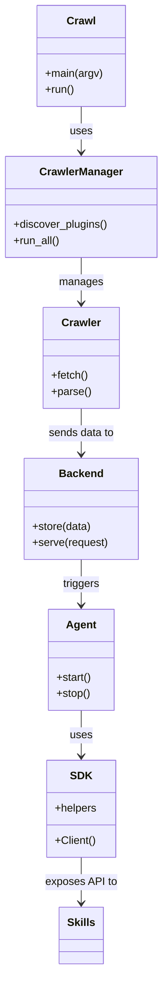

# Diagram: common/batch_service/config/config.prod-b.yml


> Auto-generated by Obscura crawlers

## Diagram 1

```mermaid
flowchart TD
    A[Crawl CLI (crawl.py)] --> B[Crawlers Manager (crawlers.py)]
    B --> C{Crawler plugins (crawlers/)}
    C -->|reads repos| D[Repo Fetcher]
    D --> E[Parser/Processor]
    E --> F[Backend (backend/)]
    F --> G[Agents (agents/)]
    G --> H[SDK (sdk/)]
    H --> I[Skills (skills/)]
    style A fill:#f9f,stroke:#333,stroke-width:1px
    style F fill:#fffae6,stroke:#333,stroke-width:1px
```

> SVG rendering failed for this diagram.

## Diagram 2



### SVG

<svg id="container" width="238.6328125" xmlns="http://www.w3.org/2000/svg" class="classDiagram" height="1438" viewBox="0 0 238.6328125 1438" role="graphics-document document" aria-roledescription="class"><style>#container{font-family:"trebuchet ms",verdana,arial,sans-serif;font-size:16px;fill:#333;}@keyframes edge-animation-frame{from{stroke-dashoffset:0;}}@keyframes dash{to{stroke-dashoffset:0;}}#container .edge-animation-slow{stroke-dasharray:9,5!important;stroke-dashoffset:900;animation:dash 50s linear infinite;stroke-linecap:round;}#container .edge-animation-fast{stroke-dasharray:9,5!important;stroke-dashoffset:900;animation:dash 20s linear infinite;stroke-linecap:round;}#container .error-icon{fill:#552222;}#container .error-text{fill:#552222;stroke:#552222;}#container .edge-thickness-normal{stroke-width:1px;}#container .edge-thickness-thick{stroke-width:3.5px;}#container .edge-pattern-solid{stroke-dasharray:0;}#container .edge-thickness-invisible{stroke-width:0;fill:none;}#container .edge-pattern-dashed{stroke-dasharray:3;}#container .edge-pattern-dotted{stroke-dasharray:2;}#container .marker{fill:#333333;stroke:#333333;}#container .marker.cross{stroke:#333333;}#container svg{font-family:"trebuchet ms",verdana,arial,sans-serif;font-size:16px;}#container p{margin:0;}#container g.classGroup text{fill:#9370DB;stroke:none;font-family:"trebuchet ms",verdana,arial,sans-serif;font-size:10px;}#container g.classGroup text .title{font-weight:bolder;}#container .nodeLabel,#container .edgeLabel{color:#131300;}#container .edgeLabel .label rect{fill:#ECECFF;}#container .label text{fill:#131300;}#container .labelBkg{background:#ECECFF;}#container .edgeLabel .label span{background:#ECECFF;}#container .classTitle{font-weight:bolder;}#container .node rect,#container .node circle,#container .node ellipse,#container .node polygon,#container .node path{fill:#ECECFF;stroke:#9370DB;stroke-width:1px;}#container .divider{stroke:#9370DB;stroke-width:1;}#container g.clickable{cursor:pointer;}#container g.classGroup rect{fill:#ECECFF;stroke:#9370DB;}#container g.classGroup line{stroke:#9370DB;stroke-width:1;}#container .classLabel .box{stroke:none;stroke-width:0;fill:#ECECFF;opacity:0.5;}#container .classLabel .label{fill:#9370DB;font-size:10px;}#container .relation{stroke:#333333;stroke-width:1;fill:none;}#container .dashed-line{stroke-dasharray:3;}#container .dotted-line{stroke-dasharray:1 2;}#container #compositionStart,#container .composition{fill:#333333!important;stroke:#333333!important;stroke-width:1;}#container #compositionEnd,#container .composition{fill:#333333!important;stroke:#333333!important;stroke-width:1;}#container #dependencyStart,#container .dependency{fill:#333333!important;stroke:#333333!important;stroke-width:1;}#container #dependencyStart,#container .dependency{fill:#333333!important;stroke:#333333!important;stroke-width:1;}#container #extensionStart,#container .extension{fill:transparent!important;stroke:#333333!important;stroke-width:1;}#container #extensionEnd,#container .extension{fill:transparent!important;stroke:#333333!important;stroke-width:1;}#container #aggregationStart,#container .aggregation{fill:transparent!important;stroke:#333333!important;stroke-width:1;}#container #aggregationEnd,#container .aggregation{fill:transparent!important;stroke:#333333!important;stroke-width:1;}#container #lollipopStart,#container .lollipop{fill:#ECECFF!important;stroke:#333333!important;stroke-width:1;}#container #lollipopEnd,#container .lollipop{fill:#ECECFF!important;stroke:#333333!important;stroke-width:1;}#container .edgeTerminals{font-size:11px;line-height:initial;}#container .classTitleText{text-anchor:middle;font-size:18px;fill:#333;}#container .label-icon{display:inline-block;height:1em;overflow:visible;vertical-align:-0.125em;}#container .node .label-icon path{fill:currentColor;stroke:revert;stroke-width:revert;}#container :root{--mermaid-font-family:"trebuchet ms",verdana,arial,sans-serif;}</style><g><defs><marker id="container_class-aggregationStart" class="marker aggregation class" refX="18" refY="7" markerWidth="190" markerHeight="240" orient="auto"><path d="M 18,7 L9,13 L1,7 L9,1 Z"></path></marker></defs><defs><marker id="container_class-aggregationEnd" class="marker aggregation class" refX="1" refY="7" markerWidth="20" markerHeight="28" orient="auto"><path d="M 18,7 L9,13 L1,7 L9,1 Z"></path></marker></defs><defs><marker id="container_class-extensionStart" class="marker extension class" refX="18" refY="7" markerWidth="190" markerHeight="240" orient="auto"><path d="M 1,7 L18,13 V 1 Z"></path></marker></defs><defs><marker id="container_class-extensionEnd" class="marker extension class" refX="1" refY="7" markerWidth="20" markerHeight="28" orient="auto"><path d="M 1,1 V 13 L18,7 Z"></path></marker></defs><defs><marker id="container_class-compositionStart" class="marker composition class" refX="18" refY="7" markerWidth="190" markerHeight="240" orient="auto"><path d="M 18,7 L9,13 L1,7 L9,1 Z"></path></marker></defs><defs><marker id="container_class-compositionEnd" class="marker composition class" refX="1" refY="7" markerWidth="20" markerHeight="28" orient="auto"><path d="M 18,7 L9,13 L1,7 L9,1 Z"></path></marker></defs><defs><marker id="container_class-dependencyStart" class="marker dependency class" refX="6" refY="7" markerWidth="190" markerHeight="240" orient="auto"><path d="M 5,7 L9,13 L1,7 L9,1 Z"></path></marker></defs><defs><marker id="container_class-dependencyEnd" class="marker dependency class" refX="13" refY="7" markerWidth="20" markerHeight="28" orient="auto"><path d="M 18,7 L9,13 L14,7 L9,1 Z"></path></marker></defs><defs><marker id="container_class-lollipopStart" class="marker lollipop class" refX="13" refY="7" markerWidth="190" markerHeight="240" orient="auto"><circle stroke="black" fill="transparent" cx="7" cy="7" r="6"></circle></marker></defs><defs><marker id="container_class-lollipopEnd" class="marker lollipop class" refX="1" refY="7" markerWidth="190" markerHeight="240" orient="auto"><circle stroke="black" fill="transparent" cx="7" cy="7" r="6"></circle></marker></defs><g class="root"><g class="clusters"></g><g class="edgePaths"><path d="M119.316,158L119.316,164.167C119.316,170.333,119.316,182.667,119.316,194C119.316,205.333,119.316,215.667,119.316,220.833L119.316,226" id="id_Crawl_CrawlerManager_1" class="edge-thickness-normal edge-pattern-solid relation" style=";;;" data-edge="true" data-et="edge" data-id="id_Crawl_CrawlerManager_1" data-points="W3sieCI6MTE5LjMxNjQwNjI1LCJ5IjoxNTh9LHsieCI6MTE5LjMxNjQwNjI1LCJ5IjoxOTV9LHsieCI6MTE5LjMxNjQwNjI1LCJ5IjoyMzJ9XQ==" marker-end="url(#container_class-dependencyEnd)"></path><path d="M119.316,382L119.316,388.167C119.316,394.333,119.316,406.667,119.316,418C119.316,429.333,119.316,439.667,119.316,444.833L119.316,450" id="id_CrawlerManager_Crawler_2" class="edge-thickness-normal edge-pattern-solid relation" style=";;;" data-edge="true" data-et="edge" data-id="id_CrawlerManager_Crawler_2" data-points="W3sieCI6MTE5LjMxNjQwNjI1LCJ5IjozODJ9LHsieCI6MTE5LjMxNjQwNjI1LCJ5Ijo0MTl9LHsieCI6MTE5LjMxNjQwNjI1LCJ5Ijo0NTZ9XQ==" marker-end="url(#container_class-dependencyEnd)"></path><path d="M119.316,606L119.316,612.167C119.316,618.333,119.316,630.667,119.316,642C119.316,653.333,119.316,663.667,119.316,668.833L119.316,674" id="id_Crawler_Backend_3" class="edge-thickness-normal edge-pattern-solid relation" style=";;;" data-edge="true" data-et="edge" data-id="id_Crawler_Backend_3" data-points="W3sieCI6MTE5LjMxNjQwNjI1LCJ5Ijo2MDZ9LHsieCI6MTE5LjMxNjQwNjI1LCJ5Ijo2NDN9LHsieCI6MTE5LjMxNjQwNjI1LCJ5Ijo2ODB9XQ==" marker-end="url(#container_class-dependencyEnd)"></path><path d="M119.316,830L119.316,836.167C119.316,842.333,119.316,854.667,119.316,866C119.316,877.333,119.316,887.667,119.316,892.833L119.316,898" id="id_Backend_Agent_4" class="edge-thickness-normal edge-pattern-solid relation" style=";;;" data-edge="true" data-et="edge" data-id="id_Backend_Agent_4" data-points="W3sieCI6MTE5LjMxNjQwNjI1LCJ5Ijo4MzB9LHsieCI6MTE5LjMxNjQwNjI1LCJ5Ijo4Njd9LHsieCI6MTE5LjMxNjQwNjI1LCJ5Ijo5MDR9XQ==" marker-end="url(#container_class-dependencyEnd)"></path><path d="M119.316,1054L119.316,1060.167C119.316,1066.333,119.316,1078.667,119.316,1090C119.316,1101.333,119.316,1111.667,119.316,1116.833L119.316,1122" id="id_Agent_SDK_5" class="edge-thickness-normal edge-pattern-solid relation" style=";;;" data-edge="true" data-et="edge" data-id="id_Agent_SDK_5" data-points="W3sieCI6MTE5LjMxNjQwNjI1LCJ5IjoxMDU0fSx7IngiOjExOS4zMTY0MDYyNSwieSI6MTA5MX0seyJ4IjoxMTkuMzE2NDA2MjUsInkiOjExMjh9XQ==" marker-end="url(#container_class-dependencyEnd)"></path><path d="M119.316,1272L119.316,1278.167C119.316,1284.333,119.316,1296.667,119.316,1308C119.316,1319.333,119.316,1329.667,119.316,1334.833L119.316,1340" id="id_SDK_Skills_6" class="edge-thickness-normal edge-pattern-solid relation" style=";;;" data-edge="true" data-et="edge" data-id="id_SDK_Skills_6" data-points="W3sieCI6MTE5LjMxNjQwNjI1LCJ5IjoxMjcyfSx7IngiOjExOS4zMTY0MDYyNSwieSI6MTMwOX0seyJ4IjoxMTkuMzE2NDA2MjUsInkiOjEzNDZ9XQ==" marker-end="url(#container_class-dependencyEnd)"></path></g><g class="edgeLabels"><g class="edgeLabel" transform="translate(119.31640625, 195)"><g class="label" data-id="id_Crawl_CrawlerManager_1" transform="translate(-16.4921875, -12)"><foreignObject width="32.984375" height="24"><div xmlns="http://www.w3.org/1999/xhtml" class="labelBkg" style="display: table-cell; white-space: nowrap; line-height: 1.5; max-width: 200px; text-align: center;"><span class="edgeLabel"><p>uses</p></span></div></foreignObject></g></g><g class="edgeLabel" transform="translate(119.31640625, 419)"><g class="label" data-id="id_CrawlerManager_Crawler_2" transform="translate(-32.296875, -12)"><foreignObject width="64.59375" height="24"><div xmlns="http://www.w3.org/1999/xhtml" class="labelBkg" style="display: table-cell; white-space: nowrap; line-height: 1.5; max-width: 200px; text-align: center;"><span class="edgeLabel"><p>manages</p></span></div></foreignObject></g></g><g class="edgeLabel" transform="translate(119.31640625, 643)"><g class="label" data-id="id_Crawler_Backend_3" transform="translate(-49.3046875, -12)"><foreignObject width="98.609375" height="24"><div xmlns="http://www.w3.org/1999/xhtml" class="labelBkg" style="display: table-cell; white-space: nowrap; line-height: 1.5; max-width: 200px; text-align: center;"><span class="edgeLabel"><p>sends data to</p></span></div></foreignObject></g></g><g class="edgeLabel" transform="translate(119.31640625, 867)"><g class="label" data-id="id_Backend_Agent_4" transform="translate(-27.4921875, -12)"><foreignObject width="54.984375" height="24"><div xmlns="http://www.w3.org/1999/xhtml" class="labelBkg" style="display: table-cell; white-space: nowrap; line-height: 1.5; max-width: 200px; text-align: center;"><span class="edgeLabel"><p>triggers</p></span></div></foreignObject></g></g><g class="edgeLabel" transform="translate(119.31640625, 1091)"><g class="label" data-id="id_Agent_SDK_5" transform="translate(-16.4921875, -12)"><foreignObject width="32.984375" height="24"><div xmlns="http://www.w3.org/1999/xhtml" class="labelBkg" style="display: table-cell; white-space: nowrap; line-height: 1.5; max-width: 200px; text-align: center;"><span class="edgeLabel"><p>uses</p></span></div></foreignObject></g></g><g class="edgeLabel" transform="translate(119.31640625, 1309)"><g class="label" data-id="id_SDK_Skills_6" transform="translate(-52.703125, -12)"><foreignObject width="105.40625" height="24"><div xmlns="http://www.w3.org/1999/xhtml" class="labelBkg" style="display: table-cell; white-space: nowrap; line-height: 1.5; max-width: 200px; text-align: center;"><span class="edgeLabel"><p>exposes API to</p></span></div></foreignObject></g></g></g><g class="nodes"><g class="node default" id="classId-Crawl-0" transform="translate(119.31640625, 83)"><g class="basic label-container"><path d="M-64.82421875 -75 L64.82421875 -75 L64.82421875 75 L-64.82421875 75" stroke="none" stroke-width="0" fill="#ECECFF" style=""></path><path d="M-64.82421875 -75 C-38.24325974692847 -75, -11.662300743856953 -75, 64.82421875 -75 M-64.82421875 -75 C-36.761823773706205 -75, -8.69942879741241 -75, 64.82421875 -75 M64.82421875 -75 C64.82421875 -42.93547602755686, 64.82421875 -10.870952055113719, 64.82421875 75 M64.82421875 -75 C64.82421875 -36.31569859469401, 64.82421875 2.368602810611975, 64.82421875 75 M64.82421875 75 C26.674385030291347 75, -11.475448689417306 75, -64.82421875 75 M64.82421875 75 C33.00231540439465 75, 1.180412058789294 75, -64.82421875 75 M-64.82421875 75 C-64.82421875 41.26246962104164, -64.82421875 7.524939242083278, -64.82421875 -75 M-64.82421875 75 C-64.82421875 19.992858387982352, -64.82421875 -35.014283224035296, -64.82421875 -75" stroke="#9370DB" stroke-width="1.3" fill="none" stroke-dasharray="0 0" style=""></path></g><g class="annotation-group text" transform="translate(0, -51)"></g><g class="label-group text" transform="translate(-20.1484375, -51)"><g class="label" style="font-weight: bolder" transform="translate(0,-12)"><foreignObject width="40.296875" height="24"><div xmlns="http://www.w3.org/1999/xhtml" style="display: table-cell; white-space: nowrap; line-height: 1.5; max-width: 89px; text-align: center;"><span class="nodeLabel markdown-node-label" style=""><p>Crawl</p></span></div></foreignObject></g></g><g class="members-group text" transform="translate(-52.82421875, -3)"></g><g class="methods-group text" transform="translate(-52.82421875, 27)"><g class="label" style="" transform="translate(0,-12)"><foreignObject width="85.5" height="24"><div xmlns="http://www.w3.org/1999/xhtml" style="display: table-cell; white-space: nowrap; line-height: 1.5; max-width: 143px; text-align: center;"><span class="nodeLabel markdown-node-label" style=""><p>+main(argv)</p></span></div></foreignObject></g><g class="label" style="" transform="translate(0,12)"><foreignObject width="43.21875" height="24"><div xmlns="http://www.w3.org/1999/xhtml" style="display: table-cell; white-space: nowrap; line-height: 1.5; max-width: 101px; text-align: center;"><span class="nodeLabel markdown-node-label" style=""><p>+run()</p></span></div></foreignObject></g></g><g class="divider" style=""><path d="M-64.82421875 -27 C-21.307719413096947 -27, 22.208779923806105 -27, 64.82421875 -27 M-64.82421875 -27 C-13.239489035157412 -27, 38.345240679685176 -27, 64.82421875 -27" stroke="#9370DB" stroke-width="1.3" fill="none" stroke-dasharray="0 0" style=""></path></g><g class="divider" style=""><path d="M-64.82421875 -3 C-32.198657622244745 -3, 0.42690350551050926 -3, 64.82421875 -3 M-64.82421875 -3 C-37.270703287765286 -3, -9.71718782553058 -3, 64.82421875 -3" stroke="#9370DB" stroke-width="1.3" fill="none" stroke-dasharray="0 0" style=""></path></g></g><g class="node default" id="classId-CrawlerManager-1" transform="translate(119.31640625, 307)"><g class="basic label-container"><path d="M-111.31640625 -75 L111.31640625 -75 L111.31640625 75 L-111.31640625 75" stroke="none" stroke-width="0" fill="#ECECFF" style=""></path><path d="M-111.31640625 -75 C-41.445473896091244 -75, 28.425458457817513 -75, 111.31640625 -75 M-111.31640625 -75 C-56.17422264273005 -75, -1.0320390354601017 -75, 111.31640625 -75 M111.31640625 -75 C111.31640625 -34.65574155601929, 111.31640625 5.688516887961427, 111.31640625 75 M111.31640625 -75 C111.31640625 -22.825840183171984, 111.31640625 29.348319633656033, 111.31640625 75 M111.31640625 75 C59.93061269263398 75, 8.544819135267957 75, -111.31640625 75 M111.31640625 75 C28.998373618413794 75, -53.31965901317241 75, -111.31640625 75 M-111.31640625 75 C-111.31640625 24.390285152525152, -111.31640625 -26.219429694949696, -111.31640625 -75 M-111.31640625 75 C-111.31640625 39.674079667460816, -111.31640625 4.3481593349216325, -111.31640625 -75" stroke="#9370DB" stroke-width="1.3" fill="none" stroke-dasharray="0 0" style=""></path></g><g class="annotation-group text" transform="translate(0, -51)"></g><g class="label-group text" transform="translate(-59.1796875, -51)"><g class="label" style="font-weight: bolder" transform="translate(0,-12)"><foreignObject width="118.359375" height="24"><div xmlns="http://www.w3.org/1999/xhtml" style="display: table-cell; white-space: nowrap; line-height: 1.5; max-width: 167px; text-align: center;"><span class="nodeLabel markdown-node-label" style=""><p>CrawlerManager</p></span></div></foreignObject></g></g><g class="members-group text" transform="translate(-99.31640625, -3)"></g><g class="methods-group text" transform="translate(-99.31640625, 27)"><g class="label" style="" transform="translate(0,-12)"><foreignObject width="139.453125" height="24"><div xmlns="http://www.w3.org/1999/xhtml" style="display: table-cell; white-space: nowrap; line-height: 1.5; max-width: 197px; text-align: center;"><span class="nodeLabel markdown-node-label" style=""><p>+discover_plugins()</p></span></div></foreignObject></g><g class="label" style="" transform="translate(0,12)"><foreignObject width="69.140625" height="24"><div xmlns="http://www.w3.org/1999/xhtml" style="display: table-cell; white-space: nowrap; line-height: 1.5; max-width: 127px; text-align: center;"><span class="nodeLabel markdown-node-label" style=""><p>+run_all()</p></span></div></foreignObject></g></g><g class="divider" style=""><path d="M-111.31640625 -27 C-27.654751532701297 -27, 56.006903184597405 -27, 111.31640625 -27 M-111.31640625 -27 C-63.46498157948049 -27, -15.613556908960973 -27, 111.31640625 -27" stroke="#9370DB" stroke-width="1.3" fill="none" stroke-dasharray="0 0" style=""></path></g><g class="divider" style=""><path d="M-111.31640625 -3 C-46.34259956813783 -3, 18.631207113724344 -3, 111.31640625 -3 M-111.31640625 -3 C-26.50293611194111 -3, 58.31053402611778 -3, 111.31640625 -3" stroke="#9370DB" stroke-width="1.3" fill="none" stroke-dasharray="0 0" style=""></path></g></g><g class="node default" id="classId-Crawler-2" transform="translate(119.31640625, 531)"><g class="basic label-container"><path d="M-55.1328125 -75 L55.1328125 -75 L55.1328125 75 L-55.1328125 75" stroke="none" stroke-width="0" fill="#ECECFF" style=""></path><path d="M-55.1328125 -75 C-24.46354616931567 -75, 6.20572016136866 -75, 55.1328125 -75 M-55.1328125 -75 C-25.82236639695411 -75, 3.4880797060917814 -75, 55.1328125 -75 M55.1328125 -75 C55.1328125 -43.06686259255333, 55.1328125 -11.133725185106655, 55.1328125 75 M55.1328125 -75 C55.1328125 -33.881773261782776, 55.1328125 7.236453476434448, 55.1328125 75 M55.1328125 75 C29.28016594232178 75, 3.42751938464356 75, -55.1328125 75 M55.1328125 75 C18.47332157929852 75, -18.18616934140296 75, -55.1328125 75 M-55.1328125 75 C-55.1328125 35.26956058398856, -55.1328125 -4.460878832022885, -55.1328125 -75 M-55.1328125 75 C-55.1328125 28.264960819503024, -55.1328125 -18.470078360993952, -55.1328125 -75" stroke="#9370DB" stroke-width="1.3" fill="none" stroke-dasharray="0 0" style=""></path></g><g class="annotation-group text" transform="translate(0, -51)"></g><g class="label-group text" transform="translate(-27.734375, -51)"><g class="label" style="font-weight: bolder" transform="translate(0,-12)"><foreignObject width="55.46875" height="24"><div xmlns="http://www.w3.org/1999/xhtml" style="display: table-cell; white-space: nowrap; line-height: 1.5; max-width: 105px; text-align: center;"><span class="nodeLabel markdown-node-label" style=""><p>Crawler</p></span></div></foreignObject></g></g><g class="members-group text" transform="translate(-43.1328125, -3)"></g><g class="methods-group text" transform="translate(-43.1328125, 27)"><g class="label" style="" transform="translate(0,-12)"><foreignObject width="54.59375" height="24"><div xmlns="http://www.w3.org/1999/xhtml" style="display: table-cell; white-space: nowrap; line-height: 1.5; max-width: 112px; text-align: center;"><span class="nodeLabel markdown-node-label" style=""><p>+fetch()</p></span></div></foreignObject></g><g class="label" style="" transform="translate(0,12)"><foreignObject width="58.53125" height="24"><div xmlns="http://www.w3.org/1999/xhtml" style="display: table-cell; white-space: nowrap; line-height: 1.5; max-width: 116px; text-align: center;"><span class="nodeLabel markdown-node-label" style=""><p>+parse()</p></span></div></foreignObject></g></g><g class="divider" style=""><path d="M-55.1328125 -27 C-14.251221767330946 -27, 26.630368965338107 -27, 55.1328125 -27 M-55.1328125 -27 C-24.35901476020961 -27, 6.414782979580778 -27, 55.1328125 -27" stroke="#9370DB" stroke-width="1.3" fill="none" stroke-dasharray="0 0" style=""></path></g><g class="divider" style=""><path d="M-55.1328125 -3 C-12.761823728043638 -3, 29.609165043912725 -3, 55.1328125 -3 M-55.1328125 -3 C-25.83189019260892 -3, 3.4690321147821592 -3, 55.1328125 -3" stroke="#9370DB" stroke-width="1.3" fill="none" stroke-dasharray="0 0" style=""></path></g></g><g class="node default" id="classId-Backend-3" transform="translate(119.31640625, 755)"><g class="basic label-container"><path d="M-83.90625 -75 L83.90625 -75 L83.90625 75 L-83.90625 75" stroke="none" stroke-width="0" fill="#ECECFF" style=""></path><path d="M-83.90625 -75 C-48.84199527789418 -75, -13.777740555788355 -75, 83.90625 -75 M-83.90625 -75 C-28.85843919878249 -75, 26.189371602435017 -75, 83.90625 -75 M83.90625 -75 C83.90625 -32.52926543274053, 83.90625 9.94146913451894, 83.90625 75 M83.90625 -75 C83.90625 -39.98764146404848, 83.90625 -4.975282928096959, 83.90625 75 M83.90625 75 C35.36786810928886 75, -13.170513781422287 75, -83.90625 75 M83.90625 75 C45.850466517299 75, 7.794683034597995 75, -83.90625 75 M-83.90625 75 C-83.90625 31.035977804025364, -83.90625 -12.928044391949271, -83.90625 -75 M-83.90625 75 C-83.90625 39.693797236461315, -83.90625 4.387594472922629, -83.90625 -75" stroke="#9370DB" stroke-width="1.3" fill="none" stroke-dasharray="0 0" style=""></path></g><g class="annotation-group text" transform="translate(0, -51)"></g><g class="label-group text" transform="translate(-31.296875, -51)"><g class="label" style="font-weight: bolder" transform="translate(0,-12)"><foreignObject width="62.59375" height="24"><div xmlns="http://www.w3.org/1999/xhtml" style="display: table-cell; white-space: nowrap; line-height: 1.5; max-width: 112px; text-align: center;"><span class="nodeLabel markdown-node-label" style=""><p>Backend</p></span></div></foreignObject></g></g><g class="members-group text" transform="translate(-71.90625, -3)"></g><g class="methods-group text" transform="translate(-71.90625, 27)"><g class="label" style="" transform="translate(0,-12)"><foreignObject width="87.765625" height="24"><div xmlns="http://www.w3.org/1999/xhtml" style="display: table-cell; white-space: nowrap; line-height: 1.5; max-width: 145px; text-align: center;"><span class="nodeLabel markdown-node-label" style=""><p>+store(data)</p></span></div></foreignObject></g><g class="label" style="" transform="translate(0,12)"><foreignObject width="112.515625" height="24"><div xmlns="http://www.w3.org/1999/xhtml" style="display: table-cell; white-space: nowrap; line-height: 1.5; max-width: 170px; text-align: center;"><span class="nodeLabel markdown-node-label" style=""><p>+serve(request)</p></span></div></foreignObject></g></g><g class="divider" style=""><path d="M-83.90625 -27 C-36.51546413261454 -27, 10.875321734770921 -27, 83.90625 -27 M-83.90625 -27 C-30.168997491308964 -27, 23.56825501738207 -27, 83.90625 -27" stroke="#9370DB" stroke-width="1.3" fill="none" stroke-dasharray="0 0" style=""></path></g><g class="divider" style=""><path d="M-83.90625 -3 C-21.29921050116087 -3, 41.30782899767826 -3, 83.90625 -3 M-83.90625 -3 C-17.182005866857082 -3, 49.542238266285835 -3, 83.90625 -3" stroke="#9370DB" stroke-width="1.3" fill="none" stroke-dasharray="0 0" style=""></path></g></g><g class="node default" id="classId-Agent-4" transform="translate(119.31640625, 979)"><g class="basic label-container"><path d="M-48.6171875 -75 L48.6171875 -75 L48.6171875 75 L-48.6171875 75" stroke="none" stroke-width="0" fill="#ECECFF" style=""></path><path d="M-48.6171875 -75 C-23.38584966482786 -75, 1.8454881703442823 -75, 48.6171875 -75 M-48.6171875 -75 C-16.27867228830975 -75, 16.0598429233805 -75, 48.6171875 -75 M48.6171875 -75 C48.6171875 -31.907955286174996, 48.6171875 11.184089427650008, 48.6171875 75 M48.6171875 -75 C48.6171875 -29.07442594821537, 48.6171875 16.85114810356926, 48.6171875 75 M48.6171875 75 C17.377659704965357 75, -13.861868090069287 75, -48.6171875 75 M48.6171875 75 C23.85097029631994 75, -0.915246907360121 75, -48.6171875 75 M-48.6171875 75 C-48.6171875 31.04940224938194, -48.6171875 -12.901195501236117, -48.6171875 -75 M-48.6171875 75 C-48.6171875 29.298922074576986, -48.6171875 -16.40215585084603, -48.6171875 -75" stroke="#9370DB" stroke-width="1.3" fill="none" stroke-dasharray="0 0" style=""></path></g><g class="annotation-group text" transform="translate(0, -51)"></g><g class="label-group text" transform="translate(-21.078125, -51)"><g class="label" style="font-weight: bolder" transform="translate(0,-12)"><foreignObject width="42.15625" height="24"><div xmlns="http://www.w3.org/1999/xhtml" style="display: table-cell; white-space: nowrap; line-height: 1.5; max-width: 91px; text-align: center;"><span class="nodeLabel markdown-node-label" style=""><p>Agent</p></span></div></foreignObject></g></g><g class="members-group text" transform="translate(-36.6171875, -3)"></g><g class="methods-group text" transform="translate(-36.6171875, 27)"><g class="label" style="" transform="translate(0,-12)"><foreignObject width="52.15625" height="24"><div xmlns="http://www.w3.org/1999/xhtml" style="display: table-cell; white-space: nowrap; line-height: 1.5; max-width: 110px; text-align: center;"><span class="nodeLabel markdown-node-label" style=""><p>+start()</p></span></div></foreignObject></g><g class="label" style="" transform="translate(0,12)"><foreignObject width="50.21875" height="24"><div xmlns="http://www.w3.org/1999/xhtml" style="display: table-cell; white-space: nowrap; line-height: 1.5; max-width: 108px; text-align: center;"><span class="nodeLabel markdown-node-label" style=""><p>+stop()</p></span></div></foreignObject></g></g><g class="divider" style=""><path d="M-48.6171875 -27 C-12.507999645982288 -27, 23.601188208035424 -27, 48.6171875 -27 M-48.6171875 -27 C-21.418060977011045 -27, 5.78106554597791 -27, 48.6171875 -27" stroke="#9370DB" stroke-width="1.3" fill="none" stroke-dasharray="0 0" style=""></path></g><g class="divider" style=""><path d="M-48.6171875 -3 C-13.517331360991129 -3, 21.582524778017742 -3, 48.6171875 -3 M-48.6171875 -3 C-11.243247670130714 -3, 26.130692159738572 -3, 48.6171875 -3" stroke="#9370DB" stroke-width="1.3" fill="none" stroke-dasharray="0 0" style=""></path></g></g><g class="node default" id="classId-SDK-5" transform="translate(119.31640625, 1200)"><g class="basic label-container"><path d="M-50.62890625 -72 L50.62890625 -72 L50.62890625 72 L-50.62890625 72" stroke="none" stroke-width="0" fill="#ECECFF" style=""></path><path d="M-50.62890625 -72 C-29.411030917404542 -72, -8.193155584809084 -72, 50.62890625 -72 M-50.62890625 -72 C-22.176584247174887 -72, 6.275737755650226 -72, 50.62890625 -72 M50.62890625 -72 C50.62890625 -17.103334757241605, 50.62890625 37.79333048551679, 50.62890625 72 M50.62890625 -72 C50.62890625 -34.334846001010995, 50.62890625 3.330307997978011, 50.62890625 72 M50.62890625 72 C18.638112867756742 72, -13.352680514486515 72, -50.62890625 72 M50.62890625 72 C15.967238307110314 72, -18.694429635779372 72, -50.62890625 72 M-50.62890625 72 C-50.62890625 42.37150909618897, -50.62890625 12.743018192377946, -50.62890625 -72 M-50.62890625 72 C-50.62890625 18.840185922857927, -50.62890625 -34.319628154284146, -50.62890625 -72" stroke="#9370DB" stroke-width="1.3" fill="none" stroke-dasharray="0 0" style=""></path></g><g class="annotation-group text" transform="translate(0, -48)"></g><g class="label-group text" transform="translate(-14.8515625, -48)"><g class="label" style="font-weight: bolder" transform="translate(0,-12)"><foreignObject width="29.703125" height="24"><div xmlns="http://www.w3.org/1999/xhtml" style="display: table-cell; white-space: nowrap; line-height: 1.5; max-width: 79px; text-align: center;"><span class="nodeLabel markdown-node-label" style=""><p>SDK</p></span></div></foreignObject></g></g><g class="members-group text" transform="translate(-38.62890625, 0)"><g class="label" style="" transform="translate(0,-12)"><foreignObject width="62.40625" height="24"><div xmlns="http://www.w3.org/1999/xhtml" style="display: table-cell; white-space: nowrap; line-height: 1.5; max-width: 120px; text-align: center;"><span class="nodeLabel markdown-node-label" style=""><p>+helpers</p></span></div></foreignObject></g></g><g class="methods-group text" transform="translate(-38.62890625, 48)"><g class="label" style="" transform="translate(0,-12)"><foreignObject width="60.234375" height="24"><div xmlns="http://www.w3.org/1999/xhtml" style="display: table-cell; white-space: nowrap; line-height: 1.5; max-width: 118px; text-align: center;"><span class="nodeLabel markdown-node-label" style=""><p>+Client()</p></span></div></foreignObject></g></g><g class="divider" style=""><path d="M-50.62890625 -24 C-12.581843246265734 -24, 25.46521975746853 -24, 50.62890625 -24 M-50.62890625 -24 C-29.512284977930793 -24, -8.395663705861587 -24, 50.62890625 -24" stroke="#9370DB" stroke-width="1.3" fill="none" stroke-dasharray="0 0" style=""></path></g><g class="divider" style=""><path d="M-50.62890625 24 C-27.120228240248363 24, -3.611550230496725 24, 50.62890625 24 M-50.62890625 24 C-16.743153758466526 24, 17.142598733066947 24, 50.62890625 24" stroke="#9370DB" stroke-width="1.3" fill="none" stroke-dasharray="0 0" style=""></path></g></g><g class="node default" id="classId-Skills-6" transform="translate(119.31640625, 1388)"><g class="basic label-container"><path d="M-31.8671875 -42 L31.8671875 -42 L31.8671875 42 L-31.8671875 42" stroke="none" stroke-width="0" fill="#ECECFF" style=""></path><path d="M-31.8671875 -42 C-11.68156304829283 -42, 8.50406140341434 -42, 31.8671875 -42 M-31.8671875 -42 C-11.155881210363187 -42, 9.555425079273625 -42, 31.8671875 -42 M31.8671875 -42 C31.8671875 -18.23347899638133, 31.8671875 5.533042007237341, 31.8671875 42 M31.8671875 -42 C31.8671875 -11.097980307988912, 31.8671875 19.804039384022175, 31.8671875 42 M31.8671875 42 C6.440727016628166 42, -18.985733466743667 42, -31.8671875 42 M31.8671875 42 C15.021314139960083 42, -1.8245592200798342 42, -31.8671875 42 M-31.8671875 42 C-31.8671875 10.14132454552744, -31.8671875 -21.71735090894512, -31.8671875 -42 M-31.8671875 42 C-31.8671875 9.703313642731814, -31.8671875 -22.593372714536372, -31.8671875 -42" stroke="#9370DB" stroke-width="1.3" fill="none" stroke-dasharray="0 0" style=""></path></g><g class="annotation-group text" transform="translate(0, -18)"></g><g class="label-group text" transform="translate(-19.8671875, -18)"><g class="label" style="font-weight: bolder" transform="translate(0,-12)"><foreignObject width="39.734375" height="24"><div xmlns="http://www.w3.org/1999/xhtml" style="display: table-cell; white-space: nowrap; line-height: 1.5; max-width: 88px; text-align: center;"><span class="nodeLabel markdown-node-label" style=""><p>Skills</p></span></div></foreignObject></g></g><g class="members-group text" transform="translate(-19.8671875, 30)"></g><g class="methods-group text" transform="translate(-19.8671875, 60)"></g><g class="divider" style=""><path d="M-31.8671875 6 C-6.415937321402286 6, 19.03531285719543 6, 31.8671875 6 M-31.8671875 6 C-16.431737539023818 6, -0.9962875780476352 6, 31.8671875 6" stroke="#9370DB" stroke-width="1.3" fill="none" stroke-dasharray="0 0" style=""></path></g><g class="divider" style=""><path d="M-31.8671875 24 C-13.631024137209522 24, 4.605139225580956 24, 31.8671875 24 M-31.8671875 24 C-16.050258690601694 24, -0.23332988120338527 24, 31.8671875 24" stroke="#9370DB" stroke-width="1.3" fill="none" stroke-dasharray="0 0" style=""></path></g></g></g></g></g></svg>
