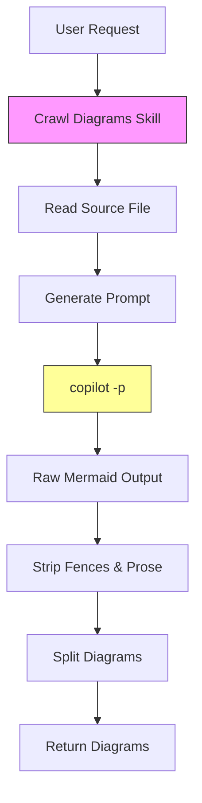
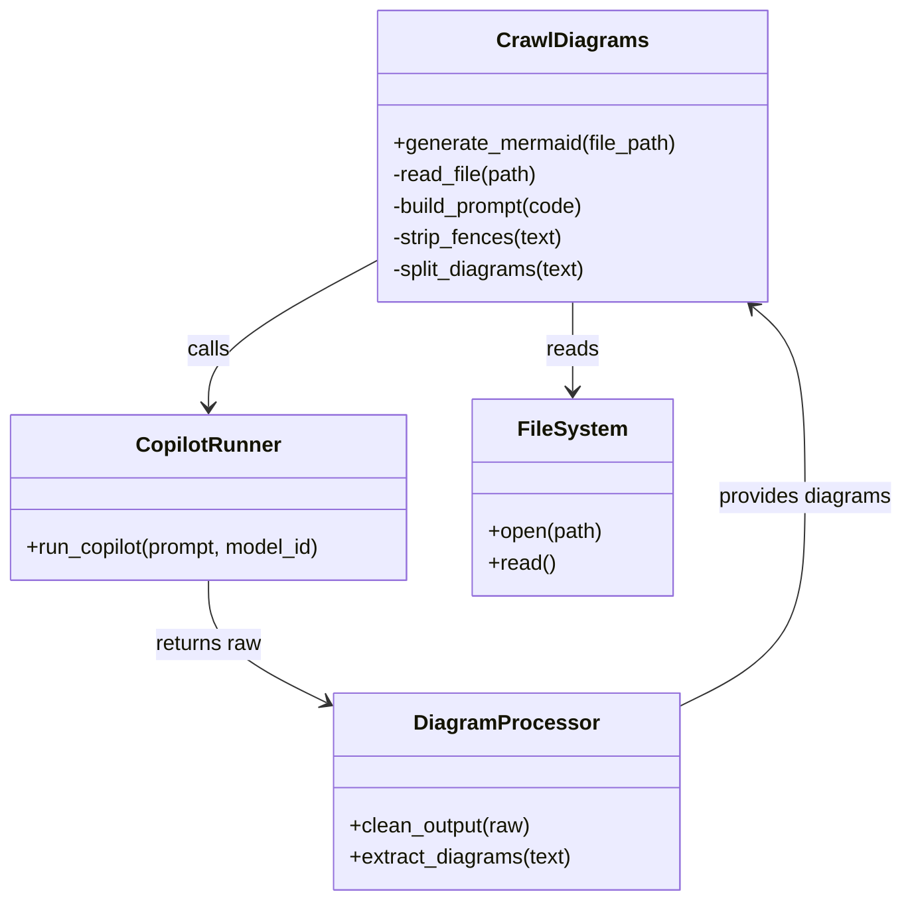

# Diagram: common/batch_service/config/config.qa.yml

> Auto-generated by Obscura crawlers

## Diagram 1

### SVG

<svg id="container" width="228.703125" xmlns="http://www.w3.org/2000/svg" class="flowchart" height="902" viewBox="0 0 228.703125 902" role="graphics-document document" aria-roledescription="flowchart-v2"><g><marker id="container_flowchart-v2-pointEnd" class="marker flowchart-v2" viewBox="0 0 10 10" refX="5" refY="5" markerUnits="userSpaceOnUse" markerWidth="8" markerHeight="8" orient="auto"><path d="M 0 0 L 10 5 L 0 10 z" class="arrowMarkerPath" style="stroke-width: 1; stroke-dasharray: 1, 0;"></path></marker><marker id="container_flowchart-v2-pointStart" class="marker flowchart-v2" viewBox="0 0 10 10" refX="4.5" refY="5" markerUnits="userSpaceOnUse" markerWidth="8" markerHeight="8" orient="auto"><path d="M 0 5 L 10 10 L 10 0 z" class="arrowMarkerPath" style="stroke-width: 1; stroke-dasharray: 1, 0;"></path></marker><marker id="container_flowchart-v2-circleEnd" class="marker flowchart-v2" viewBox="0 0 10 10" refX="11" refY="5" markerUnits="userSpaceOnUse" markerWidth="11" markerHeight="11" orient="auto"><circle cx="5" cy="5" r="5" class="arrowMarkerPath" style="stroke-width: 1; stroke-dasharray: 1, 0;"></circle></marker><marker id="container_flowchart-v2-circleStart" class="marker flowchart-v2" viewBox="0 0 10 10" refX="-1" refY="5" markerUnits="userSpaceOnUse" markerWidth="11" markerHeight="11" orient="auto"><circle cx="5" cy="5" r="5" class="arrowMarkerPath" style="stroke-width: 1; stroke-dasharray: 1, 0;"></circle></marker><marker id="container_flowchart-v2-crossEnd" class="marker cross flowchart-v2" viewBox="0 0 11 11" refX="12" refY="5.2" markerUnits="userSpaceOnUse" markerWidth="11" markerHeight="11" orient="auto"><path d="M 1,1 l 9,9 M 10,1 l -9,9" class="arrowMarkerPath" style="stroke-width: 2; stroke-dasharray: 1, 0;"></path></marker><marker id="container_flowchart-v2-crossStart" class="marker cross flowchart-v2" viewBox="0 0 11 11" refX="-1" refY="5.2" markerUnits="userSpaceOnUse" markerWidth="11" markerHeight="11" orient="auto"><path d="M 1,1 l 9,9 M 10,1 l -9,9" class="arrowMarkerPath" style="stroke-width: 2; stroke-dasharray: 1, 0;"></path></marker><g class="root"><g class="clusters"></g><g class="edgePaths"><path d="M114.352,62L114.352,66.167C114.352,70.333,114.352,78.667,114.352,86.333C114.352,94,114.352,101,114.352,104.5L114.352,108" id="L_A_B_0" class="edge-thickness-normal edge-pattern-solid edge-thickness-normal edge-pattern-solid flowchart-link" style=";" data-edge="true" data-et="edge" data-id="L_A_B_0" data-points="W3sieCI6MTE0LjM1MTU2MjUsInkiOjYyfSx7IngiOjExNC4zNTE1NjI1LCJ5Ijo4N30seyJ4IjoxMTQuMzUxNTYyNSwieSI6MTEyfV0=" marker-end="url(#container_flowchart-v2-pointEnd)"></path><path d="M114.352,166L114.352,170.167C114.352,174.333,114.352,182.667,114.352,190.333C114.352,198,114.352,205,114.352,208.5L114.352,212" id="L_B_C_0" class="edge-thickness-normal edge-pattern-solid edge-thickness-normal edge-pattern-solid flowchart-link" style=";" data-edge="true" data-et="edge" data-id="L_B_C_0" data-points="W3sieCI6MTE0LjM1MTU2MjUsInkiOjE2Nn0seyJ4IjoxMTQuMzUxNTYyNSwieSI6MTkxfSx7IngiOjExNC4zNTE1NjI1LCJ5IjoyMTZ9XQ==" marker-end="url(#container_flowchart-v2-pointEnd)"></path><path d="M114.352,270L114.352,274.167C114.352,278.333,114.352,286.667,114.352,294.333C114.352,302,114.352,309,114.352,312.5L114.352,316" id="L_C_D_0" class="edge-thickness-normal edge-pattern-solid edge-thickness-normal edge-pattern-solid flowchart-link" style=";" data-edge="true" data-et="edge" data-id="L_C_D_0" data-points="W3sieCI6MTE0LjM1MTU2MjUsInkiOjI3MH0seyJ4IjoxMTQuMzUxNTYyNSwieSI6Mjk1fSx7IngiOjExNC4zNTE1NjI1LCJ5IjozMjB9XQ==" marker-end="url(#container_flowchart-v2-pointEnd)"></path><path d="M114.352,374L114.352,378.167C114.352,382.333,114.352,390.667,114.352,398.333C114.352,406,114.352,413,114.352,416.5L114.352,420" id="L_D_E_0" class="edge-thickness-normal edge-pattern-solid edge-thickness-normal edge-pattern-solid flowchart-link" style=";" data-edge="true" data-et="edge" data-id="L_D_E_0" data-points="W3sieCI6MTE0LjM1MTU2MjUsInkiOjM3NH0seyJ4IjoxMTQuMzUxNTYyNSwieSI6Mzk5fSx7IngiOjExNC4zNTE1NjI1LCJ5Ijo0MjR9XQ==" marker-end="url(#container_flowchart-v2-pointEnd)"></path><path d="M114.352,478L114.352,482.167C114.352,486.333,114.352,494.667,114.352,502.333C114.352,510,114.352,517,114.352,520.5L114.352,524" id="L_E_F_0" class="edge-thickness-normal edge-pattern-solid edge-thickness-normal edge-pattern-solid flowchart-link" style=";" data-edge="true" data-et="edge" data-id="L_E_F_0" data-points="W3sieCI6MTE0LjM1MTU2MjUsInkiOjQ3OH0seyJ4IjoxMTQuMzUxNTYyNSwieSI6NTAzfSx7IngiOjExNC4zNTE1NjI1LCJ5Ijo1Mjh9XQ==" marker-end="url(#container_flowchart-v2-pointEnd)"></path><path d="M114.352,582L114.352,586.167C114.352,590.333,114.352,598.667,114.352,606.333C114.352,614,114.352,621,114.352,624.5L114.352,628" id="L_F_G_0" class="edge-thickness-normal edge-pattern-solid edge-thickness-normal edge-pattern-solid flowchart-link" style=";" data-edge="true" data-et="edge" data-id="L_F_G_0" data-points="W3sieCI6MTE0LjM1MTU2MjUsInkiOjU4Mn0seyJ4IjoxMTQuMzUxNTYyNSwieSI6NjA3fSx7IngiOjExNC4zNTE1NjI1LCJ5Ijo2MzJ9XQ==" marker-end="url(#container_flowchart-v2-pointEnd)"></path><path d="M114.352,686L114.352,690.167C114.352,694.333,114.352,702.667,114.352,710.333C114.352,718,114.352,725,114.352,728.5L114.352,732" id="L_G_H_0" class="edge-thickness-normal edge-pattern-solid edge-thickness-normal edge-pattern-solid flowchart-link" style=";" data-edge="true" data-et="edge" data-id="L_G_H_0" data-points="W3sieCI6MTE0LjM1MTU2MjUsInkiOjY4Nn0seyJ4IjoxMTQuMzUxNTYyNSwieSI6NzExfSx7IngiOjExNC4zNTE1NjI1LCJ5Ijo3MzZ9XQ==" marker-end="url(#container_flowchart-v2-pointEnd)"></path><path d="M114.352,790L114.352,794.167C114.352,798.333,114.352,806.667,114.352,814.333C114.352,822,114.352,829,114.352,832.5L114.352,836" id="L_H_I_0" class="edge-thickness-normal edge-pattern-solid edge-thickness-normal edge-pattern-solid flowchart-link" style=";" data-edge="true" data-et="edge" data-id="L_H_I_0" data-points="W3sieCI6MTE0LjM1MTU2MjUsInkiOjc5MH0seyJ4IjoxMTQuMzUxNTYyNSwieSI6ODE1fSx7IngiOjExNC4zNTE1NjI1LCJ5Ijo4NDB9XQ==" marker-end="url(#container_flowchart-v2-pointEnd)"></path></g><g class="edgeLabels"><g class="edgeLabel"><g class="label" data-id="L_A_B_0" transform="translate(0, 0)"><foreignObject width="0" height="0">

</foreignObject></g></g><g class="edgeLabel"><g class="label" data-id="L_B_C_0" transform="translate(0, 0)"><foreignObject width="0" height="0">

</foreignObject></g></g><g class="edgeLabel"><g class="label" data-id="L_C_D_0" transform="translate(0, 0)"><foreignObject width="0" height="0">

</foreignObject></g></g><g class="edgeLabel"><g class="label" data-id="L_D_E_0" transform="translate(0, 0)"><foreignObject width="0" height="0">

</foreignObject></g></g><g class="edgeLabel"><g class="label" data-id="L_E_F_0" transform="translate(0, 0)"><foreignObject width="0" height="0">

</foreignObject></g></g><g class="edgeLabel"><g class="label" data-id="L_F_G_0" transform="translate(0, 0)"><foreignObject width="0" height="0">

</foreignObject></g></g><g class="edgeLabel"><g class="label" data-id="L_G_H_0" transform="translate(0, 0)"><foreignObject width="0" height="0">

</foreignObject></g></g><g class="edgeLabel"><g class="label" data-id="L_H_I_0" transform="translate(0, 0)"><foreignObject width="0" height="0">

</foreignObject></g></g></g><g class="nodes"><g class="node default" id="flowchart-A-0" transform="translate(114.3515625, 35)"><rect class="basic label-container" style="" x="-78.0703125" y="-27" width="156.140625" height="54"></rect><g class="label" style="" transform="translate(-48.0703125, -12)"><rect></rect><foreignObject width="96.140625" height="24">

User Request

</foreignObject></g></g><g class="node default" id="flowchart-B-1" transform="translate(114.3515625, 139)"><rect class="basic label-container" style="fill:#f9f !important;stroke:#333 !important;stroke-width:1px !important" x="-102.796875" y="-27" width="205.59375" height="54"></rect><g class="label" style="" transform="translate(-72.796875, -12)"><rect></rect><foreignObject width="145.59375" height="24">

Crawl Diagrams Skill

</foreignObject></g></g><g class="node default" id="flowchart-C-3" transform="translate(114.3515625, 243)"><rect class="basic label-container" style="" x="-89.5078125" y="-27" width="179.015625" height="54"></rect><g class="label" style="" transform="translate(-59.5078125, -12)"><rect></rect><foreignObject width="119.015625" height="24">

Read Source File

</foreignObject></g></g><g class="node default" id="flowchart-D-5" transform="translate(114.3515625, 347)"><rect class="basic label-container" style="" x="-91.375" y="-27" width="182.75" height="54"></rect><g class="label" style="" transform="translate(-61.375, -12)"><rect></rect><foreignObject width="122.75" height="24">

Generate Prompt

</foreignObject></g></g><g class="node default" id="flowchart-E-7" transform="translate(114.3515625, 451)"><rect class="basic label-container" style="fill:#ff9 !important;stroke:#333 !important;stroke-width:1px !important" x="-65.3046875" y="-27" width="130.609375" height="54"></rect><g class="label" style="" transform="translate(-35.3046875, -12)"><rect></rect><foreignObject width="70.609375" height="24">

copilot -p

</foreignObject></g></g><g class="node default" id="flowchart-F-9" transform="translate(114.3515625, 555)"><rect class="basic label-container" style="" x="-106.3515625" y="-27" width="212.703125" height="54"></rect><g class="label" style="" transform="translate(-76.3515625, -12)"><rect></rect><foreignObject width="152.703125" height="24">

Raw Mermaid Output

</foreignObject></g></g><g class="node default" id="flowchart-G-11" transform="translate(114.3515625, 659)"><rect class="basic label-container" style="" x="-104.1015625" y="-27" width="208.203125" height="54"></rect><g class="label" style="" transform="translate(-74.1015625, -12)"><rect></rect><foreignObject width="148.203125" height="24">

Strip Fences &amp; Prose

</foreignObject></g></g><g class="node default" id="flowchart-H-13" transform="translate(114.3515625, 763)"><rect class="basic label-container" style="" x="-82.3125" y="-27" width="164.625" height="54"></rect><g class="label" style="" transform="translate(-52.3125, -12)"><rect></rect><foreignObject width="104.625" height="24">

Split Diagrams

</foreignObject></g></g><g class="node default" id="flowchart-I-15" transform="translate(114.3515625, 867)"><rect class="basic label-container" style="" x="-90.1171875" y="-27" width="180.234375" height="54"></rect><g class="label" style="" transform="translate(-60.1171875, -12)"><rect></rect><foreignObject width="120.234375" height="24">

Return Diagrams

</foreignObject></g></g></g></g></g></svg>

## Diagram 2

### SVG

<svg id="container" width="694.3984375" xmlns="http://www.w3.org/2000/svg" class="classDiagram" height="686" viewBox="0 0 694.3984375 686" role="graphics-document document" aria-roledescription="class"><g><defs><marker id="container_class-aggregationStart" class="marker aggregation class" refX="18" refY="7" markerWidth="190" markerHeight="240" orient="auto"><path d="M 18,7 L9,13 L1,7 L9,1 Z"></path></marker></defs><defs><marker id="container_class-aggregationEnd" class="marker aggregation class" refX="1" refY="7" markerWidth="20" markerHeight="28" orient="auto"><path d="M 18,7 L9,13 L1,7 L9,1 Z"></path></marker></defs><defs><marker id="container_class-extensionStart" class="marker extension class" refX="18" refY="7" markerWidth="190" markerHeight="240" orient="auto"><path d="M 1,7 L18,13 V 1 Z"></path></marker></defs><defs><marker id="container_class-extensionEnd" class="marker extension class" refX="1" refY="7" markerWidth="20" markerHeight="28" orient="auto"><path d="M 1,1 V 13 L18,7 Z"></path></marker></defs><defs><marker id="container_class-compositionStart" class="marker composition class" refX="18" refY="7" markerWidth="190" markerHeight="240" orient="auto"><path d="M 18,7 L9,13 L1,7 L9,1 Z"></path></marker></defs><defs><marker id="container_class-compositionEnd" class="marker composition class" refX="1" refY="7" markerWidth="20" markerHeight="28" orient="auto"><path d="M 18,7 L9,13 L1,7 L9,1 Z"></path></marker></defs><defs><marker id="container_class-dependencyStart" class="marker dependency class" refX="6" refY="7" markerWidth="190" markerHeight="240" orient="auto"><path d="M 5,7 L9,13 L1,7 L9,1 Z"></path></marker></defs><defs><marker id="container_class-dependencyEnd" class="marker dependency class" refX="13" refY="7" markerWidth="20" markerHeight="28" orient="auto"><path d="M 18,7 L9,13 L14,7 L9,1 Z"></path></marker></defs><defs><marker id="container_class-lollipopStart" class="marker lollipop class" refX="13" refY="7" markerWidth="190" markerHeight="240" orient="auto"><circle stroke="black" fill="transparent" cx="7" cy="7" r="6"></circle></marker></defs><defs><marker id="container_class-lollipopEnd" class="marker lollipop class" refX="1" refY="7" markerWidth="190" markerHeight="240" orient="auto"><circle stroke="black" fill="transparent" cx="7" cy="7" r="6"></circle></marker></defs><g class="root"><g class="clusters"></g><g class="edgePaths"><path d="M442.223,230L442.223,236.167C442.223,242.333,442.223,254.667,442.223,266C442.223,277.333,442.223,287.667,442.223,292.833L442.223,298" id="id_CrawlDiagrams_FileSystem_1" class="edge-thickness-normal edge-pattern-solid relation" style=";;;" data-edge="true" data-et="edge" data-id="id_CrawlDiagrams_FileSystem_1" data-points="W3sieCI6NDQyLjIyMjY1NjI1LCJ5IjoyMzB9LHsieCI6NDQyLjIyMjY1NjI1LCJ5IjoyNjd9LHsieCI6NDQyLjIyMjY1NjI1LCJ5IjozMDR9XQ==" marker-end="url(#container_class-dependencyEnd)"></path><path d="M293.773,197.454L271.841,209.045C249.909,220.636,206.044,243.818,184.112,262.576C162.18,281.333,162.18,295.667,162.18,302.833L162.18,310" id="id_CrawlDiagrams_CopilotRunner_2" class="edge-thickness-normal edge-pattern-solid relation" style=";;;" data-edge="true" data-et="edge" data-id="id_CrawlDiagrams_CopilotRunner_2" data-points="W3sieCI6MjkzLjc3MzQzNzUsInkiOjE5Ny40NTM5NzYwOTE4Mzg1N30seyJ4IjoxNjIuMTc5Njg3NSwieSI6MjY3fSx7IngiOjE2Mi4xNzk2ODc1LCJ5IjozMTZ9XQ==" marker-end="url(#container_class-dependencyEnd)"></path><path d="M162.18,442L162.18,450.167C162.18,458.333,162.18,474.667,177.705,490.434C193.23,506.201,224.28,521.401,239.805,529.001L255.33,536.602" id="id_CopilotRunner_DiagramProcessor_3" class="edge-thickness-normal edge-pattern-solid relation" style=";;;" data-edge="true" data-et="edge" data-id="id_CopilotRunner_DiagramProcessor_3" data-points="W3sieCI6MTYyLjE3OTY4NzUsInkiOjQ0Mn0seyJ4IjoxNjIuMTc5Njg3NSwieSI6NDkxfSx7IngiOjI2MC43MTg3NSwieSI6NTM5LjIzOTg1Nzk0MjkwNH1d" marker-end="url(#container_class-dependencyEnd)"></path><path d="M521.203,539.24L537.626,531.2C554.049,523.16,586.896,507.08,603.319,480.373C619.742,453.667,619.742,416.333,619.742,379C619.742,341.667,619.742,304.333,613.114,280.14C606.485,255.947,593.228,244.895,586.599,239.368L579.971,233.842" id="id_DiagramProcessor_CrawlDiagrams_4" class="edge-thickness-normal edge-pattern-solid relation" style=";;;" data-edge="true" data-et="edge" data-id="id_DiagramProcessor_CrawlDiagrams_4" data-points="W3sieCI6NTIxLjIwMzEyNSwieSI6NTM5LjIzOTg1Nzk0MjkwNH0seyJ4Ijo2MTkuNzQyMTg3NSwieSI6NDkxfSx7IngiOjYxOS43NDIxODc1LCJ5IjozNzl9LHsieCI6NjE5Ljc0MjE4NzUsInkiOjI2N30seyJ4Ijo1NzUuMzYyMzA0Njg3NSwieSI6MjMwfV0=" marker-end="url(#container_class-dependencyEnd)"></path></g><g class="edgeLabels"><g class="edgeLabel" transform="translate(442.22265625, 267)"><g class="label" data-id="id_CrawlDiagrams_FileSystem_1" transform="translate(-20.0078125, -12)"><foreignObject width="40.015625" height="24">

reads

</foreignObject></g></g><g class="edgeLabel" transform="translate(162.1796875, 267)"><g class="label" data-id="id_CrawlDiagrams_CopilotRunner_2" transform="translate(-16.4453125, -12)"><foreignObject width="32.890625" height="24">

calls

</foreignObject></g></g><g class="edgeLabel" transform="translate(162.1796875, 491)"><g class="label" data-id="id_CopilotRunner_DiagramProcessor_3" transform="translate(-41.2421875, -12)"><foreignObject width="82.484375" height="24">

returns raw

</foreignObject></g></g><g class="edgeLabel" transform="translate(619.7421875, 379)"><g class="label" data-id="id_DiagramProcessor_CrawlDiagrams_4" transform="translate(-66.65625, -12)"><foreignObject width="133.3125" height="24">

provides diagrams

</foreignObject></g></g></g><g class="nodes"><g class="node default" id="classId-CrawlDiagrams-0" transform="translate(442.22265625, 119)"><g class="basic label-container"><path d="M-148.44921875 -111 L148.44921875 -111 L148.44921875 111 L-148.44921875 111" stroke="none" stroke-width="0" fill="#ECECFF" style=""></path><path d="M-148.44921875 -111 C-39.348640048976065 -111, 69.75193865204787 -111, 148.44921875 -111 M-148.44921875 -111 C-52.42454117287028 -111, 43.600136404259445 -111, 148.44921875 -111 M148.44921875 -111 C148.44921875 -55.04259981759525, 148.44921875 0.9148003648094942, 148.44921875 111 M148.44921875 -111 C148.44921875 -22.574644453524755, 148.44921875 65.85071109295049, 148.44921875 111 M148.44921875 111 C51.01986104853387 111, -46.40949665293226 111, -148.44921875 111 M148.44921875 111 C79.42031801711123 111, 10.391417284222456 111, -148.44921875 111 M-148.44921875 111 C-148.44921875 66.02717358778908, -148.44921875 21.054347175578158, -148.44921875 -111 M-148.44921875 111 C-148.44921875 54.54159970327681, -148.44921875 -1.916800593446382, -148.44921875 -111" stroke="#9370DB" stroke-width="1.3" fill="none" stroke-dasharray="0 0" style=""></path></g><g class="annotation-group text" transform="translate(0, -87)"></g><g class="label-group text" transform="translate(-54.2578125, -87)"><g class="label" style="font-weight: bolder" transform="translate(0,-12)"><foreignObject width="108.515625" height="24">

CrawlDiagrams

</foreignObject></g></g><g class="members-group text" transform="translate(-136.44921875, -39)"></g><g class="methods-group text" transform="translate(-136.44921875, -9)"><g class="label" style="" transform="translate(0,-12)"><foreignObject width="218.640625" height="24">

+generate_mermaid(file_path)

</foreignObject></g><g class="label" style="" transform="translate(0,12)"><foreignObject width="113.078125" height="24">

-read_file(path)

</foreignObject></g><g class="label" style="" transform="translate(0,36)"><foreignObject width="151.140625" height="24">

-build_prompt(code)

</foreignObject></g><g class="label" style="" transform="translate(0,60)"><foreignObject width="132.40625" height="24">

-strip_fences(text)

</foreignObject></g><g class="label" style="" transform="translate(0,84)"><foreignObject width="150.875" height="24">

-split_diagrams(text)

</foreignObject></g></g><g class="divider" style=""><path d="M-148.44921875 -63 C-67.51505767566901 -63, 13.419103398661974 -63, 148.44921875 -63 M-148.44921875 -63 C-80.39020266251039 -63, -12.33118657502078 -63, 148.44921875 -63" stroke="#9370DB" stroke-width="1.3" fill="none" stroke-dasharray="0 0" style=""></path></g><g class="divider" style=""><path d="M-148.44921875 -39 C-55.971668440063354 -39, 36.50588186987329 -39, 148.44921875 -39 M-148.44921875 -39 C-88.67032407325024 -39, -28.891429396500484 -39, 148.44921875 -39" stroke="#9370DB" stroke-width="1.3" fill="none" stroke-dasharray="0 0" style=""></path></g></g><g class="node default" id="classId-CopilotRunner-1" transform="translate(162.1796875, 379)"><g class="basic label-container"><path d="M-154.1796875 -63 L154.1796875 -63 L154.1796875 63 L-154.1796875 63" stroke="none" stroke-width="0" fill="#ECECFF" style=""></path><path d="M-154.1796875 -63 C-58.62414551652549 -63, 36.931396466949025 -63, 154.1796875 -63 M-154.1796875 -63 C-89.71891341499159 -63, -25.25813932998318 -63, 154.1796875 -63 M154.1796875 -63 C154.1796875 -31.88784994021903, 154.1796875 -0.7756998804380615, 154.1796875 63 M154.1796875 -63 C154.1796875 -37.70328298120019, 154.1796875 -12.406565962400371, 154.1796875 63 M154.1796875 63 C86.52140289607497 63, 18.86311829214995 63, -154.1796875 63 M154.1796875 63 C59.700965319590566 63, -34.77775686081887 63, -154.1796875 63 M-154.1796875 63 C-154.1796875 25.427684642627682, -154.1796875 -12.144630714744636, -154.1796875 -63 M-154.1796875 63 C-154.1796875 29.34359977584805, -154.1796875 -4.3128004483039035, -154.1796875 -63" stroke="#9370DB" stroke-width="1.3" fill="none" stroke-dasharray="0 0" style=""></path></g><g class="annotation-group text" transform="translate(0, -39)"></g><g class="label-group text" transform="translate(-52.609375, -39)"><g class="label" style="font-weight: bolder" transform="translate(0,-12)"><foreignObject width="105.21875" height="24">

CopilotRunner

</foreignObject></g></g><g class="members-group text" transform="translate(-142.1796875, 9)"></g><g class="methods-group text" transform="translate(-142.1796875, 39)"><g class="label" style="" transform="translate(0,-12)"><foreignObject width="231.75" height="24">

+run_copilot(prompt, model_id)

</foreignObject></g></g><g class="divider" style=""><path d="M-154.1796875 -15 C-53.042642525863556 -15, 48.09440244827289 -15, 154.1796875 -15 M-154.1796875 -15 C-73.11980216781797 -15, 7.940083164364069 -15, 154.1796875 -15" stroke="#9370DB" stroke-width="1.3" fill="none" stroke-dasharray="0 0" style=""></path></g><g class="divider" style=""><path d="M-154.1796875 9 C-39.87444895980579 9, 74.43078958038842 9, 154.1796875 9 M-154.1796875 9 C-78.44424181562286 9, -2.7087961312457196 9, 154.1796875 9" stroke="#9370DB" stroke-width="1.3" fill="none" stroke-dasharray="0 0" style=""></path></g></g><g class="node default" id="classId-DiagramProcessor-2" transform="translate(390.9609375, 603)"><g class="basic label-container"><path d="M-130.2421875 -75 L130.2421875 -75 L130.2421875 75 L-130.2421875 75" stroke="none" stroke-width="0" fill="#ECECFF" style=""></path><path d="M-130.2421875 -75 C-67.31298892720694 -75, -4.38379035441389 -75, 130.2421875 -75 M-130.2421875 -75 C-26.678841926426216 -75, 76.88450364714757 -75, 130.2421875 -75 M130.2421875 -75 C130.2421875 -19.08551706822054, 130.2421875 36.82896586355892, 130.2421875 75 M130.2421875 -75 C130.2421875 -28.16517833662813, 130.2421875 18.66964332674374, 130.2421875 75 M130.2421875 75 C61.358720763417324 75, -7.524745973165352 75, -130.2421875 75 M130.2421875 75 C58.146113015763675 75, -13.949961468472651 75, -130.2421875 75 M-130.2421875 75 C-130.2421875 36.841716805679575, -130.2421875 -1.316566388640851, -130.2421875 -75 M-130.2421875 75 C-130.2421875 43.48445720068624, -130.2421875 11.968914401372487, -130.2421875 -75" stroke="#9370DB" stroke-width="1.3" fill="none" stroke-dasharray="0 0" style=""></path></g><g class="annotation-group text" transform="translate(0, -51)"></g><g class="label-group text" transform="translate(-66.171875, -51)"><g class="label" style="font-weight: bolder" transform="translate(0,-12)"><foreignObject width="132.34375" height="24">

DiagramProcessor

</foreignObject></g></g><g class="members-group text" transform="translate(-118.2421875, -3)"></g><g class="methods-group text" transform="translate(-118.2421875, 27)"><g class="label" style="" transform="translate(0,-12)"><foreignObject width="139.984375" height="24">

+clean_output(raw)

</foreignObject></g><g class="label" style="" transform="translate(0,12)"><foreignObject width="170.3125" height="24">

+extract_diagrams(text)

</foreignObject></g></g><g class="divider" style=""><path d="M-130.2421875 -27 C-48.141175054165345 -27, 33.95983739166931 -27, 130.2421875 -27 M-130.2421875 -27 C-34.91557996854857 -27, 60.41102756290286 -27, 130.2421875 -27" stroke="#9370DB" stroke-width="1.3" fill="none" stroke-dasharray="0 0" style=""></path></g><g class="divider" style=""><path d="M-130.2421875 -3 C-71.66714020720703 -3, -13.092092914414053 -3, 130.2421875 -3 M-130.2421875 -3 C-56.388956993331306 -3, 17.46427351333739 -3, 130.2421875 -3" stroke="#9370DB" stroke-width="1.3" fill="none" stroke-dasharray="0 0" style=""></path></g></g><g class="node default" id="classId-FileSystem-3" transform="translate(442.22265625, 379)"><g class="basic label-container"><path d="M-75.86328125 -75 L75.86328125 -75 L75.86328125 75 L-75.86328125 75" stroke="none" stroke-width="0" fill="#ECECFF" style=""></path><path d="M-75.86328125 -75 C-39.33728815132399 -75, -2.811295052647978 -75, 75.86328125 -75 M-75.86328125 -75 C-45.31324380054987 -75, -14.76320635109974 -75, 75.86328125 -75 M75.86328125 -75 C75.86328125 -27.181858272595036, 75.86328125 20.636283454809927, 75.86328125 75 M75.86328125 -75 C75.86328125 -35.370289025333726, 75.86328125 4.259421949332548, 75.86328125 75 M75.86328125 75 C35.752065698369265 75, -4.359149853261471 75, -75.86328125 75 M75.86328125 75 C43.722503181026326 75, 11.581725112052652 75, -75.86328125 75 M-75.86328125 75 C-75.86328125 16.08584550532514, -75.86328125 -42.82830898934972, -75.86328125 -75 M-75.86328125 75 C-75.86328125 29.929638368701433, -75.86328125 -15.140723262597135, -75.86328125 -75" stroke="#9370DB" stroke-width="1.3" fill="none" stroke-dasharray="0 0" style=""></path></g><g class="annotation-group text" transform="translate(0, -51)"></g><g class="label-group text" transform="translate(-39.2265625, -51)"><g class="label" style="font-weight: bolder" transform="translate(0,-12)"><foreignObject width="78.453125" height="24">

FileSystem

</foreignObject></g></g><g class="members-group text" transform="translate(-63.86328125, -3)"></g><g class="methods-group text" transform="translate(-63.86328125, 27)"><g class="label" style="" transform="translate(0,-12)"><foreignObject width="88.5" height="24">

+open(path)

</foreignObject></g><g class="label" style="" transform="translate(0,12)"><foreignObject width="50.890625" height="24">

+read()

</foreignObject></g></g><g class="divider" style=""><path d="M-75.86328125 -27 C-20.626226113083746 -27, 34.61082902383251 -27, 75.86328125 -27 M-75.86328125 -27 C-38.16445087893012 -27, -0.4656205078602369 -27, 75.86328125 -27" stroke="#9370DB" stroke-width="1.3" fill="none" stroke-dasharray="0 0" style=""></path></g><g class="divider" style=""><path d="M-75.86328125 -3 C-23.048216711341162 -3, 29.766847827317676 -3, 75.86328125 -3 M-75.86328125 -3 C-32.46307144161503 -3, 10.937138366769943 -3, 75.86328125 -3" stroke="#9370DB" stroke-width="1.3" fill="none" stroke-dasharray="0 0" style=""></path></g></g></g></g></g></svg>
