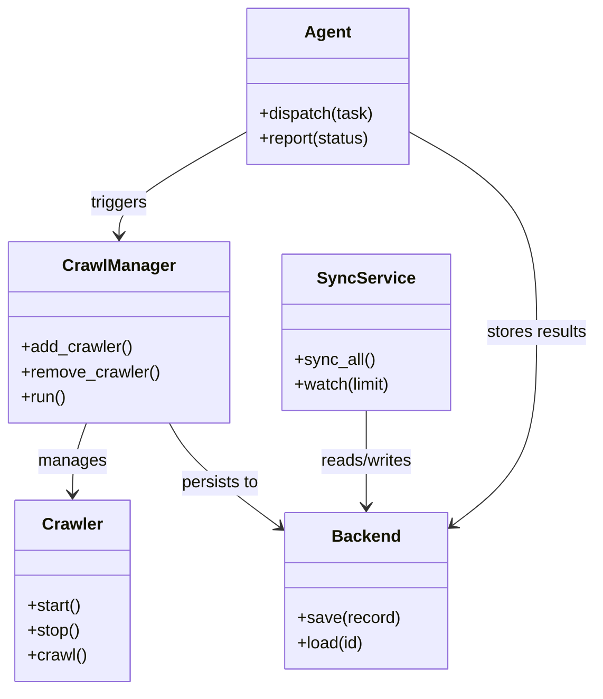

# Diagram: common/batch_service/config/config.qa2.yml

> Auto-generated by Obscura crawlers

## Mermaid

### SVG

<svg id="container" width="568.9140625" xmlns="http://www.w3.org/2000/svg" class="classDiagram" height="662" viewBox="0 0 568.9140625 662" role="graphics-document document" aria-roledescription="class"><g><defs><marker id="container_class-aggregationStart" class="marker aggregation class" refX="18" refY="7" markerWidth="190" markerHeight="240" orient="auto"><path d="M 18,7 L9,13 L1,7 L9,1 Z"></path></marker></defs><defs><marker id="container_class-aggregationEnd" class="marker aggregation class" refX="1" refY="7" markerWidth="20" markerHeight="28" orient="auto"><path d="M 18,7 L9,13 L1,7 L9,1 Z"></path></marker></defs><defs><marker id="container_class-extensionStart" class="marker extension class" refX="18" refY="7" markerWidth="190" markerHeight="240" orient="auto"><path d="M 1,7 L18,13 V 1 Z"></path></marker></defs><defs><marker id="container_class-extensionEnd" class="marker extension class" refX="1" refY="7" markerWidth="20" markerHeight="28" orient="auto"><path d="M 1,1 V 13 L18,7 Z"></path></marker></defs><defs><marker id="container_class-compositionStart" class="marker composition class" refX="18" refY="7" markerWidth="190" markerHeight="240" orient="auto"><path d="M 18,7 L9,13 L1,7 L9,1 Z"></path></marker></defs><defs><marker id="container_class-compositionEnd" class="marker composition class" refX="1" refY="7" markerWidth="20" markerHeight="28" orient="auto"><path d="M 18,7 L9,13 L1,7 L9,1 Z"></path></marker></defs><defs><marker id="container_class-dependencyStart" class="marker dependency class" refX="6" refY="7" markerWidth="190" markerHeight="240" orient="auto"><path d="M 5,7 L9,13 L1,7 L9,1 Z"></path></marker></defs><defs><marker id="container_class-dependencyEnd" class="marker dependency class" refX="13" refY="7" markerWidth="20" markerHeight="28" orient="auto"><path d="M 18,7 L9,13 L14,7 L9,1 Z"></path></marker></defs><defs><marker id="container_class-lollipopStart" class="marker lollipop class" refX="13" refY="7" markerWidth="190" markerHeight="240" orient="auto"><circle stroke="black" fill="transparent" cx="7" cy="7" r="6"></circle></marker></defs><defs><marker id="container_class-lollipopEnd" class="marker lollipop class" refX="1" refY="7" markerWidth="190" markerHeight="240" orient="auto"><circle stroke="black" fill="transparent" cx="7" cy="7" r="6"></circle></marker></defs><g class="root"><g class="clusters"></g><g class="edgePaths"><path d="M80.545,406L78.3,412.167C76.055,418.333,71.564,430.667,69.319,442C67.074,453.333,67.074,463.667,67.074,468.833L67.074,474" id="id_CrawlManager_Crawler_1" class="edge-thickness-normal edge-pattern-solid relation" style=";;;" data-edge="true" data-et="edge" data-id="id_CrawlManager_Crawler_1" data-points="W3sieCI6ODAuNTQ0NzY0MzY0OTE5MzYsInkiOjQwNn0seyJ4Ijo2Ny4wNzQyMTg3NSwieSI6NDQzfSx7IngiOjY3LjA3NDIxODc1LCJ5Ijo0ODB9XQ==" marker-end="url(#container_class-dependencyEnd)"></path><path d="M158.247,406L161.51,412.167C164.772,418.333,171.297,430.667,189.317,447.626C207.336,464.586,236.85,486.172,251.607,496.965L266.364,507.758" id="id_CrawlManager_Backend_2" class="edge-thickness-normal edge-pattern-solid relation" style=";;;" data-edge="true" data-et="edge" data-id="id_CrawlManager_Backend_2" data-points="W3sieCI6MTU4LjI0NzAyMzA1OTQ3NTgsInkiOjQwNn0seyJ4IjoxNzcuODIyMjY1NjI1LCJ5Ijo0NDN9LHsieCI6MjcxLjIwNzAzMTI1LCJ5Ijo1MTEuMzAwMzUxMzYyMjQ4N31d" marker-end="url(#container_class-dependencyEnd)"></path><path d="M347.363,394L347.363,402.167C347.363,410.333,347.363,426.667,347.363,442C347.363,457.333,347.363,471.667,347.363,478.833L347.363,486" id="id_SyncService_Backend_3" class="edge-thickness-normal edge-pattern-solid relation" style=";;;" data-edge="true" data-et="edge" data-id="id_SyncService_Backend_3" data-points="W3sieCI6MzQ3LjM2MzI4MTI1LCJ5IjozOTR9LHsieCI6MzQ3LjM2MzI4MTI1LCJ5Ijo0NDN9LHsieCI6MzQ3LjM2MzI4MTI1LCJ5Ijo0OTJ9XQ==" marker-end="url(#container_class-dependencyEnd)"></path><path d="M234.426,126.544L214.058,137.953C193.69,149.363,152.954,172.181,132.587,188.757C112.219,205.333,112.219,215.667,112.219,220.833L112.219,226" id="id_Agent_CrawlManager_4" class="edge-thickness-normal edge-pattern-solid relation" style=";;;" data-edge="true" data-et="edge" data-id="id_Agent_CrawlManager_4" data-points="W3sieCI6MjM0LjQyNTc4MTI1LCJ5IjoxMjYuNTQ0MDA3MDMzMzEwNTV9LHsieCI6MTEyLjIxODc1LCJ5IjoxOTV9LHsieCI6MTEyLjIxODc1LCJ5IjoyMzJ9XQ==" marker-end="url(#container_class-dependencyEnd)"></path><path d="M389.895,126.544L410.262,137.953C430.63,149.363,471.366,172.181,491.734,204.257C512.102,236.333,512.102,277.667,512.102,319C512.102,360.333,512.102,401.667,498.137,432.845C484.172,464.023,456.243,485.045,442.278,495.557L428.313,506.068" id="id_Agent_Backend_5" class="edge-thickness-normal edge-pattern-solid relation" style=";;;" data-edge="true" data-et="edge" data-id="id_Agent_Backend_5" data-points="W3sieCI6Mzg5Ljg5NDUzMTI1LCJ5IjoxMjYuNTQ0MDA3MDMzMzEwNTV9LHsieCI6NTEyLjEwMTU2MjUsInkiOjE5NX0seyJ4Ijo1MTIuMTAxNTYyNSwieSI6MzE5fSx7IngiOjUxMi4xMDE1NjI1LCJ5Ijo0NDN9LHsieCI6NDIzLjUxOTUzMTI1LCJ5Ijo1MDkuNjc2NDk5MTgxOTQxMDR9XQ==" marker-end="url(#container_class-dependencyEnd)"></path></g><g class="edgeLabels"><g class="edgeLabel" transform="translate(67.07421875, 443)"><g class="label" data-id="id_CrawlManager_Crawler_1" transform="translate(-32.296875, -12)"><foreignObject width="64.59375" height="24">

manages

</foreignObject></g></g><g class="edgeLabel" transform="translate(207.62126, 464.79458)"><g class="label" data-id="id_CrawlManager_Backend_2" transform="translate(-37.9921875, -12)"><foreignObject width="75.984375" height="24">

persists to

</foreignObject></g></g><g class="edgeLabel" transform="translate(347.36328125, 443)"><g class="label" data-id="id_SyncService_Backend_3" transform="translate(-45.9453125, -12)"><foreignObject width="91.890625" height="24">

reads/writes

</foreignObject></g></g><g class="edgeLabel" transform="translate(112.21875, 195)"><g class="label" data-id="id_Agent_CrawlManager_4" transform="translate(-27.4921875, -12)"><foreignObject width="54.984375" height="24">

triggers

</foreignObject></g></g><g class="edgeLabel" transform="translate(512.1015625, 319)"><g class="label" data-id="id_Agent_Backend_5" transform="translate(-48.8125, -12)"><foreignObject width="97.625" height="24">

stores results

</foreignObject></g></g></g><g class="nodes"><g class="node default" id="classId-Crawler-0" transform="translate(67.07421875, 567)"><g class="basic label-container"><path d="M-54.0703125 -87 L54.0703125 -87 L54.0703125 87 L-54.0703125 87" stroke="none" stroke-width="0" fill="#ECECFF" style=""></path><path d="M-54.0703125 -87 C-32.22714119281355 -87, -10.383969885627089 -87, 54.0703125 -87 M-54.0703125 -87 C-29.796140557703986 -87, -5.521968615407971 -87, 54.0703125 -87 M54.0703125 -87 C54.0703125 -50.81092310597817, 54.0703125 -14.621846211956338, 54.0703125 87 M54.0703125 -87 C54.0703125 -34.68584106236081, 54.0703125 17.628317875278384, 54.0703125 87 M54.0703125 87 C16.803852472236763 87, -20.462607555526475 87, -54.0703125 87 M54.0703125 87 C23.223942828426956 87, -7.622426843146087 87, -54.0703125 87 M-54.0703125 87 C-54.0703125 18.407065723071497, -54.0703125 -50.185868553857006, -54.0703125 -87 M-54.0703125 87 C-54.0703125 18.483620267249663, -54.0703125 -50.032759465500675, -54.0703125 -87" stroke="#9370DB" stroke-width="1.3" fill="none" stroke-dasharray="0 0" style=""></path></g><g class="annotation-group text" transform="translate(0, -63)"></g><g class="label-group text" transform="translate(-27.734375, -63)"><g class="label" style="font-weight: bolder" transform="translate(0,-12)"><foreignObject width="55.46875" height="24">

Crawler

</foreignObject></g></g><g class="members-group text" transform="translate(-42.0703125, -15)"></g><g class="methods-group text" transform="translate(-42.0703125, 15)"><g class="label" style="" transform="translate(0,-12)"><foreignObject width="52.15625" height="24">

+start()

</foreignObject></g><g class="label" style="" transform="translate(0,12)"><foreignObject width="50.21875" height="24">

+stop()

</foreignObject></g><g class="label" style="" transform="translate(0,36)"><foreignObject width="56.40625" height="24">

+crawl()

</foreignObject></g></g><g class="divider" style=""><path d="M-54.0703125 -39 C-16.507779216096495 -39, 21.05475406780701 -39, 54.0703125 -39 M-54.0703125 -39 C-26.523554838556038 -39, 1.0232028228879244 -39, 54.0703125 -39" stroke="#9370DB" stroke-width="1.3" fill="none" stroke-dasharray="0 0" style=""></path></g><g class="divider" style=""><path d="M-54.0703125 -15 C-29.8409134713752 -15, -5.611514442750398 -15, 54.0703125 -15 M-54.0703125 -15 C-21.561801735866865 -15, 10.94670902826627 -15, 54.0703125 -15" stroke="#9370DB" stroke-width="1.3" fill="none" stroke-dasharray="0 0" style=""></path></g></g><g class="node default" id="classId-CrawlManager-1" transform="translate(112.21875, 319)"><g class="basic label-container"><path d="M-104.21875 -87 L104.21875 -87 L104.21875 87 L-104.21875 87" stroke="none" stroke-width="0" fill="#ECECFF" style=""></path><path d="M-104.21875 -87 C-60.09243499172298 -87, -15.966119983445964 -87, 104.21875 -87 M-104.21875 -87 C-35.5014085561682 -87, 33.2159328876636 -87, 104.21875 -87 M104.21875 -87 C104.21875 -29.865500627322938, 104.21875 27.268998745354125, 104.21875 87 M104.21875 -87 C104.21875 -23.878441067315798, 104.21875 39.243117865368404, 104.21875 87 M104.21875 87 C58.13218626629313 87, 12.045622532586265 87, -104.21875 87 M104.21875 87 C33.80153287461141 87, -36.61568425077718 87, -104.21875 87 M-104.21875 87 C-104.21875 20.881556666523736, -104.21875 -45.23688666695253, -104.21875 -87 M-104.21875 87 C-104.21875 46.030921721790804, -104.21875 5.061843443581608, -104.21875 -87" stroke="#9370DB" stroke-width="1.3" fill="none" stroke-dasharray="0 0" style=""></path></g><g class="annotation-group text" transform="translate(0, -63)"></g><g class="label-group text" transform="translate(-51.59375, -63)"><g class="label" style="font-weight: bolder" transform="translate(0,-12)"><foreignObject width="103.1875" height="24">

CrawlManager

</foreignObject></g></g><g class="members-group text" transform="translate(-92.21875, -15)"></g><g class="methods-group text" transform="translate(-92.21875, 15)"><g class="label" style="" transform="translate(0,-12)"><foreignObject width="106.828125" height="24">

+add_crawler()

</foreignObject></g><g class="label" style="" transform="translate(0,12)"><foreignObject width="132.84375" height="24">

+remove_crawler()

</foreignObject></g><g class="label" style="" transform="translate(0,36)"><foreignObject width="43.21875" height="24">

+run()

</foreignObject></g></g><g class="divider" style=""><path d="M-104.21875 -39 C-50.753656369028455 -39, 2.7114372619430895 -39, 104.21875 -39 M-104.21875 -39 C-38.84965558413107 -39, 26.519438831737858 -39, 104.21875 -39" stroke="#9370DB" stroke-width="1.3" fill="none" stroke-dasharray="0 0" style=""></path></g><g class="divider" style=""><path d="M-104.21875 -15 C-56.63047012489287 -15, -9.042190249785733 -15, 104.21875 -15 M-104.21875 -15 C-29.341680163239275 -15, 45.53538967352145 -15, 104.21875 -15" stroke="#9370DB" stroke-width="1.3" fill="none" stroke-dasharray="0 0" style=""></path></g></g><g class="node default" id="classId-Backend-2" transform="translate(347.36328125, 567)"><g class="basic label-container"><path d="M-76.15625 -75 L76.15625 -75 L76.15625 75 L-76.15625 75" stroke="none" stroke-width="0" fill="#ECECFF" style=""></path><path d="M-76.15625 -75 C-38.288854423714135 -75, -0.4214588474282692 -75, 76.15625 -75 M-76.15625 -75 C-24.138588398732523 -75, 27.879073202534954 -75, 76.15625 -75 M76.15625 -75 C76.15625 -29.201664093329143, 76.15625 16.596671813341715, 76.15625 75 M76.15625 -75 C76.15625 -43.839829621882146, 76.15625 -12.679659243764299, 76.15625 75 M76.15625 75 C33.047310947902865 75, -10.06162810419427 75, -76.15625 75 M76.15625 75 C30.764161413832504 75, -14.627927172334992 75, -76.15625 75 M-76.15625 75 C-76.15625 22.91345560145446, -76.15625 -29.173088797091083, -76.15625 -75 M-76.15625 75 C-76.15625 34.25586126072333, -76.15625 -6.488277478553343, -76.15625 -75" stroke="#9370DB" stroke-width="1.3" fill="none" stroke-dasharray="0 0" style=""></path></g><g class="annotation-group text" transform="translate(0, -51)"></g><g class="label-group text" transform="translate(-31.296875, -51)"><g class="label" style="font-weight: bolder" transform="translate(0,-12)"><foreignObject width="62.59375" height="24">

Backend

</foreignObject></g></g><g class="members-group text" transform="translate(-64.15625, -3)"></g><g class="methods-group text" transform="translate(-64.15625, 27)"><g class="label" style="" transform="translate(0,-12)"><foreignObject width="97.015625" height="24">

+save(record)

</foreignObject></g><g class="label" style="" transform="translate(0,12)"><foreignObject width="64.5" height="24">

+load(id)

</foreignObject></g></g><g class="divider" style=""><path d="M-76.15625 -27 C-41.18777813509875 -27, -6.219306270197507 -27, 76.15625 -27 M-76.15625 -27 C-39.64790464831348 -27, -3.139559296626956 -27, 76.15625 -27" stroke="#9370DB" stroke-width="1.3" fill="none" stroke-dasharray="0 0" style=""></path></g><g class="divider" style=""><path d="M-76.15625 -3 C-44.56021335125871 -3, -12.964176702517413 -3, 76.15625 -3 M-76.15625 -3 C-17.499501013005464 -3, 41.15724797398907 -3, 76.15625 -3" stroke="#9370DB" stroke-width="1.3" fill="none" stroke-dasharray="0 0" style=""></path></g></g><g class="node default" id="classId-SyncService-3" transform="translate(347.36328125, 319)"><g class="basic label-container"><path d="M-80.92578125 -75 L80.92578125 -75 L80.92578125 75 L-80.92578125 75" stroke="none" stroke-width="0" fill="#ECECFF" style=""></path><path d="M-80.92578125 -75 C-29.670878981647448 -75, 21.584023286705104 -75, 80.92578125 -75 M-80.92578125 -75 C-47.89250853400077 -75, -14.859235818001537 -75, 80.92578125 -75 M80.92578125 -75 C80.92578125 -25.19951618074949, 80.92578125 24.600967638501018, 80.92578125 75 M80.92578125 -75 C80.92578125 -22.04727981758169, 80.92578125 30.905440364836622, 80.92578125 75 M80.92578125 75 C45.72348829055391 75, 10.521195331107819 75, -80.92578125 75 M80.92578125 75 C19.130547324994545 75, -42.66468660001091 75, -80.92578125 75 M-80.92578125 75 C-80.92578125 41.95024155383333, -80.92578125 8.900483107666659, -80.92578125 -75 M-80.92578125 75 C-80.92578125 40.107165299422995, -80.92578125 5.21433059884599, -80.92578125 -75" stroke="#9370DB" stroke-width="1.3" fill="none" stroke-dasharray="0 0" style=""></path></g><g class="annotation-group text" transform="translate(0, -51)"></g><g class="label-group text" transform="translate(-43.7421875, -51)"><g class="label" style="font-weight: bolder" transform="translate(0,-12)"><foreignObject width="87.484375" height="24">

SyncService

</foreignObject></g></g><g class="members-group text" transform="translate(-68.92578125, -3)"></g><g class="methods-group text" transform="translate(-68.92578125, 27)"><g class="label" style="" transform="translate(0,-12)"><foreignObject width="76.375" height="24">

+sync_all()

</foreignObject></g><g class="label" style="" transform="translate(0,12)"><foreignObject width="94.109375" height="24">

+watch(limit)

</foreignObject></g></g><g class="divider" style=""><path d="M-80.92578125 -27 C-47.66743795060206 -27, -14.409094651204114 -27, 80.92578125 -27 M-80.92578125 -27 C-44.28742664298833 -27, -7.649072035976658 -27, 80.92578125 -27" stroke="#9370DB" stroke-width="1.3" fill="none" stroke-dasharray="0 0" style=""></path></g><g class="divider" style=""><path d="M-80.92578125 -3 C-45.57452057321211 -3, -10.223259896424224 -3, 80.92578125 -3 M-80.92578125 -3 C-47.713008244029126 -3, -14.500235238058252 -3, 80.92578125 -3" stroke="#9370DB" stroke-width="1.3" fill="none" stroke-dasharray="0 0" style=""></path></g></g><g class="node default" id="classId-Agent-4" transform="translate(312.16015625, 83)"><g class="basic label-container"><path d="M-77.734375 -75 L77.734375 -75 L77.734375 75 L-77.734375 75" stroke="none" stroke-width="0" fill="#ECECFF" style=""></path><path d="M-77.734375 -75 C-25.846733714278905 -75, 26.04090757144219 -75, 77.734375 -75 M-77.734375 -75 C-39.96663502286714 -75, -2.1988950457342753 -75, 77.734375 -75 M77.734375 -75 C77.734375 -16.48769338264791, 77.734375 42.02461323470418, 77.734375 75 M77.734375 -75 C77.734375 -35.4009335167486, 77.734375 4.198132966502797, 77.734375 75 M77.734375 75 C25.987130204422257 75, -25.760114591155485 75, -77.734375 75 M77.734375 75 C28.379775123291992 75, -20.974824753416016 75, -77.734375 75 M-77.734375 75 C-77.734375 39.370760157402636, -77.734375 3.741520314805271, -77.734375 -75 M-77.734375 75 C-77.734375 40.66245541462655, -77.734375 6.324910829253099, -77.734375 -75" stroke="#9370DB" stroke-width="1.3" fill="none" stroke-dasharray="0 0" style=""></path></g><g class="annotation-group text" transform="translate(0, -51)"></g><g class="label-group text" transform="translate(-21.078125, -51)"><g class="label" style="font-weight: bolder" transform="translate(0,-12)"><foreignObject width="42.15625" height="24">

Agent

</foreignObject></g></g><g class="members-group text" transform="translate(-65.734375, -3)"></g><g class="methods-group text" transform="translate(-65.734375, 27)"><g class="label" style="" transform="translate(0,-12)"><foreignObject width="110.390625" height="24">

+dispatch(task)

</foreignObject></g><g class="label" style="" transform="translate(0,12)"><foreignObject width="107.96875" height="24">

+report(status)

</foreignObject></g></g><g class="divider" style=""><path d="M-77.734375 -27 C-23.248170164912395 -27, 31.23803467017521 -27, 77.734375 -27 M-77.734375 -27 C-18.04371721639761 -27, 41.64694056720478 -27, 77.734375 -27" stroke="#9370DB" stroke-width="1.3" fill="none" stroke-dasharray="0 0" style=""></path></g><g class="divider" style=""><path d="M-77.734375 -3 C-18.820945181431696 -3, 40.09248463713661 -3, 77.734375 -3 M-77.734375 -3 C-22.783006056806123 -3, 32.168362886387754 -3, 77.734375 -3" stroke="#9370DB" stroke-width="1.3" fill="none" stroke-dasharray="0 0" style=""></path></g></g></g></g></g></svg>
