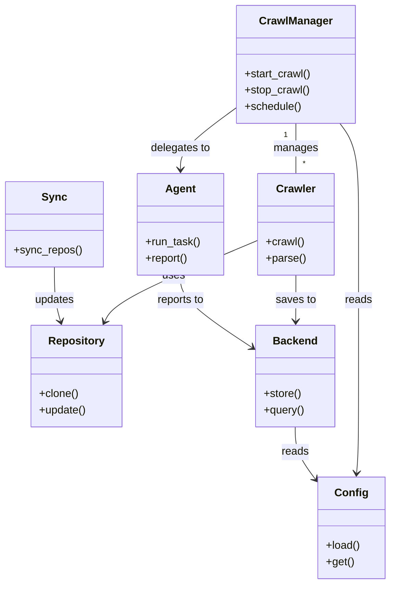

# Diagram: common/batch_service/config/config.staging.yml

> Auto-generated by Obscura crawlers

## Mermaid

### SVG

<svg id="container" width="569.1171875" xmlns="http://www.w3.org/2000/svg" class="classDiagram" height="862" viewBox="0 0 569.1171875 862" role="graphics-document document" aria-roledescription="class"><g><defs><marker id="container_class-aggregationStart" class="marker aggregation class" refX="18" refY="7" markerWidth="190" markerHeight="240" orient="auto"><path d="M 18,7 L9,13 L1,7 L9,1 Z"></path></marker></defs><defs><marker id="container_class-aggregationEnd" class="marker aggregation class" refX="1" refY="7" markerWidth="20" markerHeight="28" orient="auto"><path d="M 18,7 L9,13 L1,7 L9,1 Z"></path></marker></defs><defs><marker id="container_class-extensionStart" class="marker extension class" refX="18" refY="7" markerWidth="190" markerHeight="240" orient="auto"><path d="M 1,7 L18,13 V 1 Z"></path></marker></defs><defs><marker id="container_class-extensionEnd" class="marker extension class" refX="1" refY="7" markerWidth="20" markerHeight="28" orient="auto"><path d="M 1,1 V 13 L18,7 Z"></path></marker></defs><defs><marker id="container_class-compositionStart" class="marker composition class" refX="18" refY="7" markerWidth="190" markerHeight="240" orient="auto"><path d="M 18,7 L9,13 L1,7 L9,1 Z"></path></marker></defs><defs><marker id="container_class-compositionEnd" class="marker composition class" refX="1" refY="7" markerWidth="20" markerHeight="28" orient="auto"><path d="M 18,7 L9,13 L1,7 L9,1 Z"></path></marker></defs><defs><marker id="container_class-dependencyStart" class="marker dependency class" refX="6" refY="7" markerWidth="190" markerHeight="240" orient="auto"><path d="M 5,7 L9,13 L1,7 L9,1 Z"></path></marker></defs><defs><marker id="container_class-dependencyEnd" class="marker dependency class" refX="13" refY="7" markerWidth="20" markerHeight="28" orient="auto"><path d="M 18,7 L9,13 L14,7 L9,1 Z"></path></marker></defs><defs><marker id="container_class-lollipopStart" class="marker lollipop class" refX="13" refY="7" markerWidth="190" markerHeight="240" orient="auto"><circle stroke="black" fill="transparent" cx="7" cy="7" r="6"></circle></marker></defs><defs><marker id="container_class-lollipopEnd" class="marker lollipop class" refX="1" refY="7" markerWidth="190" markerHeight="240" orient="auto"><circle stroke="black" fill="transparent" cx="7" cy="7" r="6"></circle></marker></defs><g class="root"><g class="clusters"></g><g class="edgePaths"><path d="M429.914,182L429.914,188.167C429.914,194.333,429.914,206.667,429.914,219C429.914,231.333,429.914,243.667,429.914,249.833L429.914,256" id="id_CrawlManager_Crawler_1" class="edge-thickness-normal edge-pattern-solid relation" style=";;;" data-edge="true" data-et="edge" data-id="id_CrawlManager_Crawler_1" data-points="W3sieCI6NDI5LjkxNDA2MjUsInkiOjE4Mn0seyJ4Ijo0MjkuOTE0MDYyNSwieSI6MjE5fSx7IngiOjQyOS45MTQwNjI1LCJ5IjoyNTZ9XQ=="></path><path d="M374.781,354.464L340.11,369.22C305.439,383.976,236.096,413.488,198.814,433.515C161.531,453.541,156.307,464.083,153.696,469.353L151.084,474.624" id="id_Crawler_Repository_2" class="edge-thickness-normal edge-pattern-solid relation" style=";;;" data-edge="true" data-et="edge" data-id="id_Crawler_Repository_2" data-points="W3sieCI6Mzc0Ljc4MTI1LCJ5IjozNTQuNDY0MzIzMzUzNDcxMn0seyJ4IjoxNjYuNzUzOTA2MjUsInkiOjQ0M30seyJ4IjoxNDguNDIwMzc1Mjc5MDE3ODYsInkiOjQ4MH1d" marker-end="url(#container_class-dependencyEnd)"></path><path d="M429.914,406L429.914,412.167C429.914,418.333,429.914,430.667,429.856,442C429.798,453.333,429.681,463.667,429.623,468.834L429.565,474" id="id_Crawler_Backend_3" class="edge-thickness-normal edge-pattern-solid relation" style=";;;" data-edge="true" data-et="edge" data-id="id_Crawler_Backend_3" data-points="W3sieCI6NDI5LjkxNDA2MjUsInkiOjQwNn0seyJ4Ijo0MjkuOTE0MDYyNSwieSI6NDQzfSx7IngiOjQyOS40OTcyNDQ2OTg2NjA3LCJ5Ijo0ODB9XQ==" marker-end="url(#container_class-dependencyEnd)"></path><path d="M343.016,159.056L329.462,169.047C315.909,179.037,288.802,199.019,275.249,214.176C261.695,229.333,261.695,239.667,261.695,244.833L261.695,250" id="id_CrawlManager_Agent_4" class="edge-thickness-normal edge-pattern-solid relation" style=";;;" data-edge="true" data-et="edge" data-id="id_CrawlManager_Agent_4" data-points="W3sieCI6MzQzLjAxNTYyNSwieSI6MTU5LjA1NTkxNjc3NTAzMjUzfSx7IngiOjI2MS42OTUzMTI1LCJ5IjoyMTl9LHsieCI6MjYxLjY5NTMxMjUsInkiOjI1Nn1d" marker-end="url(#container_class-dependencyEnd)"></path><path d="M261.695,406L261.695,412.167C261.695,418.333,261.695,430.667,279.082,448.497C296.468,466.327,331.241,489.653,348.627,501.317L366.013,512.98" id="id_Agent_Backend_5" class="edge-thickness-normal edge-pattern-solid relation" style=";;;" data-edge="true" data-et="edge" data-id="id_Agent_Backend_5" data-points="W3sieCI6MjYxLjY5NTMxMjUsInkiOjQwNn0seyJ4IjoyNjEuNjk1MzEyNSwieSI6NDQzfSx7IngiOjM3MC45OTYwOTM3NSwieSI6NTE2LjMyMjM4MzY1OTcxNzh9XQ==" marker-end="url(#container_class-dependencyEnd)"></path><path d="M78.305,394L78.305,402.167C78.305,410.333,78.305,426.667,79.837,440.041C81.369,453.415,84.433,463.829,85.965,469.037L87.497,474.244" id="id_Sync_Repository_6" class="edge-thickness-normal edge-pattern-solid relation" style=";;;" data-edge="true" data-et="edge" data-id="id_Sync_Repository_6" data-points="W3sieCI6NzguMzA0Njg3NSwieSI6Mzk0fSx7IngiOjc4LjMwNDY4NzUsInkiOjQ0M30seyJ4Ijo4OS4xOTA5ODc3MjMyMTQyOCwieSI6NDgwfV0=" marker-end="url(#container_class-dependencyEnd)"></path><path d="M494.038,182L498.583,188.167C503.128,194.333,512.218,206.667,516.763,231.5C521.309,256.333,521.309,293.667,521.309,331C521.309,368.333,521.309,405.667,521.309,443C521.309,480.333,521.309,517.667,521.309,555C521.309,592.333,521.309,629.667,520.899,653.503C520.49,677.34,519.671,687.679,519.262,692.849L518.853,698.019" id="id_CrawlManager_Config_7" class="edge-thickness-normal edge-pattern-solid relation" style=";;;" data-edge="true" data-et="edge" data-id="id_CrawlManager_Config_7" data-points="W3sieCI6NDk0LjAzNzY0NDkwOTI3NDIsInkiOjE4Mn0seyJ4Ijo1MjEuMzA4NTkzNzUsInkiOjIxOX0seyJ4Ijo1MjEuMzA4NTkzNzUsInkiOjMzMX0seyJ4Ijo1MjEuMzA4NTkzNzUsInkiOjQ0M30seyJ4Ijo1MjEuMzA4NTkzNzUsInkiOjU1NX0seyJ4Ijo1MjEuMzA4NTkzNzUsInkiOjY2N30seyJ4Ijo1MTguMzc5MjU1MDIyMzIxNCwieSI6NzA0fV0=" marker-end="url(#container_class-dependencyEnd)"></path><path d="M428.652,630L428.652,636.167C428.652,642.333,428.652,654.667,433.906,667.855C439.159,681.044,449.665,695.087,454.918,702.109L460.171,709.131" id="id_Backend_Config_8" class="edge-thickness-normal edge-pattern-solid relation" style=";;;" data-edge="true" data-et="edge" data-id="id_Backend_Config_8" data-points="W3sieCI6NDI4LjY1MjM0Mzc1LCJ5Ijo2MzB9LHsieCI6NDI4LjY1MjM0Mzc1LCJ5Ijo2Njd9LHsieCI6NDYzLjc2NTYyNSwieSI6NzEzLjkzNTU3MTA5NTU3MX1d" marker-end="url(#container_class-dependencyEnd)"></path></g><g class="edgeLabels"><g class="edgeLabel" transform="translate(429.9140625, 219)"><g class="label" data-id="id_CrawlManager_Crawler_1" transform="translate(-32.296875, -12)"><foreignObject width="64.59375" height="24">

manages

</foreignObject></g></g><g class="edgeLabel" transform="translate(251.77001, 406.81746)"><g class="label" data-id="id_Crawler_Repository_2" transform="translate(-16.4921875, -12)"><foreignObject width="32.984375" height="24">

uses

</foreignObject></g></g><g class="edgeLabel" transform="translate(429.9140625, 443)"><g class="label" data-id="id_Crawler_Backend_3" transform="translate(-29.453125, -12)"><foreignObject width="58.90625" height="24">

saves to

</foreignObject></g></g><g class="edgeLabel" transform="translate(261.6953125, 219)"><g class="label" data-id="id_CrawlManager_Agent_4" transform="translate(-44.59375, -12)"><foreignObject width="89.1875" height="24">

delegates to

</foreignObject></g></g><g class="edgeLabel" transform="translate(261.6953125, 443)"><g class="label" data-id="id_Agent_Backend_5" transform="translate(-35.90625, -12)"><foreignObject width="71.8125" height="24">

reports to

</foreignObject></g></g><g class="edgeLabel" transform="translate(78.3046875, 443)"><g class="label" data-id="id_Sync_Repository_6" transform="translate(-29.4140625, -12)"><foreignObject width="58.828125" height="24">

updates

</foreignObject></g></g><g class="edgeLabel" transform="translate(521.30859375, 443)"><g class="label" data-id="id_CrawlManager_Config_7" transform="translate(-20.0078125, -12)"><foreignObject width="40.015625" height="24">

reads

</foreignObject></g></g><g class="edgeLabel" transform="translate(428.65234375, 667)"><g class="label" data-id="id_Backend_Config_8" transform="translate(-20.0078125, -12)"><foreignObject width="40.015625" height="24">

reads

</foreignObject></g></g><g class="edgeTerminals" transform="translate(414.9140612500001, 199.49999892857144)"><g class="inner" transform="translate(0, 0)"><foreignObject style="width: 9px; height: 12px;">
1
</foreignObject></g></g><g class="edgeTerminals" transform="translate(439.91406125, 233.49999892857144)"><g class="inner" transform="translate(0, 0)"></g><foreignObject style="width: 9px; height: 12px;">
*
</foreignObject></g></g><g class="nodes"><g class="node default" id="classId-CrawlManager-0" transform="translate(429.9140625, 95)"><g class="basic label-container"><path d="M-86.8984375 -87 L86.8984375 -87 L86.8984375 87 L-86.8984375 87" stroke="none" stroke-width="0" fill="#ECECFF" style=""></path><path d="M-86.8984375 -87 C-32.45061856936882 -87, 21.997200361262358 -87, 86.8984375 -87 M-86.8984375 -87 C-31.976890603174716 -87, 22.944656293650567 -87, 86.8984375 -87 M86.8984375 -87 C86.8984375 -27.777198796076327, 86.8984375 31.445602407847346, 86.8984375 87 M86.8984375 -87 C86.8984375 -43.77277579805412, 86.8984375 -0.5455515961082398, 86.8984375 87 M86.8984375 87 C29.11767853255833 87, -28.66308043488334 87, -86.8984375 87 M86.8984375 87 C38.15825431789216 87, -10.581928864215683 87, -86.8984375 87 M-86.8984375 87 C-86.8984375 34.19223955443335, -86.8984375 -18.6155208911333, -86.8984375 -87 M-86.8984375 87 C-86.8984375 44.37739107997968, -86.8984375 1.7547821599593618, -86.8984375 -87" stroke="#9370DB" stroke-width="1.3" fill="none" stroke-dasharray="0 0" style=""></path></g><g class="annotation-group text" transform="translate(0, -63)"></g><g class="label-group text" transform="translate(-51.59375, -63)"><g class="label" style="font-weight: bolder" transform="translate(0,-12)"><foreignObject width="103.1875" height="24">

CrawlManager

</foreignObject></g></g><g class="members-group text" transform="translate(-74.8984375, -15)"></g><g class="methods-group text" transform="translate(-74.8984375, 15)"><g class="label" style="" transform="translate(0,-12)"><foreignObject width="98.203125" height="24">

+start_crawl()

</foreignObject></g><g class="label" style="" transform="translate(0,12)"><foreignObject width="95.9375" height="24">

+stop_crawl()

</foreignObject></g><g class="label" style="" transform="translate(0,36)"><foreignObject width="83.78125" height="24">

+schedule()

</foreignObject></g></g><g class="divider" style=""><path d="M-86.8984375 -39 C-33.882752073965605 -39, 19.13293335206879 -39, 86.8984375 -39 M-86.8984375 -39 C-20.221104253218698 -39, 46.456228993562604 -39, 86.8984375 -39" stroke="#9370DB" stroke-width="1.3" fill="none" stroke-dasharray="0 0" style=""></path></g><g class="divider" style=""><path d="M-86.8984375 -15 C-46.759444615492725 -15, -6.620451730985451 -15, 86.8984375 -15 M-86.8984375 -15 C-29.29741225859855 -15, 28.303612982802903 -15, 86.8984375 -15" stroke="#9370DB" stroke-width="1.3" fill="none" stroke-dasharray="0 0" style=""></path></g></g><g class="node default" id="classId-Crawler-1" transform="translate(429.9140625, 331)"><g class="basic label-container"><path d="M-55.1328125 -75 L55.1328125 -75 L55.1328125 75 L-55.1328125 75" stroke="none" stroke-width="0" fill="#ECECFF" style=""></path><path d="M-55.1328125 -75 C-31.8681579383664 -75, -8.603503376732803 -75, 55.1328125 -75 M-55.1328125 -75 C-24.68653562604528 -75, 5.759741247909439 -75, 55.1328125 -75 M55.1328125 -75 C55.1328125 -37.167208489923176, 55.1328125 0.6655830201536475, 55.1328125 75 M55.1328125 -75 C55.1328125 -27.548546703393008, 55.1328125 19.902906593213984, 55.1328125 75 M55.1328125 75 C25.92671707479926 75, -3.2793783504014797 75, -55.1328125 75 M55.1328125 75 C18.300653407727587 75, -18.531505684544825 75, -55.1328125 75 M-55.1328125 75 C-55.1328125 28.335680889026236, -55.1328125 -18.32863822194753, -55.1328125 -75 M-55.1328125 75 C-55.1328125 41.27997526788145, -55.1328125 7.559950535762894, -55.1328125 -75" stroke="#9370DB" stroke-width="1.3" fill="none" stroke-dasharray="0 0" style=""></path></g><g class="annotation-group text" transform="translate(0, -51)"></g><g class="label-group text" transform="translate(-27.734375, -51)"><g class="label" style="font-weight: bolder" transform="translate(0,-12)"><foreignObject width="55.46875" height="24">

Crawler

</foreignObject></g></g><g class="members-group text" transform="translate(-43.1328125, -3)"></g><g class="methods-group text" transform="translate(-43.1328125, 27)"><g class="label" style="" transform="translate(0,-12)"><foreignObject width="56.40625" height="24">

+crawl()

</foreignObject></g><g class="label" style="" transform="translate(0,12)"><foreignObject width="58.53125" height="24">

+parse()

</foreignObject></g></g><g class="divider" style=""><path d="M-55.1328125 -27 C-15.195322653269379 -27, 24.742167193461242 -27, 55.1328125 -27 M-55.1328125 -27 C-26.83071998335137 -27, 1.471372533297263 -27, 55.1328125 -27" stroke="#9370DB" stroke-width="1.3" fill="none" stroke-dasharray="0 0" style=""></path></g><g class="divider" style=""><path d="M-55.1328125 -3 C-26.238960203134376 -3, 2.654892093731249 -3, 55.1328125 -3 M-55.1328125 -3 C-16.73333338254796 -3, 21.666145734904077 -3, 55.1328125 -3" stroke="#9370DB" stroke-width="1.3" fill="none" stroke-dasharray="0 0" style=""></path></g></g><g class="node default" id="classId-Repository-2" transform="translate(111.2578125, 555)"><g class="basic label-container"><path d="M-66.73828125 -75 L66.73828125 -75 L66.73828125 75 L-66.73828125 75" stroke="none" stroke-width="0" fill="#ECECFF" style=""></path><path d="M-66.73828125 -75 C-21.512738758727906 -75, 23.712803732544188 -75, 66.73828125 -75 M-66.73828125 -75 C-29.576402220830026 -75, 7.585476808339948 -75, 66.73828125 -75 M66.73828125 -75 C66.73828125 -22.516336492661857, 66.73828125 29.967327014676286, 66.73828125 75 M66.73828125 -75 C66.73828125 -28.418748700624725, 66.73828125 18.16250259875055, 66.73828125 75 M66.73828125 75 C36.83191279397466 75, 6.925544337949319 75, -66.73828125 75 M66.73828125 75 C38.61358980022092 75, 10.488898350441843 75, -66.73828125 75 M-66.73828125 75 C-66.73828125 36.24348717857789, -66.73828125 -2.5130256428442266, -66.73828125 -75 M-66.73828125 75 C-66.73828125 43.177524116286406, -66.73828125 11.35504823257282, -66.73828125 -75" stroke="#9370DB" stroke-width="1.3" fill="none" stroke-dasharray="0 0" style=""></path></g><g class="annotation-group text" transform="translate(0, -51)"></g><g class="label-group text" transform="translate(-39.7734375, -51)"><g class="label" style="font-weight: bolder" transform="translate(0,-12)"><foreignObject width="79.546875" height="24">

Repository

</foreignObject></g></g><g class="members-group text" transform="translate(-54.73828125, -3)"></g><g class="methods-group text" transform="translate(-54.73828125, 27)"><g class="label" style="" transform="translate(0,-12)"><foreignObject width="58.0625" height="24">

+clone()

</foreignObject></g><g class="label" style="" transform="translate(0,12)"><foreignObject width="69.703125" height="24">

+update()

</foreignObject></g></g><g class="divider" style=""><path d="M-66.73828125 -27 C-28.10698983455945 -27, 10.524301580881101 -27, 66.73828125 -27 M-66.73828125 -27 C-22.49609182461741 -27, 21.746097600765182 -27, 66.73828125 -27" stroke="#9370DB" stroke-width="1.3" fill="none" stroke-dasharray="0 0" style=""></path></g><g class="divider" style=""><path d="M-66.73828125 -3 C-39.670893947148784 -3, -12.603506644297575 -3, 66.73828125 -3 M-66.73828125 -3 C-17.58385981839578 -3, 31.57056161320844 -3, 66.73828125 -3" stroke="#9370DB" stroke-width="1.3" fill="none" stroke-dasharray="0 0" style=""></path></g></g><g class="node default" id="classId-Backend-3" transform="translate(428.65234375, 555)"><g class="basic label-container"><path d="M-57.65625 -75 L57.65625 -75 L57.65625 75 L-57.65625 75" stroke="none" stroke-width="0" fill="#ECECFF" style=""></path><path d="M-57.65625 -75 C-34.18608798918006 -75, -10.715925978360119 -75, 57.65625 -75 M-57.65625 -75 C-15.946759137004975 -75, 25.76273172599005 -75, 57.65625 -75 M57.65625 -75 C57.65625 -20.90019578530245, 57.65625 33.1996084293951, 57.65625 75 M57.65625 -75 C57.65625 -21.23073599813717, 57.65625 32.53852800372566, 57.65625 75 M57.65625 75 C20.4771356586307 75, -16.7019786827386 75, -57.65625 75 M57.65625 75 C20.55983904223696 75, -16.536571915526082 75, -57.65625 75 M-57.65625 75 C-57.65625 18.34444997924352, -57.65625 -38.31110004151296, -57.65625 -75 M-57.65625 75 C-57.65625 26.226668155716787, -57.65625 -22.546663688566426, -57.65625 -75" stroke="#9370DB" stroke-width="1.3" fill="none" stroke-dasharray="0 0" style=""></path></g><g class="annotation-group text" transform="translate(0, -51)"></g><g class="label-group text" transform="translate(-31.296875, -51)"><g class="label" style="font-weight: bolder" transform="translate(0,-12)"><foreignObject width="62.59375" height="24">

Backend

</foreignObject></g></g><g class="members-group text" transform="translate(-45.65625, -3)"></g><g class="methods-group text" transform="translate(-45.65625, 27)"><g class="label" style="" transform="translate(0,-12)"><foreignObject width="55.125" height="24">

+store()

</foreignObject></g><g class="label" style="" transform="translate(0,12)"><foreignObject width="60.015625" height="24">

+query()

</foreignObject></g></g><g class="divider" style=""><path d="M-57.65625 -27 C-15.321291209945628 -27, 27.013667580108745 -27, 57.65625 -27 M-57.65625 -27 C-26.532015513208872 -27, 4.592218973582256 -27, 57.65625 -27" stroke="#9370DB" stroke-width="1.3" fill="none" stroke-dasharray="0 0" style=""></path></g><g class="divider" style=""><path d="M-57.65625 -3 C-13.957850541669188 -3, 29.740548916661623 -3, 57.65625 -3 M-57.65625 -3 C-33.545207713246924 -3, -9.434165426493855 -3, 57.65625 -3" stroke="#9370DB" stroke-width="1.3" fill="none" stroke-dasharray="0 0" style=""></path></g></g><g class="node default" id="classId-Agent-4" transform="translate(261.6953125, 331)"><g class="basic label-container"><path d="M-63.0859375 -75 L63.0859375 -75 L63.0859375 75 L-63.0859375 75" stroke="none" stroke-width="0" fill="#ECECFF" style=""></path><path d="M-63.0859375 -75 C-29.373494310031084 -75, 4.338948879937831 -75, 63.0859375 -75 M-63.0859375 -75 C-35.734308893142014 -75, -8.382680286284028 -75, 63.0859375 -75 M63.0859375 -75 C63.0859375 -22.41585189598078, 63.0859375 30.16829620803844, 63.0859375 75 M63.0859375 -75 C63.0859375 -23.831652635158065, 63.0859375 27.33669472968387, 63.0859375 75 M63.0859375 75 C19.558651853227254 75, -23.968633793545493 75, -63.0859375 75 M63.0859375 75 C13.55658788788746 75, -35.97276172422508 75, -63.0859375 75 M-63.0859375 75 C-63.0859375 31.44938495583672, -63.0859375 -12.10123008832656, -63.0859375 -75 M-63.0859375 75 C-63.0859375 18.557139261965197, -63.0859375 -37.885721476069605, -63.0859375 -75" stroke="#9370DB" stroke-width="1.3" fill="none" stroke-dasharray="0 0" style=""></path></g><g class="annotation-group text" transform="translate(0, -51)"></g><g class="label-group text" transform="translate(-21.078125, -51)"><g class="label" style="font-weight: bolder" transform="translate(0,-12)"><foreignObject width="42.15625" height="24">

Agent

</foreignObject></g></g><g class="members-group text" transform="translate(-51.0859375, -3)"></g><g class="methods-group text" transform="translate(-51.0859375, 27)"><g class="label" style="" transform="translate(0,-12)"><foreignObject width="81.09375" height="24">

+run_task()

</foreignObject></g><g class="label" style="" transform="translate(0,12)"><foreignObject width="63.578125" height="24">

+report()

</foreignObject></g></g><g class="divider" style=""><path d="M-63.0859375 -27 C-16.303858343818177 -27, 30.478220812363645 -27, 63.0859375 -27 M-63.0859375 -27 C-32.68840250246636 -27, -2.29086750493272 -27, 63.0859375 -27" stroke="#9370DB" stroke-width="1.3" fill="none" stroke-dasharray="0 0" style=""></path></g><g class="divider" style=""><path d="M-63.0859375 -3 C-25.35486546592744 -3, 12.376206568145122 -3, 63.0859375 -3 M-63.0859375 -3 C-26.64143161871106 -3, 9.80307426257788 -3, 63.0859375 -3" stroke="#9370DB" stroke-width="1.3" fill="none" stroke-dasharray="0 0" style=""></path></g></g><g class="node default" id="classId-Sync-5" transform="translate(78.3046875, 331)"><g class="basic label-container"><path d="M-70.3046875 -63 L70.3046875 -63 L70.3046875 63 L-70.3046875 63" stroke="none" stroke-width="0" fill="#ECECFF" style=""></path><path d="M-70.3046875 -63 C-36.882441805029366 -63, -3.4601961100587317 -63, 70.3046875 -63 M-70.3046875 -63 C-23.177480762542125 -63, 23.94972597491575 -63, 70.3046875 -63 M70.3046875 -63 C70.3046875 -33.28200114821398, 70.3046875 -3.564002296427965, 70.3046875 63 M70.3046875 -63 C70.3046875 -16.021428830988924, 70.3046875 30.95714233802215, 70.3046875 63 M70.3046875 63 C27.52656481037411 63, -15.251557879251777 63, -70.3046875 63 M70.3046875 63 C29.715359422484056 63, -10.873968655031888 63, -70.3046875 63 M-70.3046875 63 C-70.3046875 34.19132050790155, -70.3046875 5.382641015803102, -70.3046875 -63 M-70.3046875 63 C-70.3046875 13.675498383911922, -70.3046875 -35.649003232176156, -70.3046875 -63" stroke="#9370DB" stroke-width="1.3" fill="none" stroke-dasharray="0 0" style=""></path></g><g class="annotation-group text" transform="translate(0, -39)"></g><g class="label-group text" transform="translate(-17.09375, -39)"><g class="label" style="font-weight: bolder" transform="translate(0,-12)"><foreignObject width="34.1875" height="24">

Sync

</foreignObject></g></g><g class="members-group text" transform="translate(-58.3046875, 9)"></g><g class="methods-group text" transform="translate(-58.3046875, 39)"><g class="label" style="" transform="translate(0,-12)"><foreignObject width="99.515625" height="24">

+sync_repos()

</foreignObject></g></g><g class="divider" style=""><path d="M-70.3046875 -15 C-16.319617604523422 -15, 37.665452290953155 -15, 70.3046875 -15 M-70.3046875 -15 C-26.4832269914802 -15, 17.338233517039598 -15, 70.3046875 -15" stroke="#9370DB" stroke-width="1.3" fill="none" stroke-dasharray="0 0" style=""></path></g><g class="divider" style=""><path d="M-70.3046875 9 C-17.79807196876532 9, 34.70854356246936 9, 70.3046875 9 M-70.3046875 9 C-29.034950037418987 9, 12.234787425162025 9, 70.3046875 9" stroke="#9370DB" stroke-width="1.3" fill="none" stroke-dasharray="0 0" style=""></path></g></g><g class="node default" id="classId-Config-6" transform="translate(512.44140625, 779)"><g class="basic label-container"><path d="M-48.67578125 -75 L48.67578125 -75 L48.67578125 75 L-48.67578125 75" stroke="none" stroke-width="0" fill="#ECECFF" style=""></path><path d="M-48.67578125 -75 C-19.17673795223238 -75, 10.322305345535241 -75, 48.67578125 -75 M-48.67578125 -75 C-12.97546302402072 -75, 22.72485520195856 -75, 48.67578125 -75 M48.67578125 -75 C48.67578125 -16.561329067264168, 48.67578125 41.877341865471664, 48.67578125 75 M48.67578125 -75 C48.67578125 -44.89230714397466, 48.67578125 -14.784614287949324, 48.67578125 75 M48.67578125 75 C23.568193086931302 75, -1.5393950761373958 75, -48.67578125 75 M48.67578125 75 C16.920667478024455 75, -14.834446293951089 75, -48.67578125 75 M-48.67578125 75 C-48.67578125 39.00488837665344, -48.67578125 3.0097767533068804, -48.67578125 -75 M-48.67578125 75 C-48.67578125 40.408204121004, -48.67578125 5.816408242007995, -48.67578125 -75" stroke="#9370DB" stroke-width="1.3" fill="none" stroke-dasharray="0 0" style=""></path></g><g class="annotation-group text" transform="translate(0, -51)"></g><g class="label-group text" transform="translate(-22.9296875, -51)"><g class="label" style="font-weight: bolder" transform="translate(0,-12)"><foreignObject width="45.859375" height="24">

Config

</foreignObject></g></g><g class="members-group text" transform="translate(-36.67578125, -3)"></g><g class="methods-group text" transform="translate(-36.67578125, 27)"><g class="label" style="" transform="translate(0,-12)"><foreignObject width="50.421875" height="24">

+load()

</foreignObject></g><g class="label" style="" transform="translate(0,12)"><foreignObject width="40.921875" height="24">

+get()

</foreignObject></g></g><g class="divider" style=""><path d="M-48.67578125 -27 C-17.82227581737904 -27, 13.03122961524192 -27, 48.67578125 -27 M-48.67578125 -27 C-15.006900364432624 -27, 18.66198052113475 -27, 48.67578125 -27" stroke="#9370DB" stroke-width="1.3" fill="none" stroke-dasharray="0 0" style=""></path></g><g class="divider" style=""><path d="M-48.67578125 -3 C-27.825065156336166 -3, -6.9743490626723315 -3, 48.67578125 -3 M-48.67578125 -3 C-11.664849162617472 -3, 25.346082924765057 -3, 48.67578125 -3" stroke="#9370DB" stroke-width="1.3" fill="none" stroke-dasharray="0 0" style=""></path></g></g></g></g></g></svg>
