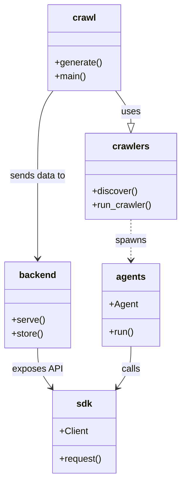

# Diagram: common/batch_service/config/config.test.yml


> Auto-generated by Obscura crawlers

## Diagram 1



### SVG

<svg id="container" width="315.3828125" xmlns="http://www.w3.org/2000/svg" class="classDiagram" height="832" viewBox="0 0 315.3828125 832" role="graphics-document document" aria-roledescription="class"><style>#container{font-family:"trebuchet ms",verdana,arial,sans-serif;font-size:16px;fill:#333;}@keyframes edge-animation-frame{from{stroke-dashoffset:0;}}@keyframes dash{to{stroke-dashoffset:0;}}#container .edge-animation-slow{stroke-dasharray:9,5!important;stroke-dashoffset:900;animation:dash 50s linear infinite;stroke-linecap:round;}#container .edge-animation-fast{stroke-dasharray:9,5!important;stroke-dashoffset:900;animation:dash 20s linear infinite;stroke-linecap:round;}#container .error-icon{fill:#552222;}#container .error-text{fill:#552222;stroke:#552222;}#container .edge-thickness-normal{stroke-width:1px;}#container .edge-thickness-thick{stroke-width:3.5px;}#container .edge-pattern-solid{stroke-dasharray:0;}#container .edge-thickness-invisible{stroke-width:0;fill:none;}#container .edge-pattern-dashed{stroke-dasharray:3;}#container .edge-pattern-dotted{stroke-dasharray:2;}#container .marker{fill:#333333;stroke:#333333;}#container .marker.cross{stroke:#333333;}#container svg{font-family:"trebuchet ms",verdana,arial,sans-serif;font-size:16px;}#container p{margin:0;}#container g.classGroup text{fill:#9370DB;stroke:none;font-family:"trebuchet ms",verdana,arial,sans-serif;font-size:10px;}#container g.classGroup text .title{font-weight:bolder;}#container .nodeLabel,#container .edgeLabel{color:#131300;}#container .edgeLabel .label rect{fill:#ECECFF;}#container .label text{fill:#131300;}#container .labelBkg{background:#ECECFF;}#container .edgeLabel .label span{background:#ECECFF;}#container .classTitle{font-weight:bolder;}#container .node rect,#container .node circle,#container .node ellipse,#container .node polygon,#container .node path{fill:#ECECFF;stroke:#9370DB;stroke-width:1px;}#container .divider{stroke:#9370DB;stroke-width:1;}#container g.clickable{cursor:pointer;}#container g.classGroup rect{fill:#ECECFF;stroke:#9370DB;}#container g.classGroup line{stroke:#9370DB;stroke-width:1;}#container .classLabel .box{stroke:none;stroke-width:0;fill:#ECECFF;opacity:0.5;}#container .classLabel .label{fill:#9370DB;font-size:10px;}#container .relation{stroke:#333333;stroke-width:1;fill:none;}#container .dashed-line{stroke-dasharray:3;}#container .dotted-line{stroke-dasharray:1 2;}#container #compositionStart,#container .composition{fill:#333333!important;stroke:#333333!important;stroke-width:1;}#container #compositionEnd,#container .composition{fill:#333333!important;stroke:#333333!important;stroke-width:1;}#container #dependencyStart,#container .dependency{fill:#333333!important;stroke:#333333!important;stroke-width:1;}#container #dependencyStart,#container .dependency{fill:#333333!important;stroke:#333333!important;stroke-width:1;}#container #extensionStart,#container .extension{fill:transparent!important;stroke:#333333!important;stroke-width:1;}#container #extensionEnd,#container .extension{fill:transparent!important;stroke:#333333!important;stroke-width:1;}#container #aggregationStart,#container .aggregation{fill:transparent!important;stroke:#333333!important;stroke-width:1;}#container #aggregationEnd,#container .aggregation{fill:transparent!important;stroke:#333333!important;stroke-width:1;}#container #lollipopStart,#container .lollipop{fill:#ECECFF!important;stroke:#333333!important;stroke-width:1;}#container #lollipopEnd,#container .lollipop{fill:#ECECFF!important;stroke:#333333!important;stroke-width:1;}#container .edgeTerminals{font-size:11px;line-height:initial;}#container .classTitleText{text-anchor:middle;font-size:18px;fill:#333;}#container .label-icon{display:inline-block;height:1em;overflow:visible;vertical-align:-0.125em;}#container .node .label-icon path{fill:currentColor;stroke:revert;stroke-width:revert;}#container :root{--mermaid-font-family:"trebuchet ms",verdana,arial,sans-serif;}</style><g><defs><marker id="container_class-aggregationStart" class="marker aggregation class" refX="18" refY="7" markerWidth="190" markerHeight="240" orient="auto"><path d="M 18,7 L9,13 L1,7 L9,1 Z"></path></marker></defs><defs><marker id="container_class-aggregationEnd" class="marker aggregation class" refX="1" refY="7" markerWidth="20" markerHeight="28" orient="auto"><path d="M 18,7 L9,13 L1,7 L9,1 Z"></path></marker></defs><defs><marker id="container_class-extensionStart" class="marker extension class" refX="18" refY="7" markerWidth="190" markerHeight="240" orient="auto"><path d="M 1,7 L18,13 V 1 Z"></path></marker></defs><defs><marker id="container_class-extensionEnd" class="marker extension class" refX="1" refY="7" markerWidth="20" markerHeight="28" orient="auto"><path d="M 1,1 V 13 L18,7 Z"></path></marker></defs><defs><marker id="container_class-compositionStart" class="marker composition class" refX="18" refY="7" markerWidth="190" markerHeight="240" orient="auto"><path d="M 18,7 L9,13 L1,7 L9,1 Z"></path></marker></defs><defs><marker id="container_class-compositionEnd" class="marker composition class" refX="1" refY="7" markerWidth="20" markerHeight="28" orient="auto"><path d="M 18,7 L9,13 L1,7 L9,1 Z"></path></marker></defs><defs><marker id="container_class-dependencyStart" class="marker dependency class" refX="6" refY="7" markerWidth="190" markerHeight="240" orient="auto"><path d="M 5,7 L9,13 L1,7 L9,1 Z"></path></marker></defs><defs><marker id="container_class-dependencyEnd" class="marker dependency class" refX="13" refY="7" markerWidth="20" markerHeight="28" orient="auto"><path d="M 18,7 L9,13 L14,7 L9,1 Z"></path></marker></defs><defs><marker id="container_class-lollipopStart" class="marker lollipop class" refX="13" refY="7" markerWidth="190" markerHeight="240" orient="auto"><circle stroke="black" fill="transparent" cx="7" cy="7" r="6"></circle></marker></defs><defs><marker id="container_class-lollipopEnd" class="marker lollipop class" refX="1" refY="7" markerWidth="190" markerHeight="240" orient="auto"><circle stroke="black" fill="transparent" cx="7" cy="7" r="6"></circle></marker></defs><g class="root"><g class="clusters"></g><g class="edgePaths"><path d="M200.871,158L205.38,164.167C209.888,170.333,218.905,182.667,223.413,192.125C227.922,201.583,227.922,208.167,227.922,211.458L227.922,214.75" id="id_crawl_crawlers_1" class="edge-thickness-normal edge-pattern-solid relation" style=";;;" data-edge="true" data-et="edge" data-id="id_crawl_crawlers_1" data-points="W3sieCI6MjAwLjg3MTMwMzAxMzM5Mjg2LCJ5IjoxNTh9LHsieCI6MjI3LjkyMTg3NSwieSI6MTk1fSx7IngiOjIyNy45MjE4NzUsInkiOjIzMn1d" marker-end="url(#container_class-extensionEnd)"></path><path d="M91.207,158L86.698,164.167C82.19,170.333,73.173,182.667,68.665,207.5C64.156,232.333,64.156,269.667,64.156,307C64.156,344.333,64.156,381.667,64.156,405.5C64.156,429.333,64.156,439.667,64.156,444.833L64.156,450" id="id_crawl_backend_2" class="edge-thickness-normal edge-pattern-solid relation" style=";;;" data-edge="true" data-et="edge" data-id="id_crawl_backend_2" data-points="W3sieCI6OTEuMjA2ODIxOTg2NjA3MTQsInkiOjE1OH0seyJ4Ijo2NC4xNTYyNSwieSI6MTk1fSx7IngiOjY0LjE1NjI1LCJ5IjozMDd9LHsieCI6NjQuMTU2MjUsInkiOjQxOX0seyJ4Ijo2NC4xNTYyNSwieSI6NDU2fV0=" marker-end="url(#container_class-dependencyEnd)"></path><path d="M64.156,606L64.156,612.167C64.156,618.333,64.156,630.667,68.188,642.2C72.22,653.734,80.284,664.469,84.316,669.836L88.348,675.203" id="id_backend_sdk_3" class="edge-thickness-normal edge-pattern-solid relation" style=";;;" data-edge="true" data-et="edge" data-id="id_backend_sdk_3" data-points="W3sieCI6NjQuMTU2MjUsInkiOjYwNn0seyJ4Ijo2NC4xNTYyNSwieSI6NjQzfSx7IngiOjkxLjk1MTMzMzE0MjIwMTgzLCJ5Ijo2ODB9XQ==" marker-end="url(#container_class-dependencyEnd)"></path><path d="M227.922,603L227.922,609.667C227.922,616.333,227.922,629.667,223.89,641.7C219.858,653.734,211.794,664.469,207.762,669.836L203.731,675.203" id="id_agents_sdk_4" class="edge-thickness-normal edge-pattern-solid relation" style=";;;" data-edge="true" data-et="edge" data-id="id_agents_sdk_4" data-points="W3sieCI6MjI3LjkyMTg3NSwieSI6NjAzfSx7IngiOjIyNy45MjE4NzUsInkiOjY0M30seyJ4IjoyMDAuMTI2NzkxODU3Nzk4MTcsInkiOjY4MH1d" marker-end="url(#container_class-dependencyEnd)"></path><path d="M227.922,382L227.922,388.167C227.922,394.333,227.922,406.667,227.922,418.5C227.922,430.333,227.922,441.667,227.922,447.333L227.922,453" id="id_crawlers_agents_5" class="edge-thickness-normal edge-pattern-dashed relation" style=";;;" data-edge="true" data-et="edge" data-id="id_crawlers_agents_5" data-points="W3sieCI6MjI3LjkyMTg3NSwieSI6MzgyfSx7IngiOjIyNy45MjE4NzUsInkiOjQxOX0seyJ4IjoyMjcuOTIxODc1LCJ5Ijo0NTl9XQ==" marker-end="url(#container_class-dependencyEnd)"></path></g><g class="edgeLabels"><g class="edgeLabel" transform="translate(227.921875, 195)"><g class="label" data-id="id_crawl_crawlers_1" transform="translate(-16.4921875, -12)"><foreignObject width="32.984375" height="24"><div xmlns="http://www.w3.org/1999/xhtml" class="labelBkg" style="display: table-cell; white-space: nowrap; line-height: 1.5; max-width: 200px; text-align: center;"><span class="edgeLabel"><p>uses</p></span></div></foreignObject></g></g><g class="edgeLabel" transform="translate(64.15625, 307)"><g class="label" data-id="id_crawl_backend_2" transform="translate(-49.3046875, -12)"><foreignObject width="98.609375" height="24"><div xmlns="http://www.w3.org/1999/xhtml" class="labelBkg" style="display: table-cell; white-space: nowrap; line-height: 1.5; max-width: 200px; text-align: center;"><span class="edgeLabel"><p>sends data to</p></span></div></foreignObject></g></g><g class="edgeLabel" transform="translate(64.15625, 643)"><g class="label" data-id="id_backend_sdk_3" transform="translate(-43.140625, -12)"><foreignObject width="86.28125" height="24"><div xmlns="http://www.w3.org/1999/xhtml" class="labelBkg" style="display: table-cell; white-space: nowrap; line-height: 1.5; max-width: 200px; text-align: center;"><span class="edgeLabel"><p>exposes API</p></span></div></foreignObject></g></g><g class="edgeLabel" transform="translate(227.921875, 643)"><g class="label" data-id="id_agents_sdk_4" transform="translate(-16.4453125, -12)"><foreignObject width="32.890625" height="24"><div xmlns="http://www.w3.org/1999/xhtml" class="labelBkg" style="display: table-cell; white-space: nowrap; line-height: 1.5; max-width: 200px; text-align: center;"><span class="edgeLabel"><p>calls</p></span></div></foreignObject></g></g><g class="edgeLabel" transform="translate(227.921875, 419)"><g class="label" data-id="id_crawlers_agents_5" transform="translate(-26.8828125, -12)"><foreignObject width="53.765625" height="24"><div xmlns="http://www.w3.org/1999/xhtml" class="labelBkg" style="display: table-cell; white-space: nowrap; line-height: 1.5; max-width: 200px; text-align: center;"><span class="edgeLabel"><p>spawns</p></span></div></foreignObject></g></g></g><g class="nodes"><g class="node default" id="classId-crawl-0" transform="translate(146.0390625, 83)"><g class="basic label-container"><path d="M-62.64453125 -75 L62.64453125 -75 L62.64453125 75 L-62.64453125 75" stroke="none" stroke-width="0" fill="#ECECFF" style=""></path><path d="M-62.64453125 -75 C-36.53915734415709 -75, -10.433783438314173 -75, 62.64453125 -75 M-62.64453125 -75 C-28.312287712150507 -75, 6.019955825698986 -75, 62.64453125 -75 M62.64453125 -75 C62.64453125 -17.489237475823856, 62.64453125 40.02152504835229, 62.64453125 75 M62.64453125 -75 C62.64453125 -32.71797498683993, 62.64453125 9.564050026320146, 62.64453125 75 M62.64453125 75 C24.51333597682836 75, -13.617859296343283 75, -62.64453125 75 M62.64453125 75 C24.552966089917703 75, -13.538599070164594 75, -62.64453125 75 M-62.64453125 75 C-62.64453125 20.590642467360375, -62.64453125 -33.81871506527925, -62.64453125 -75 M-62.64453125 75 C-62.64453125 43.581717641728765, -62.64453125 12.163435283457531, -62.64453125 -75" stroke="#9370DB" stroke-width="1.3" fill="none" stroke-dasharray="0 0" style=""></path></g><g class="annotation-group text" transform="translate(0, -51)"></g><g class="label-group text" transform="translate(-19.4765625, -51)"><g class="label" style="font-weight: bolder" transform="translate(0,-12)"><foreignObject width="38.953125" height="24"><div xmlns="http://www.w3.org/1999/xhtml" style="display: table-cell; white-space: nowrap; line-height: 1.5; max-width: 88px; text-align: center;"><span class="nodeLabel markdown-node-label" style=""><p>crawl</p></span></div></foreignObject></g></g><g class="members-group text" transform="translate(-50.64453125, -3)"></g><g class="methods-group text" transform="translate(-50.64453125, 27)"><g class="label" style="" transform="translate(0,-12)"><foreignObject width="81.8125" height="24"><div xmlns="http://www.w3.org/1999/xhtml" style="display: table-cell; white-space: nowrap; line-height: 1.5; max-width: 139px; text-align: center;"><span class="nodeLabel markdown-node-label" style=""><p>+generate()</p></span></div></foreignObject></g><g class="label" style="" transform="translate(0,12)"><foreignObject width="54.65625" height="24"><div xmlns="http://www.w3.org/1999/xhtml" style="display: table-cell; white-space: nowrap; line-height: 1.5; max-width: 112px; text-align: center;"><span class="nodeLabel markdown-node-label" style=""><p>+main()</p></span></div></foreignObject></g></g><g class="divider" style=""><path d="M-62.64453125 -27 C-35.008794586883766 -27, -7.373057923767526 -27, 62.64453125 -27 M-62.64453125 -27 C-33.13433179135838 -27, -3.624132332716748 -27, 62.64453125 -27" stroke="#9370DB" stroke-width="1.3" fill="none" stroke-dasharray="0 0" style=""></path></g><g class="divider" style=""><path d="M-62.64453125 -3 C-24.32731043450314 -3, 13.98991038099372 -3, 62.64453125 -3 M-62.64453125 -3 C-30.118713904345334 -3, 2.4071034413093315 -3, 62.64453125 -3" stroke="#9370DB" stroke-width="1.3" fill="none" stroke-dasharray="0 0" style=""></path></g></g><g class="node default" id="classId-crawlers-1" transform="translate(227.921875, 307)"><g class="basic label-container"><path d="M-79.4609375 -75 L79.4609375 -75 L79.4609375 75 L-79.4609375 75" stroke="none" stroke-width="0" fill="#ECECFF" style=""></path><path d="M-79.4609375 -75 C-29.899899959985355 -75, 19.66113758002929 -75, 79.4609375 -75 M-79.4609375 -75 C-47.138154241194535 -75, -14.81537098238907 -75, 79.4609375 -75 M79.4609375 -75 C79.4609375 -16.520721832469818, 79.4609375 41.958556335060365, 79.4609375 75 M79.4609375 -75 C79.4609375 -31.57583527804956, 79.4609375 11.84832944390088, 79.4609375 75 M79.4609375 75 C47.36634713351415 75, 15.271756767028293 75, -79.4609375 75 M79.4609375 75 C21.029517531018435 75, -37.40190243796313 75, -79.4609375 75 M-79.4609375 75 C-79.4609375 42.39312168587925, -79.4609375 9.786243371758502, -79.4609375 -75 M-79.4609375 75 C-79.4609375 15.16068193727353, -79.4609375 -44.67863612545294, -79.4609375 -75" stroke="#9370DB" stroke-width="1.3" fill="none" stroke-dasharray="0 0" style=""></path></g><g class="annotation-group text" transform="translate(0, -51)"></g><g class="label-group text" transform="translate(-30.828125, -51)"><g class="label" style="font-weight: bolder" transform="translate(0,-12)"><foreignObject width="61.65625" height="24"><div xmlns="http://www.w3.org/1999/xhtml" style="display: table-cell; white-space: nowrap; line-height: 1.5; max-width: 110px; text-align: center;"><span class="nodeLabel markdown-node-label" style=""><p>crawlers</p></span></div></foreignObject></g></g><g class="members-group text" transform="translate(-67.4609375, -3)"></g><g class="methods-group text" transform="translate(-67.4609375, 27)"><g class="label" style="" transform="translate(0,-12)"><foreignObject width="79.21875" height="24"><div xmlns="http://www.w3.org/1999/xhtml" style="display: table-cell; white-space: nowrap; line-height: 1.5; max-width: 137px; text-align: center;"><span class="nodeLabel markdown-node-label" style=""><p>+discover()</p></span></div></foreignObject></g><g class="label" style="" transform="translate(0,12)"><foreignObject width="104.09375" height="24"><div xmlns="http://www.w3.org/1999/xhtml" style="display: table-cell; white-space: nowrap; line-height: 1.5; max-width: 161px; text-align: center;"><span class="nodeLabel markdown-node-label" style=""><p>+run_crawler()</p></span></div></foreignObject></g></g><g class="divider" style=""><path d="M-79.4609375 -27 C-32.143554252397195 -27, 15.17382899520561 -27, 79.4609375 -27 M-79.4609375 -27 C-41.698837765580414 -27, -3.9367380311608287 -27, 79.4609375 -27" stroke="#9370DB" stroke-width="1.3" fill="none" stroke-dasharray="0 0" style=""></path></g><g class="divider" style=""><path d="M-79.4609375 -3 C-27.27893031732851 -3, 24.90307686534298 -3, 79.4609375 -3 M-79.4609375 -3 C-25.626470992596353 -3, 28.207995514807294 -3, 79.4609375 -3" stroke="#9370DB" stroke-width="1.3" fill="none" stroke-dasharray="0 0" style=""></path></g></g><g class="node default" id="classId-backend-2" transform="translate(64.15625, 531)"><g class="basic label-container"><path d="M-56.15625 -75 L56.15625 -75 L56.15625 75 L-56.15625 75" stroke="none" stroke-width="0" fill="#ECECFF" style=""></path><path d="M-56.15625 -75 C-23.930529261256225 -75, 8.295191477487549 -75, 56.15625 -75 M-56.15625 -75 C-18.42273156305884 -75, 19.31078687388232 -75, 56.15625 -75 M56.15625 -75 C56.15625 -35.15585516002318, 56.15625 4.688289679953641, 56.15625 75 M56.15625 -75 C56.15625 -33.33028115293664, 56.15625 8.339437694126715, 56.15625 75 M56.15625 75 C33.11075743518945 75, 10.065264870378897 75, -56.15625 75 M56.15625 75 C17.466883257017265 75, -21.22248348596547 75, -56.15625 75 M-56.15625 75 C-56.15625 36.510417797350165, -56.15625 -1.9791644052996702, -56.15625 -75 M-56.15625 75 C-56.15625 43.380585347017245, -56.15625 11.761170694034497, -56.15625 -75" stroke="#9370DB" stroke-width="1.3" fill="none" stroke-dasharray="0 0" style=""></path></g><g class="annotation-group text" transform="translate(0, -51)"></g><g class="label-group text" transform="translate(-31.0625, -51)"><g class="label" style="font-weight: bolder" transform="translate(0,-12)"><foreignObject width="62.125" height="24"><div xmlns="http://www.w3.org/1999/xhtml" style="display: table-cell; white-space: nowrap; line-height: 1.5; max-width: 111px; text-align: center;"><span class="nodeLabel markdown-node-label" style=""><p>backend</p></span></div></foreignObject></g></g><g class="members-group text" transform="translate(-44.15625, -3)"></g><g class="methods-group text" transform="translate(-44.15625, 27)"><g class="label" style="" transform="translate(0,-12)"><foreignObject width="57.25" height="24"><div xmlns="http://www.w3.org/1999/xhtml" style="display: table-cell; white-space: nowrap; line-height: 1.5; max-width: 115px; text-align: center;"><span class="nodeLabel markdown-node-label" style=""><p>+serve()</p></span></div></foreignObject></g><g class="label" style="" transform="translate(0,12)"><foreignObject width="55.125" height="24"><div xmlns="http://www.w3.org/1999/xhtml" style="display: table-cell; white-space: nowrap; line-height: 1.5; max-width: 112px; text-align: center;"><span class="nodeLabel markdown-node-label" style=""><p>+store()</p></span></div></foreignObject></g></g><g class="divider" style=""><path d="M-56.15625 -27 C-12.269857749287247 -27, 31.616534501425505 -27, 56.15625 -27 M-56.15625 -27 C-23.413068645134885 -27, 9.33011270973023 -27, 56.15625 -27" stroke="#9370DB" stroke-width="1.3" fill="none" stroke-dasharray="0 0" style=""></path></g><g class="divider" style=""><path d="M-56.15625 -3 C-18.77071468804087 -3, 18.614820623918263 -3, 56.15625 -3 M-56.15625 -3 C-26.173687131348863 -3, 3.808875737302273 -3, 56.15625 -3" stroke="#9370DB" stroke-width="1.3" fill="none" stroke-dasharray="0 0" style=""></path></g></g><g class="node default" id="classId-sdk-3" transform="translate(146.0390625, 752)"><g class="basic label-container"><path d="M-55.35546875 -72 L55.35546875 -72 L55.35546875 72 L-55.35546875 72" stroke="none" stroke-width="0" fill="#ECECFF" style=""></path><path d="M-55.35546875 -72 C-15.05044569816723 -72, 25.25457735366554 -72, 55.35546875 -72 M-55.35546875 -72 C-20.646479494230853 -72, 14.062509761538294 -72, 55.35546875 -72 M55.35546875 -72 C55.35546875 -38.47372368518837, 55.35546875 -4.947447370376736, 55.35546875 72 M55.35546875 -72 C55.35546875 -20.338169721241798, 55.35546875 31.323660557516405, 55.35546875 72 M55.35546875 72 C20.71489496542838 72, -13.925678819143243 72, -55.35546875 72 M55.35546875 72 C27.517893858492517 72, -0.319681033014966 72, -55.35546875 72 M-55.35546875 72 C-55.35546875 26.27548331956777, -55.35546875 -19.449033360864462, -55.35546875 -72 M-55.35546875 72 C-55.35546875 31.32378019924773, -55.35546875 -9.352439601504543, -55.35546875 -72" stroke="#9370DB" stroke-width="1.3" fill="none" stroke-dasharray="0 0" style=""></path></g><g class="annotation-group text" transform="translate(0, -48)"></g><g class="label-group text" transform="translate(-13.0859375, -48)"><g class="label" style="font-weight: bolder" transform="translate(0,-12)"><foreignObject width="26.171875" height="24"><div xmlns="http://www.w3.org/1999/xhtml" style="display: table-cell; white-space: nowrap; line-height: 1.5; max-width: 76px; text-align: center;"><span class="nodeLabel markdown-node-label" style=""><p>sdk</p></span></div></foreignObject></g></g><g class="members-group text" transform="translate(-43.35546875, 0)"><g class="label" style="" transform="translate(0,-12)"><foreignObject width="49.859375" height="24"><div xmlns="http://www.w3.org/1999/xhtml" style="display: table-cell; white-space: nowrap; line-height: 1.5; max-width: 107px; text-align: center;"><span class="nodeLabel markdown-node-label" style=""><p>+Client</p></span></div></foreignObject></g></g><g class="methods-group text" transform="translate(-43.35546875, 48)"><g class="label" style="" transform="translate(0,-12)"><foreignObject width="73.625" height="24"><div xmlns="http://www.w3.org/1999/xhtml" style="display: table-cell; white-space: nowrap; line-height: 1.5; max-width: 131px; text-align: center;"><span class="nodeLabel markdown-node-label" style=""><p>+request()</p></span></div></foreignObject></g></g><g class="divider" style=""><path d="M-55.35546875 -24 C-28.70873169897926 -24, -2.061994647958521 -24, 55.35546875 -24 M-55.35546875 -24 C-24.917026475758835 -24, 5.52141579848233 -24, 55.35546875 -24" stroke="#9370DB" stroke-width="1.3" fill="none" stroke-dasharray="0 0" style=""></path></g><g class="divider" style=""><path d="M-55.35546875 24 C-13.620957882317704 24, 28.113552985364592 24, 55.35546875 24 M-55.35546875 24 C-18.89688857908704 24, 17.56169159182592 24, 55.35546875 24" stroke="#9370DB" stroke-width="1.3" fill="none" stroke-dasharray="0 0" style=""></path></g></g><g class="node default" id="classId-agents-4" transform="translate(227.921875, 531)"><g class="basic label-container"><path d="M-48.73046875 -72 L48.73046875 -72 L48.73046875 72 L-48.73046875 72" stroke="none" stroke-width="0" fill="#ECECFF" style=""></path><path d="M-48.73046875 -72 C-20.537076990037814 -72, 7.656314769924371 -72, 48.73046875 -72 M-48.73046875 -72 C-13.542835591881044 -72, 21.644797566237912 -72, 48.73046875 -72 M48.73046875 -72 C48.73046875 -29.860298761029036, 48.73046875 12.279402477941929, 48.73046875 72 M48.73046875 -72 C48.73046875 -38.030107975315076, 48.73046875 -4.060215950630152, 48.73046875 72 M48.73046875 72 C27.695986342646258 72, 6.661503935292515 72, -48.73046875 72 M48.73046875 72 C24.584109429429077 72, 0.4377501088581539 72, -48.73046875 72 M-48.73046875 72 C-48.73046875 34.56879125276168, -48.73046875 -2.862417494476645, -48.73046875 -72 M-48.73046875 72 C-48.73046875 33.839751598062556, -48.73046875 -4.320496803874889, -48.73046875 -72" stroke="#9370DB" stroke-width="1.3" fill="none" stroke-dasharray="0 0" style=""></path></g><g class="annotation-group text" transform="translate(0, -48)"></g><g class="label-group text" transform="translate(-24.5234375, -48)"><g class="label" style="font-weight: bolder" transform="translate(0,-12)"><foreignObject width="49.046875" height="24"><div xmlns="http://www.w3.org/1999/xhtml" style="display: table-cell; white-space: nowrap; line-height: 1.5; max-width: 98px; text-align: center;"><span class="nodeLabel markdown-node-label" style=""><p>agents</p></span></div></foreignObject></g></g><g class="members-group text" transform="translate(-36.73046875, 0)"><g class="label" style="" transform="translate(0,-12)"><foreignObject width="48.9375" height="24"><div xmlns="http://www.w3.org/1999/xhtml" style="display: table-cell; white-space: nowrap; line-height: 1.5; max-width: 107px; text-align: center;"><span class="nodeLabel markdown-node-label" style=""><p>+Agent</p></span></div></foreignObject></g></g><g class="methods-group text" transform="translate(-36.73046875, 48)"><g class="label" style="" transform="translate(0,-12)"><foreignObject width="43.21875" height="24"><div xmlns="http://www.w3.org/1999/xhtml" style="display: table-cell; white-space: nowrap; line-height: 1.5; max-width: 101px; text-align: center;"><span class="nodeLabel markdown-node-label" style=""><p>+run()</p></span></div></foreignObject></g></g><g class="divider" style=""><path d="M-48.73046875 -24 C-13.989987154917713 -24, 20.750494440164573 -24, 48.73046875 -24 M-48.73046875 -24 C-26.00211541514132 -24, -3.273762080282637 -24, 48.73046875 -24" stroke="#9370DB" stroke-width="1.3" fill="none" stroke-dasharray="0 0" style=""></path></g><g class="divider" style=""><path d="M-48.73046875 24 C-14.188819075442836 24, 20.352830599114327 24, 48.73046875 24 M-48.73046875 24 C-18.93296771508634 24, 10.864533319827324 24, 48.73046875 24" stroke="#9370DB" stroke-width="1.3" fill="none" stroke-dasharray="0 0" style=""></path></g></g></g></g></g></svg>

## Diagram 2

```mermaid
flowchart TD
    A[User / Trigger] --> B[Crawl Entry (crawl.py)]
    B --> C[Crawlers (crawlers.py)]
    C --> D[Backend]
    D --> E[SDK / Client]
    E --> F[Agents / Skills]
    F --> D
    D --> G[Storage / DB]
    G --> H[Results / API]
```

> SVG rendering failed for this diagram.
