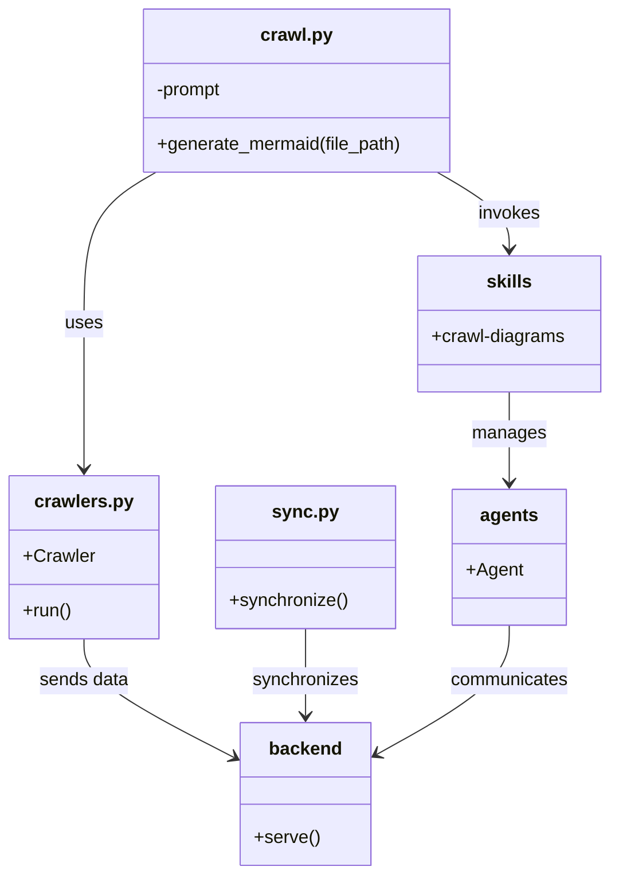
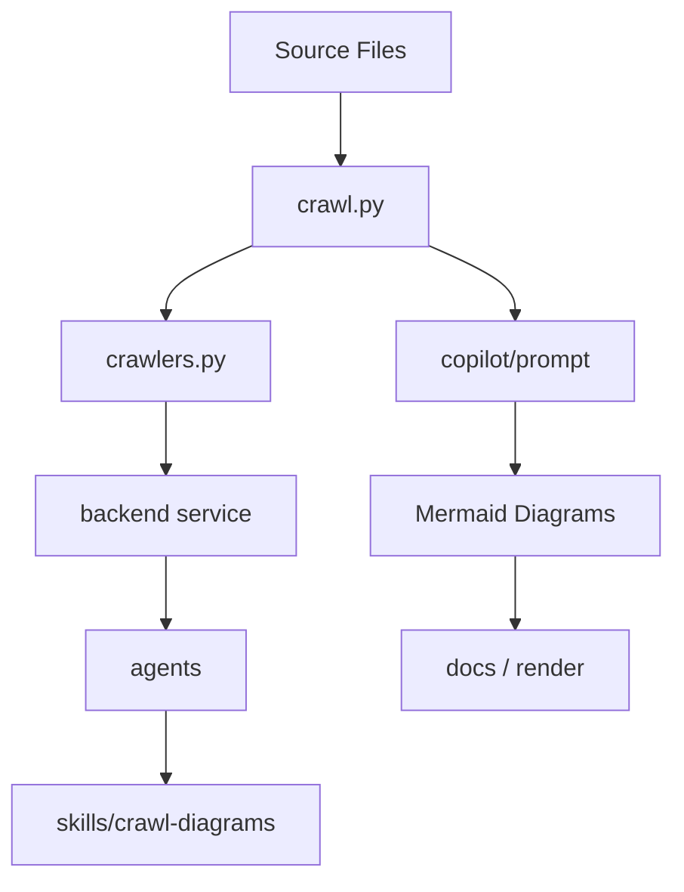

# Diagram: common/comment_service/.prospector.yaml

> Auto-generated by Obscura crawlers

## Diagram 1

### SVG

<svg id="container" width="528.74609375" xmlns="http://www.w3.org/2000/svg" class="classDiagram" height="772" viewBox="0 0 528.74609375 772" role="graphics-document document" aria-roledescription="class"><g><defs><marker id="container_class-aggregationStart" class="marker aggregation class" refX="18" refY="7" markerWidth="190" markerHeight="240" orient="auto"><path d="M 18,7 L9,13 L1,7 L9,1 Z"></path></marker></defs><defs><marker id="container_class-aggregationEnd" class="marker aggregation class" refX="1" refY="7" markerWidth="20" markerHeight="28" orient="auto"><path d="M 18,7 L9,13 L1,7 L9,1 Z"></path></marker></defs><defs><marker id="container_class-extensionStart" class="marker extension class" refX="18" refY="7" markerWidth="190" markerHeight="240" orient="auto"><path d="M 1,7 L18,13 V 1 Z"></path></marker></defs><defs><marker id="container_class-extensionEnd" class="marker extension class" refX="1" refY="7" markerWidth="20" markerHeight="28" orient="auto"><path d="M 1,1 V 13 L18,7 Z"></path></marker></defs><defs><marker id="container_class-compositionStart" class="marker composition class" refX="18" refY="7" markerWidth="190" markerHeight="240" orient="auto"><path d="M 18,7 L9,13 L1,7 L9,1 Z"></path></marker></defs><defs><marker id="container_class-compositionEnd" class="marker composition class" refX="1" refY="7" markerWidth="20" markerHeight="28" orient="auto"><path d="M 18,7 L9,13 L1,7 L9,1 Z"></path></marker></defs><defs><marker id="container_class-dependencyStart" class="marker dependency class" refX="6" refY="7" markerWidth="190" markerHeight="240" orient="auto"><path d="M 5,7 L9,13 L1,7 L9,1 Z"></path></marker></defs><defs><marker id="container_class-dependencyEnd" class="marker dependency class" refX="13" refY="7" markerWidth="20" markerHeight="28" orient="auto"><path d="M 18,7 L9,13 L14,7 L9,1 Z"></path></marker></defs><defs><marker id="container_class-lollipopStart" class="marker lollipop class" refX="13" refY="7" markerWidth="190" markerHeight="240" orient="auto"><circle stroke="black" fill="transparent" cx="7" cy="7" r="6"></circle></marker></defs><defs><marker id="container_class-lollipopEnd" class="marker lollipop class" refX="1" refY="7" markerWidth="190" markerHeight="240" orient="auto"><circle stroke="black" fill="transparent" cx="7" cy="7" r="6"></circle></marker></defs><g class="root"><g class="clusters"></g><g class="edgePaths"><path d="M134.223,152L123.813,158.167C113.403,164.333,92.582,176.667,82.172,199C71.762,221.333,71.762,253.667,71.762,286C71.762,318.333,71.762,350.667,71.762,372C71.762,393.333,71.762,403.667,71.762,408.833L71.762,414" id="id_crawl.py_crawlers.py_1" class="edge-thickness-normal edge-pattern-solid relation" style=";;;" data-edge="true" data-et="edge" data-id="id_crawl.py_crawlers.py_1" data-points="W3sieCI6MTM0LjIyMzA4NjI5NTg3MTU1LCJ5IjoxNTJ9LHsieCI6NzEuNzYxNzE4NzUsInkiOjE4OX0seyJ4Ijo3MS43NjE3MTg3NSwieSI6Mjg2fSx7IngiOjcxLjc2MTcxODc1LCJ5IjozODN9LHsieCI6NzEuNzYxNzE4NzUsInkiOjQyMH1d" marker-end="url(#container_class-dependencyEnd)"></path><path d="M377.316,152L387.726,158.167C398.136,164.333,418.957,176.667,429.367,188C439.777,199.333,439.777,209.667,439.777,214.833L439.777,220" id="id_crawl.py_skills_2" class="edge-thickness-normal edge-pattern-solid relation" style=";;;" data-edge="true" data-et="edge" data-id="id_crawl.py_skills_2" data-points="W3sieCI6Mzc3LjMxNTk3NjIwNDEyODQ1LCJ5IjoxNTJ9LHsieCI6NDM5Ljc3NzM0Mzc1LCJ5IjoxODl9LHsieCI6NDM5Ljc3NzM0Mzc1LCJ5IjoyMjZ9XQ==" marker-end="url(#container_class-dependencyEnd)"></path><path d="M439.777,346L439.777,352.167C439.777,358.333,439.777,370.667,439.777,384C439.777,397.333,439.777,411.667,439.777,418.833L439.777,426" id="id_skills_agents_3" class="edge-thickness-normal edge-pattern-solid relation" style=";;;" data-edge="true" data-et="edge" data-id="id_skills_agents_3" data-points="W3sieCI6NDM5Ljc3NzM0Mzc1LCJ5IjozNDZ9LHsieCI6NDM5Ljc3NzM0Mzc1LCJ5IjozODN9LHsieCI6NDM5Ljc3NzM0Mzc1LCJ5Ijo0MzJ9XQ==" marker-end="url(#container_class-dependencyEnd)"></path><path d="M71.762,564L71.762,570.167C71.762,576.333,71.762,588.667,93.436,606.15C115.111,623.634,158.461,646.268,180.135,657.585L201.81,668.902" id="id_crawlers.py_backend_4" class="edge-thickness-normal edge-pattern-solid relation" style=";;;" data-edge="true" data-et="edge" data-id="id_crawlers.py_backend_4" data-points="W3sieCI6NzEuNzYxNzE4NzUsInkiOjU2NH0seyJ4Ijo3MS43NjE3MTg3NSwieSI6NjAxfSx7IngiOjIwNy4xMjg5MDYyNSwieSI6NjcxLjY3OTE3NjAxNDY4NDl9XQ==" marker-end="url(#container_class-dependencyEnd)"></path><path d="M263.285,555L263.285,562.667C263.285,570.333,263.285,585.667,263.285,598.5C263.285,611.333,263.285,621.667,263.285,626.833L263.285,632" id="id_sync.py_backend_5" class="edge-thickness-normal edge-pattern-solid relation" style=";;;" data-edge="true" data-et="edge" data-id="id_sync.py_backend_5" data-points="W3sieCI6MjYzLjI4NTE1NjI1LCJ5Ijo1NTV9LHsieCI6MjYzLjI4NTE1NjI1LCJ5Ijo2MDF9LHsieCI6MjYzLjI4NTE1NjI1LCJ5Ijo2Mzh9XQ==" marker-end="url(#container_class-dependencyEnd)"></path><path d="M439.777,552L439.777,560.167C439.777,568.333,439.777,584.667,420.591,603.704C401.405,622.741,363.034,644.483,343.848,655.354L324.662,666.224" id="id_agents_backend_6" class="edge-thickness-normal edge-pattern-solid relation" style=";;;" data-edge="true" data-et="edge" data-id="id_agents_backend_6" data-points="W3sieCI6NDM5Ljc3NzM0Mzc1LCJ5Ijo1NTJ9LHsieCI6NDM5Ljc3NzM0Mzc1LCJ5Ijo2MDF9LHsieCI6MzE5LjQ0MTQwNjI1LCJ5Ijo2NjkuMTgyMDE5Mzg4MjUyfV0=" marker-end="url(#container_class-dependencyEnd)"></path></g><g class="edgeLabels"><g class="edgeLabel" transform="translate(71.76171875, 286)"><g class="label" data-id="id_crawl.py_crawlers.py_1" transform="translate(-16.4921875, -12)"><foreignObject width="32.984375" height="24">

uses

</foreignObject></g></g><g class="edgeLabel" transform="translate(439.77734375, 189)"><g class="label" data-id="id_crawl.py_skills_2" transform="translate(-27.5859375, -12)"><foreignObject width="55.171875" height="24">

invokes

</foreignObject></g></g><g class="edgeLabel" transform="translate(439.77734375, 383)"><g class="label" data-id="id_skills_agents_3" transform="translate(-32.296875, -12)"><foreignObject width="64.59375" height="24">

manages

</foreignObject></g></g><g class="edgeLabel" transform="translate(71.76171875, 601)"><g class="label" data-id="id_crawlers.py_backend_4" transform="translate(-39.75, -12)"><foreignObject width="79.5" height="24">

sends data

</foreignObject></g></g><g class="edgeLabel" transform="translate(263.28515625, 601)"><g class="label" data-id="id_sync.py_backend_5" transform="translate(-46.7421875, -12)"><foreignObject width="93.484375" height="24">

synchronizes

</foreignObject></g></g><g class="edgeLabel" transform="translate(439.77734375, 601)"><g class="label" data-id="id_agents_backend_6" transform="translate(-52.609375, -12)"><foreignObject width="105.21875" height="24">

communicates

</foreignObject></g></g></g><g class="nodes"><g class="node default" id="classId-crawl.py-0" transform="translate(255.76953125, 80)"><g class="basic label-container"><path d="M-136.4765625 -72 L136.4765625 -72 L136.4765625 72 L-136.4765625 72" stroke="none" stroke-width="0" fill="#ECECFF" style=""></path><path d="M-136.4765625 -72 C-64.04191595698829 -72, 8.392730586023418 -72, 136.4765625 -72 M-136.4765625 -72 C-48.7753098899358 -72, 38.925942720128404 -72, 136.4765625 -72 M136.4765625 -72 C136.4765625 -34.78890296703376, 136.4765625 2.422194065932473, 136.4765625 72 M136.4765625 -72 C136.4765625 -36.37203825068975, 136.4765625 -0.7440765013794959, 136.4765625 72 M136.4765625 72 C29.424614168560268 72, -77.62733416287946 72, -136.4765625 72 M136.4765625 72 C74.46354143358899 72, 12.450520367177973 72, -136.4765625 72 M-136.4765625 72 C-136.4765625 38.882404695653406, -136.4765625 5.764809391306812, -136.4765625 -72 M-136.4765625 72 C-136.4765625 18.64373579207087, -136.4765625 -34.71252841585826, -136.4765625 -72" stroke="#9370DB" stroke-width="1.3" fill="none" stroke-dasharray="0 0" style=""></path></g><g class="annotation-group text" transform="translate(0, -48)"></g><g class="label-group text" transform="translate(-30.3125, -48)"><g class="label" style="font-weight: bolder" transform="translate(0,-12)"><foreignObject width="60.625" height="24">

crawl.py

</foreignObject></g></g><g class="members-group text" transform="translate(-124.4765625, 0)"><g class="label" style="" transform="translate(0,-12)"><foreignObject width="59.984375" height="24">

-prompt

</foreignObject></g></g><g class="methods-group text" transform="translate(-124.4765625, 48)"><g class="label" style="" transform="translate(0,-12)"><foreignObject width="218.640625" height="24">

+generate_mermaid(file_path)

</foreignObject></g></g><g class="divider" style=""><path d="M-136.4765625 -24 C-28.87921446297129 -24, 78.71813357405742 -24, 136.4765625 -24 M-136.4765625 -24 C-53.82608615700066 -24, 28.82439018599868 -24, 136.4765625 -24" stroke="#9370DB" stroke-width="1.3" fill="none" stroke-dasharray="0 0" style=""></path></g><g class="divider" style=""><path d="M-136.4765625 24 C-37.90107745454985 24, 60.6744075909003 24, 136.4765625 24 M-136.4765625 24 C-39.873850341337686 24, 56.72886181732463 24, 136.4765625 24" stroke="#9370DB" stroke-width="1.3" fill="none" stroke-dasharray="0 0" style=""></path></g></g><g class="node default" id="classId-crawlers.py-1" transform="translate(71.76171875, 492)"><g class="basic label-container"><path d="M-63.76171875 -72 L63.76171875 -72 L63.76171875 72 L-63.76171875 72" stroke="none" stroke-width="0" fill="#ECECFF" style=""></path><path d="M-63.76171875 -72 C-13.960903620065139 -72, 35.83991150986972 -72, 63.76171875 -72 M-63.76171875 -72 C-20.48237670741858 -72, 22.796965335162838 -72, 63.76171875 -72 M63.76171875 -72 C63.76171875 -33.25587968105556, 63.76171875 5.488240637888879, 63.76171875 72 M63.76171875 -72 C63.76171875 -15.471195840206008, 63.76171875 41.057608319587985, 63.76171875 72 M63.76171875 72 C24.329190618723224 72, -15.103337512553551 72, -63.76171875 72 M63.76171875 72 C26.905162006078847 72, -9.951394737842307 72, -63.76171875 72 M-63.76171875 72 C-63.76171875 18.42113373279024, -63.76171875 -35.15773253441952, -63.76171875 -72 M-63.76171875 72 C-63.76171875 38.17940593820131, -63.76171875 4.358811876402626, -63.76171875 -72" stroke="#9370DB" stroke-width="1.3" fill="none" stroke-dasharray="0 0" style=""></path></g><g class="annotation-group text" transform="translate(0, -48)"></g><g class="label-group text" transform="translate(-41.6015625, -48)"><g class="label" style="font-weight: bolder" transform="translate(0,-12)"><foreignObject width="83.203125" height="24">

crawlers.py

</foreignObject></g></g><g class="members-group text" transform="translate(-51.76171875, 0)"><g class="label" style="" transform="translate(0,-12)"><foreignObject width="61.921875" height="24">

+Crawler

</foreignObject></g></g><g class="methods-group text" transform="translate(-51.76171875, 48)"><g class="label" style="" transform="translate(0,-12)"><foreignObject width="43.21875" height="24">

+run()

</foreignObject></g></g><g class="divider" style=""><path d="M-63.76171875 -24 C-35.56007350628043 -24, -7.358428262560864 -24, 63.76171875 -24 M-63.76171875 -24 C-33.15337796243025 -24, -2.5450371748604965 -24, 63.76171875 -24" stroke="#9370DB" stroke-width="1.3" fill="none" stroke-dasharray="0 0" style=""></path></g><g class="divider" style=""><path d="M-63.76171875 24 C-21.4078614845845 24, 20.945995780830998 24, 63.76171875 24 M-63.76171875 24 C-23.738096040945734 24, 16.28552666810853 24, 63.76171875 24" stroke="#9370DB" stroke-width="1.3" fill="none" stroke-dasharray="0 0" style=""></path></g></g><g class="node default" id="classId-sync.py-2" transform="translate(263.28515625, 492)"><g class="basic label-container"><path d="M-77.76171875 -63 L77.76171875 -63 L77.76171875 63 L-77.76171875 63" stroke="none" stroke-width="0" fill="#ECECFF" style=""></path><path d="M-77.76171875 -63 C-22.001859973779062 -63, 33.757998802441875 -63, 77.76171875 -63 M-77.76171875 -63 C-21.941148381230157 -63, 33.879421987539686 -63, 77.76171875 -63 M77.76171875 -63 C77.76171875 -36.40582417845345, 77.76171875 -9.8116483569069, 77.76171875 63 M77.76171875 -63 C77.76171875 -16.746476677371497, 77.76171875 29.507046645257006, 77.76171875 63 M77.76171875 63 C39.16886863578508 63, 0.5760185215701625 63, -77.76171875 63 M77.76171875 63 C19.614118656978462 63, -38.533481436043076 63, -77.76171875 63 M-77.76171875 63 C-77.76171875 16.170015354041844, -77.76171875 -30.659969291916312, -77.76171875 -63 M-77.76171875 63 C-77.76171875 35.82839549259877, -77.76171875 8.656790985197553, -77.76171875 -63" stroke="#9370DB" stroke-width="1.3" fill="none" stroke-dasharray="0 0" style=""></path></g><g class="annotation-group text" transform="translate(0, -39)"></g><g class="label-group text" transform="translate(-27.1640625, -39)"><g class="label" style="font-weight: bolder" transform="translate(0,-12)"><foreignObject width="54.328125" height="24">

sync.py

</foreignObject></g></g><g class="members-group text" transform="translate(-65.76171875, 9)"></g><g class="methods-group text" transform="translate(-65.76171875, 39)"><g class="label" style="" transform="translate(0,-12)"><foreignObject width="104.359375" height="24">

+synchronize()

</foreignObject></g></g><g class="divider" style=""><path d="M-77.76171875 -15 C-36.76211079136571 -15, 4.237497167268586 -15, 77.76171875 -15 M-77.76171875 -15 C-26.35532142756069 -15, 25.051075894878622 -15, 77.76171875 -15" stroke="#9370DB" stroke-width="1.3" fill="none" stroke-dasharray="0 0" style=""></path></g><g class="divider" style=""><path d="M-77.76171875 9 C-34.47521100837467 9, 8.811296733250657 9, 77.76171875 9 M-77.76171875 9 C-16.788519823230985 9, 44.18467910353803 9, 77.76171875 9" stroke="#9370DB" stroke-width="1.3" fill="none" stroke-dasharray="0 0" style=""></path></g></g><g class="node default" id="classId-backend-3" transform="translate(263.28515625, 701)"><g class="basic label-container"><path d="M-56.15625 -63 L56.15625 -63 L56.15625 63 L-56.15625 63" stroke="none" stroke-width="0" fill="#ECECFF" style=""></path><path d="M-56.15625 -63 C-32.399142293017036 -63, -8.642034586034079 -63, 56.15625 -63 M-56.15625 -63 C-17.5301140804589 -63, 21.096021839082198 -63, 56.15625 -63 M56.15625 -63 C56.15625 -22.892132272768144, 56.15625 17.21573545446371, 56.15625 63 M56.15625 -63 C56.15625 -13.152436452507914, 56.15625 36.69512709498417, 56.15625 63 M56.15625 63 C26.30659302632637 63, -3.5430639473472567 63, -56.15625 63 M56.15625 63 C20.579951849773053 63, -14.996346300453894 63, -56.15625 63 M-56.15625 63 C-56.15625 12.685966947859754, -56.15625 -37.62806610428049, -56.15625 -63 M-56.15625 63 C-56.15625 30.378150756359943, -56.15625 -2.2436984872801133, -56.15625 -63" stroke="#9370DB" stroke-width="1.3" fill="none" stroke-dasharray="0 0" style=""></path></g><g class="annotation-group text" transform="translate(0, -39)"></g><g class="label-group text" transform="translate(-31.0625, -39)"><g class="label" style="font-weight: bolder" transform="translate(0,-12)"><foreignObject width="62.125" height="24">

backend

</foreignObject></g></g><g class="members-group text" transform="translate(-44.15625, 9)"></g><g class="methods-group text" transform="translate(-44.15625, 39)"><g class="label" style="" transform="translate(0,-12)"><foreignObject width="57.25" height="24">

+serve()

</foreignObject></g></g><g class="divider" style=""><path d="M-56.15625 -15 C-22.967787496292317 -15, 10.220675007415366 -15, 56.15625 -15 M-56.15625 -15 C-18.245499988432336 -15, 19.66525002313533 -15, 56.15625 -15" stroke="#9370DB" stroke-width="1.3" fill="none" stroke-dasharray="0 0" style=""></path></g><g class="divider" style=""><path d="M-56.15625 9 C-33.5251053775647 9, -10.893960755129399 9, 56.15625 9 M-56.15625 9 C-22.496957043517135 9, 11.16233591296573 9, 56.15625 9" stroke="#9370DB" stroke-width="1.3" fill="none" stroke-dasharray="0 0" style=""></path></g></g><g class="node default" id="classId-agents-4" transform="translate(439.77734375, 492)"><g class="basic label-container"><path d="M-48.73046875 -60 L48.73046875 -60 L48.73046875 60 L-48.73046875 60" stroke="none" stroke-width="0" fill="#ECECFF" style=""></path><path d="M-48.73046875 -60 C-26.35545461189711 -60, -3.980440473794218 -60, 48.73046875 -60 M-48.73046875 -60 C-27.862360517705373 -60, -6.994252285410745 -60, 48.73046875 -60 M48.73046875 -60 C48.73046875 -26.46259870570006, 48.73046875 7.07480258859988, 48.73046875 60 M48.73046875 -60 C48.73046875 -15.46074708054374, 48.73046875 29.07850583891252, 48.73046875 60 M48.73046875 60 C11.151708939523118 60, -26.427050870953764 60, -48.73046875 60 M48.73046875 60 C18.098850842282026 60, -12.532767065435948 60, -48.73046875 60 M-48.73046875 60 C-48.73046875 23.29188250183138, -48.73046875 -13.416234996337238, -48.73046875 -60 M-48.73046875 60 C-48.73046875 14.800386637304591, -48.73046875 -30.399226725390818, -48.73046875 -60" stroke="#9370DB" stroke-width="1.3" fill="none" stroke-dasharray="0 0" style=""></path></g><g class="annotation-group text" transform="translate(0, -36)"></g><g class="label-group text" transform="translate(-24.5234375, -36)"><g class="label" style="font-weight: bolder" transform="translate(0,-12)"><foreignObject width="49.046875" height="24">

agents

</foreignObject></g></g><g class="members-group text" transform="translate(-36.73046875, 12)"><g class="label" style="" transform="translate(0,-12)"><foreignObject width="48.9375" height="24">

+Agent

</foreignObject></g></g><g class="methods-group text" transform="translate(-36.73046875, 60)"></g><g class="divider" style=""><path d="M-48.73046875 -12 C-18.501506170932874 -12, 11.727456408134252 -12, 48.73046875 -12 M-48.73046875 -12 C-13.278052193843436 -12, 22.174364362313128 -12, 48.73046875 -12" stroke="#9370DB" stroke-width="1.3" fill="none" stroke-dasharray="0 0" style=""></path></g><g class="divider" style=""><path d="M-48.73046875 36 C-25.48057791656793 36, -2.2306870831358623 36, 48.73046875 36 M-48.73046875 36 C-23.858889807283255 36, 1.0126891354334902 36, 48.73046875 36" stroke="#9370DB" stroke-width="1.3" fill="none" stroke-dasharray="0 0" style=""></path></g></g><g class="node default" id="classId-skills-5" transform="translate(439.77734375, 286)"><g class="basic label-container"><path d="M-80.96875 -60 L80.96875 -60 L80.96875 60 L-80.96875 60" stroke="none" stroke-width="0" fill="#ECECFF" style=""></path><path d="M-80.96875 -60 C-26.13653754714452 -60, 28.69567490571096 -60, 80.96875 -60 M-80.96875 -60 C-27.789303333380595 -60, 25.39014333323881 -60, 80.96875 -60 M80.96875 -60 C80.96875 -22.69952868993647, 80.96875 14.600942620127057, 80.96875 60 M80.96875 -60 C80.96875 -33.49406137187569, 80.96875 -6.988122743751369, 80.96875 60 M80.96875 60 C29.590598672417947 60, -21.787552655164106 60, -80.96875 60 M80.96875 60 C37.38506678003999 60, -6.198616439920016 60, -80.96875 60 M-80.96875 60 C-80.96875 32.914211745605144, -80.96875 5.828423491210295, -80.96875 -60 M-80.96875 60 C-80.96875 27.70336546716323, -80.96875 -4.593269065673539, -80.96875 -60" stroke="#9370DB" stroke-width="1.3" fill="none" stroke-dasharray="0 0" style=""></path></g><g class="annotation-group text" transform="translate(0, -36)"></g><g class="label-group text" transform="translate(-19.15625, -36)"><g class="label" style="font-weight: bolder" transform="translate(0,-12)"><foreignObject width="38.3125" height="24">

skills

</foreignObject></g></g><g class="members-group text" transform="translate(-68.96875, 12)"><g class="label" style="" transform="translate(0,-12)"><foreignObject width="118.78125" height="24">

+crawl-diagrams

</foreignObject></g></g><g class="methods-group text" transform="translate(-68.96875, 60)"></g><g class="divider" style=""><path d="M-80.96875 -12 C-33.93447997303684 -12, 13.099790053926327 -12, 80.96875 -12 M-80.96875 -12 C-36.893957956034605 -12, 7.180834087930791 -12, 80.96875 -12" stroke="#9370DB" stroke-width="1.3" fill="none" stroke-dasharray="0 0" style=""></path></g><g class="divider" style=""><path d="M-80.96875 36 C-25.00915483059321 36, 30.95044033881358 36, 80.96875 36 M-80.96875 36 C-28.737078306617434 36, 23.494593386765132 36, 80.96875 36" stroke="#9370DB" stroke-width="1.3" fill="none" stroke-dasharray="0 0" style=""></path></g></g></g></g></g></svg>

## Diagram 2

### SVG

<svg id="container" width="457.1640625" xmlns="http://www.w3.org/2000/svg" class="flowchart" height="590" viewBox="0 0 457.1640625 590" role="graphics-document document" aria-roledescription="flowchart-v2"><g><marker id="container_flowchart-v2-pointEnd" class="marker flowchart-v2" viewBox="0 0 10 10" refX="5" refY="5" markerUnits="userSpaceOnUse" markerWidth="8" markerHeight="8" orient="auto"><path d="M 0 0 L 10 5 L 0 10 z" class="arrowMarkerPath" style="stroke-width: 1; stroke-dasharray: 1, 0;"></path></marker><marker id="container_flowchart-v2-pointStart" class="marker flowchart-v2" viewBox="0 0 10 10" refX="4.5" refY="5" markerUnits="userSpaceOnUse" markerWidth="8" markerHeight="8" orient="auto"><path d="M 0 5 L 10 10 L 10 0 z" class="arrowMarkerPath" style="stroke-width: 1; stroke-dasharray: 1, 0;"></path></marker><marker id="container_flowchart-v2-circleEnd" class="marker flowchart-v2" viewBox="0 0 10 10" refX="11" refY="5" markerUnits="userSpaceOnUse" markerWidth="11" markerHeight="11" orient="auto"><circle cx="5" cy="5" r="5" class="arrowMarkerPath" style="stroke-width: 1; stroke-dasharray: 1, 0;"></circle></marker><marker id="container_flowchart-v2-circleStart" class="marker flowchart-v2" viewBox="0 0 10 10" refX="-1" refY="5" markerUnits="userSpaceOnUse" markerWidth="11" markerHeight="11" orient="auto"><circle cx="5" cy="5" r="5" class="arrowMarkerPath" style="stroke-width: 1; stroke-dasharray: 1, 0;"></circle></marker><marker id="container_flowchart-v2-crossEnd" class="marker cross flowchart-v2" viewBox="0 0 11 11" refX="12" refY="5.2" markerUnits="userSpaceOnUse" markerWidth="11" markerHeight="11" orient="auto"><path d="M 1,1 l 9,9 M 10,1 l -9,9" class="arrowMarkerPath" style="stroke-width: 2; stroke-dasharray: 1, 0;"></path></marker><marker id="container_flowchart-v2-crossStart" class="marker cross flowchart-v2" viewBox="0 0 11 11" refX="-1" refY="5.2" markerUnits="userSpaceOnUse" markerWidth="11" markerHeight="11" orient="auto"><path d="M 1,1 l 9,9 M 10,1 l -9,9" class="arrowMarkerPath" style="stroke-width: 2; stroke-dasharray: 1, 0;"></path></marker><g class="root"><g class="clusters"></g><g class="edgePaths"><path d="M233.602,62L233.602,66.167C233.602,70.333,233.602,78.667,233.602,86.333C233.602,94,233.602,101,233.602,104.5L233.602,108" id="L_A_B_0" class="edge-thickness-normal edge-pattern-solid edge-thickness-normal edge-pattern-solid flowchart-link" style=";" data-edge="true" data-et="edge" data-id="L_A_B_0" data-points="W3sieCI6MjMzLjYwMTU2MjUsInkiOjYyfSx7IngiOjIzMy42MDE1NjI1LCJ5Ijo4N30seyJ4IjoyMzMuNjAxNTYyNSwieSI6MTEyfV0=" marker-end="url(#container_flowchart-v2-pointEnd)"></path><path d="M293.234,165.295L302.951,169.579C312.667,173.863,332.099,182.432,341.815,190.216C351.531,198,351.531,205,351.531,208.5L351.531,212" id="L_B_C_0" class="edge-thickness-normal edge-pattern-solid edge-thickness-normal edge-pattern-solid flowchart-link" style=";" data-edge="true" data-et="edge" data-id="L_B_C_0" data-points="W3sieCI6MjkzLjIzNDM3NSwieSI6MTY1LjI5NDUzNDYxNDExMDYzfSx7IngiOjM1MS41MzEyNSwieSI6MTkxfSx7IngiOjM1MS41MzEyNSwieSI6MjE2fV0=" marker-end="url(#container_flowchart-v2-pointEnd)"></path><path d="M351.531,270L351.531,274.167C351.531,278.333,351.531,286.667,351.531,294.333C351.531,302,351.531,309,351.531,312.5L351.531,316" id="L_C_D_0" class="edge-thickness-normal edge-pattern-solid edge-thickness-normal edge-pattern-solid flowchart-link" style=";" data-edge="true" data-et="edge" data-id="L_C_D_0" data-points="W3sieCI6MzUxLjUzMTI1LCJ5IjoyNzB9LHsieCI6MzUxLjUzMTI1LCJ5IjoyOTV9LHsieCI6MzUxLjUzMTI1LCJ5IjozMjB9XQ==" marker-end="url(#container_flowchart-v2-pointEnd)"></path><path d="M173.969,165.295L164.253,169.579C154.536,173.863,135.104,182.432,125.388,190.216C115.672,198,115.672,205,115.672,208.5L115.672,212" id="L_B_E_0" class="edge-thickness-normal edge-pattern-solid edge-thickness-normal edge-pattern-solid flowchart-link" style=";" data-edge="true" data-et="edge" data-id="L_B_E_0" data-points="W3sieCI6MTczLjk2ODc1LCJ5IjoxNjUuMjk0NTM0NjE0MTEwNjN9LHsieCI6MTE1LjY3MTg3NSwieSI6MTkxfSx7IngiOjExNS42NzE4NzUsInkiOjIxNn1d" marker-end="url(#container_flowchart-v2-pointEnd)"></path><path d="M115.672,270L115.672,274.167C115.672,278.333,115.672,286.667,115.672,294.333C115.672,302,115.672,309,115.672,312.5L115.672,316" id="L_E_F_0" class="edge-thickness-normal edge-pattern-solid edge-thickness-normal edge-pattern-solid flowchart-link" style=";" data-edge="true" data-et="edge" data-id="L_E_F_0" data-points="W3sieCI6MTE1LjY3MTg3NSwieSI6MjcwfSx7IngiOjExNS42NzE4NzUsInkiOjI5NX0seyJ4IjoxMTUuNjcxODc1LCJ5IjozMjB9XQ==" marker-end="url(#container_flowchart-v2-pointEnd)"></path><path d="M115.672,374L115.672,378.167C115.672,382.333,115.672,390.667,115.672,398.333C115.672,406,115.672,413,115.672,416.5L115.672,420" id="L_F_G_0" class="edge-thickness-normal edge-pattern-solid edge-thickness-normal edge-pattern-solid flowchart-link" style=";" data-edge="true" data-et="edge" data-id="L_F_G_0" data-points="W3sieCI6MTE1LjY3MTg3NSwieSI6Mzc0fSx7IngiOjExNS42NzE4NzUsInkiOjM5OX0seyJ4IjoxMTUuNjcxODc1LCJ5Ijo0MjR9XQ==" marker-end="url(#container_flowchart-v2-pointEnd)"></path><path d="M115.672,478L115.672,482.167C115.672,486.333,115.672,494.667,115.672,502.333C115.672,510,115.672,517,115.672,520.5L115.672,524" id="L_G_H_0" class="edge-thickness-normal edge-pattern-solid edge-thickness-normal edge-pattern-solid flowchart-link" style=";" data-edge="true" data-et="edge" data-id="L_G_H_0" data-points="W3sieCI6MTE1LjY3MTg3NSwieSI6NDc4fSx7IngiOjExNS42NzE4NzUsInkiOjUwM30seyJ4IjoxMTUuNjcxODc1LCJ5Ijo1Mjh9XQ==" marker-end="url(#container_flowchart-v2-pointEnd)"></path><path d="M351.531,374L351.531,378.167C351.531,382.333,351.531,390.667,351.531,398.333C351.531,406,351.531,413,351.531,416.5L351.531,420" id="L_D_I_0" class="edge-thickness-normal edge-pattern-solid edge-thickness-normal edge-pattern-solid flowchart-link" style=";" data-edge="true" data-et="edge" data-id="L_D_I_0" data-points="W3sieCI6MzUxLjUzMTI1LCJ5IjozNzR9LHsieCI6MzUxLjUzMTI1LCJ5IjozOTl9LHsieCI6MzUxLjUzMTI1LCJ5Ijo0MjR9XQ==" marker-end="url(#container_flowchart-v2-pointEnd)"></path></g><g class="edgeLabels"><g class="edgeLabel"><g class="label" data-id="L_A_B_0" transform="translate(0, 0)"><foreignObject width="0" height="0">

</foreignObject></g></g><g class="edgeLabel"><g class="label" data-id="L_B_C_0" transform="translate(0, 0)"><foreignObject width="0" height="0">

</foreignObject></g></g><g class="edgeLabel"><g class="label" data-id="L_C_D_0" transform="translate(0, 0)"><foreignObject width="0" height="0">

</foreignObject></g></g><g class="edgeLabel"><g class="label" data-id="L_B_E_0" transform="translate(0, 0)"><foreignObject width="0" height="0">

</foreignObject></g></g><g class="edgeLabel"><g class="label" data-id="L_E_F_0" transform="translate(0, 0)"><foreignObject width="0" height="0">

</foreignObject></g></g><g class="edgeLabel"><g class="label" data-id="L_F_G_0" transform="translate(0, 0)"><foreignObject width="0" height="0">

</foreignObject></g></g><g class="edgeLabel"><g class="label" data-id="L_G_H_0" transform="translate(0, 0)"><foreignObject width="0" height="0">

</foreignObject></g></g><g class="edgeLabel"><g class="label" data-id="L_D_I_0" transform="translate(0, 0)"><foreignObject width="0" height="0">

</foreignObject></g></g></g><g class="nodes"><g class="node default" id="flowchart-A-0" transform="translate(233.6015625, 35)"><rect class="basic label-container" style="" x="-72.984375" y="-27" width="145.96875" height="54"></rect><g class="label" style="" transform="translate(-42.984375, -12)"><rect></rect><foreignObject width="85.96875" height="24">

Source Files

</foreignObject></g></g><g class="node default" id="flowchart-B-1" transform="translate(233.6015625, 139)"><rect class="basic label-container" style="" x="-59.6328125" y="-27" width="119.265625" height="54"></rect><g class="label" style="" transform="translate(-29.6328125, -12)"><rect></rect><foreignObject width="59.265625" height="24">

crawl.py

</foreignObject></g></g><g class="node default" id="flowchart-C-3" transform="translate(351.53125, 243)"><rect class="basic label-container" style="" x="-85.8984375" y="-27" width="171.796875" height="54"></rect><g class="label" style="" transform="translate(-55.8984375, -12)"><rect></rect><foreignObject width="111.796875" height="24">

copilot/prompt

</foreignObject></g></g><g class="node default" id="flowchart-D-5" transform="translate(351.53125, 347)"><rect class="basic label-container" style="" x="-97.6328125" y="-27" width="195.265625" height="54"></rect><g class="label" style="" transform="translate(-67.6328125, -12)"><rect></rect><foreignObject width="135.265625" height="24">

Mermaid Diagrams

</foreignObject></g></g><g class="node default" id="flowchart-E-7" transform="translate(115.671875, 243)"><rect class="basic label-container" style="" x="-70.625" y="-27" width="141.25" height="54"></rect><g class="label" style="" transform="translate(-40.625, -12)"><rect></rect><foreignObject width="81.25" height="24">

crawlers.py

</foreignObject></g></g><g class="node default" id="flowchart-F-9" transform="translate(115.671875, 347)"><rect class="basic label-container" style="" x="-88.2265625" y="-27" width="176.453125" height="54"></rect><g class="label" style="" transform="translate(-58.2265625, -12)"><rect></rect><foreignObject width="116.453125" height="24">

backend service

</foreignObject></g></g><g class="node default" id="flowchart-G-11" transform="translate(115.671875, 451)"><rect class="basic label-container" style="" x="-53.9765625" y="-27" width="107.953125" height="54"></rect><g class="label" style="" transform="translate(-23.9765625, -12)"><rect></rect><foreignObject width="47.953125" height="24">

agents

</foreignObject></g></g><g class="node default" id="flowchart-H-13" transform="translate(115.671875, 555)"><rect class="basic label-container" style="" x="-107.671875" y="-27" width="215.34375" height="54"></rect><g class="label" style="" transform="translate(-77.671875, -12)"><rect></rect><foreignObject width="155.34375" height="24">

skills/crawl-diagrams

</foreignObject></g></g><g class="node default" id="flowchart-I-15" transform="translate(351.53125, 451)"><rect class="basic label-container" style="" x="-79.546875" y="-27" width="159.09375" height="54"></rect><g class="label" style="" transform="translate(-49.546875, -12)"><rect></rect><foreignObject width="99.09375" height="24">

docs / render

</foreignObject></g></g></g></g></g></svg>
