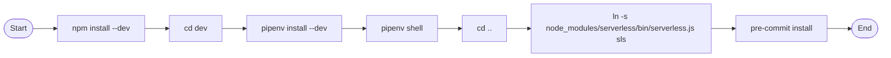

# Diagram: common/comment_service/bin/install.sh

> Auto-generated by Obscura crawlers

## Mermaid

### SVG

<svg id="container" width="1834.7880859375" xmlns="http://www.w3.org/2000/svg" class="flowchart" height="118" viewBox="0.0000019073486328125 0 1834.7880859375 118" role="graphics-document document" aria-roledescription="flowchart-v2"><g><marker id="container_flowchart-v2-pointEnd" class="marker flowchart-v2" viewBox="0 0 10 10" refX="5" refY="5" markerUnits="userSpaceOnUse" markerWidth="8" markerHeight="8" orient="auto"><path d="M 0 0 L 10 5 L 0 10 z" class="arrowMarkerPath" style="stroke-width: 1; stroke-dasharray: 1, 0;"></path></marker><marker id="container_flowchart-v2-pointStart" class="marker flowchart-v2" viewBox="0 0 10 10" refX="4.5" refY="5" markerUnits="userSpaceOnUse" markerWidth="8" markerHeight="8" orient="auto"><path d="M 0 5 L 10 10 L 10 0 z" class="arrowMarkerPath" style="stroke-width: 1; stroke-dasharray: 1, 0;"></path></marker><marker id="container_flowchart-v2-circleEnd" class="marker flowchart-v2" viewBox="0 0 10 10" refX="11" refY="5" markerUnits="userSpaceOnUse" markerWidth="11" markerHeight="11" orient="auto"><circle cx="5" cy="5" r="5" class="arrowMarkerPath" style="stroke-width: 1; stroke-dasharray: 1, 0;"></circle></marker><marker id="container_flowchart-v2-circleStart" class="marker flowchart-v2" viewBox="0 0 10 10" refX="-1" refY="5" markerUnits="userSpaceOnUse" markerWidth="11" markerHeight="11" orient="auto"><circle cx="5" cy="5" r="5" class="arrowMarkerPath" style="stroke-width: 1; stroke-dasharray: 1, 0;"></circle></marker><marker id="container_flowchart-v2-crossEnd" class="marker cross flowchart-v2" viewBox="0 0 11 11" refX="12" refY="5.2" markerUnits="userSpaceOnUse" markerWidth="11" markerHeight="11" orient="auto"><path d="M 1,1 l 9,9 M 10,1 l -9,9" class="arrowMarkerPath" style="stroke-width: 2; stroke-dasharray: 1, 0;"></path></marker><marker id="container_flowchart-v2-crossStart" class="marker cross flowchart-v2" viewBox="0 0 11 11" refX="-1" refY="5.2" markerUnits="userSpaceOnUse" markerWidth="11" markerHeight="11" orient="auto"><path d="M 1,1 l 9,9 M 10,1 l -9,9" class="arrowMarkerPath" style="stroke-width: 2; stroke-dasharray: 1, 0;"></path></marker><g class="root"><g class="clusters"></g><g class="edgePaths"><path d="M68.277,59.5L72.36,59.417C76.444,59.333,84.61,59.167,92.194,59.083C99.777,59,106.777,59,110.277,59L113.777,59" id="L_A_B_0" class="edge-thickness-normal edge-pattern-solid edge-thickness-normal edge-pattern-solid flowchart-link" style=";" data-edge="true" data-et="edge" data-id="L_A_B_0" data-points="W3sieCI6NjguMjc2ODM3NDMxODI2OTMsInkiOjU5LjV9LHsieCI6OTIuNzc2ODM2Mzk1MjYzNjcsInkiOjU5fSx7IngiOjExNy43NzY4MzYzOTUyNjM2NywieSI6NTl9XQ==" marker-end="url(#container_flowchart-v2-pointEnd)"></path><path d="M302.792,59L306.959,59C311.126,59,319.459,59,327.126,59C334.792,59,341.792,59,345.292,59L348.792,59" id="L_B_C_0" class="edge-thickness-normal edge-pattern-solid edge-thickness-normal edge-pattern-solid flowchart-link" style=";" data-edge="true" data-et="edge" data-id="L_B_C_0" data-points="W3sieCI6MzAyLjc5MjQ2MTM5NTI2MzcsInkiOjU5fSx7IngiOjMyNy43OTI0NjEzOTUyNjM3LCJ5Ijo1OX0seyJ4IjozNTIuNzkyNDYxMzk1MjYzNywieSI6NTl9XQ==" marker-end="url(#container_flowchart-v2-pointEnd)"></path><path d="M460.027,59L464.194,59C468.36,59,476.694,59,484.36,59C492.027,59,499.027,59,502.527,59L506.027,59" id="L_C_D_0" class="edge-thickness-normal edge-pattern-solid edge-thickness-normal edge-pattern-solid flowchart-link" style=";" data-edge="true" data-et="edge" data-id="L_C_D_0" data-points="W3sieCI6NDYwLjAyNjgzNjM5NTI2MzcsInkiOjU5fSx7IngiOjQ4NS4wMjY4MzYzOTUyNjM3LCJ5Ijo1OX0seyJ4Ijo1MTAuMDI2ODM2Mzk1MjYzNywieSI6NTl9XQ==" marker-end="url(#container_flowchart-v2-pointEnd)"></path><path d="M711.824,59L715.99,59C720.157,59,728.49,59,736.157,59C743.824,59,750.824,59,754.324,59L757.824,59" id="L_D_E_0" class="edge-thickness-normal edge-pattern-solid edge-thickness-normal edge-pattern-solid flowchart-link" style=";" data-edge="true" data-et="edge" data-id="L_D_E_0" data-points="W3sieCI6NzExLjgyMzcxMTM5NTI2MzcsInkiOjU5fSx7IngiOjczNi44MjM3MTEzOTUyNjM3LCJ5Ijo1OX0seyJ4Ijo3NjEuODIzNzExMzk1MjYzNywieSI6NTl9XQ==" marker-end="url(#container_flowchart-v2-pointEnd)"></path><path d="M910.386,59L914.553,59C918.72,59,927.053,59,934.72,59C942.386,59,949.386,59,952.886,59L956.386,59" id="L_E_F_0" class="edge-thickness-normal edge-pattern-solid edge-thickness-normal edge-pattern-solid flowchart-link" style=";" data-edge="true" data-et="edge" data-id="L_E_F_0" data-points="W3sieCI6OTEwLjM4NjIxMTM5NTI2MzcsInkiOjU5fSx7IngiOjkzNS4zODYyMTEzOTUyNjM3LCJ5Ijo1OX0seyJ4Ijo5NjAuMzg2MjExMzk1MjYzNywieSI6NTl9XQ==" marker-end="url(#container_flowchart-v2-pointEnd)"></path><path d="M1049.214,59L1053.381,59C1057.548,59,1065.881,59,1073.548,59C1081.214,59,1088.214,59,1091.714,59L1095.214,59" id="L_F_G_0" class="edge-thickness-normal edge-pattern-solid edge-thickness-normal edge-pattern-solid flowchart-link" style=";" data-edge="true" data-et="edge" data-id="L_F_G_0" data-points="W3sieCI6MTA0OS4yMTQzMzYzOTUyNjM3LCJ5Ijo1OX0seyJ4IjoxMDc0LjIxNDMzNjM5NTI2MzcsInkiOjU5fSx7IngiOjEwOTkuMjE0MzM2Mzk1MjYzNywieSI6NTl9XQ==" marker-end="url(#container_flowchart-v2-pointEnd)"></path><path d="M1480.761,59L1484.928,59C1489.095,59,1497.428,59,1505.095,59C1512.761,59,1519.761,59,1523.261,59L1526.761,59" id="L_G_H_0" class="edge-thickness-normal edge-pattern-solid edge-thickness-normal edge-pattern-solid flowchart-link" style=";" data-edge="true" data-et="edge" data-id="L_G_H_0" data-points="W3sieCI6MTQ4MC43NjEyMTEzOTUyNjM3LCJ5Ijo1OX0seyJ4IjoxNTA1Ljc2MTIxMTM5NTI2MzcsInkiOjU5fSx7IngiOjE1MzAuNzYxMjExMzk1MjYzNywieSI6NTl9XQ==" marker-end="url(#container_flowchart-v2-pointEnd)"></path><path d="M1724.699,59L1728.865,59C1733.032,59,1741.365,59,1749.116,59.07C1756.866,59.141,1764.033,59.281,1767.616,59.351L1771.199,59.422" id="L_H_I_0" class="edge-thickness-normal edge-pattern-solid edge-thickness-normal edge-pattern-solid flowchart-link" style=";" data-edge="true" data-et="edge" data-id="L_H_I_0" data-points="W3sieCI6MTcyNC42OTg3MTEzOTUyNjM3LCJ5Ijo1OX0seyJ4IjoxNzQ5LjY5ODcxMTM5NTI2MzcsInkiOjU5fSx7IngiOjE3NzUuMTk4NzExMzk1MjYwMywieSI6NTkuNTAwMDAwMDAwMDAwMDF9XQ==" marker-end="url(#container_flowchart-v2-pointEnd)"></path></g><g class="edgeLabels"><g class="edgeLabel"><g class="label" data-id="L_A_B_0" transform="translate(0, 0)"><foreignObject width="0" height="0">

</foreignObject></g></g><g class="edgeLabel"><g class="label" data-id="L_B_C_0" transform="translate(0, 0)"><foreignObject width="0" height="0">

</foreignObject></g></g><g class="edgeLabel"><g class="label" data-id="L_C_D_0" transform="translate(0, 0)"><foreignObject width="0" height="0">

</foreignObject></g></g><g class="edgeLabel"><g class="label" data-id="L_D_E_0" transform="translate(0, 0)"><foreignObject width="0" height="0">

</foreignObject></g></g><g class="edgeLabel"><g class="label" data-id="L_E_F_0" transform="translate(0, 0)"><foreignObject width="0" height="0">

</foreignObject></g></g><g class="edgeLabel"><g class="label" data-id="L_F_G_0" transform="translate(0, 0)"><foreignObject width="0" height="0">

</foreignObject></g></g><g class="edgeLabel"><g class="label" data-id="L_G_H_0" transform="translate(0, 0)"><foreignObject width="0" height="0">

</foreignObject></g></g><g class="edgeLabel"><g class="label" data-id="L_H_I_0" transform="translate(0, 0)"><foreignObject width="0" height="0">

</foreignObject></g></g></g><g class="nodes"><g class="node default" id="flowchart-A-0" transform="translate(37.888418197631836, 59)"><g class="basic label-container outer-path"><path d="M-10.3984375 -19.5 C-2.458549897311878 -19.5, 5.481337705376244 -19.5, 10.3984375 -19.5 C10.3984375 -19.5, 10.398437499999998 -19.5, 10.398437499999998 -19.5 C10.7441081698117 -19.48891501442628, 11.089778839623403 -19.477830028852562, 11.6478067896239 -19.45993515863156 C11.951544152384342 -19.430633980543682, 12.255281515144786 -19.401332802455805, 12.892042152847864 -19.3399052695533 C13.238124419533408 -19.283953372583643, 13.584206686218952 -19.228001475613986, 14.126030759676757 -19.140403561325776 C14.381754281203946 -19.082036336289125, 14.637477802731137 -19.023669111252474, 15.34470188623539 -18.862249829261074 C15.750085168662288 -18.74193419893704, 16.155468451089188 -18.621618568613012, 16.543047751460602 -18.50658706670804 C16.822370752859925 -18.40379362015957, 17.10169375425925 -18.301000173611097, 17.716144095147794 -18.074876768247425 C18.064461436434748 -17.920687013726507, 18.412778777721698 -17.76649725920559, 18.85917041279238 -17.568892924097174 C19.15217932516827 -17.41603036219184, 19.445188237544155 -17.263167800286507, 19.967429764076783 -16.990714730406097 C20.30413162678103 -16.78660408255501, 20.640833489485274 -16.582493434703917, 21.036368073605697 -16.342718045390892 C21.243569482636854 -16.19818331205519, 21.450770891668014 -16.053648578719486, 22.061592844578712 -15.627565626425154 C22.385485165911497 -15.369270119298909, 22.709377487244282 -15.110974612172665, 23.03889120850187 -14.848196188198123 C23.37328264629363 -14.544510731908261, 23.707674084085394 -14.240825275618398, 23.964247236767985 -14.007812326905688 C24.170720204294792 -13.794612036188367, 24.377193171821595 -13.581411745471046, 24.833858442968648 -13.10986736009568 C25.06853068671588 -12.83420798936123, 25.303202930463115 -12.558548618626782, 25.644151408126582 -12.158051136245305 C25.81740013557328 -11.92591362475049, 25.99064886301998 -11.693776113255675, 26.391796464640635 -11.156274872382312 C26.531283631018095 -10.94198512727781, 26.670770797395555 -10.727695382173309, 27.073721378604247 -10.108655082055241 C27.19874184392491 -9.886668586183518, 27.323762309245577 -9.664682090311796, 27.6871239742735 -9.019496659696287 C27.80503415144191 -8.774653653932454, 27.922944328610317 -8.52981064816862, 28.22948364880834 -7.893275190886684 C28.410775209590504 -7.445481530720858, 28.592066770372668 -6.997687870555033, 28.698571729970325 -6.734618561215508 C28.85252874541394 -6.270924560418539, 29.00648576085756 -5.807230559621571, 29.09246063421488 -5.548287939305138 C29.181617447946625 -5.208294367738495, 29.27077426167837 -4.8683007961718525, 29.40953178754556 -4.339158212148133 C29.488906138376624 -3.9315876964056207, 29.568280489207684 -3.5240171806631078, 29.648482276581777 -3.1121979531509023 C29.686749881301523 -2.8154019677378295, 29.725017486021272 -2.5186059823247566, 29.808330202509367 -1.872449005199798 C29.83874316208284 -1.398742610943844, 29.86915612165631 -0.9250362166878898, 29.888418715913414 -0.6250057626472757 C29.888418715913414 -0.29285320221424843, 29.888418715913414 0.039299358218778835, 29.888418715913414 0.625005762647271 C29.859869748276704 1.0696789779009586, 29.83132078063999 1.5143521931546462, 29.808330202509367 1.8724490051997846 C29.773353386249795 2.1437222851554383, 29.73837656999022 2.4149955651110924, 29.648482276581777 3.1121979531508885 C29.555066671567392 3.59186734150465, 29.461651066553006 4.071536729858412, 29.40953178754556 4.339158212148129 C29.29169805195375 4.78850931542375, 29.173864316361943 5.237860418699371, 29.092460634214884 5.548287939305125 C28.99376031577586 5.8455575726833215, 28.895059997336837 6.142827206061518, 28.69857172997033 6.734618561215495 C28.586166909395992 7.012260641233473, 28.473762088821655 7.289902721251452, 28.229483648808344 7.893275190886679 C28.075324234231378 8.213390513738812, 27.921164819654415 8.533505836590946, 27.687123974273504 9.019496659696284 C27.509628552642226 9.334657754163022, 27.33213313101095 9.649818848629758, 27.07372137860425 10.108655082055236 C26.918660789128733 10.346869787087996, 26.76360019965322 10.585084492120759, 26.39179646464064 11.156274872382301 C26.167950607990118 11.456207927516942, 25.944104751339594 11.756140982651585, 25.644151408126582 12.158051136245302 C25.405878470063353 12.437940087408633, 25.167605532000124 12.717829038571962, 24.83385844296866 13.10986736009567 C24.649554084899485 13.3001767414713, 24.46524972683031 13.49048612284693, 23.96424723676799 14.007812326905684 C23.743379231842358 14.208398805131965, 23.522511226916727 14.408985283358248, 23.038891208501887 14.848196188198111 C22.7289394776879 15.09537444536031, 22.41898774687391 15.342552702522509, 22.061592844578715 15.627565626425152 C21.779049704352463 15.824655489951576, 21.49650656412621 16.021745353478, 21.036368073605708 16.34271804539089 C20.811786814447483 16.478860524478577, 20.587205555289263 16.615003003566265, 19.967429764076787 16.990714730406093 C19.5289071867629 17.219491678103633, 19.090384609449014 17.44826862580117, 18.859170412792388 17.56889292409717 C18.62128543917914 17.674197545308736, 18.383400465565888 17.7795021665203, 17.716144095147804 18.07487676824742 C17.27878889986904 18.235827522977115, 16.841433704590273 18.396778277706805, 16.543047751460616 18.506587066708033 C16.140334205741595 18.6261103331909, 15.737620660022573 18.74563359967377, 15.344701886235413 18.86224982926107 C14.919751234808045 18.95924204238721, 14.494800583380677 19.05623425551335, 14.126030759676766 19.140403561325773 C13.70562484573833 19.208371529194785, 13.285218931799893 19.276339497063795, 12.892042152847878 19.3399052695533 C12.39898216343322 19.387470173740738, 11.90592217401856 19.435035077928173, 11.6478067896239 19.45993515863156 C11.362120379829474 19.469096565738802, 11.076433970035048 19.47825797284605, 10.398437500000004 19.5 C10.398437500000002 19.5, 10.398437500000002 19.5, 10.3984375 19.5 C3.1164925359902096 19.5, -4.165452428019581 19.5, -10.398437499999996 19.5 C-10.66019522110525 19.49160593936465, -10.9219529422105 19.4832118787293, -11.647806789623893 19.45993515863156 C-11.913372384561379 19.434316365077297, -12.178937979498864 19.40869757152303, -12.892042152847871 19.3399052695533 C-13.287926478458036 19.275901761917446, -13.683810804068203 19.21189825428159, -14.126030759676759 19.140403561325773 C-14.588452037547025 19.03485892223273, -15.05087331541729 18.92931428313969, -15.344701886235388 18.862249829261074 C-15.703594354014081 18.755732428689363, -16.062486821792774 18.649215028117656, -16.54304775146059 18.506587066708043 C-16.982727431329316 18.344780880161945, -17.42240711119804 18.18297469361585, -17.716144095147797 18.074876768247425 C-18.16135169589953 17.877796570008876, -18.606559296651263 17.68071637177033, -18.85917041279238 17.568892924097174 C-19.139803799873842 17.42248666581104, -19.420437186955308 17.2760804075249, -19.96742976407678 16.990714730406097 C-20.255979312977434 16.81579429815715, -20.544528861878085 16.640873865908205, -21.036368073605686 16.3427180453909 C-21.360888662618716 16.11634653076529, -21.68540925163175 15.88997501613968, -22.061592844578712 15.627565626425156 C-22.353964075022738 15.39440735047124, -22.64633530546676 15.161249074517327, -23.03889120850187 14.848196188198125 C-23.316887898204463 14.595726949999577, -23.594884587907053 14.343257711801028, -23.964247236767974 14.007812326905697 C-24.266863828385205 13.695335850776678, -24.56948042000243 13.38285937464766, -24.833858442968655 13.109867360095677 C-24.999333758236585 12.915490638969791, -25.16480907350451 12.721113917843905, -25.64415140812658 12.158051136245307 C-25.830126334685584 11.908861677320592, -26.01610126124459 11.65967221839588, -26.391796464640635 11.156274872382316 C-26.546348252020778 10.918841824000543, -26.700900039400917 10.68140877561877, -27.073721378604244 10.108655082055249 C-27.297030252899248 9.712147563268934, -27.52033912719425 9.31564004448262, -27.6871239742735 9.019496659696289 C-27.864860593766803 8.65042276636401, -28.042597213260105 8.28134887303173, -28.22948364880834 7.893275190886686 C-28.33118023613755 7.642082654013789, -28.432876823466753 7.390890117140891, -28.698571729970325 6.73461856121551 C-28.834704353869114 6.324608787820443, -28.970836977767902 5.914599014425376, -29.09246063421488 5.5482879393051325 C-29.19313074614659 5.164389171807018, -29.2938008580783 4.780490404308904, -29.409531787545557 4.339158212148136 C-29.457362946114827 4.0935553220138825, -29.505194104684097 3.8479524318796283, -29.648482276581777 3.112197953150904 C-29.696162914327335 2.742396342403264, -29.74384355207289 2.3725947316556235, -29.808330202509364 1.872449005199809 C-29.839057530926976 1.3938460624424331, -29.869784859344588 0.9152431196850572, -29.888418715913414 0.6250057626472781 C-29.888418715913414 0.3548939778347814, -29.888418715913414 0.08478219302228462, -29.888418715913414 -0.6250057626472687 C-29.870527642582868 -0.903673671185014, -29.85263656925232 -1.1823415797227592, -29.808330202509367 -1.8724490051997822 C-29.765651663364036 -2.203455326980176, -29.7229731242187 -2.5344616487605705, -29.648482276581777 -3.112197953150895 C-29.591812621868417 -3.4031846529682355, -29.535142967155057 -3.694171352785576, -29.40953178754556 -4.339158212148126 C-29.307132951376364 -4.7296493543975995, -29.20473411520717 -5.120140496647073, -29.092460634214884 -5.548287939305123 C-28.984544485170183 -5.8733141861244205, -28.87662833612548 -6.198340432943718, -28.698571729970332 -6.734618561215485 C-28.58927756985049 -7.00457724977033, -28.47998340973065 -7.274535938325174, -28.229483648808344 -7.893275190886676 C-28.075825426503805 -8.21234977726132, -27.922167204199265 -8.531424363635965, -27.687123974273504 -9.019496659696282 C-27.51176764241453 -9.33085958366597, -27.336411310555555 -9.642222507635656, -27.073721378604247 -10.108655082055243 C-26.87119391035405 -10.419791659527563, -26.668666442103856 -10.730928236999882, -26.39179646464064 -11.156274872382308 C-26.092929264925875 -11.556729692638083, -25.794062065211108 -11.957184512893857, -25.644151408126586 -12.158051136245302 C-25.469407311897978 -12.363315494896177, -25.29466321566937 -12.568579853547055, -24.833858442968662 -13.10986736009567 C-24.575970181290966 -13.376158163297939, -24.31808191961327 -13.642448966500206, -23.964247236767996 -14.007812326905677 C-23.608298164554856 -14.331075856393284, -23.252349092341717 -14.654339385880892, -23.038891208501887 -14.848196188198107 C-22.776377567464905 -15.05754383114373, -22.51386392642792 -15.266891474089354, -22.06159284457872 -15.627565626425149 C-21.853814915763593 -15.772502515005009, -21.64603698694847 -15.917439403584869, -21.03636807360571 -16.342718045390885 C-20.786699358992983 -16.494068687405345, -20.53703064438026 -16.645419329419806, -19.96742976407679 -16.99071473040609 C-19.59955654157604 -17.18263395495069, -19.23168331907529 -17.374553179495283, -18.859170412792388 -17.56889292409717 C-18.44670825048983 -17.751477688093185, -18.034246088187274 -17.934062452089204, -17.716144095147804 -18.07487676824742 C-17.28817501045256 -18.232373347518124, -16.860205925757313 -18.389869926788826, -16.54304775146062 -18.506587066708033 C-16.238451948214774 -18.5969895022554, -15.933856144968926 -18.687391937802772, -15.344701886235413 -18.862249829261067 C-14.94403160888501 -18.95370020544839, -14.543361331534607 -19.04515058163571, -14.126030759676768 -19.140403561325773 C-13.740762304811849 -19.20269077730684, -13.35549384994693 -19.264977993287914, -12.89204215284788 -19.3399052695533 C-12.568750002329779 -19.371092874498082, -12.245457851811679 -19.40228047944287, -11.647806789623903 -19.45993515863156 C-11.244962532146962 -19.472853589880064, -10.842118274670021 -19.48577202112857, -10.398437500000005 -19.5 C-10.398437500000004 -19.5, -10.398437500000004 -19.5, -10.3984375 -19.5" stroke="none" stroke-width="0" fill="#ECECFF" style=""></path><path d="M-10.3984375 -19.5 C-3.9289958054309073 -19.5, 2.5404458891381854 -19.5, 10.3984375 -19.5 M-10.3984375 -19.5 C-3.9286222624213414 -19.5, 2.5411929751573172 -19.5, 10.3984375 -19.5 M10.3984375 -19.5 C10.3984375 -19.5, 10.398437499999998 -19.5, 10.398437499999998 -19.5 M10.3984375 -19.5 C10.3984375 -19.5, 10.398437499999998 -19.5, 10.398437499999998 -19.5 M10.398437499999998 -19.5 C10.790869952627387 -19.48741545506767, 11.183302405254777 -19.474830910135342, 11.6478067896239 -19.45993515863156 M10.398437499999998 -19.5 C10.662742240548106 -19.49152426140859, 10.927046981096213 -19.48304852281718, 11.6478067896239 -19.45993515863156 M11.6478067896239 -19.45993515863156 C11.93591987598741 -19.432141235696754, 12.224032962350922 -19.404347312761946, 12.892042152847864 -19.3399052695533 M11.6478067896239 -19.45993515863156 C12.003066895153497 -19.425663643513907, 12.358327000683095 -19.39139212839625, 12.892042152847864 -19.3399052695533 M12.892042152847864 -19.3399052695533 C13.153909804299706 -19.297568538480533, 13.415777455751547 -19.255231807407768, 14.126030759676757 -19.140403561325776 M12.892042152847864 -19.3399052695533 C13.202083133940741 -19.289780248133923, 13.512124115033618 -19.239655226714543, 14.126030759676757 -19.140403561325776 M14.126030759676757 -19.140403561325776 C14.425267220480464 -19.072104791847725, 14.72450368128417 -19.003806022369677, 15.34470188623539 -18.862249829261074 M14.126030759676757 -19.140403561325776 C14.514968471162225 -19.051631066734977, 14.903906182647694 -18.96285857214418, 15.34470188623539 -18.862249829261074 M15.34470188623539 -18.862249829261074 C15.632993650978017 -18.776686346759817, 15.921285415720645 -18.69112286425856, 16.543047751460602 -18.50658706670804 M15.34470188623539 -18.862249829261074 C15.729747919899173 -18.74797018761754, 16.114793953562955 -18.633690545974, 16.543047751460602 -18.50658706670804 M16.543047751460602 -18.50658706670804 C16.974930989687532 -18.34765004275564, 17.406814227914463 -18.188713018803238, 17.716144095147794 -18.074876768247425 M16.543047751460602 -18.50658706670804 C16.851031778952105 -18.393246097618025, 17.15901580644361 -18.27990512852801, 17.716144095147794 -18.074876768247425 M17.716144095147794 -18.074876768247425 C18.09254223092851 -17.90825647899129, 18.468940366709234 -17.741636189735154, 18.85917041279238 -17.568892924097174 M17.716144095147794 -18.074876768247425 C18.1272964287079 -17.892871826581, 18.538448762268008 -17.710866884914577, 18.85917041279238 -17.568892924097174 M18.85917041279238 -17.568892924097174 C19.126348636156983 -17.42950621610368, 19.39352685952159 -17.290119508110187, 19.967429764076783 -16.990714730406097 M18.85917041279238 -17.568892924097174 C19.15809881495086 -17.412942168163873, 19.457027217109346 -17.256991412230573, 19.967429764076783 -16.990714730406097 M19.967429764076783 -16.990714730406097 C20.267186575307626 -16.809000389871404, 20.566943386538473 -16.62728604933671, 21.036368073605697 -16.342718045390892 M19.967429764076783 -16.990714730406097 C20.344749492968063 -16.76198129337535, 20.72206922185934 -16.533247856344605, 21.036368073605697 -16.342718045390892 M21.036368073605697 -16.342718045390892 C21.427579828612203 -16.06982566038228, 21.81879158361871 -15.796933275373666, 22.061592844578712 -15.627565626425154 M21.036368073605697 -16.342718045390892 C21.26224462594362 -16.185156340518315, 21.488121178281542 -16.027594635645737, 22.061592844578712 -15.627565626425154 M22.061592844578712 -15.627565626425154 C22.368006343259196 -15.383209015233113, 22.67441984193968 -15.138852404041073, 23.03889120850187 -14.848196188198123 M22.061592844578712 -15.627565626425154 C22.421637347968286 -15.340439716158587, 22.781681851357863 -15.053313805892019, 23.03889120850187 -14.848196188198123 M23.03889120850187 -14.848196188198123 C23.302604881151197 -14.60869840817943, 23.56631855380052 -14.369200628160737, 23.964247236767985 -14.007812326905688 M23.03889120850187 -14.848196188198123 C23.331962898625893 -14.582036233479489, 23.625034588749912 -14.315876278760854, 23.964247236767985 -14.007812326905688 M23.964247236767985 -14.007812326905688 C24.198279295880557 -13.766155011482567, 24.432311354993125 -13.524497696059445, 24.833858442968648 -13.10986736009568 M23.964247236767985 -14.007812326905688 C24.21946465309175 -13.744279390811831, 24.47468206941552 -13.480746454717975, 24.833858442968648 -13.10986736009568 M24.833858442968648 -13.10986736009568 C25.147073860359416 -12.74194670836635, 25.460289277750185 -12.374026056637017, 25.644151408126582 -12.158051136245305 M24.833858442968648 -13.10986736009568 C25.054456071886747 -12.850740832807801, 25.27505370080485 -12.591614305519924, 25.644151408126582 -12.158051136245305 M25.644151408126582 -12.158051136245305 C25.833675714004812 -11.90410583238794, 26.02320001988304 -11.650160528530572, 26.391796464640635 -11.156274872382312 M25.644151408126582 -12.158051136245305 C25.92453364078295 -11.782364487832641, 26.20491587343932 -11.406677839419979, 26.391796464640635 -11.156274872382312 M26.391796464640635 -11.156274872382312 C26.606167350653237 -10.826943624823972, 26.820538236665836 -10.497612377265634, 27.073721378604247 -10.108655082055241 M26.391796464640635 -11.156274872382312 C26.643781657824352 -10.769157948153412, 26.895766851008066 -10.382041023924511, 27.073721378604247 -10.108655082055241 M27.073721378604247 -10.108655082055241 C27.257185515099938 -9.782895929948822, 27.440649651595628 -9.457136777842402, 27.6871239742735 -9.019496659696287 M27.073721378604247 -10.108655082055241 C27.304959961395767 -9.698067562863304, 27.53619854418729 -9.28748004367137, 27.6871239742735 -9.019496659696287 M27.6871239742735 -9.019496659696287 C27.875349909756334 -8.628641477276338, 28.063575845239168 -8.237786294856388, 28.22948364880834 -7.893275190886684 M27.6871239742735 -9.019496659696287 C27.83782191661744 -8.70656915799967, 27.988519858961382 -8.393641656303055, 28.22948364880834 -7.893275190886684 M28.22948364880834 -7.893275190886684 C28.362962094171955 -7.563580850208377, 28.49644053953557 -7.233886509530069, 28.698571729970325 -6.734618561215508 M28.22948364880834 -7.893275190886684 C28.40358905249889 -7.463231477672041, 28.57769445618944 -7.033187764457397, 28.698571729970325 -6.734618561215508 M28.698571729970325 -6.734618561215508 C28.826904605992 -6.348100385705252, 28.955237482013676 -5.961582210194997, 29.09246063421488 -5.548287939305138 M28.698571729970325 -6.734618561215508 C28.778599907522036 -6.493586441188266, 28.858628085073743 -6.252554321161024, 29.09246063421488 -5.548287939305138 M29.09246063421488 -5.548287939305138 C29.19103884811556 -5.17236648563368, 29.28961706201624 -4.796445031962223, 29.40953178754556 -4.339158212148133 M29.09246063421488 -5.548287939305138 C29.170801858966474 -5.249538896025726, 29.249143083718067 -4.950789852746314, 29.40953178754556 -4.339158212148133 M29.40953178754556 -4.339158212148133 C29.46367849278766 -4.061126324640145, 29.517825198029765 -3.783094437132157, 29.648482276581777 -3.1121979531509023 M29.40953178754556 -4.339158212148133 C29.493810337498722 -3.9064056704164978, 29.57808888745188 -3.4736531286848624, 29.648482276581777 -3.1121979531509023 M29.648482276581777 -3.1121979531509023 C29.69957797263579 -2.7159098245424165, 29.750673668689803 -2.3196216959339306, 29.808330202509367 -1.872449005199798 M29.648482276581777 -3.1121979531509023 C29.68348910077884 -2.840691937557831, 29.7184959249759 -2.56918592196476, 29.808330202509367 -1.872449005199798 M29.808330202509367 -1.872449005199798 C29.824618466168513 -1.6187461510587906, 29.840906729827662 -1.3650432969177835, 29.888418715913414 -0.6250057626472757 M29.808330202509367 -1.872449005199798 C29.82737310076561 -1.5758404937080308, 29.846415999021847 -1.2792319822162637, 29.888418715913414 -0.6250057626472757 M29.888418715913414 -0.6250057626472757 C29.888418715913414 -0.3504993305722345, 29.888418715913414 -0.07599289849719326, 29.888418715913414 0.625005762647271 M29.888418715913414 -0.6250057626472757 C29.888418715913414 -0.21919901223522736, 29.888418715913414 0.18660773817682097, 29.888418715913414 0.625005762647271 M29.888418715913414 0.625005762647271 C29.858759305570043 1.086975019390422, 29.82909989522667 1.548944276133573, 29.808330202509367 1.8724490051997846 M29.888418715913414 0.625005762647271 C29.871700741869144 0.8854017028925412, 29.854982767824875 1.1457976431378114, 29.808330202509367 1.8724490051997846 M29.808330202509367 1.8724490051997846 C29.765263608821584 2.2064650013813782, 29.722197015133805 2.540480997562972, 29.648482276581777 3.1121979531508885 M29.808330202509367 1.8724490051997846 C29.774026702255785 2.1385001791742497, 29.739723202002203 2.404551353148715, 29.648482276581777 3.1121979531508885 M29.648482276581777 3.1121979531508885 C29.55410506481729 3.5968049889307663, 29.4597278530528 4.081412024710644, 29.40953178754556 4.339158212148129 M29.648482276581777 3.1121979531508885 C29.583625473262284 3.445223930706251, 29.51876866994279 3.7782499082616137, 29.40953178754556 4.339158212148129 M29.40953178754556 4.339158212148129 C29.345503532835075 4.583325697380341, 29.28147527812459 4.827493182612553, 29.092460634214884 5.548287939305125 M29.40953178754556 4.339158212148129 C29.290513682296854 4.79302583023456, 29.171495577048148 5.246893448320992, 29.092460634214884 5.548287939305125 M29.092460634214884 5.548287939305125 C28.98153574865462 5.882376021132234, 28.870610863094356 6.216464102959342, 28.69857172997033 6.734618561215495 M29.092460634214884 5.548287939305125 C29.006422014784953 5.80742255263571, 28.92038339535502 6.0665571659662945, 28.69857172997033 6.734618561215495 M28.69857172997033 6.734618561215495 C28.552857168111622 7.094536346205905, 28.407142606252915 7.454454131196315, 28.229483648808344 7.893275190886679 M28.69857172997033 6.734618561215495 C28.595065491950706 6.990280970280935, 28.491559253931086 7.245943379346376, 28.229483648808344 7.893275190886679 M28.229483648808344 7.893275190886679 C28.043131164243537 8.280240112389919, 27.85677867967873 8.667205033893158, 27.687123974273504 9.019496659696284 M28.229483648808344 7.893275190886679 C28.11135152158802 8.138579080682284, 27.9932193943677 8.38388297047789, 27.687123974273504 9.019496659696284 M27.687123974273504 9.019496659696284 C27.499469805246704 9.352695638848493, 27.3118156362199 9.685894618000702, 27.07372137860425 10.108655082055236 M27.687123974273504 9.019496659696284 C27.46859578121543 9.407515594849958, 27.25006758815736 9.79553453000363, 27.07372137860425 10.108655082055236 M27.07372137860425 10.108655082055236 C26.871051341108068 10.420010684174594, 26.668381303611884 10.731366286293952, 26.39179646464064 11.156274872382301 M27.07372137860425 10.108655082055236 C26.86400411241536 10.430837119892464, 26.654286846226466 10.753019157729693, 26.39179646464064 11.156274872382301 M26.39179646464064 11.156274872382301 C26.114027830470437 11.528459536927226, 25.836259196300233 11.90064420147215, 25.644151408126582 12.158051136245302 M26.39179646464064 11.156274872382301 C26.19290345162188 11.422773390301202, 25.99401043860312 11.689271908220103, 25.644151408126582 12.158051136245302 M25.644151408126582 12.158051136245302 C25.45911610311235 12.375404134322142, 25.27408079809812 12.592757132398983, 24.83385844296866 13.10986736009567 M25.644151408126582 12.158051136245302 C25.443174177099223 12.394130427738448, 25.242196946071864 12.630209719231594, 24.83385844296866 13.10986736009567 M24.83385844296866 13.10986736009567 C24.616713661596975 13.33408717478004, 24.39956888022529 13.558306989464407, 23.96424723676799 14.007812326905684 M24.83385844296866 13.10986736009567 C24.581672037650627 13.370270528475475, 24.329485632332595 13.630673696855277, 23.96424723676799 14.007812326905684 M23.96424723676799 14.007812326905684 C23.665287779848622 14.279319395646079, 23.366328322929256 14.550826464386475, 23.038891208501887 14.848196188198111 M23.96424723676799 14.007812326905684 C23.64012665784216 14.30217006092554, 23.31600607891633 14.596527794945398, 23.038891208501887 14.848196188198111 M23.038891208501887 14.848196188198111 C22.78248897370982 15.052670147294762, 22.52608673891776 15.257144106391411, 22.061592844578715 15.627565626425152 M23.038891208501887 14.848196188198111 C22.831945753029064 15.013229681887838, 22.625000297556237 15.178263175577563, 22.061592844578715 15.627565626425152 M22.061592844578715 15.627565626425152 C21.81894587463967 15.796825648636599, 21.57629890470062 15.966085670848043, 21.036368073605708 16.34271804539089 M22.061592844578715 15.627565626425152 C21.759446336875026 15.838329950487736, 21.457299829171337 16.04909427455032, 21.036368073605708 16.34271804539089 M21.036368073605708 16.34271804539089 C20.788459458932078 16.493001704478775, 20.540550844258444 16.643285363566658, 19.967429764076787 16.990714730406093 M21.036368073605708 16.34271804539089 C20.772370409148607 16.502754981007264, 20.508372744691503 16.662791916623643, 19.967429764076787 16.990714730406093 M19.967429764076787 16.990714730406093 C19.545797406629166 17.210680061218103, 19.124165049181546 17.43064539203011, 18.859170412792388 17.56889292409717 M19.967429764076787 16.990714730406093 C19.56511712277752 17.200600977678377, 19.16280448147825 17.41048722495066, 18.859170412792388 17.56889292409717 M18.859170412792388 17.56889292409717 C18.52502356005342 17.716809823690504, 18.19087670731445 17.864726723283834, 17.716144095147804 18.07487676824742 M18.859170412792388 17.56889292409717 C18.50308838683213 17.726519874191773, 18.147006360871874 17.884146824286375, 17.716144095147804 18.07487676824742 M17.716144095147804 18.07487676824742 C17.250364156933664 18.246288091132772, 16.784584218719523 18.417699414018127, 16.543047751460616 18.506587066708033 M17.716144095147804 18.07487676824742 C17.38401002723005 18.197105175454823, 17.051875959312298 18.31933358266222, 16.543047751460616 18.506587066708033 M16.543047751460616 18.506587066708033 C16.16938146545581 18.6174892589799, 15.795715179451001 18.728391451251767, 15.344701886235413 18.86224982926107 M16.543047751460616 18.506587066708033 C16.06527633058909 18.64838711654934, 15.587504909717559 18.790187166390645, 15.344701886235413 18.86224982926107 M15.344701886235413 18.86224982926107 C15.049888899802903 18.929538969579763, 14.755075913370396 18.996828109898452, 14.126030759676766 19.140403561325773 M15.344701886235413 18.86224982926107 C15.0583713133555 18.927602914039305, 14.772040740475589 18.992955998817536, 14.126030759676766 19.140403561325773 M14.126030759676766 19.140403561325773 C13.754371966649336 19.200490472725463, 13.382713173621905 19.26057738412515, 12.892042152847878 19.3399052695533 M14.126030759676766 19.140403561325773 C13.749082093162412 19.201345698447245, 13.372133426648059 19.262287835568717, 12.892042152847878 19.3399052695533 M12.892042152847878 19.3399052695533 C12.534811628354815 19.37436686861858, 12.17758110386175 19.408828467683865, 11.6478067896239 19.45993515863156 M12.892042152847878 19.3399052695533 C12.439991268641181 19.38351407468199, 11.987940384434483 19.42712287981068, 11.6478067896239 19.45993515863156 M11.6478067896239 19.45993515863156 C11.366550611269988 19.46895449683943, 11.085294432916076 19.477973835047298, 10.398437500000004 19.5 M11.6478067896239 19.45993515863156 C11.277572241749564 19.47180785996406, 10.907337693875226 19.48368056129656, 10.398437500000004 19.5 M10.398437500000004 19.5 C10.398437500000002 19.5, 10.3984375 19.5, 10.3984375 19.5 M10.398437500000004 19.5 C10.398437500000002 19.5, 10.398437500000002 19.5, 10.3984375 19.5 M10.3984375 19.5 C5.784555392049298 19.5, 1.170673284098596 19.5, -10.398437499999996 19.5 M10.3984375 19.5 C5.828003927799982 19.5, 1.2575703555999649 19.5, -10.398437499999996 19.5 M-10.398437499999996 19.5 C-10.851581261202114 19.48546856156907, -11.304725022404229 19.470937123138146, -11.647806789623893 19.45993515863156 M-10.398437499999996 19.5 C-10.77432660297266 19.48794596809142, -11.150215705945326 19.47589193618284, -11.647806789623893 19.45993515863156 M-11.647806789623893 19.45993515863156 C-12.117461554597782 19.41462812829702, -12.587116319571669 19.369321097962484, -12.892042152847871 19.3399052695533 M-11.647806789623893 19.45993515863156 C-11.965043790269247 19.429331686712615, -12.282280790914601 19.39872821479367, -12.892042152847871 19.3399052695533 M-12.892042152847871 19.3399052695533 C-13.310566847477027 19.27224144263314, -13.72909154210618 19.204577615712978, -14.126030759676759 19.140403561325773 M-12.892042152847871 19.3399052695533 C-13.377419986171422 19.261433145622863, -13.862797819494974 19.182961021692424, -14.126030759676759 19.140403561325773 M-14.126030759676759 19.140403561325773 C-14.415319545706407 19.074375283700256, -14.704608331736052 19.008347006074743, -15.344701886235388 18.862249829261074 M-14.126030759676759 19.140403561325773 C-14.488894474538265 19.057582286315665, -14.851758189399773 18.97476101130556, -15.344701886235388 18.862249829261074 M-15.344701886235388 18.862249829261074 C-15.684437157138724 18.76141818416379, -16.02417242804206 18.66058653906651, -16.54304775146059 18.506587066708043 M-15.344701886235388 18.862249829261074 C-15.734442823216114 18.746576764957123, -16.124183760196836 18.630903700653167, -16.54304775146059 18.506587066708043 M-16.54304775146059 18.506587066708043 C-16.891208065455643 18.3784608527992, -17.239368379450696 18.25033463889036, -17.716144095147797 18.074876768247425 M-16.54304775146059 18.506587066708043 C-16.77920173701855 18.419680217039204, -17.01535572257651 18.33277336737036, -17.716144095147797 18.074876768247425 M-17.716144095147797 18.074876768247425 C-18.167990457769754 17.8748577870608, -18.61983682039171 17.67483880587418, -18.85917041279238 17.568892924097174 M-17.716144095147797 18.074876768247425 C-18.128694963453864 17.892252736735024, -18.54124583175993 17.709628705222624, -18.85917041279238 17.568892924097174 M-18.85917041279238 17.568892924097174 C-19.19528564194223 17.393541824341778, -19.53140087109208 17.21819072458638, -19.96742976407678 16.990714730406097 M-18.85917041279238 17.568892924097174 C-19.224233170273653 17.37843991735305, -19.589295927754925 17.187986910608927, -19.96742976407678 16.990714730406097 M-19.96742976407678 16.990714730406097 C-20.373116564109477 16.74478500814601, -20.778803364142174 16.498855285885924, -21.036368073605686 16.3427180453909 M-19.96742976407678 16.990714730406097 C-20.285352629793827 16.797988020886283, -20.60327549551088 16.60526131136647, -21.036368073605686 16.3427180453909 M-21.036368073605686 16.3427180453909 C-21.291463214087734 16.164774718281276, -21.546558354569783 15.98683139117165, -22.061592844578712 15.627565626425156 M-21.036368073605686 16.3427180453909 C-21.268543870689406 16.180762260073564, -21.500719667773126 16.01880647475623, -22.061592844578712 15.627565626425156 M-22.061592844578712 15.627565626425156 C-22.3696250455961 15.381918143194914, -22.677657246613485 15.136270659964673, -23.03889120850187 14.848196188198125 M-22.061592844578712 15.627565626425156 C-22.443539871076485 15.32297303683042, -22.825486897574255 15.018380447235684, -23.03889120850187 14.848196188198125 M-23.03889120850187 14.848196188198125 C-23.332033905628947 14.581971746798056, -23.625176602756024 14.315747305397986, -23.964247236767974 14.007812326905697 M-23.03889120850187 14.848196188198125 C-23.230140012334804 14.674509084723116, -23.421388816167735 14.500821981248107, -23.964247236767974 14.007812326905697 M-23.964247236767974 14.007812326905697 C-24.221392979271833 13.742288235712374, -24.478538721775692 13.476764144519052, -24.833858442968655 13.109867360095677 M-23.964247236767974 14.007812326905697 C-24.25210913190115 13.710571286279572, -24.539971027034326 13.413330245653448, -24.833858442968655 13.109867360095677 M-24.833858442968655 13.109867360095677 C-25.097048126919532 12.800709781409711, -25.36023781087041 12.491552202723746, -25.64415140812658 12.158051136245307 M-24.833858442968655 13.109867360095677 C-25.097547241868146 12.800123492590625, -25.361236040767633 12.490379625085573, -25.64415140812658 12.158051136245307 M-25.64415140812658 12.158051136245307 C-25.86592525405047 11.860894386720293, -26.087699099974362 11.56373763719528, -26.391796464640635 11.156274872382316 M-25.64415140812658 12.158051136245307 C-25.8162996453752 11.927388181359198, -25.988447882623824 11.696725226473088, -26.391796464640635 11.156274872382316 M-26.391796464640635 11.156274872382316 C-26.569211614605482 10.883717559397947, -26.746626764570326 10.61116024641358, -27.073721378604244 10.108655082055249 M-26.391796464640635 11.156274872382316 C-26.530400609400296 10.943341685607258, -26.669004754159953 10.730408498832203, -27.073721378604244 10.108655082055249 M-27.073721378604244 10.108655082055249 C-27.26805673224167 9.763592983083566, -27.4623920858791 9.418530884111885, -27.6871239742735 9.019496659696289 M-27.073721378604244 10.108655082055249 C-27.237376432680463 9.818068961671706, -27.401031486756683 9.527482841288162, -27.6871239742735 9.019496659696289 M-27.6871239742735 9.019496659696289 C-27.838558542164552 8.705039539289837, -27.9899931100556 8.390582418883385, -28.22948364880834 7.893275190886686 M-27.6871239742735 9.019496659696289 C-27.898248154733064 8.581092781638205, -28.10937233519263 8.142688903580119, -28.22948364880834 7.893275190886686 M-28.22948364880834 7.893275190886686 C-28.39298247457145 7.489429930217054, -28.55648130033456 7.085584669547422, -28.698571729970325 6.73461856121551 M-28.22948364880834 7.893275190886686 C-28.402143725330756 7.4668014637208335, -28.57480380185317 7.040327736554981, -28.698571729970325 6.73461856121551 M-28.698571729970325 6.73461856121551 C-28.782105541803855 6.4830280292783895, -28.865639353637388 6.23143749734127, -29.09246063421488 5.5482879393051325 M-28.698571729970325 6.73461856121551 C-28.778197571989573 6.494798211708581, -28.85782341400882 6.2549778622016525, -29.09246063421488 5.5482879393051325 M-29.09246063421488 5.5482879393051325 C-29.1940510212441 5.16087976401046, -29.295641408273323 4.773471588715788, -29.409531787545557 4.339158212148136 M-29.09246063421488 5.5482879393051325 C-29.195156678020933 5.156663415525716, -29.297852721826988 4.765038891746299, -29.409531787545557 4.339158212148136 M-29.409531787545557 4.339158212148136 C-29.494675594960665 3.9019627562216366, -29.579819402375772 3.4647673002951374, -29.648482276581777 3.112197953150904 M-29.409531787545557 4.339158212148136 C-29.470279933228984 4.027229323188878, -29.531028078912414 3.7153004342296194, -29.648482276581777 3.112197953150904 M-29.648482276581777 3.112197953150904 C-29.699481713804264 2.7166563890312867, -29.750481151026747 2.3211148249116693, -29.808330202509364 1.872449005199809 M-29.648482276581777 3.112197953150904 C-29.70825029934269 2.6486489711483197, -29.7680183221036 2.185099989145735, -29.808330202509364 1.872449005199809 M-29.808330202509364 1.872449005199809 C-29.83820530924832 1.4071201029884532, -29.868080415987276 0.9417912007770973, -29.888418715913414 0.6250057626472781 M-29.808330202509364 1.872449005199809 C-29.82795117591079 1.5668365067078998, -29.84757214931222 1.2612240082159905, -29.888418715913414 0.6250057626472781 M-29.888418715913414 0.6250057626472781 C-29.888418715913414 0.14002378333927662, -29.888418715913414 -0.3449581959687249, -29.888418715913414 -0.6250057626472687 M-29.888418715913414 0.6250057626472781 C-29.888418715913414 0.15609858363660195, -29.888418715913414 -0.31280859537407424, -29.888418715913414 -0.6250057626472687 M-29.888418715913414 -0.6250057626472687 C-29.867655905581522 -0.9484032930053166, -29.846893095249634 -1.2718008233633644, -29.808330202509367 -1.8724490051997822 M-29.888418715913414 -0.6250057626472687 C-29.863273557180705 -1.0166619067160125, -29.838128398448 -1.4083180507847566, -29.808330202509367 -1.8724490051997822 M-29.808330202509367 -1.8724490051997822 C-29.754970730678796 -2.2862945316981667, -29.701611258848224 -2.700140058196551, -29.648482276581777 -3.112197953150895 M-29.808330202509367 -1.8724490051997822 C-29.77134304148856 -2.1593141221360974, -29.73435588046775 -2.446179239072413, -29.648482276581777 -3.112197953150895 M-29.648482276581777 -3.112197953150895 C-29.565710341164245 -3.537214347665175, -29.482938405746715 -3.962230742179455, -29.40953178754556 -4.339158212148126 M-29.648482276581777 -3.112197953150895 C-29.586600109965183 -3.4299497999265642, -29.524717943348588 -3.7477016467022333, -29.40953178754556 -4.339158212148126 M-29.40953178754556 -4.339158212148126 C-29.332574011256316 -4.63263156685025, -29.255616234967068 -4.926104921552374, -29.092460634214884 -5.548287939305123 M-29.40953178754556 -4.339158212148126 C-29.338193887049414 -4.611200544781581, -29.26685598655327 -4.883242877415036, -29.092460634214884 -5.548287939305123 M-29.092460634214884 -5.548287939305123 C-28.971389843907847 -5.912933869699117, -28.85031905360081 -6.277579800093111, -28.698571729970332 -6.734618561215485 M-29.092460634214884 -5.548287939305123 C-28.98835391133946 -5.861840801452194, -28.884247188464034 -6.175393663599267, -28.698571729970332 -6.734618561215485 M-28.698571729970332 -6.734618561215485 C-28.596340645594605 -6.987131316127087, -28.494109561218878 -7.239644071038688, -28.229483648808344 -7.893275190886676 M-28.698571729970332 -6.734618561215485 C-28.518518798620196 -7.179352782736934, -28.33846586727006 -7.624087004258382, -28.229483648808344 -7.893275190886676 M-28.229483648808344 -7.893275190886676 C-28.059454586122133 -8.246344177593736, -27.889425523435918 -8.599413164300795, -27.687123974273504 -9.019496659696282 M-28.229483648808344 -7.893275190886676 C-28.046175576333894 -8.273918325544303, -27.862867503859444 -8.65456146020193, -27.687123974273504 -9.019496659696282 M-27.687123974273504 -9.019496659696282 C-27.55485379277529 -9.254355760754613, -27.422583611277076 -9.489214861812945, -27.073721378604247 -10.108655082055243 M-27.687123974273504 -9.019496659696282 C-27.553862783788425 -9.25611539756133, -27.42060159330335 -9.492734135426382, -27.073721378604247 -10.108655082055243 M-27.073721378604247 -10.108655082055243 C-26.91288761379967 -10.355738934708087, -26.752053848995086 -10.602822787360934, -26.39179646464064 -11.156274872382308 M-27.073721378604247 -10.108655082055243 C-26.914093830890867 -10.353885861341364, -26.754466283177486 -10.599116640627484, -26.39179646464064 -11.156274872382308 M-26.39179646464064 -11.156274872382308 C-26.15355726096776 -11.475493701266021, -25.915318057294876 -11.794712530149736, -25.644151408126586 -12.158051136245302 M-26.39179646464064 -11.156274872382308 C-26.201112838588568 -11.411773559656387, -26.010429212536494 -11.667272246930464, -25.644151408126586 -12.158051136245302 M-25.644151408126586 -12.158051136245302 C-25.36110699014457 -12.490531215290616, -25.07806257216255 -12.823011294335931, -24.833858442968662 -13.10986736009567 M-25.644151408126586 -12.158051136245302 C-25.382917916896954 -12.464910859650374, -25.121684425667326 -12.771770583055444, -24.833858442968662 -13.10986736009567 M-24.833858442968662 -13.10986736009567 C-24.488093067741037 -13.466898497883442, -24.14232769251341 -13.823929635671213, -23.964247236767996 -14.007812326905677 M-24.833858442968662 -13.10986736009567 C-24.571796246880666 -13.380468093262964, -24.309734050792667 -13.651068826430256, -23.964247236767996 -14.007812326905677 M-23.964247236767996 -14.007812326905677 C-23.62048164034762 -14.3200111460354, -23.276716043927244 -14.632209965165124, -23.038891208501887 -14.848196188198107 M-23.964247236767996 -14.007812326905677 C-23.774620945667127 -14.180025907246758, -23.584994654566263 -14.35223948758784, -23.038891208501887 -14.848196188198107 M-23.038891208501887 -14.848196188198107 C-22.760695145434862 -15.070050145385911, -22.48249908236784 -15.291904102573714, -22.06159284457872 -15.627565626425149 M-23.038891208501887 -14.848196188198107 C-22.815158167320167 -15.026617334754262, -22.591425126138446 -15.205038481310414, -22.06159284457872 -15.627565626425149 M-22.06159284457872 -15.627565626425149 C-21.72351861418542 -15.863391574549956, -21.385444383792123 -16.099217522674763, -21.03636807360571 -16.342718045390885 M-22.06159284457872 -15.627565626425149 C-21.726179748948557 -15.86153528213786, -21.39076665331839 -16.09550493785057, -21.03636807360571 -16.342718045390885 M-21.03636807360571 -16.342718045390885 C-20.690777589412473 -16.55221702782394, -20.345187105219235 -16.761716010256993, -19.96742976407679 -16.99071473040609 M-21.03636807360571 -16.342718045390885 C-20.71712421633209 -16.536245547755303, -20.397880359058465 -16.72977305011972, -19.96742976407679 -16.99071473040609 M-19.96742976407679 -16.99071473040609 C-19.663931141628325 -17.14904976733731, -19.36043251917986 -17.307384804268526, -18.859170412792388 -17.56889292409717 M-19.96742976407679 -16.99071473040609 C-19.613472474573392 -17.175374021619547, -19.259515185069997 -17.360033312833007, -18.859170412792388 -17.56889292409717 M-18.859170412792388 -17.56889292409717 C-18.441057515428113 -17.75397910088191, -18.022944618063843 -17.939065277666646, -17.716144095147804 -18.07487676824742 M-18.859170412792388 -17.56889292409717 C-18.62906451647576 -17.670753978547648, -18.398958620159135 -17.77261503299813, -17.716144095147804 -18.07487676824742 M-17.716144095147804 -18.07487676824742 C-17.272652804251248 -18.238085662885908, -16.82916151335469 -18.40129455752439, -16.54304775146062 -18.506587066708033 M-17.716144095147804 -18.07487676824742 C-17.39253078695972 -18.193969457109265, -17.068917478771635 -18.313062145971106, -16.54304775146062 -18.506587066708033 M-16.54304775146062 -18.506587066708033 C-16.065397796368703 -18.648351066143537, -15.587747841276789 -18.790115065579037, -15.344701886235413 -18.862249829261067 M-16.54304775146062 -18.506587066708033 C-16.14268976853085 -18.62541121451965, -15.742331785601081 -18.74423536233127, -15.344701886235413 -18.862249829261067 M-15.344701886235413 -18.862249829261067 C-14.990725605405077 -18.943042605449488, -14.63674932457474 -19.02383538163791, -14.126030759676768 -19.140403561325773 M-15.344701886235413 -18.862249829261067 C-14.89372152761307 -18.965183153194747, -14.442741168990729 -19.068116477128427, -14.126030759676768 -19.140403561325773 M-14.126030759676768 -19.140403561325773 C-13.814228762524635 -19.190813290164726, -13.502426765372503 -19.241223019003684, -12.89204215284788 -19.3399052695533 M-14.126030759676768 -19.140403561325773 C-13.782733586591107 -19.195905185960925, -13.439436413505444 -19.251406810596077, -12.89204215284788 -19.3399052695533 M-12.89204215284788 -19.3399052695533 C-12.493645224455465 -19.378338142092908, -12.09524829606305 -19.416771014632516, -11.647806789623903 -19.45993515863156 M-12.89204215284788 -19.3399052695533 C-12.602454825398068 -19.367841410752664, -12.312867497948254 -19.395777551952033, -11.647806789623903 -19.45993515863156 M-11.647806789623903 -19.45993515863156 C-11.255791746587155 -19.472506318050755, -10.863776703550407 -19.48507747746995, -10.398437500000005 -19.5 M-11.647806789623903 -19.45993515863156 C-11.202159953815826 -19.47422618525698, -10.75651311800775 -19.4885172118824, -10.398437500000005 -19.5 M-10.398437500000005 -19.5 C-10.398437500000004 -19.5, -10.398437500000004 -19.5, -10.3984375 -19.5 M-10.398437500000005 -19.5 C-10.398437500000004 -19.5, -10.398437500000004 -19.5, -10.3984375 -19.5" stroke="#9370DB" stroke-width="1.3" fill="none" stroke-dasharray="0 0" style=""></path></g><g class="label" style="" transform="translate(-17.5234375, -12)"><rect></rect><foreignObject width="35.046875" height="24">

Start

</foreignObject></g></g><g class="node default" id="flowchart-B-1" transform="translate(210.28464889526367, 59)"><rect class="basic label-container" style="" x="-92.5078125" y="-27" width="185.015625" height="54"></rect><g class="label" style="" transform="translate(-62.5078125, -12)"><rect></rect><foreignObject width="125.015625" height="24">

npm install --dev

</foreignObject></g></g><g class="node default" id="flowchart-C-3" transform="translate(406.4096488952637, 59)"><rect class="basic label-container" style="" x="-53.6171875" y="-27" width="107.234375" height="54"></rect><g class="label" style="" transform="translate(-23.6171875, -12)"><rect></rect><foreignObject width="47.234375" height="24">

cd dev

</foreignObject></g></g><g class="node default" id="flowchart-D-5" transform="translate(610.9252738952637, 59)"><rect class="basic label-container" style="" x="-100.8984375" y="-27" width="201.796875" height="54"></rect><g class="label" style="" transform="translate(-70.8984375, -12)"><rect></rect><foreignObject width="141.796875" height="24">

pipenv install --dev

</foreignObject></g></g><g class="node default" id="flowchart-E-7" transform="translate(836.1049613952637, 59)"><rect class="basic label-container" style="" x="-74.28125" y="-27" width="148.5625" height="54"></rect><g class="label" style="" transform="translate(-44.28125, -12)"><rect></rect><foreignObject width="88.5625" height="24">

pipenv shell

</foreignObject></g></g><g class="node default" id="flowchart-F-9" transform="translate(1004.8002738952637, 59)"><rect class="basic label-container" style="" x="-44.4140625" y="-27" width="88.828125" height="54"></rect><g class="label" style="" transform="translate(-14.4140625, -12)"><rect></rect><foreignObject width="28.828125" height="24">

cd ..

</foreignObject></g></g><g class="node default" id="flowchart-G-11" transform="translate(1289.9877738952637, 59)"><rect class="basic label-container" style="" x="-190.7734375" y="-51" width="381.546875" height="102"></rect><g class="label" style="" transform="translate(-160.7734375, -36)"><rect></rect><foreignObject width="321.546875" height="72">

ln -s node_modules/serverless/bin/serverless.js sls

</foreignObject></g></g><g class="node default" id="flowchart-H-13" transform="translate(1627.7299613952637, 59)"><rect class="basic label-container" style="" x="-96.96875" y="-27" width="193.9375" height="54"></rect><g class="label" style="" transform="translate(-66.96875, -12)"><rect></rect><foreignObject width="133.9375" height="24">

pre-commit install

</foreignObject></g></g><g class="node default" id="flowchart-I-15" transform="translate(1800.7433795928955, 59)"><g class="basic label-container outer-path"><path d="M-6.5546875 -19.5 C-3.6585097898928893 -19.5, -0.7623320797857787 -19.5, 6.5546875 -19.5 C6.5546875 -19.5, 6.554687499999999 -19.5, 6.554687499999999 -19.5 C6.847112155629602 -19.49062251046402, 7.139536811259204 -19.481245020928043, 7.8040567896239 -19.45993515863156 C8.12320595640655 -19.429147222345065, 8.442355123189202 -19.39835928605857, 9.048292152847864 -19.3399052695533 C9.50632789399256 -19.265853603045247, 9.964363635137257 -19.1918019365372, 10.282280759676757 -19.140403561325776 C10.661715666605643 -19.053800019863424, 11.041150573534528 -18.96719647840107, 11.50095188623539 -18.862249829261074 C11.88163033229555 -18.749266464692358, 12.262308778355711 -18.63628310012364, 12.699297751460602 -18.50658706670804 C12.96286902880406 -18.409590400219468, 13.226440306147518 -18.312593733730896, 13.872394095147794 -18.074876768247425 C14.280075283968992 -17.894408399389068, 14.687756472790191 -17.713940030530708, 15.015420412792382 -17.568892924097174 C15.427277527337628 -17.35402733124599, 15.839134641882874 -17.13916173839481, 16.123679764076783 -16.990714730406097 C16.43843027209322 -16.799911122767234, 16.75318078010966 -16.609107515128372, 17.192618073605697 -16.342718045390892 C17.54080386889524 -16.09983870731706, 17.88898966418478 -15.856959369243222, 18.217842844578712 -15.627565626425154 C18.470728550968158 -15.425896005150841, 18.723614257357603 -15.22422638387653, 19.19514120850187 -14.848196188198123 C19.46889774600396 -14.599577744039792, 19.742654283506052 -14.350959299881461, 20.120497236767985 -14.007812326905688 C20.36328736241637 -13.757111588733705, 20.60607748806475 -13.506410850561725, 20.990108442968648 -13.10986736009568 C21.302710239253003 -12.742667502633973, 21.615312035537354 -12.375467645172266, 21.800401408126582 -12.158051136245305 C21.984288085160095 -11.911659741441303, 22.16817476219361 -11.665268346637303, 22.548046464640635 -11.156274872382312 C22.750416637117304 -10.845379943457964, 22.95278680959397 -10.534485014533615, 23.229971378604247 -10.108655082055241 C23.36022562362008 -9.877375480357083, 23.490479868635916 -9.646095878658924, 23.8433739742735 -9.019496659696287 C24.03871810939071 -8.613860383430485, 24.234062244507918 -8.208224107164682, 24.38573364880834 -7.893275190886684 C24.55838180312417 -7.466830911801598, 24.73102995744 -7.040386632716511, 24.854821729970325 -6.734618561215508 C24.998634785153065 -6.301476552503725, 25.142447840335805 -5.868334543791941, 25.24871063421488 -5.548287939305138 C25.360487007283943 -5.122036184606274, 25.472263380353006 -4.695784429907409, 25.56578178754556 -4.339158212148133 C25.645838980205408 -3.928081447933471, 25.72589617286526 -3.5170046837188087, 25.804732276581777 -3.1121979531509023 C25.861464436113767 -2.6721945268528473, 25.918196595645753 -2.2321911005547923, 25.964580202509367 -1.872449005199798 C25.990397240305423 -1.470327802388397, 26.01621427810148 -1.068206599576996, 26.044668715913414 -0.6250057626472757 C26.044668715913414 -0.3086082683376809, 26.044668715913414 0.007789225971913893, 26.044668715913414 0.625005762647271 C26.025772983149043 0.9193220528132937, 26.006877250384676 1.2136383429793165, 25.964580202509367 1.8724490051997846 C25.923625178848667 2.190088081228, 25.882670155187967 2.5077271572562156, 25.804732276581777 3.1121979531508885 C25.748647287460702 3.4001825187209604, 25.692562298339627 3.688167084291032, 25.56578178754556 4.339158212148129 C25.466115125831166 4.719230389069547, 25.366448464116772 5.099302565990965, 25.248710634214884 5.548287939305125 C25.128153014315362 5.911388282194289, 25.007595394415837 6.274488625083452, 24.85482172997033 6.734618561215495 C24.757958575525016 6.9738724254171105, 24.661095421079704 7.213126289618726, 24.385733648808344 7.893275190886679 C24.24071860426242 8.194402033711187, 24.09570355971649 8.495528876535694, 23.843373974273504 9.019496659696284 C23.62329350273768 9.410271822472446, 23.403213031201858 9.801046985248606, 23.22997137860425 10.108655082055236 C23.042802542434394 10.39619667628197, 22.85563370626454 10.683738270508703, 22.54804646464064 11.156274872382301 C22.35785886025532 11.411108935811436, 22.167671255869998 11.66594299924057, 21.800401408126582 12.158051136245302 C21.612402493511002 12.378885358794049, 21.424403578895422 12.599719581342796, 20.99010844296866 13.10986736009567 C20.69816375626562 13.411324218221099, 20.406219069562585 13.712781076346529, 20.12049723676799 14.007812326905684 C19.836347510295457 14.26586959029826, 19.552197783822923 14.523926853690837, 19.195141208501887 14.848196188198111 C18.834680831084277 15.135653746935164, 18.474220453666668 15.423111305672215, 18.217842844578715 15.627565626425152 C17.985188132348007 15.789855482217124, 17.752533420117302 15.952145338009098, 17.192618073605708 16.34271804539089 C16.932438913097357 16.50044018147351, 16.672259752589007 16.658162317556133, 16.123679764076787 16.990714730406093 C15.857617942775509 17.12951901215824, 15.591556121474229 17.268323293910388, 15.015420412792386 17.56889292409717 C14.74053689783161 17.69057570204055, 14.465653382870835 17.81225847998393, 13.872394095147804 18.07487676824742 C13.444038702992067 18.23251551223457, 13.01568331083633 18.39015425622172, 12.699297751460616 18.506587066708033 C12.249844748261854 18.63998235883047, 11.800391745063092 18.77337765095291, 11.500951886235413 18.86224982926107 C11.171511996780373 18.937442334232994, 10.842072107325333 19.01263483920492, 10.282280759676766 19.140403561325773 C9.836483292610662 19.21247663859003, 9.390685825544558 19.284549715854286, 9.048292152847878 19.3399052695533 C8.567664752283221 19.386270816846753, 8.087037351718564 19.432636364140205, 7.804056789623901 19.45993515863156 C7.536335500893619 19.468520459273265, 7.268614212163339 19.477105759914966, 6.5546875000000036 19.5 C6.554687500000003 19.5, 6.554687500000002 19.5, 6.5546875 19.5 C1.581765745839097 19.5, -3.391156008321806 19.5, -6.5546874999999964 19.5 C-7.024255397647143 19.484941871480924, -7.493823295294289 19.469883742961844, -7.8040567896238935 19.45993515863156 C-8.162691947008776 19.42533805632052, -8.521327104393658 19.390740954009484, -9.048292152847871 19.3399052695533 C-9.40881688383813 19.281618426957838, -9.769341614828386 19.22333158436238, -10.282280759676759 19.140403561325773 C-10.753406936625039 19.032872085822948, -11.224533113573317 18.925340610320127, -11.500951886235388 18.862249829261074 C-11.886943415161083 18.74768956958681, -12.272934944086776 18.633129309912544, -12.699297751460593 18.506587066708043 C-13.106839894533486 18.356607790778945, -13.51438203760638 18.206628514849847, -13.872394095147797 18.074876768247425 C-14.27707514143869 17.895736473491166, -14.681756187729583 17.716596178734907, -15.01542041279238 17.568892924097174 C-15.397257461530073 17.369688780349023, -15.779094510267765 17.17048463660087, -16.12367976407678 16.990714730406097 C-16.40631789927217 16.819377831884605, -16.688956034467562 16.64804093336311, -17.192618073605686 16.3427180453909 C-17.5434870758895 16.09796701827202, -17.894356078173317 15.853215991153139, -18.217842844578712 15.627565626425156 C-18.500147668257945 15.402435041987829, -18.78245249193718 15.1773044575505, -19.19514120850187 14.848196188198125 C-19.52669225471675 14.547090300385744, -19.858243300931626 14.245984412573364, -20.120497236767974 14.007812326905697 C-20.3372932334109 13.783952661089533, -20.554089230053826 13.560092995273367, -20.990108442968655 13.109867360095677 C-21.29715749952955 12.749190066672982, -21.604206556090446 12.388512773250286, -21.80040140812658 12.158051136245307 C-22.02666658182869 11.85487641666586, -22.252931755530795 11.551701697086411, -22.548046464640635 11.156274872382316 C-22.695563016939044 10.929649834311219, -22.843079569237453 10.703024796240122, -23.229971378604244 10.108655082055249 C-23.442026999156287 9.732128854805069, -23.65408261970833 9.355602627554887, -23.8433739742735 9.019496659696289 C-23.964260941898736 8.768472284855743, -24.08514790952397 8.517447910015196, -24.38573364880834 7.893275190886686 C-24.48292403137207 7.653213066906054, -24.580114413935803 7.413150942925423, -24.854821729970325 6.73461856121551 C-24.955156421833927 6.432426455484524, -25.055491113697528 6.130234349753539, -25.24871063421488 5.5482879393051325 C-25.318408082849142 5.28250136059737, -25.388105531483408 5.016714781889607, -25.565781787545557 4.339158212148136 C-25.616763514385557 4.077377819816531, -25.667745241225553 3.815597427484928, -25.804732276581777 3.112197953150904 C-25.840209311022964 2.837045079757904, -25.875686345464153 2.5618922063649046, -25.964580202509364 1.872449005199809 C-25.994154387594744 1.4118072006424565, -26.023728572680128 0.9511653960851041, -26.044668715913414 0.6250057626472781 C-26.044668715913414 0.14894445559324215, -26.044668715913414 -0.32711685146079383, -26.044668715913414 -0.6250057626472687 C-26.02660337349077 -0.9063880529618988, -26.008538031068127 -1.187770343276529, -25.964580202509367 -1.8724490051997822 C-25.915128662400452 -2.255985384973403, -25.865677122291537 -2.6395217647470233, -25.804732276581777 -3.112197953150895 C-25.72572859993077 -3.5178651353208537, -25.64672492327976 -3.923532317490812, -25.56578178754556 -4.339158212148126 C-25.458712475122802 -4.74745990454965, -25.351643162700043 -5.155761596951174, -25.248710634214884 -5.548287939305123 C-25.157352055404647 -5.823445422668769, -25.06599347659441 -6.098602906032415, -24.854821729970332 -6.734618561215485 C-24.752520660913074 -6.987304179643533, -24.650219591855816 -7.239989798071582, -24.385733648808344 -7.893275190886676 C-24.21310048772521 -8.251751643633725, -24.040467326642077 -8.610228096380771, -23.843373974273504 -9.019496659696282 C-23.707209831825754 -9.261269882726818, -23.571045689378003 -9.503043105757355, -23.229971378604247 -10.108655082055243 C-23.065803017798505 -10.360861769630276, -22.901634656992762 -10.613068457205308, -22.54804646464064 -11.156274872382308 C-22.287798588370954 -11.504983317514421, -22.027550712101267 -11.853691762646534, -21.800401408126586 -12.158051136245302 C-21.49381310735891 -12.518187199695532, -21.187224806591235 -12.878323263145761, -20.990108442968662 -13.10986736009567 C-20.766946616600926 -13.340300267747043, -20.54378479023319 -13.570733175398416, -20.120497236767996 -14.007812326905677 C-19.83489111849053 -14.26719224680148, -19.549285000213057 -14.526572166697283, -19.195141208501887 -14.848196188198107 C-18.850222010260225 -15.123260070110488, -18.505302812018563 -15.398323952022869, -18.21784284457872 -15.627565626425149 C-17.939018261148465 -15.822061585704414, -17.660193677718212 -16.01655754498368, -17.19261807360571 -16.342718045390885 C-16.95924596484614 -16.484189589167677, -16.72587385608657 -16.62566113294447, -16.12367976407679 -16.99071473040609 C-15.876515966420888 -17.119659925327205, -15.629352168764985 -17.248605120248325, -15.01542041279239 -17.56889292409717 C-14.617282227969906 -17.745136888168453, -14.219144043147423 -17.921380852239736, -13.872394095147806 -18.07487676824742 C-13.631889618405678 -18.163384638887536, -13.391385141663552 -18.25189250952765, -12.699297751460618 -18.506587066708033 C-12.426681109630065 -18.587498255009386, -12.154064467799515 -18.66840944331074, -11.500951886235413 -18.862249829261067 C-11.126483339939673 -18.947719831317436, -10.752014793643934 -19.033189833373804, -10.282280759676768 -19.140403561325773 C-9.918273032868212 -19.199253507674097, -9.554265306059657 -19.258103454022425, -9.04829215284788 -19.3399052695533 C-8.578949316204925 -19.3851822085369, -8.109606479561968 -19.4304591475205, -7.804056789623903 -19.45993515863156 C-7.470298213160401 -19.470638146557086, -7.136539636696899 -19.48134113448261, -6.554687500000006 -19.5 C-6.554687500000004 -19.5, -6.554687500000003 -19.5, -6.5546875 -19.5" stroke="none" stroke-width="0" fill="#ECECFF" style=""></path><path d="M-6.5546875 -19.5 C-1.547902078855011 -19.5, 3.458883342289978 -19.5, 6.5546875 -19.5 M-6.5546875 -19.5 C-1.6341140010843134 -19.5, 3.2864594978313733 -19.5, 6.5546875 -19.5 M6.5546875 -19.5 C6.5546875 -19.5, 6.5546875 -19.5, 6.554687499999999 -19.5 M6.5546875 -19.5 C6.5546875 -19.5, 6.554687499999999 -19.5, 6.554687499999999 -19.5 M6.554687499999999 -19.5 C7.043644752500704 -19.48432009260986, 7.532602005001409 -19.468640185219716, 7.8040567896239 -19.45993515863156 M6.554687499999999 -19.5 C6.828986177610838 -19.491203775299006, 7.103284855221677 -19.482407550598015, 7.8040567896239 -19.45993515863156 M7.8040567896239 -19.45993515863156 C8.109530706692345 -19.4304664572381, 8.41500462376079 -19.400997755844642, 9.048292152847864 -19.3399052695533 M7.8040567896239 -19.45993515863156 C8.284540854313095 -19.413583438777625, 8.765024919002288 -19.36723171892369, 9.048292152847864 -19.3399052695533 M9.048292152847864 -19.3399052695533 C9.506434744599057 -19.26583632826783, 9.964577336350251 -19.19176738698236, 10.282280759676757 -19.140403561325776 M9.048292152847864 -19.3399052695533 C9.327070663526166 -19.29483452190647, 9.605849174204469 -19.24976377425964, 10.282280759676757 -19.140403561325776 M10.282280759676757 -19.140403561325776 C10.690262425548335 -19.047284408419767, 11.098244091419911 -18.954165255513754, 11.50095188623539 -18.862249829261074 M10.282280759676757 -19.140403561325776 C10.617925328265542 -19.063794878830887, 10.95356989685433 -18.987186196336, 11.50095188623539 -18.862249829261074 M11.50095188623539 -18.862249829261074 C11.905121549571266 -18.742294394712843, 12.309291212907143 -18.62233896016461, 12.699297751460602 -18.50658706670804 M11.50095188623539 -18.862249829261074 C11.901312356710744 -18.743424943158985, 12.301672827186097 -18.62460005705689, 12.699297751460602 -18.50658706670804 M12.699297751460602 -18.50658706670804 C13.102303587718282 -18.3582771936201, 13.505309423975964 -18.20996732053216, 13.872394095147794 -18.074876768247425 M12.699297751460602 -18.50658706670804 C13.100858382352909 -18.35880904255389, 13.502419013245214 -18.21103101839974, 13.872394095147794 -18.074876768247425 M13.872394095147794 -18.074876768247425 C14.195762427998647 -17.931731199675127, 14.519130760849501 -17.788585631102833, 15.015420412792382 -17.568892924097174 M13.872394095147794 -18.074876768247425 C14.238872265196376 -17.91264775355558, 14.605350435244958 -17.750418738863733, 15.015420412792382 -17.568892924097174 M15.015420412792382 -17.568892924097174 C15.44800600066258 -17.343213299989586, 15.880591588532777 -17.117533675881997, 16.123679764076783 -16.990714730406097 M15.015420412792382 -17.568892924097174 C15.337814571399486 -17.40070009805516, 15.660208730006591 -17.23250727201315, 16.123679764076783 -16.990714730406097 M16.123679764076783 -16.990714730406097 C16.373126146644797 -16.839498867383707, 16.622572529212814 -16.68828300436132, 17.192618073605697 -16.342718045390892 M16.123679764076783 -16.990714730406097 C16.3559820396543 -16.849891725791306, 16.588284315231814 -16.70906872117651, 17.192618073605697 -16.342718045390892 M17.192618073605697 -16.342718045390892 C17.527699740491453 -16.108979580022964, 17.862781407377206 -15.875241114655033, 18.217842844578712 -15.627565626425154 M17.192618073605697 -16.342718045390892 C17.45321707519902 -16.16093546302835, 17.713816076792348 -15.979152880665804, 18.217842844578712 -15.627565626425154 M18.217842844578712 -15.627565626425154 C18.453952184436787 -15.439274711021747, 18.690061524294862 -15.25098379561834, 19.19514120850187 -14.848196188198123 M18.217842844578712 -15.627565626425154 C18.57771628892118 -15.340576131196581, 18.93758973326365 -15.05358663596801, 19.19514120850187 -14.848196188198123 M19.19514120850187 -14.848196188198123 C19.463392545601376 -14.604577421385798, 19.731643882700883 -14.360958654573473, 20.120497236767985 -14.007812326905688 M19.19514120850187 -14.848196188198123 C19.4057440645403 -14.656932246590241, 19.616346920578735 -14.465668304982357, 20.120497236767985 -14.007812326905688 M20.120497236767985 -14.007812326905688 C20.360382619399985 -13.760110974381956, 20.600268002031985 -13.512409621858225, 20.990108442968648 -13.10986736009568 M20.120497236767985 -14.007812326905688 C20.339936490582765 -13.781223281044133, 20.559375744397542 -13.554634235182577, 20.990108442968648 -13.10986736009568 M20.990108442968648 -13.10986736009568 C21.303814186946042 -12.741370742857322, 21.61751993092344 -12.372874125618965, 21.800401408126582 -12.158051136245305 M20.990108442968648 -13.10986736009568 C21.23413117612817 -12.823224372439636, 21.478153909287695 -12.536581384783593, 21.800401408126582 -12.158051136245305 M21.800401408126582 -12.158051136245305 C22.059487620500565 -11.810899214903676, 22.318573832874552 -11.463747293562047, 22.548046464640635 -11.156274872382312 M21.800401408126582 -12.158051136245305 C22.008951450320616 -11.878613079004996, 22.217501492514646 -11.599175021764687, 22.548046464640635 -11.156274872382312 M22.548046464640635 -11.156274872382312 C22.68554356724602 -10.945042399638659, 22.823040669851412 -10.733809926895008, 23.229971378604247 -10.108655082055241 M22.548046464640635 -11.156274872382312 C22.78882486391109 -10.786374593049711, 23.029603263181542 -10.416474313717108, 23.229971378604247 -10.108655082055241 M23.229971378604247 -10.108655082055241 C23.465966318679424 -9.689622168872773, 23.7019612587546 -9.270589255690306, 23.8433739742735 -9.019496659696287 M23.229971378604247 -10.108655082055241 C23.450976236063585 -9.716238578467658, 23.67198109352292 -9.323822074880075, 23.8433739742735 -9.019496659696287 M23.8433739742735 -9.019496659696287 C24.006915691924835 -8.679898783761098, 24.170457409576173 -8.340300907825908, 24.38573364880834 -7.893275190886684 M23.8433739742735 -9.019496659696287 C24.034762038206114 -8.62207524989166, 24.226150102138728 -8.224653840087031, 24.38573364880834 -7.893275190886684 M24.38573364880834 -7.893275190886684 C24.526384675633047 -7.5458644353270525, 24.667035702457753 -7.19845367976742, 24.854821729970325 -6.734618561215508 M24.38573364880834 -7.893275190886684 C24.53083033357259 -7.534883574265424, 24.675927018336843 -7.176491957644164, 24.854821729970325 -6.734618561215508 M24.854821729970325 -6.734618561215508 C24.933709869044414 -6.497020055442397, 25.012598008118502 -6.259421549669286, 25.24871063421488 -5.548287939305138 M24.854821729970325 -6.734618561215508 C24.939818886647497 -6.478620667761681, 25.02481604332467 -6.222622774307853, 25.24871063421488 -5.548287939305138 M25.24871063421488 -5.548287939305138 C25.346409086621488 -5.175721397501629, 25.444107539028092 -4.80315485569812, 25.56578178754556 -4.339158212148133 M25.24871063421488 -5.548287939305138 C25.33322511526779 -5.2259975942426005, 25.4177395963207 -4.903707249180064, 25.56578178754556 -4.339158212148133 M25.56578178754556 -4.339158212148133 C25.626708301708877 -4.026313438742834, 25.687634815872194 -3.713468665337535, 25.804732276581777 -3.1121979531509023 M25.56578178754556 -4.339158212148133 C25.6399097064221 -3.95852701565832, 25.714037625298634 -3.5778958191685075, 25.804732276581777 -3.1121979531509023 M25.804732276581777 -3.1121979531509023 C25.849301883779003 -2.7665248809936602, 25.893871490976228 -2.420851808836418, 25.964580202509367 -1.872449005199798 M25.804732276581777 -3.1121979531509023 C25.855880031228413 -2.7155060683781644, 25.90702778587505 -2.3188141836054266, 25.964580202509367 -1.872449005199798 M25.964580202509367 -1.872449005199798 C25.981358705167246 -1.6111102829397705, 25.99813720782512 -1.3497715606797431, 26.044668715913414 -0.6250057626472757 M25.964580202509367 -1.872449005199798 C25.988797977276793 -1.4952376149612125, 26.013015752044215 -1.1180262247226271, 26.044668715913414 -0.6250057626472757 M26.044668715913414 -0.6250057626472757 C26.044668715913414 -0.14816844540564733, 26.044668715913414 0.32866887183598104, 26.044668715913414 0.625005762647271 M26.044668715913414 -0.6250057626472757 C26.044668715913414 -0.2741233733662487, 26.044668715913414 0.0767590159147783, 26.044668715913414 0.625005762647271 M26.044668715913414 0.625005762647271 C26.02232947968959 0.9729573987402678, 25.999990243465763 1.3209090348332646, 25.964580202509367 1.8724490051997846 M26.044668715913414 0.625005762647271 C26.02618305598364 0.9129348374096365, 26.007697396053867 1.200863912172002, 25.964580202509367 1.8724490051997846 M25.964580202509367 1.8724490051997846 C25.923280644474954 2.1927602217945035, 25.881981086440543 2.5130714383892223, 25.804732276581777 3.1121979531508885 M25.964580202509367 1.8724490051997846 C25.92280533838775 2.196446601947061, 25.881030474266133 2.520444198694337, 25.804732276581777 3.1121979531508885 M25.804732276581777 3.1121979531508885 C25.724760342040792 3.5228369349444946, 25.64478840749981 3.9334759167381006, 25.56578178754556 4.339158212148129 M25.804732276581777 3.1121979531508885 C25.73684012784737 3.460809787891359, 25.66894797911296 3.8094216226318296, 25.56578178754556 4.339158212148129 M25.56578178754556 4.339158212148129 C25.45580124567518 4.758561684168262, 25.345820703804797 5.177965156188394, 25.248710634214884 5.548287939305125 M25.56578178754556 4.339158212148129 C25.443776999166584 4.804415347446938, 25.321772210787607 5.269672482745748, 25.248710634214884 5.548287939305125 M25.248710634214884 5.548287939305125 C25.16553863727668 5.798788742424902, 25.08236664033847 6.049289545544679, 24.85482172997033 6.734618561215495 M25.248710634214884 5.548287939305125 C25.12787448084946 5.9122271806152975, 25.00703832748404 6.27616642192547, 24.85482172997033 6.734618561215495 M24.85482172997033 6.734618561215495 C24.69015259940256 7.141354497378946, 24.52548346883479 7.548090433542396, 24.385733648808344 7.893275190886679 M24.85482172997033 6.734618561215495 C24.70226840592427 7.111428221027135, 24.54971508187821 7.488237880838775, 24.385733648808344 7.893275190886679 M24.385733648808344 7.893275190886679 C24.175490968724812 8.329848614552848, 23.96524828864128 8.766422038219016, 23.843373974273504 9.019496659696284 M24.385733648808344 7.893275190886679 C24.251033823077663 8.172982261131004, 24.11633399734698 8.452689331375328, 23.843373974273504 9.019496659696284 M23.843373974273504 9.019496659696284 C23.713727253307187 9.249697540926046, 23.58408053234087 9.479898422155808, 23.22997137860425 10.108655082055236 M23.843373974273504 9.019496659696284 C23.664348606043024 9.337374329273796, 23.485323237812544 9.655251998851309, 23.22997137860425 10.108655082055236 M23.22997137860425 10.108655082055236 C22.965704544733367 10.514639904461925, 22.701437710862486 10.920624726868612, 22.54804646464064 11.156274872382301 M23.22997137860425 10.108655082055236 C23.034652931070145 10.408716667814529, 22.839334483536035 10.708778253573822, 22.54804646464064 11.156274872382301 M22.54804646464064 11.156274872382301 C22.27558353954932 11.521350370121564, 22.003120614458 11.886425867860824, 21.800401408126582 12.158051136245302 M22.54804646464064 11.156274872382301 C22.250279820953082 11.555255047824334, 21.952513177265523 11.954235223266368, 21.800401408126582 12.158051136245302 M21.800401408126582 12.158051136245302 C21.60754246722134 12.384594222217217, 21.414683526316097 12.611137308189134, 20.99010844296866 13.10986736009567 M21.800401408126582 12.158051136245302 C21.547436628971067 12.455197959945071, 21.294471849815555 12.752344783644839, 20.99010844296866 13.10986736009567 M20.99010844296866 13.10986736009567 C20.697245237825715 13.41227266392207, 20.40438203268277 13.71467796774847, 20.12049723676799 14.007812326905684 M20.99010844296866 13.10986736009567 C20.778922185601107 13.327934509541853, 20.567735928233557 13.546001658988034, 20.12049723676799 14.007812326905684 M20.12049723676799 14.007812326905684 C19.76658988539617 14.329221619546178, 19.412682534024352 14.650630912186672, 19.195141208501887 14.848196188198111 M20.12049723676799 14.007812326905684 C19.853447465892927 14.25033986306467, 19.58639769501786 14.492867399223659, 19.195141208501887 14.848196188198111 M19.195141208501887 14.848196188198111 C18.852272708824753 15.121624692576662, 18.509404209147615 15.395053196955212, 18.217842844578715 15.627565626425152 M19.195141208501887 14.848196188198111 C18.853019131662347 15.121029440226827, 18.510897054822802 15.393862692255544, 18.217842844578715 15.627565626425152 M18.217842844578715 15.627565626425152 C17.815927200819683 15.907924580863652, 17.414011557060654 16.18828353530215, 17.192618073605708 16.34271804539089 M18.217842844578715 15.627565626425152 C18.006960568262343 15.774667973436845, 17.79607829194597 15.921770320448537, 17.192618073605708 16.34271804539089 M17.192618073605708 16.34271804539089 C16.826653669675377 16.56456781769901, 16.46068926574505 16.78641759000713, 16.123679764076787 16.990714730406093 M17.192618073605708 16.34271804539089 C16.977881541289904 16.472892593212666, 16.763145008974096 16.603067141034444, 16.123679764076787 16.990714730406093 M16.123679764076787 16.990714730406093 C15.864572145524708 17.125891009038362, 15.605464526972629 17.26106728767063, 15.015420412792386 17.56889292409717 M16.123679764076787 16.990714730406093 C15.859180330871714 17.128703915289208, 15.594680897666642 17.26669310017232, 15.015420412792386 17.56889292409717 M15.015420412792386 17.56889292409717 C14.576344072188016 17.76325899534585, 14.137267731583645 17.95762506659453, 13.872394095147804 18.07487676824742 M15.015420412792386 17.56889292409717 C14.57028382852919 17.765941685442872, 14.125147244265994 17.962990446788574, 13.872394095147804 18.07487676824742 M13.872394095147804 18.07487676824742 C13.492562438929408 18.21465832886113, 13.112730782711012 18.35443988947484, 12.699297751460616 18.506587066708033 M13.872394095147804 18.07487676824742 C13.613077045510321 18.170307839614544, 13.353759995872839 18.265738910981668, 12.699297751460616 18.506587066708033 M12.699297751460616 18.506587066708033 C12.239048884099603 18.64318651464518, 11.778800016738591 18.779785962582324, 11.500951886235413 18.86224982926107 M12.699297751460616 18.506587066708033 C12.252161592943065 18.639294731490452, 11.805025434425513 18.772002396272875, 11.500951886235413 18.86224982926107 M11.500951886235413 18.86224982926107 C11.154692852317527 18.941281194201466, 10.808433818399642 19.02031255914186, 10.282280759676766 19.140403561325773 M11.500951886235413 18.86224982926107 C11.10811056577045 18.95191329712801, 10.715269245305489 19.041576764994943, 10.282280759676766 19.140403561325773 M10.282280759676766 19.140403561325773 C9.94045530169676 19.195667250475964, 9.598629843716754 19.25093093962615, 9.048292152847878 19.3399052695533 M10.282280759676766 19.140403561325773 C9.915279346140847 19.199737503727793, 9.54827793260493 19.25907144612981, 9.048292152847878 19.3399052695533 M9.048292152847878 19.3399052695533 C8.604263230837297 19.38274020563675, 8.160234308826714 19.425575141720202, 7.804056789623901 19.45993515863156 M9.048292152847878 19.3399052695533 C8.709374980815111 19.372600201531764, 8.370457808782346 19.405295133510233, 7.804056789623901 19.45993515863156 M7.804056789623901 19.45993515863156 C7.4332571937489265 19.47182597995364, 7.062457597873953 19.483716801275722, 6.5546875000000036 19.5 M7.804056789623901 19.45993515863156 C7.5123028206548605 19.469291140551746, 7.2205488516858205 19.478647122471934, 6.5546875000000036 19.5 M6.5546875000000036 19.5 C6.554687500000003 19.5, 6.554687500000001 19.5, 6.5546875 19.5 M6.5546875000000036 19.5 C6.554687500000003 19.5, 6.554687500000001 19.5, 6.5546875 19.5 M6.5546875 19.5 C3.037151094686285 19.5, -0.4803853106274296 19.5, -6.5546874999999964 19.5 M6.5546875 19.5 C2.4840804856828305 19.5, -1.586526528634339 19.5, -6.5546874999999964 19.5 M-6.5546874999999964 19.5 C-6.8139552952490385 19.491685786440513, -7.0732230904980815 19.483371572881026, -7.8040567896238935 19.45993515863156 M-6.5546874999999964 19.5 C-6.845285553675792 19.490681086033415, -7.1358836073515866 19.48136217206683, -7.8040567896238935 19.45993515863156 M-7.8040567896238935 19.45993515863156 C-8.219669355227593 19.41984151427501, -8.635281920831293 19.37974786991846, -9.048292152847871 19.3399052695533 M-7.8040567896238935 19.45993515863156 C-8.06002951232982 19.435241777924357, -8.316002235035747 19.410548397217156, -9.048292152847871 19.3399052695533 M-9.048292152847871 19.3399052695533 C-9.303405698702315 19.298660489894647, -9.55851924455676 19.257415710235996, -10.282280759676759 19.140403561325773 M-9.048292152847871 19.3399052695533 C-9.532168387479949 19.261675912454226, -10.016044622112027 19.183446555355157, -10.282280759676759 19.140403561325773 M-10.282280759676759 19.140403561325773 C-10.551787070782172 19.078890504509, -10.821293381887585 19.01737744769223, -11.500951886235388 18.862249829261074 M-10.282280759676759 19.140403561325773 C-10.6893020579483 19.047503606057486, -11.096323356219841 18.954603650789203, -11.500951886235388 18.862249829261074 M-11.500951886235388 18.862249829261074 C-11.822910772995947 18.766694121667225, -12.144869659756505 18.671138414073376, -12.699297751460593 18.506587066708043 M-11.500951886235388 18.862249829261074 C-11.813725076401031 18.76942038819989, -12.126498266566674 18.676590947138706, -12.699297751460593 18.506587066708043 M-12.699297751460593 18.506587066708043 C-12.964232344808645 18.409088687327426, -13.229166938156697 18.31159030794681, -13.872394095147797 18.074876768247425 M-12.699297751460593 18.506587066708043 C-12.96240602525356 18.40976078980601, -13.225514299046528 18.312934512903976, -13.872394095147797 18.074876768247425 M-13.872394095147797 18.074876768247425 C-14.251091597942954 17.907238617422298, -14.629789100738112 17.739600466597167, -15.01542041279238 17.568892924097174 M-13.872394095147797 18.074876768247425 C-14.29946569287276 17.885824840563412, -14.726537290597722 17.6967729128794, -15.01542041279238 17.568892924097174 M-15.01542041279238 17.568892924097174 C-15.285051178912044 17.428226726119295, -15.554681945031707 17.287560528141412, -16.12367976407678 16.990714730406097 M-15.01542041279238 17.568892924097174 C-15.411289462201596 17.362368294586613, -15.80715851161081 17.155843665076056, -16.12367976407678 16.990714730406097 M-16.12367976407678 16.990714730406097 C-16.459481208017603 16.78714992170084, -16.795282651958427 16.58358511299559, -17.192618073605686 16.3427180453909 M-16.12367976407678 16.990714730406097 C-16.428655408861317 16.80583670230189, -16.73363105364585 16.620958674197677, -17.192618073605686 16.3427180453909 M-17.192618073605686 16.3427180453909 C-17.54680946374975 16.095649464324563, -17.901000853893812 15.848580883258224, -18.217842844578712 15.627565626425156 M-17.192618073605686 16.3427180453909 C-17.401235400863843 16.197195628794155, -17.609852728121997 16.05167321219741, -18.217842844578712 15.627565626425156 M-18.217842844578712 15.627565626425156 C-18.505731684839194 15.397981937361205, -18.793620525099673 15.168398248297253, -19.19514120850187 14.848196188198125 M-18.217842844578712 15.627565626425156 C-18.53315649260245 15.376111382974791, -18.84847014062619 15.124657139524425, -19.19514120850187 14.848196188198125 M-19.19514120850187 14.848196188198125 C-19.510938555320095 14.56139739335774, -19.826735902138317 14.274598598517358, -20.120497236767974 14.007812326905697 M-19.19514120850187 14.848196188198125 C-19.465205267240297 14.602931155555316, -19.735269325978727 14.357666122912509, -20.120497236767974 14.007812326905697 M-20.120497236767974 14.007812326905697 C-20.372745077376088 13.747345721544953, -20.624992917984205 13.48687911618421, -20.990108442968655 13.109867360095677 M-20.120497236767974 14.007812326905697 C-20.342521205567735 13.778554350613101, -20.564545174367495 13.549296374320507, -20.990108442968655 13.109867360095677 M-20.990108442968655 13.109867360095677 C-21.206835317476404 12.855287641190362, -21.423562191984153 12.600707922285045, -21.80040140812658 12.158051136245307 M-20.990108442968655 13.109867360095677 C-21.157075081418 12.913738845902204, -21.32404171986735 12.71761033170873, -21.80040140812658 12.158051136245307 M-21.80040140812658 12.158051136245307 C-21.96466808545517 11.93794875362716, -22.12893476278376 11.717846371009012, -22.548046464640635 11.156274872382316 M-21.80040140812658 12.158051136245307 C-22.051047271975246 11.822208512996035, -22.301693135823918 11.48636588974676, -22.548046464640635 11.156274872382316 M-22.548046464640635 11.156274872382316 C-22.80490228733138 10.761675353283463, -23.06175811002213 10.36707583418461, -23.229971378604244 10.108655082055249 M-22.548046464640635 11.156274872382316 C-22.759104991043216 10.832032298678063, -22.970163517445794 10.507789724973813, -23.229971378604244 10.108655082055249 M-23.229971378604244 10.108655082055249 C-23.469271779825196 9.683752987894223, -23.708572181046144 9.258850893733197, -23.8433739742735 9.019496659696289 M-23.229971378604244 10.108655082055249 C-23.468576207069617 9.684988047756125, -23.707181035534994 9.261321013457003, -23.8433739742735 9.019496659696289 M-23.8433739742735 9.019496659696289 C-24.051318602078815 8.587695190756286, -24.259263229884127 8.15589372181628, -24.38573364880834 7.893275190886686 M-23.8433739742735 9.019496659696289 C-24.055756308972523 8.57848019743978, -24.26813864367155 8.137463735183273, -24.38573364880834 7.893275190886686 M-24.38573364880834 7.893275190886686 C-24.54139192008966 7.508796251373891, -24.697050191370973 7.1243173118610965, -24.854821729970325 6.73461856121551 M-24.38573364880834 7.893275190886686 C-24.503444357240692 7.602527465277053, -24.621155065673044 7.311779739667419, -24.854821729970325 6.73461856121551 M-24.854821729970325 6.73461856121551 C-24.981722648729523 6.352413212828424, -25.10862356748872 5.970207864441338, -25.24871063421488 5.5482879393051325 M-24.854821729970325 6.73461856121551 C-24.944735531428933 6.4638125170409655, -25.034649332887536 6.193006472866421, -25.24871063421488 5.5482879393051325 M-25.24871063421488 5.5482879393051325 C-25.35357415534619 5.1483978850939, -25.4584376764775 4.748507830882667, -25.565781787545557 4.339158212148136 M-25.24871063421488 5.5482879393051325 C-25.315032363694133 5.295374440781359, -25.381354093173385 5.042460942257585, -25.565781787545557 4.339158212148136 M-25.565781787545557 4.339158212148136 C-25.62341218726993 4.043238289752781, -25.6810425869943 3.747318367357427, -25.804732276581777 3.112197953150904 M-25.565781787545557 4.339158212148136 C-25.63553146403584 3.981008364969884, -25.70528114052612 3.6228585177916326, -25.804732276581777 3.112197953150904 M-25.804732276581777 3.112197953150904 C-25.867518801167847 2.625238067063007, -25.930305325753913 2.13827818097511, -25.964580202509364 1.872449005199809 M-25.804732276581777 3.112197953150904 C-25.86642024487236 2.6337582527563415, -25.928108213162936 2.1553185523617793, -25.964580202509364 1.872449005199809 M-25.964580202509364 1.872449005199809 C-25.981386453223532 1.6106780845652497, -25.998192703937697 1.3489071639306904, -26.044668715913414 0.6250057626472781 M-25.964580202509364 1.872449005199809 C-25.99526635939621 1.3944873422671282, -26.02595251628306 0.9165256793344476, -26.044668715913414 0.6250057626472781 M-26.044668715913414 0.6250057626472781 C-26.044668715913414 0.2091386191129297, -26.044668715913414 -0.20672852442141876, -26.044668715913414 -0.6250057626472687 M-26.044668715913414 0.6250057626472781 C-26.044668715913414 0.3507137149912702, -26.044668715913414 0.07642166733526223, -26.044668715913414 -0.6250057626472687 M-26.044668715913414 -0.6250057626472687 C-26.024711441886943 -0.9358564148311794, -26.004754167860476 -1.2467070670150902, -25.964580202509367 -1.8724490051997822 M-26.044668715913414 -0.6250057626472687 C-26.021616341134184 -0.9840651073757649, -25.998563966354958 -1.3431244521042611, -25.964580202509367 -1.8724490051997822 M-25.964580202509367 -1.8724490051997822 C-25.930331717637305 -2.138073490739197, -25.896083232765243 -2.4036979762786124, -25.804732276581777 -3.112197953150895 M-25.964580202509367 -1.8724490051997822 C-25.908823326924963 -2.3048883217919705, -25.85306645134056 -2.737327638384159, -25.804732276581777 -3.112197953150895 M-25.804732276581777 -3.112197953150895 C-25.726452747438902 -3.5141467909152215, -25.648173218296026 -3.9160956286795483, -25.56578178754556 -4.339158212148126 M-25.804732276581777 -3.112197953150895 C-25.75670565742122 -3.3588044921107993, -25.708679038260666 -3.6054110310707035, -25.56578178754556 -4.339158212148126 M-25.56578178754556 -4.339158212148126 C-25.447747818503707 -4.789272892350501, -25.32971384946185 -5.239387572552876, -25.248710634214884 -5.548287939305123 M-25.56578178754556 -4.339158212148126 C-25.464601603985425 -4.725002103831876, -25.363421420425286 -5.110845995515627, -25.248710634214884 -5.548287939305123 M-25.248710634214884 -5.548287939305123 C-25.12467633826638 -5.921859476520719, -25.000642042317875 -6.295431013736315, -24.854821729970332 -6.734618561215485 M-25.248710634214884 -5.548287939305123 C-25.121711393521355 -5.930789417692938, -24.994712152827827 -6.313290896080753, -24.854821729970332 -6.734618561215485 M-24.854821729970332 -6.734618561215485 C-24.66928223884401 -7.1929046914595345, -24.483742747717685 -7.651190821703585, -24.385733648808344 -7.893275190886676 M-24.854821729970332 -6.734618561215485 C-24.673098082252412 -7.183479484466465, -24.491374434534492 -7.632340407717446, -24.385733648808344 -7.893275190886676 M-24.385733648808344 -7.893275190886676 C-24.232533936857912 -8.211397670700466, -24.07933422490748 -8.529520150514255, -23.843373974273504 -9.019496659696282 M-24.385733648808344 -7.893275190886676 C-24.254491350976206 -8.165802630470433, -24.123249053144065 -8.43833007005419, -23.843373974273504 -9.019496659696282 M-23.843373974273504 -9.019496659696282 C-23.688019037352348 -9.295345081593013, -23.53266410043119 -9.571193503489745, -23.229971378604247 -10.108655082055243 M-23.843373974273504 -9.019496659696282 C-23.65708871703833 -9.350264997345105, -23.47080345980316 -9.681033334993929, -23.229971378604247 -10.108655082055243 M-23.229971378604247 -10.108655082055243 C-22.971202092771527 -10.506194194376967, -22.712432806938807 -10.90373330669869, -22.54804646464064 -11.156274872382308 M-23.229971378604247 -10.108655082055243 C-22.971198330363507 -10.506199974446035, -22.712425282122762 -10.903744866836826, -22.54804646464064 -11.156274872382308 M-22.54804646464064 -11.156274872382308 C-22.299281556641237 -11.48959718615217, -22.050516648641832 -11.822919499922033, -21.800401408126586 -12.158051136245302 M-22.54804646464064 -11.156274872382308 C-22.32668060897625 -11.45288495212827, -22.10531475331186 -11.749495031874233, -21.800401408126586 -12.158051136245302 M-21.800401408126586 -12.158051136245302 C-21.58390179257292 -12.41236390385175, -21.36740217701925 -12.6666766714582, -20.990108442968662 -13.10986736009567 M-21.800401408126586 -12.158051136245302 C-21.610813075199964 -12.380752379982662, -21.421224742273345 -12.603453623720021, -20.990108442968662 -13.10986736009567 M-20.990108442968662 -13.10986736009567 C-20.77355497905317 -13.333476590958453, -20.557001515137678 -13.557085821821236, -20.120497236767996 -14.007812326905677 M-20.990108442968662 -13.10986736009567 C-20.775969852703756 -13.330983035649409, -20.561831262438854 -13.552098711203145, -20.120497236767996 -14.007812326905677 M-20.120497236767996 -14.007812326905677 C-19.80175869564603 -14.29728223659298, -19.483020154524066 -14.586752146280286, -19.195141208501887 -14.848196188198107 M-20.120497236767996 -14.007812326905677 C-19.89934191716036 -14.208659736724226, -19.67818659755272 -14.409507146542774, -19.195141208501887 -14.848196188198107 M-19.195141208501887 -14.848196188198107 C-18.842067838621716 -15.12976280500058, -18.488994468741545 -15.411329421803051, -18.21784284457872 -15.627565626425149 M-19.195141208501887 -14.848196188198107 C-18.91579743516934 -15.070965413780815, -18.63645366183679 -15.293734639363523, -18.21784284457872 -15.627565626425149 M-18.21784284457872 -15.627565626425149 C-17.829944571576792 -15.89814666982569, -17.44204629857487 -16.168727713226232, -17.19261807360571 -16.342718045390885 M-18.21784284457872 -15.627565626425149 C-17.881579229975458 -15.862128567355121, -17.545315615372193 -16.096691508285094, -17.19261807360571 -16.342718045390885 M-17.19261807360571 -16.342718045390885 C-16.851305220186102 -16.549623902910817, -16.509992366766493 -16.756529760430748, -16.12367976407679 -16.99071473040609 M-17.19261807360571 -16.342718045390885 C-16.93220475664536 -16.50058212849077, -16.67179143968501 -16.65844621159065, -16.12367976407679 -16.99071473040609 M-16.12367976407679 -16.99071473040609 C-15.872373649757305 -17.121820969277316, -15.621067535437819 -17.252927208148545, -15.01542041279239 -17.56889292409717 M-16.12367976407679 -16.99071473040609 C-15.857405092799175 -17.129630055854555, -15.591130421521559 -17.26854538130302, -15.01542041279239 -17.56889292409717 M-15.01542041279239 -17.56889292409717 C-14.636313483717496 -17.736712315791138, -14.2572065546426 -17.90453170748511, -13.872394095147806 -18.07487676824742 M-15.01542041279239 -17.56889292409717 C-14.640613723718728 -17.73480872710468, -14.265807034645064 -17.900724530112193, -13.872394095147806 -18.07487676824742 M-13.872394095147806 -18.07487676824742 C-13.502405791659603 -18.211035884065463, -13.132417488171399 -18.34719499988351, -12.699297751460618 -18.506587066708033 M-13.872394095147806 -18.07487676824742 C-13.512742166482568 -18.207232002582213, -13.153090237817329 -18.339587236917005, -12.699297751460618 -18.506587066708033 M-12.699297751460618 -18.506587066708033 C-12.27138770959692 -18.633588520987534, -11.843477667733222 -18.760589975267035, -11.500951886235413 -18.862249829261067 M-12.699297751460618 -18.506587066708033 C-12.228579879670459 -18.646293660206823, -11.7578620078803 -18.786000253705613, -11.500951886235413 -18.862249829261067 M-11.500951886235413 -18.862249829261067 C-11.195085851197703 -18.932061755796013, -10.889219816159994 -19.00187368233096, -10.282280759676768 -19.140403561325773 M-11.500951886235413 -18.862249829261067 C-11.031431590924367 -18.96941477275955, -10.56191129561332 -19.076579716258035, -10.282280759676768 -19.140403561325773 M-10.282280759676768 -19.140403561325773 C-9.905401191908158 -19.201334527097902, -9.528521624139549 -19.262265492870032, -9.04829215284788 -19.3399052695533 M-10.282280759676768 -19.140403561325773 C-9.862893882071884 -19.20820677930312, -9.443507004467 -19.276009997280468, -9.04829215284788 -19.3399052695533 M-9.04829215284788 -19.3399052695533 C-8.554710283782253 -19.38752051884301, -8.061128414716626 -19.435135768132728, -7.804056789623903 -19.45993515863156 M-9.04829215284788 -19.3399052695533 C-8.704071079221732 -19.373111862539606, -8.359850005595584 -19.40631845552591, -7.804056789623903 -19.45993515863156 M-7.804056789623903 -19.45993515863156 C-7.362013823574787 -19.474110616168318, -6.919970857525671 -19.488286073705076, -6.554687500000006 -19.5 M-7.804056789623903 -19.45993515863156 C-7.304690820708088 -19.475948853297794, -6.805324851792273 -19.491962547964032, -6.554687500000006 -19.5 M-6.554687500000006 -19.5 C-6.5546875000000036 -19.5, -6.554687500000002 -19.5, -6.5546875 -19.5 M-6.554687500000006 -19.5 C-6.554687500000004 -19.5, -6.554687500000003 -19.5, -6.5546875 -19.5" stroke="#9370DB" stroke-width="1.3" fill="none" stroke-dasharray="0 0" style=""></path></g><g class="label" style="" transform="translate(-13.6796875, -12)"><rect></rect><foreignObject width="27.359375" height="24">

End

</foreignObject></g></g></g></g></g></svg>
