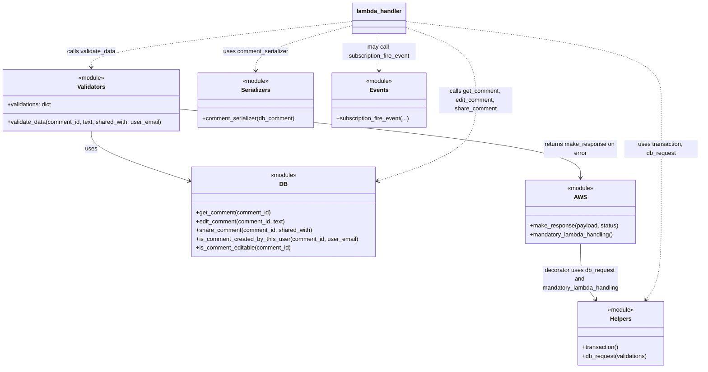

# Diagram: common/comment_service/comment_service/comment_patch.py


> Auto-generated by Obscura crawlers

## Diagram 1

```mermaid
flowchart TD
    A[lambda_handler(request)] --> B{validate_data passes?}
    B -- No --> C[make_response(error, HTTPStatus)]
    B -- Yes --> D[get_comment(comment_id) -> old_shared_with]
    D --> E[transaction()]
    E --> F[try to edit]
    F --> G{text provided?}
    G -- Yes --> H[edit_comment(comment_id, text)]
    G -- No --> I[skip edit text]
    F --> J{shared_with provided?}
    J -- Yes --> K[share_comment(comment_id, shared_with) & get_comment(comment_id)]
    J -- No --> L[skip share]
    F --> M[except DatabaseError -> rollback -> make_response(error, BAD_REQUEST)]
    E --> N[get_comment(comment_id) -> db_comment]
    N --> O[comment_serializer(db_comment) -> serialized_comment]
    O --> P{shared_with is list and non-empty?}
    P -- Yes --> Q[subscription_fire_event(..., serialized_comment, internal_reference_id)]
    P -- No --> R[no notification]
    Q --> S[serialized_comment["old_shared_with"] = old_shared_with]
    R --> S
    S --> T[make_response(serialized_comment, HTTPStatus.OK)]
```

> SVG rendering failed for this diagram.

## Diagram 2



### SVG

<svg id="container" width="1924.109375" xmlns="http://www.w3.org/2000/svg" class="classDiagram" height="1006" viewBox="0 0 1924.109375 1006" role="graphics-document document" aria-roledescription="class"><style>#container{font-family:"trebuchet ms",verdana,arial,sans-serif;font-size:16px;fill:#333;}@keyframes edge-animation-frame{from{stroke-dashoffset:0;}}@keyframes dash{to{stroke-dashoffset:0;}}#container .edge-animation-slow{stroke-dasharray:9,5!important;stroke-dashoffset:900;animation:dash 50s linear infinite;stroke-linecap:round;}#container .edge-animation-fast{stroke-dasharray:9,5!important;stroke-dashoffset:900;animation:dash 20s linear infinite;stroke-linecap:round;}#container .error-icon{fill:#552222;}#container .error-text{fill:#552222;stroke:#552222;}#container .edge-thickness-normal{stroke-width:1px;}#container .edge-thickness-thick{stroke-width:3.5px;}#container .edge-pattern-solid{stroke-dasharray:0;}#container .edge-thickness-invisible{stroke-width:0;fill:none;}#container .edge-pattern-dashed{stroke-dasharray:3;}#container .edge-pattern-dotted{stroke-dasharray:2;}#container .marker{fill:#333333;stroke:#333333;}#container .marker.cross{stroke:#333333;}#container svg{font-family:"trebuchet ms",verdana,arial,sans-serif;font-size:16px;}#container p{margin:0;}#container g.classGroup text{fill:#9370DB;stroke:none;font-family:"trebuchet ms",verdana,arial,sans-serif;font-size:10px;}#container g.classGroup text .title{font-weight:bolder;}#container .nodeLabel,#container .edgeLabel{color:#131300;}#container .edgeLabel .label rect{fill:#ECECFF;}#container .label text{fill:#131300;}#container .labelBkg{background:#ECECFF;}#container .edgeLabel .label span{background:#ECECFF;}#container .classTitle{font-weight:bolder;}#container .node rect,#container .node circle,#container .node ellipse,#container .node polygon,#container .node path{fill:#ECECFF;stroke:#9370DB;stroke-width:1px;}#container .divider{stroke:#9370DB;stroke-width:1;}#container g.clickable{cursor:pointer;}#container g.classGroup rect{fill:#ECECFF;stroke:#9370DB;}#container g.classGroup line{stroke:#9370DB;stroke-width:1;}#container .classLabel .box{stroke:none;stroke-width:0;fill:#ECECFF;opacity:0.5;}#container .classLabel .label{fill:#9370DB;font-size:10px;}#container .relation{stroke:#333333;stroke-width:1;fill:none;}#container .dashed-line{stroke-dasharray:3;}#container .dotted-line{stroke-dasharray:1 2;}#container #compositionStart,#container .composition{fill:#333333!important;stroke:#333333!important;stroke-width:1;}#container #compositionEnd,#container .composition{fill:#333333!important;stroke:#333333!important;stroke-width:1;}#container #dependencyStart,#container .dependency{fill:#333333!important;stroke:#333333!important;stroke-width:1;}#container #dependencyStart,#container .dependency{fill:#333333!important;stroke:#333333!important;stroke-width:1;}#container #extensionStart,#container .extension{fill:transparent!important;stroke:#333333!important;stroke-width:1;}#container #extensionEnd,#container .extension{fill:transparent!important;stroke:#333333!important;stroke-width:1;}#container #aggregationStart,#container .aggregation{fill:transparent!important;stroke:#333333!important;stroke-width:1;}#container #aggregationEnd,#container .aggregation{fill:transparent!important;stroke:#333333!important;stroke-width:1;}#container #lollipopStart,#container .lollipop{fill:#ECECFF!important;stroke:#333333!important;stroke-width:1;}#container #lollipopEnd,#container .lollipop{fill:#ECECFF!important;stroke:#333333!important;stroke-width:1;}#container .edgeTerminals{font-size:11px;line-height:initial;}#container .classTitleText{text-anchor:middle;font-size:18px;fill:#333;}#container .label-icon{display:inline-block;height:1em;overflow:visible;vertical-align:-0.125em;}#container .node .label-icon path{fill:currentColor;stroke:revert;stroke-width:revert;}#container :root{--mermaid-font-family:"trebuchet ms",verdana,arial,sans-serif;}</style><g><defs><marker id="container_class-aggregationStart" class="marker aggregation class" refX="18" refY="7" markerWidth="190" markerHeight="240" orient="auto"><path d="M 18,7 L9,13 L1,7 L9,1 Z"></path></marker></defs><defs><marker id="container_class-aggregationEnd" class="marker aggregation class" refX="1" refY="7" markerWidth="20" markerHeight="28" orient="auto"><path d="M 18,7 L9,13 L1,7 L9,1 Z"></path></marker></defs><defs><marker id="container_class-extensionStart" class="marker extension class" refX="18" refY="7" markerWidth="190" markerHeight="240" orient="auto"><path d="M 1,7 L18,13 V 1 Z"></path></marker></defs><defs><marker id="container_class-extensionEnd" class="marker extension class" refX="1" refY="7" markerWidth="20" markerHeight="28" orient="auto"><path d="M 1,1 V 13 L18,7 Z"></path></marker></defs><defs><marker id="container_class-compositionStart" class="marker composition class" refX="18" refY="7" markerWidth="190" markerHeight="240" orient="auto"><path d="M 18,7 L9,13 L1,7 L9,1 Z"></path></marker></defs><defs><marker id="container_class-compositionEnd" class="marker composition class" refX="1" refY="7" markerWidth="20" markerHeight="28" orient="auto"><path d="M 18,7 L9,13 L1,7 L9,1 Z"></path></marker></defs><defs><marker id="container_class-dependencyStart" class="marker dependency class" refX="6" refY="7" markerWidth="190" markerHeight="240" orient="auto"><path d="M 5,7 L9,13 L1,7 L9,1 Z"></path></marker></defs><defs><marker id="container_class-dependencyEnd" class="marker dependency class" refX="13" refY="7" markerWidth="20" markerHeight="28" orient="auto"><path d="M 18,7 L9,13 L14,7 L9,1 Z"></path></marker></defs><defs><marker id="container_class-lollipopStart" class="marker lollipop class" refX="13" refY="7" markerWidth="190" markerHeight="240" orient="auto"><circle stroke="black" fill="transparent" cx="7" cy="7" r="6"></circle></marker></defs><defs><marker id="container_class-lollipopEnd" class="marker lollipop class" refX="1" refY="7" markerWidth="190" markerHeight="240" orient="auto"><circle stroke="black" fill="transparent" cx="7" cy="7" r="6"></circle></marker></defs><g class="root"><g class="clusters"></g><g class="edgePaths"><path d="M251.547,358L251.547,366.167C251.547,374.333,251.547,390.667,296.561,413.477C341.575,436.288,431.602,465.575,476.616,480.219L521.63,494.863" id="id_Validators_DB_1" class="edge-thickness-normal edge-pattern-solid relation" style=";;;" data-edge="true" data-et="edge" data-id="id_Validators_DB_1" data-points="W3sieCI6MjUxLjU0Njg3NSwieSI6MzU4fSx7IngiOjI1MS41NDY4NzUsInkiOjQwN30seyJ4Ijo1MjcuMzM1OTM3NSwieSI6NDk2LjcxODkwODYxNTM3Nzh9XQ==" marker-end="url(#container_class-dependencyEnd)"></path><path d="M495.094,298.091L678.596,316.242C862.099,334.394,1229.104,370.697,1412.607,402.015C1596.109,433.333,1596.109,459.667,1596.109,472.833L1596.109,486" id="id_Validators_AWS_2" class="edge-thickness-normal edge-pattern-solid relation" style=";;;" data-edge="true" data-et="edge" data-id="id_Validators_AWS_2" data-points="W3sieCI6NDk1LjA5Mzc1LCJ5IjoyOTguMDkwOTEwMTQ3MzUyNzZ9LHsieCI6MTU5Ni4xMDkzNzUsInkiOjQwN30seyJ4IjoxNTk2LjEwOTM3NSwieSI6NDkyfV0=" marker-end="url(#container_class-dependencyEnd)"></path><path d="M1596.109,666L1596.109,682.167C1596.109,698.333,1596.109,730.667,1603.069,756.197C1610.029,781.728,1623.949,800.456,1630.908,809.82L1637.868,819.184" id="id_AWS_Helpers_3" class="edge-thickness-normal edge-pattern-solid relation" style=";;;" data-edge="true" data-et="edge" data-id="id_AWS_Helpers_3" data-points="W3sieCI6MTU5Ni4xMDkzNzUsInkiOjY2Nn0seyJ4IjoxNTk2LjEwOTM3NSwieSI6NzYzfSx7IngiOjE2NDEuNDQ3MjEyODM3ODM4LCJ5Ijo4MjR9XQ==" marker-end="url(#container_class-dependencyEnd)"></path><path d="M971.637,58.269L851.622,72.058C731.607,85.846,491.577,113.423,371.562,134.378C251.547,155.333,251.547,169.667,251.547,176.833L251.547,184" id="id_lambda_handler_Validators_4" class="edge-thickness-normal edge-pattern-dashed relation" style=";;;" data-edge="true" data-et="edge" data-id="id_lambda_handler_Validators_4" data-points="W3sieCI6OTcxLjYzNjcxODc1LCJ5Ijo1OC4yNjkzNDA5NzQyMTIwMzV9LHsieCI6MjUxLjU0Njg3NSwieSI6MTQxfSx7IngiOjI1MS41NDY4NzUsInkiOjE5MH1d" marker-end="url(#container_class-dependencyEnd)"></path><path d="M1115.59,74.683L1147.821,85.736C1180.052,96.788,1244.514,118.894,1276.745,152.114C1308.977,185.333,1308.977,229.667,1308.977,274C1308.977,318.333,1308.977,362.667,1263.963,399.477C1218.949,436.288,1128.921,465.575,1083.907,480.219L1038.893,494.863" id="id_lambda_handler_DB_5" class="edge-thickness-normal edge-pattern-dashed relation" style=";;;" data-edge="true" data-et="edge" data-id="id_lambda_handler_DB_5" data-points="W3sieCI6MTExNS41ODk4NDM3NSwieSI6NzQuNjgyNjQzMTkyNTU3Mzh9LHsieCI6MTMwOC45NzY1NjI1LCJ5IjoxNDF9LHsieCI6MTMwOC45NzY1NjI1LCJ5IjoyNzR9LHsieCI6MTMwOC45NzY1NjI1LCJ5Ijo0MDd9LHsieCI6MTAzMy4xODc1LCJ5Ijo0OTYuNzE4OTA4NjE1Mzc3OH1d" marker-end="url(#container_class-dependencyEnd)"></path><path d="M1115.59,58.479L1232.343,72.232C1349.096,85.986,1582.603,113.493,1699.356,149.413C1816.109,185.333,1816.109,229.667,1816.109,274C1816.109,318.333,1816.109,362.667,1816.109,413.5C1816.109,464.333,1816.109,521.667,1816.109,581C1816.109,640.333,1816.109,701.667,1809.15,741.697C1802.19,781.728,1788.27,800.456,1781.31,809.82L1774.351,819.184" id="id_lambda_handler_Helpers_6" class="edge-thickness-normal edge-pattern-dashed relation" style=";;;" data-edge="true" data-et="edge" data-id="id_lambda_handler_Helpers_6" data-points="W3sieCI6MTExNS41ODk4NDM3NSwieSI6NTguNDc4ODM1MzUwMDk3ODQ2fSx7IngiOjE4MTYuMTA5Mzc1LCJ5IjoxNDF9LHsieCI6MTgxNi4xMDkzNzUsInkiOjI3NH0seyJ4IjoxODE2LjEwOTM3NSwieSI6NDA3fSx7IngiOjE4MTYuMTA5Mzc1LCJ5Ijo1Nzl9LHsieCI6MTgxNi4xMDkzNzUsInkiOjc2M30seyJ4IjoxNzcwLjc3MTUzNzE2MjE2MiwieSI6ODI0fV0=" marker-end="url(#container_class-dependencyEnd)"></path><path d="M971.637,69.296L927.059,81.247C882.482,93.197,793.327,117.099,748.749,137.716C704.172,158.333,704.172,175.667,704.172,184.333L704.172,193" id="id_lambda_handler_Serializers_7" class="edge-thickness-normal edge-pattern-dashed relation" style=";;;" data-edge="true" data-et="edge" data-id="id_lambda_handler_Serializers_7" data-points="W3sieCI6OTcxLjYzNjcxODc1LCJ5Ijo2OS4yOTYwMTcxMjM3MjExOX0seyJ4Ijo3MDQuMTcxODc1LCJ5IjoxNDF9LHsieCI6NzA0LjE3MTg3NSwieSI6MTk5fV0=" marker-end="url(#container_class-dependencyEnd)"></path><path d="M1043.613,92L1043.613,100.167C1043.613,108.333,1043.613,124.667,1043.613,141.5C1043.613,158.333,1043.613,175.667,1043.613,184.333L1043.613,193" id="id_lambda_handler_Events_8" class="edge-thickness-normal edge-pattern-dashed relation" style=";;;" data-edge="true" data-et="edge" data-id="id_lambda_handler_Events_8" data-points="W3sieCI6MTA0My42MTMyODEyNSwieSI6OTJ9LHsieCI6MTA0My42MTMyODEyNSwieSI6MTQxfSx7IngiOjEwNDMuNjEzMjgxMjUsInkiOjE5OX1d" marker-end="url(#container_class-dependencyEnd)"></path></g><g class="edgeLabels"><g class="edgeLabel" transform="translate(251.546875, 407)"><g class="label" data-id="id_Validators_DB_1" transform="translate(-16.4921875, -12)"><foreignObject width="32.984375" height="24"><div xmlns="http://www.w3.org/1999/xhtml" class="labelBkg" style="display: table-cell; white-space: nowrap; line-height: 1.5; max-width: 200px; text-align: center;"><span class="edgeLabel"><p>uses</p></span></div></foreignObject></g></g><g class="edgeLabel" transform="translate(1596.109375, 407)"><g class="label" data-id="id_Validators_AWS_2" transform="translate(-100, -24)"><foreignObject width="200" height="48"><div xmlns="http://www.w3.org/1999/xhtml" class="labelBkg" style="display: table; white-space: break-spaces; line-height: 1.5; max-width: 200px; text-align: center; width: 200px;"><span class="edgeLabel"><p>returns make_response on error</p></span></div></foreignObject></g></g><g class="edgeLabel" transform="translate(1596.109375, 763)"><g class="label" data-id="id_AWS_Helpers_3" transform="translate(-106.859375, -36)"><foreignObject width="213.71875" height="72"><div xmlns="http://www.w3.org/1999/xhtml" class="labelBkg" style="display: table; white-space: break-spaces; line-height: 1.5; max-width: 200px; text-align: center; width: 200px;"><span class="edgeLabel"><p>decorator uses db_request and mandatory_lambda_handling</p></span></div></foreignObject></g></g><g class="edgeLabel" transform="translate(251.546875, 141)"><g class="label" data-id="id_lambda_handler_Validators_4" transform="translate(-67.671875, -12)"><foreignObject width="135.34375" height="24"><div xmlns="http://www.w3.org/1999/xhtml" class="labelBkg" style="display: table-cell; white-space: nowrap; line-height: 1.5; max-width: 200px; text-align: center;"><span class="edgeLabel"><p>calls validate_data</p></span></div></foreignObject></g></g><g class="edgeLabel" transform="translate(1308.9765625, 274)"><g class="label" data-id="id_lambda_handler_DB_5" transform="translate(-100, -36)"><foreignObject width="200" height="72"><div xmlns="http://www.w3.org/1999/xhtml" class="labelBkg" style="display: table; white-space: break-spaces; line-height: 1.5; max-width: 200px; text-align: center; width: 200px;"><span class="edgeLabel"><p>calls get_comment, edit_comment, share_comment</p></span></div></foreignObject></g></g><g class="edgeLabel" transform="translate(1816.109375, 407)"><g class="label" data-id="id_lambda_handler_Helpers_6" transform="translate(-100, -24)"><foreignObject width="200" height="48"><div xmlns="http://www.w3.org/1999/xhtml" class="labelBkg" style="display: table; white-space: break-spaces; line-height: 1.5; max-width: 200px; text-align: center; width: 200px;"><span class="edgeLabel"><p>uses transaction, db_request</p></span></div></foreignObject></g></g><g class="edgeLabel" transform="translate(704.171875, 141)"><g class="label" data-id="id_lambda_handler_Serializers_7" transform="translate(-89.953125, -12)"><foreignObject width="179.90625" height="24"><div xmlns="http://www.w3.org/1999/xhtml" class="labelBkg" style="display: table-cell; white-space: nowrap; line-height: 1.5; max-width: 200px; text-align: center;"><span class="edgeLabel"><p>uses comment_serializer</p></span></div></foreignObject></g></g><g class="edgeLabel" transform="translate(1043.61328125, 141)"><g class="label" data-id="id_lambda_handler_Events_8" transform="translate(-100, -24)"><foreignObject width="200" height="48"><div xmlns="http://www.w3.org/1999/xhtml" class="labelBkg" style="display: table; white-space: break-spaces; line-height: 1.5; max-width: 200px; text-align: center; width: 200px;"><span class="edgeLabel"><p>may call subscription_fire_event</p></span></div></foreignObject></g></g></g><g class="nodes"><g class="node default" id="classId-Validators-0" transform="translate(251.546875, 274)"><g class="basic label-container"><path d="M-243.546875 -84 L243.546875 -84 L243.546875 84 L-243.546875 84" stroke="none" stroke-width="0" fill="#ECECFF" style=""></path><path d="M-243.546875 -84 C-108.91715749522675 -84, 25.712560009546507 -84, 243.546875 -84 M-243.546875 -84 C-144.4815333957232 -84, -45.41619179144644 -84, 243.546875 -84 M243.546875 -84 C243.546875 -42.52275251143301, 243.546875 -1.045505022866024, 243.546875 84 M243.546875 -84 C243.546875 -17.66347352551304, 243.546875 48.67305294897392, 243.546875 84 M243.546875 84 C91.70662949376694 84, -60.13361601246612 84, -243.546875 84 M243.546875 84 C130.15484427383984 84, 16.762813547679656 84, -243.546875 84 M-243.546875 84 C-243.546875 33.15618828997526, -243.546875 -17.687623420049476, -243.546875 -84 M-243.546875 84 C-243.546875 48.734889810061716, -243.546875 13.469779620123433, -243.546875 -84" stroke="#9370DB" stroke-width="1.3" fill="none" stroke-dasharray="0 0" style=""></path></g><g class="annotation-group text" transform="translate(-36.6015625, -60)"><g class="label" style="" transform="translate(0,-12)"><foreignObject width="73.203125" height="24"><div xmlns="http://www.w3.org/1999/xhtml" style="display: table-cell; white-space: nowrap; line-height: 1.5; max-width: 123px; text-align: center;"><span class="nodeLabel markdown-node-label" style=""><p>«module»</p></span></div></foreignObject></g></g><g class="label-group text" transform="translate(-36.953125, -36)"><g class="label" style="font-weight: bolder" transform="translate(0,-12)"><foreignObject width="73.90625" height="24"><div xmlns="http://www.w3.org/1999/xhtml" style="display: table-cell; white-space: nowrap; line-height: 1.5; max-width: 123px; text-align: center;"><span class="nodeLabel markdown-node-label" style=""><p>Validators</p></span></div></foreignObject></g></g><g class="members-group text" transform="translate(-231.546875, 12)"><g class="label" style="" transform="translate(0,-12)"><foreignObject width="123.53125" height="24"><div xmlns="http://www.w3.org/1999/xhtml" style="display: table-cell; white-space: nowrap; line-height: 1.5; max-width: 181px; text-align: center;"><span class="nodeLabel markdown-node-label" style=""><p>+validations: dict</p></span></div></foreignObject></g></g><g class="methods-group text" transform="translate(-231.546875, 60)"><g class="label" style="" transform="translate(0,-12)"><foreignObject width="426.140625" height="24"><div xmlns="http://www.w3.org/1999/xhtml" style="display: table-cell; white-space: nowrap; line-height: 1.5; max-width: 484px; text-align: center;"><span class="nodeLabel markdown-node-label" style=""><p>+validate_data(comment_id, text, shared_with, user_email)</p></span></div></foreignObject></g></g><g class="divider" style=""><path d="M-243.546875 -12 C-98.08868281771899 -12, 47.36950936456202 -12, 243.546875 -12 M-243.546875 -12 C-110.63501187063855 -12, 22.2768512587229 -12, 243.546875 -12" stroke="#9370DB" stroke-width="1.3" fill="none" stroke-dasharray="0 0" style=""></path></g><g class="divider" style=""><path d="M-243.546875 36 C-77.37957703943991 36, 88.78772092112018 36, 243.546875 36 M-243.546875 36 C-70.21182689608762 36, 103.12322120782477 36, 243.546875 36" stroke="#9370DB" stroke-width="1.3" fill="none" stroke-dasharray="0 0" style=""></path></g></g><g class="node default" id="classId-DB-1" transform="translate(780.26171875, 579)"><g class="basic label-container"><path d="M-252.92578125 -123 L252.92578125 -123 L252.92578125 123 L-252.92578125 123" stroke="none" stroke-width="0" fill="#ECECFF" style=""></path><path d="M-252.92578125 -123 C-52.59976707777946 -123, 147.72624709444108 -123, 252.92578125 -123 M-252.92578125 -123 C-62.62719465278752 -123, 127.67139194442495 -123, 252.92578125 -123 M252.92578125 -123 C252.92578125 -61.91995584453617, 252.92578125 -0.8399116890723377, 252.92578125 123 M252.92578125 -123 C252.92578125 -44.23381630366596, 252.92578125 34.53236739266808, 252.92578125 123 M252.92578125 123 C122.89207805658148 123, -7.141625136837035 123, -252.92578125 123 M252.92578125 123 C115.64673589620128 123, -21.632309457597444 123, -252.92578125 123 M-252.92578125 123 C-252.92578125 25.886518344312307, -252.92578125 -71.22696331137539, -252.92578125 -123 M-252.92578125 123 C-252.92578125 55.49512670298685, -252.92578125 -12.009746594026296, -252.92578125 -123" stroke="#9370DB" stroke-width="1.3" fill="none" stroke-dasharray="0 0" style=""></path></g><g class="annotation-group text" transform="translate(-36.6015625, -99)"><g class="label" style="" transform="translate(0,-12)"><foreignObject width="73.203125" height="24"><div xmlns="http://www.w3.org/1999/xhtml" style="display: table-cell; white-space: nowrap; line-height: 1.5; max-width: 123px; text-align: center;"><span class="nodeLabel markdown-node-label" style=""><p>«module»</p></span></div></foreignObject></g></g><g class="label-group text" transform="translate(-10.1484375, -75)"><g class="label" style="font-weight: bolder" transform="translate(0,-12)"><foreignObject width="20.296875" height="24"><div xmlns="http://www.w3.org/1999/xhtml" style="display: table-cell; white-space: nowrap; line-height: 1.5; max-width: 70px; text-align: center;"><span class="nodeLabel markdown-node-label" style=""><p>DB</p></span></div></foreignObject></g></g><g class="members-group text" transform="translate(-240.92578125, -27)"></g><g class="methods-group text" transform="translate(-240.92578125, 3)"><g class="label" style="" transform="translate(0,-12)"><foreignObject width="207.25" height="24"><div xmlns="http://www.w3.org/1999/xhtml" style="display: table-cell; white-space: nowrap; line-height: 1.5; max-width: 265px; text-align: center;"><span class="nodeLabel markdown-node-label" style=""><p>+get_comment(comment_id)</p></span></div></foreignObject></g><g class="label" style="" transform="translate(0,12)"><foreignObject width="249" height="24"><div xmlns="http://www.w3.org/1999/xhtml" style="display: table-cell; white-space: nowrap; line-height: 1.5; max-width: 306px; text-align: center;"><span class="nodeLabel markdown-node-label" style=""><p>+edit_comment(comment_id, text)</p></span></div></foreignObject></g><g class="label" style="" transform="translate(0,36)"><foreignObject width="321.09375" height="24"><div xmlns="http://www.w3.org/1999/xhtml" style="display: table-cell; white-space: nowrap; line-height: 1.5; max-width: 378px; text-align: center;"><span class="nodeLabel markdown-node-label" style=""><p>+share_comment(comment_id, shared_with)</p></span></div></foreignObject></g><g class="label" style="" transform="translate(0,60)"><foreignObject width="445.25" height="24"><div xmlns="http://www.w3.org/1999/xhtml" style="display: table-cell; white-space: nowrap; line-height: 1.5; max-width: 503px; text-align: center;"><span class="nodeLabel markdown-node-label" style=""><p>+is_comment_created_by_this_user(comment_id, user_email)</p></span></div></foreignObject></g><g class="label" style="" transform="translate(0,84)"><foreignObject width="264.359375" height="24"><div xmlns="http://www.w3.org/1999/xhtml" style="display: table-cell; white-space: nowrap; line-height: 1.5; max-width: 322px; text-align: center;"><span class="nodeLabel markdown-node-label" style=""><p>+is_comment_editable(comment_id)</p></span></div></foreignObject></g></g><g class="divider" style=""><path d="M-252.92578125 -51 C-100.86568750618272 -51, 51.19440623763455 -51, 252.92578125 -51 M-252.92578125 -51 C-143.76924884200963 -51, -34.61271643401926 -51, 252.92578125 -51" stroke="#9370DB" stroke-width="1.3" fill="none" stroke-dasharray="0 0" style=""></path></g><g class="divider" style=""><path d="M-252.92578125 -27 C-95.17389222595978 -27, 62.57799679808045 -27, 252.92578125 -27 M-252.92578125 -27 C-138.82031401434853 -27, -24.714846778697023 -27, 252.92578125 -27" stroke="#9370DB" stroke-width="1.3" fill="none" stroke-dasharray="0 0" style=""></path></g></g><g class="node default" id="classId-Helpers-2" transform="translate(1706.109375, 911)"><g class="basic label-container"><path d="M-120.70703125 -87 L120.70703125 -87 L120.70703125 87 L-120.70703125 87" stroke="none" stroke-width="0" fill="#ECECFF" style=""></path><path d="M-120.70703125 -87 C-47.81854170950773 -87, 25.069947830984546 -87, 120.70703125 -87 M-120.70703125 -87 C-46.69621759749714 -87, 27.314596055005723 -87, 120.70703125 -87 M120.70703125 -87 C120.70703125 -48.20841799846292, 120.70703125 -9.41683599692584, 120.70703125 87 M120.70703125 -87 C120.70703125 -19.014058983615058, 120.70703125 48.971882032769884, 120.70703125 87 M120.70703125 87 C40.058147765671464 87, -40.59073571865707 87, -120.70703125 87 M120.70703125 87 C45.88242239341808 87, -28.942186463163836 87, -120.70703125 87 M-120.70703125 87 C-120.70703125 42.5032230275519, -120.70703125 -1.993553944896206, -120.70703125 -87 M-120.70703125 87 C-120.70703125 45.0796686610126, -120.70703125 3.159337322025195, -120.70703125 -87" stroke="#9370DB" stroke-width="1.3" fill="none" stroke-dasharray="0 0" style=""></path></g><g class="annotation-group text" transform="translate(-36.6015625, -63)"><g class="label" style="" transform="translate(0,-12)"><foreignObject width="73.203125" height="24"><div xmlns="http://www.w3.org/1999/xhtml" style="display: table-cell; white-space: nowrap; line-height: 1.5; max-width: 123px; text-align: center;"><span class="nodeLabel markdown-node-label" style=""><p>«module»</p></span></div></foreignObject></g></g><g class="label-group text" transform="translate(-28.2890625, -39)"><g class="label" style="font-weight: bolder" transform="translate(0,-12)"><foreignObject width="56.578125" height="24"><div xmlns="http://www.w3.org/1999/xhtml" style="display: table-cell; white-space: nowrap; line-height: 1.5; max-width: 106px; text-align: center;"><span class="nodeLabel markdown-node-label" style=""><p>Helpers</p></span></div></foreignObject></g></g><g class="members-group text" transform="translate(-108.70703125, 9)"></g><g class="methods-group text" transform="translate(-108.70703125, 39)"><g class="label" style="" transform="translate(0,-12)"><foreignObject width="100.421875" height="24"><div xmlns="http://www.w3.org/1999/xhtml" style="display: table-cell; white-space: nowrap; line-height: 1.5; max-width: 158px; text-align: center;"><span class="nodeLabel markdown-node-label" style=""><p>+transaction()</p></span></div></foreignObject></g><g class="label" style="" transform="translate(0,12)"><foreignObject width="180.8125" height="24"><div xmlns="http://www.w3.org/1999/xhtml" style="display: table-cell; white-space: nowrap; line-height: 1.5; max-width: 238px; text-align: center;"><span class="nodeLabel markdown-node-label" style=""><p>+db_request(validations)</p></span></div></foreignObject></g></g><g class="divider" style=""><path d="M-120.70703125 -15 C-49.77287621592404 -15, 21.161278818151914 -15, 120.70703125 -15 M-120.70703125 -15 C-40.23489697781214 -15, 40.23723729437572 -15, 120.70703125 -15" stroke="#9370DB" stroke-width="1.3" fill="none" stroke-dasharray="0 0" style=""></path></g><g class="divider" style=""><path d="M-120.70703125 9 C-27.557493968618914 9, 65.59204331276217 9, 120.70703125 9 M-120.70703125 9 C-39.55206933573646 9, 41.602892578527076 9, 120.70703125 9" stroke="#9370DB" stroke-width="1.3" fill="none" stroke-dasharray="0 0" style=""></path></g></g><g class="node default" id="classId-AWS-3" transform="translate(1596.109375, 579)"><g class="basic label-container"><path d="M-151.33984375 -87 L151.33984375 -87 L151.33984375 87 L-151.33984375 87" stroke="none" stroke-width="0" fill="#ECECFF" style=""></path><path d="M-151.33984375 -87 C-67.72295802840918 -87, 15.893927693181638 -87, 151.33984375 -87 M-151.33984375 -87 C-65.10950412065866 -87, 21.12083550868269 -87, 151.33984375 -87 M151.33984375 -87 C151.33984375 -32.79866722546355, 151.33984375 21.402665549072907, 151.33984375 87 M151.33984375 -87 C151.33984375 -25.382628433624227, 151.33984375 36.23474313275155, 151.33984375 87 M151.33984375 87 C85.66514233042057 87, 19.99044091084113 87, -151.33984375 87 M151.33984375 87 C33.43002067805814 87, -84.47980239388372 87, -151.33984375 87 M-151.33984375 87 C-151.33984375 32.3707261775654, -151.33984375 -22.258547644869196, -151.33984375 -87 M-151.33984375 87 C-151.33984375 34.87552776550724, -151.33984375 -17.248944468985513, -151.33984375 -87" stroke="#9370DB" stroke-width="1.3" fill="none" stroke-dasharray="0 0" style=""></path></g><g class="annotation-group text" transform="translate(-36.6015625, -63)"><g class="label" style="" transform="translate(0,-12)"><foreignObject width="73.203125" height="24"><div xmlns="http://www.w3.org/1999/xhtml" style="display: table-cell; white-space: nowrap; line-height: 1.5; max-width: 123px; text-align: center;"><span class="nodeLabel markdown-node-label" style=""><p>«module»</p></span></div></foreignObject></g></g><g class="label-group text" transform="translate(-15.9921875, -39)"><g class="label" style="font-weight: bolder" transform="translate(0,-12)"><foreignObject width="31.984375" height="24"><div xmlns="http://www.w3.org/1999/xhtml" style="display: table-cell; white-space: nowrap; line-height: 1.5; max-width: 81px; text-align: center;"><span class="nodeLabel markdown-node-label" style=""><p>AWS</p></span></div></foreignObject></g></g><g class="members-group text" transform="translate(-139.33984375, 9)"></g><g class="methods-group text" transform="translate(-139.33984375, 39)"><g class="label" style="" transform="translate(0,-12)"><foreignObject width="242.078125" height="24"><div xmlns="http://www.w3.org/1999/xhtml" style="display: table-cell; white-space: nowrap; line-height: 1.5; max-width: 299px; text-align: center;"><span class="nodeLabel markdown-node-label" style=""><p>+make_response(payload, status)</p></span></div></foreignObject></g><g class="label" style="" transform="translate(0,12)"><foreignObject width="232.078125" height="24"><div xmlns="http://www.w3.org/1999/xhtml" style="display: table-cell; white-space: nowrap; line-height: 1.5; max-width: 289px; text-align: center;"><span class="nodeLabel markdown-node-label" style=""><p>+mandatory_lambda_handling()</p></span></div></foreignObject></g></g><g class="divider" style=""><path d="M-151.33984375 -15 C-52.515193671762916 -15, 46.30945640647417 -15, 151.33984375 -15 M-151.33984375 -15 C-85.98448460439785 -15, -20.6291254587957 -15, 151.33984375 -15" stroke="#9370DB" stroke-width="1.3" fill="none" stroke-dasharray="0 0" style=""></path></g><g class="divider" style=""><path d="M-151.33984375 9 C-83.43006655364232 9, -15.52028935728464 9, 151.33984375 9 M-151.33984375 9 C-90.59491465963669 9, -29.849985569273358 9, 151.33984375 9" stroke="#9370DB" stroke-width="1.3" fill="none" stroke-dasharray="0 0" style=""></path></g></g><g class="node default" id="classId-Serializers-4" transform="translate(704.171875, 274)"><g class="basic label-container"><path d="M-159.078125 -75 L159.078125 -75 L159.078125 75 L-159.078125 75" stroke="none" stroke-width="0" fill="#ECECFF" style=""></path><path d="M-159.078125 -75 C-73.97794384654635 -75, 11.122237306907294 -75, 159.078125 -75 M-159.078125 -75 C-92.65192670186543 -75, -26.22572840373087 -75, 159.078125 -75 M159.078125 -75 C159.078125 -27.473218658452303, 159.078125 20.053562683095393, 159.078125 75 M159.078125 -75 C159.078125 -26.774188563670613, 159.078125 21.451622872658774, 159.078125 75 M159.078125 75 C40.800632746556474 75, -77.47685950688705 75, -159.078125 75 M159.078125 75 C42.78751135713614 75, -73.50310228572772 75, -159.078125 75 M-159.078125 75 C-159.078125 42.09425870046854, -159.078125 9.188517400937073, -159.078125 -75 M-159.078125 75 C-159.078125 36.962764014580735, -159.078125 -1.0744719708385304, -159.078125 -75" stroke="#9370DB" stroke-width="1.3" fill="none" stroke-dasharray="0 0" style=""></path></g><g class="annotation-group text" transform="translate(-36.6015625, -51)"><g class="label" style="" transform="translate(0,-12)"><foreignObject width="73.203125" height="24"><div xmlns="http://www.w3.org/1999/xhtml" style="display: table-cell; white-space: nowrap; line-height: 1.5; max-width: 123px; text-align: center;"><span class="nodeLabel markdown-node-label" style=""><p>«module»</p></span></div></foreignObject></g></g><g class="label-group text" transform="translate(-38.390625, -27)"><g class="label" style="font-weight: bolder" transform="translate(0,-12)"><foreignObject width="76.78125" height="24"><div xmlns="http://www.w3.org/1999/xhtml" style="display: table-cell; white-space: nowrap; line-height: 1.5; max-width: 125px; text-align: center;"><span class="nodeLabel markdown-node-label" style=""><p>Serializers</p></span></div></foreignObject></g></g><g class="members-group text" transform="translate(-147.078125, 21)"></g><g class="methods-group text" transform="translate(-147.078125, 51)"><g class="label" style="" transform="translate(0,-12)"><foreignObject width="255.765625" height="24"><div xmlns="http://www.w3.org/1999/xhtml" style="display: table-cell; white-space: nowrap; line-height: 1.5; max-width: 313px; text-align: center;"><span class="nodeLabel markdown-node-label" style=""><p>+comment_serializer(db_comment)</p></span></div></foreignObject></g></g><g class="divider" style=""><path d="M-159.078125 -3 C-45.00194232308644 -3, 69.07424035382712 -3, 159.078125 -3 M-159.078125 -3 C-32.31641072060951 -3, 94.44530355878098 -3, 159.078125 -3" stroke="#9370DB" stroke-width="1.3" fill="none" stroke-dasharray="0 0" style=""></path></g><g class="divider" style=""><path d="M-159.078125 21 C-82.17804234836865 21, -5.277959696737298 21, 159.078125 21 M-159.078125 21 C-95.0215641700012 21, -30.965003340002397 21, 159.078125 21" stroke="#9370DB" stroke-width="1.3" fill="none" stroke-dasharray="0 0" style=""></path></g></g><g class="node default" id="classId-Events-5" transform="translate(1043.61328125, 274)"><g class="basic label-container"><path d="M-130.36328125 -75 L130.36328125 -75 L130.36328125 75 L-130.36328125 75" stroke="none" stroke-width="0" fill="#ECECFF" style=""></path><path d="M-130.36328125 -75 C-66.86160599984467 -75, -3.3599307496893402 -75, 130.36328125 -75 M-130.36328125 -75 C-63.69790560707119 -75, 2.967470035857616 -75, 130.36328125 -75 M130.36328125 -75 C130.36328125 -29.64406768120284, 130.36328125 15.711864637594317, 130.36328125 75 M130.36328125 -75 C130.36328125 -20.668781340677015, 130.36328125 33.66243731864597, 130.36328125 75 M130.36328125 75 C49.14888044127234 75, -32.06552036745532 75, -130.36328125 75 M130.36328125 75 C68.11044168775514 75, 5.857602125510283 75, -130.36328125 75 M-130.36328125 75 C-130.36328125 35.210087308676215, -130.36328125 -4.57982538264757, -130.36328125 -75 M-130.36328125 75 C-130.36328125 36.33848205634003, -130.36328125 -2.3230358873199464, -130.36328125 -75" stroke="#9370DB" stroke-width="1.3" fill="none" stroke-dasharray="0 0" style=""></path></g><g class="annotation-group text" transform="translate(-36.6015625, -51)"><g class="label" style="" transform="translate(0,-12)"><foreignObject width="73.203125" height="24"><div xmlns="http://www.w3.org/1999/xhtml" style="display: table-cell; white-space: nowrap; line-height: 1.5; max-width: 123px; text-align: center;"><span class="nodeLabel markdown-node-label" style=""><p>«module»</p></span></div></foreignObject></g></g><g class="label-group text" transform="translate(-24.078125, -27)"><g class="label" style="font-weight: bolder" transform="translate(0,-12)"><foreignObject width="48.15625" height="24"><div xmlns="http://www.w3.org/1999/xhtml" style="display: table-cell; white-space: nowrap; line-height: 1.5; max-width: 97px; text-align: center;"><span class="nodeLabel markdown-node-label" style=""><p>Events</p></span></div></foreignObject></g></g><g class="members-group text" transform="translate(-118.36328125, 21)"></g><g class="methods-group text" transform="translate(-118.36328125, 51)"><g class="label" style="" transform="translate(0,-12)"><foreignObject width="200.125" height="24"><div xmlns="http://www.w3.org/1999/xhtml" style="display: table-cell; white-space: nowrap; line-height: 1.5; max-width: 257px; text-align: center;"><span class="nodeLabel markdown-node-label" style=""><p>+subscription_fire_event(...)</p></span></div></foreignObject></g></g><g class="divider" style=""><path d="M-130.36328125 -3 C-57.05121542002965 -3, 16.2608504099407 -3, 130.36328125 -3 M-130.36328125 -3 C-32.960595662454935 -3, 64.44208992509013 -3, 130.36328125 -3" stroke="#9370DB" stroke-width="1.3" fill="none" stroke-dasharray="0 0" style=""></path></g><g class="divider" style=""><path d="M-130.36328125 21 C-61.77484356034125 21, 6.813594129317494 21, 130.36328125 21 M-130.36328125 21 C-64.34739370812623 21, 1.668493833747533 21, 130.36328125 21" stroke="#9370DB" stroke-width="1.3" fill="none" stroke-dasharray="0 0" style=""></path></g></g><g class="node default" id="classId-lambda_handler-6" transform="translate(1043.61328125, 50)"><g class="basic label-container"><path d="M-71.9765625 -42 L71.9765625 -42 L71.9765625 42 L-71.9765625 42" stroke="none" stroke-width="0" fill="#ECECFF" style=""></path><path d="M-71.9765625 -42 C-37.19974533227343 -42, -2.4229281645468603 -42, 71.9765625 -42 M-71.9765625 -42 C-36.67251232395347 -42, -1.3684621479069392 -42, 71.9765625 -42 M71.9765625 -42 C71.9765625 -23.867938602237054, 71.9765625 -5.735877204474107, 71.9765625 42 M71.9765625 -42 C71.9765625 -8.742978528657872, 71.9765625 24.514042942684256, 71.9765625 42 M71.9765625 42 C30.85890753175149 42, -10.258747436497018 42, -71.9765625 42 M71.9765625 42 C20.061411501875035 42, -31.85373949624993 42, -71.9765625 42 M-71.9765625 42 C-71.9765625 18.870906237889532, -71.9765625 -4.258187524220936, -71.9765625 -42 M-71.9765625 42 C-71.9765625 22.53527939855615, -71.9765625 3.070558797112298, -71.9765625 -42" stroke="#9370DB" stroke-width="1.3" fill="none" stroke-dasharray="0 0" style=""></path></g><g class="annotation-group text" transform="translate(0, -18)"></g><g class="label-group text" transform="translate(-59.9765625, -18)"><g class="label" style="font-weight: bolder" transform="translate(0,-12)"><foreignObject width="119.953125" height="24"><div xmlns="http://www.w3.org/1999/xhtml" style="display: table-cell; white-space: nowrap; line-height: 1.5; max-width: 170px; text-align: center;"><span class="nodeLabel markdown-node-label" style=""><p>lambda_handler</p></span></div></foreignObject></g></g><g class="members-group text" transform="translate(-59.9765625, 30)"></g><g class="methods-group text" transform="translate(-59.9765625, 60)"></g><g class="divider" style=""><path d="M-71.9765625 6 C-18.53013845835708 6, 34.91628558328584 6, 71.9765625 6 M-71.9765625 6 C-33.670874622094274 6, 4.634813255811451 6, 71.9765625 6" stroke="#9370DB" stroke-width="1.3" fill="none" stroke-dasharray="0 0" style=""></path></g><g class="divider" style=""><path d="M-71.9765625 24 C-25.708234408758635 24, 20.56009368248273 24, 71.9765625 24 M-71.9765625 24 C-42.177523766677496 24, -12.378485033354984 24, 71.9765625 24" stroke="#9370DB" stroke-width="1.3" fill="none" stroke-dasharray="0 0" style=""></path></g></g></g></g></g></svg>
