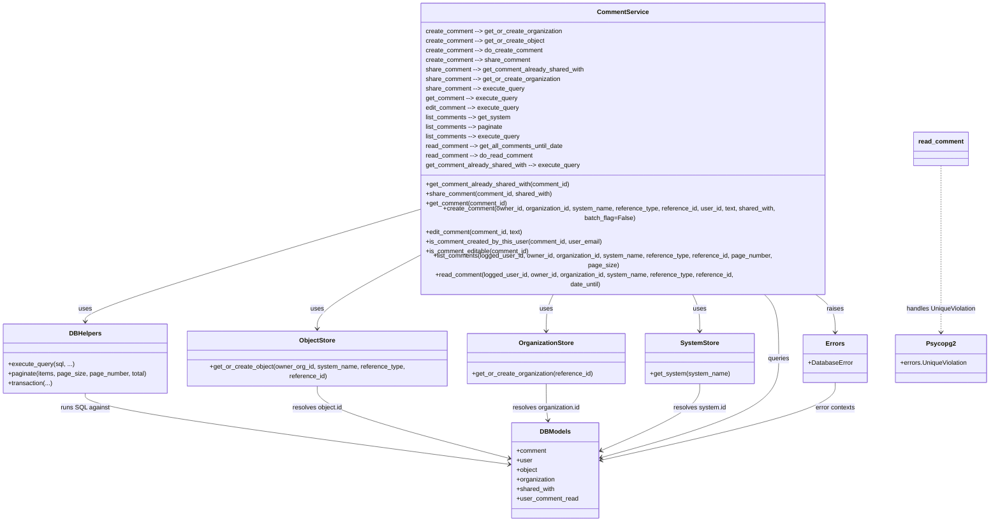

# Diagram: common/comment_service/comment_service/db/comment.py

> Auto-generated by Obscura crawlers

## Mermaid

### SVG

<svg id="container" width="2487.94140625" xmlns="http://www.w3.org/2000/svg" class="classDiagram" height="1250" viewBox="0 0 2487.94140625 1250" role="graphics-document document" aria-roledescription="class"><g><defs><marker id="container_class-aggregationStart" class="marker aggregation class" refX="18" refY="7" markerWidth="190" markerHeight="240" orient="auto"><path d="M 18,7 L9,13 L1,7 L9,1 Z"></path></marker></defs><defs><marker id="container_class-aggregationEnd" class="marker aggregation class" refX="1" refY="7" markerWidth="20" markerHeight="28" orient="auto"><path d="M 18,7 L9,13 L1,7 L9,1 Z"></path></marker></defs><defs><marker id="container_class-extensionStart" class="marker extension class" refX="18" refY="7" markerWidth="190" markerHeight="240" orient="auto"><path d="M 1,7 L18,13 V 1 Z"></path></marker></defs><defs><marker id="container_class-extensionEnd" class="marker extension class" refX="1" refY="7" markerWidth="20" markerHeight="28" orient="auto"><path d="M 1,1 V 13 L18,7 Z"></path></marker></defs><defs><marker id="container_class-compositionStart" class="marker composition class" refX="18" refY="7" markerWidth="190" markerHeight="240" orient="auto"><path d="M 18,7 L9,13 L1,7 L9,1 Z"></path></marker></defs><defs><marker id="container_class-compositionEnd" class="marker composition class" refX="1" refY="7" markerWidth="20" markerHeight="28" orient="auto"><path d="M 18,7 L9,13 L1,7 L9,1 Z"></path></marker></defs><defs><marker id="container_class-dependencyStart" class="marker dependency class" refX="6" refY="7" markerWidth="190" markerHeight="240" orient="auto"><path d="M 5,7 L9,13 L1,7 L9,1 Z"></path></marker></defs><defs><marker id="container_class-dependencyEnd" class="marker dependency class" refX="13" refY="7" markerWidth="20" markerHeight="28" orient="auto"><path d="M 18,7 L9,13 L14,7 L9,1 Z"></path></marker></defs><defs><marker id="container_class-lollipopStart" class="marker lollipop class" refX="13" refY="7" markerWidth="190" markerHeight="240" orient="auto"><circle stroke="black" fill="transparent" cx="7" cy="7" r="6"></circle></marker></defs><defs><marker id="container_class-lollipopEnd" class="marker lollipop class" refX="1" refY="7" markerWidth="190" markerHeight="240" orient="auto"><circle stroke="black" fill="transparent" cx="7" cy="7" r="6"></circle></marker></defs><g class="root"><g class="clusters"></g><g class="edgePaths"><path d="M1035.342,489.606L898.294,527.505C761.246,565.404,487.15,641.202,350.103,684.268C213.055,727.333,213.055,737.667,213.055,742.833L213.055,748" id="id_CommentService_DBHelpers_1" class="edge-thickness-normal edge-pattern-solid relation" style=";;;" data-edge="true" data-et="edge" data-id="id_CommentService_DBHelpers_1" data-points="W3sieCI6MTAzNS4zNDE3OTY4NzUsInkiOjQ4OS42MDYwODE3MTIxNDY3Nn0seyJ4IjoyMTMuMDU0Njg3NSwieSI6NzE3fSx7IngiOjIxMy4wNTQ2ODc1LCJ5Ijo3NTR9XQ==" marker-end="url(#container_class-dependencyEnd)"></path><path d="M1035.342,600.4L995.435,619.834C955.527,639.267,875.713,678.133,835.806,706.733C795.898,735.333,795.898,753.667,795.898,762.833L795.898,772" id="id_CommentService_ObjectStore_2" class="edge-thickness-normal edge-pattern-solid relation" style=";;;" data-edge="true" data-et="edge" data-id="id_CommentService_ObjectStore_2" data-points="W3sieCI6MTAzNS4zNDE3OTY4NzUsInkiOjYwMC40MDAzNDc4MDAzNjY3fSx7IngiOjc5NS44OTg0Mzc1LCJ5Ijo3MTd9LHsieCI6Nzk1Ljg5ODQzNzUsInkiOjc3OH1d" marker-end="url(#container_class-dependencyEnd)"></path><path d="M1389.913,680L1386.757,686.167C1383.601,692.333,1377.289,704.667,1374.133,720C1370.977,735.333,1370.977,753.667,1370.977,762.833L1370.977,772" id="id_CommentService_OrganizationStore_3" class="edge-thickness-normal edge-pattern-solid relation" style=";;;" data-edge="true" data-et="edge" data-id="id_CommentService_OrganizationStore_3" data-points="W3sieCI6MTM4OS45MTI2NzQ4OTEwODU4LCJ5Ijo2ODB9LHsieCI6MTM3MC45NzY1NjI1LCJ5Ijo3MTd9LHsieCI6MTM3MC45NzY1NjI1LCJ5Ijo3Nzh9XQ==" marker-end="url(#container_class-dependencyEnd)"></path><path d="M1733.833,680L1736.989,686.167C1740.145,692.333,1746.457,704.667,1749.614,720C1752.77,735.333,1752.77,753.667,1752.77,762.833L1752.77,772" id="id_CommentService_SystemStore_4" class="edge-thickness-normal edge-pattern-solid relation" style=";;;" data-edge="true" data-et="edge" data-id="id_CommentService_SystemStore_4" data-points="W3sieCI6MTczMy44MzM0MTg4NTg5MTQyLCJ5Ijo2ODB9LHsieCI6MTc1Mi43Njk1MzEyNSwieSI6NzE3fSx7IngiOjE3NTIuNzY5NTMxMjUsInkiOjc3OH1d" marker-end="url(#container_class-dependencyEnd)"></path><path d="M1911.063,680L1917.472,686.167C1923.881,692.333,1936.698,704.667,1943.107,731.5C1949.516,758.333,1949.516,799.667,1949.516,841C1949.516,882.333,1949.516,923.667,1875.726,965.155C1801.937,1006.643,1654.357,1048.286,1580.568,1069.107L1506.778,1089.929" id="id_CommentService_DBModels_5" class="edge-thickness-normal edge-pattern-solid relation" style=";;;" data-edge="true" data-et="edge" data-id="id_CommentService_DBModels_5" data-points="W3sieCI6MTkxMS4wNjMxNDQwNTk5ODY2LCJ5Ijo2ODB9LHsieCI6MTk0OS41MTU2MjUsInkiOjcxN30seyJ4IjoxOTQ5LjUxNTYyNSwieSI6ODQxfSx7IngiOjE5NDkuNTE1NjI1LCJ5Ijo5NjV9LHsieCI6MTUwMS4wMDM5MDYyNSwieSI6MTA5MS41NTgyODg5Mjc3MzY0fV0=" marker-end="url(#container_class-dependencyEnd)"></path><path d="M2037.858,680L2046.594,686.167C2055.33,692.333,2072.802,704.667,2081.538,720.5C2090.273,736.333,2090.273,755.667,2090.273,765.333L2090.273,775" id="id_CommentService_Errors_6" class="edge-thickness-normal edge-pattern-solid relation" style=";;;" data-edge="true" data-et="edge" data-id="id_CommentService_Errors_6" data-points="W3sieCI6MjAzNy44NTgzODUzNDY4NSwieSI6NjgwfSx7IngiOjIwOTAuMjczNDM3NSwieSI6NzE3fSx7IngiOjIwOTAuMjczNDM3NSwieSI6NzgxfV0=" marker-end="url(#container_class-dependencyEnd)"></path><path d="M2364.836,386L2364.836,441.167C2364.836,496.333,2364.836,606.667,2364.836,671.5C2364.836,736.333,2364.836,755.667,2364.836,765.333L2364.836,775" id="id_read_comment_Psycopg2_7" class="edge-thickness-normal edge-pattern-dashed relation" style=";;;" data-edge="true" data-et="edge" data-id="id_read_comment_Psycopg2_7" data-points="W3sieCI6MjM2NC44MzU5Mzc1LCJ5IjozODZ9LHsieCI6MjM2NC44MzU5Mzc1LCJ5Ijo3MTd9LHsieCI6MjM2NC44MzU5Mzc1LCJ5Ijo3ODF9XQ==" marker-end="url(#container_class-dependencyEnd)"></path><path d="M1370.977,904L1370.977,914.167C1370.977,924.333,1370.977,944.667,1371.707,960.01C1372.437,975.353,1373.897,985.706,1374.627,990.882L1375.357,996.059" id="id_OrganizationStore_DBModels_8" class="edge-thickness-normal edge-pattern-solid relation" style=";;;" data-edge="true" data-et="edge" data-id="id_OrganizationStore_DBModels_8" data-points="W3sieCI6MTM3MC45NzY1NjI1LCJ5Ijo5MDR9LHsieCI6MTM3MC45NzY1NjI1LCJ5Ijo5NjV9LHsieCI6MTM3Ni4xOTUzMzczODA1NzMyLCJ5IjoxMDAyfV0=" marker-end="url(#container_class-dependencyEnd)"></path><path d="M795.898,904L795.898,914.167C795.898,924.333,795.898,944.667,876.488,976.019C957.077,1007.371,1118.256,1049.743,1198.846,1070.928L1279.435,1092.114" id="id_ObjectStore_DBModels_9" class="edge-thickness-normal edge-pattern-solid relation" style=";;;" data-edge="true" data-et="edge" data-id="id_ObjectStore_DBModels_9" data-points="W3sieCI6Nzk1Ljg5ODQzNzUsInkiOjkwNH0seyJ4Ijo3OTUuODk4NDM3NSwieSI6OTY1fSx7IngiOjEyODUuMjM4MjgxMjUsInkiOjEwOTMuNjM5Mzg1NDM2NDkzfV0=" marker-end="url(#container_class-dependencyEnd)"></path><path d="M1752.77,904L1752.77,914.167C1752.77,924.333,1752.77,944.667,1711.725,972.751C1670.681,1000.835,1588.592,1036.67,1547.547,1054.587L1506.503,1072.505" id="id_SystemStore_DBModels_10" class="edge-thickness-normal edge-pattern-solid relation" style=";;;" data-edge="true" data-et="edge" data-id="id_SystemStore_DBModels_10" data-points="W3sieCI6MTc1Mi43Njk1MzEyNSwieSI6OTA0fSx7IngiOjE3NTIuNzY5NTMxMjUsInkiOjk2NX0seyJ4IjoxNTAxLjAwMzkwNjI1LCJ5IjoxMDc0LjkwNTExNTY3Mjg1NzZ9XQ==" marker-end="url(#container_class-dependencyEnd)"></path><path d="M213.055,928L213.055,934.167C213.055,940.333,213.055,952.667,390.761,982.476C568.467,1012.285,923.879,1059.57,1101.585,1083.213L1279.291,1106.856" id="id_DBHelpers_DBModels_11" class="edge-thickness-normal edge-pattern-solid relation" style=";;;" data-edge="true" data-et="edge" data-id="id_DBHelpers_DBModels_11" data-points="W3sieCI6MjEzLjA1NDY4NzUsInkiOjkyOH0seyJ4IjoyMTMuMDU0Njg3NSwieSI6OTY1fSx7IngiOjEyODUuMjM4MjgxMjUsInkiOjExMDcuNjQ2OTA4MTEyMjk1fV0=" marker-end="url(#container_class-dependencyEnd)"></path><path d="M2090.273,901L2090.273,911.667C2090.273,922.333,2090.273,943.667,1993.037,976.231C1895.801,1008.795,1701.329,1052.591,1604.093,1074.489L1506.857,1096.386" id="id_Errors_DBModels_12" class="edge-thickness-normal edge-pattern-solid relation" style=";;;" data-edge="true" data-et="edge" data-id="id_Errors_DBModels_12" data-points="W3sieCI6MjA5MC4yNzM0Mzc1LCJ5Ijo5MDF9LHsieCI6MjA5MC4yNzM0Mzc1LCJ5Ijo5NjV9LHsieCI6MTUwMS4wMDM5MDYyNSwieSI6MTA5Ny43MDQ1OTA2NjE3ODgyfV0=" marker-end="url(#container_class-dependencyEnd)"></path></g><g class="edgeLabels"><g class="edgeLabel" transform="translate(213.0546875, 717)"><g class="label" data-id="id_CommentService_DBHelpers_1" transform="translate(-16.4921875, -12)"><foreignObject width="32.984375" height="24">

uses

</foreignObject></g></g><g class="edgeLabel" transform="translate(795.8984375, 717)"><g class="label" data-id="id_CommentService_ObjectStore_2" transform="translate(-16.4921875, -12)"><foreignObject width="32.984375" height="24">

uses

</foreignObject></g></g><g class="edgeLabel" transform="translate(1370.9765625, 717)"><g class="label" data-id="id_CommentService_OrganizationStore_3" transform="translate(-16.4921875, -12)"><foreignObject width="32.984375" height="24">

uses

</foreignObject></g></g><g class="edgeLabel" transform="translate(1752.76953125, 717)"><g class="label" data-id="id_CommentService_SystemStore_4" transform="translate(-16.4921875, -12)"><foreignObject width="32.984375" height="24">

uses

</foreignObject></g></g><g class="edgeLabel" transform="translate(1949.515625, 841)"><g class="label" data-id="id_CommentService_DBModels_5" transform="translate(-27.2421875, -12)"><foreignObject width="54.484375" height="24">

queries

</foreignObject></g></g><g class="edgeLabel" transform="translate(2090.2734375, 717)"><g class="label" data-id="id_CommentService_Errors_6" transform="translate(-21.25, -12)"><foreignObject width="42.5" height="24">

raises

</foreignObject></g></g><g class="edgeLabel" transform="translate(2364.8359375, 717)"><g class="label" data-id="id_read_comment_Psycopg2_7" transform="translate(-89.609375, -12)"><foreignObject width="179.21875" height="24">

handles UniqueViolation

</foreignObject></g></g><g class="edgeLabel" transform="translate(1370.9765625, 965)"><g class="label" data-id="id_OrganizationStore_DBModels_8" transform="translate(-86.140625, -12)"><foreignObject width="172.28125" height="24">

resolves organization.id

</foreignObject></g></g><g class="edgeLabel" transform="translate(795.8984375, 965)"><g class="label" data-id="id_ObjectStore_DBModels_9" transform="translate(-63.734375, -12)"><foreignObject width="127.46875" height="24">

resolves object.id

</foreignObject></g></g><g class="edgeLabel" transform="translate(1752.76953125, 965)"><g class="label" data-id="id_SystemStore_DBModels_10" transform="translate(-66.1640625, -12)"><foreignObject width="132.328125" height="24">

resolves system.id

</foreignObject></g></g><g class="edgeLabel" transform="translate(213.0546875, 965)"><g class="label" data-id="id_DBHelpers_DBModels_11" transform="translate(-60.484375, -12)"><foreignObject width="120.96875" height="24">

runs SQL against

</foreignObject></g></g><g class="edgeLabel" transform="translate(2090.2734375, 965)"><g class="label" data-id="id_Errors_DBModels_12" transform="translate(-50.765625, -12)"><foreignObject width="101.53125" height="24">

error contexts

</foreignObject></g></g></g><g class="nodes"><g class="node default" id="classId-CommentService-0" transform="translate(1561.873046875, 344)"><g class="basic label-container"><path d="M-526.53125 -336 L526.53125 -336 L526.53125 336 L-526.53125 336" stroke="none" stroke-width="0" fill="#ECECFF" style=""></path><path d="M-526.53125 -336 C-109.37200800850462 -336, 307.78723398299076 -336, 526.53125 -336 M-526.53125 -336 C-281.2295997445112 -336, -35.92794948902235 -336, 526.53125 -336 M526.53125 -336 C526.53125 -193.47605904469737, 526.53125 -50.95211808939473, 526.53125 336 M526.53125 -336 C526.53125 -98.06165807088229, 526.53125 139.87668385823542, 526.53125 336 M526.53125 336 C308.07379669343084 336, 89.61634338686167 336, -526.53125 336 M526.53125 336 C274.47542202901616 336, 22.419594058032374 336, -526.53125 336 M-526.53125 336 C-526.53125 100.61782824242599, -526.53125 -134.76434351514803, -526.53125 -336 M-526.53125 336 C-526.53125 70.93565644307193, -526.53125 -194.12868711385613, -526.53125 -336" stroke="#9370DB" stroke-width="1.3" fill="none" stroke-dasharray="0 0" style=""></path></g><g class="annotation-group text" transform="translate(0, -312)"></g><g class="label-group text" transform="translate(-61.40625, -312)"><g class="label" style="font-weight: bolder" transform="translate(0,-12)"><foreignObject width="122.8125" height="24">

CommentService

</foreignObject></g></g><g class="members-group text" transform="translate(-514.53125, -264)"><g class="label" style="" transform="translate(0,-12)"><foreignObject width="345.59375" height="24">

create_comment --&gt; get_or_create_organization

</foreignObject></g><g class="label" style="" transform="translate(0,12)"><foreignObject width="300.71875" height="24">

create_comment --&gt; get_or_create_object

</foreignObject></g><g class="label" style="" transform="translate(0,36)"><foreignObject width="297" height="24">

create_comment --&gt; do_create_comment

</foreignObject></g><g class="label" style="" transform="translate(0,60)"><foreignObject width="265.515625" height="24">

create_comment --&gt; share_comment

</foreignObject></g><g class="label" style="" transform="translate(0,84)"><foreignObject width="401.671875" height="24">

share_comment --&gt; get_comment_already_shared_with

</foreignObject></g><g class="label" style="" transform="translate(0,108)"><foreignObject width="340.703125" height="24">

share_comment --&gt; get_or_create_organization

</foreignObject></g><g class="label" style="" transform="translate(0,132)"><foreignObject width="250.296875" height="24">

share_comment --&gt; execute_query

</foreignObject></g><g class="label" style="" transform="translate(0,156)"><foreignObject width="233.203125" height="24">

get_comment --&gt; execute_query

</foreignObject></g><g class="label" style="" transform="translate(0,180)"><foreignObject width="239.21875" height="24">

edit_comment --&gt; execute_query

</foreignObject></g><g class="label" style="" transform="translate(0,204)"><foreignObject width="216.546875" height="24">

list_comments --&gt; get_system

</foreignObject></g><g class="label" style="" transform="translate(0,228)"><foreignObject width="198.328125" height="24">

list_comments --&gt; paginate

</foreignObject></g><g class="label" style="" transform="translate(0,252)"><foreignObject width="240.5625" height="24">

list_comments --&gt; execute_query

</foreignObject></g><g class="label" style="" transform="translate(0,276)"><foreignObject width="351.671875" height="24">

read_comment --&gt; get_all_comments_until_date

</foreignObject></g><g class="label" style="" transform="translate(0,300)"><foreignObject width="273.28125" height="24">

read_comment --&gt; do_read_comment

</foreignObject></g><g class="label" style="" transform="translate(0,324)"><foreignObject width="391.359375" height="24">

get_comment_already_shared_with --&gt; execute_query

</foreignObject></g></g><g class="methods-group text" transform="translate(-514.53125, 120)"><g class="label" style="" transform="translate(0,-12)"><foreignObject width="365.40625" height="24">

+get_comment_already_shared_with(comment_id)

</foreignObject></g><g class="label" style="" transform="translate(0,12)"><foreignObject width="321.09375" height="24">

+share_comment(comment_id, shared_with)

</foreignObject></g><g class="label" style="" transform="translate(0,36)"><foreignObject width="207.25" height="24">

+get_comment(comment_id)

</foreignObject></g><g class="label" style="" transform="translate(0,60)"><foreignObject width="967.65625" height="24">

+create_comment(owner_id, organization_id, system_name, reference_type, reference_id, user_id, text, shared_with, batch_flag=False)

</foreignObject></g><g class="label" style="" transform="translate(0,84)"><foreignObject width="249" height="24">

+edit_comment(comment_id, text)

</foreignObject></g><g class="label" style="" transform="translate(0,108)"><foreignObject width="445.25" height="24">

+is_comment_created_by_this_user(comment_id, user_email)

</foreignObject></g><g class="label" style="" transform="translate(0,132)"><foreignObject width="264.359375" height="24">

+is_comment_editable(comment_id)

</foreignObject></g><g class="label" style="" transform="translate(0,156)"><foreignObject width="934.453125" height="24">

+list_comments(logged_user_id, owner_id, organization_id, system_name, reference_type, reference_id, page_number, page_size)

</foreignObject></g><g class="label" style="" transform="translate(0,180)"><foreignObject width="834.40625" height="24">

+read_comment(logged_user_id, owner_id, organization_id, system_name, reference_type, reference_id, date_until)

</foreignObject></g></g><g class="divider" style=""><path d="M-526.53125 -288 C-275.2489357856748 -288, -23.96662157134955 -288, 526.53125 -288 M-526.53125 -288 C-130.5043254464038 -288, 265.5225991071924 -288, 526.53125 -288" stroke="#9370DB" stroke-width="1.3" fill="none" stroke-dasharray="0 0" style=""></path></g><g class="divider" style=""><path d="M-526.53125 96 C-249.25052074196788 96, 28.03020851606425 96, 526.53125 96 M-526.53125 96 C-313.66353237307203 96, -100.795814746144 96, 526.53125 96" stroke="#9370DB" stroke-width="1.3" fill="none" stroke-dasharray="0 0" style=""></path></g></g><g class="node default" id="classId-DBHelpers-1" transform="translate(213.0546875, 841)"><g class="basic label-container"><path d="M-205.0546875 -87 L205.0546875 -87 L205.0546875 87 L-205.0546875 87" stroke="none" stroke-width="0" fill="#ECECFF" style=""></path><path d="M-205.0546875 -87 C-71.94716941351626 -87, 61.16034867296747 -87, 205.0546875 -87 M-205.0546875 -87 C-107.23035566897198 -87, -9.406023837943962 -87, 205.0546875 -87 M205.0546875 -87 C205.0546875 -47.4709587026711, 205.0546875 -7.9419174053421955, 205.0546875 87 M205.0546875 -87 C205.0546875 -47.380996556506815, 205.0546875 -7.761993113013631, 205.0546875 87 M205.0546875 87 C60.661256257674154 87, -83.73217498465169 87, -205.0546875 87 M205.0546875 87 C63.59375341279477 87, -77.86718067441046 87, -205.0546875 87 M-205.0546875 87 C-205.0546875 37.31954691341603, -205.0546875 -12.360906173167933, -205.0546875 -87 M-205.0546875 87 C-205.0546875 31.8100440991765, -205.0546875 -23.379911801646998, -205.0546875 -87" stroke="#9370DB" stroke-width="1.3" fill="none" stroke-dasharray="0 0" style=""></path></g><g class="annotation-group text" transform="translate(0, -63)"></g><g class="label-group text" transform="translate(-38.4375, -63)"><g class="label" style="font-weight: bolder" transform="translate(0,-12)"><foreignObject width="76.875" height="24">

DBHelpers

</foreignObject></g></g><g class="members-group text" transform="translate(-193.0546875, -15)"></g><g class="methods-group text" transform="translate(-193.0546875, 15)"><g class="label" style="" transform="translate(0,-12)"><foreignObject width="165.046875" height="24">

+execute_query(sql, ...)

</foreignObject></g><g class="label" style="" transform="translate(0,12)"><foreignObject width="347.671875" height="24">

+paginate(items, page_size, page_number, total)

</foreignObject></g><g class="label" style="" transform="translate(0,36)"><foreignObject width="111.9375" height="24">

+transaction(...)

</foreignObject></g></g><g class="divider" style=""><path d="M-205.0546875 -39 C-65.21506383319877 -39, 74.62455983360246 -39, 205.0546875 -39 M-205.0546875 -39 C-60.64774603537927 -39, 83.75919542924146 -39, 205.0546875 -39" stroke="#9370DB" stroke-width="1.3" fill="none" stroke-dasharray="0 0" style=""></path></g><g class="divider" style=""><path d="M-205.0546875 -15 C-42.77205637036141 -15, 119.51057475927718 -15, 205.0546875 -15 M-205.0546875 -15 C-102.48035153596972 -15, 0.0939844280605655 -15, 205.0546875 -15" stroke="#9370DB" stroke-width="1.3" fill="none" stroke-dasharray="0 0" style=""></path></g></g><g class="node default" id="classId-ObjectStore-2" transform="translate(795.8984375, 841)"><g class="basic label-container"><path d="M-327.7890625 -63 L327.7890625 -63 L327.7890625 63 L-327.7890625 63" stroke="none" stroke-width="0" fill="#ECECFF" style=""></path><path d="M-327.7890625 -63 C-165.09542351951907 -63, -2.4017845390381467 -63, 327.7890625 -63 M-327.7890625 -63 C-103.92366748315897 -63, 119.94172753368207 -63, 327.7890625 -63 M327.7890625 -63 C327.7890625 -36.79343024746595, 327.7890625 -10.58686049493189, 327.7890625 63 M327.7890625 -63 C327.7890625 -25.041940602858162, 327.7890625 12.916118794283676, 327.7890625 63 M327.7890625 63 C121.26814625778937 63, -85.25276998442126 63, -327.7890625 63 M327.7890625 63 C113.82921161754658 63, -100.13063926490685 63, -327.7890625 63 M-327.7890625 63 C-327.7890625 12.64949293874124, -327.7890625 -37.70101412251752, -327.7890625 -63 M-327.7890625 63 C-327.7890625 17.055742298079856, -327.7890625 -28.888515403840287, -327.7890625 -63" stroke="#9370DB" stroke-width="1.3" fill="none" stroke-dasharray="0 0" style=""></path></g><g class="annotation-group text" transform="translate(0, -39)"></g><g class="label-group text" transform="translate(-43.46875, -39)"><g class="label" style="font-weight: bolder" transform="translate(0,-12)"><foreignObject width="86.9375" height="24">

ObjectStore

</foreignObject></g></g><g class="members-group text" transform="translate(-315.7890625, 9)"></g><g class="methods-group text" transform="translate(-315.7890625, 39)"><g class="label" style="" transform="translate(0,-12)"><foreignObject width="588.109375" height="24">

+get_or_create_object(owner_org_id, system_name, reference_type, reference_id)

</foreignObject></g></g><g class="divider" style=""><path d="M-327.7890625 -15 C-167.2397903990174 -15, -6.690518298034817 -15, 327.7890625 -15 M-327.7890625 -15 C-147.82248022925302 -15, 32.144102041493966 -15, 327.7890625 -15" stroke="#9370DB" stroke-width="1.3" fill="none" stroke-dasharray="0 0" style=""></path></g><g class="divider" style=""><path d="M-327.7890625 9 C-132.0717862644434 9, 63.64548997111319 9, 327.7890625 9 M-327.7890625 9 C-75.18167829569771 9, 177.42570590860458 9, 327.7890625 9" stroke="#9370DB" stroke-width="1.3" fill="none" stroke-dasharray="0 0" style=""></path></g></g><g class="node default" id="classId-OrganizationStore-3" transform="translate(1370.9765625, 841)"><g class="basic label-container"><path d="M-197.2890625 -63 L197.2890625 -63 L197.2890625 63 L-197.2890625 63" stroke="none" stroke-width="0" fill="#ECECFF" style=""></path><path d="M-197.2890625 -63 C-80.70120740489773 -63, 35.88664769020454 -63, 197.2890625 -63 M-197.2890625 -63 C-86.5955360997198 -63, 24.09799030056041 -63, 197.2890625 -63 M197.2890625 -63 C197.2890625 -26.63724249162857, 197.2890625 9.725515016742861, 197.2890625 63 M197.2890625 -63 C197.2890625 -28.878749919923976, 197.2890625 5.242500160152048, 197.2890625 63 M197.2890625 63 C88.45752729716524 63, -20.374007905669515 63, -197.2890625 63 M197.2890625 63 C49.36890852306411 63, -98.55124545387179 63, -197.2890625 63 M-197.2890625 63 C-197.2890625 22.409721659549525, -197.2890625 -18.18055668090095, -197.2890625 -63 M-197.2890625 63 C-197.2890625 12.711757553858419, -197.2890625 -37.57648489228316, -197.2890625 -63" stroke="#9370DB" stroke-width="1.3" fill="none" stroke-dasharray="0 0" style=""></path></g><g class="annotation-group text" transform="translate(0, -39)"></g><g class="label-group text" transform="translate(-66.265625, -39)"><g class="label" style="font-weight: bolder" transform="translate(0,-12)"><foreignObject width="132.53125" height="24">

OrganizationStore

</foreignObject></g></g><g class="members-group text" transform="translate(-185.2890625, 9)"></g><g class="methods-group text" transform="translate(-185.2890625, 39)"><g class="label" style="" transform="translate(0,-12)"><foreignObject width="304.3125" height="24">

+get_or_create_organization(reference_id)

</foreignObject></g></g><g class="divider" style=""><path d="M-197.2890625 -15 C-110.77284881565508 -15, -24.256635131310162 -15, 197.2890625 -15 M-197.2890625 -15 C-107.33613316493592 -15, -17.38320382987183 -15, 197.2890625 -15" stroke="#9370DB" stroke-width="1.3" fill="none" stroke-dasharray="0 0" style=""></path></g><g class="divider" style=""><path d="M-197.2890625 9 C-88.66973676547092 9, 19.94958896905817 9, 197.2890625 9 M-197.2890625 9 C-81.5037404192269 9, 34.2815816615462 9, 197.2890625 9" stroke="#9370DB" stroke-width="1.3" fill="none" stroke-dasharray="0 0" style=""></path></g></g><g class="node default" id="classId-SystemStore-4" transform="translate(1752.76953125, 841)"><g class="basic label-container"><path d="M-134.50390625 -63 L134.50390625 -63 L134.50390625 63 L-134.50390625 63" stroke="none" stroke-width="0" fill="#ECECFF" style=""></path><path d="M-134.50390625 -63 C-28.291238696414027 -63, 77.92142885717195 -63, 134.50390625 -63 M-134.50390625 -63 C-66.4881569915034 -63, 1.5275922669931958 -63, 134.50390625 -63 M134.50390625 -63 C134.50390625 -24.983683602463195, 134.50390625 13.03263279507361, 134.50390625 63 M134.50390625 -63 C134.50390625 -21.88327832408831, 134.50390625 19.233443351823382, 134.50390625 63 M134.50390625 63 C41.327349523737595 63, -51.84920720252481 63, -134.50390625 63 M134.50390625 63 C80.6876319643178 63, 26.87135767863562 63, -134.50390625 63 M-134.50390625 63 C-134.50390625 33.438845973307934, -134.50390625 3.877691946615876, -134.50390625 -63 M-134.50390625 63 C-134.50390625 15.906203285562533, -134.50390625 -31.187593428874933, -134.50390625 -63" stroke="#9370DB" stroke-width="1.3" fill="none" stroke-dasharray="0 0" style=""></path></g><g class="annotation-group text" transform="translate(0, -39)"></g><g class="label-group text" transform="translate(-46.1328125, -39)"><g class="label" style="font-weight: bolder" transform="translate(0,-12)"><foreignObject width="92.265625" height="24">

SystemStore

</foreignObject></g></g><g class="members-group text" transform="translate(-122.50390625, 9)"></g><g class="methods-group text" transform="translate(-122.50390625, 39)"><g class="label" style="" transform="translate(0,-12)"><foreignObject width="198.875" height="24">

+get_system(system_name)

</foreignObject></g></g><g class="divider" style=""><path d="M-134.50390625 -15 C-32.22289764639633 -15, 70.05811095720733 -15, 134.50390625 -15 M-134.50390625 -15 C-77.83103555166412 -15, -21.158164853328216 -15, 134.50390625 -15" stroke="#9370DB" stroke-width="1.3" fill="none" stroke-dasharray="0 0" style=""></path></g><g class="divider" style=""><path d="M-134.50390625 9 C-48.34847027794163 9, 37.80696569411674 9, 134.50390625 9 M-134.50390625 9 C-34.598046792027674 9, 65.30781266594465 9, 134.50390625 9" stroke="#9370DB" stroke-width="1.3" fill="none" stroke-dasharray="0 0" style=""></path></g></g><g class="node default" id="classId-DBModels-5" transform="translate(1393.12109375, 1122)"><g class="basic label-container"><path d="M-107.8828125 -120 L107.8828125 -120 L107.8828125 120 L-107.8828125 120" stroke="none" stroke-width="0" fill="#ECECFF" style=""></path><path d="M-107.8828125 -120 C-53.922058133260755 -120, 0.03869623347848972 -120, 107.8828125 -120 M-107.8828125 -120 C-60.04043278672287 -120, -12.198053073445735 -120, 107.8828125 -120 M107.8828125 -120 C107.8828125 -33.852067486072826, 107.8828125 52.29586502785435, 107.8828125 120 M107.8828125 -120 C107.8828125 -32.24919480795094, 107.8828125 55.501610384098115, 107.8828125 120 M107.8828125 120 C48.44249736658009 120, -10.997817766839816 120, -107.8828125 120 M107.8828125 120 C26.579006342847094 120, -54.72479981430581 120, -107.8828125 120 M-107.8828125 120 C-107.8828125 61.477595314382434, -107.8828125 2.9551906287648677, -107.8828125 -120 M-107.8828125 120 C-107.8828125 59.997121527452535, -107.8828125 -0.005756945094930188, -107.8828125 -120" stroke="#9370DB" stroke-width="1.3" fill="none" stroke-dasharray="0 0" style=""></path></g><g class="annotation-group text" transform="translate(0, -96)"></g><g class="label-group text" transform="translate(-36.5625, -96)"><g class="label" style="font-weight: bolder" transform="translate(0,-12)"><foreignObject width="73.125" height="24">

DBModels

</foreignObject></g></g><g class="members-group text" transform="translate(-95.8828125, -48)"><g class="label" style="" transform="translate(0,-12)"><foreignObject width="75.953125" height="24">

+comment

</foreignObject></g><g class="label" style="" transform="translate(0,12)"><foreignObject width="39.671875" height="24">

+user

</foreignObject></g><g class="label" style="" transform="translate(0,36)"><foreignObject width="53.46875" height="24">

+object

</foreignObject></g><g class="label" style="" transform="translate(0,60)"><foreignObject width="98.34375" height="24">

+organization

</foreignObject></g><g class="label" style="" transform="translate(0,84)"><foreignObject width="96.65625" height="24">

+shared_with

</foreignObject></g><g class="label" style="" transform="translate(0,108)"><foreignObject width="155.203125" height="24">

+user_comment_read

</foreignObject></g></g><g class="methods-group text" transform="translate(-95.8828125, 120)"></g><g class="divider" style=""><path d="M-107.8828125 -72 C-33.89224682545694 -72, 40.09831884908613 -72, 107.8828125 -72 M-107.8828125 -72 C-50.72638006739776 -72, 6.4300523652044745 -72, 107.8828125 -72" stroke="#9370DB" stroke-width="1.3" fill="none" stroke-dasharray="0 0" style=""></path></g><g class="divider" style=""><path d="M-107.8828125 96 C-27.58075156693826 96, 52.72130936612348 96, 107.8828125 96 M-107.8828125 96 C-59.22793547892198 96, -10.573058457843956 96, 107.8828125 96" stroke="#9370DB" stroke-width="1.3" fill="none" stroke-dasharray="0 0" style=""></path></g></g><g class="node default" id="classId-Errors-6" transform="translate(2090.2734375, 841)"><g class="basic label-container"><path d="M-78.515625 -60 L78.515625 -60 L78.515625 60 L-78.515625 60" stroke="none" stroke-width="0" fill="#ECECFF" style=""></path><path d="M-78.515625 -60 C-46.06193775734918 -60, -13.608250514698355 -60, 78.515625 -60 M-78.515625 -60 C-23.333469098045654 -60, 31.84868680390869 -60, 78.515625 -60 M78.515625 -60 C78.515625 -21.52004254390439, 78.515625 16.959914912191223, 78.515625 60 M78.515625 -60 C78.515625 -24.967297306634784, 78.515625 10.065405386730433, 78.515625 60 M78.515625 60 C33.13285872394596 60, -12.249907552108084 60, -78.515625 60 M78.515625 60 C40.549938212231055 60, 2.58425142446211 60, -78.515625 60 M-78.515625 60 C-78.515625 25.898128168102474, -78.515625 -8.203743663795052, -78.515625 -60 M-78.515625 60 C-78.515625 33.238923146776415, -78.515625 6.47784629355283, -78.515625 -60" stroke="#9370DB" stroke-width="1.3" fill="none" stroke-dasharray="0 0" style=""></path></g><g class="annotation-group text" transform="translate(0, -36)"></g><g class="label-group text" transform="translate(-21.953125, -36)"><g class="label" style="font-weight: bolder" transform="translate(0,-12)"><foreignObject width="43.90625" height="24">

Errors

</foreignObject></g></g><g class="members-group text" transform="translate(-66.515625, 12)"><g class="label" style="" transform="translate(0,-12)"><foreignObject width="111.078125" height="24">

+DatabaseError

</foreignObject></g></g><g class="methods-group text" transform="translate(-66.515625, 60)"></g><g class="divider" style=""><path d="M-78.515625 -12 C-23.127576313047918 -12, 32.260472373904165 -12, 78.515625 -12 M-78.515625 -12 C-31.760002533801824 -12, 14.995619932396352 -12, 78.515625 -12" stroke="#9370DB" stroke-width="1.3" fill="none" stroke-dasharray="0 0" style=""></path></g><g class="divider" style=""><path d="M-78.515625 36 C-36.777506574446925 36, 4.960611851106151 36, 78.515625 36 M-78.515625 36 C-37.22981750042324 36, 4.055989999153525 36, 78.515625 36" stroke="#9370DB" stroke-width="1.3" fill="none" stroke-dasharray="0 0" style=""></path></g></g><g class="node default" id="classId-Psycopg2-7" transform="translate(2364.8359375, 841)"><g class="basic label-container"><path d="M-115.10546875 -60 L115.10546875 -60 L115.10546875 60 L-115.10546875 60" stroke="none" stroke-width="0" fill="#ECECFF" style=""></path><path d="M-115.10546875 -60 C-52.45941929583899 -60, 10.186630158322018 -60, 115.10546875 -60 M-115.10546875 -60 C-64.74173008231311 -60, -14.377991414626223 -60, 115.10546875 -60 M115.10546875 -60 C115.10546875 -14.931393376901582, 115.10546875 30.137213246196836, 115.10546875 60 M115.10546875 -60 C115.10546875 -12.300822691143956, 115.10546875 35.39835461771209, 115.10546875 60 M115.10546875 60 C52.69235472482143 60, -9.720759300357145 60, -115.10546875 60 M115.10546875 60 C57.811417948610675 60, 0.5173671472213499 60, -115.10546875 60 M-115.10546875 60 C-115.10546875 33.07780672204459, -115.10546875 6.155613444089184, -115.10546875 -60 M-115.10546875 60 C-115.10546875 21.724917861167427, -115.10546875 -16.550164277665147, -115.10546875 -60" stroke="#9370DB" stroke-width="1.3" fill="none" stroke-dasharray="0 0" style=""></path></g><g class="annotation-group text" transform="translate(0, -36)"></g><g class="label-group text" transform="translate(-34.0390625, -36)"><g class="label" style="font-weight: bolder" transform="translate(0,-12)"><foreignObject width="68.078125" height="24">

Psycopg2

</foreignObject></g></g><g class="members-group text" transform="translate(-103.10546875, 12)"><g class="label" style="" transform="translate(0,-12)"><foreignObject width="172.171875" height="24">

+errors.UniqueViolation

</foreignObject></g></g><g class="methods-group text" transform="translate(-103.10546875, 60)"></g><g class="divider" style=""><path d="M-115.10546875 -12 C-39.62328966610828 -12, 35.858889417783445 -12, 115.10546875 -12 M-115.10546875 -12 C-36.21751322545846 -12, 42.67044229908308 -12, 115.10546875 -12" stroke="#9370DB" stroke-width="1.3" fill="none" stroke-dasharray="0 0" style=""></path></g><g class="divider" style=""><path d="M-115.10546875 36 C-32.95893390076405 36, 49.187600948471896 36, 115.10546875 36 M-115.10546875 36 C-36.21135696995215 36, 42.6827548100957 36, 115.10546875 36" stroke="#9370DB" stroke-width="1.3" fill="none" stroke-dasharray="0 0" style=""></path></g></g><g class="node default" id="classId-read_comment-8" transform="translate(2364.8359375, 344)"><g class="basic label-container"><path d="M-66.4765625 -42 L66.4765625 -42 L66.4765625 42 L-66.4765625 42" stroke="none" stroke-width="0" fill="#ECECFF" style=""></path><path d="M-66.4765625 -42 C-26.61572162643872 -42, 13.24511924712256 -42, 66.4765625 -42 M-66.4765625 -42 C-25.605259000621103 -42, 15.266044498757793 -42, 66.4765625 -42 M66.4765625 -42 C66.4765625 -20.848656605960198, 66.4765625 0.3026867880796047, 66.4765625 42 M66.4765625 -42 C66.4765625 -12.075334052292682, 66.4765625 17.849331895414636, 66.4765625 42 M66.4765625 42 C14.578138865504478 42, -37.320284768991044 42, -66.4765625 42 M66.4765625 42 C29.23700702004561 42, -8.00254845990878 42, -66.4765625 42 M-66.4765625 42 C-66.4765625 10.274388241373547, -66.4765625 -21.451223517252906, -66.4765625 -42 M-66.4765625 42 C-66.4765625 24.378675329655085, -66.4765625 6.75735065931017, -66.4765625 -42" stroke="#9370DB" stroke-width="1.3" fill="none" stroke-dasharray="0 0" style=""></path></g><g class="annotation-group text" transform="translate(0, -18)"></g><g class="label-group text" transform="translate(-54.4765625, -18)"><g class="label" style="font-weight: bolder" transform="translate(0,-12)"><foreignObject width="108.953125" height="24">

read_comment

</foreignObject></g></g><g class="members-group text" transform="translate(-54.4765625, 30)"></g><g class="methods-group text" transform="translate(-54.4765625, 60)"></g><g class="divider" style=""><path d="M-66.4765625 6 C-13.681025121136507 6, 39.114512257726986 6, 66.4765625 6 M-66.4765625 6 C-25.509975688354793 6, 15.456611123290415 6, 66.4765625 6" stroke="#9370DB" stroke-width="1.3" fill="none" stroke-dasharray="0 0" style=""></path></g><g class="divider" style=""><path d="M-66.4765625 24 C-21.04593402101157 24, 24.384694457976863 24, 66.4765625 24 M-66.4765625 24 C-32.82426231665774 24, 0.8280378666845252 24, 66.4765625 24" stroke="#9370DB" stroke-width="1.3" fill="none" stroke-dasharray="0 0" style=""></path></g></g></g></g></g></svg>
