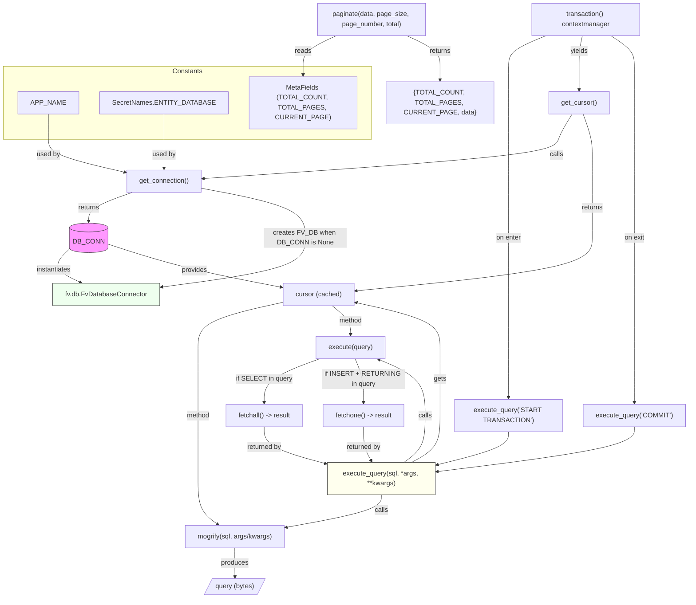

# Diagram: common/comment_service/comment_service/helpers/db_engine.py

> Auto-generated by Obscura crawlers

## Mermaid

### SVG

<svg id="container" width="1618.421875" xmlns="http://www.w3.org/2000/svg" class="flowchart" height="1416.1368408203125" viewBox="0 0 1618.421875 1416.1368408203125" role="graphics-document document" aria-roledescription="flowchart-v2"><g><marker id="container_flowchart-v2-pointEnd" class="marker flowchart-v2" viewBox="0 0 10 10" refX="5" refY="5" markerUnits="userSpaceOnUse" markerWidth="8" markerHeight="8" orient="auto"><path d="M 0 0 L 10 5 L 0 10 z" class="arrowMarkerPath" style="stroke-width: 1; stroke-dasharray: 1, 0;"></path></marker><marker id="container_flowchart-v2-pointStart" class="marker flowchart-v2" viewBox="0 0 10 10" refX="4.5" refY="5" markerUnits="userSpaceOnUse" markerWidth="8" markerHeight="8" orient="auto"><path d="M 0 5 L 10 10 L 10 0 z" class="arrowMarkerPath" style="stroke-width: 1; stroke-dasharray: 1, 0;"></path></marker><marker id="container_flowchart-v2-circleEnd" class="marker flowchart-v2" viewBox="0 0 10 10" refX="11" refY="5" markerUnits="userSpaceOnUse" markerWidth="11" markerHeight="11" orient="auto"><circle cx="5" cy="5" r="5" class="arrowMarkerPath" style="stroke-width: 1; stroke-dasharray: 1, 0;"></circle></marker><marker id="container_flowchart-v2-circleStart" class="marker flowchart-v2" viewBox="0 0 10 10" refX="-1" refY="5" markerUnits="userSpaceOnUse" markerWidth="11" markerHeight="11" orient="auto"><circle cx="5" cy="5" r="5" class="arrowMarkerPath" style="stroke-width: 1; stroke-dasharray: 1, 0;"></circle></marker><marker id="container_flowchart-v2-crossEnd" class="marker cross flowchart-v2" viewBox="0 0 11 11" refX="12" refY="5.2" markerUnits="userSpaceOnUse" markerWidth="11" markerHeight="11" orient="auto"><path d="M 1,1 l 9,9 M 10,1 l -9,9" class="arrowMarkerPath" style="stroke-width: 2; stroke-dasharray: 1, 0;"></path></marker><marker id="container_flowchart-v2-crossStart" class="marker cross flowchart-v2" viewBox="0 0 11 11" refX="-1" refY="5.2" markerUnits="userSpaceOnUse" markerWidth="11" markerHeight="11" orient="auto"><path d="M 1,1 l 9,9 M 10,1 l -9,9" class="arrowMarkerPath" style="stroke-width: 2; stroke-dasharray: 1, 0;"></path></marker><g class="root"><g class="clusters"><g class="cluster" id="Constants" data-look="classic"><rect style="" x="8" y="160" width="852.09375" height="152"></rect><g class="cluster-label" transform="translate(398.1328125, 160)"><foreignObject width="71.828125" height="24">

Constants

</foreignObject></g></g></g><g class="edgePaths"><path d="M110.797,263L110.797,271.167C110.797,279.333,110.797,295.667,110.797,310C110.797,324.333,110.797,336.667,138.513,349.628C166.228,362.59,221.66,376.18,249.376,382.975L277.092,389.77" id="L_APP_NAME_get_connection_0" class="edge-thickness-normal edge-pattern-solid edge-thickness-normal edge-pattern-solid flowchart-link" style=";" data-edge="true" data-et="edge" data-id="L_APP_NAME_get_connection_0" data-points="W3sieCI6MTEwLjc5Njg3NSwieSI6MjYzfSx7IngiOjExMC43OTY4NzUsInkiOjMxMn0seyJ4IjoxMTAuNzk2ODc1LCJ5IjozNDl9LHsieCI6MjgwLjk3NjU2MjUsInkiOjM5MC43MjIzOTE4MTE4MTU0fV0=" marker-end="url(#container_flowchart-v2-pointEnd)"></path><path d="M371.844,263L371.844,271.167C371.844,279.333,371.844,295.667,371.844,310C371.844,324.333,371.844,336.667,371.844,348.333C371.844,360,371.844,371,371.844,376.5L371.844,382" id="L_SecretNames_get_connection_0" class="edge-thickness-normal edge-pattern-solid edge-thickness-normal edge-pattern-solid flowchart-link" style=";" data-edge="true" data-et="edge" data-id="L_SecretNames_get_connection_0" data-points="W3sieCI6MzcxLjg0Mzc1LCJ5IjoyNjN9LHsieCI6MzcxLjg0Mzc1LCJ5IjozMTJ9LHsieCI6MzcxLjg0Mzc1LCJ5IjozNDl9LHsieCI6MzcxLjg0Mzc1LCJ5IjozODZ9XQ==" marker-end="url(#container_flowchart-v2-pointEnd)"></path><path d="M297.178,440L280.125,446.167C263.072,452.333,228.966,464.667,211.913,476.333C194.859,488,194.859,499,194.859,504.5L194.859,510" id="L_get_connection_DB_CONN_0" class="edge-thickness-normal edge-pattern-solid edge-thickness-normal edge-pattern-solid flowchart-link" style=";" data-edge="true" data-et="edge" data-id="L_get_connection_DB_CONN_0" data-points="W3sieCI6Mjk3LjE3ODQ2Njc5Njg3NSwieSI6NDQwfSx7IngiOjE5NC44NTkzNzUsInkiOjQ3N30seyJ4IjoxOTQuODU5Mzc1LCJ5Ijo1MTR9XQ==" marker-end="url(#container_flowchart-v2-pointEnd)"></path><path d="M152.875,572.229L145.015,580.214C137.155,588.199,121.435,604.168,126.038,618.034C130.641,631.901,155.568,643.665,168.031,649.547L180.494,655.43" id="L_DB_CONN_FV_DB_0" class="edge-thickness-normal edge-pattern-solid edge-thickness-normal edge-pattern-solid flowchart-link" style=";" data-edge="true" data-et="edge" data-id="L_DB_CONN_FV_DB_0" data-points="W3sieCI6MTUyLjg3NSwieSI6NTcyLjIyOTM2Mjg5NTgxNTZ9LHsieCI6MTA1LjcxNDg0Mzc1LCJ5Ijo2MjAuMTM2ODMzMTkwOTE4fSx7IngiOjE4NC4xMTE3NTUzNzEwOTM3NSwieSI6NjU3LjEzNjgzMzE5MDkxOH1d" marker-end="url(#container_flowchart-v2-pointEnd)"></path><path d="M462.711,430.425L503.191,438.187C543.672,445.95,624.633,461.475,665.113,481.166C705.594,500.856,705.594,524.712,705.594,548.568C705.594,572.425,705.594,596.281,650.18,615.848C594.766,635.414,483.939,650.692,428.525,658.331L373.111,665.97" id="L_get_connection_FV_DB_0" class="edge-thickness-normal edge-pattern-solid edge-thickness-normal edge-pattern-solid flowchart-link" style=";" data-edge="true" data-et="edge" data-id="L_get_connection_FV_DB_0" data-points="W3sieCI6NDYyLjcxMDkzNzUsInkiOjQzMC40MjQ3MTkxMDExMjM1N30seyJ4Ijo3MDUuNTkzNzUsInkiOjQ3N30seyJ4Ijo3MDUuNTkzNzUsInkiOjU0OC41Njg0MTY1OTU0NTl9LHsieCI6NzA1LjU5Mzc1LCJ5Ijo2MjAuMTM2ODMzMTkwOTE4fSx7IngiOjM2OS4xNDg0Mzc1LCJ5Ijo2NjYuNTE1NzUxODY0MjQ4M31d" marker-end="url(#container_flowchart-v2-pointEnd)"></path><path d="M236.844,562.204L266.574,571.859C296.305,581.515,355.766,600.826,424.097,618.167C492.428,635.508,569.629,650.878,608.23,658.564L646.831,666.249" id="L_DB_CONN_cursor_0" class="edge-thickness-normal edge-pattern-solid edge-thickness-normal edge-pattern-solid flowchart-link" style=";" data-edge="true" data-et="edge" data-id="L_DB_CONN_cursor_0" data-points="W3sieCI6MjM2Ljg0Mzc1LCJ5Ijo1NjIuMjAzNjM3MzEzMTUzMX0seyJ4Ijo0MTUuMjI2NTYyNSwieSI6NjIwLjEzNjgzMzE5MDkxOH0seyJ4Ijo2NTAuNzUzOTA2MjUsInkiOjY2Ny4wMjk5MzIwNzE3MTl9XQ==" marker-end="url(#container_flowchart-v2-pointEnd)"></path><path d="M1339.229,263L1333.397,271.167C1327.564,279.333,1315.899,295.667,1310.067,310C1304.234,324.333,1304.234,336.667,1164.646,352.415C1025.057,368.163,745.879,387.326,606.29,396.907L466.702,406.489" id="L_get_cursor_get_connection_0" class="edge-thickness-normal edge-pattern-solid edge-thickness-normal edge-pattern-solid flowchart-link" style=";" data-edge="true" data-et="edge" data-id="L_get_cursor_get_connection_0" data-points="W3sieCI6MTMzOS4yMjg5NzgyMDcyMzY5LCJ5IjoyNjN9LHsieCI6MTMwNC4yMzQzNzUsInkiOjMxMn0seyJ4IjoxMzA0LjIzNDM3NSwieSI6MzQ5fSx7IngiOjQ2Mi43MTA5Mzc1LCJ5Ijo0MDYuNzYyODA3Mjk5NzgzODR9XQ==" marker-end="url(#container_flowchart-v2-pointEnd)"></path><path d="M1369.536,263L1372.87,271.167C1376.205,279.333,1382.874,295.667,1386.208,310C1389.543,324.333,1389.543,336.667,1389.543,353.5C1389.543,370.333,1389.543,391.667,1389.543,413C1389.543,434.333,1389.543,455.667,1389.543,478.261C1389.543,500.856,1389.543,524.712,1389.543,548.568C1389.543,572.425,1389.543,596.281,1295.716,617.407C1201.888,638.532,1014.233,656.928,920.406,666.126L826.579,675.324" id="L_get_cursor_cursor_0" class="edge-thickness-normal edge-pattern-solid edge-thickness-normal edge-pattern-solid flowchart-link" style=";" data-edge="true" data-et="edge" data-id="L_get_cursor_cursor_0" data-points="W3sieCI6MTM2OS41MzU5Nzg2MTg0MjEsInkiOjI2M30seyJ4IjoxMzg5LjU0Mjk2ODc1LCJ5IjozMTJ9LHsieCI6MTM4OS41NDI5Njg3NSwieSI6MzQ5fSx7IngiOjEzODkuNTQyOTY4NzUsInkiOjQxM30seyJ4IjoxMzg5LjU0Mjk2ODc1LCJ5Ijo0Nzd9LHsieCI6MTM4OS41NDI5Njg3NSwieSI6NTQ4LjU2ODQxNjU5NTQ1OX0seyJ4IjoxMzg5LjU0Mjk2ODc1LCJ5Ijo2MjAuMTM2ODMzMTkwOTE4fSx7IngiOjgyMi41OTc2NTYyNSwieSI6Njc1LjcxMzk4Njg1MjA1MjF9XQ==" marker-end="url(#container_flowchart-v2-pointEnd)"></path><path d="M959.855,1089.137L970.728,1082.97C981.601,1076.803,1003.348,1064.47,1014.221,1045.637C1025.094,1026.803,1025.094,1001.47,1025.094,974.137C1025.094,946.803,1025.094,917.47,1025.094,890.137C1025.094,862.803,1025.094,837.47,1025.094,814.137C1025.094,790.803,1025.094,769.47,991.995,751.459C958.897,733.448,892.7,718.759,859.601,711.414L826.503,704.069" id="L_execute_query_cursor_0" class="edge-thickness-normal edge-pattern-solid edge-thickness-normal edge-pattern-solid flowchart-link" style=";" data-edge="true" data-et="edge" data-id="L_execute_query_cursor_0" data-points="W3sieCI6OTU5Ljg1NTAwNjE2Nzc2MzEsInkiOjEwODkuMTM2ODMzMTkwOTE4fSx7IngiOjEwMjUuMDkzNzUsInkiOjEwNTIuMTM2ODMzMTkwOTE4fSx7IngiOjEwMjUuMDkzNzUsInkiOjk3Ni4xMzY4MzMxOTA5MTh9LHsieCI6MTAyNS4wOTM3NSwieSI6ODg4LjEzNjgzMzE5MDkxOH0seyJ4IjoxMDI1LjA5Mzc1LCJ5Ijo4MTIuMTM2ODMzMTkwOTE4fSx7IngiOjEwMjUuMDkzNzUsInkiOjc0OC4xMzY4MzMxOTA5MTh9LHsieCI6ODIyLjU5NzY1NjI1LCJ5Ijo3MDMuMjAyOTEyOTYzMzgzNn1d" marker-end="url(#container_flowchart-v2-pointEnd)"></path><path d="M891.09,1167.137L891.09,1173.303C891.09,1179.47,891.09,1191.803,852.247,1204.895C813.404,1217.987,735.718,1231.837,696.875,1238.762L658.032,1245.687" id="L_execute_query_mogrify_0" class="edge-thickness-normal edge-pattern-solid edge-thickness-normal edge-pattern-solid flowchart-link" style=";" data-edge="true" data-et="edge" data-id="L_execute_query_mogrify_0" data-points="W3sieCI6ODkxLjA4OTg0Mzc1LCJ5IjoxMTY3LjEzNjgzMzE5MDkxOH0seyJ4Ijo4OTEuMDg5ODQzNzUsInkiOjEyMDQuMTM2ODMzMTkwOTE4fSx7IngiOjY1NC4wOTM3NSwieSI6MTI0Ni4zODkxMzE5MTAxNjR9XQ==" marker-end="url(#container_flowchart-v2-pointEnd)"></path><path d="M650.754,702.195L614.321,709.852C577.888,717.509,505.022,732.823,468.589,751.146C432.156,769.47,432.156,790.803,432.156,814.137C432.156,837.47,432.156,862.803,432.156,890.137C432.156,917.47,432.156,946.803,432.156,974.137C432.156,1001.47,432.156,1026.803,432.156,1052.137C432.156,1077.47,432.156,1102.803,432.156,1128.137C432.156,1153.47,432.156,1178.803,441.226,1197.277C450.295,1215.751,468.434,1227.366,477.504,1233.173L486.573,1238.98" id="L_cursor_mogrify_0" class="edge-thickness-normal edge-pattern-solid edge-thickness-normal edge-pattern-solid flowchart-link" style=";" data-edge="true" data-et="edge" data-id="L_cursor_mogrify_0" data-points="W3sieCI6NjUwLjc1MzkwNjI1LCJ5Ijo3MDIuMTk0Nzg4MjE3NDA2OX0seyJ4Ijo0MzIuMTU2MjUsInkiOjc0OC4xMzY4MzMxOTA5MTh9LHsieCI6NDMyLjE1NjI1LCJ5Ijo4MTIuMTM2ODMzMTkwOTE4fSx7IngiOjQzMi4xNTYyNSwieSI6ODg4LjEzNjgzMzE5MDkxOH0seyJ4Ijo0MzIuMTU2MjUsInkiOjk3Ni4xMzY4MzMxOTA5MTh9LHsieCI6NDMyLjE1NjI1LCJ5IjoxMDUyLjEzNjgzMzE5MDkxOH0seyJ4Ijo0MzIuMTU2MjUsInkiOjExMjguMTM2ODMzMTkwOTE4fSx7IngiOjQzMi4xNTYyNSwieSI6MTIwNC4xMzY4MzMxOTA5MTh9LHsieCI6NDg5Ljk0MTY1MDM5MDYyNSwieSI6MTI0MS4xMzY4MzMxOTA5MTh9XQ==" marker-end="url(#container_flowchart-v2-pointEnd)"></path><path d="M532.109,1295.137L532.109,1301.303C532.109,1307.47,532.109,1319.803,532.184,1331.554C532.258,1343.304,532.407,1354.47,532.482,1360.054L532.556,1365.637" id="L_mogrify_query_0" class="edge-thickness-normal edge-pattern-solid edge-thickness-normal edge-pattern-solid flowchart-link" style=";" data-edge="true" data-et="edge" data-id="L_mogrify_query_0" data-points="W3sieCI6NTMyLjEwOTM3NSwieSI6MTI5NS4xMzY4MzMxOTA5MTh9LHsieCI6NTMyLjEwOTM3NSwieSI6MTMzMi4xMzY4MzMxOTA5MTh9LHsieCI6NTMyLjYwOTM3NSwieSI6MTM2OS42MzY4MzMxOTA5MTh9XQ==" marker-end="url(#container_flowchart-v2-pointEnd)"></path><path d="M941.153,1089.137L949.069,1082.97C956.985,1076.803,972.817,1064.47,980.732,1045.637C988.648,1026.803,988.648,1001.47,988.648,974.137C988.648,946.803,988.648,917.47,970.668,894.905C952.689,872.34,916.729,856.543,898.749,848.644L880.769,840.746" id="L_execute_query_execute_0" class="edge-thickness-normal edge-pattern-solid edge-thickness-normal edge-pattern-solid flowchart-link" style=";" data-edge="true" data-et="edge" data-id="L_execute_query_execute_0" data-points="W3sieCI6OTQxLjE1MjgwNjMzMjIzNjksInkiOjEwODkuMTM2ODMzMTkwOTE4fSx7IngiOjk4OC42NDg0Mzc1LCJ5IjoxMDUyLjEzNjgzMzE5MDkxOH0seyJ4Ijo5ODguNjQ4NDM3NSwieSI6OTc2LjEzNjgzMzE5MDkxOH0seyJ4Ijo5ODguNjQ4NDM3NSwieSI6ODg4LjEzNjgzMzE5MDkxOH0seyJ4Ijo4NzcuMTA2NDQ1MzEyNSwieSI6ODM5LjEzNjgzMzE5MDkxOH1d" marker-end="url(#container_flowchart-v2-pointEnd)"></path><path d="M769.991,711.137L777.6,717.303C785.209,723.47,800.427,735.803,808.036,747.47C815.645,759.137,815.645,770.137,815.645,775.637L815.645,781.137" id="L_cursor_execute_0" class="edge-thickness-normal edge-pattern-solid edge-thickness-normal edge-pattern-solid flowchart-link" style=";" data-edge="true" data-et="edge" data-id="L_cursor_execute_0" data-points="W3sieCI6NzY5Ljk5MDcyMjY1NjI1LCJ5Ijo3MTEuMTM2ODMzMTkwOTE4fSx7IngiOjgxNS42NDQ1MzEyNSwieSI6NzQ4LjEzNjgzMzE5MDkxOH0seyJ4Ijo4MTUuNjQ0NTMxMjUsInkiOjc4NS4xMzY4MzMxOTA5MTh9XQ==" marker-end="url(#container_flowchart-v2-pointEnd)"></path><path d="M736.769,839.137L712.912,847.303C689.054,855.47,641.34,871.803,617.482,889.47C593.625,907.137,593.625,926.137,593.625,935.637L593.625,945.137" id="L_execute_fetchall_0" class="edge-thickness-normal edge-pattern-solid edge-thickness-normal edge-pattern-solid flowchart-link" style=";" data-edge="true" data-et="edge" data-id="L_execute_fetchall_0" data-points="W3sieCI6NzM2Ljc2OTE3MTQ2MzgxNTgsInkiOjgzOS4xMzY4MzMxOTA5MTh9LHsieCI6NTkzLjYyNSwieSI6ODg4LjEzNjgzMzE5MDkxOH0seyJ4Ijo1OTMuNjI1LCJ5Ijo5NDkuMTM2ODMzMTkwOTE4fV0=" marker-end="url(#container_flowchart-v2-pointEnd)"></path><path d="M823.501,839.137L825.877,847.303C828.253,855.47,833.005,871.803,835.382,889.47C837.758,907.137,837.758,926.137,837.758,935.637L837.758,945.137" id="L_execute_fetchone_0" class="edge-thickness-normal edge-pattern-solid edge-thickness-normal edge-pattern-solid flowchart-link" style=";" data-edge="true" data-et="edge" data-id="L_execute_fetchone_0" data-points="W3sieCI6ODIzLjUwMDU2NTM3ODI4OTUsInkiOjgzOS4xMzY4MzMxOTA5MTh9LHsieCI6ODM3Ljc1NzgxMjUsInkiOjg4OC4xMzY4MzMxOTA5MTh9LHsieCI6ODM3Ljc1NzgxMjUsInkiOjk0OS4xMzY4MzMxOTA5MTh9XQ==" marker-end="url(#container_flowchart-v2-pointEnd)"></path><path d="M593.625,1003.137L593.625,1011.303C593.625,1019.47,593.625,1035.803,620.89,1050.936C648.155,1066.069,702.685,1080.001,729.949,1086.967L757.214,1093.933" id="L_fetchall_execute_query_0" class="edge-thickness-normal edge-pattern-solid edge-thickness-normal edge-pattern-solid flowchart-link" style=";" data-edge="true" data-et="edge" data-id="L_fetchall_execute_query_0" data-points="W3sieCI6NTkzLjYyNSwieSI6MTAwMy4xMzY4MzMxOTA5MTh9LHsieCI6NTkzLjYyNSwieSI6MTA1Mi4xMzY4MzMxOTA5MTh9LHsieCI6NzYxLjA4OTg0Mzc1LCJ5IjoxMDk0LjkyMjgyNDE4MjUwMDZ9XQ==" marker-end="url(#container_flowchart-v2-pointEnd)"></path><path d="M837.758,1003.137L837.758,1011.303C837.758,1019.47,837.758,1035.803,841.702,1049.591C845.647,1063.379,853.536,1074.621,857.48,1080.242L861.424,1085.863" id="L_fetchone_execute_query_0" class="edge-thickness-normal edge-pattern-solid edge-thickness-normal edge-pattern-solid flowchart-link" style=";" data-edge="true" data-et="edge" data-id="L_fetchone_execute_query_0" data-points="W3sieCI6ODM3Ljc1NzgxMjUsInkiOjEwMDMuMTM2ODMzMTkwOTE4fSx7IngiOjgzNy43NTc4MTI1LCJ5IjoxMDUyLjEzNjgzMzE5MDkxOH0seyJ4Ijo4NjMuNzIyMDkwODcxNzEwNSwieSI6MTA4OS4xMzY4MzMxOTA5MTh9XQ==" marker-end="url(#container_flowchart-v2-pointEnd)"></path><path d="M775.423,86L762.035,92.167C748.646,98.333,721.87,110.667,708.482,123C695.094,135.333,695.094,147.667,695.094,157.333C695.094,167,695.094,174,695.094,177.5L695.094,181" id="L_paginate_MetaFields_0" class="edge-thickness-normal edge-pattern-solid edge-thickness-normal edge-pattern-solid flowchart-link" style=";" data-edge="true" data-et="edge" data-id="L_paginate_MetaFields_0" data-points="W3sieCI6Nzc1LjQyMjY5NzM2ODQyMSwieSI6ODZ9LHsieCI6Njk1LjA5Mzc1LCJ5IjoxMjN9LHsieCI6Njk1LjA5Mzc1LCJ5IjoxNjB9LHsieCI6Njk1LjA5Mzc1LCJ5IjoxODV9XQ==" marker-end="url(#container_flowchart-v2-pointEnd)"></path><path d="M944.765,86L958.153,92.167C971.541,98.333,998.317,110.667,1011.706,123C1025.094,135.333,1025.094,147.667,1025.094,157.333C1025.094,167,1025.094,174,1025.094,177.5L1025.094,181" id="L_paginate_pagination_0" class="edge-thickness-normal edge-pattern-solid edge-thickness-normal edge-pattern-solid flowchart-link" style=";" data-edge="true" data-et="edge" data-id="L_paginate_pagination_0" data-points="W3sieCI6OTQ0Ljc2NDgwMjYzMTU3OSwieSI6ODZ9LHsieCI6MTAyNS4wOTM3NSwieSI6MTIzfSx7IngiOjEwMjUuMDkzNzUsInkiOjE2MH0seyJ4IjoxMDI1LjA5Mzc1LCJ5IjoxODV9XQ==" marker-end="url(#container_flowchart-v2-pointEnd)"></path><path d="M1285.452,86L1269.559,92.167C1253.666,98.333,1221.88,110.667,1205.987,123C1190.094,135.333,1190.094,147.667,1190.094,166.5C1190.094,185.333,1190.094,210.667,1190.094,236C1190.094,261.333,1190.094,286.667,1190.094,305.5C1190.094,324.333,1190.094,336.667,1190.094,353.5C1190.094,370.333,1190.094,391.667,1190.094,413C1190.094,434.333,1190.094,455.667,1190.094,478.261C1190.094,500.856,1190.094,524.712,1190.094,548.568C1190.094,572.425,1190.094,596.281,1190.094,618.875C1190.094,641.47,1190.094,662.803,1190.094,684.137C1190.094,705.47,1190.094,726.803,1190.094,748.137C1190.094,769.47,1190.094,790.803,1190.094,814.137C1190.094,837.47,1190.094,862.803,1190.094,882.97C1190.094,903.137,1190.094,918.137,1190.094,925.637L1190.094,933.137" id="L_transaction_execute_query_start_0" class="edge-thickness-normal edge-pattern-solid edge-thickness-normal edge-pattern-solid flowchart-link" style=";" data-edge="true" data-et="edge" data-id="L_transaction_execute_query_start_0" data-points="W3sieCI6MTI4NS40NTIwNDU2NDE0NDczLCJ5Ijo4Nn0seyJ4IjoxMTkwLjA5Mzc1LCJ5IjoxMjN9LHsieCI6MTE5MC4wOTM3NSwieSI6MTYwfSx7IngiOjExOTAuMDkzNzUsInkiOjIzNn0seyJ4IjoxMTkwLjA5Mzc1LCJ5IjozMTJ9LHsieCI6MTE5MC4wOTM3NSwieSI6MzQ5fSx7IngiOjExOTAuMDkzNzUsInkiOjQxM30seyJ4IjoxMTkwLjA5Mzc1LCJ5Ijo0Nzd9LHsieCI6MTE5MC4wOTM3NSwieSI6NTQ4LjU2ODQxNjU5NTQ1OX0seyJ4IjoxMTkwLjA5Mzc1LCJ5Ijo2MjAuMTM2ODMzMTkwOTE4fSx7IngiOjExOTAuMDkzNzUsInkiOjY4NC4xMzY4MzMxOTA5MTh9LHsieCI6MTE5MC4wOTM3NSwieSI6NzQ4LjEzNjgzMzE5MDkxOH0seyJ4IjoxMTkwLjA5Mzc1LCJ5Ijo4MTIuMTM2ODMzMTkwOTE4fSx7IngiOjExOTAuMDkzNzUsInkiOjg4OC4xMzY4MzMxOTA5MTh9LHsieCI6MTE5MC4wOTM3NSwieSI6OTM3LjEzNjgzMzE5MDkxOH1d" marker-end="url(#container_flowchart-v2-pointEnd)"></path><path d="M1371.877,86L1369.649,92.167C1367.422,98.333,1362.967,110.667,1360.739,123C1358.512,135.333,1358.512,147.667,1358.512,161.333C1358.512,175,1358.512,190,1358.512,197.5L1358.512,205" id="L_transaction_get_cursor_0" class="edge-thickness-normal edge-pattern-solid edge-thickness-normal edge-pattern-solid flowchart-link" style=";" data-edge="true" data-et="edge" data-id="L_transaction_get_cursor_0" data-points="W3sieCI6MTM3MS44NzcwNTU5MjEwNTI3LCJ5Ijo4Nn0seyJ4IjoxMzU4LjUxMTcxODc1LCJ5IjoxMjN9LHsieCI6MTM1OC41MTE3MTg3NSwieSI6MTYwfSx7IngiOjEzNTguNTExNzE4NzUsInkiOjIwOX1d" marker-end="url(#container_flowchart-v2-pointEnd)"></path><path d="M1439.484,86L1447.946,92.167C1456.408,98.333,1473.333,110.667,1481.795,123C1490.258,135.333,1490.258,147.667,1490.258,166.5C1490.258,185.333,1490.258,210.667,1490.258,236C1490.258,261.333,1490.258,286.667,1490.258,305.5C1490.258,324.333,1490.258,336.667,1490.258,353.5C1490.258,370.333,1490.258,391.667,1490.258,413C1490.258,434.333,1490.258,455.667,1490.258,478.261C1490.258,500.856,1490.258,524.712,1490.258,548.568C1490.258,572.425,1490.258,596.281,1490.258,618.875C1490.258,641.47,1490.258,662.803,1490.258,684.137C1490.258,705.47,1490.258,726.803,1490.258,748.137C1490.258,769.47,1490.258,790.803,1490.258,814.137C1490.258,837.47,1490.258,862.803,1490.258,884.97C1490.258,907.137,1490.258,926.137,1490.258,935.637L1490.258,945.137" id="L_transaction_execute_query_commit_0" class="edge-thickness-normal edge-pattern-solid edge-thickness-normal edge-pattern-solid flowchart-link" style=";" data-edge="true" data-et="edge" data-id="L_transaction_execute_query_commit_0" data-points="W3sieCI6MTQzOS40ODM2MDQwMjk2MDUyLCJ5Ijo4Nn0seyJ4IjoxNDkwLjI1NzgxMjUsInkiOjEyM30seyJ4IjoxNDkwLjI1NzgxMjUsInkiOjE2MH0seyJ4IjoxNDkwLjI1NzgxMjUsInkiOjIzNn0seyJ4IjoxNDkwLjI1NzgxMjUsInkiOjMxMn0seyJ4IjoxNDkwLjI1NzgxMjUsInkiOjM0OX0seyJ4IjoxNDkwLjI1NzgxMjUsInkiOjQxM30seyJ4IjoxNDkwLjI1NzgxMjUsInkiOjQ3N30seyJ4IjoxNDkwLjI1NzgxMjUsInkiOjU0OC41Njg0MTY1OTU0NTl9LHsieCI6MTQ5MC4yNTc4MTI1LCJ5Ijo2MjAuMTM2ODMzMTkwOTE4fSx7IngiOjE0OTAuMjU3ODEyNSwieSI6Njg0LjEzNjgzMzE5MDkxOH0seyJ4IjoxNDkwLjI1NzgxMjUsInkiOjc0OC4xMzY4MzMxOTA5MTh9LHsieCI6MTQ5MC4yNTc4MTI1LCJ5Ijo4MTIuMTM2ODMzMTkwOTE4fSx7IngiOjE0OTAuMjU3ODEyNSwieSI6ODg4LjEzNjgzMzE5MDkxOH0seyJ4IjoxNDkwLjI1NzgxMjUsInkiOjk0OS4xMzY4MzMxOTA5MTh9XQ==" marker-end="url(#container_flowchart-v2-pointEnd)"></path><path d="M1190.094,1015.137L1190.094,1021.303C1190.094,1027.47,1190.094,1039.803,1162.573,1052.965C1135.051,1066.127,1080.009,1080.118,1052.488,1087.113L1024.967,1094.108" id="L_execute_query_start_execute_query_0" class="edge-thickness-normal edge-pattern-solid edge-thickness-normal edge-pattern-solid flowchart-link" style=";" data-edge="true" data-et="edge" data-id="L_execute_query_start_execute_query_0" data-points="W3sieCI6MTE5MC4wOTM3NSwieSI6MTAxNS4xMzY4MzMxOTA5MTh9LHsieCI6MTE5MC4wOTM3NSwieSI6MTA1Mi4xMzY4MzMxOTA5MTh9LHsieCI6MTAyMS4wODk4NDM3NSwieSI6MTA5NS4wOTM3ODY2MTcwMDczfV0=" marker-end="url(#container_flowchart-v2-pointEnd)"></path><path d="M1490.258,1003.137L1490.258,1011.303C1490.258,1019.47,1490.258,1035.803,1412.725,1053.805C1335.191,1071.806,1180.125,1091.475,1102.591,1101.309L1025.058,1111.144" id="L_execute_query_commit_execute_query_0" class="edge-thickness-normal edge-pattern-solid edge-thickness-normal edge-pattern-solid flowchart-link" style=";" data-edge="true" data-et="edge" data-id="L_execute_query_commit_execute_query_0" data-points="W3sieCI6MTQ5MC4yNTc4MTI1LCJ5IjoxMDAzLjEzNjgzMzE5MDkxOH0seyJ4IjoxNDkwLjI1NzgxMjUsInkiOjEwNTIuMTM2ODMzMTkwOTE4fSx7IngiOjEwMjEuMDg5ODQzNzUsInkiOjExMTEuNjQ3MzAwMTc5NjQ1OH1d" marker-end="url(#container_flowchart-v2-pointEnd)"></path></g><g class="edgeLabels"><g class="edgeLabel" transform="translate(110.796875, 349)"><g class="label" data-id="L_APP_NAME_get_connection_0" transform="translate(-28.3125, -12)"><foreignObject width="56.625" height="24">

used by

</foreignObject></g></g><g class="edgeLabel" transform="translate(371.84375, 349)"><g class="label" data-id="L_SecretNames_get_connection_0" transform="translate(-28.3125, -12)"><foreignObject width="56.625" height="24">

used by

</foreignObject></g></g><g class="edgeLabel" transform="translate(194.859375, 477)"><g class="label" data-id="L_get_connection_DB_CONN_0" transform="translate(-26.265625, -12)"><foreignObject width="52.53125" height="24">

returns

</foreignObject></g></g><g class="edgeLabel" transform="translate(114.51612, 624.29066)"><g class="label" data-id="L_DB_CONN_FV_DB_0" transform="translate(-42.9140625, -12)"><foreignObject width="85.828125" height="24">

instantiates

</foreignObject></g></g><g class="edgeLabel" transform="translate(705.59375, 548.568416595459)"><g class="label" data-id="L_get_connection_FV_DB_0" transform="translate(-100, -24)"><foreignObject width="200" height="48">

creates FV_DB when DB_CONN is None

</foreignObject></g></g><g class="edgeLabel" transform="translate(441.01817, 625.2719)"><g class="label" data-id="L_DB_CONN_cursor_0" transform="translate(-31.3125, -12)"><foreignObject width="62.625" height="24">

provides

</foreignObject></g></g><g class="edgeLabel" transform="translate(1304.234375, 349)"><g class="label" data-id="L_get_cursor_get_connection_0" transform="translate(-16.4453125, -12)"><foreignObject width="32.890625" height="24">

calls

</foreignObject></g></g><g class="edgeLabel" transform="translate(1389.54296875, 477)"><g class="label" data-id="L_get_cursor_cursor_0" transform="translate(-26.265625, -12)"><foreignObject width="52.53125" height="24">

returns

</foreignObject></g></g><g class="edgeLabel" transform="translate(1025.09375, 888.136833190918)"><g class="label" data-id="L_execute_query_cursor_0" transform="translate(-15.0234375, -12)"><foreignObject width="30.046875" height="24">

gets

</foreignObject></g></g><g class="edgeLabel" transform="translate(891.08984375, 1204.136833190918)"><g class="label" data-id="L_execute_query_mogrify_0" transform="translate(-16.4453125, -12)"><foreignObject width="32.890625" height="24">

calls

</foreignObject></g></g><g class="edgeLabel" transform="translate(432.15625, 976.136833190918)"><g class="label" data-id="L_cursor_mogrify_0" transform="translate(-28.25, -12)"><foreignObject width="56.5" height="24">

method

</foreignObject></g></g><g class="edgeLabel" transform="translate(532.109375, 1332.136833190918)"><g class="label" data-id="L_mogrify_query_0" transform="translate(-33.4765625, -12)"><foreignObject width="66.953125" height="24">

produces

</foreignObject></g></g><g class="edgeLabel" transform="translate(988.6484375, 976.136833190918)"><g class="label" data-id="L_execute_query_execute_0" transform="translate(-16.4453125, -12)"><foreignObject width="32.890625" height="24">

calls

</foreignObject></g></g><g class="edgeLabel" transform="translate(815.64453125, 748.136833190918)"><g class="label" data-id="L_cursor_execute_0" transform="translate(-28.25, -12)"><foreignObject width="56.5" height="24">

method

</foreignObject></g></g><g class="edgeLabel" transform="translate(593.625, 888.136833190918)"><g class="label" data-id="L_execute_fetchall_0" transform="translate(-64.4140625, -12)"><foreignObject width="128.828125" height="24">

if SELECT in query

</foreignObject></g></g><g class="edgeLabel" transform="translate(837.7578125, 888.136833190918)"><g class="label" data-id="L_execute_fetchone_0" transform="translate(-100, -24)"><foreignObject width="200" height="48">

if INSERT + RETURNING in query

</foreignObject></g></g><g class="edgeLabel" transform="translate(593.625, 1052.136833190918)"><g class="label" data-id="L_fetchall_execute_query_0" transform="translate(-42.453125, -12)"><foreignObject width="84.90625" height="24">

returned by

</foreignObject></g></g><g class="edgeLabel" transform="translate(837.7578125, 1052.136833190918)"><g class="label" data-id="L_fetchone_execute_query_0" transform="translate(-42.453125, -12)"><foreignObject width="84.90625" height="24">

returned by

</foreignObject></g></g><g class="edgeLabel" transform="translate(695.09375, 123)"><g class="label" data-id="L_paginate_MetaFields_0" transform="translate(-20.0078125, -12)"><foreignObject width="40.015625" height="24">

reads

</foreignObject></g></g><g class="edgeLabel" transform="translate(1025.09375, 123)"><g class="label" data-id="L_paginate_pagination_0" transform="translate(-26.265625, -12)"><foreignObject width="52.53125" height="24">

returns

</foreignObject></g></g><g class="edgeLabel" transform="translate(1190.09375, 548.568416595459)"><g class="label" data-id="L_transaction_execute_query_start_0" transform="translate(-30.75, -12)"><foreignObject width="61.5" height="24">

on enter

</foreignObject></g></g><g class="edgeLabel" transform="translate(1358.51171875, 123)"><g class="label" data-id="L_transaction_get_cursor_0" transform="translate(-21.3828125, -12)"><foreignObject width="42.765625" height="24">

yields

</foreignObject></g></g><g class="edgeLabel" transform="translate(1490.2578125, 548.568416595459)"><g class="label" data-id="L_transaction_execute_query_commit_0" transform="translate(-24.796875, -12)"><foreignObject width="49.59375" height="24">

on exit

</foreignObject></g></g><g class="edgeLabel"><g class="label" data-id="L_execute_query_start_execute_query_0" transform="translate(0, 0)"><foreignObject width="0" height="0">

</foreignObject></g></g><g class="edgeLabel"><g class="label" data-id="L_execute_query_commit_execute_query_0" transform="translate(0, 0)"><foreignObject width="0" height="0">

</foreignObject></g></g></g><g class="nodes"><g class="node default" id="flowchart-APP_NAME-0" transform="translate(110.796875, 236)"><rect class="basic label-container" style="" x="-67.796875" y="-27" width="135.59375" height="54"></rect><g class="label" style="" transform="translate(-37.796875, -12)"><rect></rect><foreignObject width="75.59375" height="24">

APP_NAME

</foreignObject></g></g><g class="node default" id="flowchart-SecretNames-1" transform="translate(371.84375, 236)"><rect class="basic label-container" style="" x="-143.25" y="-27" width="286.5" height="54"></rect><g class="label" style="" transform="translate(-113.25, -12)"><rect></rect><foreignObject width="226.5" height="24">

SecretNames.ENTITY_DATABASE

</foreignObject></g></g><g class="node default" id="flowchart-MetaFields-2" transform="translate(695.09375, 236)"><rect class="basic label-container" style="" x="-130" y="-51" width="260" height="102"></rect><g class="label" style="" transform="translate(-100, -36)"><rect></rect><foreignObject width="200" height="72">

MetaFields (TOTAL_COUNT, TOTAL_PAGES, CURRENT_PAGE)

</foreignObject></g></g><g class="node default" id="flowchart-DB_CONN-3" transform="translate(194.859375, 548.568416595459)"><path d="M0,10.045610886795274 a41.984375,10.045610886795274 0,0,0 83.96875,0 a41.984375,10.045610886795274 0,0,0 -83.96875,0 l0,49.045610886795274 a41.984375,10.045610886795274 0,0,0 83.96875,0 l0,-49.045610886795274" class="basic label-container" style="fill:#f9f !important;stroke:#333 !important;stroke-width:1px !important" transform="translate(-41.984375, -34.56841633019291)"></path><g class="label" style="" transform="translate(-34.484375, -2)"><rect></rect><foreignObject width="68.96875" height="24">

DB_CONN

</foreignObject></g></g><g class="node default" id="flowchart-FV_DB-4" transform="translate(241.3203125, 684.136833190918)"><rect class="basic label-container" style="fill:#efe !important;stroke:#333 !important;stroke-width:1px !important" x="-127.828125" y="-27" width="255.65625" height="54"></rect><g class="label" style="" transform="translate(-97.828125, -12)"><rect></rect><foreignObject width="195.65625" height="24">

fv.db.FvDatabaseConnector

</foreignObject></g></g><g class="node default" id="flowchart-get_connection-5" transform="translate(371.84375, 413)"><rect class="basic label-container" style="" x="-90.8671875" y="-27" width="181.734375" height="54"></rect><g class="label" style="" transform="translate(-60.8671875, -12)"><rect></rect><foreignObject width="121.734375" height="24">

get_connection()

</foreignObject></g></g><g class="node default" id="flowchart-get_cursor-6" transform="translate(1358.51171875, 236)"><rect class="basic label-container" style="" x="-73.328125" y="-27" width="146.65625" height="54"></rect><g class="label" style="" transform="translate(-43.328125, -12)"><rect></rect><foreignObject width="86.65625" height="24">

get_cursor()

</foreignObject></g></g><g class="node default" id="flowchart-execute_query-7" transform="translate(891.08984375, 1128.136833190918)"><rect class="basic label-container" style="fill:#ffe !important;stroke:#333 !important;stroke-width:1px !important" x="-130" y="-39" width="260" height="78"></rect><g class="label" style="" transform="translate(-100, -24)"><rect></rect><foreignObject width="200" height="48">

execute_query(sql, *args, **kwargs)

</foreignObject></g></g><g class="node default" id="flowchart-cursor-8" transform="translate(736.67578125, 684.136833190918)"><rect class="basic label-container" style="" x="-85.921875" y="-27" width="171.84375" height="54"></rect><g class="label" style="" transform="translate(-55.921875, -12)"><rect></rect><foreignObject width="111.84375" height="24">

cursor (cached)

</foreignObject></g></g><g class="node default" id="flowchart-mogrify-9" transform="translate(532.109375, 1268.136833190918)"><rect class="basic label-container" style="" x="-121.984375" y="-27" width="243.96875" height="54"></rect><g class="label" style="" transform="translate(-91.984375, -12)"><rect></rect><foreignObject width="183.96875" height="24">

mogrify(sql, args/kwargs)

</foreignObject></g></g><g class="node default" id="flowchart-execute-10" transform="translate(815.64453125, 812.136833190918)"><rect class="basic label-container" style="" x="-83.9921875" y="-27" width="167.984375" height="54"></rect><g class="label" style="" transform="translate(-53.9921875, -12)"><rect></rect><foreignObject width="107.984375" height="24">

execute(query)

</foreignObject></g></g><g class="node default" id="flowchart-fetchall-11" transform="translate(593.625, 976.136833190918)"><rect class="basic label-container" style="" x="-94.6875" y="-27" width="189.375" height="54"></rect><g class="label" style="" transform="translate(-64.6875, -12)"><rect></rect><foreignObject width="129.375" height="24">

fetchall() -&gt; result

</foreignObject></g></g><g class="node default" id="flowchart-fetchone-12" transform="translate(837.7578125, 976.136833190918)"><rect class="basic label-container" style="" x="-99.4453125" y="-27" width="198.890625" height="54"></rect><g class="label" style="" transform="translate(-69.4453125, -12)"><rect></rect><foreignObject width="138.890625" height="24">

fetchone() -&gt; result

</foreignObject></g></g><g class="node default" id="flowchart-paginate-13" transform="translate(860.09375, 47)"><rect class="basic label-container" style="" x="-130" y="-39" width="260" height="78"></rect><g class="label" style="" transform="translate(-100, -24)"><rect></rect><foreignObject width="200" height="48">

paginate(data, page_size, page_number, total)

</foreignObject></g></g><g class="node default" id="flowchart-transaction-14" transform="translate(1385.96484375, 47)"><rect class="basic label-container" style="" x="-130" y="-39" width="260" height="78"></rect><g class="label" style="" transform="translate(-100, -24)"><rect></rect><foreignObject width="200" height="48">

transaction() contextmanager

</foreignObject></g></g><g class="node default" id="flowchart-query-38" transform="translate(532.109375, 1388.636833190918)"><polygon points="-19.5,0 110.296875,0 129.796875,-39 0,-39" class="label-container" transform="translate(-55.1484375,19.5)"></polygon><g class="label" style="" transform="translate(-47.6484375, -12)"><rect></rect><foreignObject width="95.296875" height="24">

query (bytes)

</foreignObject></g></g><g class="node default" id="flowchart-pagination-54" transform="translate(1025.09375, 236)"><rect class="basic label-container" style="" x="-130" y="-51" width="260" height="102"></rect><g class="label" style="" transform="translate(-100, -36)"><rect></rect><foreignObject width="200" height="72">

{TOTAL_COUNT, TOTAL_PAGES, CURRENT_PAGE, data}

</foreignObject></g></g><g class="node default" id="flowchart-execute_query_start-56" transform="translate(1190.09375, 976.136833190918)"><rect class="basic label-container" style="" x="-130" y="-39" width="260" height="78"></rect><g class="label" style="" transform="translate(-100, -24)"><rect></rect><foreignObject width="200" height="48">

execute_query('START TRANSACTION')

</foreignObject></g></g><g class="node default" id="flowchart-execute_query_commit-60" transform="translate(1490.2578125, 976.136833190918)"><rect class="basic label-container" style="" x="-120.1640625" y="-27" width="240.328125" height="54"></rect><g class="label" style="" transform="translate(-90.1640625, -12)"><rect></rect><foreignObject width="180.328125" height="24">

execute_query('COMMIT')

</foreignObject></g></g></g></g></g></svg>
