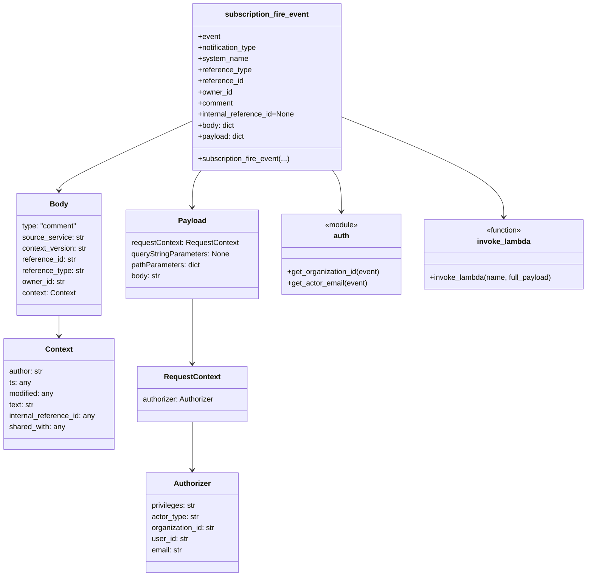

# Diagram: common/comment_service/comment_service/utils.py


> Auto-generated by Obscura crawlers

## Diagram 1

```mermaid
flowchart LR
    A[subscription_fire_event(event, notification_type, system_name, reference_type, reference_id, owner_id, comment, internal_reference_id=None)] --> B[Build body dict]
    B --> C{body keys}
    C --> C1[type: "comment"]
    C --> C2[source_service: system_name]
    C --> C3[context_version: notification_type]
    C --> C4[reference_id, reference_type, owner_id]
    C --> C5[context: author, ts, modified, text, internal_reference_id, shared_with]
    A --> D[Build payload dict]
    D --> D1[requestContext.authorizer: privileges, actor_type]
    D1 --> D2[organization_id: auth.get_organization_id(event)]
    D1 --> D3[user_id: event.requestContext.authorizer.user_id]
    D1 --> D4[email: auth.get_actor_email(event)]
    D --> D5[queryStringParameters: None]
    D --> D6[pathParameters: {}]
    D --> D7[body: json.dumps(body)]
    A --> E[Try invoke_lambda("send_event_to_subscribers", full_payload=payload)]
    E --> F{invoke_lambda raises?}
    F -->|no| G[Return invoke_lambda result]
    F -->|yes| H[Except Exception -> TODO: log -> return None]
```

> SVG rendering failed for this diagram.

## Diagram 2



### SVG

<svg id="container" width="1280.16796875" xmlns="http://www.w3.org/2000/svg" class="classDiagram" height="1246" viewBox="0 0 1280.16796875 1246" role="graphics-document document" aria-roledescription="class"><style>#container{font-family:"trebuchet ms",verdana,arial,sans-serif;font-size:16px;fill:#333;}@keyframes edge-animation-frame{from{stroke-dashoffset:0;}}@keyframes dash{to{stroke-dashoffset:0;}}#container .edge-animation-slow{stroke-dasharray:9,5!important;stroke-dashoffset:900;animation:dash 50s linear infinite;stroke-linecap:round;}#container .edge-animation-fast{stroke-dasharray:9,5!important;stroke-dashoffset:900;animation:dash 20s linear infinite;stroke-linecap:round;}#container .error-icon{fill:#552222;}#container .error-text{fill:#552222;stroke:#552222;}#container .edge-thickness-normal{stroke-width:1px;}#container .edge-thickness-thick{stroke-width:3.5px;}#container .edge-pattern-solid{stroke-dasharray:0;}#container .edge-thickness-invisible{stroke-width:0;fill:none;}#container .edge-pattern-dashed{stroke-dasharray:3;}#container .edge-pattern-dotted{stroke-dasharray:2;}#container .marker{fill:#333333;stroke:#333333;}#container .marker.cross{stroke:#333333;}#container svg{font-family:"trebuchet ms",verdana,arial,sans-serif;font-size:16px;}#container p{margin:0;}#container g.classGroup text{fill:#9370DB;stroke:none;font-family:"trebuchet ms",verdana,arial,sans-serif;font-size:10px;}#container g.classGroup text .title{font-weight:bolder;}#container .nodeLabel,#container .edgeLabel{color:#131300;}#container .edgeLabel .label rect{fill:#ECECFF;}#container .label text{fill:#131300;}#container .labelBkg{background:#ECECFF;}#container .edgeLabel .label span{background:#ECECFF;}#container .classTitle{font-weight:bolder;}#container .node rect,#container .node circle,#container .node ellipse,#container .node polygon,#container .node path{fill:#ECECFF;stroke:#9370DB;stroke-width:1px;}#container .divider{stroke:#9370DB;stroke-width:1;}#container g.clickable{cursor:pointer;}#container g.classGroup rect{fill:#ECECFF;stroke:#9370DB;}#container g.classGroup line{stroke:#9370DB;stroke-width:1;}#container .classLabel .box{stroke:none;stroke-width:0;fill:#ECECFF;opacity:0.5;}#container .classLabel .label{fill:#9370DB;font-size:10px;}#container .relation{stroke:#333333;stroke-width:1;fill:none;}#container .dashed-line{stroke-dasharray:3;}#container .dotted-line{stroke-dasharray:1 2;}#container #compositionStart,#container .composition{fill:#333333!important;stroke:#333333!important;stroke-width:1;}#container #compositionEnd,#container .composition{fill:#333333!important;stroke:#333333!important;stroke-width:1;}#container #dependencyStart,#container .dependency{fill:#333333!important;stroke:#333333!important;stroke-width:1;}#container #dependencyStart,#container .dependency{fill:#333333!important;stroke:#333333!important;stroke-width:1;}#container #extensionStart,#container .extension{fill:transparent!important;stroke:#333333!important;stroke-width:1;}#container #extensionEnd,#container .extension{fill:transparent!important;stroke:#333333!important;stroke-width:1;}#container #aggregationStart,#container .aggregation{fill:transparent!important;stroke:#333333!important;stroke-width:1;}#container #aggregationEnd,#container .aggregation{fill:transparent!important;stroke:#333333!important;stroke-width:1;}#container #lollipopStart,#container .lollipop{fill:#ECECFF!important;stroke:#333333!important;stroke-width:1;}#container #lollipopEnd,#container .lollipop{fill:#ECECFF!important;stroke:#333333!important;stroke-width:1;}#container .edgeTerminals{font-size:11px;line-height:initial;}#container .classTitleText{text-anchor:middle;font-size:18px;fill:#333;}#container .label-icon{display:inline-block;height:1em;overflow:visible;vertical-align:-0.125em;}#container .node .label-icon path{fill:currentColor;stroke:revert;stroke-width:revert;}#container :root{--mermaid-font-family:"trebuchet ms",verdana,arial,sans-serif;}</style><g><defs><marker id="container_class-aggregationStart" class="marker aggregation class" refX="18" refY="7" markerWidth="190" markerHeight="240" orient="auto"><path d="M 18,7 L9,13 L1,7 L9,1 Z"></path></marker></defs><defs><marker id="container_class-aggregationEnd" class="marker aggregation class" refX="1" refY="7" markerWidth="20" markerHeight="28" orient="auto"><path d="M 18,7 L9,13 L1,7 L9,1 Z"></path></marker></defs><defs><marker id="container_class-extensionStart" class="marker extension class" refX="18" refY="7" markerWidth="190" markerHeight="240" orient="auto"><path d="M 1,7 L18,13 V 1 Z"></path></marker></defs><defs><marker id="container_class-extensionEnd" class="marker extension class" refX="1" refY="7" markerWidth="20" markerHeight="28" orient="auto"><path d="M 1,1 V 13 L18,7 Z"></path></marker></defs><defs><marker id="container_class-compositionStart" class="marker composition class" refX="18" refY="7" markerWidth="190" markerHeight="240" orient="auto"><path d="M 18,7 L9,13 L1,7 L9,1 Z"></path></marker></defs><defs><marker id="container_class-compositionEnd" class="marker composition class" refX="1" refY="7" markerWidth="20" markerHeight="28" orient="auto"><path d="M 18,7 L9,13 L1,7 L9,1 Z"></path></marker></defs><defs><marker id="container_class-dependencyStart" class="marker dependency class" refX="6" refY="7" markerWidth="190" markerHeight="240" orient="auto"><path d="M 5,7 L9,13 L1,7 L9,1 Z"></path></marker></defs><defs><marker id="container_class-dependencyEnd" class="marker dependency class" refX="13" refY="7" markerWidth="20" markerHeight="28" orient="auto"><path d="M 18,7 L9,13 L14,7 L9,1 Z"></path></marker></defs><defs><marker id="container_class-lollipopStart" class="marker lollipop class" refX="13" refY="7" markerWidth="190" markerHeight="240" orient="auto"><circle stroke="black" fill="transparent" cx="7" cy="7" r="6"></circle></marker></defs><defs><marker id="container_class-lollipopEnd" class="marker lollipop class" refX="1" refY="7" markerWidth="190" markerHeight="240" orient="auto"><circle stroke="black" fill="transparent" cx="7" cy="7" r="6"></circle></marker></defs><g class="root"><g class="clusters"></g><g class="edgePaths"><path d="M421.924,260.412L373.071,282.51C324.217,304.608,226.511,348.804,177.658,374.069C128.805,399.333,128.805,405.667,128.805,408.833L128.805,412" id="id_subscription_fire_event_Body_1" class="edge-thickness-normal edge-pattern-solid relation" style=";;;" data-edge="true" data-et="edge" data-id="id_subscription_fire_event_Body_1" data-points="W3sieCI6NDIxLjkyMzgyODEyNSwieSI6MjYwLjQxMjI4OTIwNzUxMDc1fSx7IngiOjEyOC44MDQ2ODc1LCJ5IjozOTN9LHsieCI6MTI4LjgwNDY4NzUsInkiOjQxOH1d" marker-end="url(#container_class-dependencyEnd)"></path><path d="M128.805,682L128.805,686.167C128.805,690.333,128.805,698.667,128.805,706C128.805,713.333,128.805,719.667,128.805,722.833L128.805,726" id="id_Body_Context_2" class="edge-thickness-normal edge-pattern-solid relation" style=";;;" data-edge="true" data-et="edge" data-id="id_Body_Context_2" data-points="W3sieCI6MTI4LjgwNDY4NzUsInkiOjY4Mn0seyJ4IjoxMjguODA0Njg3NSwieSI6NzA3fSx7IngiOjEyOC44MDQ2ODc1LCJ5Ijo3MzJ9XQ==" marker-end="url(#container_class-dependencyEnd)"></path><path d="M439.774,368L436.482,372.167C433.189,376.333,426.605,384.667,423.312,398C420.02,411.333,420.02,429.667,420.02,438.833L420.02,448" id="id_subscription_fire_event_Payload_3" class="edge-thickness-normal edge-pattern-solid relation" style=";;;" data-edge="true" data-et="edge" data-id="id_subscription_fire_event_Payload_3" data-points="W3sieCI6NDM5Ljc3NDQzNzg4MTA5NzYsInkiOjM2OH0seyJ4Ijo0MjAuMDE5NTMxMjUsInkiOjM5M30seyJ4Ijo0MjAuMDE5NTMxMjUsInkiOjQ1NH1d" marker-end="url(#container_class-dependencyEnd)"></path><path d="M420.02,646L420.02,656.167C420.02,666.333,420.02,686.667,420.02,710C420.02,733.333,420.02,759.667,420.02,772.833L420.02,786" id="id_Payload_RequestContext_4" class="edge-thickness-normal edge-pattern-solid relation" style=";;;" data-edge="true" data-et="edge" data-id="id_Payload_RequestContext_4" data-points="W3sieCI6NDIwLjAxOTUzMTI1LCJ5Ijo2NDZ9LHsieCI6NDIwLjAxOTUzMTI1LCJ5Ijo3MDd9LHsieCI6NDIwLjAxOTUzMTI1LCJ5Ijo3OTJ9XQ==" marker-end="url(#container_class-dependencyEnd)"></path><path d="M420.02,912L420.02,926.167C420.02,940.333,420.02,968.667,420.02,986C420.02,1003.333,420.02,1009.667,420.02,1012.833L420.02,1016" id="id_RequestContext_Authorizer_5" class="edge-thickness-normal edge-pattern-solid relation" style=";;;" data-edge="true" data-et="edge" data-id="id_RequestContext_Authorizer_5" data-points="W3sieCI6NDIwLjAxOTUzMTI1LCJ5Ijo5MTJ9LHsieCI6NDIwLjAxOTUzMTI1LCJ5Ijo5OTd9LHsieCI6NDIwLjAxOTUzMTI1LCJ5IjoxMDIyfV0=" marker-end="url(#container_class-dependencyEnd)"></path><path d="M724.245,368L727.538,372.167C730.83,376.333,737.415,384.667,740.708,399.5C744,414.333,744,435.667,744,446.333L744,457" id="id_subscription_fire_event_auth_6" class="edge-thickness-normal edge-pattern-solid relation" style=";;;" data-edge="true" data-et="edge" data-id="id_subscription_fire_event_auth_6" data-points="W3sieCI6NzI0LjI0NTA5MzM2ODkwMjQsInkiOjM2OH0seyJ4Ijo3NDQsInkiOjM5M30seyJ4Ijo3NDQsInkiOjQ2M31d" marker-end="url(#container_class-dependencyEnd)"></path><path d="M742.096,251.51L801.536,275.092C860.977,298.674,979.857,345.837,1039.298,382.085C1098.738,418.333,1098.738,443.667,1098.738,456.333L1098.738,469" id="id_subscription_fire_event_invoke_lambda_7" class="edge-thickness-normal edge-pattern-solid relation" style=";;;" data-edge="true" data-et="edge" data-id="id_subscription_fire_event_invoke_lambda_7" data-points="W3sieCI6NzQyLjA5NTcwMzEyNSwieSI6MjUxLjUxMDM2NjA3MjYwOTc3fSx7IngiOjEwOTguNzM4MjgxMjUsInkiOjM5M30seyJ4IjoxMDk4LjczODI4MTI1LCJ5Ijo0NzV9XQ==" marker-end="url(#container_class-dependencyEnd)"></path></g><g class="edgeLabels"><g class="edgeLabel"><g class="label" data-id="id_subscription_fire_event_Body_1" transform="translate(0, 0)"><foreignObject width="0" height="0"><div xmlns="http://www.w3.org/1999/xhtml" class="labelBkg" style="display: table-cell; white-space: nowrap; line-height: 1.5; max-width: 200px; text-align: center;"><span class="edgeLabel"></span></div></foreignObject></g></g><g class="edgeLabel"><g class="label" data-id="id_Body_Context_2" transform="translate(0, 0)"><foreignObject width="0" height="0"><div xmlns="http://www.w3.org/1999/xhtml" class="labelBkg" style="display: table-cell; white-space: nowrap; line-height: 1.5; max-width: 200px; text-align: center;"><span class="edgeLabel"></span></div></foreignObject></g></g><g class="edgeLabel"><g class="label" data-id="id_subscription_fire_event_Payload_3" transform="translate(0, 0)"><foreignObject width="0" height="0"><div xmlns="http://www.w3.org/1999/xhtml" class="labelBkg" style="display: table-cell; white-space: nowrap; line-height: 1.5; max-width: 200px; text-align: center;"><span class="edgeLabel"></span></div></foreignObject></g></g><g class="edgeLabel"><g class="label" data-id="id_Payload_RequestContext_4" transform="translate(0, 0)"><foreignObject width="0" height="0"><div xmlns="http://www.w3.org/1999/xhtml" class="labelBkg" style="display: table-cell; white-space: nowrap; line-height: 1.5; max-width: 200px; text-align: center;"><span class="edgeLabel"></span></div></foreignObject></g></g><g class="edgeLabel"><g class="label" data-id="id_RequestContext_Authorizer_5" transform="translate(0, 0)"><foreignObject width="0" height="0"><div xmlns="http://www.w3.org/1999/xhtml" class="labelBkg" style="display: table-cell; white-space: nowrap; line-height: 1.5; max-width: 200px; text-align: center;"><span class="edgeLabel"></span></div></foreignObject></g></g><g class="edgeLabel"><g class="label" data-id="id_subscription_fire_event_auth_6" transform="translate(0, 0)"><foreignObject width="0" height="0"><div xmlns="http://www.w3.org/1999/xhtml" class="labelBkg" style="display: table-cell; white-space: nowrap; line-height: 1.5; max-width: 200px; text-align: center;"><span class="edgeLabel"></span></div></foreignObject></g></g><g class="edgeLabel"><g class="label" data-id="id_subscription_fire_event_invoke_lambda_7" transform="translate(0, 0)"><foreignObject width="0" height="0"><div xmlns="http://www.w3.org/1999/xhtml" class="labelBkg" style="display: table-cell; white-space: nowrap; line-height: 1.5; max-width: 200px; text-align: center;"><span class="edgeLabel"></span></div></foreignObject></g></g></g><g class="nodes"><g class="node default" id="classId-subscription_fire_event-0" transform="translate(582.009765625, 188)"><g class="basic label-container"><path d="M-160.0859375 -180 L160.0859375 -180 L160.0859375 180 L-160.0859375 180" stroke="none" stroke-width="0" fill="#ECECFF" style=""></path><path d="M-160.0859375 -180 C-48.11611964575958 -180, 63.853698208480836 -180, 160.0859375 -180 M-160.0859375 -180 C-55.04186952842906 -180, 50.00219844314188 -180, 160.0859375 -180 M160.0859375 -180 C160.0859375 -55.30495303197772, 160.0859375 69.39009393604456, 160.0859375 180 M160.0859375 -180 C160.0859375 -37.424251012149114, 160.0859375 105.15149797570177, 160.0859375 180 M160.0859375 180 C70.4337186081051 180, -19.21850028378981 180, -160.0859375 180 M160.0859375 180 C46.03798847830488 180, -68.00996054339024 180, -160.0859375 180 M-160.0859375 180 C-160.0859375 37.68110697339421, -160.0859375 -104.63778605321158, -160.0859375 -180 M-160.0859375 180 C-160.0859375 75.75703812411884, -160.0859375 -28.48592375176233, -160.0859375 -180" stroke="#9370DB" stroke-width="1.3" fill="none" stroke-dasharray="0 0" style=""></path></g><g class="annotation-group text" transform="translate(0, -156)"></g><g class="label-group text" transform="translate(-86.3125, -156)"><g class="label" style="font-weight: bolder" transform="translate(0,-12)"><foreignObject width="172.625" height="24"><div xmlns="http://www.w3.org/1999/xhtml" style="display: table-cell; white-space: nowrap; line-height: 1.5; max-width: 220px; text-align: center;"><span class="nodeLabel markdown-node-label" style=""><p>subscription_fire_event</p></span></div></foreignObject></g></g><g class="members-group text" transform="translate(-148.0859375, -108)"><g class="label" style="" transform="translate(0,-12)"><foreignObject width="48.328125" height="24"><div xmlns="http://www.w3.org/1999/xhtml" style="display: table-cell; white-space: nowrap; line-height: 1.5; max-width: 106px; text-align: center;"><span class="nodeLabel markdown-node-label" style=""><p>+event</p></span></div></foreignObject></g><g class="label" style="" transform="translate(0,12)"><foreignObject width="131.1875" height="24"><div xmlns="http://www.w3.org/1999/xhtml" style="display: table-cell; white-space: nowrap; line-height: 1.5; max-width: 189px; text-align: center;"><span class="nodeLabel markdown-node-label" style=""><p>+notification_type</p></span></div></foreignObject></g><g class="label" style="" transform="translate(0,36)"><foreignObject width="107.21875" height="24"><div xmlns="http://www.w3.org/1999/xhtml" style="display: table-cell; white-space: nowrap; line-height: 1.5; max-width: 165px; text-align: center;"><span class="nodeLabel markdown-node-label" style=""><p>+system_name</p></span></div></foreignObject></g><g class="label" style="" transform="translate(0,60)"><foreignObject width="115.640625" height="24"><div xmlns="http://www.w3.org/1999/xhtml" style="display: table-cell; white-space: nowrap; line-height: 1.5; max-width: 173px; text-align: center;"><span class="nodeLabel markdown-node-label" style=""><p>+reference_type</p></span></div></foreignObject></g><g class="label" style="" transform="translate(0,84)"><foreignObject width="98.25" height="24"><div xmlns="http://www.w3.org/1999/xhtml" style="display: table-cell; white-space: nowrap; line-height: 1.5; max-width: 156px; text-align: center;"><span class="nodeLabel markdown-node-label" style=""><p>+reference_id</p></span></div></foreignObject></g><g class="label" style="" transform="translate(0,108)"><foreignObject width="74.203125" height="24"><div xmlns="http://www.w3.org/1999/xhtml" style="display: table-cell; white-space: nowrap; line-height: 1.5; max-width: 132px; text-align: center;"><span class="nodeLabel markdown-node-label" style=""><p>+owner_id</p></span></div></foreignObject></g><g class="label" style="" transform="translate(0,132)"><foreignObject width="75.953125" height="24"><div xmlns="http://www.w3.org/1999/xhtml" style="display: table-cell; white-space: nowrap; line-height: 1.5; max-width: 134px; text-align: center;"><span class="nodeLabel markdown-node-label" style=""><p>+comment</p></span></div></foreignObject></g><g class="label" style="" transform="translate(0,156)"><foreignObject width="209.859375" height="24"><div xmlns="http://www.w3.org/1999/xhtml" style="display: table-cell; white-space: nowrap; line-height: 1.5; max-width: 267px; text-align: center;"><span class="nodeLabel markdown-node-label" style=""><p>+internal_reference_id=None</p></span></div></foreignObject></g><g class="label" style="" transform="translate(0,180)"><foreignObject width="79.921875" height="24"><div xmlns="http://www.w3.org/1999/xhtml" style="display: table-cell; white-space: nowrap; line-height: 1.5; max-width: 138px; text-align: center;"><span class="nodeLabel markdown-node-label" style=""><p>+body: dict</p></span></div></foreignObject></g><g class="label" style="" transform="translate(0,204)"><foreignObject width="101.3125" height="24"><div xmlns="http://www.w3.org/1999/xhtml" style="display: table-cell; white-space: nowrap; line-height: 1.5; max-width: 159px; text-align: center;"><span class="nodeLabel markdown-node-label" style=""><p>+payload: dict</p></span></div></foreignObject></g></g><g class="methods-group text" transform="translate(-148.0859375, 156)"><g class="label" style="" transform="translate(0,-12)"><foreignObject width="200.125" height="24"><div xmlns="http://www.w3.org/1999/xhtml" style="display: table-cell; white-space: nowrap; line-height: 1.5; max-width: 257px; text-align: center;"><span class="nodeLabel markdown-node-label" style=""><p>+subscription_fire_event(...)</p></span></div></foreignObject></g></g><g class="divider" style=""><path d="M-160.0859375 -132 C-74.63967271727273 -132, 10.806592065454538 -132, 160.0859375 -132 M-160.0859375 -132 C-83.83957437975023 -132, -7.593211259500464 -132, 160.0859375 -132" stroke="#9370DB" stroke-width="1.3" fill="none" stroke-dasharray="0 0" style=""></path></g><g class="divider" style=""><path d="M-160.0859375 132 C-68.75956509853695 132, 22.566807302926094 132, 160.0859375 132 M-160.0859375 132 C-41.32237658908022 132, 77.44118432183956 132, 160.0859375 132" stroke="#9370DB" stroke-width="1.3" fill="none" stroke-dasharray="0 0" style=""></path></g></g><g class="node default" id="classId-Body-1" transform="translate(128.8046875, 550)"><g class="basic label-container"><path d="M-92.38671875 -132 L92.38671875 -132 L92.38671875 132 L-92.38671875 132" stroke="none" stroke-width="0" fill="#ECECFF" style=""></path><path d="M-92.38671875 -132 C-26.937784385308802 -132, 38.511149979382395 -132, 92.38671875 -132 M-92.38671875 -132 C-31.646334696083457 -132, 29.094049357833086 -132, 92.38671875 -132 M92.38671875 -132 C92.38671875 -56.10121028023582, 92.38671875 19.797579439528363, 92.38671875 132 M92.38671875 -132 C92.38671875 -74.69101227512884, 92.38671875 -17.382024550257682, 92.38671875 132 M92.38671875 132 C43.28168631746094 132, -5.823346115078124 132, -92.38671875 132 M92.38671875 132 C27.620094805299487 132, -37.146529139401025 132, -92.38671875 132 M-92.38671875 132 C-92.38671875 76.82417567883947, -92.38671875 21.648351357678933, -92.38671875 -132 M-92.38671875 132 C-92.38671875 62.82599894463955, -92.38671875 -6.348002110720898, -92.38671875 -132" stroke="#9370DB" stroke-width="1.3" fill="none" stroke-dasharray="0 0" style=""></path></g><g class="annotation-group text" transform="translate(0, -108)"></g><g class="label-group text" transform="translate(-18.5546875, -108)"><g class="label" style="font-weight: bolder" transform="translate(0,-12)"><foreignObject width="37.109375" height="24"><div xmlns="http://www.w3.org/1999/xhtml" style="display: table-cell; white-space: nowrap; line-height: 1.5; max-width: 87px; text-align: center;"><span class="nodeLabel markdown-node-label" style=""><p>Body</p></span></div></foreignObject></g></g><g class="members-group text" transform="translate(-80.38671875, -60)"><g class="label" style="" transform="translate(0,-12)"><foreignObject width="120.21875" height="24"><div xmlns="http://www.w3.org/1999/xhtml" style="display: table-cell; white-space: nowrap; line-height: 1.5; max-width: 170px; text-align: center;"><span class="nodeLabel markdown-node-label" style=""><p>type: "comment"</p></span></div></foreignObject></g><g class="label" style="" transform="translate(0,12)"><foreignObject width="134.1875" height="24"><div xmlns="http://www.w3.org/1999/xhtml" style="display: table-cell; white-space: nowrap; line-height: 1.5; max-width: 185px; text-align: center;"><span class="nodeLabel markdown-node-label" style=""><p>source_service: str</p></span></div></foreignObject></g><g class="label" style="" transform="translate(0,36)"><foreignObject width="142.21875" height="24"><div xmlns="http://www.w3.org/1999/xhtml" style="display: table-cell; white-space: nowrap; line-height: 1.5; max-width: 193px; text-align: center;"><span class="nodeLabel markdown-node-label" style=""><p>context_version: str</p></span></div></foreignObject></g><g class="label" style="" transform="translate(0,60)"><foreignObject width="117.765625" height="24"><div xmlns="http://www.w3.org/1999/xhtml" style="display: table-cell; white-space: nowrap; line-height: 1.5; max-width: 169px; text-align: center;"><span class="nodeLabel markdown-node-label" style=""><p>reference_id: str</p></span></div></foreignObject></g><g class="label" style="" transform="translate(0,84)"><foreignObject width="135.15625" height="24"><div xmlns="http://www.w3.org/1999/xhtml" style="display: table-cell; white-space: nowrap; line-height: 1.5; max-width: 186px; text-align: center;"><span class="nodeLabel markdown-node-label" style=""><p>reference_type: str</p></span></div></foreignObject></g><g class="label" style="" transform="translate(0,108)"><foreignObject width="93.71875" height="24"><div xmlns="http://www.w3.org/1999/xhtml" style="display: table-cell; white-space: nowrap; line-height: 1.5; max-width: 145px; text-align: center;"><span class="nodeLabel markdown-node-label" style=""><p>owner_id: str</p></span></div></foreignObject></g><g class="label" style="" transform="translate(0,132)"><foreignObject width="116.859375" height="24"><div xmlns="http://www.w3.org/1999/xhtml" style="display: table-cell; white-space: nowrap; line-height: 1.5; max-width: 167px; text-align: center;"><span class="nodeLabel markdown-node-label" style=""><p>context: Context</p></span></div></foreignObject></g></g><g class="methods-group text" transform="translate(-80.38671875, 132)"></g><g class="divider" style=""><path d="M-92.38671875 -84 C-19.100841953675825 -84, 54.18503484264835 -84, 92.38671875 -84 M-92.38671875 -84 C-27.75707386282332 -84, 36.87257102435336 -84, 92.38671875 -84" stroke="#9370DB" stroke-width="1.3" fill="none" stroke-dasharray="0 0" style=""></path></g><g class="divider" style=""><path d="M-92.38671875 108 C-44.46131588936009 108, 3.4640869712798263 108, 92.38671875 108 M-92.38671875 108 C-41.12783668238886 108, 10.13104538522228 108, 92.38671875 108" stroke="#9370DB" stroke-width="1.3" fill="none" stroke-dasharray="0 0" style=""></path></g></g><g class="node default" id="classId-Context-2" transform="translate(128.8046875, 852)"><g class="basic label-container"><path d="M-120.8046875 -120 L120.8046875 -120 L120.8046875 120 L-120.8046875 120" stroke="none" stroke-width="0" fill="#ECECFF" style=""></path><path d="M-120.8046875 -120 C-43.78701757833646 -120, 33.23065234332708 -120, 120.8046875 -120 M-120.8046875 -120 C-67.12757042587639 -120, -13.45045335175277 -120, 120.8046875 -120 M120.8046875 -120 C120.8046875 -54.039905703504644, 120.8046875 11.920188592990712, 120.8046875 120 M120.8046875 -120 C120.8046875 -43.03076779417715, 120.8046875 33.9384644116457, 120.8046875 120 M120.8046875 120 C24.53824756733728 120, -71.72819236532544 120, -120.8046875 120 M120.8046875 120 C43.62076997382589 120, -33.56314755234823 120, -120.8046875 120 M-120.8046875 120 C-120.8046875 61.69416657929624, -120.8046875 3.3883331585924736, -120.8046875 -120 M-120.8046875 120 C-120.8046875 32.92954290158879, -120.8046875 -54.14091419682242, -120.8046875 -120" stroke="#9370DB" stroke-width="1.3" fill="none" stroke-dasharray="0 0" style=""></path></g><g class="annotation-group text" transform="translate(0, -96)"></g><g class="label-group text" transform="translate(-28.171875, -96)"><g class="label" style="font-weight: bolder" transform="translate(0,-12)"><foreignObject width="56.34375" height="24"><div xmlns="http://www.w3.org/1999/xhtml" style="display: table-cell; white-space: nowrap; line-height: 1.5; max-width: 105px; text-align: center;"><span class="nodeLabel markdown-node-label" style=""><p>Context</p></span></div></foreignObject></g></g><g class="members-group text" transform="translate(-108.8046875, -48)"><g class="label" style="" transform="translate(0,-12)"><foreignObject width="76.359375" height="24"><div xmlns="http://www.w3.org/1999/xhtml" style="display: table-cell; white-space: nowrap; line-height: 1.5; max-width: 127px; text-align: center;"><span class="nodeLabel markdown-node-label" style=""><p>author: str</p></span></div></foreignObject></g><g class="label" style="" transform="translate(0,12)"><foreignObject width="47.171875" height="24"><div xmlns="http://www.w3.org/1999/xhtml" style="display: table-cell; white-space: nowrap; line-height: 1.5; max-width: 97px; text-align: center;"><span class="nodeLabel markdown-node-label" style=""><p>ts: any</p></span></div></foreignObject></g><g class="label" style="" transform="translate(0,36)"><foreignObject width="98.546875" height="24"><div xmlns="http://www.w3.org/1999/xhtml" style="display: table-cell; white-space: nowrap; line-height: 1.5; max-width: 149px; text-align: center;"><span class="nodeLabel markdown-node-label" style=""><p>modified: any</p></span></div></foreignObject></g><g class="label" style="" transform="translate(0,60)"><foreignObject width="55.21875" height="24"><div xmlns="http://www.w3.org/1999/xhtml" style="display: table-cell; white-space: nowrap; line-height: 1.5; max-width: 106px; text-align: center;"><span class="nodeLabel markdown-node-label" style=""><p>text: str</p></span></div></foreignObject></g><g class="label" style="" transform="translate(0,84)"><foreignObject width="189.4375" height="24"><div xmlns="http://www.w3.org/1999/xhtml" style="display: table-cell; white-space: nowrap; line-height: 1.5; max-width: 240px; text-align: center;"><span class="nodeLabel markdown-node-label" style=""><p>internal_reference_id: any</p></span></div></foreignObject></g><g class="label" style="" transform="translate(0,108)"><foreignObject width="122.59375" height="24"><div xmlns="http://www.w3.org/1999/xhtml" style="display: table-cell; white-space: nowrap; line-height: 1.5; max-width: 173px; text-align: center;"><span class="nodeLabel markdown-node-label" style=""><p>shared_with: any</p></span></div></foreignObject></g></g><g class="methods-group text" transform="translate(-108.8046875, 120)"></g><g class="divider" style=""><path d="M-120.8046875 -72 C-30.212713053901766 -72, 60.37926139219647 -72, 120.8046875 -72 M-120.8046875 -72 C-45.135352832210685 -72, 30.53398183557863 -72, 120.8046875 -72" stroke="#9370DB" stroke-width="1.3" fill="none" stroke-dasharray="0 0" style=""></path></g><g class="divider" style=""><path d="M-120.8046875 96 C-37.197329651742365 96, 46.41002819651527 96, 120.8046875 96 M-120.8046875 96 C-44.45129157191698 96, 31.902104356166035 96, 120.8046875 96" stroke="#9370DB" stroke-width="1.3" fill="none" stroke-dasharray="0 0" style=""></path></g></g><g class="node default" id="classId-Payload-3" transform="translate(420.01953125, 550)"><g class="basic label-container"><path d="M-142.671875 -96 L142.671875 -96 L142.671875 96 L-142.671875 96" stroke="none" stroke-width="0" fill="#ECECFF" style=""></path><path d="M-142.671875 -96 C-43.286801069874926 -96, 56.09827286025015 -96, 142.671875 -96 M-142.671875 -96 C-84.90960868930955 -96, -27.147342378619115 -96, 142.671875 -96 M142.671875 -96 C142.671875 -22.226667217066918, 142.671875 51.546665565866164, 142.671875 96 M142.671875 -96 C142.671875 -29.25253871461534, 142.671875 37.49492257076932, 142.671875 96 M142.671875 96 C40.56714657247383 96, -61.53758185505234 96, -142.671875 96 M142.671875 96 C48.38783944473869 96, -45.896196110522624 96, -142.671875 96 M-142.671875 96 C-142.671875 39.466074098491305, -142.671875 -17.06785180301739, -142.671875 -96 M-142.671875 96 C-142.671875 48.135981840410935, -142.671875 0.2719636808218695, -142.671875 -96" stroke="#9370DB" stroke-width="1.3" fill="none" stroke-dasharray="0 0" style=""></path></g><g class="annotation-group text" transform="translate(0, -72)"></g><g class="label-group text" transform="translate(-28.90625, -72)"><g class="label" style="font-weight: bolder" transform="translate(0,-12)"><foreignObject width="57.8125" height="24"><div xmlns="http://www.w3.org/1999/xhtml" style="display: table-cell; white-space: nowrap; line-height: 1.5; max-width: 107px; text-align: center;"><span class="nodeLabel markdown-node-label" style=""><p>Payload</p></span></div></foreignObject></g></g><g class="members-group text" transform="translate(-130.671875, -24)"><g class="label" style="" transform="translate(0,-12)"><foreignObject width="232.4375" height="24"><div xmlns="http://www.w3.org/1999/xhtml" style="display: table-cell; white-space: nowrap; line-height: 1.5; max-width: 283px; text-align: center;"><span class="nodeLabel markdown-node-label" style=""><p>requestContext: RequestContext</p></span></div></foreignObject></g><g class="label" style="" transform="translate(0,12)"><foreignObject width="212.515625" height="24"><div xmlns="http://www.w3.org/1999/xhtml" style="display: table-cell; white-space: nowrap; line-height: 1.5; max-width: 263px; text-align: center;"><span class="nodeLabel markdown-node-label" style=""><p>queryStringParameters: None</p></span></div></foreignObject></g><g class="label" style="" transform="translate(0,36)"><foreignObject width="150.328125" height="24"><div xmlns="http://www.w3.org/1999/xhtml" style="display: table-cell; white-space: nowrap; line-height: 1.5; max-width: 201px; text-align: center;"><span class="nodeLabel markdown-node-label" style=""><p>pathParameters: dict</p></span></div></foreignObject></g><g class="label" style="" transform="translate(0,60)"><foreignObject width="63.859375" height="24"><div xmlns="http://www.w3.org/1999/xhtml" style="display: table-cell; white-space: nowrap; line-height: 1.5; max-width: 115px; text-align: center;"><span class="nodeLabel markdown-node-label" style=""><p>body: str</p></span></div></foreignObject></g></g><g class="methods-group text" transform="translate(-130.671875, 96)"></g><g class="divider" style=""><path d="M-142.671875 -48 C-44.465144635709635 -48, 53.74158572858073 -48, 142.671875 -48 M-142.671875 -48 C-32.31703533797344 -48, 78.03780432405313 -48, 142.671875 -48" stroke="#9370DB" stroke-width="1.3" fill="none" stroke-dasharray="0 0" style=""></path></g><g class="divider" style=""><path d="M-142.671875 72 C-77.84620386014299 72, -13.020532720285985 72, 142.671875 72 M-142.671875 72 C-78.63355150713762 72, -14.59522801427525 72, 142.671875 72" stroke="#9370DB" stroke-width="1.3" fill="none" stroke-dasharray="0 0" style=""></path></g></g><g class="node default" id="classId-RequestContext-4" transform="translate(420.01953125, 852)"><g class="basic label-container"><path d="M-120.41015625 -60 L120.41015625 -60 L120.41015625 60 L-120.41015625 60" stroke="none" stroke-width="0" fill="#ECECFF" style=""></path><path d="M-120.41015625 -60 C-30.018950377133564 -60, 60.37225549573287 -60, 120.41015625 -60 M-120.41015625 -60 C-65.90998185836347 -60, -11.409807466726946 -60, 120.41015625 -60 M120.41015625 -60 C120.41015625 -17.66194599455376, 120.41015625 24.676108010892477, 120.41015625 60 M120.41015625 -60 C120.41015625 -13.108065350939484, 120.41015625 33.78386929812103, 120.41015625 60 M120.41015625 60 C67.7902369649151 60, 15.170317679830205 60, -120.41015625 60 M120.41015625 60 C27.83592061757463 60, -64.73831501485074 60, -120.41015625 60 M-120.41015625 60 C-120.41015625 27.773756965071946, -120.41015625 -4.452486069856107, -120.41015625 -60 M-120.41015625 60 C-120.41015625 16.76502603358899, -120.41015625 -26.469947932822024, -120.41015625 -60" stroke="#9370DB" stroke-width="1.3" fill="none" stroke-dasharray="0 0" style=""></path></g><g class="annotation-group text" transform="translate(0, -36)"></g><g class="label-group text" transform="translate(-58.1484375, -36)"><g class="label" style="font-weight: bolder" transform="translate(0,-12)"><foreignObject width="116.296875" height="24"><div xmlns="http://www.w3.org/1999/xhtml" style="display: table-cell; white-space: nowrap; line-height: 1.5; max-width: 164px; text-align: center;"><span class="nodeLabel markdown-node-label" style=""><p>RequestContext</p></span></div></foreignObject></g></g><g class="members-group text" transform="translate(-108.41015625, 12)"><g class="label" style="" transform="translate(0,-12)"><foreignObject width="158.671875" height="24"><div xmlns="http://www.w3.org/1999/xhtml" style="display: table-cell; white-space: nowrap; line-height: 1.5; max-width: 209px; text-align: center;"><span class="nodeLabel markdown-node-label" style=""><p>authorizer: Authorizer</p></span></div></foreignObject></g></g><g class="methods-group text" transform="translate(-108.41015625, 60)"></g><g class="divider" style=""><path d="M-120.41015625 -12 C-28.22333021551755 -12, 63.9634958189649 -12, 120.41015625 -12 M-120.41015625 -12 C-54.40389353126149 -12, 11.602369187477024 -12, 120.41015625 -12" stroke="#9370DB" stroke-width="1.3" fill="none" stroke-dasharray="0 0" style=""></path></g><g class="divider" style=""><path d="M-120.41015625 36 C-36.333968780054775 36, 47.74221868989045 36, 120.41015625 36 M-120.41015625 36 C-28.914419998798422 36, 62.581316252403155 36, 120.41015625 36" stroke="#9370DB" stroke-width="1.3" fill="none" stroke-dasharray="0 0" style=""></path></g></g><g class="node default" id="classId-Authorizer-5" transform="translate(420.01953125, 1130)"><g class="basic label-container"><path d="M-101.31640625 -108 L101.31640625 -108 L101.31640625 108 L-101.31640625 108" stroke="none" stroke-width="0" fill="#ECECFF" style=""></path><path d="M-101.31640625 -108 C-35.25589592402925 -108, 30.804614401941507 -108, 101.31640625 -108 M-101.31640625 -108 C-53.918388367217695 -108, -6.520370484435389 -108, 101.31640625 -108 M101.31640625 -108 C101.31640625 -59.10427553192253, 101.31640625 -10.208551063845064, 101.31640625 108 M101.31640625 -108 C101.31640625 -54.29103249677944, 101.31640625 -0.5820649935588733, 101.31640625 108 M101.31640625 108 C54.792092206398614 108, 8.267778162797228 108, -101.31640625 108 M101.31640625 108 C44.57743117926639 108, -12.161543891467218 108, -101.31640625 108 M-101.31640625 108 C-101.31640625 29.6292497810299, -101.31640625 -48.7415004379402, -101.31640625 -108 M-101.31640625 108 C-101.31640625 27.215513922108244, -101.31640625 -53.56897215578351, -101.31640625 -108" stroke="#9370DB" stroke-width="1.3" fill="none" stroke-dasharray="0 0" style=""></path></g><g class="annotation-group text" transform="translate(0, -84)"></g><g class="label-group text" transform="translate(-38.3671875, -84)"><g class="label" style="font-weight: bolder" transform="translate(0,-12)"><foreignObject width="76.734375" height="24"><div xmlns="http://www.w3.org/1999/xhtml" style="display: table-cell; white-space: nowrap; line-height: 1.5; max-width: 126px; text-align: center;"><span class="nodeLabel markdown-node-label" style=""><p>Authorizer</p></span></div></foreignObject></g></g><g class="members-group text" transform="translate(-89.31640625, -36)"><g class="label" style="" transform="translate(0,-12)"><foreignObject width="97.671875" height="24"><div xmlns="http://www.w3.org/1999/xhtml" style="display: table-cell; white-space: nowrap; line-height: 1.5; max-width: 148px; text-align: center;"><span class="nodeLabel markdown-node-label" style=""><p>privileges: str</p></span></div></foreignObject></g><g class="label" style="" transform="translate(0,12)"><foreignObject width="103.4375" height="24"><div xmlns="http://www.w3.org/1999/xhtml" style="display: table-cell; white-space: nowrap; line-height: 1.5; max-width: 154px; text-align: center;"><span class="nodeLabel markdown-node-label" style=""><p>actor_type: str</p></span></div></foreignObject></g><g class="label" style="" transform="translate(0,36)"><foreignObject width="140.265625" height="24"><div xmlns="http://www.w3.org/1999/xhtml" style="display: table-cell; white-space: nowrap; line-height: 1.5; max-width: 191px; text-align: center;"><span class="nodeLabel markdown-node-label" style=""><p>organization_id: str</p></span></div></foreignObject></g><g class="label" style="" transform="translate(0,60)"><foreignObject width="80.3125" height="24"><div xmlns="http://www.w3.org/1999/xhtml" style="display: table-cell; white-space: nowrap; line-height: 1.5; max-width: 131px; text-align: center;"><span class="nodeLabel markdown-node-label" style=""><p>user_id: str</p></span></div></foreignObject></g><g class="label" style="" transform="translate(0,84)"><foreignObject width="68.015625" height="24"><div xmlns="http://www.w3.org/1999/xhtml" style="display: table-cell; white-space: nowrap; line-height: 1.5; max-width: 119px; text-align: center;"><span class="nodeLabel markdown-node-label" style=""><p>email: str</p></span></div></foreignObject></g></g><g class="methods-group text" transform="translate(-89.31640625, 108)"></g><g class="divider" style=""><path d="M-101.31640625 -60 C-22.127114990776036 -60, 57.06217626844793 -60, 101.31640625 -60 M-101.31640625 -60 C-58.01547299430229 -60, -14.714539738604586 -60, 101.31640625 -60" stroke="#9370DB" stroke-width="1.3" fill="none" stroke-dasharray="0 0" style=""></path></g><g class="divider" style=""><path d="M-101.31640625 84 C-32.01160712159846 84, 37.29319200680308 84, 101.31640625 84 M-101.31640625 84 C-36.19426951912497 84, 28.927867211750055 84, 101.31640625 84" stroke="#9370DB" stroke-width="1.3" fill="none" stroke-dasharray="0 0" style=""></path></g></g><g class="node default" id="classId-auth-6" transform="translate(744, 550)"><g class="basic label-container"><path d="M-131.30859375 -87 L131.30859375 -87 L131.30859375 87 L-131.30859375 87" stroke="none" stroke-width="0" fill="#ECECFF" style=""></path><path d="M-131.30859375 -87 C-36.467955688236316 -87, 58.37268237352737 -87, 131.30859375 -87 M-131.30859375 -87 C-62.54549267146503 -87, 6.217608407069946 -87, 131.30859375 -87 M131.30859375 -87 C131.30859375 -44.804300309341386, 131.30859375 -2.6086006186827717, 131.30859375 87 M131.30859375 -87 C131.30859375 -20.901770957208228, 131.30859375 45.196458085583544, 131.30859375 87 M131.30859375 87 C56.63985575032588 87, -18.028882249348243 87, -131.30859375 87 M131.30859375 87 C49.307209551957925 87, -32.69417464608415 87, -131.30859375 87 M-131.30859375 87 C-131.30859375 38.12108710890159, -131.30859375 -10.757825782196818, -131.30859375 -87 M-131.30859375 87 C-131.30859375 41.12844534850491, -131.30859375 -4.743109302990177, -131.30859375 -87" stroke="#9370DB" stroke-width="1.3" fill="none" stroke-dasharray="0 0" style=""></path></g><g class="annotation-group text" transform="translate(-36.6015625, -63)"><g class="label" style="" transform="translate(0,-12)"><foreignObject width="73.203125" height="24"><div xmlns="http://www.w3.org/1999/xhtml" style="display: table-cell; white-space: nowrap; line-height: 1.5; max-width: 123px; text-align: center;"><span class="nodeLabel markdown-node-label" style=""><p>«module»</p></span></div></foreignObject></g></g><g class="label-group text" transform="translate(-16.6640625, -39)"><g class="label" style="font-weight: bolder" transform="translate(0,-12)"><foreignObject width="33.328125" height="24"><div xmlns="http://www.w3.org/1999/xhtml" style="display: table-cell; white-space: nowrap; line-height: 1.5; max-width: 83px; text-align: center;"><span class="nodeLabel markdown-node-label" style=""><p>auth</p></span></div></foreignObject></g></g><g class="members-group text" transform="translate(-119.30859375, 9)"></g><g class="methods-group text" transform="translate(-119.30859375, 39)"><g class="label" style="" transform="translate(0,-12)"><foreignObject width="202.015625" height="24"><div xmlns="http://www.w3.org/1999/xhtml" style="display: table-cell; white-space: nowrap; line-height: 1.5; max-width: 259px; text-align: center;"><span class="nodeLabel markdown-node-label" style=""><p>+get_organization_id(event)</p></span></div></foreignObject></g><g class="label" style="" transform="translate(0,12)"><foreignObject width="173.71875" height="24"><div xmlns="http://www.w3.org/1999/xhtml" style="display: table-cell; white-space: nowrap; line-height: 1.5; max-width: 231px; text-align: center;"><span class="nodeLabel markdown-node-label" style=""><p>+get_actor_email(event)</p></span></div></foreignObject></g></g><g class="divider" style=""><path d="M-131.30859375 -15 C-45.47786544558002 -15, 40.352862858839956 -15, 131.30859375 -15 M-131.30859375 -15 C-68.22316163757569 -15, -5.137729525151386 -15, 131.30859375 -15" stroke="#9370DB" stroke-width="1.3" fill="none" stroke-dasharray="0 0" style=""></path></g><g class="divider" style=""><path d="M-131.30859375 9 C-36.41128928622835 9, 58.486015177543294 9, 131.30859375 9 M-131.30859375 9 C-60.61781077806147 9, 10.072972193877064 9, 131.30859375 9" stroke="#9370DB" stroke-width="1.3" fill="none" stroke-dasharray="0 0" style=""></path></g></g><g class="node default" id="classId-invoke_lambda-7" transform="translate(1098.73828125, 550)"><g class="basic label-container"><path d="M-173.4296875 -75 L173.4296875 -75 L173.4296875 75 L-173.4296875 75" stroke="none" stroke-width="0" fill="#ECECFF" style=""></path><path d="M-173.4296875 -75 C-68.96092757918157 -75, 35.507832341636856 -75, 173.4296875 -75 M-173.4296875 -75 C-101.0422509848509 -75, -28.65481446970179 -75, 173.4296875 -75 M173.4296875 -75 C173.4296875 -38.81181272877507, 173.4296875 -2.6236254575501334, 173.4296875 75 M173.4296875 -75 C173.4296875 -44.097012430933546, 173.4296875 -13.194024861867085, 173.4296875 75 M173.4296875 75 C43.70515856504804 75, -86.01937036990392 75, -173.4296875 75 M173.4296875 75 C102.08081105632056 75, 30.731934612641112 75, -173.4296875 75 M-173.4296875 75 C-173.4296875 39.35892340137313, -173.4296875 3.7178468027462657, -173.4296875 -75 M-173.4296875 75 C-173.4296875 15.581853694606586, -173.4296875 -43.83629261078683, -173.4296875 -75" stroke="#9370DB" stroke-width="1.3" fill="none" stroke-dasharray="0 0" style=""></path></g><g class="annotation-group text" transform="translate(-39.484375, -51)"><g class="label" style="" transform="translate(0,-12)"><foreignObject width="78.96875" height="24"><div xmlns="http://www.w3.org/1999/xhtml" style="display: table-cell; white-space: nowrap; line-height: 1.5; max-width: 129px; text-align: center;"><span class="nodeLabel markdown-node-label" style=""><p>«function»</p></span></div></foreignObject></g></g><g class="label-group text" transform="translate(-55.625, -27)"><g class="label" style="font-weight: bolder" transform="translate(0,-12)"><foreignObject width="111.25" height="24"><div xmlns="http://www.w3.org/1999/xhtml" style="display: table-cell; white-space: nowrap; line-height: 1.5; max-width: 160px; text-align: center;"><span class="nodeLabel markdown-node-label" style=""><p>invoke_lambda</p></span></div></foreignObject></g></g><g class="members-group text" transform="translate(-161.4296875, 21)"></g><g class="methods-group text" transform="translate(-161.4296875, 51)"><g class="label" style="" transform="translate(0,-12)"><foreignObject width="267.234375" height="24"><div xmlns="http://www.w3.org/1999/xhtml" style="display: table-cell; white-space: nowrap; line-height: 1.5; max-width: 325px; text-align: center;"><span class="nodeLabel markdown-node-label" style=""><p>+invoke_lambda(name, full_payload)</p></span></div></foreignObject></g></g><g class="divider" style=""><path d="M-173.4296875 -3 C-83.28927403967523 -3, 6.851139420649531 -3, 173.4296875 -3 M-173.4296875 -3 C-88.34241566230027 -3, -3.2551438246005375 -3, 173.4296875 -3" stroke="#9370DB" stroke-width="1.3" fill="none" stroke-dasharray="0 0" style=""></path></g><g class="divider" style=""><path d="M-173.4296875 21 C-36.95697840315128 21, 99.51573069369744 21, 173.4296875 21 M-173.4296875 21 C-103.97655563199064 21, -34.52342376398127 21, 173.4296875 21" stroke="#9370DB" stroke-width="1.3" fill="none" stroke-dasharray="0 0" style=""></path></g></g></g></g></g></svg>
